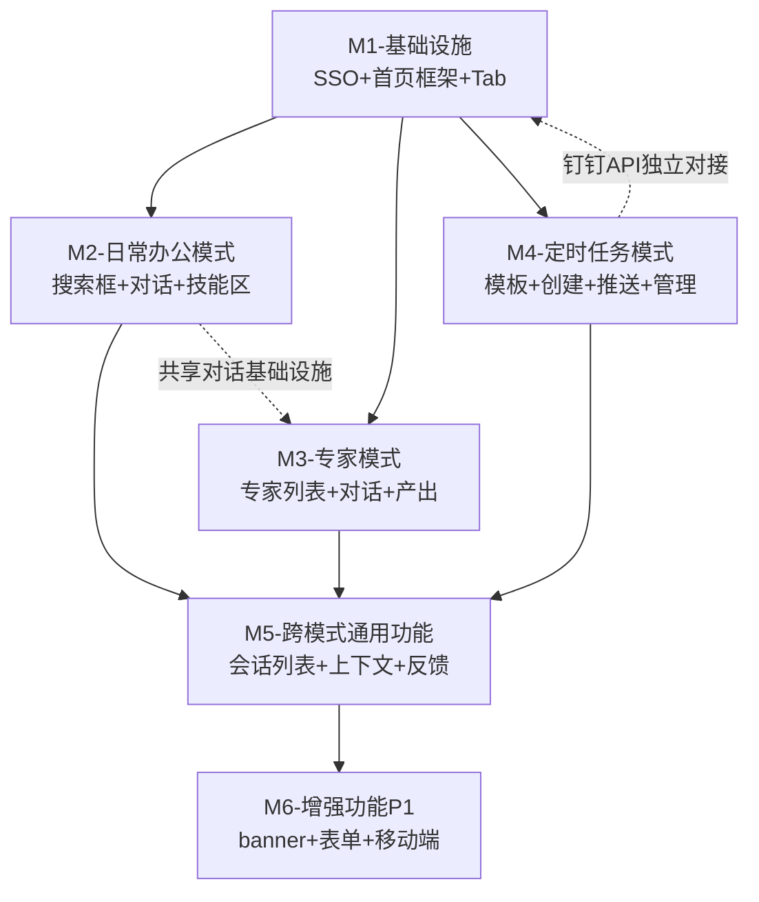
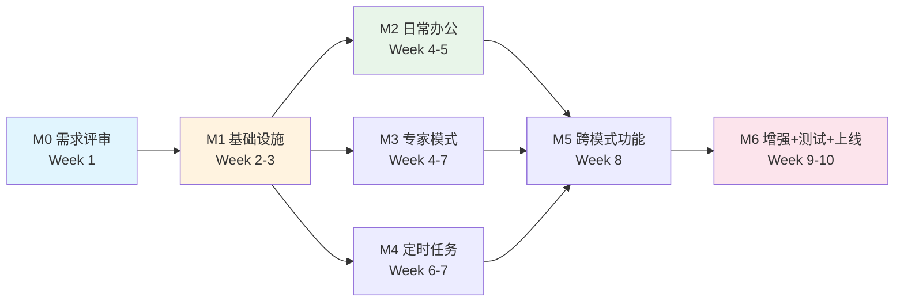

# MVP优先级与时间线评估：AI工作门户首页智能体

> **评估人**：析客（Specky），需求分析师  
> **日期**：2026-07-08  
> **依据**：《AI工作门户首页智能体（MVP）PRD》V1.0  
> **目的**：基于PRD功能模块，评估MVP各模块优先级、依赖关系和交付时间线，给出里程碑建议

---

## 一、功能模块分组与依赖分析

### 1.1 模块分组

将PRD中的28项P0功能和6项P1功能按逻辑内聚性分为6个交付模块：

| 模块 | 包含功能 | 模式 | P0功能数 | P1功能数 |
|------|---------|------|---------|---------|
| **M1-基础设施** | SSO认证、首页两栏布局、模式切换Tab | 通用 | 3 | 0 |
| **M2-日常办公模式** | 搜索框/任务输入区、常用技能区、推荐示例区、日常办公对话、快捷任务入口 | 日常办公 | 5 | 0 |
| **M3-专家模式** | 专家列表展示、专家框架（可扩展）、写作助手专家、会议纪要专家、专家选择与切换、产出复制/导出、粘贴文本作为上下文 | 专家 | 7 | 0 |
| **M4-定时任务模式** | 任务模板（3个）、任务创建流程、钉钉推送、我的任务列表、任务取消/暂停、下次执行时间预览 | 定时任务 | 6 | 0 |
| **M5-跨模式通用功能** | 最近会话/任务列表、会话上下文管理、反馈入口（点赞/点踩） | 通用 | 3 | 0 |
| **M6-增强功能（P1）** | 今日推荐banner、反馈表单、移动端适配、历史产出查看、点踩反馈选项 | 通用/定时任务 | 0 | 5 |

### 1.2 依赖关系图



### 1.3 依赖分析结论

1. **M1是所有模块的前置依赖**：SSO认证和首页框架必须最先完成
2. **M2/M3/M4可并行开发**：三个模式在M1完成后可并行推进，M2和M3共享对话交互基础设施（流式回答、消息操作、上下文管理）
3. **M5依赖三个模式完成**：跨模式功能（会话列表、反馈）需要三个模式基本可用后才能集成
4. **M6为增强功能**：在P0功能完成后迭代，不影响MVP核心闭环
5. **M4的钉钉推送可独立对接**：钉钉API对接可与前端开发并行

---

## 二、优先级评估

### 2.1 优先级评估维度

| 维度 | 权重 | 说明 |
|------|------|------|
| **闭环必要性** | 35% | 该功能是否为某模式最小闭环的必需环节 |
| **用户价值** | 25% | 该功能对用户的核心价值大小 |
| **技术风险** | 20% | 实现复杂度和不确定性 |
| **依赖阻塞度** | 20% | 该功能是否阻塞其他功能开发 |

### 2.2 模块优先级排序

| 排序 | 模块 | 综合优先级 | 理由 |
|------|------|-----------|------|
| 1 | **M1-基础设施** | ★★★★★ | 所有功能的前置依赖，必须最先完成 |
| 2 | **M2-日常办公模式** | ★★★★★ | 用户基数最大（预期占比60-70%），是门户的"流量入口"，闭环最简单 |
| 3 | **M3-专家模式** | ★★★★☆ | 验证专家模式价值，框架设计影响后续扩展，与M2共享对话基础设施 |
| 4 | **M4-定时任务模式** | ★★★★☆ | 验证自动化闭环，钉钉推送是独立技术对接，可与M2/M3并行 |
| 5 | **M5-跨模式通用功能** | ★★★☆☆ | 依赖三个模式完成，是体验增强而非闭环必需 |
| 6 | **M6-增强功能P1** | ★★☆☆☆ | 非核心闭环功能，可在MVP上线后迭代 |

### 2.3 功能级优先级矩阵

**P0-必须交付（MVP核心闭环）**：

| 优先级 | 功能 | 所属模块 | 闭环角色 |
|--------|------|---------|---------|
| P0-Critical | SSO认证 | M1 | 所有模式入口 |
| P0-Critical | 首页两栏布局 | M1 | 首页框架基础 |
| P0-Critical | 模式切换Tab | M1 | 三模式入口 |
| P0-Critical | 搜索框/任务输入区 | M2 | 日常办公入口 |
| P0-Critical | 日常办公对话（多轮上下文+流式回答） | M2 | 日常办公闭环核心 |
| P0-High | 常用技能区 | M2 | 降低首次使用门槛 |
| P0-High | 推荐示例区 | M2 | 降低首次使用门槛 |
| P0-High | 快捷任务入口 | M2 | 快捷任务发起 |
| P0-High | 专家列表展示 | M3 | 专家模式入口 |
| P0-High | 专家框架（可扩展） | M3 | 架构基础 |
| P0-High | 写作助手专家 | M3 | 专家闭环核心 |
| P0-High | 会议纪要整理专家 | M3 | 专家闭环核心 |
| P0-High | 专家选择与切换 | M3 | 专家模式交互 |
| P0-High | 产出复制/导出 | M3 | 产出承接闭环 |
| P0-High | 粘贴文本作为上下文 | M3 | 知识增强替代方案 |
| P0-High | 任务模板（3个） | M4 | 定时任务入口 |
| P0-High | 任务创建流程 | M4 | 定时任务闭环核心 |
| P0-High | 钉钉推送 | M4 | 结果触达闭环 |
| P0-High | 我的任务列表 | M4 | 任务管理闭环 |
| P0-Medium | 任务取消/暂停 | M4 | 任务管理增强 |
| P0-Medium | 下次执行时间预览 | M4 | 降低不确定性 |
| P0-Medium | 最近会话/任务列表 | M5 | 跨模式体验 |
| P0-Medium | 会话上下文管理 | M5 | 多轮对话基础 |
| P0-Medium | 反馈入口（点赞/点踩） | M5 | 质量反馈收集 |

---

## 三、时间线与里程碑建议

### 3.1 整体时间线

**建议MVP开发周期：10周**（含需求评审和技术方案）

```
Week 1        Week 2-3       Week 4-5        Week 6-7        Week 8        Week 9-10
┌─────┐    ┌──────────┐   ┌──────────┐   ┌──────────┐   ┌───────┐   ┌──────────┐
│ M0  │    │   M1     │   │  M2+M3   │   │  M3+M4   │   │  M5   │   │  M6+上线  │
│需求  │───→│基础设施   │──→│日常办公+  │──→│专家+定时  │──→│跨模式  │──→│增强+测试  │
│评审  │    │          │   │专家(并行) │   │任务(并行) │   │通用   │   │  +发布    │
└─────┘    └──────────┘   └──────────┘   └──────────┘   └───────┘   └──────────┘
```

### 3.2 里程碑详情

#### M0：需求评审与技术方案（Week 1）

| 交付物 | 说明 |
|--------|------|
| PRD评审通过 | 产品、设计、工程三方确认PRD |
| 技术方案文档 | 前端架构、后端服务设计、数据库设计 |
| 钉钉API对接方案 | 钉钉消息推送接口调研与对接方案 |
| 专家Agent技术方案 | System Prompt配置方案、产出模板引擎设计 |
| UI/UX设计稿 | 首页布局、三模式交互、专家卡片、任务配置流程 |
| 数据采集方案 | 埋点事件确认、数据管道搭建方案 |

**关键决策点**：
- 钉钉推送API是否可用、推送频率限制
- 大模型选型（日常办公 vs 专家模式是否用不同模型）
- 定时任务调度引擎选型

#### M1：基础设施（Week 2-3，2周）

| 交付物 | P0功能 |
|--------|--------|
| SSO认证流程 | 钉钉/浏览器/SSO三通道登录 |
| 首页框架 | 两栏布局（主交互区+侧边栏），顶部区域 |
| 模式切换Tab | 三Tab切换，默认日常办公，Tooltip说明 |
| 对话基础设施 | 流式回答组件、消息气泡组件、输入框组件（可复用） |

**验收标准**：
- [ ] SSO登录成功后进入首页
- [ ] 首页两栏布局正确渲染
- [ ] 三个Tab可切换，切换延迟≤2s
- [ ] 对话组件可独立渲染流式回答

#### M2：日常办公模式（Week 4-5，2周）

| 交付物 | P0功能 |
|--------|--------|
| 搜索框/任务输入区 | 一句话输入+回车发起，placeholder |
| 日常办公对话 | 多轮上下文（5轮）、流式回答、消息操作（复制/点赞/点踩/重新生成） |
| 常用技能区 | 6-8个技能卡片，点击填充Prompt |
| 推荐示例区 | 3-5个场景提示词，点击填充并发送 |
| 快捷任务入口 | 4个快捷入口（写周报、总结文档、翻译、查询） |
| 安全检测 | 敏感词检测、Prompt注入防护 |

**验收标准**：
- [ ] 输入一句话回车后进入对话，流式展示回答
- [ ] 支持多轮追问，保留最近5轮上下文
- [ ] 点击技能卡片自动填充Prompt并发送
- [ ] 点击推荐示例自动填充并发送
- [ ] 消息操作（复制/点赞/点踩/重新生成）功能正常
- [ ] 敏感词输入被拦截
- [ ] 回答首token ≤ 3s

#### M3：专家模式（Week 4-7，与M2并行启动，共4周）

| 交付物 | P0功能 |
|--------|--------|
| 专家框架 | 可扩展架构（注册中心+调度服务+模板引擎） |
| 专家列表展示 | 卡片式展示2个专家+1个"更多"占位 |
| 写作助手专家 | System Prompt配置、结构化文档产出、多轮协作 |
| 会议纪要专家 | System Prompt配置、结构化纪要产出（议题+讨论+结论+行动项） |
| 专家选择与切换 | 选择进入专属对话，切换时保存会话 |
| 产出复制/导出 | 一键复制、导出文本/Markdown |
| 粘贴文本上下文 | 输入框支持粘贴文本（最长10000字符） |

**验收标准**：
- [ ] 专家列表展示2个专家卡片，信息完整
- [ ] 选择专家后进入专属对话界面
- [ ] 写作助手按结构化模板输出文档
- [ ] 会议纪要按"议题+讨论+结论+行动项"结构输出
- [ ] 支持多轮修改迭代
- [ ] 一键复制成功，导出文件可下载
- [ ] 粘贴文本作为上下文正常工作
- [ ] 切换专家时提示保存当前会话

**注**：M3与M2共享对话基础设施（M1中构建），前端开发可并行，后端专家Agent配置可独立进行。

#### M4：定时任务模式（Week 6-7，与M3并行，2周）

| 交付物 | P0功能 |
|--------|--------|
| 任务模板 | 日报、周报、定时巡检3个模板配置 |
| 任务创建向导 | 5步流程（选模板→填参数→选频率→选推送→确认） |
| 钉钉推送 | 钉钉消息推送集成 |
| 我的任务列表 | 任务列表展示、状态管理 |
| 任务取消/暂停 | 取消（二次确认）、暂停/恢复 |
| 下次执行时间预览 | 创建确认步骤展示 |
| 定时任务引擎 | Cron调度、任务执行、失败重试（3次） |

**验收标准**：
- [ ] 3个任务模板可正确展示
- [ ] 5步创建向导流程完整
- [ ] 任务创建后展示下次执行时间
- [ ] 任务到达执行时间自动执行
- [ ] 执行结果通过钉钉推送到达
- [ ] 我的任务列表正确展示状态
- [ ] 可取消和暂停任务
- [ ] 执行失败自动重试3次
- [ ] 连续失败3次自动暂停并通知

**注**：钉钉API对接可在M1阶段提前启动调研，M4阶段完成集成。

#### M5：跨模式通用功能（Week 8，1周）

| 交付物 | P0功能 |
|--------|--------|
| 最近会话/任务列表 | 侧边栏展示最近10条，跨模式 |
| 会话上下文管理 | 5轮上下文、跨轮指代、消息持久化 |
| 反馈入口 | 点赞/点踩按钮 |

**验收标准**：
- [ ] 侧边栏展示最近10条会话/任务记录
- [ ] 跨模式混合展示，图标区分
- [ ] 点击会话记录恢复该会话
- [ ] 刷新页面后恢复最近5轮对话
- [ ] 点赞/点踩功能正常

#### M6：增强功能+集成测试+上线（Week 9-10，2周）

| 交付物 | P1功能+测试+发布 |
|--------|--------|
| 今日推荐banner | 轻量banner，可关闭 |
| 反馈表单 | 问题类型+描述+联系方式 |
| 点踩反馈选项 | 回答不准确/不相关/不完整/其他 |
| 历史产出查看 | 定时任务查看最近5次执行结果 |
| 移动端基础适配 | 钉钉移动端访问首页+日常办公模式 |
| 集成测试 | 三模式端到端测试、性能测试、安全测试 |
| 数据埋点验证 | 16个采集事件验证 |
| 上线发布 | 灰度发布+监控 |

**验收标准**：
- [ ] 所有P0功能端到端测试通过
- [ ] 性能指标达标（首页加载≤3s、模式切换≤2s、回答首token≤3s）
- [ ] 安全检测通过（敏感词、Prompt注入）
- [ ] 数据埋点正常采集
- [ ] 灰度发布稳定运行

### 3.3 关键路径



**关键路径**：M0 → M1 → M3（专家模式，耗时最长4周）→ M5 → M6

**并行机会**：
- M2（日常办公）与M3（专家模式）在Week 4-5并行
- M3（专家模式）与M4（定时任务）在Week 6-7并行
- 钉钉API对接可与M1并行启动

---

## 四、风险与应对

| 风险 | 影响 | 概率 | 应对策略 |
|------|------|------|---------|
| 钉钉推送API对接延迟 | M4定时任务闭环受阻 | 中 | M0阶段提前调研API，准备备选方案（如邮件通知） |
| 大模型回答质量不达标 | 日常办公和专家模式体验差 | 中 | M2阶段进行Prompt调优，预留1周质量优化时间 |
| 专家结构化产出不稳定 | 专家模式产出格式不一致 | 中 | 设计产出模板引擎，通过后处理保证格式 |
| 三模式集成测试复杂度 | M5阶段发现跨模式问题 | 低 | M2/M3/M4开发时同步进行模式间接口联调 |
| 移动端适配工作量超预期 | M6移动端功能延迟 | 低 | 移动端为P1，可延后到MVP上线后迭代 |

---

## 五、资源建议

| 角色 | 人数 | 主要职责 |
|------|------|---------|
| 前端开发 | 2-3人 | 首页框架、三模式前端交互、对话组件 |
| 后端开发 | 2-3人 | 对话服务、专家Agent服务、定时任务引擎、钉钉对接 |
| UI/UX设计 | 1人 | 首页设计稿、三模式交互设计、专家卡片设计 |
| 产品经理 | 1人 | 需求跟进、验收测试、Prompt调优 |
| 测试 | 1人 | 功能测试、集成测试、性能测试 |

**最小团队配置**：4人（2前端+2后端），设计由产品兼任，测试由团队兼任。

---

## 六、总结

| 维度 | 结论 |
|------|------|
| MVP开发周期 | 10周（含1周需求评审） |
| P0功能数 | 28项，分6个模块交付 |
| P1功能数 | 6项，MVP上线前完成 |
| 关键路径 | M0→M1→M3→M5→M6（专家模式耗时最长） |
| 最大并行度 | M2/M3/M4三模式可并行开发 |
| 核心风险 | 钉钉API对接、大模型质量调优 |
| 最小团队 | 4人（2前端+2后端） |

> **建议**：M0阶段优先确认钉钉API可用性和大模型选型，这两个技术决策直接影响M4和M2/M3的开发方案。

---

*评估结束。如有疑问，请联系析客（Specky）。*
