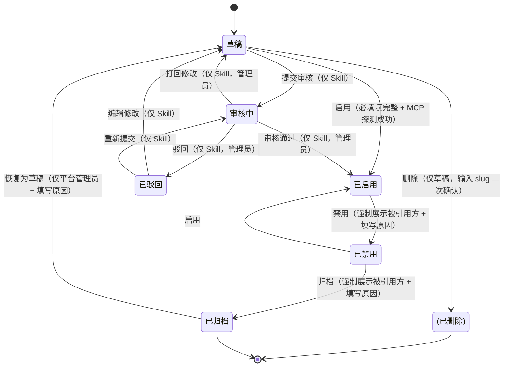

# 工具管理

## 一、需求背景

### 1. 价值、目的、收益点

**价值**：把企业内部三类工具资产（内置工具 / MCP Server / Skill）统一纳入治理后台，形成注册 → 配置 → 启用 → 调用 → 禁用/归档闭环。

**目的**：

*   终结工具黑箱：解决工具分散在代码库、配置文件、个人服务器、技能包中，无统一台账的问题；
    
*   杜绝静默下架：确保任何工具状态变更前，必须显式识别并评估对下游智能体的影响；
    
*   建立资产主权：明确工具负责人、版本归属、引用关系，支撑后续审计与 SLA 管理；
    
*   沉淀可复用技能：通过标准化技能包实现跨团队共享，减少重复开发。
    

**收益点**：

*   平台管理员：工具资产统一纳管，变更可追溯；
    
*   智能体负责人：工具下架前收到影响预警，降低线上故障；
    
*   工具开发者：注册一次，多处复用，减少重复对接；
    
*   业务团队：通过技能市场发现与复用已有能力，缩短智能体构建周期。
    

### 2. 为什么做 / 最痛的 case

**Case 1**：业务线开发者私有化部署了一个 MCP Server，供 3 个智能体调用。一周后其主动下线服务并删除代码仓库，未通知平台管理员与智能体负责人。次日用户投诉“查询失败”，运维排查耗时 2 小时，最终定位为工具不可达。期间无预警、无影响范围提示、无回滚路径。

**Case 2**：多个业务线各自开发了“差旅报销审批”能力，代码重复、标准不一，且未集中管理。其他团队无法发现与复用，导致重复造轮子。

### 3. PR release

| 版本 | 范围 |
| --- | --- |
| **v1.0（MVP）** | 内置工具 / MCP Server / Skill 的 CRUD、启用/禁用/归档、被引用方查看、草稿删除；Skill 含上传、解析、审核流；状态机完整闭环。 |
| v1.1（P1） | 版本历史与回滚、调用测试沙箱、基础监控图表、导入导出、按部门授权。 |
| v1.2（P2） | 灰度启用、工具依赖拓扑图、按智能体授权、API 工具接入、协作角色体系。 |

## 二、场景假设

| 假设 | 说明 | 复盘点 |
| --- | --- | --- |
| 三类工具 | MVP 管理内置工具、MCP Server、Skill；不做 API 工具。 | 需要 API 工具时扩展 `tool.type` 枚举。 |
| 启用即全员可见 | 不做工具级授权，启用后所有智能体均可引用。 | 需细粒度授权时重构授权模型。 |
| 仅草稿可删 | 已发布只能禁用/归档，禁止物理删除。 | 防止误删导致历史调用链断裂。 |
| 负责人 = 创建人 | 创建人即为负责人，MVP 不支持责任转移。 | 多人协作 P1 引入协作者与负责人转移。 |
| 平台管理员可恢复归档 | 恢复后回到草稿，需重新启用才生效。 | 防止误归档。 |
| Skill 需审核 | Skill 提交后须经平台管理员审核通过才能启用。 | 若开放自助发布，需加白名单或信任签名机制。 |

## 三、竞品调研

| 竞品 | 做法 | 我们的差异化 |
| --- | --- | --- |
| Dify | 插件市场对外 | 面向内部，强调闭环治理与下架影响分析。 |
| LangSmith | 调用追踪 | 做资产管理而非仅追踪，关注元数据、状态、依赖关系。 |
| MCP 官方 Registry | 仅 MCP Server | 统一纳管内置工具、MCP Server 与 Skill。 |
| Coze | 工具市场 | 增加下架影响分析、归档恢复与内部审核机制。 |

## 四、名词解释

| 术语 | 含义 |
| --- | --- |
| 工具 | 可被智能体调用的能力单元。 |
| 内置工具 | 平台代码自带的 Python 工具。 |
| MCP Server | 通过 Model Context Protocol 接入的外部服务。 |
| Skill | 基于平台规范打包的、具备完整元数据与执行逻辑的可插拔技能单元，以 `.skillpkg` 文件形式交付。 |
| 技能包（.skillpkg） | ZIP 压缩包，内含 `manifest.json`（元数据）、`code/`（执行逻辑）、`resources/`（模板/规则文件）、`README.md`（使用说明）。 |
| 技能市场 | Skill 发布与发现中心，支持浏览、下载统计与管理员审核待办。 |
| 探测 | 对 MCP Server 调用获取其声明的 Tools/Resources/Prompts 元数据。 |
| slug | 工具唯一英文标识，创建后不可改，用于 API 路由与引用绑定。 |
| 被引用方 | 引用此工具的智能体列表。 |
| 负责人 | 工具的创建人，对工具状态与变更负责。 |

---

## 五、产品方案

### 1. 考虑的方案

| 方案 | 描述 | 优点 | 缺点 | 决定 |
| --- | --- | --- | --- | --- |
| A：统一注册表 | 新建 `tool` 表，`type` 字段区分 `builtin`/`mcp`/`skill`，共用状态机与权限模型。 | 统一视图、统一治理逻辑、未来扩展成本低。 | 需新建关联表（如 `tool_mcp_config`、`tool_skill_package`）。 | 采用 |
| B：三类独立列表 | 仅 UI 聚合，后端保留多套表结构与逻辑。 | 改动小、迁移快。 | 治理逻辑重复、状态同步易错、维护成本高。 | 弃用 |
| C：完全重构 | 彻底废弃现有工具模块，基于新领域模型重写。 | 设计最干净、无历史包袱。 | 迁移风险高、无法灰度、上线周期长。 | 弃用 |

### 2. 长期方案

| 维度 | MVP | P1 | P2 |
| --- | --- | --- | --- |
| 工具类型 | builtin / mcp / skill | + api（OpenAPI 自动解析） | + 自定义协议插件 |
| 授权粒度 | 启用即全员可用 | 按部门授权 | 按智能体授权 |
| 版本管理 | 当前版本号 | 历史回滚 | 版本分支 |
| 协作 | 单一负责人 | 多人协作 | 角色分配（Owner/Editor/Viewer） |

### 3. 返工风险

| 返工点 | 风险 | 缓解 |
| --- | --- | --- |
| 新增工具类型 | 低 | `tool.type` 为字符串枚举，预留 `api` 值；探测/解析逻辑抽象为策略接口。 |
| 按智能体授权 | 中 | MVP 数据库表中预留 `access_policy` JSONB 字段，P2 直接复用。 |
| 独立服务拆分 | 中 | MVP 与管理后台同进程部署；API 接口层按 RESTful 设计，便于未来拆为微服务。 |
| Skill 包存储与分发 | 中 | MVP 存于对象存储（OSS/S3），P1 增加 CDN 加速与 SHA256 校验。 |

## 六、产品功能设计

### 1. 闭环

```plaintext
注册（按类型） → 配置 → 启用 → 调用 → 禁用/归档
```

**关于草稿状态的设计说明**：

*   MVP 保留草稿状态，但将其作为**兜底状态**而非主流程；
    
*   默认引导用户直接完成发布：MCP/内置工具点击“保存并启用”，Skill 点击“提交审核”；
    
*   草稿主要用于承接：探测失败、中途退出、管理员打回修改、已归档恢复等场景；
    
*   “保存为草稿”按钮在注册/编辑页中以次要按钮或文字链形式呈现，避免干扰主流程。
    

### 2. 页面清单

| 页面 | 主要内容 |
| --- | --- |
| 工具列表 | 筛选 + 搜索 + 列表 + 分页 |
| 工具详情 | 概览 / 被引用方 |
| 注册工具 | 三选一引导卡片（MCP / 内置 / Skill） |
| 编辑工具 | 表单（仅草稿/已驳回可编辑；已发布生成新草稿） |
| 内置工具发现 | 新增 / 已纳入 两 Tab |
| 技能市场 | 分类浏览 / 热门推荐 / 审核待办（管理员） / 下载记录 |
| Skill 上传页 | 拖拽上传 `.skillpkg` → 自动解析 → 提交审核 |

### 3. 工具状态机



**转换规则**：

*   草稿 → 已启用：用户点“启用”，必填项完整且 MCP 探测成功；
    
*   草稿 → 审核中：Skill 提交审核；
    
*   审核中 → 已启用：管理员点“通过”；
    
*   审核中 → 已驳回：管理员点“驳回”，需填写原因；
    
*   审核中 → 草稿：管理员点“打回修改”，需填写原因；
    
*   已驳回 → 草稿：用户点“编辑”；
    
*   已驳回 → 审核中：用户修改后点“重新提交”；
    
*   已启用 → 已禁用：用户点“禁用”，强制展示被引用方并填写原因；
    
*   已禁用 → 已启用：用户点“启用”；
    
*   已禁用 → 已归档：用户点“归档”，强制展示被引用方并填写原因；
    
*   已归档 → 草稿：仅平台管理员可“恢复为草稿”，需填写原因；
    
*   草稿 → 删除：仅草稿可删，输入 slug 二次确认。
    

**强制约束**：

*   所有状态变更必须记录操作人、时间、原因（禁用/归档/恢复/驳回/打回必填）；
    
*   “已归档”工具从所有智能体的工具选择器中移除，且其详情页“被引用方”Tab 中显示红色警示：“此工具已归档，引用将失败”；
    
*   Skill 版本号由技能包 `manifest.json` 定义，不可手动修改。
    

### 4. 列表页

#### 4.1 筛选条 + 搜索

| 控件 | 类型 | 选项 | 默认值 | 交互说明 |
| --- | --- | --- | --- | --- |
| 类型 | 多选下拉 | 内置工具 / MCP Server / Skill | 全部 | 多选时显示“已选 N 项” |
| 状态 | 多选下拉 | 草稿 / 审核中 / 已驳回 / 已启用 / 已禁用 / 已归档 | 已启用、已禁用 | 默认排除草稿、审核中、已驳回与归档 |
| 负责人 | 单选下拉 | 所有创建过工具的用户 + “全部” | 全部 | 下拉列表按用户活跃度排序 |
| 创建时间 | 日期范围选择 | 自定义范围；预设：近 7 天 / 近 30 天 / 近 90 天 | 近 30 天 | 起始时间 ≤ 结束时间 |
| 关键词 | 搜索输入框 | 支持名称 / slug / 描述 / 分类 模糊匹配 | 空 | 输入 ≥2 字触发搜索 |
| 排序 | 单选下拉 | 创建时间 / 更新时间 / 名称 | 创建时间 | \- |
| 排序方向 | 单选 | 升序 / 降序 | 降序 | \- |

**交互**：筛选/排序变化立即刷新（防抖 300ms）；条件保留在 URL 中，支持书签分享。

#### 4.2 表格列

| 列名 | 说明 | 可排序 | 宽度 | 备注 |
| --- | --- | --- | --- | --- |
| 名称 | 名称 + slug（灰色小字） | ✅ | 自适应 | 点击跳转详情页 |
| 类型 | 图标 + 文字 | ❌ | 100px | 内置工具 / MCP Server / Skill |
| 版本 | 当前版本号 | ❌ | 80px | 内置工具固定为 v1；Skill 取自 manifest |
| 状态 | 彩色标签 | ❌ | 100px | 草稿(gray) / 审核中(blue) / 已驳回(purple) / 已启用(green) / 已禁用(orange) / 已归档(red) |
| 分类 | 分类名 | ✅ | 100px | \- |
| 负责人 | 头像 + 用户名 | ❌ | 120px | \- |
| 创建时间 | 绝对时间 | ✅ | 160px | \- |
| 操作 | “详情” / “更多” 下拉 | \- | 120px | 下拉菜单见 4.2.3 |

##### 4.2.3 “更多”下拉内容（按状态变化）

| 工具状态 | 可见操作项 |
| --- | --- |
| 草稿 | 编辑 / 启用 / 删除 |
| 审核中 | 查看 / 撤回（仅提交人） |
| 已驳回 | 编辑 / 重新提交 / 删除 |
| 已启用 | 编辑（生成新草稿） / 禁用 / 归档 |
| 已禁用 | 编辑（生成新草稿） / 启用 / 归档 |
| 已归档 | 查看 / 恢复为草稿（仅平台管理员） |

#### 4.3 列表三态

| 状态 | 展示 |
| --- | --- |
| 加载中 | 骨架屏 |
| 空数据 | 图标 + “还没有工具资产” + “注册工具” 按钮 |
| 加载失败 | 红色文字 + “重试” 按钮 |
| 搜索无结果 | 图标 + “未找到匹配的工具” + “清空筛选” 按钮 |

#### 4.4 分页

*   默认 20/页，可切 50/100；
    
*   底部展示“共 {N} 条 / 第 {M} 页（每页 {size} 条）”；
    
*   总数 N 为全量匹配结果数（不含已删除）。
    

### 5. 注册工具

#### 5.1 选择工具类型

**入口**：列表页“注册工具”按钮 → 弹窗。

| 卡片 | 标题 | 描述 | 可见性 |
| --- | --- | --- | --- |
| 1 | MCP Server | 通过 Model Context Protocol 接入外部服务 | 所有用户 |
| 2 | 内置工具 | 纳管平台代码自带工具 | 仅平台管理员 |
| 3 | Skill | 上传标准化技能包（.skillpkg），经审核后发布 | 所有用户（提交）+ 平台管理员（审核） |

点击后进入对应表单页。

#### 5.2 MCP Server 表单

**A. 基础信息**

| 字段 | 必填 | 默认 | 校验规则 | 错误提示 |
| --- | --- | --- | --- | --- |
| slug | 是 | \- | 小写字母/数字/下划线，3-50，全局唯一 | “slug 只能包含小写字母、数字和下划线，长度 3-50”；“slug 已存在” |
| 名称 | 是 | \- | 长度 1-100 | “请输入名称（1-100 字）” |
| 描述 | 否 | \- | 长度 ≤ 500 | \- |
| 分类 | 否 | 空 | 长度 ≤ 30 | \- |

**B. 连接配置**

| 字段 | 必填 | 默认 | 校验规则 | 错误提示 |
| --- | --- | --- | --- | --- |
| 传输方式 | 是 | stdio | 单选 stdio / sse / streamable-http | \- |
| 命令（仅 stdio） | 条件必填 | \- | 长度 1-500 | “请输入启动命令” |
| URL（仅 sse/streamable-http） | 条件必填 | \- | URL 格式 | “请输入合法的 URL” |
| 环境变量 | 否 | {} | 键名小写字母/数字/下划线 | \- |
| API Key | 否 | \- | 长度 ≤ 500，保存时加密 | \- |
| 超时时间（秒） | 否 | 30 | 1-300 整数 | “超时时间须在 1-300 秒之间” |

**联动规则**：传输方式切换时，命令/URL 字段显示/隐藏。

**探测规则**：

*   探测时机：仅在“保存并启用”或详情页“重新探测”时触发；
    
*   探测内容：连接可达性、协议兼容性、至少声明 1 个 tool；
    
*   探测超时：≤ 5 秒；
    
*   错误分类：CONNECTION\_FAILED / INVALID\_SPEC / NO\_TOOLS\_DECLARED / AUTH\_FAILED。
    

**C. 元数据**

| 字段 | 必填 | 默认 | 校验规则 | 错误提示 |
| --- | --- | --- | --- | --- |
| 图标 | 否 | 空 | URL 或上传图片 ≤ 2MB | \- |
| 帮助文档 | 否 | 空 | Markdown，长度 ≤ 10000 | \- |

**底部按钮**：

*   “保存并启用”（主按钮）— 探测连接，成功则启用；失败则提示并自动保存为草稿；
    
*   “保存为草稿”（次按钮/文字链）— 不探测连接，用于配置未就绪时暂存；
    
*   “取消”。
    

> 💡 **设计意图**：MVP 保留草稿状态作为兜底，但默认引导用户直接启用。草稿主要承接探测失败、中途退出、打回修改等场景，避免已填写内容丢失。

#### 5.3 Skill 表单

**注意**：Skill 无连接配置、无探测机制，核心是元数据 + 技能包文件。

**A. 技能包上传**

| 字段 | 必填 | 默认 | 校验规则 | 错误提示 |
| --- | --- | --- | --- | --- |
| .skillpkg 文件 | 是 | \- | ZIP 格式，≤ 50MB，含合法 `manifest.json` | “请上传有效的 .skillpkg 文件（ZIP，≤50MB）”；“manifest.json 缺失或格式错误” |

**B. 元数据（自动填充 + 手动补全）**

| 字段 | 来源 | 必填 | 校验规则 | 说明 |
| --- | --- | --- | --- | --- |
| 名称 | `manifest.json.name` | 是 | 长度 1-100 | 可覆盖编辑 |
| slug | `manifest.json.slug` | 是 | 小写字母/数字/下划线，3-50，全局唯一 | 若冲突，强制用户修改 |
| 版本 | `manifest.json.version` | 是 | 语义化版本（如 1.2.0） | 不可编辑，由包内定义 |
| 描述 | `manifest.json.description` | 否 | 长度 ≤ 500 | 可覆盖编辑 |
| 分类 | \- | 否 | 长度 ≤ 30 | 用户手动选择/输入 |
| 图标 | 包内 `icon.png` 或上传 | 否 | URL 或上传图片 ≤ 2MB | 优先显示包内图标，可覆盖 |
| 帮助文档 | `README.md` | 否 | Markdown，长度 ≤ 10000 | 自动加载，可编辑 |

**C. 审核信息**

| 字段 | 必填 | 默认 | 校验规则 | 说明 |
| --- | --- | --- | --- | --- |
| 提交说明 | 是 | \- | 长度 5-200 | 向审核员说明 Skill 用途与变更点 |

**底部按钮**：

*   “提交审核”（主按钮）— 校验通过后将状态置为“审核中”；
    
*   “保存为草稿”（次按钮/文字链）— 暂不上传审核队列，用于包内容未就绪时暂存；
    
*   “取消”。
    

**审核流说明**：

*   平台管理员在“技能市场 → 审核待办”查看待审 Skill；
    
*   支持：通过（状态 审核中 → 已启用）、驳回（状态 审核中 → 已驳回，附原因）、打回修改（状态 审核中 → 草稿，附原因）；
    
*   驳回/打回后，用户可在原草稿页编辑并重新提交。
    

#### 5.4 内置工具发现页

**布局**：

*   顶部“重新发现”按钮（扫描代码目录）；
    
*   两个 Tab：“新增” / “已纳入”。
    

**新增 Tab**：列出代码中新增但未纳入的工具

| 字段 | 说明 |
| --- | --- |
| 工具名 | 函数名 |
| 描述 | 函数说明 |
| 操作 | “纳入”按钮 → 填写分类/描述 → 创建草稿 |

**已纳入 Tab**：所有已纳入的内置工具列表（可搜索）。

### 6. 工具详情页

#### 6.1 顶部

*   面包屑：工具管理 / {名称}
    
*   标题区：图标 + 名称 + slug + 状态标签 + 版本号
    
*   右上角操作按钮组：
    

| 工具状态 | 按钮组 |
| --- | --- |
| 草稿 | 编辑 / 启用 / 删除（仅自有） |
| 审核中 | 查看 / 撤回（仅提交人） |
| 已驳回 | 编辑 / 重新提交 / 删除 |
| 已启用 | 编辑（生成新草稿） / 禁用 |
| 已禁用 | 启用 / 归档 / 编辑（生成新草稿） |
| 已归档 | 查看（只读） / 恢复为草稿（仅平台管理员） |

#### 6.2 概览 Tab

**基础信息卡片**：名称、slug、类型、版本、分类、负责人、描述、创建时间、最近更新时间。

**能力声明卡片（MCP 专属）**：

*   三个子列表：Tools / Resources / Prompts（来自探测结果）；
    
*   每个子项：名称 + 描述；
    
*   右上角“重新探测”按钮；
    
*   底部显示探测时间与探测状态。
    

**内置工具详情**：函数签名 + 默认描述 + 代码位置。

**Skill 专属卡片**：

| 卡片 | 内容 | 说明 |
| --- | --- | --- |
| 技能包信息 | 文件名、SHA256、上传时间、审核状态 | 仅 Skill 展示 |
| 执行环境 | 运行时、依赖库列表 | 从 `manifest.json.runtime` & `dependencies` 解析 |
| 能力声明 | Tools / Resources / Prompts 列表 | 数据源为 `manifest.json.capabilities` |

#### 6.3 被引用方 Tab

**顶部数字**：被 {N} 个智能体引用。

**数据时效性**：引用关系每小时全量扫描更新（非实时），页面显示“最后更新于 {time}”，并标注延迟说明。

**列表**：

| 列 | 说明 |
| --- | --- |
| 智能体名 | 链接跳转到智能体详情 |
| 版本 | \- |
| 负责人 | 头像 + 用户名 |
| 状态 | 彩色标签 |
| 最近调用时间 | 绝对时间；超过 90 天未调用追加 ⚠️ 标识 |
| 引用方式 | 函数调用 / Prompt 注入 / 混合 |

**空状态**：“当前没有智能体引用此工具，可以放心下架。”

### 7. 编辑流程

*   草稿/已驳回状态：直接进入编辑页，表单预填当前内容；
    
*   已启用/已禁用状态：弹窗“编辑将创建新草稿，已发布版本不变”，点击“继续”进入编辑页。
    

**编辑页字段**：复用注册表单字段。

**底部按钮**：

*   “保存”（存草稿）；
    
*   “保存并启用”（校验后启用，仅内置/MCP）；
    
*   “提交审核”（校验后进入审核中，仅 Skill）；
    
*   “取消”。
    

**保存并启用弹窗**（内置/MCP）：

*   输入变更说明（必填，5-200 字）；
    
*   成功 toast：“已启用 v{版本号}”；
    
*   失败 toast：“启用失败：{错误信息}”。
    

**提交审核弹窗**（Skill）：

*   输入提交说明（必填，5-200 字）；
    
*   成功 toast：“已提交审核”；
    
*   失败 toast：“提交失败：{错误信息}”。
    

### 8. 删除

*   仅**草稿**或**已驳回**状态可删除；
    
*   确认弹窗：输入 slug 二次确认，并提示“删除后无法恢复，且将从所有智能体配置中移除此工具引用”；
    
*   成功后：列表刷新 + toast “已删除”。
    

### 9. 启用/禁用/归档

#### 9.1 启用（草稿/已禁用 → 已启用）

**前置校验**：

*   必填项完整；
    
*   MCP 探测成功（如需要）；
    
*   Skill 必须通过审核，不可从草稿直接启用。
    

**成功 toast**：“工具已启用”。

#### 9.2 禁用（已启用 → 已禁用）

**弹窗：影响分析**

| 字段 | 内容 |
| --- | --- |
| 标题 | 禁用工具影响分析 |
| 警告 | “此工具被 {N} 个智能体引用” |
| 列表 | 智能体名 + 版本 + 负责人 |
| 输入 | 禁用原因（必填，长度 5-200） |
| 按钮 | “取消” / “确认禁用” |

**确认后**：立即生效，调用方收到“工具已禁用”错误。

#### 9.3 归档（已禁用 → 已归档）

弹窗同禁用，措辞改为“归档”。

确认后：从可引用列表移除，引用方详情页标红提示。

#### 9.4 恢复为草稿（已归档 → 草稿，仅平台管理员）

弹窗：输入恢复原因（必填，5-200 字）。

确认后：状态变为草稿。

### 10. 技能市场

**入口**：工具管理 → 技能市场。

**Tab 结构**：

*   全部 Skill：分类浏览 + 搜索 + 热门推荐；
    
*   审核待办（仅管理员）：待审 Skill 列表；
    
*   我的提交：当前用户提交的 Skill 列表；
    
*   下载记录：平台内 Skill 被智能体引用的统计。
    

**Skill 卡片**：

*   图标 + 名称 + 版本 + 分类 + 下载/引用次数；
    
*   点击跳转详情页。
    

### 11. 智能体使用 Skill

| 项目 | 说明 | 约束 |
| --- | --- | --- |
| 发现方式 | 在智能体“添加工具”弹窗中，Skill 与内置/MCP 同列表展示，按分类/关键词过滤，新增“Skill”标签 | MVP 必须支持 |
| 选择逻辑 | 选择 Skill 后自动注入 `manifest.json.capabilities` 声明的参数 Schema；参数配置区显示友好字段；不暴露底层代码/包结构 | 保障低代码体验 |
| 版本锁定 | 智能体绑定 Skill 时强制锁定具体版本号 | 规避上游 Skill 更新导致行为突变 |
| 调用日志 | 在智能体“调用监控”中，Skill 调用显示为“🧩 {名称} v{版本}”，错误码与内置/MCP 统一 | 日志格式兼容 |
| 权限继承 | Skill 运行时权限 = 智能体运行时权限，不额外申请权限 | 符合最小权限原则 |

### 12. 关键错误提示文案

| 场景 | 提示 |
| --- | --- |
| 列表加载失败 | “加载失败，请重试” |
| slug 重复 | “slug 已存在” |
| slug 格式错误 | “slug 只能包含小写字母、数字和下划线，长度 3-50” |
| 必填项缺失 | “此项必填” |
| URL 格式错误 | “请输入合法的 URL” |
| 探测失败 | “连接探测失败：{错误信息}” |
| 启用失败 | “启用失败：{错误信息}” |
| 删除非草稿 | “仅草稿或已驳回状态可删除” |
| 没有权限 | “无权限操作” |
| Skill 包格式错误 | “请上传有效的 .skillpkg 文件（ZIP，≤50MB）” |
| manifest 解析失败 | “manifest.json 缺失或格式错误” |
| 审核驳回 | “审核未通过：{原因}” |

### 13. 关键成功提示文案

| 场景 | 提示 |
| --- | --- |
| 注册草稿成功 | “工具 {名称} 已创建为草稿” |
| 启用成功 | “工具已启用” |
| 禁用成功 | “工具已禁用” |
| 归档成功 | “工具已归档” |
| 恢复成功 | “已恢复为草稿” |
| 删除成功 | “已删除” |
| 编辑保存成功 | “草稿已保存” |
| 提交审核成功 | “已提交审核” |
| 审核通过 | “Skill 已通过审核并启用” |

## 七、非功能需求

| 类别 | 要求 | 验收方式 |
| --- | --- | --- |
| 可靠性 | 工具状态变更操作（启用/禁用/归档/恢复/审核）幂等性保障：重复提交同一操作仅产生 1 条日志与 1 次状态变更。 | 接口压测 + 日志审计验证 |
| 安全性 | 所有状态变更接口强制校验管理员权限；API Key/环境变量前端禁止明文显示；Skill 包存储前校验 SHA256。 | 安全渗透测试报告 |
| 可观测性 | 每次工具操作均上报结构化事件，字段含 event\_type、tool\_slug、from\_status、to\_status、operator\_id、ip、user\_agent。 | ELK 查询验证 |
| 兼容性 | 列表页在 Chrome 115+、Edge 115+、Firefox 110+、Safari 16.4+ 下功能可用。 | BrowserStack 自动化截图 |
| 性能 | 工具列表页（200 条数据）首屏加载 ≤ 1.2s；筛选响应 ≤ 400ms（P95）；Skill 包上传 ≤ 50MB。 | Lighthouse + Prometheus 监控 |
| 审计 | 所有状态变更记录操作人、时间、原因，日志留存 ≥ 180 天。 | 审计日志查询验证 |