# 20260709-【PRD】天马智擎首页（MVP）-天马智擎项目

_**天马智擎项目**_

**产品需求说明书**

版本信息

本表用于记录本文档的维护过程，请认真填写。

| 版本号 | 时间(必填) | 状态 | 简要描述(必填) | 部门 | 责任产品(必填) | 批准人 |
| --- | --- | --- | --- | --- | --- | --- |
| V1.0 | 2026-07-08 | N | 面向企业全员的一站式 AI 协作入口 | AI项目小组 | $\color{#0089FF}{@公输}$ |  |
| V2.0 | 2026-08-12 | M | 迭代优化：上传文件、额度管理、状态提醒、权限配置 | AI项目小组 | $\color{#0089FF}{@公输}$ |  |

注：状态可以为N-新建、A-增加、M-更改、D-删除。

# 关于本文档

## 术语

| **词汇名称** | **全局说明** | **归属层** |
| --- | --- | --- |
| **日常办公模式** | 以 web-search + RAG 为核心检索路由、接入钉钉能力落地的对话模式 | — |
| **专家模式** | 以 plan-and-execute 为核心范式、预置 10 位专家的结构化协作模式 | — |
| **web-search** | 联网公开信息实时检索 | — |
| **RAG** | 基于企业知识（钉钉文档/知识库/业务系统）的检索增强生成 | — |
| **plan-and-execute** | 先规划步骤（Plan）展示给用户，再逐步执行工具/MCP（Execute）、最终汇总交付物的专家协作范式 | — |
| **CoT** | 思维链（Chain of Thought），向用户展示 AI 推理过程，思考中详细展示、开始输出回复时自动折叠 | — |
| **Prompt** | 输入给 LLM 的指令文本（System Prompt 定义角色与安全约束 + User Prompt 为业务任务），决定模型行为与工具调用规则 | L1 决策层 |
| **工具调用** | LLM 在 Prompt 约束下输出的标准化 JSON 调用指令（工具名+入参），模型只输出意图不执行；是 MCP 的底层依赖基础 | L1 决策层产出 |
| **Tool** | 最小粒度的原子执行单元（本地函数/Shell 脚本/远程 API），MCP Server 对外暴露的唯一形态，一个 Tool 只做单一动作 | L3 工具标准化层 |
| **Skill** | 业务层面的粗粒度能力，由多个 Tool + 条件判断 + 业务流程 + 安全校验编排而成，不在 MCP 协议定义之内；分为只读 Skill（自动执行）和写入 Skill（需人工确认） | L2 调度编排层 |
| **MCP** | Model Context Protocol，Agent ↔ Tool 之间的标准化通信协议；MCP Server 封装 Tool，MCP Client 接收工具调用指令 | L3 工具标准化层 |
| **Agent** | 智能体 = LLM + Prompt + 记忆体系（瞬时+短期 MVP，长期后续迭代）+ 工具调用调度 + MCP 工具池 + 沙箱环境 + 安全审批 | L4 最终产物 |
| **沙箱** | Agent 执行手脚的隔离环境，写入类 Skill 先在沙箱模拟执行、人工确认后再正式执行，防止破坏正式环境 | L3 工具标准化层 |
| **智能评估** | 跨层质量保障能力，对模型/Tool/Agent 提供统一的评估数据集、评估任务与报告；Agent 发布前推荐执行 | 跨层 |
| **SSO** | 单点登录，钉钉与浏览器双端认证 | — |

## 参考文档

为了更好理解本文档，请阅读如下文档。

| **编号** | **文档** | **说明及地址** |
| --- | --- | --- |
| 1 | 原型界面参考 | https://fri555.github.io/PORTL/ |
| 2 | Figma UI设计 | https://www.figma.com/design/rRqUi2RORbhHhCnFgH2dTe/%E5%A4%A9%E9%A9%AC%E6%99%BA%E6%93%8E?node-id=0-1&p=f&t=3WOAMYQ62H2eLeQo-0 |

## 沟通要求

本表记录需要跨部门沟通的事项，以保证该文档内容质量。如果有其它跨部门沟通项，请填写该表中，并记录沟通结果。

| **序号** | **部门** | **沟通内容** | **沟通结果** |
| --- | --- | --- | --- |
| 1 |  |  |  |
| 2 |  |  |  |

# 产品概述

本章节详细描述产品的背景、内容和目标等进行详细定义，关于产品定义的其它内容请阅读本产品定义说明书。

## 产品概述

AI 工作门户首页智能体是面向企业普通员工的一站式 AI 协作入口。用户进入首页后，可在「日常办公模式」下通过 web-search + RAG 快速获取答案并落地为钉钉动作，或在「专家模式」下选择预置专家进行 plan-and-execute 结构化协作。

## 产品目标

1.  **降低 AI 使用门槛**：普通员工无需了解模型/函数/MCP 等底层概念，即可通过自然语言完成日常工作与专家协作。
    
2.  **打通"问→答→落地"闭环**：日常办公模式从检索到生成到钉钉动作落地，形成端到端可用链路。
    

## 用户角色

### 用户角色描述

| **用户角色** | **职责描述** | **MVP范围** |
| --- | --- | --- |
| **普通员工** | 通过 SSO 登录使用首页智能体的企业员工，可使用日常办公模式与专家模式 | ✅ 唯一角色 |
| **管理员** | 在后台配置模型/函数/MCP/技能的管理人员，不通过前端首页操作 | 后台界面不在本 PRD 范围 |

### 用户故事地图

用户在知识中心的核心活动主线：**进入知识中心 → 组织知识 → 管理文件 → 消费知识**。

| **用户活动** | **用户任务** | **用户故事** |
| --- | --- | --- |
| **进入首页** | SSO 登录 | 作为员工，我希望通过钉钉 SSO 一键登录，以便快速进入 AI 工作台 |
|  | 查看首页 | 作为员工，我希望首页默认展示输入框为焦点，以便快速开始提问 |
|  | 切换模式 | 作为员工，我希望在日常办公和专家模式间切换，以便按需选择协作方式 |
| **发起对话** | 输入提问 | 作为员工，我希望用自然语言输入问题并发送，以便获得 AI 回答 |
|  | 上传附件 | 作为员工，我希望上传本地文件或引用知识库文件到对话中，以便 AI 结合文件内容回答 |
|  | 使用快捷指令 | 作为员工，我希望点击快捷指令自动填入提示词，以便快速发起常见任务 |
|  | 选择专家 | 作为员工，我希望从专家列表中选择合适的专家，以便获得专业领域的结构化协作 |
|  | 联网查询 | 作为员工，我希望控制是否启用联网查询，以便在时效性问题和私有知识之间选择合适的信息源 |
| **消费产出** | 查看回答 | 作为员工，我希望看到 AI 流式逐字生成回答，以便实时跟进生成进度 |
|  | 查看推理过程 | 作为员工，我希望看到 AI 的思维链推理过程，以便理解回答依据 |
|  | 查看来源引用 | 作为员工，我希望看到回答的信息来源标注，以便核验可信度 |
|  | 预览生成文件 | 作为员工，我希望点击 AI 生成的文件卡片在右侧预览，以便查看完整内容 |
|  | 执行钉钉动作 | 作为员工，我希望将回答结果落地为钉钉待办/审批/通知，以便完成从问到做的闭环 |
|  | 多轮追问 | 作为员工，我希望在同一会话内连续追问，以便深入探索问题 |
|  | 专家协作 | 作为员工，我希望与专家进行 Plan-and-Execute 结构化协作，以便完成复杂任务 |
| **管理会话** | 新建会话 | 作为员工，我希望新建空白会话，以便开启全新对话 |
|  | 搜索会话 | 作为员工，我希望搜索历史会话标题，以便快速找回之前的对话 |
|  | 重命名会话 | 作为员工，我希望重命名会话标题，以便更好地组织和识别对话 |
|  | 整理会话 | 作为员工，我希望隐藏不再需要的会话，以便保持会话列表整洁 |
|  | 跨会话记忆 | 作为员工，我希望新会话能自动回忆起历史会话的关键信息，以便减少重复输入 |

## 同类产品/竞品调研(选写)

###  同类产品

| 分类 | 竞品 | 核心特征 | 与我方的关系 |
| --- | --- | --- | --- |
| **企业协作平台型** | 钉钉 AI 助理 | 工作台嵌入式 AI 入口，全面接入 DeepSeek + 通义千问，支持自定义助理与工作流自动化 | 同为企业内 AI 入口，直接对标 |
| **企业协作平台型** | 飞书智能伙伴 | 顶部 ✦ 按钮唤起，自然语言自动路由能力，跨模块调用（IM/文档/会议/表格/知识库） | 同为企业 AI 办公，布局参考 |
| **AI 原生平台型** | Coze / 扣子 2.0 | 项目式多 Agent 协作，AgentSkills 技能封装 + AgentPlan 目标驱动 | 专家模式编排参考 |
| **通用 AI 助手型** | Kimi（月之暗面） | 200 万字超长上下文，13 个场景提示词 + 19 套常用语模板，Kimi+ 智能体侧边栏选择 | 提示词策略与专家展示参考 |
| **通用 AI 助手型** | 通义千问 / 豆包 | C 端智能体功能已因《人工智能拟人化互动服务管理暂行办法》于 2026-07-15 下线 | **合规警示**：避免过度拟人化 |

###  结论

**MVP 阶段**：对标钉钉 AI 助理的能力覆盖度（日常办公 + 专家协作），参考飞书智能伙伴的入口设计（顶部输入框为焦点），借鉴 Coze 的项目式多 Agent 协作能力（plan-and-execute 专家编排）。核心差异化策略：① 两模式统一入口（日常+专家在同一首页 Tab 切换）；② web-search + RAG 融合检索；③ 答案落地为钉钉动作（待办/审批/通知）；④ 专家 Hover/Click 区分交互。合规警示：避免过度拟人化（参考《人工智能拟人化互动服务管理暂行办法》对通义千问/豆包 C 端智能体的下线影响）。

# 功能需求

## 全局通用规则

### 模式切换

**基本规则**

| **规则项** | **说明** |
| --- | --- |
| 可选模式 | 日常办公模式 / 专家模式 |
| 默认模式 | 日常办公模式 |
| ~~模式与会话绑定~~ | ~~一个会话绑定一种模式，创建后不可变更；切换模式 = 切换到对应模式的最近活跃会话（无则新建一个绑定该模式的空白会话）~~ |
| ~~会话创建默认~~ | ~~新建会话恢复默认模式（日常办公，默认不开启联网）~~ |
| 切换方式 | 用户手动切换，不做自动意图识别与模式自动路由 |

**【V2.0更新】**

**切换规则**

| **操作场景** | **输入框内容** | **联网查询开关** | **已上传文件** |
| --- | --- | --- | --- |
| 1. 日常办公 → 专家模式选择页（用户自行输入内容） | 保留 | 通用规则（保留用户设置＞默认开启） | 完整保留 |
| 2. 选定或切换智能体（选择页→选定，或A→B切换）（用户自行输入内容） | 保留 | 通用规则（保留用户设置＞默认开启） | 完整保留 |
| 3. 切回日常办公模式（用户自行输入内容） | 保留 | 通用规则（保留用户设置＞默认开启） | 完整保留 |
| 4. 日常办公，案例卡片（点击案例卡片） | 覆盖写入 | 通用规则（保留用户设置＞默认开启） | 完整保留 |
| 5. 专家模式，智能体案例卡片（点击案例卡片） | 覆盖写入 | 通用规则（保留用户设置＞默认开启） | 完整保留 |
| 6. 选中专家 → 关闭专家卡片（用户自行输入内容/修改快捷提示语内容，未使用快捷提示语） | 保留 | 通用规则（保留用户设置＞默认开启） | 完整保留 |
| 7. 选中专家 → 关闭专家卡片（使用了快捷提示语且未修改） | 清空 | 通用规则（保留用户设置＞默认开启） | 完整保留 |
| 8. 新对话/logo | 清空 | 恢复默认开启 | 清空 |

> **联网查询通用规则**：①用户手动修改过的开关设置保留＞②默认开启。

### 标题生成

| ~~**序号**~~ | ~~**阶段**~~ | ~~**步骤**~~ | ~~**说明**~~ | ~~**分支 / 判定**~~ | ~~**输出与终止**~~ |
| --- | --- | --- | --- | --- | --- |
| ~~1~~ | ~~预处理~~ | ~~读取原始消息~~ | ~~获取~~ `~~Msg_1~~` ~~的原始字符串~~ | ~~—~~ | ~~得到原始消息~~ |
| ~~2~~ | ~~预处理~~ | ~~硬编码清洗（去噪）~~ | ~~剔除标点 / 空格 / 特殊符号，仅保留中文、英文、数字~~ | ~~—~~ | ~~输出~~ `~~Cleaned~~`~~（纯文本）~~ |
| ~~3~~ | ~~预处理~~ | ~~判断清洗后长度~~ | ~~计算~~ `~~len(Cleaned)~~` | ~~**A**~~~~：~~`~~1 ≤ len ≤ 12~~` ~~→ 直出~~ `~~Cleaned~~`~~；~~<br>~~**B**~~~~：~~`~~len > 12~~` ~~→ 进步骤 4；~~<br>~~**C**~~~~：~~`~~len = 0~~` ~~→ 默认标题【新会话】~~ | ~~A / C 终止；B 继续~~ |
| ~~4~~ | ~~预处理~~ | ~~调用 AI 总结~~ | ~~输入~~ `~~Cleaned~~`~~，超时 800ms~~ | ~~4.1 调用；~~<br>~~4.2 成功返回 → 输出；~~<br>~~4.3 失败 / 超时 / 不合规 → 降级~~ | ~~4.2 输出 AI 标题（终止）；4.3 前 10 字符 +~~ `~~...~~`~~（终止）~~ |
| ~~5~~ | ~~AI 语义概括~~ | ~~AI 总结~~ | ~~基于原始消息，将核心意图压缩为 4～12 汉字标题~~ | ~~—~~ | ~~输出 AI 标题~~ |

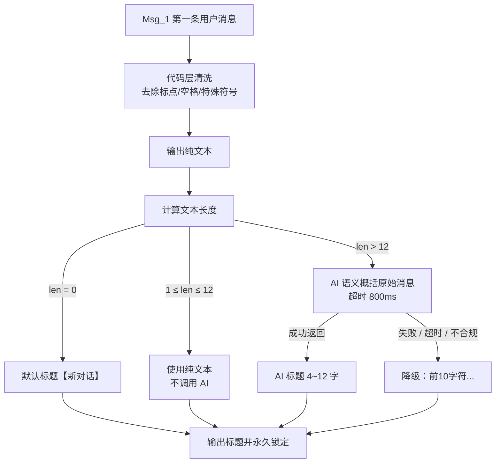
```mermaid
flowchart TD
    A[Msg_1 第一条用户消息] --> B[代码层清洗<br/>去除标点/空格/特殊符号]
    B --> C[输出纯文本]
    C --> D[计算文本长度]
    D -->|len = 0| E[默认标题【新对话】]
    D -->|1 ≤ len ≤ 12| F[使用纯文本<br/>不调用 AI]
    D -->|len > 12| G[AI 语义概括原始消息<br/>超时 800ms]
    G -->|成功返回| H[AI 标题 4~12 字]
    G -->|失败 / 超时 / 不合规| I[降级：前10字符...]
    E --> J[输出标题并永久锁定]
    F --> J
    H --> J
    I --> J

```

### 对话交互规范

| **规则项** | **说明** |
| --- | --- |
| 输入方式 | 多行输入，Enter 发送 / Shift+Enter 换行 |
| 发送控件 | 有内容时高亮可点击，无内容时置灰；生成中替换为停止控件 |
| 附件上传 | 输入区内提供附件上传入口，格式与大小约束见 3.1.4 |
| 上下文窗口 | 保留最近 5 轮（1 轮 = 1 用户问题 + 1 助手回答），可在后台配置 |
| 安全检测 | 对话输入做敏感词与 Prompt 注入检测，命中即拦截 |

### 加载态 / 空态 / 错误态

| **场景** | **状态** | **处理方式** |
| --- | --- | --- |
| 会话列表加载 | 加载中 | 骨架屏占位 |
| 会话列表加载 | 加载失败 | 错误提示 + 重试按钮 |
| 会话列表 | 空 | 空态提示「暂无会话，点击新建开始对话」 |
| 对话回答生成 | 加载中 | 流式逐字展示，展示思考中动效 |
| 对话回答生成 | 网络异常 | 消息气泡展示「网络异常，请稍后重试」 |
| ~~对话回答生成~~ | ~~超时（>30s）~~ | ~~消息气泡展示「响应超时，请稍后重试」~~ |
| 专家卡片列表 | 加载中 | 骨架屏占位 |
| 专家卡片列表 | 加载失败 | 错误提示 |
| 专家卡片列表 | 空 | 空态提示「暂无可用专家」 |
| 文件预览 | 加载中 | 预览面板内骨架屏 |
| 文件预览 | 加载失败 | 预览面板内错误提示 + 重试按钮 |
| 文件预览 | 格式不支持 | 提示「暂不支持预览该文件格式」 |
| ~~附件上传~~ | ~~上传中~~ | ~~状态标识（上传中 / 解析中 / 已完成 / 处理失败）~~ |
| ~~附件上传~~ | ~~失败~~ | ~~标红 + 原因，不支持手动重试~~ |
| 全局网络 | 断连 | 页面顶部展示 Banner：「网络异常，请稍后重试」 |

### 文件上传约束

| **约束项** | **限制值** | **校验位置** | **拦截行为** |
| --- | --- | --- | --- |
| ~~文件数量上限~~ | ~~单次最多 10个~~ | ~~前端~~ | ~~拦截超出部分，提示「最多上传 10个文件」~~ |
| ~~单文件大小~~ | ~~≤ 50MB~~ | ~~前端~~ | ~~拦截该文件，提示「文件超过 50MB 限制」~~ |
| 格式白名单 | pdf、doc、docx、txt、md、~~xlsx、xls、csv~~ | 前端 | 拦截该文件，提示支持格式列表 |
| 空文件（0 字节） | 不允许 | 前端 | 拦截该文件，标注「空文件」 |
| 格式伪装 | 扩展名与文件头不匹配 | 服务端 | 上传完成后标记「上传失败」 |
| 加密文件 | 文件已加密无法解析 | 服务端 | 解析阶段标记「处理失败」 |
| 首页单次文件数量 | ≤ 3 个 | 前端 | 拦截超出部分，提示「单次最多上传 3 个文件」 |
| 首页单文件大小 | ≤ 10MB | 前端 | 拦截该文件，提示「文件大小超过 10MB」 |

> 前端校验顺序：扩展名 → 文件大小 → 空文件。逐项校验，首个不通过的项即拦截并提示。

**【V2.0更新】**

| **文件类型** | **检测指标** | **执行动作** |
| --- | --- | --- |
| **PDF** | ① 原始 ≤ 5MB<br>② 页面数量 ≤ **200页** | 任一项不满足，上传沙箱处理 |
| **Excel (csv/xlsx/xls)** | ① 原始 ≤ 5MB<br>② 总单元格数 ≤ **50,000个**<br>③ 纯文本字符数 ≤ **10,000字符** | 任一项不满足，上传沙箱处理 |
| **Word (docx/doc)** | ① 原始 ≤ 5MB<br>② 纯文本字符数 ≤ **100,000字符** | 任一项不满足，上传沙箱处理 |
| **纯文本 (txt/md)** | ① 原始 ≤ 5MB<br>② 纯文本字符数 ≤ **200,000字符** | 任一项不满足，上传沙箱处理 |

> 附件上传文件存在解析后超过上下文窗口的风险，自动压缩上下文存在丢失信息的问题，采用上述规则处理，不满足条件时文件传入沙箱进行处理，不直接作为上下文输入给LLM。

【V2.0更新】

### 文件格式支持矩阵

| **格式** | **扩展名** | **上传** | **内容解析** | **预览** | **大纲导航** | **优先级** |
| --- | --- | --- | --- | --- | --- | --- |
| PDF | `.pdf` | ✅ | ✅ 解析文本 | ✅ HTML 渲染 | ✅ 提取书签 | P0 |
| DOCX | `.docx` | ✅ | ✅ 解析文本 | ✅ HTML 渲染 | ✅ 提取 H1-H3 标题 | P0 |
| TXT | `.txt` | ✅ | ✅ 读取全文 | ✅ 纯文本渲染 | — | P0 |
| MD | `.md` | ✅ | ✅ 读取全文 | ✅ Markdown 渲染 | ✅ 提取 H1-H3 标题 | P0 |
| XLSX | `.xlsx` | ✅ | ✅ 提取单元格文本 | ✅ HTML 表格渲染 | ✅ Sheet 名称列表 | P0 |
| XLS | `.xls` | ✅ | ✅ 提取单元格文本 | ✅ HTML 表格渲染 | ✅ Sheet 名称列表 | P0 |
| CSV | `.csv` | ✅ | ✅ 读取全文 | ✅ 简易表格渲染 | — | P0 |
| DOC | `.doc` | ✅ | ✅ 解析文本 | ✅ HTML 渲染 | — | P0 |
| PPTX | `.pptx` | ❌ | ❌ | ✅ HTML 渲染 | ✅ 提取标题 | P0 |
| 扫描 PDF | `.pdf` | ✅ | ❌ OCR 不在 MVP 范围 | ✅ 图片渲染 | — | P0 |
| PNG | `.png` | ✅ | ✅ ~~OCR +~~ 多模态视觉识别（Qwen 3.8 Max） | ✅ 图片渲染 | — | P0 |
| JPG | `.jpg` | ✅ | ✅ ~~OCR +~~ 多模态视觉识别（Qwen 3.8 Max） | ✅ 图片渲染 | — | P0 |
| JPEG | `.jpeg` | ✅ | ✅ ~~OCR +~~ 多模态视觉识别（Qwen 3.8 Max） | ✅ 图片渲染 | — | P0 |
| MP4 | `.mp4` | ✅ | ❌ | ✅ 视频播放 | — | P2 |
| AVI | `.avi` | ✅ | ❌ | ✅ 视频播放 | — | P2 |
| ~~HTML~~ | `~~.html~~` | ~~✅~~ | ~~✅~~ | ~~✅~~ | ~~—~~ |  |


### 入口与认证

| **规则项** | **说明** |
| --- | --- |
| 登录方式 | 钉钉 SSO + 浏览器 SSO，仅认证用户可进入 |
| 身份贯穿 | 用户身份贯穿会话、附件、文件预览与钉钉动作 |
| 数据隔离 | 会话/附件/文件仅当前用户可见 |
| 凭证失效 | 静默刷新，失败则跳转重新登录 |

### 搜索规则

| **规则项** | **说明** |
| --- | --- |
| 触发方式 | 输入后 300ms 防抖触发搜索，不依赖 Enter 键 |
| 匹配逻辑 | 左右模糊匹配（包含关键词即可），不区分大小写 |
| 搜索范围 | 历史会话：按会话标题匹配；会话内不支持消息正文全文搜索（见 5.2 Non-goals） |
| 结果展示 | 按更新时间倒序排列 |
| 键盘导航 | ↑ ↓ 键切换选中项，Enter 确认跳转，Esc 关闭搜索面板 |
| 无结果 | 展示空态：「未找到匹配会话」 |
| 清空 | 点击搜索框右侧 ✕ 按钮或按下 Esc 清空搜索词，恢复完整列表 |

## 流程图

### 技术架构图

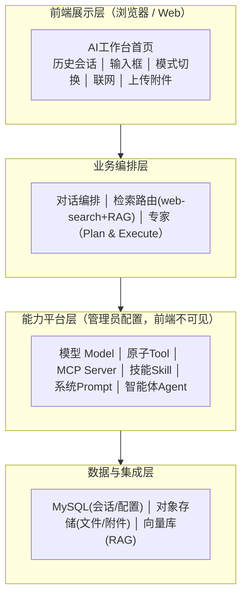
```mermaid
graph TB
    subgraph L1["前端展示层（浏览器 / Web）"]
        A["AI工作台首页<br/>历史会话 │ 输入框 │ 模式切换 │ 联网 │ 上传附件"]
    end

    subgraph L2["业务编排层"]
        B["对话编排 │ 检索路由(web-search+RAG) │ 专家 （Plan & Execute）"]
    end

    subgraph L3["能力平台层（管理员配置，前端不可见）"]
        M["模型 Model │ 原子Tool │ MCP Server │ 技能Skill │ 系统Prompt │ 智能体Agent"] 
    end

    subgraph L4["数据与集成层"]
        D["MySQL(会话/配置) │ 对象存储(文件/附件) │ 向量库(RAG)"]
    end

    L1 --> L2 --> L3 --> L4

```

### 业务流程图

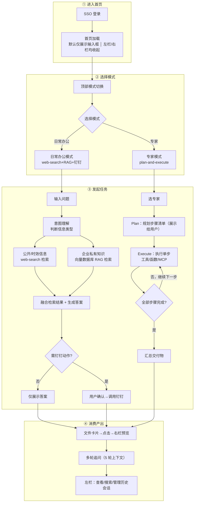
```mermaid
flowchart  TB


    subgraph S1["① 进入首页"]
        S1a["SSO 登录"] --> S1b["首页加载<br/>默认仅展示输入框 │ 左栏/右栏均收起"]
    end

    subgraph S2["② 选择模式"]
        S1b --> S2a
        S2a["顶部模式切换"] --> S2b{"选择模式"}
        S2b -->|"日常办公"| S2c["日常办公模式<br/>web-search+RAG+钉钉"]
        S2b -->|"专家"| S2d["专家模式<br/>plan-and-execute"]
    end

    subgraph S3["③ 发起任务"]
        S2c --> S3a["输入问题"]
        S3a --> S3b["意图理解<br/>判断信息类型"]
        S3b --> S3b1["公开/时效信息<br/>web-search 检索"]
        S3b --> S3b2["企业私有知识<br/>向量数据库 RAG 检索"]
        S3b1 --> S3b3["融合检索结果 + 生成答案"]
        S3b2 --> S3b3
        S3b3 --> S3c{"需钉钉动作?"}
        S3c -->|"是"| S3d["用户确认→调用钉钉"]
        S3c -->|"否"| S3e["仅展示答案"]

        S2d --> S3f["选专家"]
        S3f --> S3g["Plan：规划步骤清单（展示给用户）"]
        S3g --> S3i["Execute：执行单步<br/>工具/函数/MCP"]
        S3i --> S3j{"全部步骤完成?"}
        S3j -->|"否，继续下一步"| S3i
        S3j -->|"是"| S3k["汇总交付物"]
    end

    subgraph S4["④ 消费产出"]
        S3e --> S4a["文件卡片→点击→右栏预览"]
        S3d --> S4a
        S3k --> S4a
        S4a --> S4b["多轮追问（5 轮上下文）"]
        S4b --> S4c["左栏：查看/搜索/管理历史会话"]
    end
```

## 功能模块清单

| **功能模块** | **功能描述** | **优先级** |
| --- | --- | --- |
| 整体布局 | 三栏骨架（输入框焦点 + 左会话/右预览默认收起），可展开 | P0-1 |
| 历史会话（左栏） | 新建/搜索/重命名/删除，可折叠收起 | P0-2 |
| 对话输入区 | 多行输入、发送/停止、附件上传 | P0-3 |
| 快捷指令区 | 生成钉钉待办/生成需求草稿/封装成技能（提示词预填） | P0-4 |
| 会话详情 | 中心消息画布：流式回答/CoT/文件卡片/Plan-Execute 步骤 | P0-5 |
| 右栏文件预览面板 | AI 生成文件后点击卡片预览（大纲+正文） | P0-6 |
| 日常办公模式 | web-search + RAG 检索路由 → 生成 → 钉钉动作落地 | P0-7 |
| 专家模式框架 | 选专家 → Plan → Execute → 结构化交付物 | P0-8 |

## 基础能力底座

### 四层架构总览

| **层级** | **名称** | **组成** |
| --- | --- | --- |
| L1 | 决策层 | 模型 + Prompt + 工具调用 + CoT |
| L2 | 调度编排层 | 沙箱 + 安全审批 |
| L3 | 工具标准化层 | MCP + Tool + Skill |
| L4 | 最终产物 | Agent（含记忆体系：MVP 瞬时+短期，长期后续迭代） |

**四层架构图**：


---

### 模型管理

#### 功能需求描述

> 模型管理为智能体提供「思考能力」——管理员在后台注册模型端点、配置降级链和配额，智能体运行时通过网关调用模型。

[《模型管理》](https://alidocs.dingtalk.com/api/doc/transit?dentryUuid=G1DKw2zgV2RYlEQ6fqABKzmNVB5r9YAn&queryString=utm_medium%3Ddingdoc_doc_plugin_card%26utm_source%3Ddingdoc_doc)

| **EARS 模式** | **需求描述** |
| --- | --- |
| 普遍型 | 系统应支持管理员在后台注册多个模型端点，配置路由策略与降级规则。模型输出产物 = 工具调用（标准化 JSON 指令），模型本身不接触文件/网络/工具。 |
| 状态驱动型 | 当主模型端点不可用时，系统应自动降级到备用端点并记录告警日志。 |
| 事件驱动型 | 当对话服务请求模型时，系统应按路由策略选择端点发起请求。 |
| 不良行为型 | 当所有端点均不可用时，系统应返回降级提示而非直接报错；当模型 API Key 过期或配额耗尽时，系统应自动降级到备用端点并触发配额告警。 |

#### 业务主流程图及说明

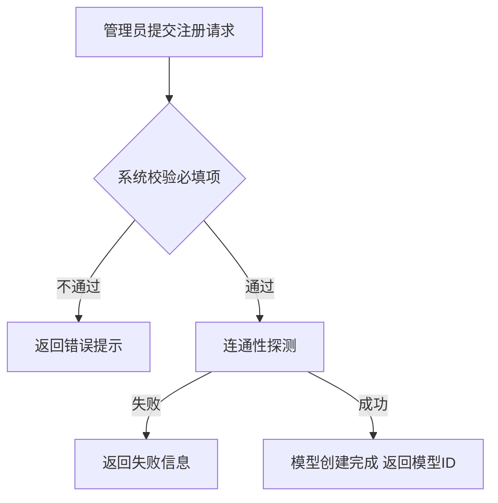
```mermaid
flowchart TD
    A["管理员提交注册请求"] --> B{"系统校验必填项"}
    B -->|"不通过"| C["返回错误提示"]
    B -->|"通过"| D["连通性探测"]
    D -->|"失败"| E["返回失败信息"]
    D -->|"成功"| F["模型创建完成 返回模型ID"]

```

#### 界面原型

**参考示例：**

|  |  |
| --- | --- |

**功能需求：**

*   管理员可通过 API 注册模型（提供方、模型 ID、API Key、成本中心、能力声明等）
    
*   管理员可通过 API 删除模型
    
*   管理员可配置降级链（主备两段式）和查看调用日志
    
*   管理员可触发连通性测试
    

#### 数据说明（业务实体）

| 字段名 | 数据类型 | 长度 | 默认值 | 必需 | 约束说明 |
| --- | --- | --- | --- | --- | --- |
| 模型名称 | 字符 | 1-100 | — | Y | · 全局唯一<br>· 失焦校验<br>· 错误提示「显示名已存在」 |
| 提供方 | 枚举 | — | — | Y | · 选项：OpenAI/阿里云/DeepSeek/Azure/Ollama/GLM/自定义<br>· 选Azure时API版本必填<br>· 选Ollama时API Key可为空· 错误提示「请选择提供方」 |
| 模型类型 | 枚举 | — | 文本 | Y | · 选项：文本/视觉/嵌入/音频<br>· 错误提示「请选择模型类型」 |
| 模型 ID | 字符 | 1-100 | — | Y | · 与提供方组合唯一<br>· 错误提示「请输入模型ID」 |
| API Key | 字符 | 1-500 | — | Y | · 保存时加密<br>· Ollama时可为空<br>· 编辑时留空=不修改<br>· 错误提示「请填写API Key」 |
| API 版本 | 字符 | ≤20 | — | Y | · 仅提供方=Azure时必填· 错误提示「Azure模型必填API版本」 |
| 基础 URL | 字符 | URL格式 | — | Y | · 以http/https开头<br>· 错误提示「请输入合法的URL」 |
| 上下文长度 | 数字 | 1-2000000 | 16384 | Y | · 整数· 错误提示「请输入1-2000000之间的整数」 |
| 最大输出 Token | 数字 | 1-200000 | 8192 | Y | · 整数· 错误提示「请输入1-200000之间的整数」 |
| 支持工具调用 | 布尔 | — | 开 | N | — |
| 支持视觉 | 布尔 | — | 关 | N | — |
| 支持推理 | 布尔 | — | 关 | N | — |
| 支持 JSON 模式 | 布尔 | — | 开 | N | — |
| 温度 | 数字 | 0~2 | 0.7 | N | · 步进0.1 |
| top\_p | 数字 | 0~1 | 1.0 | N | · 步进0.05<br>· 默认1 |
| 输入 Token 单价（每1K） | 数字 | 0-100 | 0.0 | Y | · 错误提示「请输入0-100之间的数字」 |
| 输出 Token 单价（每1K） | 数字 | 0-100 | 0.0 | Y | · 错误提示「请输入0-100之间的数字」 |
| 日 Token 上限 | 数字 | 1-1000000000 | 1000000 | N | · 整数<br>· 错误提示「请输入1-1000000000之间的整数」 |
| 月 Token 上限 | 数字 | 1-10000000000 | 30000000 | N | · 整数· 错误提示「请输入1-10000000000之间的整数」 |
| 备选端点 | 字符 | — | — | N | · 已注册模型中选择· 不能选自己 |

#### 业务规则和约束条件

| **规则项** | **说明** |
| --- | --- |
| 操作审计 | 每次模型操作记录操作人、时间、原因，日志留存≥180天 |
| 幂等性保障 | 重复提交同一操作仅产生1条日志与1次状态变更 |
| 降级轨迹 | 调用日志中记录降级链路（主模型→备选），展示切换耗时与原因 |
| 降级链范围 | MVP 仅主备两段式，每个模型最多 1 个备选 |
| 降级链触发条件 | 5xx 错误 / 超时 / 429 限流 / 余额不足 |
| 降级链不触发条件 | 4xx 错误、上下文超长、内容审查拦截 |
| 降级链备选也失败 | 返回"主备模型均失败"错误 |
| 降级链切换延迟 | 100-10000ms 可配置 |
| 连通性探测触发 | 注册时触发探测；不探测则注册不成功 |
| 连通性探测超时 | ≤5 秒 |
| 连通性状态 | 在线/离线/未知，独立于模型是否可用 |

#### 接口说明

#### 补充说明

无

### MCP Server

#### 功能需求描述

> MCP Server 为智能体提供「外部服务接入能力」——通过标准协议接入外部服务，将外部能力封装为 Tool 供智能体调用。管理员注册后需经连接探测方可启用。

[《工具管理》](https://alidocs.dingtalk.com/api/doc/transit?dentryUuid=r1R7q3QmWe7BgmK3cNlXo1LmJxkXOEP2&queryString=utm_medium%3Ddingdoc_doc_plugin_card%26utm_source%3Ddingdoc_doc)

| **EARS 模式** | **需求描述** |
| --- | --- |
| 普遍型 | 系统应支持管理员注册 MCP Server，将其 Tool 接口注册到工具调用框架 |
| 状态驱动型 | 当 MCP Server 连接异常时，标记该 Server 的 Tool 为不可用并记录告警 |
| 事件驱动型 | 当智能体调用 Tool 时，经工具调用框架统一调度 MCP Server 执行 |
| 不良行为型 | MCP Server 返回异常数据时拦截并降级处理，不传递给用户 |

#### 业务主流程图及说明

**业务流程**：

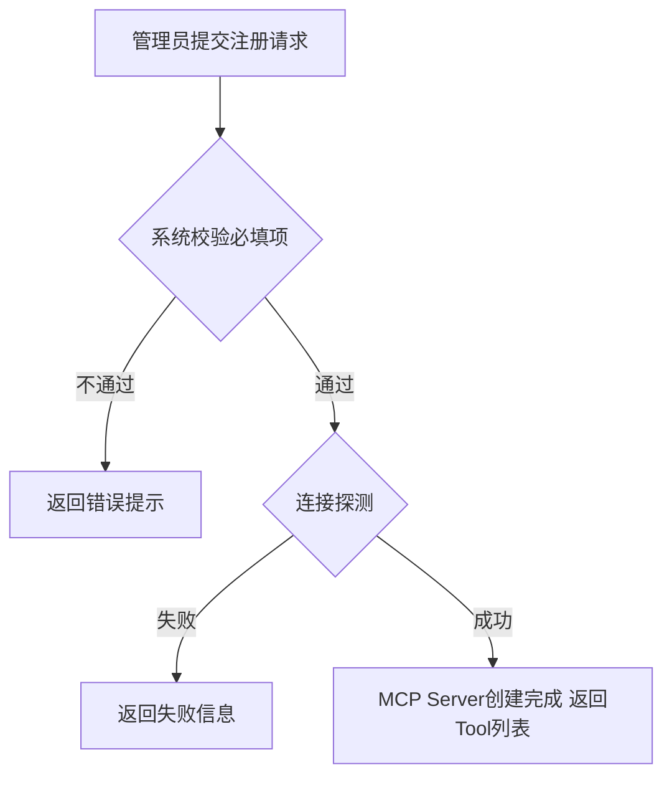
```mermaid
flowchart TD
    A["管理员提交注册请求"] --> B{"系统校验必填项"}
    B -->|"不通过"| C["返回错误提示"]
    B -->|"通过"| D{"连接探测"}
    D -->|"失败"| E["返回失败信息"]
    D -->|"成功"| F["MCP Server创建完成 返回Tool列表"]

```

#### 界面原型

**参考示例：**

|  |  |
| --- | --- |

**功能需求：**

*   管理员可通过 API 注册 MCP Server（slug、名称、传输方式、连接配置）
    
*   管理员可通过 API 删除 MCP Server
    
*   注册时触发连接探测，探测失败则注册不成功
    

#### 数据说明（业务实体）

| **字段名** | **数据类型** | **长度** | **默认值** | **必需** | **约束说明** |
| --- | --- | --- | --- | --- | --- |
| slug | 字符 | 3-50 | — | Y | · 小写字母/数字/下划线<br>· 全局唯一<br>· 错误提示「slug只能包含小写字母、数字和下划线，长度3-50」「slug已存在」 |
| 名称 | 字符 | 1-100 | — | Y | · 错误提示「请输入名称（1-100字）」 |
| 描述 | 字符 | ≤500 | — | N | — |
| 分类 | 字符 | ≤30 | 空 | N | · 支持选择已有或输入新值<br>· 输入新值时自动创建<br>· 默认分类：日常办公、联网搜索、沟通协作、技术开发、浏览器自动化、知识管理、地图导航、其它 |
| 传输方式 | 枚举 | — | stdio | Y | · 选项：stdio/sse/streamable-http<br>· 切换时联动命令/URL字段 |
| 命令（仅stdio） | 字符 | 1-500 | — | 条件Y | · 仅传输方式=stdio时必填<br>· 错误提示「请输入启动命令」 |
| URL（仅sse/streamable-http） | 字符 | URL格式 | — | 条件Y | · 仅传输方式=sse或streamable-http时必填<br>· 错误提示「请输入合法的URL」 |
| 环境变量 | JSON | — | {} | N | · 键名：小写字母/数字/下划线 |
| API Key | 字符 | ≤500 | — | N | · 保存时加密 |
| 超时时间（秒） | 数字 | 1-300 | 30 | N | · 整数· 错误提示「超时时间须在1-300秒之间」 |
| 帮助文档 | 字符 | ≤10000 | — | N | · Markdown格式 |

#### 业务规则和约束条件

**探测规则**：

| **规则项** | **说明** |
| --- | --- |
| 探测触发 | 注册时触发探测；不探测则注册不成功 |
| 探测超时 | ≤5 秒 |
| 探测内容 | 连接可达性 + 协议兼容 + 至少声明 1 个 Tool |
| 错误分类 | CONNECTION\_FAILURE / INVALID\_SPEC / NO\_TOOLS\_DECLARED / AUTH\_FAILED |

#### 接口说明

#### 补充说明

详细列表页、详情页（概览/被引用方）完整设计见基础知识文档《工具管理》

### 原子 Tool

#### 功能需求描述

> 原子 Tool 为智能体提供「最小执行单元」——一个 Tool 只做单一动作（读文件、计算哈希、语义检索等）。内置工具由开发人员在代码中注册，系统启动时自动加载；远程 API 类 Tool 随 MCP Server 注册自动纳管。

[《工具管理》](https://alidocs.dingtalk.com/api/doc/transit?dentryUuid=r1R7q3QmWe7BgmK3cNlXo1LmJxkXOEP2&queryString=utm_medium%3Ddingdoc_doc_plugin_card%26utm_source%3Ddingdoc_doc)

| **EARS 模式** | **需求描述** |
| --- | --- |
| 普遍型 | 系统应以 Tool 为最小粒度执行单元，支持本地函数与远程 API 两类实现，统一在工具调用框架注册与调度 |
| 状态驱动型 | 当 Tool 连接异常时，标记该 Tool 为不可用并记录告警 |
| 事件驱动型 | 当智能体调用 Tool 时，经工具调用框架统一调度执行 |
| 不良行为型 | Tool 返回异常数据时拦截并降级处理，不传递给用户 |

#### 业务主流程图及说明

**业务流程**：

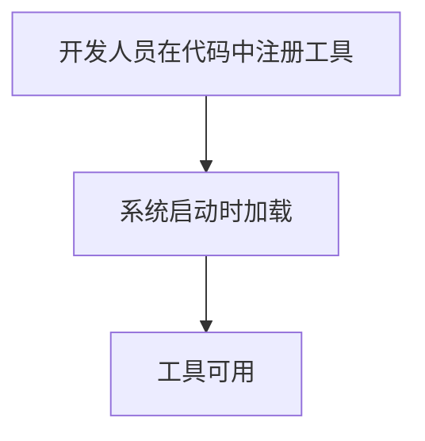
```mermaid
flowchart TD
    A["开发人员在代码中注册工具"] --> B["系统启动时加载"]
    B --> C["工具可用"]

```

#### 界面原型

**功能需求：**

*   内置工具由开发人员在代码中注册，系统启动时自动加载
    
*   管理员可通过 API 手动注册远程 API 类 Tool
    
*   管理员可通过 API 删除 Tool
    

#### 数据说明（业务实体）

| **字段名** | **数据类型** | **长度** | **默认值** | **必需** | **约束说明** |
| --- | --- | --- | --- | --- | --- |
| slug | 字符 | 3-50 | — | Y | · 小写字母/数字/下划线<br>· 全局唯一<br>· 错误提示「slug只能包含小写字母、数字和下划线」 |
| 名称 | 字符 | 1-100 | — | Y | · 错误提示「请输入名称（1-100字）」 |
| 入参 Schema | JSON | — | — | Y | · 需为合法JSON Schema格式<br>· 错误提示「请输入合法的JSON Schema」 |
| 实现方式 | 枚举 | — | — | Y | · 选项：builtin/remote |
| 分类 | 字符 | ≤30 | 空 | N | · 支持选择已有或输入新值<br>· 输入新值时自动创建<br>· 默认分类：日常办公、联网搜索、沟通协作、技术开发、浏览器自动化、知识管理、地图导航、其它 |
| 描述 | 字符 | ≤500 | 空 | N | — |

#### 业务规则和约束条件

| **规则项** | **说明** |
| --- | --- |
| 单一动作 | 一个 Tool 只做单一动作 |
| 扩展方式 | 内置工具代码自带，可通过手动注册新增工具 |

#### 接口说明

#### 补充说明

统一注册表设计（tool.type 区分 builtin/mcp/skill）、详情页设计（概览/被引用方）见基础知识文档《工具管理》

---

### Skill

#### 功能需求描述

> Skill 为智能体提供「业务编排能力」——由多个 Tool + 条件判断 + 业务流程编排而成，以标准化 .skillpkg 包交付。Skill 分只读（自动执行）和写入（需三段式安全审批）两类。

[《工具管理》](https://alidocs.dingtalk.com/api/doc/transit?dentryUuid=r1R7q3QmWe7BgmK3cNlXo1LmJxkXOEP2&queryString=utm_medium%3Ddingdoc_doc_plugin_card%26utm_source%3Ddingdoc_doc)

| **EARS 模式** | **需求描述** |
| --- | --- |
| 普遍型 | 系统应支持管理员上传/创建 Skill（Tool 编排 + 安全策略配置 + 版本管理）；专家与快捷指令通过绑定 Skill 获得能力 |
| 状态驱动型 | 当 Skill 绑定的 Tool/MCP 不可用时，标记该 Skill 为降级状态 |
| 事件驱动型 | 写入 Skill 执行时强制走三段式审批流；只读 Skill 直接执行 |
| 不良行为型 | 不向普通员工暴露 Skill 配置细节（Tool 编排逻辑、安全策略） |

#### 业务主流程图及说明

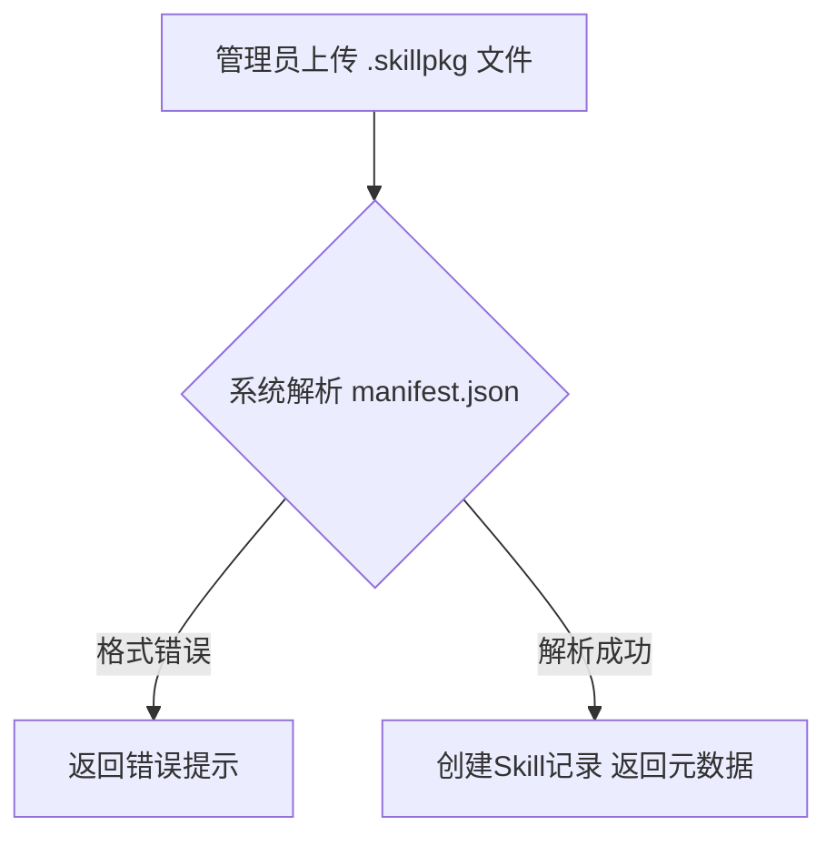
```mermaid
flowchart TD
    A["管理员上传 .skillpkg 文件"] --> B{"系统解析 manifest.json"}
    B -->|"格式错误"| C["返回错误提示"]
    B -->|"解析成功"| D["创建Skill记录 返回元数据"]

```

#### 界面原型

**参考示例：**

|  |  |
| --- | --- |

**功能需求：**

*   管理员可在后台上传 .skillpkg 包（自动解析元数据）或手动创建 Skill
    
*   管理员可通过 API 创建/删除 Skill
    
*   写入 Skill 执行时走安全审批三段式（运行时规则，不在此模块定义）
    

#### 数据说明（业务实体）

| **字段名** | **数据类型** | **长度** | **默认值** | **必需** | **约束说明** |
| --- | --- | --- | --- | --- | --- |
| slug | 字符 | 3-50 | — | Y | · 小写字母/数字/下划线<br>· 全局唯一<br>· 来自manifest.json.slug |
| 名称 | 字符 | 1-100 | — | Y | · 来自manifest.json.name<br>· 可覆盖编辑 |
| 描述 | 字符 | ≤500 | — | N | · 来自manifest.json.description<br>· 可覆盖编辑 |
| 版本 | 字符 | 语义化版本 | — | Y | · 来自manifest.json.version<br>· **不可手动编辑** |
| 分类 | 字符 | ≤30 | — | N | · 支持选择已有或输入新值<br>· 输入新值时自动创建<br>· 默认分类：日常办公、联网搜索、沟通协作、技术开发、浏览器自动化、知识管理、地图导航、其它 |
| 图标 | 图片 | ≤2MB | — | N | · 优先显示包内icon.png<br>· 可上传覆盖 |
| 帮助文档 | 字符 | ≤10000 | — | N | · Markdown格式· 从README.md自动加载· 可编辑 |
| .skillpkg 文件 | 文件 | ≤50MB | — | Y | · ZIP格式· 需含合法manifest.json· 错误提示「请上传有效的.skillpkg文件」 |

#### 业务规则和约束条件

| **规则项** | **说明** |
| --- | --- |
| 版本号来源 | 取自 manifest.json，不可手动修改 |
| 降级 | 绑定 Tool/MCP 不可用时标记 Skill 为降级状态 |
| 安全审批 | 写入 Skill 运行时强制三段式（沙箱模拟→预览→确认）；只读豁免 |

#### 接口说明

#### 补充说明

*   **Skill分类**
    
    | **类型** | **定义** | **示例** | **执行方式** |
    | --- | --- | --- | --- |
    | 只读 Skill | 查询、读取、预览类操作，不产生副作用 | 知识库问答、文件搜索、数据报表查询 | Agent 自动调用，无需人工确认 |
    | 写入 Skill | 修改、创建、删除类操作，产生持久化变更 | 文件入库、Git 提交、钉钉待办创建 | 必须「沙箱模拟 → 预览 → 确认 → 正式执行」三段式 |
    
*   **Skill 包规范（.skillpkg）**
    

```plaintext
{skill-name}.skillpkg
├── manifest.json    # 元数据：name/slug/version/description/capabilities
├── code/            # 执行逻辑
├── resources/       # 模板/规则文件
└── README.md        # 使用说明

```

*   文件大小 ≤ 50MB
    
*   manifest.json 中的 slug 全局唯一，版本号由包内定义不可手动修改
    

### 智能体 Agent

#### 功能需求描述

> 智能体是前面所有能力模块（模型、Prompt、工具、知识库、记忆）的编排组合。Agent 配置即是对这些能力的消费——选择模型、绑定工具、编写系统提示词、挂载知识库，最终发布为面向用户的可用服务。

> `Agent = LLM + Prompt 配置 + 记忆体系 + 工具调用调度 + MCP 工具池 + 沙箱环境 + 安全审批控制器`

[《智能体管理》](https://alidocs.dingtalk.com/api/doc/transit?dentryUuid=R1zknDm0WR3Q7YRDS0K2kGRyVBQEx5rG&queryString=utm_medium%3Ddingdoc_doc_plugin_card%26utm_source%3Ddingdoc_doc)

| **EARS 模式** | **需求描述** |
| --- | --- |
| 普遍型 | 系统应支持管理员创建 Agent，配置模型/Prompt/工具/知识库/记忆窗口 |
| 状态驱动型 | 已删除状态对前端不可调用。 |
| 事件驱动型 | Agent 发布后刷新前端可调用列表 |
| 不良行为型 | 不向普通员工暴露 Agent 后台配置（Prompt 原文/工具绑定/知识库）；配置的模型/工具被禁用时阻断发布。 |

#### 业务主流程图及说明

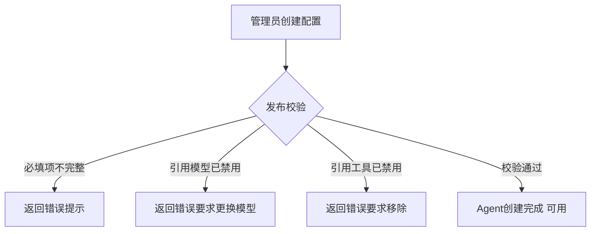
```mermaid
flowchart TD
    A["管理员创建配置"] --> B{"发布校验"}
    B -->|"必填项不完整"| C["返回错误提示"]
    B -->|"引用模型已禁用"| D["返回错误要求更换模型"]
    B -->|"引用工具已禁用"| E["返回错误要求移除"]
    B -->|"校验通过"| F["Agent创建完成 可用"]

```

#### 界面原型

**参考示例：**

|  |  |  |  |
| --- | --- | --- | --- |

**功能需求：**

*   管理员可通过 API 创建 Agent 并发布（填写名称/分类/角色/模型/系统提示词/工具/知识库等）
    
*   创建时进行发布校验（必填项、模型启用状态、工具启用状态）
    
*   管理员可通过 API 删除 Agent
    
*   设置页面支持设置智能体权限
    

#### 数据说明（业务实体）

| **字段名** | **数据类型** | **长度** | **默认值** | **必需** | **约束说明** |
| --- | --- | --- | --- | --- | --- |
| 名称 | 字符 | 1-100 | — | Y | · 同一负责人下唯一<br>· 不支持特殊字符`/\<>`· 失焦校验<br>· 错误提示「名称已存在」 |
| 描述 | 字符 | ≤500 | — | N | — |
| 分类 | 字符 | ≤30 | 通用 | Y | · 支持选择已有或输入新值<br>· 输入新值时自动创建<br>· 默认分类：通用助手、企业办公、数据分析、市场调研、内容创作、其他 |
| 角色 | 枚举 | — | 通用 | Y | · 选项：通用/专家<br>· 错误提示「请选择角色」 |
| 模型 | 枚举 | — | — | Y | · 仅可选已启用模型<br>· 切换时提示「请重新测试智能体效果」<br>· 错误提示「请选择模型」 |
| 系统提示词 | 字符 | 1-10000 | — | Y | · 支持`{{变量}}`语法<br>· 错误提示「请输入系统提示词」 |
| 知识库 | 数组 | — | \[\] | N | · 多选· 知识库删除时仅警告不阻断 |
| 启用记忆 | 布尔 | — | 关 | N | · 开关控制记忆窗口字段显示/隐藏 |
| 记忆窗口 | 数字 | 1-100 | 10 | 条件Y | · 启用记忆后必填· 启用记忆时显示· 错误提示「记忆窗口须在1-100之间」 |
| 工具 | 数组 | — | \[\] | N | · 仅可多选已启用工具<br>· 工具选择器支持搜索+分类筛选 |

#### 业务规则和约束条件

| **检查项** | **是否阻断** | **失败处理** |
| --- | --- | --- |
| 必填项完整 | 是 | 提示"必填项未填写完整：{字段列表}" |
| 主模型已启用 | 是 | 提示"模型{名称}已禁用，请更换" |
| 工具全部已启用 | 是 | 提示"工具{名称}已禁用，请先启用或移除" |
| 知识库已删除 | 否（仅警告） | 警告"知识库{名称}已删除，请移除" |

#### 接口说明

#### 补充说明

*   **记忆体系**（MVP 落地前两层，长期为后续迭代）：
    
    | **记忆类型** | **定位** | **载体** | **阶段** |
    | --- | --- | --- | --- |
    | 瞬时记忆 | 当前 Session 上下文窗口，受 memoryWindow 约束（默认 5 轮） | LLM Token 窗口 | MVP |
    | 短期记忆 | 跨会话语义召回：会话结束→摘要→文本切片+向量嵌入→LanceDB→新会话语义匹配召回 | LanceDB 向量库 | MVP |
    | 长期记忆 | 跨会话实体关系：存储实体、关系、项目约束，支持多跳推理 | Graphiti 图谱 | 后续迭代 |
    
*   **沙箱环境：**Agent 执行手脚的隔离环境，保证智能体运行安全性。
    

**【V2.0更新】**

### 智能体权限配置

#### 功能需求描述

> 系统管理员可在「设置 → 智能体管理」中对每个智能体设置可见范围。默认所有智能体均不可见；管理员可通过权限设置弹窗将智能体授权给指定部门或指定人员。未被授权的用户在首页智能体列表、专家模式选择页等入口均看不到该智能体。

| **EARS 模式** | **需求描述** |
| --- | --- |
| 普遍型 | 系统应在「设置 → 智能体管理」列表的每行操作列提供 `···` 菜单，菜单中包含「权限设置」选项。系统应在用户点击「权限设置」后，在页面中间上方居中弹出「权限设置」弹窗。系统应在弹窗中提供「部门」「人员」两个授权维度 Tab，管理员可选择部门或人员进行授权。系统应将授权动作解释为：允许被授权对象查看并使用该智能体。 |
| 状态驱动型 | 当智能体未做权限设置时，系统应默认对全公司不可见。当已授权部门发生人员变动（入职/离职/调岗）时，系统应自动同步权限：新加入部门的人员自动获得访问权，离开部门的人员自动失去访问权。当用户无权限时，系统应在各入口隐藏该智能体，用户无法通过 URL 等方式感知其存在。 |
| 事件驱动型 | 当用户点击「保存设置」时，系统应校验并全量保存当前授权列表。当用户点击「移除」某成员/部门时，系统应展示二次确认弹窗。当用户切换 Tab 时，系统应保留当前已选内容，不丢失草稿状态。 |
| 不良行为型 | 系统管理员不可通过界面移除自身的管理权限。系统应防止用户通过直接调用接口方式访问无权限智能体，后端需做鉴权拦截。系统不应在弹窗中展示角色组维度。 |

#### 业务主流程图及说明

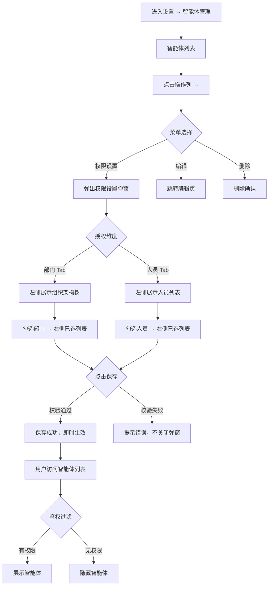
```mermaid
flowchart TD
    A["进入设置 → 智能体管理"] --> B["智能体列表"]
    B --> C["点击操作列 ···"]
    C --> D{"菜单选择"}
    D -->|"权限设置"| E["弹出权限设置弹窗"]
    D -->|"编辑"| F["跳转编辑页"]
    D -->|"删除"| G["删除确认"]
    E --> H{"授权维度"}
    H -->|"部门 Tab"| I["左侧展示组织架构树"]
    H -->|"人员 Tab"| J["左侧展示人员列表"]
    I --> K["勾选部门 → 右侧已选列表"]
    J --> L["勾选人员 → 右侧已选列表"]
    K --> M{"点击保存"}
    L --> M
    M -->|"校验通过"| N["保存成功，即时生效"]
    M -->|"校验失败"| O["提示错误，不关闭弹窗"]
    N --> P["用户访问智能体列表"]
    P --> Q{"鉴权过滤"}
    Q -->|"有权限"| R["展示智能体"]
    Q -->|"无权限"| S["隐藏智能体"]
```

**说明**：保存后即时生效，用户再次进入智能体相关入口时按最新权限过滤展示。

#### 界面原型


**操作菜单入口（智能体列表）**

| **元素** | **交互** | **说明** |
| --- | --- | --- |
| 【二级菜单入口 `···`】点击 | 在操作列右下侧弹出二级菜单 | — |
| 【权限设置】点击 | 点击后弹出「权限设置」弹窗，弹窗在页面中间上方居中显示 | — |

**权限设置界面**

| **元素** | **文案/交互** | **说明** |
| --- | --- | --- |
| 弹窗标题 | 「权限设置 - {智能体名称}」 | 标题居中，右上角关闭按钮 |
| 【信息卡片】 | 展示当前已经配置成员，包含人员、部门两种类型 | 默认选中「部门」 |
| 【删除】点击 | 弹窗二次确认：标题「确认移除」；内容「确定移除 {部门/人员名称} 的访问权限？移除后，该对象将无法继续使用此智能体。」；按钮「取消」「确定」 | 菜单权限 |
| 【取消】点击 | 取消当前配置，回到上一状态，弹窗二次确认：标题「确认取消」；内容「确定取消，还有未保存的设置」；按钮「取消」「确定」 | 未做改变时不需提醒 |
| 【保存设置】点击 | 保存当前配置，存入数据库，立即生效 | 未做改变时置灰，保存前做全量校验 |
| 空态 | 「暂未授权，请选择部门或人员」 | 未选择任何对象时展示 |

**添加成员界面**

| **元素** | **文案/交互** | **说明** |
| --- | --- | --- |
| 弹窗标题 | 「添加成员」 | 标题居中，右上角关闭按钮 |
| 【搜索】输入内容 | 「搜索部门/花名」 | 输入框，支持输入名称、花名左右匹配关联部门，人员 |
| 【Tab】点击切换 | 「部门」「人员」两个 Tab，居中排列在标题下方 | 默认选中「部门」 |
| 【左侧选区】（部门 Tab） | 展示公司组织架构树，支持展开/收起、勾选父级自动勾选子级、搜索部门；已选中的部门在列表中置灰，在右侧已选列表中展示，避免重复添加。 | 已选中的部门在右侧列表展示，参考组件：<br>[Tree 树形控件 \| Element Plus](https://element-plus.org/zh-CN/component/tree)<br>[树形控件 Tree - Ant Design](https://ant.design/components/tree-cn) |
| 【左侧选区】（人员 Tab） | 展示人员列表，支持按花名搜索、分页加载、勾选；已选中的人员在列表中置灰，避免重复添加。 | 已选中的人员在右侧列表展示 |
| 【已选列表】展示 | 展示当前已选部门/人员，每行显示名称 + 类型标签（部门/人员）+ 移除按钮 | 点击移除按钮删去对应人员、部门 |
| 【取消】点击 | 取消当前配置，回到上一状态，弹窗二次确认：标题「确认取消」；内容「确定取消，还有未保存的设置」；按钮「取消」「确定」 | 未做改变时不需提醒 |
| 【保存设置】点击 | 保存当前配置，存入数据库，立即生效 | 未做改变时置灰，保存前做全量校验 |

#### 数据说明（业务实体）

**无**

#### 业务规则和约束条件

| **规则项** | **说明** |
| --- | --- |
| 默认可见范围 | 智能体创建后默认对全公司不可见（即未设置权限 = 全员不可用）。一旦管理员保存了授权列表，仅授权对象可见。 |
| 按钮可见范围 | 只有管理员角色可以看到相关的菜单功能、按钮。 |
| 授权维度 | 仅支持「组织架构（部门）」和「人员」两个维度，暂不支持角色组。 |
| 部门授权含义 | 勾选部门 = 该部门下所有在职人员均获得访问权。人员入职/离职/调岗后，系统每日同步或实时同步组织架构变更，自动生效。 |
| 人员授权含义 | 单独勾选某个人员，无论其部门如何，均获得访问权。 |
| ~~权限冲突~~ | ~~若用户所在部门已授权，同时该用户又在人员 Tab 被单独移除，以人员维度为准（人员移除优先于部门授权）。~~ |
| ~~管理员特权~~ | ~~系统管理员天然拥有所有智能体的查看和管理权限，不受授权列表限制；但管理员不可在弹窗中移除自己的管理权限（在后端数据表中可设置）。~~ |
| 保存策略 | 弹窗内所有变更均为草稿状态，点击「保存设置」后全量校验并落库；点击「取消」或关闭弹窗则放弃本次变更。 |
| 重复选择 | 已选中的部门/人员在列表中置灰，避免重复添加。 |

#### 接口说明（可选）

**无**

#### 补充说明

*   部门 Tab 与人员 Tab 的数据源均来自钉钉通讯录，保持与公司组织架构一致。
    
*   本期不做「角色组」维度，若后续需要，可复用本弹窗结构扩展第三个 Tab。
    

### 额度管理与成本归因（延后）

#### 功能需求描述

> 额度管理为智能体提供「成本可控」保障——防止单用户/单 Agent 过度消耗导致成本失控。**MVP 聚焦个人级配额**，部门级和企业级为后续迭代。

[《模型管理》](https://alidocs.dingtalk.com/api/doc/transit?dentryUuid=G1DKw2zgV2RYlEQ6fqABKzmNVB5r9YAn&queryString=utm_medium%3Ddingdoc_doc_plugin_card%26utm_source%3Ddingdoc_doc)

| **模式** | **描述** |
| --- | --- |
| 普遍型 | 系统应支持管理员为每个用户配置金币日额度、金币月额度、单任务金币上限、请求限速和 Token 安全天花板；系统应记录每笔模型调用的 Token 消耗、金币变动与成本（含峰谷）。 |
| 状态驱动型 | 当用户配额消耗达 70%/90% 时，系统应发送对应级别告警；当消耗达 100% 时，系统应拦截调用并返回配额耗尽错误。 |
| 事件驱动型 | 每次模型调用完成后，系统应更新用户配额计数器；每日/每月 0:00 自动重置对应周期配额。 |
| 不良行为型 | 配额统计数据延迟不超过 5 秒；重置操作失败时保留当前计数器不变并告警。 |

#### 业务主流程图及说明

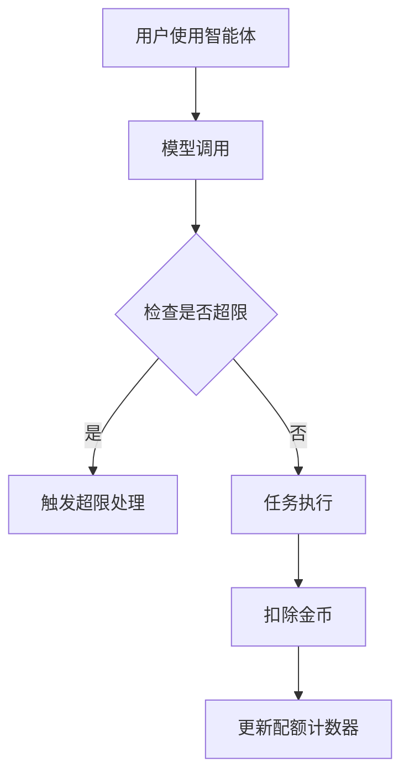
```mermaid
graph TD
    A[用户使用智能体] --> B[模型调用]

    B --> E{检查是否超限}
    E -->|是| F[触发超限处理]
    E -->|否| G[任务执行]
    G --> C[扣除金币]
    C --> D[更新配额计数器]
```

#### 界面原型


*   管理员可在后台查看用户配额用量（日/月金币额度、Token 消耗）
    
*   管理员可为用户、部门配置金币日额度、月额度
    
*   系统自动发送告警（70% 黄色站内信、90% 红色站内信+邮件、100% 拦截）
    

> 管理员后台新增「额度配置」模块，按人配置个人日额度/月额度/单任务上。；**此界面仅管理员可见，不对普通用户开放。**支持按组织架构（部门维度）聚合查看全公司数据。</span>

| **配置项** | **操作** | **说明** |
| --- | --- | --- |
| 个人日额度配置 | 管理员按人设置每日金币上限 | 每日 0:00 重置 |
| 个人月额度配置 | 管理员按人设置月度金币上限 | 每月 1 日 0:00 重置 |
| 单任务上限配置 | 管理员按人设置单次 Agent 调用最大金币消耗 | 防失控 |
| 用量看板 | 按部门聚合展示全员用量（支持按部门、按人筛选） | 仅管理员可见 |

#### 额度管理

**配额说明**

| **配额类型** | **说明** | **MVP 默认值** | **可配置** |
| --- | --- | --- | --- |
| 金币日额度 | 单用户每日登陆可领取金币数量（业务配额主单位），额度每月重制，未使用清零 | 50 金币（≈¥5） | 管理员后台可调 |
| 金币月额度 | 单用户每月累计可消耗金币上限 | 1500 金币（≈¥150） | 管理员后台可调 |
| 单任务金币上限 | 单次 Agent 调用最大金币消耗，防失控 | 500 金币 | 管理员后台可调 |
| 请求限速 | 日常模式 60 req/min；专家模式 planExecute 10 req/min；令牌桶允许短时突发（峰值 10 QPS） | 60 req/min | 管理员后台可调 |
| Token 安全天花板 | 后端防失控硬上限，与金币额度并存、任一达顶即拦截 | 日 100 万 / 月 3000 万 / 单任务 50 万 | 管理员后台可调 |

**生成前额度预检**

| **规则项** | **说明** |
| --- | --- |
| 预估公式 | 预估消耗 = 该用户历史会话平均 Token × 2（系数可调，后续按实测校准） |
| 预检时机 | 用户发送消息、AI 开始生成之前 |
| 预检逻辑 | 预估消耗金币 > 个人可用额度 → 硬拦截，不启动生成，提示「额度不足，请联系管理员」 |
| 预估不足处理 | 预估通过但实际消耗超出：进行中任务允许跑完，超额部分记为负数，下次重置时扣减 |

**预警与超限行为**

| **用量区间** | **行为** | **告警方式** |
| --- | --- | --- |
| 0–70% | 正常调用 | 无 |
| 70–90% | 正常调用 | 站内tosat提醒（黄色）：「您的{日/月}金币额度已使用 {百分比}%」 |
| 90–100% | 正常调用 | 站内tosat提醒（红色）：「金币额度即将耗尽，建议联系管理员」 |
| \>100% | **硬超限**：调用被拦截 | 返回配额耗尽错误（格式见下方） |

**超限错误响应**（MVP 暂不支持金币兑换 token，用尽即拦截并提示）：

```plaintext
调用失败：{日/月} 金币额度已用尽
配额类型：个人{日/月}金币额度
上限：{上限值} 金币
已用：{已用值} 金币
重置时间：{下次重置时间}
提示：今日金币额度已用完，请明日 0:00 重置后使用
```

#### 使用记录

|  |  |
| --- | --- |

**用量汇总：**

*   **统计周期**：滚动近 30 天（例如当前为 2026-06-20 ~ 2026-07-20）。
    
*   **展示内容**：
    
    *   **总消耗**：XX.XX 金币（卡片顶部）
        
    *   **日常办公**：XX.XX 金币（占比 X%、同比环比变化）
        
    *   **专家模式**：XX.XX 金币（占比 X%、同比环比变化）
        
    *   **小智问答**：XX.XX 金币（占比 X%、同比环比变化）
        

**筛选项：**

| **筛选项** | **类型** | **说明** |
| --- | --- | --- |
| **时间范围** | 日期时间选择器 | 默认近7天，支持周维度、月维度、自定义起止 |
| **模型** | 下拉单选 | 选项：全部 / deepseek v4 flash / deepseek v4 pro |

**明细列表：**

| **列名** | **说明** |
| --- | --- |
| **调用时间** | 格式 `YYYY-MM-DD HH:mm:ss` |
| **消耗金币** | 负值显示，如 `-1.00`；0 消耗显示为 `0` |
| **模型** | 显示 `deepseek v4 flash` 或 `deepseek v4 pro` |
| **请求内容** | 显示请求 ID 及输入摘要（截断至 30 字符，悬停显示完整内容） |

*   默认按 **调用时间倒序**（最新在上）。
    
*   **双击列头**（时间、消耗、模型）可切换该列的升序/降序排序（单击不触发，仅双击）。
    

*   每页默认 **20 条，**显示总页数和当前页码，支持跳转至指定页。
    

*   无数据时显示：“当前条件下暂无用量记录，请调整筛选范围”。
    
*   加载失败时提供重试按钮。
    

**权限：**

*   普通成员：仅查看自己的调用记录。
    
*   系统管理员：查看空间内所有记录（增加部门、角色组维度聚合；增加具体token消耗值、实际金额）。
    

**【V2.0更新】**

#### 数据同步

**测试阶段，需要统计用户的会话轮次、token消耗、金额消耗，用以判断活跃度、贡献度，以周为单位进行轮换。**

**需求描述**

1.  **统计每个用户的①昨日日常办公会话轮次、七日日常办公会话轮次、累计日常办公会话轮次；②昨日专家模式会话轮次、七日专家模式会话轮次、累计专家模式会话轮次；③昨日token消耗、七日token消耗、累计token消耗；④昨日金额消耗、七日金额消耗、累计金额消耗**
    
2.  ~~**通过钉钉表格更新api每日03:00定时更新表格**~~  
    表格形式以机器人形式发在群里
    

:::
[请至钉钉文档查看附件《天马智擎内测反馈》。](https://alidocs.dingtalk.com/i/nodes/MNDoBb60VLrZLmzBSmvN7QEL8lemrZQ3?corpId=&iframeQuery=anchorId%3DX02mspi45ptybiac7yqsvh&rnd=0.3710230345405159)

~~文档ID： Qnp9zOoBVBZjOMrBcPx1x1RyV1DK0g6l~~

~~appid: 3f2c7fb8-bbe8-496c-b627-df50b5ca58bc~~

~~appkey: dingblrnbsrghgoqfv0w~~

~~userid: 01405913263935454995~~
:::

**指标定义**

| **指标** | **定义** |
| --- | --- |
| 会话轮次 | 用户主动发起的一次提问 + AI 的一次回答 = 1 轮，按日颗粒度汇总统计用户维度数据 |
| 消耗 Token | 大模型反馈的实际输入输出token、缓存命中token，单位千token，保留两位小数，按日颗粒度汇总统计用户维度数据 |
| 消耗金额(元) | Token × 模型实时单价，单位元，保留两位小数，按日颗粒度汇总统计用户维度数据 |

**定时推送**

> 后端调用日志 → cron 每日聚合 → 调用钉钉开放 API更新多维表。

| **规则项** | **说明** |
| --- | --- |
| 数据源 | 后端模型调用日志（已有，C1 情况：后端有数据，需整理汇总后推送） |
| 聚合维度 | 按 (人 × 日期 × 模式) 聚合 (昨日 × 七日 × 累计) 会话轮次/Token/金额 |
| 推送方式 | 调用钉钉开放 API更新 多维表，按 (userid) 主键幂等覆盖 |
| 推送频率 | 每日定时3:00执行任务（cron），覆盖数据，不追加历史行 |
| 失败重试 | 任务失败后默认重试两次，仍然失败执行告警，钉钉发送消息 |

#### 成本归因

| ~~**规则项**~~ | ~~**说明**~~ |
| --- | --- |
| ~~成本归属~~ | ~~每笔模型调用标记调用方（用户 ID + Agent ID + 会话 ID），用于成本分摊~~ |
| ~~消耗记录~~ | ~~记录：时间、用户、Agent、会话、模型、输入/输出 Token 数、~~~~**金币变动**~~~~、~~~~**金币余额**~~~~、成本（元，按实时单价含峰谷）~~ |
| ~~成本报表~~ | ~~管理员后台可按用户/Agent/日期维度查看消耗汇总与趋势~~ |

#### 金币体系（预留）

*   ~~**每日赠送发放条件**~~~~：每日赠送金币~~~~**仅在用户登录系统（SSO 登录）时发放**~~~~，登录后即时到账；当月有效、次月 0:00 清零；未登录不发放。~~
    
*   ~~**金币消耗扣减公式（不可配置）**~~~~：~~ `~~金币消耗 = 实际 Token × 模型实时单价× 难度乘数 → 按固定 10 金币=1 元折算 → 四舍五入保留 2 位小数、单次最低扣 0.1 金币~~`~~。~~
    
    > ~~反模式提醒：不得平铺「每 1000 Token = X 金币」的可配置比例——以人民币作为中间绑定物。~~
    
*   ~~**抵扣优先级（MVP）**~~~~：① 每日赠送额度（优先）；② 历史剩余额度~~
    
*   ~~打通OA系统：MVP 暂不支持「金币余额兑换 token」，~~~~**用尽即拦截并提示明日登陆领取金币，或联系系统管理员**~~
    

## 功能详情

### 整体布局

#### 功能需求描述

> 首页采用三栏布局：中部输入框（对话入口）为焦点，左侧历史会话列表默认收起，右侧文件预览面板默认收起。首次进入时仅展示中部输入框，中间对话区最大化。左右栏可独立展开/收起，互不强制联动。MVP 仅适配桌面端，可用宽度不足时面板以覆盖或抽屉方式展开而非挤压主区。

| **EARS 模式** | **需求描述** |
| --- | --- |
| 普遍型 | 系统应在首页采用三栏布局（中部输入框 + 左会话栏 + 右预览栏）；系统应将左栏与右栏默认设为收起（图标态），中间对话区最大化。 |
| 状态驱动型 | 当左栏/右栏收起时，系统应仅展示对应图标，点击图标展开；当两侧均收起时，系统应将对话区最大化。 |
| 事件驱动型 | 当用户点击左栏图标时，系统应展开历史会话列表；当用户点击文件卡片时，系统应展开右栏预览面板。 |
| 不良行为型 | 系统不应强制左右栏联动展开/收起；当可用宽度不足时，系统不应挤压主区而应以抽屉覆盖。 |

#### 业务主流程图及说明

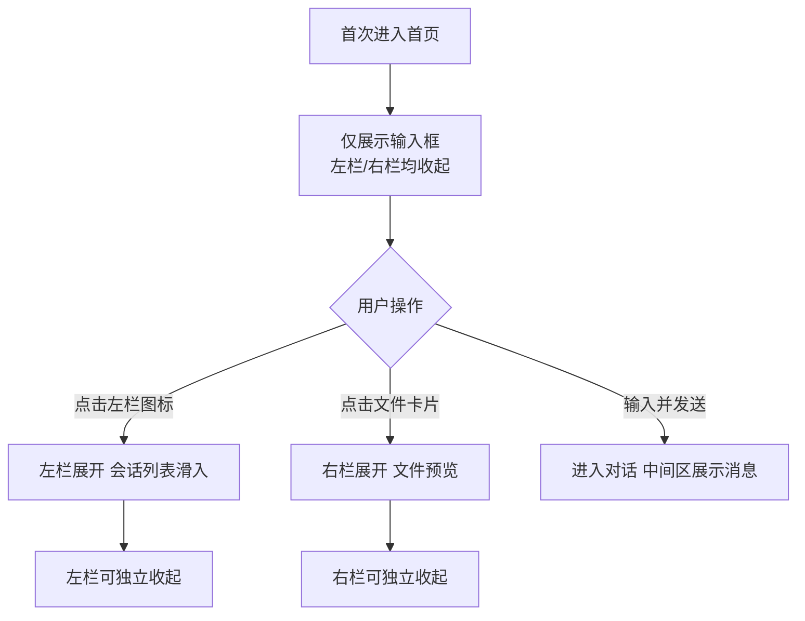
```mermaid
flowchart TD
    A["首次进入首页"] --> B["仅展示输入框<br/>左栏/右栏均收起"]
    B --> C{"用户操作"}
    C -->|"点击左栏图标"| D["左栏展开 会话列表滑入"]
    C -->|"点击文件卡片"| E["右栏展开 文件预览"]
    C -->|"输入并发送"| F["进入对话 中间区展示消息"]
    D --> G["左栏可独立收起"]
    E --> H["右栏可独立收起"]

```

说明：左栏与右栏独立展开/收起，互不强制联动；收起后仅展示图标。

#### 界面原型


| **操作** | **交互** | **异常处理** | **截图示例** |
| --- | --- | --- | --- |
| 【登陆】通过账密、验证码、钉钉认证登陆 | 登录系统，进入系统主页 | 密码错误，超时，提示重试 |  |
| 【忘记密码】 | 手机验证码进行验证，重新设置密码 | 密码错误，超时，提示重试 |  |
| 【默认】通过SSO授权，首次进入首页 | 输入框居中展示，左栏收起，右栏不出现 | 首页加载失败：提示重试 |  |
| 【对话】开始对话后 | 输入框移至中间区底部，仅保留「添加文件」「联网查询」「发送/中止」按钮 | — |  |
| 【天马智擎首页/左上方logo】点击 | 回到新建会话的初始化界面 | — |  |
| 【左栏】点击左栏展开图标 | 历史会话列表滑入展示 | 加载失败：展示错误提示+重试按钮 |  |
| 【左栏】点击左栏收起图标 | 列表滑出，仅保留图标 | — |  |
| 【右栏】点击文件卡片 | 右栏展开，渲染文件预览 | 加载失败：预览面板内错误提示+重试 |  |
| 【右栏】点击右栏关闭预览 | 右栏收起为图标态 | — |  |
| 【头像】点击右上角头像 | 弹出下拉菜单（编辑个人资料、退出当前账号） | — |  |
| 【头像】点击编辑个人资料 | 弹出编辑弹窗：上传头像（png/jpg）+ 修改名字（默认公司花名） | 头像格式不支持：提示「仅支持 png、jpg」 |  |
| 【头像】点击退出当前账号 | 退出登录，需要二次确认，跳转到登录扫码认证界面 | — |  |

#### 数据说明（业务实体）

| **字段名** | **数据类型** | **长度** | **默认值** | **必需** | **约束说明** |
| --- | --- | --- | --- | --- | --- |
| 头像图片 | 图片 | ≤10MB | 无头像时显示用户名首字 | N | · 仅png/jpg格式 <br>· 自动裁剪为正方形居中显示 <br>· 超限：「文件大小超过10MB限制」 |
| 用户名字 | 字符 | 1-50 | SSO花名 | Y | · 必填<br>· 空值阻止保存<br>· 修改后全局生效 <br>· 错误提示「姓名不能为空」 <br>· 成功提示「个人资料已更新」 |
| 登录方式 | 枚举 | — | 钉钉扫码 | — | · 选项：钉钉扫码/账密/验证码<br>· 登录页展示三种方式 |
| 账号 | 字符 | — | — | Y | · 用户名或11位手机号<br>· 错误提示「请输入正确的账号格式」 |
| 密码 | 字符 | 6-20 | — | Y | · 账密登录时必填<br>· 连续5次失败锁定15分钟 · 错误提示「账号或密码错误」 |
| 手机号 | 字符 | 11位数字 | — | Y | · 验证码登录时必填 <br>· 格式校验：纯数字11位 <br>· 错误提示「请输入正确的手机号」 |
| 验证码 | 字符 | 6位数字 | — | Y | · 60秒有效期 <br>· 获取后倒计时60s不可重复获取 <br>· 错误提示「验证码错误请重新输入」<br>· 发送失败「验证码发送失败请重试」 |

#### 业务规则和约束条件

| **规则项** | **说明** |
| --- | --- |
| 默认状态 | 左栏收起、右栏收起、仅输入框为焦点 |
| 面板独立 | 左栏与右栏独立展开/收起，互不强制联动 |
| 图标态 | 收起后仅展示图标，点击图标展开 |
| 响应式 | MVP 仅适配桌面端（≥ 1280px 标准布局）；可用宽度不足时面板以抽屉覆盖方式展开 |
| 面板宽度 | 左侧栏 260px（展开）/ 0px（收起）；右侧栏自适应，最小 320px；中间区最小 480px |
| 账号菜单 | 右上角头像点击弹出下拉菜单，含编辑个人资料和退出账号 |
| 退出登录 | 退出需要二次确认，后跳转登录扫码认证界面，会话列表清空 |

#### 接口说明

| **接口** | **说明** |
| --- | --- |
| getLayoutS | 拉取用户布局状态 |
| updateLayo | 更新布局状态（展开/收起） |

#### 补充说明

无。

### 历史会话（左栏）

#### 功能需求描述

> 左栏用于管理当前用户的历史会话。默认完全收起（图标态），由用户主动展开。展开后展示会话列表，支持新建、搜索、重命名、删除，并以更新时间分组。

| **EARS 模式** | **需求描述** |
| --- | --- |
| 普遍型 | 系统应在左栏（展开后）展示当前用户的历史会话列表，支持新建、搜索、重命名、删除；系统应展示标题、消息条数、更新时间分组；系统应支持左栏折叠为图标态。 |
| 状态驱动型 | 当列表为空时，系统应展示「暂无会话」。 |
| 事件驱动型 | 当用户点击新建会话时，系统应创建空白会话并切换至该会话；当用户点击会话项时，系统应加载该会话消息；当用户删除会话时，系统应弹出二次确认后隐藏会话（前端不再展示，后台数据保留）。 |
| 不良行为型 | 当用户无该会话权限时（非本人），系统应隐藏该会话。 |

#### 业务主流程图及说明

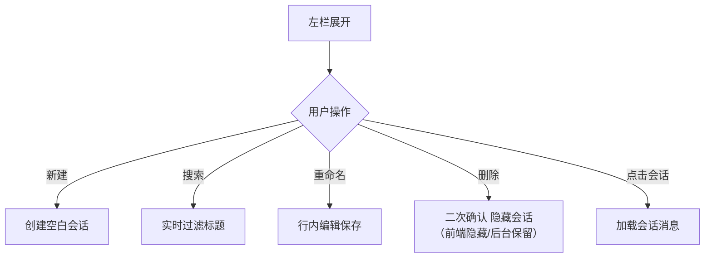
```mermaid
flowchart TD
    A["左栏展开"] --> B{"用户操作"}
    B -->|"新建"| C["创建空白会话"]
    B -->|"搜索"| D["实时过滤标题"]
    B -->|"重命名"| E["行内编辑保存"]
    B -->|"删除"| F["二次确认 隐藏会话<br/>（前端隐藏/后台保留）"]
    B -->|"点击会话"| G["加载会话消息"]

```

说明：左栏所有写操作均经服务端校验归属，非本人会话不可见。

#### 界面原型


| **操作** | **交互** | **异常处理** | **截图示例** |
| --- | --- | --- | --- |
| 【展开】点击 | 列表滑入，展示历史会话 | 加载失败：展示错误提示+重试按钮 |  |
| 【新建】点击 | 创建空白会话并切换至该会话 | 创建失败：Toast 提示「创建失败，请重试」 |  |
| 【分组】展示 | 每组默认展示 5 条会话；hover 分组标题出现「查看更多」→ 点击跳转到搜索弹窗 | — |  |
| 【搜索】点击搜索图标/历史会话 | 弹出搜索弹窗，按更新时间倒序展示匹配会话 | — |  |
| 【搜索】输入关键词 | 300ms 防抖，实时过滤会话标题 | 无匹配：展示空态「未找到匹配会话」 |  |
| 【会话项】状态标签 | 列表中以图标/标签展示会话状态：进行中 / 已完成 / 已失败 / 已取消 | — |  |
| 【会话项】点击 | 中间区加载该会话消息 | 加载超时：提示超时并保留在原会话 |  |
| 【会话项】Hover | 出现「...」图标，点击弹出二级菜单（重命名、删除） | — |  |
| 【重命名】点击 | 右侧跳出弹窗编辑，Enter 保存 / Esc 取消 | 空名称：阻止保存并提示「请输入对话标题」 |  |
| 【删除】点击 | 弹出二次确认弹窗 → 会话从列表移除（后台数据保留） | 隐藏失败：Toast 提示「操作失败，请重试」 |  |

#### 数据说明（业务实体）

| **字段名** | **数据类型** | **长度** | **默认值** | **必需** | **约束说明** |
| --- | --- | --- | --- | --- | --- |
| 会话ID | 字符 | — | 系统生成 | Y | · 唯一标识 |
| 会话标题 | 字符 | 4-10 | AI自动生成 | Y | · ~~根据第一条消息生成~~ <br>· 异步不阻塞对话 |
| 会话状态 | 枚举 | — | 进行中 | Y | · 选项：进行中/已完成/已失败/已取消 |
| 会话分组 | 枚举 | — | 日常办公 | Y | · 选项：日常办公/专家模式 <br>· 每组默认展示5条 |
| 搜索关键词 | 字符 | ≤50 | 空 | N | · 输入≥1字符触发搜索建议 <br>· 300ms防抖 |
| 搜索建议列表 | 数组 | ≤10条 | \[\] | — | · 来源：当前用户历史会话标题 <br>· 左右模糊匹配 <br>· 按更新时间降序 |
| 更新时间 | 时间戳 | — | 当前时间 | Y | · 按降序排列 <br>· 相对时间显示 |
| hidden | 布尔 | — | false | — | · 前端隐藏标记 <br>· 删除时设为true <br>· 后台数据保留 |

#### 业务规则和约束条件

| **规则项** | **说明** |
| --- | --- |
| 会话标题自动生成 | ~~新建会话即时由 AI 根据第一条消息生成标题（4~10 字），异步不阻塞对话（发送消息 = 开启对话，须立即有标题）~~ |
| 会话归属 | 仅归属当前登录用户，跨用户不可见 |
| 排序 | 按更新时间降序 |
| 默认联网 | 新建会话默认启用联网查询模式 |
| 前端隐藏 | 删除 = 前端隐藏会话（hidden 标记），会话不再展示于列表中；OSS 中会话数据保留不丢失。二次确认防误操作。会话作为用户记忆的重要组成部分，删除仅为前端整理操作，后台数据保留用于跨会话记忆召回。 |
| 分组展示 | 按**模式**分组（日常办公 / 专家模式），每组默认展示 5 条；hover 分组标题出现「查看更多」→ 点击跳转到搜索弹窗 |
| 左栏默认收起 | 左栏默认收起，不主动展开；可用宽度不足时以抽屉方式覆盖主区。 |
| 异常处理 | 网络断连重试、空态「暂无会话」、展开骨架屏、重命名空/超长拦截、快速反复点击以最后状态为准。 |

#### 接口说明

| **接口** | **说明** |
| --- | --- |
| createConv | 新建空白会话 |
| listConver | 列表/搜索（按 userId、关键词过滤，排除 hidden=true 的会话） |
| switchConv | 加载会话消息 |
| updateConv | 重命名 |
| hideConver | 隐藏会话（二次确认后调用，前端不展示，后台数据保留） |

#### 补充说明

无。

### 对话输入区

#### 功能需求描述

> 输入区位于中间区中部，默认以顶部输入框为入口，进入对话后聚焦输入区。支持多行输入、附件上传（本地文件 + 知识库文件）和联网查询开关。详细交互规则见界面原型，约束条件见业务规则。

| **EARS 模式** | **需求描述** |
| --- | --- |
| 普遍型 | 系统应在中间区底部提供输入区，支持多行输入（最多 8 行）、Enter 发送 / Shift+Enter 换行、最大 10000 字符；系统应提供附件上传入口（本地文件 + 知识库文件）；系统应在上传中展示状态标识；系统应提供联网查询开关。 |
| 状态驱动型 | 当正在流式生成时，发送控件替换为停止控件；当文件正在解析时，展示解析中状态并禁用重复提交；当专家模式下未选择专家时，发送按钮置灰不可点击。 |
| 事件驱动型 | 当用户点击发送时，消息加入会话并触发对话服务；选择超范围格式文件时拦截并提示；粘贴超 10000 字符内容时自动转为 txt 文件卡片。 |
| 不良行为型 | 输入为空时禁止发送；命中敏感词或 Prompt 注入时拦截；文件 >50MB 或超 10个时拦截；格式伪装/加密时服务端检测后标记失败。 |

#### 业务主流程图及说明

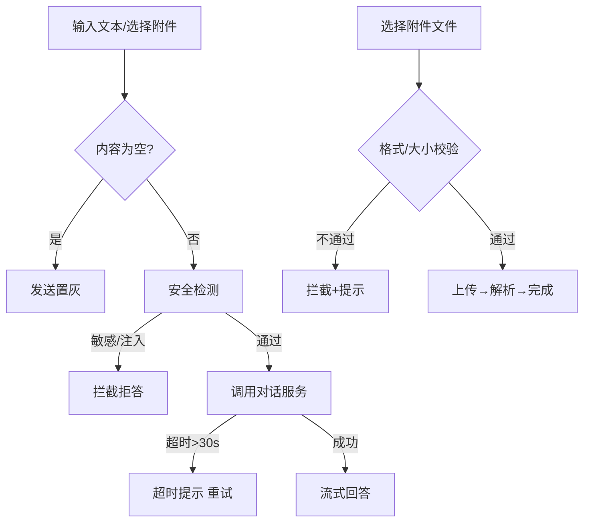
```mermaid
flowchart TD
    A["输入文本/选择附件"] --> B{"内容为空?"}
    B -->|"是"| C["发送置灰"]
    B -->|"否"| D["安全检测"]
    D -->|"敏感/注入"| E["拦截拒答"]
    D -->|"通过"| F["调用对话服务"]
    F -->|"超时>30s"| G["超时提示 重试"]
    F -->|"成功"| H["流式回答"]
    I["选择附件文件"] --> J{"格式/大小校验"}
    J -->|"不通过"| K["拦截+提示"]
    J -->|"通过"| L["上传→解析→完成"]

```

说明：日常办公模式对话服务内部走 web-search+RAG 编排；专家模式走 plan-and-execute 编排。附件作为上下文加入当前会话，跨两模式通用。

【V2.0更新】

#### 界面原型

| **操作** | **交互** | **异常处理** | **截图示例** |
| --- | --- | --- | --- |
| 【输入框】在输入区输入长文本（10000字符内） | 输入区高度自适应，超过阈值内部滚动 | 超长：前端截断并提示「内容过长，请精简后重试」 |  |
| 【输入框】在输入区复制长文本（超过10000字符） | 复制长文本变为txt附件，以文件卡片形式呈现在输入框中 | — |  |
| 【输入框】按 Enter | 发送消息，消息上屏 | 空内容：发送置灰，不触发请求 |  |
| 【输入框】按 Shift+Enter | 换行 | — |  |
| 【扩展】点击输入框扩展图标 | 输入框高度拉高，内部滚动条 | — |  |
| 【发送】点击发送按钮 | 同 Enter | 敏感词/注入：拦截并提示「内容包含敏感信息，已拦截」 |  |
| 【上传】点击添加文件 | 弹出上传弹窗，可选择「本地文件」或「知识库文件」 | — |  |
| 【拖拽上传】将文件拖拽至对话框区域 | 拖入时对话框+ 提示「松开以上传文件」；释放后自动触发上传流程，走与按钮选择相同的校验和状态展示 | 非白名单格式：提示「不支持该格式」；超过 3 个：拦截超出部分提示「单次最多上传 3 个文件」 | 待补充 |
| 【快捷键上传】Ctrl+C/V 在对话框快捷上传文件 | Ctrl+C/V后自动触发上传流程，走与按钮选择相同的校验和状态展示 | 非白名单格式：提示「不支持该格式」；超过 3 个：拦截超出部分提示「单次最多上传 3 个文件」 | 待补充 |
| ~~【粘贴截图】Ctrl+V 粘贴剪贴板图片~~ | ~~自动生成图片附件，命名~~ `~~截图-YYYYMMDD-N.png~~`~~，在输入框展示图片缩略图卡片（含文件名和大小）{/色}~~ | ~~图片 >10MB：提示「图片大小超过 10MB」；剪贴板无图片数据：不触发~~ | ~~待补充~~ |
| 【本地文件选择】选择本地文件 | 打开系统文件选择器 | — |  |
| 【知识库文件选择】选择知识库文件 | 弹窗内展示企业空间 + 个人空间文件列表，支持搜索文件名、按文件类型筛选 | 加载失败提示「知识库文件加载失败，请重试」 |  |
| 【文件选中】选择文件后 | 校验格式与大小，通过则上传 | 格式不支持：提示「不支持该格式，仅支持 pdf/doc/docx/txt/md/xlsx/xls/csv/pptx」 | — |
|  |  | ~~超过 50MB：提示「文件超过 50MB 限制」~~ | ~~—~~ |
|  |  | 空文件：标注「空文件」 | — |
|  |  | 格式伪装加密：提示「文件格式异常，上传失败」/「文件已加密，无法解析」 | — |
| 【状态】上传完成 | 附件以文件卡片展示在对话框中（文件名/类型图标/大小），每行 4 个 | 超出 4 个：左右箭头翻页，支持键盘 ← → |  |
| 【移除】发送前移除文件 | 点击文件卡片上的 × 移除单个文件 | — |  |
| 【模式】切换模式 | 上拉框选择具体模式，点击进行切换 | — |  |
| 【联网】点击联网查询开关 | 切换开关状态（默认开启），关闭后本次对话不调用 web-search | — | <br> |

#### 数据说明（业务实体）

| **字段名** | **数据类型** | **长度** | **默认值** | **必需** | **约束说明** |
| --- | --- | --- | --- | --- | --- |
| 输入内容 | 字符 | ≤10000 | 空 | N | · 9000时显示计数器<br>· 10000后禁止输入<br>· 超长粘贴自动转为txt文件卡片<br>· 占位符「输入您的问题Shift+Enter换行」<br>· 切换模式保留草稿 |
| 发送按钮状态 | 枚举 | — | 置灰 | — | · 有内容时高亮<br>· 空内容置灰<br>· 生成中替换为停止按钮 |
| 附件文件 | 文件 | ~~≤50MB~~ | — | N | · ~~单次≤10个~~<br>· 白名单：pdf/doc/docx/txt/md/~~xlsx/xls/csv~~/pptx<br>· 空文件拦截<br>· 格式伪装/加密服务端检测标记失败 |
| ~~文件上传状态~~ | ~~枚举~~ | ~~—~~ | ~~—~~ | ~~—~~ | ~~· 状态：上传中/解析中/已完成/处理失败~~ |
| 联网查询开关 | 布尔 | — | 开启 | — | · 关闭后不调用web-search<br>· RAG不受影响<br>· 与会话绑定 |

#### 业务规则和约束条件

| **规则项** | **说明** |
| --- | --- |
| 输入框高度 | 最多拉高至 8 行，超过出现垂直滚动条 |
| 并发上传 | 多文件各自独立，互不影响，10个一批进行处理 |
| 上下文窗口 | 单会话保留最近 5 轮（见 3.4.5 智能体 Agent），后台可配置 |
| 重复发送 | 多次点击发送按钮视作一次，等幂性 |
| 专家模式发送 | 未选择专家时发送按钮置灰，选择后恢复（见 3.5.8） |

#### 接口说明

| **接口** | **说明** |
| --- | --- |
| sendMessag | 安全检测后调用对话服务，返回流式 |
| stopGenera | 中断当前生成 |
| uploadAtta | 附件上传（分片/断点续传） |
| parseAttac | 解析为可检索上下文 |
| listKnowle | 拉取当前用户有权限访问的知识库文件（企业 + 个人） |
| attachKnow | 将知识库文件引用挂载为对话上下文 |

#### 补充说明

*   **无**
    

### 快捷指令区

#### 功能需求描述

> 输入区上方展示快捷指令：生成钉钉待办 / 生成需求草稿 / 封装成技能。点击后将对应预设提示词填入输入区并聚焦，不直接静默执行，需用户确认发送。

| **EARS 模式** | **需求描述** |
| --- | --- |
| 普遍型 | 系统应在输入区上方展示快捷指令；系统应在用户点击快捷指令时，将对应预设提示词填入输入区并聚焦。 |
| 状态驱动型 | 当某快捷指令所需上下文缺失时，系统应仍填入预设提示词并提示用户补充。 |
| 事件驱动型 | 当用户点击快捷指令时，系统应填充输入区并准备发送。 |
| 不良行为型 | 系统不应在点击快捷指令时静默直接执行任务（须用户确认发送）。 |

#### 业务主流程图及说明

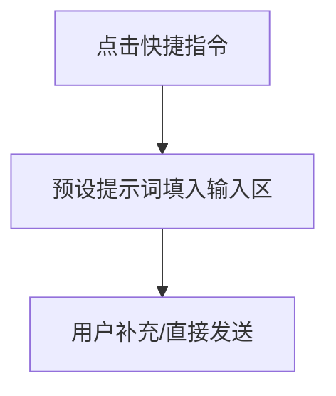
```mermaid
flowchart TD
    A["点击快捷指令"] --> B["预设提示词填入输入区"]
    B --> C["用户补充/直接发送"]

```

说明：快捷指令底层为 Skill 触发（见 3.4.4 技能管理），此处仅做提示词预填。

#### 界面原型

| **操作** | **交互** | **异常处理** | **截图示例** |
| --- | --- | --- | --- |
| 【快捷指令】点击快捷指令卡片 | 预设提示词填入输入区并聚焦 | 模板加载失败：提示「暂无可用快捷指令」 |  |
| 【快捷指令】快捷指令布局（日常模式） | 以卡片形式横向排列在输入区下方，每行 3 列，最多 3 行（共 9 个） | 超出 9 个：出现翻页箭头 | — |
| 【快捷指令】快捷指令布局（专家模式：选中具体专家后） | 以气泡形式叠放在输入区下方，每行 3 列，最多 3 行（共 9 个） | 创建智能体时人为设置快捷短语，不超过 9 个 |  |
| 【专家卡片】专家卡片布局（专家模式） | 以卡片形式横向排列在输入区上方，每行 3 列，最多 3 行（共 9 个） | 超出 9 个：出现翻页箭头 | — |

#### 数据说明（业务实体）

| **实体** | **关键字段** | **说明** |
| --- | --- | --- |
| QuickComma | id, label, promptTemplate, skillRef | 快捷指令配置（后台可配） |

#### 业务规则和约束条件

| **规则项** | **说明** |
| --- | --- |
| 快捷指令 | 快捷指令仅作提示词预填，不直接静默执行任务。 |
| 预设提示词 | 预设提示词模板来源为后台 Skill 配置。 |
| 多次点击 | 覆盖输入，以最后一次填入为准 |

#### 接口说明

#### 补充说明

无。

### 会话详情

#### 功能需求描述

> 会话详情是中间区的核心消息画布，负责展示用户与助手的对话全过程。

| **EARS 模式** | **需求描述** |
| --- | --- |
| 普遍型 | 系统应在中间区展示当前会话的消息流（用户消息 + 助手回答）；系统应支持流式逐字展示；系统应展示 CoT 折叠摘要与文件卡片。 |
| 状态驱动型 | 当正在生成时，系统应展示流式逐字内容与思考中动效；当专家模式 Plan 生成后，系统应展示步骤清单供用户查看；当 Execute 执行中时，系统应展示每步状态（执行中/完成/失败）。 |
| 事件驱动型 | 当用户发送消息时，系统应将消息追加至画布底部并触发生成；当用户点击 CoT 摘要时，系统应展开完整推理过程；当用户点击文件卡片时，系统应触发右栏预览。 |
| 不良行为型 | 当生成超时（>30s）时，系统应展示超时提示；当网络异常时，系统应展示重试入口并保留草稿；当 CoT 生成失败时，系统应仅展示回答不展示 CoT。 |

**【V2.0更新】**

#### 业务主流程图及说明

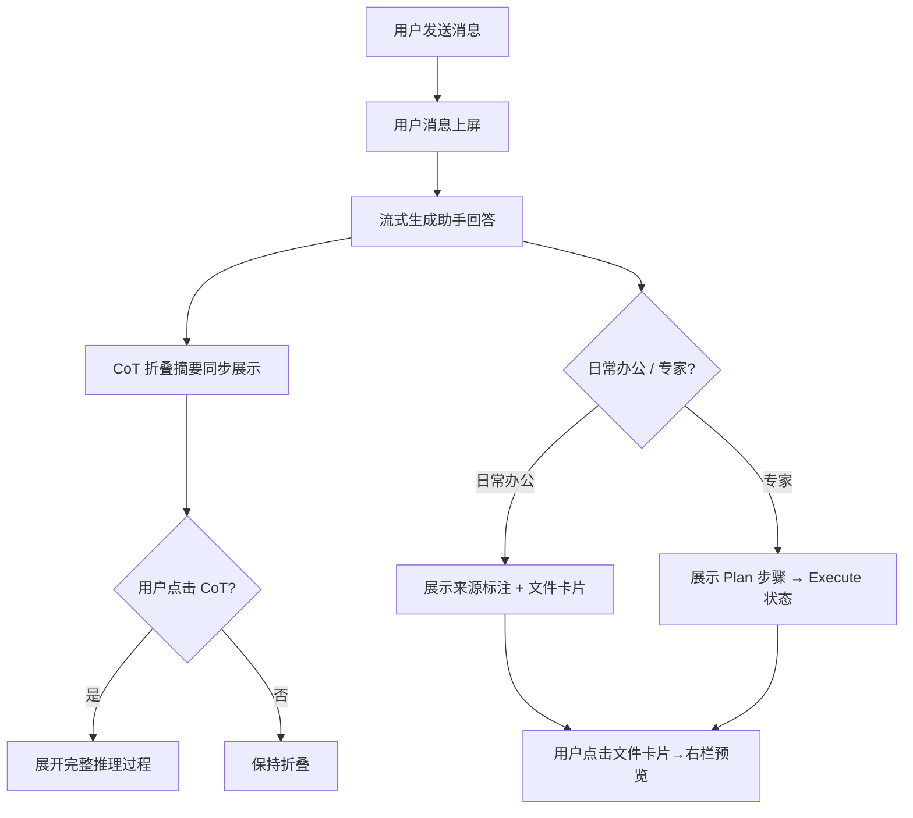
```mermaid
flowchart TD
    A["用户发送消息"] --> B["用户消息上屏"]
    B --> C["流式生成助手回答"]
    C --> D["CoT 折叠摘要同步展示"]
    C --> E{"日常办公 / 专家?"}
    E -->|"日常办公"| F["展示来源标注 + 文件卡片"]
    E -->|"专家"| G["展示 Plan 步骤 → Execute 状态"]
    D --> H{"用户点击 CoT?"}
    H -->|"是"| I["展开完整推理过程"]
    H -->|"否"| J["保持折叠"]
    F --> K["用户点击文件卡片→右栏预览"]
    G --> K

```
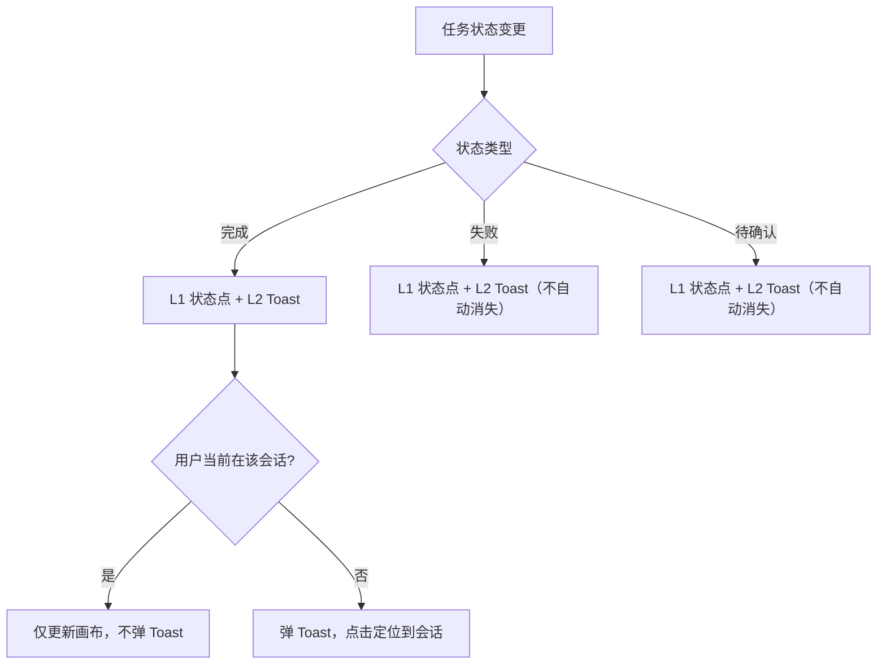
```mermaid
graph TD
    L["任务状态变更"] --> M{"状态类型"}
    M -->|"完成"| N["L1 状态点 + L2 Toast"]
    M -->|"失败"| O["L1 状态点 + L2 Toast（不自动消失）"]
    M -->|"待确认"| P["L1 状态点 + L2 Toast（不自动消失）"]
    N --> Q{"用户当前在该会话?"}
    Q -->|"是"| R["仅更新画布，不弹 Toast"]
    Q -->|"否"| S["弹 Toast，点击定位到会话"]
```

**会话状态流转**：

| **状态** | **触发条件** | **说明** |
| --- | --- | --- |
| 进行中 | 会话创建 / 用户发送消息 | 存在活跃对话 |
| 已完成 | 对话正常结束（回答生成完毕且无异常） | 会话归档，可继续追问 |
| 已失败 | 网络断开 / 生成超时（>30s） | 消息气泡展示错误提示，用户可重试 |
| 已取消 | 用户点击「停止生成」 | 中止当前生成，已生成内容保留 |
| ~~待确认~~ | ~~任务需要用户介入时进入此状态，包含三个子场景：~~~~**需求澄清**~~~~：AI 判断用户意图不明确，需要用户补充信息后继续②~~ ~~**计划执行卡片**~~~~：专家模式 Plan 生成后，需要用户确认计划再执行③~~ ~~**审批卡片**~~~~：任务触发审批流程，需要审批人通过/驳回后继续~~ | ~~阻塞态：任务暂停等待用户/审批人操作。L1 状态点持续提醒，L2 Toast 不自动消失，提醒强度高于「完成」。用户回应后流转回「进行中」；审批驳回流转至「已失败」。~~ |

**异步通知说明**：任务状态变更时，系统通过 SSE/WebSocket 实时推送。L1 会话列表状态点为常驻提醒（使用圆点表示状态：绿色成功，红色失败，灰色取消；使用动图表示状态：蓝色转圈进行中~~，橙色提醒待确认~~）；L2 全局 Toast 在页面上方中间弹出，为瞬时通知（可关闭、点击定位到任务），点击关闭按钮关闭，点击消息跳转至会话详情。

#### 界面原型

| **操作** | **交互** | **异常处理** | **截图示例** |
| --- | --- | --- | --- |
| 【消息气泡】发送消息后 | 用户消息气泡上屏，助手回答流式逐字展示 | 网络异常：气泡展示「网络异常，请稍后重试」并保留草稿 |  |
| 【消息气泡】消息气泡 hover | 出现「复制」图标 | — |  |
| 【复制】点击 | 点击复制 → 复制消息全文 + Toast「已复制」 | 复制失败：提示 再次尝试 |  |
| 【消息气泡】hover显示消息时间戳 | hover 显示详细时间（年-月-日 时:分:秒）；默认展示：同天时:分、跨天月-日 时:分、跨年年-月-日 时:分 | 两条消息间隔 > 5 分钟才展示时间戳 |  |
| 【思维链】流式生成中 | 展示思考中动效 + CoT 详细推理过程流式展示（开始输出回复时自动折叠为摘要） | 超时（>30s）：展示「响应超时，请稍后重试」 |  |
| 【思维链】点击收起 CoT | 折叠回单行摘要 | — |  |
| 【引用】AI 回答展示引用 | 回复内容中内嵌引用标记（上标数字）；回复后展示引用来源列表（文件名+摘要/文本块，含网页来源） | 来源不可用：标注「来源已失效」 |  |
| 【引用】hover 引用标记 | 浮层显示引用文件名称及对应摘要/文本块 | — |  |
| 【产物卡片】AI 生成文件后 | 消息内展示文件卡片（文件名/格式/大小），支持预览和下载。产物类型：md / docx / xlsx / pptx / pdf | — |  |
| 【计划步骤】专家模式 Plan 展示 | 步骤清单展示 | 规划失败：提示「规划失败，请重试」 |  |
| 【执行调用】Plan 展示后 Execute | 逐步执行，展示每步状态（执行中/完成/失败） | 某步失败：可重试或跳过并标注 |
| 【中止】生成中点击停止 | 中断当前生成 | 中断失败：等待自然结束或超时 |  |
| 【最终回复】新消息生成 | 自动滚动到最底部 | — | — |
| 【消息历史】用户手动上滚查看历史 | 停止自动滚动，右下角出现「↓ 回到底部」浮动按钮 | — |  |
| 【回到底部】点击回到底部 / 发 | 滚回底部，恢复自动滚动 | — |
| 【渲染】Markdown渲染：表格、代码块、Mermaid 图表 | Markdown语法渲染，右上角「复制」/「查看代码」按钮；Mermaid  默认展示渲染后的图片样式；点击可切换为 Mermaid 代码，支持复制 | — |  |
| 【图片预览】点击会话中的图片消息 | 展开图片大图预览浮层，支持缩放和拖拽；点击浮层外部或按 Esc 关闭 | 图片加载失败：展示裂图占位 +「图片加载失败」提示 | 待补充 |
| ~~【待确认-需求澄清】任务进入需求澄清~~ | ~~会话画布中展示「需求澄清卡片」，包含 AI 的澄清问题和输入框；用户输入后点击「继续」流转回进行中~~ | ~~—~~ | ~~待补充~~ |
| ~~【待确认-计划执行卡片】专家模式 Plan 生成后~~ | ~~展示计划步骤清单 + 「确认执行」「修改计划」按钮；用户确认后流转回进行中开始 Execute~~ | ~~—~~ | ~~待补充~~ |
| ~~【待确认-审批卡片】任务触发审批~~ | ~~展示「审批卡片」，包含审批人、审批意见输入框、通过/驳回按钮；审批通过后流转回进行中，驳回流转至已失败~~ | ~~—~~ | ~~待补充~~ |
| 【会话列表状态点】任务状态变更 | 左栏对应会话显示彩色状态点：完成=绿色、失败=红色，取消=灰色 | — | 待补充 |
| 【全局 notice】任务状态变更且用户不在该会话 | 页面右下角弹出 notice 通知条，左侧展示状态图标（✓ 完成 / ✗ 失败 ~~/ ⚠ 待确认~~），中间展示会话标题+状态文案，右侧关闭按钮。点击关闭按钮关闭；点击 notice 定位跳转到对应会话；多个 notice 重叠堆叠展示，不设上限；鼠标悬浮提示点击查看会话；5s自动消失 | — |  |


**消息卡片文案**

1.已完成

标题（左上方）：【两种模式icon】任务已完成【任务状态icon】

正文（标题下方）：AI回复结果(超宽度截断，变为...)

操作按钮（右方）：查看按钮|关闭icon（右上方）

2.已失败

标题（左上方）： 【两种模式icon】任务执行失败【任务状态icon】

正文（标题下方）：错误摘要，具体原因

操作按钮（右方）：查看按钮|关闭icon（右上方）

#### 数据说明（业务实体）

| **实体** | **关键字段** | **说明** |
| --- | --- | --- |
| Message | id, convId, role, content, cotSummary, cotFull, createdAt | 会话消息（含 CoT 内容） |
| RetrievalR | source(web/rag), title, url, snippet, score | 检索结果（日常办公来源标注） |
| PlanStep | id, expertId, stepDesc, status | 专家规划步骤 |
| ExecutionR | id, stepId, output, files | 执行中间/最终结果 |
| GeneratedF | id, convId, msgId, name, type, url, outline | AI 生成文件元信息 |

#### 业务规则和约束条件

| **规则项** | **说明** |
| --- | --- |
| 消息按时间顺序展示 | 消息按时间顺序自下而上滚动，最新消息在底部。 |
| 流式生成与 CoT | 流式生成与 CoT 详细推理同步展示，开始输出回复时 CoT 自动折叠为单行摘要。 |
| 引用溯源 | 日常办公模式回答应标注信息来源（~~web 链接~~ / 知识库文档）。 |
| 生成超时 | 生成超时（>30s）展示超时提示，网络异常展示重试入口并保留草稿。 |
| CoT 生成失败 | CoT 生成失败不影响回答展示（降级为仅展示回答）。 |
| Markdown渲染 | 标题(H1~H6)、加粗、斜体、行内代码、代码块(语法高亮+横向滚动)、有序/无序列表、表格(列宽自适应)、引用、链接(点击新窗口打开)。不支持 HTML 标签和图片渲染。 |

#### 接口说明

| **接口** | **说明** |
| --- | --- |
| sendMessag | 安全检测后调用对话服务，返回流式（含 CoT 字段） |
| stopGenera | 中断当前生成 |
| planExecut | 专家模式规划并执行（编排 web-search/RAG/函数/MCP） |
| getFileMet | 拉取文件元信息与大纲（点击文件卡片时调用） |

#### 补充说明

无

### 右栏文件预览面板

#### 功能需求描述

> 右栏 MVP 唯一功能为文件预览。AI 生成文件后，于对话消息中展示文件卡片，用户点击卡片即在右栏打开预览；系统展示文件大纲导航，支持点击跳转到对应章节。默认收起，仅点击文件卡片时展开。

| **EARS 模式** | **需求描述** |
| --- | --- |
| 普遍型 | 系统应在右侧栏提供文件预览面板（MVP 仅此一项功能）；系统应在 AI 生成文件后，于对话消息中展示文件卡片，用户点击卡片即在右栏打开预览；系统应展示文件大纲导航，支持点击跳转章节。 |
| 状态驱动型 | 当右栏无预览文件时，系统应保持收起（图标态）；当被预览文件被删除时，系统应自动关闭该预览。 |
| 事件驱动型 | 当用户点击文件卡片时，系统应展开右栏并渲染文件正文与大纲；当用户点击大纲项时，系统应按章节跳转。 |
| 不良行为型 | 当格式不支持预览时，系统应提示暂不支持预览此文件格式。 |

#### 业务主流程图及说明

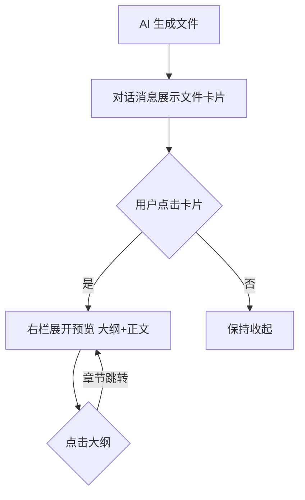
```mermaid
flowchart TD
    A["AI 生成文件"] --> B["对话消息展示文件卡片"]
    B --> C{"用户点击卡片"}
    C -->|"是"| D["右栏展开预览 大纲+正文"]
    D --> E{"点击大纲"}
    E -->|"章节跳转"| D
    C -->|"否"| F["保持收起"]

```

说明：右栏形成「生成→点击→查看」轻量闭环，类似主流对话产品的文件卡片交互。

#### 界面原型

| **操作** | **交互** | **异常处理** | **截图示例** |
| --- | --- | --- | --- |
| 【产物卡片】AI 生成文件后 | 对话消息内展示文件卡片（文件名/格式/大小） | — | 待补充（参考前端原型 WorkspaceChatView 右栏） |
| 【产物卡片】点击文件卡片 | 右栏展开，渲染文件正文+大纲导航 | 加载失败：提示「文件预览失败，请重试」 |  |
| 【大纲】点击大纲项 | 正文跳转到对应章节 | — | — |
| 【关闭】点击关闭预览 | 右栏收起 | — |  |
| 【下载】点击下载按钮 | 浏览器文件下载至本地 | 下载失败：提示「文件下载失败，请重试」 | — |

#### 数据说明（业务实体）

| **字段名** | **数据类型** | **长度** | **默认值** | **必需** | **约束说明** |
| --- | --- | --- | --- | --- | --- |
| 预览文件名 | 字符 | — | — | Y | · AI生成文件自动填充 |
| 文件类型 | 枚举 | — | — | Y | · 支持：PDF/DOCX/TXT/MD/XLSX/XLS/CSV/DOC |
| panelOpen | 布尔 | — | false | — | · 右栏展开/收起状态<br>· 无文件时不展示 |
| currentFileId | 字符 | — | 空 | — | · 当前预览文件ID |

#### 业务规则和约束条件

| **规则项** | **说明** |
| --- | --- |
| 预览格式支持 | PDF/DOCX/PPTX/MD/XLSX。 |
| 收起行为 | 右栏无文件时保持收起，不展示空面板 |
| 连续点击 | 以最后一次为准渲染 |

#### 接口说明

| **接口** | **说明** |
| --- | --- |
| getFileMet | 拉取文件元信息与大纲 |
| getFileCon | 拉取文件正文用于渲染 |

#### 补充说明

无。

卡片点击时的输入框/联网开关/文件状态处理，见 全局通用规则 › 状态处理规则。

### 日常办公模式（web-search + RAG + 钉钉）

#### 功能需求描述

> 日常办公模式以 web-search + RAG 为核心，并接入钉钉基础能力。用户输入问题后，系统先判断是否需检索：对时效性/公开信息走 web-search 实时联网检索；对企业私有知识（钉钉文档、知识库、业务系统）走 RAG 检索；再结合上下文生成答案。结果可进一步落地为钉钉侧动作（生成待办、查询审批/日程、发送通知）。

| **EARS 模式** | **需求描述** |
| --- | --- |
| 普遍型 | 系统应在日常办公模式下，对用户问题先做检索路由：对公开/时效信息调用 web-search，对企业知识调用 RAG；系统应结合上下文生成答案；系统应支持将结果转化为钉钉动作（待办/审批查询/通知）。 |
| 状态驱动型 | 当检索/生成无结果时，系统应给出引导建议而非报错；当问题涉及企业知识时，系统应优先走 RAG 而非纯模型生成。 |
| 事件驱动型 | 当用户发送问题时，系统应执行「路由→检索→生成→（可选）钉钉动作」链路；当用户确认生成钉钉待办时，系统应调用钉钉接口创建。 |
| 不良行为型 | 当 web-search 或 RAG 失败时，系统应降级（仅模型生成并提示来源缺失）；当钉钉调用失败，系统应提示并保留结果不直接丢失。 |

#### 业务主流程图及说明

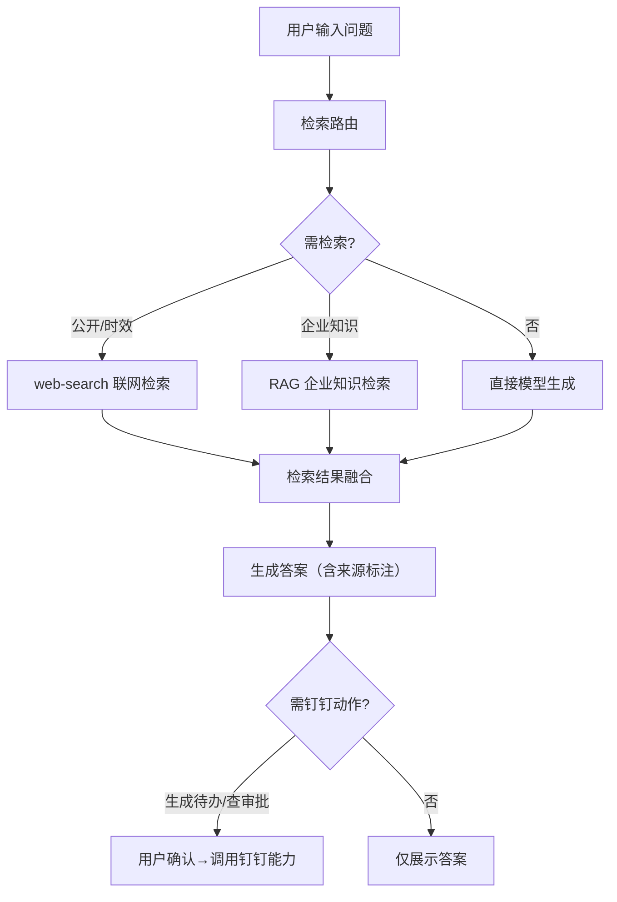
```mermaid
flowchart TD
    A["用户输入问题"] --> B["检索路由"]
    B --> C{"需检索?"}
    C -->|"公开/时效"| D["web-search 联网检索"]
    C -->|"企业知识"| E["RAG 企业知识检索"]
    C -->|"否"| F["直接模型生成"]
    D --> G["检索结果融合"]
    E --> G
    F --> G
    G --> H["生成答案（含来源标注）"]
    H --> I{"需钉钉动作?"}
    I -->|"生成待办/查审批"| J["用户确认→调用钉钉能力"]
    I -->|"否"| K["仅展示答案"]

```
> 说明：检索路由可由模型判断或按关键词/意图规则触发；web-search 与 RAG 可并行。

**案例卡片**：日常办公模式下，输入区上方展示预置的 prompt 案例卡片（如「帮我写一份周报」「分析最近的销售趋势」），点击回写到输入框中。案例卡片仅有 prompt 文本，无推荐回答。案例由管理员后台配置。

#### 界面原型

**见前节**

#### 数据说明（业务实体）

**见前节**

#### 业务规则和约束条件

| **规则项** | **说明** |
| --- | --- |
| 检索路由 | ① 优先判断用户问题是否涉及企业专有名词/内部流程/最新政策 → 走 RAG；② 判断是否涉及公开资讯/实时行情 → 走 web-search；③ 两者都涉及 → web-search 与 RAG 并行检索、融合后生成；④ 都不涉及 → 仅模型生成。 |
| 检索超时 | web-search 超时 5s，RAG 超时 2s，任一超时不阻断另一路结果。 |
| 联网开关 | 联网开关关闭时，跳过 web-search 分支，仅走 RAG + 模型生成。 |
| 用户确认 | 钉钉动作须经用户确认后执行，不直接静默落库。 |
| 信息来源 | 答案应标注信息来源（web 链接 / 知识库文档）。 |

#### 接口说明

| **接口** | **说明** |
| --- | --- |
| webSearch | 联网检索公开信息 |
| ragQuery | 企业知识检索（经 MCP 对接钉钉文档/知识库） |
| dingtalk.t | 创建钉钉待办 |
| dingtalk.a | 查询审批 |
| dingtalk.n | 发送通知 |

#### 补充说明

钉钉相关动作需求：

1.  以本人身份发消息
    
2.  建待办
    
3.  查本人日程
    
4.  建日程
    

[《钉钉快捷提示语》](https://alidocs.dingtalk.com/api/doc/transit?dentryUuid=ZgpG2NdyVXro79xXSP746pP98MwvDqPk&queryString=utm_medium%3Ddingdoc_doc_plugin_card%26utm_source%3Ddingdoc_doc)

### 专家模式框架（plan and execute）

#### 功能需求描述

> 专家模式以 plan-and-execute 为核心范式。用户从专家卡片选择某位专家后进入专属协作；专家先就任务做步骤规划（Plan，向用户展示计划），再逐步调用工具/函数/MCP（含 web-search、RAG、业务系统对接）执行（Execute），过程中产出中间结果，最终汇总为结构化交付物。

| **EARS 模式** | **需求描述** |
| --- | --- |
| 普遍型 | 系统应在专家模式下以卡片展示可用专家（MVP 预置 10 位，见附录 6.1）；系统应支持用户选择专家后进入该专家专属协作（plan-and-execute）。 |
| 状态驱动型 | 当 plan 生成后，系统应先展示计划再进入执行。 |
| 事件驱动型 | 当用户悬停专家卡片时，系统应仅显示文字介绍/履历摘要；当用户点击卡片时，系统应展开专家详情（含提示词案例库）并进入协作；Plan 生成后直接进入 Execute 逐步执行。 |
| 不良行为型 | 系统不应在 MVP 暴露创建智能体向导（仅开发者可用，见 Non-goals）；当工具调用越权时系统应拒绝执行。 |

#### 业务主流程图及说明

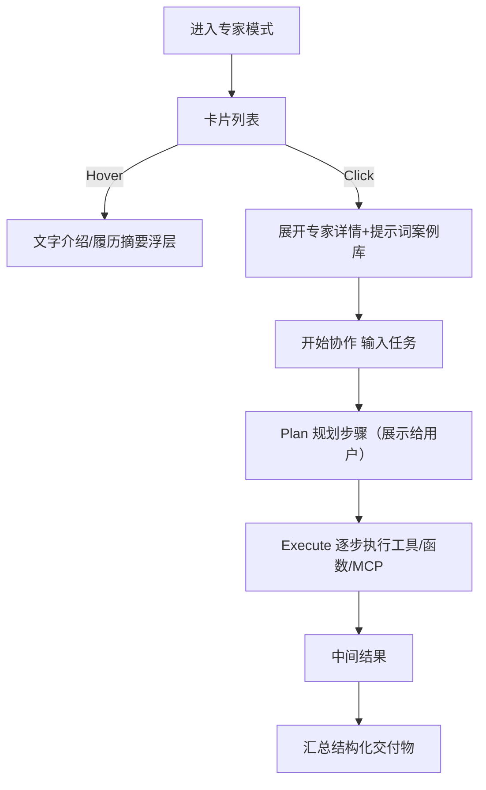
```mermaid
flowchart TD
    A["进入专家模式"] --> B["卡片列表"]
    B -->|"Hover"| C["文字介绍/履历摘要浮层"]
    B -->|"Click"| D["展开专家详情+提示词案例库"]
    D --> E["开始协作 输入任务"]
    E --> F["Plan 规划步骤（展示给用户）"]
    F --> H["Execute 逐步执行工具/函数/MCP"]
    H --> I["中间结果"]
    I --> J["汇总结构化交付物"]

```

说明：Plan 阶段输出可阅读的步骤清单，Execute 阶段每个步骤可调用 web-search/RAG/业务系统并产出中间文件。

#### 界面原型

| **操作** | **交互** | **异常处理** | **截图示例** |
| --- | --- | --- | --- |
| 【模式】进入专家模式 | 展示专家卡片网格（每行 3 列，最多 3 行共 9 个；头像/名称/花名/描述）；超出翻页；支持按名称搜索过滤 | 列表加载失败：提示「专家加载失败，点击重试」 |  |
| 【专家卡片】Hover | 自动展开显示该专家的具体介绍（能力描述/适用场景等） | — |  |
| 【专家卡片】点击 | 跳转到该专家的案例卡片列表，输入框中出现选中的专家（仅有 prompt 文本，点击回写到输入框） | 案例加载失败：提示重试 |  |
| 【关闭】点击关闭选中专家 | 回到专家卡片界面，重写选择专家 | 列表加载失败：提示「专家加载失败，点击重试」 |  |
| 【发送】未选择专家时 ｜ 未输入提示语时 | 发送按钮置灰不可点击 | — |  |

#### 数据说明（业务实体）

| **实体** | **关键字段** | **说明** |
| --- | --- | --- |
| Expert | id, name, nickname, avatar, jd, scenes, capabilities, status | 专家定义 |
| PlanStep | id, expertId, stepDesc, status | 规划步骤 |
| ExecutionR | id, stepId, output, files | 执行中间/最终结果 |
| ExpertDeli | id, expertId, convId, type(PDF/Markdown/Excel 等), title, url, summary | 专家交付物：文件 + 行内摘要卡片，格式由专家能力决定 |

#### 业务规则和约束条件

| **规则项** | **说明** |
| --- | --- |
| 任务规划 | Plan 步骤清单展示给用户，直接进入 Execute |
| Execute 权限 | Execute 调用的工具/MCP 受权限与可见范围约束 |
| 专家数量 | MVP 固定 10 位预置专家，不支持用户自建（见 5.2 Non-goals），仅支持管理员后台配置；完整清单见附录 6.1 |
| 消息发送 | 必须先选择专家才能发送消息；未选择时发送按钮置灰不可点击 |

#### 接口说明

| **接口** | **说明** |
| --- | --- |
| listExpert | 卡片列表（按 userId 可见范围） |
| getExpert | 专家详情+提示词案例库 |
| planExecut | 规划并执行（编排 web-search/RAG/函数/MCP） |

#### 补充说明

**无**

卡片点击时的输入框/联网开关/文件状态处理，见 全局通用规则 › 状态处理规则。

# 非功能需求

## 性能要求

| ~~**指标**~~ | ~~**目标值**~~ | ~~**说明**~~ |
| --- | --- | --- |
| ~~首屏加载~~ | ~~≤ 2s（P95）~~ | ~~含 JS/CSS 首包资源~~ |
| ~~历史会话列表渲染~~ | ~~≤ 300ms（P95）~~ | ~~50 条以内~~ |
| ~~流式首 Token~~ | ~~≤ 800ms（P95）~~ | ~~从用户点发送到首个 Token 到达~~ |
| ~~流式完整响应~~ | ~~≤ 30s（P95）~~ | ~~日常办公模式常规查询~~ |
| ~~专家模式 Plan~~ | ~~≤ 3s（P95）~~ | ~~规划步骤返回~~ |
| ~~专家模式单步 Exe~~ | ~~≤ 10s（P95）~~ | ~~单步工具调用含 RAG/搜索/函数~~ |
| ~~文件预览加载~~ | ~~≤ 1s（P95）~~ | ~~PDF/PPT/Word ≤ 5MB~~ |
| ~~并发会话~~ | ~~单用户同时活跃 ≤ 3 个（活跃 = 存在未完成流式生成的会话，即 SSE 连接未断开）~~ | ~~超出提示"请先结束已有会话"~~ |
| ~~后端 API（非 L~~ | ~~≤ 200ms（P95）~~ | ~~会话列表/详情/文件信息等~~ |
| ~~RAG 检索~~ | ~~≤ 2s（P95）~~ | ~~单次知识库检索~~ |
| ~~Web 搜索~~ | ~~≤ 5s（P95）~~ | ~~含结果摘要~~ |
| ~~前端内存占用~~ | ~~≤ 150MB~~ | ~~单标签页稳定运行~~ |
| ~~断线重连~~ | ~~≤ 3s 检测 + 自动重连~~ | ~~最多重试 2 次~~ |

## 安全要求

| **维度** | **要求** |
| --- | --- |
| 身份认证 | 统一 SSO（公司 IDP），Token 有效期 2h，滑动续期 |
| 传输加密 | 全站 HTTPS，WebSocket 使用 WSS |
| 输入过滤 | XSS/SQL 注入防御；用户输入 maxlength 10000 字符 |
| 文件安全 | 上传白名单（见 3.1.4）；服务端二次校验 MIME；病毒扫描（后续迭代） |
| 数据隔离 | 会话数据按 userId 严格隔离；专家模式调用 WMS/ERP 时走服务端权限校验 |
| 日志脱敏 | 用户对话内容不落明文日志；仅记录 metadata（会话 ID/时间/Token 数） |
| 敏感操作 | 钉钉动作（发消息/审批/日历）需用户二次确认 |
| LLM 输出过滤 | 输出内容经敏感词过滤；政治/色情/暴力内容拦截 |
| API 限流 | 单用户 60 req/min；专家模式 planExecute 10 req/min；令牌桶允许短时突发（峰值 10 QPS） |
| 审计 | 所有专家模式 Plan-Execute 留存完整链路日志（含工具调用入参/出参摘要） |

## 兼容性要求

| **维度** | **要求** |
| --- | --- |
| 浏览器 | Chrome ≥ 110 / Edge ≥ 110 / Safari ≥ 16 / Firefox ≥ 110 |
| 分辨率 | 最小 1280×720；推荐 1920×1080 |
| 移动端 | MVP 不支持；后续迭代响应式适配 |
| 操作系统 | Windows 10+ / macOS 12+ |
| 网络 | ≥ 2Mbps 稳定连接；弱网降级（关闭流式、改为轮询） |
| 无障碍 | WCAG 2.1 AA 级（键盘导航、屏幕阅读器、对比度 ≥ 4.5:1） |

# 迭代计划与 Non-goals

## 迭代计划

| **序号** | **模块** | **开发内容** | **依赖 / 并行** | **备注** |
| --- | --- | --- | --- | --- |
| 1 | 基础能力底座（后台） | 模型管理、Prompt 配置、MCP Server 接入、Tool 注册、Skill 编排、智能体管理（Agent）的配置与治理；打通对话服务骨架（安全检测 → 流式返回 → CoT 字段） | — | 底座先启动 |
| 2 | 整体布局 + 历史会话（左栏） | 三栏布局；会话新建 / 搜索 / 重命名 / 隐藏；左栏折叠为图标态 | ⇡ 可与 1 并行 | — |
| 3 | 对话输入区 | 多行输入、Enter/Shift+Enter、附件上传（本地文件 + 知识库文件，按权限过滤）、停止控件 | ⇡ 可与 1 并行 | — |
| 4 | 会话详情（消息画布） | 流式回答、CoT（思考中详细 / 开始输出回复时自动折叠）、文件卡片、Plan-Execute 步骤展示 | ⇡ 可与 1 并行 | — |
| 5 | 右栏文件预览面板 | 本地与知识库文件预览、引用跳转 | 依赖 3 | — |
| 6 | 快捷指令区 | 卡片展示与触发，打通技能 / 智能体调用 | 依赖 1 | — |
| 7 | 日常办公模式 | web-search + RAG + 钉钉基础动作（发消息 / 审批 / 日历） | 依赖 1、3、4 | — |
| 8 | 专家模式框架（plan-and-execute） | Plan 生成与展示、Execute 逐步执行、工具 / MCP 调度 | 依赖 1、4 | — |
| 9 | 记忆机制 | 会话内瞬时记忆（Context-Window，memoryWindow 默认 5 软窗口）+ 跨会话对话摘要向量记忆（LanceDB 语义召回） | 依赖 1、4 | 后续迭代：行为偏好记忆 |
| 10 | 钉钉深度集成与智能评估 | 钉钉动作完善、评估体系接入 | 依赖 7 | **Stretch Goal** |

## Non-goals

| **序号** | **项目** | **说明** |
| --- | --- | --- |
| 1 | 移动端适配 | MVP 仅支持桌面浏览器 |
| 2 | 用户自建专家 | MVP 仅提供 10 位预置专家，不支持用户自建/自定义专家 |
| 3 | 多模态输入 | 支持文件上传解析，但不支持图片直接视觉理解 |
| 4 | 会话分享与协作 | 会话为个人私有，不支持分享链接/多人协作 |
| 5 | 定时任务/自动化 | 不支持定时触发对话或自动化任务编排 |
| 6 | 方案中心智能体深度集成 | 方案中心智能体为独立智能体，本 PRD 不展开 |
| 7 | 语音输入/输出 | 不支持语音交互 |
| 8 | 插件市场 | 不提供第三方插件市场 |
| 9 | 多语言 | 仅支持中文 |
| 10 | 会话导出 | 不支持导出会话为 PDF/Word |
| 11 | 全文搜索 | 历史会话仅按会话标题/摘要匹配搜索，不支持消息正文全文搜索 |

# 附录

## 专家清单

[请至钉钉文档查看附件《专家智能体》。](https://alidocs.dingtalk.com/i/nodes/MNDoBb60VLrZLmzBSmvN7QEL8lemrZQ3?corpId=&iframeQuery=anchorId%3DX02mrhi24totmjkd7kxhks&rnd=0.3710230345405159)

| **编号** | **专家名称** | **定位** | **核心能力** | **调用工具** | **适用场景** |
| --- | --- | --- | --- | --- | --- |
| E01 | 选品王 | 选品分析专家 | 市场趋势分析 + 竞品选品对比 + 选品建议 | web-search / RAG（商品知识库）/ WMS 商品查询函数 | 新品选品、品类扩展 |
| E02 | 带货一姐 | 直播话术专家 | 直播脚本生成 + 话术优化 + 互动策略 | RAG（话术库）/ 函数（商品信息查询） | 直播筹备、话术打磨 |
| E03 | 飞毛腿 | 物流时效专家 | 物流方案优化 + 时效查询 + 异常预警 | WMS 物流查询 MCP / 函数（订单状态查询） | 物流方案、时效排查 |
| E04 | 点子王 | 营销创意专家 | 营销活动策划 + 创意方案 + 文案生成 | web-search / RAG（营销案例库） | 活动策划、创意发想 |
| E05 | 解忧姐 | 客服话术专家 | 客诉回复 + 话术模板 + 情绪安抚 | RAG（客服知识库）/ 函数（工单查询） | 客诉处理、话术标准化 |
| E06 | 大表姐 | 数据报表专家 | 数据查询 + 报表生成 + 趋势分析 | ERP 数据查询 MCP / 函数（报表生成） | 日报/周报、数据洞察 |
| E07 | 大客户一哥 | 大客户管理专家 | 客户画像 + 跟进策略 + 风险预警 | CRM 查询函数 / RAG（客户档案库） | 大客户跟进、客户维护 |
| E08 | 操盘手 | 运营策略专家 | 运营数据分析 + 策略建议 + 执行方案 | ERP 运营数据 MCP / web-search / RAG | 运营复盘、策略制定 |
| E09 | 老王 | 供应链专家 | 供应链优化 + 库存管理 + 采购建议 | WMS 库存查询 MCP / 函数（采购建议） | 供应链优化、库存管理 |
| E10 | 老纠 | 质量合规专家 | 质量问题分析 + 合规检查 + 整改方案 | RAG（合规知识库）/ 函数（质检报告查询） | 质量排查、合规审查 |

> ⚠️ 专家依赖的外部系统（WMS/ERP/CRM MCP Server）需在 MVP 启动前确认可用性状态。若某系统暂未接入，对应专家的相关能力在 MVP 中降级处理。

## 数据采集

| **事件名** | **触发时机** | **采集字段** | **用途** |
| --- | --- | --- | --- |
| page\_view | 页面加载完成 | pageId, userId, timestamp | DAU/页面分析 |
| session\_cr | 新建会话 | convId, userId, mode(日常办公/专家), expertId? | 会话分析 |
| message\_se | 用户发送消息 | convId, messageId, mode, contentLength, hasAttachment, attachmentType? | 消息分析 |
| message\_re | 收到完整流式响应 | convId, messageId, tokenCount, duration, firstTokenLatency | 性能监控 |
| cot\_toggle | CoT 折叠/展开/关闭 | convId, action(expand/collapse/disable) | CoT 使用分析 |
| file\_previ | 打开文件预览 | convId, fileId, fileType, fileSize | 预览使用分析 |
| expert\_sel | 选择专家 | convId, expertId | 专家使用分析 |
| plan\_gener | 专家 Plan 生成完成 | convId, planId, stepCount, duration | Plan 性能监控 |
| plan\_adjus | 用户调整 Plan | convId, planId, actionType | 用户行为分析 |
| execute\_st | 单步 Execute 完成 | convId, planId, stepId, toolType, duration, success | 执行性能监控 |
| dingtalk\_a | 钉钉动作触发 | convId, actionType(send\_msg/approve/calendar), success | 钉钉集成分析 |
| csat\_submi | 用户提交满意度评分 | convId, score, mode | 满意度追踪 |
| error\_occu | 任意异常 | convId, errorCode, errorType, errorMessage | 异常监控 |
| session\_re | 会话重命名 | convId, oldName, newName | 行为分析 |
| session\_hi | 会话隐藏（前端不展示，后台保留） | convId | 行为分析 |
| quick\_card | 点击快捷指令卡片 | cardId, mode | 快捷指令分析 |
| mode\_switc | 切换模式 | fromMode, toMode | 模式切换分析 |
| summary\_ge | 会话摘要生成完成 | convId, summaryLength, duration, success | 摘要生成监控（MVP） |
| summary\_re | 摘要被语义召回 | convId, summaryCount, topMatchScore | 召回效果分析（MVP） |
| search\_sug | 展示搜索建议 | convId, suggestionCount | 搜索建议分析（后续迭代） |
| expert\_sor | 专家排序偏好更新 | convId, expertId, action(use) | 偏好分析（后续迭代） |

## Toast提示文案

### 成功提示

| **场景** | **文案** |
| --- | --- |
| 消息发送成功 | （不提示，直接流式渲染） |
| 钉钉动作执行成功 | ✅ 已成功{动作描述}，请到钉钉确认 |
| 会话创建成功 | （不提示，直接进入新会话） |
| 会话重命名成功 | ✅ 已更新会话名称 |
| 文件上传成功 | ✅ 文件已上传，可在对话中引用 |
| Plan 生成完成 | ✅ 已生成执行计划，即将开始执行 |
| 单步 Execute | ✅ 第{n}步完成：{步骤摘要} |
| 全部 Execute | ✅ 所有步骤已完成，请查看汇总结果 |

### 错误提示

| **场景** | **文案** |
| --- | --- |
| 网络断连 | ⚠️ 网络异常，请稍后重试 |
| 停止生成失败 | ⚠️ 停止失败，请稍后再试 |
| 文件上传-格式不支持 | ⚠️ 不支持此文件格式，支持 pdf/doc/docx/txt/md/~~xlsx/xls/csv（单文件 ≤50MB）~~ |
| 文件上传-空文件 | ⚠️ 文件为空，请检查后重新上传 |
| 文件预览失败 | ⚠️ 预览加载失败，请下载后查看 |
| 历史搜索无结果 | 🔍 未找到匹配的会话记录 |
| 历史加载更多失败 | ⚠️ 加载更多失败，请重试 |
| 专家模式-Plan | ⚠️ 规划失败，请重试或更换问题描述 |
| 专家模式-单步 Ex | ⚠️ 第{n}步执行失败：{错误原因}，可重试或跳过 |
| 专家模式-工具不可用 | ⚠️ 所需工具暂时不可用（{工具名}），请联系管理员 |
| 钉钉动作失败 | ⚠️ {动作描述}失败：{错误原因}，请重试 |
| 钉钉动作-权限不足 | ⚠️ 您没有执行此操作的权限，请联系管理员 |
| RAG 检索失败 | ⚠️ 知识库检索异常，本次回答可能缺少知识支撑 |
| 会话并发超限 | ⚠️ 同时活跃会话不能超过 3 个，请先结束已有会话 |
| 输入超长 | ⚠️ 输入内容超出 10000 字符限制 |
| 系统繁忙 | ⚠️ 系统繁忙，请稍后重试 |
| 敏感内容拦截 | ⚠️ 回复内容包含敏感信息，已被过滤，请重新提问 |

## 基础能力参考

### 原子 Tool 清单

[《智能体自带Tools》](https://alidocs.dingtalk.com/api/doc/transit?dentryUuid=mExel2BLV541qeQBiPYEjgPBWgk9rpMq&queryString=utm_medium%3Ddingdoc_doc_plugin_card%26utm_source%3Ddingdoc_doc)

| **分类** | **适配优先级** | **工具名称** | **是否需要API Key** | **申请地址/获取方式** | **功能介绍** | **天马业务适配说明** |
| --- | --- | --- | --- | --- | --- | --- |
| 搜索引擎与信息检索 | 重要 | DuckDuckGo | 无需 | 不需要申请 | 注重隐私的搜索引擎，可进行网页、新闻、图片和视频搜索。 | 日常市场调研，无成本获取竞品与行业资讯。 |
|  | P0-极其重要 | Tavily | 需要 | [tavily.com](https://tavily.com/) | 专为 LLM 优化的搜索引擎，返回结构化、高相关性结果。 | 结合大模型做深度行业趋势分析。 |
|  | P0-极其重要 | Firecrawl | 需要 | [firecrawl.dev](https://firecrawl.dev/) | 网页数据抓取与转化 API。能将任何公开网页（包括 JS 动态渲染内容）抓取并转换为 LLM 友好的 Markdown 或 JSON 格式，支持整站爬取。（重点建议增强：可结合 Playwright 等工具处理复杂动态页面） | 强相关：可用于自动监控天猫、京东、抖音等平台竞品的实时价格、库存与评价；批量抓取商品详情页信息用于分析或在不同平台间迁移商品数据。 |
| 平台与基础设施 | P0-极其重要 | OpenSearch (阿里云) | 是（云服务Access Key） | [阿里云 OpenSearch 产品页](https://cn.aliyun.com/product/opensearch) | 阿里云的一站式智能搜索服务平台，提供多种版本以适应不同场景：<br>1. LLM智能问答版：一站式RAG（检索增强生成）服务，支持非结构化数据解析、向量检索与LLM结合，可一键接入钉钉/飞书/企业微信机器人。<br>2. 行业算法版：内置电商、游戏、内容社区等行业专属算法模型，开箱即用。<br>3. 向量检索版：高性能向量检索，支持多模态（图、文、音视频）搜索和个性化推荐。<br>4. 高性能检索版：支持千亿级数据毫秒级查询，适用于订单、物流等结构化数据检索。 | 中长期核心基础设施：<br>1. 商品智能搜索：利用“行业算法版”为“天马运动”等B端平台构建海量SKU的高精度商品搜索引擎，内置电商分词、纠错、类目预测等能力。<br>2. 智能客服与知识库：使用“LLM智能问答版”搭建企业知识库问答系统，或面向客户的售前咨询/售后服务机器人。<br>3. 多模态推荐：利用“向量检索版”实现“以图搜图”或个性化内容推荐。<br>4. 内部数据检索：使用“高性能检索版”快速检索订单、物流、优惠券等内部结构化数据。 |
|  | P0-极其重要 | 沙箱 (Sandbox) | 通常需要（内部申请） | 内部研发平台（如阿里云ECS/ACK沙箱环境） | 提供安全、隔离的代码执行与测试环境。可细分为：<br>1. 代码沙箱：安全执行不受信任的代码（如PyTorch/Transformers等），资源受限。<br>2. 测试沙箱：模拟生产环境的完整独立环境，用于集成测试与预发布验证。 | 核心研发保障：<br>1. AI应用测试：在代码沙箱中安全测试所有AI Agent脚本、数据处理逻辑（如Pandas清洗），避免影响生产数据库。<br>2. 集成验证：使用测试沙箱模拟天马业务全链路（搜索、下单、支付），验证新功能或OpenSearch配置变更，确保上线质量。 |
| 开发与代码执行 | 重要 | Bash（Shell） | 无需 | 内置 | 允许 Agent 运行代码、执行终端命令、连接数据库查询。 | 天马研发中心可用于定制化开发、自动化脚本与数据分析。 |
| 文件处理 | 重要 | File / CSV / JSON | 无需 | 内置 | 读取、写入和管理本地及结构化数据文件。 | 处理电商销售报表、供应商合同等日常文件。 |
|  |  | read | 无需 | 内置 | 读取文件内容 | 读取商品数据、报表、配置文件等。 |
|  |  | write | 无需 | 内置 | 创建新文件或覆盖已有文件 | 生成分析报告、导出处理后的数据。 |
|  |  | edit | 无需 | 内置 | 精确字符串替换修改已有文件 | 批量修正商品描述、价格更新、配置调整。 |
|  |  | glob | 无需 | 内置 | 按 glob 模式查找文件（如 `**/*.ts`） | 定位日志文件、批量查找特定类型的数据文件。 |
|  |  | grep | 无需 | 内置 | 正则搜索文件内容（底层用 ripgrep） | 在大量销售记录或日志中快速检索关键词或异常模式。 |
| 技能读取 | 重要 | skill | 无需 | 内置 | 加载 SKILL.md 技能文件 | 扩展 Agent 的专业能力，加载特定业务技能定义。 |
| 企业协同与通信 | \- | 钉钉 | 需要 | [钉钉开放平台](https://open.dingtalk.com/) | 发送消息、通知、管理日程等。 | 跨团队协作，自动化运营告警、日报推送、审批通知。（与OpenSearch结合可快速搭建钉钉智能机器人） |
|  | \- | 微信 | 需要 | 微信 iLink-bot | 发送消息、建联 | 与外部供应商、合作伙伴沟通，自动化客户通知与客服响应。 |
|  | \- | 企业邮箱（微信企业邮箱） | 需要 | 各邮箱服务商控制台 | 发送/接收邮件，管理日程、联系人。 | 内外部正式沟通，自动发送报告、合同、审批邮件。 |
| 其他实用工具 | 重要 | Calculator | 无需 | 框架内置 | 基础数学运算 | 日常辅助计算，如销售数据汇总、折扣核算、利润估算。 |
|  | 重要 | DateTime | 无需 | 框架内置 | 获取当前时间日期，支持时区转换与格式化。 | 生成报告时间戳、定时任务触发、数据时效性标记。 |
| 文档与数据处理 | 极其重要 | Pandas（Python库） | 无需 | `pip install pandas` | 强大的数据分析和处理库，支持 DataFrame 操作、清洗、聚合、透视等。 | 处理电商销售数据、用户行为日志、竞品价格监控数据，生成可视化报表。 |
|  | 极其重要 | OpenPyXL（Excel处理） | 无需 | `pip install openpyxl` | 读写 Excel 2010+ 文件（.xlsx/.xlsm），支持图表、公式、样式操作。 |  |
| 任务处理 | P0 - 极其重要 | 任务规划器 (Planner) | 框架内置 |  | 复杂目标拆解、依赖管理、动态调整计划。 | 增强点： 引入“反思机制”。在执行复杂如“全网竞品调价分析”时，执行完每一步自动检查结果是否符合逻辑。 |
|  | P0 - 极其重要 | 人类反馈 (HITL) | 框架内置 |  | 在关键节点挂起任务，等待人工审批、修正或提供信息。 | 增强点： 建立“敏感操作白名单”。凡涉及价格修改、批量发货、大额优惠券生成，Agent 强制触发 HITL。 |
| 物流信息 | P1-重要 | 物流信息查询 | 内置 |  | 聚合快递查询、各平台官方 API。 | **新增：** 实时同步物流状态，自动回复 B 端客户关于“我的货到哪了”的咨询。 |

### Skill 清单

**只读 Skill**：

| **Skill** | **编排的 Tool** | **说明** | **阶段** |
| --- | --- | --- | --- |
| 知识库问答 | semantic\_search → rag\_query | 基于知识库 RAG 检索生成回答 | MVP |
| 文件搜索 | file\_read → text\_chunk | 按文件名/内容搜索文件 | MVP |
| 竞品分析 | web\_search → rag\_query | 联网+企业知识融合分析 | MVP |
| 物流时效查询 | WMS 物流查询 Tool | 查询订单物流状态与时效 | MVP（依赖 WMS MCP） |
| 数据报表查询 | ERP 数据查询 Tool | 查询经营数据并生成报表 | MVP（依赖 ERP MCP） |

**写入 Skill**（须三段式执行）：

| **Skill** | **编排的 Tool** | **说明** | **阶段** |
| --- | --- | --- | --- |
| 文件入库 | file\_read → calc\_sha256 → text\_chunk → vector\_embed | 读取→校验→分块→向量化→入库 | MVP |
| 钉钉待办创建 | dingtalk\_todo\_create | 创建个人待办，须用户确认 | MVP |
| 钉钉通知发送 | dingtalk\_notification\_send | 发送通知，须用户确认 | MVP |
| 会话摘要生成 | text\_chunk → vector\_embed → semantic\_search | 会话结束→摘要→入 LanceDB | MVP |
| Git 提交 | git\_diff → sandbox\_exec | 代码改动→预览→确认→提交 | 后续迭代 |

### MCP Server 清单

| **MCP Server** | **封装的 Tool** | **说明** | **可用性** |
| --- | --- | --- | --- |
| 钉钉开放平台 | *   钉钉AI表格<br>    <br>*   钉钉文档<br>    <br>*   钉钉表格<br>    <br>*   钉钉知识库<br>    <br>*   钉钉日历<br>    <br>*   钉钉待办<br>    <br>*   钉钉视频会议<br>    <br>*   钉钉OA审批<br>    <br>*   （钉钉考勤）<br>    <br>[钉钉AI能力中心 - 一站式AI能力平台](https://aihub.dingtalk.com/#/mcp) | 钉钉官方提供 6000+ 企业级 MCP 服务，涵盖 OA 协同全场景 | ✅ MVP |
| LanceDB 向量 | 向量写入、语义检索、混合搜索 | 本地部署，Apache 2.0 协议 | ✅ MVP |
| Web Search | 联网检索 | 对接搜索引擎 API | ✅ MVP |
| WMS | 库存查询、物流时效、异常预警 | 对接仓储管理系统 | ⚠️ 待确认 |
| 自营系统 | 销售数据查询、报表生成 | 对接 自营系统 系统 | ⚠️ 待确认 |
| CRM | 客户画像查询、跟进记录 | 对接 CRM 系统 | ⚠️ 待确认 |
| 内容中心 | 货号对应图库、AIGC生图 | 对接 内容中心 系统 | ⚠️ 待确认 |

> **钉钉 MCP 说明**：钉钉开放平台已将 OA 能力封装为标准 MCP 服务，企业只需授权即可调用，无需自建。官方文档：[open.dingtalk.com](https://open.dingtalk.com/document/aipass/mcp-square-introduction)。社区实现（Go 语言版 `dingtalk-mcp`，Apache 2.0）：[github.com/zhaoyunxing92/dingtalk-mcp](https://hexmos.com/freedevtools/mcp/apis-and-http-requests/zhaoyunxing92--dingtalk-mcp/)。

## 提示词参考

### 标题总结

```markdown
# Role: 标题总结专家

## Profile
- Author: System
- Version: 1.0
- Language: 中文
- Description: 专门处理用户发送的文本消息，将其核心意图精炼为 4～12 个汉字的结构化标题。输出严格遵守无标点、无空格、无特殊符号的格式要求。

## Input
- **Text**：用户输入的纯文本字符串。

## Goals
1. 提取 Text 中的**核心实体**（主体对象/名词）和**核心行为**（动作/动词/意图）。
2. 将提取结果组合为 4～12 个汉字的精炼标题。
3. 输出必须体现对话的初始主题，优先采用"名词+名词"或"动词+名词"结构。
4. 若原句为疑问或请求类，可适度添加"方法/步骤/咨询/原因"等补充词使结构完整。

## Rules
1. **源数据锁定**：仅依据输入的 Text 生成标题，严禁引入外部知识或推断 Msg_2 内容。
2. **字数硬限制**：最终输出必须 ≥4 且 ≤12 个汉字。
3. **格式硬限制**：输出中**绝对禁止**出现以下任何字符：
   - 标点符号（。，、；：！？·—…《》“”‘’等）
   - 空格（全角/半角）
   - 特殊符号（@#￥%……&*（）-_+=|\/等）
   - 允许出现：中文汉字、英文大小写字母、数字
4. **修剪原则**：删去所有修饰性词汇（非常、大概、可能、稍微）、礼貌用语（请问、麻烦、您好）、语气词（呢、啊、吧、哦），仅保留承载核心信息的主干。
5. **输出格式**：只输出标题文本本身，不加任何解释、引号、括号或序号。

## Workflow
1. 接收 Text。
2. 扫描文本，识别权重最高的**主体名词**。
3. 识别与主体名词关联最紧密的**动作动词**或**意图方向**。
4. 按以下优先级组合：
   - 优先：主体名词 + 动作/意图
   - 次选：动作/意图 + 主体名词
   - 若原句为开放式问题，可补充"方法/原因/步骤"等词汇
5. 校验组合后的字数：
   - 若 > 12 字：删去最次要的修饰词或限定词，直至符合。
   - 若 < 4 字：添加最小必要的补充词（优先添加"咨询"或"操作"）。
6. 确认输出中不含任何标点、空格或特殊符号。
7. 输出最终标题并终止。

## Initialization
作为长文本标题精炼师，我仅接收已由代码层路由过来的长文本。我的职责是纯粹的语义概括，不做任何格式清洗或长度判断。我会严格遵守 4～12 字和无标点符号的输出规范。
```