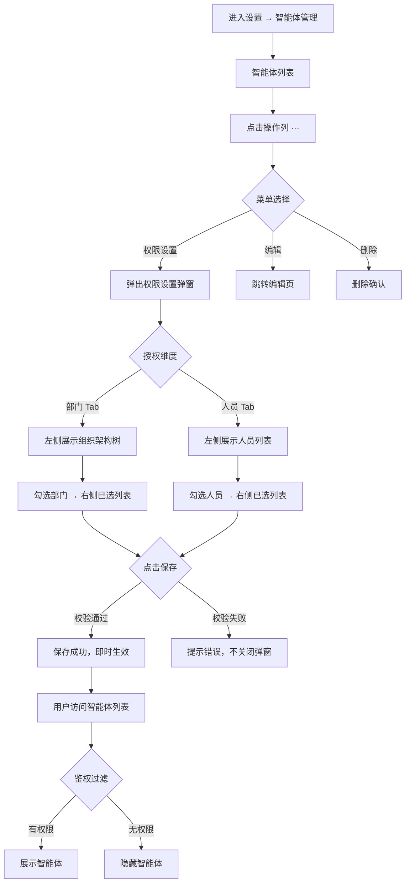
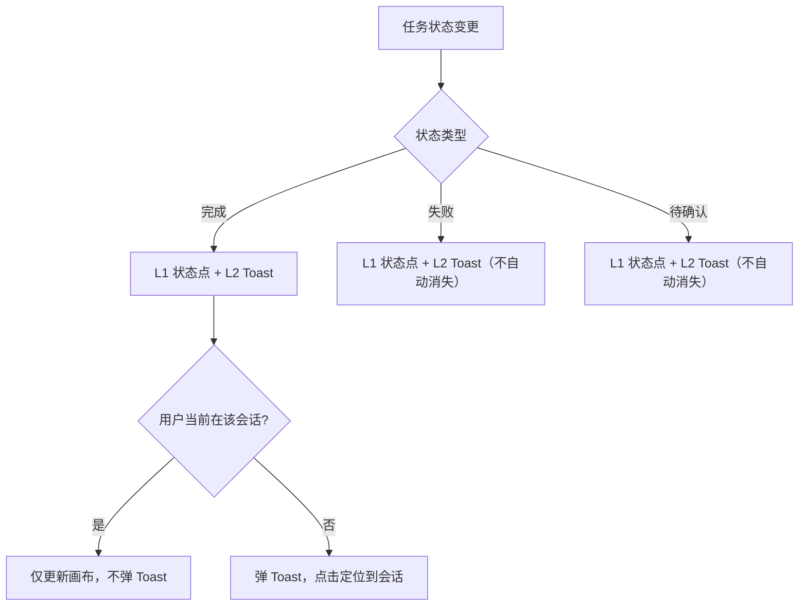
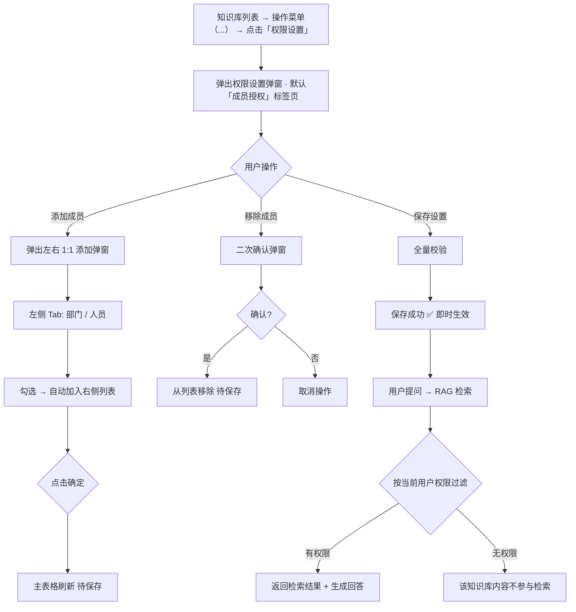

# 20260817-【PRD】AI工作台V1.1版本-天马智擎项目

_**天马智擎项目**_

**产品需求说明书**

版本信息

本表用于记录本文档的维护过程，请认真填写。

| 版本号 | 时间(必填) | 状态 | 简要描述(必填) | 部门 | 责任产品(必填) | 批准人 |
| --- | --- | --- | --- | --- | --- | --- |
| V1.1 | 2026-08-12 | M | 迭代优化：权限配置 | AI项目小组 | $\color{#0089FF}{@公输}$ |  |

注：状态可以为N-新建、A-增加、M-更改、D-删除。

# 功能需求

## 天马智擎首页

### 切换规则

| **操作场景** | **输入框内容** | **联网查询开关** | **已上传文件** |
| --- | --- | --- | --- |
| 1. 日常办公 → 专家模式选择页（用户自行输入内容） | 保留 | 通用规则（保留用户设置＞默认开启） | 完整保留 |
| 2. 选定或切换智能体（选择页→选定，或A→B切换）（用户自行输入内容） | 保留 | 通用规则（保留用户设置＞默认开启） | 完整保留 |
| 3. 切回日常办公模式（用户自行输入内容） | 保留 | 通用规则（保留用户设置＞默认开启） | 完整保留 |
| 4. 日常办公，案例卡片（点击案例卡片） | 覆盖写入 | 通用规则（保留用户设置＞默认开启） | 完整保留 |
| 5. 专家模式，智能体案例卡片（点击案例卡片） | 覆盖写入 | 通用规则（保留用户设置＞默认开启） | 完整保留 |
| 6. 选中专家 → 关闭专家卡片（用户自行输入内容/修改快捷提示语内容，未使用快捷提示语） | 保留 | 通用规则（保留用户设置＞默认开启） | 完整保留 |
| 7. 选中专家 → 关闭专家卡片（使用了快捷提示语且未修改） | 清空 | 通用规则（保留用户设置＞默认开启） | 完整保留 |
| 8. 新对话/logo | 清空 | 恢复默认开启 | 清空 |

> **联网查询通用规则**：①用户手动修改过的开关设置保留＞②默认开启。

### 支持图片上传

| ~~**格式**~~ | ~~**扩展名**~~ | ~~**上传**~~ | ~~**内容解析**~~ | ~~**预览**~~ | ~~**大纲导航**~~ | ~~**优先级**~~ |
| --- | --- | --- | --- | --- | --- | --- |
| ~~PDF~~ | `~~.pdf~~` | ~~✅~~ | ~~✅ 解析文本~~ | ~~✅ HTML 渲染~~ | ~~✅ 提取书签~~ | ~~P0~~ |
| ~~DOCX~~ | `~~.docx~~` | ~~✅~~ | ~~✅ 解析文本~~ | ~~✅ HTML 渲染~~ | ~~✅ 提取 H1-H3 标题~~ | ~~P0~~ |
| ~~TXT~~ | `~~.txt~~` | ~~✅~~ | ~~✅ 读取全文~~ | ~~✅ 纯文本渲染~~ | ~~—~~ | ~~P0~~ |
| ~~MD~~ | `~~.md~~` | ~~✅~~ | ~~✅ 读取全文~~ | ~~✅ Markdown 渲染~~ | ~~✅ 提取 H1-H3 标题~~ | ~~P0~~ |
| ~~XLSX~~ | `~~.xlsx~~` | ~~✅~~ | ~~✅ 提取单元格文本~~ | ~~✅ HTML 表格渲染~~ | ~~✅ Sheet 名称列表~~ | ~~P0~~ |
| ~~XLS~~ | `~~.xls~~` | ~~✅~~ | ~~✅ 提取单元格文本~~ | ~~✅ HTML 表格渲染~~ | ~~✅ Sheet 名称列表~~ | ~~P0~~ |
| ~~CSV~~ | `~~.csv~~` | ~~✅~~ | ~~✅ 读取全文~~ | ~~✅ 简易表格渲染~~ | ~~—~~ | ~~P0~~ |
| ~~DOC~~ | `~~.doc~~` | ~~✅~~ | ~~✅ 解析文本~~ | ~~✅ HTML 渲染~~ | ~~—~~ | ~~P0~~ |
| ~~PPTX~~ | `~~.pptx~~` | ~~❌~~ | ~~❌~~ | ~~✅ HTML 渲染~~ | ~~✅ 提取标题~~ | ~~P0~~ |
| ~~扫描 PDF~~ | `~~.pdf~~` | ~~✅~~ | ~~❌ OCR 不在 MVP 范围~~ | ~~✅ 图片渲染~~ | ~~—~~ | ~~P0~~ |
| ~~PNG~~ | `~~.png~~` | ~~✅~~ | ~~✅ OCR + 多模态视觉识别（Qwen 3.8 Max）~~ | ~~✅ 图片渲染~~ | ~~—~~ | ~~P0~~ |
| ~~JPG~~ | `~~.jpg~~` | ~~✅~~ | ~~✅ OCR + 多模态视觉识别（Qwen 3.8 Max）~~ | ~~✅ 图片渲染~~ | ~~—~~ | ~~P0~~ |
| ~~JPEG~~ | `~~.jpeg~~` | ~~✅~~ | ~~✅ OCR + 多模态视觉识别（Qwen 3.8 Max）~~ | ~~✅ 图片渲染~~ | ~~—~~ | ~~P0~~ |
| ~~MP4~~ | `~~.mp4~~` | ~~✅~~ | ~~❌~~ | ~~✅ 视频播放~~ | ~~—~~ | ~~P2~~ |
| ~~AVI~~ | `~~.avi~~` | ~~✅~~ | ~~❌~~ | ~~✅ 视频播放~~ | ~~—~~ | ~~P2~~ |
| ~~HTML~~ | `~~.html~~` | ~~✅~~ | ~~✅~~ | ~~✅~~ | ~~—~~ |  |


~~图片理解通过新增一个MCP工具的方式实现，通过给"文件上传"这一基座环节增加一步"图片识别 + 提示词注入"，让原本看不见图的文本模型也能在对话中调用视觉工具。~~

~~**核心机制（四步闭环）：**~~

1.  ~~**识别（Recognize）**~~~~：文件上传通道接收用户文件，按 MIME / 扩展名判定为图片（PNG / JPG / JPEG）。~~
    
2.  ~~**拼接（Inject）**~~~~：基座层在把请求发给主力文本模型前，自动拼接一段「视觉理解指令」（系统级提示词），告知模型"用户上传了图片，请用~~ `~~describe_image~~` ~~工具读取后再作答"。~~
    
    ```plaintext
    ```
    【检测到用户本次上传了图片文件：{file_name}（{mime_type}，{size}）。
    请勿将原始图片直接塞入上下文。请使用 vision-bridge-mcp 的 describe_image 工具读取该图片内容，
    将返回的文字描述作为理解依据后再回答用户问题；
    若用户仅问图中文字，可改用 extract_text；
    复杂 UI/架构图使用 mode=ui / mode=diagram 提升识别精度。】
    ```
    ```
    
3.  ~~**调用（Act）**~~~~：主力文本模型按指令调用视觉工具~~ `~~describe_image~~`~~，由旁路多模态模型把图片转成文字。~~
    
4.  ~~**理解（Reason）**~~~~：文字描述并入上下文，主力文本模型基于描述生成最终回答；同一图片复用缓存，不重复调用。~~
    

> ~~一句话：~~~~**图片上传 = 触发一次提示词注入；文本模型按注入指令调工具看图。**~~ ~~视觉算力与文本算力解耦，可独立替换与治理。~~

~~技术架构方案（Vision-as-a-Tool）~~

*   ~~**大脑（文本主力模型）**~~~~：DeepSeek V4 Flash 等纯文本大模型，负责理解意图与最终作答。它本身看不见像素。~~
    

*   ~~**眼睛（旁路视觉模型）**~~~~：多模态视觉模型~~ `~~qwen-vl-max~~`~~（经阿里 DashScope OpenAI 兼容端点接入，与矩阵标注的「Qwen 3.8 Max」一致）；可配置 fallback 链（~~`~~qwen2.5-vl-72b-instruct~~` ~~等）。~~
    

*   ~~**桥梁（单工具 MCP）**~~~~：~~`~~vision-bridge-mcp~~`~~（一个 MCP 服务，核心工具~~ `~~describe_image~~`~~），把图片转文本喂回文本模型；支持多模型 fallback、内置缓存、OCR 兜底。~~
    

*   ~~**触发（基座提示词注入）**~~~~：即上文"拼接"环节——不依赖独立智能体，而是在上传图片时由基座层注入指令，驱动主力模型主动调工具。~~
    

[https://github.com/G12789/vision-bridge-mcp: https://github.com/G12789/vision-bridge-mcp](https://github.com/G12789/vision-bridge-mcp)

*   `~~describe_image~~`~~：将图片转为详细文本（参数~~ `~~source~~` ~~支持路径 / URL / base64；~~`~~mode~~` ~~支持~~ `~~general~~`~~/~~`~~ui~~`~~/~~`~~diagram~~`~~/~~`~~ocr~~`~~；可选~~ `~~question~~` ~~针对特定问题）。~~
    

*   `~~extract_text~~`~~：纯 OCR 取图中文字（中文优先），作为视觉识别的兜底。~~
    

*   `~~vision_rules~~`~~：返回"何时自动调工具"的规则文本，可作为提示词拼接的范本。~~
    

*   `~~VISION_BRIDGE_CACHE=1~~`~~：按「图片 + mode + question」缓存描述，降低重复调用成本。~~
    

### 智能体权限配置

#### 功能需求描述

> 系统管理员可在「设置 → 智能体管理」中对每个智能体设置可见范围。默认所有智能体均不可见；管理员可通过权限设置弹窗将智能体授权给指定部门或指定人员。未被授权的用户在首页智能体列表、专家模式选择页等入口均看不到该智能体。

| **EARS 模式** | **需求描述** |
| --- | --- |
| 普遍型 | 系统应在「设置 → 智能体管理」列表的每行操作列提供 `···` 菜单，菜单中包含「权限设置」选项。系统应在用户点击「权限设置」后，在页面中间上方居中弹出「权限设置」弹窗。系统应在弹窗中提供「部门」「人员」两个授权维度 Tab，管理员可选择部门或人员进行授权。系统应将授权动作解释为：允许被授权对象查看并使用该智能体。 |
| 状态驱动型 | 当智能体未做权限设置时，系统应默认对全公司不可见。当已授权部门发生人员变动（入职/离职/调岗）时，系统应自动同步权限：新加入部门的人员自动获得访问权，离开部门的人员自动失去访问权。当用户无权限时，系统应在各入口隐藏该智能体，用户无法通过 URL 等方式感知其存在。 |
| 事件驱动型 | 当用户点击「保存设置」时，系统应校验并全量保存当前授权列表。当用户点击「移除」某成员/部门时，系统应展示二次确认弹窗。当用户切换 Tab 时，系统应保留当前已选内容，不丢失草稿状态。 |
| 不良行为型 | ~~系统管理员不可通过界面移除自身的管理权限。~~系统应防止用户通过直接调用接口方式访问无权限智能体，后端需做鉴权拦截。系统不应在弹窗中展示角色组维度。 |

#### 业务主流程图及说明



**说明**：保存后即时生效，用户再次进入智能体相关入口时按最新权限过滤展示。

#### 界面原型


**操作菜单入口（知识库列表）**

| **元素** | **交互** | **说明** |
| --- | --- | --- |
| 【二级菜单入口 `···`】点击 | 在操作列右下侧弹出二级菜单 | — |
| 【权限设置】点击 | 点击后弹出「权限设置」弹窗，弹窗在页面中间上方居中显示 | — |

**权限设置界面**

| **元素** | **文案/交互** | **说明** |
| --- | --- | --- |
| 弹窗标题 | 「权限设置」 | 标题居中，右上角关闭按钮 |
| 【搜索】输入内容 | 「搜索部门/人员」 | 输入框，支持输入名称、花名左右匹配关联部门，人员 |
| 【信息卡片】 | 展示当前已经配置成员，包含人员、部门两种类型 | 默认选中「部门」 |
| 【移除】点击 | 弹窗二次确认：标题「确认移除」；内容「确定移除 {部门/人员名称} 的访问权限？移除后，该对象将无法继续使用此智能体。」；按钮「取消」「确定」 | 每一次操作均需提醒 |
| 【取消、关闭】点击 | 取消当前配置，回到上一状态，弹窗二次确认：标题「确认取消」；内容「还有未保存的设置，取消后，当前进行中的操作会被清空」；按钮「取消」「确定」 | 未做改变时不需提醒 |
| 【保存】点击 | 保存当前配置，存入数据库，立即生效 | 未做改变时置灰，保存前做全量校验 |
| 空态 | 「暂未授权，请选择部门或人员」 | 未选择任何对象时展示 |

**添加成员界面**

| **元素** | **文案/交互** | **说明** |
| --- | --- | --- |
| 弹窗标题 | 「添加成员」 | 标题居中，右上角关闭按钮 |
| 【搜索】输入内容 | 「搜索部门/人员」 | 输入框，支持输入名称、花名左右匹配关联部门，人员 |
| 【Tab】点击切换 | 「部门」「人员」两个 Tab，居中排列在标题下方 | 默认选中「部门」 |
| 【左侧选区】（部门 Tab） | 展示公司~~组织架构树~~组织架构列表，点击下级进入下一级列表，~~支持展开/收起、勾选父级自动勾选子级~~、搜索部门；已选中的部门在列表中置灰，在右侧已选列表中展示，避免重复添加。 | 已选中的部门在右侧列表展示~~，参考组件：~~<br>[~~Tree 树形控件 \| Element Plus~~](https://element-plus.org/zh-CN/component/tree)<br>[~~树形控件 Tree - Ant Design~~](https://ant.design/components/tree-cn)<br>不使用树形展示，采用面包屑+列表方式展示；上下级部门选择，没有联动，选择下级部门，上级部门不改为选中态 |
| 【左侧选区】（人员 Tab） | 展示人员列表，支持按花名搜索、分页加载、勾选；已选中的人员在列表中置灰，避免重复添加。 | 已选中的人员在右侧列表展示 |
| 【已选列表】展示 | 展示当前已选部门/人员，每行显示名称 + 类型标签（部门/人员）+ 移除按钮；权限设置界面历史已添加的成员不再重复展示 | 点击移除按钮删去对应人员、部门<br>左侧选取和右侧已选列表联动展示，左侧勾选，右侧实时新增人员、部门，置于列表顶部。 |
| 【取消、关闭】点击 | 取消当前配置，回到上一状态，弹窗二次确认：标题「确认取消」；内容「还有未保存的设置，取消后，当前进行中的操作会被清空」；按钮「取消」「确定」 | 未做改变时不需提醒 |
| 【保存】点击 | 保存当前配置，存入数据库，立即生效 | 未做改变时置灰，保存前做全量校验 |

#### 数据说明（业务实体）

**无**

#### 业务规则和约束条件

| **规则项** | **说明** |
| --- | --- |
| 默认可见范围 | 智能体创建后默认对全公司不可见（即未设置权限 = 全员不可用）。一旦管理员保存了授权列表（可使用），仅授权对象可见。 |
| 按钮可见范围 | 只有管理员角色可以看到相关的菜单功能、按钮。 |
| 授权维度 | 仅支持「组织架构（部门）」和「人员」两个维度，暂不支持角色组。 |
| 部门授权含义 | 勾选部门 = 该部门下所有在职人员均获得访问权。人员入职/离职/调岗后，系统每日同步或实时同步组织架构变更，自动生效。 |
| 人员授权含义 | 单独勾选某个人员，无论其部门如何，均获得访问权。 |
| ~~权限冲突~~ | ~~若用户所在部门已授权，同时该用户又在人员 Tab 被单独移除，以人员维度为准（人员移除优先于部门授权）。~~ |
| ~~管理员特权~~ | ~~系统管理员天然拥有所有智能体的查看和管理权限，不受授权列表限制；但管理员不可在弹窗中移除自己的管理权限（在后端数据表中可设置）。~~ |
| 保存策略 | 弹窗内所有变更均为草稿状态，点击「保存设置」后全量校验并落库；点击「取消」或关闭弹窗则放弃本次变更。 |
| 重复选择 | 已选中的部门/人员在列表中置灰，避免重复添加。 |
| 已选列表展示 | 权限设置界面已选中的部门/人员在右侧已选列表中展示，但置灰不可操作，新增成员置于顶部。 |
| 移除成员 | 每一次操作均需二次弹窗确认 |
| 上下级部门不联动 | 上下级部门选择，没有联动，例如：选择下级部门，上级部门不改为选中态 |
| 意图识别判定 | 意图识别不跟智能体进行绑定，无论有无智能体权限，均会先进行意图识别 |
| 智能体异常 | 如果智能体异常（可能是智能体删除、取消智能体权限、其他报错），在会话详情中<br>**一般情况下（刷新缓存）**前端需判定有无智能体，用户不能发送消息，点击发送按钮（置灰）点击提示「该智能体暂时停止为您服务，可能原因（您已无权限、智能体下线、网络异常等），具体情况请联系管理员」<br>**特殊情况下（未刷新缓存）**发送消息后走意图识别判定，<br>判定为拒绝场景时候，正常回复内容，不调用智能体<br>判定为批准场景时候，调用智能体，后端进行校验，回复兜底话术「该智能体暂时停止为您服务+{具体原因}」 |

#### 接口说明（可选）

**无**

#### 补充说明

*   部门 Tab 与人员 Tab 的数据源均来自钉钉通讯录，保持与公司组织架构一致。
    
*   本期不做「角色组」维度，若后续需要，可复用本弹窗结构扩展第三个 Tab。
    

### 用量数据定时推送

#### 功能需求描述

> 额度管理为智能体提供「成本可控」保障——防止单用户/单 Agent 过度消耗导致成本失控。**MVP 聚焦个人级配额**，部门级和企业级为后续迭代。

[《模型管理》](https://alidocs.dingtalk.com/api/doc/transit?dentryUuid=G1DKw2zgV2RYlEQ6fqABKzmNVB5r9YAn&queryString=utm_medium%3Ddingdoc_doc_plugin_card%26utm_source%3Ddingdoc_doc)

| **模式** | **描述** |
| --- | --- |
| 普遍型 | 系统应支持管理员为每个用户配置金币日额度、金币月额度、单任务金币上限、请求限速和 Token 安全天花板；系统应记录每笔模型调用的 Token 消耗、金币变动与成本（含峰谷）。 |
| 状态驱动型 | 当用户配额消耗达 70%/90% 时，系统应发送对应级别告警；当消耗达 100% 时，系统应拦截调用并返回配额耗尽错误。 |
| 事件驱动型 | 每次模型调用完成后，系统应更新用户配额计数器；每日/每月 0:00 自动重置对应周期配额。 |
| 不良行为型 | 配额统计数据延迟不超过 5 秒；重置操作失败时保留当前计数器不变并告警。 |

#### 数据同步

测试阶段，需要统计用户的会话轮次、token消耗、金额消耗，用以判断活跃度、贡献度，以周为单位进行轮换。

需求描述

1.  统计每个用户的①昨日日常办公会话轮次、七日日常办公会话轮次、累计日常办公会话轮次；②昨日专家模式会话轮次、七日专家模式会话轮次、累计专家模式会话轮次；③昨日token消耗、七日token消耗、累计token消耗；④昨日金额消耗、七日金额消耗、累计金额消耗
    
2.  ~~通过钉钉表格更新api每日03:00定时更新表格~~，表格形式以机器人推送方式发送在群里
    

**指标定义**

| **指标** | **定义** |
| --- | --- |
| 会话轮次 | 用户主动发起的一次提问 + AI 的一次回答 = 1 轮，按日颗粒度汇总统计用户维度数据 |
| 消耗 Token | 大模型反馈的实际输入输出token、缓存命中token，单位千token，保留两位小数，按日颗粒度汇总统计用户维度数据 |
| 消耗金额(元) | Token × 模型实时单价，单位元，保留两位小数，按日颗粒度汇总统计用户维度数据 |

**定时推送**

| **规则项** | **说明** |
| --- | --- |
| 数据源 | 后端模型调用日志（已有，C1 情况：后端有数据，需整理汇总后推送） |
| 聚合维度 | 按 (人 × 日期 × 模式) 聚合 (昨日 × 七日 × 累计) 会话轮次/Token/金额 |
| 推送方式 | 调用钉钉开放 API更新 多维表，按 (userid) 主键幂等覆盖 |
| 推送频率 | 每日定时3:00执行任务（cron），覆盖数据，不追加历史行 |
| 失败重试 | 任务失败后默认重试两次，仍然失败执行告警，钉钉发送消息 |

### 附件上传方式拓展

#### 界面原型

| **操作** | **交互** | **异常处理** | **截图示例** |
| --- | --- | --- | --- |
| 【拖拽上传】将文件拖拽至对话框区域 | 拖入时对话框+ 提示「松开以上传文件」；释放后自动触发上传流程，走与按钮选择相同的校验和状态展示 | 非白名单格式：提示「不支持该格式」；超过 3 个：拦截超出部分提示「单次最多上传 3 个文件」 | 待补充 |
| 【快捷键上传】Ctrl+C/V 在对话框快捷上传文件 | Ctrl+C/V后自动触发上传流程，走与按钮选择相同的校验和状态展示 | 非白名单格式：提示「不支持该格式」；超过 3 个：拦截超出部分提示「单次最多上传 3 个文件」 | 待补充 |

### 会话状态变更提醒

#### 业务主流程图及说明



**异步通知说明**：任务状态变更时，系统通过 SSE/WebSocket 实时推送。L1 会话列表状态点为常驻提醒（使用圆点表示状态：绿色成功，红色失败，灰色取消；使用动图表示状态：蓝色转圈进行中~~，橙色提醒待确认~~）；L2 全局 Toast 在页面上方中间弹出，为瞬时通知（可关闭、点击定位到任务），点击关闭按钮关闭，点击消息跳转至会话详情。

#### 界面原型

| **操作** | **交互** | **异常处理** | **截图示例** |
| --- | --- | --- | --- |
| 【会话列表状态点】任务状态变更 | 左栏对应会话显示彩色状态点：完成=绿色、失败=红色，取消=灰色 | — | 待补充 |
| 【全局 notice】任务状态变更且用户不在该会话 | 页面右下角弹出 notice 通知条，左侧展示状态图标（✓ 完成 / ✗ 失败 ~~/ ⚠ 待确认~~），中间展示会话标题+状态文案，右侧关闭按钮。点击关闭按钮关闭；点击 notice 定位跳转到对应会话；多个 notice 重叠堆叠展示，不设上限；鼠标悬浮提示点击查看会话；5s自动消失 | — |  |


**消息卡片文案**

1.已完成

标题（左上方）：【两种模式icon】任务已完成【任务状态icon】

正文（标题下方）：AI回复结果(超宽度截断，变为...)

操作按钮（右方）：查看按钮|关闭icon（右上方）

2.已失败

标题（左上方）： 【两种模式icon】任务执行失败【任务状态icon】

正文（标题下方）：错误摘要，具体原因

操作按钮（右方）：查看按钮|关闭icon（右上方）

### 展示不全内容信息展示

在全局中，存在部分文案因为宽度限制展示不全的情况，需要在鼠标悬浮在对应文案的时候进行提醒。

具体情形如下：

| **页面** | **模块** | **内容** | **截图示例** |
| --- | --- | --- | --- |
| 天马智擎首页 | 历史会话 | 会话标题 |  |
|  | 日常办公模式 | 案例卡片介绍 |  |
|  | 输入框 | 文件卡片标题 |  |
|  | 会话详情 | 生成文件卡片标题 |  |
|  | 会话详情 | 引用文件卡片标题 |  |
|  | 附件上传 | 选择文件标题 |  |
|  | 知识中心引用 | 文件夹、知识库、文件标题 |  |
|  | 专家模式 | 专家卡片简介 |  |
| 工作台 | 系统入口 | 系统副文本 |  |
|  | 待办中心 | 待办详情描述 |  |
|  | 待办中心 | 待办标题 |  |
|  | 待办管理 | 待办管理展开后详情描述 |  |
|  | 定时任务 | 定时任务标题 |  |
|  | 定时任务 | 定时任务详情描述 |  |
| 仪表盘 | 数据卡 | 指标标题 |  |
|  | 指标配置 | 指标标题 |  |
| 知识中心 | 文件上传 | 选择文件标题 |  |
|  | 任务中心 | 文件名称 |  |
|  | 文件树 | 知识库、文件夹、文件名称 |  |
|  | 文件列表 | 知识库、文件夹、文件名称 |  |
|  | 文件搜索 | 知识库、文件夹、文件名称 |  |
|  | 面包屑 | 知识库、文件夹、文件名称 |  |

### 操作按钮悬浮提示

在全局中，存在部分特殊操作按钮只有icon，没有文字说明；需要增加悬浮提示以提升操作便利性，效果类似下面示例。

具体情形如下：

| 会话详情 | 加号 | 添加参考文件 | **补充悬浮提示** | **截图示例** | 备注 |
| --- | --- | --- | --- | --- | --- |
| 天马智擎首页 | 历史会话 | 搜索 | 搜索会话 |  |  |
|  | 历史会话 | 抽屉 | 收起侧边栏 |  |  |
|  | 历史会话 | 抽屉 | 展开侧边栏 |  |  |
|  | 历史会话 | 新建 | 新建任务 |  |  |
|  | 产物栏 | 抽屉 | 收起侧边栏 |  |  |
|  | 产物栏 | 抽屉 | 展开侧边栏 |  |  |
|  | 查看收藏 | 三角 | 返回 |  |  |
|  | 输入框 | 加号 | 添加参考文件 |  |  |
| 未输入内容 | 输入框 | 箭头 | 请输入内容 |  |  |
| 未输入内容 | 输入框 | 箭头 | 请输入内容 |  |  |
|  | 输入框 | 箭头 | 发送/请选择专家(未选择专家时) |  |  |
|  |  |  |  |  |  |
|  | 会话详情 | 复制 | 复制 |  |  |
|  | 会话详情 | 追问 | 追问 |  |  |
|  | 会话详情 | 收藏 | 收藏 |  |  |
|  | 会话详情 | 分享 | 分享 |  |  |
|  | 会话详情 | 加号 | 添加参考文件 |  |  |
|  | 会话详情 | 地球 | 联网查询 |  |  |
|  | 会话详情 | 停止 | 点击停止 |  |  |
|  | 产物卡片 | 下载 | 下载 |  |  |
|  | 产物卡片 | 复制 | 复制 |  | 不添加 |
|  | 产物卡片 | 复制 | 下载 |  | 不添加 |
|  | 产物卡片 | 复制 | 最大化 |  | 不添加 |
|  | 文件预览 | 下载 | 下载文件 |  |  |
|  | 文件预览 | 关闭 | 关闭预览 |  |  |
| 工作台 | 定时任务 | 开关 | 开启/关闭 |  | 不添加 |
|  | 系统入口 | 箭头 | 跳转系统 |  |  |
| 仪表盘 | 隐私模式 | 开关 | 开启/关闭 |  | 不添加 |
|  | 指标卡片 | 箭头 | 点击查看详细数据/折叠详细数据 |  |  |
| 知识中心 | 任务中心 | 悬浮球 | 任务中心 |  |  |
|  | 文件树 | 加号 | 新建知识库 |  |  |
|  | 文件树 | 放大镜 | 搜索 |  |  |
|  | 文件树 | 抽屉 | 展开侧边栏 |  |  |
|  | 小智问答 | 箭头 | 发送 |  |  |
|  | 小智问答 | 复制 | 复制 |  |  |
|  | 小智问答 | 停止 | 点击停止 |  |  |

## 知识中心

### 列表切换排序

| 列表 | 默认排序 | 浏览方式 |
| --- | --- | --- |
| 知识库列表/文件夹列表/文件列表 | ~~双击字段~~点击后出现二级菜单进行选择切换排序方式（所有者-拼音首字母排序、上传/创建时间-时间排序、~~最近访问-时间排序）~~ | 降序、升序之间切换<br>对于名称、所有者——升序A→Z、降序Z→A<br>对于日期时间——由近到远、由远到近 |


补充：删掉最近访问时间字段

### 按钮可用性

**个人空间下**


| **场景** | **按钮状态** | **交互行为** | **目标默认选中** |
| --- | --- | --- | --- |
| ① 无知识库（当前空间下没有任何知识库） | 上传文件、新建文件夹、小智问答按钮置灰不可点击 | 不响应点击，<br>hover 时展示提示「请先新建知识库」 | — |
| ② 已有知识库，在「全部知识库」页面 | 正常可用 | 点击后弹出操作弹窗，目标选择器默认为空，提醒“请选择知识库”，需要选择知识库；<br>点击新建知识库时不需选择所属空间 | — |
| ③ 已有知识库，进入具体知识库 / 文件夹内 | 正常可用 | 点击后弹出操作弹窗，目标选择器默认选中「当前所在的知识库 / 文件夹」，可切换其他；<br>点击新建知识库时不需选择所属空间 | 当前知识库 / 文件夹 |

**公共空间下**


| **场景** | **按钮状态** | **交互行为** | **目标默认选中** |
| --- | --- | --- | --- |
| 【普通用户】<br>① 无知识库（当前空间下没有任何知识库） | 上传文件、新建文件夹不可见；<br>新建知识库、小智问答按钮置灰；<br>缺省图调整 | 新建知识库鼠标悬浮提示「公共空间下暂无权限」；<br>小智问答鼠标悬浮提示「暂无知识库」 | — |
| 【普通用户】<br>② 已有知识库（可查看），在「全部知识库」页面 | 小智问答正常可用；<br>新建知识库按钮置灰 | 新建知识库鼠标悬浮提示「暂无权限新建知识库」； | — |
| 【系统管理员】<br>② 已有知识库 | 逻辑同个人空间 | 逻辑同个人空间 | 逻辑同个人空间 |

注：公共空间仅系统管理员可见上传/新建按钮

### 权限管理

知识库权限决定用户能看到哪些内容、能做什么操作。仅知识库支持权限设置，文件夹和文件继承知识库权限，不独立设置。非成员用户不可感知知识库存在。

#### 功能需求描述

| EARS 模式 | 需求描述 |
| --- | --- |
| 普遍型 | \* 系统应提供**系统管理员**和**普通员工**两种角色。<br>\* 系统管理员由后端全局配置，天然对所有公共空间知识库具有管理权，不依赖特定知识库创建行为。<br>\* 普通员工无默认查看权限，需由系统管理员按**部门、**~~**角色组**~~**、人员**授予查看权限。<br>\* 系统应在权限设置弹窗中展示「成员授权」标签页，以表格展示当前已授权的成员。<br>\* 系统应采用**弹窗**完成成员添加：左侧为选择区（部门树形勾选/~~角色组~~卡片勾选/人员列表），右侧为已选成员列表。<br>\* 授权动作即授予对该知识库的查看权限，角色为普通员工。 |
| 状态驱动型 | \* 当左侧勾选的成员/部门已在主表格中存在时，系统应置灰左侧选项并提示「已自动过滤 N 位已存在成员」。<br>\* 当部门作为选源时，勾选部门等于批量选择该部门下的个人，部门本身不作为成员行展示。<br>\* 当非成员用户尝试访问知识库时，系统应返回「无权限」且不可感知知识库存在。 |
| 事件驱动型 | \* 当用户点击「保存设置」时，系统应全量校验后落库生效。<br>\* 当用户移除成员时，系统应展示二次确认弹窗。<br>\* 弹窗关闭（点击确定）仅刷新主表格展示，不落库。点击「保存设置」后全量校验生效。 |
| 不良行为型 | \* ~~系统管理员不可通过界面移除自身的管理权限，需通过后端配置变更。~~<br>\* 个人空间不展示权限配置入口。 |

#### 业务主流程图及说明



**说明**：弹窗只负责添加新成员，主表格负责展示与行内调整。所有变更在点击「保存设置」后全量校验并落库。

#### 界面原型


**操作菜单入口（知识库列表）**

| **元素** | **交互** | **说明** |
| --- | --- | --- |
| 【二级菜单入口 `···`】点击 | 在操作列右下侧弹出二级菜单 | — |
| 【权限设置】点击 | 点击后弹出「权限设置」弹窗，弹窗在页面中间上方居中显示 | — |

**权限设置界面**

| **元素** | **文案/交互** | **说明** |
| --- | --- | --- |
| 弹窗标题 | 「权限设置」 | 标题居中，右上角关闭按钮 |
| 【搜索】输入内容 | 「搜索部门/人员」 | 输入框，支持输入名称、花名左右匹配关联部门，人员 |
| 【信息卡片】 | 展示当前已经配置成员，包含人员、部门两种类型 | 默认选中「部门」 |
| 【移除】点击 | 弹窗二次确认：标题「确认移除」；内容「确定移除 {部门/人员名称} 的访问权限？移除后，该对象将无法继续使用此智能体。」；按钮「取消」「确定」 | 每一次操作均需提醒 |
| 【取消、关闭】点击 | 取消当前配置，回到上一状态，弹窗二次确认：标题「确认取消」；内容「还有未保存的设置，取消后，当前进行中的操作会被清空」；按钮「取消」「确定」 | 未做改变时不需提醒 |
| 【保存】点击 | 保存当前配置，存入数据库，立即生效 | 未做改变时置灰，保存前做全量校验 |
| 空态 | 「暂未授权，请选择部门或人员」 | 未选择任何对象时展示 |

**添加成员界面**

| **元素** | **文案/交互** | **说明** |
| --- | --- | --- |
| 弹窗标题 | 「添加成员」 | 标题居中，右上角关闭按钮 |
| 【搜索】输入内容 | 「搜索部门/人员」 | 输入框，支持输入名称、花名左右匹配关联部门，人员 |
| 【Tab】点击切换 | 「部门」「人员」两个 Tab，居中排列在标题下方 | 默认选中「部门」 |
| 【左侧选区】（部门 Tab） | 展示公司~~组织架构树~~组织架构列表，点击下级进入下一级列表，~~支持展开/收起、勾选父级自动勾选子级~~、搜索部门；已选中的部门在列表中置灰，在右侧已选列表中展示，避免重复添加。 | 已选中的部门在右侧列表展示~~，参考组件：~~<br>[~~Tree 树形控件 \| Element Plus~~](https://element-plus.org/zh-CN/component/tree)<br>[~~树形控件 Tree - Ant Design~~](https://ant.design/components/tree-cn)<br>不使用树形展示，采用面包屑+列表方式展示；上下级部门选择，没有联动，选择下级部门，上级部门不改为选中态 |
| 【左侧选区】（人员 Tab） | 展示人员列表，支持按花名搜索、分页加载、勾选；已选中的人员在列表中置灰，避免重复添加。 | 已选中的人员在右侧列表展示 |
| 【已选列表】展示 | 展示当前已选部门/人员，每行显示名称 + 类型标签（部门/人员）+ 移除按钮；权限设置界面历史已添加的成员不再重复展示 | 点击移除按钮删去对应人员、部门<br>左侧选取和右侧已选列表联动展示，左侧勾选，右侧实时新增人员、部门，置于列表顶部。 |
| 【取消、关闭】点击 | 取消当前配置，回到上一状态，弹窗二次确认：标题「确认取消」；内容「还有未保存的设置，取消后，当前进行中的操作会被清空」；按钮「取消」「确定」 | 未做改变时不需提醒 |
| 【保存】点击 | 保存当前配置，存入数据库，立即生效 | 未做改变时置灰，保存前做全量校验 |

#### 业务规则和约束条件

*   仅知识库支持权限设置，文件夹和文件不独立设置权限（全量继承知识库权限）
    
*   非成员用户看不到知识库的存在
    
*   系统管理员由后端全局配置，不可通过界面移除自身管理权
    
*   已存在的成员不可重复添加（弹窗自动去重置灰）
    
*   个人空间不展示权限配置入口
    
*   角色变更存在草稿状态，点击配置生效（确认）按钮才会启用编辑后的成员权限
    
*   权限设置入口位于知识库列表右侧操作菜单（二级菜单），与「重命名」「删除」同级
    
*   部门作为选源时，按部门授权，后续该部门下人员变动（入职/离职/调岗）自动同步权限
    
*   按钮可见范围，只有管理员角色可以看到相关的菜单功能、按钮。
    
*   已选列表展示：权限设置界面已选中的部门/人员在右侧已选列表中展示，但置灰不可操作，新增成员置于顶部。
    
*   移除成员：每一次操作均需二次弹窗确认。
    
*   上下级部门不联动：上下级部门选择，没有联动，例如：选择下级部门，上级部门不改为选中态。
    

#### 补充说明

> RAG 检索召回同样需要按照当前用户权限过滤。

| **规则项** | **说明** |
| --- | --- |
| 过滤时机 | 检索召回阶段（向量检索 + 关键词检索）执行权限过滤，在召回结果返回给大模型之前完成 |
| 过滤逻辑 | 检索引擎读取当前用户的授权知识库列表，仅在该列表范围内的知识库中检索；非授权知识库的文档片段不参与召回 |
| 权限同步 | 管理员保存权限变更后，权限列表即时生效；下一次检索请求自动使用最新权限 |
| 权限回收 | 管理员移除某用户对知识库的查看权限后，该用户后续检索不再命中该知识库内容；已有的历史回答中引用标记为「已无查看权限」 |