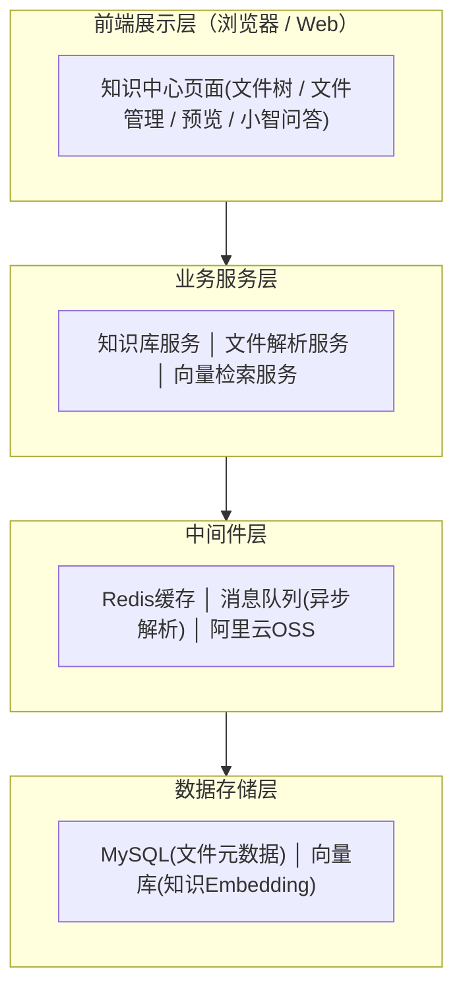
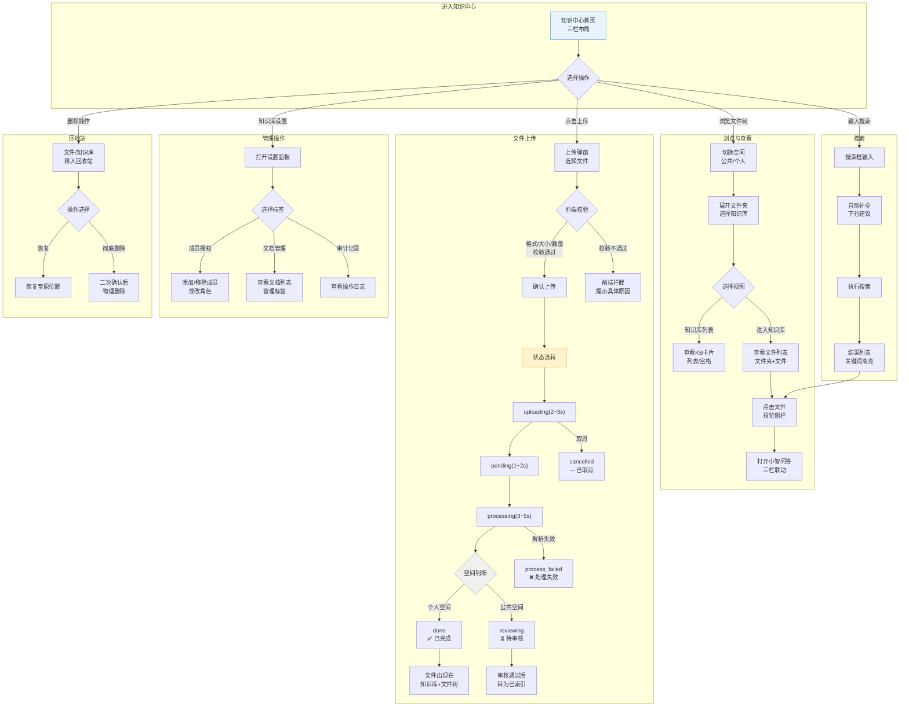
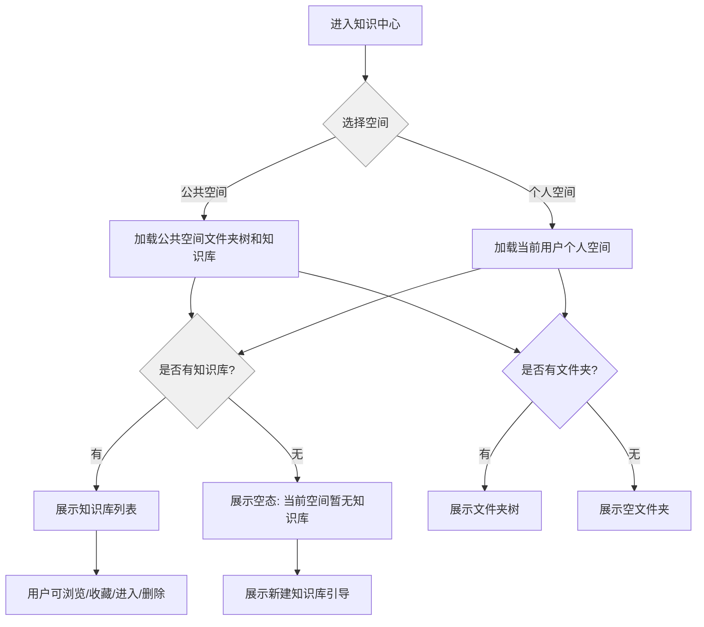

# 20260703-【PRD】AI工作台-知识中心-天马智擎项目

_**天马智擎项目**_

**产品需求说明书**

版本信息

本表用于记录本文档的维护过程，请认真填写。

| 版本号 | 时间(必填) | 状态 | 简要描述(必填) | 部门 | 责任产品(必填) | 批准人 |
| --- | --- | --- | --- | --- | --- | --- |
| V1.0 | 2026-07-03 | N | AI工作台中知识库产品需求 | AI项目小组 | $\color{#0089FF}{@公输}$ |  |
|  |  |  |  |  |  |  |

注：状态可以为N-新建、A-增加、M-更改、D-删除。

# 关于本文档

## 术语

| **词汇名称** | **全局说明** |
| --- | --- |
| Embedding | 文本向量化，将语义转化为数学向量 |
| Cosine Similarity | 余弦相似度，衡量向量之间的语义距离 |
| Top-K | 检索结果中取相似度最高的 K 条 |
| MCP | Model Context Protocol，模型上下文协议 |
| OSS | 阿里云对象存储服务 |
| file-chip | 已选附件的标签式展示组件 |

## 参考文档

为了更好理解本文档，请阅读如下文档。

| **编号** | **文档** | **说明及地址** |
| --- | --- | --- |
| 1 | 原型界面参考 | https://fri555.github.io/PORTL/ |
| 2 |  |  |

## 沟通要求

本表记录需要跨部门沟通的事项，以保证该文档内容质量。如果有其它跨部门沟通项，请填写该表中，并记录沟通结果。

| **序号** | **部门** | **沟通内容** | **沟通结果** |
| --- | --- | --- | --- |
| 1 |  |  |  |
| 2 |  |  |  |

# 产品概述

本章节详细描述产品的背景、内容和目标等进行详细定义，关于产品定义的其它内容请阅读本产品定义说明书。

## 产品概述

知识中心是天马智擎 AI 工作台的核心业务入口，定位为集团统一知识库管理与智能问答平台。用户可以在同一页面完成知识库浏览、文档上传、文件预览、权限管理和基于知识库的小智问答。

## 产品目标

*   **统一知识入口**：用户可在知识中心切换公共空间/个人空间，并访问对应知识库与文件
    
*   **文件入库闭环**：用户上传文件后，可看到上传、排队、处理、完成、失败、取消等状态
    
*   **智能问答闭环**：用户可基于选定知识库或当前文件提问，答案展示来源引用
    
*   **权限安全闭环**：用户只能检索、预览、问答有权限访问的知识内容
    
*   **管理可追溯**：上传、删除、检索、问答、权限变更等关键操作均记录审计日志
    

## 用户角色

| **用户角色** | **职责描述** | **使用功能** |
| --- | --- | --- |
| **普通员工** | 快速查资料、问政策、找方案 | 浏览公共空间、搜索文件、向小智提问 |
| **知识库管理员** | 管理部门知识资产 | 新建知识库、上传文件、配置权限、处理异常文件 |
| **运维** | 保证知识安全与可追溯 | 查看权限、审计记录、敏感内容处理结果 |

## 同类产品/竞品调研(选写)

###  同类产品

1.  **钉钉知识库**
    
    1.  优势：与 IM、审批、日志、日程等 OA 场景天然集成，组织架构与权限体系接入成本低，适合钉钉生态内的基础知识沉淀。
        
    2.  不足：AI 问答入口较深、体验偏弱；文件树、版本管理、去重检测、生命周期治理等能力相对基础。
        
    3.  启示：MVP 阶段需对齐基础上传、检索、问答、文件树能力，并在问答入口、文件格式支持、细粒度文件树交互上形成差异。
        
2.  **飞书知识空间 / 飞书知识问答**
    
    1.  优势：RAG 工程能力较强，支持混合检索、Query 改写、重排序、溯源引用、多模型切换；权限与 AI 检索结合较成熟。
        
    2.  不足：成本较高，依赖企业在飞书生态内已有足够知识沉淀。
        
    3.  启示：中期应重点对标其“权限前置过滤 + 混合检索 + 溯源问答”链路，逐步建设专业 RAG 能力。
        
3.  **语雀**
    
    1.  优势：中文编辑器、目录树、知识库-目录-文档结构体验成熟，代码块、画板、Markdown 排版对研发与知识沉淀友好。
        
    2.  不足：AI 问答能力迭代较慢，与 IM/OA/审批等业务系统联动弱。
        
    3.  启示：文件树、目录层级、中文排版和文档组织方式可作为交互参考；天马智擎应以 AI 问答与业务联动形成差异。
        
4.  **Notion**
    
    1.  优势：Block 架构灵活，Database 多视图和模板生态成熟，适合个人、小团队和创意协作场景。
        
    2.  不足：企业级权限治理、本地化、私有化和国内访问稳定性不足。
        
    3.  启示：长期可参考其灵活信息组织方式，但当前不作为 MVP 主要对标对象。
        
5.  **Confluence**
    
    1.  优势：页面树、空间隔离、版本管理、审批链、插件生态成熟，是传统企业 Wiki 标杆。
        
    2.  不足：体验重、成本高、AI 能力弱，国内访问与本土化存在劣势。
        
    3.  启示：后续版本可参考其版本管理、审批流、空间治理能力，形成“轻体验 + AI 能力 + 企业治理”的替代价值。
        
6.  **AI 原生知识库平台（Dify、FastGPT、扣子/Coze、智巢 AI 等）**
    
    1.  优势：RAG、工作流编排、多模型切换、API 集成能力强，验证了“知识库 + AI 问答”的产品方向。
        
    2.  不足：多数缺少成熟文件管理、企业级权限、知识治理和精细化前端体验。
        
    3.  启示：天马智擎应吸收其 RAG 能力，同时补齐企业知识库所需的文件树、权限、审计、版本、去重与生命周期管理。
        
    
    ###  结论
    
    *   **MVP 阶段**：对标钉钉知识库，优先完成上传、解析、检索、问答、权限和文件树管理。
        
    *   **中期阶段**：对标飞书知识问答，补强混合检索、重排序、溯源、权限前置过滤和 RAG 评测。
        
    *   **长期阶段**：吸收语雀/Confluence 的知识治理能力，以及 AI 原生平台的多模型与工作流能力，形成“AI 原生能力 + 企业级知识治理 + 业务场景集成”的差异化。
        

# 功能需求

## 流程图

###  技术架构图

**1.整体架构**



**2.层级结构**

| **层级** | **示例** | **说明** |
| --- | --- | --- |
| 空间 | 公共空间、个人空间 | 顶层隔离，个人空间仅本人可见 |
| 空间文件夹 | 集团整体、商品部、B2B、技术部 | 用于承载部门或业务域知识 |
| 知识库 | 集团制度知识库、AI项目知识库 | 统一检索与权限配置单元 |
| 文件夹 | 投标资料、培训素材、客户案例 | 知识库内部组织结构 |
| 文件 | PDF、Word、Excel、Markdown、图片 | 实际知识内容载体 |

###  流程图

**1.用户流程图**



**2.流程图说明**

| **流程** | **说明** |
| --- | --- |
| **浏览流程** | 进入知识中心 → 切换空间 → 浏览文件树 → 选择知识库 → 查看文件列表 → 预览文件 → 小智问答联动 |
| **上传流程** | 点击上传 → 前端校验（格式/大小/数量） → 确认上传 → uploading→pending→processing→done（个人）或 reviewing（公共） |
| **搜索流程** | 搜索框输入 → 自动补全建议 → 执行搜索 → 结果高亮 → 点击预览 |
| **管理流程** | 知识库设置 → 成员授权 / 文档管理 / 审计记录 |
| **回收站流程** | 删除操作 → 回收站 → 恢复或彻底删除 |

## 功能模块

| **主功能** | **子功能** | **功能描述** |
| --- | --- | --- |
| 整体布局 | 页面布局 | 采用左侧文件树、中间内容区、右侧预览/问答区的三栏布局 |
| 整体布局 | 分栏切换 | 支持左侧文件树和右侧预览/问答面板展开、收起，适配不同知识管理与阅读场景 |
| 整体布局 | 文件树（左侧边栏） | 以树形结构展示空间、文件夹、知识库和文件，支持展开、收起、选中和右键操作 |
| 权限管理 | 知识库 / 文件权限 | 支持按空间、知识库、文件夹或文件配置访问权限，控制成员可见、可编辑范围 |
| 权限管理 | 审计日志 | 记录上传、删除、修改权限、问答检索等关键操作 |
| 文件管理 | 空间切换 | 支持在个人空间、公共空间之间切换，按空间加载对应文件夹、知识库和文档内容 |
| 文件管理 | 新建知识库 | 支持在指定空间或文件夹下创建知识库，作为同类业务文档的统一管理容器 |
| 文件管理 | 新建文件夹 | 支持在空间、知识库或知识库内部目录中新建文件夹，用于分类沉淀业务文档 |
| 文件管理 | 文件上传 | 支持向指定知识库或文件夹上传文档，上传后自动进入解析、切分和入库流程 |
| 文件管理 | 标签、密级 | 支持为文件设置业务标签和密级，用于后续检索过滤、权限控制和知识治理 |
| 文件管理 | 状态流转 | 展示文件从上传中、解析中、入库中、成功到失败的处理状态，便于跟踪进度 |
| 文件管理 | 文件搜索 | 支持按文件名、文件夹名或知识库名称进行搜索，快速定位目标内容 |
| 文件管理 | 文件预览 | 支持点击文件，直接预览有查看权限文件的内容 |
| 文件管理 | 文件删除 | 支持查看已删除文件或目录，并提供恢复、彻底删除等后续管理能力 |
| 知识库问答 | RAG搜索回复 | 基于所选知识库内容进行语义检索，并结合大模型生成可读、可追问的回答 |
| 知识库问答 | 溯源引用 | 回答中展示引用来源、文档片段和跳转入口，便于用户核验答案依据 |

### 整体布局

#### 3.2.1.1 功能需求描述

知识中心应作为 AI 工作台一级 Tab，为用户提供统一的知识资产入口。页面采用左侧文件树、中间内容区、右侧预览/小智问答的多栏联动布局。

| EARS 模式 | 需求描述 |
| --- | --- |
| 普遍型 | *   系统应在用户进入知识中心时默认展示公共空间文件树和知识库列表。<br>    <br>*   系统应始终展示侧栏折叠/展开入口。 |
| 状态驱动型 | *   当用户关闭左侧文件树时，系统应将中间内容区扩展为全宽，并展示浮动展开入口。<br>    <br>*   当预览侧栏打开时，系统应自动将小智问答入口展示在右侧。 |
| 事件驱动型 | *   当用户点击文件时，系统应打开文件预览区，并自动展示小智问答入口。<br>    <br>*   当用户点击折叠按钮»时，系统应以`translate-x`渐出动画收起侧栏。 |
| 不良行为型 | *   如果当前文件无预览能力，系统应展示不可预览原因（权限不足，解析失败）<br>    <br>*   如果预览标签超过5个，系统应移除最旧标签。 |

#### 3.2.1.2 业务主流程图及说明

同 3.1.2 流程图

#### 3.2.1.3 界面原型


| 操作 | 交互 | 截图/示例 |
| --- | --- | --- |
| 1.默认进入 | 【左侧】文件树+【右侧】文件管理 |  |
| 2.关闭左侧文件树 | 文件管理占满全屏；侧栏 `translate-x` 渐出；浮动 dock 出现在左上方 | <br> |
| 3.点击文件预览 | 【左侧】文件树+【中间】文件预览+【右侧】小智问答 |  |
| 4.预览时关闭左侧文件树 | 【左侧】文件预览+【右侧】小智问答 |  |
| 5.预览时关闭文件预览 | 【左侧】文件树+【中间】文件管理+【右侧】小智问答 |  |
| 6.预览时关闭小智问答 | 【左侧】文件树+【右侧】文件预览 |  |
| 7.点击按钮切换布局 | 文件视图切换【详细信息】/【文件卡片】 | <br> |

#### 3.2.1.4 数据说明（业务实体）

| 实体 | 字段 | 说明 |
| --- | --- | --- |
| Space | id、type、name、owner\_id | 公共空间或个人空间 |
| TreeNode | id、parent\_id、type、name、sort\_order | 文件树节点 |
| KnowledgeBase | id、space\_id、folder\_id、name、owner\_id、visibility | 知识库 |
| Document | id、kb\_id、folder\_id、name、format、status | 文件 |

#### 3.2.1.5 业务规则和约束条件

| 规则 | 说明 |
| --- | --- |
| 空间隔离 | 公共空间与个人空间数据完全隔离；不同用户个人空间互不可见 |
| 布局联动 | 文件预览、小智问答、文件树任一栏收起后，其余区域按规则自适应 |
| 默认状态 | 首次进入默认公共空间；切换空间时清空选中知识库和文件 |

#### 3.2.1.6 接口说明

| 接口 | 方法 | 说明 |
| --- | --- | --- |
| /api/knowledge/spaces | GET | 获取用户可见空间列表 |
| /api/knowledge/tree | GET | 获取指定空间下的文件树 |
| /api/knowledge/summary | GET | 获取知识中心首页统计与最近访问 |

#### 3.2.1.7 补充说明

无

### 文件管理

#### 3.2.2.1 功能需求描述

用户可在公共空间和个人空间之间切换，按空间文件夹、知识库、文件夹、文件层级浏览知识内容。管理员可在有权限的目录下新建知识库、文件夹、重命名、删除和调整排序。

| EARS 模式 | 需求描述 |
| --- | --- |
| 普遍型 | 系统应支持公共空间与个人空间切换，并展示对应空间下的文件树。 |
| 事件驱动型 | 当用户点击知识库节点时，系统应在中间区域展示该知识库根目录文件夹和文件列表。 |
| 事件驱动型 | 当用户在知识库节点右键时，系统应展示新建文件夹、上传文件、知识库问答等菜单项。 |
| 不良行为型 | 如果用户在知识库内部尝试新建知识库，系统应提示「知识库内只能新建文件夹」。 |

#### 3.2.2.2 业务主流程图及说明

**1.空间切换**



2.

文件树

#### 3.2.2.3 界面原型

| 操作 | 交互 | 截图/示例 |
| --- | --- | --- |
| 点击「公共空间」标签 | 加载公共空间文件夹树（12个部门文件夹）和知识库列表；清空 `selectedKbId` 和 `activeTreeId` | Figma 原型 v1.0 |
| 点击「个人空间」标签 | 按当前用户加载个人空间数据（3个默认文件夹和知识库） | — |

| 操作 | 交互 | 截图/示例 |
| --- | --- | --- |
|  |  |  |
|  |  |  |
| 用户A查看个人空间 | 仅看到用户A自己的知识库和文件 | — |
| 用户B尝试访问用户A的个人空间 | 返回403，不暴露任何用户A的个人空间内容 | — |

| 元素 | 交互结果 | 规则 |
| --- | --- | --- |
| 公共空间 | 加载公共空间文件夹树和知识库；清空选中态 | 全员可见 |
| 个人空间 | 按个人空间数据加载 | 仅创建者可见，不同用户间严格隔离 |

| 菜单 | 交互 | 截图/示例 |
| --- | --- | --- |
| 新建知识库 | 弹窗输入名称、选择所属空间和文件夹，创建后自动选中 | 中部弹窗 |
| 新建文件夹 | 弹窗输入文件夹名称，默认当前目录，创建后展开父节点 | 中部弹窗 |
| 知识库卡片 | 展示名称、部门、文档数、负责人、可见性、最近更新时间 | 列表/宫格视图 |
| 文件右键菜单 | 预览、重命名、删除、移动到 | 文件树和文件列表一致 |

#### 3.2.2.4 数据说明（业务实体）

| 实体 | 字段 | 说明 |
| --- | --- | --- |
| SpaceFolder | id、space\_id、parent\_id、name、sort\_order | 空间文件夹 |
| KnowledgeBase | id、folder\_id、name、owner、department、pinned、can\_edit | 知识库卡片 |
| Folder | id、kb\_id、parent\_id、name、created\_by | 知识库内部文件夹 |
| Favorite | user\_id、kb\_id、sort\_order | 用户收藏知识库 |

#### 3.2.2.5 业务规则和约束条件

| 场景 | 规则 |
| --- | --- |
| 公共空间新建 | MVP 一期仅管理员可创建知识库和文件夹 |
| 个人空间新建 | 用户可在个人空间创建个人知识库和文件夹 |
| 删除文件夹 | 文件夹下存在子文件或子文件夹时需二次确认 |
| 收藏排序 | 收藏知识库支持拖拽排序，排序结果按用户维度保存 |

#### 3.2.2.6 接口说明

| 接口 | 方法 | 说明 |
| --- | --- | --- |
| /api/knowledge/bases | GET/POST | 查询或新建知识库 |
| /api/knowledge/folders | GET/POST/PATCH/DELETE | 查询、新建、重命名、删除文件夹 |
| /api/knowledge/favorites | POST/PATCH/DELETE | 收藏、排序、取消收藏 |

#### 3.2.2.7 补充说明

知识库是检索和权限管理单元；文件夹只用于组织结构，不单独承载权限，除非后续业务明确需要文件夹级权限。

### 文件上传、解析与状态流转

#### 3.2.3.1 功能需求描述

用户可向有权限的知识库或文件夹上传文件。系统应完成格式校验、大小校验、上传、排队、解析、清洗、分块、向量化和入库，并以纯状态标签展示流程，不展示进度条。

| EARS 模式 | 需求描述 |
| --- | --- |
| 普遍型 | 系统应支持 PDF、DOCX、TXT、MD 四类 P0 格式上传。 |
| 事件驱动型 | 当用户选择文件后，系统应立即校验格式、单文件大小、单次数量和批次总大小。 |
| 状态驱动型 | 当文件处于 uploading 或 pending 状态时，系统应提供取消操作。 |
| 不良行为型 | 如果文件上传失败，系统应保留文件条目并提供重新上传入口。 |
| 不良行为型 | 如果文件解析失败，系统应展示失败原因并提供手动重试入口。 |

#### 3.2.3.2 业务主流程图及说明

```text
选择文件
  → 前端校验格式/大小/数量
  → 计算 SHA256
  → 命中重复则秒传完成
  → 未命中则上传 OSS
  → 进入 pending 队列
  → Worker 解析与向量化
  → done / process_failed / quality=low
```

#### 3.2.3.3 界面原型

| 操作 | 交互 | 截图/示例 |
| --- | --- | --- |
|  |  |  |
|  |  |  |

| 菜单 | 交互 | 截图/示例 |
| --- | --- | --- |
| 上传文件 | 点击后打开上传弹窗，可多选文件 | 上传弹窗 |
| 上传任务卡 | 右下角浮层显示最近 4 个任务状态 | 纯状态标签，无进度条 |
| 重新上传 | 上传失败后重新调起文件选择器 | upload\_failed |
| 手动重试 | 解析失败后重新进入处理队列 | process\_failed |
| 取消 | 上传中/排队中允许取消并二次确认 | cancelled |


上传文件弹窗

#### 3.2.3.4 数据说明（业务实体）

| 实体 | 字段 | 说明 |
| --- | --- | --- |
| UploadTask | id、doc\_id、file\_name、status、error\_msg、created\_at | 上传任务 |
| Document | id、kb\_id、folder\_id、name、format、size、sha256、status | 文件元数据 |
| ParseJob | id、doc\_id、status、retry\_count、started\_at、finished\_at | 解析任务 |
| Chunk | id、doc\_id、content、heading\_path、embedding\_id | 文档分块 |

#### 3.2.3.5 业务规则和约束条件

| 规则 | 说明 |
| --- | --- |
| 单文件大小 | 单个文件不超过 100MB |
| 单次数量 | 单次最多上传 50 个文件 |
| 批次总量 | 单次上传总大小不超过 1GB |
| 状态机 | uploading → pending → processing → done |
| 异常状态 | upload\_failed、process\_failed、interrupted、cancelled、offline |
| 秒传范围 | 单知识库内按 SHA256 精准去重，不跨公共/个人空间复用 |
| 质量预警 | OCR 置信度低、乱码风险、低分辨率扫描件标记 quality=low |

#### 3.2.3.6 接口说明

| 接口 | 方法 | 说明 |
| --- | --- | --- |
| /api/knowledge/files/precheck | POST | 上传前校验与 SHA256 去重判断 |
| /api/knowledge/files/upload | POST | 创建上传任务并获取上传地址 |
| /api/knowledge/files/{id}/retry | POST | 重新上传或重新处理 |
| /api/knowledge/files/{id}/cancel | POST | 取消上传或排队任务 |
| /api/knowledge/upload-tasks | GET | 查询当前用户上传任务 |

#### 3.2.3.7 补充说明

MVP 使用普通整文件上传；分片上传和断点续传在 MVP-2 后引入。文件列表中只展示状态标签，不展示百分比进度，避免用户误解解析进度。

### 文件预览与多标签浏览

#### 3.2.4.1 功能需求描述

用户点击文件后，可在右侧预览区查看文件正文、文件大纲、标签、密级和引用高亮。预览区支持最多 5 个文件标签页。

| EARS 模式 | 需求描述 |
| --- | --- |
| 普遍型 | 系统应支持用户预览已解析完成的文件内容。 |
| 事件驱动型 | 当用户打开文件时，系统应将文件加入预览标签，并自动选中该标签。 |
| 状态驱动型 | 当预览标签数量达到 5 个时，系统应阻止继续打开并提示用户关闭不需要的文件。 |
| 不良行为型 | 如果文件仍在 processing 状态，系统应展示「处理中，完成后可预览」。 |

#### 3.2.4.2 业务主流程图及说明

```text
点击文件
  → 判断权限
  → 判断解析状态
  → 加载预览内容
  → 加入预览标签
  → 展示大纲与来源定位
```

#### 3.2.4.3 界面原型

| 操作 | 交互 | 截图/示例 |
| --- | --- | --- |
|  |  |  |
|  |  |  |

| 菜单 | 交互 | 截图/示例 |
| --- | --- | --- |
| 文件标签 | 点击切换文件，点击关闭单个标签 | 右侧预览顶部 |
| 文件大纲 | 点击大纲项跳转到对应段落 | 预览区右侧/顶部 |
| 引用高亮 | 小智答案点击引用后高亮对应段落 | 预览正文 |


文件预览与会话联动

#### 3.2.4.4 数据说明（业务实体）

| 实体 | 字段 | 说明 |
| --- | --- | --- |
| PreviewTab | doc\_id、name、active、opened\_at | 前端预览标签 |
| DocOutline | doc\_id、heading\_id、title、level、position | 文件大纲 |
| Citation | doc\_id、chunk\_id、heading\_path、score | 引用来源 |

#### 3.2.4.5 业务规则和约束条件

| 规则 | 说明 |
| --- | --- |
| 标签上限 | 同时最多打开 5 个文件标签 |
| 权限过滤 | 无权限文件不可预览，不返回正文内容 |
| 动态内容 | 预览内容必须随选中文件动态加载，不允许固定 mock 内容 |

#### 3.2.4.6 接口说明

| 接口 | 方法 | 说明 |
| --- | --- | --- |
| /api/knowledge/files/{id}/preview | GET | 获取文件预览内容 |
| /api/knowledge/files/{id}/outline | GET | 获取文件大纲 |

#### 3.2.4.7 补充说明

预览内容优先使用解析后的 Markdown 结构；Office、PDF、图片等保留原文件下载入口。

### 知识库问答与溯源引用

#### 3.2.5.1 功能需求描述

小智是知识中心内置问答助手。用户可基于当前知识库、当前文件或所选标签范围提问，系统返回答案、引用来源、相关文件和可追溯 chunk。

| EARS 模式 | 需求描述 |
| --- | --- |
| 普遍型 | 系统应支持用户在知识中心发起自然语言问答。 |
| 事件驱动型 | 当用户从知识库卡片点击「知识库问答」时，系统应自动将问答范围设为该知识库。 |
| 状态驱动型 | 当回答中包含引用标记时，系统应支持点击引用并定位到对应预览段落。 |
| 不良行为型 | 如果召回结果为空，系统应提示无匹配知识，并建议用户调整关键词或上传资料。 |

#### 3.2.5.2 业务主流程图及说明

```text
用户提问
  → 识别问答范围
  → 权限过滤
  → Query 向量化
  → Top-K 召回
  → 重排序与答案生成
  → 展示答案与引用
  → 记录问答审计
```

#### 3.2.5.3 界面原型

| 操作 | 交互 | 截图/示例 |
| --- | --- | --- |
|  |  |  |
|  |  |  |

| 菜单 | 交互 | 截图/示例 |
| --- | --- | --- |
| 问答范围 | 当前知识库、当前文件、全部可见知识 | 小智顶部选择器 |
| 会话列表 | 最近 20 条历史会话，新建、切换、删除 | MVP-2 完善 |
| 引用来源 | 展示文件名、章节、chunk 片段 | 答案下方 |
| 操作反馈 | 复制答案、点赞、点踩、继续追问 | 消息气泡 |


知识库问答弹窗

#### 3.2.5.4 数据说明（业务实体）

| 实体 | 字段 | 说明 |
| --- | --- | --- |
| QaSession | id、user\_id、scope\_type、scope\_id、title | 问答会话 |
| QaMessage | id、session\_id、role、content、created\_at | 消息 |
| RetrievalLog | id、message\_id、doc\_id、chunk\_id、score | 召回记录 |

#### 3.2.5.5 业务规则和约束条件

| 规则 | 说明 |
| --- | --- |
| 权限前置 | 检索前先过滤用户不可见知识 |
| 来源必带 | 知识型回答必须展示至少一个来源；无来源时标记为模型推理 |
| 会话命名 | 首条用户问题后自动生成会话标题 |
| 历史数量 | 默认保留最近 20 条知识问答会话 |

#### 3.2.5.6 接口说明

| 接口 | 方法 | 说明 |
| --- | --- | --- |
| /api/knowledge/qa/sessions | GET/POST | 查询或创建问答会话 |
| /api/knowledge/qa/messages | POST | 发起问答 |
| /api/knowledge/qa/citations | GET | 获取回答引用来源 |

#### 3.2.5.7 补充说明

答案生成需支持流式输出；引用格式建议统一为 `[[ref:N]]`，便于前端解析并联动高亮预览段落。

### 标签、密级与搜索筛选

#### 3.2.6.1 功能需求描述

系统支持管理员预置标签，用户上传文件时可批量打标，文件列表、搜索结果和问答范围均支持标签筛选。文件还应展示密级标签，密级参与权限过滤。

| EARS 模式 | 需求描述 |
| --- | --- |
| 普遍型 | 系统应支持文档展示最多 3 个标签，超出部分以数量提示展示。 |
| 事件驱动型 | 当用户在上传弹窗展开高级设置时，系统应展示标签选择器。 |
| 状态驱动型 | 当用户筛选标签时，系统应实时刷新文件列表和搜索结果。 |
| 不良行为型 | 如果普通用户选择无权限标签，系统应隐藏该标签并不返回相关文件。 |

#### 3.2.6.2 业务主流程图及说明

```text
管理员预置标签
  → 用户上传时选择标签
  → 文件元数据保存标签
  → 列表展示与筛选
  → 问答检索按标签过滤
```

#### 3.2.6.3 界面原型

| 操作 | 交互 | 截图/示例 |
| --- | --- | --- |
|  |  |  |
|  |  |  |

| 菜单 | 交互 | 截图/示例 |
| --- | --- | --- |
| 标签选择器 | 下拉搜索、选中后以标签块展示、支持删除 | 上传高级设置 |
| 标签筛选 | 多选标签，结果实时刷新 | 文件列表左侧/顶部筛选 |
| 密级标签 | 公共、内部、秘密、机密彩色展示 | 文件列表状态列 |

#### 3.2.6.4 数据说明（业务实体）

| 实体 | 字段 | 说明 |
| --- | --- | --- |
| Tag | id、name、color、description、created\_by | 标签 |
| DocumentTag | doc\_id、tag\_id | 文件标签关系 |
| Classification | doc\_id、level、updated\_by、updated\_at | 文档密级 |

#### 3.2.6.5 业务规则和约束条件

| 规则 | 说明 |
| --- | --- |
| 标签名称 | 同租户唯一，长度不超过 32 字符，禁止 HTML 标签 |
| 文档标签上限 | 单文档最多 20 个标签 |
| 密级默认值 | 密级缺失时默认「内部」 |
| 权限联动 | 秘密、机密文件必须结合角色和部门授权后可见 |

#### 3.2.6.6 接口说明

| 接口 | 方法 | 说明 |
| --- | --- | --- |
| /api/knowledge/tags | GET/POST/PATCH/DELETE | 标签管理 |
| /api/knowledge/files/{id}/tags | PUT | 更新文件标签 |
| /api/knowledge/files/search | GET | 文件搜索、标签筛选、密级筛选 |

#### 3.2.6.7 补充说明

MVP 不开放普通用户新建标签，避免标签失控；后续可引入 AI 自动推荐标签。

### 权限管理与审计日志

#### 3.2.7.1 功能需求描述

知识中心应支持知识库级成员管理、角色配置、权限预设、密级过滤和审计日志。所有影响知识资产安全的操作必须可追溯。

| EARS 模式 | 需求描述 |
| --- | --- |
| 普遍型 | 系统应支持知识库 Owner、Admin、Editor、Viewer、NoAccess 五类角色。 |
| 事件驱动型 | 当管理员添加成员时，系统应允许选择人员、部门或角色组，并设置默认角色。 |
| 状态驱动型 | 当文档密级变更时，系统应记录审计日志并重新计算可见范围。 |
| 不良行为型 | 如果用户尝试彻底删除文件，系统应展示二次确认并记录操作日志。 |

#### 3.2.7.2 业务主流程图及说明

```text
管理员进入权限设置
  → 查看成员与角色
  → 添加/批量添加成员
  → 设置权限预设
  → 保存配置
  → 写入审计日志
  → 检索/预览/问答按权限生效
```

#### 3.2.7.3 界面原型

| 操作 | 交互 | 截图/示例 |
| --- | --- | --- |
|  |  |  |
|  |  |  |

| 菜单 | 交互 | 截图/示例 |
| --- | --- | --- |
| 成员管理 | 添加、批量添加、修改角色、移除成员 | 设置面板 |
| 权限预设 | 本部门读写、全公司阅读、指定部门、公开 | 权限配置区 |
| 审计记录 | 按时间、用户、操作类型筛选 | 设置面板审计 tab |
| 回收站 | 恢复、彻底删除、返回文件列表 | 回收站页面 |

#### 3.2.7.4 数据说明（业务实体）

| 实体 | 字段 | 说明 |
| --- | --- | --- |
| Permission | target\_type、target\_id、subject\_type、subject\_id、role | 权限关系 |
| AuditLog | user\_id、action、target、timestamp、ip、result | 审计日志 |
| RecycleItem | doc\_id、deleted\_by、deleted\_at、retain\_until | 回收站记录 |

#### 3.2.7.5 业务规则和约束条件

| 规则 | 说明 |
| --- | --- |
| 权限优先级 | 显式 NoAccess > 个人授权 > 角色授权 > 部门授权 > 公开权限 |
| 审计范围 | 上传、删除、恢复、彻底删除、检索、问答、权限变更均记录 |
| 日志留存 | 审计日志保留不少于 180 天 |
| 删除保护 | 合规留存期内文件不可物理删除 |

#### 3.2.7.6 接口说明

| 接口 | 方法 | 说明 |
| --- | --- | --- |
| /api/knowledge/permissions | GET/POST/PATCH/DELETE | 权限查询与变更 |
| /api/knowledge/audit-logs | GET | 审计日志查询 |
| /api/knowledge/recycle-bin | GET | 回收站列表 |
| /api/knowledge/recycle-bin/{id}/restore | POST | 恢复文件 |
| /api/knowledge/recycle-bin/{id}/purge | DELETE | 彻底删除 |

#### 3.2.7.7 补充说明

审计日志前端可先展示最近 50 条，导出和高级筛选在后续后台管理中补齐。

# 非功能需求

## 性能要求

| 场景 | 指标 |
| --- | --- |
| 知识中心首屏加载 | P95 ≤ 2s |
| 文件树展开 | P95 ≤ 500ms |
| 文件搜索建议 | 输入后 300ms 防抖，建议返回 P95 ≤ 100ms |
| 问答首 token | P95 ≤ 3s |
| 文件上传状态刷新 | 任务状态变化后 2s 内前端可见 |

## 安全要求

| 场景 | 要求 |
| --- | --- |
| 文件格式伪装 | 服务端通过文件头魔数二次校验 |
| 病毒扫描 | 上传后进行 ClamAV 或等价能力扫描 |
| PII 检测 | 入库前扫描身份证、手机号、银行卡、邮箱、地址等敏感信息 |
| 检索安全 | 检索前做权限过滤，不允许模型看到无权限内容 |
| 操作审计 | 关键操作记录 user\_id、action、target、timestamp、ip、user\_agent、result |

## 兼容性要求

| 项目 | 要求 |
| --- | --- |
| 浏览器 | Chrome、Edge、钉钉内置浏览器最近两个大版本 |
| 文件格式 | P0：PDF、DOC、DOCX、TXT、MD；P1：XLSX、扫描 PDF、PNG/JPG |
| 权限来源 | 支持钉钉用户、部门、角色组映射 |

# 迭代计划

## MVP-1（v1.7.x）

| 优先级 | 功能 | 验收标准 |
| --- | --- | --- |
| P0 | 空间/文件树/知识库列表 | 可切换公共/个人空间，可浏览知识库和文件 |
| P0 | 文件上传三重限制 | 100MB、50 个、1GB 限制均生效 |
| P0 | 上传状态机 | uploading、pending、processing、done、失败、取消状态可见 |
| P0 | 知识库问答 | 支持按知识库提问并展示引用来源 |
| P0 | 权限过滤 | 无权限文件不可检索、预览、问答 |
| P1 | 标签展示与筛选 | 文件展示标签并支持基础筛选 |

## MVP-2（v1.8.x）

| 优先级 | 功能 | 验收标准 |
| --- | --- | --- |
| P0 | 处理中取消与断点续做 | processing 阶段取消后可安全回滚 |
| P1 | 版本管理 | 支持版本列表、对比、回滚、备注 |
| P1 | 相似文件检测 | SimHash ≥95% 触发处理弹窗 |
| P1 | 标签管理后台 | 管理员可创建、编辑、删除和统计标签 |
| P2 | 分片上传 | 大文件支持 5MB 分片和同会话断点续传 |

## 增强阶段（v1.9.x 及以后）

| 功能 | 说明 |
| --- | --- |
| AI 标签推荐 | 基于文档内容自动推荐标签 |
| 多级标签树 | 支持父子标签结构 |
| Chunk 级去重 | 复用向量存储与解析结果 |
| 多模态检索 | 图片、图表、PPT 等内容统一检索 |

# 附录

## 状态字典

| 状态 | 含义 | 用户可见动作 |
| --- | --- | --- |
| uploading | 上传中 | 取消 |
| pending | 待处理/排队中 | 取消 |
| processing | 处理中 | MVP-2 支持取消 |
| done | 已完成 | 预览、问答、下载 |
| offline | 已下线 | 管理员重新上线 |
| upload\_failed | 上传失败 | 重新上传、删除 |
| process\_failed | 解析失败 | 手动重试、删除 |
| interrupted | 处理中断 | 自动恢复或手动重试 |
| cancelled | 已取消 | 重新处理、删除 |