# 20260703-【PRD】AI工作台-知识中心-天马智擎项目

_**天马智擎项目**_

**产品需求说明书**

版本信息

本表用于记录本文档的维护过程，请认真填写。

| 版本号 | 时间(必填) | 状态 | 简要描述(必填) | 部门 | 责任产品(必填) | 批准人 |
| --- | --- | --- | --- | --- | --- | --- |
| V1.0 | 2026-07-03 | N | AI工作台中知识库产品需求 | AI项目小组 | $\color{#0089FF}{@公输}$ |  |
| V1.1 | 2026-07-05 | M | 层级结构简化为「知识库-文件夹-文件」三层，移除"空间文件夹"中间层；个人/企业知识库统一为数据隔离域，组织维度由知识库标签/密级/权限承担 | AI项目小组 | $\color{#0089FF}{@公输}$ |  |
|  |  |  |  |  |  |  |

注：状态可以为N-新建、A-增加、M-更改、D-删除。

# 关于本文档

## 术语

| **词汇名称** | **全局说明** |
| --- | --- |
| Embedding | 文本向量化，将语义转化为数学向量 |
| Cosine Similarity | 余弦相似度，衡量向量之间的语义距离 |
| Top-K | 检索结果中取相似度最高的 K 条 |
| MCP | Model Context Protocol，模型上下文协议 |
| OSS | 阿里云对象存储服务 |
| file-chip | 已选附件的标签式展示组件 |

## 参考文档

为了更好理解本文档，请阅读如下文档。

| **编号** | **文档** | **说明及地址** |
| --- | --- | --- |
| 1 | 原型界面参考 | https://fri555.github.io/PORTL/ |
| 2 |  |  |

## 沟通要求

本表记录需要跨部门沟通的事项，以保证该文档内容质量。如果有其它跨部门沟通项，请填写该表中，并记录沟通结果。

| **序号** | **部门** | **沟通内容** | **沟通结果** |
| --- | --- | --- | --- |
| 1 |  |  |  |
| 2 |  |  |  |

# 产品概述

本章节详细描述产品的背景、内容和目标等进行详细定义，关于产品定义的其它内容请阅读本产品定义说明书。

## 产品概述

知识中心是天马智擎 AI 工作台的核心业务入口，定位为集团统一知识库管理与智能问答平台。用户可以在同一页面完成知识库浏览、文档上传、文件预览、权限管理和基于知识库的小智问答。

**内容层级结构（三层模型）**：本产品采用「**知识库 → 文件夹 → 文件**」三层结构，对标钉钉知识库、语雀、Notion、飞书等主流产品的心智模型。

*   **知识库**：一类业务文档的容器（如"集团制度知识库"、"商品手册库"、"项目档案库"），承载权限、标签、密级等治理属性。
*   **文件夹**：知识库内部的多级组织单元，用于对文件做业务维度的二次归类（仅组织作用，不承载权限）。
*   **文件**：业务文档本体（PDF / DOCX / MD / TXT 等）。

> **企业知识库 / 我的知识库为"数据隔离域"**，决定数据归属与可见边界，不作为内容层级出现。组织维度（部门/项目组）通过知识库自身的标签、密级、权限承担，**不在知识库之上再设"空间文件夹"层**，避免抽象冗余和心智负担。

## 产品目标

*   **统一知识入口**：用户可在知识中心切换企业知识库/我的知识库，并访问对应知识库与文件
    
*   **文件入库闭环**：用户上传文件后，可看到上传、排队、处理、完成、失败、取消等状态
    
*   **智能问答闭环**：用户可基于选定知识库或当前文件提问，答案展示来源引用
    
*   **权限安全闭环**：用户只能检索、预览、问答有权限访问的知识内容
    
*   **管理可追溯**：上传、删除、检索、问答、权限变更等关键操作均记录审计日志
    

## 用户角色

| **用户角色** | **职责描述** | **使用功能** |
| --- | --- | --- |
| **普通员工** | 快速查资料、问政策、找方案 | 浏览企业知识库、搜索文件、向小智提问 |
| **知识库管理员** | 管理部门知识资产 | 新建知识库、上传文件、配置权限、处理异常文件 |
| **运维** | 保证知识安全与可追溯 | 查看权限、审计记录、敏感内容处理结果 |

## 同类产品/竞品调研(选写)

###  同类产品

1.  **钉钉知识库**
    
    1.  优势：与 IM、审批、日志、日程等 OA 场景天然集成，组织架构与权限体系接入成本低，适合钉钉生态内的基础知识沉淀。
        
    2.  不足：AI 问答入口较深、体验偏弱；文件树、版本管理、去重检测、生命周期治理等能力相对基础。
        
    3.  启示：MVP 阶段需对齐基础上传、检索、问答、文件树能力，并在问答入口、文件格式支持、细粒度文件树交互上形成差异。
        
2.  **飞书知识空间 / 飞书知识问答**
    
    1.  优势：RAG 工程能力较强，支持混合检索、Query 改写、重排序、溯源引用、多模型切换；权限与 AI 检索结合较成熟。
        
    2.  不足：成本较高，依赖企业在飞书生态内已有足够知识沉淀。
        
    3.  启示：中期应重点对标其“权限前置过滤 + 混合检索 + 溯源问答”链路，逐步建设专业 RAG 能力。
        
3.  **语雀**
    
    1.  优势：中文编辑器、目录树、知识库-目录-文档结构体验成熟，代码块、画板、Markdown 排版对研发与知识沉淀友好。
        
    2.  不足：AI 问答能力迭代较慢，与 IM/OA/审批等业务系统联动弱。
        
    3.  启示：文件树、目录层级、中文排版和文档组织方式可作为交互参考；天马智擎应以 AI 问答与业务联动形成差异。
        
4.  **Notion**
    
    1.  优势：Block 架构灵活，Database 多视图和模板生态成熟，适合个人、小团队和创意协作场景。
        
    2.  不足：企业级权限治理、本地化、私有化和国内访问稳定性不足。
        
    3.  启示：长期可参考其灵活信息组织方式，但当前不作为 MVP 主要对标对象。
        
5.  **Confluence**
    
    1.  优势：页面树、空间隔离、版本管理、审批链、插件生态成熟，是传统企业 Wiki 标杆。
        
    2.  不足：体验重、成本高、AI 能力弱，国内访问与本土化存在劣势。
        
    3.  启示：后续版本可参考其版本管理、审批流、空间治理能力，形成“轻体验 + AI 能力 + 企业治理”的替代价值。
        
6.  **AI 原生知识库平台（Dify、FastGPT、扣子/Coze、智巢 AI 等）**
    
    1.  优势：RAG、工作流编排、多模型切换、API 集成能力强，验证了“知识库 + AI 问答”的产品方向。
        
    2.  不足：多数缺少成熟文件管理、企业级权限、知识治理和精细化前端体验。
        
    3.  启示：天马智擎应吸收其 RAG 能力，同时补齐企业知识库所需的文件树、权限、审计、版本、去重与生命周期管理。
        
    
    ###  结论
    
    *   **MVP 阶段**：对标钉钉知识库，优先完成上传、解析、检索、问答、权限和文件树管理。
        
    *   **中期阶段**：对标飞书知识问答，补强混合检索、重排序、溯源、权限前置过滤和 RAG 评测。
        
    *   **长期阶段**：吸收语雀/Confluence 的知识治理能力，以及 AI 原生平台的多模型与工作流能力，形成“AI 原生能力 + 企业级知识治理 + 业务场景集成”的差异化。
        

# 功能需求

## 流程图

###  技术架构图

**1.整体架构**

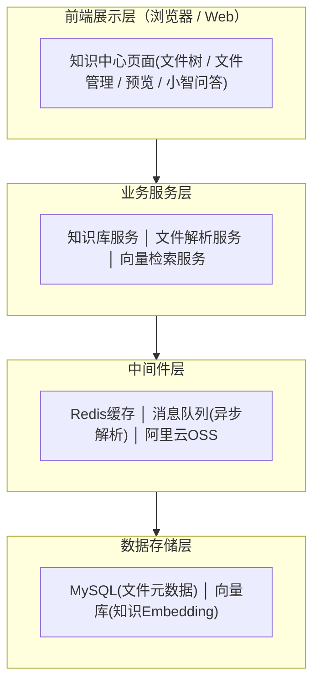

**2.层级结构**

> **本产品采用「知识库 → 文件夹 → 文件」三层结构**。个人/企业知识库为**数据隔离域**（决定数据归属和访问边界），不作为内容层级出现。隔离域之外的"组织维度"（部门/项目组）通过知识库自身的**标签/密级/权限**承担，不在层级中增设"空间文件夹"。

```plaintext
空间（企业知识库 / 我的知识库，仅作为数据隔离域）
 └── 知识库（业务文档容器，如"集团制度知识库"）
      └── 文件夹（知识库内部组织单元，支持多级嵌套）
           └── 文件（PDF / DOCX / MD / TXT）

说明：
* 空间 = 隔离域（企业知识库：全员可见的知识；我的知识库：当前用户私有知识）
* 知识库 = 一类业务文档的容器（如"集团制度"、"商品手册"、"项目档案"）
* 文件夹 = 知识库内部的多级组织单元（用于对文件做业务维度的二次归类）
* 文件 = 业务文档本体
```

> **为什么不加"空间文件夹"层？**
> 1. 钉钉/语雀/Notion/飞书等主流产品均采用「知识库-文件夹-文件」三层，加层会破坏用户已有心智。
> 2. 企业知识库下的"集团整体/商品部"等组织维度，可由知识库本身 + 标签/部门权限覆盖，避免抽象冗余。
> 3. 我的知识库下的"日常工作/基础知识/个人资料"等用户习惯，可通过**收藏知识库** + **我的知识库默认收藏夹**实现，不需要再起一层。

###  流程图

**1.用户流程图**

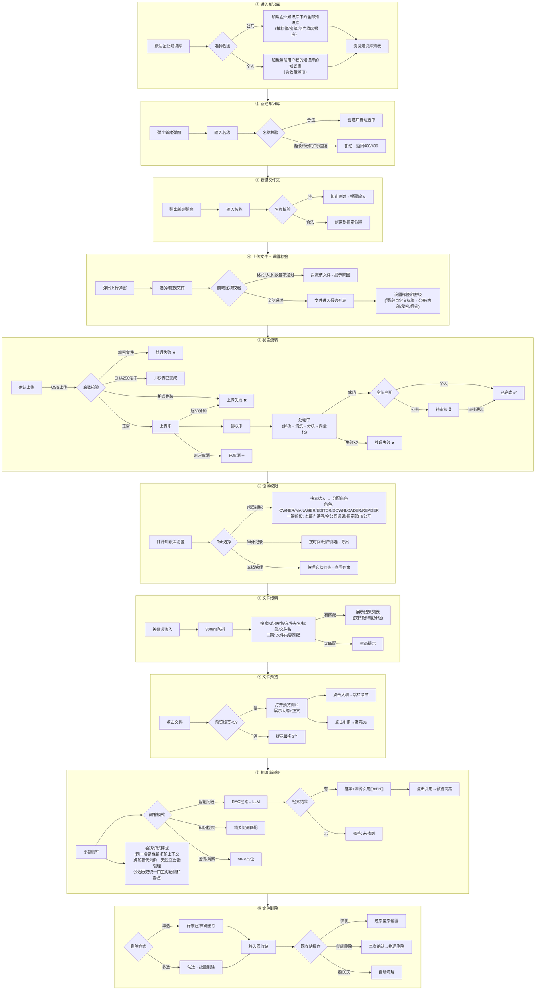

**2.流程图说明**

| **流程** | **说明** |
| --- | --- |
| **浏览流程** | 进入知识中心 → 切换空间 → 浏览知识库列表（按标签/密级/部门维度排序） → 选择知识库 → 查看文件夹/文件 → 预览文件 → 小智问答联动 |
| **上传流程** | 选中知识库 → 点击上传 → 前端校验（格式/大小/数量） → 确认上传 → uploading→pending→processing→done（个人）或 reviewing（公共） |
| **搜索流程** | 搜索框输入 → 自动补全建议 → 执行搜索 → 结果高亮 → 点击预览 |
| **管理流程** | 知识库设置 → 成员授权 / 文档管理 / 审计记录 |
| **回收站流程** | 删除操作 → 回收站 → 恢复或彻底删除 |

**关键规则**：

*   知识库内可嵌套文件夹，文件夹支持多级
    
*   同一文件只允许挂在一个位置，不能在树中重复出现
    
*   文件夹不支持权限设置（权限仅设置在知识库和文件层级）
    

## 功能模块

| **主功能** | **子功能** | **功能描述** |
| --- | --- | --- |
| 整体布局 | 页面布局 | 采用左侧文件树、中间内容区、右侧预览/问答区的三栏布局 |
| 整体布局 | 分栏切换 | 支持左侧文件树和右侧预览/问答面板展开、收起，适配不同知识管理与阅读场景 |
| 整体布局 | 文件树（左侧边栏） | 以树形结构展示"我的收藏"+知识库列表+知识库内文件夹与文件，支持展开、收起、选中和右键操作 |
| 权限管理 | 知识库 / 文件权限 | 支持按知识库、文件夹或文件配置访问权限，控制成员可见、可编辑范围 |
| 权限管理 | 审计日志 | 记录上传、删除、修改权限、问答检索等关键操作 |
| 文件管理 | 视图切换 | 支持在我的知识库、企业知识库之间切换，按空间加载对应的知识库和文档内容 |
| 文件管理 | 新建知识库 | 支持在指定空间或文件夹下创建知识库，作为同类业务文档的统一管理容器 |
| 文件管理 | 新建文件夹 | 支持在知识库或知识库内部目录中新建文件夹（支持多级嵌套），用于分类沉淀业务文档 |
| 文件管理 | 文件上传 | 支持向指定知识库或文件夹上传文档，上传后自动进入解析、切分和入库流程 |
| 文件管理 | 标签、密级 | 支持为文件设置业务标签和密级，用于后续检索过滤、权限控制和知识治理 |
| 文件管理 | 状态流转 | 展示文件从上传中、解析中、入库中、成功到失败的处理状态，便于跟踪进度 |
| 文件管理 | 文件搜索 | 支持按文件名、文件夹名或知识库名称进行搜索，快速定位目标内容 |
| 文件管理 | 文件预览 | 支持点击文件，直接预览有查看权限文件的内容 |
| 文件管理 | 文件删除 | 支持查看已删除文件或目录，并提供恢复、彻底删除等后续管理能力 |
| 知识库问答 | RAG搜索回复 | 基于所选知识库内容进行语义检索，并结合大模型生成可读、可追问的回答 |
| 知识库问答 | 溯源引用 | 回答中展示引用来源、文档片段和跳转入口，便于用户核验答案依据 |

### 整体布局

#### 3.2.1.1 功能需求描述

知识中心应作为 AI 工作台一级 Tab，为用户提供统一的知识资产入口。页面采用左侧文件树、中间内容区、右侧预览/小智问答的多栏联动布局。

| EARS 模式 | 需求描述 |
| --- | --- |
| 普遍型 | *   系统应在用户进入知识中心时默认展示当前视图的文件树和主视图。<br>    <br>*   系统应始终保留左侧树的折叠/展开入口。<br>    <br>*   系统应允许文件预览和小智问答同时打开。 |
| 状态驱动型 | *   当用户关闭左侧文件树时，系统应将中间内容区扩展为全宽。<br>    <br>*   当用户打开文件预览时，系统应在中间主区切换到预览态，文件列表隐藏。<br>    <br>*   当用户打开小智问答时，系统应在右侧展示问答侧栏，不影响文件预览。<br>    <br>*   当用户首次进入知识中心时，系统应默认展示企业知识库。 |
| 事件驱动型 | *   当用户点击文件时，系统应打开文件预览区，自动打开小智侧栏，并保持主视图上下文不丢失。<br>    <br>*   当用户点击折叠按钮时，系统应以 `translate-x` 动画收起左侧栏。<br>    <br>*   当用户关闭文件预览时，系统应回到文件管理界面。 |
| 不良行为型 | *   如果当前文件无预览能力，系统应展示不可预览原因（权限不足，解析失败）<br>    <br>*   如果预览标签超过5个，系统应进行提醒，只支持5个标签页 |

#### 3.2.1.2 业务主流程图及说明

同 3.1.2 流程图

#### 3.2.1.3 界面原型


| 操作 | 交互 | 截图/示例 |
| --- | --- | --- |
| 1.默认进入 | 【左侧】文件树+【右侧】文件管理 |  |
| 2.关闭左侧文件树 | 文件管理占满全屏；侧栏 `translate-x` 渐出；浮动 dock 出现在左上方 | <br> |
| 3.点击文件预览 | 【左侧】文件树+【中间】文件预览+【右侧】小智问答 |  |
| 4.预览时关闭左侧文件树 | 【左侧】文件预览+【右侧】小智问答 |  |
| 5.预览时关闭文件预览 | 【左侧】文件树+【中间】文件管理+【右侧】小智问答 |  |
| 6.预览时关闭小智问答 | 【左侧】文件树+【右侧】文件预览 |  |
| 7.点击按钮切换布局 | 文件视图切换【详细信息】/【文件卡片】 | <br> |
| 8.点击知识库收藏 | 收藏知识库在侧栏顶部"我的收藏"分组下置顶展示 |  |
| 9.文件夹移动 | 文件夹和知识库支持拖拽移动位置，移动后对应展示列表也同步变化<br>文件夹移动不得超出所属知识库，知识库移动仅在所属视图内排序 | <br> |

#### 3.2.1.4 数据说明（业务实体）

| 实体 | 字段 | 说明 |
| --- | --- | --- |
| Space | id、type、name、owner\_id | 企业知识库或我的知识库（隔离域） |
| KnowledgeBase | id、space\_id、name、owner\_id、visibility、sort\_order | 知识库（业务文档容器） |
| Folder | id、kb\_id、parent\_id、name、sort\_order | 知识库内部文件夹（支持多级嵌套） |
| Document | id、kb\_id、folder\_id、name、format、status | 文件 |

#### 3.2.1.5 业务规则和约束条件

*   默认进入知识中心时只展示文件树+文件管理两栏，小智和预览面板由用户主动触发或点击文件时联动打开
    
*   企业知识库与我的知识库数据完全隔离；不同用户我的知识库互不可见
*   知识库直接归属空间（企业/我的），不再设置中间"空间文件夹"层；组织维度通过知识库标签/密级/权限实现
    
*   文件预览、小智问答、文件树任一栏收起后，其余区域按规则自适应
    
*   首次进入默认企业知识库；切换空间时清空选中知识库和文件
    

#### 3.2.1.6 接口说明

无

#### 3.2.1.7 补充说明

无

### 权限管理

#### 3.2.2.1 功能需求描述

| EARS 模式 | 需求描述 |
| --- | --- |
| 普遍型 | *   系统应支持 5 级权限角色体系，每级角色的能力范围如下：<br>    <br>    \| 角色 \| 英文标识 \| 能力范围 \|<br>    \| --- \| --- \| --- \|<br>    \| 所有者 \| OWNER \| 全部权限，含成员管理、知识库删除/转移 \|<br>    \| 管理员 \| MANAGER \| 可管理文档与成员（添加/移除/改角色），不可删除知识库 \|<br>    \| 编辑者 \| EDITOR \| 可查看、下载、上传文件、编辑元数据（标签/密级）、新建文件夹 \|<br>    \| 下载者 \| DOWNLOADER \| 可查看和下载文件内容 \|<br>    \| 查看者 \| READER \| 仅可查看文件列表和预览，不可下载 \|<br>    <br>*   系统应确保非成员用户看不到知识库的存在（不展示在列表中）。<br>    <br>*   系统应在文件列表中展示权限徽标（"可编辑" / "只读"）。<br>    <br>*   系统应支持四种一键权限预设规则：<br>    <br>\| 预设 \| 效果 \|<br>\| --- \| --- \|<br>\| **本部门读写** \| 本部门成员设为 EDITOR，其他部门不可见 \|<br>\| **全公司阅读** \| 全员设为 READER，本部门成员为 EDITOR \|<br>\| **指定部门** \| 仅指定部门成员可见（自动设为 READER） \|<br>\| **公开** \| 全员可查看/下载（READER），无需逐个授权 \| |
| 状态驱动型 | *   当知识库设置为公开时，系统应允许部门预设规则一键配置权限。<br>    <br>*   当用户拥有编辑权限时，系统应在知识库节点和文件行展示编辑入口（上传、新建文件夹、设置）。 |
| 事件驱动型 | *   当管理员添加成员时，系统应弹窗选择用户+角色并确认添加。<br>    <br>*   当管理员修改角色时，系统应下拉选择新角色并立即生效，记录审计日志。<br>    <br>*   当管理员移除成员时，系统应二次确认后移除，该成员不再可见该知识库。<br>    <br>*   当管理员点击批量添加时，系统应弹窗选择部门和角色预设。 |
| 不良行为型 | *   如果非成员尝试访问知识库，系统应不展示该知识库（不暴露存在）。<br>    <br>*   如果普通用户尝试管理成员，系统应隐藏管理入口。<br>    <br>*   如果操作者权限不足以修改目标成员角色，系统应拒绝并提示。<br>    <br>*   如果文件夹被设置权限，系统应拒绝操作（只有知识库和文件支持权限设置）。 |

#### 3.2.2.2 业务主流程图及说明

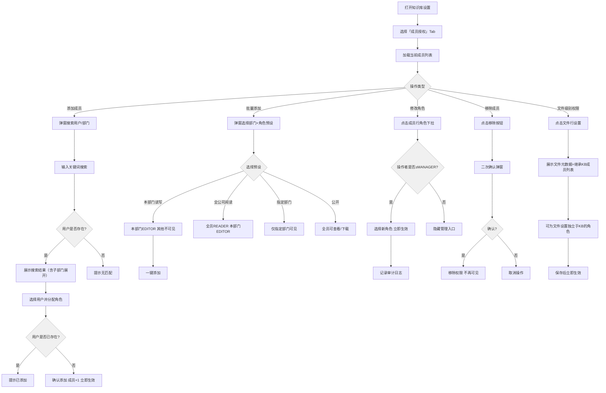

#### 3.2.2.3 界面原型


| 操作 | 交互 | 截图/示例 |
| --- | --- | --- |
| 右键具有可管理权限的知识库 | 出现二级菜单，存在设置功能 |  |
| 知识库设置 →「成员授权」Tab | 成员列表：头像/姓名/部门/角色下拉/加入时间/操作按钮 |  |
| 角色选项 | 五级：OWNER(所有者) / MANAGER(管理员) / EDITOR(编辑) / DOWNLOADER(下载) / READER(查看) |  |
| 点击「添加成员」 | 弹窗：左侧部门候选列表（含子团队展开），右侧以选中的成员+角色 |  |
| 搜索用户 | 对于已设置权限的成员，输入关键词实时过滤候选列表 |  |
| 角色预设 | 四种一键预设：本部门读写 / 全公司阅读 / 指定部门 / 公开 |  |
| 修改成员角色 | 角色下拉即时生效，Toast「已更新 {name} 的权限」 |  |
| 移除成员 | 二次确认「确认移除？移除后该成员将不再可见该知识库内容」 |  |
| 文件权限设置 | 弹窗展示文件名+格式+大小+上传者，成员列表与KB继承相同，可单独调整角色 |  |
| 知识库列表权限徽标 | KB 节点右侧「可编辑」「只读」等徽标 |  |
| 无管理权限的用户 | 二级菜单不显示设置按钮 | — |
| 知识库设置 →「审计记录」Tab | 展示审计日志列表，列：操作类型 / 用户 / 时间 / IP / 结果 |  |
| 按时间范围筛选 | 选择起始/截止时间，列表实时过滤 |  |
| 按用户筛选 | 输入用户名关键词，列表实时过滤 |  |
| 按操作类型筛选 | 下拉选择：上传/删除/检索/问答/权限变更等 |  |
| 导出审计报告 | 点击「导出」按钮，生成审计报告文件 |  |
| 敏感问答 | 在审计日志中标记 `is_sensitive=true` |  |

#### 3.2.2.4 数据说明（业务实体）

| 字段 | 类型 | 说明 |
| --- | --- | --- |
| PermissionEntry.id | string | 权限条目ID |
| PermissionEntry.name | string | 成员名称 |
| PermissionEntry.scope | '部门' \| '个人' | 成员范围 |
| PermissionEntry.department | string | 所属部门 |
| PermissionEntry.role | PermissionRole | 角色：OWNER/MANAGER/EDITOR/DOWNLOADER/READER |
| PermissionEntry.joinedAt | string | 加入时间 |

#### 3.2.2.5 业务规则和约束条件

*   知识库和文件支持权限设置，文件夹不支持权限设置
    
*   非成员用户看不到知识库的存在
    
*   角色变更即时生效
    
*   权限操作记录审计日志
    
*   OWNER 不可通过界面修改自己的角色
    
*   移除成员不影响其通过其他知识库或父节点的继承权限
    
*   全链路记录上传、删除、检索、问答、权限变更等操作
    
*   每条日志记录：user\_id、action、target、timestamp、ip、user\_agent、result
    
*   WORM 存储（不可篡改），保留 ≥180 天
    
*   敏感问答标记 `is_sensitive=true`
    
*   答案可完整追溯至源文档 + chunk
    

#### 3.2.2.6 接口说明

```plaintext
GET    /api/knowledge/{kbId}/permissions            获取成员权限列表
POST   /api/knowledge/{kbId}/permission/add         添加成员
PUT    /api/knowledge/{kbId}/permission/update      修改成员角色
DELETE /api/knowledge/{kbId}/permission/remove      移除成员
POST   /api/knowledge/{kbId}/permission/preset      批量预设权限
GET    /api/knowledge/file/{fileId}/permissions     获取文件级权限
POST   /api/knowledge/file/{fileId}/permission/update  更新文件级权限
GET /api/knowledge/{kbId}/audit?page=&size=
```

#### 3.2.2.7 补充说明

无

### 文件管理

#### 3.2.3.1 视图切换

##### 3.2.3.1.1 功能需求描述

| EARS 模式 | 需求描述 |
| --- | --- |
| 普遍型 | *   系统应在知识中心侧栏顶部展示「企业知识库」和「我的知识库」两个切换入口。<br>    <br>*   系统应在根空间直接展示该空间下的全部知识库列表（按标签/密级/部门维度排序），不设置中间文件夹层。 |
| 状态驱动型 | *   当切换至企业知识库时，系统应加载企业知识库下当前用户有权限访问的全部知识库列表。<br>    <br>*   当切换至我的知识库时，系统应按当前用户加载其私有知识库（含"我的收藏"置顶）。<br>    <br>*   当用户选中某个知识库时，系统应在主视图展示该知识库内的文件夹和文件。 |
| 事件驱动型 | *   当用户点击视图切换按钮时，系统应切换 `activeSpace` 并重新加载对应数据。 |
| 不良行为型 | *   如果切换空间时用户正在预览文件，系统应关闭预览清空 `previewTabs`。<br>    <br>*   如果切换空间时用户正在编辑标签或重命名，系统应放弃编辑态。<br>    <br>*   如果用户A尝试访问用户B的我的知识库数据，系统应返回403并不暴露任何我的知识库内容。 |

##### 3.2.3.1.2 业务主流程图及说明

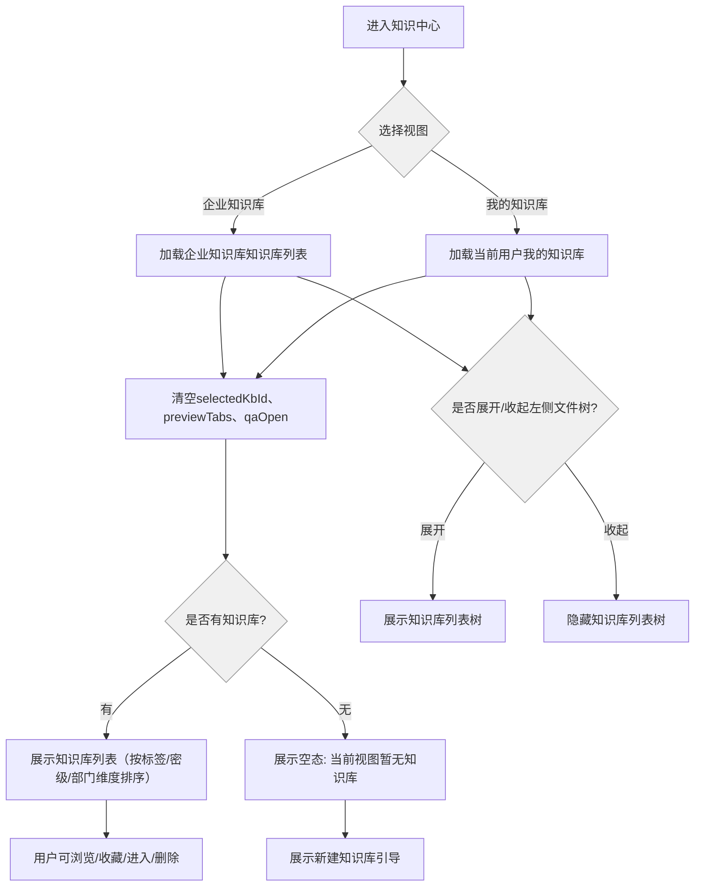

##### 3.2.3.1.3 界面原型


| 操作 | 交互 | 截图/示例 |
| --- | --- | --- |
| 点击「企业知识库」标签 | 加载企业知识库下当前用户有权限的全部知识库，按标签/密级/部门维度排序展示 |  |
| 点击「我的知识库」标签 | 加载当前用户我的知识库下的全部知识库（含"我的收藏"置顶分组） |  |
| 切换空间 | 清空 `selectedKbId=null`, `previewTabs=[]`, `expandedTreeIds=[]` | — |
| 选中知识库 | 中间主区展示该知识库下的文件夹树和文件列表 |  |

##### 3.2.3.1.4 数据说明（业务实体）

| 字段 | 类型 | 说明 | 原型变量 |
| --- | --- | --- | --- |
| activeSpace | 'public' \| 'personal' | 当前所选空间 | `activeSpace` |
| selectedKbId | string \| null | 选中知识库ID，切换空间时清空 | `selectedKbId` |
| starredKbIds | string[] | 当前用户收藏的知识库ID列表 | `starredKbIds` |

##### 3.2.3.1.5 业务规则和约束条件

*   企业知识库与我的知识库数据完全隔离
    
*   不同用户我的知识库严格隔离
    
*   切换空间时清空选中态、预览态和小智
    
*   根空间直接展示知识库列表（按标签/密级/部门维度排序），不再通过"空间文件夹"中转
    

##### 3.2.3.1.6 接口说明

```plaintext
GET /api/knowledge/spaces 获取空间列表及文件夹结构
```

##### 3.2.3.1.7 补充说明

无

#### 3.2.3.2 新建知识库

##### 3.2.3.2.1 功能需求描述

| EARS 模式 | 需求描述 |
| --- | --- |
| 普遍型 | *   系统应在创建知识库时校验名称长度不超过64字符，不含特殊字符 `/\:*?"<>\|`。 |
| 状态驱动型 | *   当用户在知识库内点击新建知识库时，系统应提示"知识库内只能新建文件夹"。 |
| 事件驱动型 | *   当用户点击创建按钮时，系统应校验名称后执行创建。<br>    <br>*   当用户取消创建时，系统应关闭弹窗不执行创建。 |
| 不良行为型 | *   如果名称为空或纯空格，系统应阻止创建并 Toast 提醒「请输入知识库名称」，不自动回退为默认名。<br>    <br>*   如果名称超长（≥64字符），系统应截断或返回400。<br>    <br>*   如果名称含特殊字符 `/\:*?"<>\|`，系统应返回400，错误码 `INVALID_NAME`。<br>    <br>*   如果创建时所属视图为企业知识库且用户不是管理员（MVP一期管理员可在企业知识库创建），系统应拒绝创建。 |

##### 3.2.3.2.2 业务主流程图及说明

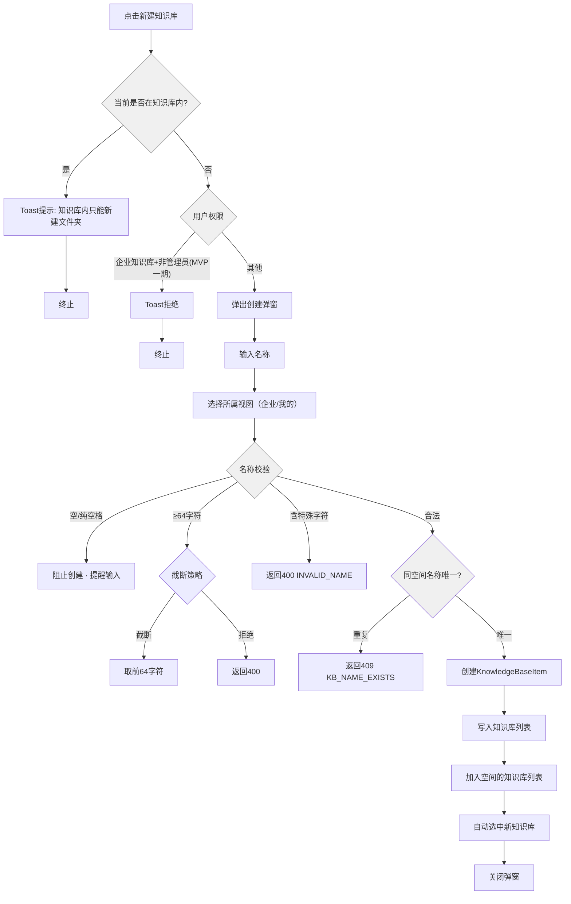

##### 3.2.3.2.3 界面原型


| 操作 | 交互 | 截图/示例 |
| --- | --- | --- |
| 点击侧栏「新建知识库」按钮；点击二级菜单「新建知识库」按钮 | 居中弹出新建知识库弹窗 |  |
| 在知识库内点击新建知识库 | Toast 提示「知识库内只能新建文件夹，不能新建知识库」，不弹窗 |  |
| 名称输入为空或纯空格 | 阻止创建 · Toast 提示「请输入知识库名称」 |  |
| 名称超长（≥64字符） | 阻止创建 · Toast 提示「知识库名称不能超过64字符」 |  |
| 名称含特殊字符 \`/😗?"<> | 返回400，错误码 `INVALID_NAME`，Toast 提示名称格式错误 |  |
| 名称与同空间已有知识库重复 | 返回409，错误码 `KB_NAME_EXISTS`，Toast 提示「名称已存在，请更换」 |  |
| 名称合法 + 点击「创建」按钮 | 执行 `createKnowledgeBase()`：新建KB → 加入文件树 → 展开父节点 → 自动选中 → 关闭弹窗 |  |
| 点击「取消」/ 遮罩层 | 关闭弹窗，不创建 |  |

##### 3.2.3.2.4 数据说明（业务实体）

| 字段 | 类型 | 说明 | 原型对应 |
| --- | --- | --- | --- |
| KnowledgeBaseItem.id | string | 知识库ID | `id` |
| KnowledgeBaseItem.name | string | 知识库名称 | `name` |
| KnowledgeBaseItem.space | SpaceKey | 所属视图 | `space` |
| KnowledgeBaseItem.visibility | string | 可见性标签 | `visibility` |
| KnowledgeBaseItem.canEdit | boolean | 当前用户是否可编辑 | `canEdit` |

##### 3.2.3.2.5 业务规则和约束条件

*   名称超长（≥64字符）截断或拒绝
    
*   名称含特殊字符 `/\:*?"<>|` 拒绝，返回400 INVALID\_NAME
    
*   名称为空或纯空格不允许创建，Toast 提醒「请输入知识库名称」
    
*   同空间内名称唯一
    
*   知识库内不允许新建知识库（Toast提示）
    
*   MVP一期企业知识库仅管理员可新建知识库
    

##### 3.2.3.2.6 接口说明

```plaintext
POST /api/knowledge/create
```

##### 3.2.3.2.7 补充说明

创建后自动展开新知识库，提示上传第一份文件。

#### 3.2.3.3 新建文件夹

##### 3.2.3.3.1 功能需求描述

| EARS 模式 | 需求描述 |
| --- | --- |
| 普遍型 | *   系统应在文件夹名称空值时阻止创建，Toast 提醒「请输入文件夹名称」。 |
| 状态驱动型 | *   当用户点击创建按钮时，系统应创建 Folder、展开父文件夹并 Toast 提示。<br>    <br>*   当用户取消创建时，系统应关闭弹窗。 |
| 事件驱动型 | \- |
| 不良行为型 | *   如果用户尝试在无权限的知识库内新建文件夹，系统应拒绝创建。<br>    <br>*   如果选择的上级位置不存在或已被删除，系统应提示异常位置。 |

##### 3.2.3.3.2 业务主流程图及说明

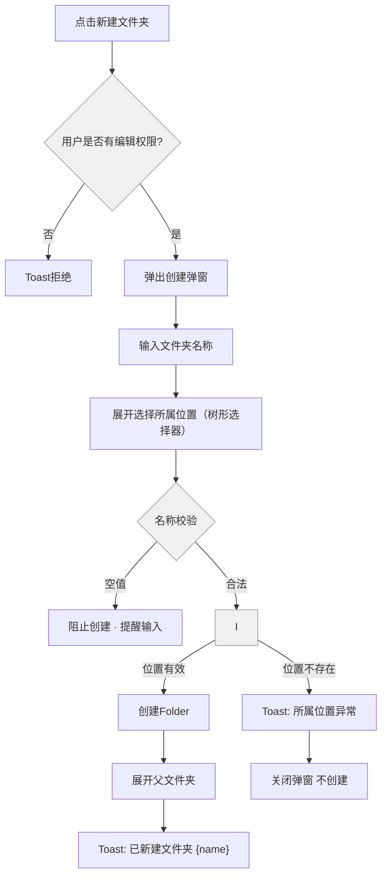

##### 3.2.3.3.3 界面原型


| 操作 | 交互 | 截图/示例 |
| --- | --- | --- |
| 点击「新建文件夹」按钮 | 居中弹出新建文件夹弹窗 |  |
| 展开选择所属位置 | 选择目标知识库 → 内部文件夹路径（展开式树形选择器） |  |
| 所属位置已删除 | Toast「所属位置异常」，关闭弹窗不创建 | \- |
| 名称输入为空或空格 | 阻止创建 · Toast 提示「请输入文件夹名称」 |  |
| 名称超长（≥64字符） | 阻止创建 · Toast 提示「文件夹名称不能超过64字符」 |  |
| 名称含特殊字符 \`/😗?"<> | 返回400，错误码 `INVALID_NAME`，Toast 提示名称格式错误 |  |
| 名称与同空间已有知识库重复 | 返回409，错误码 `KB_NAME_EXISTS`，Toast 提示「名称已存在，请更换」 |  |
| 名称合法 + 点击「创建」按钮 | 执行 `createFolder()`：新建 Folder → 加入文件树 → 展开父文件夹 → 关闭弹窗 |  |
| 点击「取消」/ 遮罩层 | 关闭弹窗，不创建 |  |

##### 3.2.3.3.4 数据说明（业务实体）

| 字段 | 类型 | 说明 |
| --- | --- | --- |
| Folder.id | string | 文件夹ID |
| Folder.name | string | 文件夹名称 |
| Folder.kbId | string | 所属知识库ID |
| Folder.parentId | string \| undefined | 父文件夹ID，根级文件夹为空 |
| Folder.sortOrder | number | 同级排序 |
| Folder.children | Folder[] | 子文件夹列表（多级嵌套） |

##### 3.2.3.3.5 业务规则和约束条件

*   对于有权限的用户，允许在知识库及其内部文件夹中新建文件夹（不支持跨知识库移动文件夹）
    
*   文件夹名称不允许为空，空名称阻止创建并 Toast 提醒
    
*   新建后自动展开父文件夹
    

##### 3.2.3.3.6 接口说明

```plaintext
POST /api/knowledge/folder/create
```

##### 3.2.3.3.7 补充说明

无

#### 3.2.3.4 文件上传

这是文件管理中最核心的模块，覆盖从选择文件到入库的全流程。文件上传内嵌格式解析、文本清洗与分块等环节，形成完整闭环：

**选择文件 → 前端校验 → 候选列表 → 设置标签/密级 → 确认上传 → OSS上传 → 魔数校验 → 消息队列 → 格式解析 → 文本清洗 → 语义分块 → 向量化 → 入库**

##### 3.2.3.4.1 功能需求描述

| EARS 模式 | 需求描述 |
| --- | --- |
| 普遍型 | *   系统应在用户选择文件时对格式、大小、数量进行前端三重校验。<br>    <br>*   系统应支持单次选择最多50个文件批量上传。<br>    <br>*   系统应展示文件上传候选列表，每行显示格式图标 + 文件名 + 文件大小 + 校验结果。<br>    <br>*   系统应在上传弹窗的「高级设置」折叠区提供标签选择和密级设置。<br>    <br>*   系统应支持单次选择最多50个文件批量上传。<br>    <br>*   系统应在任务卡标题中展示成功数/总数进度。 |
| 状态驱动型 | *   当上传到我的知识库时，系统应自动完成处理，无需审核。<br>    <br>*   当上传到企业知识库时，系统应标记为待审核状态（reviewing）。<br>    <br>*   当 SHA256 命中已有文件时，系统应从 uploading 直接跳转到 done 并标注「极速上传」。<br>    <br>*   当文件魔数与扩展名不匹配时，系统应拒绝入库并标记为 upload\_failed。<br>    <br>*   当用户选择多个文件确认上传时，系统应独立处理每个文件互不阻塞。 |
| 事件驱动型 | *   当用户点击确认上传时，系统应提交上传任务并关闭弹窗。<br>    <br>*   当用户点击候选文件 ✕ 移除时，系统应将该文件移出上传候选列表。<br>    <br>*   当用户点击取消时，系统应关闭弹窗不创建任务。<br>    <br>*   当上传任务完成时，系统应在任务卡浮层中实时更新状态。<br>    <br>*   当用户在上传「高级设置」中选择标签时，系统应批量统一应用到所有上传文件。 |
| 不良行为型 | *   如果文件格式不支持，系统应前端拦截并提示具体格式名。<br>    <br>*   如果单个文件超过100MB，系统应返回413并提示"超过100MB上限"。<br>    <br>*   如果单个文件超过1GB，系统应在接口层面预留可配置的上限（默认不做硬拦截，但返回413），管理员可通过后端配置调整阈值，不在前端完全卡死。<br>    <br>*   如果文件为0字节，系统应返回400，错误码 FILE\_EMPTY。<br>    <br>*   如果单次超过50个文件，系统应拦截第51个起并提示分批上传。<br>    <br>*   如果批次总大小超过1GB，系统应拦截提示分批上传。<br>    <br>*   如果文件格式伪装（.exe改名为.pdf），系统应通过魔数校验识别并拒绝。<br>    <br>*   如果加密文件，系统应检测加密状态置为 process\_failed。<br>    <br>*   如果文件已损坏无法解析，系统应在自动重试2次后标记 process\_failed\_permanent。<br>    <br>*   如果批量中单文件失败，系统应仅标记该文件失败，其余正常处理互不阻塞。<br>    <br>*   如果文件已被加密/损坏，系统应不纳入去重库。 |

##### 3.2.3.4.2 业务主流程图及说明

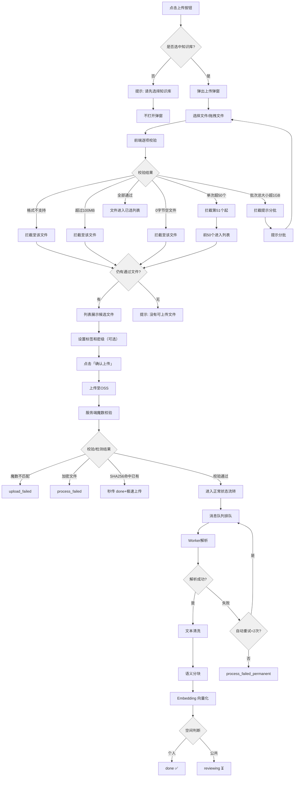

##### 3.2.3.4.3 界面原型


| 操作 | 交互 | 截图/示例 |
| --- | --- | --- |
| 知识库内点击「上传文件」按钮 | 弹出上传弹窗，标题「上传文件 - {知识库名称}」 |  |
| 选择文件后列表展示 | 每行：格式图标 + 文件名 + 文件大小 + 状态("待上传"/"不支持") + 已选标签 |  |
| 点击候选文件 ✕ 移除 | 将该文件移出上传候选列表 | — |
| 展开「高级设置」折叠区 | 选择预设标签、添加自定义标签、选择密级，所有候选文件统一生效 | — |
| 格式不支持 | Toast「{格式} 格式暂不支持」，该文件不进入列表，其他文件正常 | — |
| 文件超过100MB | Toast「{文件名} 超过100MB上限」，不进列表 | — |
| 空文件（0字节） | Toast「文件内容为空」，不进列表 | — |
| 单次超过50个文件 | 第51个起拦截，Toast「单次最多上传50个文件」，前50个进入列表 | — |
| 批次总大小超过1GB | Toast「单次上传总大小不超过1GB，建议分批上传」 | — |
| 无文件时点击「确认上传」 | 等效于关闭弹窗 | — |
| 有候选文件时点击「确认上传」 | 执行 `confirmUpload()`，提交任务，关闭弹窗 | — |
| 点击「取消」/遮罩层 | 关闭弹窗，不影响已提交的上传任务 | — |

| 操作 | 交互 | 截图/示例 |
| --- | --- | --- |
| 上传弹窗「高级设置」折叠区 | 展开标签和密级选择面板，默认收起不干扰主流程 | — |
| 在标签面板点击预设标签 | 切换选中状态（蓝色高亮/灰色未选），支持多选 | — |
| 输入自定义标签并「添加」 | 加入已选列表，去重后最多20个 | — |
| 批量上传时设置标签 | 一次设置，所有文件统一生效 | — |
| 密级下拉选择 | 选择公开/内部/秘密/机密，默认"内部" | — |
| 标签和密级在候选文件列表 | 文件行中展示已选的标签和密级标签 | — |

| 操作 | 交互 | 截图/示例 |
| --- | --- | --- |
| 上传提交后 | 页面右下角浮层，标题「📤 文件上传 成功N/总数T」 | 原型 v1.0 |
| 最多同时展示4个任务 | 超出时收起，显示「+N 个隐藏」 | — |
| 任务卡中每行 | 文件图标 + 文件名 + 状态徽标 + 操作按钮 | — |
| 点击任务卡中「取消」 | 状态流转为 cancelled | — |
| 点击「重新上传」 | 重新触发上传流程 | — |
| 点击「手动重试」 | 重新进入处理流程 | — |
| 点击「重新处理」 | 从 cancelled 恢复为 uploading，重新走流转 | — |
| 点击任务卡 ✕ 关闭 | 关闭该任务卡展示，不影响实际已提交的任务 | — |

| 操作 | 交互 | 截图/示例 |
| --- | --- | --- |
| 批量上传中单文件失败 | 仅该文件标记对应失败状态，其余文件正常处理互不阻塞 | 原型 v1.0 |
| 上传文件命中 SHA256 去重 | 从 uploading 直接跳到 done，跳过排队和处理阶段 | — |
| 命中去重文件展示 | 文件名旁标注灰色「极速上传」标识 | — |
| 悬浮「极速上传」标识 | 提示「检测到知识库内已有相同文件，已极速完成处理」 | — |
| 批量上传含去重文件 | 批次结束后汇总说明去重情况，不逐个弹窗 | — |
| 秒传文件强制重新处理 | 文件更多菜单保留「强制重新处理」入口 | — |

##### 3.2.3.4.4 数据说明（业务实体）

| 优先级 | 格式 | 后缀 | 覆盖场景 | 工程成本 | 业务价值 |
| --- | --- | --- | --- | --- | --- |
| **P0 必选** | PDF（文本型） | .pdf | 制度文件、合同、产品手册 | 中 | ⭐⭐⭐⭐⭐ |
| **P0 必选** | Word | .docx | 制度规范、通知文件 | 低 | ⭐⭐⭐⭐⭐ |
| **P0 必选** | TXT | .txt | 纯文本、日志、导出数据 | 极低 | ⭐⭐⭐⭐ |
| **P0 必选** | Markdown | .md | 技术文档、产品文档 | 极低 | ⭐⭐⭐⭐ |
| **P1 候选** | Excel | .xlsx | 财务报表、运营数据 | 中 | ⭐⭐⭐⭐ |
| **P1 候选** | 扫描PDF（OCR） | .pdf(扫描件) | 纸质档案、历史文档 | 高 | ⭐⭐⭐⭐ |
| **P1 候选** | PNG/JPG | .png/.jpg | 截图、票据、图表 | 中 | ⭐⭐⭐ |
| **P1 候选** | PPT | .pptx | 培训材料、汇报文件 | 中 | ⭐⭐⭐ |
| **P1 候选** | CSV | .csv | 数据导出、系统对接 | 极低 | ⭐⭐ |

| 格式 | 解析工具 | 处理逻辑 |
| --- | --- | --- |
| PDF（文本型） | PyMuPDF / pdfplumber | 逐页提取文本表格，还原排版；书签映射为标题层级用于分块 |
| Word | python-docx | 提取标题正文表格，按层级转 Markdown；内嵌图片提取为独立资源 |
| TXT | 原生读取 + chardet | 编码自动识别（UTF-8 BOM剥离→GBK→GB2312→ISO-8859-1）；<0.7置信度标记 quality=low |
| MD | 自定义解析 | 标题层级映射到分块边界；代码块整体保留不切分；Base64图片提取 |

| 字段 | 类型 | 说明 | 原型对应 |
| --- | --- | --- | --- |
| UploadCandidate.name | string | 上传候选文件名 | `name` |
| UploadCandidate.format | string | 格式后缀 | `format` |
| UploadCandidate.size | string | 文件大小 | `size` |
| UploadCandidate.status | 'ready' \| 'blocked' | 校验状态 | `status` |
| UploadCandidate.reason | string | 拦截原因 | `reason` |
| UploadCandidate.tags | string\[\] | 选中标签 | `tags` |
| UploadTask.id | string | 上传任务ID | `id` |
| UploadTask.status | string | 状态: uploading/pending/processing/... | `status` |
| UploadTask.doc | DocItem | 上传完成后的文档对象 | `doc` |

##### 3.2.3.4.5 业务规则和约束条件

| 场景 | 处理规则 |
| --- | --- |
| 加密PDF（有打开密码） | status=process\_failed，error\_msg="文件已加密，请提供密码或解密后上传"，保留原始文件供下载 |
| 损坏PDF/Office文件 | status=process\_failed，error\_msg含具体解析异常堆栈 |
| 纯色/全黑/全白图片 | 正常提取，标记 image\_type=solid\_color，不报错 |
| 模糊图片（信噪比低） | 特征向量区分度低，标记 quality=low |
| 纯特殊字符文件 | 清洗后文本为空，status=done 但 chunk\_count=0，warning="清洗后内容为空" |
| 低分辨率扫描PDF（≤150dpi） | OCR仍执行，ocr\_confidence<0.8，quality=low，推荐人工审核 |
| 纯手写体PDF | OCR识别率<60%，quality=very\_low，标记"需人工审核"，不进入检索库 |
| 动图GIF | 仅取首帧处理，元数据标记 animated=true |
| 文件编码无法识别 | quality=low，提示用户手动指定编码 |
| 超过1GB文件 | 接口层面不硬拦截，返回413由后端可配置阈值控制（`max_file_size`），管理员可通过配置调整；前端仍按默认100MB提示 |

**文件头魔数校验**：读取文件开头二进制魔数（4-8字节），识别真实格式，防止改后缀上传恶意文件。

**扩展名伪装检测**：

*   文件头魔数与扩展名不一致 → 拒绝入库 → 记录安全审计事件
    
*   示例：.exe 改为 .pdf上传 → 魔数 `4D 5A` 与预期 `25 50 44 46` 不匹配 → upload\_failed
    

**ClamAV 病毒扫描**（二期增强）：

*   文件写入临时目录后调用开源杀毒引擎扫描
    
*   阳性直接删除并记录安全日志
    

**PII 检测**（二期增强）：

*   解析文本后扫描身份证号、手机号、银行卡号等敏感信息
    
*   匹配 PII 的文件标记 `contains_pii=true`，管理员可见标记
    
*   上传前前端校验，不进传输流程
    
*   上传中服务端魔数校验，识别伪装格式
    
*   加密文件标记 process\_failed
    
*   同名文件共存不做覆盖，通过 SHA256 检测去重
    
*   单文件最大100MB，单批次最多50个文件/总大小最大1GB
    
*   格式伪装（魔数不匹配）→ upload\_failed
    
*   解析失败自动重试2次（指数退避），超过则 process\_failed\_permanent
    

##### 3.2.3.4.6 接口说明

```plaintext
POST   /api/knowledge/upload                    提交上传
GET    /api/knowledge/upload/status?taskId={id}  查询上传状态
POST   /api/knowledge/upload/retry              手动重试
POST   /api/knowledge/upload/cancel             取消上传
POST   /api/knowledge/upload/reprocess          强制重新处理
POST   /api/knowledge/upload/dedup-check        文件去重检测(SHA256)
```

##### 3.2.3.4.7 补充说明

###### 异步消息队列处理

```plaintext
上传 → OSS存储 → 异步入队(topic:file_parse) → Worker池 → 解析 → 清洗(topic:file_clean) → Embed(topic:file_embed) → 入库
```

**队列设计**：

| 队列 Topic | 职责 | 消费方 |
| --- | --- | --- |
| `file_parse` | 格式解析 + 文本提取 | 解析 Worker |
| `file_clean` | 文本清洗 + 分块 | 清洗 Worker |
| `file_embed` | Embedding 向量化 | 向量化 Worker |
| `file_dlq` | 多次失败后死信队列 | 人工处理 |

**设计要点**：

*   固定数量 Worker，并发高峰排队
    
*   解析失败自动重试 2 次（指数退避：5s/15s/30s）
    
*   超过2次进入死信队列，状态标记 process\_failed\_permanent
    
*   不阻塞对话流程
    
*   消息幂等（重试不重复生成分块）
    

###### 文本清洗与分块

**清洗规则**：

*   移除控制字符（U+0000-U+001F 除外 `\t\r\n`）、零宽字符（U+200B/200C/200D/FEFF）、BOM头
    
*   保留 Emoji、中文标点、全角字符
    
*   清洗前后字符数差异记录到 cleaning\_log
    
*   连续空白字符压缩为单个空格
    
*   空行（仅含空白字符的行）保留最多一个连续空行
    

**分块策略**：

| 策略 | 说明 | 配置参数 |
| --- | --- | --- |
| 语义分块（默认） | 以 Markdown 标题为边界切分，同一章节内容保留在同一 chunk 内；无标题时降级为段落切分 | max\_chunk\_size=512 tokens, overlap=50 |
| 固定大小切分 | 按固定 token 数切分，相邻 chunk 有重叠 | chunk\_size=512 tokens, overlap=50 |

**分块规则**：

*   代码块作为整体保留不切分
    
*   URL/邮箱作为整体 token 不切断
    
*   表格作为独立 chunk（chunk\_type=table）存储
    
*   每个 chunk 元数据携带 heading\_path（如 \["第一章", "1.1 概述"\]）
    
*   chunk\_id 格式：{doc\_id}_chunk_{序号}（如 abc123\_chunk\_001）
    
*   分块结果写入 S3/OSS 供后续向量化消费
    

#### 3.2.3.5 标签与密级

##### 3.2.3.5.1 功能需求描述

| EARS 模式 | 需求描述 |
| --- | --- |
| 普遍型 | *   系统应在文件列表页最多展示3个标签，超出显示「+」。<br>    <br>*   系统应在详情页全量展示所有标签。<br>    <br>*   系统应在密级缺失时默认"内部"。<br>    <br>*   系统应在文档列表中展示密级彩色标签（内部=蓝、秘密=黄、机密=红、公开=灰）。 |
| 状态驱动型 | *   当文档密级为「机密」时，系统应对非授权用户完全隐藏该文档（不展示在列表和搜索结果中）<br>    <br>*   当文档密级为「秘密」时，系统应仅对指定部门/角色的用户可见<br>    <br>*   当文档密级为「内部」时，系统应对组织内全部成员可见<br>    <br>*   当文档密级为「公开」时，系统应对全员可见，无需授权即可访问<br>    <br>*   当用户无文档编辑权限时，系统应隐藏标签编辑入口和密级修改入口 |
| 事件驱动型 | *   当用户在上传时选择标签，系统应批量统一应用到所有上传文件。<br>    <br>*   当用户点击标签筛选时，系统应实时刷新筛选结果。<br>    <br>*   当用户修改文档密级时，系统应记录审计日志。 |
| 不良行为型 | *   如果标签名称超长（≥256字符），系统应拒绝。<br>    <br>*   如果普通用户尝试创建标签（MVP规则），系统应拒绝。<br>    <br>*   如果密级为「机密」的文档被普通用户检索，系统应直接过滤不展示。 |

##### 3.2.3.5.2 业务主流程图及说明

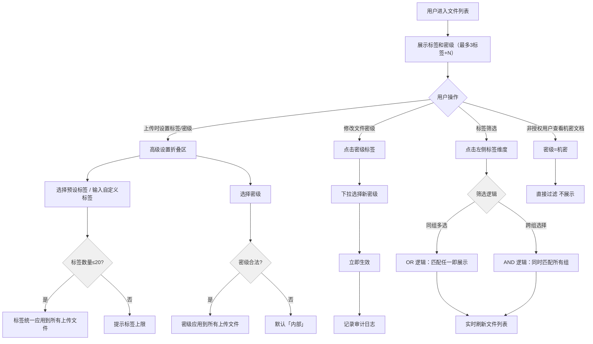

##### 3.2.3.5.3 界面原型

| 操作 | 交互 | 截图/示例 |
| --- | --- | --- |
| 列表/卡片页标签展示 | 单文档最多3个标签，超出显示「+N」，悬浮气泡展示全量 | 原型 v1.0 |
| 详情页标签展示 | 全量展示所有标签，hover显示「编辑」按钮 | — |
| 标签编辑 | 可增删标签，保存立即生效，取消还原 | — |
| 知识库列表左侧标签筛选 | 按维度分组展示（密级/部门/年份/业务线） | — |
| 标签筛选 OR 逻辑 | 同组内多选：「或」——匹配任一即展示 | — |
| 标签筛选 AND 逻辑 | 跨组选择：「且」——同时匹配所有组 | — |
| 文件密级「公开」 | 灰色标签 | — |
| 文件密级「内部」 | 蓝色标签，组织内成员可见，默认密级 | — |
| 文件密级「秘密」 | 黄色标签，仅特定部门/角色可见 | — |
| 文件密级「机密」 | 红色标签，仅高管/特定角色可见 | — |

##### 3.2.3.5.4 数据说明（业务实体）

| 字段 | 类型 | 说明 |
| --- | --- | --- |
| Tag.id | string | 标签唯一标识 |
| Tag.name | string | 标签名称，1~32字符 |
| Tag.type | 'preset' \| 'custom' | 标签类型：预设 / 自定义 |
| FileTag.fileId | string | 文件ID |
| FileTag.tags | Tag\[\] | 文件关联的标签列表，最多20个 |
| SecurityLevel.code | 'public' \| 'internal' \| 'secret' \| 'classified' | 密级编码 |
| SecurityLevel.label | string | 密级中文名称 |
| SecurityLevel.color | string | 标签颜色：灰 / 蓝 / 黄 / 红 |
| FileSecurityLevel.fileId | string | 文件ID |
| FileSecurityLevel.level | SecurityLevel | 文件当前密级，默认 internal |

##### 3.2.3.5.5 业务规则和约束条件

*   单文档最多20个标签
    
*   标签名称≤32字符，禁止HTML标签
    
*   仅管理员可创建/管理标签
    
*   密级标签在列表中优先展示
    
*   密级变更记录审计日志
    

##### 3.2.3.5.6 接口说明

```plaintext
POST /api/knowledge/tag/batch
GET  /api/knowledge/tag/list
PUT  /api/knowledge/file/{fileId}/security-level
```

##### 3.2.3.5.7 补充说明

#### 3.2.3.6 状态流转

##### 3.2.3.6.1 功能需求描述

| EARS 模式 | 需求描述 |
| --- | --- |
| 普遍型 | *   系统应采用纯状态标识设计，不展示进度条。<br>    <br>*   系统应支持状态：上传中、排队中、处理中、已完成、待审核、上传失败、处理失败、已取消。 |
| 状态驱动型 | *   当文件上传完成时，系统应将状态从「上传中」流转为「排队中」。<br>    <br>*   当解析完成时，系统应将状态从「处理中」流转为「已完成」（我的知识库）或「待审核」（企业知识库）。<br>    <br>*   当处理失败时，系统应自动重试2次后标记为「处理失败（永久）」。<br>    <br>*   当「上传中」超30分钟未完成时，系统应自动标记为「上传失败」。<br>    <br>*   当「处理中」超30分钟未结束时，系统应自动标记为「处理失败」。 |
| 事件驱动型 | *   当用户点击重新上传时，系统应重新触发上传流程。<br>    <br>*   当用户点击手动重试时，系统应重新进入处理流程。<br>    <br>*   当用户点击取消时，系统应将状态流转为「已取消」。 |
| 不良行为型 | *   如果单小时处理失败率超过10%，系统应自动触发运维告警。<br>    <br>*   如果 OCR 置信度<0.8，系统应标记 quality=low 但文档正常入库。 |

##### 3.2.3.6.2 业务主流程图及说明

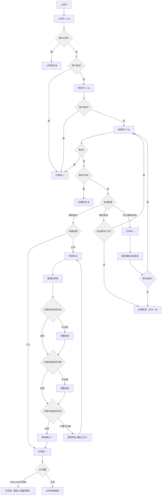

##### 3.2.3.6.3 界面原型

| 状态 | 徽标样式 | 操作按钮 | 截图/示例 |
| --- | --- | --- | --- |
| 上传中 | 🔵 蓝色标签+脉冲动画点「上传中」 | 取消 | 原型 v1.0 |
| 排队中 | 🔵 蓝色标签（无动画）「排队中」 | 取消 | — |
| 处理中 | 🔵/🟡 蓝色标签+脉冲动画「处理中」 | — | — |
| 已完成 | 🟢 绿色标签「已完成 ✅」 | 关闭 | — |
| 待审核 | 🟡 黄色标签「待审核 ⏳」 | — | — |
| 上传失败 | 🔴 红色标签「❌」 | 重新上传 | — |
| 处理失败 | 🔴 红色标签「❌」 | 手动重试 / 删除 | — |
| 已取消 | ⚪ 灰色标签「➖」 | 重新处理 | — |
| 已完成（质量预警） | 🟢 绿色标签旁附加黄色⚠️图标 | hover展示具体原因 | — |

##### 3.2.3.6.4 数据说明（业务实体）

##### 3.2.3.6.5 业务规则和约束条件

*   终态规则：「已完成」「处理失败」「已取消」不会自动变更
    
*   超时兜底：「上传中」超30分钟→「上传失败」，「处理中」超30分钟→「处理失败」
    
*   幂等保障：重试不重复生成分块
    
*   告警机制：单小时处理失败率超10%触发运维告警
    

##### 3.2.3.6.6 接口说明

```plaintext
GET /api/knowledge/upload/status?taskId={id}

```

##### 3.2.3.6.7 补充说明

无

#### 3.2.3.7 文件搜索

##### 3.2.3.7.1 功能需求描述

| EARS 模式 | 需求描述 |
| --- | --- |
| 普遍型 | *   系统应在用户输入搜索关键词时执行多维度匹配：**知识库名称、文件夹名称、标签、文件名**。二期扩展至文件正文内容匹配。<br>    <br>*   搜索结果应按匹配维度分组展示（如"匹配知识库""匹配文件名""匹配标签"）。 |
| 状态驱动型 | *   当搜索输入为空时，系统应展示当前视图/文件夹下全部内容。<br>    <br>*   当无匹配结果时，系统应展示空态提示。 |
| 事件驱动型 | *   当用户输入时，系统应以300ms防抖触发自动补全建议。<br>    <br>*   当用户点击搜索建议时，系统应执行搜索。<br>    <br>*   当用户确认拼写纠错建议时，系统应使用纠错后的query执行检索。 |
| 不良行为型 | *   如果输入全部为停用词，系统应返回空列表不报错。<br>    <br>*   如果关键词含正则元字符，系统应自动转义后查询。<br>    <br>*   如果搜索含敏感词，系统应不展示该热门搜索项。 |

##### 3.2.3.7.2 业务主流程图及说明

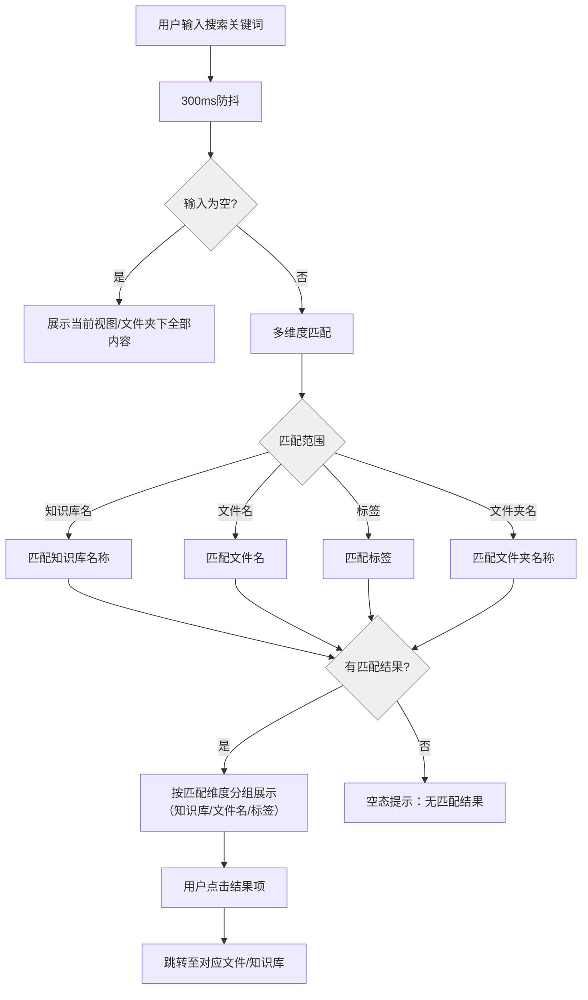

##### 3.2.3.7.3 界面原型

| 操作 | 交互 | 截图/示例 |
| --- | --- | --- |
| 在文件搜索框输入关键词 | 300ms防抖后触发实时过滤 | 原型 v1.0 |
| 搜索匹配 | 匹配文件名和文件夹名，列表/卡片实时过滤展示 | — |
| 无匹配结果 | 展示空态提示（EmptyState组件） | — |
| 搜索完成后 | 展示结果列表 | — |

##### 3.2.3.7.4 数据说明（业务实体）

| 字段 | 类型 | 说明 |
| --- | --- | --- |
| SearchQuery.keyword | string | 搜索关键词 |
| SearchQuery.space | 'public' \| 'personal' | 搜索范围视图 |
| SearchQuery.kbId | string \| undefined | 限定知识库（可选） |
| SearchResultItem.id | string | 匹配项ID |
| SearchResultItem.type | 'kb' \| 'folder' \| 'file' | 匹配项类型：知识库 / 文件夹 / 文件 |
| SearchResultItem.name | string | 匹配项名称 |
| SearchResultItem.matchFields | string\[\] | 命中字段，如 `["name", "tags"]` |
| SearchResultItem.groupLabel | string | 所属分组标签，如 "匹配知识库" |
| SearchResultItem.relevance | number | 相关度评分（二期扩展） |

##### 3.2.3.7.5 业务规则和约束条件

*   关键词自动转义正则元字符
    
*   搜索输入为空时展示全部内容
    
*   搜索结果匹配文件名和文件夹名
    

##### 3.2.3.7.6 接口说明

```plaintext
GET /api/knowledge/search?keyword={keyword}&space={space}&kbId={kbId}
```

##### 3.2.3.7.7 补充说明

无。

#### 3.2.3.8 文件预览

##### 3.2.3.8.1 功能需求描述

| EARS 模式 | 需求描述 |
| --- | --- |
| 普遍型 | *   系统应在预览侧栏展示文件大纲（章节导航）。 |
| 状态驱动型 | *   当用户点击文件名时，系统应滑入预览侧栏并自动打开小智问答。<br>    <br>*   当用户点击大纲项时，系统应跳转到对应章节。 |
| 事件驱动型 | *   当用户点击引用链接时，系统应打开文件预览标签并高亮大纲对应章节（高亮保留到下一次引用被点击或用户主动操作时清除）。<br>    <br>*   当用户点击 ✕ 关闭标签时，系统应从 previewTabs 中移除。<br>    <br>*   当用户点击 ✕ 关闭整个预览栏时，系统应清空所有预览标签。 |
| 不良行为型 | *   如果引用来源找不到文件，系统应按精确匹配→部分匹配→无操作降级处理。<br>    <br>*   如果删除正在预览的文件，系统应自动关闭预览。<br>    <br>*   如果预览标签数达到5个时用户再点击新文件，系统应 Toast 提示"最多支持5个文件"，不添加新标签。 |

##### 3.2.3.8.2 业务主流程图及说明

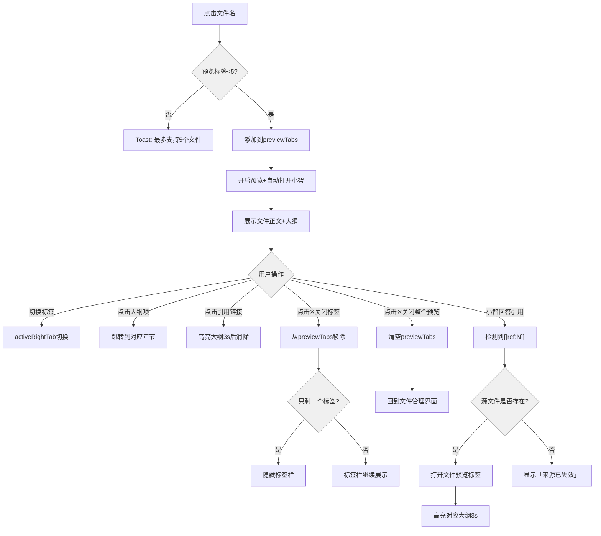

##### 3.2.3.8.3 界面原型

| 操作 | 交互 | 截图/示例 |
| --- | --- | --- |
| 点击文件行/文件名 | `openPreview(doc)`：右侧预览侧栏滑入，展示文件正文+大纲，添加到 `previewTabs[]`，自动打开小智 | 原型 v1.0 |
| 预览多文件 | 依次添加到 `previewTabs[]`，标签栏展示所有已打开文件标签 | — |
| 点击标签切换 | 切换 `activeRightTab = doc.name` | — |
| 点击标签 ✕ 关闭 | 从 `previewTabs[]` 移除 | — |
| 只预览一个文件 | 标签栏隐藏，仅展示文件内容 | — |
| 预览标签达到5个再点新文件 | Toast「最多支持5个文件，请关闭不需要的文件后尝试」 | — |
| 点击大纲章节 | 跳转到对应章节位置 | — |
| 小智回答引用 `[[ref:N]]` | 对应大纲章节高亮3s，3s后自动消除 | — |
| 点击 ✕ 关闭整个预览栏 | 清空 `previewTabs[]` 和 `previewDoc`，回到文件管理界面 | — |
| 删除正在预览的文件 | 预览自动关闭 | — |

##### 3.2.3.8.4 数据说明（业务实体）

| 字段 | 类型 | 说明 |
| --- | --- | --- |
| PreviewTab.docId | string | 文档ID |
| PreviewTab.docName | string | 文件名（标签标题） |
| PreviewTab.active | boolean | 当前是否为激活标签 |
| PreviewTab.outline | PreviewOutline\[\] | 大纲章节列表 |
| PreviewOutline.id | string | 大纲项ID |
| PreviewOutline.title | string | 章节标题文本 |
| PreviewOutline.level | number | 标题层级，1~6 |
| PreviewOutline.position | string | 章节锚点位置 |
| previewTabs | PreviewTab\[\] | 当前打开的预览标签列表，最多5个 |
| activeRightTab | string | 当前激活的文件名 |
| qaAutoOpenedByPreview | boolean | 小智是否由预览联动打开 |

##### 3.2.3.8.5 业务规则和约束条件

*   预览标签最多5个，超出 Toast 提示
    
*   删除正在预览的文件自动关闭预览
    
*   引用来源找不到文件时按 精确匹配→部分匹配→无操作 降级
    

##### 3.2.3.8.6 接口说明

```plaintext
GET /api/knowledge/file/{fileId}/preview
```

##### 3.2.3.8.7 补充说明

无。

#### 3.2.3.9 文件删除

##### 3.2.3.9.1 功能需求描述

| EARS 模式 | 需求描述 |
| --- | --- |
| 普遍型 | *   系统应在侧栏底部展示回收站入口，附带当前视图删除项计数。<br>    <br>*   系统应在回收站列表中展示名称、类型、删除时间。 |
| 状态驱动型 | *   当用户点击文件删除按钮（或右键删除）时，系统应从 allDocs 移除、关闭预览（如正在预览）并移入回收站。<br>    <br>*   当用户勾选多个文件后点击批量删除时，系统应 Toast「已删除N个文件」。 |
| 事件驱动型 | *   当用户点击表头复选框时，系统应全部选中或取消全部选中。<br>    <br>*   当用户点击恢复时，系统应将删除项还原至原位置。<br>    <br>*   当用户点击彻底删除时，系统应二次确认后物理删除。 |
| 不良行为型 | *   如果切换空间时用户正在预览文件，系统应关闭预览清空 `previewTabs`。<br>    <br>*   如果切换空间时用户正在编辑标签或重命名，系统应放弃编辑态。<br>    <br>*   如果用户A尝试访问用户B的我的知识库数据，系统应返回403并不暴露任何我的知识库内容。 |

##### 3.2.3.9.2 业务主流程图及说明

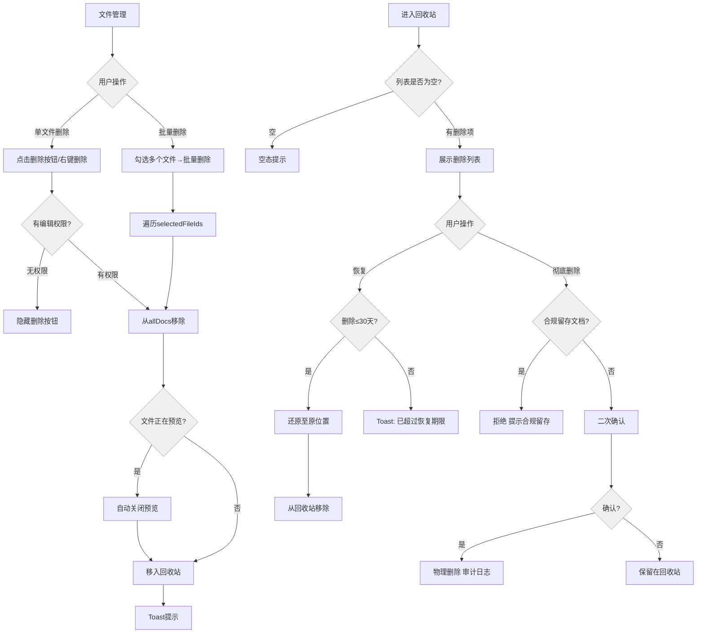

##### 3.2.3.9.3 界面原型

| 操作 | 交互 | 截图/示例 |
| --- | --- | --- |
| 点击文件行「删除」按钮 | `deleteDoc()`：从 `allDocs[]`移除，关闭预览，移入回收站，Toast | 原型 v1.0 |
| 右键文件→删除 | 同点击删除按钮 | — |
| 选择文件√ | 勾选第一行时同步表头全选；表头已全选再点取消 | — |
| 选中≥1个文件 | 顶部蓝色操作栏「已选 N 项」+「删除」按钮 | — |
| 批量「删除」 | `deleteSelectedDocs()`：遍历 `selectedFileIds`，Toast「已删除N个文件」 | — |
| 侧栏底部「回收站」 | 显示当前视图删除项计数徽标 | — |
| 进入回收站 | 展示列表（名称/类型/删除时间/操作按钮） | — |
| 回收站为空 | Trash2 图标 + 「当前视图回收站为空」 | — |
| 点击「恢复」 | `restoreRecycleItem()`：还原至原位置，Toast「已恢复」 | — |
| 点击「彻底删除」 | 二次确认弹窗，确认后 `purgeRecycleItem()` | — |
| 删除超过30天 | 恢复按钮置灰/隐藏 | — |
| 知识库删除 | 连带知识库下所有文档和文件夹一并移入回收站 | — |
| 文件夹删除 | 递归删除所有子文档和子文件夹 | — |

##### 3.2.3.9.4 数据说明（业务实体）

| 字段 | 类型 | 说明 |
| --- | --- | --- |
| id | string | 回收站条目ID |
| type | 'knowledgeBase' \| 'folder' \| 'file' | 被删除对象类型 |
| name | string | 名称 |
| space | SpaceKey | 原所属视图 |
| kbId | string \| undefined | 原所属知识库ID |
| parentId | string \| undefined | 原父文件夹ID |
| deletedAt | string | 删除时间 |
| detail | string | 详细信息 |
| kb | KnowledgeBaseItem \| undefined | 被删除的知识库（type=knowledgeBase时） |
| folder | Folder \| undefined | 被删除的文件夹（type=folder时） |
| doc | DocItem \| undefined | 被删除的文档（type=file时） |

##### 3.2.3.9.5 业务规则和约束条件

*   删除30天内的文件可恢复，超过30天自动物理删除（不可恢复）
    
*   物理删除后不可恢复
    
*   合规留存文档不可物理删除
    
*   回收站按空间隔离展示
    
*   删除操作记录审计日志
    

##### 3.2.3.9.6 接口说明

```plaintext
DELETE /api/knowledge/file/{fileId}              单文件删除
DELETE /api/knowledge/files/batch                批量删除
GET    /api/knowledge/recycle?space={space}       获取回收站列表
POST   /api/knowledge/recycle/restore             恢复
DELETE /api/knowledge/recycle/purge               彻底删除
```

##### 3.2.3.9.7 补充说明

无。

### 知识库问答

#### 3.2.4.1 RAG搜索回答

##### 3.2.4.1.1 功能需求描述

| EARS 模式 | 需求描述 |
| --- | --- |
| 普遍型 | *   系统应在小智侧栏展示4种问答模式：智能问答（answer）、知识检索（search）、图谱分析（graph）占位、数据洞察（insight）占位。<br>    <br>*   系统应在初始状态展示欢迎语和快捷问题卡片（3~4个）。<br>    <br>*   系统应采用**会话记忆模式**：同一会话内自动保留最近多轮对话上下文，支持跨轮指代消解（如第2轮说"它的增长率呢？"时，"它"自动继承前轮主语）。<br>    <br>*   知识库问答不做独立会话管理（不单独提供新建/删除会话功能），所有对话历史统一由**主对话侧栏**的会话管理功能承载。 |
| 状态驱动型 | *   当用户发送第一条消息后，系统应自动隐藏引导区。<br>    <br>*   当检索无结果时，系统应返回"知识库中未找到相关信息"不调用LLM。 |
| 事件驱动型 | *   当用户输入问题并发送（Enter）时，系统应执行RAG检索并生成回答。<br>    <br>*   当用户复制消息时，系统应复制内容到剪贴板并高亮 `qaCopiedId` 2s。<br>    <br>*   当用户重试时，系统应截断到该条之前并自动重新发送。<br>    <br>*   当用户编辑消息时，系统应行内编辑 + Enter确认 + 截断 + 自动重发。<br>    <br>*   当用户引用上一条回答时，系统应填充输入框「引用上一条回答继续：{前60字符}」。<br>    <br>*   当用户点击引用链接 `[[ref:N]]` 时，系统应打开文件预览标签并高亮对应章节3s。 |
| 不良行为型 | *   如果快速连续发送消息，系统应保证不丢失消息。<br>    <br>*   如果LLM调用超时（>30s），系统应返回超时提示并建议重试。<br>    <br>*   如果命中敏感词或Prompt注入，系统应拒绝回答并记录审计日志。<br>    <br>*   如果 `[[ref:N]]` 索引超出范围，系统应不执行跳转。<br>    <br>*   如果源文档已删除，系统应显示「来源已失效」并保留chunk\_id用于审计。 |

##### 3.2.4.1.2 业务主流程图及说明

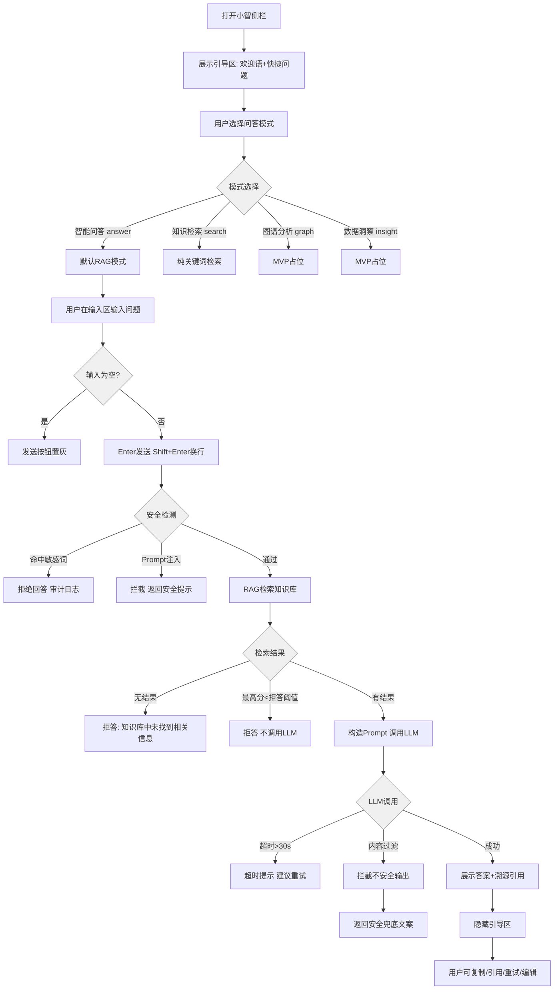

##### 3.2.4.1.3 界面原型

| 操作 | 交互 | 截图/示例 |
| --- | --- | --- |
| 点击「知识库问答」按钮 | 右侧滑入小智侧栏，宽度360~460px，标题「小智」副标题「知识库问答助手」 | 原型 v1.0 |
| 点击关闭 ✕ | 关闭小智侧栏，不影响文件预览 | — |
| 初始状态 | 展示欢迎语 + 快捷问题卡片（3~4个） | — |
| 选择问答模式 | 智能问答(answer) / 知识检索(search) / 图谱分析(graph)占位 / 数据洞察(insight)占位 | — |
| 输入问题 | 多行自适应（最高8行/192px），空输入时发送按钮置灰 | — |
| Enter 发送 | 执行发送；Shift+Enter 换行 | — |
| 用户消息展示 | 右侧深色气泡，hover显示「编辑」「复制」按钮 | — |
| 小智回答展示 | 左侧浅色气泡，hover显示「复制」「引用」「重试」「编辑」按钮 | — |
| 点击「复制」 | 复制内容到剪贴板，`qaCopiedId` 高亮2s后消除 | — |
| 点击「引用」 | 填充输入框「引用上一条回答继续：{前60字符}」 | — |
| 点击「重试」 | 截断对话到该条回答之前，自动重新发送问题 | — |
| 点击「编辑」 | 该条消息进入行内编辑，Enter确认后截断并自动重发，Esc取消 | — |
| 快速连续发送 | 保证不丢失消息 | — |
| LLM 超时（>30s） | 返回超时提示，建议重试 | — |
| 检索无结果 | 返回「知识库中未找到相关信息」，不调用 LLM | — |
| 命中敏感词/Prompt注入 | 返回安全提示，记录审计日志 | — |

| 操作 | 交互 | 截图/示例 |
| --- | --- | --- |
| 同一会话内连续对话 | 自动保留最近5轮对话作为上下文，超出窗口的旧轮次自动截断 | 原型 v1.0 |
| 跨轮指代消解 | 第2轮起使用代词（如"它的增长率呢？"），系统自动消解指代 | — |
| 对话上下文持久化 | 消息自动保存（`kb_chat_history`），刷新页面或关闭侧栏后恢复 | — |
| 会话历史统一管理 | 不设独立会话管理功能，所有历史会话统一由主对话侧栏承载 | — |

##### 3.2.4.1.4 数据说明（业务实体）

| 字段 | 类型 | 说明 | 原型对应 |
| --- | --- | --- | --- |
| QaMessage.id | number | 消息ID | `id` |
| QaMessage.role | 'user' \| 'assistant' | 消息角色 | `role` |
| QaMessage.content | string | 消息内容 | `content` |
| QaMessage.citations | string\[\] | 引用来源 | `citations` |
| QaMessage.replyTo | string \| undefined | 引用上一条 | `replyTo` |
| qaMode | 'answer' \| 'search' \| 'graph' \| 'insight' | 当前问答模式 | `qaMode` |
| qaMessages | QaMessage\[\] | 当前会话消息列表 | `qaMessages` |
| quotedQaMessage | QaMessage \| null | 正在引用的消息 | `quotedQaMessage` |

##### 3.2.4.1.5 业务规则和约束条件

*   上下文窗口：保留最近5轮对话
    
*   跨轮指代：支持代词消解
    
*   持久化：消息自动保存至 `kb_chat_history`，刷新可恢复
    
*   无独立会话管理：所有历史会话统一由主对话侧栏管理
    
*   知识库问答只维护当前对话的上下文记忆，不提供新建/切换/删除会话功能
    

##### 3.2.4.1.6 接口说明

```plaintext
POST   /api/knowledge/qa/ask                     提问
GET    /api/knowledge/qa/stream                  流式输出(SSE)
```

##### 3.2.4.1.7 补充说明

无

#### 3.2.4.2 溯源引用

##### 3.2.4.2.1 功能需求描述

| EARS 模式 | 需求描述 |
| --- | --- |
| 普遍型 | *   系统应在答案中以 `[[ref:N]]` 格式标注溯源引用，自动解析为带编号的可点击上标链接 \[¹\]。 |
| 状态驱动型 | *   当用户点击引用链接时，系统应打开文件预览标签并高亮大纲对应章节。 |
| 事件驱动型 | *   当用户点击视图切换按钮时，系统应切换 `activeSpace` 并重新加载对应数据。 |
| 不良行为型 | *   如果 `[[ref:N]]` 索引超出可用范围，系统应不执行跳转。<br>    <br>*   如果源文档已删除，系统应显示「来源已失效」并保留 chunk\_id 用于审计。 |

##### 3.2.4.2.2 业务主流程图及说明

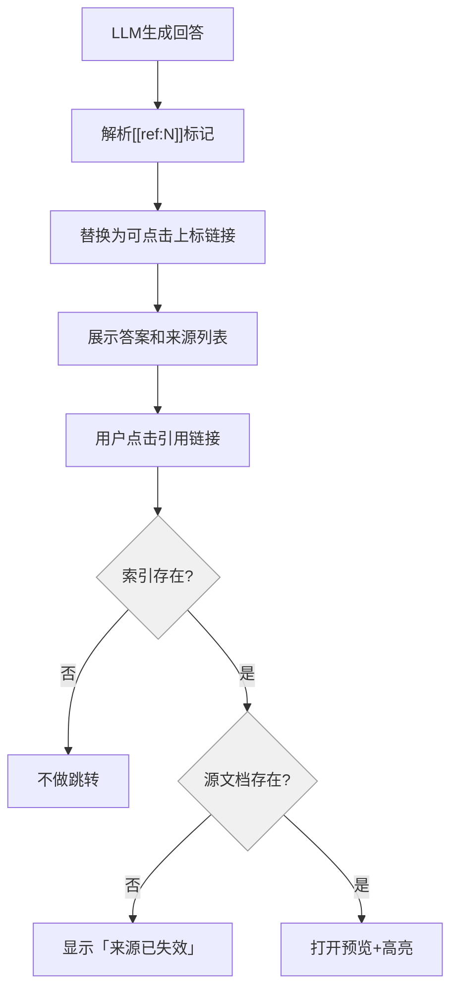

##### 3.2.4.2.3 界面原型

| 操作 | 交互 | 截图/示例 |
| --- | --- | --- |
| 小智回答中出现 `[[ref:1]]` | 解析为带编号的可点击上标链接 \[¹\] | 原型 v1.0 |
| 点击引用链接 \[¹\] | source\_chunks\[1\] 存在且源文档正常 → 打开该文件预览标签，大纲对应章节高亮3s | — |
| 源文档已删除 | 显示「来源已失效」，保留 chunk\_id 用于审计 | — |
| 索引超出范围 | 不执行跳转 | — |
| 引用高亮持续 | 高亮3s后自动消除 | — |

##### 3.2.4.2.4 数据说明（业务实体）

| 字段 | 类型 | 说明 |
| --- | --- | --- |
| Citation.refId | number | 引用序号，对应 `[[ref:N]]` 中的N |
| Citation.chunkId | string | 来源 chunk 唯一标识 |
| Citation.docId | string | 来源文档 ID |
| Citation.docTitle | string | 来源文档标题 |
| Citation.space | 'public' \| 'personal' | 来源文档所属视图 |
| Citation.excerpt | string | 引用原文摘要片段 |
| Citation.headingPath | string\[\] | 来源章节路径，如 `["第一章", "1.1 概述"]` |
| SourceChunk.chunkId | string | Chunk 唯一标识 |
| SourceChunk.content | string | Chunk 完整文本内容 |
| SourceChunk.pageNumber | number \| undefined | 来源页码（仅PDF） |
| qaCitations | Citation\[\] | 当前回答的引用列表 |

##### 3.2.4.2.5 业务规则和约束条件

*   `[[ref:N]]` 索引超出范围时不跳转
    
*   源文档已删除时显示「来源已失效」
    

##### 3.2.4.2.6 接口说明

无

##### 3.2.4.2.7 补充说明

无

# 非功能需求

## 性能要求

| 指标 | 要求 | 说明 |
| --- | --- | --- |
| 首页加载 | P95 ≤ 2s | 知识中心页面整体加载 |
| 文件树展开 | P95 ≤ 500ms | 展开文件夹/知识库节点 |
| 搜索建议 | P95 ≤ 100ms | 输入防抖后自动补全响应 |
| 文件上传确认 | P95 ≤ 1s | 点击确认到上传启动 |
| 解析处理 | P95 ≤ 30s | 从上传完成到 done（含排队） |
| 回答首token | P95 ≤ 3s | 流式输出第一个 token |
| 并发上传 | 支持50个文件同时触发 | 前端不卡顿 |

## 安全要求

| 类别 | 要求 |
| --- | --- |
| 格式伪装检测 | 文件头魔数校验 + 扩展名比对，不一致拒绝入库 |
| 病毒扫描 | ClamAV 集成（二期），阳性瞬删并记录安全日志 |
| PII 检测 | 身份证/手机号/银行卡号扫描，标记 `contains_pii` |
| 权限过滤 | 检索前按用户角色过滤可见范围，机密文档直接过滤 |
| 加密检测 | 加密PDF/Office文件标记 process\_failed |
| XSS防护 | 预览高亮内容转义 `<mark>` 标签确保安全 |
| Prompt注入防护 | 输入安全检测，拦截注入尝试 |

## 兼容性要求

| 项目 | 要求 |
| --- | --- |
| 浏览器 | Chrome、Edge、钉钉内置浏览器最近两个大版本 |
| 文件格式 | P0：PDF、DOCX、TXT、MD；P1：XLSX、扫描 PDF、PNG/JPG |
| 权限来源 | 支持钉钉用户、部门、角色组映射 |

# 迭代计划

## MVP-1（v1.7.x）

| 功能 | 优先级 | 覆盖范围 |
| --- | --- | --- |
| 三栏布局 + 视图切换 | P0 | 公共/我的知识库切换、侧栏折叠展开 |
| 文件树 | P0 | 展开/折叠、拖拽排序、右键菜单 |
| 新建知识库 | P0 | 名称校验、空间隔离、自动选中 |
| 新建文件夹 | P0 | 名称校验、位置选择 |
| 文件上传（含解析） | P0 | 前端校验 → OSS → 魔数 → 解析 → 清洗 → 分块 → 向量化 |
| 状态流转 | P0 | 7种状态 + 超时兜底 + 重试 |
| 批量上传 | P0 | 最多50文件、SHA256去重秒传 |
| 文件预览 | P0 | 多标签（最多5个）、大纲导航 |
| 标签 | P0 | 预设+自定义、上传时打标、列表展示 |
| 密级 | P0 | 公开/内部/秘密/机密 |
| RAG问答 | P0 | 智能问答模式、溯源引用 |
| 会话管理 | P0 | 多会话、最近5轮上下文 |
| 回收站 | P0 | 恢复、彻底删除 |
| 权限管理 | P0 | 5级角色、成员管理、预设规则 |
| 审计日志 | P0 | 全链路操作留痕、WORM存储 |
| 文件搜索 | P1 | 文件名搜索、实时过滤 |

## MVP-2（v1.8.x）

| 功能 | 优先级 | 说明 |
| --- | --- | --- |
| 版本管理 | P1 | 同名文件新版本、并排diff、回滚 |
| 断点续传 | P1 | 大文件分片上传 |
| Excel 解析 | P1 | xlsx 格式支持 |
| 扫描 PDF OCR | P1 | 图片型PDF文字识别 |
| 搜索结果关键词高亮 | P1 | 匹配词 `<mark>` 高亮 |
| 拼写纠错 | P1 | 搜索时的纠错建议 |
| 热门搜索 | P2 | TOP10统计 |

## 增强阶段（v1.9.x 及以后）

| 功能 | 说明 |
| --- | --- |
| 团队空间 | 新增 Space 隔离域类型（与公共/我的知识库并列），按团队/项目组隔离知识，**不改变"知识库-文件夹-文件"三层结构** |
| 全文搜索 | 搜索文件正文内容，不仅限于文件名 |
| 图片解析 | PNG/JPG 格式支持 |
| PPT 解析 | pptx 格式支持 |
| AI 智能体集成 | Agent 自主检索知识库 |
| ClamAV 病毒扫描 | 文件上传时自动扫描 |
| PII 检测 | 敏感信息自动识别标记 |

# 附录

## 状态字典

| 文件状态 | 用户可见文本 | 是否终态 | 可操作 |
| --- | --- | --- | --- |
| uploading | 上传中 🔵 | 否 | 取消 |
| pending | 排队中 🔵 | 否 | 取消 |
| processing | 处理中 🔵 | 否 | — |
| done | 已完成 ✅ 🟢 | 是 | 下线、删除 |
| reviewing | 待审核 ⏳ 🟡 | 否（企业知识库专用） | — |
| upload\_failed | 上传失败 ❌ 🔴 | 是 | 重新上传、删除 |
| process\_failed | 处理失败 ❌ 🔴 | 是 | 手动重试、删除 |
| process\_failed\_permanent | 处理失败 ❌ 🔴 | 是 | 手动重试、删除 |
| cancelled | 已取消 ➖ ⚪ | 是 | 重新处理 |

## 错误码字典

| 错误码 | HTTP | 场景 |
| --- | --- | --- |
| INVALID\_NAME | 400 | 名称含特殊字符 |
| FILE\_EMPTY | 400 | 上传空文件（0字节） |
| FILE\_TOO\_LARGE | 413 | 文件超过100MB |
| BATCH\_TOO\_LARGE | 413 | 批次总大小超过1GB |
| BATCH\_TOO\_MANY | 400 | 单次超过50个文件 |
| KB\_NAME\_EXISTS | 409 | 同名知识库存在 |
| FORMAT\_UNSUPPORTED | 400 | 不支持的文件格式 |
| FORMAT\_MISMATCH | 400 | 魔数与扩展名不一致 |
| FILE\_ENCRYPTED | 400 | 文件已加密 |
| FORBIDDEN | 403 | 无权限操作 |
| NOT\_FOUND | 404 | 资源不存在 |
| RATE\_LIMITED | 429 | 请求过于频繁 |
| SERVICE\_ERROR | 500 | 服务端异常 |
| UPLOAD\_EXPIRED | 400 | 上传凭证过期 |

## 原型状态变量速查

| 变量 | 类型 | 默认值 | 用途 |
| --- | --- | --- | --- |
| sidebarVisible | boolean | true | 左侧栏展开/收起 |
| activeSpace | 'public' \| 'personal' | 'public' | 当前视图 |
| selectedKbId | string \| null | null | 选中知识库 |
| expandedTreeIds | string[] | [] | 当前展开的文件夹/知识库节点ID |
| previewTabs | DocItem\[\] | \[ \] | 预览标签列表 |
| qaOpen | boolean | false | 小智侧栏展开 |
| qaMode | string | 'answer' | 问答模式 |
| uploadModalOpen | boolean | false | 上传弹窗 |
| uploadCandidates | UploadCandidate\[\] | \[ \] | 上传候选文件 |
| uploadTasks | UploadTask\[\] | \[ \] | 上传任务列表 |
| recycleItems | RecycleItem\[\] | \[ \] | 回收站条目 |
| settingsKbId | string | '' | 正在设置的知识库ID |
| permissionMembers | Record<string, PermissionEntry\[\]> | {} | 权限成员 |