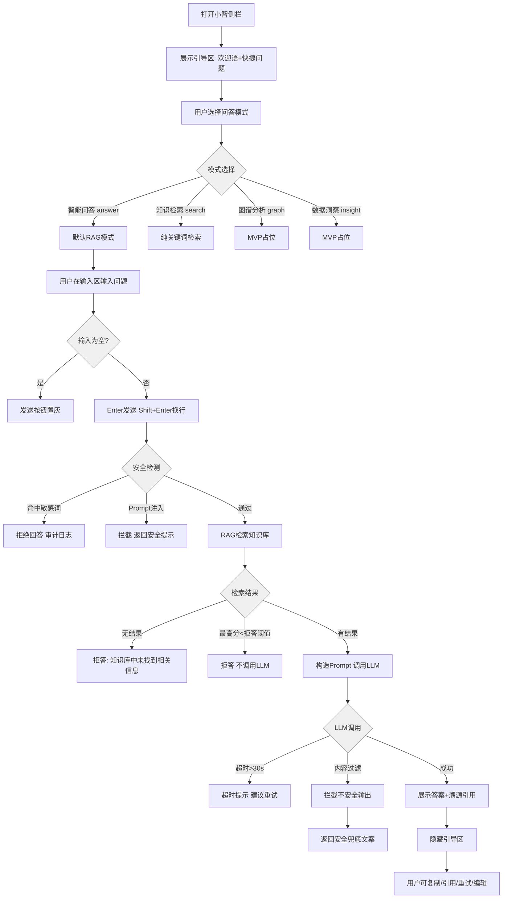

# 20260703-【PRD】AI工作台-知识中心-天马智擎项目

_**天马智擎项目**_

**产品需求说明书**

版本信息

本表用于记录本文档的维护过程，请认真填写。

| 版本号 | 时间(必填) | 状态 | 简要描述(必填) | 部门 | 责任产品(必填) | 批准人 |
| --- | --- | --- | --- | --- | --- | --- |
| V1.0 | 2026-07-03 | N | AI工作台中知识库产品需求 | AI项目小组 | $\color{#0089FF}{@公输}$ |  |
|  |  |  |  |  |  |  |

注：状态可以为N-新建、A-增加、M-更改、D-删除。

# 关于本文档

## 术语

| **词汇名称** | **全局说明** |
| --- | --- |
| Embedding | 文本向量化，将语义转化为数学向量 |
| Cosine Similarity | 余弦相似度，衡量向量之间的语义距离 |
| Top-K | 检索结果中取相似度最高的 K 条 |
| MCP | Model Context Protocol，模型上下文协议 |
| OSS | 阿里云对象存储服务 |
| file-chip | 已选附件的标签式展示组件 |

## 参考文档

为了更好理解本文档，请阅读如下文档。

| **编号** | **文档** | **说明及地址** |
| --- | --- | --- |
| 1 | 原型界面参考 | https://fri555.github.io/PORTL/ |
| 2 |  |  |

## 沟通要求

本表记录需要跨部门沟通的事项，以保证该文档内容质量。如果有其它跨部门沟通项，请填写该表中，并记录沟通结果。

| **序号** | **部门** | **沟通内容** | **沟通结果** |
| --- | --- | --- | --- |
| 1 |  |  |  |
| 2 |  |  |  |

# 产品概述

本章节详细描述产品的背景、内容和目标等进行详细定义，关于产品定义的其它内容请阅读本产品定义说明书。

## 产品概述

知识中心是天马智擎 AI 工作台的核心业务入口，定位为集团统一知识库管理与智能问答平台。用户可以在同一页面完成知识库浏览、文档上传、文件预览、权限管理和基于知识库的小智问答。

## 产品目标

*   **统一知识入口**：用户可在知识中心切换公共空间/个人空间，并访问对应知识库与文件
    
*   **文件入库闭环**：用户上传文件后，可看到上传、排队、处理、完成、失败、取消等状态
    
*   **智能问答闭环**：用户可基于选定知识库或当前文件提问，答案展示来源引用
    
*   **权限安全闭环**：用户只能检索、预览、问答有权限访问的知识内容
    
*   **管理可追溯**：上传、删除、检索、问答、权限变更等关键操作均记录审计日志
    

## 用户角色

| **用户角色** | **职责描述** | **使用功能** |
| --- | --- | --- |
| **普通员工** | 快速查资料、问政策、找方案 | 浏览公共空间、搜索文件、向小智提问 |
| **知识库管理员** | 管理部门知识资产 | 新建知识库、上传文件、配置权限、处理异常文件 |
| **运维** | 保证知识安全与可追溯 | 查看权限、审计记录、敏感内容处理结果 |

## 同类产品/竞品调研(选写)

###  同类产品

1.  **钉钉知识库**
    
    1.  优势：与 IM、审批、日志、日程等 OA 场景天然集成，组织架构与权限体系接入成本低，适合钉钉生态内的基础知识沉淀。
        
    2.  不足：AI 问答入口较深、体验偏弱；文件树、版本管理、去重检测、生命周期治理等能力相对基础。
        
    3.  启示：MVP 阶段需对齐基础上传、检索、问答、文件树能力，并在问答入口、文件格式支持、细粒度文件树交互上形成差异。
        
2.  **飞书知识空间 / 飞书知识问答**
    
    1.  优势：RAG 工程能力较强，支持混合检索、Query 改写、重排序、溯源引用、多模型切换；权限与 AI 检索结合较成熟。
        
    2.  不足：成本较高，依赖企业在飞书生态内已有足够知识沉淀。
        
    3.  启示：中期应重点对标其“权限前置过滤 + 混合检索 + 溯源问答”链路，逐步建设专业 RAG 能力。
        
3.  **语雀**
    
    1.  优势：中文编辑器、目录树、知识库-目录-文档结构体验成熟，代码块、画板、Markdown 排版对研发与知识沉淀友好。
        
    2.  不足：AI 问答能力迭代较慢，与 IM/OA/审批等业务系统联动弱。
        
    3.  启示：文件树、目录层级、中文排版和文档组织方式可作为交互参考；天马智擎应以 AI 问答与业务联动形成差异。
        
4.  **Notion**
    
    1.  优势：Block 架构灵活，Database 多视图和模板生态成熟，适合个人、小团队和创意协作场景。
        
    2.  不足：企业级权限治理、本地化、私有化和国内访问稳定性不足。
        
    3.  启示：长期可参考其灵活信息组织方式，但当前不作为 MVP 主要对标对象。
        
5.  **Confluence**
    
    1.  优势：页面树、空间隔离、版本管理、审批链、插件生态成熟，是传统企业 Wiki 标杆。
        
    2.  不足：体验重、成本高、AI 能力弱，国内访问与本土化存在劣势。
        
    3.  启示：后续版本可参考其版本管理、审批流、空间治理能力，形成“轻体验 + AI 能力 + 企业治理”的替代价值。
        
6.  **AI 原生知识库平台（Dify、FastGPT、扣子/Coze、智巢 AI 等）**
    
    1.  优势：RAG、工作流编排、多模型切换、API 集成能力强，验证了“知识库 + AI 问答”的产品方向。
        
    2.  不足：多数缺少成熟文件管理、企业级权限、知识治理和精细化前端体验。
        
    3.  启示：天马智擎应吸收其 RAG 能力，同时补齐企业知识库所需的文件树、权限、审计、版本、去重与生命周期管理。
        
    
    ###  结论
    
    *   **MVP 阶段**：对标钉钉知识库，优先完成上传、解析、检索、问答、权限和文件树管理。
        
    *   **中期阶段**：对标飞书知识问答，补强混合检索、重排序、溯源、权限前置过滤和 RAG 评测。
        
    *   **长期阶段**：吸收语雀/Confluence 的知识治理能力，以及 AI 原生平台的多模型与工作流能力，形成“AI 原生能力 + 企业级知识治理 + 业务场景集成”的差异化。
        

# 功能需求

## 流程图

###  技术架构图

**1.整体架构**

**2.层级结构**

```plaintext
空间（公共空间 / 个人空间）
 └── 空间文件夹（如"集团整体""商品部"）
      └── 知识库（如"集团制度知识库"）
           └── 文件夹（知识库内部组织单元）
                └── 文件（PDF / DOCX / MD / TXT）

```

###  流程图

**1.用户流程图**

**2.流程图说明**

| **流程** | **说明** |
| --- | --- |
| **浏览流程** | 进入知识中心 → 切换空间 → 浏览文件树 → 选择知识库 → 查看文件列表 → 预览文件 → 小智问答联动 |
| **上传流程** | 点击上传 → 前端校验（格式/大小/数量） → 确认上传 → uploading→pending→processing→done（个人）或 reviewing（公共） |
| **搜索流程** | 搜索框输入 → 自动补全建议 → 执行搜索 → 结果高亮 → 点击预览 |
| **管理流程** | 知识库设置 → 成员授权 / 文档管理 / 审计记录 |
| **回收站流程** | 删除操作 → 回收站 → 恢复或彻底删除 |

**关键规则**：

*   知识库内可嵌套文件夹，文件夹支持多级
    
*   同一文件只允许挂在一个位置，不能在树中重复出现
    
*   文件夹不支持权限设置（权限仅设置在知识库和文件层级）
    

## 功能模块

| **主功能** | **子功能** | **功能描述** |
| --- | --- | --- |
| 整体布局 | 页面布局 | 采用左侧文件树、中间内容区、右侧预览/问答区的三栏布局 |
| 整体布局 | 分栏切换 | 支持左侧文件树和右侧预览/问答面板展开、收起，适配不同知识管理与阅读场景 |
| 整体布局 | 文件树（左侧边栏） | 以树形结构展示空间、文件夹、知识库和文件，支持展开、收起、选中和右键操作 |
| 权限管理 | 知识库 / 文件权限 | 支持按空间、知识库、文件夹或文件配置访问权限，控制成员可见、可编辑范围 |
| 权限管理 | 审计日志 | 记录上传、删除、修改权限、问答检索等关键操作 |
| 文件管理 | 空间切换 | 支持在个人空间、公共空间之间切换，按空间加载对应文件夹、知识库和文档内容 |
| 文件管理 | 新建知识库 | 支持在指定空间或文件夹下创建知识库，作为同类业务文档的统一管理容器 |
| 文件管理 | 新建文件夹 | 支持在空间、知识库或知识库内部目录中新建文件夹，用于分类沉淀业务文档 |
| 文件管理 | 文件上传 | 支持向指定知识库或文件夹上传文档，上传后自动进入解析、切分和入库流程 |
| 文件管理 | 标签、密级 | 支持为文件设置业务标签和密级，用于后续检索过滤、权限控制和知识治理 |
| 文件管理 | 状态流转 | 展示文件从上传中、解析中、入库中、成功到失败的处理状态，便于跟踪进度 |
| 文件管理 | 文件搜索 | 支持按文件名、文件夹名或知识库名称进行搜索，快速定位目标内容 |
| 文件管理 | 文件预览 | 支持点击文件，直接预览有查看权限文件的内容 |
| 文件管理 | 文件删除 | 支持查看已删除文件或目录，并提供恢复、彻底删除等后续管理能力 |
| 知识库问答 | RAG搜索回复 | 基于所选知识库内容进行语义检索，并结合大模型生成可读、可追问的回答 |
| 知识库问答 | 溯源引用 | 回答中展示引用来源、文档片段和跳转入口，便于用户核验答案依据 |

### 整体布局

#### 3.2.1.1 功能需求描述

知识中心应作为 AI 工作台一级 Tab，为用户提供统一的知识资产入口。页面采用左侧文件树、中间内容区、右侧预览/小智问答的多栏联动布局。

| EARS 模式 | 需求描述 |
| --- | --- |
| 普遍型 | *   系统应在用户进入知识中心时默认展示当前空间的文件树和主视图。<br>    <br>*   系统应始终保留左侧树的折叠/展开入口。<br>    <br>*   系统应允许文件预览和小智问答同时打开。 |
| 状态驱动型 | *   当用户关闭左侧文件树时，系统应将中间内容区扩展为全宽。<br>    <br>*   当用户打开文件预览时，系统应在中间主区切换到预览态，文件列表隐藏。<br>    <br>*   当用户打开小智问答时，系统应在右侧展示问答侧栏，不影响文件预览。<br>    <br>*   当用户首次进入知识中心时，系统应默认展示公共空间。 |
| 事件驱动型 | *   当用户点击文件时，系统应打开文件预览区，自动打开小智侧栏，并保持主视图上下文不丢失。<br>    <br>*   当用户点击折叠按钮时，系统应以 `translate-x` 动画收起左侧栏。<br>    <br>*   当用户关闭文件预览时，系统应回到文件管理界面。 |
| 不良行为型 | *   如果当前文件无预览能力，系统应展示不可预览原因（权限不足，解析失败）<br>    <br>*   如果预览标签超过5个，系统应进行提醒，只支持5个标签页 |

#### 3.2.1.2 业务主流程图及说明

同 3.1.2 流程图

#### 3.2.1.3 界面原型


| 操作 | 交互 | 截图/示例 |
| --- | --- | --- |
| 1.默认进入 | 【左侧】文件树+【右侧】文件管理 |  |
| 2.关闭左侧文件树 | 文件管理占满全屏；侧栏 `translate-x` 渐出；浮动 dock 出现在左上方 | <br> |
| 3.点击文件预览 | 【左侧】文件树+【中间】文件预览+【右侧】小智问答 |  |
| 4.预览时关闭左侧文件树 | 【左侧】文件预览+【右侧】小智问答 |  |
| 5.预览时关闭文件预览 | 【左侧】文件树+【中间】文件管理+【右侧】小智问答 |  |
| 6.预览时关闭小智问答 | 【左侧】文件树+【右侧】文件预览 |  |
| 7.点击按钮切换布局 | 文件视图切换【详细信息】/【文件卡片】 | <br> |
| 8.点击知识库收藏 | 知识库在空间文件夹下置顶 |  |
| 9.文件夹移动 | 文件树、中间主view知识库支持拖拽移动位置<br>文件夹移动不得超出知识库，知识库移动不得超出空间文件夹 |  |

#### 3.2.1.4 数据说明（业务实体）

| 实体 | 字段 | 说明 |
| --- | --- | --- |
| Space | id、type、name、owner\_id | 公共空间或个人空间 |
| TreeNode | id、parent\_id、type、name、sort\_order | 文件树节点 |
| KnowledgeBase | id、space\_id、folder\_id、name、owner\_id、visibility | 知识库 |
| Document | id、kb\_id、folder\_id、name、format、status | 文件 |

#### 3.2.1.5 业务规则和约束条件

*   默认进入知识中心时只展示文件树+文件管理两栏，小智和预览面板由用户主动触发或点击文件时联动打开
    
*   公共空间与个人空间数据完全隔离；不同用户个人空间互不可见
    
*   文件预览、小智问答、文件树任一栏收起后，其余区域按规则自适应
    
*   首次进入默认公共空间；切换空间时清空选中知识库和文件
    

#### 3.2.1.6 接口说明

无

#### 3.2.1.7 补充说明

无

### 权限管理

#### 3.2.2.1 功能需求描述

| EARS 模式 | 需求描述 |
| --- | --- |
| 普遍型 | *   系统应支持 5 级权限角色体系，每级角色的能力范围如下：<br>    <br>    \| 角色 \| 英文标识 \| 能力范围 \|<br>    \| --- \| --- \| --- \|<br>    \| 所有者 \| OWNER \| 全部权限，含成员管理、知识库删除/转移 \|<br>    \| 管理员 \| MANAGER \| 可管理文档与成员（添加/移除/改角色），不可删除知识库 \|<br>    \| 编辑者 \| EDITOR \| 可查看、下载、上传文件、编辑元数据（标签/密级）、新建文件夹 \|<br>    \| 下载者 \| DOWNLOADER \| 可查看和下载文件内容 \|<br>    \| 查看者 \| READER \| 仅可查看文件列表和预览，不可下载 \|<br>    <br>*   系统应确保非成员用户看不到知识库的存在（不展示在列表中）。<br>    <br>*   系统应在文件列表中展示权限徽标（"可编辑" / "只读"）。<br>    <br>*   系统应支持四种一键权限预设规则：<br>    <br>\| 预设 \| 效果 \|<br>\| --- \| --- \|<br>\| **本部门读写** \| 本部门成员设为 EDITOR，其他部门不可见 \|<br>\| **全公司阅读** \| 全员设为 READER，本部门成员为 EDITOR \|<br>\| **指定部门** \| 仅指定部门成员可见（自动设为 READER） \|<br>\| **公开** \| 全员可查看/下载（READER），无需逐个授权 \| |
| 事件驱动型 | *   当知识库设置为公开时，系统应允许部门预设规则一键配置权限。<br>    <br>*   当用户拥有编辑权限时，系统应在知识库节点和文件行展示编辑入口（上传、新建文件夹、设置）。 |
| 事件驱动型 | *   当管理员添加成员时，系统应弹窗选择用户+角色并确认添加。<br>    <br>*   当管理员修改角色时，系统应下拉选择新角色并立即生效，记录审计日志。<br>    <br>*   当管理员移除成员时，系统应二次确认后移除，该成员不再可见该知识库。<br>    <br>*   当管理员点击批量添加时，系统应弹窗选择部门和角色预设。 |
| 不良行为型 | *   如果非成员尝试访问知识库，系统应不展示该知识库（不暴露存在）。<br>    <br>*   如果普通用户尝试管理成员，系统应隐藏管理入口。<br>    <br>*   如果操作者权限不足以修改目标成员角色，系统应拒绝并提示。<br>    <br>*   如果文件夹被设置权限，系统应拒绝操作（只有知识库和文件支持权限设置）。 |

#### 3.2.2.2 业务主流程图及说明

#### 3.2.2.3 界面原型


| 操作 | 交互 | 截图/示例 |
| --- | --- | --- |
| 右键具有可管理权限的知识库 | 出现二级菜单，存在设置功能 |  |
| 知识库设置 →「成员授权」Tab | 成员列表：头像/姓名/部门/角色下拉/加入时间/操作按钮 |  |
| 角色选项 | 五级：OWNER(所有者) / MANAGER(管理员) / EDITOR(编辑) / DOWNLOADER(下载) / READER(查看) |  |
| 点击「添加成员」 | 弹窗：左侧部门候选列表（含子团队展开），右侧以选中的成员+角色 |  |
| 搜索用户 | 对于已设置权限的成员，输入关键词实时过滤候选列表 |  |
| 角色预设 | 四种一键预设：本部门读写 / 全公司阅读 / 指定部门 / 公开 |  |
| 修改成员角色 | 角色下拉即时生效，Toast「已更新 {name} 的权限」 |  |
| 移除成员 | 二次确认「确认移除？移除后该成员将不再可见该知识库内容」 |  |
| 文件权限设置 | 弹窗展示文件名+格式+大小+上传者，成员列表与KB继承相同，可单独调整角色 |  |
| 知识库列表权限徽标 | KB 节点右侧「可编辑」「只读」等徽标 |  |
| 无管理权限的用户 | 二级菜单不显示设置按钮 | — |
| 知识库设置 →「审计记录」Tab | 展示审计日志列表，列：操作类型 / 用户 / 时间 / IP / 结果 |  |
| 按时间范围筛选 | 选择起始/截止时间，列表实时过滤 |  |
| 按用户筛选 | 输入用户名关键词，列表实时过滤 |  |
| 按操作类型筛选 | 下拉选择：上传/删除/检索/问答/权限变更等 |  |
| 导出审计报告 | 点击「导出」按钮，生成审计报告文件 |  |
| 敏感问答 | 在审计日志中标记 `is_sensitive=true` |  |

#### 3.2.2.4 数据说明（业务实体）

| 字段 | 类型 | 说明 |
| --- | --- | --- |
| PermissionEntry.id | string | 权限条目ID |
| PermissionEntry.name | string | 成员名称 |
| PermissionEntry.scope | '部门' \| '个人' | 成员范围 |
| PermissionEntry.department | string | 所属部门 |
| PermissionEntry.role | PermissionRole | 角色：OWNER/MANAGER/EDITOR/DOWNLOADER/READER |
| PermissionEntry.joinedAt | string | 加入时间 |

#### 3.2.2.5 业务规则和约束条件

*   知识库和文件支持权限设置，文件夹不支持权限设置
    
*   非成员用户看不到知识库的存在
    
*   角色变更即时生效
    
*   权限操作记录审计日志
    
*   OWNER 不可通过界面修改自己的角色
    
*   移除成员不影响其通过其他知识库或父节点的继承权限
    
*   全链路记录上传、删除、检索、问答、权限变更等操作
    
*   每条日志记录：user\_id、action、target、timestamp、ip、user\_agent、result
    
*   WORM 存储（不可篡改），保留 ≥180 天
    
*   敏感问答标记 `is_sensitive=true`
    
*   答案可完整追溯至源文档 + chunk
    

#### 3.2.2.6 接口说明

```plaintext
GET    /api/knowledge/{kbId}/permissions            获取成员权限列表
POST   /api/knowledge/{kbId}/permission/add         添加成员
PUT    /api/knowledge/{kbId}/permission/update      修改成员角色
DELETE /api/knowledge/{kbId}/permission/remove      移除成员
POST   /api/knowledge/{kbId}/permission/preset      批量预设权限
GET    /api/knowledge/file/{fileId}/permissions     获取文件级权限
POST   /api/knowledge/file/{fileId}/permission/update  更新文件级权限
GET /api/knowledge/{kbId}/audit?page=&size=
```

#### 3.2.2.7 补充说明

无

### 文件管理

#### 3.2.3.1 空间切换

##### 3.2.3.1.1 功能需求描述

| EARS 模式 | 需求描述 |
| --- | --- |
| 普遍型 | *   系统应在知识中心侧栏顶部展示「公共空间」和「个人空间」两个切换入口。<br>    <br>*   系统应在根空间优先展示空间文件夹，不直接展示知识库列表。 |
| 事件驱动型 | *   当切换至公共空间时，系统应加载公共空间文件夹树和知识库列表。<br>    <br>*   当切换至个人空间时，系统应按当前用户加载其私有数据。<br>    <br>*   当用户进入某个空间文件夹时，系统应在主视图展示该文件夹下的知识库。 |
| 事件驱动型 | *   当用户点击空间切换按钮时，系统应切换 `activeSpace` 并重新加载对应数据。 |
| 不良行为型 | *   如果切换空间时用户正在预览文件，系统应关闭预览清空 `previewTabs`。<br>    <br>*   如果切换空间时用户正在编辑标签或重命名，系统应放弃编辑态。<br>    <br>*   如果用户A尝试访问用户B的个人空间数据，系统应返回403并不暴露任何个人空间内容。 |

##### 3.2.3.1.2 业务主流程图及说明

##### 3.2.3.1.3 界面原型

| 操作 | 交互 | 截图/示例 |
| --- | --- | --- |
| 点击「公共空间」标签 | 加载公共空间，侧栏顶部显示11个部门文件夹 |  |
| 点击「个人空间」标签 | 加载个人空间，侧栏显示3个默认文件夹（日常工作/基础知识/个人资料） |  |
| 切换空间 | 清空 `selectedKbId=null`, `previewTabs=[]`, `expandedTreeIds=[]`, 关闭小智 | — |
| 进入空间文件夹 | 中间主区展示该文件夹下的知识库列表 |  |

##### 3.2.3.1.4 数据说明（业务实体）

| 字段 | 类型 | 说明 | 原型变量 |
| --- | --- | --- | --- |
| activeSpace | 'public' \| 'personal' | 当前所选空间 | `activeSpace` |
| selectedKbId | string \| null | 选中知识库ID，切换空间时清空 | `selectedKbId` |
| defaultSpaceFolders | SpaceFolder\[\] | 空间文件夹列表 | `defaultPublicFolders` / `defaultPersonalFolders` |

##### 3.2.3.1.5 业务规则和约束条件

*   公共空间与个人空间数据完全隔离
    
*   不同用户个人空间严格隔离
    
*   切换空间时清空选中态、预览态和小智
    
*   根空间默认只展示空间文件夹，不直接露出具体知识库
    

##### 3.2.3.1.6 接口说明

```plaintext
GET /api/knowledge/spaces 获取空间列表及文件夹结构
```

##### 3.2.3.1.7 补充说明

无

#### 3.2.3.2 新建知识库

##### 3.2.3.2.1 功能需求描述

| EARS 模式 | 需求描述 |
| --- | --- |
| 普遍型 | *   系统应在创建知识库时校验名称长度不超过64字符，不含特殊字符 `/\:*?"<>\|`。 |
| 事件驱动型 | *   当用户在知识库内点击新建知识库时，系统应提示"知识库内只能新建文件夹"。 |
| 事件驱动型 | *   当用户点击创建按钮时，系统应校验名称后执行创建。<br>    <br>*   当用户取消创建时，系统应关闭弹窗不执行创建。 |
| 不良行为型 | *   如果名称为空或纯空格，系统应阻止创建并 Toast 提醒「请输入知识库名称」，不自动回退为默认名。<br>    <br>*   如果名称超长（≥64字符），系统应截断或返回400。<br>    <br>*   如果名称含特殊字符 `/\:*?"<>\|`，系统应返回400，错误码 `INVALID_NAME`。<br>    <br>*   如果创建时所属空间为公共空间且用户不是管理员（MVP一期管理员可在公共空间创建），系统应拒绝创建。 |

##### 3.2.3.2.2 业务主流程图及说明

##### 3.2.3.2.3 界面原型

| 操作 | 交互 | 截图/示例 |
| --- | --- | --- |
| 点击侧栏「新建知识库」按钮；点击二级菜单「新建知识库」按钮 | 居中弹出新建知识库弹窗 |  |
| 在知识库内点击新建知识库 | Toast 提示「知识库内只能新建文件夹，不能新建知识库」，不弹窗 |  |
| 名称输入为空或纯空格 | 阻止创建 · Toast 提示「请输入知识库名称」 | — |
| 名称超长（≥64字符） | 截断为前64字符，或返回400 | — |
| 名称含特殊字符 \`/😗?"<> | \` | 返回400，错误码 `INVALID_NAME`，Toast 提示名称格式错误 |
| 名称与同空间已有知识库重复 | 返回409，错误码 `KB_NAME_EXISTS`，Toast 提示「名称已存在，请更换」 | — |
| 名称合法 + 点击「创建」按钮 | 执行 `createKnowledgeBase()`：新建KB → 加入文件树 → 展开父节点 → 自动选中 → 关闭弹窗 | — |
| 点击「取消」/ 遮罩层 | 关闭弹窗，不创建 | — |

##### 3.2.3.2.4 数据说明（业务实体）

##### 3.2.3.2.5 业务规则和约束条件

##### 3.2.3.2.6 接口说明

##### 3.2.3.2.7 补充说明

#### 3.2.3.3 新建文件夹

##### 3.2.3.3.1 功能需求描述

| EARS 模式 | 需求描述 |
| --- | --- |
| 普遍型 | *   系统应在知识中心侧栏顶部展示「公共空间」和「个人空间」两个切换入口。<br>    <br>*   系统应在根空间优先展示空间文件夹，不直接展示知识库列表。 |
| 事件驱动型 | *   当切换至公共空间时，系统应加载公共空间文件夹树和知识库列表。<br>    <br>*   当切换至个人空间时，系统应按当前用户加载其私有数据。<br>    <br>*   当用户进入某个空间文件夹时，系统应在主视图展示该文件夹下的知识库。 |
| 事件驱动型 | *   当用户点击空间切换按钮时，系统应切换 `activeSpace` 并重新加载对应数据。 |
| 不良行为型 | *   如果切换空间时用户正在预览文件，系统应关闭预览清空 `previewTabs`。<br>    <br>*   如果切换空间时用户正在编辑标签或重命名，系统应放弃编辑态。<br>    <br>*   如果用户A尝试访问用户B的个人空间数据，系统应返回403并不暴露任何个人空间内容。 |

##### 3.2.3.3.2 业务主流程图及说明

##### 3.2.3.3.3 界面原型

| 操作 | 交互 | 截图/示例 |
| --- | --- | --- |
|  |  |  |
|  |  |  |

##### 3.2.3.3.4 数据说明（业务实体）

##### 3.2.3.3.5 业务规则和约束条件

##### 3.2.3.3.6 接口说明

##### 3.2.3.3.7 补充说明

#### 3.2.3.4 文件上传

##### 3.2.3.4.1 功能需求描述

| EARS 模式 | 需求描述 |
| --- | --- |
| 普遍型 | *   系统应在知识中心侧栏顶部展示「公共空间」和「个人空间」两个切换入口。<br>    <br>*   系统应在根空间优先展示空间文件夹，不直接展示知识库列表。 |
| 事件驱动型 | *   当切换至公共空间时，系统应加载公共空间文件夹树和知识库列表。<br>    <br>*   当切换至个人空间时，系统应按当前用户加载其私有数据。<br>    <br>*   当用户进入某个空间文件夹时，系统应在主视图展示该文件夹下的知识库。 |
| 事件驱动型 | *   当用户点击空间切换按钮时，系统应切换 `activeSpace` 并重新加载对应数据。 |
| 不良行为型 | *   如果切换空间时用户正在预览文件，系统应关闭预览清空 `previewTabs`。<br>    <br>*   如果切换空间时用户正在编辑标签或重命名，系统应放弃编辑态。<br>    <br>*   如果用户A尝试访问用户B的个人空间数据，系统应返回403并不暴露任何个人空间内容。 |

##### 3.2.3.4.2 业务主流程图及说明

##### 3.2.3.4.3 界面原型

| 操作 | 交互 | 截图/示例 |
| --- | --- | --- |
|  |  |  |
|  |  |  |

##### 3.2.3.4.4 数据说明（业务实体）

##### 3.2.3.4.5 业务规则和约束条件

##### 3.2.3.4.6 接口说明

##### 3.2.3.4.7 补充说明

#### 3.2.3.5 标签与密级

##### 3.2.3.5.1 功能需求描述

| EARS 模式 | 需求描述 |
| --- | --- |
| 普遍型 | *   系统应在知识中心侧栏顶部展示「公共空间」和「个人空间」两个切换入口。<br>    <br>*   系统应在根空间优先展示空间文件夹，不直接展示知识库列表。 |
| 事件驱动型 | *   当切换至公共空间时，系统应加载公共空间文件夹树和知识库列表。<br>    <br>*   当切换至个人空间时，系统应按当前用户加载其私有数据。<br>    <br>*   当用户进入某个空间文件夹时，系统应在主视图展示该文件夹下的知识库。 |
| 事件驱动型 | *   当用户点击空间切换按钮时，系统应切换 `activeSpace` 并重新加载对应数据。 |
| 不良行为型 | *   如果切换空间时用户正在预览文件，系统应关闭预览清空 `previewTabs`。<br>    <br>*   如果切换空间时用户正在编辑标签或重命名，系统应放弃编辑态。<br>    <br>*   如果用户A尝试访问用户B的个人空间数据，系统应返回403并不暴露任何个人空间内容。 |

##### 3.2.3.5.2 业务主流程图及说明

##### 3.2.3.5.3 界面原型

| 操作 | 交互 | 截图/示例 |
| --- | --- | --- |
|  |  |  |
|  |  |  |

##### 3.2.3.5.4 数据说明（业务实体）

##### 3.2.3.5.5 业务规则和约束条件

##### 3.2.3.5.6 接口说明

##### 3.2.3.5.7 补充说明

#### 3.2.3.6 状态流转

##### 3.2.3.6.1 功能需求描述

| EARS 模式 | 需求描述 |
| --- | --- |
| 普遍型 | *   系统应在知识中心侧栏顶部展示「公共空间」和「个人空间」两个切换入口。<br>    <br>*   系统应在根空间优先展示空间文件夹，不直接展示知识库列表。 |
| 事件驱动型 | *   当切换至公共空间时，系统应加载公共空间文件夹树和知识库列表。<br>    <br>*   当切换至个人空间时，系统应按当前用户加载其私有数据。<br>    <br>*   当用户进入某个空间文件夹时，系统应在主视图展示该文件夹下的知识库。 |
| 事件驱动型 | *   当用户点击空间切换按钮时，系统应切换 `activeSpace` 并重新加载对应数据。 |
| 不良行为型 | *   如果切换空间时用户正在预览文件，系统应关闭预览清空 `previewTabs`。<br>    <br>*   如果切换空间时用户正在编辑标签或重命名，系统应放弃编辑态。<br>    <br>*   如果用户A尝试访问用户B的个人空间数据，系统应返回403并不暴露任何个人空间内容。 |

##### 3.2.3.6.2 业务主流程图及说明

##### 3.2.3.6.3 界面原型

| 操作 | 交互 | 截图/示例 |
| --- | --- | --- |
|  |  |  |
|  |  |  |

##### 3.2.3.6.4 数据说明（业务实体）

##### 3.2.3.6.5 业务规则和约束条件

##### 3.2.3.6.6 接口说明

##### 3.2.3.6.7 补充说明

#### 3.2.3.7 文件搜索

##### 3.2.3.7.1 功能需求描述

| EARS 模式 | 需求描述 |
| --- | --- |
| 普遍型 | *   系统应在知识中心侧栏顶部展示「公共空间」和「个人空间」两个切换入口。<br>    <br>*   系统应在根空间优先展示空间文件夹，不直接展示知识库列表。 |
| 事件驱动型 | *   当切换至公共空间时，系统应加载公共空间文件夹树和知识库列表。<br>    <br>*   当切换至个人空间时，系统应按当前用户加载其私有数据。<br>    <br>*   当用户进入某个空间文件夹时，系统应在主视图展示该文件夹下的知识库。 |
| 事件驱动型 | *   当用户点击空间切换按钮时，系统应切换 `activeSpace` 并重新加载对应数据。 |
| 不良行为型 | *   如果切换空间时用户正在预览文件，系统应关闭预览清空 `previewTabs`。<br>    <br>*   如果切换空间时用户正在编辑标签或重命名，系统应放弃编辑态。<br>    <br>*   如果用户A尝试访问用户B的个人空间数据，系统应返回403并不暴露任何个人空间内容。 |

##### 3.2.3.7.2 业务主流程图及说明

##### 3.2.3.7.3 界面原型

| 操作 | 交互 | 截图/示例 |
| --- | --- | --- |
|  |  |  |
|  |  |  |

##### 3.2.3.7.4 数据说明（业务实体）

##### 3.2.3.7.5 业务规则和约束条件

##### 3.2.3.7.6 接口说明

##### 3.2.3.7.7 补充说明

#### 3.2.3.8 文件预览

##### 3.2.3.8.1 功能需求描述

| EARS 模式 | 需求描述 |
| --- | --- |
| 普遍型 | *   系统应在知识中心侧栏顶部展示「公共空间」和「个人空间」两个切换入口。<br>    <br>*   系统应在根空间优先展示空间文件夹，不直接展示知识库列表。 |
| 事件驱动型 | *   当切换至公共空间时，系统应加载公共空间文件夹树和知识库列表。<br>    <br>*   当切换至个人空间时，系统应按当前用户加载其私有数据。<br>    <br>*   当用户进入某个空间文件夹时，系统应在主视图展示该文件夹下的知识库。 |
| 事件驱动型 | *   当用户点击空间切换按钮时，系统应切换 `activeSpace` 并重新加载对应数据。 |
| 不良行为型 | *   如果切换空间时用户正在预览文件，系统应关闭预览清空 `previewTabs`。<br>    <br>*   如果切换空间时用户正在编辑标签或重命名，系统应放弃编辑态。<br>    <br>*   如果用户A尝试访问用户B的个人空间数据，系统应返回403并不暴露任何个人空间内容。 |

##### 3.2.3.8.2 业务主流程图及说明

##### 3.2.3.8.3 界面原型

| 操作 | 交互 | 截图/示例 |
| --- | --- | --- |
|  |  |  |
|  |  |  |

##### 3.2.3.8.4 数据说明（业务实体）

##### 3.2.3.8.5 业务规则和约束条件

##### 3.2.3.8.6 接口说明

##### 3.2.3.8.7 补充说明

#### 3.2.3.9 文件删除

##### 3.2.3.9.1 功能需求描述

| EARS 模式 | 需求描述 |
| --- | --- |
| 普遍型 | *   系统应在知识中心侧栏顶部展示「公共空间」和「个人空间」两个切换入口。<br>    <br>*   系统应在根空间优先展示空间文件夹，不直接展示知识库列表。 |
| 事件驱动型 | *   当切换至公共空间时，系统应加载公共空间文件夹树和知识库列表。<br>    <br>*   当切换至个人空间时，系统应按当前用户加载其私有数据。<br>    <br>*   当用户进入某个空间文件夹时，系统应在主视图展示该文件夹下的知识库。 |
| 事件驱动型 | *   当用户点击空间切换按钮时，系统应切换 `activeSpace` 并重新加载对应数据。 |
| 不良行为型 | *   如果切换空间时用户正在预览文件，系统应关闭预览清空 `previewTabs`。<br>    <br>*   如果切换空间时用户正在编辑标签或重命名，系统应放弃编辑态。<br>    <br>*   如果用户A尝试访问用户B的个人空间数据，系统应返回403并不暴露任何个人空间内容。 |

##### 3.2.3.9.2 业务主流程图及说明

##### 3.2.3.9.3 界面原型

| 操作 | 交互 | 截图/示例 |
| --- | --- | --- |
|  |  |  |
|  |  |  |

##### 3.2.3.9.4 数据说明（业务实体）

##### 3.2.3.9.5 业务规则和约束条件

##### 3.2.3.9.6 接口说明

##### 3.2.3.9.7 补充说明

### 知识库问答

#### 3.2.4.1 RAG搜索回答

##### 3.2.4.1.1 功能需求描述

| EARS 模式 | 需求描述 |
| --- | --- |
| 普遍型 | *   系统应在小智侧栏展示4种问答模式：智能问答（answer）、知识检索（search）、图谱分析（graph）占位、数据洞察（insight）占位。<br>    <br>*   系统应在初始状态展示欢迎语和快捷问题卡片（3~4个）。<br>    <br>*   系统应采用**会话记忆模式**：同一会话内自动保留最近多轮对话上下文，支持跨轮指代消解（如第2轮说"它的增长率呢？"时，"它"自动继承前轮主语）。<br>    <br>*   知识库问答不做独立会话管理（不单独提供新建/删除会话功能），所有对话历史统一由**主对话侧栏**的会话管理功能承载。 |
| 事件驱动型 | *   当用户发送第一条消息后，系统应自动隐藏引导区。<br>    <br>*   当检索无结果时，系统应返回"知识库中未找到相关信息"不调用LLM。 |
| 事件驱动型 | *   当用户输入问题并发送（Enter）时，系统应执行RAG检索并生成回答。<br>    <br>*   当用户复制消息时，系统应复制内容到剪贴板并高亮 `qaCopiedId` 2s。<br>    <br>*   当用户重试时，系统应截断到该条之前并自动重新发送。<br>    <br>*   当用户编辑消息时，系统应行内编辑 + Enter确认 + 截断 + 自动重发。<br>    <br>*   当用户引用上一条回答时，系统应填充输入框「引用上一条回答继续：{前60字符}」。<br>    <br>*   当用户点击引用链接 `[[ref:N]]` 时，系统应打开文件预览标签并高亮对应章节3s。 |
| 不良行为型 | *   如果快速连续发送消息，系统应保证不丢失消息。<br>    <br>*   如果LLM调用超时（>30s），系统应返回超时提示并建议重试。<br>    <br>*   如果命中敏感词或Prompt注入，系统应拒绝回答并记录审计日志。<br>    <br>*   如果 `[[ref:N]]` 索引超出范围，系统应不执行跳转。<br>    <br>*   如果源文档已删除，系统应显示「来源已失效」并保留chunk\_id用于审计。 |

##### 3.2.4.1.2 业务主流程图及说明



##### 3.2.4.1.3 界面原型

| 操作 | 交互 | 截图/示例 |
| --- | --- | --- |
| 点击「知识库问答」按钮 | 右侧滑入小智侧栏，宽度360~460px，标题「小智」副标题「知识库问答助手」 | 原型 v1.0 |
| 点击关闭 ✕ | 关闭小智侧栏，不影响文件预览 | — |
| 初始状态 | 展示欢迎语 + 快捷问题卡片（3~4个） | — |
| 选择问答模式 | 智能问答(answer) / 知识检索(search) / 图谱分析(graph)占位 / 数据洞察(insight)占位 | — |
| 输入问题 | 多行自适应（最高8行/192px），空输入时发送按钮置灰 | — |
| Enter 发送 | 执行发送；Shift+Enter 换行 | — |
| 用户消息展示 | 右侧深色气泡，hover显示「编辑」「复制」按钮 | — |
| 小智回答展示 | 左侧浅色气泡，hover显示「复制」「引用」「重试」「编辑」按钮 | — |
| 点击「复制」 | 复制内容到剪贴板，`qaCopiedId` 高亮2s后消除 | — |
| 点击「引用」 | 填充输入框「引用上一条回答继续：{前60字符}」 | — |
| 点击「重试」 | 截断对话到该条回答之前，自动重新发送问题 | — |
| 点击「编辑」 | 该条消息进入行内编辑，Enter确认后截断并自动重发，Esc取消 | — |
| 快速连续发送 | 保证不丢失消息 | — |
| LLM 超时（>30s） | 返回超时提示，建议重试 | — |
| 检索无结果 | 返回「知识库中未找到相关信息」，不调用 LLM | — |
| 命中敏感词/Prompt注入 | 返回安全提示，记录审计日志 | — |

| 操作 | 交互 | 截图/示例 |
| --- | --- | --- |
| 同一会话内连续对话 | 自动保留最近5轮对话作为上下文，超出窗口的旧轮次自动截断 | 原型 v1.0 |
| 跨轮指代消解 | 第2轮起使用代词（如"它的增长率呢？"），系统自动消解指代 | — |
| 对话上下文持久化 | 消息自动保存（`kb_chat_history`），刷新页面或关闭侧栏后恢复 | — |
| 会话历史统一管理 | 不设独立会话管理功能，所有历史会话统一由主对话侧栏承载 | — |

##### 3.2.4.1.4 数据说明（业务实体）

##### 3.2.4.1.5 业务规则和约束条件

##### 3.2.4.1.6 接口说明

##### 3.2.4.1.7 补充说明

#### 3.2.4.2 文件删除

##### 3.2.4.2.1 功能需求描述

| EARS 模式 | 需求描述 |
| --- | --- |
| 普遍型 | *   系统应在知识中心侧栏顶部展示「公共空间」和「个人空间」两个切换入口。<br>    <br>*   系统应在根空间优先展示空间文件夹，不直接展示知识库列表。 |
| 事件驱动型 | *   当切换至公共空间时，系统应加载公共空间文件夹树和知识库列表。<br>    <br>*   当切换至个人空间时，系统应按当前用户加载其私有数据。<br>    <br>*   当用户进入某个空间文件夹时，系统应在主视图展示该文件夹下的知识库。 |
| 事件驱动型 | *   当用户点击空间切换按钮时，系统应切换 `activeSpace` 并重新加载对应数据。 |
| 不良行为型 | *   如果切换空间时用户正在预览文件，系统应关闭预览清空 `previewTabs`。<br>    <br>*   如果切换空间时用户正在编辑标签或重命名，系统应放弃编辑态。<br>    <br>*   如果用户A尝试访问用户B的个人空间数据，系统应返回403并不暴露任何个人空间内容。 |

##### 3.2.4.2.2 业务主流程图及说明

##### 3.2.4.2.3 界面原型

| 操作 | 交互 | 截图/示例 |
| --- | --- | --- |
|  |  |  |
|  |  |  |

##### 3.2.4.2.4 数据说明（业务实体）

##### 3.2.4.2.5 业务规则和约束条件

##### 3.2.4.2.6 接口说明

##### 3.2.4.2.7 补充说明

# 非功能需求

## 性能要求

| 指标 | 要求 | 说明 |
| --- | --- | --- |
| 首页加载 | P95 ≤ 2s | 知识中心页面整体加载 |
| 文件树展开 | P95 ≤ 500ms | 展开文件夹/知识库节点 |
| 搜索建议 | P95 ≤ 100ms | 输入防抖后自动补全响应 |
| 文件上传确认 | P95 ≤ 1s | 点击确认到上传启动 |
| 解析处理 | P95 ≤ 30s | 从上传完成到 done（含排队） |
| 回答首token | P95 ≤ 3s | 流式输出第一个 token |
| 并发上传 | 支持50个文件同时触发 | 前端不卡顿 |

## 安全要求

| 类别 | 要求 |
| --- | --- |
| 格式伪装检测 | 文件头魔数校验 + 扩展名比对，不一致拒绝入库 |
| 病毒扫描 | ClamAV 集成（二期），阳性瞬删并记录安全日志 |
| PII 检测 | 身份证/手机号/银行卡号扫描，标记 `contains_pii` |
| 权限过滤 | 检索前按用户角色过滤可见范围，机密文档直接过滤 |
| 加密检测 | 加密PDF/Office文件标记 process\_failed |
| XSS防护 | 预览高亮内容转义 `<mark>` 标签确保安全 |
| Prompt注入防护 | 输入安全检测，拦截注入尝试 |

## 兼容性要求

| 项目 | 要求 |
| --- | --- |
| 浏览器 | Chrome、Edge、钉钉内置浏览器最近两个大版本 |
| 文件格式 | P0：PDF、DOC、DOCX、TXT、MD；P1：XLSX、扫描 PDF、PNG/JPG |
| 权限来源 | 支持钉钉用户、部门、角色组映射 |

# 迭代计划

## MVP-1（v1.7.x）

| 功能 | 优先级 | 覆盖范围 |
| --- | --- | --- |
| 三栏布局 + 空间切换 | P0 | 公共/个人空间切换、侧栏折叠展开 |
| 文件树 | P0 | 展开/折叠、拖拽排序、右键菜单 |
| 新建知识库 | P0 | 名称校验、空间隔离、自动选中 |
| 新建文件夹 | P0 | 名称校验、位置选择 |
| 文件上传（含解析） | P0 | 前端校验 → OSS → 魔数 → 解析 → 清洗 → 分块 → 向量化 |
| 状态流转 | P0 | 7种状态 + 超时兜底 + 重试 |
| 批量上传 | P0 | 最多50文件、SHA256去重秒传 |
| 文件预览 | P0 | 多标签（最多5个）、大纲导航 |
| 标签 | P0 | 预设+自定义、上传时打标、列表展示 |
| 密级 | P0 | 公开/内部/秘密/机密 |
| RAG问答 | P0 | 智能问答模式、溯源引用 |
| 会话管理 | P0 | 多会话、最近5轮上下文 |
| 回收站 | P0 | 恢复、彻底删除 |
| 权限管理 | P0 | 5级角色、成员管理、预设规则 |
| 审计日志 | P0 | 全链路操作留痕、WORM存储 |
| 文件搜索 | P1 | 文件名搜索、实时过滤 |

## MVP-2（v1.8.x）

| 功能 | 优先级 | 说明 |
| --- | --- | --- |
| 版本管理 | P1 | 同名文件新版本、并排diff、回滚 |
| 断点续传 | P1 | 大文件分片上传 |
| Excel 解析 | P1 | xlsx 格式支持 |
| 扫描 PDF OCR | P1 | 图片型PDF文字识别 |
| 搜索结果关键词高亮 | P1 | 匹配词 `<mark>` 高亮 |
| 拼写纠错 | P1 | 搜索时的纠错建议 |
| 热门搜索 | P2 | TOP10统计 |

## 增强阶段（v1.9.x 及以后）

| 功能 | 说明 |
| --- | --- |
| 团队空间 | 按团队/项目组隔离知识空间 |
| 全文搜索 | 搜索文件正文内容，不仅限于文件名 |
| 图片解析 | PNG/JPG 格式支持 |
| PPT 解析 | pptx 格式支持 |
| AI 智能体集成 | Agent 自主检索知识库 |
| ClamAV 病毒扫描 | 文件上传时自动扫描 |
| PII 检测 | 敏感信息自动识别标记 |

# 附录

## 状态字典

| 文件状态 | 用户可见文本 | 是否终态 | 可操作 |
| --- | --- | --- | --- |
| uploading | 上传中 🔵 | 否 | 取消 |
| pending | 排队中 🔵 | 否 | 取消 |
| processing | 处理中 🔵 | 否 | — |
| done | 已完成 ✅ 🟢 | 是 | 下线、删除 |
| reviewing | 待审核 ⏳ 🟡 | 否（公共空间专用） | — |
| upload\_failed | 上传失败 ❌ 🔴 | 是 | 重新上传、删除 |
| process\_failed | 处理失败 ❌ 🔴 | 是 | 手动重试、删除 |
| process\_failed\_permanent | 处理失败 ❌ 🔴 | 是 | 手动重试、删除 |
| cancelled | 已取消 ➖ ⚪ | 是 | 重新处理 |

## 错误码字典

| 错误码 | HTTP | 场景 |
| --- | --- | --- |
| INVALID\_NAME | 400 | 名称含特殊字符 |
| FILE\_EMPTY | 400 | 上传空文件（0字节） |
| FILE\_TOO\_LARGE | 413 | 文件超过100MB |
| BATCH\_TOO\_LARGE | 413 | 批次总大小超过1GB |
| BATCH\_TOO\_MANY | 400 | 单次超过50个文件 |
| KB\_NAME\_EXISTS | 409 | 同名知识库存在 |
| FORMAT\_UNSUPPORTED | 400 | 不支持的文件格式 |
| FORMAT\_MISMATCH | 400 | 魔数与扩展名不一致 |
| FILE\_ENCRYPTED | 400 | 文件已加密 |
| FORBIDDEN | 403 | 无权限操作 |
| NOT\_FOUND | 404 | 资源不存在 |
| RATE\_LIMITED | 429 | 请求过于频繁 |
| SERVICE\_ERROR | 500 | 服务端异常 |
| UPLOAD\_EXPIRED | 400 | 上传凭证过期 |

## 原型状态变量速查

| 变量 | 类型 | 默认值 | 用途 |
| --- | --- | --- | --- |
| sidebarVisible | boolean | true | 左侧栏展开/收起 |
| activeSpace | 'public' \| 'personal' | 'public' | 当前空间 |
| selectedKbId | string \| null | null | 选中知识库 |
| expandedTreeIds | string\[\] | \['folder-shared','folder-solution-center'\] | 展开的树节点 |
| previewTabs | DocItem\[\] | \[ \] | 预览标签列表 |
| qaOpen | boolean | false | 小智侧栏展开 |
| qaMode | string | 'answer' | 问答模式 |
| uploadModalOpen | boolean | false | 上传弹窗 |
| uploadCandidates | UploadCandidate\[\] | \[ \] | 上传候选文件 |
| uploadTasks | UploadTask\[\] | \[ \] | 上传任务列表 |
| recycleItems | RecycleItem\[\] | \[ \] | 回收站条目 |
| settingsKbId | string | '' | 正在设置的知识库ID |
| permissionMembers | Record<string, PermissionEntry\[\]> | {} | 权限成员 |