# 20260706-【PRD】AI工作台-知识中心-天马智擎项目

_**天马智擎项目**_

**产品需求说明书**

版本信息

本表用于记录本文档的维护过程，请认真填写。

| 版本号 | 时间(必填) | 状态 | 简要描述(必填) | 部门 | 责任产品(必填) | 批准人 |
| --- | --- | --- | --- | --- | --- | --- |
| V1.0 | 2026-07-03 | N | AI工作台中知识库产品需求 | AI项目小组 | $\color{#0089FF}{@公输}$ |  |
| V1.1 | 2026-07-05 | M | 层级结构定为「空间-知识库-文件夹-文件」四层固定架构，空间为数据隔离域；取消空间文件夹/部门分组，组织维度由知识库独立承担 | AI项目小组 | $\color{#0089FF}{@公输}$ |  |
| V2.0 | 2026-07-06 | M | **第三章重构：按用户操作链路重组，标准化7件套结构，修复所有界面原型表格格式** | AI项目小组 | $\color{#0089FF}{@公输}$ |  |
| V2.1 | 2026-07-06 | M | **按评审决议全量修订：删除文件级权限/密级/回收站/右键菜单/问答模式/标签自定义，架构改为四层，新增清洗与切块规则** | AI项目小组 | $\color{#0089FF}{@公输}$ |  |
|  |  |  |  |  |  |  |

注：状态可以为N-新建、A-增加、M-更改、D-删除。

# 关于本文档

## 术语

| **词汇名称** | **全局说明** |
| --- | --- |
| Embedding | 文本向量化，将语义转化为数学向量 |
| Cosine Similarity | 余弦相似度，衡量向量之间的语义距离 |
| Top-K | 检索结果中取相似度最高的 K 条 |
| MCP | Model Context Protocol，模型上下文协议 |
| OSS | 阿里云对象存储服务 |
| file-chip | 已选附件的标签式展示组件（注：术语"标签"指UI标签页样式，非业务标签功能） |

## 参考文档

为了更好理解本文档，请阅读如下文档。

| **编号** | **文档** | **说明及地址** |
| --- | --- | --- |
| 1 | 原型界面参考 | https://fri555.github.io/PORTL/ |
| 2 |  |  |

## 沟通要求

本表记录需要跨部门沟通的事项，以保证该文档内容质量。如果有其它跨部门沟通项，请填写该表中，并记录沟通结果。

| **序号** | **部门** | **沟通内容** | **沟通结果** |
| --- | --- | --- | --- |
| 1 |  |  |  |
| 2 |  |  |  |

# 产品概述

本章节详细描述产品的背景、内容和目标等进行详细定义，关于产品定义的其它内容请阅读本产品定义说明书。

## 产品概述

知识中心是天马智擎 AI 工作台的核心业务入口，定位为集团统一知识库管理与智能问答平台。用户可以在同一页面完成知识库浏览、文档上传、文件预览、权限管理和基于知识库的小智问答。

**内容层级结构（四层固定架构）**：本产品采用「**空间 → 知识库 → 文件夹 → 文件**」四层固定架构，对标钉钉知识库、语雀、Notion、飞书等主流产品的心智模型。

*   **知识库**：一类业务文档的容器（如"集团制度知识库"、"商品手册库"、"项目档案库"），承载权限等治理属性。

*   **文件夹**：知识库内部的一级组织单元，用于对文件做业务维度的二次归类（仅组织作用，不承载权限）。

*   **文件**：业务文档本体（PDF / DOC / DOCX / XLS / XLSX / TXT / MD / CSV 等）。

> **公共空间 / 个人空间为"数据隔离域"**，决定数据归属与可见边界，不作为内容层级出现。组织维度（部门/项目组）通过知识库自身的权限承担，**不在知识库之上再设"空间文件夹"层**，避免抽象冗余和心智负担。

## 产品目标

*   **统一知识入口**：用户可在知识中心切换公共空间/个人空间，并访问对应知识库与文件

*   **文件入库闭环**：用户上传文件后，可看到上传中、处理中、已完成、上传失败、处理失败等状态

*   **智能问答闭环**：用户可基于选定知识库或当前文件提问，答案展示来源引用

*   **权限安全闭环**：用户只能检索、预览、问答有权限访问的知识内容

*   **管理可追溯**：上传、删除、检索、问答、权限变更等关键操作均记录审计日志

## 用户角色

| **用户角色** | **职责描述** | **使用功能** |
| --- | --- | --- |
| **普通员工** | 快速查资料、问政策、找方案 | 浏览公共空间知识库、搜索文件、向小智提问 |
| **知识库管理员** | 管理部门知识资产 | 新建知识库、上传文件、配置权限、处理异常文件 |
| **运维** | 保证知识安全与可追溯 | 查看权限、审计记录、敏感内容处理结果 |

## 同类产品/竞品调研(选写)

### 同类产品

1.  **钉钉知识库**

    1.  优势：与 IM、审批、日志、日程等 OA 场景天然集成，组织架构与权限体系接入成本低，适合钉钉生态内的基础知识沉淀。

    2.  不足：AI 问答入口较深、体验偏弱；文件树、版本管理、去重检测、生命周期治理等能力相对基础。

    3.  启示：MVP 阶段需对齐基础上传、检索、问答、文件树能力，并在问答入口、文件格式支持、细粒度文件树交互上形成差异。

2.  **飞书知识空间 / 飞书知识问答**

    1.  优势：RAG 工程能力较强，支持混合检索、Query 改写、重排序、溯源引用、多模型切换；权限与 AI 检索结合较成熟。

    2.  不足：成本较高，依赖企业在飞书生态内已有足够知识沉淀。

    3.  启示：中期应重点对标其“权限前置过滤 + 混合检索 + 溯源问答”链路，逐步建设专业 RAG 能力。

3.  **语雀**

    1.  优势：中文编辑器、目录树、知识库-目录-文档结构体验成熟，代码块、画板、Markdown 排版对研发与知识沉淀友好。

    2.  不足：AI 问答能力迭代较慢，与 IM/OA/审批等业务系统联动弱。

    3.  启示：文件树、目录层级、中文排版和文档组织方式可作为交互参考；天马智擎应以 AI 问答与业务联动形成差异。

4.  **Notion**

    1.  优势：Block 架构灵活，Database 多视图和模板生态成熟，适合个人、小团队和创意协作场景。

    2.  不足：企业级权限治理、本地化、私有化和国内访问稳定性不足。

    3.  启示：长期可参考其灵活信息组织方式，但当前不作为 MVP 主要对标对象。

5.  **Confluence**

    1.  优势：页面树、空间隔离、版本管理、审批链、插件生态成熟，是传统企业 Wiki 标杆。

    2.  不足：体验重、成本高、AI 能力弱，国内访问与本土化存在劣势。

    3.  启示：后续版本可参考其版本管理、审批流、空间治理能力，形成“轻体验 + AI 能力 + 企业治理”的替代价值。

6.  **AI 原生知识库平台（Dify、FastGPT、扣子/Coze、智巢 AI 等）**

    1.  优势：RAG、工作流编排、多模型切换、API 集成能力强，验证了“知识库 + AI 问答”的产品方向。

    2.  不足：多数缺少成熟文件管理、企业级权限、知识治理和精细化前端体验。

    3.  启示：天马智擎应吸收其 RAG 能力，同时补齐公共空间所需的文件树、权限、审计、版本、去重与生命周期管理。

    ### 结论

    *   **MVP 阶段**：对标钉钉知识库，优先完成上传、解析、检索、问答、权限和文件树管理。

    *   **中期阶段**：对标飞书知识问答，补强混合检索、重排序、溯源、权限前置过滤和 RAG 评测。

    *   **长期阶段**：吸收语雀/Confluence 的知识治理能力，以及 AI 原生平台的多模型与工作流能力，形成“AI 原生能力 + 企业级知识治理 + 业务场景集成”的差异化。

# 功能需求

## 流程图

### 技术架构图

**1.整体架构**

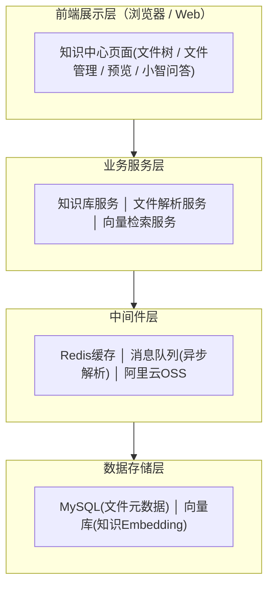
```mermaid
graph
    subgraph L1["前端展示层（浏览器 / Web）"]
        A["知识中心页面(文件树 / 文件管理 / 预览 / 小智问答)"]
    end
    subgraph L2["业务服务层"]
        B["知识库服务 │ 文件解析服务 │ 向量检索服务"]
    end
    subgraph L3["中间件层"]
        C["Redis缓存 │ 消息队列(异步解析) │ 阿里云OSS"]
    end
    subgraph L4["数据存储层"]
        D["MySQL(文件元数据) │ 向量库(知识Embedding)"]
    end
    L1 --> L2 --> L3 --> L4


```

**2.层级结构**

> **本产品采用「空间 → 知识库 → 文件夹 → 文件」四层固定架构**。公共空间/个人空间为数据隔离域（决定数据归属和访问边界），不作为内容层级出现。隔离域之外的"组织维度"（部门/项目组）通过知识库自身的**权限**承担，不在层级中增设"空间文件夹"。

```plaintext
空间（公共空间 / 个人空间，仅作为数据隔离域）
 └── 知识库（业务文档容器，如"集团制度知识库"）
      └── 文件夹（知识库内部一级组织单元，仅一级深度）
           └── 文件（PDF / DOCX / MD / TXT / CSV）

说明：
* 空间 = 隔离域（公共空间：全员可见的知识；个人空间：当前用户私有知识）
* 知识库 = 一类业务文档的容器（如"集团制度"、"商品手册"、"项目档案"）
* 文件夹 = 知识库内部的一级组织单元（用于对文件做业务维度的二次归类）
* 文件 = 业务文档本体

```
> **为什么不加"空间文件夹"层？**

> 1. 钉钉/语雀/Notion/飞书等主流产品均采用「知识库-文件夹-文件」三层，加层会破坏用户已有心智。 2. 公共空间下的"集团整体/商品部"等组织维度，可由知识库本身 + 部门权限覆盖，避免抽象冗余。

> 3. 个人空间下的"日常工作/基础知识/个人资料"等用户习惯，可通过收藏知识库 + 个人空间默认收藏夹\*\*实现，不需要再起一层。

### 流程图

**1.用户流程图**

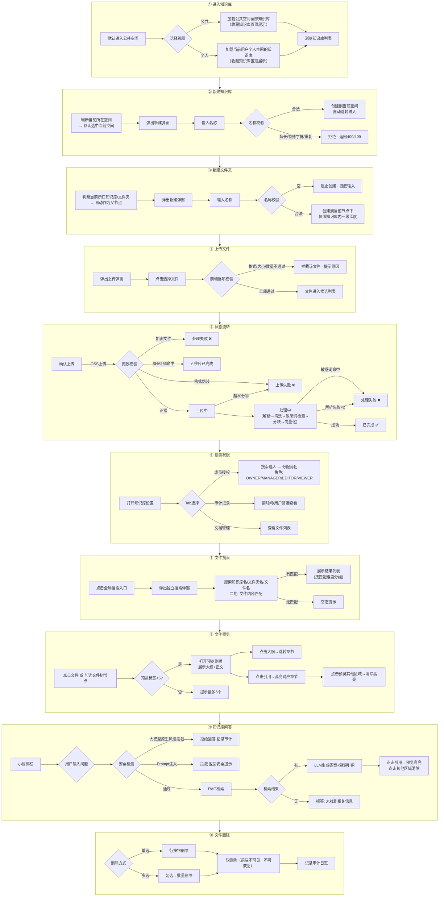
```mermaid
flowchart TB
    S1 --> S2
    S2 --> S3
    S3 --> S4
    S4 --> S5
    S5 --> S6
    S6 --> S7
    S7 --> S8
    S8 --> S9
    S9 --> S10

    subgraph S1["① 进入知识库"]
        S1a["默认进入公共空间"] --> S1b{"选择视图"}
        S1b -->|公共| S1c["加载公共空间全部知识库<br/>（收藏知识库置顶展示）"]
        S1b -->|个人| S1d["加载当前用户个人空间的知识库<br/>（收藏知识库置顶展示）"]
        S1c --> S1e["浏览知识库列表"]
        S1d --> S1e
    end

    subgraph S2["② 新建知识库"]
        S2a["判断当前所在空间<br/>→ 默认选中当前空间"] --> S2b["弹出新建弹窗"]
        S2b --> S2c["输入名称"]
        S2c --> S2d{"名称校验"}
        S2d -->|合法| S2e["创建到当前空间<br/>自动跳转进入"]
        S2d -->|超长/特殊字符/重复| S2err["拒绝 · 返回400/409"]
    end

    subgraph S3["③ 新建文件夹"]
        S3a["判断当前所在知识库/文件夹<br/>→ 自动作为父节点"] --> S3b["弹出新建弹窗"]
        S3b --> S3c["输入名称"]
        S3c --> S3d{"名称校验"}
        S3d -->|空| S3e["阻止创建 · 提醒输入"]
        S3d -->|合法| S3f["创建到当前节点下<br/>仅限知识库内一级深度"]
    end

    subgraph S4["④ 上传文件"]
        S4a["弹出上传弹窗"] --> S4b["点击选择文件"]
        S4b --> S4c{"前端逐项校验"}
        S4c -->|格式/大小/数量不通过| S4err["拦截该文件 · 提示原因"]
        S4c -->|全部通过| S4d["文件进入候选列表"]
    end

    subgraph S5["⑤ 状态流转"]
        S5a["确认上传"] -->|OSS上传| S5b{"魔数校验"}
        S5b -->|格式伪装| S5err1["上传失败 ❌"]
        S5b -->|加密文件| S5err2["处理失败 ❌"]
        S5b -->|SHA256命中| S5ok["⚡ 秒传已完成"]
        S5b -->|正常| S5c["上传中"]
        S5c --> S5d["处理中<br/>(解析→清洗→敏感词检测→分块→向量化)"]
        S5d -->|敏感词命中| S5err3["处理失败 ❌"]
        S5d -->|解析失败×2| S5err3["处理失败 ❌"]
        S5d -->|成功| S5ok1["已完成 ✅"]
        S5c -->|超30分钟| S5err1["上传失败 ❌"]
    end

    subgraph S6["⑥ 设置权限"]
        S6a["打开知识库设置"] --> S6b{"Tab选择"}
        S6b -->|成员授权| S6c["搜索选人 → 分配角色<br/>角色: OWNER/MANAGER/EDITOR/VIEWER"]
        S6b -->|审计记录| S6d["按时间/用户筛选查看"]
        S6b -->|文档管理| S6e["查看文件列表"]
    end

    subgraph S7["⑦ 文件搜索"]
        S7a["点击全局搜索入口"] --> S7b["弹出独立搜索弹窗"]
        S7b --> S7c["搜索知识库名/文件夹名/文件名<br/>二期: 文件内容匹配"]
        S7c -->|有匹配| S7d["展示结果列表<br/>(按匹配维度分组)"]
        S7c -->|无匹配| S7e["空态提示"]
    end

    subgraph S8["⑧ 文件预览"]
        S8a["点击文件 或 勾选文件树节点"] --> S8b{"预览标签<5?"}
        S8b -->|是| S8c["打开预览侧栏<br/>展示大纲+正文"]
        S8b -->|否| S8err["提示最多5个"]
        S8c --> S8d["点击大纲→跳转章节"]
        S8c --> S8e["点击引用→高亮对应章节"]
        S8e --> S8e_clear["点击预览其他区域→清除高亮"]
    end

    subgraph S9["⑨ 知识库问答"]
        S9a["小智侧栏"] --> S9b{"用户输入问题"}
        S9b --> S9c{"安全检测"}
        S9c -->|"大模型原生风控拦截"| S9d["拒绝回答 记录审计"]
        S9c -->|"Prompt注入"| S9e["拦截 返回安全提示"]
        S9c -->|"通过"| S9f["RAG检索"]
        S9f --> S9g{"检索结果"}
        S9g -->|有| S9h["LLM生成答案+溯源引用"]
        S9g -->|无| S9i["拒答: 未找到相关信息"]
        S9h --> S9j["点击引用→预览高亮<br/>点击其他区域清除"]
    end

    subgraph S10["⑩ 文件删除"]
        S10a{"删除方式"} -->|单选| S10b["行按钮删除"]
        S10a -->|多选| S10c["勾选→批量删除"]
        S10b --> S10d["软删除（前端不可见，不可恢复）"]
        S10c --> S10d
        S10d --> S10e["记录审计日志"]
    end

```

**2.流程图说明**

| **流程** | **说明** |
| --- | --- |
| **浏览流程** | 进入知识中心 → 切换空间 → 浏览知识库列表（按部门维度排序） → 选择知识库 → 查看文件夹/文件 → 预览文件 → 小智问答联动 |
| **上传流程** | 选中知识库 → 点击上传 → 前端校验（格式/大小） → 确认上传 → uploading→processing（含敏感词检测）→done/process_failed |
| **搜索流程** | 点击全局搜索入口 → 弹出搜索弹窗 → 输入关键词 → 展示匹配结果（知识库名/文件夹名/文件名）→ 点击预览 |
| **管理流程** | 知识库设置 → 成员授权 / 审计记录 |

**关键规则**：

*   知识库内仅支持一级文件夹

*   同一文件只允许挂在一个位置，不能在树中重复出现

*   文件夹不支持权限设置（权限仅设置在知识库层级）

## 功能模块

| **主功能** | **子功能** | **功能描述** |
| --- | --- | --- |
| 整体布局 | 页面布局 | 采用左侧文件树、中间内容区、右侧预览/问答区的三栏布局 |
| 整体布局 | 分栏切换 | 支持左侧文件树和右侧预览/问答面板展开、收起，适配不同知识管理与阅读场景 |
| 整体布局 | 文件树（左侧边栏） | 以树形结构展示"我的收藏"+知识库列表+知识库内文件夹与文件，支持展开、收起、选中和右键操作 |
| 权限管理 | 知识库 / 文件权限 | 支持按知识库、文件夹或文件配置访问权限，控制成员可见、可编辑范围 |
| 权限管理 | 审计日志 | 记录上传、删除、修改权限、问答检索等关键操作 |
| 文件管理 | 视图切换 | 支持在个人空间、公共空间之间切换，按空间加载对应的知识库和文档内容 |
| 文件管理 | 新建知识库 | 自动判断当前空间，在所在空间创建知识库，作为同类业务文档的统一管理容器 |
| 文件管理 | 新建文件夹 | 自动判断当前所在知识库，在知识库下新建一级文件夹（仅一级深度），用于分类沉淀业务文档 |
| 文件管理 | 文件上传 | 支持向指定知识库或文件夹上传文档，上传后自动进入解析、切分和入库流程 |
| 文件管理 | 状态流转 | 展示文件从上传中、处理中、已完成、上传失败、处理失败的处理状态，便于跟踪进度 |
| 文件管理 | 文件搜索 | 支持按文件名、文件夹名或知识库名称进行搜索，快速定位目标内容 |
| 文件管理 | 文件预览 | 支持点击文件，直接预览有查看权限文件的内容 |
| 文件管理 | 文件删除 | 支持查看已删除文件或目录，并提供恢复、彻底删除等后续管理能力 |
| 知识库问答 | RAG搜索回复 | 基于所选知识库内容进行语义检索，并结合大模型生成可读、可追问的回答 |
| 知识库问答 | 溯源引用 | 回答中展示引用来源、文档片段和跳转入口，便于用户核验答案依据 |

# 功能需求

## 章节说明

本章采用「用户操作链路」组织方式，权限与治理前置以奠定规则基础，随后按「浏览 → 管理 → 操作文件 → 消费知识」的自然路径展开。

**子章节概览**：

*   **3.2.1 浏览与导航** — 空间切换、文件树浏览、知识库列表，用户进入知识中心的第一件事

*   **3.2.2 权限与治理** — 角色体系（4级）、成员授权、审计日志；**前置定义**后续所有可见性规则

*   **3.2.3 知识库与文件夹管理** — 新建、重命名、删除知识库与文件夹

*   **3.2.4 文件全生命周期** — 上传、搜索、预览、删除、回收站

*   **3.2.5 知识库问答** — 小智智能问答、溯源引用与预览联动

### 3.2.1 浏览与导航

用户进入知识中心后，首先需要定位到目标知识库或文件。本节定义空间切换、文件树浏览和知识库列表三个核心导航能力。

#### 3.2.1.1 空间切换

##### 3.2.1.1.1 功能需求描述

| EARS 模式 | 需求描述 |
| --- | --- |
| 普遍型 | \* 系统应提供「公共空间」和「个人空间」两个独立空间，数据完全隔离。<br>\* 系统应在侧栏顶部展示空间切换入口，标注当前活跃空间。 |
| 状态驱动型 | \* 当用户切换空间时，系统应清空选中知识库、文件搜索词、预览面板和小智问答面板。<br>\* 当用户首次进入时，系统应默认展示公共空间。 |
| 事件驱动型 | \* 当用户点击空间标签时，系统应切换空间并刷新知识库列表和文件树。 |
| 不良行为型 | \* 当用户在公共空间尝试访问个人空间独有的知识库时，系统应返回「无权限」提示。 |

##### 3.2.1.1.2 业务主流程图及说明

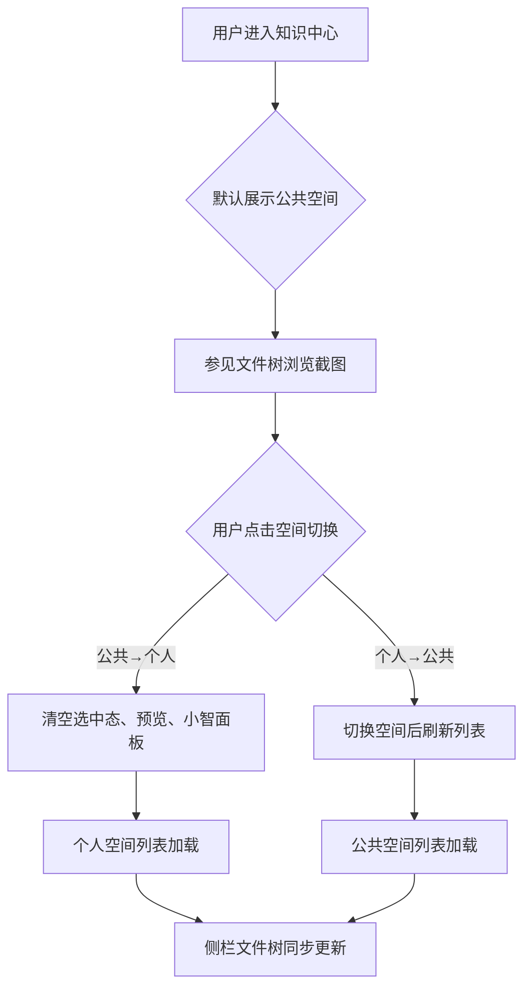
```mermaid
flowchart TD
    A["用户进入知识中心"] --> B{"默认展示公共空间"}
    B --> C["参见文件树浏览截图

"]
    C --> D{"用户点击空间切换"}
    D -->|"公共→个人"| E["清空选中态、预览、小智面板"]
    D -->|"个人→公共"| F["切换空间后刷新列表"]
    E --> G["个人空间列表加载"]
    F --> H["公共空间列表加载"]
    G --> I["侧栏文件树同步更新"]
    H --> I

```

**说明**：空间切换是一等导航行为，切换后所有上下文清空，保证数据隔离性。

##### 3.2.1.1.3 界面原型

| 操作 | 交互 | 截图/示例 |
| --- | --- | --- |
| 默认进入知识中心 | 展示空间导航栏和知识库列表 |  |
| 点击公共空间 | 切换至公共空间视图，展示知识库列表 |  |
| 点击个人空间 | 侧栏切换为个人空间，展示个人知识分组 |  |
| 切换空间后 | 选中态、预览面板和小智面板全部清空 | — |

##### 3.2.1.1.4 数据说明（业务实体）

| 字段 | 类型 | 说明 | 原型对应 |
| --- | --- | --- | --- |
| space.key | 'public' \| 'personal' | 空间标识 | `activeSpace` |
| space.label | string | 空间显示名称 | `activeSpaceLabel` |
| space.desc | string | 空间描述文案 | `spaces[].desc` |

##### 3.2.1.1.5 业务规则和约束条件

*   公共空间与个人空间数据完全隔离

*   不同用户个人空间严格隔离

*   切换空间时清空选中态、预览态和小智面板

*   默认展示全部知识库列表

##### 3.2.1.1.6 接口说明

```plaintext
GET /api/knowledge/spaces 获取空间列表及文件夹结构

```

##### 3.2.1.1.7 补充说明

无。

#### 3.2.1.2 文件树浏览

##### 3.2.1.2.1 功能需求描述

| EARS 模式 | 需求描述 |
| --- | --- |
| 普遍型 | \* 系统应以树形结构展示空间、文件夹、知识库和文件，支持展开/收起。<br>\* 系统应在文件树中区分知识库（橙色书图标）、普通文件夹（灰色文件夹图标）和文件（灰色文件图标）。<br>\*  |
| 状态驱动型 | \* 当知识库内含有子文件夹时，系统应在知识库行显示展开/收起按钮。 |
| 事件驱动型 | \* 当用户右键点击树节点时，系统应展示上下文菜单（新建知识库/文件夹/删除等）。 |
| 不良行为型 |  |

##### 3.2.1.2.2 业务主流程图及说明

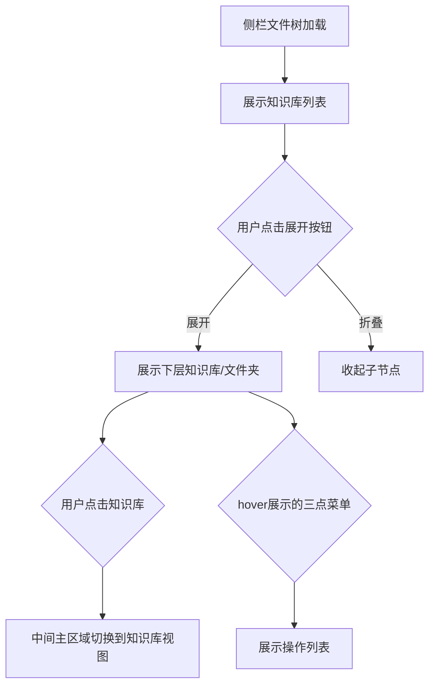
```mermaid
flowchart TD
    A["侧栏文件树加载"] --> B["展示知识库列表"]
    B --> C{"用户点击展开按钮"}
    C -->|"展开"| D["展示下层知识库/文件夹"]
    C -->|"折叠"| E["收起子节点"]
    D --> F{"用户点击知识库"}
    F --> G["中间主区域切换到知识库视图"]
    D --> H{"hover展示的三点菜单"}
    H --> I["展示操作列表"]

```

**说明**：文件树是知识中心的导航骨架，所有浏览和管理操作以此为起点。

##### 3.2.1.2.3 界面原型

| 操作 | 交互 | 截图/示例 |
| --- | --- | --- |
| 展开知识库节点 | 点击文件夹左侧▶按钮，展示下级文件和文件夹 |  |
| 折叠知识库节点 | 点击▼按钮，收起下级内容 | — |
| 点击知识库行 | 选中知识库，中间区域切换到文件列表 |  |
| 展开知识库子文件夹 | 点击▶按钮，展示树内子文件夹和文件 |  |
| 知识库行hover | 展示权限、可操作的功能 |  |
| 文件行hover | 展示权限、可操作的功能 |  |

##### 3.2.1.2.4 数据说明（业务实体）

| 字段 | 类型 | 说明 |
| --- | --- | --- |
| TreeNode.id | string | 节点ID |
| TreeNode.label | string | 节点显示名称 |
| TreeNode.type | 'folder' \| 'file' | 节点类型 |
| TreeNode.kbId | string \| undefined | 所属知识库ID |
| TreeNode.docName | string \| undefined | 文件名（type=file时） |
| TreeNode.isKnowledgeBase | boolean \| undefined | 是否为知识库根节点 |
| TreeNode.children | TreeNode\[\] \| undefined | 子节点列表 |

##### 3.2.1.2.5 业务规则和约束条件

*   文件树支持两级结构：知识库 → 子文件夹/文件

*   知识库内仅支持一级文件夹

*   同一文件只允许挂在一个位置，不能在树中重复出现

*   文件夹不支持权限设置（权限仅设置在知识库和文件层级）

##### 3.2.1.2.6 接口说明

```plaintext
GET /api/knowledge/tree?space={spaceKey} 获取文件树结构

```

##### 3.2.1.2.7 补充说明

无。

#### 3.2.1.3 知识库列表

##### 3.2.1.3.1 功能需求描述

| EARS 模式 | 需求描述 |
| --- | --- |
| 普遍型 | \* 系统应在中间主区域展示当前空间/文件夹下的知识库列表。<br>\* 系统应提供列表视图和卡片视图两种展示模式。<br>\* 系统应在知识库卡片中展示名称、文档数、可见性、归属部门、最近更新时间。 |
| 状态驱动型 | \* 当用户收藏知识库时，系统应将该知识库置顶展示在「收藏知识库」区域。<br>\* 当无收藏时，系统应隐藏收藏区域。 |
| 事件驱动型 | \* 当用户点击搜索框输入关键词时，系统应在当前空间和目录下实时筛选知识库（300ms防抖）。 |
| 不良行为型 | \* 当用户无权限访问某知识库时，系统应隐藏该知识库（不可见）。 |

##### 3.2.1.3.2 业务主流程图及说明

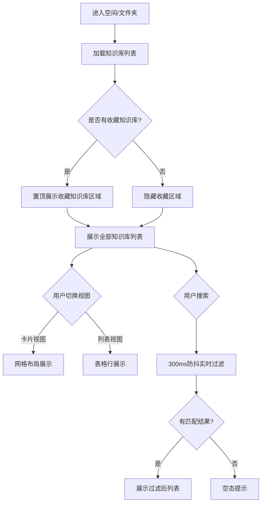
```mermaid
flowchart TD
    A["进入空间/文件夹"] --> B["加载知识库列表"]
    B --> C{"是否有收藏知识库?"}
    C -->|"是"| D["置顶展示收藏知识库区域"]
    C -->|"否"| E["隐藏收藏区域"]
    D --> F["展示全部知识库列表"]
    E --> F
    F --> G{"用户切换视图"}
    G -->|"卡片视图"| H["网格布局展示"]
    G -->|"列表视图"| I["表格行展示"]
    F --> J{"用户搜索"}
    J --> K["300ms防抖实时过滤"]
    K --> L{"有匹配结果?"}
    L -->|"是"| M["展示过滤后列表"]
    L -->|"否"| N["空态提示"]

```

**说明**：知识库列表是用户选择目标知识库的核心界面，收藏知识库优先展示以提升效率。

##### 3.2.1.3.3 界面原型

| 操作 | 交互 | 截图/示例 |
| --- | --- | --- |
| 进入知识中心 | 展示知识库列表 |  |
| 点击知识库 | 进入该知识库的文件列表 |  |
| 点击收藏知识库 | 收藏星标变黄，知识库置顶到「收藏知识库」区域 | 待补充 |
| 点击切换列表/卡片视图 | 网格布局与表格行布局互切 | 待补充 |
| 知识库搜索框输入 | 300ms防抖后实时过滤 | 待补充 |
| 无匹配结果 | 展示空态提示组件 | — |

##### 3.2.1.3.4 数据说明（业务实体）

| 字段 | 类型 | 说明 | 原型对应 |
| --- | --- | --- | --- |
| KnowledgeBaseItem.id | string | 知识库ID `id` |  |
| KnowledgeBaseItem.name | string | 知识库名称 `name` |  |
| KnowledgeBaseItem.docs | number | 文档数量 `docs` |  |
| KnowledgeBaseItem.owner | string | 所有者 `owner` |  |
| KnowledgeBaseItem.department | string | 归属部门 `department` |  |
| KnowledgeBaseItem.visibility | string | 可见性标签 `visibility` |  |
| KnowledgeBaseItem.space | SpaceKey | 所属空间 `space` |  |
| KnowledgeBaseItem.canEdit | boolean | 当前用户是否可编辑 `canEdit` |  |
| KnowledgeBaseItem.pinned | boolean \| undefined | 是否被当前用户收藏 | `pinned` |
| KnowledgeBaseItem.recent | string | 最近更新时间 `recent` |  |

##### 3.2.1.3.5 业务规则和约束条件

*   收藏知识库按收藏顺序排列，支持拖拽重新排序

*   列表视图和卡片视图的状态切换互相独立（文件/知识库各自记忆）

*   非成员用户看不到知识库的存在

*   知识库搜索仅搜索当前活跃空间和目录范围内的知识库

##### 3.2.1.3.6 接口说明

```plaintext
GET /api/knowledge/list?space={spaceKey}&folder={folderId} 获取知识库列表
PUT /api/knowledge/{kbId}/pin 收藏/取消收藏
GET /api/knowledge/search?keyword={keyword}&space={spaceKey} 搜索知识库

```

##### 3.2.1.3.7 补充说明

无。

### 3.2.2 权限与治理

权限体系是知识中心的规则基础，决定所有可见性和可操作性。角色体系前置定义后，后续所有功能模块的「能看到什么、能做什么」都能以此为依据。

#### 3.2.2.1 权限角色体系

##### 3.2.2.1.1 功能需求描述

| EARS 模式 | 需求描述 |
| --- | --- |
| 普遍型 | \* 系统应提供四级权限角色，按权限从高到低：OWNER（所有者）、MANAGER（管理员）、EDITOR（编辑者）、VIEWER（查看者）。<br>\* 系统应保证 OWNER 角色不可通过界面修改或移除。<br> |
| 状态驱动型 | \* 当成员的角色来源于父节点继承且继承角色高于目标角色时，系统应拒绝操作并提示。 |
| 事件驱动型 | \* 当操作者角色不为 MANAGER 及以上时，系统应隐藏管理入口。<br>\* 当操作者角色不为 EDITOR 及以上时，系统应隐藏上传/编辑入口。 |
| 不良行为型 | \* 当非成员用户尝试访问知识库时，系统应返回「无权限」且不可感知知识库存在。 |

##### 3.2.2.1.2 业务主流程图及说明

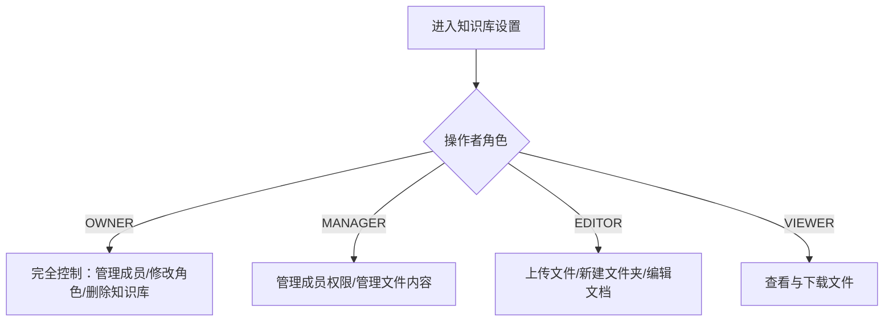
```mermaid
flowchart TD
    A["进入知识库设置"] --> B{"操作者角色"}
    B -->|"OWNER"| C["完全控制：管理成员/修改角色/删除知识库"]
    B -->|"MANAGER"| D["管理成员权限/管理文件内容"]
    B -->|"EDITOR"| E["上传文件/新建文件夹/编辑文档"]
    B -->|"VIEWER"| F["查看与下载文件"]


```

**说明**：四级角色构成知识中心的访问控制基础。角色决定操作能力。

##### 3.2.2.1.3 界面原型

| 操作 | 交互 | 截图/示例 |
| --- | --- | --- |
| 知识库行hover展示的三点菜单 →「设置」 | 打开权限管理弹窗，左侧菜单栏展示「成员授权」「文档管理」「审计记录」 | 待补充 |
| 查看成员角色 | 每个成员行展示角色下拉选择器（OWNER 不可修改） | 待补充 |

##### 3.2.2.1.4 数据说明（业务实体）

| 字段 | 类型 | 说明 |
| --- | --- | --- |
| SystemRole | 'OWNER' \| 'MANAGER' \| 'EDITOR' \| 'VIEWER' | 角色枚举 |
| PermissionEntry.id | string | 成员授权条目ID |
| PermissionEntry.name | string | 成员姓名 |
| PermissionEntry.scope | string | 授权范围（个人/部门/全员） |
| PermissionEntry.department | string | 成员所属部门 |
| PermissionEntry.role | SystemRole | 角色 |
| PermissionEntry.joinedAt | string | 加入时间 |

##### 3.2.2.1.5 业务规则和约束条件

*   仅知识库支持权限设置，文件夹和文件均不独立设置权限（全量继承知识库权限）

*   非成员用户看不到知识库的存在

*   角色变更即时生效

*   OWNER 不可通过界面修改自己的角色

*   移除成员不影响其通过其他知识库或父节点的继承权限


*   公共空间知识库：创建权限由后端配置控制（非角色决定），需要时为知识库配置成员权限
*   个人空间知识库：仅当前用户可见，无需权限管理


##### 3.2.2.1.6 接口说明

```plaintext
GET /api/knowledge/{kbId}/permissions 获取成员权限列表

```

##### 3.2.2.1.7 补充说明

**角色权限明细表**：

| 功能模块 | 操作项 | 所有者 | 管理者 | 编辑者 | 查看者 |
| --- | --- | --- | --- | --- | --- |
| 知识库管理 | 查看知识库列表、文件目录 | ✅ | ✅ | ✅ | ✅ |
| | 重命名知识库 | ✅ | ✅ | ❌ | ❌ |
| | 删除知识库（强校验：需手动输入完整名称） | ✅ | ❌ | ❌ | ❌ |
| | 收藏/取消收藏知识库 | ✅ | ✅ | ✅ | ✅ |
| 文件夹管理 | 新建一级文件夹 | ✅ | ✅ | ❌ | ❌ |
| | 重命名文件夹 | ✅ | ✅ | ❌ | ❌ |
| | 删除文件夹 | ✅ | ✅ | ❌ | ❌ |
| 文件管理 | 上传文件 | ✅ | ✅ | ✅ | ❌ |
| | 预览、查看文件原文 | ✅ | ✅ | ✅ | ✅ |
| | 删除自己上传的文件 | ✅ | ✅ | ✅ | ❌ |
| | 删除他人上传的文件 | ✅ | ✅ | ❌ | ❌ |
| 权限管理 | 增删成员、调整角色、保存配置 | ✅ | ✅ | ❌ | ❌ |
| 审计日志 | 查看、筛选审计记录 | ✅ | ✅ | ❌ | ❌ |
| 知识问答 | 单/多文件问答、溯源查看 | ✅ | ✅ | ✅ | ✅ |

**关键边界说明**：

*   所有者不可通过界面修改自己的角色，不可被移除。唯一可删除知识库的角色。

*   管理者可以管人管内容，但不能删知识库。

*   编辑者不能管理文件夹结构（文件夹仅有一级，是知识库的骨架），但可以管理自己上传的文件。

*   编辑者删除文件仅限自己上传的文件，不能删除他人上传的文件。

*   **所有权转移（预留能力）**：当所有者发生离职或岗位变动时，后端应保留知识库所有权转移的配置能力，支持由原所有者或系统管理员将知识库所有权转让给指定用户。此功能本期暂不开放前端入口，后端预留接口与配置字段。

*   EDITOR 可以管内容不能管人

*   VIEWER 只能查看和下载，不能任何编辑操作

---

<!-- 角色与安全许可矩阵已删除（评审决议：密级功能下线） -->


#### 3.2.2.2 知识库成员授权

##### 3.2.2.2.1 功能需求描述

| EARS 模式 | 需求描述 |
| --- | --- |
| 普遍型 | \* 系统应在权限设置弹窗中展示「成员授权」标签页，以表格展示当前授权成员和角色组。<br>\* 系统应支持添加（弹窗）、修改角色、移除三种管理操作。<br>\* 系统应支持三种选源：部门、角色组、人员，采用独立弹窗（左右 1:1 布局）完成添加。 |
| 状态驱动型 | \* 当左侧勾选的成员/角色组已在主表格中存在时，系统应置灰左侧选项并提示「已自动过滤 N 位已存在成员」。<br>\* 当部门作为选源时，勾选部门等于批量选择该部门下的个人，部门本身不作为成员行展示。<br>\* 当角色组作为选源时，角色组本身作为独立成员行展示在主表格中（如「👥 AI项目小组」），点击可展开查看组内人员。<br>\* 当主表格中无任何所有者时，弹窗中添加的第一个成员强制为「所有者」且不可降级。 |
| 事件驱动型 | \* 当用户修改成员角色时，系统应执行全量保存后生效并记录审计日志。<br>\* 当用户移除成员时，系统应展示二次确认弹窗。<br>\* 当用户点击「保存设置」时，系统应校验至少存在一个所有者，校验通过后全量落库生效。 |

##### 3.2.2.2.2 业务主流程图及说明

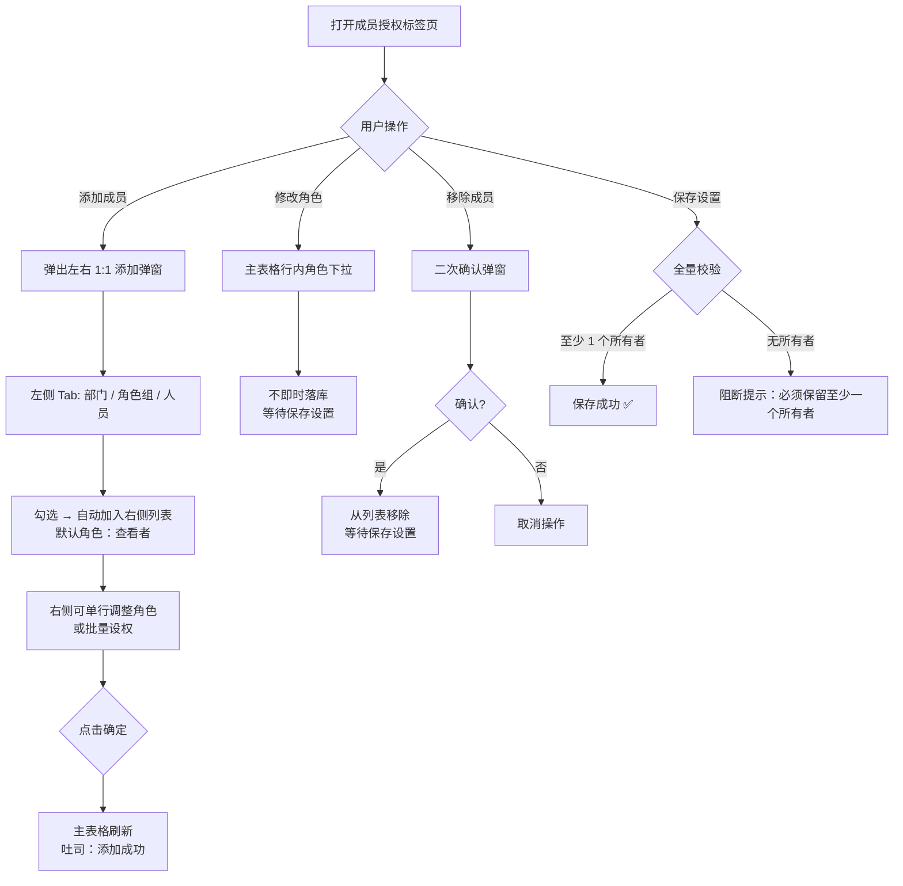
```mermaid
flowchart TD
    A["打开成员授权标签页"] --> B{"用户操作"}
    B -->|"添加成员"| C["弹出左右 1:1 添加弹窗"]
    C --> D["左侧 Tab: 部门 / 角色组 / 人员"]
    D --> E["勾选 → 自动加入右侧列表<br/>默认角色：查看者"]
    E --> F["右侧可单行调整角色<br/>或批量设权"]
    F --> G{"点击确定"}
    G --> H["主表格刷新<br/>吐司：添加成功"]
    B -->|"修改角色"| I["主表格行内角色下拉"]
    I --> J["不即时落库<br/>等待保存设置"]
    B -->|"移除成员"| K["二次确认弹窗"]
    K --> L{"确认?"}
    L -->|"是"| M["从列表移除<br/>等待保存设置"]
    L -->|"否"| N["取消操作"]
    B -->|"保存设置"| Q{"全量校验"}
    Q -->|"至少 1 个所有者"| R["保存成功 ✅"]
    Q -->|"无所有者"| S["阻断提示：必须保留至少一个所有者"]

```

**说明**：弹窗只负责添加新成员并赋初始角色，主表格负责展示与行内微调。所有变更在点击「保存设置」后全量校验并落库。

##### 3.2.2.2.3 界面原型

**主表格（成员授权列表）**：

| 操作 | 交互 | 截图/示例 |
| --- | --- | --- |
| 表头 | 成员 / 权限 / 加入时间 / 操作 | 待补充 |
| 个人成员行 | 头像 + 姓名（带部门后缀，如「朝暮-数字技术中心」） | — |
| 角色组行 | 「👥 AI项目小组(6人)」形式展示，点击展开查看组内人员 | — |
| 权限列 | 下拉选择器：所有者 / 管理者 / 编辑者 / 查看者 | — |
| 操作列 | 移除按钮（二次确认） | — |
| 顶部 | 搜索框 + 添加成员按钮 | — |
| 底部 | 取消 / 保存设置按钮 | — |

**添加成员弹窗（左右 1:1）**：

| 操作 | 交互 | 截图/示例 |
| --- | --- | --- |
| 弹窗布局 | 左侧选择区 + 右侧已选区，顶部统搜索框 | 待补充 |
| 左侧 Tab | 部门（树形勾选）、角色组（卡片勾选）、人员（字母索引列表） | — |
| 部门勾选（☑） | 全选该部门下所有个人，部门本身不加入右侧列表 | — |
| 角色组勾选 | 角色组本身加入右侧列表（如「👥 AI项目小组」） | — |
| 人员勾选 | 个人直接加入右侧列表 | — |
| 去重提示 | 主表格已有的成员在左侧置灰不可选，右下角提示「已自动过滤 N 位已存在成员」 | — |
| 右侧列表 | 每项：类型图标 + 名称 + 角色下拉 + 移除 | — |
| 批量设权 | 右侧顶部下拉，一键设置右侧所有成员角色 | — |

##### 3.2.2.2.4 数据说明（业务实体）

| 字段 | 类型 | 说明 |
| --- | --- | --- |
| PermissionEntry.type | 'user'\|'roleGroup' | 成员类型：个人或角色组 |
| PermissionEntry.roleGroupId | string\|undefined | 角色组 ID（type=roleGroup 时） |

##### 3.2.2.2.5 业务规则和约束条件

*   弹窗单次添加成员最多 30 个（通过勾选部门批量添加时，成员总数受此限制）

*   同一成员在同一节点只能拥有一个角色

*   已存在的成员在主表格中不可重复添加（弹窗自动去重）

*   部门作为选源时只展开为个人，部门本身不作为成员行

*   角色组作为独立成员行展示，支持展开查看组内人员

*   知识库必须至少保留一个所有者；试图移除或降级唯一所有者时系统阻断提示

*   弹窗关闭（点击确定）仅刷新主表格展示，不落库；点击「保存设置」后全量校验生效

*   **权限取高原则**：同一人员通过多种途径（如被单独添加、所属角色组）获得多个角色时，最终权限按**最高角色**继承。例如：某人既被单独添加为「查看者」，又属于「AI项目小组」（该角色组被授予「管理者」），则其最终生效角色为「管理者」。

##### 3.2.2.2.6 接口说明

```plaintext
POST /api/knowledge/{kbId}/permission/add 添加成员（弹窗确定）
PUT /api/knowledge/{kbId}/permission/save 全量保存设置（保存设置按钮）
DELETE /api/knowledge/{kbId}/permission/remove 移除成员

```

##### 3.2.2.2.7 补充说明

**成员授权主界面（ASCII）**：

```text
+===============================================================+
|            方案中心案例库 > 成员授权                              |
|  [ Q 搜索成员 ]          [ + 添加成员 ]                         |
+================================================================+
|  成员                | 权限      | 加入时间    | 操作            |
| -------------------- | --------- | ---------- | --------------- |
| 👤 朝暮-数字技术中心  | 所有者 ▼  | 2026-07-06 | [ 移除 ]        |
| 👥 AI项目小组(6人)   | 管理者 ▼  | 2026-07-06 | [ 移除 ]        |
| 👤 拾遗-数字技术中心  | 编辑者 ▼ | 2026-07-06 | [ 移除 ]        |
+================================================================+
|  ⚠️ 必须保留至少一个所有者                      保 存 设 置    |
+===============================================================+
```

**添加成员弹窗逻辑**：弹窗采用左右 1:1 布局，左侧三个 Tab（部门/角色组/人员）选择来源，右侧展示已选成员，点击确定后回填至主表格。

**权限取高原则示例**：

| 场景 | 单独添加的角色 | 所属角色组的角色 | 最终生效角色 |
|------|--------------|----------------|------------|
| 场景一 | 查看者 | 管理者（角色组「AI项目小组」） | **管理者** |
| 场景二 | 管理者 | — | **管理者** |
| 场景三 | — | 编辑者（角色组「方案攻坚组」） | **编辑者** |
| 场景四 | 所有者 | 查看者（角色组「围观组」） | **所有者** |

> 核心逻辑：权限就高不就低，取用户在所有途径中的最高角色。

<!-- 3.2.2.3 文件级权限已删除（评审决议：取消文件级独立权限，全量继承知识库权限） -->

<!-- 3.2.2.4 密级控制已删除（评审决议：密级功能下线，前端无展示，后端留字段） -->

#### 3.2.2.3 审计日志

##### 3.2.2.3.1 功能需求描述

| EARS 模式 | 需求描述 |
| --- | --- |
| 普遍型 | \* 系统应全链路记录上传、删除、检索、问答、权限变更等关键操作。<br>\* 每条日志应记录 user\_id、action、target、timestamp、ip、user\_agent、result。<br>\* 系统应采用 WORM 存储（不可篡改），保留 ≥180 天。 |
| 状态驱动型 | \* 当问答命中敏感词时，系统应标记日志 `is_sensitive=true`。 |
| 事件驱动型 | \* 当用户在权限设置中点击「审计记录」标签页时，系统应展示过滤后的审计日志列表。 |

##### 3.2.2.3.2 业务主流程图及说明

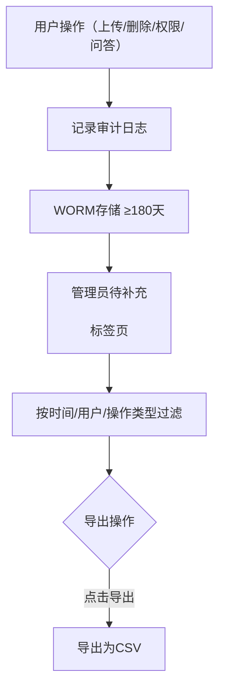
```mermaid
flowchart TD
    A["用户操作（上传/删除/权限/问答）"] --> B["记录审计日志"]
    B --> C["WORM存储 ≥180天"]
    C --> D["管理员待补充

标签页"]
    D --> E["按时间/用户/操作类型过滤"]
    E --> F{"导出操作"}
    F -->|"点击导出"| G["导出为CSV"]

```

**说明**：审计日志是安全合规的基础要求，所有涉及数据流转的操作均需记录。

##### 3.2.2.3.3 界面原型

| 操作 | 交互 | 截图/示例 |
| --- | --- | --- |
| 进入审计记录 | 展示日志列表，每行包含用户、操作、时间、敏感标记 | 待补充 |
| 按类型/用户/时间过滤 | 条件筛选实时刷新列表 | — |
| 导出日志 | 点击导出按钮输出CSV | — |

##### 3.2.2.3.4 数据说明（业务实体）

| 字段 | 类型 | 说明 |
| --- | --- | --- |
| AuditLog.user | string | 操作用户 |
| AuditLog.action | string | 操作描述 |
| AuditLog.time | string | 操作时间 |
| AuditLog.ip | string | 来源IP |
| AuditLog.result | string | 操作结果 |
| AuditLog.sensitive | boolean | 是否敏感操作 |

##### 3.2.2.3.5 业务规则和约束条件

*   敏感问答标记 `is_sensitive=true`

*   答案可完整追溯至源文档 chunk

*   日志 WORM 存储，不可删除或篡改

##### 3.2.2.3.6 接口说明

```plaintext
GET /api/knowledge/{kbId}/audit-logs 获取审计日志
POST /api/knowledge/audit-logs/export 导出审计日志

```

##### 3.2.2.3.7 补充说明

无。

### 3.2.3 知识库与文件夹管理

本节定义知识库和文件夹的增删改操作，涵盖新建、重命名、删除及其权限约束。

#### 3.2.3.1 新建/重命名/删除知识库

##### 3.2.3.1.1 功能需求描述

| EARS 模式 | 需求描述 |
| --- | --- |
| 普遍型 | \* 系统应在创建知识库时校验名称长度不超过64字符，不含特殊字符 `/\:*?"<>\|`。<br>\* 系统应在名称与同空间已有知识库重复时返回409，错误码 `KB_NAME_EXISTS`。<br>\* 系统应自动判断当前节点所在空间，默认选中该空间为创建目标。 |
| 状态驱动型 | \* 当用户在知识库内点击新建知识库时，系统应拦截（知识库下不可建子知识库）。<br>\* 当用户无编辑权限时，系统应隐藏删除按钮。 |
| 事件驱动型 | \* 当用户点击创建按钮时，系统应校验名称后执行创建。<br>\* 当用户点击重命名按钮时，系统应进入行内编辑模式。<br>\* 当用户删除知识库时，系统应移入回收站。 |
| 不良行为型 | \* 返回400，错误码 `INVALID_NAME`，Toast 提示名称格式错误。 |

##### 3.2.3.1.2 业务主流程图及说明

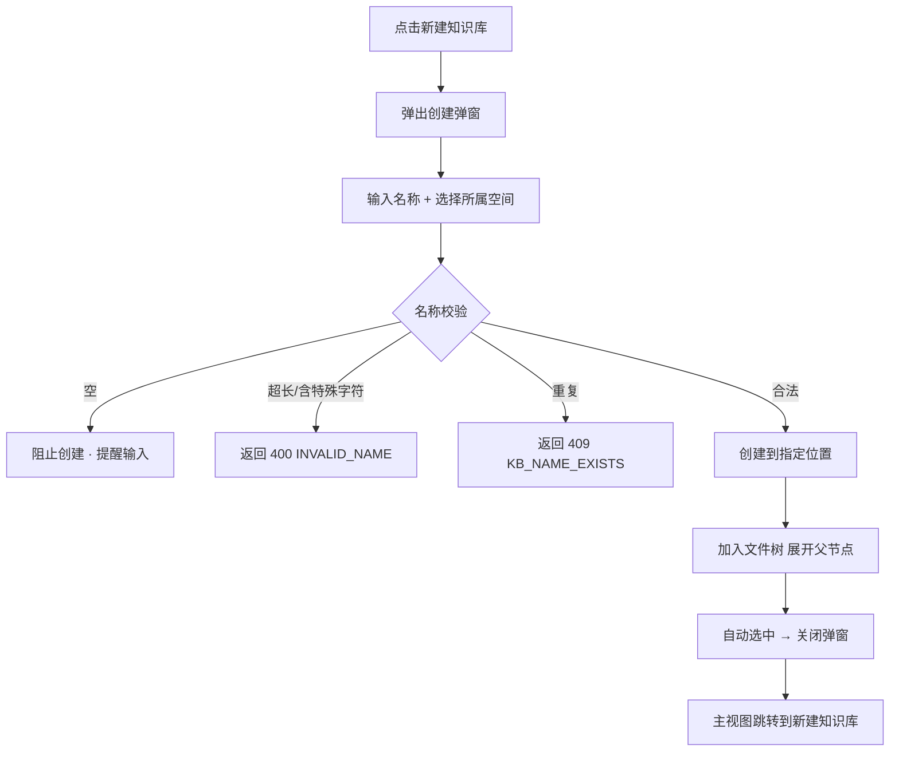
```mermaid
flowchart TD
    A["点击新建知识库"] --> B["弹出创建弹窗"]
    B --> C["输入名称 + 选择所属空间"]
    C --> D{"名称校验"}
    D -->|"空"| E["阻止创建 · 提醒输入"]
    D -->|"超长/含特殊字符"| F["返回 400 INVALID_NAME"]
    D -->|"重复"| G["返回 409 KB_NAME_EXISTS"]
    D -->|"合法"| H["创建到指定位置"]
    H --> I["加入文件树 展开父节点"]
    I --> J["自动选中 → 关闭弹窗"]
    J --> K["主视图跳转到新建知识库"]

```

**说明**：知识库创建时自动判断当前所在空间，默认选中；创建后自动进入该知识库的文件列表视图，形成「创建即进入」的流畅体验。

##### 3.2.3.1.3 界面原型

| 操作 | 交互 | 截图/示例 |
| --- | --- | --- |
| 点击侧栏「新建知识库」按钮 | 弹出新建知识库弹窗 | 待补充 |
| 知识库名称输入 | 输入框实时校验 | — |
| 点击重命名知识库 | 知识库名称变为行内编辑框 | — |
| 删除知识库 | 移入回收站，Toast 提示「已删除，可在回收站找回」 | — |
| 在知识库内点击新建知识库 | Toast 提示「知识库内只能新建文件夹」 | — |

##### 3.2.3.1.4 数据说明（业务实体）

| 字段 | 类型 | 说明 | 原型对应 |
| --- | --- | --- | --- |
| KnowledgeBaseItem.id | string | 知识库ID `id` |  |
| KnowledgeBaseItem.name | string | 知识库名称 `name` |  |
| KnowledgeBaseItem.space | SpaceKey | 所属空间 `space` |  |
| KnowledgeBaseItem.visibility | string | 可见性标签 `visibility` |  |
| KnowledgeBaseItem.canEdit | boolean | 当前用户是否可编辑 `canEdit` |  |

##### 3.2.3.1.5 业务规则和约束条件

*   名称超长（≥64字符）截断

*   名称不能包含特殊字符 `/\:*?"<>\|`

*   名称不可与同空间已有知识库重复

*   only EDITOR 及以上角色可修改知识库

*   只有所有者角色可删除知识库

*   删除知识库后连带删除其下所有文档和文件夹

##### 3.2.3.1.6 接口说明

```plaintext
POST /api/knowledge/create 新建知识库
PUT /api/knowledge/{kbId} 重命名知识库
DELETE /api/knowledge/{kbId} 删除知识库

```

##### 3.2.3.1.7 补充说明

无。

#### 3.2.3.2 新建/重命名/删除文件夹

##### 3.2.3.2.1 功能需求描述

| EARS 模式 | 需求描述 |
| --- | --- |
| 普遍型 | \* 系统应支持在知识库下创建一级文件夹，文件夹仅支持一级深度，不支持嵌套子文件夹。<br>\* 系统应校验文件夹名称不超过64字符，不含特殊字符。 |
| 事件驱动型 | \* 当用户点击「新建文件夹」时，系统应自动判断当前所在知识库节点，默认作为父位置。<br>\* 当用户点击删除文件夹时，系统应递归删除所有子文档和子文件夹。<br>\* 当用户点击重命名时，系统应进入行内编辑模式。 |
| 不良行为型 | \* 当名称输入为空时，系统应阻止创建并 Toast 提示「请输入文件夹名称」。<br>\* 当所属位置已删除时，系统应提示「所属位置异常」并关闭弹窗。 |

##### 3.2.3.2.2 业务主流程图及说明

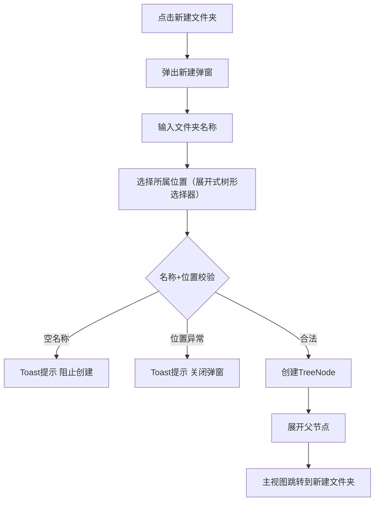
```mermaid
flowchart TD
    A["点击新建文件夹"] --> B["弹出新建弹窗"]
    B --> C["输入文件夹名称"]
    C --> D["选择所属位置（展开式树形选择器）"]
    D --> E{"名称+位置校验"}
    E -->|"空名称"| F["Toast提示 阻止创建"]
    E -->|"位置异常"| G["Toast提示 关闭弹窗"]
    E -->|"合法"| H["创建TreeNode"]
    H --> I["展开父节点"]
    I --> J["主视图跳转到新建文件夹"]

```

**说明**：新建文件夹时自动判断当前所在节点（知识库或文件夹），默认作为父位置。文件夹仅支持在知识库下创建一级深度。

##### 3.2.3.2.3 界面原型

| 操作 | 交互 | 截图/示例 |
| --- | --- | --- |
| 点击「新建文件夹」按钮 | 待补充 |  |
| 名称输入为空 | 阻止创建 · Toast 提示「请输入文件夹名称」 | — |
| 选择目标知识库和内部文件夹路径（树形选择器） | 待补充 |  |
| 点击重命名文件夹 | 文件夹名称变为行内编辑框，回车确认 | — |
| 删除文件夹 | 递归删除所有子文档和子文件夹 | — |

##### 3.2.3.2.4 数据说明（业务实体）

| 字段 | 类型 | 说明 |
| --- | --- | --- |
| TreeNode.id | string | 文件夹ID |
| TreeNode.label | string | 文件夹名称 |
| TreeNode.type | 'folder' \| 'file' | 节点类型 |
| TreeNode.kbId | string \| undefined | 所属知识库ID |
| TreeNode.children | TreeNode\[\] | 子节点 |

##### 3.2.3.2.5 业务规则和约束条件

*   对于有权限的用户，允许在根空间、知识库、文件夹中新建文件夹

*   文件夹名称≤64字符，不含特殊字符

*    `` 

*   文件夹删除是递归操作，其下所有子节点一并移入回收站

##### 3.2.3.2.6 接口说明

```plaintext
POST /api/knowledge/{kbId}/folder 新建文件夹
PUT /api/knowledge/{kbId}/folder/{folderId} 重命名文件夹
DELETE /api/knowledge/{kbId}/folder/{folderId} 删除文件夹

```

##### 3.2.3.2.7 补充说明

无。

### 3.2.4 文件全生命周期

本节覆盖文件在知识中心中的完整生命周期：上传、搜索、预览、删除。

#### 3.2.4.1 文件上传

##### 3.2.4.1.1 功能需求描述（前端校验）

| EARS 模式 | 需求描述 |
| --- | --- |
| 普遍型 | \* 系统应在上传弹窗中提供文件选择区域，点击「选择文件」按钮唤起文件选择器。<br>\* 系统应支持 PDF、DOC、DOCX、XLS、XLSX、TXT、MD、CSV格式，单文件 100MB 内。<br>\* 系统应允许单次选择不限数量文件，前端不限制选择数量。后端每次处理最多10个文件（队列管理），其余文件排队等待。 |
| 事件驱动型 | \* 当文件格式不符合要求时，系统应拦截该文件并提示原因。<br>\* 当文件0字节时，系统应拦截并提示「空文件」。<br>\* 前台上传任务最多5个并发，其余文件显示排队状态，上传完成后自动补充。<br>\* 当批次总大小超过2GB时，系统应提示分批上传。 |
| 不良行为型 | \* 当未进入知识库就点击上传时，系统应提示「请先进入具体知识库后再上传文件」。 |

##### 3.2.4.1.2 界面原型（服务端流转与状态定义）

| EARS 模式 | 需求描述 |
| --- | --- |
| 普遍型 | \* 系统应采用纯状态标识设计，不展示进度条。<br>\* 系统应支持5种状态：uploading（上传中）、processing（处理中）、done（已完成）、upload_failed（上传失败）、process_failed（处理失败）。<br>\* 系统应在文件上传提交后，在页面右下角展示浮层任务列表，最多同时展示4个任务。 |
| 状态驱动型 | <br>\* 当上传状态为「处理失败」时，系统应支持重新执行（最多2次指数退避）。<br> |
| 不良行为型 | \* 格式伪装（魔数不匹配）→ upload\_failed。<br>\* 加密文件 → process\_failed。<br>\* SHA256 命中已有 → 秒传完成（内容完全相同的文件）。同名不同内容的文件走序号共存策略。<br>\* 同名文件处理规则：同一知识库内检测到同名文件时，自动追加序号 (1)、(2) 以区分，不覆盖旧文件。 |

**上传服务端流程**：

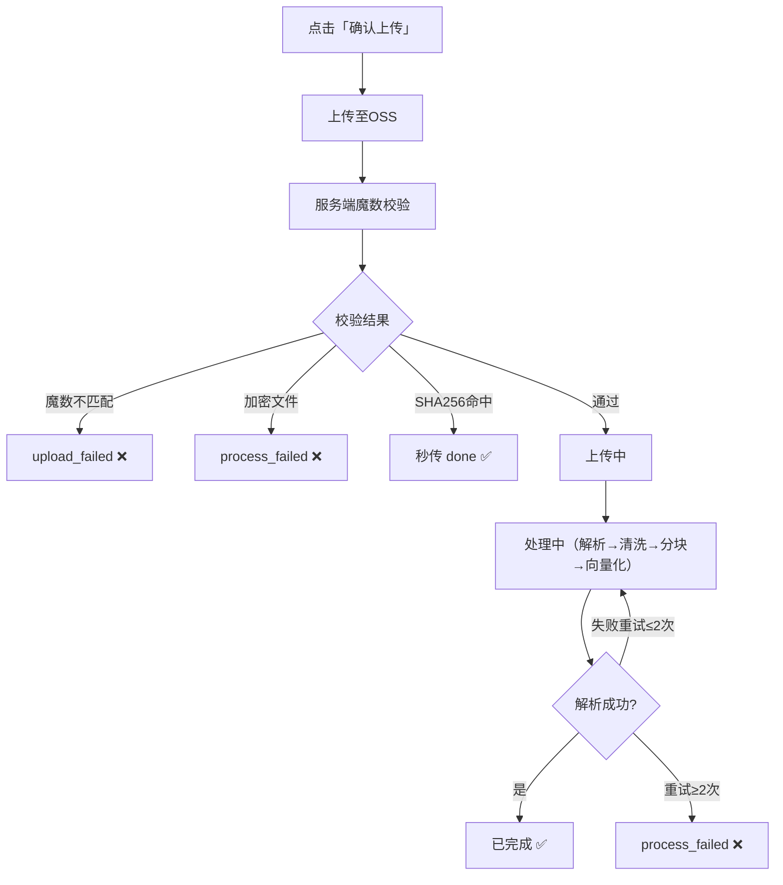
```mermaid
flowchart TD
    A["点击「确认上传」"] --> B["上传至OSS"]
    B --> C["服务端魔数校验"]
    C --> D{"校验结果"}
    D -->|"魔数不匹配"| E["upload_failed ❌"]
    D -->|"加密文件"| F["process_failed ❌"]
    D -->|"SHA256命中"| G["秒传 done ✅"]
    D -->|"通过"| H["上传中"]
    H --> I["处理中（解析→清洗→分块→向量化）"]
    I --> J{"解析成功?"}
    J -->|"是"| K["已完成 ✅"]
    J -->|"失败重试≤2次"| I
    J -->|"重试≥2次"| L["process_failed ❌"]

```

**上传前置校验流程**：

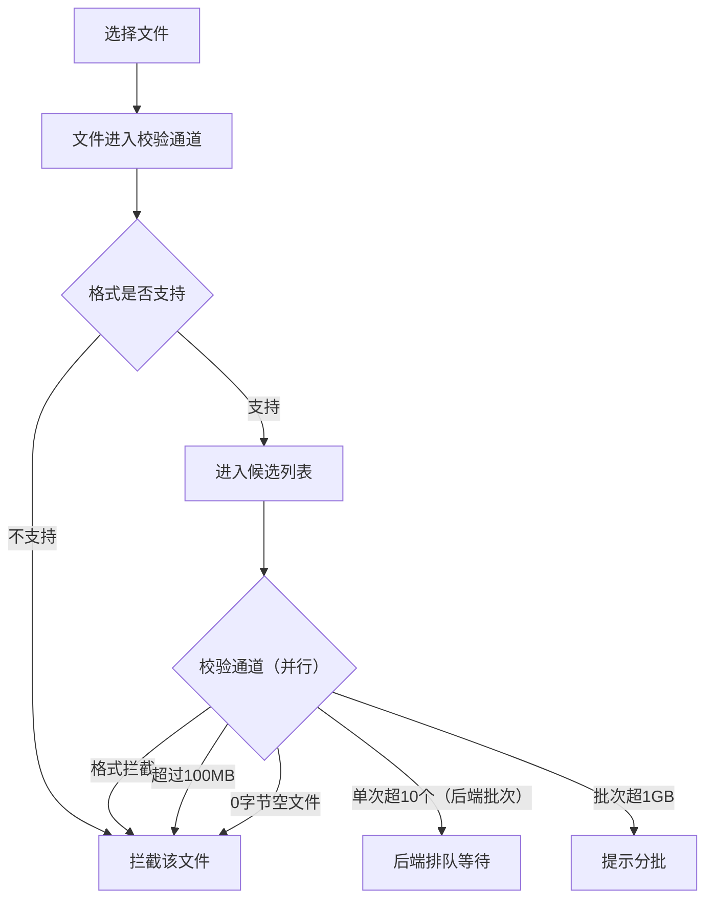
```mermaid
flowchart TD
    A["选择文件"] --> B["文件进入校验通道"]
    B --> C{"格式是否支持"}
    C -->|"不支持"| D["拦截该文件"]
    C -->|"支持"| E["进入候选列表"]
    E --> F{"校验通道（并行）"}
    F -->|"格式拦截"| D
    F -->|"超过100MB"| D
    F -->|"0字节空文件"| D
    F -->|"单次超10个（后端批次）"| G["后端排队等待"]
    F -->|"批次超1GB"| H["提示分批"]

```

##### 3.2.4.1.4 数据说明（业务实体）

| 字段 | 类型 | 说明 | 原型对应 |
| --- | --- | --- | --- |
| UploadCandidate.name | string | 上传候选文件名 `name` |  |
| UploadCandidate.format | string | 格式后缀 `format` |  |
| UploadTask.id | string | 任务ID `id` |  |
| UploadTask.name | string | 文件名 `name` |  |
| UploadTaskStatus | 'uploading' | 'processing' | 'done' | 'upload_failed' | 'process_failed' | 状态枚举 |
| UploadTask.progress | number | 进度百分比 `progress` |  |
| DocItem.tags | string\[\] \| undefined | 文件标签列表 | `tags` |
##### 3.2.4.1.5 业务规则和约束条件

*   

*   

*   

*   文件解析：PDF（PyMuPDF）、Word/DOC（python-docx）、XLS/XLSX（openpyxl）、CSV（csv标准库）、TXT（chardet）、MD（自定义解析）

*   文件去重：SHA256 检测，命中则秒传

*   最新上传优先展示列表

*   上传前前端校验，不进传输流程

*   同名文件规则：同一知识库内同名自动追加序号 (1)、(2)，不覆盖

##### 3.2.4.1.6 接口说明

```plaintext
POST /api/knowledge/upload 提交上传
GET /api/knowledge/upload/status?taskId={id} 查询上传状态
POST /api/knowledge/upload/retry 重新上传
POST /api/knowledge/upload/cancel 取消上传
POST /api/knowledge/upload/reprocess 强制重新处理
POST /api/knowledge/upload/dedup-check 文件去重检测（SHA256）

```

##### 3.2.4.1.7 补充说明

###### 安全检测

**病毒扫描**：上传至 OSS 后触发云安全服务扫描，阳性直接删除并记录安全日志。

**敏感词检测（上传文件）**：后端解析环节统一执行。采用 AC 自动机（Aho-Corasick）算法，将所有敏感词构建为 Trie 树，扫描文本一遍完成所有匹配，词库量不影响扫描速度。命中敏感词的文件标记为 process_failed（复用处理失败状态），不入库不索引。敏感词词库来源：基础词库采用开源项目（Sensitive-lexicon 等），覆盖涉政、色情、暴恐、广告等类别，后端内置随版本更新。二期支持运营后台自定义词库和豁免白名单管理。

**PII 检测**（二期增强）：解析文本后扫描身份证号、手机号、银行卡号等敏感信息，匹配 PII 的文件标记 `contains_pii=true`。

**格式伪装与加密检测**：

*   上传前前端校验，不进传输流程

*   上传中服务端魔数校验，识别伪装格式

*   加密文件标记 process\_failed

*   单文件最大100MB，后端单次处理最多10个文件

*   同名文件规则：同一知识库内同名自动追加序号 (1)、(2)，不覆盖，通过 SHA256 检测去重

*   解析失败自动重试2次（指数退避），超过则 process\_failed\_permanent

###### 文件清洗规则

**格式归一**：所有文档统一解析为结构化纯文本，保留标题、段落、表格基础结构。PDF依赖OCR（PyMuPDF）提取文本。

**冗余清洗**：自动过滤空白页、页眉页脚、水印、无效重复内容、乱码字符、无意义符号。

**编码统一**：全部转 UTF-8，杜绝解析乱码。

**无效文件过滤**：无有效文本内容的文件不进入向量化流程。

###### 向量化切块规则

**基础参数**：单块默认 512 token，块间 10% 重叠（约51 tokens），避免上下文断裂。

**分格式切块策略**：
- MD/TXT：优先按 H1/H2/H3 标题层级切块，超阈值再按固定 token 拆分
- PDF：按「页 + 段落」组合切块，长页面按段落拆分，保留页码溯源信息
- XLS/XLSX/CSV：按「表头 + 数据行」切块，每块保留表头语义，保证数据完整

**元数据挂载**：所有切块绑定以下字段用于权限过滤与问答溯源：
- fileName：源文件名
- kbId：所属知识库 ID
- space：所属空间
- pageNumber：页码（PDF 适用）
- paragraphIndex：段落序号
- uploader：上传者
- uploadedAt：上传时间

###### 异步消息队列处理

```plaintext
上传 → OSS存储 → 异步入队(topic:file_parse) → Worker池
├── pdf_worker: PyMuPDF逐页提取，书签→标题层级映射
├── docx_worker: python-docx提取，保留排版，层级→Markdown
├── xlsx_worker: openpyxl读取，表头+数据行结构保留
├── csv_worker: csv标准库读取，行结构保留
├── txt_worker: chardet编码探测，UTF-8/GBK/GB2312/ISO-8859-1
└── md_worker: 标题→分块边界，代码块整体保留
    → 清洗（HTML标签移除、多余空白压缩、Base64图片剥离）
    → 分块（滑动窗口 512tokens / overlap 10%）
    → 向量化（Embedding API）
    → 写入向量库

```

#### 3.2.4.2 文件搜索

##### 3.2.4.2.1 功能需求描述

| EARS 模式 | 需求描述 |
| --- | --- |
| 普遍型 | \* 系统应在主栏头部展示搜索框。未选中知识库时搜索知识库名称；选中知识库时搜索文件名。<br>\* 搜索应匹配文件名和文件夹名，300ms防抖后实时过滤。 |
| 状态驱动型 | \* 当无匹配结果时，系统应展示空态提示（EmptyState组件）。 |
| 事件驱动型 | \* 当用户在文件搜索框输入关键词时，系统应实时过滤文件列表/卡片。 |

##### 3.2.4.2.2 业务主流程图及说明

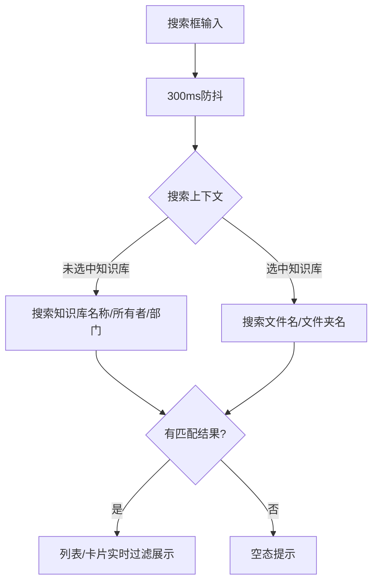
```mermaid
flowchart TD
    A["搜索框输入"] --> B["300ms防抖"]
    B --> C{"搜索上下文"}
    C -->|"未选中知识库"| D["搜索知识库名称/所有者/部门"]
    C -->|"选中知识库"| E["搜索文件名/文件夹名"]
    D --> F{"有匹配结果?"}
    E --> F
    F -->|"是"| G["列表/卡片实时过滤展示"]
    F -->|"否"| H["空态提示"]

```

**说明**：搜索框的搜索上下文的差异化处理。

##### 3.2.4.2.3 界面原型

| 操作 | 交互 | 截图/示例 |
| --- | --- | --- |
| 在搜索框输入关键词 | 300ms防抖后触发实时过滤 | 待补充 |
| 搜索匹配 | 匹配文件名和文件夹名，列表/卡片实时过滤展示 | — |
| 无匹配结果 | 展示空态提示（EmptyState组件） | — |

##### 3.2.4.2.4 数据说明（业务实体）

| 字段 | 类型 | 说明 |
| --- | --- | --- |
| SearchQuery.keyword | string | 搜索关键词 |
| SearchQuery.space | 'public' \| 'personal' | 搜索范围空间 |

##### 3.2.4.2.5 业务规则和约束条件

*   搜索词中的空格按 `AND` 逻辑处理，多个关键词匹配全部片段

*   搜索匹配知识库名、文件夹名和文件名（仅元数据检索）

*   搜索不到时不展示完整列表，而是展示空态组件

*   选中知识库时搜索框自动切换到文件搜索模式，placeholder 显示「搜索文件...」；未选中时显示「搜索知识库...」

##### 3.2.4.2.6 接口说明

文件搜索为前端过滤，无需后端接口。知识库搜索：

```plaintext
GET /api/knowledge/search?keyword={keyword}&space={spaceKey}

```

##### 3.2.4.2.7 补充说明

无。

#### 3.2.4.3 文件预览

##### 3.2.4.3.1 功能需求描述

| EARS 模式 | 需求描述 |
| --- | --- |
| 普遍型 | \* 系统应支持在右侧预览面板中预览文件，支持多标签切换（最多5个文件同时打开）。<br>\* 系统应在预览面板展示文件大纲导航，支持点击跳转到对应章节。<br>\* 系统应展示文件元信息：文件名、格式、更新时间、上传者。 |
| 状态驱动型 | \* 当预览文件超过5个时，系统应 Toast 提示「最多支持5个文件」。<br>\* 当只剩一个预览标签时，系统应隐藏标签栏。<br>\* 当被预览的文件被删除时，系统应自动关闭该文件的预览。 |
| 事件驱动型 | \* 当用户点击文件名时，系统应将文件加入预览标签并打开小智问答面板。<br>\* 当用户点击大纲项时，系统应按章节跳转。<br>\* 当用户点击引用链接时，系统应高亮对应大纲章节。 |
| 不良行为型 | \* 引用来源找不到文件时按精确匹配→部分匹配→无操作降级。 |

##### 3.2.4.3.2 业务主流程图及说明

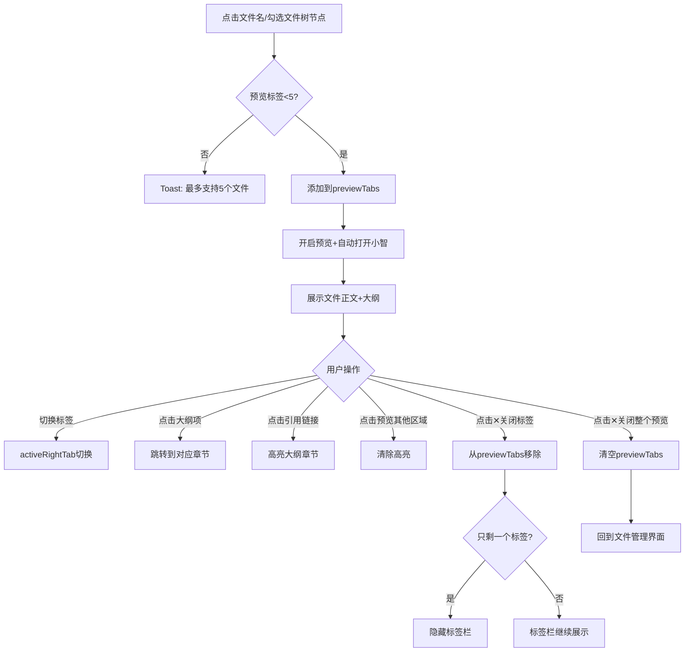
```mermaid
flowchart TD
    A["点击文件名/勾选文件树节点"] --> B{"预览标签<5?"}
    B -->|"否"| C["Toast: 最多支持5个文件"]
    B -->|"是"| D["添加到previewTabs"]
    D --> E["开启预览+自动打开小智"]
    E --> F["展示文件正文+大纲"]
    F --> G{"用户操作"}
    G -->|"切换标签"| H["activeRightTab切换"]
    G -->|"点击大纲项"| I["跳转到对应章节"]
    G -->|"点击引用链接"| J["高亮大纲章节"]
    G -->|"点击预览其他区域"| J_clear["清除高亮"]
    G -->|"点击✕关闭标签"| K["从previewTabs移除"]
    K --> L{"只剩一个标签?"}
    L -->|"是"| M["隐藏标签栏"]
    L -->|"否"| N["标签栏继续展示"]
    G -->|"点击✕关闭整个预览"| O["清空previewTabs"]
    O --> P["回到文件管理界面"]

```

**说明**：文件预览与知识库问答深度联动，点击文件自动打开小智面板。

##### 3.2.4.3.3 界面原型

| 操作 | 交互 | 截图/示例 |
| --- | --- | --- |
| 右侧打开预览面板 + Tags栏，小智面板同步打开 | 待补充 |  |
| 文件正文跳转到对应章节位置 | 待补充 |  |
| 点击✕关闭单个标签 | 从previewTabs移除该文件 | — |
| 点击✕关闭整个预览 | 清空所有预览标签 | — |
| 高亮大纲项 | 高亮对应章节，点击预览其他区域后清除 | — |

##### 3.2.4.3.4 数据说明（业务实体）

| 字段 | 类型 | 说明 |
| --- | --- | --- |
| DocItem.name | string | 文件名 |
| DocItem.format | string | 格式（PDF/DOC/DOCX/XLS/XLSX/TXT/MD/CSV等） |
| DocItem.status | string | 索引状态 |
| DocItem.updatedAt | string | 更新时间 |
| DocItem.uploadedBy | string | 上传者 |

##### 3.2.4.3.5 业务规则和约束条件

*   左下三栏（文件列表+预览+小智）同时展开时，预览面板支持拖拽调整宽度，范围 360px～560px
*   小智问答面板支持拖拽调整宽度，范围 320px～540px
*   预览面板和小智面板之间展示拖拽手柄（resizable handle），hover 时高亮
*   拖拽行为由前端 CSS Resize 事件驱动，无需后端接口

*   预览Tab最多5个，超出提示

*   预览Tab最多5个，超出提示

* 支持在文件树勾选多个文件统一加入预览Tab

* 勾选的文件作为问答上下文，支持多文件批量问答

*   删除正在预览的文件自动关闭预览

*   引用来源找不到文件时按精确匹配→部分匹配→无操作降级

##### 3.2.4.3.6 接口说明

```plaintext
GET /api/knowledge/file/{fileId}/preview 获取文件预览内容

```

##### 3.2.4.3.7 补充说明

无。

#### 3.2.4.4 文件删除

##### 3.2.4.4.1 功能需求描述

| EARS 模式 | 需求描述 |
| --- | --- |
| 普遍型 | \* 系统应支持单个文件删除和批量删除。<br>\* 系统应在删除时从 allDocs 移除，关闭预览（如正在预览），并移入回收站。 |
| 事件驱动型 | \* 当用户点击文件删除按钮（或右键删除）时，系统应执行删除流程。<br>\* 当用户勾选多个文件后点击批量删除时，系统应 Toast「已删除N个文件，可在回收站找回」。<br>\* 当用户点击表头复选框时，系统应全部选中或取消全部选中。 |

##### 3.2.4.4.2 业务主流程图及说明

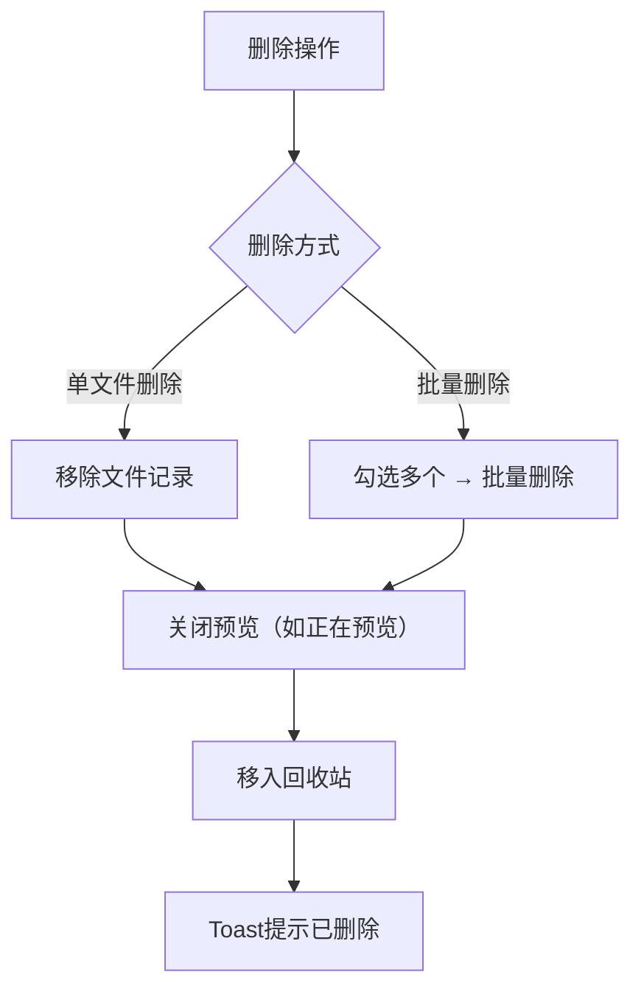
```mermaid
flowchart TD
    A["删除操作"] --> B{"删除方式"}
    B -->|"单文件删除"| C["移除文件记录"]
    B -->|"批量删除"| D["勾选多个 → 批量删除"]
    C --> E["关闭预览（如正在预览）"]
    D --> E
    E --> F["移入回收站"]
    F --> G["Toast提示已删除"]

```

**说明**：删除操作不可逆，统一移入回收站而非物理删除，30天内可恢复。

##### 3.2.4.4.3 界面原型

| 操作 | 交互 | 截图/示例 |
| --- | --- | --- |
| 文件行点击删除 | 直接删除，无二次确认，Toast提示已删除 | — |
| 勾选多个文件 → 批量删除 | 顶部出现已选N项操作栏，点击「删除」执行 | — |
| 表头复选框全选 | 全部选中或取消全部选中 | — |

##### 3.2.4.4.4 数据说明（业务实体）

复用 DocItem 实体（见3.2.4.3.4）。

##### 3.2.4.4.5 业务规则和约束条件

*   删除即进入回收站（软删除），不物理删除

*   批量删除上限同批次选择上限

*   正在预览的文件被删除时自动关闭预览标签

##### 3.2.4.4.6 接口说明

```plaintext
DELETE /api/knowledge/{kbId}/file/{fileId} 删除单个文件
POST /api/knowledge/{kbId}/file/batch-delete 批量删除文件

```

##### 3.2.4.4.7 补充说明

无。

<!-- 3.2.4.5 回收站已删除（评审决议：全部软删除，砍掉回收站恢复能力，后端管理员可物理删除） -->

### 3.2.5 知识库问答

知识库问答是知识中心的核心价值功能。小智助手基于当前选中的知识库和已打开的文件，提供纯聊天式问答能力，支持溯源引用与多文件批量问答。

#### 3.2.5.1 小智问答

##### 3.2.5.1.1 功能需求描述

| EARS 模式 | 需求描述 |
| --- | --- |
| 普遍型 | \* 系统应在右侧面板提供「小智」问答助手，基于当前知识库和已打开文件回答问题。<br>\* 系统应支持纯聊天问答模式，支持溯源引用与多文件批量问答。<br>\* 系统应在回答中展示「溯源引用」，可点击跳转到源文档。<br>\* 系统应保留最近5轮对话上下文。 |
| 状态驱动型 | \* 当检索无结果时，系统应拒答「知识库中未找到相关信息」。<br>\* 当最高分低于拒答阈值时，系统应拒答不调用LLM。<br>\* 当无独立会话管理时，所有历史会话统一由主对话侧栏管理。 |
| 事件驱动型 | \* 当用户输入问题时，系统应经过安全检测（大模型原生风控 / Prompt注入模式匹配）后执行RAG检索。<br>\* 当LLM调用超时>30s时，系统应提示超时并建议重试。<br>\* 当用户点击发送按钮（或Enter键）时，系统应发送问题，Enter发送 / Shift+Enter换行。 |
| 不良行为型 | \* 命中敏感词时拒绝回答并记录审计日志（此处的敏感词检测由大模型原生风控完成，非自定义词库匹配）。<br>\* Prompt注入时拦截并返回安全提示。 |

##### 3.2.5.1.2 业务主流程图及说明

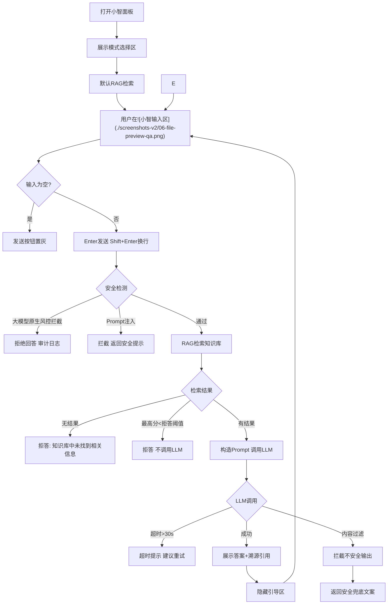
```mermaid
flowchart TD
    A["打开小智面板"] --> B["展示模式选择区"]
    B --> C["默认RAG检索"]


    C --> H["用户在![小智输入区](./screenshots-v2/06-file-preview-qa.png)

"]
    E --> H
    H --> I{"输入为空?"}
    I -->|"是"| J["发送按钮置灰"]
    I -->|"否"| K["Enter发送 Shift+Enter换行"]
    K --> L{"安全检测"}
    L -->|"大模型原生风控拦截"| M["拒绝回答 审计日志"]
    L -->|"Prompt注入"| N["拦截 返回安全提示"]
    L -->|"通过"| O["RAG检索知识库"]
    O --> P{"检索结果"}
    P -->|"无结果"| Q["拒答: 知识库中未找到相关信息"]
    P -->|"最高分<拒答阈值"| R["拒答 不调用LLM"]
    P -->|"有结果"| S["构造Prompt 调用LLM"]
    S --> T{"LLM调用"}
    T -->|"超时>30s"| U["超时提示 建议重试"]
    T -->|"成功"| V["展示答案+溯源引用"]
    T -->|"内容过滤"| W["拦截不安全输出"]
    W --> X["返回安全兜底文案"]
    V --> Y["隐藏引导区"]
    Y --> H

```

**说明**：问答的完整链路为「输入 → 安全检测 → RAG检索 → 构造Prompt → LLM返回 → 展示答案+引用」。所有健康检查在调用LLM前完成，确保安全可控。

##### 3.2.5.1.3 界面原型

| 操作 | 交互 | 截图/示例 |
| --- | --- | --- |
| 点击文件名 | 右侧面板小智自动展开 |  |
| 四种模式选择 | 模式标签切换，默认智能问答 |  |
| 输入区输入问题 | Enter发送，Shift+Enter换行，输入框自动扩展高度（max 192px） |  |
| 发送按钮 | 有内容时高亮可点击，无内容时置灰 | — |
| 问题发送后 | 问题气泡+回答气泡展示，每轮对话包含引用来源 | 待补充 |
| 点击引用链接 | 打开源文件预览标签，高亮对应大纲章节 | 待补充 |
| 复制消息 | 点击复制图标，消息内容拷贝到剪贴板 | 待补充 |
| 编辑问题 | 点击编辑图标，进入行内编辑，保存后重新回答 | 待补充 |
| 重试 | 点击重试图标，重新触发当前问题的回答 | 待补充 |
| 引用上一条回答 | 点击引用图标，新提问引用上一条回答内容 | 待补充 |

##### 3.2.5.1.4 数据说明（业务实体）

| 字段 | 类型 | 说明 | 原型对应 |
| --- | --- | --- | --- |
| QaMessage.id | number | 消息ID `id` |  |
| QaMessage.role | 'user' \| 'assistant' | 消息角色 | `role` |
| QaMessage.content | string | 消息内容 `content` |  |
| QaMessage.citations | string\[\] | 引用来源 `citations` |  |
| qaMode | 'chat' | 当前问答模式（仅纯聊天） | `qaMode` |
| qaMessages | QaMessage\[\] | 当前会话消息列表 `qaMessages` |  |

##### 3.2.5.1.5 业务规则和约束条件

*   上下文窗口：保留最近5轮对话

*   跨轮指代：支持代词消解

*   持久化：消息自动保存至 `kb_chat_history`，刷新可恢复

*   会话隔离：知识中心问答会话独立留存，与工作台主会话区分，支持在同一会话内持续对话

*   知识库问答只维护当前对话的上下文记忆，不提供新建/切换/删除会话功能

##### 3.2.5.1.6 接口说明

```plaintext
POST /api/knowledge/qa/ask 提问
GET /api/knowledge/qa/stream 流式输出答案
POST /api/knowledge/qa/feedback 反馈有用/无用
DELETE /api/knowledge/qa/clear 清空当前对话
GET /api/knowledge/qa/history 获取历史消息

```

##### 3.2.5.1.7 补充说明

**安全检测**：上传文件侧：后端解析环节统一执行，采用 AC 自动机匹配敏感词词库，命中标记为 process_failed。提问侧：依赖大模型原生风控，不做自定义敏感拦截。 Prompt 注入（模式匹配）。命中敏感词直接拒答并写入审计。命中 Prompt 注入则返回安全提示。

**RAG 链路**：

```plaintext
用户输入 → Query改写/意图识别 → Embedding检索(TOP-K) → 精排ReRank → 
阈值过滤 → Prompt构造(引用+上下文+问题) → LLM生成 → 内容过滤 → 展示

```

#### 3.2.5.2 溯源引用与预览联动

##### 3.2.5.2.1 功能需求描述

| EARS 模式 | 需求描述 |
| --- | --- |
| 普遍型 | \* 系统应在小智回答中使用 `[[ref:N]]` 标记引用来源，关联的引用来源在答案下方以卡片形式展示。<br>\* 系统应支持引用来源点击跳转：打开源文件预览并高亮对应大纲章节。 |
| 状态驱动型 | \* 当源文档已被删除时，系统应显示「来源已失效」。<br>\* 当 `[[ref:N]]` 索引超出范围时，系统应不跳转。 |
| 事件驱动型 | \* 当用户点击引用卡片上的来源序号时，系统应跳转到对应文档章节。<br>\* 当用户点击引用卡片上的引用序号（上标数字）时，系统应打开源文件预览标签。<br>\* 高亮持续3秒后自动消除。 |

##### 3.2.5.2.2 业务主流程图及说明

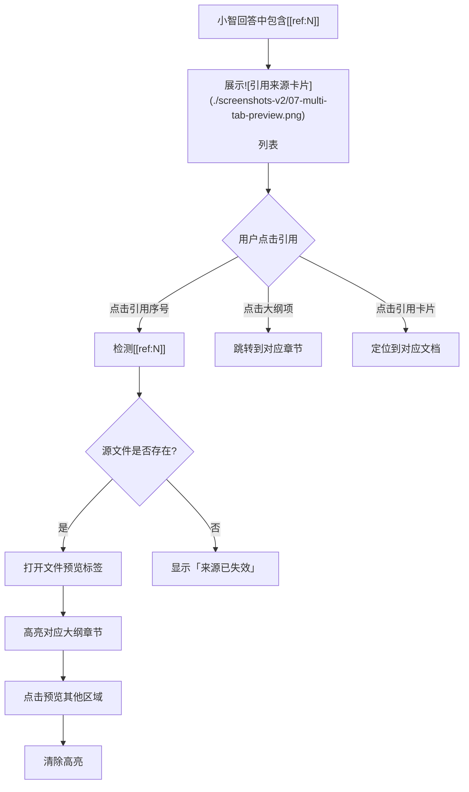
```mermaid
flowchart TD
    A["小智回答中包含[[ref:N]]"] --> B["展示![引用来源卡片](./screenshots-v2/07-multi-tab-preview.png)

列表"]
    B --> C{"用户点击引用"}
    C -->|"点击引用序号"| D["检测[[ref:N]]"]
    D --> E{"源文件是否存在?"}
    E -->|"是"| F["打开文件预览标签"]
    F --> G["高亮对应大纲章节"]
    G --> G_clear["点击预览其他区域"]
    G_clear --> G_clear2["清除高亮"]
    E -->|"否"| H["显示「来源已失效」"]
    C -->|"点击大纲项"| I["跳转到对应章节"]
    C -->|"点击引用卡片"| J["定位到对应文档"]

```

**说明**：溯源引用与文件预览面板深度联动，形成「问题→答案→原文→章节」的完整闭环。

##### 3.2.5.2.3 界面原型

| 操作 | 交互 | 截图/示例 |
| --- | --- | --- |
| 引用序号以蓝色上标 `[1]` 展示，点击后打开源文件预览 | 待补充 |  |
| 引用来源卡片 | 答案下方以列表展示引用文件，每项包含文件名、来源序号 | 待补充 |
| 引用高亮持续 | 高亮3s后自动消除 | — |

##### 3.2.5.2.4 数据说明（业务实体）

| 字段 | 类型 | 说明 |
| --- | --- | --- |
| Citation.refId | number | 引用序号，对应 `[[ref:N]]` 中的N |
| Citation.chunkId | string | 来源 chunk 唯一标识 |
| Citation.docId | string | 来源文档 ID |
| Citation.docTitle | string | 来源文档标题 |
| Citation.space | 'public' \| 'personal' | 来源文档所属空间 |
| Citation.excerpt | string | 引用原文摘要片段 |
| Citation.headingPath | string\[\] | 来源章节路径，如`["第一章", "1.1 概述"]` |

##### 3.2.5.2.5 业务规则和约束条件

*   `[[ref:N]]` 索引超出范围时不跳转

*   源文档已删除时显示「来源已失效」

*   引用来源精确匹配文档名称，匹配失败时按部分匹配降级

##### 3.2.5.2.6 接口说明

无独立接口，溯源引用数据由问答接口 `POST /api/knowledge/qa/ask` 一并返回。

##### 3.2.5.2.7 补充说明

溯源引用设计的核心原则：**每一段回答都能追溯到原文**，确保知识库问答的「可信可验证」。

# 非功能需求

## 性能要求

| 指标 | 要求 | 说明 |
| --- | --- | --- |
| 首页加载 | P95 ≤ 2s | 知识中心页面整体加载 |
| 文件树展开 | P95 ≤ 500ms | 展开文件夹/知识库节点 |
| 搜索建议 | P95 ≤ 100ms | 输入防抖后自动补全响应 |
| 文件上传确认 | P95 ≤ 1s | 点击确认到上传启动 |
| 解析处理 | P95 ≤ 30s | 从上传完成到 done（含排队） |
| 回答首token | P95 ≤ 3s | 流式输出第一个 token |
| 并发上传 | 前端最多5个并发上传 | 队列管理不卡顿 |

## 安全要求

| 类别 | 要求 |
| --- | --- |
| 格式伪装检测 | 文件头魔数校验 + 扩展名比对，不一致拒绝入库 |
| 病毒扫描 | ClamAV 集成（二期），阳性瞬删并记录安全日志 |
| PII 检测 | 身份证/手机号/银行卡号扫描，标记 `contains_pii` |
| 权限过滤 | 检索前按用户角色过滤可见范围，机密文档直接过滤 |
| 加密检测 | 加密PDF/Office文件标记 process\_failed |
| XSS防护 | 预览高亮内容转义 `<mark>` 标签确保安全 |
| Prompt注入防护 | 输入安全检测，拦截注入尝试 |

## 兼容性要求

| 项目 | 要求 |
| --- | --- |
| 浏览器 | Chrome、Edge、钉钉内置浏览器最近两个大版本 |
| 文件格式 | P0：PDF、DOC、DOCX、XLS、XLSX、TXT、MD、CSV |
| 权限来源 | 支持钉钉用户、部门、角色组映射 |

# 迭代计划

## MVP-1（v1.7.x）

| 功能 | 优先级 | 覆盖范围 |
| --- | --- | --- |
| 三栏布局 + 空间切换 | P0 | 公共/个人空间切换、侧栏折叠展开 |
| 文件树 | P0 | 展开/折叠、hover展示的三点菜单 |
| 新建知识库 | P0 | 名称校验、空间隔离、自动选中 |
| 新建文件夹 | P0 | 名称校验、位置选择 |
| 文件上传（含解析） | P0 | 前端校验 → OSS → 魔数 → 解析 → 清洗 → 分块 → 向量化 |
| 状态流转 | P0 | 5种状态 + 超时兜底 + 重试 |
| 批量上传 | P0 | 不限数量、SHA256去重秒传、后端批次10个 |
| 文件预览 | P0 | 多标签（最多5个）、大纲导航 |
| RAG问答 | P0 | 智能问答模式、溯源引用 |
| 会话管理 | P0 | 多会话、最近5轮上下文 |
| 权限管理 | P0 | 4级角色(OWNER/MANAGER/EDITOR/VIEWER)、成员管理、预设规则 |
| 审计日志 | P0 | 全链路操作留痕、WORM存储 |
| 文件搜索 | P1 | 文件名搜索、实时过滤 |

## MVP-2（v1.8.x）

| 功能 | 优先级 | 说明 |
| --- | --- | --- |
| 版本管理 | P1 | 同名文件新版本、并排diff、回滚 |
| 断点续传 | P1 | 大文件分片上传 |
| Excel 解析 | P1 | xlsx 格式支持 |
| 扫描 PDF OCR | P1 | 图片型PDF文字识别 |
| 搜索结果关键词高亮 | P1 | 匹配词 `<mark>` 高亮 |
| 拼写纠错 | P1 | 搜索时的纠错建议 |
| 热门搜索 | P2 | TOP10统计 |

## 增强阶段（v1.9.x 及以后）

| 功能 | 说明 |
| --- | --- |
| 团队空间 | 按团队/项目组隔离知识空间 |
| 全文搜索 | 搜索文件正文内容，不仅限于文件名 |
| 图片解析 | PNG/JPG 格式支持 |
| PPT 解析 | pptx 格式支持 |
| AI 智能体集成 | Agent 自主检索知识库 |
| ClamAV 病毒扫描 | 文件上传时自动扫描 |
| PII 检测 | 敏感信息自动识别标记 |

# 附录

## 状态字典

| 文件状态 | 用户可见文本 | 是否终态 | 可操作 |
| --- | --- | --- | --- |
| uploading | 上传中 🔵 | 否 | — |
| processing | 处理中 🔵 | 否 | — |
| done | 已完成 ✅ 🟢 | 是 | 下线、删除 |
| upload\_failed | 上传失败 ❌ 🔴 | 是 | 重新上传 |
| process\_failed | 处理失败 ❌ 🔴 | 是 | 重新上传 |


## 错误码字典

| 错误码 | HTTP | 场景 |
| --- | --- | --- |
| INVALID\_NAME | 400 | 名称含特殊字符 |
| FILE\_EMPTY | 400 | 上传空文件（0字节） |
| FILE\_TOO\_LARGE | 413 | 文件超过100MB |
| BATCH\_TOO\_LARGE | 413 | 批次总大小超过1GB |
| BATCH\_TOO\_MANY | 400 | 后端批次超过10个 |
| KB\_NAME\_EXISTS | 409 | 同名知识库存在 |
| FORMAT\_UNSUPPORTED | 400 | 不支持的文件格式 |
| FORMAT\_MISMATCH | 400 | 魔数与扩展名不一致 |
| FILE\_ENCRYPTED | 400 | 文件已加密 |
| FORBIDDEN | 403 | 无权限操作 |
| NOT\_FOUND | 404 | 资源不存在 |
| RATE\_LIMITED | 429 | 请求过于频繁 |
| SERVICE\_ERROR | 500 | 服务端异常 |
| UPLOAD\_EXPIRED | 400 | 上传凭证过期 |

## 原型状态变量速查

| 变量 | 类型 | 默认值 | 用途 |
| --- | --- | --- | --- |
| sidebarVisible | boolean | true | 左侧栏展开/收起 |
| activeSpace | 'public' \| 'personal' | 'public' | 当前空间 |
| selectedKbId | string \| null | null | 选中知识库 |
| expandedTreeIds | string\[\] | \['folder-shared','folder-solution-center'\] | 展开的树节点 |
| previewTabs | DocItem\[\] | \[ \] | 预览标签列表 |
| qaOpen | boolean | false | 小智侧栏展开 |
| qaMode | string | 'chat' | 问答模式（仅纯聊天） |
| uploadModalOpen | boolean | false | 上传弹窗 |
| uploadCandidates | UploadCandidate\[\] | \[ \] | 上传候选文件 |
| uploadTasks | UploadTask\[\] | \[ \] | 上传任务列表 |
| recycleItems | RecycleItem\[\] | \[ \] | 回收站条目 |
| settingsKbId | string | '' | 正在设置的知识库ID |
| permissionMembers | Record<string, PermissionEntry\[\]> | {} | 权限成员 |