# 20260707-【PRD】AI工作台-知识中心V1.0-天马智擎项目

_**天马智擎项目**_

**产品需求说明书**

版本信息

本表用于记录本文档的维护过程，请认真填写。

| 版本号 | 时间(必填) | 状态 | 简要描述(必填) | 部门 | 责任产品(必填) | 批准人 |
| --- | --- | --- | --- | --- | --- | --- |
| V1.0 | 2026-07-03 | N | AI工作台中知识库产品需求 | AI项目小组 | $\color{#0089FF}{@公输}$ |  |
| V1.1 | 2026-07-07 | M | 基于用户故事地图精简MVP，聚焦9项核心功能：进入空间、新建知识库、新建文件夹、上传文件、文件处理、知识库问答、文件搜索、文件预览、文件删除 | AI项目小组 | $\color{#0089FF}{@公输}$ |  |
| V1.2 | 2026-07-07 | M | 细节修改 | AI项目小组 | $\color{#0089FF}{@公输}$ |  |

注：状态可以为N-新建、A-增加、M-更改、D-删除。

# 关于本文档

## 术语

| **词汇名称** | **全局说明** |
| --- | --- |
| **文件上传加载** | 支持的格式和限制详见「全局交互约定 → 文件格式支持矩阵」和「文件上传约束」 |
| **文档解析** | 系统从上传文件中提取可被检索的文本内容的过程 |
| **RAG（检索增强生成）** | 系统先从知识库检索相关段落，再交由大模型基于检索结果生成回答，使答案可追溯、可核验 |
| **溯源 / 引用** | 小智回答时标注的信息来源，用户可点击跳转到原文位置进行核验 |
| **同名文件** | 文件名（含扩展名）完全相同的两个文件。判定范围：同一父节点（同一知识库根目录下，或同一文件夹下）不允许同名；不同父节点下允许同名 |
| **重复文件** | 文件内容指纹（Hash）完全相同的两个文件，与文件名无关。**校验范围：知识库层面**——同一知识库内通过内容指纹检测重复，命中则走秒传逻辑；**跨知识库允许重复**（不受 SHA 校验拦截） |
| **同一文件（文件实体）** | 一个物理文件实体在系统中只存在一份。**跨知识库引用**：同一文件实体可在不同知识库下各有一条引用记录，跨知识库上传相同内容时走秒传逻辑（追加引用记录，不重复存储） |

## 参考文档

为了更好理解本文档，请阅读如下文档。

| **编号** | **文档** | **说明及地址** |
| --- | --- | --- |
| 1 | 原型界面参考 | https://fri555.github.io/PORTL/ |
| 2 |  |  |

## 沟通要求

本表记录需要跨部门沟通的事项，以保证该文档内容质量。如果有其它跨部门沟通项，请填写该表中，并记录沟通结果。

| **序号** | **部门** | **沟通内容** | **沟通结果** |
| --- | --- | --- | --- |
| 1 | 数字技术中心 | 20260706需求评审 | 简化修改 |
| 2 | 数字技术中心 | 20260707MVP需求评审 | 简化修改 |

# 产品概述

本章节详细描述产品的背景、内容和目标等进行详细定义，关于产品定义的其它内容请阅读本产品定义说明书。

## 产品概述

知识中心是天马智擎 AI 工作台的核心业务入口，定位为集团统一知识库管理与智能问答平台。用户可以在同一页面完成知识库浏览、文档上传、文件预览和基于知识库/文件的小智问答。

## 产品目标

*   **统一知识入口**：用户可在知识中心切换企业知识库/我的知识库，并访问对应知识库与文件
    
*   **文件入库闭环**：用户上传文件后，可看到上传、处理、完成、失败等状态
    
*   **智能问答闭环**：用户可基于选定知识库或当前文件提问，答案展示来源引用
    

## 用户角色

### 用户角色描述

| **用户角色** | **职责描述** | **使用功能** |
| --- | --- | --- |
| **普通员工** | 快速查资料、问政策、找方案；管理个人知识库 | 浏览公共知识库、搜索文件、预览文件、向小智提问；在个人空间新建知识库/文件夹/上传文件 |
| **系统管理员** | 管理公共知识资产 | 在公共空间新建知识库/文件夹、上传文件、删除文件 |

### 用户故事地图

用户在知识中心的核心活动主线：**进入知识中心 → 组织知识 → 管理文件 → 消费知识**。

| 用户活动 | 用户任务 | 用户故事 | 优先级 |
| --- | --- | --- | --- |
| **进入知识中心** | 切换空间 | 作为员工，我希望切换公共空间和个人空间，以便查看不同来源的知识 | MVP |
|  | 浏览文件树 | 作为员工，我希望通过文件树浏览知识库结构，以便快速定位目标 | MVP |
|  | 查看知识库列表 | 作为员工，我希望查看当前空间下的知识库列表，以便选择进入 | MVP |
| **组织知识** | 成员权限设置 | 作为系统管理员，我希望能够设置公共空间知识库的成员范围 | MVP |
|  | 新建知识库 | 作为系统管理员，我希望在公共空间新建知识库；作为员工，我希望在个人空间新建知识库，以便沉淀业务文档 | MVP |
|  | 重命名/删除知识库 | 作为知识库所有者，我希望重命名或删除知识库，以便维护知识结构 | MVP |
|  | 新建文件夹 | 作为用户，我希望在知识库下新建文件夹，以便分类组织文件 | MVP |
|  | 重命名/删除文件夹 | 作为用户，我希望重命名或删除文件夹，以便调整文件分类 | MVP |
| **管理文件** | 上传文件 | 作为用户，我希望上传文件到知识库，以便入库供后续检索 | MVP |
|  | 查看处理状态 | 作为用户，我希望看到文件上传和处理的实时状态，以便了解入库进度 | MVP |
|  | 搜索文件 | 作为用户，我希望按名称搜索文件或知识库，以便快速找到目标 | MVP |
|  | 预览文件 | 作为用户，我希望点击文件直接预览内容，以便阅读正文 | MVP |
|  | 删除文件 | 作为用户，我希望删除过期或错误的文件，以便保持知识库整洁 | MVP |
| **消费知识** | 基于知识库提问 | 作为员工，我希望基于知识库向小智提问，以便获得有依据的答案 | MVP |
|  | 查看答案引用 | 作为员工，我希望看到答案的来源引用，以便核验可信度 | MVP |
|  | 跳转原文 | 作为员工，我希望点击引用跳转到源文件对应章节，以便深入阅读原文 | MVP |

## 同类产品/竞品调研(选写)

###  同类产品

1.  **钉钉知识库**
    
    1.  优势：与 IM、审批、日志、日程等 OA 场景天然集成，组织架构与权限体系接入成本低，适合钉钉生态内的基础知识沉淀。
        
    2.  不足：AI 问答入口较深、体验偏弱；文件树、版本管理、去重检测、生命周期治理等能力相对基础。
        
    3.  启示：MVP 阶段需对齐基础上传、检索、问答、文件树能力，并在问答入口、文件格式支持、细粒度文件树交互上形成差异。
        
2.  **飞书知识空间 / 飞书知识问答**
    
    1.  优势：RAG 工程能力较强，支持混合检索、Query 改写、重排序、溯源引用、多模型切换；权限与 AI 检索结合较成熟。
        
    2.  不足：成本较高，依赖企业在飞书生态内已有足够知识沉淀。
        
    3.  启示：中期应重点对标其“权限前置过滤 + 混合检索 + 溯源问答”链路，逐步建设专业 RAG 能力。
        
3.  **语雀**
    
    1.  优势：中文编辑器、目录树、知识库-目录-文档结构体验成熟，代码块、画板、Markdown 排版对研发与知识沉淀友好。
        
    2.  不足：AI 问答能力迭代较慢，与 IM/OA/审批等业务系统联动弱。
        
    3.  启示：文件树、目录层级、中文排版和文档组织方式可作为交互参考；天马智擎应以 AI 问答与业务联动形成差异。
        
4.  **Notion**
    
    1.  优势：Block 架构灵活，Database 多视图和模板生态成熟，适合个人、小团队和创意协作场景。
        
    2.  不足：企业级权限治理、本地化、私有化和国内访问稳定性不足。
        
    3.  启示：长期可参考其灵活信息组织方式，但当前不作为 MVP 主要对标对象。
        
5.  **Confluence**
    
    1.  优势：页面树、空间隔离、版本管理、审批链、插件生态成熟，是传统企业 Wiki 标杆。
        
    2.  不足：体验重、成本高、AI 能力弱，国内访问与本土化存在劣势。
        
    3.  启示：后续版本可参考其版本管理、审批流、空间治理能力，形成“轻体验 + AI 能力 + 企业治理”的替代价值。
        
6.  **AI 原生知识库平台（Dify、FastGPT、扣子/Coze、智巢 AI 等）**
    
    1.  优势：RAG、工作流编排、多模型切换、API 集成能力强，验证了“知识库 + AI 问答”的产品方向。
        
    2.  不足：多数缺少成熟文件管理、企业级权限、知识治理和精细化前端体验。
        
    3.  启示：天马智擎应吸收其 RAG 能力，同时补齐企业知识库所需的文件树、权限、审计、版本、去重与生命周期管理。
        

###  结论

**MVP 阶段**：对标钉钉知识库，优先完成上传、解析、检索、问答和文件树管理，权限治理类能力后续迭代补齐。

# 功能需求

## 全局要求

本节定义跨模块的通用行为规范，各功能模块默认遵循此约定，特殊场景在模块内单独说明。

### 三栏布局

| 规则项 | 说明 |
| --- | --- |
| 默认状态 | 首次进入：左侧文件树（展开，宽度 260px）+ 中间内容区（自适应）+ 右侧面板（收起）。中间区域展示知识库列表 |
| 左侧文件树 | 可折叠，折叠后宽度 0，中间区域自动扩展；展开按钮吸附在页面左边缘，点击展开 |
| 右侧面板 | 包含预览面板和小智问答面板。默认收起；点击文件时自动展开预览面板；点击小智入口时展开问答面板。两个面板可同时展开，**左右排列**（预览在左、小智在右）。**支持拖动调整两栏宽度**。 |
| 面板联动 | 预览面板和小智问答**不强制联动**。用户可单独打开预览或小智，也可同时打开。 |
| 最小宽度 | 中间内容区最小宽度 480px |
| 响应式 | MVP 仅适配桌面端，移动端不在本期范围 |

### 列表分页与排序

| 列表 | 默认排序 | 分页方式 | 每页数量 |
| --- | --- | --- | --- |
| 知识库列表 | `updatedAt` 降序（最近更新在前） | 前端滚动加载（服务端分页） | 20 |
| 知识库内文件列表 | `uploadedAt` 降序（最新上传在前） | 前端滚动加载（服务端分页） | 30 |
| 搜索自动补全建议 | 匹配度降序 | 前端展示，最多 10 条 | — |
| 上传任务列表 | 提交时间降序（最新在前） | 浮层内滚动，不翻页 | — |

> 滚动加载触发时机：列表滚动到距底部 200px 时自动请求下一页。每页数据返回时携带 `hasMore` 标记，`false` 时停止请求。

### 文件树加载策略

| 规则项 | 说明 |
| --- | --- |
| 加载方式 | **懒加载**：首次进入空间仅加载知识库列表（一级节点）；点击展开知识库时异步加载其下的文件夹和文件（二级节点） |
| 展开状态 | 不持久化；切换空间或刷新页面后所有节点折叠，仅展示知识库列表 |
| 子节点数量 | 知识库节点展开时返回子节点时附带 `totalCount`（文件夹数 + 文件数），用于展示节点旁的数量角标 |
| 节点上限 | 单个知识库下子节点（文件夹 + 文件）超过 200 个时，仅返回前 200 个，前端展示「加载更多」按钮 |
| 空节点 | 知识库下无文件无文件夹时，展开后展示空态提示「暂无内容，上传文件开始使用」 |
| 加载失败 | 节点加载失败时展示重试按钮，点击重新请求 |

### 搜索规则

#### 搜索范围

| 当前状态 | 搜索范围 | 搜索字段 | placeholder |
| --- | --- | --- | --- |
| 任意状态 | **全局搜索**：全局所有知识库、文件夹、文件 | 知识库名称、文件夹名称、文件名 | 「搜索知识库、文件夹、文件...」 |

#### 搜索结果展示

| 规则项 | 说明 |
| --- | --- |
| 展示方式 | 结果以自动补全下拉面板展示，**按类型分组**（分组标题：知识库 / 文件夹 / 文件） |
| 每条结果展示 | 图标（知识库橙色书图标 / 文件夹灰色文件夹图标 / 文件灰色文件图标）+ 名称 + 父路径（如"集团制度 / 考勤管理"） |
| 补全数量 | 最多展示 10 条，按匹配度降序排列，每组不超过上限 |

#### 搜索行为

| 规则项 | 说明 |
| --- | --- |
| 触发方式 | 输入后 300ms 防抖触发搜索，不依赖 Enter 键 |
| 匹配逻辑 | 左右模糊匹配（包含关键词即可），不区分大小写 |
| 多关键词 | 空格分隔视为 AND 逻辑，所有关键词均需匹配 |
| 自动补全 | 搜索结果以自动补全下拉面板展示，每条结果展示图标（知识库 / 文件夹 / 文件）+ 名称 + 父路径（如"集团制度 / 考勤管理"） |
| 补全数量 | 最多展示 10 条，按匹配度降序排列 |
| 键盘导航 | ↑ ↓ 键在建议列表中切换选中项，Enter 键跳转到选中项，Esc 关闭建议面板 |
| 清空 | 点击搜索框右侧 ✕ 按钮或按下 Esc 清空搜索词，恢复完整列表 |
| 无结果 | 面板展示空态：「未找到匹配结果」 |
| MVP 限制 | 不支持正文搜索、不支持标签搜索。MVP 阶段建议统一走服务端全局搜索接口 |

### 操作菜单（⋮）

各节点类型的操作按钮菜单项：

| 节点类型 | 菜单项（按顺序） | 权限控制 |
| --- | --- | --- |
| 知识库 | 新建文件夹、重命名、删除、（设置-系统管理员可见） | 设置：仅系统管理员可见，新建文件夹：公共空间仅管理员、个人空间仅本人可见；重命名和删除同上 |
| 文件夹 | 重命名、删除 | 同上；移动同上 |
| 文件 | 预览、删除 | 删除同上；预览全员可见；移动同上 |
| 知识库列表（空白态） | 新建知识库（显式按钮） | 公共空间仅管理员可见 |

> 点击菜单外的任意区域关闭菜单。菜单不嵌套，不上报二级菜单。

### 加载态 / 空态 / 错误态

| 场景 | 状态 | 处理方式 |
| --- | --- | --- |
| 知识库列表首次加载 | 加载中 | 展示骨架屏（4 个卡片占位） |
| 知识库列表首次加载 | 加载失败 | 展示错误提示 + 「重试」按钮 |
| 知识库列表 | 空（当前空间无知识库） | 展示空态插画 + 文案「暂无知识库，点击新建开始使用」；公共空间仅管理员可见新建按钮 |
| 文件树节点展开 | 加载中 | 展示行内加载指示器（旋转图标） |
| 文件树节点展开 | 加载失败 | 该节点下展示「加载失败，点击重试」 |
| 文件列表 | 空（知识库内无文件） | 展示空态提示「暂无文件，上传文件开始使用」 |
| 文件预览 | 加载中 | 预览面板内展示骨架屏 |
| 文件预览 | 加载失败 | 预览面板内展示错误提示 + 「重试」按钮 |
| 文件预览 | 格式不支持 | 提示「暂不支持预览此文件格式」 |
| 小智问答 | 回答生成中 | 流式逐字展示，展示思考中动效 |
| 小智问答 | 网络异常 | 消息气泡展示「网络异常，点击重试」 |
| 小智问答 | 超时（>30s） | 消息气泡展示「回答超时，点击重试」 |

### 文件格式支持矩阵

| 格式 | 扩展名 | 上传 | 内容提取（检索） | 预览 | 大纲导航 | 优先级 |
| --- | --- | --- | --- | --- | --- | --- |
| PDF | `.pdf` | ✅ | ✅ 解析文本 | ✅ HTML 渲染 | ✅ 提取书签 | P0 |
| DOCX | `.docx` | ✅ | ✅ 解析文本 | ✅ HTML 渲染 | ✅ 提取 H1-H3 标题 | P0 |
| TXT | `.txt` | ✅ | ✅ 读取全文 | ✅ 纯文本渲染 | — | P0 |
| MD | `.md` | ✅ | ✅ 读取全文 | ✅ Markdown 渲染 | ✅ 提取 H1-H3 标题 | P0 |
| XLSX | `.xlsx` | ✅ | ✅ 提取单元格文本 | ✅ HTML 表格渲染 | ✅ Sheet 名称列表 | P0 |
| XLS | `.xls` | ✅ | ✅ 提取单元格文本 | ✅ HTML 表格渲染 | ✅ Sheet 名称列表 | P0 |
| CSV | `.csv` | ✅ | ✅ 读取全文 | ✅ 简易表格渲染 | — | P0 |
| DOC | `.doc` | ✅ | ✅ 解析文本 | ✅ 支持 | — | P0 |
| 扫描 PDF | `.pdf` | ✅ | ✅ OCR 不在 MVP 范围 | ✅ 图片渲染 | — | P0 |

> **优先级说明**：P0 = MVP 必须完整支持（上传 + 检索 + 预览）

> **DOC 格式说明**：DOC 为旧版 Word 格式，上传后服务端可提取文本用于检索，预览时转换为 HTML 渲染。建议引导用户使用 DOCX 格式以获得更好的预览体验。

> **扫描 PDF 说明**：纯图片型 PDF（无文字层），MVP 不支持 OCR 识别，因此无法提取文本用于检索。用户上传后可预览图片但无法被搜索和问答命中。

### 文件上传约束

| 约束项 | 限制值 | 校验位置 | 拦截行为 |
| --- | --- | --- | --- |
| 单文件大小 | ≤ 100MB（含 100MB） | 前端 | 拦截该文件，标注「文件大小超过 100MB」 |
| 单批次文件数量 | ≤ 10 个 | 前端 | Toast 提示「单次最多选择 10 个文件」 |
| 上传任务排序 | 按添加时间正序（FIFO：最早添加的最早上传） | 前端 | 先添加的文件始终在任务列表最前面 |
| 空文件（0 字节） | 不允许 | 前端 | 拦截该文件，标注「空文件」 |
| 文件扩展名 | 仅支持上述 9 类 | 前端 | 拦截该文件，标注「不支持的文件格式」 |
| 格式伪装 | 扩展名与文件头不匹配 | 服务端 | 上传完成后标记「上传失败」 |
| 加密文件 | 文件已加密无法解析 | 服务端 | 处理阶段标记「处理失败」 |

> **前端校验顺序**：扩展名 → 文件大小 → 空文件 → 总数量。逐项校验，首个不通过的项即拦截并提示，不继续后续校验。

> **服务端校验时机**：文件上传完成后，在解析阶段检测格式伪装和加密。格式伪装在解析前检测（标记为上传失败），加密文件在解析尝试后检测（标记为处理失败）。

## 流程图

###  技术架构图

#### 整体架构

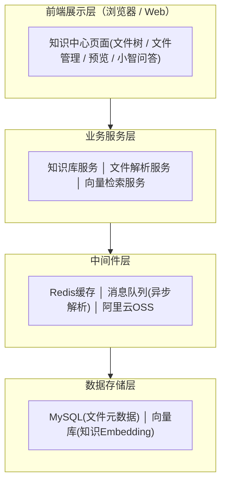

#### 层级结构

**本产品采用「知识库 → 文件夹 → 文件」结构，其中文件夹为可选层级**。MVP 文件夹支持一层嵌套。

```plaintext
空间（公共空间 / 个人空间，仅作为数据隔离域）
 └── 知识库（业务文档容器，如"集团制度知识库"）
      ├── 文件（可直接放在知识库根目录下）
      └── 文件夹（可选，用于二次归类）
           └── 文件（PDF、DOC、DOCX、TXT、MD、XLSX、XLS、CSV）

说明：
* 空间 = 隔离域
  - 公共空间：由系统管理员统一管理，全员可查看
  - 个人空间：基于当前登录人的自有知识空间，只能本人管理本人使用
* 知识库 = 一类业务文档的容器（如"集团制度"、"商品手册"、"项目档案"）
  - 知识库下可直接存放文件，也可通过文件夹组织
* 文件夹 = 知识库内部的可选组织单元（用于对文件做业务维度的二次归类）
  - MVP 支持一层，文件夹不强制存在
* 文件 = 业务文档本体
```

#### 权限模型

本版本不做复杂的角色体系、成员授权、密级、审计和文件级权限，采用以下最简模型：

| 空间 | 谁能建库/上传/删除 | 谁能查看/搜索/预览/问答 |
| --- | --- | --- |
| **公共空间** | 系统管理员 | 全员（所有登录用户） |
| **个人空间** | 当前用户本人 | 仅本人 |

**关键规则**：

*   公共空间的知识库由系统管理员统一创建和维护，普通员工仅可浏览、搜索、预览和问答
    
*   个人空间的知识库由当前用户自行创建和维护，仅本人可见可用
    
*   不设置角色、不设置密级、不设置文件级独立权限
    
*   后续迭代再补齐完整权限治理体系
    

###  流程图

#### 用户流程图

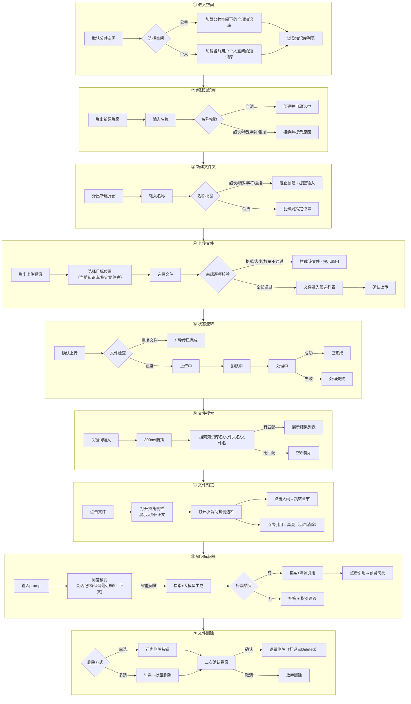

**关键规则**：

*   知识库下可直接存放文件，也可通过文件夹组织，MVP 文件夹仅支持一层
    
*   同一父节点下不允许存在同名文件或同名文件夹
    

## 功能模块

| **主功能** | **子功能** | **功能描述** |
| --- | --- | --- |
| 整体布局 | 页面布局 | 采用左侧文件树、中间内容区、右侧预览/问答区的三栏布局 |
|  | 分栏切换 | 支持左侧文件树和右侧预览/问答面板展开、收起，适配不同知识管理与阅读场景 |
|  | 文件树（左侧边栏） | 以树形结构展示知识库列表+知识库内文件夹与文件，支持展开、收起、选中和行内操作（新建文件夹、重命名、删除等） |
| 文件管理 | 权限管理（仅对于系统管理员） | 支持在公共空间中的知识库设置成员权限（可查看）、文件夹建立、文件管理 |
|  | 空间切换 | 支持在公共空间、个人空间之间切换，按空间加载对应的知识库和文档内容 |
|  | 新建知识库 | 支持在指定空间下创建知识库，作为同类业务文档的统一管理容器 |
|  | 新建文件夹 | 支持在知识库中新建文件夹，用于分类沉淀业务文档 |
|  | 文件上传 | 支持向指定知识库或文件夹上传文档，上传后自动进入解析和入库流程 |
|  | 状态流转 | 展示文件从上传中、处理中、成功到失败的处理状态，便于跟踪进度 |
|  | 文件搜索 | 支持按文件名、文件夹名或知识库名称进行搜索，快速定位目标内容 |
|  | 文件预览 | 支持点击文件，直接预览文件内容 |
|  | 文件删除 | 支持单文件和批量删除文件，二次确认后逻辑删除（标记 isDeleted，不展示不检索） |
| 知识库问答 | RAG搜索回复 | 基于所选知识库内容进行检索，并结合大模型生成可读、可追问的回答 |
|  | 溯源引用 | 回答中展示引用来源、文档片段和跳转入口，便于用户核验答案依据 |

## 功能详情

### 浏览与导航

用户进入知识中心后，首先需要定位到目标知识库或文件。本节定义空间切换、文件树浏览和知识库列表三个核心导航能力。

#### 空间切换

##### 功能需求描述

| EARS 模式 | 需求描述 |
| --- | --- |
| 普遍型 | \* 系统应提供「公共空间」和「个人空间」两个独立空间，数据完全隔离。<br>\* 系统应在侧栏顶部展示空间切换入口，标注当前活跃空间。 |
| 状态驱动型 | \* 当用户切换空间时，若当前有打开的预览文件或进行中的小智对话，系统应弹出提示「切换空间将关闭当前预览和对话，是否继续？」，用户确认后清空选中知识库、预览面板和小智面板。<br>\* 当用户首次进入时，系统应默认展示公共空间。<br>\* 切换完成后，Toast 提示「已切换到{空间名称}」。 |
| 事件驱动型 | \* 当用户点击空间标签时，系统应切换空间并刷新知识库列表和文件树。 |
| 不良行为型 | \* 当用户无权限访问某知识库时，系统应隐藏该知识库（不可见）。 |

##### 业务主流程图及说明

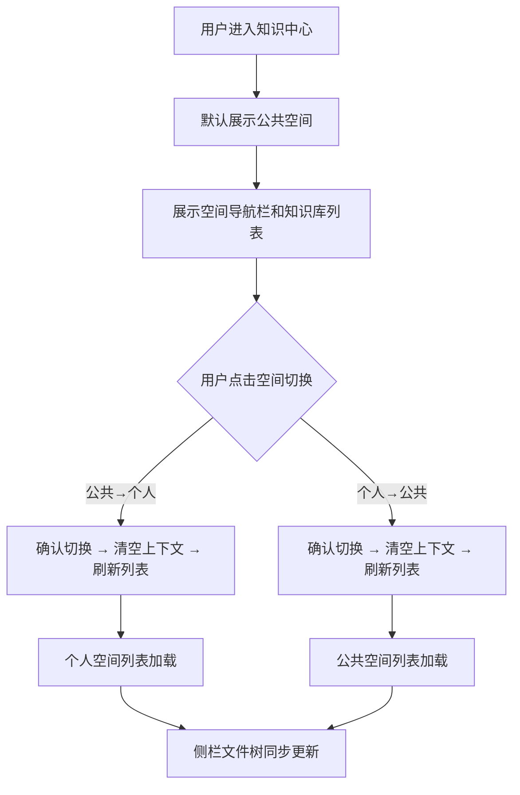

**说明**：空间切换是一等导航行为，切换后所有上下文清空，保证数据隔离性。

##### 界面原型

| 操作 | 交互 | 截图/示例 |
| --- | --- | --- |
| 默认进入知识中心 | 展示空间导航栏和知识库列表 |  |
| 点击公共空间 | 切换至公共空间视图，展示企业知识库列表 |  |
| 点击个人空间 | 侧栏切换为个人空间，展示个人知识库列表 |  |
| 切换空间（有预览或对话时） | 弹出确认提示，确认后清空上下文并 Toast 提示已切换 | — |
| 切换空间（无预览和对话时） | 直接切换，Toast 提示「已切换到{空间名称}」 | — |

##### 业务规则和约束条件

*   公共空间与个人空间数据完全隔离
    
*   不同用户个人空间严格隔离
    
*   切换空间时，若存在打开的预览文件或进行中的小智对话，弹出确认提示；确认后清空选中态、预览态和小智面板并 Toast 提示空间已切换
    
*   默认展示全部知识库列表
    

##### 补充说明

无。

#### 文件树浏览

##### 功能需求描述

| EARS 模式 | 需求描述 |
| --- | --- |
| 普遍型 | \* 系统应以树形结构展示空间、知识库、文件夹和文件，支持展开/收起。<br>\* 系统应在文件树中区分知识库（橙色书图标）、普通文件夹（灰色文件夹图标）和文件（灰色文件图标）。 |
| 状态驱动型 | \* 当知识库内含有子文件夹时，系统应在知识库行显示展开/收起按钮。 |
| 事件驱动型 | \* 当用户点击树节点右侧操作按钮（⋮）时，系统应展示操作菜单（新建文件夹、重命名、删除等）。 |
| 不良行为型 | \- |

##### 业务主流程图及说明

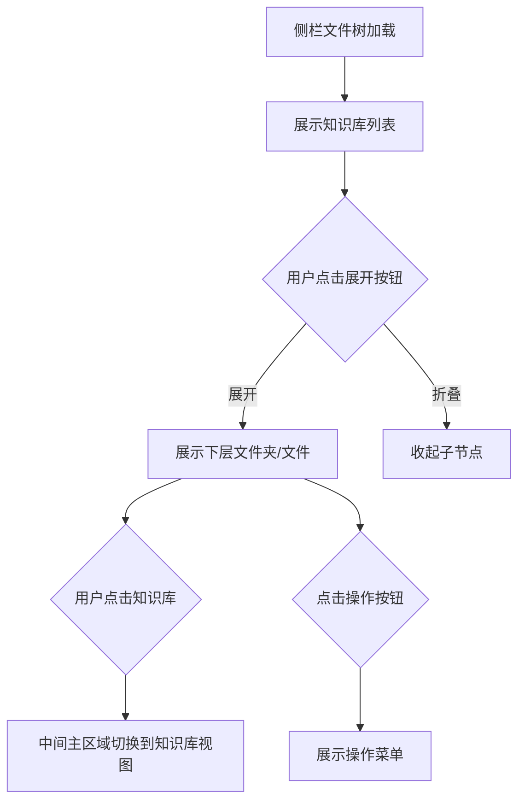

**说明**：文件树是知识中心的导航骨架，所有浏览和管理操作以此为起点。

##### 界面原型

| 操作 | 交互 | 截图/示例 |
| --- | --- | --- |
| 展开知识库节点 | 点击文件夹左侧▶按钮，展示下级文件和文件夹 |  |
| 折叠知识库节点 | 点击▼按钮，收起下级内容 | — |
| 点击知识库行 | 选中知识库，中间区域切换到文件列表 |  |
| 展开知识库子文件夹 | 点击▶按钮，展示树内子文件夹和文件 |  |
| 知识库行操作按钮 | 行右侧始终展示操作按钮（⋮），点击展开菜单（重命名、新建文件夹、重命名、删除）（对于系统管理员还有设置） |  |
| 文件夹行操作按钮 | 行右侧始终展示操作按钮（⋮），点击展开菜单（重命名、重命名、删除） |  |
| 文件行操作按钮 | 行右侧始终展示操作按钮（⋮），点击展开菜单（预览、删除） |  |

##### 业务规则和约束条件

*   文件树结构：知识库 → (文件夹?) → 文件，文件夹为可选层级
    
*   知识库下可直接存放文件，也可通过文件夹组织，MVP 文件夹仅支持一层
    
*   文件夹不支持权限设置
    

##### 补充说明

无。

#### 知识库列表

##### 功能需求描述

| EARS 模式 | 需求描述 |
| --- | --- |
| 普遍型 | \* 系统应在中间主区域展示当前空间/文件夹下的知识库列表。<br>\* 系统应提供列表视图和卡片视图两种展示模式。<br>\* 系统应在知识库卡片中展示名称、文档数、可见性、归属部门、最近更新时间。 |
| 状态驱动型 | \- |
| 事件驱动型 | \* 当用户点击搜索框输入关键词时，系统应在当前空间和目录下实时筛选知识库（300ms防抖）。 |
| 不良行为型 | \* 当用户无权限访问某知识库时，系统应隐藏该知识库（不可见）。 |

##### 业务主流程图及说明

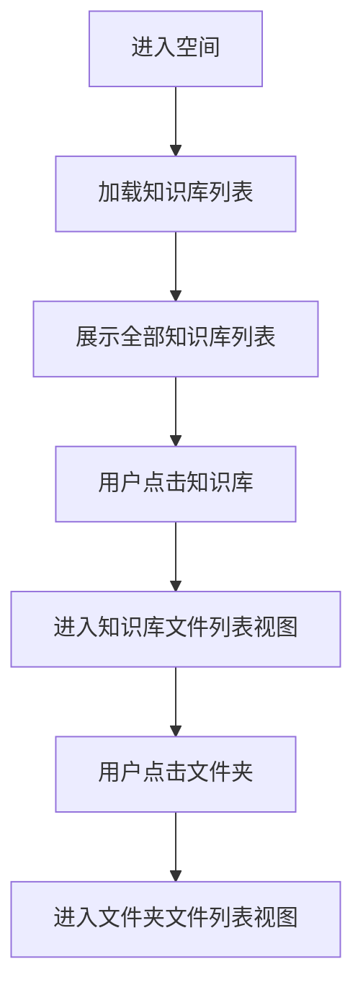

**说明**：知识库列表是用户选择目标知识库的核心界面。知识库/文件搜索作为独立功能，详见 3.2.3.2。

##### 界面原型

| 操作 | 交互 | 截图/示例 |
| --- | --- | --- |
| 进入知识中心 | 展示知识库列表 |  |
| 点击知识库 | 进入该知识库的文件列表 |  |
| 点击切换列表/卡片视图 | 网格布局与表格行布局互切 | 待补充 |

##### 业务规则和约束条件

*   分页与排序默认值详见「全局交互约定 → 列表分页与排序」
    
*   列表视图和卡片视图的切换状态由前端维护，刷新页面后恢复默认视图（卡片视图）
    
*   可编辑判定：公共空间仅系统管理员可编辑，个人空间仅本人可编辑
    
*   卡片视图中每个卡片展示：知识库名称、文件数量、最近更新时间、归属空间标签
    
*   **列表视图列定义**（从左到右）：
    

| 列名 | 宽度 | 可排序 | 说明 |
| --- | --- | --- | --- |
| 知识库名称 | 自适应 | 是 | 点击列头切换升降序 |
| 文件数量 | 100px | 是 | — |
| 归属空间 | 100px | 否 | 公共空间 / 个人空间 |
| 最近更新 | 160px | 是 | 默认排序字段，降序 |
| 操作 | 80px | 否 | ⋮ 操作按钮 |

##### 补充说明

视图偏好（列表/卡片）不持久化，每次进入页面默认为卡片视图。

### 知识库与文件夹管理

本节定义知识库和文件夹的增删改操作，涵盖新建、重命名、删除。

#### 新建/重命名/删除知识库

##### 功能需求描述

| EARS 模式 | 需求描述 |
| --- | --- |
| 普遍型 | \* 系统应在创建知识库时校验名称长度不超过64字符，不含特殊字符 `/\:*?"<>\|`。<br>\* 系统应在名称与同空间已有知识库重复时拒绝创建并提示「知识库名称已存在」。 |
| 状态驱动型 | \* 当用户在知识库内点击新建知识库时，系统应提示「知识库内只能新建文件夹」。<br>\* 当用户无编辑权限时（公共空间非管理员、个人空间非本人），系统应隐藏新建/删除按钮。 |
| 事件驱动型 | \* 当用户点击创建按钮时，系统应校验名称后执行创建。<br>\* 当用户点击重命名按钮时，系统应进入行内编辑模式。<br>\* 当用户删除知识库时，系统应弹出二次确认弹窗（明确告知删除范围），确认后逻辑删除其下所有文件和文件夹（逐级标记 isDeleted），同时关闭其他用户对该知识库下文件的预览，相关问答引用标记为失效。 |
| 不良行为型 | \* 当名称含特殊字符或超长时，系统应拒绝创建并 Toast 提示名称格式错误。 |

##### 业务主流程图及说明

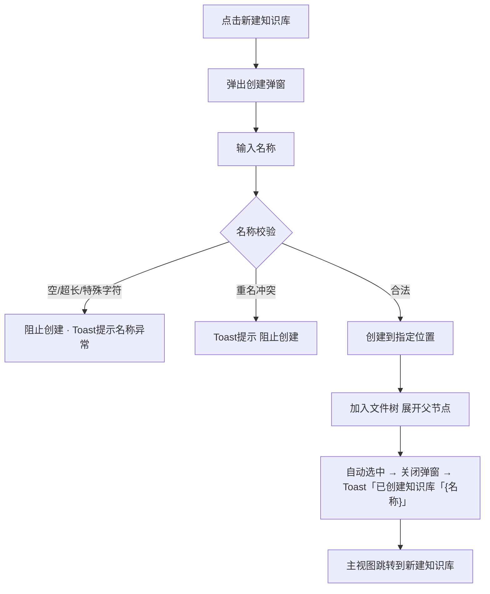

**说明**：知识库创建后自动进入该知识库的文件列表视图，形成「创建即进入」的流畅体验。

##### 界面原型

| 操作 | 交互 | 截图/示例 |
| --- | --- | --- |
| 点击侧栏「新建知识库」按钮 | 弹出新建知识库弹窗 | 待补充 |
| 知识库名称输入 | 输入框实时校验 | — |
| 选择所属空间 | 公共空间/个人空间单选 | — |
| 点击重命名知识库 | 知识库名称变为行内编辑框 | — |
| 删除知识库 | 二次确认弹窗，确认后逻辑删除，Toast 提示「已删除」 | — |
| 在知识库内点击新建知识库 | Toast 提示「知识库内只能新建文件夹」 | — |

##### 业务规则和约束条件

*   名称超过 64 字符时拒绝创建并 Toast 提示「名称不能超过 64 个字符」
    
*   名称不能包含特殊字符 `/\:*?"<>\|`，含特殊字符时拒绝创建并提示具体非法字符
    
*   名称不可与同空间已有知识库重复
    
*   公共空间仅系统管理员可新建/重命名/删除知识库
    
*   个人空间仅本人可新建/重命名/删除自己的知识库
    
*   删除知识库后连带逻辑删除其下所有文件和文件夹（逐级标记 isDeleted），级联影响详见 3.2.3.4.5 补充说明「删除级联规则」
    

##### 补充说明

**行内编辑交互规范**（适用于知识库重命名、文件夹重命名、文件重命名）：

| 规则项 | 说明 |
| --- | --- |
| 进入编辑 | 点击重命名菜单项，名称文字变为输入框，自动全选文本 |
| 确认保存 | Enter 键确认；输入框失去焦点（Blur）时自动保存 |
| 取消编辑 | Esc 键取消，恢复原名称 |
| 空名称 | 阻止保存，Toast 提示「名称不能为空」，输入框保持编辑状态 |
| 未修改 | 名称与原名一致时，不做任何操作直接退出编辑 |
| 校验失败 | 超长或含特殊字符时阻止保存，Toast 提示具体原因，输入框保持编辑状态 |
| 重名校验 | 与同范围已有名称重复时阻止保存，Toast 提示「名称已存在」 |
| 最大长度 | 输入框限制 64 字符，达到上限后不再接受输入 |
| 权限 | 仅公共空间管理员或个人空间本人在对应节点可见重命名菜单项 |

**新建知识库弹窗补充**：

*   空间选择器默认选中当前所在空间；系统管理员在公共空间时可切换选择个人空间；普通员工在公共空间时新建按钮隐藏，在个人空间时仅可选个人空间
    
*   在知识库列表页点击新建知识库时，空间选择器可见；在某个知识库内点击侧栏新建按钮时，提示「知识库内只能新建文件夹」而非弹出知识库创建弹窗
    

#### 新建/重命名/删除文件夹

##### 功能需求描述

| EARS 模式 | 需求描述 |
| --- | --- |
| 普遍型 | \* 系统应支持在知识库下创建子文件夹，MVP 支持一层嵌套。<br>\* 系统应校验文件夹名称不超过 64 字符，不含特殊字符 `/\:*?"<>\|`。<br>\* 系统应在同一父节点下不允许存在同名文件夹。不同父节点下允许同名。 |
| 状态驱动型 | \* 当用户在文件夹内（非知识库根目录）点击新建文件夹时，系统应提示「文件夹仅支持一层嵌套，无法继续新建」。 |
| 事件驱动型 | \* 当用户点击「新建文件夹」时，系统应弹出新建弹窗。<br>\* 当用户点击删除文件夹时，系统应二次确认后递归逻辑删除其下所有文件（逐级标记 isDeleted）。<br>\* 当用户点击重命名时，系统应进入行内编辑模式。 |
| 不良行为型 | \* 当名称输入为空时，系统应阻止创建并 Toast 提示「请输入文件夹名称」。<br>\* 当名称与同父节点下已有文件夹重名时，系统应拒绝创建并 Toast 提示「此位置已存在同名文件夹」。<br>\* 当所属位置已删除时，系统应提示「所属位置异常」并关闭弹窗。 |

##### 业务主流程图及说明

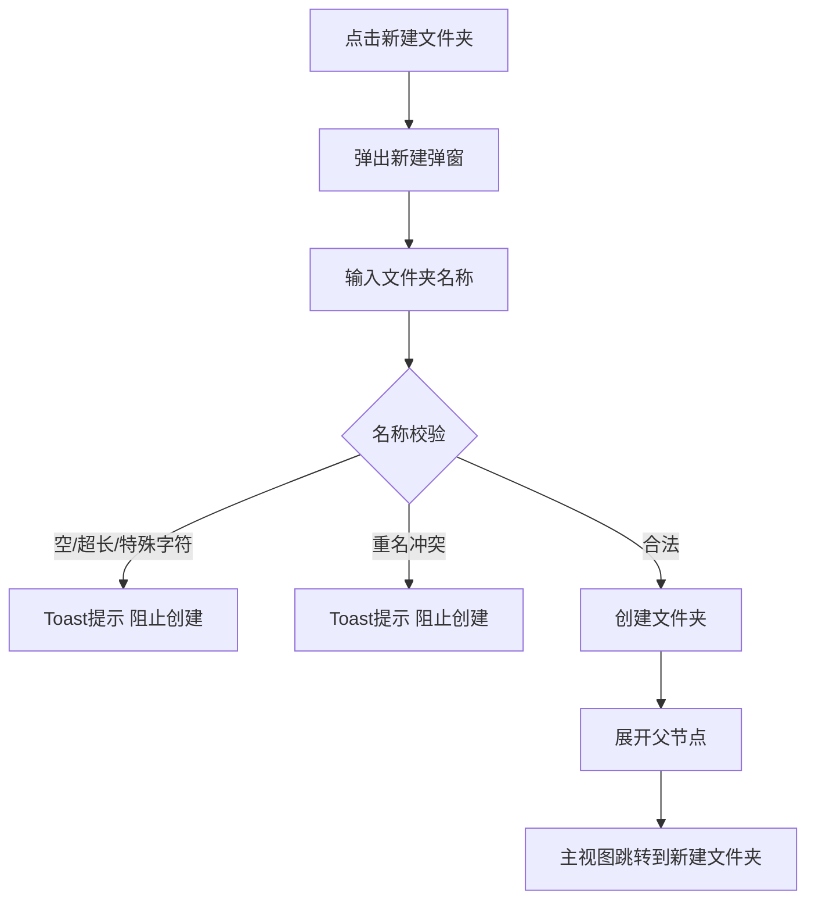

**说明**：文件夹的所属位置根据当前所处父节点确定。

##### 界面原型

| 操作 | 交互 | 截图/示例 |
| --- | --- | --- |
| 点击「新建文件夹」按钮 | 待补充 |  |
| 名称输入为空 | 阻止创建 · Toast 提示「请输入文件夹名称」 | — |
| 选择目标知识库 | 待补充 |  |
| 点击重命名文件夹 | 文件夹名称变为行内编辑框，回车确认 | — |
| 删除文件夹 | 二次确认后递归删除所有子文档和子文件夹 | — |

##### 业务规则和约束条件

*   对于有权限的用户，允许在知识库中新建文件夹
    
*   文件夹名称 ≤ 64 字符，不含特殊字符 `/\:*?"<>\|`
    
*   同一父节点（同一知识库根目录 / 同一文件夹）下不允许存在同名文件夹
    
*   文件夹删除是递归操作，其下所有文件一并逻辑删除（逐级标记 isDeleted），级联影响详见 3.2.3.4.5 补充说明「删除级联规则」
    
*   MVP 阶段文件夹仅支持一层嵌套
    

##### 补充说明

无。

#### 权限管理

知识库权限决定用户能看到哪些内容、能做什么操作。仅知识库支持权限设置，文件夹和文件继承知识库权限，不独立设置。非成员用户不可感知知识库存在。

##### 功能需求描述

| EARS 模式 | 需求描述 |
| --- | --- |
| 普遍型 | \* 系统应提供**系统管理员**和**普通员工**两种角色。<br>\* 系统管理员由后端全局配置，天然对所有公共空间知识库具有管理权，不依赖特定知识库创建行为。<br>\* 普通员工无默认查看权限，需由系统管理员按**部门、角色组、人员**授予查看权限。<br>\* 系统应在权限设置弹窗中展示「成员授权」标签页，以表格展示当前已授权的成员。<br>\* 系统应采用**左右 1:1 布局弹窗**完成成员添加：左侧为选择区（部门树形勾选/角色组卡片勾选/人员列表），右侧为已选成员列表。<br>\* 授权动作即授予对该知识库的查看权限，角色为普通员工。 |
| 状态驱动型 | \* 当左侧勾选的成员/角色组已在主表格中存在时，系统应置灰左侧选项并提示「已自动过滤 N 位已存在成员」。<br>\* 当部门作为选源时，勾选部门等于批量选择该部门下的个人，部门本身不作为成员行展示。<br>\* 当角色组作为选源时，角色组本身作为独立成员行展示在主表格中（如「👥 AI项目小组」），点击可展开查看组内人员。<br>\* 当非成员用户尝试访问知识库时，系统应返回「无权限」且不可感知知识库存在。 |
| 事件驱动型 | \* 当用户点击「保存设置」时，系统应全量校验后落库生效。<br>\* 当用户移除成员时，系统应展示二次确认弹窗。<br>\* 弹窗关闭（点击确定）仅刷新主表格展示，不落库。点击「保存设置」后全量校验生效。 |
| 不良行为型 | \* 系统管理员不可通过界面移除自身的管理权限，需通过后端配置变更。<br>\* 个人空间不展示权限配置入口。 |

##### 业务主流程图及说明

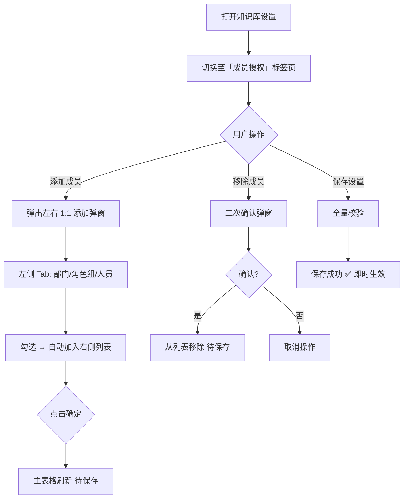

**说明**：弹窗只负责添加新成员，主表格负责展示与行内调整。所有变更在点击「保存设置」后全量校验并落库。

##### 界面原型

| 操作 | 交互 | 截图/示例 |
| --- | --- | --- |
| 知识库设置 → 成员授权 | 打开权限设置弹窗，左侧导航「成员授权」 | 待补充 |
| 添加成员 | 弹出左右 1:1 布局弹窗，左侧为部门/角色组/人员 Tab | 待补充 |
| 部门勾选 | 树形结构展开部门下属人员，勾选即选人 | — |
| 角色组勾选 | 卡片展示角色组，勾选后以组行加入右侧 | — |
| 人员选择 | 列表展示，支持搜索 | — |
| 成员列表主表格 | 每行：成员名 + 权限（固定「查看」）+ 操作（移除） | 待补充 |
| 保存设置 | 底部按钮，点击全量保存生效 | — |

##### 业务规则和约束条件

*   仅知识库支持权限设置，文件夹和文件不独立设置权限（全量继承知识库权限）
    
*   非成员用户看不到知识库的存在
    
*   系统管理员由后端全局配置，不可通过界面移除自身管理权
    
*   弹窗单次添加成员最多 30 个
    
*   已存在的成员不可重复添加（弹窗自动去重）
    
*   角色组作为独立成员行展示，支持展开查看组内人员
    
*   个人空间不展示权限配置入口
    
*   角色变更存在草稿状态，点击配置生效（确认）按钮才会启用编辑后的成员权限
    

##### 补充说明

无。

### 文件全生命周期管理

本节覆盖文件在知识中心中的完整生命周期：上传（含状态流转）、搜索、预览、删除。

#### 文件上传

##### 功能需求描述

| EARS 模式 | 需求描述 |
| --- | --- |
| 普遍型 | \* 系统应在用户点击上传时，默认以当前选中的知识库或文件夹作为上传目标位置。<br>\* 系统应在上传弹窗顶部展示目标位置选择器，用户可切换上传到知识库根目录或任意子文件夹。<br>\* 当用户未进入任何知识库时，**不展示上传按钮**。<br>\* 系统应在上传弹窗中展示「选择文件」区域，支持点击选择文件。<br>\* 支持的格式、大小、数量约束详见「全局交互约定 → 文件格式支持矩阵」和「文件上传约束」。<br>\* 系统应采用纯状态标识设计，不展示进度条。<br>\* 系统应在文件上传提交后，在页面右下角展示浮层任务列表。默认展示最近 4 个任务，超过 4 个时列表内部可滚动，点击展开可查看全部任务。 |
| 状态驱动型 | \* 当上传状态为「处理失败」时，系统应支持手动重试（最多 2 次，点击后重新走处理流程而非重新上传文件）。 |
| 事件驱动型 | \* 前端逐项校验不通过时，在候选列表中对该文件标注红色并提示具体原因（如「文件大小超过 100MB」），用户可移除该文件或关闭弹窗重新选择。 |
| 不良行为型 | \* 格式伪装文件 → 服务端检测到扩展名与文件头不匹配，标记为「上传失败」。<br>\* 加密文件 → 服务端解析时发现文件已加密，标记为「处理失败」。<br>\* 重复文件（内容指纹相同，同一知识库内）→ 秒传完成，在该位置追加一条文件引用记录，不重复存储。**跨知识库允许重复**（不受 SHA 校验拦截）。<br>\* 同一父节点下同名文件 → 上传前服务端校验，Toast 提示「此位置已存在同名文件」，拒绝上传。不同父节点下允许同名。 |

##### 业务主流程图及说明

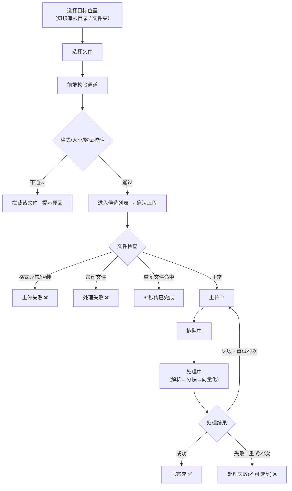

**说明**：上传前必须选择目标位置——用户选中知识库后点上传，默认目标为该知识库根目录；用户选中文件夹后点上传，默认目标为该文件夹。上传弹窗内允许重新选择位置。文件处理包含解析、分块、向量化等后台步骤，用户通过状态标识感知进度。

##### 界面原型

| 操作 | 交互 | 截图/示例 |
| --- | --- | --- |
| 点击「上传文件」按钮 | 弹出上传弹窗，展示文件选择区域 | 待补充 |
| 候选列表中文件校验失败 | 该文件标红并提示原因，可移除 | — |
| 点击「确认上传」 | 右下角浮层展示任务列表，状态实时更新 | — |
| 处理失败任务点击「手动重试」 | 重新触发处理流程 | — |

##### 业务规则和约束条件

*   格式、大小、数量等约束详见「全局交互约定 → 文件上传约束」和「文件格式支持矩阵」
    
*   前端校验在文件加入候选列表时逐项执行，校验顺序：扩展名 → 文件大小 → 空文件 → 总数量。不通过的文件在列表中标红并展示原因，不阻止其他合法文件加入
    
*   同名文件校验在点击「确认上传」时由服务端执行（因需查询同父节点下已有文件名）
    
*   同一父节点下同名文件 → 服务端校验后 Toast 提示「此位置已存在同名文件」，拒绝上传。不同父节点下允许同名共存
    
*   解析失败自动重试 2 次（服务端自动执行，间隔 5s），超过则标记为「处理失败(不可恢复)」
    
*   最新上传优先展示在文件列表顶部（按 `uploadedAt` 降序）
    
*   文件状态共6种，各状态定义、触发条件及 UI 展示形态详见下方状态字典
    

##### 补充说明

**安全检测**：

*   上传前前端校验格式与大小，不进传输流程
    
*   上传后服务端识别伪装格式与加密文件，分别标记为「上传失败」「处理失败」
    

**空间切换与上传任务**：切换空间时，正在进行中的上传任务不受影响，右下角任务列表持续展示。任务列表为全局浮层，不随空间切换而清空。

**状态字典**：

| 状态 | 定义 | 触发条件 | 用户操作 | UI 展示 |
| --- | --- | --- | --- | --- |
| 上传中 | 文件正在上传至服务端 | 确认上传后 | 等待完成 | 进度标识 |
| 排队中 | 上传完成，等待解析调度 | 上传完成后进入队列 | 等待完成 | 排队图标 |
| 处理中 | 文件正在解析/分块/向量化 | 队列调度到该任务 | 等待完成 | 处理中动画 |
| 已完成 | 解析入库成功，可检索可预览 | 处理成功 | 预览、问答、删除 | 绿色 ✅ |
| 上传失败 | 文件未到达服务端（格式伪装、网络中断） | 校验不通过或传输中断 | 重新上传 | 红色 ❌ + 原因 |
| 处理失败 | 解析异常但可重试（临时服务异常） | 处理异常，重试 ≤ 2 次 | 手动重试（≤2次） | 橙色 + 重试按钮 |

#### 文件搜索

##### 功能需求描述

> 搜索规则（全局搜索、匹配逻辑、自动补全建议、键盘导航、无结果处理等）详见「全局交互约定 → 搜索规则」。本节仅定义与文件搜索相关的特有行为。

| EARS 模式 | 需求描述 |
| --- | --- |
| 普遍型 | \* 系统应在主栏头部展示搜索框。placeholder 统一展示「搜索知识库、文件夹、文件...」。<br>\* 搜索结果以自动补全下拉面板展示，每条展示图标 + 名称 + 父路径。<br>\* 搜索框右侧展示 ✕ 清空按钮（有输入内容时显示）。 |
| 状态驱动型 | \* 当无匹配结果时，补全面板展示空态提示「未找到匹配结果」。<br>\* 搜索范围为全局匹配，不依赖当前上下文。 |
| 事件驱动型 | \* 当用户在搜索框输入关键词时，300ms 防抖后执行搜索，补全面板实时展示结果。<br>\* 当选中有父路径的搜索结果时，跳转到对应知识库/文件夹。 |
| 不良行为型 | \- |

##### 业务主流程图及说明

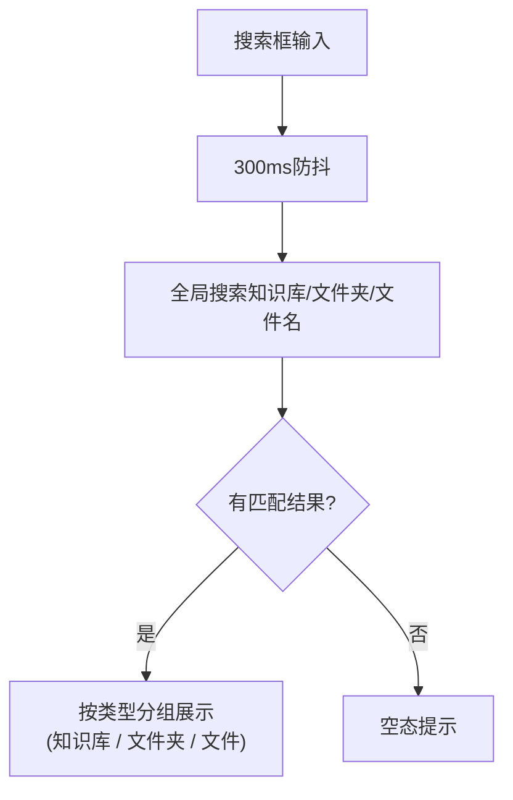

**说明**：同时搜索全局的知识库、文件夹和文件名称，结果按类型分组展示。

##### 界面原型

| 操作 | 交互 | 截图/示例 |
| --- | --- | --- |
| 在搜索框输入关键词 | 300ms防抖后触发全局搜索 | 待补充 |
| 搜索匹配 | 同时匹配知识库名、文件夹名和文件名，按类型分组展示 | — |
| 无匹配结果 | 展示空态提示组件 | — |

##### 业务规则和约束条件

通用规则（匹配逻辑、防抖、键盘导航、Suggestion 上限等）详见「全局交互约定 → 搜索规则」。本节仅补充文件搜索特有约束：

*   MVP 不支持正文搜索，仅搜索知识库名、文件夹名和文件名
    
*   选中搜索结果中的文件 → 打开预览面板；选中文件夹 → 跳转到该文件夹视图；选中知识库 → 进入该知识库
    
*   搜索框清空后恢复完整列表，保留原来的滚动位置
    

##### 补充说明

搜索策略建议：MVP 阶段统一走服务端全局搜索接口，前端负责 300ms 防抖和 Suggestion 面板展示。

#### 文件预览

##### 功能需求描述

| EARS 模式 | 需求描述 |
| --- | --- |
| 普遍型 | \* 系统应支持在右侧预览面板中预览文件。<br>\* 系统应在预览面板展示文件大纲导航，支持点击跳转到对应章节。<br>\* 系统应展示文件元信息：文件名、格式、更新时间、上传者。 |
| 状态驱动型 | \* 当所有预览标签关闭时，系统应隐藏标签栏并收起预览面板。<br>\* 当被预览的文件被删除时，系统应自动关闭该文件的预览标签。 |
| 事件驱动型 | \* 当用户点击文件名时，系统应将文件加入预览标签，在右侧面板展示文件正文和大纲。<br>\* 当用户点击大纲项时，系统应按章节跳转。<br>\* 当用户点击引用链接时，系统应高亮对应大纲章节。<br>\* 小智问答面板由用户通过右侧面板入口主动打开，不与文件预览强制联动。 |
| 不良行为型 | \* 引用来源找不到文件时按精确匹配→部分匹配→无操作降级。 |

##### 业务主流程图及说明

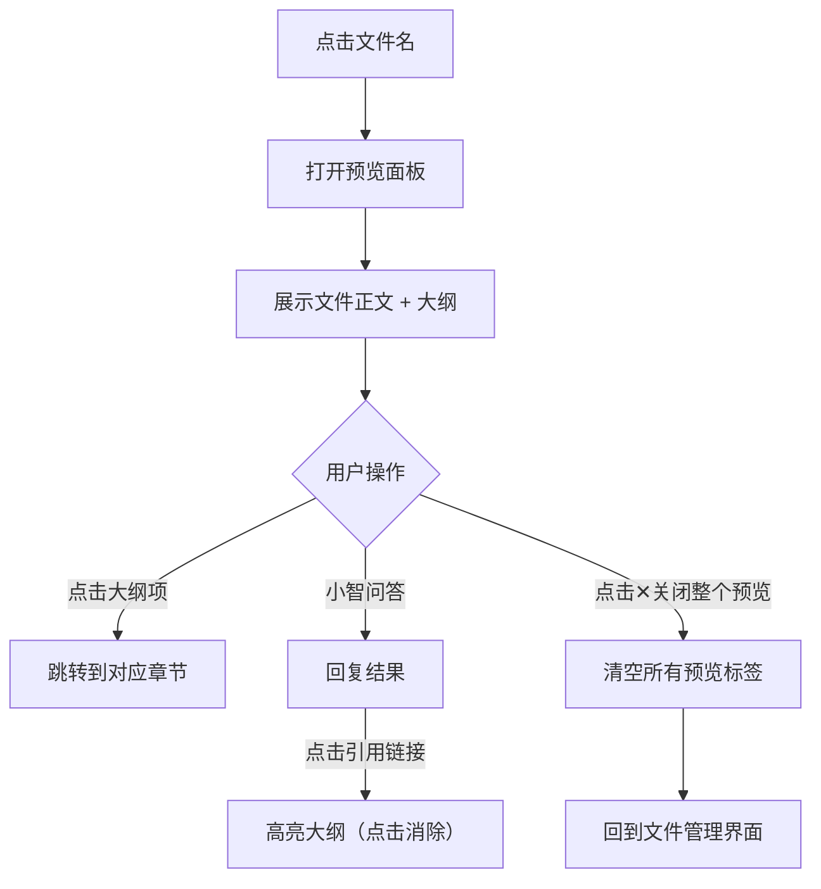

**说明**：文件预览与小智问答为独立面板。用户点击文件默认仅打开预览，可通过右侧面板入口手动呼出小智问答。预览与问答可同时展开，也可独立使用。

##### 界面原型

| 操作 | 交互 | 截图/示例 |
| --- | --- | --- |
| 右侧打开预览面板 + Tags栏，小智面板同步打开 | 待补充 |  |
| 文件正文跳转到对应章节位置 | 待补充 |  |
| 点击✕关闭单个标签 | 移除该文件预览 | — |
| 点击✕关闭整个预览 | 清空所有预览标签 | — |
| 高亮大纲项 | 黄色边框高亮，用户点击其他地方后消除 | — |

##### 业务规则和约束条件

*   左下三栏（文件列表+预览+小智）同时展开时，预览面板宽度自适应，支持拖动调整
    
*   删除正在预览的文件自动关闭预览
    
*   引用来源找不到文件时按精确匹配→部分匹配→无操作降级
    
*   **预览格式支持**：各格式的预览方式、大纲来源、优先级详见「全局交互约定 → 文件格式支持矩阵」。
    

##### 补充说明

扫描 PDF 的判断：服务端解析时若发现 PDF 无文字层（仅有图片），预览展示图片，但不生成大纲，不提取检索文本

#### 文件删除

##### 功能需求描述

| EARS 模式 | 需求描述 |
| --- | --- |
| 普遍型 | \* 系统应支持单个文件删除和批量删除。<br>\* 系统应在删除时从文件列表移除（前端过滤 isDeleted=true 的记录），关闭预览（如正在预览），后端标记 isDeleted=true 完成逻辑删除。 |
| 状态驱动型 | \* 当正在预览的文件被删除时，系统应自动关闭该文件的预览标签。  <br>\* 当批量删除超过 50 个文件时，系统应 Toast 提示「单次最多删除 50 个文件」并阻止。 |
| 事件驱动型 | \* 当用户点击文件行内删除按钮时，系统应弹出二次确认弹窗。<br>\* 当用户勾选多个文件后点击批量删除按钮时，系统应弹出二次确认弹窗，确认后执行批量删除并 Toast「已删除 N 个文件」。<br>\* 当用户点击表头复选框时，系统应全部选中或取消全部选中。 |
| 不良行为型 | \* 当用户无编辑权限时（公共空间非管理员、个人空间非本人），系统应隐藏删除按钮。 |

##### 业务主流程图及说明

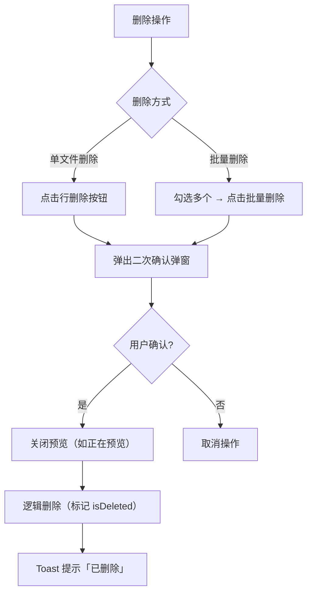

**说明**：MVP 阶段文件删除为逻辑删除（标记 isDeleted=true），数据不物理清除。MVP 不提供回收站界面，用户无法自行恢复。删除前必须二次确认，避免误操作。

##### 界面原型

| 操作 | 交互 | 截图/示例 |
| --- | --- | --- |
| 文件行点击删除 | 弹出二次确认弹窗，确认后删除，Toast提示已删除 | — |
| 勾选多个文件 → 批量删除 | 顶部出现已选N项操作栏，点击「删除」弹出二次确认 | — |
| 表头复选框全选 | 全部选中或取消全部选中 | — |

##### 业务规则和约束条件

*   文件删除为逻辑删除（后端标记 isDeleted=true），数据保留不物理清除。MVP 不提供回收站界面，用户无法自行恢复
    
*   逻辑删除后的文件：不在文件树和列表中展示、不参与搜索、不参与问答检索；已有问答引用标记为失效
    
*   逻辑删除释放同名占位，同父节点下可立即创建/上传同名文件，没有“闪传”逻辑
    
*   删除超过60天定时任务物理删除
    
*   知识库/文件夹/文件的文档计数仅统计 isDeleted=false 的记录
    
*   删除前必须二次确认
    
*   单次批量删除上限为 50 个文件，超过时 Toast 提示「单次最多删除 50 个文件」
    
*   表头复选框全选仅选中当前视图内已加载的文件（非跨页全选）
    
*   正在预览的文件被删除时自动关闭预览标签
    
*   公共空间仅系统管理员可删除文件，个人空间仅本人可删除自己的文件
    
*   **关键规则**：
    

*   删除操作为逻辑删除，数据保留但用户不可见。MVP 无回收站，用户无法自行恢复
    
*   文件被逻辑删除后，同父节点下即可创建同名文件。
    
*   逻辑删除释放同名占位后，上传同名但内容不同的文件视为新文件，走正常上传流程
    
*   确认弹窗需明确告知用户删除范围
    
*   删除知识库时弹窗文案：「确认删除知识库『{名称}』？其下所有文件夹和文件将一并删除，已产生的问答引用将失效。删除后可在 30 天内联系管理员恢复。」
    
*   删除文件夹时弹窗文案：「确认删除文件夹『{名称}』？其下所有文件将一并删除，已产生的问答引用将失效。」
    
*   删除文件时弹窗文案：「确认删除文件『{名称}』？删除后将不再出现在知识库中，已产生的问答引用将失效。」
    

##### 补充说明

**删除级联规则**（适用于文件删除、文件夹删除、知识库删除）：

| 被删除对象 | 正在预览该文件的用户 | 小智问答引用 | 小智历史回答 |
| --- | --- | --- | --- |
| 文件 | 自动关闭该文件的预览标签；若关闭后无标签则收起预览面板 | 点击引用序号 → Toast 提示「来源已失效」 | 历史回答保留展示，但引用标记置灰并标注「已失效」 |
| 文件夹 | 同「文件」规则，递归作用于文件夹下所有文件 | 同「文件」规则 | 同「文件」规则 |
| 知识库 | 同「文件」规则，递归作用于知识库下所有文件和文件夹 | 同「文件」规则 | 同「文件」规则 |

### 知识库问答

知识库问答是知识中心的核心价值功能。小智助手基于当前选中的知识库，MVP 阶段提供智能问答和知识检索两种模式。

#### 3.2.4.1 小智问答

##### 功能需求描述

| EARS 模式 | 需求描述 |
| --- | --- |
| 普遍型 | \* 系统应在右侧面板提供「小智」问答助手，基于当前选中的知识库回答问题。<br>\* 系统应在回答中展示「溯源引用」，可点击跳转到源文档。<br>\* 系统应保留最近 5 轮对话上下文。<br>\* 系统应按以下规则确定问答的检索范围：① 以用户当前选中的知识库为唯一检索范围；② 若用户未选中任何知识库（处于知识库列表页），小智面板底部展示提示「请先选择知识库开始提问」，输入框置灰不可用。 |
| 状态驱动型 | \* 当检索无结果时，系统应拒答并展示「知识库中未找到相关信息，建议尝试：① 更换关键词重新提问；② 确认已选择正确的知识库；③ 上传相关文档补充知识库」。<br>\* 当检索结果置信度低于阈值时，系统应拒答并展示「该问题在知识库中未找到足够可靠的依据，建议尝试更具体的问题表述」。<br>\* 当用户切换知识库时，当前正在生成的回答不受影响（继续使用原范围），新问题使用切换后的知识库范围。<br>\* 图谱分析和数据洞察模式在 MVP 阶段不展示入口（不占位、不置灰），后续版本再开放。 |
| 事件驱动型 | \* 当用户输入问题时，系统应经过安全检测后执行检索。<br>\* 当大模型调用超时（>30s）时，系统应提示超时并建议重试。<br>\* 当用户点击发送按钮（或 Enter 键）时，系统应发送问题，Enter 发送 / Shift+Enter 换行。 |
| 不良行为型 | \* 命中敏感词时拒绝回答。<br>\* 检测到 Prompt 注入时拦截并返回安全提示。 |

##### 业务主流程图及说明

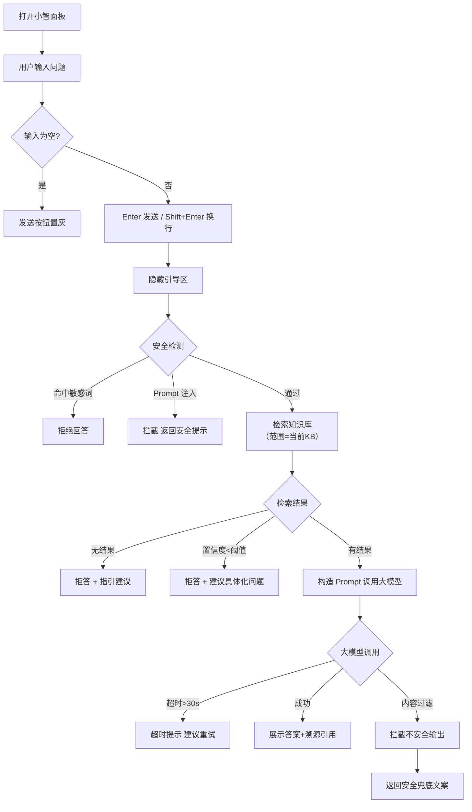

**说明**：问答的完整链路为「输入 → 安全检测 → 检索 → 构造Prompt → 大模型生成 → 展示答案+引用」。所有健康检查在调用大模型前完成，确保安全可控。

##### 界面原型

| 操作 | 交互 | 截图/示例 |
| --- | --- | --- |
| 点击小智入口按钮 | 右侧面板展开小智问答，默认智能问答模式 |  |
| 预览面板 + 小智面板同时展开 | 右侧分为左右两栏，预览在左、小智在右，支持拖动调整宽度 | 待补充 |
| 两种模式选择 | 智能问答 / 知识检索，默认智能问答 |  |
| 输入区输入问题 | Enter发送，Shift+Enter换行，输入框自动扩展高度 |  |
| 发送按钮 | 有内容时高亮可点击，无内容时置灰 | — |
| 问题发送后 | 问题气泡+回答气泡展示，每轮对话包含引用来源 | 待补充 |
| 点击引用链接 | 打开源文件预览标签，高亮对应大纲章节 | 待补充 |
| 复制消息 | 点击复制图标，消息内容拷贝到剪贴板 | 待补充 |
| 编辑问题 | 点击编辑图标，进入行内编辑，保存后重新回答 | 待补充 |
| 重试 | 点击重试图标，重新触发当前问题的回答 | 待补充 |
| 引用上一条回答 | 点击引用图标，新提问引用上一条回答内容 | 待补充 |

##### 业务规则和约束条件

*   **上下文窗口**：保留最近 5 轮对话。1 轮 = 1 条用户问题 + 1 条 AI 回答（含引用）。第 6 轮发送时，最早的第 1 轮从上下文窗口移除，但消息气泡仍保留在面板中展示，仅不参与后续检索和生成
    
*   **跨轮指代**：支持代词消解（如"它"、"这个"指代上文提到的文档或概念）
    
*   **持久化**：消息自动保存至服务端，刷新页面后恢复最近对话。恢复范围为最近 5 轮，更早的消息不恢复
    
*   知识库问答只维护当前知识库的单一对话上下文，不提供新建/切换/删除会话功能。切换知识库时清空当前对话
    
*   **检索范围规则**：
    
    *   检索范围 = 当前选中的知识库（唯一范围，未选中知识库时不可提问）
        
    *   切换知识库时，进行中的回答不受影响；新问题使用新范围，同时清空对话历史
        
*   **MVP 模式范围**：仅保留「智能问答」和「知识检索」两个模式；「图谱分析」「数据洞察」不在 MVP 中展示入口
    
*   **消息操作交互**：
    

| 操作 | 行为 |
| --- | --- |
| 复制消息 | 点击复制图标，将消息全文拷贝到剪贴板，Toast 提示「已复制」 |
| 编辑问题 | 点击编辑图标，用户问题变为行内编辑框；修改后按 Enter 保存，重新生成回答（替换旧回答），旧回答不保留。编辑后该轮之后的所有对话清空 |
| 重试 | 点击重试图标，使用同一个问题重新调用大模型生成回答，替换当前回答，旧回答不保留 |
| 引用上一条回答 | 点击引用图标，将上一条 AI 回答的摘要以引用块形式插入到输入框光标位置 |

##### 补充说明

**安全检测**：问答入口统一检查敏感词和 Prompt 注入。命中敏感词直接拒答；命中 Prompt 注入则返回安全提示。

#### 溯源引用与预览联动

##### 功能需求描述

| EARS 模式 | 需求描述 |
| --- | --- |
| 普遍型 | \* 系统应在小智回答中标记引用来源，关联的引用来源在答案下方以卡片形式展示。<br>\* 系统应支持引用来源点击跳转：打开源文件预览并高亮对应大纲章节。 |
| 状态驱动型 | \* 当源文档已被删除时，系统应显示「来源已失效」。<br>\* 当引用索引超出范围时，系统应不跳转。 |
| 事件驱动型 | \* 当用户点击引用卡片上的来源序号时，系统应跳转到对应文档章节。<br>\* 当用户点击引用序号（上标数字）时，系统应打开源文件预览标签。<br>\* 高亮持续到用户点击其他地方后消除。 |
| 不良行为型 | \- |

##### 业务主流程图及说明

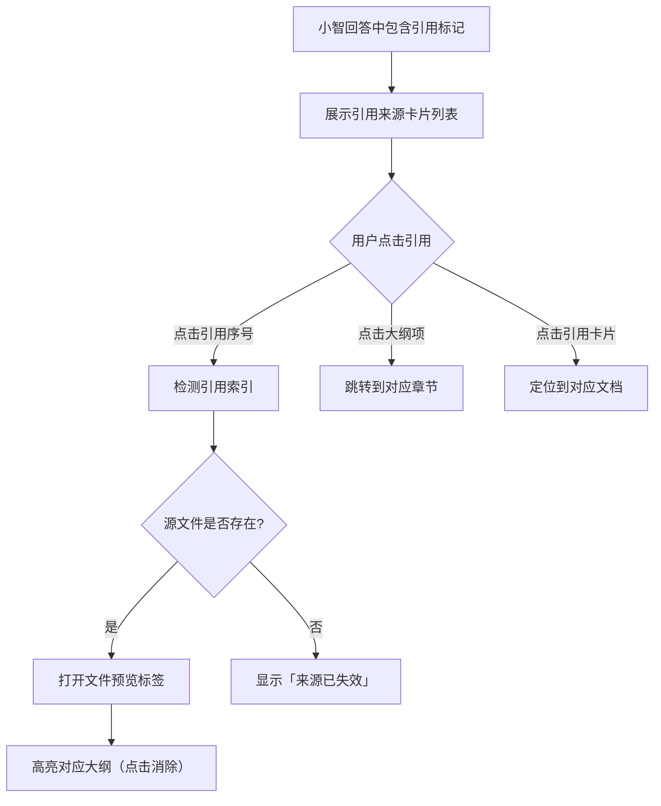

**说明**：溯源引用与文件预览面板深度联动，形成「问题→答案→原文→章节」的完整闭环。

##### 界面原型

| 操作 | 交互 | 截图/示例 |
| --- | --- | --- |
| 引用序号以蓝色上标 `[1]` 展示，点击后打开源文件预览 | 待补充 |  |
| 引用来源卡片 | 答案下方以列表展示引用文件，每项包含文件名、来源序号 | 待补充 |
| 引用高亮持续 | 高亮持续到用户点击其他地方后消除 | — |

##### 业务规则和约束条件

*   引用索引超出范围时不跳转
    
*   源文档已删除时显示「来源已失效」
    
*   引用来源精确匹配文档名称，匹配失败时按部分匹配降级
    

##### 补充说明

溯源引用设计的核心原则：**每一段回答都能追溯到原文**，确保知识库问答的「可信可验证」。

# 非功能需求

## 性能要求

| 指标 | 要求 | 说明 |
| --- | --- | --- |
| 首页加载 | P95 ≤ 2s | 知识中心页面整体加载 |
| 文件树展开 | P95 ≤ 500ms | 展开文件夹/知识库节点 |
| 搜索响应 | P95 ≤ 100ms | 输入防抖后过滤响应 |
| 文件上传确认 | P95 ≤ 1s | 点击确认到上传启动 |
| 文件处理 | P95 ≤ 30s | 从上传完成到已完成（含排队） |
| 回答首token | P95 ≤ 3s | 流式输出第一个 token |
| 并发上传 | 支持 10 个文件同时触发，前端并发上传至 OSS 时不阻塞页面交互 |  |

## 安全要求

| 类别 | 要求 |
| --- | --- |
| 格式校验 | 拦截伪装格式文件（扩展名与实际内容不一致） |
| 加密文件处理 | 加密文件标记为「处理失败」 |
| 内容安全 | 问答输入做敏感词和注入检测，命中时拦截 |
| 预览安全 | 预览高亮内容做转义处理，防止注入 |

## 兼容性要求

| 项目 | 要求 |
| --- | --- |
| 浏览器 | Chrome、Edge、钉钉内置浏览器最近两个大版本 |
| 文件格式 | 详见「全局交互约定 → 文件格式支持矩阵」，P0 完整支持上传+检索+预览 |

# 迭代计划

## MVP（本期）

| 功能 | 优先级 | 覆盖范围 |
| --- | --- | --- |
| 三栏布局 + 空间切换 | P0 | 公共/个人空间切换、侧栏折叠展开 |
| 文件树 | P0 | 展开/折叠、行内操作按钮（新建文件夹、重命名、删除） |
| 新建知识库 | P0 | 名称校验、空间隔离、自动选中 |
| 新建文件夹 | P0 | 名称校验、位置选择（一层嵌套） |
| 文件上传（含解析） | P0 | 前端校验 → 文件检查 → 解析入库 → 状态流转 |
| 状态流转 | P0 | 7种状态 + 重试兜底 |
| 批量上传 | P0 | 最多 10 文件、重复文件秒传 |
| 文件预览 | P0 | 多标签（最多5个）、大纲导航 |
| RAG问答 | P0 | 智能问答模式、溯源引用 |
| 会话记忆 | P0 | 最近5轮上下文 |
| 文件搜索 | P0 | 文件名搜索、实时过滤 |
| 文件删除 | P0 | 单文件/批量删除、二次确认 |
| 权限模型（简化） | P0 | 公共空间管理员管理+全员可查看、个人空间本人管理 |