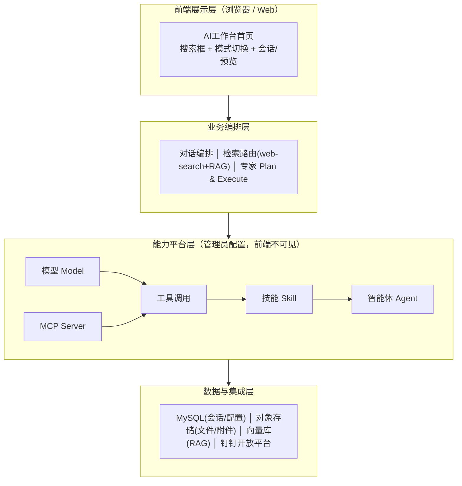
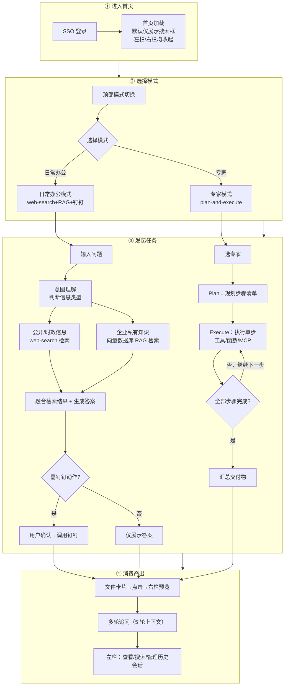
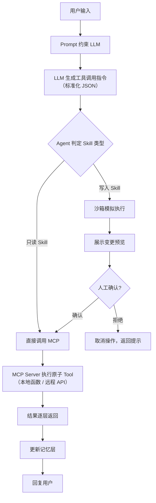
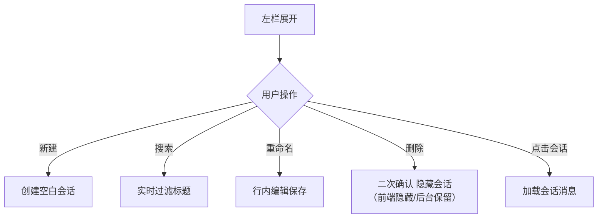
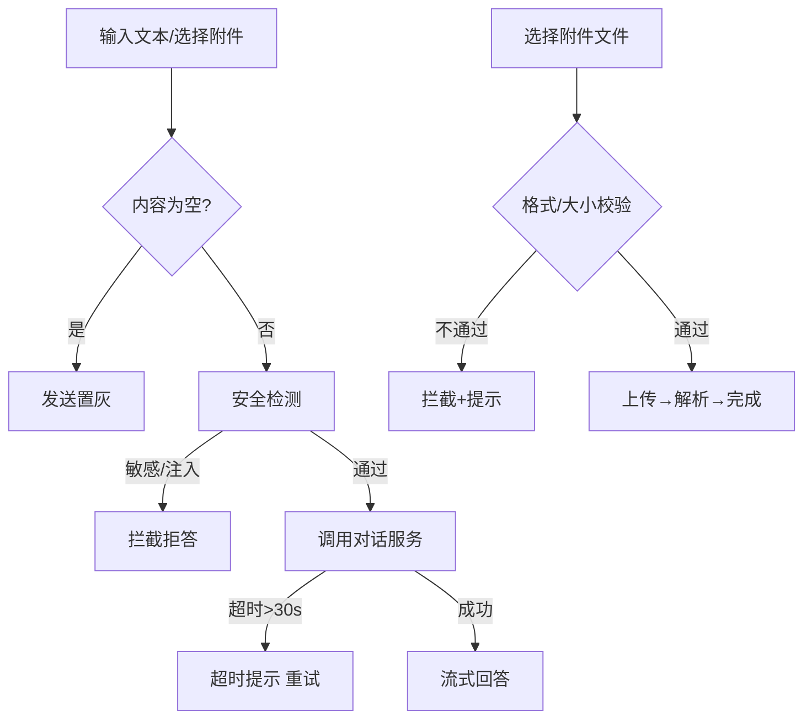
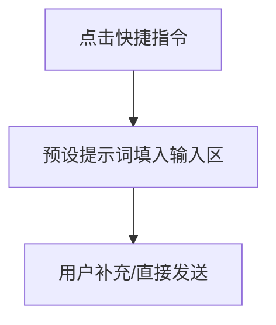
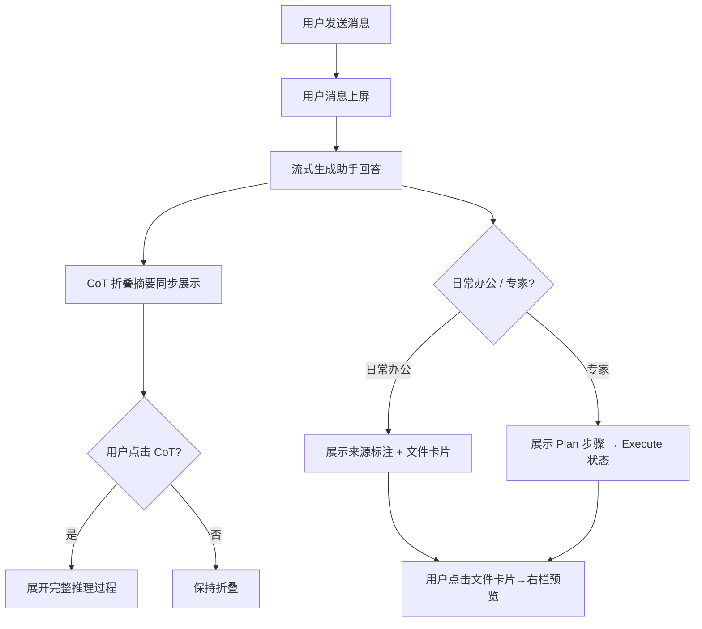
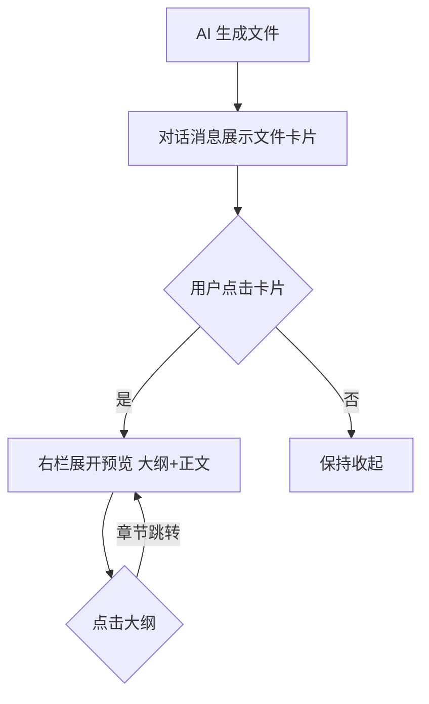
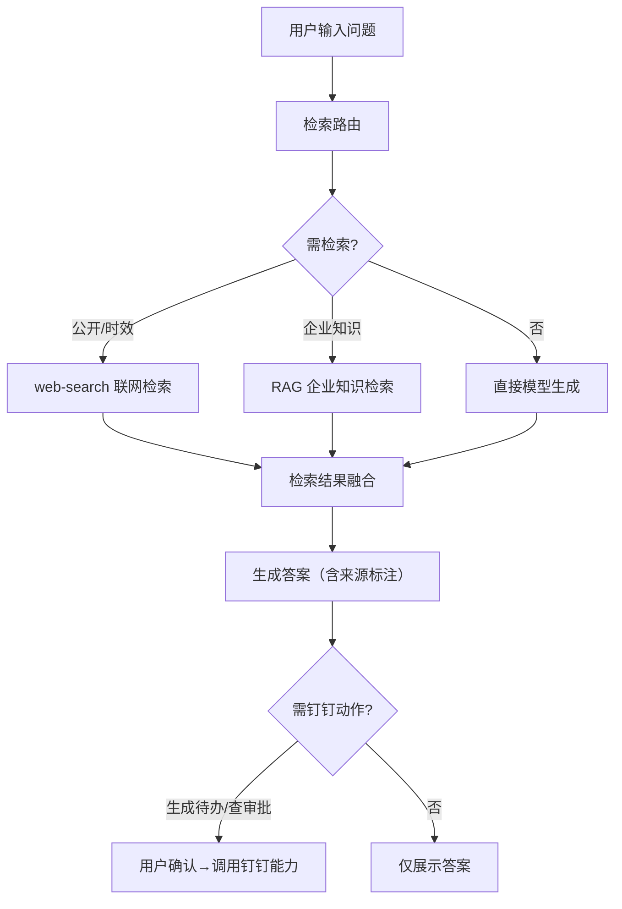
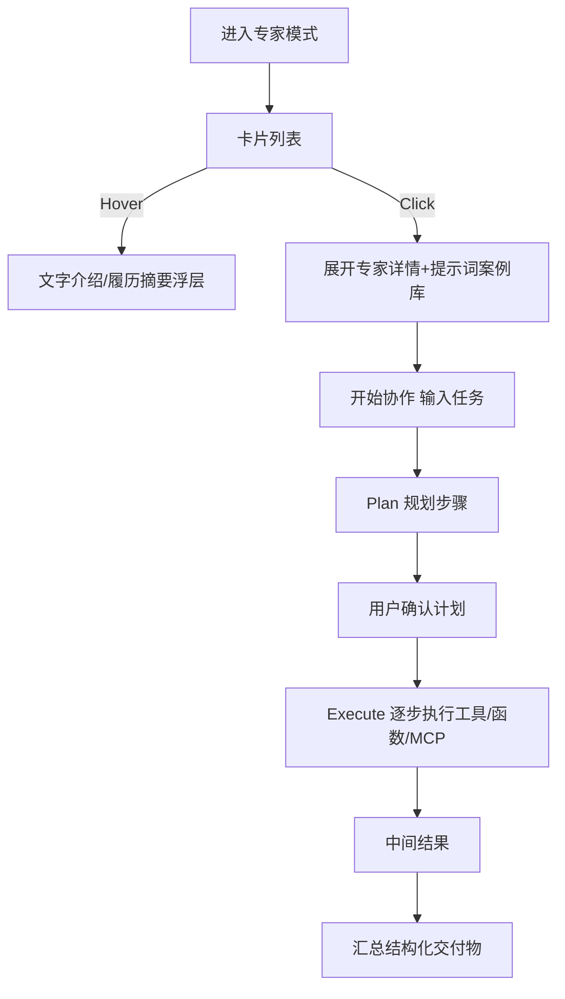

# 1. 关于本文档

## 1.1 版本信息

本表用于记录本文档的维护过程，请认真填写。

| 版本号 | 时间 | 状态 | 简要描述 | 部门 | 责任产品 | 批准人 |
| --- | --- | --- | --- | --- | --- | --- |
| V2.0 | 2026-07-08 | N | 面向企业全员的一站式 AI 协作入口 | AI项目小组 | @公输 |  |

注：状态可以为 N-新建、A-增加、M-更改、D-删除。

## 1.2 术语

| 术语 | 说明 | 归属层 |
| --- | --- | --- |
| 日常办公模式 | 以 web-search + RAG 为核心检索路由、接入钉钉能力落地的对话模式 | — |
| 专家模式 | 以 plan-and-execute 为核心范式、预置 10 位专家的结构化协作模式 | — |
| web-search | 联网公开信息实时检索 | — |
| RAG | 基于企业知识（钉钉文档/知识库/业务系统）的检索增强生成 | — |
| plan-and-execute | 先规划步骤（Plan）供用户确认、再逐步执行工具/MCP（Execute）、最终汇总交付物的专家协作范式 | — |
| CoT | 思维链（Chain of Thought），向用户展示 AI 推理过程，思考中详细展示、答后自动折叠 | — |
| Prompt | 输入给 LLM 的指令文本（System Prompt 定义角色与安全约束 + User Prompt 为业务任务），决定模型行为与工具调用规则 | L1 决策层 |
| 工具调用 | LLM 在 Prompt 约束下输出的标准化 JSON 调用指令（工具名+入参），模型只输出意图不执行；是 MCP 的底层依赖基础 | L1 决策层产出 |
| Tool | 最小粒度的原子执行单元（本地函数/Shell 脚本/远程 API），MCP Server 对外暴露的唯一形态，一个 Tool 只做单一动作 | L3 工具标准化层 |
| Skill | 业务层面的粗粒度能力，由多个 Tool + 条件判断 + 业务流程 + 安全校验编排而成，不在 MCP 协议定义之内；分为只读 Skill（自动执行）和写入 Skill（需人工确认） | L2 调度编排层 |
| MCP | Model Context Protocol，Agent ↔ Tool 之间的标准化通信协议；MCP Server 封装 Tool，MCP Client 接收工具调用指令 | L3 工具标准化层 |
| Agent | 智能体 = LLM + Prompt + 三层记忆（瞬时/短期/长期）+ 工具调用调度 + MCP 工具池 + 沙箱环境 + 安全审批；是面向用户的能力载体 | L4 最终产物 |
| 沙箱 | Agent 执行手脚的隔离环境，写入类 Skill 先在沙箱模拟执行、人工确认后再正式执行，防止破坏正式环境 | L3 工具标准化层 |
| 智能评估 | 跨层质量保障能力，对模型/Tool/Agent 提供统一的评估数据集、评估任务与报告；Agent 发布前推荐执行 | 跨层 |
| SSO | 单点登录，钉钉与浏览器双端认证 | — |

## 1.3 参考文档
为了更好理解本文档，请阅读如下文档。

| **编号** | **文档** | **说明及地址** |
| --- | --- | --- |
| 1 | 原型界面参考 | https://fri555.github.io/PORTL/ |

## 1.4 沟通要求
本表记录需要跨部门沟通的事项，以保证该文档内容质量。如果有其它跨部门沟通项，请填写该表中，并记录沟通结果。

| **序号** | **部门** | **沟通内容** | **沟通结果** |
| --- | --- | --- | --- |
| 1 |  |  | |
| 2 |  |  ||

# 2. 产品概述

## 2.1 产品定位

AI 工作门户首页智能体是面向企业普通员工的一站式 AI 协作入口。用户进入首页后，可在「日常办公模式」下通过 web-search + RAG 快速获取答案并落地为钉钉动作，或在「专家模式」下选择预置专家进行 plan-and-execute 结构化协作。产品以三栏布局为骨架（搜索框为焦点，左右栏默认收起），先做功能闭环、再逐步增强。

## 2.2 产品目标

1. **降低 AI 使用门槛**：普通员工无需了解模型/函数/MCP 等底层概念，即可通过自然语言完成日常工作与专家协作。
2. **打通"问→答→落地"闭环**：日常办公模式从检索到生成到钉钉动作落地，形成端到端可用链路。
3. **专家能力开箱即用**：预置 10 位专家覆盖选品/导购/履约/营销/售后/数据/B2B/直播/投放/竞对场景，用户选择即协作。

## 2.3 用户角色

| 角色 | 说明 | MVP 范围 |
| --- | --- | --- |
| 普通员工 | 通过 SSO 登录使用首页智能体的企业员工，可使用日常办公模式与专家模式 | ✅ 唯一角色 |
| 管理员 | 在后台配置模型/函数/MCP/技能的管理人员，不通过前端首页操作 | 后台界面不在本 PRD 范围 |

### 用户故事地图

用户在首页智能体的核心活动主线：**进入首页 → 发起对话 → 消费产出 → 管理会话**。

| 用户活动 | 用户任务 | 用户故事 | 优先级 |
| --- | --- | --- | --- |
| **进入首页** | SSO 登录 | 作为员工，我希望通过钉钉 SSO 一键登录，以便快速进入 AI 工作台 | MVP |
| | 查看首页 | 作为员工，我希望首页默认展示搜索框为焦点，以便快速开始提问 | MVP |
| | 切换模式 | 作为员工，我希望在日常办公和专家模式间切换，以便按需选择协作方式 | MVP |
| **发起对话** | 输入提问 | 作为员工，我希望用自然语言输入问题并发送，以便获得 AI 回答 | MVP |
| | 上传附件 | 作为员工，我希望上传本地文件或引用知识库文件到对话中，以便 AI 结合文件内容回答 | MVP |
| | 使用快捷指令 | 作为员工，我希望点击快捷指令自动填入提示词，以便快速发起常见任务 | MVP |
| | 选择专家 | 作为员工，我希望从专家列表中选择合适的专家，以便获得专业领域的结构化协作 | MVP |
| | 联网搜索 | 作为员工，我希望控制是否启用联网搜索，以便在时效性问题和私有知识之间选择合适的信息源 | MVP |
| **消费产出** | 查看回答 | 作为员工，我希望看到 AI 流式逐字生成回答，以便实时跟进生成进度 | MVP |
| | 查看推理过程 | 作为员工，我希望看到 AI 的思维链推理过程，以便理解回答依据 | MVP |
| | 查看来源引用 | 作为员工，我希望看到回答的信息来源标注，以便核验可信度 | MVP |
| | 预览生成文件 | 作为员工，我希望点击 AI 生成的文件卡片在右侧预览，以便查看完整内容 | MVP |
| | 执行钉钉动作 | 作为员工，我希望将回答结果落地为钉钉待办/审批/通知，以便完成从问到做的闭环 | MVP |
| | 多轮追问 | 作为员工，我希望在同一会话内连续追问，以便深入探索问题 | MVP |
| | 专家协作 | 作为员工，我希望与专家进行 Plan-and-Execute 结构化协作，以便完成复杂任务 | MVP |
| **管理会话** | 新建会话 | 作为员工，我希望新建空白会话，以便开启全新对话 | MVP |
| | 搜索会话 | 作为员工，我希望搜索历史会话标题，以便快速找回之前的对话 | MVP |
| | 重命名会话 | 作为员工，我希望重命名会话标题，以便更好地组织和识别对话 | MVP |
| | 整理会话 | 作为员工，我希望隐藏不再需要的会话，以便保持会话列表整洁 | MVP |
| | 跨会话记忆 | 作为员工，我希望新会话能自动回忆起历史会话的关键信息，以便减少重复输入 | MVP |

## 2.4 竞品调研

### 2.4.1 竞品全景

| 分类 | 竞品 | 核心特征 | 与我方的关系 |
| --- | --- | --- | --- |
| 企业协作平台型 | 钉钉 AI 助理 | 工作台嵌入式 AI 入口，全面接入 DeepSeek + 通义千问，支持自定义助理与工作流自动化 | 同为企业内 AI 入口，直接对标 |
| 企业协作平台型 | 飞书智能伙伴 | 顶部 ✦ 按钮唤起，自然语言自动路由能力，跨模块调用（IM/文档/会议/表格/知识库） | 同为企业 AI 办公，布局参考 |
| AI 原生平台型 | Coze / 扣子 2.0 | 项目式多 Agent 协作，AgentSkills 技能封装 + AgentPlan 目标驱动 | 专家模式编排参考 |
| 通用 AI 助手型 | Kimi（月之暗面） | 200 万字超长上下文，13 个场景提示词 + 19 套常用语模板，Kimi+ 智能体侧边栏选择 | 提示词策略与专家展示参考 |
| 通用 AI 助手型 | 通义千问 / 豆包 | C 端智能体功能已因《人工智能拟人化互动服务管理暂行办法》于 2026-07-15 下线 | **合规警示**：避免过度拟人化 |

> 国际参考（非直接竞品）：Notion AI（文档驱动 + Custom Agent 定时触发）、Microsoft Copilot（Office 深度嵌入 + Work IQ 智能推荐）。

### 2.4.2 差异化定位

| 差异化机会 | 行业现状 | 我方设计 |
| --- | --- | --- |
| 两模式统一入口 | 各产品要么单一模式、要么多 Agent 分散 | 日常办公 + 专家模式在同一首页 Tab 切换 |
| AI-first 工作台 | 钉钉/飞书 AI 为附属功能，Kimi 为纯对话页 | 首页以 AI 智能体为核心，搜索框为焦点 |
| 专家 Hover/Click 区分 | 各产品专家/智能体均为单一交互 | Hover 看简介，Click 展开提示词案例库进入协作（详见 3.5.8） |
| web-search + RAG 融合 | Kimi 有联网搜索，钉钉有知识库，但少有融合 | 检索路由自动判断公开/时效信息走 web-search，企业私有知识走 RAG |
| 钉钉动作落地 | 钉钉 AI 助理原生支持，其他产品不具备 | 日常办公模式答案可落地为钉钉待办/审批/通知 |

# 3. 功能需求

## 3.1 全局通用规则

本节定义跨模块的通用行为规范，各功能模块默认遵循此约定，特殊场景在模块内单独说明。

### 3.1.1 模式切换

| 规则项 | 说明 |
| --- | --- |
| 可选模式 | 日常办公模式 / 专家模式 |
| 默认模式 | 日常办公模式 |
| 模式与会话绑定 | 一个会话绑定一种模式，创建后不可变更；切换模式 = 切换到对应模式的最近活跃会话（无则新建一个绑定该模式的空白会话） |
| 会话创建默认 | 新建会话继承当前选中的模式（默认日常办公） |
| 切换方式 | 用户手动切换，不做自动意图识别与模式自动路由 |
| 切换行为 | 切换模式时：从专家模式切回日常办公 → 恢复最近一次日常办公会话；从日常办公切回专家模式 → 恢复最近一次专家会话（含专家上下文） |
| 专家绑定 | 专家模式下，一个会话绑定一位专家；会话内不可更换专家，切换专家 = 新建一个绑定新专家的空白会话 |

### 3.1.2 对话交互规范

| 规则项 | 说明 |
| --- | --- |
| 输入方式 | 多行输入，Enter 发送 / Shift+Enter 换行 |
| 发送控件 | 有内容时高亮可点击，无内容时置灰；生成中替换为停止控件 |
| 附件上传 | 输入区内提供附件上传入口，格式与大小约束见 3.1.4 |
| 上下文窗口 | 保留最近 5 轮（1 轮 = 1 用户问题 + 1 助手回答），更早消息仅展示不参生成 |
| 安全检测 | 对话输入做敏感词与 Prompt 注入检测，命中即拦截 |

### 3.1.3 加载态 / 空态 / 错误态

| 场景 | 状态 | 处理方式 |
| --- | --- | --- |
| 会话列表加载 | 加载中 | 骨架屏占位 |
| 会话列表加载 | 加载失败 | 错误提示 + 重试按钮 |
| 会话列表 | 空 | 空态提示「暂无会话，点击新建开始对话」 |
| 对话回答生成 | 加载中 | 流式逐字展示，展示思考中动效 |
| 对话回答生成 | 网络异常 | 消息气泡展示「网络异常，点击重试」并保留草稿 |
| 对话回答生成 | 超时（>30s） | 消息气泡展示「响应超时，请稍后重试」 |
| 专家卡片列表 | 加载中 | 骨架屏占位 |
| 专家卡片列表 | 加载失败 | 错误提示 + 重试按钮 |
| 专家卡片列表 | 空 | 空态提示「暂无可用专家」 |
| 文件预览 | 加载中 | 预览面板内骨架屏 |
| 文件预览 | 加载失败 | 预览面板内错误提示 + 重试按钮 |
| 文件预览 | 格式不支持 | 提示「暂不支持预览该文件格式」 |
| 附件上传 | 上传中 | 状态标识（上传中 / 解析中 / 已完成 / 处理失败） |
| 附件上传 | 失败 | 标红 + 原因，不支持手动重试 |
| 全局网络 | 断连 | 页面顶部展示 Banner：「网络连接已断开，正在重连…」 |
| 全局网络 | 重连成功 | Banner 自动消失 + Toast「已恢复连接」 |
| 全局网络 | 重连失败 | Banner 更新为「网络不可用，请检查网络后刷新页面」 |

### 3.1.4 文件上传约束

| 约束项 | 限制值 | 校验位置 | 拦截行为 |
| --- | --- | --- | --- |
| 文件数量上限 | 单次最多 50 个 | 前端 | 拦截超出部分，提示「最多上传 50 个文件」 |
| 单文件大小 | ≤ 50MB | 前端 | 拦截该文件，提示「文件超过 50MB 限制」 |
| 格式白名单 | pdf、doc、docx、txt、md、xlsx、xls、csv | 前端 | 拦截该文件，提示支持格式列表 |
| 空文件（0 字节） | 不允许 | 前端 | 拦截该文件，标注「空文件」 |
| 格式伪装 | 扩展名与文件头不匹配 | 服务端 | 上传完成后标记「上传失败」 |
| 加密文件 | 文件已加密无法解析 | 服务端 | 解析阶段标记「处理失败」 |

### 3.1.5 入口与认证

| 规则项 | 说明 |
| --- | --- |
| 登录方式 | 钉钉 SSO + 浏览器 SSO，仅认证用户可进入 |
| 身份贯穿 | 用户身份贯穿会话、附件、文件预览与钉钉动作 |
| 数据隔离 | 会话/附件/文件仅当前用户可见 |
| 凭证失效 | 静默刷新，失败则跳转重新登录 |

### 3.1.6 跨模块异常处理通用规则

每个功能模块的异常处理均须覆盖以下五类场景（模块内可补充特有异常）：

| 异常类型 | 通用处理 |
| --- | --- |
| 网络断连重试 | 请求失败自动重试，仍失败提示用户并保留当前状态 |
| 数据为空状态 | 展示空态提示与引导操作，不展示空面板 |
| 加载中骨架屏 | 列表/面板/预览加载先展示骨架屏或占位动效 |
| 输入非法字符 | 空内容禁止提交；超长截断并提示；特殊字符按模块规则拦截 |
| 并发操作冲突 | 快速反复操作以最后一次状态为准；生成中再次发送被忽略或排队 |

## 3.2 流程图

### 3.2.1 技术架构图

| 层级 | 职责 | 关键模块 |
| --- | --- | --- |
| 前端展示层 | 三栏布局（搜索框焦点 + 左会话/右预览默认收起），两模式手动切换；用户身份经 SSO 贯穿全链路（详见 3.1.5） | 首页智能体界面 |
| 业务编排层 | 对话编排、检索（web-search+RAG）、专家编排（plan-and-execute）、文件、会话管理 | 5 个核心服务 |
| 能力平台层 | 四层架构：决策层 → 调度编排层 → 工具标准化层 → 最终产物；均后台配置，前端不可见 | Model / Prompt / 工具调用 / MCP / Tool / Skill / Agent（详见 3.4） |
| 数据与集成层 | 关系数据、文件存储、向量检索，及日常办公模式的钉钉动作落地与 RAG 数据源 | MySQL / 对象存储 / 向量库 / 钉钉开放平台 |

### 3.2.2 业务流程图

| 阶段 | 关键节点 | 说明 |
| --- | --- | --- |
| ① 进入首页 | SSO 登录 | 钉钉与浏览器双端 SSO，未登录跳转登录 |
| ① 进入首页 | 默认状态 | 仅顶部搜索框为焦点，左栏会话列表与右栏文件预览均完全收起 |
| ② 选择模式 | 手动切换 | 顶部切换日常办公/专家，默认日常办公，不做自动意图识别 |
| ③ 发起任务（日常办公） | 检索路由 | 先意图理解判断信息类型：公开/时效信息走 web-search 联网检索，企业私有知识走向量数据库 RAG 检索，两者可并行、融合后生成答案 |
| ③ 发起任务（日常办公） | 钉钉动作 | 答案可落地为钉钉待办/审批查询/通知，须用户确认后执行 |
| ③ 发起任务（专家模式） | 选择专家 | Hover 专家卡片仅展示简介，Click 进入协作（详见 3.5.8） |
| ③ 发起任务（专家模式） | Plan-and-Execute 循环 | 选专家 → 规划步骤清单 → 逐步 Execute 单步工具/函数/MCP（循环执行至全部步骤完成）→ 汇总交付物 |
| ④ 消费产出 | 文件预览 | AI 生成文件后展示文件卡片，点击即在右栏预览（大纲+正文） |
| ④ 消费产出 | 多轮上下文 | 同一会话内连续追问，保留最近 5 轮上下文 |
| ④ 沉淀复用 | 历史会话 | 左栏展开后可查看/搜索/重命名/删除历史会话 |

## 3.3 功能模块清单

| 功能模块 | 功能描述 | 优先级 |
| --- | --- | --- |
| 整体布局 | 三栏骨架（搜索框焦点 + 左会话/右预览默认收起），可展开 | P0-1 |
| 历史会话（左栏） | 新建/搜索/重命名/删除，可折叠收起 | P0-2 |
| 对话输入区 | 多行输入、发送/停止、附件上传 | P0-3 |
| 快捷指令区 | 生成钉钉待办/生成需求草稿/封装成技能（提示词预填） | P0-4 |
| 会话详情 | 中心消息画布：流式回答/CoT/文件卡片/Plan-Execute 步骤 | P0-5 |
| 右栏文件预览面板 | AI 生成文件后点击卡片预览（大纲+正文） | P0-6 |
| 日常办公模式 | web-search + RAG 检索路由 → 生成 → 钉钉动作落地 | P0-7 |
| 专家模式框架 | 选专家 → Plan → Execute → 结构化交付物 | P0-8 |

## 3.4 基础能力底座

本节按四层架构描述支撑前端功能的基础能力底座。**总览前置**（3.4.1），再逐层展开（3.4.2~3.4.5），最后以跨层质量保障（3.4.6）收尾。普通员工前端仅感知「专家」与「快捷指令」，不感知底层能力层细节。

### 3.4.1 四层架构总览

底座能力自上而下分为 4 层 + 1 个跨层质量保障：

| 层级 | 名称 | 组成 | 详细章节 |
| --- | --- | --- | --- |
| L1 | 决策层 | 模型 + Prompt + 工具调用 + CoT | 3.4.2 |
| L2 | 调度编排层 | Skill + 安全审批 | 3.4.4 |
| L3 | 工具标准化层 | MCP + Tool + 沙箱 | 3.4.3 |
| L4 | 最终产物 | Agent（含三层记忆） | 3.4.5 |
| — | 跨层质量保障 | 智能评估（模型评估 / Tool 评估 / Agent 端到端评估） | 3.4.6 |

**完整执行链路**：

**通俗类比**：

| 概念 | 类比 |
| --- | --- |
| Prompt | 员工手册（规定什么能做、怎么做） |
| LLM | 员工大脑（理解指令、做决策） |
| 工具调用 | 办事申请（员工说"我要调用XX工具"） |
| Skill | 完成一件完整工作（查看类自动批、修改类需领导确认） |
| Tool | 最小动作：复印/打字/查档案 |
| MCP | 公司统一 OA 系统（所有工具走 OA） |
| 沙箱 | 草稿环境（先模拟、再正式） |
| Agent | 单个员工（有手册、有记忆、会用工具） |
| 智能评估 | 绩效考核（发布前跑分、发布后看趋势） |

---

### 3.4.2 决策层：模型、Prompt、工具调用与思维链

决策层是底座的大脑，负责接收输入、产出工具调用指令。本节合并模型管理、Prompt 管理、工具调用和思维链四个子模块——四者均在 LLM 推理环节协同工作，普通员工前端不可见。

#### 模型管理

模型管理负责多模型端点的注册、路由与降级熔断。管理员可在后台注册多个模型端点，配置路由策略（按场景/按负载/按优先级），并在模型不可用时自动降级到备用端点。

| EARS 模式 | 需求描述 |
| --- | --- |
| 普遍型 | 系统应支持管理员在后台注册多个模型端点，配置路由策略与降级规则。模型输出产物 = 工具调用（标准化 JSON 指令），模型本身不接触文件/网络/工具。 |
| 状态驱动型 | 当主模型端点不可用时，系统应自动降级到备用端点并记录告警日志。 |
| 事件驱动型 | 当对话服务请求模型时，系统应按路由策略选择端点发起请求。 |
| 不良行为型 | 当所有端点均不可用时，系统应返回降级提示而非直接报错；当模型 API Key 过期或配额耗尽时，系统应自动降级到备用端点并触发配额告警。 |

**业务主流程**：对话服务请求模型 → 路由策略选择端点 → 不可用则降级到备用 → 全部不可用返回降级提示。

**数据实体**：ModelEndpoint（端点配置）、RoutingRule（路由规则）、ModelCallLog（调用日志）

**业务规则**：模型选择对普通员工前端不可见；路由策略至少配置一个主端点与一个备用端点；所有调用记录审计日志。

#### Prompt 管理

Prompt 是输入给 LLM 的指令文本，分为 System Prompt（角色约束、工具调用规则、输出格式、安全约束）和 User Prompt（用户下发的业务任务）。Prompt 属于决策层配置项，决定 LLM 是否触发工具调用、调用哪些工具。

| EARS 模式 | 需求描述 |
| --- | --- |
| 普遍型 | 系统应支持管理员在后台为每个 Agent 配置 System Prompt（含角色定义、工具调用规则、安全约束）；User Prompt 由用户在前端输入，前端不可见 System Prompt 原文。 |
| 状态驱动型 | 当 Agent 发布时，系统应将绑定的 System Prompt 加载到引擎。 |
| 事件驱动型 | 当用户发送消息时，系统应将 System Prompt + User Prompt 组合送入 LLM 推理。 |
| 不良行为型 | 系统不应向普通员工暴露 System Prompt 原文；Prompt 注入检测命中时拦截并拒绝。 |

**示例**：System Prompt 规定「高危命令必须人工确认、代码修改达到 100 行必须 Git 提交、禁止 AI 擅自删除代码」；User Prompt 为「帮我分析上周的销售数据」。

#### 工具调用（原 Function Call，重命名）

工具调用是 LLM 在 Prompt 约束下输出的标准化 JSON 调用指令（含工具名称、入参），是决策层的产出物而非执行框架。模型只输出调用意图，本身不执行代码、网络请求、文件操作。

| EARS 模式 | 需求描述 |
| --- | --- |
| 普遍型 | LLM 应在 Prompt 约束下输出标准 JSON 格式的工具调用指令（工具名+入参）。 |
| 状态驱动型 | 当工具不可用时，Agent 调度器应跳过该工具调用并提示。 |
| 事件驱动型 | Agent 调度器接收工具调用指令后，按 Skill 类型（只读/写入）决定是否需人工确认，再通过 MCP 执行。 |
| 不良行为型 | 越权调用应拒绝执行并记录安全告警。 |

**示例**：LLM 输出 `{"name":"git_commit","arguments":{"message":"新增100MB文件校验"}}`——这只是调用意图，实际执行由 MCP 完成。

#### 思维链（CoT）

思维链用于向用户展示 AI 推理过程。日常办公模式下展示检索路由判断与答案组织思路；专家模式下展示 Plan 步骤规划与 Execute 中间推理。思考过程中详细展示完整推理步骤，开始输出回复时自动折叠为单行摘要。

| EARS 模式 | 需求描述 |
| --- | --- |
| 普遍型 | 系统应在思考过程中详细展示 CoT 完整推理过程，开始输出回复时自动折叠为单行摘要。CoT 不暴露后台模型名称、工具调用细节与 MCP 配置信息。 |
| 状态驱动型 | 开始输出回复时自动折叠；用户关闭 CoT 后不再展示。 |
| 事件驱动型 | 点击折叠摘要展开回看，点击收起折叠。 |
| 不良行为型 | CoT 生成失败不影响回答展示（降级为仅展示回答）。 |

---

### 3.4.3 工具标准化层：MCP 与 Tool

MCP（Model Context Protocol）是 Agent ↔ Tool 之间的标准化通信协议。MCP Server 对外暴露原子 Tool（最小粒度执行单元），MCP Client 接收工具调用指令并调用对应的 MCP Server。MCP 只管原子执行，不负责业务流程编排（编排交给 Skill）。

| EARS 模式 | 需求描述 |
| --- | --- |
| 普遍型 | 系统应支持管理员注册 MCP Server，将其 Tool 接口注册到工具调用框架；Tool 两种实现方式：本地函数 / 远程 API 调用。 |
| 状态驱动型 | 当 MCP Server 连接异常时，标记该 Server 的 Tool 为不可用并记录告警。 |
| 事件驱动型 | 当 Skill 调用 Tool 时，经工具调用框架统一调度 MCP Server 执行。 |
| 不良行为型 | MCP Server 返回异常数据时拦截并降级处理，不传递给用户。 |

**Tool 示例**：`read_file`（读取文件）、`calc_sha256`（计算哈希）、`git_diff`（获取代码差异）、`semantic_search`（语义检索）。一个 Tool 只做单一动作。

**业务规则**：MCP Server 对普通员工前端不可见；所有 Tool 调用经工具调用框架统一调度；连接异常时自动标记 Tool 不可用，不影响其他 Server。

---

### 3.4.4 调度编排层：Skill 与安全审批

Skill 是业务层面的粗粒度能力，由多个 Tool + 条件判断 + 业务流程 + 安全校验编排而成。Skill 不在 MCP 协议定义之内，由 Agent 侧编排实现。

**核心拆分——只读 Skill 与写入 Skill（工程强制）**：

| 类型 | 定义 | 示例 | 执行方式 |
| --- | --- | --- | --- |
| 只读 Skill | 查询、读取、预览类操作，不产生副作用 | 知识库问答、文件搜索、数据报表查询、竞品分析 | Agent 自动调用，无需人工确认 |
| 写入 Skill | 修改、创建、删除类操作，产生持久化变更 | 文件入库（读取→SHA256→向量化→入库）、Git 提交、钉钉待办创建 | 必须「沙箱模拟 → 展示变更预览 → 人工确认 → 正式执行」三段式 |

**安全审批规则**：

| 规则 | 说明 |
| --- | --- |
| 适用范围 | 所有写入类 Skill |
| 三段式执行 | ① 沙箱模拟执行 → ② 展示变更预览（diff/变更清单）→ ③ 用户确认后正式执行 |
| 只读豁免 | 查询、读取、预览类 Skill 无需人工确认 |
| 高危拦截 | 删除文件、强制覆盖、修改系统配置等操作强制二次确认 |

| EARS 模式 | 需求描述 |
| --- | --- |
| 普遍型 | 系统应支持管理员在后台创建 Skill（Tool 编排 + 安全策略配置 + 版本管理）；Expert 与快捷指令通过绑定 Skill 获得能力。 |
| 状态驱动型 | 当 Skill 绑定的 Tool/MCP 不可用时，标记该 Skill 为降级状态。 |
| 事件驱动型 | 写入 Skill 执行时强制走三段式审批流；只读 Skill 直接执行。 |
| 不良行为型 | 不向普通员工暴露 Skill 配置细节（Tool 编排逻辑、安全策略）。 |

**业务规则**：Skill 支持版本管理与灰度发布；绑定至少一个 Tool 才能发布；绑定的 Tool 不可用时标记降级。

---

### 3.4.5 智能体 Agent

Agent 是四层架构的最终产物，是面向用户（专家/快捷指令）的能力载体。

**Agent 完整公式**：`Agent = LLM + Prompt 配置 + 三层记忆 + 工具调用调度 + MCP 工具池 + 沙箱环境 + 安全审批控制器`

**三层记忆体系**：

| 记忆类型 | 定位 | 载体 | 阶段 |
| --- | --- | --- | --- |
| 瞬时记忆 | 当前 Session 上下文窗口，受 memoryWindow 约束（默认 5 轮） | LLM Token 窗口 | MVP |
| 短期记忆 | 跨会话语义召回：会话结束→摘要→文本切片+向量嵌入→LanceDB→新会话语义匹配召回 | LanceDB 向量库 | MVP |
| 长期记忆 | 跨会话实体关系：存储实体、关系、项目约束，支持多跳推理 | Graphiti 图谱 | 后续迭代 |

**沙箱环境**：Agent 执行手脚的隔离环境。写入类 Skill 先在沙箱模拟执行，人工确认后再正式执行，防止破坏正式环境。

**Agent 生命周期**：草稿 → 试运行 → 已发布 → 已归档（详见参考文档《智能体管理》）。发布前推荐执行评估（见 3.4.6），已发布 Agent 详情页展示评估趋势与调用统计。

| EARS 模式 | 需求描述 |
| --- | --- |
| 普遍型 | 系统应支持管理员创建 Agent，配置模型/Prompt/工具/知识库/记忆窗口，按三态生命周期管理。Agent 对普通员工不可见，员工仅通过「专家」「快捷指令」间接使用。 |
| 状态驱动型 | 草稿/已归档状态对前端不可调用；已发布 Agent 详情页展示评估趋势与调用统计。 |
| 事件驱动型 | Agent 发布后刷新前端可调用列表；归档后终端不可调用。 |
| 不良行为型 | 不向普通员工暴露 Agent 后台配置（Prompt 原文/工具绑定/知识库）；引用模型/工具被禁用时阻断发布。 |

---

### 3.4.6 智能评估

智能评估是跨层质量保障能力，对 L1（模型质量）、L3（Tool 可用性）、L4（Agent 端到端表现）提供统一的评估数据集、评估任务与报告反馈。

| 概念 | 说明 |
| --- | --- |
| 评估数据集 | 一组「输入-期望输出-评分标准」的测试用例集合，支持草稿/已发布/已归档三态 |
| 评估指标 | 7 维度：准确性、有用性、安全性、格式合规、延迟、成本、引文准确 |
| 评估任务 | 指定评估对象（Agent/模型/Tool）+ 数据集 + 指标 → 异步执行 → 生成报告 |
| 评估报告 | 整体得分 + 各维度得分 + 样本详情 + 与历史对比；Agent 详情页展示趋势折线图 |

| 阶段 | 范围 |
| --- | --- |
| MVP | Agent 端到端评估（数据集 CRUD + 样本管理 + 评估任务 + 报告 + Agent 详情页评估趋势） |
| P1 | 模型评估（延迟/成本/质量）、Tool 评估（可用性/正确性） |

| EARS 模式 | 需求描述 |
| --- | --- |
| 普遍型 | 系统应支持管理员创建评估数据集、配置评估指标、对评估对象发起评估任务并生成报告。 |
| 状态驱动型 | 当 Agent 已发布时，详情页展示评估趋势；当评估任务执行中，展示进度。 |
| 事件驱动型 | Agent 发布前推荐执行评估（不强制阻断）；评估完成后更新报告并通知。 |
| 不良行为型 | 评估任务失败不影响评估对象的正常调用。 |

**业务规则**：评估消耗的 Token 独立标记成本中心「评估」，不计入业务配额；MVP 不做 Judge 校准、不做人审、不做定时回归。详细后台界面见参考文档《智能评估》。

## 3.5 功能详情

### 3.5.1 整体布局

#### 功能需求描述

首页采用三栏布局：顶部搜索框（对话入口）为焦点，左侧历史会话列表默认收起，右侧文件预览面板默认收起。首次进入时仅展示顶部搜索框，中间对话区最大化。左右栏可独立展开/收起，互不强制联动。MVP 仅适配桌面端，可用宽度不足时面板以覆盖或抽屉方式展开而非挤压主区。

| EARS 模式 | 需求描述 |
| --- | --- |
| 普遍型 | 系统应在首页采用三栏布局（顶部搜索框 + 左会话栏 + 右预览栏）；系统应将左栏与右栏默认设为收起（图标态），中间对话区最大化。 |
| 状态驱动型 | 当左栏/右栏收起时，系统应仅展示对应图标，点击图标展开；当两侧均收起时，系统应将对话区最大化。 |
| 事件驱动型 | 当用户点击左栏图标时，系统应展开历史会话列表；当用户点击文件卡片时，系统应展开右栏预览面板。 |
| 不良行为型 | 系统不应强制左右栏联动展开/收起；当可用宽度不足时，系统不应挤压主区而应以抽屉覆盖。 |

#### 业务主流程图及说明

说明：左栏与右栏独立展开/收起，互不强制联动；收起后仅展示图标。

#### 界面原型

| 操作 | 交互 | 异常处理 | 截图示例 |
| --- | --- | --- | --- |
| 首次进入首页 | 仅展示顶部搜索框，左栏/右栏均收起为图标态 | 首页加载失败：提示重试 | 待补充（参考前端原型 WorkspaceChatView） |
| 点击左栏展开图标 | 历史会话列表滑入展示 | 加载失败：展示错误提示+重试按钮 | — |
| 点击左栏收起图标 | 列表滑出，仅保留图标 | — | — |
| 点击文件卡片（右栏触发） | 右栏展开，渲染文件预览 | 加载失败：预览面板内错误提示+重试 | — |
| 点击右栏关闭预览 | 右栏收起为图标态 | — | — |
| 可用宽度不足 | 面板以抽屉覆盖方式展开，不挤压主区 | — | — |

#### 数据说明（业务实体）

| 实体 | 关键字段 | 说明 |
| --- | --- | --- |
| LayoutState | leftPanelOpen, rightPanelOpen, currentFileId | 布局状态（默认均为 false） |

#### 业务规则和约束条件

- 默认状态：左栏收起、右栏收起、仅搜索框为焦点。
- 左栏与右栏独立展开/收起，互不强制联动。
- 收起后仅展示图标，点击图标展开。
- MVP 仅适配桌面端（≥ 1280px），可用宽度不足时面板以抽屉覆盖方式展开。
- 整体布局不暴露具体视觉样式（色值/字号/间距等），由设计稿另行定义。

#### 接口说明

| 接口 | 说明 |
| --- | --- |
| getLayoutState | 拉取用户布局状态 |
| updateLayoutState | 更新布局状态（展开/收起） |

#### 补充说明

无。

### 3.5.2 历史会话（左栏）

#### 功能需求描述

左栏用于管理当前用户的历史会话。默认完全收起（图标态），由用户主动展开。展开后展示会话列表，支持新建、搜索、重命名、删除，并以更新时间分组。

| EARS 模式 | 需求描述 |
| --- | --- |
| 普遍型 | 系统应在左栏（展开后）展示当前用户的历史会话列表，支持新建、搜索、重命名、删除；系统应展示标题、消息条数、更新时间分组；系统应支持左栏折叠为图标态。 |
| 状态驱动型 | 当列表为空时，系统应展示「暂无会话」。 |
| 事件驱动型 | 当用户点击新建会话时，系统应创建空白会话并切换至该会话；当用户点击会话项时，系统应加载该会话消息；当用户删除会话时，系统应弹出二次确认后隐藏会话（前端不再展示，后台数据保留）。 |
| 不良行为型 | 当用户无该会话权限时（非本人），系统应隐藏该会话。 |

#### 业务主流程图及说明

说明：左栏所有写操作均经服务端校验归属，非本人会话不可见。

#### 界面原型

| 操作 | 交互 | 异常处理 | 截图示例 |
| --- | --- | --- | --- |
| 点击左栏展开图标 | 列表滑入，展示历史会话 | 加载失败：展示错误提示+重试按钮 | 待补充（参考前端原型 WorkspaceChatView 左栏） |
| 点击「新建会话」 | 创建空白会话并切换至该会话 | 创建失败：Toast 提示「创建失败，请重试」 | — |
| 搜索框输入关键词 | 300ms 防抖，实时过滤会话标题 | 无匹配：展示空态「未找到匹配会话」 | — |
| 点击会话项 | 中间区加载该会话消息 | 加载超时：提示超时并保留在原会话 | — |
| 点击重命名 | 行内编辑模式，Enter 保存 / Esc 取消 | 空名称：阻止保存并提示「名称不能为空」 | — |
| 点击删除 | 弹出二次确认弹窗 → 会话从列表移除（后台数据保留） | 隐藏失败：Toast 提示「操作失败，请重试」 | — |
| 搜索框聚焦/点击 | 弹出下拉搜索面板，按更新时间倒序展示匹配会话 | 无匹配：展示「未找到匹配会话」 | — |
| 分组展示 | 每组默认展示 5 条会话；hover 分组标题出现「查看更多」→ 点击跳转到搜索弹窗 | — | — |
| 会话状态标签 | 列表中以图标/标签展示会话状态：进行中 / 已完成 / 已失败 / 已取消 | — | — |

#### 数据说明（业务实体）

| 实体 | 关键字段 | 说明 |
| --- | --- | --- |
| Conversation | id, userId, title, mode, status(进行中/已完成/已失败/已取消), hidden, updatedAt | 会话容器；status 标记会话生命周期状态，hidden 标记前端隐藏 |
| Message | id, convId, role, content, createdAt | 会话内消息 |

#### 业务规则和约束条件

- 会话标题自动生成：新建会话默认标题「新会话」；用户发送第一条消息后，AI 基于该条消息内容自动总结生成标题（4~10 字），在首轮回答返回后异步生成，不阻塞对话。
- 会话仅归属当前登录用户，跨用户不可见。
- 排序：按更新时间降序。
- 删除 = 前端隐藏会话（hidden 标记），会话不再展示于列表中；OSS 中会话数据保留不丢失。二次确认防误操作。会话作为用户记忆的重要组成部分，删除仅为前端整理操作，后台数据保留用于跨会话记忆召回。
- 左栏默认收起，不主动展开；可用宽度不足时以抽屉方式覆盖主区。
- 异常处理同全局规则（3.1.6）：网络断连重试、空态「暂无会话」、展开骨架屏、重命名空/超长拦截、快速反复点击以最后状态为准。

#### 接口说明

| 接口 | 说明 |
| --- | --- |
| createConversation | 新建空白会话 |
| listConversations | 列表/搜索（按 userId、关键词过滤，排除 hidden=true 的会话） |
| switchConversation | 加载会话消息 |
| updateConversation | 重命名 |
| hideConversation | 隐藏会话（二次确认后调用，前端不展示，后台数据保留） |

#### 补充说明

无。

### 3.5.3 对话输入区

#### 功能需求描述

输入区位于中间区底部（默认以顶部搜索框为入口，进入对话后聚焦输入区）。支持多行输入（Shift+Enter 换行，最多拉高至 8 行，超过出现垂直滚动条）、Enter 发送、附件上传；最大输入 10000 字符，9000 字符时显示字数计数器「9000 / 10000」，10000 字符后禁止继续输入；直接粘贴超过 10000 字符的内容自动转换为 txt 文件卡片附在消息中。有内容时高亮发送、无内容时置灰；生成中展示停止控件。输入区附近提供「联网搜索」开关（默认开启），关闭时仅使用模型知识 + RAG 回答。附件上传支持本地文件（拖拽或点击选择）与知识库文件：本地文件单文件 ≤50MB、单次最多 50 个，格式白名单：pdf、doc、docx、txt、md、xlsx、xls、csv；知识库文件取自企业知识库与个人知识库（按用户权限过滤可访问的文件，支持按文件类型筛选）；上传完成后附件在对话框消息中以文件卡片展示，每行 4 个，超出出现左右箭头翻页。

| EARS 模式 | 需求描述 |
| --- | --- |
| 普遍型 | 系统应在中间区底部提供输入区，支持多行输入（最多 8 行）、Enter 发送 / Shift+Enter 换行、最大 10000 字符；系统应提供附件上传入口（本地文件 + 知识库文件）；系统应在上传中展示状态标识；系统应提供联网搜索开关。 |
| 状态驱动型 | 当正在流式生成时，发送控件替换为停止控件；当文件正在解析时，展示解析中状态并禁用重复提交；当专家模式下未选择专家时，发送按钮置灰不可点击。 |
| 事件驱动型 | 当用户点击发送时，消息加入会话并触发对话服务；选择超范围格式文件时拦截并提示；粘贴超 10000 字符内容时自动转为 txt 文件卡片。 |
| 不良行为型 | 输入为空时禁止发送；命中敏感词或 Prompt 注入时拦截；文件 >50MB 或超 50 个时拦截；格式伪装/加密时服务端检测后标记失败。 |

#### 业务主流程图及说明

说明：日常办公模式对话服务内部走 web-search+RAG 编排；专家模式走 plan-and-execute 编排。附件作为上下文加入当前会话，跨两模式通用。

#### 界面原型

| 操作 | 交互 | 异常处理 | 截图示例 |
| --- | --- | --- | --- |
| 在搜索框/输入区输入文本 | 输入区高度自适应，超过阈值内部滚动 | 超长：前端截断并提示「内容过长，请精简后重试」 | 待补充（参考前端原型 WorkspaceChatView 输入区） |
| 按 Enter | 发送消息，消息上屏 | 空内容：发送置灰，不触发请求 | — |
| 按 Shift+Enter | 换行 | — | — |
| 点击发送按钮 | 同 Enter | 敏感词/注入：拦截并提示「内容包含敏感信息，已拦截」 | — |
| 生成中点击停止 | 中断当前生成 | 中断失败：等待自然结束或超时 | — |
| 点击附件按钮 | 打开文件选择器 | — | — |
| 选择知识库文件 | 打开知识库文件选择器，按权限展示企业 / 个人知识库文件 | 无权限文件不展示；加载失败提示「知识库文件加载失败，请重试」 | — |
| 勾选知识库文件 | 加入待发送附件，标注来源（企业 / 个人） | — | — |
| 选择文件后 | 校验格式与大小，通过则上传 | 格式不支持：提示「不支持该格式，仅支持 pdf/doc/docx/txt/md/xlsx/xls/csv」 | — |
| | | 超过 50MB：提示「文件超过 50MB 限制」 | — |
| | | 空文件：标注「空文件」 | — |
| 上传中 | 状态标识（上传中 / 解析中 / 已完成 / 处理失败） | 上传中断：提示「上传失败」 | — |
| 解析中 | 展示解析中状态，禁用重复提交 | 解析失败：提示「文件解析失败，已移除」 | — |
| 格式伪装/加密 | 服务端检测后标记失败 | 提示「文件格式异常，上传失败」/「文件已加密，无法解析」 | — |
| 拖拽文件至输入区 | 拖拽悬停时输入区高亮 + 提示「释放以上传文件」 | — | — |
| 上传完成 | 附件以文件卡片展示在对话框中（文件名/类型图标/大小），每行 4 个 | 超出 4 个：左右箭头翻页，支持键盘 ← → | — |
| 点击文件卡片 | 右栏预览文件内容（PDF/DOCX/TXT 等） | 预览失败：提示「文件预览失败，请重试」 | — |
| 发送前移除文件 | 点击文件卡片上的 × 移除单个文件 | — | — |
| 切换到专家模式（未选专家） | 发送按钮置灰不可点击 | — | — |
| 选择专家后 | 发送按钮恢复可点击 | — | — |
| 点击联网搜索开关 | 切换开关状态（默认开启），关闭后本次对话不调用 web-search | — | — |
| 打开知识库文件选择器 | 按文件类型（pdf/doc/xlsx 等）筛选，按权限展示企业/个人知识库文件 | 无权限文件不展示 | — |

#### 数据说明（业务实体）

| 实体 | 关键字段 | 说明 |
| --- | --- | --- |
| Message | id, convId, role(user/assistant), content, attachments, createdAt | 消息 |
| AttachmentRef | id, msgId, fileId, status | 消息关联附件 |
| Attachment | id, userId, name, type, size, status, convId | 附件 |

#### 业务规则和约束条件

- 输入框高度自适应，最多拉高至 8 行，超过出现垂直滚动条。
- 最大输入 10000 字符；9000 字符时右下角显示「9000 / 10000」计数器；10000 字符后禁止继续输入。
- 粘贴超过 10000 字符的内容 → 自动转为 txt 文件卡片附在消息中，不丢弃用户内容。
- placeholder 文案：「输入您的问题，Shift+Enter 换行」。
- 草稿保留：切换会话保留输入框内容；切回时恢复草稿；发送后清空。
- 联网搜索开关默认开启；关闭后不调用 web-search，仅使用模型知识 + RAG。
- 附件白名单：pdf/doc/docx/txt/md/xlsx/xls/csv；单文件 ≤50MB；单次最多 50 个文件。
- 知识库文件取自企业知识库与个人知识库，按当前用户权限过滤可访问的文件；本地上传与知识库引用共用同一上下文挂载逻辑。
- 前端校验顺序：扩展名 → 文件大小 → 空文件，逐项校验首个不通过即拦截。
- 格式伪装/加密文件服务端检测后标记失败。
- 并发上传多文件各自独立，互不影响。
- 单会话上下文窗口保留最近 5 轮（见 3.4.7 会话内记忆）。
- 生成中再次点击发送被忽略或排队，避免重复请求。
- 发送失败自动重试并保留草稿。
- 专家模式下未选择专家时发送按钮置灰，选择专家后恢复可点击（见 3.5.8）。

#### 接口说明

| 接口 | 说明 |
| --- | --- |
| sendMessage | 安全检测后调用对话服务，返回流式 |
| stopGeneration | 中断当前生成 |
| uploadAttachment | 附件上传（分片/断点续传） |
| parseAttachment | 解析为可检索上下文 |
| listKnowledgeFiles | 拉取当前用户有权限访问的知识库文件（企业 + 个人） |
| attachKnowledgeFile | 将知识库文件引用挂载为对话上下文 |

#### 补充说明

- **与知识中心的关系**：知识中心负责文件的创建/管理/权限，首页智能体通过 `listKnowledgeFiles` 接口拉取用户有权限的文件引用并挂载为对话上下文。首页不做文件管理操作（上传到知识库、文件夹组织等），这些操作统一在知识中心完成。

### 3.5.4 快捷指令区

#### 功能需求描述

输入区上方展示快捷指令：生成钉钉待办 / 生成需求草稿 / 封装成技能。点击后将对应预设提示词填入输入区并聚焦，不直接静默执行，需用户确认发送。

| EARS 模式 | 需求描述 |
| --- | --- |
| 普遍型 | 系统应在输入区上方展示快捷指令；系统应在用户点击快捷指令时，将对应预设提示词填入输入区并聚焦。 |
| 状态驱动型 | 当某快捷指令所需上下文缺失时，系统应仍填入预设提示词并提示用户补充。 |
| 事件驱动型 | 当用户点击快捷指令时，系统应填充输入区并准备发送。 |
| 不良行为型 | 系统不应在点击快捷指令时静默直接执行任务（须用户确认发送）。 |

#### 业务主流程图及说明

说明：快捷指令底层为 Skill 触发（见 3.4.4 技能管理），此处仅做提示词预填。

#### 界面原型

| 操作 | 交互 | 异常处理 | 截图示例 |
| --- | --- | --- | --- |
| 点击「生成钉钉待办」 | 预设提示词填入输入区并聚焦 | 模板加载失败：提示「暂无可用快捷指令」 | 待补充 |
| 点击「生成需求草稿」 | 同上 | 同上 | — |
| 点击「封装成技能」 | 同上 | 同上 | — |
| 快捷指令布局 | 以卡片形式横向排列在输入区上方，每行 3 列，最多 3 行（共 9 个） | 超出 9 个：出现翻页箭头 | — |

#### 数据说明（业务实体）

| 实体 | 关键字段 | 说明 |
| --- | --- | --- |
| QuickCommand | id, label, promptTemplate, skillRef | 快捷指令配置（后台可配） |

#### 业务规则和约束条件

- 快捷指令仅作提示词预填，不直接静默执行任务。
- 预设提示词模板来源为后台 Skill 配置。
- 多次点击不同指令以最后一次填入为准。

#### 接口说明

| 接口 | 说明 |
| --- | --- |
| listQuickCommands | 拉取快捷指令模板 |
| （发送经 sendMessage） | 用户确认后走正常发送链路 |

#### 补充说明

无。

### 3.5.5 会话详情

#### 功能需求描述

会话详情是中间区的核心消息画布，负责展示用户与助手的对话全过程。日常办公模式下展示流式回答、CoT 折叠摘要、来源标注与文件卡片；专家模式下展示 Plan 步骤清单、Execute 逐步执行状态与中间结果。消息按时间顺序自下而上滚动，支持流式逐字展示与停止控件联动。

| EARS 模式 | 需求描述 |
| --- | --- |
| 普遍型 | 系统应在中间区展示当前会话的消息流（用户消息 + 助手回答）；系统应支持流式逐字展示；系统应展示 CoT 折叠摘要与文件卡片。 |
| 状态驱动型 | 当正在生成时，系统应展示流式逐字内容与思考中动效；当专家模式 Plan 生成后，系统应展示步骤清单供用户确认；当 Execute 执行中时，系统应展示每步状态（执行中/完成/失败）。 |
| 事件驱动型 | 当用户发送消息时，系统应将消息追加至画布底部并触发生成；当用户点击 CoT 摘要时，系统应展开完整推理过程；当用户点击文件卡片时，系统应触发右栏预览。 |
| 不良行为型 | 当生成超时（>30s）时，系统应展示超时提示；当网络异常时，系统应展示重试入口并保留草稿；当 CoT 生成失败时，系统应仅展示回答不展示 CoT。 |

#### 业务主流程图及说明

说明：会话详情画布是所有对话内容的统一展示区，日常办公与专家模式共用同一画布，仅展示内容形态不同。

#### 界面原型

| 操作 | 交互 | 异常处理 | 截图示例 |
| --- | --- | --- | --- |
| 发送消息后 | 用户消息气泡上屏，助手回答流式逐字展示 | 网络异常：气泡展示「网络异常，点击重试」并保留草稿 | 待补充（参考前端原型 WorkspaceChatView 对话区） |
| 流式生成中 | 展示思考中动效 + CoT 详细推理过程流式展示（答后自动折叠为摘要） | 超时（>30s）：展示「响应超时，请稍后重试」 | — |
| 点击 CoT 折叠摘要 | 展开完整推理过程（检索路由/步骤规划/中间推理） | CoT 生成失败：仅展示回答，不展示 CoT | — |
| 点击收起 CoT | 折叠回单行摘要 | — | — |
| 日常办公回答展示来源标注 | web 链接/知识库文档名可点击 | 来源不可用：标注「来源已失效」 | — |
| AI 生成文件后 | 消息内展示文件卡片（文件名/格式/大小） | — | — |
| 点击文件卡片 | 右栏展开预览（大纲+正文） | 预览失败：提示「文件预览失败，请重试」 | — |
| 专家模式 Plan 展示 | 步骤清单展示，用户可调整后确认 | 规划失败：提示「规划失败，请重试」 | — |
| 确认计划后 Execute | 逐步执行，展示每步状态（执行中/完成/失败） | 某步失败：可重试或跳过并标注 | — |
| 执行完成 | 汇总结构化交付物，展示文件卡片 | — | — |
| 生成中点击停止 | 中断当前生成 | 中断失败：等待自然结束或超时 | — |
| 用户消息气泡 hover | 出现「复制」图标；点击复制 → 复制消息全文 + Toast「已复制」 | — | — |
| 助手消息气泡 hover | 出现「复制」+「重新生成」图标 | — | — |
| 点击重新生成 | 清空当前回答 → 以同一问题重新触发（仅最新助手回答可操作） | 生成失败：保留原回答 | — |
| 消息时间戳 | 同天：时:分（14:32）；跨天：月-日 时:分（07-09 14:32）；跨年：年-月-日 时:分 | 两条消息间隔 > 5 分钟才展示时间戳 | — |
| 新消息生成 | 自动滚动到最底部 | — | — |
| 用户手动上滚查看历史 | 停止自动滚动，右下角出现「↓ 回到底部」浮动按钮 | — | — |
| 点击回到底部 / 发送新消息 | 滚回底部，恢复自动滚动 | — | — |
| 代码块 | 语法高亮渲染，右上角显示「复制代码」按钮 | — | — |

#### 数据说明（业务实体）

| 实体 | 关键字段 | 说明 |
| --- | --- | --- |
| Message | id, convId, role, content, cotSummary, cotFull, createdAt | 会话消息（含 CoT 内容） |
| RetrievalResult | source(web/rag), title, url, snippet, score | 检索结果（日常办公来源标注） |
| PlanStep | id, expertId, stepDesc, status | 专家规划步骤 |
| ExecutionResult | id, stepId, output, files | 执行中间/最终结果 |
| GeneratedFile | id, convId, msgId, name, type, url, outline | AI 生成文件元信息 |

#### 业务规则和约束条件

- 消息按时间顺序自下而上滚动，最新消息在底部。
- 流式生成与 CoT 详细推理同步展示，回答输出完毕后 CoT 自动折叠为单行摘要。
- 日常办公模式回答应标注信息来源（web 链接 / 知识库文档）。
- 专家模式 Plan 须对用户可见、可调整后再执行。
- Execute 调用的工具/函数/MCP 受权限与可见范围约束。
- 生成超时（>30s）展示超时提示，网络异常展示重试入口并保留草稿。
- CoT 生成失败不影响回答展示（降级为仅展示回答）。
- 专家模式下 Plan 步骤清单本身就是 CoT 的一种形式，与折叠 CoT 不重复展示。
- 助手回答支持 Markdown 渲染：标题(H1~H6)、加粗、斜体、行内代码、代码块(语法高亮)、有序/无序列表、表格、引用、链接。不支持 HTML 标签和图片渲染。

#### 接口说明

| 接口 | 说明 |
| --- | --- |
| sendMessage | 安全检测后调用对话服务，返回流式（含 CoT 字段） |
| stopGeneration | 中断当前生成 |
| planExecute | 专家模式规划并执行（编排 web-search/RAG/函数/MCP） |
| getFileMeta | 拉取文件元信息与大纲（点击文件卡片时调用） |

#### 补充说明

会话详情画布是日常办公模式与专家模式的统一展示区，两种模式共用同一消息流容器，仅展示内容形态不同（日常办公=回答+来源+文件卡片；专家=Plan步骤+Execute状态+交付物）。

### 3.5.6 右栏文件预览面板

#### 功能需求描述

右栏 MVP 唯一功能为文件预览。AI 生成文件后，于对话消息中展示文件卡片，用户点击卡片即在右栏打开预览；系统展示文件大纲导航，支持点击跳转到对应章节。默认收起，仅点击文件卡片时展开。

| EARS 模式 | 需求描述 |
| --- | --- |
| 普遍型 | 系统应在右侧栏提供文件预览面板（MVP 仅此一项功能）；系统应在 AI 生成文件后，于对话消息中展示文件卡片，用户点击卡片即在右栏打开预览；系统应展示文件大纲导航，支持点击跳转章节。 |
| 状态驱动型 | 当右栏无预览文件时，系统应保持收起（图标态）；当被预览文件被删除时，系统应自动关闭该预览。 |
| 事件驱动型 | 当用户点击文件卡片时，系统应展开右栏并渲染文件正文与大纲；当用户点击大纲项时，系统应按章节跳转。 |
| 不良行为型 | 当格式不支持预览时，系统应提示暂不支持预览此文件格式。 |

#### 业务主流程图及说明

说明：右栏形成「生成→点击→查看」轻量闭环，类似主流对话产品的文件卡片交互。

#### 界面原型

| 操作 | 交互 | 异常处理 | 截图示例 |
| --- | --- | --- | --- |
| AI 生成文件后 | 对话消息内展示文件卡片（文件名/格式/大小） | — | 待补充（参考前端原型 WorkspaceChatView 右栏） |
| 点击文件卡片 | 右栏展开，渲染文件正文+大纲导航 | 加载失败：提示「文件预览失败，请重试」 | — |
| 点击大纲项 | 正文跳转到对应章节 | — | — |
| 点击关闭预览 | 右栏收起 | — | — |
| 被预览文件被删除 | 自动关闭该文件预览 | 提示「该文件已不存在，预览已关闭」 | — |
| 格式不支持预览 | 提示暂不支持 | 提示「暂不支持预览该文件格式」 | — |

#### 数据说明（业务实体）

| 实体 | 关键字段 | 说明 |
| --- | --- | --- |
| GeneratedFile | id, convId, msgId, name, type, url, outline | AI 生成文件元信息 |
| FilePreviewState | panelOpen, currentFileId | 右栏预览状态 |

#### 业务规则和约束条件

- 右栏 MVP 不含引用/知识缺口/上下文记忆等面板（仅文件预览）。
- 预览格式支持：PDF/DOCX/TXT/MD/XLSX/XLS/CSV/DOC。
- 右栏无文件时保持收起，不展示空面板。
- 连续点击不同文件卡片以最后一次为准渲染。

#### 接口说明

| 接口 | 说明 |
| --- | --- |
| getFileMeta | 拉取文件元信息与大纲 |
| getFileContent | 拉取文件正文用于渲染 |

#### 补充说明

无。

### 3.5.7 日常办公模式（web-search + RAG + 钉钉）

#### 功能需求描述

日常办公模式以 web-search + RAG 为核心，并接入钉钉基础能力。用户输入问题后，系统先判断是否需检索：对时效性/公开信息走 web-search 实时联网检索；对企业私有知识（钉钉文档、知识库、业务系统）走 RAG 检索；再结合上下文生成答案。结果可进一步落地为钉钉侧动作（生成待办、查询审批/日程、发送通知）。

| EARS 模式 | 需求描述 |
| --- | --- |
| 普遍型 | 系统应在日常办公模式下，对用户问题先做检索路由：对公开/时效信息调用 web-search，对企业知识调用 RAG；系统应结合上下文生成答案；系统应支持将结果转化为钉钉动作（待办/审批查询/通知）。 |
| 状态驱动型 | 当检索/生成无结果时，系统应给出引导建议而非报错；当问题涉及企业知识时，系统应优先走 RAG 而非纯模型生成。 |
| 事件驱动型 | 当用户发送问题时，系统应执行「路由→检索→生成→（可选）钉钉动作」链路；当用户确认生成钉钉待办时，系统应调用钉钉接口创建。 |
| 不良行为型 | 当 web-search 或 RAG 失败时，系统应降级（仅模型生成并提示来源缺失）；当钉钉调用失败，系统应提示并保留结果不直接丢失。 |

#### 业务主流程图及说明

说明：检索路由可由模型判断或按关键词/意图规则触发；web-search 与 RAG 可并行。

#### 界面原型

| 操作 | 交互 | 异常处理 | 截图示例 |
| --- | --- | --- | --- |
| 输入问题并发送 | 检索路由→检索+生成→答案含来源标注 | 检索失败：降级为仅模型生成并提示「检索暂不可用，已基于已有信息回答」 | 待补充 |
| 答案展示来源标注 | web 链接/知识库文档名可点击 | 来源不可用：标注「来源已失效」 | — |
| 点击「生成钉钉待办」 | 弹出确认→调用钉钉创建待办 | 钉钉调用失败：提示「钉钉操作失败，请重试（答案已保留）」 | — |
| 点击「查询审批」 | 调用钉钉查询审批进度 | 同上 | — |
| RAG 无命中 | 自动回退 web-search 或模型生成 | 提示「未检索到相关企业知识，已切换为联网检索」 | — |

#### 数据说明（业务实体）

| 实体 | 关键字段 | 说明 |
| --- | --- | --- |
| RetrievalResult | source(web/rag), title, url, snippet, score | 检索结果 |
| DingtalkAction | type(todo/approval/notification), payload, status | 钉钉动作请求 |

#### 业务规则和约束条件

- 检索策略：涉及企业专有名词/内部流程/最新政策优先 RAG；涉及公开资讯/实时行情走 web-search。
- 钉钉动作须经用户确认后执行，不直接静默落库。
- 答案应标注信息来源（web 链接 / 知识库文档）。
- 钉钉接入场景（简要）：① 待办管理——生成/查询个人待办；② 审批——查询审批进度；③ 日程——查询/提醒日程；④ 企业知识——经 RAG 检索钉钉文档与知识库；⑤ 通知——将结果推送给用户或群。

#### 接口说明

| 接口 | 说明 |
| --- | --- |
| webSearch | 联网检索公开信息 |
| ragQuery | 企业知识检索（经 MCP 对接钉钉文档/知识库） |
| dingtalk.todo.create | 创建钉钉待办 |
| dingtalk.approval.query | 查询审批 |
| dingtalk.notification.send | 发送通知 |

#### 补充说明

无。

### 3.5.8 专家模式框架（plan and execute）

#### 功能需求描述

专家模式以 plan-and-execute 为核心范式。用户从专家卡片选择某位专家后进入专属协作；专家先就任务做步骤规划（Plan，向用户展示计划），再逐步调用工具/函数/MCP（含 web-search、RAG、业务系统对接）执行（Execute），过程中产出中间结果，最终汇总为结构化交付物。

专家卡片交互区分：悬停（Hover）自动展开显示该专家的具体介绍（能力描述/适用场景等）；点击（Click）跳转到专家对应的案例卡片，以气泡对话形式展示案例示例（问题 + 推荐回答），引导用户开始协作。专家模式下必须先选择一位专家才能发送消息，未选择时发送按钮置灰不可点击。MVP 预置 10 位专家，完整清单见附录 6.1。

| EARS 模式 | 需求描述 |
| --- | --- |
| 普遍型 | 系统应在专家模式下以卡片展示可用专家（MVP 预置 10 位，见附录 6.1）；系统应支持用户选择专家后进入该专家专属协作（plan-and-execute）。 |
| 状态驱动型 | 当专家状态为草稿/下线时，系统应置灰不可选；当 plan 生成后，系统应先展示计划再进入执行。 |
| 事件驱动型 | 当用户悬停专家卡片时，系统应仅显示文字介绍/履历摘要；当用户点击卡片时，系统应展开专家详情（含提示词案例库）并进入协作；当用户确认计划后，系统应逐步执行。 |
| 不良行为型 | 系统不应在 MVP 暴露创建智能体向导（仅开发者可用，见 Non-goals）；当工具调用越权时系统应拒绝执行。 |

#### 业务主流程图及说明

说明：Plan 阶段输出可阅读的步骤清单，Execute 阶段每个步骤可调用 web-search/RAG/业务系统并产出中间文件。

#### 界面原型

| 操作 | 交互 | 异常处理 | 截图示例 |
| --- | --- | --- | --- |
| 进入专家模式 | 展示专家卡片网格（每行 3 列，最多 3 行共 9 个；头像/名称/花名/描述）；超出翻页；支持按名称搜索过滤 | 列表加载失败：提示「专家加载失败，点击重试」 | 待补充（参考前端原型 AgentMarketView） |
| 悬停（Hover）专家卡片 | 自动展开显示该专家的具体介绍（能力描述/适用场景等） | — | — |
| 点击（Click）专家卡片 | 跳转到案例卡片，以气泡对话形式展示案例示例（问题 + 推荐回答） | 案例加载失败：提示重试 | — |
| 未选择专家时 | 发送按钮置灰不可点击 | — | — |
| 选择专家后 | 发送按钮恢复可点击，可开始输入并发送 | — | — |
| 点击「开始协作」 | 进入专属对话，载入欢迎语与快捷指令 | 草稿/下线专家：提示「该专家暂不可用」 | — |
| 输入任务后展示 Plan | 步骤清单展示，用户可调整后确认 | 规划失败：提示「规划失败，请重试」 | — |
| 确认计划后 Execute | 逐步执行，展示每步状态（执行中/完成/失败） | 某步失败：可重试或跳过并标注 | — |
| 执行完成 | 汇总结构化交付物，展示文件卡片 | — | — |

#### 数据说明（业务实体）

| 实体 | 关键字段 | 说明 |
| --- | --- | --- |
| Expert | id, name, nickname, avatar, jd, scenes, capabilities, status | 专家定义 |
| PlanStep | id, expertId, stepDesc, status | 规划步骤 |
| ExecutionResult | id, stepId, output, files | 执行中间/最终结果 |
| ExpertDeliverable | id, expertId, convId, type(PDF/Markdown/Excel 等), title, url, summary | 专家交付物：文件 + 行内摘要卡片，格式由专家能力决定 |

#### 业务规则和约束条件

- Plan 须对用户可见、可调整后再执行。
- Execute 调用的工具/函数/MCP 受权限与可见范围约束。
- 专家表述避免过度拟人化，聚焦工具化定位。
- MVP 固定 10 位专家，不支持用户自建（开发者向导见 Non-goals）；完整清单见附录 6.1。
- 方案中心智能体为独立智能体，详见其专属规格，不在本模块展开。
- 草稿/下线状态的专家置灰不可选。
- 专家模式下必须先选择一位专家才能发送消息；未选择时发送按钮置灰不可点击。
- 各专家的具体能力依赖后台函数/MCP（如 WMS/ERP 对接、用户画像、舆情爬取），其可用性与权限在后台配置（见 3.4 基础能力底座）。

#### 接口说明

| 接口 | 说明 |
| --- | --- |
| listExperts | 卡片列表（按 userId 可见范围） |
| getExpert | 专家详情+提示词案例库 |
| planExecute | 规划并执行（编排 web-search/RAG/函数/MCP） |

#### 补充说明

- **提示词案例库**：管理员在后台为每位专家预置的一组示例对话，展示在专家详情抽屉中供用户参考。格式：示例问题 + 说明该专家如何处理。每位专家 ≥ 3 条。

---

# 4. 非功能需求

## 4.1 性能要求

| 指标 | 目标值 | 说明 |
| --- | --- | --- |
| 首屏加载 | ≤ 2s（P95） | 含 JS/CSS 首包资源 |
| 历史会话列表渲染 | ≤ 300ms（P95） | 50 条以内 |
| 流式首 Token | ≤ 800ms（P95） | 从用户点发送到首个 Token 到达 |
| 流式完整响应 | ≤ 15s（P95） | 日常办公模式常规查询 |
| 专家模式 Plan 生成 | ≤ 3s（P95） | 规划步骤返回 |
| 专家模式单步 Execute | ≤ 10s（P95） | 单步工具调用含 RAG/搜索/函数 |
| 文件预览加载 | ≤ 1s（P95） | PDF/PPT/Word ≤ 5MB |
| 并发会话 | 单用户同时活跃 ≤ 3 个（活跃 = 存在未完成流式生成的会话，即 SSE 连接未断开） | 超出提示"请先结束已有会话" |
| 后端 API（非 LLM） | ≤ 200ms（P95） | 会话列表/详情/文件信息等 |
| RAG 检索 | ≤ 2s（P95） | 单次知识库检索 |
| Web 搜索 | ≤ 5s（P95） | 含结果摘要 |
| 前端内存占用 | ≤ 150MB | 单标签页稳定运行 |
| 断线重连 | ≤ 3s 检测 + 自动重连 | 最多重试 2 次 |

## 4.2 安全要求

| 维度 | 要求 |
| --- | --- |
| 身份认证 | 统一 SSO（公司 IDP），Token 有效期 2h，滑动续期 |
| 传输加密 | 全站 HTTPS，WebSocket 使用 WSS |
| 输入过滤 | XSS/SQL 注入防御；用户输入 maxlength 4000 字符 |
| 文件安全 | 上传白名单（见 3.1.4）；服务端二次校验 MIME；病毒扫描（后续迭代） |
| 数据隔离 | 会话数据按 userId 严格隔离；专家模式调用 WMS/ERP 时走服务端权限校验 |
| 日志脱敏 | 用户对话内容不落明文日志；仅记录 metadata（会话 ID/时间/Token 数） |
| 敏感操作 | 钉钉动作（发消息/审批/日历）需用户二次确认 |
| LLM 输出过滤 | 输出内容经敏感词过滤；政治/色情/暴力内容拦截 |
| API 限流 | 单用户 60 req/min；专家模式 planExecute 10 req/min |
| 审计 | 所有专家模式 Plan-Execute 留存完整链路日志（含工具调用入参/出参摘要） |

## 4.3 兼容性要求

| 维度 | 要求 |
| --- | --- |
| 浏览器 | Chrome ≥ 110 / Edge ≥ 110 / Safari ≥ 16 / Firefox ≥ 110 |
| 分辨率 | 最小 1280×720；推荐 1920×1080 |
| 移动端 | MVP 不支持；后续迭代响应式适配 |
| 操作系统 | Windows 10+ / macOS 12+ |
| 网络 | ≥ 2Mbps 稳定连接；弱网降级（关闭流式、改为轮询） |
| 无障碍 | WCAG 2.1 AA 级（键盘导航、屏幕阅读器、对比度 ≥ 4.5:1） |

---

# 5. 迭代计划与 Non-goals

## 5.1 MVP（本期）迭代计划

> 规划周期：2 周。底座能力前置，功能模块基于底座之上逐步打通，按依赖关系「底层→上层、主干→分支」推进。**2/3/4（前端）可与 1（底座）并行开发**。

| 序号 | 模块 | 开发内容 | 依赖 / 并行 | 备注 |
| --- | --- | --- | --- | --- |
| 1 | 基础能力底座（后台） | 模型管理、Prompt 配置、MCP Server 接入、Tool 注册、Skill 编排、智能体管理（Agent）的配置与治理；打通对话服务骨架（安全检测 → 流式返回 → CoT 字段） | — | 底座先启动 |
| 2 | 整体布局 + 历史会话（左栏） | 三栏布局；会话新建 / 搜索 / 重命名 / 隐藏；左栏折叠为图标态 | ⇡ 可与 1 并行 | — |
| 3 | 对话输入区 | 多行输入、Enter/Shift+Enter、附件上传（本地文件 + 知识库文件，按权限过滤）、停止控件 | ⇡ 可与 1 并行 | — |
| 4 | 会话详情（消息画布） | 流式回答、CoT（思考中详细 / 答后自动折叠）、文件卡片、Plan-Execute 步骤展示 | ⇡ 可与 1 并行 | — |
| 5 | 右栏文件预览面板 | 本地与知识库文件预览、引用跳转 | 依赖 3 | — |
| 6 | 快捷指令区 | 卡片展示与触发，打通技能 / 智能体调用 | 依赖 1 | — |
| 7 | 日常办公模式 | web-search + RAG + 钉钉基础动作（发消息 / 审批 / 日历） | 依赖 1、3、4 | — |
| 8 | 专家模式框架（plan-and-execute） | Plan 生成与确认、Execute 逐步执行、工具 / MCP 调度 | 依赖 1、4 | — |
| 9 | 记忆机制 | 会话内瞬时记忆（Context-Window，memoryWindow 默认 5 软窗口）+ 跨会话对话摘要向量记忆（LanceDB 语义召回） | 依赖 1、4 | 后续迭代：行为偏好记忆 |
| 10 | 钉钉深度集成与智能评估 | 钉钉动作完善、评估体系接入 | 依赖 7 | **Stretch Goal**，视两周余量，未完成移入下一迭代 |

## 5.2 Non-goals（本期明确不做）

本 PRD 明确以下内容不在 MVP 范围内：

| 序号 | 项目 | 说明 | 计划迭代 |
| --- | --- | --- | --- |
| 1 | 移动端适配 | MVP 仅支持桌面浏览器 | V1.1 |
| 2 | 用户自建专家 | MVP 仅提供 10 位预置专家，不支持用户自建/自定义专家 | V1.2 |
| 3 | 多模态输入 | 支持文件上传作为引用，但不支持图片/PDF 直接视觉理解 | V1.3 |
| 4 | 会话分享与协作 | 会话为个人私有，不支持分享链接/多人协作 | V1.4 |
| 5 | 定时任务/自动化 | 不支持定时触发对话或自动化任务编排 | — |
| 6 | 方案中心智能体深度集成 | 方案中心智能体为独立智能体，有其专属规格，本 PRD 不展开 | V2.0 |
| 7 | 语音输入/输出 | 不支持语音交互 | — |
| 8 | 插件市场 | 不提供第三方插件市场 | — |
| 9 | 离线模式 | 需全程在线，不支持离线缓存 | — |
| 10 | 多语言 | 仅支持中文 | — |
| 11 | 会话导出 | 不支持导出会话为 PDF/Word | — |
| 12 | 全文搜索 | 历史会话仅按会话标题/摘要匹配搜索，不支持消息正文全文搜索 | — |

---

# 6. 附录

## 6.1 专家清单（10 位预置专家）

| 编号 | 专家名称 | 工具化定位 | 核心能力 | 调用的后台能力（函数/MCP） | 适用场景 |
| --- | --- | --- | --- | --- | --- |
| E01 | 选品王 | 选品分析专家 | 市场趋势分析 + 竞品选品对比 + 选品建议 | web-search / RAG（商品知识库）/ WMS 商品查询函数 | 新品选品、品类扩展 |
| E02 | 带货一姐 | 直播话术专家 | 直播脚本生成 + 话术优化 + 互动策略 | RAG（话术库）/ 函数（商品信息查询） | 直播筹备、话术打磨 |
| E03 | 飞毛腿 | 物流时效专家 | 物流方案优化 + 时效查询 + 异常预警 | WMS 物流查询 MCP / 函数（订单状态查询） | 物流方案、时效排查 |
| E04 | 点子王 | 营销创意专家 | 营销活动策划 + 创意方案 + 文案生成 | web-search / RAG（营销案例库） | 活动策划、创意发想 |
| E05 | 解忧姐 | 客服话术专家 | 客诉回复 + 话术模板 + 情绪安抚 | RAG（客服知识库）/ 函数（工单查询） | 客诉处理、话术标准化 |
| E06 | 大表姐 | 数据报表专家 | 数据查询 + 报表生成 + 趋势分析 | ERP 数据查询 MCP / 函数（报表生成） | 日报/周报、数据洞察 |
| E07 | 大客户一哥 | 大客户管理专家 | 客户画像 + 跟进策略 + 风险预警 | CRM 查询函数 / RAG（客户档案库） | 大客户跟进、客户维护 |
| E08 | 操盘手 | 运营策略专家 | 运营数据分析 + 策略建议 + 执行方案 | ERP 运营数据 MCP / web-search / RAG | 运营复盘、策略制定 |
| E09 | 老王 | 供应链专家 | 供应链优化 + 库存管理 + 采购建议 | WMS 库存查询 MCP / 函数（采购建议） | 供应链优化、库存管理 |
| E10 | 老纠 | 质量合规专家 | 质量问题分析 + 合规检查 + 整改方案 | RAG（合规知识库）/ 函数（质检报告查询） | 质量排查、合规审查 |

> ⚠️ 专家依赖的外部系统（WMS/ERP/CRM MCP Server）需在 MVP 启动前确认可用性状态。若某系统暂未接入，对应专家的相关能力在 MVP 中降级处理。

## 6.2 数据采集事件清单

| 事件名 | 触发时机 | 采集字段 | 用途 |
| --- | --- | --- | --- |
| page_view | 页面加载完成 | pageId, userId, timestamp | DAU/页面分析 |
| session_create | 新建会话 | sessionId, userId, mode(日常办公/专家), expertId? | 会话分析 |
| message_send | 用户发送消息 | sessionId, messageId, mode, contentLength, hasAttachment, attachmentType? | 消息分析 |
| message_receive | 收到完整流式响应 | sessionId, messageId, tokenCount, duration, firstTokenLatency | 性能监控 |
| cot_toggle | CoT 折叠/展开/关闭 | sessionId, action(expand/collapse/disable) | CoT 使用分析 |
| file_preview_open | 打开文件预览 | sessionId, fileId, fileType, fileSize | 预览使用分析 |
| expert_select | 选择专家 | sessionId, expertId | 专家使用分析 |
| plan_generate | 专家 Plan 生成完成 | sessionId, planId, stepCount, duration | Plan 性能监控 |
| plan_adjust | 用户调整 Plan | sessionId, planId, actionType | 用户行为分析 |
| execute_step_complete | 单步 Execute 完成 | sessionId, planId, stepId, toolType, duration, success | 执行性能监控 |
| dingtalk_action_trigger | 钉钉动作触发 | sessionId, actionType(send_msg/approve/calendar), success | 钉钉集成分析 |
| csat_submit | 用户提交满意度评分 | sessionId, score, mode | 满意度追踪 |
| error_occurred | 任意异常 | sessionId, errorCode, errorType, errorMessage | 异常监控 |
| session_rename | 会话重命名 | sessionId, oldName, newName | 行为分析 |
| session_hide | 会话隐藏（前端不展示，后台保留） | sessionId | 行为分析 |
| quick_card_click | 点击快捷指令卡片 | cardId, mode | 快捷指令分析 |
| mode_switch | 切换模式 | fromMode, toMode | 模式切换分析 |
| summary_generated | 会话摘要生成完成 | sessionId, summaryLength, duration, success | 摘要生成监控（MVP） |
| summary_recalled | 摘要被语义召回 | sessionId, summaryCount, topMatchScore | 召回效果分析（MVP） |
| search_suggest_show | 展示搜索建议 | sessionId, suggestionCount | 搜索建议分析（后续迭代） |
| expert_sort_update | 专家排序偏好更新 | sessionId, expertId, action(use) | 偏好分析（后续迭代） |

## 6.3 Toast提示文案

### 6.3.1 成功提示

| 场景 | 文案 |
| --- | --- |
| 消息发送成功 | （不提示，直接流式渲染） |
| 钉钉动作执行成功 | ✅ 已成功{动作描述}，请到钉钉确认 |
| 会话创建成功 | （不提示，直接进入新会话） |
| 会话重命名成功 | ✅ 已更新会话名称 |
| 文件上传成功 | ✅ 文件已上传，可在对话中引用 |
| Plan 生成完成 | ✅ 已生成执行计划，请确认后开始执行 |
| 单步 Execute 完成 | ✅ 第{n}步完成：{步骤摘要} |
| 全部 Execute 完成 | ✅ 所有步骤已完成，请查看汇总结果 |

### 6.3.2 错误提示

| 场景 | 文案 |
| --- | --- |
| 网络断连 | ⚠️ 网络连接异常，正在尝试重连…（重连失败后）连接失败，请检查网络后重试 |
| 流式超时 | ⚠️ 响应超时，请重试或检查网络 |
| 停止生成失败 | ⚠️ 停止失败，请稍后再试 |
| 文件上传-格式不支持 | ⚠️ 不支持此文件格式，支持 pdf/doc/docx/txt/md/xlsx/xls/csv（单文件 ≤50MB） |
| 文件上传-超大小 | ⚠️ 文件大小超出限制（最大 50MB） |
| 文件上传-空文件 | ⚠️ 文件为空，请检查后重新上传 |
| 文件预览失败 | ⚠️ 预览加载失败，请下载后查看 |
| 历史搜索无结果 | 🔍 未找到匹配的会话记录 |
| 历史加载更多失败 | ⚠️ 加载更多失败，请重试 |
| 专家模式-Plan 生成失败 | ⚠️ 规划失败，请重试或更换问题描述 |
| 专家模式-单步 Execute 失败 | ⚠️ 第{n}步执行失败：{错误原因}，可重试或跳过 |
| 专家模式-工具不可用 | ⚠️ 所需工具暂时不可用（{工具名}），请联系管理员 |
| 钉钉动作失败 | ⚠️ {动作描述}失败：{错误原因}，请重试 |
| 钉钉动作-权限不足 | ⚠️ 您没有执行此操作的权限，请联系管理员 |
| RAG 检索失败 | ⚠️ 知识库检索异常，本次回答可能缺少知识支撑 |
| 会话并发超限 | ⚠️ 同时活跃会话不能超过 3 个，请先结束已有会话 |
| 输入超长 | ⚠️ 输入内容超出 4000 字符限制 |
| 系统繁忙 | ⚠️ 系统繁忙，请稍后重试 |
| 敏感内容拦截 | ⚠️ 回复内容包含敏感信息，已被过滤，请重新提问 |

## 6.4 基础能力初步规划清单

> 本节综合网络调研结果，初步梳理 MVP 阶段核心资产（Tool / Skill / MCP Server / System Prompt）及可参考的开源项目。每项附引用来源，供后继方案细化时深入调研。

### 6.4.1 原子 Tool 清单

| Tool | 说明 | 实现方式 | 阶段 |
| --- | --- | --- | --- |
| web_search | 联网公开信息检索 | API（搜索引擎） | MVP |
| rag_query | 企业知识库向量检索 | 本地函数（LanceDB） | MVP |
| file_read | 读取文件内容 | 本地函数 | MVP |
| file_parse | 文件解析（PDF/DOCX/XLSX 等） | 本地函数 | MVP |
| calc_sha256 | 计算文件哈希值 | 本地函数 | MVP |
| text_chunk | 文本分块 | 本地函数 | MVP |
| vector_embed | 文本向量化 | API（Embedding 模型） | MVP |
| semantic_search | 语义相似度检索 | 本地函数（LanceDB） | MVP |
| sandbox_exec | 沙箱环境执行命令 | 沙箱 API | MVP |
| dingtalk_todo_create | 创建钉钉待办 | 钉钉 MCP | MVP |
| dingtalk_approval_query | 查询钉钉审批 | 钉钉 MCP | MVP |
| dingtalk_notification_send | 发送钉钉通知 | 钉钉 MCP | MVP |
| dingtalk_calendar_query | 查询钉钉日程 | 钉钉 MCP | MVP |
| git_diff | 获取代码改动差异 | Shell 命令 | 后续迭代 |

### 6.4.2 Skill 清单

**只读 Skill**：

| Skill | 编排的 Tool | 说明 | 阶段 |
| --- | --- | --- | --- |
| 知识库问答 | semantic_search → rag_query | 基于知识库 RAG 检索生成回答 | MVP |
| 文件搜索 | file_read → text_chunk | 按文件名/内容搜索文件 | MVP |
| 竞品分析 | web_search → rag_query | 联网+企业知识融合分析 | MVP |
| 物流时效查询 | WMS 物流查询 Tool | 查询订单物流状态与时效 | MVP（依赖 WMS MCP） |
| 数据报表查询 | ERP 数据查询 Tool | 查询经营数据并生成报表 | MVP（依赖 ERP MCP） |

**写入 Skill**（须三段式执行）：

| Skill | 编排的 Tool | 说明 | 阶段 |
| --- | --- | --- | --- |
| 文件入库 | file_read → calc_sha256 → text_chunk → vector_embed | 读取→校验→分块→向量化→入库 | MVP |
| 钉钉待办创建 | dingtalk_todo_create | 创建个人待办，须用户确认 | MVP |
| 钉钉通知发送 | dingtalk_notification_send | 发送通知，须用户确认 | MVP |
| 会话摘要生成 | text_chunk → vector_embed → semantic_search | 会话结束→摘要→入 LanceDB | MVP |
| Git 提交 | git_diff → sandbox_exec | 代码改动→预览→确认→提交 | 后续迭代 |

### 6.4.3 MCP Server 清单

| MCP Server | 封装的 Tool | 说明 | 可用性 |
| --- | --- | --- | --- |
| **钉钉开放平台 MCP** | 通讯录、日程、待办、审批、通知、机器人消息、日志、项目管理 | 钉钉官方提供 6000+ 企业级 MCP 服务，涵盖 OA 协同全场景 | ✅ MVP |
| LanceDB 向量库 MCP | 向量写入、语义检索、混合搜索 | 本地部署，Apache 2.0 协议 | ✅ MVP |
| Web Search MCP | 联网检索 | 对接搜索引擎 API | ✅ MVP |
| WMS 物流 MCP | 库存查询、物流时效、异常预警 | 对接仓储管理系统 | ⚠️ 待确认 |
| ERP 运营数据 MCP | 销售数据查询、报表生成 | 对接 ERP 系统 | ⚠️ 待确认 |
| CRM 客户 MCP | 客户画像查询、跟进记录 | 对接 CRM 系统 | ⚠️ 待确认 |

> **钉钉 MCP 说明**：钉钉开放平台已将 OA 能力封装为标准 MCP 服务，企业只需授权即可调用，无需自建。官方文档：[open.dingtalk.com](https://open.dingtalk.com/document/aipass/mcp-square-introduction)。社区实现（Go 语言版 `dingtalk-mcp`，Apache 2.0）：[github.com/zhaoyunxing92/dingtalk-mcp](https://hexmos.com/freedevtools/mcp/apis-and-http-requests/zhaoyunxing92--dingtalk-mcp/)。

### 6.4.4 System Prompt 参考

| Prompt | 用途 | 阶段 |
| --- | --- | --- |
| 安全约束 Prompt | 高危命令必须人工确认、代码改动 ≥100 行自动 Git 提交、禁止 AI 擅自删除代码 | MVP |
| 10 位专家角色 Prompt | 每位专家一份系统提示词：角色定位、核心能力、工具调用规则、输出格式 | MVP |
| 安全审批 Prompt | 写入类操作三段式确认流程，沙箱模拟→变更预览→人工确认 | MVP |
| 检索路由 Prompt | 判断用户问题走 web_search / RAG / 混合检索 | MVP |

### 6.4.5 开源项目参考

| 项目 | 参考方向 | 说明 | 来源 |
| --- | --- | --- | --- |
| **MCP 官方规范** | Tool 标准化 | Anthropic 发起、2025.12 移交 Linux Foundation Agentic AI Foundation 中性治理。JSON-RPC 2.0 协议，核心原语：Tools / Resources / Prompts。数百个社区 Server 已注册 | [modelcontextprotocol.io](https://modelcontextprotocol.io) · [github.com/modelcontextprotocol/specification](https://github.com/modelcontextprotocol/specification) |
| **LiteLLM** | 模型网关 | MIT 协议，100+ LLM 提供商统一接入，含成本追踪、配额、降级链、负载均衡。2026 年热路径迁移 Rust（15x 吞吐提升） | [github.com/BerriAI/litellm](https://github.com/BerriAI/litellm) |
| **LangChain** | Skill 编排 | Deep Agents 框架：Skills（渐进式加载）+ Subagents（上下文隔离）+ TodoListMiddleware + HumanInTheLoopMiddleware | [github.com/langchain-ai/langchain-skills](https://github.com/langchain-ai/langchain-skills) |
| **Dify** | RAG 流水线 | Apache 2.0，45k+ Stars。可视化工作流 + RAG 管道（混合检索+Rerank）+ Agent 框架 + 50+ 内置工具 + MCP 兼容 | [github.com/langgenius/dify](https://github.com/langgenius/dify) |
| **LanceDB** | 向量库（短期记忆） | Apache 2.0，嵌入式向量数据库，磁盘优先架构（85% 硬件成本节省）。支持混合搜索（向量+全文+SQL）、多模态数据、GPU 加速索引 | [github.com/lancedb/lancedb](https://github.com/lancedb/lancedb) |
| **Graphiti** | 知识图谱（长期记忆） | Klaviyo 开源（Apache 2.0），时序知识图谱。双时态模型（valid_from/to），增量更新，混合检索。2026.4 被 Thoughtworks 列入 Trial。提供 MCP Server 直连 Claude/Cursor | [github.com/getzep/graphiti](https://github.com/getzep/graphiti) · [github.com/klaviyo/graphiti_mcp](https://github.com/klaviyo/graphiti_mcp) |

