# 1. 关于本文档

## 1.1 版本信息

本表用于记录本文档的维护过程，请认真填写。

| 版本号 | 时间 | 状态 | 简要描述 | 部门 | 责任产品 | 批准人 |
| --- | --- | --- | --- | --- | --- | --- |
| V2.0 | 2026-07-08 | N | 面向企业全员的一站式 AI 协作入口 | AI项目小组 | @公输 |  |

注：状态可以为 N-新建、A-增加、M-更改、D-删除。

## 1.2 术语

| 术语 | 说明 | 归属层 |
| --- | --- | --- |
| 日常办公模式 | 以 web-search + RAG 为核心检索路由、接入钉钉能力落地的对话模式 | — |
| 专家模式 | 以 plan-and-execute 为核心范式、预置 10 位专家的结构化协作模式 | — |
| web-search | 联网公开信息实时检索 | — |
| RAG | 基于企业知识（钉钉文档/知识库/业务系统）的检索增强生成 | — |
| plan-and-execute | 先规划步骤（Plan）展示给用户，再逐步执行工具/MCP（Execute）、最终汇总交付物的专家协作范式 | — |
| CoT | 思维链（Chain of Thought），向用户展示 AI 推理过程，思考中详细展示、开始输出回复时自动折叠 | — |
| Prompt | 输入给 LLM 的指令文本（System Prompt 定义角色与安全约束 + User Prompt 为业务任务），决定模型行为与工具调用规则 | L1 决策层 |
| 工具调用 | LLM 在 Prompt 约束下输出的标准化 JSON 调用指令（工具名+入参），模型只输出意图不执行；是 MCP 的底层依赖基础 | L1 决策层产出 |
| Tool | 最小粒度的原子执行单元（本地函数/Shell 脚本/远程 API），MCP Server 对外暴露的唯一形态，一个 Tool 只做单一动作 | L3 工具标准化层 |
| Skill | 业务层面的粗粒度能力，由多个 Tool + 条件判断 + 业务流程 + 安全校验编排而成，不在 MCP 协议定义之内；分为只读 Skill（自动执行）和写入 Skill（需人工确认） | L2 调度编排层 |
| MCP | Model Context Protocol，Agent ↔ Tool 之间的标准化通信协议；MCP Server 封装 Tool，MCP Client 接收工具调用指令 | L3 工具标准化层 |
| Agent | 智能体 = LLM + Prompt + 记忆体系（瞬时+短期 MVP，长期后续迭代）+ 工具调用调度 + MCP 工具池 + 沙箱环境 + 安全审批 | L4 最终产物 |
| 沙箱 | Agent 执行手脚的隔离环境，写入类 Skill 先在沙箱模拟执行、人工确认后再正式执行，防止破坏正式环境 | L3 工具标准化层 |
| 智能评估 | 跨层质量保障能力，对模型/Tool/Agent 提供统一的评估数据集、评估任务与报告（P1 实现） | — |
| SSO | 单点登录，钉钉与浏览器双端认证 | — |

## 1.3 参考文档
为了更好理解本文档，请阅读如下文档。

| **编号** | **文档** | **说明及地址** |
| --- | --- | --- |
| 1 | 原型界面参考 | https://fri555.github.io/PORTL/ |


## 1.4 沟通要求
本表记录需要跨部门沟通的事项，以保证该文档内容质量。如果有其它跨部门沟通项，请填写该表中，并记录沟通结果。

| **序号** | **部门** | **沟通内容** | **沟通结果** |
| --- | --- | --- | --- |
| 1 |  |  | |
| 2 |  |  ||

# 2. 产品概述

## 2.1 产品定位
AI 工作门户首页智能体是面向企业普通员工的一站式 AI 协作入口。用户进入首页后，可在「日常办公模式」下通过 web-search + RAG 快速获取答案并落地为钉钉动作，或在「专家模式」下选择预置专家进行 plan-and-execute 结构化协作。产品以三栏布局为骨架（输入框为焦点，左右栏默认收起），先做功能闭环、再逐步增强。

## 2.2 产品目标

1. **降低 AI 使用门槛**：普通员工无需了解模型/函数/MCP 等底层概念，即可通过自然语言完成日常工作与专家协作。
2. **打通"问→答→落地"闭环**：日常办公模式从检索到生成到钉钉动作落地，形成端到端可用链路。
3. **专家能力开箱即用**：预置 10 位专家覆盖选品/导购/履约/营销/售后/数据/B2B/直播/投放/竞对场景，用户选择即协作。

## 2.3 用户角色

| 角色 | 说明 | MVP 范围 |
| --- | --- | --- |
| 普通员工 | 通过 SSO 登录使用首页智能体的企业员工，可使用日常办公模式与专家模式 | ✅ 唯一角色 |
| 管理员 | 在后台配置模型/函数/MCP/技能的管理人员，不通过前端首页操作 | 后台界面不在本 PRD 范围 |

### 用户故事地图

用户在首页智能体的核心活动主线：**进入首页 → 发起对话 → 消费产出 → 管理会话**。

| 用户活动 | 用户任务 | 用户故事 | 优先级 |
| --- | --- | --- | --- |
| **进入首页** | SSO 登录 | 作为员工，我希望通过钉钉 SSO 一键登录，以便快速进入 AI 工作台 | MVP |
| | 查看首页 | 作为员工，我希望首页默认展示输入框为焦点，以便快速开始提问 | MVP |
| | 切换模式 | 作为员工，我希望在日常办公和专家模式间切换，以便按需选择协作方式 | MVP |
| **发起对话** | 输入提问 | 作为员工，我希望用自然语言输入问题并发送，以便获得 AI 回答 | MVP |
| | 上传附件 | 作为员工，我希望上传本地文件或引用知识库文件到对话中，以便 AI 结合文件内容回答 | MVP |
| | 使用快捷指令 | 作为员工，我希望点击快捷指令自动填入提示词，以便快速发起常见任务 | MVP |
| | 选择专家 | 作为员工，我希望从专家列表中选择合适的专家，以便获得专业领域的结构化协作 | MVP |
| | 联网查询 | 作为员工，我希望控制是否启用联网查询，以便在时效性问题和私有知识之间选择合适的信息源 | MVP |
| **消费产出** | 查看回答 | 作为员工，我希望看到 AI 流式逐字生成回答，以便实时跟进生成进度 | MVP |
| | 查看推理过程 | 作为员工，我希望看到 AI 的思维链推理过程，以便理解回答依据 | MVP |
| | 查看来源引用 | 作为员工，我希望看到回答的信息来源标注，以便核验可信度 | MVP |
| | 预览生成文件 | 作为员工，我希望点击 AI 生成的文件卡片在右侧预览，以便查看完整内容 | MVP |
| | 执行钉钉动作 | 作为员工，我希望将回答结果落地为钉钉待办/审批/通知，以便完成从问到做的闭环 | MVP |
| | 多轮追问 | 作为员工，我希望在同一会话内连续追问，以便深入探索问题 | MVP |
| | 专家协作 | 作为员工，我希望与专家进行 Plan-and-Execute 结构化协作，以便完成复杂任务 | MVP |
| **管理会话** | 新建会话 | 作为员工，我希望新建空白会话，以便开启全新对话 | MVP |
| | 搜索会话 | 作为员工，我希望搜索历史会话标题，以便快速找回之前的对话 | MVP |
| | 重命名会话 | 作为员工，我希望重命名会话标题，以便更好地组织和识别对话 | MVP |
| | 整理会话 | 作为员工，我希望隐藏不再需要的会话，以便保持会话列表整洁 | MVP |
| | 跨会话记忆 | 作为员工，我希望新会话能自动回忆起历史会话的关键信息，以便减少重复输入 | MVP |

## 2.4 竞品调研

### 2.4.1 竞品参考

| 分类 | 竞品 | 核心特征 | 与我方的关系 |
| --- | --- | --- | --- |
| 企业协作平台型 | 钉钉 AI 助理 | 工作台嵌入式 AI 入口，全面接入 DeepSeek + 通义千问，支持自定义助理与工作流自动化 | 同为企业内 AI 入口，直接对标 |
| 企业协作平台型 | 飞书智能伙伴 | 顶部 ✦ 按钮唤起，自然语言自动路由能力，跨模块调用（IM/文档/会议/表格/知识库） | 同为企业 AI 办公，布局参考 |
| AI 原生平台型 | Coze / 扣子 2.0 | 项目式多 Agent 协作，AgentSkills 技能封装 + AgentPlan 目标驱动 | 专家模式编排参考 |
| 通用 AI 助手型 | Kimi（月之暗面） | 200 万字超长上下文，13 个场景提示词 + 19 套常用语模板，Kimi+ 智能体侧边栏选择 | 提示词策略与专家展示参考 |
| 通用 AI 助手型 | 通义千问 / 豆包 | C 端智能体功能已因《人工智能拟人化互动服务管理暂行办法》于 2026-07-15 下线 | **合规警示**：避免过度拟人化 |


### 2.4.2 差异化定位

| 差异化机会 | 行业现状 | 我方设计 |
| --- | --- | --- |
| 两模式统一入口 | 各产品要么单一模式、要么多 Agent 分散 | 日常办公 + 专家模式在同一首页 Tab 切换 |
| AI-first 工 | 钉钉/飞书 AI 为附属功能，Kimi 为纯对话页 | 首页以 AI 智能体为核心，输入框为焦点 |
| 专家 Hover/C | 各产品专家/智能体均为单一交互 | Hover 看简介，Click 展开提示词案例库进入协作（详见 3.5.8） |
| web-search | Kimi 有联网搜索，钉钉有知识库，但少有融合 | 检索路由自动判断公开/时效信息走 web-search，企业私有知识走 RAG |
| 钉钉动作落地 | 钉钉 AI 助理原生支持，其他产品不具备 | 日常办公模式答案可落地为钉钉待办/审批/通知 |

### 2.4.3 竞品调研结论

**MVP 阶段定位**：对标钉钉 AI 助理的能力覆盖度（日常办公 + 专家协作），参考飞书智能伙伴的入口设计（顶部输入框为焦点），借鉴 Coze 的项目式多 Agent 协作能力（plan-and-execute 专家编排）。核心差异化策略：① 两模式统一入口（日常+专家在同一首页 Tab 切换）；② web-search + RAG 融合检索；③ 答案落地为钉钉动作（待办/审批/通知）；④ 专家 Hover/Click 区分交互。合规警示：避免过度拟人化（参考《人工智能拟人化互动服务管理暂行办法》对通义千问/豆包 C 端智能体的下线影响）。

# 3. 功能需求

## 3.1 全局通用规则

本节定义跨模块的通用行为规范，各功能模块默认遵循此约定，特殊场景在模块内单独说明。

### 3.1.1 模式切换

| 规则项 | 说明 |
| --- | --- |
| 可选模式 | 日常办公模式 / 专家模式 |
| 默认模式 | 日常办公模式 |
| 模式与会话绑定 | 一个会话绑定一种模式，创建后不可变更；切换模式 = 切换到对应模式的最近活跃会话（无则新建一个绑定该模式的空白会话） |
| 会话创建默认 | 新建会话继承当前选中的模式（默认日常办公）（默认联网） |
| 切换方式 | 用户手动切换，不做自动意图识别与模式自动路由 |

### 3.1.2 对话交互规范

| 规则项 | 说明 |
| --- | --- |
| 输入方式 | 多行输入，Enter 发送 / Shift+Enter 换行 |
| 发送控件 | 有内容时高亮可点击，无内容时置灰；生成中替换为停止控件 |
| 附件上传 | 输入区内提供附件上传入口，格式与大小约束见 3.1.4 |
| 上下文窗口 | 保留最近 5 轮（1 轮 = 1 用户问题 + 1 助手回答），可在后台配置 |
| 安全检测 | 对话输入做敏感词与 Prompt 注入检测，命中即拦截 |

### 3.1.3 加载态 / 空态 / 错误态

| 场景 | 状态 | 处理方式 |
| --- | --- | --- |
| 会话列表加载 | 加载中 | 骨架屏占位 |
| 会话列表加载 | 加载失败 | 错误提示 + 重试按钮 |
| 会话列表 | 空 | 空态提示「暂无会话，点击新建开始对话」 |
| 对话回答生成 | 加载中 | 流式逐字展示，展示思考中动效 |
| 对话回答生成 | 网络异常 | 消息气泡展示「网络异常，点击重试」并保留草稿 |
| 对话回答生成 | 超时（>30s） | 消息气泡展示「响应超时，请稍后重试」 |
| 专家卡片列表 | 加载中 | 骨架屏占位 |
| 专家卡片列表 | 加载失败 | 错误提示 + 重试按钮 |
| 专家卡片列表 | 空 | 空态提示「暂无可用专家」 |
| 文件预览 | 加载中 | 预览面板内骨架屏 |
| 文件预览 | 加载失败 | 预览面板内错误提示 + 重试按钮 |
| 文件预览 | 格式不支持 | 提示「暂不支持预览该文件格式」 |
| 附件上传 | 上传中 | 状态标识（上传中 / 解析中 / 已完成 / 处理失败） |
| 附件上传 | 失败 | 标红 + 原因，不支持手动重试 |
| 全局网络 | 断连 | 页面顶部展示 Banner：「网络连接已断开，正在重连…」 |
| 全局网络 | 重连成功 | Banner 自动消失 + Toast「已恢复连接」 |
| 全局网络 | 重连失败 | Banner 更新为「网络不可用，请检查网络后刷新页面」 |

### 3.1.4 文件上传约束

| 约束项 | 限制值 | 校验位置 | 拦截行为 |
| --- | --- | --- | --- |
| 文件数量上限 | 单次最多 50 个 | 前端 | 拦截超出部分，提示「最多上传 50 个文件」 |
| 单文件大小 | ≤ 50MB | 前端 | 拦截该文件，提示「文件超过 50MB 限制」 |
| 格式白名单 | pdf、doc、docx、txt、md、xlsx、xls、csv | 前端 | 拦截该文件，提示支持格式列表 |
| 空文件（0 字节） | 不允许 | 前端 | 拦截该文件，标注「空文件」 |
| 格式伪装 | 扩展名与文件头不匹配 | 服务端 | 上传完成后标记「上传失败」 |
| 加密文件 | 文件已加密无法解析 | 服务端 | 解析阶段标记「处理失败」 |

> 前端校验顺序：扩展名 → 文件大小 → 空文件。逐项校验，首个不通过的项即拦截并提示。

#### 文件格式支持矩阵

| 格式 | 扩展名 | 上传 | 内容提取（检索） | 预览 | 大纲导航 | 优先级 |
| --- | --- | --- | --- | --- | --- | --- |
| PDF | `.pdf` | ✅ | ✅ 解析文本 | ✅ HTML 渲染 | ✅ 提取书签 | P0 |
| DOCX | `.docx` | ✅ | ✅ 解析文本 | ✅ HTML 渲染 | ✅ 提取 H1-H3 标题 | P0 |
| TXT | `.txt` | ✅ | ✅ 读取全文 | ✅ 纯文本渲染 | — | P0 |
| MD | `.md` | ✅ | ✅ 读取全文 | ✅ Markdown 渲染 | ✅ 提取 H1-H3 标题 | P0 |
| XLSX | `.xlsx` | ✅ | ✅ 提取单元格文本 | ✅ HTML 表格渲染 | ✅ Sheet 名称列表 | P0 |
| XLS | `.xls` | ✅ | ✅ 提取单元格文本 | ✅ HTML 表格渲染 | ✅ Sheet 名称列表 | P0 |
| CSV | `.csv` | ✅ | ✅ 读取全文 | ✅ 简易表格渲染 | — | P0 |
| DOC | `.doc` | ✅ | ✅ 解析文本 | ✅ HTML 渲染 | — | P0 |
| PPTX | `.pptx` | ❌ | ❌ | ✅ HTML 渲染 | ✅ 提取标题 | P0 |
| 扫描 PDF | `.pdf` | ✅ | ❌ OCR 不在 MVP 范围 | ✅ 图片渲染 | — | P0 |

> P0 = MVP 必须完整支持（上传 + 检索 + 预览）。扫描 PDF 无文字层，MVP 不支持 OCR 识别，无法提取文本用于检索，但可上传和图片预览。

### 3.1.5 入口与认证

| 规则项 | 说明 |
| --- | --- |
| 登录方式 | 钉钉 SSO + 浏览器 SSO，仅认证用户可进入 |
| 身份贯穿 | 用户身份贯穿会话、附件、文件预览与钉钉动作 |
| 数据隔离 | 会话/附件/文件仅当前用户可见 |
| 凭证失效 | 静默刷新，失败则跳转重新登录 |

### 3.1.6 跨模块异常处理通用规则

每个功能模块的异常处理均须覆盖以下五类场景（模块内可补充特有异常）：

| 异常类型 | 通用处理 |
| --- | --- |
| 网络断连重试 | 请求失败自动重试，仍失败提示用户并保留当前状态 |
| 数据为空状态 | 展示空态提示与引导操作，不展示空面板 |
| 加载中骨架屏 | 列表/面板/预览加载先展示骨架屏或占位动效 |
| 输入非法字符 | 空内容禁止提交；超长截断并提示；特殊字符按模块规则拦截 |
| 文件产物类型 | AI 生成文件产物支持 md / docx / xlsx / pptx / pdf 五种格式，均可预览和下载 |
| 并发操作冲突 | 快速反复操作以最后一次状态为准；生成中再次发送被忽略或排队 |

### 3.1.7 搜索规则

| 规则项 | 说明 |
| --- | --- |
| 触发方式 | 输入后 300ms 防抖触发搜索，不依赖 Enter 键 |
| 匹配逻辑 | 左右模糊匹配（包含关键词即可），不区分大小写 |
| 搜索范围 | 历史会话：按会话标题匹配；会话内不支持消息正文全文搜索（见 5.2 Non-goals） |
| 结果展示 | 按更新时间倒序排列 |
| 键盘导航 | ↑ ↓ 键切换选中项，Enter 确认跳转，Esc 关闭搜索面板 |
| 无结果 | 展示空态：「未找到匹配会话」 |
| 清空 | 点击搜索框右侧 ✕ 按钮或按下 Esc 清空搜索词，恢复完整列表 |

## 3.2 流程图

### 3.2.1 技术架构图

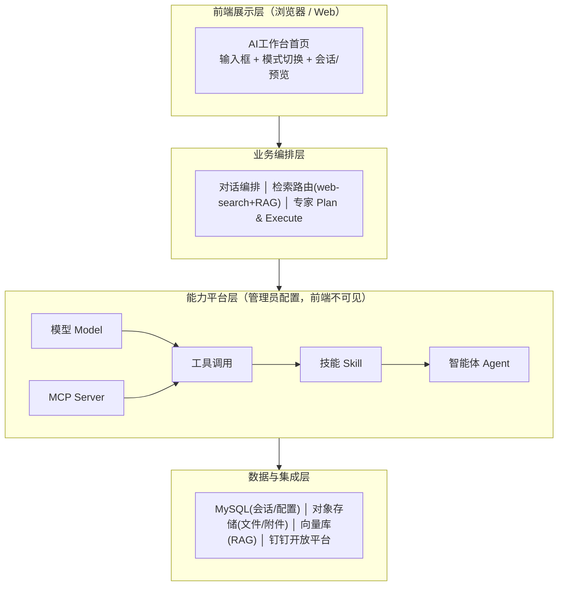
```mermaid
graph TB
    subgraph L1["前端展示层（浏览器 / Web）"]
        A["AI工作台首页<br/>输入框 + 模式切换 + 会话/预览"]
    end

    subgraph L2["业务编排层"]
        B["对话编排 │ 检索路由(web-search+RAG) │ 专家 Plan & Execute"]
    end

    subgraph L3["能力平台层（管理员配置，前端不可见）"]
        M["模型 Model"] --> FC["工具调用"]
        MCP["MCP Server"] --> FC
        FC --> S["技能 Skill"]
        S --> AG["智能体 Agent"]
    end

    subgraph L4["数据与集成层"]
        D["MySQL(会话/配置) │ 对象存储(文件/附件) │ 向量库(RAG) │ 钉钉开放平台"]
    end

    L1 --> L2 --> L3 --> L4
```

| 层级 | 职责 | 关键模块 |
| --- | --- | --- |
| 前端展示层 | 三栏布局（输入框焦点 + 左会话/右预览默认收起），两模式手动切换；用户身份经 SSO 贯穿全链路（详见 3.1.5） | 首页智能体界面 |
| 业务编排层 | 对话编排、检索（web-search+RAG）、专家编排（plan-and-execute）、文件、会话管理 | 5 个核心服务 |
| 能力平台层 | 四层架构：决策层 → 调度编排层 → 工具标准化层 → 最终产物；均后台配置，前端不可见 | Model / Prompt / 工具调用 / MCP / Tool / Skill / Agent（详见 3.4） |
| 数据与集成层 | 关系数据、文件存储、向量检索，及日常办公模式的钉钉动作落地与 RAG 数据源 | MySQL / 对象存储 / 向量库 / 钉钉开放平台 |


### 3.2.2 业务流程图

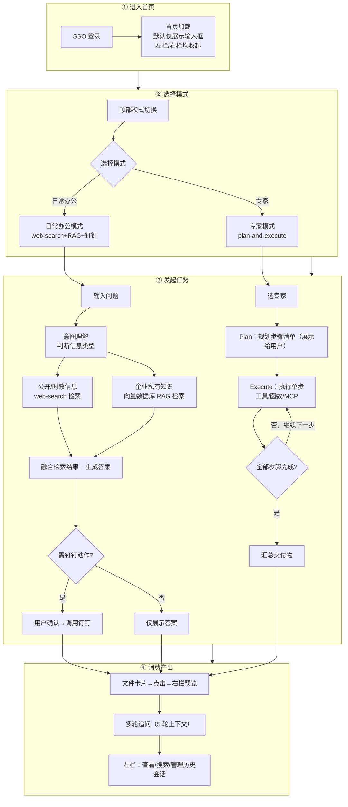
```mermaid
flowchart TB
    S1 --> S2
    S2 --> S3
    S3 --> S4

    subgraph S1["① 进入首页"]
        S1a["SSO 登录"] --> S1b["首页加载<br/>默认仅展示输入框<br/>左栏/右栏均收起"]
    end

    subgraph S2["② 选择模式"]
        S2a["顶部模式切换"] --> S2b{"选择模式"}
        S2b -->|"日常办公"| S2c["日常办公模式<br/>web-search+RAG+钉钉"]
        S2b -->|"专家"| S2d["专家模式<br/>plan-and-execute"]
    end

    subgraph S3["③ 发起任务"]
        S2c --> S3a["输入问题"]
        S3a --> S3b["意图理解<br/>判断信息类型"]
        S3b --> S3b1["公开/时效信息<br/>web-search 检索"]
        S3b --> S3b2["企业私有知识<br/>向量数据库 RAG 检索"]
        S3b1 --> S3b3["融合检索结果 + 生成答案"]
        S3b2 --> S3b3
        S3b3 --> S3c{"需钉钉动作?"}
        S3c -->|"是"| S3d["用户确认→调用钉钉"]
        S3c -->|"否"| S3e["仅展示答案"]

        S2d --> S3f["选专家"]
        S3f --> S3g["Plan：规划步骤清单（展示给用户）"]
        S3g --> S3i["Execute：执行单步<br/>工具/函数/MCP"]
        S3i --> S3j{"全部步骤完成?"}
        S3j -->|"否，继续下一步"| S3i
        S3j -->|"是"| S3k["汇总交付物"]
    end

    subgraph S4["④ 消费产出"]
        S3e --> S4a["文件卡片→点击→右栏预览"]
        S3d --> S4a
        S3k --> S4a
        S4a --> S4b["多轮追问（5 轮上下文）"]
        S4b --> S4c["左栏：查看/搜索/管理历史会话"]
    end
```

| 阶段 | 关键节点 | 说明 |
| --- | --- | --- |
| ① 进入首页 | SSO 登录 | 钉钉与浏览器双端 SSO，未登录跳转登录 |
| ① 进入首页 | 默认状态 | 仅顶部输入框为焦点，左栏会话列表与右栏文件预览均完全收起 |
| ② 选择模式 | 手动切换 | 顶部切换日常办公/专家，默认日常办公，不做自动意图识别 |
| ③ 发起任务（日常办 | 检索路由 | 先意图理解判断信息类型：公开/时效信息走 web-search 联网检索，企业私有知识走向量数据库 RAG 检索，两者可并行、融合后生成答案 |
| ③ 发起任务（日常办 | 钉钉动作 | 答案可落地为钉钉待办/审批查询/通知，须用户确认后执行 |
| ③ 发起任务（专家模 | 选择专家 | Hover 专家卡片仅展示简介，Click 进入协作（详见 3.5.8） |
| ③ 发起任务（专家模 | Plan-and-Execute 循环 | 选专家 → 规划步骤清单 → 逐步 Execute 单步工具/函数/MCP（循环执行至全部步骤完成）→ 汇总交付物 |
| ④ 消费产出 | 文件预览 | AI 生成文件后展示文件卡片，点击即在右栏预览（大纲+正文） |
| ④ 消费产出 | 多轮上下文 | 同一会话内连续追问，保留最近 5 轮上下文 |
| ④ 沉淀复用 | 历史会话 | 左栏展开后可查看/搜索/重命名/删除历史会话 |

## 3.3 功能模块清单

| 功能模块 | 功能描述 | 优先级 |
| --- | --- | --- |
| 整体布局 | 三栏骨架（输入框焦点 + 左会话/右预览默认收起），可展开 | P0-1 |
| 历史会话（左栏） | 新建/搜索/重命名/删除，可折叠收起 | P0-2 |
| 对话输入区 | 多行输入、发送/停止、附件上传 | P0-3 |
| 快捷指令区 | 生成钉钉待办/生成需求草稿/封装成技能（提示词预填） | P0-4 |
| 会话详情 | 中心消息画布：流式回答/CoT/文件卡片/Plan-Execute 步骤 | P0-5 |
| 右栏文件预览面板 | AI 生成文件后点击卡片预览（大纲+正文） | P0-6 |
| 日常办公模式 | web-search + RAG 检索路由 → 生成 → 钉钉动作落地 | P0-7 |
| 专家模式框架 | 选专家 → Plan → Execute → 结构化交付物 | P0-8 |

## 3.4 基础能力底座

### 3.4.1 能力框架总览

智能体（Agent）要发挥作用，需要以下能力模块的支撑。这些模块统一由管理员在后台配置管理，对普通员工不可见：

| 能力 | 模块 | 说明 | 参考章节 |
|------|------|------|---------|
| 思考能力 | 模型管理 | 选择 LLM、配置降级链和配额 | 3.4.2 |
| 外部服务接入 | MCP Server | 通过标准协议接入外部能力 | 3.4.3 |
| 原子执行单元 | 原子 Tool | 最小粒度执行工具（内置/远程） | 3.4.4 |
| 业务编排能力 | Skill | Tool 编排 + 版本管理 | 3.4.5 |
| 最终产物 | 智能体 Agent | 编排组合所有能力，发布为可用服务 | 3.4.6 |
| 成本可控 | 额度管理 | 用户级 Token 上限 + 告警 | 3.4.7 |

**四层架构图**（技术背景参考）：

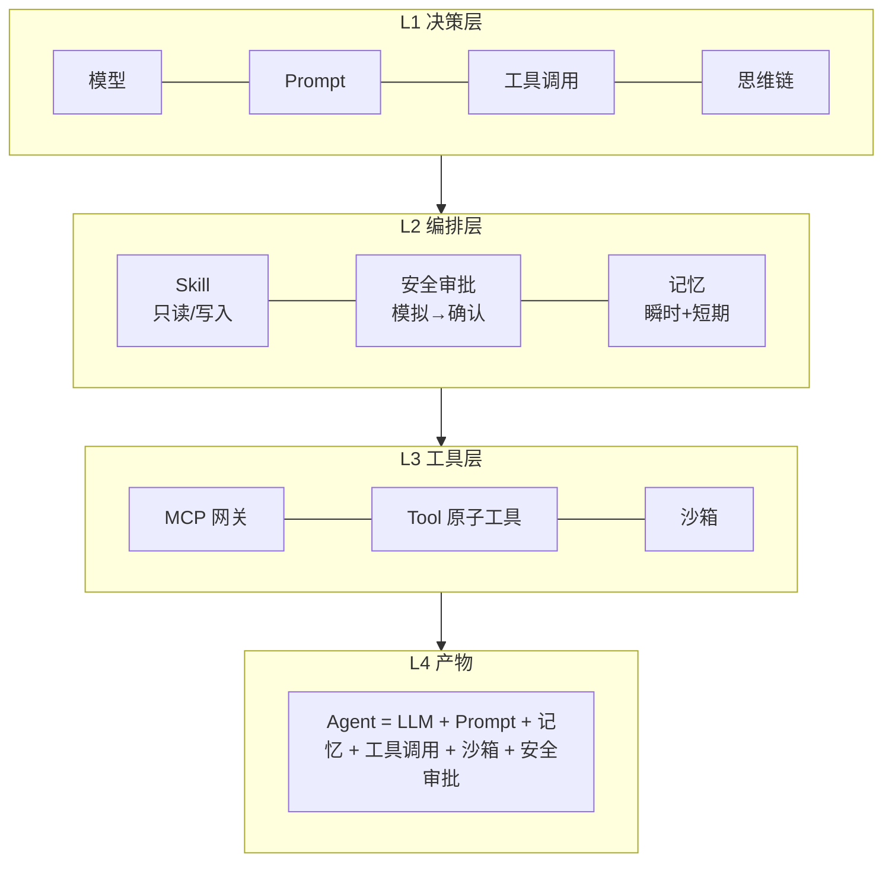
```mermaid
graph TB
    subgraph L1["L1 决策层"]
        direction LR
        M["模型"] --- P["Prompt"] --- FC["工具调用"] --- CoT["思维链"]
    end
    subgraph L2["L2 编排层"]
        direction LR
        SK["Skill<br/>只读/写入"] --- SA["安全审批<br/>模拟→确认"] --- ME["记忆<br/>瞬时+短期"]
    end
    subgraph L3["L3 工具层"]
        direction LR
        GW["MCP 网关"] --- TL["Tool 原子工具"] --- SB["沙箱"]
    end
    subgraph L4["L4 产物"]
        AG["Agent = LLM + Prompt + 记忆 + 工具调用 + 沙箱 + 安全审批"]
    end
    L1 --> L2 --> L3 --> L4
```

### 3.4.2 模型管理

> 模型管理为智能体提供「思考能力」——管理员在后台注册模型端点、配置降级链和配额，智能体运行时通过网关调用模型。

#### ① 功能需求描述

| EARS 模式 | 需求描述 |
| --- | --- |
| 普遍型 | 系统应支持管理员在后台注册多个模型端点，配置路由策略与降级规则 |
| 状态驱动型 | 当主模型端点不可用时，系统应自动降级到备用端点并记录告警日志 |
| 事件驱动型 | 当智能体请求模型时，系统应按路由策略选择端点发起请求 |
| 不良行为型 | 当所有端点均不可用时，系统应返回降级提示而非直接报错；API Key 过期或配额耗尽时自动降级并触发告警 |

#### ② 业务主流程图及说明

**业务流程**：

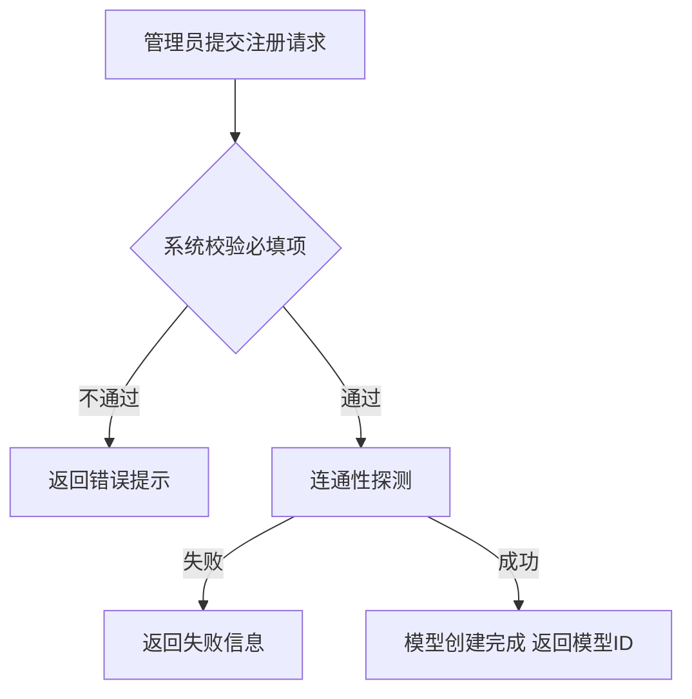
```mermaid
flowchart TD
    A["管理员提交注册请求"] --> B{"系统校验必填项"}
    B -->|"不通过"| C["返回错误提示"]
    B -->|"通过"| D["连通性探测"]
    D -->|"失败"| E["返回失败信息"]
    D -->|"成功"| F["模型创建完成 返回模型ID"]
```

**连通性状态**：在线（最近 ping 成功）/ 离线（连续 3 次 ping 失败）/ 未知（从未 ping 过）

**时序图**：

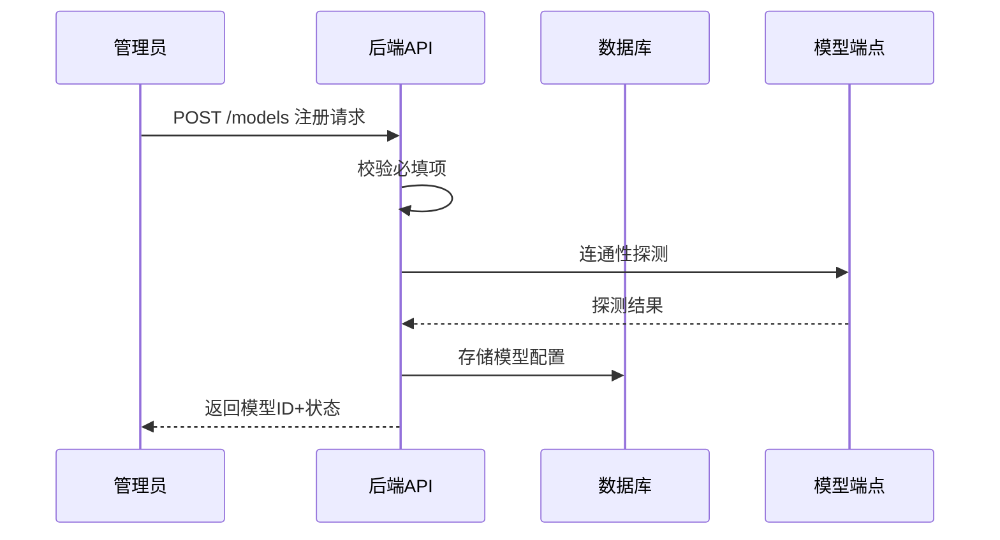
```mermaid
sequenceDiagram
    participant A as 管理员
    participant API as 后端API
    participant DB as 数据库
    participant M as 模型端点
    
    A->>API: POST /models 注册请求
    API->>API: 校验必填项
    API->>M: 连通性探测
    M-->>API: 探测结果
    API->>DB: 存储模型配置
    API-->>A: 返回模型ID+状态
```

#### ③ 界面原型

> MVP 不设计独立前端页面，模型管理通过后端 API 完成。此处仅说明操作逻辑。

- 管理员可通过 API 注册模型（提供方、模型 ID、API Key、成本中心、能力声明等）
- 管理员可通过 API 删除模型
- 管理员可配置降级链（主备两段式）和查看调用日志
- 管理员可触发连通性测试

#### ④ 数据说明（业务实体）

**业务实体**：

| 实体 | 关键字段 | 说明 |
| --- | --- | --- |
| ModelEndpoint | 显示名/提供方/模型ID/档位/路由标签/成本中心/负责人/状态/连通性 | 模型端点配置 |
| RoutingRule | 主端点/备选端点/触发条件/切换延迟 | 降级链（MVP 仅主备） |
| ModelCallLog | 时间/调用方/模型/输入输出Token/成本/延迟/状态/降级轨迹 | 调用日志（含审计） |

**字段说明**：

**基础信息**：

| 字段名 | 数据类型 | 长度 | 默认值 | 必需 | 约束说明 |
|--------|---------|------|--------|------|---------|
| 成本中心 | 字符 | 1-50 | — | Y | 用于成本归因；错误提示「请填写成本中心」 |
| 档位 | 枚举 | — | 标准 | Y | 选项：旗舰/标准/快速/便宜；错误提示「请选择档位」 |
| 负责人 | 字符 | — | 当前用户 | Y | 从用户列表单选；错误提示「请选择负责人」 |
| 模型 ID | 字符 | 1-100 | — | Y | 与提供方组合唯一；错误提示「请输入模型 ID」 |
| 模型类型 | 枚举 | — | 文本 | Y | 选项：文本/视觉/嵌入/音频；错误提示「请选择模型类型」 |
| 描述 | 字符 | ≤500 | — | N | — |
| 路由标签 | 枚举多选 | — | [] | N | 选项：对话/视觉/推理/工具 |
| 提供方 | 枚举 | — | — | Y | 选项：OpenAI/阿里云/DeepSeek/Azure/Ollama/GLM/自定义；选Azure时API版本必填，选Ollama时API Key可为空；错误提示「请选择提供方」 |
| 显示名 | 字符 | 1-100 | — | Y | 全局唯一，失焦校验；错误提示「显示名已存在」 |

**连接配置**：

| 字段名 | 数据类型 | 长度 | 默认值 | 必需 | 约束说明 |
|--------|---------|------|--------|------|---------|
| API Key | 字符 | 1-500 | — | Y | 保存时加密；Ollama时可为空；编辑时留空=不修改；错误提示「请填写 API Key」 |
| API 版本 | 字符 | ≤20 | — | 条件Y | 仅提供方=Azure时必填；错误提示「Azure 模型必填 API 版本」 |
| 超时时间（秒） | 数字 | 1-300 | 30 | N | 整数；错误提示「超时时间须在 1-300 秒之间」 |
| 基础 URL | 字符 | URL格式 | — | Y | 以 http/https 开头；错误提示「请输入合法的 URL」 |

**能力声明**：

| 字段名 | 数据类型 | 长度 | 默认值 | 必需 | 约束说明 |
|--------|---------|------|--------|------|---------|
| 上下文长度 | 数字 | 1-2000000 | 16384 | Y | 整数；错误提示「请输入 1-2000000 之间的整数」 |
| 支持工具调用 | 布尔 | — | 开 | N | — |
| 支持视觉 | 布尔 | — | 关 | N | — |
| 支持推理 | 布尔 | — | 关 | N | — |
| 支持 JSON 模式 | 布尔 | — | 开 | N | — |
| 最大输出 Token | 数字 | 1-200000 | 8192 | Y | 整数；错误提示「请输入 1-200000 之间的整数」 |

**默认参数**：

| 字段名 | 数据类型 | 长度 | 默认值 | 必需 | 约束说明 |
|--------|---------|------|--------|------|---------|
| 存在惩罚 | 数字 | -2~2 | 0 | N | 步进 0.1 |
| 额外参数 | JSON | — | {} | N | 需为合法 JSON；错误提示「请输入合法的 JSON」 |
| 频率惩罚 | 数字 | -2~2 | 0 | N | 步进 0.1 |
| top_p | 数字 | 0~1 | 1.0 | N | 步进 0.05 |
| 温度 | 数字 | 0~2 | 0.7 | N | 步进 0.1 |

**成本与配额**：

| 字段名 | 数据类型 | 长度 | 默认值 | 必需 | 约束说明 |
|--------|---------|------|--------|------|---------|
| QPS 上限 | 数字 | 1-10000 | 10 | N | 整数；错误提示「请输入 1-10000 之间的整数」 |
| 日 Token 上限 | 数字 | 1-1000000000 | 1000000 | N | 整数；错误提示「请输入 1-1000000000 之间的整数」 |
| 输入 Token 单价（每 1K） | 数字 | 0-100 | 0.0 | Y | 错误提示「请输入 0-100 之间的数字」 |
| 输出 Token 单价（每 1K） | 数字 | 0-100 | 0.0 | Y | 错误提示「请输入 0-100 之间的数字」 |
| 月 Token 上限 | 数字 | 1-10000000000 | 30000000 | N | 整数；错误提示「请输入 1-10000000000 之间的整数」 |

#### ⑤ 业务规则和约束条件

**降级链规则**：

| 规则项 | 说明 |
|------|------|
| 范围 | MVP 仅支持主备两段式，每个模型最多 1 个备选 |
| 触发条件 | 5xx 错误 / 超时 / 429 限流 / 余额不足 |
| 不触发条件 | 4xx 错误、上下文超长、内容审查拦截 |
| 备选也失败 | 返回"主备模型均失败"错误 |
| 切换延迟 | 100-10000ms 可配置 |

**连通性规则**：

| 规则项 | 说明 |
|------|------|
| 探测触发 | 仅在注册时"保存并启用"触发；注册时不探测则保存为未验证状态 |
| 探测超时 | ≤5 秒 |
| 连通性独立 | 在线/离线/未知独立于模型是否可用 |

**降级链规则**：

| 规则项 | 说明 |
|------|------|
| 范围 | MVP 仅支持主备两段式，每个模型最多 1 个备选 |
| 触发条件 | 5xx 错误 / 超时 / 429 限流 / 余额不足 |
| 不触发条件 | 4xx 错误、上下文超长、内容审查拦截 |
| 备选也失败 | 返回"主备模型均失败"错误 |
| 切换延迟 | 100-10000ms 可配置 |

**连通性规则**：

| 规则项 | 说明 |
|------|------|
| 测试触发 | 仅在"保存并启用"或详情页"重新探测"时触发；草稿保存不触发 |
| 测试超时 | ≤5 秒 |
| 连通性独立 | 在线/离线/未知独立于启用状态；离线不影响已启用状态展示 |
| 状态变更审计 | 所有启用/禁用/归档/恢复/删除须记录操作人、时间、原因 |

#### ⑥ 接口说明

| 接口 | 说明 |
| --- | --- |
| listModels / createModel / updateModel | 列表（支持多维筛选）/ 注册 / 编辑 |
| testConnectivity | 连通性测试 |
| enableModel / deleteModel | 启用 / 删除 |
| getModelCallLog | 调用日志 |
| setDegradationRule / getDegradationRule | 降级链配置 / 查询 |

#### ⑦ 补充说明

- 详细列表页（筛选/排序/三态/分页）、详情页 6 个 Tab（概览/能力/连通性/调用日志/配额/降级链）完整交互设计见基础知识文档《模型管理》
- 配额管理页（智能体/用户/模型三类配额）、成本报表页（趋势图/饼图/排行榜）、能力矩阵页设计见基础知识文档《模型管理》

**System Prompt（系统提示词）管理**：System Prompt 属于智能体 Agent 的配置项——定义角色约束、工具调用规则、输出格式、安全约束。字段定义与校验规则见本 PRD 3.4.6 智能体 Agent「④ 数据说明」中「模型与提示词」字段表。System Prompt 随 Agent 生命周期（草稿→已发布→已归档）统一管理，不单独建状态。

User Prompt（用户提示词）由用户在前端自由输入，平台不进入后台治理，仅做输入端的安全检测（敏感词检测 / Prompt 注入拦截，见 3.1.2）。

**提示词模板库**（可选治理）：平台提供独立的 Prompt 模板库作为可复用资产，支持管理员独立注册/发布/归档。


**工具调用说明**：LLM 在 Prompt 约束下输出标准化 JSON 格式的工具调用指令（工具名+入参），由 Agent 调度器接收后按 Skill 类型（只读/写入）决定是否需人工确认，再通过 MCP 执行。工具调用本身不是可管理的实体资产，而是运行时契约。其治理对象为可选的**工具调用规范（ToolCall Spec）**——管理员可注册已启用工具的入参 Schema 与越权判定规则，审计调用日志。工具不可用时调度器自动跳过并提示。

**思维链（CoT）说明**：CoT 是前端展示特性，用于向用户透明展示智能体推理过程——思考中详细展示推理步骤，开始输出回复时自动折叠为单行摘要。CoT 不暴露后台模型名称、工具调用细节与 MCP 配置信息。详细展示规则（折叠时机/展开交互/降级行为等）见本 PRD 3.5.x（思维链展示规则）。管理员可在后台配置 CoT 的全局默认展示策略（可选治理项）。

---

### 3.4.3 MCP Server

> MCP Server 为智能体提供「外部服务接入能力」——通过标准协议接入外部服务，将外部能力封装为 Tool 供智能体调用。管理员注册后需经连接探测方可启用。

#### ① 功能需求描述

MCP Server 通过标准协议接入，对外暴露原子 Tool。管理员注册后需经连接探测（连通性 + 协议兼容 + 至少声明 1 个 Tool）方可启用。

| EARS 模式 | 需求描述 |
| --- | --- |
| 普遍型 | 系统应支持管理员注册 MCP Server，将其 Tool 接口注册到工具调用框架 |
| 状态驱动型 | 当 MCP Server 连接异常时，标记该 Server 的 Tool 为不可用并记录告警 |
| 事件驱动型 | 当智能体调用 Tool 时，经工具调用框架统一调度 MCP Server 执行 |
| 不良行为型 | MCP Server 返回异常数据时拦截并降级处理，不传递给用户 |

#### ② 业务主流程图及说明

MCP Server 生命周期：管理员填写配置 → 保存为草稿 → 启用（连接探测） → 变为可用。

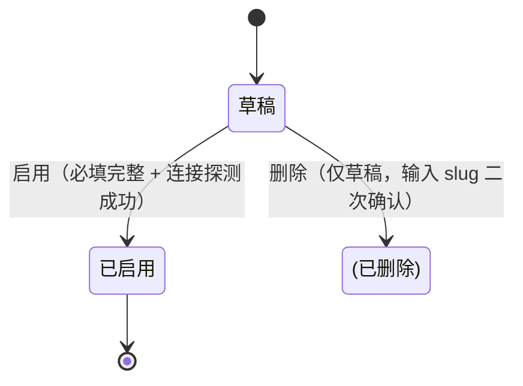
```mermaid
stateDiagram-v2
    [*] --> 草稿
    草稿 --> 已启用 : 启用（必填完整 + 连接探测成功）
    草稿 --> (已删除) : 删除（仅草稿，输入 slug 二次确认）
    已启用 --> [*]
```

**状态转换规则**：

| 转换 | 触发操作 | 前置条件 | 校验失败提示 | 后置行为 |
|------|---------|---------|------------|---------|
| 草稿 → 已启用 | 启用 | 必填项完整 + 连接探测成功 | "连接探测失败：{错误信息}" | 加入智能体工具选择器 |
| 草稿 → 已删除 | 删除 | 输入 slug 二次确认匹配 | "请正确输入 slug" | 物理删除 |

**探测规则**：
- 探测时机：仅在"保存并启用"或详情页"重新探测"时触发；草稿保存不探测
- 探测内容：连接可达性 + 协议兼容性 + 至少声明 1 个 Tool
- 探测超时：≤5 秒
- 错误分类：CONNECTION_FAILED / INVALID_SPEC / NO_TOOLS_DECLARED / AUTH_FAILED

#### ③ 界面原型

> MVP 不设计独立前端页面，MCP Server 通过统一管理后台入口完成。此处仅说明操作逻辑。

- 管理员可在后台注册 MCP Server，填写 slug、名称、传输方式（stdio/sse/streamable-http）、连接配置
- 管理员可对 MCP Server 执行启用/删除操作（仅草稿可删）
- 注册时"保存并启用"触发连接探测，探测失败自动保存为草稿

#### ④ 数据说明（业务实体）

**业务实体**：

| 实体 | 关键字段 | 说明 |
| --- | --- | --- |
| McpServer | slug/名称/描述/分类/传输方式/连接配置/状态 | MCP Server 配置 |
| McpTool | serverID/工具名/入参Schema/状态 | Server 暴露的原子 Tool |

**字段说明**：

**基础信息**：

| 字段名 | 数据类型 | 长度 | 默认值 | 必需 | 约束说明 |
|--------|---------|------|--------|------|---------|
| 分类 | 字符 | ≤30 | 空 | N | — |
| 名称 | 字符 | 1-100 | — | Y | 错误提示「请输入名称（1-100 字）」 |
| 描述 | 字符 | ≤500 | — | N | — |
| slug | 字符 | 3-50 | — | Y | 小写字母/数字/下划线；全局唯一；错误提示「slug 只能包含小写字母、数字和下划线，长度 3-50」「slug 已存在」 |

**连接配置**：

| 字段名 | 数据类型 | 长度 | 默认值 | 必需 | 约束说明 |
|--------|---------|------|--------|------|---------|
| API Key | 字符 | ≤500 | — | N | 保存时加密 |
| 超时时间（秒） | 数字 | 1-300 | 30 | N | 整数；错误提示「超时时间须在 1-300 秒之间」 |
| 传输方式 | 枚举 | — | stdio | Y | 选项：stdio/sse/streamable-http；切换时联动显示/隐藏命令/URL 字段 |
| 环境变量 | JSON | — | {} | N | 键名：小写字母/数字/下划线 |
| 命令（仅 stdio） | 字符 | 1-500 | — | 条件Y | 仅传输方式=stdio 时必填；错误提示「请输入启动命令」 |
| URL（仅 sse/streamable-http） | 字符 | URL 格式 | — | 条件Y | 仅传输方式=sse 或 streamable-http 时必填；错误提示「请输入合法的 URL」 |

#### ⑤ 业务规则和约束条件

**场景假设**：

| 假设 | 说明 | 复盘点 |
|------|------|--------|
| 启用即全员可见 | 启用后所有智能体均可引用 | 需细粒度授权时重构授权模型 |
| 仅草稿可删 | 已发布只能禁用/归档 | 防止误删导致历史调用链断裂 |
| 负责人=创建人 | 创建人即为负责人，MVP 不支持责任转移 | 多人协作 P1 引入协作者 |

**CRUD 规则**：

| 操作 | 可见性 | 规则 | 校验要点 | 错误提示 |
|------|--------|------|---------|---------|
| 增（注册） | 管理员 | slug 全局唯一 + 名称必填 + 传输方式必填 | 失焦校验 slug | "slug 已存在" |
| 删 | 仅草稿可删 | 输入 slug 二次确认 | slug 完全匹配 | "仅草稿状态可删除"；"请正确输入 slug" |
| 改（编辑） | 草稿直接编辑；已启用→生成新草稿 | 校验同注册 | — | "编辑将创建新草稿" |
| 查（列表） | 管理员 | 支持类型/状态/负责人/关键词筛选 | 筛选保留 URL | — |

**启用约束**：

| 操作 | 约束规则 |
|------|---------|
| 启用 | 前置：必填完整 + 连接探测成功（连接可达 + 协议兼容 + ≥1 Tool）；探测失败转草稿 |

#### ⑥ 接口说明

| 接口 | 说明 |
| --- | --- |
| listTools / registerMCP / updateMCP | 列表/注册/编辑 |
| probeMCP | 连接探测 |
| enableTool / disableTool / archiveTool / restoreTool / deleteTool | 启用/禁用/归档/恢复/删除 |
| getToolReferencedBy | 被引用方查询 |

#### ⑦ 补充说明

详细列表页、详情页（概览/被引用方）完整设计见基础知识文档《工具管理》

### 3.4.4 原子 Tool

> 原子 Tool 为智能体提供「最小执行单元」——一个 Tool 只做单一动作（读文件、计算哈希、语义检索等）。内置工具由平台代码自带，管理员通过发现页纳管；远程 API 类 Tool 随 MCP Server 注册自动纳管。

#### ① 功能需求描述

Tool 是最小粒度执行单元，两种实现：① 本地函数（平台代码自带，内置工具）② 远程 API 调用（经 MCP）。所有 Tool 统一注册在工具调用框架中，按 `tool.type` 区分 builtin / mcp / skill。

| EARS 模式 | 需求描述 |
| --- | --- |
| 普遍型 | 系统应以 Tool 为最小粒度执行单元，支持本地函数与远程 API 两类实现，统一在工具调用框架注册与调度 |
| 状态驱动型 | 当 Tool 连接异常时，标记该 Tool 为不可用并记录告警 |
| 事件驱动型 | 当智能体调用 Tool 时，经工具调用框架统一调度执行 |
| 不良行为型 | Tool 返回异常数据时拦截并降级处理，不传递给用户 |

#### ② 业务主流程图及说明

Tool 生命周期：内置工具代码自带自动发现纳管；手动注册流程为草稿 → 启用 → 可用。

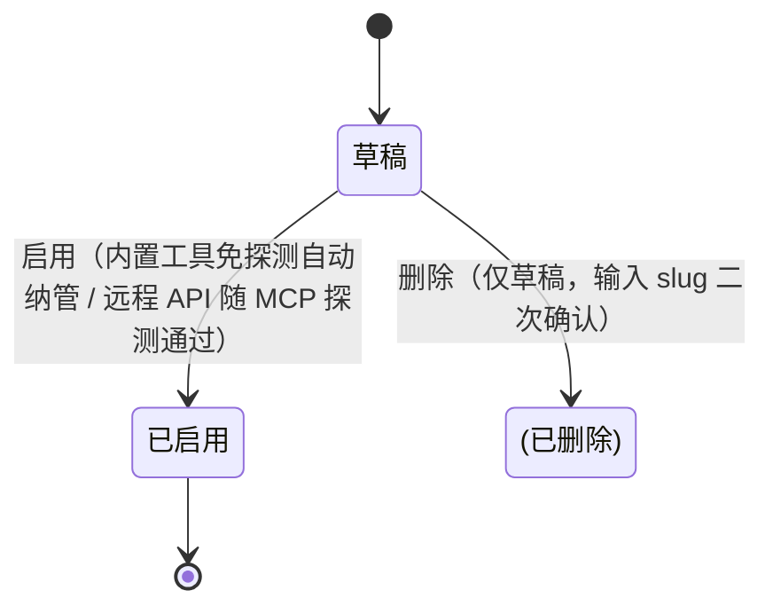
```mermaid
stateDiagram-v2
    [*] --> 草稿
    草稿 --> 已启用 : 启用（内置工具免探测自动纳管 / 远程 API 随 MCP 探测通过）
    草稿 --> (已删除) : 删除（仅草稿，输入 slug 二次确认）
    已启用 --> [*]
```

**状态转换规则**：

| 转换 | 触发操作 | 前置条件 | 校验失败提示 | 后置行为 |
|------|---------|---------|------------|---------|
| 草稿 → 已启用 | 启用 | 内置工具免探测；远程 API 类需随 MCP 探测通过 | — | 加入智能体可引用列表 |
| 草稿 → 已删除 | 删除 | 输入 slug 二次确认匹配 | "请正确输入 slug" | 物理删除 |

**内置工具发现流程**：管理员通过「内置工具发现页」扫描代码目录 → 列出新增但未纳入的工具 → 描述/分类 → 创建草稿 → 启用。

#### ③ 界面原型

> MVP 不设计独立前端页面，原子 Tool 通过统一管理后台入口完成。此处仅说明操作逻辑。

- 管理员可在后台查看 Tool 统一列表（按 type 区分 builtin/mcp/skill）
- 管理员可通过「内置工具发现页」扫描代码目录，将新增工具一键纳管
- 管理员可对 Tool 执行启用/删除操作（仅草稿可删）

#### ④ 数据说明（业务实体）

**业务实体**：

| 实体 | 关键字段 | 说明 |
| --- | --- | --- |
| Tool | 名称/slug/实现方式(builtin·remote)/入参Schema/分类/状态 | 原子工具注册表（`tool.type` 区分 builtin/mcp/skill） |

**字段说明**：

| 字段名 | 数据类型 | 长度 | 默认值 | 必需 | 约束说明 |
|--------|---------|------|--------|------|---------|
| 分类 | 字符 | ≤30 | — | N | — |
| 描述 | 字符 | ≤500 | — | N | — |
| 名称 | 字符 | 1-100 | — | Y | 错误提示「请输入名称（1-100 字）」 |
| 入参 Schema | JSON | — | — | Y | 需为合法 JSON Schema 格式；错误提示「请输入合法的 JSON Schema」 |
| 实现方式 | 枚举 | — | — | Y | 选项：builtin / remote |
| slug | 字符 | 3-50 | — | Y | 小写字母/数字/下划线；全局唯一；错误提示「slug 只能包含小写字母、数字和下划线，长度 3-50」「slug 已存在」 |

#### ⑤ 业务规则和约束条件

**场景假设**：

| 假设 | 说明 | 复盘点 |
|------|------|--------|
| 三类工具 | MVP 管理 builtin/mcp/skill；不做 API 工具 | 需要 API 工具时扩展 tool.type 枚举 |
| 启用即全员可见 | 启用后所有智能体均可引用 | 需细粒度授权时重构授权模型 |
| 仅草稿可删 | 已发布只能禁用/归档 | 防止误删导致历史调用链断裂 |

**CRUD 规则**：

| 操作 | 可见性 | 规则 | 校验要点 | 错误提示 |
|------|--------|------|---------|---------|
| 增（内置工具纳管） | 仅管理员 | 通过发现页扫描→创建草稿→启用 | — | — |
| 增（手动注册） | 管理员 | 填写名称/slug/入参Schema/分类/描述 | slug 全局唯一、3-50字符 | "slug 已存在" |
| 删 | 仅草稿可删 | 输入 slug 二次确认 | slug 完全匹配 | "仅草稿状态可删除"；"请正确输入 slug" |
| 改（编辑） | 草稿直接编辑；已启用→生成新草稿 | 校验同注册 | — | "编辑将创建新草稿" |
| 查（列表） | 管理员 | 统一列表按 type 筛选 | 筛选保留 URL | — |

**启用约束**：

| 操作 | 约束规则 |
|------|---------|
| 启用（内置工具） | 免探测，管理员通过发现页自动纳管 |
| 启用（手动注册） | 随 MCP Server 探测通过自动纳管 |

**通用规则**：
- 一个 Tool 只做单一动作
- slug 全局唯一（小写字母/数字/下划线，3-50）
- 所有 Tool 调用经工具调用框架统一调度
- 单 Server 异常不影响其他 Server 的 Tool

#### ⑥ 接口说明

| 接口 | 说明 |
| --- | --- |
| discoverBuiltinTools | 扫描内置工具 |
| listTools / registerTool / updateTool | 列表/注册/编辑 |
| enableTool / disableTool / archiveTool / deleteTool | 启用/禁用/归档/删除 |
| getToolReferencedBy | 被引用方查询 |

#### ⑦ 补充说明

统一注册表设计（tool.type 区分 builtin/mcp/skill）、详情页设计（概览/被引用方）见基础知识文档《工具管理》

---

### 3.4.5 Skill

> Skill 为智能体提供「业务编排能力」——由多个 Tool + 条件判断 + 业务流程编排而成，以标准化 .skillpkg 包交付。Skill 分只读（自动执行）和写入（需三段式安全审批）两类。

#### ① 功能需求描述

**只读 Skill 与写入 Skill**：

| 类型 | 定义 | 示例 | 执行方式 |
|------|------|------|---------|
| 只读 Skill | 查询、读取、预览类操作，不产生副作用 | 知识库问答、文件搜索、数据报表查询 | Agent 自动调用，无需人工确认 |
| 写入 Skill | 修改、创建、删除类操作，产生持久化变更 | 文件入库、Git 提交、钉钉待办创建 | 必须「沙箱模拟 → 预览 → 确认 → 正式执行」三段式 |

**Skill 包规范（.skillpkg）**：
```
{skill-name}.skillpkg
├── manifest.json    # 元数据：name/slug/version/description/capabilities
├── code/            # 执行逻辑
├── resources/       # 模板/规则文件
└── README.md        # 使用说明
```
- 文件大小 ≤ 50MB
- manifest.json 中的 slug 全局唯一，版本号由包内定义不可手动修改

| EARS 模式 | 需求描述 |
| --- | --- |
| 普遍型 | 系统应支持管理员上传/创建 Skill（Tool 编排 + 安全策略配置 + 版本管理）；专家与快捷指令通过绑定 Skill 获得能力 |
| 状态驱动型 | 当 Skill 绑定的 Tool/MCP 不可用时，标记该 Skill 为降级状态 |
| 事件驱动型 | 写入 Skill 执行时强制走三段式审批流；只读 Skill 直接执行 |
| 不良行为型 | 不向普通员工暴露 Skill 配置细节（Tool 编排逻辑、安全策略） |

#### ② 业务主流程图及说明

Skill 生命周期：上传 .skillpkg 包 → 自动解析 → 保存为草稿 → 启用 → 可用。MVP 不设审核流。

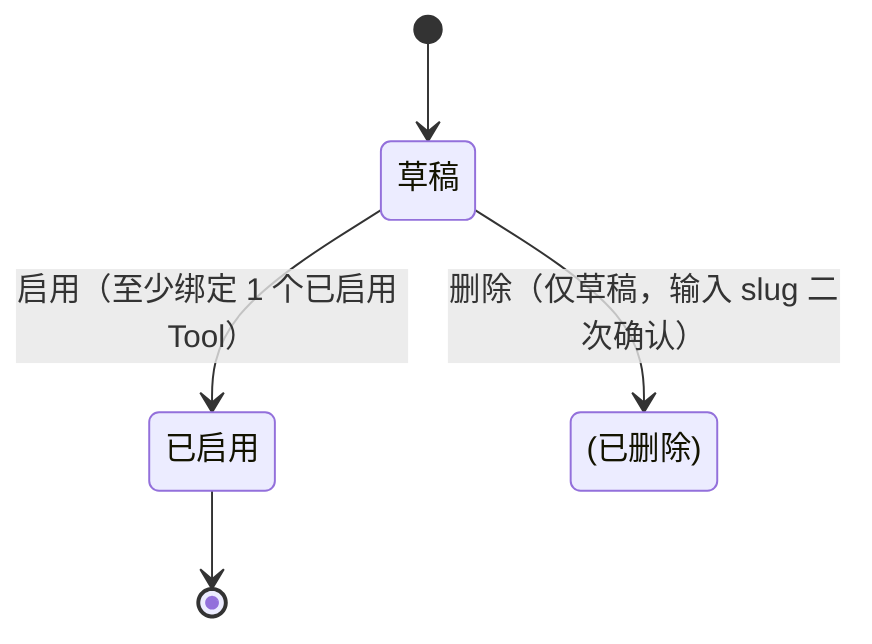
```mermaid
stateDiagram-v2
    [*] --> 草稿
    草稿 --> 已启用 : 启用（至少绑定 1 个已启用 Tool）
    草稿 --> (已删除) : 删除（仅草稿，输入 slug 二次确认）
    已启用 --> [*]
```

**状态转换规则**：

| 转换 | 触发操作 | 前置条件 | 校验失败提示 | 后置行为 |
|------|---------|---------|------------|---------|
| 草稿 → 已启用 | 启用 | 至少绑定 1 个已启用 Tool | "至少绑定 1 个已启用 Tool" | 加入智能体可引用列表 |
| 草稿 → 已删除 | 删除 | 输入 slug 二次确认 | "请正确输入 slug" | 物理删除 |

**安全审批（写入 Skill 三段式）**：

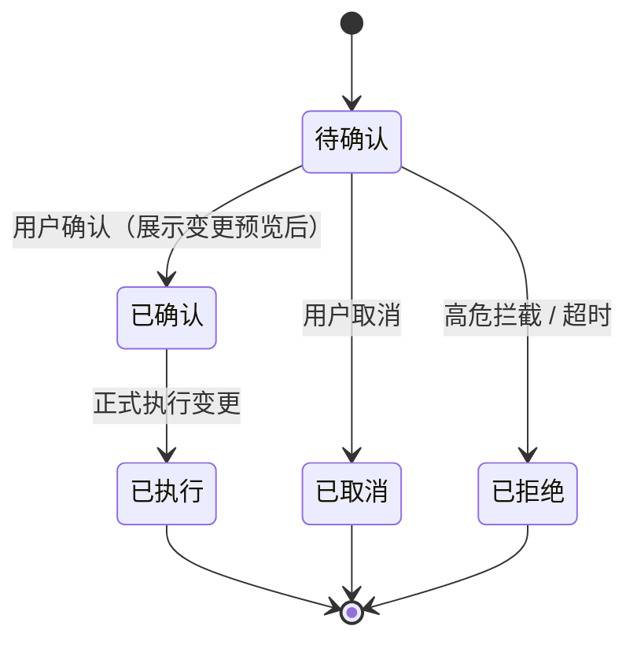
```mermaid
stateDiagram-v2
    [*] --> 待确认
    待确认 --> 已确认 : 用户确认（展示变更预览后）
    待确认 --> 已取消 : 用户取消
    待确认 --> 已拒绝 : 高危拦截 / 超时
    已确认 --> 已执行 : 正式执行变更
    已执行 --> [*]
    已取消 --> [*]
    已拒绝 --> [*]
```

| 规则 | 说明 |
|------|------|
| 适用范围 | 所有写入类 Skill |
| 三段式执行 | ① 沙箱模拟执行 → ② 展示变更预览（diff/变更清单）→ ③ 用户确认后正式执行 |
| 只读豁免 | 查询、读取、预览类 Skill 无需人工确认 |
| 高危拦截 | 删除文件、强制覆盖、修改系统配置等操作强制二次确认 |
| 超时拒绝 | 待确认超时自动拒绝 |

#### ③ 界面原型

> MVP 不设计独立前端页面，Skill 通过统一管理后台入口完成。此处仅说明操作逻辑。

- 管理员可在后台上传 .skillpkg 包（自动解析元数据）或手动创建 Skill
- 管理员可对 Skill 执行启用/删除操作（仅草稿可删），MVP 不设审核流
- 写入 Skill 执行时走安全审批三段式（运行时规则，不在此模块定义）

#### ④ 数据说明（业务实体）

**业务实体**：

| 实体 | 关键字段 | 说明 |
| --- | --- | --- |
| Skill | slug/名称/版本/分类/只读·写入/绑定Tool/状态 | 业务编排能力 |
| SkillPackage | .skillpkg 文件/manifest.json/代码/资源 | 交付包（≤50MB，slug 全局唯一） |
| ApprovalTicket | SkillID/用户/沙箱模拟结果/变更预览/状态 | 审批单（三段式载体） |

**字段说明**：

**技能包上传**：

| 字段名 | 数据类型 | 长度 | 默认值 | 必需 | 约束说明 |
|--------|---------|------|--------|------|---------|
| .skillpkg 文件 | 文件 | ≤50MB | — | Y | ZIP 格式，需含合法 manifest.json；错误提示「请上传有效的 .skillpkg 文件（ZIP，≤50MB）」「manifest.json 缺失或格式错误」 |

**元数据（自动填充 + 手动补全）**：

| 字段名 | 数据类型 | 长度 | 默认值 | 必需 | 约束说明 |
|--------|---------|------|--------|------|---------|
| 分类 | 字符 | ≤30 | — | N | 用户手动选择/输入 |
| 帮助文档 | 字符 | ≤10000 | — | N | Markdown 格式；从 README.md 自动加载，可编辑 |
| 版本 | 字符 | 语义化版本 | — | Y | 来自 manifest.json.version；**不可手动编辑** |
| 描述 | 字符 | ≤500 | — | N | 来自 manifest.json.description；可覆盖编辑 |
| 名称 | 字符 | 1-100 | — | Y | 来自 manifest.json.name；可覆盖编辑 |
| 图标 | 图片 | ≤2MB | — | N | 优先显示包内 icon.png，可上传覆盖 |
| slug | 字符 | 3-50 | — | Y | 小写字母/数字/下划线；全局唯一；来自 manifest.json.slug；冲突时强制用户修改 |

#### ⑤ 业务规则和约束条件

**场景假设**：

| 假设 | 说明 | 复盘点 |
|------|------|--------|
| 三类工具 | MVP 管理 builtin/mcp/skill；不做 API 工具 | 需要 API 工具时扩展 tool.type 枚举 |
| 启用即全员可见 | 启用后所有智能体均可引用 | 需细粒度授权时重构授权模型 |
| 仅草稿可删 | 已发布只能禁用/归档 | 防止误删导致历史调用链断裂 |
| Skill 需审核 | Skill 提交后须平台管理员审核通过才能启用 | 若开放自助发布，需加白名单或信任签名机制 |

**CRUD 规则**：

| 操作 | 可见性 | 规则 | 校验要点 | 错误提示 |
|------|--------|------|---------|---------|
| 增（上传） | 管理员/用户 | 上传 .skillpkg 包 → 自动解析 → 保存为草稿 | ZIP 格式/≤50MB/manifest.json 合法性 | "请上传有效的 .skillpkg 文件" |
| 删 | 仅草稿可删 | 输入 slug 二次确认 | slug 完全匹配 | "仅草稿状态可删除" |
| 改（编辑） | 草稿直接编辑；已启用→生成新草稿 | slug 冲突时强制修改 | — | "编辑将创建新草稿" |
| 查（列表） | 管理员 | 统一工具列表按 type 筛选 | 筛选保留 URL | — |

**通用规则**：
- 版本号取自 manifest.json，不可手动修改
- 绑定 Tool/MCP 不可用时标记 Skill 为降级状态
- 写入 Skill 运行时强制三段式审批流（沙箱模拟→预览→确认）；只读豁免

#### ⑥ 接口说明

| 接口 | 说明 |
| --- | --- |
| listSkills / uploadSkill / createSkill / updateSkill | 列表/上传/创建/编辑 |
| submitSkillReview / approveSkill / rejectSkill | 提交审核/通过/驳回 |
| enableSkill / disableSkill / archiveSkill / restoreSkill / deleteSkill | 启用/禁用/归档/恢复/删除 |
| sandboxSimulate | 沙箱模拟执行 |
| createApproval / confirmApproval / cancelApproval | 创建/确认/取消审批单 |
| listSkillMarket | 技能市场 |

#### ⑦ 补充说明

- 详细注册/编辑表单、详情页（概览/被引用方）、审核待办与技能市场设计见基础知识文档《工具管理》
- 安全审批单的完整生命周期（创建→确认→执行→完成）见基础知识文档《工具管理》
| --- | --- |
| 普遍型 | 系统应在写入类 Skill 执行时创建审批单，走「沙箱模拟 → 展示变更预览 → 用户确认 → 正式执行」三段式。 |
| 状态驱动型 | 当用户取消或高危拦截时，系统应终止执行并标记审批单为已取消/已拒绝。 |
| 事件驱动型 | 用户确认审批单后，系统应正式执行变更；超时未确认自动拒绝。 |
| 不良行为型 | 审批单不应暴露 Skill 配置细节（Tool 编排逻辑）。 |

##### 业务主流程图及说明

审批单生命周期（三段式运行时载体）：


```mermaid
stateDiagram-v2
    [*] --> 待确认
    待确认 --> 已确认 : 用户确认（展示变更预览后）
    待确认 --> 已取消 : 用户取消
    待确认 --> 已拒绝 : 高危拦截 / 超时
    已确认 --> 已执行 : 正式执行变更
    已执行 --> [*]
    已取消 --> [*]
    已拒绝 --> [*]
```

##### 界面原型

无独立界面（普通员工前端不可见）；管理后台可对已启用工具的调用规范做注册与查看（可选）。

##### 数据说明（业务实体）

| 实体 | 关键字段 | 说明 |
| --- | --- | --- |
| ApprovalTicket | SkillID/用户/沙箱模拟结果/变更预览/状态/原因 | 审批单（三段式载体） |

##### 业务规则和约束条件

| 规则项 | 说明 |
| --- | --- |
| 强制三段式 | 所有写入 Skill 必须沙箱模拟→预览→确认→执行 |
| 只读豁免 | 只读 Skill 直接执行，无审批单 |
| 高危二次确认 | 删除/强制覆盖/改系统配置强制二次确认 |
| 超时拒绝 | 待确认超时自动拒绝 |

##### 接口说明

| 接口 | 说明 |
| --- | --- |
| sandboxSimulate | 沙箱模拟执行 |
| createApproval / getApprovalPreview | 创建审批单/获取变更预览 |
| confirmApproval / cancelApproval / rejectApproval | 确认/取消/拒绝 |
| listApprovals | 审批单查询 |

##### 补充说明

无。

---

### 3.4.6 智能体 Agent

> 智能体是前面所有能力模块（模型、Prompt、工具、知识库、记忆）的编排组合。Agent 配置即是对这些能力的消费——选择模型、绑定工具、编写系统提示词、挂载知识库，最终发布为面向用户的可用服务。

#### ① 功能需求描述

**Agent 完整公式**：`Agent = LLM + Prompt 配置 + 记忆体系 + 工具调用调度 + MCP 工具池 + 沙箱环境 + 安全审批控制器`

**记忆体系**（MVP 落地前两层，长期为后续迭代）：

| 记忆类型 | 定位 | 载体 | 阶段 |
|------|------|------|------|
| 瞬时记忆 | 当前 Session 上下文窗口，受 memoryWindow 约束（默认 5 轮） | LLM Token 窗口 | MVP |
| 短期记忆 | 跨会话语义召回：会话结束→摘要→文本切片+向量嵌入→LanceDB→新会话语义匹配召回 | LanceDB 向量库 | MVP |
| 长期记忆 | 跨会话实体关系：存储实体、关系、项目约束，支持多跳推理 | Graphiti 图谱 | 后续迭代 |

**沙箱环境**：Agent 执行手脚的隔离环境。写入类 Skill 先在沙箱模拟执行，人工确认后再正式执行。

| EARS 模式 | 需求描述 |
| --- | --- |
| 普遍型 | 系统应支持管理员创建 Agent，配置模型/Prompt/工具/知识库/记忆窗口，按三态生命周期管理。Agent 对普通员工不可见，员工仅通过「专家」「快捷指令」间接使用。 |
| 状态驱动型 | 草稿/已归档状态对前端不可调用；已发布 Agent 详情页展示评估趋势与调用统计。 |
| 事件驱动型 | Agent 发布后刷新前端可调用列表；归档后终端不可调用。 |
| 不良行为型 | 不向普通员工暴露 Agent 后台配置（Prompt 原文/工具绑定/知识库）；引用模型/工具被禁用时阻断发布。 |

#### ② 业务主流程图及说明

Agent 生命周期：创建配置 → 保存为草稿 → 发布（校验）→ 变为可用。

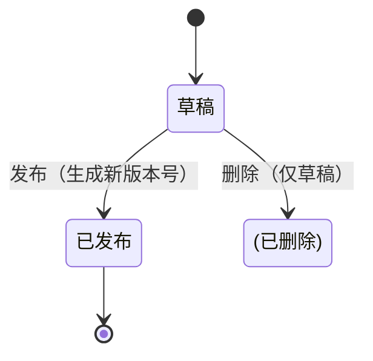
```mermaid
stateDiagram-v2
    [*] --> 草稿
    草稿 --> 已发布 : 发布（生成新版本号）
    草稿 --> (已删除) : 删除（仅草稿）
    已发布 --> [*]
```

**状态转换规则**：

| 转换 | 触发操作 | 前置条件 | 校验失败提示 | 后置行为 |
|------|---------|---------|------------|---------|
| 草稿 → 已发布 | 发布 | 必填项完整 + 主模型已启用 + 所有绑定工具已启用 + 填写变更说明（5-200字） | "必填项未填写完整：{字段列表}"；"模型{名称}已禁用，请更换"；"工具{名称}已禁用，请先启用或移除"；"请输入变更说明（5-200字）" | 生成新版本号（minor+1），异步通知引擎加载 |
| 草稿 → 已删除 | 删除 | 输入名称二次确认匹配 | "请正确输入智能体名称" | 物理删除，不可恢复 |

#### ③ 界面原型

> MVP 不设计独立前端页面，智能体 Agent 通过统一管理后台入口完成。此处仅说明操作逻辑。

- 管理员可在后台创建 Agent，填写名称/分类/角色/模型/系统提示词/工具/知识库等配置
- 管理员可编辑 Agent（草稿直接编辑；已发布编辑→生成新草稿，原版本继续可用）
- 管理员可发布 Agent（校验必填项、模型启用状态、工具启用状态），发布时填写变更说明
- 管理员可删除 Agent（仅草稿可删）
- 管理员可在草稿状态下试运行调试

#### ④ 数据说明（业务实体）

**业务实体**：

| 实体 | 关键字段 | 说明 |
| --- | --- | --- |
| Agent | 名称/描述/分类/角色/模型/系统提示词/工具/知识库/记忆窗口/状态 | 智能体配置 |
| AgentVersion | 版本号/配置快照/来源(回滚) | 版本历史 |

**字段说明**：

**基础信息**：

| 字段名 | 数据类型 | 长度 | 默认值 | 必需 | 约束说明 |
|--------|---------|------|--------|------|---------|
| 分类 | 字符 | ≤30 | 通用 | Y | 支持选择已有或输入新值；输入新值时自动创建；错误提示「请选择分类」 |
| 角色 | 枚举 | — | 通用 | Y | 选项：通用/专家；错误提示「请选择角色」 |
| 描述 | 字符 | ≤500 | — | N | — |
| 名称 | 字符 | 1-100 | — | Y | 同一负责人下唯一；不支持特殊字符 `/\<>`；失焦校验；错误提示「名称已存在」 |
| 图标 | 图片 | — | 默认图标 | N | 从图标库选择 |

**模型与提示词**：

| 字段名 | 数据类型 | 长度 | 默认值 | 必需 | 约束说明 |
|--------|---------|------|--------|------|---------|
| 模型 | 枚举 | — | — | Y | 仅可选已启用模型；切换时提示「请重新测试智能体效果」；错误提示「请选择模型」 |
| 温度 | 数字 | 0~2 | 0.7 | N | 步进 0.1；错误提示「温度须在 0-2 之间」 |
| 系统提示词 | 字符 | 1-10000 | — | Y | 支持 `{{变量}}` 语法；错误提示「请输入系统提示词」 |
| 指令列表 | 数组 | 每条≤500 | [] | N | 最多 10 条；支持添加/删除/排序；错误提示「指令最多 10 条」「单条指令不超过 500 字」 |
| 最大输出 Token | 数字 | 1-100000 | 8192 | N | 整数；错误提示「Token 须在 1-100000 之间」 |

**能力配置**：

| 字段名 | 数据类型 | 长度 | 默认值 | 必需 | 约束说明 |
|--------|---------|------|--------|------|---------|
| 工具 | 数组 | — | [] | N | 仅可多选已启用工具；工具选择器支持搜索+分类筛选；错误提示「工具{名称}已禁用，请先启用或移除」 |
| 记忆窗口 | 数字 | 1-100 | 10 | 条件Y | 启用记忆后必填；启用记忆时显示，否则隐藏；错误提示「记忆窗口须在 1-100 之间」 |
| 启用记忆 | 布尔 | — | 关 | N | 开关控制记忆窗口字段显示/隐藏 |
| 知识库 | 数组 | — | [] | N | 多选；知识库删除时仅警告不阻断 |

#### ⑤ 业务规则和约束条件

**场景假设**：

| 假设 | 说明 | 复盘点 |
|------|------|--------|
| 智能体规模 | MVP 智能体总数 < 100，单用户创建 < 30 | 超过需优化列表分页与搜索性能 |
| 无审批 | 创建即可用，发布即生效 | 事故多时再加审批流 |
| 版本仅线性 | 每次发布生成一个新版本，回滚即创建反向版本 | 分支版本场景 P1 再评估 |
| 单负责人 | 每个智能体仅一个负责人（创建者） | 多人协作 P1 引入协作者 |
| 试运行不收费 | 试运行消耗的 Token 不计入成本统计 | 若成本压力大，P1 增加配额限制 |

**CRUD 规则**：

| 操作 | 可见性 | 规则 | 校验要点 | 错误提示 |
|------|--------|------|---------|---------|
| 增（创建） | 管理员/普通用户 | 名称同一负责人下唯一；slug 系统自动生成（重名追加序号） | 失焦校验名称 | "名称已存在" |
| 删 | 仅草稿可删 | 输入名称二次确认 | 名称完全匹配 | "仅草稿状态可删除"；"请正确输入智能体名称" |
| 改（编辑） | 草稿直接编辑；已发布→生成新草稿；已归档不可编辑 | 校验同创建表单 | — | "此智能体已发布，编辑将创建新草稿，原已发布版本保持不变" |
| 查（列表） | 普通用户可见所有已发布+自己的；管理员可见全部 | 支持关键词/状态/分类/负责人/时间筛选；排序：更新时间/创建时间/名称 | 筛选条件保留 URL | — |
| 复制 | 任意状态（管理员可复制全部；普通用户仅可复制已发布） | 名称默认"{原名}(副本)"；slug 去重；负责人改为当前用户 | — | "已基于{名称}创建新草稿" |

**发布校验**：

| 检查项 | 是否阻断 | 失败处理 |
|--------|---------|---------|
| 必填项完整 | 是 | 提示"必填项未填写完整：{字段列表}"，定位到错误 Tab |
| 主模型已启用 | 是 | 提示"模型{名称}已禁用，请更换" |
| 工具全部已启用 | 是 | 提示"工具{名称}已禁用，请先启用或移除" |
| 知识库已删除 | 否（仅警告） | 警告"知识库{名称}已删除，请移除" |
| 变更说明 | 是 | 提示"请输入变更说明（5-200 字）" |

**版本号规则**：

| 场景 | 版本号 | 示例 |
|------|--------|------|
| 创建草稿 | 0.1 | 0.1 |
| 发布 | minor+1 | 1.2 → 1.3 |
| 编辑已发布→生成新草稿 | 原版本-draft | 1.3-draft |

**权限矩阵**：

| 操作 | 普通用户（自己创建） | 普通用户（他人创建） | 平台管理员 |
|------|--------------------|--------------------|-----------|
| 查看列表 | ✅（可见 published 和自己的） | ✅（仅可见 published） | ✅（全部） |
| 查看详情 | ✅ | ❌ | ✅ |
| 创建 | ✅ | — | ✅ |
| 编辑 | ✅ | ❌ | ✅ |
| 发布 | ✅ | ❌ | ✅ |
| 删除 | ✅ | ❌ | ✅ |
| 试运行 | ✅ | ❌ | ✅ |

**状态变更约束**：

| 操作 | 约束规则 |
|------|---------|
| 发布（草稿→已发布） | 前置：必填项完整 + 模型已启用 + 工具已启用 + 填写变更说明；成功后生成新版本号 |
| 编辑已发布 | 创建新草稿，原已发布版本继续可用；版本号显示"原版本-draft" |
| 试运行 | 仅草稿状态可用；与正式调用隔离 |

#### ⑥ 接口说明

| 接口 | 说明 |
| --- | --- |
| listAgents / createAgent / updateAgent | 列表/创建/编辑 |
| publishAgent / rollbackAgent | 发布/回滚（生成新版本号） |
| archiveAgent / restoreAgent / deleteAgent / cloneAgent | 归档/恢复/删除/复制 |
| agentTrialRun / getAgentCallStats | 试运行/调用统计 |

#### ⑦ 补充说明

- 详细列表页（筛选/搜索/分页/三态）、详情页（概览/试运行/调用统计/版本历史）、字段级校验与权限矩阵见基础知识文档《智能体管理》
- Agent 引用的模型管理见本 PRD 3.4.2；工具管理见 3.4.3-3.4.5

### 3.4.7 额度管理与成本归因

> 额度管理为智能体提供「成本可控」保障——防止单用户/单 Agent 过度消耗导致成本失控。**MVP 聚焦个人级配额**，部门级和企业级为后续迭代。

#### ① 功能需求描述

| 模式 | 描述 |
| --- | --- |
| 普遍型 | 系统应支持管理员为每个用户配置金币日额度、金币月额度、单任务金币上限、请求限速和 Token 安全天花板；系统应记录每笔模型调用的 Token 消耗、金币变动与成本（含峰谷）。 |
| 状态驱动型 | 当用户配额消耗达 70%/90% 时，系统应发送对应级别告警；当消耗达 100% 时，系统应拦截调用并返回配额耗尽错误。 |
| 事件驱动型 | 每次模型调用完成后，系统应更新用户配额计数器；每日/每月 0:00 自动重置对应周期配额。 |
| 不良行为型 | 配额统计数据延迟不超过 5 秒；重置操作失败时保留当前计数器不变并告警。 |

#### ② 业务主流程图及说明

额度消耗流程：用户使用智能体 → 模型调用完成 → 扣除金币 → 更新配额计数器 → 检查是否超限。

**预警与超限行为**：

| 用量区间 | 行为 | 告警方式 |
|------|------|---------|
| 0–70% | 正常调用 | 无 |
| 70–90% | 正常调用 | 站内信黄色告警 |
| 90–100% | 正常调用 | 站内信 + 邮件红色告警 |
| >100% | **硬超限**：调用被拦截 | 返回配额耗尽错误 |

**日重置规则**：每日 0:00 自动重置日额度计数器；每月 0:00 重置月额度计数器。

#### ③ 界面原型

> MVP 不设计独立前端页面，额度管理通过统一管理后台入口完成。此处仅说明操作逻辑，UI 设计另见管理后台 PRD。

- 管理员可在后台查看用户配额用量（日/月金币额度、Token 消耗）
- 管理员可为用户配置金币日额度、月额度、单任务上限、请求限速
- 系统自动发送告警（70% 黄色站内信、90% 红色站内信+邮件、100% 拦截）

#### ④ 业务规则和约束条件

**场景假设**：

| 假设 | 说明 | 复盘点 |
|------|------|--------|
| 单网关 | 所有模型调用必经网关 | 特殊场景需旁路时重构 |
| 配额硬超限 | 100% 阻断 | 用户接受度低可改软告警 |
| 成本中心必填 | 模型注册时必填成本中心 | 无成本中心体系需调整 |
| 缓存仅确定性请求 | 仅 temperature=0 缓存 | 需语义缓存时引入向量 |

**配额说明**

> MVP 仅做**用户个人级**配额；部门级 / 企业级为后续迭代。业务配额主单位统一为**金币**（1 金币 = 0.1 元，固定锚定不可配置）；Token 上限降为后端「安全天花板」，与金币额度并存、任一达顶即拦截。

**配额说明**

| 配额类型 | 说明 | MVP 默认值 | 可配置 |
| --- | --- | --- | --- |
| 金币日额度 | 单用户每日登陆可领取金币数量（业务配额主单位），额度每月重制，未使用清零 | 50 金币（≈¥5） | 管理员后台可调 |
| 金币月额度 | 单用户每月累计可消耗金币上限 | 1500 金币（≈¥150） | 管理员后台可调 |
| 单任务金币上限 | 单次 Agent 调用最大金币消耗，防失控 | 500 金币 | 管理员后台可调 |
| 请求限速 | 日常模式 60 req/min；专家模式 planExecute 10 req/min；令牌桶允许短时突发（峰值 10 QPS） | 60 req/min | 管理员后台可调 |
| Token 安全天花板 | 后端防失控硬上限，与金币额度并存、任一达顶即拦截 | 日 100 万 / 月 3000 万 / 单任务 50 万 | 管理员后台可调 |

**预警与超限行为**

| 用量区间 | 行为 | 告警方式 |
| --- | --- | --- |
| 0–70% | 正常调用 | 无 |
| 70–90% | 正常调用 | 站内信黄色告警：「您的{日/月}金币额度已使用 {百分比}%」 |
| 90–100% | 正常调用 | 站内信 + 邮件红色告警：「金币额度即将耗尽，建议联系管理员」 |
| >100% | **硬超限**：调用被拦截 | 返回配额耗尽错误（格式见下方） |

**超限错误响应**（MVP 暂不支持金币兑换 token，用尽即拦截并提示）：

```
调用失败：{日/月} 金币额度已用尽
配额类型：个人{日/月}金币额度
上限：{上限值} 金币
已用：{已用值} 金币
重置时间：{下次重置时间}
提示：今日金币额度已用完，请明日 0:00 重置后使用
```

#### ⑥ 补充说明

- 当前 MVP 不做金币体系，仅做用户级 Token 上限 + 告警
- 消耗记录在调用日志中按用户/Agent/会话/模型维度记录，供后续成本分析

## 3.5 功能详情

### 3.5.1 整体布局

#### 功能需求描述

首页采用三栏布局：中部输入框（对话入口）为焦点，左侧历史会话列表默认收起，右侧文件预览面板默认收起。首次进入时仅展示中部输入框，中间对话区最大化。左右栏可独立展开/收起，互不强制联动。MVP 仅适配桌面端，可用宽度不足时面板以覆盖或抽屉方式展开而非挤压主区。

| EARS 模式 | 需求描述 |
| --- | --- |
| 普遍型 | 系统应在首页采用三栏布局（中部输入框 + 左会话栏 + 右预览栏）；系统应将左栏与右栏默认设为收起（图标态），中间对话区最大化。 |
| 状态驱动型 | 当左栏/右栏收起时，系统应仅展示对应图标，点击图标展开；当两侧均收起时，系统应将对话区最大化。 |
| 事件驱动型 | 当用户点击左栏图标时，系统应展开历史会话列表；当用户点击文件卡片时，系统应展开右栏预览面板。 |
| 不良行为型 | 系统不应强制左右栏联动展开/收起；当可用宽度不足时，系统不应挤压主区而应以抽屉覆盖。 |

#### 业务主流程图及说明

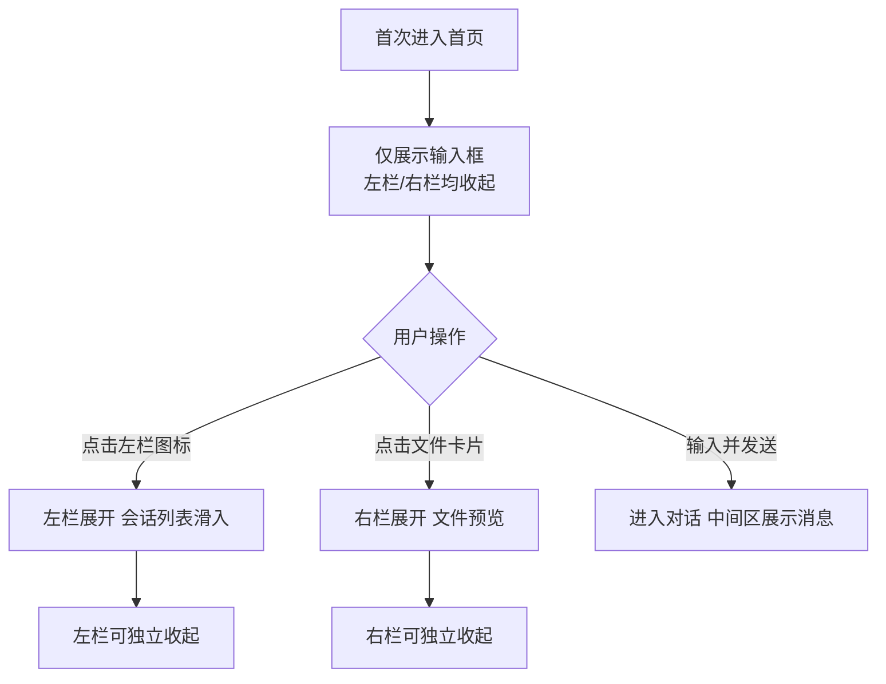
```mermaid
flowchart TD
    A["首次进入首页"] --> B["仅展示输入框<br/>左栏/右栏均收起"]
    B --> C{"用户操作"}
    C -->|"点击左栏图标"| D["左栏展开 会话列表滑入"]
    C -->|"点击文件卡片"| E["右栏展开 文件预览"]
    C -->|"输入并发送"| F["进入对话 中间区展示消息"]
    D --> G["左栏可独立收起"]
    E --> H["右栏可独立收起"]
```

说明：左栏与右栏独立展开/收起，互不强制联动；收起后仅展示图标。

#### 界面原型

| 动作 | 显示 | 类型 | 描述 | 截图示例 |
|------|------|------|------|---------|
| 【左栏】点击展开/收起图标 | 列表滑入/滑出 | 图标 | · 左栏默认收起（图标态），展开宽度260px · 可用宽度不足时以抽屉覆盖主区不挤压 · 加载失败：错误提示+重试按钮 | 待补充 |
| 【右栏】点击文件卡片/关闭 | 展开/收起预览面板 | 面板 | · 右栏默认无文件时不展示 · 加载失败：面板内错误提示+重试 | 待补充 |
| 【右上角头像】点击 | 弹出下拉菜单 | 头像 | · 有头像时显示头像，无头像时显示用户名首字 · 菜单项：编辑个人资料/退出当前账号 | 待补充 |
| 【编辑个人资料】头像上传 | 点击→文件选择器→自动裁剪 | 图片上传 | · 仅png/jpg，≤50MB · 格式不支持：「仅支持png、jpg格式」· 超限：「文件大小超过50MB限制」 | 待补充 |
| 【编辑个人资料】名字输入 | 文本输入框 | 输入框 | · 1-50字符，必填 · 空值阻止保存 · 确认后全局生效，成功提示「个人资料已更新」 | 待补充 |
| 【退出当前账号】点击 | 二次确认弹窗后退出 | 弹窗 | · 确认后跳转登录扫码认证界面 · 会话列表清空 | 待补充 |

#### 数据说明（业务实体）

| 字段名 | 数据类型 | 长度 | 默认值 | 必需 | 约束说明 |
|--------|---------|------|--------|------|---------|
| 头像图片 | 图片 | ≤50MB | 无头像时显示用户名首字 | N | · 仅png/jpg格式 · 自动裁剪为正方形居中显示 · 格式不支持：「仅支持png、jpg格式」· 超限：「文件大小超过50MB限制」 |
| 用户名字 | 字符 | 1-50 | SSO花名 | Y | · 必填 · 空值阻止保存 · 修改后全局生效 · 错误提示「姓名不能为空」 · 成功提示「个人资料已更新」 |
| leftPanelOpen | 布尔 | — | false | — | · 左栏展开/收起状态 · 展开宽度260px |
| rightPanelOpen | 布尔 | — | false | — | · 右栏展开/收起状态 · 无文件时不展示 |


#### 业务规则和约束条件

| 规则项 | 说明 |
| --- | --- |
| 默认状态 | 左栏收起、右栏收起、仅输入框为焦点 |
| 面板独立 | 左栏与右栏独立展开/收起，互不强制联动 |
| 图标态 | 收起后仅展示图标，点击图标展开 |
| 响应式 | MVP 仅适配桌面端（≥ 1280px 标准布局）；可用宽度不足时面板以抽屉覆盖方式展开 |
| 面板宽度 | 左侧栏 260px（展开）/ 0px（收起）；右侧栏自适应，最小 320px；中间区最小 480px |
| 视觉样式 | 不暴露具体色值/字号/间距，由设计稿定义 |
| 账号菜单 | 右上角头像点击弹出下拉菜单，含编辑个人资料和退出账号 |
| 个人资料 | 头像支持 png/jpg 上传自动裁剪；名字默认公司花名（SSO 获取），可修改；全局生效 |
| 退出登录 | 退出需要二次确认，后跳转登录扫码认证界面，会话列表清空 |


#### 接口说明

| 接口 | 说明 |
| --- | --- |
| getLayoutS | 拉取用户布局状态 |
| updateLayo | 更新布局状态（展开/收起） |

#### 补充说明

无。

### 3.5.2 历史会话（左栏）

#### 功能需求描述

左栏用于管理当前用户的历史会话。默认完全收起（图标态），由用户主动展开。展开后展示会话列表，支持新建、搜索（含搜索建议）、重命名、删除，并以更新时间分组。

| EARS 模式 | 需求描述 |
| --- | --- |
| 普遍型 | 系统应在左栏（展开后）展示当前用户的历史会话列表，支持新建、搜索（输入时展示匹配建议下拉）、重命名、删除；系统应展示标题、消息条数、更新时间分组；系统应支持左栏折叠为图标态。 |
| 状态驱动型 | 当列表为空时，系统应展示「暂无会话」；搜索无匹配时展示"无匹配建议"。 |
| 事件驱动型 | 当用户点击新建会话时，系统应创建空白会话并切换至该会话；当用户点击会话项时，系统应加载该会话消息；当用户删除会话时，系统应弹出二次确认后隐藏会话；输入搜索关键词时，系统应按左右模糊匹配展示最多 10 条建议。 |
| 不良行为型 | 当用户无该会话权限时（非本人），系统应隐藏该会话。 |

#### 业务主流程图及说明

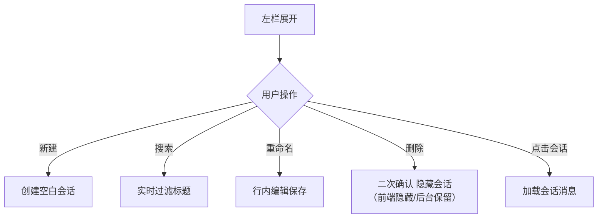
```mermaid
flowchart TD
    A["左栏展开"] --> B{"用户操作"}
    B -->|"新建"| C["创建空白会话"]
    B -->|"搜索"| D["实时过滤标题"]
    B -->|"重命名"| E["行内编辑保存"]
    B -->|"删除"| F["二次确认 隐藏会话<br/>（前端隐藏/后台保留）"]
    B -->|"点击会话"| G["加载会话消息"]
```

说明：左栏所有写操作均经服务端校验归属，非本人会话不可见。

#### 界面原型

| 动作 | 显示 | 类型 | 描述 | 截图示例 |
|------|------|------|------|---------|
| 【左栏展开图标】点击 | 列表滑入展示历史会话 | 图标 | · 加载失败：错误提示+重试按钮 · 可用宽度不足时以抽屉覆盖主区 | 待补充 |
| 【新建会话】点击 | 创建空白会话并切换 | 按钮 | · 创建失败 Toast：「创建失败，请重试」 | 待补充 |
| 【搜索框】输入关键词 | 300ms防抖实时过滤 | 输入框 | · 输入≥1字符触发搜索建议 · 无匹配展示空态「未找到匹配会话」 | 待补充 |
| 【搜索建议】弹出 | 下拉列表最多10条按更新时间降序 | 下拉 | · 左右模糊匹配标题 · 悬停高亮↑↓键切换Enter选中 · 点击/Enter直接搜索 · 无匹配：「无匹配建议」（不可点击） · 点击外部/Esc/选中后自动关闭 | 待补充 |
| 【会话项】点击 | 中间区加载会话消息 | 列表项 | · 超时：保留原会话并提示 | 待补充 |
| 【会话项】Hover | 出现「…」图标 | 列表项 | · 点击弹出二级菜单（重命名/删除） | 待补充 |
| 【重命名】行内编辑 | Enter保存/Esc取消 | 输入框 | · 空值阻止保存：「名称不能为空」 | 待补充 |
| 【删除】二次确认 | 二次确认弹窗→隐藏会话（后台保留） | 弹窗 | · 失败 Toast：「操作失败，请重试」 | 待补充 |
| 【分组标题】Hover | 出现「查看更多」→点击跳转搜索 | 链接 | · 每组默认展示5条按模式分组 | 待补充 |

#### 数据说明（业务实体）

| 字段名 | 数据类型 | 长度 | 默认值 | 必需 | 约束说明 |
|--------|---------|------|--------|------|---------|
| 会话ID | 字符 | — | 系统生成 | Y | · 唯一标识 |
| 会话标题 | 字符 | 4-10 | AI自动生成 | Y | · 根据第一条消息生成 · 异步不阻塞对话 |
| 会话状态 | 枚举 | — | 进行中 | Y | · 选项：进行中/已完成/已失败/已取消 |
| 会话分组 | 枚举 | — | 日常办公 | Y | · 选项：日常办公/专家模式 · 每组默认展示5条 |
| 搜索关键词 | 字符 | ≤50 | 空 | N | · 输入≥1字符触发搜索建议 · 300ms防抖 |
| 搜索建议列表 | 数组 | ≤10条 | [] | — | · 来源：当前用户历史会话标题 · 左右模糊匹配 · 按更新时间降序 |
| 更新时间 | 时间戳 | — | 当前时间 | Y | · 按降序排列 · 相对时间显示 |
| hidden | 布尔 | — | false | — | · 前端隐藏标记 · 删除时设为true · 后台数据保留 |


#### 业务规则和约束条件

| 规则项 | 说明 |
| --- | --- |
| 会话标题自动生成 | 新建会话即时由 AI 根据第一条消息生成标题（4~10 字），异步不阻塞对话 |
| 会话归属 | 仅归属当前登录用户，跨用户不可见 |
| 排序 | 按更新时间降序 |
| 默认联网 | 新建会话默认启用联网查询模式 |
| 搜索建议匹配 | 左右模糊匹配（输入"报"→匹配"报表分析""周报"等所有含"报"的标题）；最多10条 |
| 搜索建议数据源 | 当前用户的历史会话标题 |
| 删除=前端隐藏 | hidden 标记，前台不展示，后台数据保留 |
| 分组展示 | 按模式分组（日常办公/专家模式），每组默认展示5条 |
| 左栏默认收起 | 不主动展开；可用宽度不足时以抽屉覆盖 |


#### 接口说明

| 接口 | 说明 |
| --- | --- |
| createConv | 新建空白会话 |
| listConver | 列表/搜索（按 userId、关键词过滤，排除 hidden=true 的会话） |
| switchConv | 加载会话消息 |
| updateConv | 重命名 |
| hideConver | 隐藏会话（二次确认后调用，前端不展示，后台数据保留） |

#### 补充说明

无。

### 3.5.3 对话输入区

#### 功能需求描述

输入区位于中间区中部，默认以顶部输入框为入口，进入对话后聚焦输入区。支持多行输入、附件上传（本地文件 + 知识库文件）和联网查询开关。详细交互规则见界面原型，约束条件见业务规则。

| EARS 模式 | 需求描述 |
| --- | --- |
| 普遍型 | 系统应在中间区底部提供输入区，支持多行输入（最多 8 行）、Enter 发送 / Shift+Enter 换行、最大 10000 字符；系统应提供附件上传入口（本地文件 + 知识库文件）；系统应在上传中展示状态标识；系统应提供联网查询开关。 |
| 状态驱动型 | 当正在流式生成时，发送控件替换为停止控件；当文件正在解析时，展示解析中状态并禁用重复提交；当专家模式下未选择专家时，发送按钮置灰不可点击。 |
| 事件驱动型 | 当用户点击发送时，消息加入会话并触发对话服务；选择超范围格式文件时拦截并提示；粘贴超 10000 字符内容时自动转为 txt 文件卡片。 |
| 不良行为型 | 输入为空时禁止发送；命中敏感词或 Prompt 注入时拦截；文件 >50MB 或超 50 个时拦截；格式伪装/加密时服务端检测后标记失败。 |

#### 业务主流程图及说明

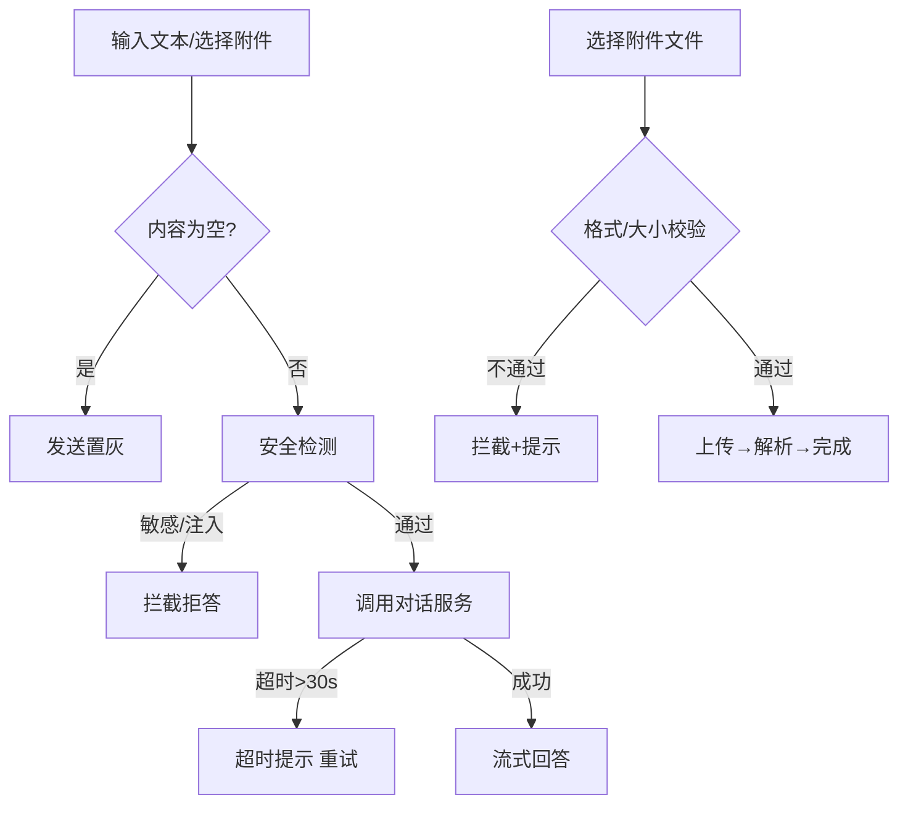
```mermaid
flowchart TD
    A["输入文本/选择附件"] --> B{"内容为空?"}
    B -->|"是"| C["发送置灰"]
    B -->|"否"| D["安全检测"]
    D -->|"敏感/注入"| E["拦截拒答"]
    D -->|"通过"| F["调用对话服务"]
    F -->|"超时>30s"| G["超时提示 重试"]
    F -->|"成功"| H["流式回答"]
    I["选择附件文件"] --> J{"格式/大小校验"}
    J -->|"不通过"| K["拦截+提示"]
    J -->|"通过"| L["上传→解析→完成"]
```

说明：日常办公模式对话服务内部走 web-search+RAG 编排；专家模式走 plan-and-execute 编排。附件作为上下文加入当前会话，跨两模式通用。

#### 界面原型

| 动作 | 显示 | 类型 | 描述 | 截图示例 |
|------|------|------|------|---------|
| 【输入框】输入文本 | 高度自适应超8行内部滚动 | 输入框 | · 最大10000字符9000时显示计数器· 超长截断：「内容过长请精简后重试」· 10000后禁止输入 | 待补充 |
| 【Enter】发送 | 消息上屏 | 快捷键 | · Shift+Enter换行· 空内容置灰不触发 | 待补充 |
| 【发送按钮】点击 | 发送消息 | 按钮 | · 敏感词/注入拦截：「内容包含敏感信息已拦截」· 生成中替换为停止按钮 | 待补充 |
| 【停止按钮】生成中 | 中断当前生成 | 按钮 | · 中断失败：等待自然结束或超时 | 待补充 |
| 【添加文件】点击 | 弹出上传弹窗（本地/知识库） | 按钮 | · 校验顺序：扩展名→大小→空文件· 格式白名单：pdf/doc/docx/txt/md/xlsx/xls/csv/pptx· 格式不支持：提示支持格式列表 | 待补充 |
| 【本地文件】选择 | 打开系统文件选择器 | 文件选择 | · 单文件≤50MB单次≤50个· 超限：「文件超过50MB限制」· 数量超：「最多上传50个文件」· 空文件标注「空文件」· 格式伪装/加密服务端检测标记失败 | 待补充 |
| 【知识库文件】选择 | 展示企业+个人空间文件 | 弹窗 | · 支持搜索文件名按文件类型筛选· 按用户权限过滤无权限文件不可见· 加载失败：「知识库文件加载失败请重试」· 勾选后加入附件标注来源（企业/个人） | 待补充 |
| 【文件上传】进行中 | 状态标识 | 状态 | · 状态：上传中/解析中/已完成/处理失败· 上传中断：「上传失败」· 解析失败：「文件解析失败已移除」· 解析中禁用重复提交 | 待补充 |
| 【拖拽文件】至输入区 | 悬停高亮+「释放以上传文件」 | 拖拽 | · — | 待补充 |
| 【文件卡片】上传完成 | 展示文件名/类型图标/大小 | 卡片 | · 每行4个超出左右箭头翻页· 点击右栏预览· 预览失败：「文件预览失败请重试」· 点击×发送前移除 | 待补充 |
| 【联网查询开关】点击 | 切换开关 | 开关 | · 默认开启· 关闭后不调用web-searchRAG不受影响 | 待补充 |
| | | | · 按用户权限过滤，无权限文件不可见 |
| | | | · 加载失败：「知识库文件加载失败，请重试」 |
| | | | · 勾选后加入附件，标注来源（企业/个人） |
| 【文件上传】进行中 | 状态标识：上传中/解析中/已完成/处理失败 | 状态 | · 上传中断：「上传失败」 |
| | | | · 解析失败：「文件解析失败，已移除」 |
| | | | · 解析中禁用重复提交 |
| 【拖拽文件】至输入区 | 悬停高亮+「释放以上传文件」 | 拖拽 | · — |
| 【文件卡片】上传完成 | 展示文件名/类型图标/大小 | 卡片 | · 每行4个超出左右箭头翻页支持←→键· 点击右栏预览· 预览失败：「文件预览失败请重试」· 点击×发送前移除 | 待补充 |
| 【联网查询开关】点击 | 切换开关状态 | 开关 | · 默认开启· 关闭后不调用web-searchRAG不受影响 | 待补充 |

#### 数据说明（业务实体）

| 字段名 | 数据类型 | 长度 | 默认值 | 必需 | 约束说明 |
|--------|---------|------|--------|------|---------|
| 输入内容 | 字符 | ≤10000 | 空 | N | · 9000时显示计数器· 10000后禁止输入· 超长粘贴自动转为txt文件卡片· 占位符「输入您的问题Shift+Enter换行」· 切换会话保留草稿 |
| 发送按钮状态 | 枚举 | — | 置灰 | — | · 有内容时高亮· 空内容置灰· 生成中替换为停止按钮 |
| 附件文件 | 文件 | ≤50MB | — | N | · 单次≤50个· 白名单：pdf/doc/docx/txt/md/xlsx/xls/csv/pptx· 空文件拦截· 格式伪装/加密服务端检测标记失败 |
| 文件上传状态 | 枚举 | — | — | — | · 状态：上传中/解析中/已完成/处理失败· 解析中禁用重复提交 |
| 联网查询开关 | 布尔 | — | 开启 | — | · 关闭后不调用web-search· RAG不受影响· 与会话绑定


#### 业务规则和约束条件

| 规则项 | 说明 |
| --- | --- |
| 输入框高度 | 最多拉高至 8 行，超过出现垂直滚动条 |
| 字符限制 | 最大 10000 字符；9000 字符时显示「9000 / 10000」计数器；10000 字符后禁止继续输入 |
| 超限粘贴 | 粘贴超过 10000 字符自动转为 txt 文件卡片附在消息中 |
| placeholde | 「输入您的问题，Shift+Enter 换行」 |
| 草稿保留 | 切换会话保留输入框内容，切回时恢复；发送后清空 |
| 联网查询 | 默认开启，与当前会话绑定；新建会话继承全局默认值。关闭后不调用 web-search，RAG 不受影响 |
| 附件白名单 | pdf/doc/docx/txt/md/xlsx/xls/csv/pptx |
| 文件约束 | 单文件 ≤ 50MB，单次最多 50 个 |
| 前端校验顺序 | 扩展名 → 文件大小 → 空文件，逐项校验，首个不通过即拦截 |
| 服务端校验 | 格式伪装（扩展名与文件头不匹配）→「上传失败」；加密文件→「处理失败」 |
| 知识库文件 | 取自企业知识库与个人知识库，按用户权限过滤；本地上传与知识库引用共用上下文挂载 |
| 并发上传 | 多文件各自独立，互不影响 |
| 上下文窗口 | 单会话保留最近 5 轮（见 3.4.6 智能体 Agent） |
| 重复发送 | 生成中再次点击发送被忽略或排队 |
| 发送失败 | 自动重试并保留草稿 |
| 专家模式发送 | 未选择专家时发送按钮置灰，选择后恢复（见 3.5.8） |

#### 接口说明

| 接口 | 说明 |
| --- | --- |
| sendMessag | 安全检测后调用对话服务，返回流式 |
| stopGenera | 中断当前生成 |
| uploadAtta | 附件上传（分片/断点续传） |
| parseAttac | 解析为可检索上下文 |
| listKnowle | 拉取当前用户有权限访问的知识库文件（企业 + 个人） |
| attachKnow | 将知识库文件引用挂载为对话上下文 |

#### 补充说明

- **与知识中心的关系**：知识中心负责文件的创建/管理/权限，首页智能体通过 `listKnowledgeFiles` 接口拉取用户有权限的文件引用并挂载为对话上下文。首页不做文件管理操作（上传到知识库、文件夹组织等），这些操作统一在知识中心完成。

### 3.5.4 快捷指令区

#### 功能需求描述

输入区上方展示快捷指令：生成钉钉待办 / 生成需求草稿 / 封装成技能。点击后将对应预设提示词填入输入区并聚焦，不直接静默执行，需用户确认发送。

| EARS 模式 | 需求描述 |
| --- | --- |
| 普遍型 | 系统应在输入区上方展示快捷指令；系统应在用户点击快捷指令时，将对应预设提示词填入输入区并聚焦。 |
| 状态驱动型 | 当某快捷指令所需上下文缺失时，系统应仍填入预设提示词并提示用户补充。 |
| 事件驱动型 | 当用户点击快捷指令时，系统应填充输入区并准备发送。 |
| 不良行为型 | 系统不应在点击快捷指令时静默直接执行任务（须用户确认发送）。 |

#### 业务主流程图及说明

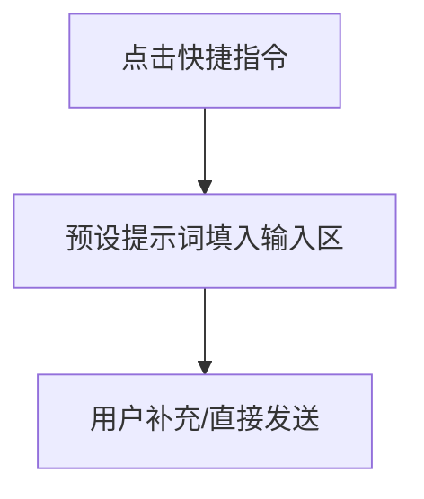
```mermaid
flowchart TD
    A["点击快捷指令"] --> B["预设提示词填入输入区"]
    B --> C["用户补充/直接发送"]
```

说明：快捷指令底层为 Skill 触发（见 3.4.5 Skill），此处仅做提示词预填。

#### 界面原型

| 动作 | 显示 | 类型 | 描述 | 截图示例 |
|------|------|------|------|---------|
| 【快捷指令卡片】点击 | 预设提示词填入输入区并聚焦 | 卡片 | · 模板加载失败：「暂无可用快捷指令」· 不直接静默执行需用户确认发送 | 待补充 |
| 【快捷指令布局】日常办公模式 | 以卡片形式横向排列在输入区下方 | 卡片布局 | · 每行3列最多3行共9个· 超出9个出现翻页箭头 | 待补充 |
| 【快捷指令布局】专家模式（选中专家后） | 以气泡形式叠放在输入区下方 | 气泡布局 | · 每行3列最多3行共9个· 创建智能体时人为设置快捷短语不超过9个 | 待补充 |
| 【专家卡片布局】专家模式 | 以卡片形式横向排列在输入区上方 | 卡片布局 | · 每行3列最多3行共9个· 超出9个出现翻页箭头 | 待补充 |

#### 数据说明（业务实体）

| 实体 | 关键字段 | 说明 |
| --- | --- | --- |
| QuickComma | id, label, promptTemplate, skillRef | 快捷指令配置（后台可配） |

#### 业务规则和约束条件

| 规则项 | 说明 |
| --- | --- |
| 快捷指令仅作提示词预填 | 不直接静默执行任务，需用户确认发送 |
| 预设提示词模板来源 | 后台 Skill 配置 |
| 专家模式快捷短语 | 创建智能体时人为设置，不超过 9 个 |

#### 接口说明

| 接口 | 说明 |
| --- | --- |
| listQuickC | 拉取快捷指令模板 |
| （发送经 sendM | 用户确认后走正常发送链路 |

#### 补充说明

无。

### 3.5.5 会话详情

#### 功能需求描述

会话详情是中间区的核心消息画布，负责展示用户与助手的对话全过程。日常办公模式下展示流式回答、CoT 折叠摘要、来源标注与文件卡片；专家模式下展示 Plan 步骤清单、Execute 逐步执行状态与中间结果。消息按时间顺序自下而上滚动，支持流式逐字展示与停止控件联动。

| EARS 模式 | 需求描述 |
| --- | --- |
| 普遍型 | 系统应在中间区展示当前会话的消息流（用户消息 + 助手回答）；系统应支持流式逐字展示；系统应展示 CoT 折叠摘要与文件卡片。 |
| 状态驱动型 | 当正在生成时，系统应展示流式逐字内容与思考中动效；当专家模式 Plan 生成后，系统应展示步骤清单供用户查看；当 Execute 执行中时，系统应展示每步状态（执行中/完成/失败）。 |
| 事件驱动型 | 当用户发送消息时，系统应将消息追加至画布底部并触发生成；当用户点击 CoT 摘要时，系统应展开完整推理过程；当用户点击文件卡片时，系统应触发右栏预览。 |
| 不良行为型 | 当生成超时（>30s）时，系统应展示超时提示；当网络异常时，系统应展示重试入口并保留草稿；当 CoT 生成失败时，系统应仅展示回答不展示 CoT。 |

#### 业务主流程图及说明

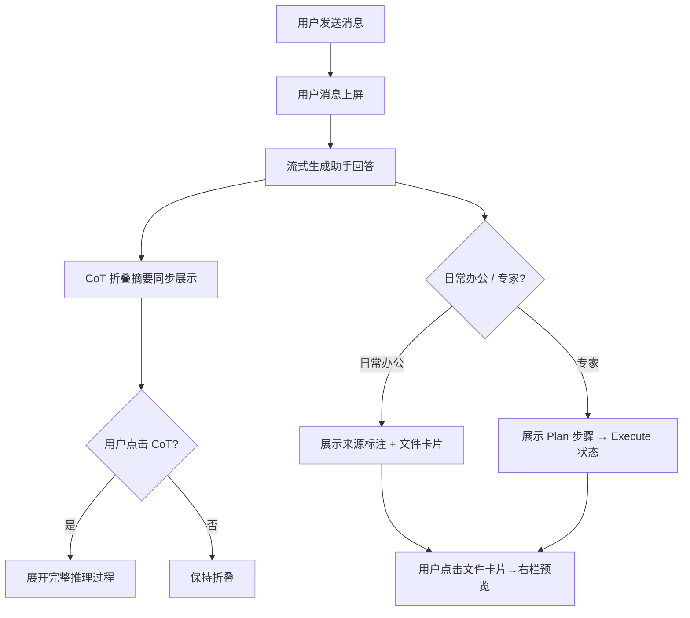
```mermaid
flowchart TD
    A["用户发送消息"] --> B["用户消息上屏"]
    B --> C["流式生成助手回答"]
    C --> D["CoT 折叠摘要同步展示"]
    C --> E{"日常办公 / 专家?"}
    E -->|"日常办公"| F["展示来源标注 + 文件卡片"]
    E -->|"专家"| G["展示 Plan 步骤 → Execute 状态"]
    D --> H{"用户点击 CoT?"}
    H -->|"是"| I["展开完整推理过程"]
    H -->|"否"| J["保持折叠"]
    F --> K["用户点击文件卡片→右栏预览"]
    G --> K
```

说明：会话详情画布是所有对话内容的统一展示区，日常办公与专家模式共用同一画布，仅展示内容形态不同。开始会话即保存会话记录（含会话 ID、标题、模式），不等首轮回答完成。

**会话状态流转**：

| 状态 | 触发条件 | 说明 |
| --- | --- | --- |
| 进行中 | 会话创建 / 用户发送消息 | 存在活跃对话 |
| 已完成 | 对话正常结束（回答生成完毕且无异常） | 会话归档，可继续追问 |
| 已失败 | 网络断开 / 生成超时（>30s） | 消息气泡展示错误提示，用户可重试 |
| 已取消 | 用户点击「停止生成」 | 中止当前生成，已生成内容保留 |

#### 界面原型

| 动作 | 显示 | 类型 | 描述 | 截图示例 |
|------|------|------|------|---------|
| 【消息气泡】用户发送 | 右对齐上屏 | 气泡 | · 网络异常：「网络异常点击重试」并保留草稿· hover出现「复制」图标 | 待补充 |
| 【消息气泡】助手回答 | 左对齐流式逐字展示 | 气泡 | · 生成中展示思考动效· 超时30s：「响应超时请稍后重试」 | 待补充 |
| 【CoT】流式生成中 | 完整推理过程流式展示 | 折叠块 | · 开始输出回复时自动折叠· 点击展开/收起· 用户可关闭 | 待补充 |
| 【引用标记】AI回答 | 回复中内嵌上标数字底部展示来源列表 | 引用 | · hover浮层显示文件名+摘要· 来源不可用：「来源已失效」 | 待补充 |
| 【文件卡片】AI生成后 | 展示文件名/格式/大小 | 卡片 | · 产物类型：md/docx/xlsx/pptx/pdf· 点击右栏预览（大纲+正文） | 待补充 |
| 【Plan步骤】专家模式 | 步骤清单展示用户可调整 | 列表 | · 支持增/删/改/排序· 规划失败：「规划失败请重试」 | 待补充 |
| 【Execute】Plan后执行 | 逐步执行展示每步状态 | 状态 | · 状态：执行中/完成/失败 | 待补充 |
| 【停止按钮】生成中 | 中断当前生成 | 按钮 | · 中断失败：等待自然结束或超时 | 待补充 |
| 【时间戳】消息间 | 同天时:分跨天月-日时:分 | 文字 | · hover显示完整时间· 仅间隔>5分钟才展示 | 待补充 |
| 【自动滚动】新消息 | 自动滚到底部 | 行为 | · 用户手动上滚后停止出现「↓回到底部」 | 待补充 |
| 【代码块】出现时 | 语法高亮渲染 | 代码 | · 右上角「复制代码」按钮 | 待补充 |
| 【Mermaid图表】出现时 | 默认渲染为图片 | 图表 | · 可切换Mermaid代码支持复制 | 待补充 |

#### 数据说明（业务实体）

| 实体 | 关键字段 | 说明 |
| --- | --- | --- |
| Message | id, convId, role, content, cotSummary, cotFull, createdAt | 会话消息（含 CoT 内容） |
| RetrievalR | source(web/rag), title, url, snippet, score | 检索结果（日常办公来源标注） |
| PlanStep | id, expertId, stepDesc, status | 专家规划步骤 |
| ExecutionR | id, stepId, output, files | 执行中间/最终结果 |
| GeneratedF | id, convId, msgId, name, type, url, outline | AI 生成文件元信息 |

#### 业务规则和约束条件

| 规则项 | 说明 |
| --- | --- |
| 消息按时间顺序自下而 | 消息按时间顺序自下而上滚动，最新消息在底部。 |
| 流式生成与 CoT  | 流式生成与 CoT 详细推理同步展示，开始输出回复时 CoT 自动折叠为单行摘要。 |
| 日常办公模式回答应标 | 日常办公模式回答应标注信息来源（web 链接 / 知识库文档）。 |
| 专家模式 Plan  | 专家模式 Plan 须对用户可见、可调整后再执行。 |
| Execute 调用 | Execute 调用的工具/函数/MCP 受权限与可见范围约束。 |
| 生成超时（>30s） | 生成超时（>30s）展示超时提示，网络异常展示重试入口并保留草稿。 |
| CoT 生成失败不影 | CoT 生成失败不影响回答展示（降级为仅展示回答）。 |
| 专家模式下 Plan | 专家模式下 Plan 步骤清单本身就是 CoT 的一种形式，与折叠 CoT 不重复展示。 |
| 助手回答支持 Mar | 标题(H1~H6)、加粗、斜体、行内代码、代码块(语法高亮+横向滚动)、有序/无序列表、表格(列宽自适应)、引用、链接(点击新窗口打开)。不支持 HTML 标签和图片渲染。 |
| 代码块横向滚动（不换 | 代码块横向滚动（不换行），右上角「复制代码」按钮，复制后 Toast「已复制」。 |


#### 接口说明

| 接口 | 说明 |
| --- | --- |
| sendMessag | 安全检测后调用对话服务，返回流式（含 CoT 字段） |
| stopGenera | 中断当前生成 |
| planExecut | 专家模式规划并执行（编排 web-search/RAG/函数/MCP） |
| getFileMet | 拉取文件元信息与大纲（点击文件卡片时调用） |

#### 数据说明（业务实体）

| 实体 | 关键字段 | 说明 |
| --- | --- | --- |
| Message | id, convId, role(user/assistant), content, attachments, createdAt | 消息 |


#### 补充说明

会话详情画布是日常办公模式与专家模式的统一展示区，两种模式共用同一消息流容器，仅展示内容形态不同（日常办公=回答+来源+文件卡片；专家=Plan步骤+Execute状态+交付物）。

### 3.5.6 右栏文件预览面板

#### 功能需求描述

右栏 MVP 唯一功能为文件预览。AI 生成文件后，于对话消息中展示文件卡片，用户点击卡片即在右栏打开预览；系统展示文件大纲导航，支持点击跳转到对应章节。默认收起，仅点击文件卡片时展开。

| EARS 模式 | 需求描述 |
| --- | --- |
| 普遍型 | 系统应在右侧栏提供文件预览面板（MVP 仅此一项功能）；系统应在 AI 生成文件后，于对话消息中展示文件卡片，用户点击卡片即在右栏打开预览；系统应展示文件大纲导航，支持点击跳转章节。 |
| 状态驱动型 | 当右栏无预览文件时，系统应保持收起（图标态）；当被预览文件被删除时，系统应自动关闭该预览。 |
| 事件驱动型 | 当用户点击文件卡片时，系统应展开右栏并渲染文件正文与大纲；当用户点击大纲项时，系统应按章节跳转。 |
| 不良行为型 | 当格式不支持预览时，系统应提示暂不支持预览此文件格式。 |

#### 业务主流程图及说明

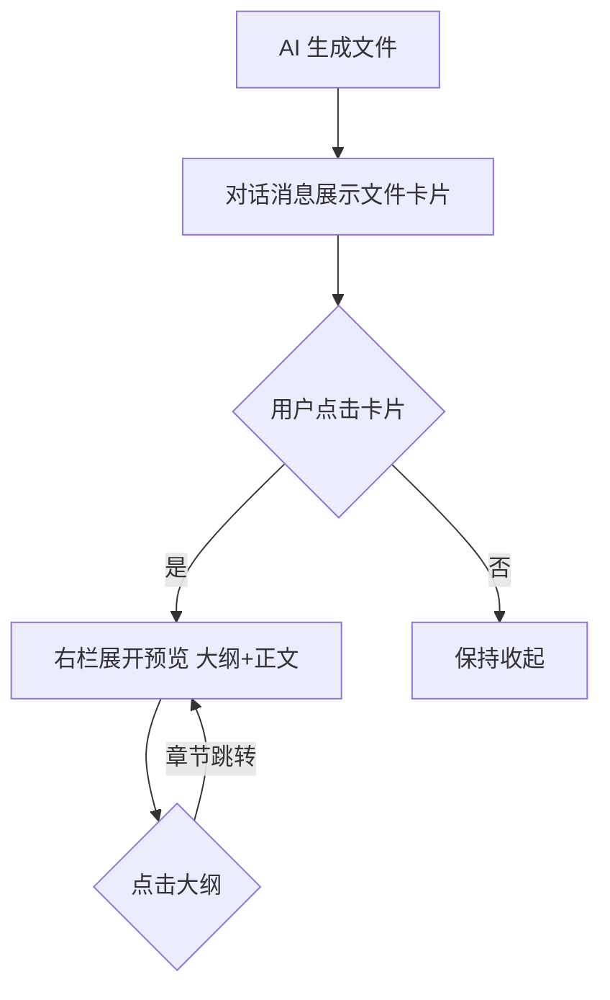
```mermaid
flowchart TD
    A["AI 生成文件"] --> B["对话消息展示文件卡片"]
    B --> C{"用户点击卡片"}
    C -->|"是"| D["右栏展开预览 大纲+正文"]
    D --> E{"点击大纲"}
    E -->|"章节跳转"| D
    C -->|"否"| F["保持收起"]
```

说明：右栏形成「生成→点击→查看」轻量闭环，类似主流对话产品的文件卡片交互。

#### 界面原型

| 动作 | 显示 | 类型 | 描述 | 截图示例 |
|------|------|------|------|---------|
| 【文件卡片】AI生成后 | 对话消息内展示文件名/格式/大小 | 卡片 | · 点击右栏展开预览 | 待补充 |
| 【预览面板】展开 | 渲染文件正文+大纲导航 | 面板 | · 加载中：骨架屏· 失败：面板内错误提示+重试· 格式不支持：「暂不支持预览该文件格式」· 预览格式PDF/DOCX/TXT/MD/XLSX/XLS/CSV/DOC | 待补充 |
| 【大纲导航】点击 | 正文跳转到对应章节 | 导航 | · 高亮跟随正文滚动自动切换· 点击带平滑滚动动画 | 待补充 |
| 【标签页】多文件 | 切换预览内容 | 标签 | · 支持多文件标签页逻辑 | 待补充 |
| 【关闭预览】点击 | 右栏收起 | 按钮 | · 右栏无文件时保持收起不展示空面板 | 待补充 |
| 【被预览文件】被删除 | 自动关闭该文件预览 | 兜底 | · 提示「该文件已不存在预览已关闭」 | 待补充 |

#### 数据说明（业务实体）

| 字段名 | 数据类型 | 长度 | 默认值 | 必需 | 约束说明 |
|--------|---------|------|--------|------|---------|
| 预览文件名 | 字符 | — | — | Y | · AI生成文件自动填充 |
| 文件类型 | 枚举 | — | — | Y | · 支持：PDF/DOCX/TXT/MD/XLSX/XLS/CSV/DOC· 不支持格式提示「暂不支持预览」 |
| panelOpen | 布尔 | — | false | — | · 右栏展开/收起状态· 无文件时不展示 |
| currentFileId | 字符 | — | 空 | — | · 当前预览文件ID |

#### 业务规则和约束条件

| 规则项 | 说明 |
| --- | --- |
| 右栏 MVP 不含引 | 右栏 MVP 不含引用/知识缺口/上下文记忆等面板（仅文件预览）。 |
| 预览格式支持 | PDF/DOCX/TXT/MD/XLSX/XLS/CSV/DOC。 |
| 收起行为 | 右栏无文件时保持收起，不展示空面板 |
| 连续点击 | 以最后一次为准渲染 |
| 大纲导航高亮跟随正文 | 大纲导航高亮跟随正文滚动位置自动切换；点击大纲项带平滑滚动动画定位到对应章节。 |


#### 接口说明

| 接口 | 说明 |
| --- | --- |
| getFileMet | 拉取文件元信息与大纲 |
| getFileCon | 拉取文件正文用于渲染 |

#### 补充说明

无。

### 3.5.7 日常办公模式（web-search + RAG + 钉钉）

#### 功能需求描述

日常办公模式以 web-search + RAG 为核心，并接入钉钉基础能力。用户输入问题后，系统先判断是否需检索：对时效性/公开信息走 web-search 实时联网检索；对企业私有知识（钉钉文档、知识库、业务系统）走 RAG 检索；再结合上下文生成答案。结果可进一步落地为钉钉侧动作（生成待办、查询审批/日程、发送通知）。

| EARS 模式 | 需求描述 |
| --- | --- |
| 普遍型 | 系统应在日常办公模式下，对用户问题先做检索路由：对公开/时效信息调用 web-search，对企业知识调用 RAG；系统应结合上下文生成答案；系统应支持将结果转化为钉钉动作（待办/审批查询/通知）。 |
| 状态驱动型 | 当检索/生成无结果时，系统应给出引导建议而非报错；当问题涉及企业知识时，系统应优先走 RAG 而非纯模型生成。 |
| 事件驱动型 | 当用户发送问题时，系统应执行「路由→检索→生成→（可选）钉钉动作」链路；当用户确认生成钉钉待办时，系统应调用钉钉接口创建。 |
| 不良行为型 | 当 web-search 或 RAG 失败时，系统应降级（仅模型生成并提示来源缺失）；当钉钉调用失败，系统应提示并保留结果不直接丢失。 |

#### 业务主流程图及说明

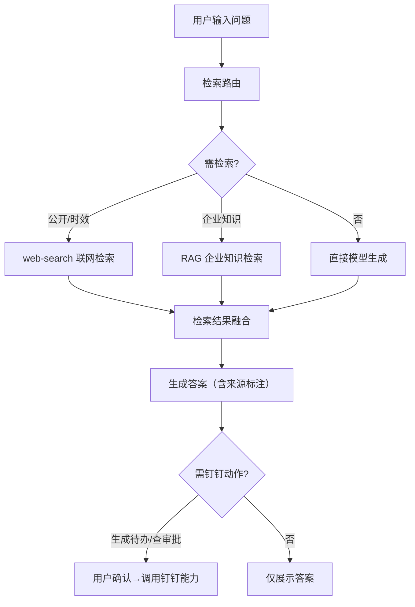
```mermaid
flowchart TD
    A["用户输入问题"] --> B["检索路由"]
    B --> C{"需检索?"}
    C -->|"公开/时效"| D["web-search 联网检索"]
    C -->|"企业知识"| E["RAG 企业知识检索"]
    C -->|"否"| F["直接模型生成"]
    D --> G["检索结果融合"]
    E --> G
    F --> G
    G --> H["生成答案（含来源标注）"]
    H --> I{"需钉钉动作?"}
    I -->|"生成待办/查审批"| J["用户确认→调用钉钉能力"]
    I -->|"否"| K["仅展示答案"]
```

说明：检索路由可由模型判断或按关键词/意图规则触发；web-search 与 RAG 可并行。

**案例卡片**：日常办公模式下，输入区上方展示预置的 prompt 案例卡片（如「帮我写一份周报」「分析最近的销售趋势」），点击回写到输入框中。案例卡片仅有 prompt 文本，无推荐回答。案例由管理员后台配置。

#### 界面原型

| 动作 | 显示 | 类型 | 描述 | 截图示例 |
|------|------|------|------|---------|
| 【输入问题】发送 | 检索路由→检索+生成→答案含来源标注 | 流程 | · 检索失败降级为仅模型生成· 提示「检索暂不可用已基于已有信息回答」· 联网开关关闭时跳过web-search | 待补充 |
| 【来源标注】答案展示 | web链接/知识库文档名可点击 | 引用 | · 来源不可用：「来源已失效」 | 待补充 |
| 【钉钉待办】点击生成 | 弹出确认→调用钉钉创建 | 按钮 | · 钉钉调用失败：「钉钉操作失败请重试（答案已保留）」 | 待补充 |
| 【查询审批】点击 | 调用钉钉查询审批进度 | 按钮 | · 同上 | 待补充 |
| 【RAG】无命中 | 自动回退web-search或模型生成 | 降级 | · 提示「未检索到相关企业知识已切换为联网检索」 | 待补充 |
| 【案例卡片】点击 | prompt文本回写到输入框并聚焦 | 卡片 | · — | 待补充 |

#### 数据说明（业务实体）

| 字段名 | 数据类型 | 长度 | 默认值 | 必需 | 约束说明 |
|--------|---------|------|--------|------|---------|
| 检索来源 | 枚举 | — | — | — | · 选项：web/rag · 可点击查看详情 |
| 钉钉动作类型 | 枚举 | — | — | — | · 选项：todo/approval/notification · 需用户确认后执行 |

#### 业务规则和约束条件

| 规则项 | 说明 |
| --- | --- |
| 检索路由判断规则 | ① 涉及企业专有名词/内部流程/最新政策 → RAG；② 涉及时效公开资讯/实时行情 → web-search；③ 两者都涉及 → 并行检索融合生成；④ 都不涉及 → 仅模型生成 |
| 并行检索超时策略 | web-search 超时 5s，RAG 超时 2s，任一超时不阻断另一路 |
| 联网开关关闭时 | 跳过 web-search 分支，仅走 RAG + 模型生成 |
| 钉钉动作须经用户确认 | 不直接静默落库 |
| 答案来源标注 | web 链接 / 知识库文档可点击查看
| 钉钉接入场景（简要） | ① 待办管理——生成/查询个人待办；② 审批——查询审批进度；③ 日程——查询/提醒日程；④ 企业知识——经 RAG 检索钉钉文档与知识库；⑤ 通知——将结果推送给用户或群。 |


#### 接口说明

| 接口 | 说明 |
| --- | --- |
| webSearch | 联网检索公开信息 |
| ragQuery | 企业知识检索（经 MCP 对接钉钉文档/知识库） |
| dingtalk.t | 创建钉钉待办 |
| dingtalk.a | 查询审批 |
| dingtalk.n | 发送通知 |

#### 补充说明

无。

### 3.5.8 专家模式框架（plan and execute）

#### 功能需求描述

专家模式以 plan-and-execute 为核心范式。用户从专家卡片选择某位专家后进入专属协作；专家先就任务做步骤规划（Plan，向用户展示计划），再逐步调用工具/函数/MCP（含 web-search、RAG、业务系统对接）执行（Execute），过程中产出中间结果，最终汇总为结构化交付物。

专家卡片交互区分：悬停（Hover）自动展开显示该专家的具体介绍（能力描述/适用场景等）；点击（Click）跳转到该专家的案例卡片列表。案例卡片与日常办公模式类似——仅有 prompt 文本，点击回写到输入框，无推荐回答。引导用户通过 prompt 开始与专家协作。专家模式下必须先选择一位专家才能发送消息，未选择时发送按钮置灰不可点击。MVP 预置 10 位专家，完整清单见附录 6.1。

| EARS 模式 | 需求描述 |
| --- | --- |
| 普遍型 | 系统应在专家模式下以卡片展示可用专家（MVP 预置 10 位，见附录 6.1）；系统应支持用户选择专家后进入该专家专属协作（plan-and-execute）。 |
| 状态驱动型 | 当专家状态为草稿/已归档时，系统应置灰不可选；当 plan 生成后，系统应先展示计划再进入执行。 |
| 事件驱动型 | 当用户悬停专家卡片时，系统应仅显示文字介绍/履历摘要；当用户点击卡片时，系统应展开专家详情（含提示词案例库）并进入协作；Plan 生成后直接进入 Execute 逐步执行。 |
| 不良行为型 | 系统不应在 MVP 暴露创建智能体向导（仅开发者可用，见 Non-goals）；当工具调用越权时系统应拒绝执行。 |

#### 业务主流程图及说明

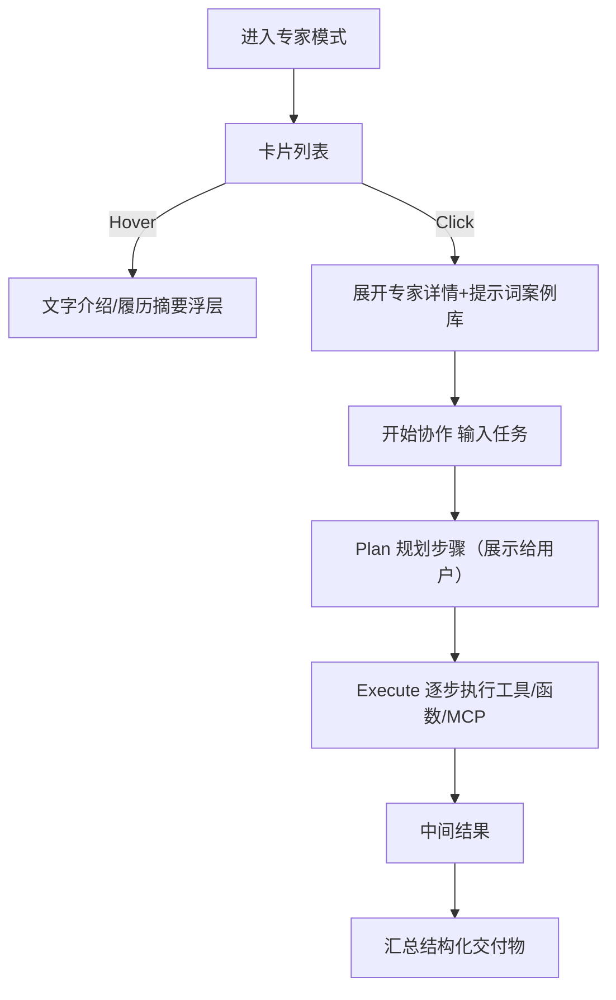
```mermaid
flowchart TD
    A["进入专家模式"] --> B["卡片列表"]
    B -->|"Hover"| C["文字介绍/履历摘要浮层"]
    B -->|"Click"| D["展开专家详情+提示词案例库"]
    D --> E["开始协作 输入任务"]
    E --> F["Plan 规划步骤（展示给用户）"]
    F --> H["Execute 逐步执行工具/函数/MCP"]
    H --> I["中间结果"]
    I --> J["汇总结构化交付物"]
```

说明：Plan 阶段输出可阅读的步骤清单，Execute 阶段每个步骤可调用 web-search/RAG/业务系统并产出中间文件。

#### 界面原型

| 动作 | 显示 | 类型 | 描述 | 截图示例 |
|------|------|------|------|---------|
| 【专家卡片网格】进入 | 展示头像/名称/花名/描述每行3列最多3行共9个 | 卡片网格 | · 超出翻页支持按名称搜索过滤· 加载失败：「专家加载失败点击重试」 | 待补充 |
| 【专家卡片】Hover | 展开能力描述/适用场景 | 卡片 | · 仅显示文字介绍不触发协作 | 待补充 |
| 【专家卡片】Click | 跳转该专家案例卡片列表 | 卡片 | · 案例加载失败提示重试· 点击案例prompt回写到输入框 | 待补充 |
| 【发送按钮】未选专家 | 置灰不可点击 | 按钮 | · 选择专家后恢复可点击 | 待补充 |
| 【开始协作】点击 | 进入专属对话载入欢迎语与快捷指令 | 按钮 | · 专家草稿/已归档时提示「该专家暂不可用」 | 待补充 |
| 【Plan步骤】输入任务后 | 展示步骤清单用户可调整 | 步骤列表 | · 规划失败：「规划失败请重试」· 支持增/删/改/拖拽排序 | 待补充 |
| 【Execute】Plan后执行 | 逐步执行展示每步状态 | 状态标识 | · 状态：执行中/完成/失败· 某步失败可重试或跳过并标注 | 待补充 |
| 【执行完成】汇总 | 结构化交付物展示文件卡片 | 交付物 | · 呈现最终成果 | 待补充 |

#### 数据说明（业务实体）

| 字段名 | 数据类型 | 长度 | 默认值 | 必需 | 约束说明 |
|--------|---------|------|--------|------|---------|
| 专家ID | 字符 | — | 系统生成 | Y | · 唯一标识 |
| 专家状态 | 枚举 | — | 已发布 | Y | · 选项：草稿/已发布/已归档· 草稿/已归档时不可选 |
| Plan步骤描述 | 字符 | — | — | Y | · 步骤文本· 支持增/删/改/拖拽排序· Plan超时30s提示「规划失败请重试」 |
| Plan步骤状态 | 枚举 | — | 待执行 | Y | · 状态：待执行/执行中/完成/失败 |
| 交付物类型 | 枚举 | — | — | — | · 类型：PDF/Markdown/Excel等 |

#### 业务规则和约束条件

| 规则项 | 说明 |
| --- | --- |
| Plan 可见与可调 | Plan 步骤清单展示给用户，支持增/删/改/拖拽排序；调整后自动更新清单，直接进入 Execute |
| Plan 超时 | Plan 生成超时 30s，超时提示「规划失败，请重试或更换问题描述」 |
| Execute 权限 | Execute 调用的工具/MCP 受权限与可见范围约束 |
| 表述规范 | 避免过度拟人化，聚焦工具化定位 |
| 专家数量 | MVP 固定 10 位预置专家，不支持用户自建（见 5.2 Non-goals）；完整清单见附录 6.1 |
| 方案中心 | 方案中心智能体为独立智能体，有其专属规格，本模块不展开 |
| 专家可用性 | 草稿/已归档状态的专家置灰不可选 |
| 专家模式发送 | 必须先选择专家才能发送消息；未选择时发送按钮置灰不可点击 |
| 后台能力依赖 | 各专家具体能力依赖后台函数/MCP（如 WMS/ERP 对接），可用性与权限在后台配置（见 3.4） |


#### 接口说明

| 接口 | 说明 |
| --- | --- |
| listExpert | 卡片列表（按 userId 可见范围） |
| getExpert | 专家详情+提示词案例库 |
| planExecut | 规划并执行（编排 web-search/RAG/函数/MCP） |

#### 补充说明

- **提示词案例库**：管理员在后台为每位专家预置的一组示例对话，展示在专家详情抽屉中供用户参考。格式：示例问题 + 说明该专家如何处理。每位专家 ≥ 3 条。

---

# 4. 非功能需求

## 4.1 性能要求

| 指标 | 目标值 | 说明 |
| --- | --- | --- |
| 首屏加载 | ≤ 2s（P95） | 含 JS/CSS 首包资源 |
| 历史会话列表渲染 | ≤ 300ms（P95） | 50 条以内 |
| 流式首 Token | ≤ 800ms（P95） | 从用户点发送到首个 Token 到达 |
| 流式完整响应 | ≤ 30s（P95） | 日常办公模式常规查询 |
| 专家模式 Plan  | ≤ 3s（P95） | 规划步骤返回 |
| 专家模式单步 Exe | ≤ 10s（P95） | 单步工具调用含 RAG/搜索/函数 |
| 文件预览加载 | ≤ 1s（P95） | PDF/PPT/Word ≤ 5MB |
| 并发会话 | 单用户同时活跃 ≤ 3 个（活跃 = 存在未完成流式生成的会话，即 SSE 连接未断开） | 超出提示"请先结束已有会话" |
| 后端 API（非 L | ≤ 200ms（P95） | 会话列表/详情/文件信息等 |
| RAG 检索 | ≤ 2s（P95） | 单次知识库检索 |
| Web 搜索 | ≤ 5s（P95） | 含结果摘要 |
| 前端内存占用 | ≤ 150MB | 单标签页稳定运行 |
| 断线重连 | ≤ 3s 检测 + 自动重连 | 最多重试 2 次 |

## 4.2 安全要求

| 维度 | 要求 |
| --- | --- |
| 身份认证 | 统一 SSO（公司 IDP），Token 有效期 2h，滑动续期 |
| 传输加密 | 全站 HTTPS，WebSocket 使用 WSS |
| 输入过滤 | XSS/SQL 注入防御；用户输入 maxlength 10000 字符 |
| 文件安全 | 上传白名单（见 3.1.4）；服务端二次校验 MIME；病毒扫描（后续迭代） |
| 数据隔离 | 会话数据按 userId 严格隔离；专家模式调用 WMS/ERP 时走服务端权限校验 |
| 日志脱敏 | 用户对话内容不落明文日志；仅记录 metadata（会话 ID/时间/Token 数） |
| 敏感操作 | 钉钉动作（发消息/审批/日历）需用户二次确认 |
| LLM 输出过滤 | 输出内容经敏感词过滤；政治/色情/暴力内容拦截 |
| API 限流 | 单用户 60 req/min；专家模式 planExecute 10 req/min；令牌桶允许短时突发（峰值 10 QPS） |
| 审计 | 所有专家模式 Plan-Execute 留存完整链路日志（含工具调用入参/出参摘要） |

## 4.3 兼容性要求

| 维度 | 要求 |
| --- | --- |
| 浏览器 | Chrome ≥ 110 / Edge ≥ 110 / Safari ≥ 16 / Firefox ≥ 110 |
| 分辨率 | 最小 1280×720；推荐 1920×1080 |
| 移动端 | MVP 不支持；后续迭代响应式适配 |
| 操作系统 | Windows 10+ / macOS 12+ |
| 网络 | ≥ 2Mbps 稳定连接；弱网降级（关闭流式、改为轮询） |
| 无障碍 | WCAG 2.1 AA 级（键盘导航、屏幕阅读器、对比度 ≥ 4.5:1） |

---

# 5. 迭代计划与 Non-goals

## 5.1 MVP（本期）迭代计划

> 规划周期：2 周。底座能力前置，功能模块基于底座之上逐步打通，按依赖关系「底层→上层、主干→分支」推进。**2/3/4（前端）可与 1（底座）并行开发**。

| 序号 | 模块 | 开发内容 | 依赖 / 并行 | 备注 |
| --- | --- | --- | --- | --- |
| 1 | 基础能力底座（后台） | 模型管理、Prompt 配置、MCP Server 接入、Tool 注册、Skill 编排、智能体管理（Agent）的配置与治理；打通对话服务骨架（安全检测 → 流式返回 → CoT 字段） | — | 底座先启动 |
| 2 | 整体布局 + 历史会话（左栏） | 三栏布局；会话新建 / 搜索 / 重命名 / 隐藏；左栏折叠为图标态 | ⇡ 可与 1 并行 | — |
| 3 | 对话输入区 | 多行输入、Enter/Shift+Enter、附件上传（本地文件 + 知识库文件，按权限过滤）、停止控件 | ⇡ 可与 1 并行 | — |
| 4 | 会话详情（消息画布） | 流式回答、CoT（思考中详细 / 开始输出回复时自动折叠）、文件卡片、Plan-Execute 步骤展示 | ⇡ 可与 1 并行 | — |
| 5 | 右栏文件预览面板 | 本地与知识库文件预览、引用跳转 | 依赖 3 | — |
| 6 | 快捷指令区 | 卡片展示与触发，打通技能 / 智能体调用 | 依赖 1 | — |
| 7 | 日常办公模式 | web-search + RAG + 钉钉基础动作（发消息 / 审批 / 日历） | 依赖 1、3、4 | — |
| 8 | 专家模式框架（plan-and-execute） | Plan 生成与展示、Execute 逐步执行、工具 / MCP 调度 | 依赖 1、4 | — |
| 9 | 记忆机制 | 会话内瞬时记忆（Context-Window，memoryWindow 默认 5 软窗口）+ 跨会话对话摘要向量记忆（LanceDB 语义召回） | 依赖 1、4 | 后续迭代：行为偏好记忆 |
| 10 | 钉钉深度集成与智能评估 | 钉钉动作完善、评估体系接入 | 依赖 7 | **Stretch Goal**，视两周余量，未完成移入下一迭代 |

## 5.2 Non-goals（本期明确不做）

本 PRD 明确以下内容不在 MVP 范围内：

| 序号 | 项目 | 说明 | 计划迭代 |
| --- | --- | --- | --- |
| 1 | 移动端适配 | MVP 仅支持桌面浏览器 | V1.1 |
| 2 | 用户自建专家 | MVP 仅提供 10 位预置专家，不支持用户自建/自定义专家 | V1.2 |
| 3 | 多模态输入 | 支持文件上传作为引用，但不支持图片/PDF 直接视觉理解 | V1.3 |
| 4 | 会话分享与协作 | 会话为个人私有，不支持分享链接/多人协作 | V1.4 |
| 5 | 定时任务/自动化 | 不支持定时触发对话或自动化任务编排 | — |
| 6 | 方案中心智能体深度集成 | 方案中心智能体为独立智能体，有其专属规格，本 PRD 不展开 | V2.0 |
| 7 | 语音输入/输出 | 不支持语音交互 | — |
| 8 | 插件市场 | 不提供第三方插件市场 | — |
| 9 | 离线模式 | 需全程在线，不支持离线缓存 | — |
| 10 | 多语言 | 仅支持中文 | — |
| 11 | 会话导出 | 不支持导出会话为 PDF/Word | — |
| 12 | 全文搜索 | 历史会话仅按会话标题/摘要匹配搜索，不支持消息正文全文搜索 | — |


---

# 6. 附录

## 6.1 专家清单（10 位预置专家）

| 编号 | 专家名称 | 工具化定位 | 核心能力 | 调用的后台能力（函数/MCP） | 适用场景 |
| --- | --- | --- | --- | --- | --- |
| E01 | 选品王 | 选品分析专家 | 市场趋势分析 + 竞品选品对比 + 选品建议 | web-search / RAG（商品知识库）/ WMS 商品查询函数 | 新品选品、品类扩展 |
| E02 | 带货一姐 | 直播话术专家 | 直播脚本生成 + 话术优化 + 互动策略 | RAG（话术库）/ 函数（商品信息查询） | 直播筹备、话术打磨 |
| E03 | 飞毛腿 | 物流时效专家 | 物流方案优化 + 时效查询 + 异常预警 | WMS 物流查询 MCP / 函数（订单状态查询） | 物流方案、时效排查 |
| E04 | 点子王 | 营销创意专家 | 营销活动策划 + 创意方案 + 文案生成 | web-search / RAG（营销案例库） | 活动策划、创意发想 |
| E05 | 解忧姐 | 客服话术专家 | 客诉回复 + 话术模板 + 情绪安抚 | RAG（客服知识库）/ 函数（工单查询） | 客诉处理、话术标准化 |
| E06 | 大表姐 | 数据报表专家 | 数据查询 + 报表生成 + 趋势分析 | ERP 数据查询 MCP / 函数（报表生成） | 日报/周报、数据洞察 |
| E07 | 大客户一哥 | 大客户管理专家 | 客户画像 + 跟进策略 + 风险预警 | CRM 查询函数 / RAG（客户档案库） | 大客户跟进、客户维护 |
| E08 | 操盘手 | 运营策略专家 | 运营数据分析 + 策略建议 + 执行方案 | ERP 运营数据 MCP / web-search / RAG | 运营复盘、策略制定 |
| E09 | 老王 | 供应链专家 | 供应链优化 + 库存管理 + 采购建议 | WMS 库存查询 MCP / 函数（采购建议） | 供应链优化、库存管理 |
| E10 | 老纠 | 质量合规专家 | 质量问题分析 + 合规检查 + 整改方案 | RAG（合规知识库）/ 函数（质检报告查询） | 质量排查、合规审查 |

> ⚠️ 专家依赖的外部系统（WMS/ERP/CRM MCP Server）需在 MVP 启动前确认可用性状态。若某系统暂未接入，对应专家的相关能力在 MVP 中降级处理。

## 6.2 数据采集事件清单

| 事件名 | 触发时机 | 采集字段 | 用途 |
| --- | --- | --- | --- |
| page_view | 页面加载完成 | pageId, userId, timestamp | DAU/页面分析 |
| session_cr | 新建会话 | convId, userId, mode(日常办公/专家), expertId? | 会话分析 |
| message_se | 用户发送消息 | convId, messageId, mode, contentLength, hasAttachment, attachmentType? | 消息分析 |
| message_re | 收到完整流式响应 | convId, messageId, tokenCount, duration, firstTokenLatency | 性能监控 |
| cot_toggle | CoT 折叠/展开/关闭 | convId, action(expand/collapse/disable) | CoT 使用分析 |
| file_previ | 打开文件预览 | convId, fileId, fileType, fileSize | 预览使用分析 |
| expert_sel | 选择专家 | convId, expertId | 专家使用分析 |
| plan_gener | 专家 Plan 生成完成 | convId, planId, stepCount, duration | Plan 性能监控 |
| plan_adjus | 用户调整 Plan | convId, planId, actionType | 用户行为分析 |
| execute_st | 单步 Execute 完成 | convId, planId, stepId, toolType, duration, success | 执行性能监控 |
| dingtalk_a | 钉钉动作触发 | convId, actionType(send_msg/approve/calendar), success | 钉钉集成分析 |
| csat_submi | 用户提交满意度评分 | convId, score, mode | 满意度追踪 |
| error_occu | 任意异常 | convId, errorCode, errorType, errorMessage | 异常监控 |
| session_re | 会话重命名 | convId, oldName, newName | 行为分析 |
| session_hi | 会话隐藏（前端不展示，后台保留） | convId | 行为分析 |
| quick_card | 点击快捷指令卡片 | cardId, mode | 快捷指令分析 |
| mode_switc | 切换模式 | fromMode, toMode | 模式切换分析 |
| summary_ge | 会话摘要生成完成 | convId, summaryLength, duration, success | 摘要生成监控（MVP） |
| summary_re | 摘要被语义召回 | convId, summaryCount, topMatchScore | 召回效果分析（MVP） |
| search_sug | 展示搜索建议 | convId, suggestionCount | 搜索建议分析（后续迭代） |
| expert_sor | 专家排序偏好更新 | convId, expertId, action(use) | 偏好分析（后续迭代） |

## 6.3 Toast提示文案

### 6.3.1 成功提示

| 场景 | 文案 |
| --- | --- |
| 消息发送成功 | （不提示，直接流式渲染） |
| 钉钉动作执行成功 | ✅ 已成功{动作描述}，请到钉钉确认 |
| 会话创建成功 | （不提示，直接进入新会话） |
| 会话重命名成功 | ✅ 已更新会话名称 |
| 文件上传成功 | ✅ 文件已上传，可在对话中引用 |
| Plan 生成完成 | ✅ 已生成执行计划，即将开始执行 |
| 单步 Execute | ✅ 第{n}步完成：{步骤摘要} |
| 全部 Execute | ✅ 所有步骤已完成，请查看汇总结果 |

### 6.3.2 错误提示

| 场景 | 文案 |
| --- | --- |
| 网络断连 | ⚠️ 网络连接异常，正在尝试重连…（重连失败后）连接失败，请检查网络后重试 |
| 流式超时 | ⚠️ 响应超时，请重试或检查网络 |
| 停止生成失败 | ⚠️ 停止失败，请稍后再试 |
| 文件上传-格式不支持 | ⚠️ 不支持此文件格式，支持 pdf/doc/docx/txt/md/xlsx/xls/csv（单文件 ≤50MB） |
| 文件上传-超大小 | ⚠️ 文件大小超出限制（最大 50MB） |
| 文件上传-空文件 | ⚠️ 文件为空，请检查后重新上传 |
| 文件预览失败 | ⚠️ 预览加载失败，请下载后查看 |
| 历史搜索无结果 | 🔍 未找到匹配的会话记录 |
| 历史加载更多失败 | ⚠️ 加载更多失败，请重试 |
| 专家模式-Plan  | ⚠️ 规划失败，请重试或更换问题描述 |
| 专家模式-单步 Ex | ⚠️ 第{n}步执行失败：{错误原因}，可重试或跳过 |
| 专家模式-工具不可用 | ⚠️ 所需工具暂时不可用（{工具名}），请联系管理员 |
| 钉钉动作失败 | ⚠️ {动作描述}失败：{错误原因}，请重试 |
| 钉钉动作-权限不足 | ⚠️ 您没有执行此操作的权限，请联系管理员 |
| RAG 检索失败 | ⚠️ 知识库检索异常，本次回答可能缺少知识支撑 |
| 会话并发超限 | ⚠️ 同时活跃会话不能超过 3 个，请先结束已有会话 |
| 输入超长 | ⚠️ 输入内容超出 10000 字符限制 |
| 系统繁忙 | ⚠️ 系统繁忙，请稍后重试 |
| 敏感内容拦截 | ⚠️ 回复内容包含敏感信息，已被过滤，请重新提问 |

## 6.4 基础能力初步规划清单

> 本节综合网络调研结果，初步梳理 MVP 阶段核心资产（Tool / Skill / MCP Server / System Prompt）及可参考的开源项目。每项附引用来源，供后继方案细化时深入调研。

### 6.4.1 原子 Tool 清单

> 下表为原子 Tool 规划清单（含框架/智能体自带与需接入的外部工具）。标注「（智能体自带 Tools 已囊括）」者为框架内置工具，无需额外接入；其余需通过 MCP 或 API Key 接入。

| 分类 | 适配优先级 | 工具名称 | 是否需要 API Key | 申请地址/获取方式 | 功能介绍 |
| --- | --- | --- | --- | --- | --- |
| 搜索引擎与信息检索 | 重要 | DuckDuckGo | 无需 | 不需要申请 | 注重隐私的搜索引擎，可进行网页、新闻、图片和视频搜索。 |
| 搜索引擎与信息检索 | 极其重要 | Tavily | 需要 | tavily.com | 专为 LLM 优化的搜索引擎，返回结构化、高相关性结果。 |
| 搜索引擎与信息检索 | 极其重要 | Firecrawl | 需要 | firecrawl.dev | 网页数据抓取与转化 API。能将任何公开网页（包括 JS 动态渲染内容）抓取并转换为 LLM 友好的 Markdown 或 JSON 格式，支持整站爬取。（重点建议增强：可结合 Playwright 等工具处理复杂动态页面） |
| 平台与基础设施 | 极其重要 | OpenSearch（阿里云） | 是（云服务 Access Key） | 阿里云 OpenSearch 产品页 | 阿里云一站式智能搜索服务平台，提供多版本以适应不同场景：LLM 智能问答版（一站式 RAG）、行业算法版、向量检索版、高性能检索版。 |
| 开发与代码执行 | 重要 | Bash（Shell） | 无需 | 内置 | 允许 Agent 运行代码、执行终端命令、连接数据库查询。（智能体自带 Tools 已囊括） |
| 文件处理 | 重要 | File / CSV / JSON | 无需 | 内置 | 读取、写入和管理本地及结构化数据文件。（智能体自带 Tools 已囊括） |
| 文件处理 | 重要 | read | 无需 | 内置 | 读取文件内容。（智能体自带 Tools 已囊括） |
| 文件处理 | 重要 | write | 无需 | 内置 | 创建新文件或覆盖已有文件。（智能体自带 Tools 已囊括） |
| 文件处理 | 重要 | edit | 无需 | 内置 | 精确字符串替换修改已有文件。（智能体自带 Tools 已囊括） |
| 文件处理 | 重要 | glob | 无需 | 内置 | 按 glob 模式查找文件（如 `**/*.ts`）。（智能体自带 Tools 已囊括） |
| 文件处理 | 重要 | grep | 无需 | 内置 | 正则搜索文件内容（底层用 ripgrep）。（智能体自带 Tools 已囊括） |
| 技能读取 | 重要 | skill | 无需 | 内置 | 加载 SKILL.md 技能文件。（智能体自带 Tools 已囊括） |
| 企业协同与通信 | — | 钉钉 | 需要 | 钉钉开放平台 | 发送消息、通知、管理日程等。 |
| 企业协同与通信 | — | 微信 | 需要 | 微信 iLink-bot | 发送消息、建联。 |
| 企业协同与通信 | — | 企业邮箱（微信企业邮箱） | 需要 | 各邮箱服务商控制台 | 发送/接收邮件，管理日程、联系人。 |
| 其他实用工具 | 重要 | Calculator | 无需 | 框架内置 | 基础数学运算。（智能体自带 Tools 已囊括） |
| 其他实用工具 | 重要 | DateTime | 无需 | 框架内置 | 获取当前时间日期，支持时区转换与格式化。（智能体自带 Tools 已囊括） |
| 文档与数据处理 | 极其重要 | Pandas（Python 库） | 无需 | pip install pandas | 强大的数据分析和处理库，支持 DataFrame 操作、清洗、聚合、透视等。（智能体自带 Tools 已囊括） |
| 文档与数据处理 | 极其重要 | OpenPyXL（Excel 处理） | 无需 | pip install openpyxl | 读写 Excel 2010+ 文件（.xlsx/.xlsm），支持图表、公式、样式操作。（智能体自带 Tools 已囊括） |

### 6.4.2 Skill 清单

**只读 Skill**：

| Skill | 编排的 Tool | 说明 | 阶段 |
| --- | --- | --- | --- |
| 知识库问答 | semantic_search → rag_query | 基于知识库 RAG 检索生成回答 | MVP |
| 文件搜索 | file_read → text_chunk | 按文件名/内容搜索文件 | MVP |
| 竞品分析 | web_search → rag_query | 联网+企业知识融合分析 | MVP |
| 物流时效查询 | WMS 物流查询 Tool | 查询订单物流状态与时效 | MVP（依赖 WMS MCP） |
| 数据报表查询 | ERP 数据查询 Tool | 查询经营数据并生成报表 | MVP（依赖 ERP MCP） |

**写入 Skill**（须三段式执行）：

| Skill | 编排的 Tool | 说明 | 阶段 |
| --- | --- | --- | --- |
| 文件入库 | file_read → calc_sha256 → text_chunk → vector_embed | 读取→校验→分块→向量化→入库 | MVP |
| 钉钉待办创建 | dingtalk_todo_create | 创建个人待办，须用户确认 | MVP |
| 钉钉通知发送 | dingtalk_notification_send | 发送通知，须用户确认 | MVP |
| 会话摘要生成 | text_chunk → vector_embed → semantic_search | 会话结束→摘要→入 LanceDB | MVP |
| Git 提交 | git_diff → sandbox_exec | 代码改动→预览→确认→提交 | 后续迭代 |

### 6.4.3 MCP Server 清单

| MCP Server | 封装的 Tool | 说明 | 可用性 |
| --- | --- | --- | --- |
| **钉钉开放平台 M | 通讯录、日程、待办、审批、通知、机器人消息、日志、项目管理 | 钉钉官方提供 6000+ 企业级 MCP 服务，涵盖 OA 协同全场景 | ✅ MVP |
| LanceDB 向量 | 向量写入、语义检索、混合搜索 | 本地部署，Apache 2.0 协议 | ✅ MVP |
| Web Search | 联网检索 | 对接搜索引擎 API | ✅ MVP |
| WMS 物流 MCP | 库存查询、物流时效、异常预警 | 对接仓储管理系统 | ⚠️ 待确认 |
| ERP 运营数据 M | 销售数据查询、报表生成 | 对接 ERP 系统 | ⚠️ 待确认 |
| CRM 客户 MCP | 客户画像查询、跟进记录 | 对接 CRM 系统 | ⚠️ 待确认 |

> **钉钉 MCP 说明**：钉钉开放平台已将 OA 能力封装为标准 MCP 服务，企业只需授权即可调用，无需自建。官方文档：[open.dingtalk.com](https://open.dingtalk.com/document/aipass/mcp-square-introduction)。社区实现（Go 语言版 `dingtalk-mcp`，Apache 2.0）：[github.com/zhaoyunxing92/dingtalk-mcp](https://hexmos.com/freedevtools/mcp/apis-and-http-requests/zhaoyunxing92--dingtalk-mcp/)。

### 6.4.4 System Prompt 参考

| Prompt | 用途 | 阶段 |
| --- | --- | --- |
| 安全约束 Promp | 高危命令必须人工确认、代码改动 ≥100 行自动 Git 提交、禁止 AI 擅自删除代码 | MVP |
| 10 位专家角色 P | 每位专家一份系统提示词：角色定位、核心能力、工具调用规则、输出格式 | MVP |
| 安全审批 Promp | 写入类操作三段式确认流程，沙箱模拟→变更预览→人工确认 | MVP |
| 检索路由 Promp | 判断用户问题走 web_search / RAG / 混合检索 | MVP |

### 6.4.5 开源项目参考

> 以下按底座层级分类整理。LangChain 与 Dify 不冲突——LangChain 是开发框架（提供 Agent/Skill/Subagent 编程原语），Dify 是全栈平台（提供开箱即用的可视化工作流+RAG+Agent+模型管理），两者可在不同层级分别参考。

#### 协议标准

| 项目 | 参考方向 | 说明 | 来源 |
| --- | --- | --- | --- |
| **MCP 官方规范 | Tool 标准化 | Anthropic 发起、2025.12 移交 Linux Foundation Agentic AI Foundation。JSON-RPC 2.0，核心原语 Tools/Resources/Prompts。数百个社区 Server 已注册 | [modelcontextprotocol.io](https://modelcontextprotocol.io) · [github.com/modelcontextprotocol/specification](https://github.com/modelcontextprotocol/specification) |

#### 模型网关（L1 决策层参考）

| 项目 | 参考方向 | 说明 | 来源 |
| --- | --- | --- | --- |
| **LiteLLM* | 模型网关 | MIT 协议，100+ LLM 提供商统一接入，成本追踪、配额、降级链、负载均衡。2026 热路径迁移 Rust（15x 吞吐） | [github.com/BerriAI/litellm](https://github.com/BerriAI/litellm) |
| **vLLM** | 模型推理服务 | Apache 2.0，高性能 LLM 推理引擎，PagedAttention 显存优化，支持 OpenAI 兼容 API | [github.com/vllm-project/vllm](https://github.com/vllm-project/vllm) |
| **Ollama** | 本地模型部署 | MIT 协议，一键本地运行 Llama/Qwen/DeepSeek 等开源模型，适合开发测试环境 | [ollama.com](https://ollama.com) |

#### Agent 框架 / Skill 编排（L2 编排层参考）

| 项目 | 参考方向 | 说明 | 来源 |
| --- | --- | --- | --- |
| **LangChai | Skill 编排 & Agent 框架 | Deep Agents：Skills（渐进式加载）+ Subagents（上下文隔离）+ 4 种多 Agent 架构模式（Subagents/Skills/Handoffs/Router）。Middleware：TodoList、Filesystem、HumanInTheLoop、Memory | [github.com/langchain-ai/langchain-skills](https://github.com/langchain-ai/langchain-skills) |
| **CrewAI** | 多 Agent 协作 | MIT 协议，角色驱动的多 Agent 编排框架。定义 Agent 角色+目标+工具→自动任务分解与委派 | [github.com/crewAIInc/crewAI](https://github.com/crewAIInc/crewAI) |
| **Dify** | 全栈 AI 应用平台 | Apache 2.0，45k+ Stars。核心参考：① 可视化工作流编排（拖拽式 Agent+LLM+检索+代码节点）；② RAG 管道（20+ 文档格式→智能分段→混合检索→Rerank）；③ 50+ 内置工具+MCP 兼容；④ Backend-as-a-Service（自动生成 RESTful API）；⑤ LLMOps（日志/Token追踪/标注） | [github.com/langgenius/dify](https://github.com/langgenius/dify) |

#### RAG / 文档处理（L3 工具层参考）

| 项目 | 参考方向 | 说明 | 来源 |
| --- | --- | --- | --- |
| **RAGFlow* | 深度文档解析 RAG | Apache 2.0，18k+ Stars。擅长复杂 PDF/表格/合同场景的深度解析，视觉模型增强 | [github.com/infiniflow/ragflow](https://github.com/infiniflow/ragflow) |
| **Unstruct | 文档解析预处理 | Apache 2.0，企业级文档解析库。支持 PDF/PPT/Word/HTML/图片等 20+ 格式→结构化输出，局部部署保护数据隐私 | [github.com/Unstructured-IO/unstructured](https://github.com/Unstructured-IO/unstructured) |

#### 向量库（短期记忆）

| 项目 | 参考方向 | 说明 | 来源 |
| --- | --- | --- | --- |
| **LanceDB* | 嵌入式向量库 | Apache 2.0，磁盘优先架构（85% 硬件成本节省），混合搜索（向量+全文+SQL），多模态数据，GPU 加速索引。10k+ Stars | [github.com/lancedb/lancedb](https://github.com/lancedb/lancedb) |
| **Milvus** | 分布式向量库 | Apache 2.0，32k+ Stars。云原生分布式架构，十亿级向量检索，混合搜索。适合大规模生产部署 | [github.com/milvus-io/milvus](https://github.com/milvus-io/milvus) |

#### 知识图谱 / 长期记忆

| 项目 | 参考方向 | 说明 | 来源 |
| --- | --- | --- | --- |
| **Graphiti | 时序知识图谱 | Apache 2.0，Klaviyo 开源。双时态模型（valid_from/to），增量更新，混合检索。2026.4 Thoughtworks Trial。MCP Server 直连 Claude/Cursor | [github.com/getzep/graphiti](https://github.com/getzep/graphiti) |
| **Mem0** | 用户偏好记忆 | Apache 2.0，48k+ Stars。`add()`/`search()` API，向量+图谱双存储。YC 背书，SOC 2/HIPAA。注意：图谱能力在 Pro 付费层（$249/月） | [github.com/mem0ai/mem0](https://github.com/mem0ai/mem0) |
| **Cognee** | 文档→知识图谱 | Apache 2.0，12k+ Stars。ECL 管道（抽取→LLM推理关系→加载图谱）。30+ 数据连接器，所有层级含完整图谱 | [github.com/topoteretes/cognee](https://github.com/topoteretes/cognee) |

#### 可观测性 / 追踪

| 项目 | 参考方向 | 说明 | 来源 |
| --- | --- | --- | --- |
| **Langfuse | LLM 可观测性平台 | MIT 核心，28.8k+ Stars。Trace+Prompt 版本管理+数据集+人工标注+实验。OpenTelemetry 接入，ClickHouse 存储 | [github.com/langfuse/langfuse](https://github.com/langfuse/langfuse) |
| **Arize Ph | 轻量 OTel 追踪 | Elastic License 2.0（源码可用）。单进程部署，OpenInference 规范参考实现，`phoenix.launch_app()` 一键启动 | [github.com/Arize-AI/phoenix](https://github.com/Arize-AI/phoenix) |

#### 评估

| 项目 | 参考方向 | 说明 | 来源 |
| --- | --- | --- | --- |
| **DeepEval | LLM 评估框架 | Apache 2.0，10k+ Stars。单元测试式评估，160+ 指标，合成数据生成。CI/CD 集成 | [github.com/confident-ai/deepeval](https://github.com/confident-ai/deepeval) |
| **Ragas** | RAG 质量评估 | Apache 2.0，8k+ Stars。专注 RAG 管道评估：忠实度、答案相关性、上下文精度、上下文召回 | [github.com/explodinggradients/ragas](https://github.com/explodinggradients/ragas) |

#### 钉钉集成（MVP 直接可用）

| 项目 | 参考方向 | 说明 | 来源 |
| --- | --- | --- | --- |
| **钉钉开放平台 M | 钉钉 OA 能力 | 官方 6000+ MCP 服务：通讯录/日程/待办/审批/通知/机器人/日志。企业授权即用，无需自建 | [open.dingtalk.com](https://open.dingtalk.com/document/aipass/mcp-square-introduction) |
| **dingtalk | 钉钉 MCP Go 实现 | Apache 2.0，社区 Go 语言版 `dingtalk-mcp`，支持员工查询/消息发送等 | [hexmos.com](https://hexmos.com/freedevtools/mcp/apis-and-http-requests/zhaoyunxing92--dingtalk-mcp/) |

