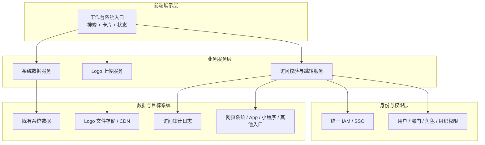
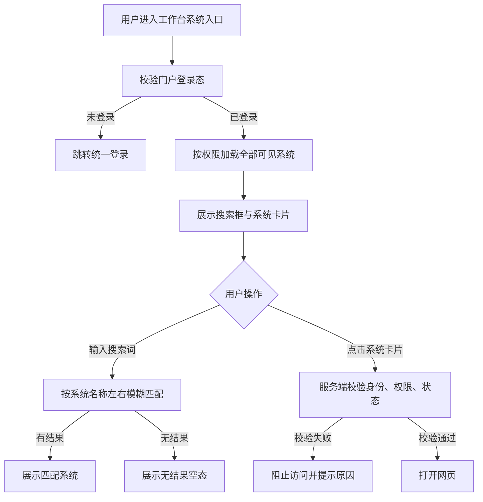
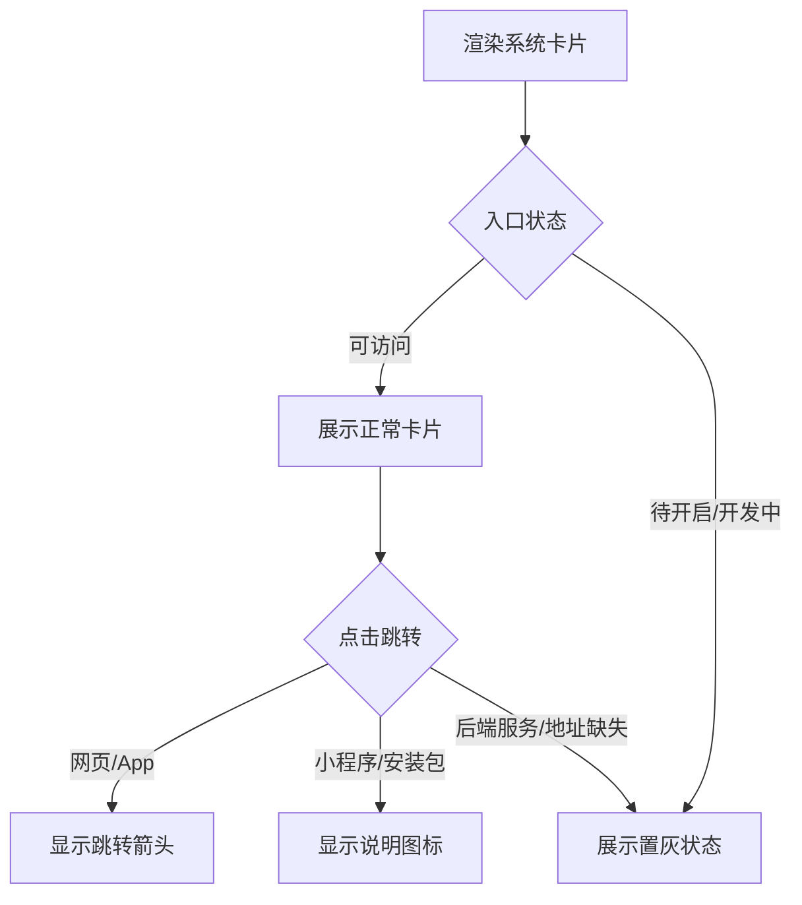
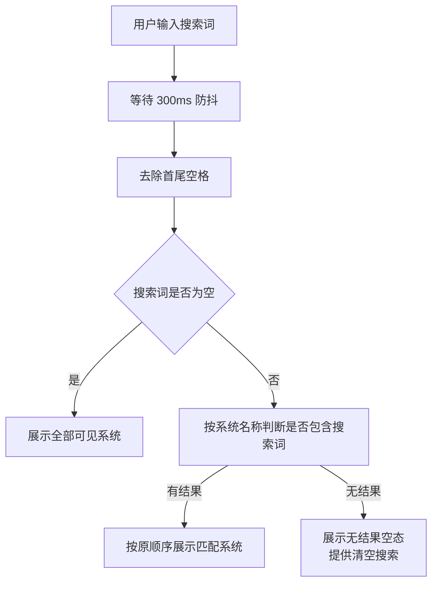
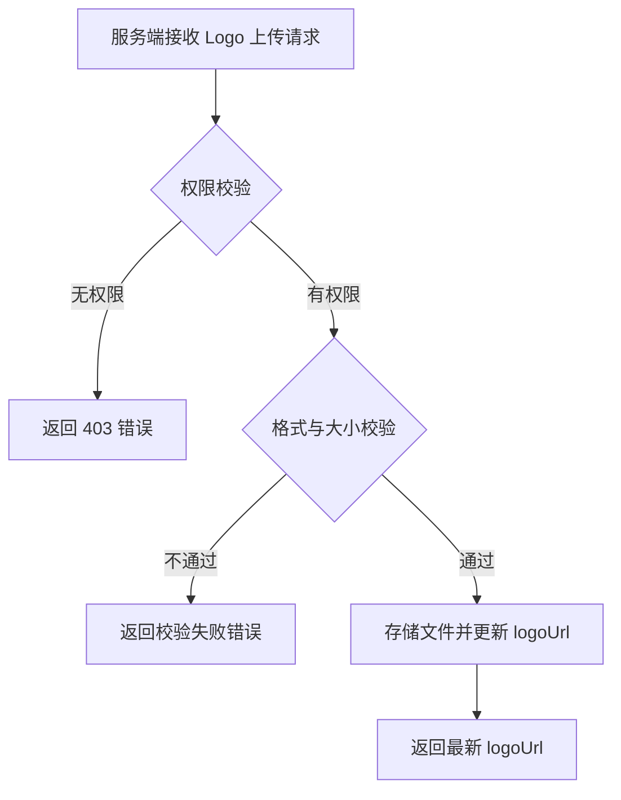
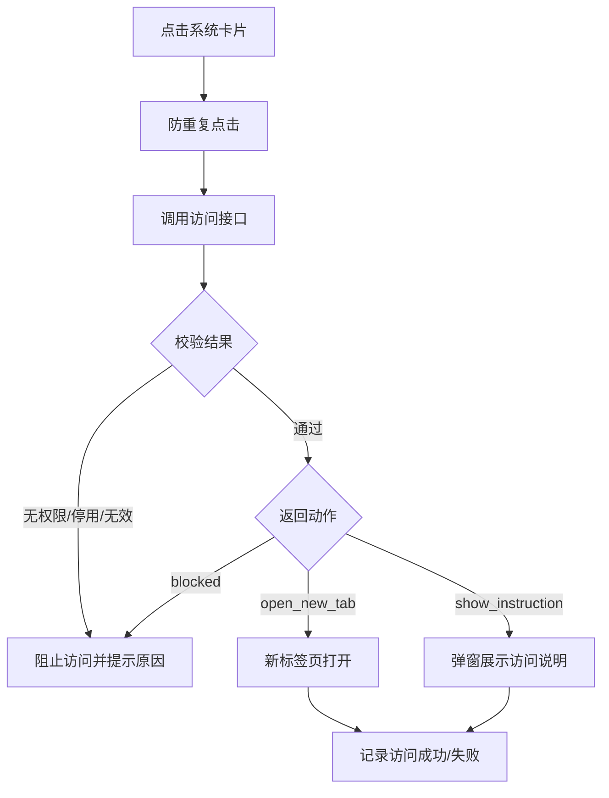

# 20260716-【PRD】AI工作台-工作台（MVP）-天马智擎项目

_**天马智擎项目**_

**产品需求说明书**

版本信息

本表用于记录本文档的维护过程，请认真填写。

| 版本号 | 时间(必填) | 状态 | 简要描述(必填) | 部门 | 责任产品(必填) | 批准人 |
| --- | --- | --- | --- | --- | --- | --- |
| V1.0 | 2026-07-16 | N | AI 工作台「系统入口」功能，包含统一 SSO、logo上传、快捷搜索 | AI项目小组 | $\color{#0089FF}{@公输}$ |  |

注：状态可以为N-新建、A-增加、M-更改、D-删除。

# 关于本文档

## 术语

| **词汇名称** | **全局说明** | **归属层** |
| --- | --- | --- |
| 左右模糊匹配 | 搜索词可出现在系统名称的任意位置，例如输入「库存」可匹配「自营第三方库存系统」「大库存查询系统」 | 前端展示层 |
| 系统 Logo | 用于识别系统的图形标识；缺失时展示统一默认图标，有维护权限的用户可上传或更换 | 前端展示层 |
| SSO | Single Sign-On，单点登录。用户登录门户后，访问已接入系统时无需再次认证 | 身份认证层 |
| 原始地址 | 系统未接入 SSO 时使用的登录页或业务首页地址 | 系统入口数据 |
| 可见范围 | 系统入口允许展示的用户、部门、角色或组织范围 | 权限层 |

## 参考文档

为了更好理解本文档，请阅读如下文档。

| **编号** | **文档** | **说明及地址** |
| --- | --- | --- |
| 1 | 原型界面参考 | https://fri555.github.io/PORTL/ |
| 2 | Figma UI设计 | https://www.figma.com/design/rRqUi2RORbhHhCnFgH2dTe/%E5%A4%A9%E9%A9%AC%E6%99%BA%E6%93%8E?node-id=0-1&p=f&t=3WOAMYQ62H2eLeQo-0 |

## 沟通要求

本表记录需要跨部门沟通的事项，以保证该文档内容质量。如果有其它跨部门沟通项，请填写该表中，并记录沟通结果。

| **序号** | **部门** | **沟通内容** | **沟通结果** |
| --- | --- | --- | --- |
| 1 |  |  |  |
| 2 |  |  |  |

# 产品概述

本章节详细描述产品的背景、内容和目标等进行详细定义，关于产品定义的其它内容请阅读本产品定义说明书。

## 产品概述

AI 工作台「系统入口」是面向集团员工的统一业务系统导航。它将分散在不同域名、App、小程序和线下获取方式中的系统入口集中呈现，默认展示当前用户有权查看的全部系统，支持按系统名称搜索，并通过统一 SSO 完成免登访问。

## 产品目标

1.  **统一入口**：集中管理集团业务系统入口，减少员工查找网址、保存个人书签和反复确认访问方式的成本。
    
2.  **按权展示**：根据用户身份、部门和角色展示可用系统，避免无权限入口造成干扰或越权访问。
    
3.  **一次登录**：已接入 SSO 的系统支持免登跳转，未接入系统明确展示原始登录方式。
    
4.  **快速搜索**：支持按系统名称左右模糊匹配，帮助用户在全部系统中快速定位目标入口。
    
5.  **统一标识**：支持上传和更换系统 Logo，提升系统辨识度；无 Logo 时使用默认图标兜底，纯色背景+系统简称。
    

## 用户角色

### 用户角色描述

| **用户角色** | **职责描述** | **MVP范围** |
| --- | --- | --- |
| **普通员工** | 通过 SSO 登录使用首页智能体的企业员工，根据权限查看、搜索并访问系统入口 | ✅ 唯一角色 |
| **管理员** | 在系统入口页面上传或更换系统 Logo；其他系统配置不在本 PRD 展开 | 后台界面不在本 PRD 范围 |

### 用户故事地图

用户在系统入口中的核心活动主线：**进入工作台 → 搜索系统 → 访问系统 → 处理结果**。

| **用户活动** | **用户任务** | **用户故事** |
| --- | --- | --- |
| **进入工作台** | 身份校验 | 作为员工，我希望系统识别我的登录身份，以便只看到有权使用的系统 |
|  | 加载入口 | 作为员工，我希望进入页面后看到全部有权限的系统，以便开始工作 |
| **查找系统** | 搜索系统 | 作为员工，我希望输入系统名称中的任意关键词，以便快速找到目标入口 |
|  | 识别系统 | 作为员工，我希望看到系统名称、使用部门、架构和访问方式，以便确认是否为目标系统 |
| **访问系统** | 网页访问 | 作为员工，我希望网页系统在新标签页打开，以便保留工作台页面 |
|  | 免登访问 | 作为员工，我希望访问已接入 SSO 的系统时无需二次登录 |
|  | 查看非网页入口 | 作为员工，我希望系统明确告诉我 App、小程序或安装包的获取方式 |
| **处理结果** | 获取失败原因 | 作为员工，我希望跳转失败时看到明确原因和处理建议，以便继续工作 |
|  | 重新访问 | 作为员工，我希望网络或凭证异常后可以重试，以便恢复访问 |
| **维护标识** | 上传 Logo | 作为维护人员，我希望为缺少标识的系统上传 Logo，以便员工快速识别 |
|  | 更换 Logo | 作为维护人员，我希望替换已有 Logo，以便标识变更后及时更新 |

## 同类产品/竞品调研(选写)

###  同类产品

无

###  结论

MVP 采用「全部系统 + 左右模糊搜索 + Logo + 按权展示 + SSO 跳转 + 多入口形态」方案。系统清单以附录 6.1 的 78 条原始数据为基线；页面不提供分类、标签或常用能力；所有网页型入口默认在新标签页打开。

# 功能需求

## 全局通用规则

### 系统范围

| **规则项** | **说明** |
| --- | --- |
| 首版系统范围 | 以附录 6.1 的 78 条系统清单为准 |
| 数据真实性 | 系统名称、网址、使用部门和归属架构按原始清单展示；缺失项显示「—」，不得由前端自行补值 |
| 展示前提 | 系统未被停用，**当前用户可见且已开通账号**；待开启/开发中的系统允许展示状态但不可访问 |
| 目标系统职责 | 工作台只负责入口展示、权限判断和发起访问，不承载目标系统内部业务 |

### 列表与搜索规则

| **规则项** | **说明** |
| --- | --- |
| 默认列表 | 进入页面后直接展示当前用户全部可见且未停用的系统入口 |
| 排序 | 名称首字母顺序，从左往右，从上到下 |
| 搜索范围 | 当前用户有权限的全部已开通系统 |
| 匹配方式 | 左右模糊匹配，即系统名称包含搜索词即可命中 |
| 大小写 | 英文不区分大小写 |
| 空格处理 | 自动去除搜索词首尾空格，中间空格视为且关系（中英文逗号、+、&同样视为且关系） |
| 触发方式 | 输入后 300ms 防抖触发，无需按 Enter |
| 清空搜索 | 点击搜索框**清除按钮**或删除全部文字后，恢复全部系统 |
| 无结果 | 提示「未找到匹配的系统」 |

### 跳转规则

| **入口形态** | **判断依据** | **点击行为** |
| --- | --- | --- |
| 网页系统 | 配置有效 HTTP/HTTPS 地址 | 完成权限与状态校验后，在新标签页打开 |
| ~~App 下载页~~ | ~~配置 App Store 或下载地址~~ | ~~在新标签页打开下载页；其他平台说明以弹窗展示~~ |
| ~~微信小程序~~ | ~~配置小程序名称，无网页地址~~ | ~~弹窗展示「请在微信中搜索：{小程序名称}」~~ |
| ~~安装包获取~~ | ~~配置联系人或获取说明~~ | ~~弹窗展示获取方式，不执行网页跳转~~ |
| ~~后端服务~~ | ~~入口类型为后端服务~~ | ~~不面向普通员工展示~~ |

### 权限规则

| **规则项** | **说明** |
| --- | --- |
| 门户认证 | 用户必须先通过统一 SSO 登录门户 |
| 展示权限 | 系统列表按用户、部门、角色组范围过滤 |
| 二次校验 | 点击系统入口时，服务端必须再次校验身份、权限和系统状态 |
| 已接入 SSO | 服务端生成 SSO 跳转地址，目标系统完成免登 |
| 未接入 SSO | 打开系统原始地址，并toast提示「免登失败，请手动登录」 |
| 凭证过期 | 静默刷新后自动重试一次；仍失败则提示重新登录 |
| 安全边界 | 前端不得自行修改目标地址、拼接越权参数或绕过服务端访问校验 |

### 加载态 / 空态 / 错误态

| **场景** | **状态** | **处理方式** |
| --- | --- | --- |
| 系统列表加载 | 加载中 | 展示系统卡片骨架屏 |
| 系统列表加载 | 加载失败 | 展示错误提示和「重新加载」按钮 |
| 当前用户无可见系统 | 空 | 展示「暂无可访问的系统，请联系管理员开通」 |
| 搜索 | 无结果 | 展示「未找到匹配的系统」和「清空搜索」按钮 |
| 系统访问 | 系统停用 | 阻止跳转，提示「该系统已停用」 |
| 系统访问 | SSO 失败 | 提示「免登失败，请手动登录」 |
| 系统访问 | 地址无效 | 阻止跳转，提示「系统地址无效，请联系管理员」 |
| 系统访问 | 浏览器拦截新窗口 | 提示「新窗口被浏览器拦截，请允许后重试」 |
| 全局网络 | 断连 | 页面顶部展示 Banner：「网络连接已断开，请检查网络」 |

### 并发与防重复规则

| **规则项** | **说明** |
| --- | --- |
| 搜索输入 | 300ms 防抖；连续输入以最后一次搜索词为准 |
| 系统访问 | 1 秒内同一用户对同一系统的重复点击只发起一次访问请求 |
| 新标签页 | 每次有效访问只打开一个新标签页 |
| 数据刷新 | Logo 上传成功后只更新目标卡片，不重新加载整页 |

## 流程图

### 技术架构图

### 业务流程图

## 功能模块清单

| **功能模块** | **功能描述** | **优先级** |
| --- | --- | --- |
| **系统卡片与入口形态** | Logo、系统信息、架构标签、入口形态、状态和免登标识 | P0-1 |
| **系统搜索** | 系统名称左右模糊匹配、清空搜索和无结果状态 | P0-2 |
| **Logo 上传** | 上传、更换、文件校验、上传反馈和默认图标兜底 | P0-3 |
| **系统访问与 SSO** | 网页新标签页、~~小程序/App 提示~~、访问校验、免登与失败兜底 | P0-0 |

## 功能详情

### 系统卡片与入口形态

#### 功能需求描述

系统卡片用于帮助用户识别系统、判断访问方式并发起访问。卡片展示系统 Logo、系统名称、使用业务部门、归属架构、入口形态、访问状态和免登状态。

| **EARS 模式** | **需求描述** |
| --- | --- |
| 普遍型 | 系统应在卡片中展示 Logo、名称、部门、架构标签、入口形态、访问状态和免登状态。 |
| 状态驱动型 | 当系统不可访问时，卡片应置灰并展示原因。 |
| 事件驱动型 | 当用户点击可访问卡片时，系统应根据入口形态执行跳转或展示说明。 |
| 不良行为型 | 系统不应对待开启、开发中、后端服务或地址缺失的卡片执行网页跳转。 |

#### 业务主流程图及说明

说明：归属架构只作为信息标签；打开行为由 entryType、status 和访问服务结果共同决定。

#### 界面原型

| **动作** | **显示** | **类型** | **描述** | **截图示例** |
| --- | --- | --- | --- | --- |
| 【系统卡片】默认 | Logo、名称、副文本 | 卡片 | · 部门最多展示两行 · Logo 缺失显示默认图标，纯色背景+系统简称，见6.1 · 名称首字母顺序，从左往右，从上到下 |  |
| 【系统卡片】Hover | 卡片轻微强调 | 卡片 | · 不使用夸张动效  · 不改变布局 |  |
| 【系统卡片】滚动条 | 超过3\*4布局，出现滚动条 | 卡片 | · 滚动条12个卡片，懒加载 |  |
| 【网页系统】点击 | 新标签页打开 | 卡片 | · 点击前调用访问接口  · 防重复点击 | — |
| ~~【App 下载页】点击~~ | ~~新标签页打开下载页~~ | ~~卡片~~ | ~~· 跳转至下载页面~~ | — |
| ~~【小程序】点击~~ | ~~展示微信搜索说明~~ | ~~弹窗~~ | ~~· 支持复制小程序名称~~ ~~· 不跳转页面~~ | — |
| ~~【安装包】点击~~ | ~~配置联系人或获取说明~~ | ~~弹窗~~ | ~~· 展示获取方式~~ ~~· 不跳转页面~~ |  |

#### 数据说明（业务实体）

| **字段名** | **数据类型** | **长度** | **默认值** | **必需** | **约束说明** |
| --- | --- | --- | --- | --- | --- |
| systemId | 字符 | 36 | — | Y | · 系统入口唯一标识 |
| logoUrl | 字符 | ≤2048 | 空 | N | · 系统 Logo 地址 · 空值显示统一默认图标 |
| systemName | 字符 | 1-100 | — | Y | · 卡片主标题 |
| department | 字符 | ≤500 | — | N | · 使用部门 · 缺失显示「—」 |
| architecture | 枚举 | — | — | N | · B2C/B2B/中台/对外/— |
| entryType | 枚举 | — | 网页系统 | Y | · 决定点击行为 |
| accessHint | 字符 | ≤500 | 空 | N | · 小程序、Android、安装包等说明 |
| status | 枚举 | — | 启用 | Y | · 启用/停用/待开启/开发中 |
| ssoEnabled | 布尔 | — | false | Y | · 决定展示「免登」或「需登录」 |

#### 业务规则和约束条件

| **规则项** | **说明** |
| --- | --- |
| 网页打开 | 所有网页型入口默认在新标签页打开 |
| 不可访问 | 待开启、开发中、后端服务和地址缺失不得跳转；停用系统不在列表展示，旧页面发起访问时仍由服务端阻止 |

#### 接口说明

| 接口 | 说明 |
| --- | --- |
| GET /api/v1/tools | 获取当前用户可见的全部系统入口及 Logo 信息 |
| POST /api/v1/tools/{id}/access | 返回 open\_new\_tab、show\_instruction 或 blocked 结果及对应数据 |

#### 补充说明

无。

### 系统搜索

#### 功能需求描述

系统搜索用于在全部可见系统中快速定位目标入口。用户输入系统名称中的任意连续字符后，前端按左右模糊匹配过滤当前列表；搜索只改变展示结果，不改变系统原有顺序。

| **EARS 模式** | **需求描述** |
| --- | --- |
| 普遍型 | 系统应在系统列表上方提供搜索框，并仅按系统名称执行左右模糊匹配。 |
| 状态驱动型 | 当搜索词为空时，系统应展示全部可见系统；当无匹配结果时，应展示无结果空态。 |
| 事件驱动型 | 当用户输入内容后停止 300ms 时，系统应自动过滤列表；当用户清空搜索时，应恢复全部系统。 |
| 不良行为型 | 系统不应匹配网址、使用部门、架构或访问说明；搜索不应改变系统相对顺序。 |

#### 业务主流程图及说明

说明：例如输入「库存」，可匹配「自营第三方库存系统」和「大库存查询系统」。

#### 界面原型

| **动作** | **显示** | **类型** | **描述** | **截图示例** |
| --- | --- | --- | --- | --- |
| 【搜索框】输入 | 300ms 后过滤系统卡片 | 输入框 | · Placeholder「搜索系统名称」· 左右模糊匹配 · 英文不区分大小写 |  |
| 【搜索框】输入首尾空格 | 自动去除首尾空格后匹配 | 输入框 | · 自动去除搜索词首尾空格 · 中间空格视为且关系（中英文逗号、+、&同样视为且关系） | — |
| 【清除图标】/【清空搜索】点击 | 清空关键词并恢复全部系统 | 图标 | · 有搜索内容时显示 |  |
| 【搜索无结果】出现 | 展示无结果说明 | 空态 | · 文案「没有匹配的系统入口」 · 提供「清空搜索」按钮 |  |

#### 数据说明（业务实体）

| 字段名 | 数据类型 | 长度 | 默认值 | 必需 | 约束说明 |
| --- | --- | --- | --- | --- | --- |
| searchKeyword | 字符 | ≤100 | 空 | N | · 用户输入的原始搜索词 |
| resultCount | 整数 | — | 全部可见系统数量 | Y | · 当前匹配结果数 |
| isSearching | 布尔 | — | false | Y | · 是否存在有效搜索词 |

#### 业务规则和约束条件

| **规则项** | **说明** |
| --- | --- |
| 搜索范围 | 仅系统名称 |
| 匹配逻辑 | 系统名称包含完整搜索词即命中 |
| 中文匹配 | 按输入的连续汉字进行包含匹配，不做拼音或同义词扩展 |
| 英文匹配 | 不区分大小写 |
| 防抖 | 300ms |
| 排序 | 保持原系统列表相对顺序 |
| 数据范围 | 仅搜索当前用户有权限查看的系统 |

#### 接口说明

| **接口** | **说明** |
| --- | --- |
| GET /api/v1/tools | 获取当前用户全部可见系统；MVP 在前端对返回结果执行本地模糊匹配 |

#### 补充说明

*   MVP 不支持拼音首字母、错别字纠正、同义词、网址或部门搜索。
    

### Logo 上传

#### 功能需求描述

Logo 由系统管理模块维护上传，前端仅展示已上传的 Logo 地址；无 Logo 或图片加载失败时展示统一默认图标。前台上传/更换 Logo 的交互入口不在本版本支持范围内。

| **EARS 模式** | **需求描述** |
| --- | --- |
| 普遍型 | 系统应在卡片中展示已上传的系统 Logo；无 Logo 或加载失败时展示统一默认图标。 |
| 状态驱动型 | 当 logoUrl 字段更新时，系统卡片应展示最新的 Logo；当前端仅做展示层，不提供上传/更换操作入口。 |
| 事件驱动型 | 服务端接收上传请求后，应完成权限校验、格式校验和文件存储，并返回最新的 logoUrl。 |
| 不良行为型 | 前端不应提供 Logo 上传/更换的交互入口；点击 Logo 区域不应触发任何上传操作。 |

#### 业务主流程图及说明

说明：Logo 上传由系统管理模块的后台入口提供；AI 工作台前端仅展示已有 Logo，不包含上传/更换交互。

#### 界面原型

| **动作** | **显示** | **类型** | **描述** | **截图示例** |
| --- | --- | --- | --- | --- |
| 【系统卡片】有 Logo | 展示已上传的 Logo 图片 | 卡片 | · avatar 容器 1:1 · 使用 object-contain 等比展示 | — |
| 【系统卡片】无 Logo | 统一默认系统图标 | 卡片 | · 容错展示，不展示破损图片 | — |

#### 数据说明（业务实体）

| **字段名** | **数据类型** | **长度** | **默认值** | **必需** | **约束说明** |
| --- | --- | --- | --- | --- | --- |
| systemId | 字符 | 36 | — | Y | · 关联系统入口 |
| logoUrl | 字符 | ≤2048 | 空 | N | · 上传成功后的 Logo 地址 |
| fileName | 字符 | ≤255 | — | Y | · 原始文件名 |
| fileType | 枚举 | — | — | Y | · png/jpg/jpeg/webp |
| fileSize | 整数 | ≤2MB | — | Y | · 服务端再次校验 |
| updatedBy | 字符 | 36 | 当前用户 | Y | · Logo 更新人 |
| updatedAt | 时间戳 | — | 当前时间 | Y | · Logo 更新时间 |

#### 业务规则和约束条件

| **规则项** | **说明** |
| --- | --- |
| 操作权限 | 仅具有 system\_logo\_edit 权限的用户可上传或更换 |
| 文件数量 | 单次仅上传 1 个文件 |
| 支持格式 | png、jpg、jpeg、webp；不支持 svg、gif |
| 文件大小 | 单文件 ≤2MB |
| 图片比例 | 推荐 1:1； |
| 展示方式 | 在固定 1:1 容器内使用 contain 方式展示 |
| 替换规则 | 新 Logo 上传成功后替换旧 Logo；失败时保留旧 Logo |
| 缺失兜底 | logoUrl 为空或加载失败时展示统一默认图标 |
| 安全校验 | 前端校验扩展名和大小； |

#### 接口说明

| **接口** | **说明** |
| --- | --- |
| POST /api/v1/tools/{id}/logo | multipart/form-data 上传或更换系统 Logo；服务端校验权限、类型和大小 |

#### 补充说明

无

### 系统访问与 SSO

#### 功能需求描述

系统访问负责在用户点击卡片后完成二次权限校验、系统状态校验、入口形态判断和跳转结果返回。已接入 SSO 的网页系统免登访问；未接入系统打开原始地址并允许目标系统自行登录。

| **EARS 模式** | **需求描述** |
| --- | --- |
| 普遍型 | 系统应在每次点击访问时校验用户、权限、系统状态和入口配置，并记录访问结果。 |
| 状态驱动型 | 当凭证过期时系统应静默刷新并重试一次；当 SSO 未接入时返回原始地址。 |
| 事件驱动型 | 当访问校验通过时，网页/App 下载页应在新标签页打开；小程序等应展示访问说明。 |
| 不良行为型 | 系统不应在无权限、停用或配置无效时生成可访问地址。 |

#### 业务主流程图及说明

说明：浏览器是否成功加载目标系统不完全受门户控制；门户至少记录访问地址生成和窗口打开结果。

#### 界面原型

| **动作** | **显示** | **类型** | **描述** | **截图示例** |
| --- | --- | --- | --- | --- |
| 【可访问卡片】点击 | 卡片短暂加载 | 卡片 | · 1 秒内重复点击仅处理一次 | — |
| 【已接入 SSO】访问 | 新标签页免登进入 | 跳转 | · toast提示「已成功登陆【系统】」 · 失败展示明确提示 | — |
| 【凭证过期】访问 | 静默刷新后自动重试 | 系统行为 | · 用户无需重复点击 · 最多重试一次 | — |
| 【浏览器拦截】发生 | 提示允许新窗口 | Toast | · 不重复创建访问记录 | — |

#### 数据说明（业务实体）

| **字段名** | **数据类型** | **长度** | **默认值** | **必需** | **约束说明** |
| --- | --- | --- | --- | --- | --- |
| accessId | 字符 | 36 | 系统生成 | Y | · 单次访问请求标识 |
| userId | 字符 | 36 | 当前用户 | Y | · 访问用户 |
| systemId | 字符 | 36 | — | Y | · 目标系统 |
| actionType | 枚举 | — | blocked | Y | · open\_new\_tab/show\_instruction/blocked |
| targetUrl | 字符 | ≤2048 | 空 | N | · 仅 open\_new\_tab 返回 |
| instruction | 字符 | ≤500 | 空 | N | · 仅 show\_instruction 返回 |
| ssoUsed | 布尔 | — | false | Y | · 是否使用 SSO |
| result | 枚举 | — | pending | Y | · pending/success/failure/blocked |
| errorCode | 字符 | ≤50 | 空 | N | · 失败或阻止原因 |
| createdAt | 时间戳 | — | 当前时间 | Y | · 访问发起时间 |

#### 业务规则和约束条件

| **规则项** | **说明** |
| --- | --- |
| 打开方式 | 所有网页系统和 App 下载页默认新标签页 |
| SSO 标识 | 只有配置有效且启用 SSO 的系统展示「免登」 |
| 原始登录 | 未接入 SSO 的网页系统展示「需登录」并打开原始地址 |
| 凭证失效 | 静默刷新并重试一次，失败后引导重新登录 |
| 防重复 | 1 秒内同用户同系统只处理一次 |
| 地址保护 | 前端仅使用服务端返回地址，不自行拼接长期身份凭证 |
| 新窗口拦截 | 捕获可识别的拦截结果并提示用户允许弹窗 |

#### 接口说明

| **接口** | **说明** |
| --- | --- |
| POST /api/v1/tools/{id}/access | 返回访问动作、目标地址/说明、SSO 使用状态和错误信息 |

#### 补充说明

*   SSO 的技术细节以已实现的 SSO 方案为准，本节可作参考。
    

# 非功能需求

## 性能要求

| **指标** | **目标值** | **说明** |
| --- | --- | --- |
| 系统入口首屏 | ≤ 2s（P95） | 包含搜索框和首屏系统卡片 |
| 系统列表接口 | ≤ 500ms（P95） | 78 条首批数据，含权限过滤与 Logo 信息 |
| 搜索过滤 | ≤ 100ms | 300ms 防抖完成后的前端过滤耗时 |
| 访问接口 | ≤ 800ms（P95） | 权限、状态和 SSO 地址生成 |
| 卡片渲染 | ≤ 300ms | 全部系统 100 条以内 |
| 并发访问 | 单用户同系统 1 秒内仅处理 1 次 | 防止重复打开标签页 |

## 安全要求

| **维度** | **要求** |
| --- | --- |
| 身份认证 | 统一 SSO（公司 IAM）；具体 Token 有效期和续期策略遵循统一 SSO PRD |
| 权限控制 | 列表查询与访问请求均由服务端执行用户/部门/角色/组织权限校验 |
| 跳转地址 | 前端仅使用访问服务返回地址，不自行拼接长期凭证或共享密钥 |
| 传输加密 | 门户与服务端使用 HTTPS；HTTP 目标地址需展示风险标识并推动升级 |
| 地址安全 | 访问服务校验 URL 协议，禁止 javascript、data 等可执行协议 |
| 防开放重定向 | 目标域名必须来自既有系统数据，访问接口不得接受前端任意 redirectUrl |
| 凭证保护 | 日志不得记录完整 Token、SSO Ticket 或敏感查询参数 |
| 数据最小化 | 系统入口只记录访问审计，不采集用户在目标系统内的业务数据 |
| Logo 文件安全 | 仅允许 png/jpg/jpeg/webp，单文件 ≤2MB；服务端校验 MIME、文件头和大小 |
| Logo 权限 | 仅 system\_logo\_edit 权限可上传或更换 Logo |

## 兼容性要求

| **维度** | **要求** |
| --- | --- |
| 浏览器 | Chrome ≥ 110 / Edge ≥ 110 / Safari ≥ 16 / Firefox ≥ 110 |
| 分辨率 | 最小 1280×720；推荐 1920×1080 |
| 网络 | ≥ 2Mbps 稳定连接；失败后提供重试 |
| 新标签页 | 兼容浏览器弹窗拦截提示，用户允许后可重新访问 |

# 迭代计划与 Non-goals

## MVP（本期）迭代计划

| **序号** | **模块** | **开发内容** | **依赖 / 并行** | **备注** |
| --- | --- | --- | --- | --- |
| 1 | 系统数据接入 | 接入 78 条系统数据及既有权限、状态、SSO 和 Logo 信息 | — | 缺失字段显示「—」 |
| 2 | 系统卡片 | 展示 Logo、名称、部门、架构、入口形态、状态和免登标识 | 依赖 1 | 桌面端 |
| 3 | 系统搜索 | 系统名称左右模糊匹配、300ms 防抖、清空和无结果状态 | 依赖 1、2 | 前端本地过滤 |
| 4 | Logo 上传 | 权限控制、文件校验、预览、上传、更换和默认图标兜底 | 依赖 1、2、文件存储 | 单文件 ≤2MB |

## Non-goals（本期明确不做）

| **序号** | **项目** | **说明** | **计划迭代** |
| --- | --- | --- | --- |
| 1 | 个人常用 / 收藏 | MVP 直接展示全部可见系统，不提供加入常用、取消常用或收藏 | V1.1 |
| 2 | 上传Logo前端页面 | 上传logo在后端进行，前端不设相应按钮 | V1.1 |
| 3 | 高级搜索 | 不支持拼音、错别字纠正、同义词、网址或部门搜索 | V1.1 |
| 3 | 全量移动端适配 | MVP 以桌面端为主 | V1.1 |

# 附录

## 系统清单

[请至钉钉文档查看附件《各系统网址》。](https://docs.dingtalk.com/i/nodes/14lgGw3P8vvy4NnqTgdM7oZj85daZ90D?iframeQuery=anchorId%3DX02mron6z6fgrhna1a4af)

| **序号** | **简称** | **系统名称** | **网址** | **使用业务部门** | **系统归属架构** | **接入优先级** |
| --- | --- | --- | --- | --- | --- | --- |
| 1 | 自营 | 自营系统 | https://self.xingyunyezi.com/ | 线上B2C，直播，品牌事业部等 | B2C | P0 |
| 2 | 第三方 | 自营第三方库存系统 | [https://shopapi.xingyunyezi.com/](https://shopapi.xingyunyezi.com/) | 线上B2C，直播，品牌事业部等 | B2C | P0 |
| 3 | 供销 | 财务供销系统 | [https://finance.xingyunyezi.com/](https://finance.xingyunyezi.com/) | 财务二部 | B2C | P0 |
| 4 | 新运营 | 新运营系统 | https://operate.xingyunyezi.com/ | 线上B2C，直播，品牌事业部,视觉部等 | B2C | P0 |
| 5 | API | 自营api接口系统 | https://apioms.xingyunyezi.com/ | 技术部内部和外部合作 | B2C | P3 |
| 6 | 拼多多 | 自营拼多多服务商第三方服务中转 | https://transit.xingyunyezi.com/ | 线上B2C商家，天马运动拼多多商家 | B2C | P3 |
| 7 | 拼多多 | 拼多多平台接口项目 | [http://pdd.tianmasport.com/cloudServerAPI](http://pdd.tianmasport.com/cloudServerAPI) | 平台部 | B2B | P3 |
| 8 | 淘宝 | 淘宝平台接口项目 | https://1889.tianmasport.com/ | 平台部 | B2B | P3 |
| 9 | CDP | 会员CDP | [https://sso.tianmasport.com/#/login?redirect=/chooseSystem](https://sso.tianmasport.com/#/login?redirect=/chooseSystem) | 线上B2C | 中台 | P3 |
| 10 | 直播 | 直播系统 | [https://sso.tianmasport.com/#/login?redirect=/chooseSystem](https://sso.tianmasport.com/#/login?redirect=/chooseSystem) | 直播部 | 中台 | P1 |
| 11 | 观远 | 数据驾驶舱/观远BI | https://guanyuan.tianmagroup.com/home/web-app/e20c619cc28074aabbf84ac7 | 各个部门老大/数据分析人员 | 中台 | P1 |
| 12 | 幸运 | 幸运叶子系统 | [https://www.xyyzi.com/admin/index/login](https://www.xyyzi.com/admin/index/login) | 线上B2C | B2C | P3 |
| 13 | 工单 | 工单系统 | https://workorder.tianmagroup.com/#/login | 客服部、平台部、商品部（核算会计）、云仓售后、业财支持部 | B2C | P0 |
| 14 | 盘古 | 盘古BI系统 | [https://bi.tianmagroup.com/#/login](https://bi.tianmagroup.com/#/login) | 商品部 | 中台 | P0 |
| 15 | 平台部 | 天马运动管理端 | https://www.tianmasport.com.cn/ms/main.shtml | 平台部、商品部、财务部、茵特加盟部 | B2B | P3 |
| 16 | CRM | 天马运动CRM | https://www.tianmasport.com.cn/ms/crm/#/login | 天马运动平台部 | B2B | P0 |
| 17 | SRM | 天马运动SRM | https://www.tianmasport.com.cn/ms/srm/#/login | 天马运动平台部 | B2B | P0 |
| 18 | 马达 | 天马运动马达端PC | [https://www.tianmasport.com/ms/nfx/home](https://www.tianmasport.com/ms/nfx/home) | 平台部、茵特加盟部 | B2B | P3 |
| 19 | 马达 | 天马运动马达端开放平台(旧版) | [http://open.xingyunyezi.com](http://open.xingyunyezi.com/) | 平台部 | B2B | P3 |
| 20 | 马达 | 天马运动马达端开放平台(新版) | https://openproxy.tianmasport.com/open | 平台部 | B2B | P3 |
| 21 | 马达 | 天马运动马达端APP | iOS:https://apps.apple.com/cn/app/%E5%A4%A9%E9%A9%AC%E8%BF%90%E5%8A%A8%E5%9B%A2%E8%B4%AD/id1441075957 android:应用市场搜索“天马运动团购” | 平台部、茵特加盟部 | B2B | P3 |
| 22 | 马达 | 天马运动马达端小程序 | 微信小程序搜“天马运动平台” | 平台部、茵特加盟部 | B2B | P3 |
| 23 | 供应商 | 天马运动供应商端 | https://www.tianmasport.com/ms/new/login.shtml | 平台部-货源管理部 | B2B | P2 |
| 24 | 供应商 | 天马运动供应商端开放平台 | https://open-supplier.tianmasport.com/open/supplier/ | 平台部-货源管理部 | B2B | P3 |
| 25 | 论坛 | 天马论坛前台系统 | http://bbs.tianmasport.com/forum |  | B2B | P2 |
| 26 | 论坛 | 天马论坛管理后台 | http://bbs.tianmagroup.com/data-web/#/login?redirect=%2Fwelcome | 天马运动平台部 | B2B | P3 |
| 27 | 大库存 | 大库存查询系统 | https://k.xingyunyezi.com/query | 线上B2C，直播，品牌事业部等 | B2B | P0 |
| 28 | 内容 | 内容中心系统 | [https://resource-center.tianmagroup.com/](https://resource-center.tianmagroup.com/) | 电商零售部、平台部、商品部 | 中台 | P0 |
| 29 | 商品 | 商品中心系统 | https://data-gx.xingyunyezi.com/#/dashboard | 商品部、优选事业部 | B2B | P0 |
| 30 | 极光 | 极光分析 | http://arkview.tianmagroup.com/uba/dashboards | 平台部、幸运叶子、茵特门店、流星马 | 中台 | P3 |
| 31 | 进销存 | 财务进销存系统 | [https://tmjxc.tianmagroup.com/](https://tmjxc.tianmagroup.com/) | 财务一部，财务二部 | B2C | P0 |
| 32 | WMS | 仓储系统 | https://wms.xingyunyezi.com/ | 天马云仓，电商零售部 | B2C | P0 |
| 33 | WMS | 仓储代运营系统 | http://supplier.wms.xingyunyezi.com | 天马云仓 | B2C | P3 |
| 34 | WMS | 仓储代运营系统 | https://swms.xingyunyezi.com | 天马云仓 | B2C | P3 |
| 35 | 流星马 | 流星马管理端 | https://manage.tianmasaas.com | 天马运动平台部/平台销售部 | B2B | P0 |
| 36 | 流星马 | 流星马租户端 | https://co.tianmasaas.com | 天马运动平台部/平台销售部 | B2B | P3 |
| 37 | 流星马 | 流星马POS端 | [https://pos.tianmasaas.com](https://pos.tianmasaas.com/) | 天马运动平台部/平台销售部 | B2B | P3 |
| 38 | 流星马 | 流星马商户端 | [https://shop.tianmasaas.com](https://shop.tianmasaas.com/) | 天马运动平台部/平台销售部 | B2B | P3 |
| 39 | 流星马 | 流星马代理端 | https://lxmmer.tianmasaas.com/admin | 外部代理/平台销售部 | B2B | P3 |
| 40 | 流星马 | 流星马代理收银端 | https://pos-lxmmer.tianmasaas.com/#/home/index | 外部代理/平台销售部 | B2B | P3 |
| 41 | 流星马 | 流星马自营和加盟端 | https://lxm.tianmasaas.com/admin | 加盟商/平台销售部 | B2B | P1 |
| 42 | 流星马 | 流星马自营和加盟收银端 | https://pos-lxm.tianmasaas.com/#/home/index | 加盟商/平台销售部 | B2B | P1 |
| 43 | 企微 | 天马企微助手 | https://tmwork.tianmasaas.com/dist/privateKanBan | 茵特体育事业部 | B2B | P3 |
| 44 | 优选 | 优选定制系统 | https://www.lanbusport.com/#/home | 优选事业部 | B2B | P3 |
| 45 | 天团1号 | 天团1号PC | https://www.tiantuan1.com/ms/nfx/tt1Home | 天马运动平台部/平台销售部 | B2B | P1 |
| 46 | 天团1号 | 天团1号小程序 | 微信小程序搜“天团壹号” | 天马运动平台部/平台销售部 | B2B | P2 |
| 47 | 短信 | 短信平台 | [https://sms.tianmasport.com/login](https://sms.tianmasport.com/login) | 所有公司系统发送短信统一调短信平台，目前账号管理应该是在无忌那边 | B2B | P3 |
| 48 | 团购 | 团购平台 | https://go.tianmagroup.com/ | 天马运动平台部/平台销售部 | B2B | P3 |
| 49 | 团购 | 团购小程序 | 微信小程序搜“团购助手” | 天马运动平台部/平台销售部 | B2B | P3 |
| 50 | 团购 | 团购平台管理后台 | https://tg.tianmagroup.com/#/programme/combinationGoods | 天马运动平台部/平台销售部 | B2B | P3 |
| 51 | 幸运 | 幸运叶子企微助手 | https://lucky-work.xyyzi.com/dist/privateKanBan | 线上B2C | B2C | P3 |
| 52 | 幸运 | 幸运叶子小程序 | 微信小程序搜“幸运叶子” | 线上B2C | B2C | P2 |
| 53 | 幸运 | 幸运叶子APP | iOS:https://apps.apple.com/cn/app/%E5%B9%B8%E8%BF%90%E5%8F%B6%E5%AD%90%E8%BF%90%E5%8A%A8/id1560294878 Android:应用商城搜索“幸运叶子运动” | 线上B2C | B2C | P3 |
| 54 | POS | 幸运叶子收银POS系统 | https://www.xyyzi.com/pos/index/index#/homepage/homepage | 茵特体育事业部-幸运叶子跑步组 | B2C | P1 |
| 55 | 收银 | 幸运叶子移动收银APP | 联系幸运叶子组技术获取安装包 | 茵特体育事业部-幸运叶子跑步组 | B2C | P3 |
| ~~56~~ |  | ~~幸运运动汇小程序/后台~~ | https://fitness.tianmagroup.com/fitness/index | ~~KA事业部-KA客户事业部~~ | ~~中台~~ | ~~否~~ |
| 57 | 斑马邦 | 斑马邦H5商城 | https://lxm.xyyzi.com/h5/?shop\_id=90396 | 品牌中心-Nearpost足球事业部 | B2B | P3 |
| 58 | 跑团 | 江苏跑团小程序 | 微信小程序搜“江苏跑团之家” | KA事业部 | 对外 | P3 |
| 59 | 跑团 | 江苏跑团管理后台 | https://jstjxh.xyyzi.com/run-admin/#/login | KA事业部 | 对外 | P3 |
| 60 | 龙协 | 中国龙协小程序 | 微信小程序搜“龙舟通” | KA事业部 | 对外 | P3 |
| 61 |  | 耶运动PC官网 | 待开启 | 幸运叶子品牌事业部 | B2C | 否 |
| 62 |  | 耶运动官网CMS中心 | 待开启 | 幸运叶子品牌事业部 | B2C | 否 |
| 63 | 官网 | 集团官网 | https://www.tianmagroup.com/ | 可能是人事或者战略发展部的元琢 | 中台 | P2 |
| 64 | OA | OA系统 | https://oa.xyyzi.com/oa/#/home | 人事主要使用 | 中台 | P0 |
| 65 | 禅道 | 禅道 | [https://lyg-tools-zentao.tianmagroup.com/zentao/my.html](https://lyg-tools-zentao.tianmagroup.com/zentao/my.html) | 技术部 | B2B | P0 |
| 66 | 禅道 | 禅道工时统计 | https://lyg-tools-zentao.tianmagroup.com/zentao/web/#/dashboard | 技术部 | B2B | P3 |
| 67 | 需求 | 需求管理系统 | https://demand.tianmagroup.com/#/workbench/application | 技术部、业务部门提报需求 | 中台 | P1 |
| 68 | 垂钓 | 垂钓平台代理端 | https://www.laidiaoba.com/index | 垂钓事业部 | B2B | P3 |
| 69 | 垂钓 | 垂钓平台管理端 | http://www.laidiaoba.com/tm\_manage/main.shtml | 垂钓事业部 | B2B | P3 |
| 70 | 垂钓 | 垂钓APP后台管理 | http://web-admin.laidiaoba.com/ | 垂钓事业部 | B2B | P3 |
| 71 | 钓愉 | 钓愉APP |  | 垂钓事业部 | B2B | P3 |
| 72 | 响猫 | 响猫小程序 | 微信小程序搜“响猫” | 垂钓事业部 | B2B | P3 |
| 73 | 人才 | 江苏主播人才库 | 开发中 | KA事业部 | 中台 | 否 |
| 74 | 茵特 | 茵特加盟招商官网 | http://www.intersport.online/index.php/ | 茵特体育事业部 | B2B | 否 |
| 75 |  | 订单中心 | 后端服务 | 线上B2C，线上B2B | B2B | 否 |
| 76 | 天之捷 | 天之捷商户服务 | 微信小程序搜“天之捷商户服务” |  | B2B | P3 |
| 77 |  | 老版本的crm\_web | https://xyyzcrm.tianmasport.com/crm/login.shtml |  | B2B | 否 |
| 78 | 苏体 | 苏体项目 | https://fitness.tianmagroup.com/fitness/login?redirect=%2Findex |  |  | P3 |

## Toast 提示文案

### 6.3.1 成功提示

| **场景** | **文案** |
| --- | --- |
| 免登陆跳转成功 | ✅ 已成功登陆【系统】 |

### 6.3.2 错误提示

| **场景** | **文案** |
| --- | --- |
| 系统列表加载失败 | ⚠️ 系统入口加载失败，请重试 |
| 无访问权限 | ⚠️ 暂无该系统访问权限，请联系管理员开通 |
| 系统已停用 | ⚠️ 该系统已停用 |
| 系统待开启 | ℹ️ 该系统暂未开放 |
| 系统开发中 | ℹ️ 该系统正在开发中，暂不可访问 |
| 后端服务 | ℹ️ 该系统为后端服务，无前台访问入口 |
| 地址缺失 | ⚠️ 访问方式未配置，请联系管理员 |
| 地址无效 | ⚠️ 系统地址无效，请联系管理员 |
| SSO 失败 | ⚠️ 免登失败，请手动登录 |
| 凭证刷新失败 | ⚠️ 登录状态已失效，请重新登录 |
| 新窗口被拦截 | ⚠️ 新窗口被浏览器拦截，请允许后重试 |
| 网络断连 | ⚠️ 网络连接已断开，请检查网络 |