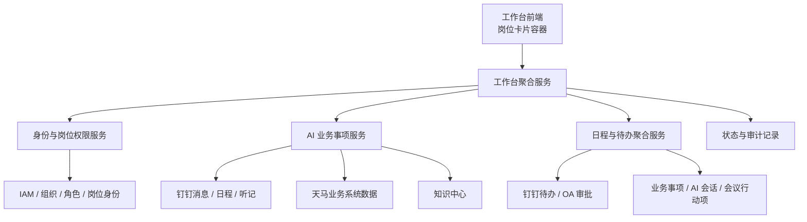
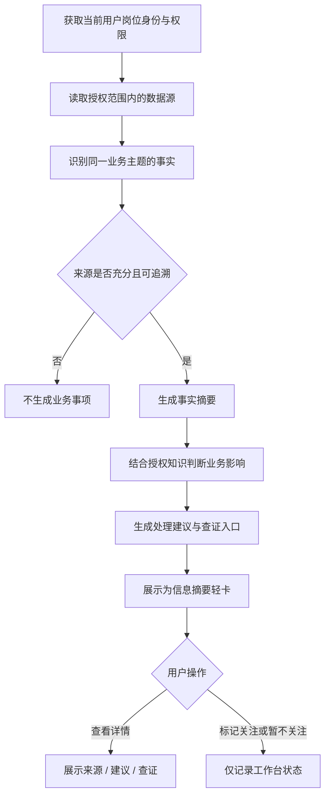
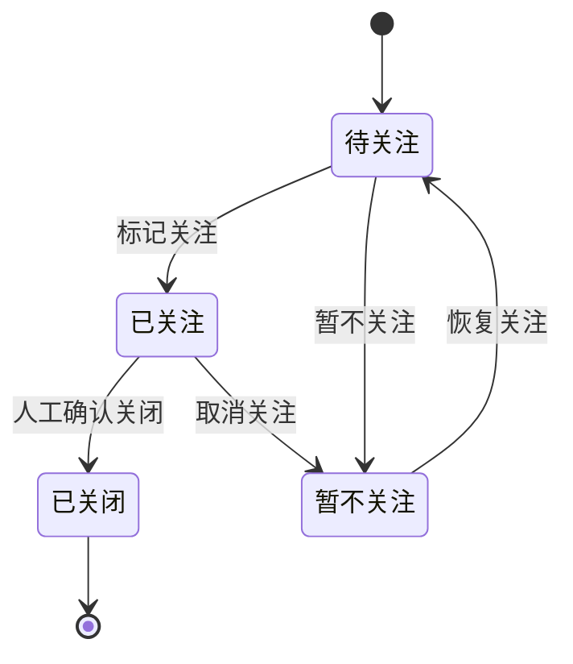
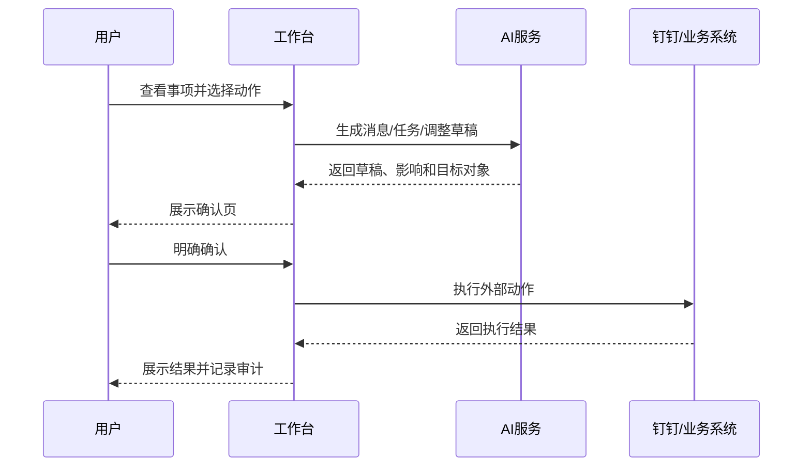

# 20260721-【PRD】AI工作台-管理层工作台（MVP）-天马智擎项目

_**天马智擎项目**_

**产品需求说明书**

版本信息

本表用于记录本文档的维护过程，请认真填写。

| 版本号 | 时间(必填) | 状态 | 简要描述(必填) | 部门 | 责任产品(必填) | 批准人 |
| --- | --- | --- | --- | --- | --- | --- |
| V1.0 | 2026-07-21 | N | 面向管理层的 AI 工作台 MVP，包含业务事项摘要、日程负荷与会议洞察、待办承接池、查证入口、岗位工作台预览 | AI项目小组 | @公输 |  |
| V1.1 | 2026-07-22 | M | 收敛默认布局、AI行动标签、单一详情入口、列表排序和统一字号 | AI项目小组 | @公输 |  |
| V1.2 | 2026-07-24 | M | 同步信息摘要看板 v3.9：恢复紧凑消息卡片、来源数量详情入口、卡内动作区及完整动作表单 | AI项目小组 | @公输 |  |
| V1.3 | 2026-07-24 | A | 新增腾讯企业邮“邮件摘要”重要场景及候选技术实现，具体接入与原邮件精确跳转方式待技术预研确定 | AI项目小组 | @公输 |  |
| V1.4 | 2026-07-26 | A | 新增会议笔记与批量生成待办流程；MVP 以手动复制/粘贴纪要为主，OneNote 自动同步作为备选 | AI项目小组 | @公输 |  |
| V1.5 | 2026-07-26 | A | 增强现有“我创建的”待办视图，接入钉钉待办评论读取与用户确认后的评论跟进 | AI项目小组 | @公输 |  |
| V1.6 | 2026-07-26 | M | 落实日程行会议笔记入口、笔记草稿与批量待办确认交互，并明确原型预览与钉钉真实创建边界 | AI项目小组 | @公输 |  |
| V1.7 | 2026-07-26 | M | 将腾讯企业邮邮件摘要落实为独立工作台卡片，补充展示字段、原邮件 SSO 入口及未接入状态 | AI项目小组 | @公输 |  |
| V1.8 | 2026-07-26 | M | 修正信息摘要卡片与来源数量悬浮详情；强化会议笔记、会前背景和“我创建的”待办评论入口，并接通钉钉待办评论读写 | AI项目小组 | @公输 |  |
| V1.9 | 2026-07-26 | M | 会议笔记增加 OneNote 主动授权、页面选择与追加同步原型；待办候选改为一行一条、点击后展开编辑 | AI项目小组 | @公输 |  |
| V1.10 | 2026-07-26 | M | 统一摘要卡三行布局与右侧行动区；详情改为随消息卡片滚动的锚定气泡并精简来源；收敛日程、待办、审批和邮件展示 | AI项目小组 | @公输 |  |
| V1.11 | 2026-07-26 | M | 纠正信息摘要标签口径，统一摘要/影响文案和卡片竖条；移除邮件头图标与日程汇总标签；待办徽标改为接口原始优先级 | AI项目小组 | @公输 |  |
| V1.12 | 2026-07-26 | M | 统一五个看板的标题栏刷新与搜索；改为会话缓存和仅手动刷新；朝暮接通钉钉与腾讯企业邮真实数据；收敛消息/待办/日程确认表单并取消事项紧急度到钉钉优先级的映射；统一“笔记/跟进”按钮与状态标签为 14px 基准 | AI项目小组 | @公输 |  |
| V1.13 | 2026-07-26 | M | 动作表单参考钉钉原生结构统一重排并接入企业通讯录搜索；发消息新增批准/拒绝/推进/收到快捷内容；恢复冲突 mock；工作台卡片字号收敛为标题14、正文12、按钮/状态/标签10px | AI项目小组 | @公输 |  |
| V1.14 | 2026-07-26 | M | 建待办补齐描述、参与人、优先级和标签；会议纪要接入后端 AI 结构化提取；修复 DWS 通讯录顶层结果解析与花名精确匹配，重名时禁止猜测 | AI项目小组 | @公输 |  |
| V1.15 | 2026-07-27 | D | 删除待办中心任务的 AI 详情悬浮图标、详情浮层及内嵌待办草稿入口；保留优先级、状态、跟进评论和审批钉钉跳转 | AI项目小组 | @公输 |  |

注：状态可以为 N-新建、A-增加、M-更改、D-删除。

# 关于本文档

## 术语

| **词汇名称** | **全局说明** | **归属层** |
| --- | --- | --- |
| 岗位化工作台 | 根据用户当前岗位身份加载一组预设卡片及数据口径；不是全员共用一套卡片 | 产品配置层 |
| 管理层工作台 | V1 默认预设，面向管理层及高信息密度业务负责人，重点呈现跨系统业务事项、日程负荷和待办压力 | 产品应用层 |
| 业务事项 | 由有权限的消息、业务系统数据和知识内容综合形成的、对经营或管理有明确影响的工作对象 | AI 业务理解层 |
| 信息摘要 | 工作台卡片名称；卡片内部展示的是业务事项，不是未读消息列表 | 前端展示层 |
| 邮件摘要 | 来源为腾讯企业邮；一封邮件对应一个摘要事项，由 AI 提炼邮件内容，并支持用户通过 SSO 查看原邮件 | 邮件智能层 |
| 原邮件精确跳转 | 用户从邮件摘要进入其有权访问的对应邮件，而不是只进入邮箱首页；最终实现方式以技术预研结果为准 | 邮件接入层 |
| 会议笔记 | 与单场日程关联的工作台笔记；MVP 主要由用户从 OneNote 等外部工具手动复制/粘贴，可进一步提取一条或多条待办 | 日程智能层 |
| 待办候选项 | AI 从会议笔记中提取、尚未经用户确认创建的结构化行动项；用户可逐条选择和修改 | 任务草稿层 |
| 待办评论跟进 | 在用户创建的钉钉待办中读取评论，并由 AI 生成评论草稿；用户确认发布后，评论真实写回原钉钉待办 | 任务协同层 |
| 事项来源 | 支撑业务事项结论的钉钉消息、业务系统记录、知识中心文档或人工录入信息 | 证据层 |
| AI 建议 | AI 基于有权访问的来源生成的处理建议，不代表系统已经执行 | AI 推理层 |
| 标记关注 | 用户将业务事项加入“我的关注”的工作台状态；V1 不自动建任务、不发送消息、不修改业务数据 | 交互状态层 |
| 会前背景 | 针对未开始会议，基于日程已有标题、参与人、描述、议题、附件和备注形成的简短背景 | 日程智能层 |
| 日程负荷 | AI 对当日会议数量、时长、连续会议、冲突和准备压力的综合判断 | 日程智能层 |
| 可释放事项 | AI 判断可能委派、延后、缩短、合并或通过听记替代参会的会议与任务 | AI 建议层 |
| 待办承接池 | 汇总钉钉/OA、业务事项、会议行动项和 AI 会话任务的统一处理区 | 任务聚合层 |
| 系统入口 | 工作台通用卡片，用于搜索和打开当前用户有权限的企业系统 | 系统入口层 |
| 事项查证入口 | 业务事项详情中与当前事项相关的系统入口，用于核实 AI 判断 | 证据层 |
| AI 行动标签 | AI 对单项工作的简短判断：日程使用“重要/释放”，任务使用“优先/委派”，审批仅可使用“优先” | AI 建议层 |
| 岗位身份 | 用户被授权使用的工作台身份；绝大多数用户只有一个，少数跨部门用户可切换 | 权限层 |
| 人工确认 | 任何可能产生外部影响的动作，必须由用户明确确认后才能执行 | 安全规则层 |

## 参考文档

为了更好理解本文档，请阅读如下文档。

| **编号** | **文档** | **说明及地址** |
| --- | --- | --- |
| 1 | 现有系统入口 PRD | `docs/需求文档/20260716-【PRD】AI工作台-工作台（MVP）-天马智擎项目.md` |
| 2 | 知识中心 PRD | `docs/需求文档/20260707-【PRD】AI工作台-知识中心V1.0-天马智擎项目.md` |
| 3 | 钉钉 ONE 产品复盘 | https://www.cnblogs.com/JavaPub/p/20385556 |
| 4 | 天马集团简介 | 集团业务、线上零售、线下直营/加盟、B2B 平台和智慧仓储背景资料 |
| 5 | 工作台前端 Demo | `frontend-mvp/src/views/SystemPortalsView.vue` |

## 沟通要求

| **序号** | **部门** | **沟通内容** | **沟通结果** |
| --- | --- | --- | --- |
| 1 | 信息安全 / IAM | 跨系统数据可见范围、岗位身份授权和二次校验 | 待评审确认 |
| 2 | 钉钉集成团队 | 消息、日程、听记、待办、审批的查询与跳转能力 | 待接口验证 |
| 3 | 知识中心产品 | 知识可读性、有效期、权限继承和引用追溯 | 纳入联动设计 |
| 4 | 各业务线产品 | 后续岗位卡片组合及业务指标定义 | V1 仅实现管理层预设 |

# 产品概述

## 产品概述

管理层工作台是天马智擎中面向管理层及高信息密度业务负责人的 AI 工作入口。它不重复建设钉钉的消息、日程、待办和审批能力，而是把钉钉协同数据、腾讯企业邮邮件、天马业务系统数据及知识中心内容，在用户权限范围内组织成可理解、可查证、可跟进的业务事项。朝暮身份用于真实能力验证，其他身份继续使用 Mock 数据。

产品核心差异是：钉钉天然知道“谁说了什么、有哪些会议和待办”，天马智擎进一步回答“这件事对天马业务意味着什么、影响什么、现在最该关注什么”。V1 只提供分析、建议和本地状态标记；所有可能产生外部影响的动作均需人工确认，且不在本期真实执行。

## 产品发心

让管理者每天打开一个页面即可获得可靠的工作判断：重要业务事项主动浮现，会议负荷可以被调整，跨系统任务有统一承接位置，需要查证时能够快速回到原始系统。

参考钉钉 ONE 的复盘经验，本产品避免同时服务所有人、堆叠所有原生能力或以“AI 新入口”作为唯一目标。V1 只服务一个清晰人群、解决三个高价值问题，并以真实使用率和决策效率验证价值。

## 产品目标

1. **业务事项主动浮现**：将分散信息转化为有业务含义、可追溯的管理事项。
2. **降低管理者注意力负担**：用日程负荷和待办压力提示帮助用户安排有限精力。
3. **减少跨系统跳转**：在工作台完成判断和状态标记，仅在查证或实际处理时进入来源系统。
4. **建立 AI 使用习惯**：让 AI 以“整理、解释、建议、预填”的方式自然进入日常工作，而不是额外增加聊天步骤。
5. **保证可信与可控**：所有结论显示来源，严格继承权限；任何外部动作必须人工确认。
6. **为岗位扩展留出结构**：卡片容器和岗位身份机制可承载运营、商品、仓储等后续业务线卡片。

## 非目标

- 不做钉钉消息、审批、日程、待办的完整替代品。
- 不做管理者监控员工的排行榜或行为评分。
- 不向所有员工提供完全相同的工作台。
- 不允许 AI 未经人工确认自动发送消息、创建待办或日程、处理审批、改日程或修改业务系统数据；朝暮身份可在确认后调用真实钉钉写入能力。
- 不在 V1 自动匹配聊天记录和历史会议生成会前背景。
- 不在 V1 提供用户自由增删、拖拽和配置卡片。

## 用户角色

### 用户角色描述

| **用户角色** | **职责描述** | **MVP范围** |
| --- | --- | --- |
| 管理层用户 | 查看跨业务事项、日程负荷和待办压力，进行优先级判断和跟进状态确认 | ✅ 核心角色 |
| 高信息密度业务负责人 | 在授权范围内查看与本岗位相关的经营事项和协同事项 | ✅ 核心角色 |
| 跨部门用户 | 在已授权的多个岗位身份之间切换工作台口径 | ✅ 少量用户 |
| 系统管理员 | 预览不同岗位工作台、配置岗位卡片组合和授权范围 | ✅ 仅定义预览与配置边界 |
| 普通执行岗位 | 后续使用由业务线产品设计的岗位卡片，例如活动情报、竞店数据、商品运营等 | ⏳ 后续迭代 |

### 用户故事地图

用户核心活动主线：**进入工作台 → 判断今日负荷 → 阅读业务事项 → 查证与标记 → 调整日程 → 处理待办**。

| **用户活动** | **用户任务** | **用户故事** |
| --- | --- | --- |
| 进入工作台 | 识别岗位身份 | 作为管理者，我希望系统自动使用我有权限的岗位身份，以便看到正确的数据口径 |
|  | 切换岗位身份 | 作为跨部门用户，我希望切换已授权身份，以便查看不同职责下的卡片内容 |
| 判断今日负荷 | 查看三项指标 | 作为管理者，我希望快速知道重点事项、会议负荷和待办压力；具体可释放数量在对应卡片内查看 |
| 阅读业务事项 | 了解业务意义 | 作为管理者，我希望看到 AI 总结、业务影响和风险，而不是逐条阅读未读消息 |
|  | 查看证据 | 作为管理者，我希望查看来源记录和业务系统查证入口，以便判断 AI 结论是否可信 |
|  | 标记状态 | 作为管理者，我希望标记关注或暂不关注事项，以便管理自己的关注队列 |
| 管理日程 | 判断会议重要性 | 作为管理者，我希望知道哪些会议重要、哪些可能释放，以便控制工作负荷 |
|  | 查看会前背景 | 作为参会者，我希望在信息充足时快速了解会议议题和准备重点 |
|  | 查看听记 | 作为管理者，我希望对已结束会议查看 AI 摘要和行动项 |
| 处理待办 | 查看压力 | 作为管理者，我希望知道今日必办、逾期、阻塞和可委派事项 |
|  | 追溯来源 | 作为管理者，我希望知道任务来自审批、业务事项、会议还是 AI 会话 |
| 查证数据 | 打开业务系统 | 作为管理者，我希望从事项详情或查证入口进入有权限的原始系统核实数据 |

## 同类产品 / 竞品调研

### 钉钉 ONE 关键启示

钉钉 ONE 试图把消息、日程、待办、会议、文档和审批重新组织在一页，并通过主动服务减少信息遗漏。其优势是组织关系和协同数据完整；风险是目标用户、价值主线和产品发心过多，容易把“让事情被看见”“让事情被做完”“AI 新入口”“全员入口”同时塞入一个页面。

### 本产品取舍

| **比较维度** | **钉钉原生 / ONE** | **天马智擎管理层工作台** |
| --- | --- | --- |
| 数据优势 | 消息、组织、日程、审批、待办等协同上下文 | 协同数据 + 天马业务系统 + 知识中心 |
| 核心对象 | 消息、会议、待办等办公对象 | 对经营有意义的业务事项 |
| 目标人群 | 广泛办公用户或钉钉深度用户 | 管理层和高信息密度业务负责人 |
| AI 价值 | 总结、检索、调用钉钉工具 | 解释业务意义、判断影响、分析负荷、提出可查证建议 |
| 执行动作 | 可在钉钉生态内形成协同闭环 | V1 只建议和标记；外部动作后续人工确认 |
| 产品边界 | 尽可能在钉钉内处理工作 | 在天马智擎完成判断，必要时跳转来源系统执行 |

### 结论

V1 的核心不是“把钉钉功能搬进来”，而是验证管理者是否愿意每天使用一个基于天马业务语境的 AI 判断界面。若用户只把它当作入口导航或未读摘要，则产品价值尚未成立。

# 功能需求

## 全局通用规则

### 岗位与卡片规则

| **规则项** | **说明** |
| --- | --- |
| 默认预设 | V1 提供管理层工作台预设：信息摘要、日程看板、待办中心、查证入口 |
| 卡片扩展 | 后续由业务线产品定义执行岗位卡片，如平台活动情报、竞店数据、商品异动等 |
| 用户自定义 | V1 不允许用户自由增删、排序或调整卡片大小 |
| 管理员预览 | 管理员可按岗位身份预览工作台，但预览不等于获得该岗位业务数据权限 |
| 身份切换 | 用户只能切换已授权身份；大多数用户默认单身份，不展示多余切换操作 |
| 侧边栏 | 岗位/组织侧边栏默认收起，点击左上角把手展开；展开后内容区自适应缩放 |

### 权限与知识规则

| **规则项** | **说明** |
| --- | --- |
| 权限硬边界 | AI 只能使用当前用户可访问的数据生成摘要、影响和建议 |
| 原文一致性 | 用户能看到某条摘要时，必须能查看支撑该摘要的授权来源；不存在“可看摘要但不可看原文”的产品场景 |
| 知识权限 | 知识中心内容继承文档、知识库、组织和角色权限，不因被 AI 引用而扩大可见范围 |
| 知识可读性 | 只有已解析、可检索、未过期且质量达标的知识内容可以参与推理 |
| 引用追溯 | AI 结论应记录来源类型、来源名称、来源时间和可跳转地址 |
| 权限变化 | 来源权限被撤销后，关联摘要应重新生成或隐藏，不保留敏感缓存 |

### AI 与人工确认规则

| **规则项** | **说明** |
| --- | --- |
| 结论表达 | AI 应区分“事实摘要”“影响判断”“处理建议”，不得混为一段不可解释文本 |
| 无来源不判断 | 没有有效来源时不得生成业务影响或高风险结论 |
| 建议非执行 | AI 建议不改变任何外部系统状态 |
| 状态标记 | 信息摘要的“标记关注”“暂不关注”在 V1 仅保存工作台本地状态 |
| 外部动作 | 发送消息、建待办、委派任务、改日程、处理审批、修改库存等动作后续开放时必须二次确认 |
| 失败兜底 | AI 服务失败时保留原始日程、待办和系统入口，不影响基础办公使用 |

### 布局与展示规则

| **规则项** | **说明** |
| --- | --- |
| 主布局 | 桌面端保持左右 50:50：左侧信息摘要/邮件摘要/系统入口，右侧日程看板/待办中心；两列允许独立纵向延伸 |
| 卡片优先级 | 信息摘要、邮件摘要、日程、待办为主卡；系统入口为低高度辅助卡 |
| 顶部概览 | 一行展示重点事项、会议负荷、待办压力三项；均使用两字负荷判断，保持开放留白 |
| 信息收敛 | 列表默认只保留标题、标签、摘要、影响/风险、状态和一个详情图标 |
| 详情交互 | 鼠标悬浮或键盘聚焦详情图标时打开可交互浮层；浮层紧贴图标、可移入、可点击、不可被滚动容器裁剪 |
| 卡片高度 | 信息摘要 470px、邮件摘要 316px、系统入口 316px、日程看板 356px、待办中心 430px；内容超出时在卡片内滚动 |
| 看板标题栏 | 信息摘要、邮件摘要、日程看板、待办中心、系统入口统一使用“标题 + 刷新按钮 + 辅助控件 + 右侧搜索框”；刷新按钮紧邻标题，搜索框固定在标题栏最右侧 |
| 加载策略 | 不在页面进入、路由切换、窗口聚焦或定时器触发时自动重载；仅用户点击对应看板刷新按钮时重新请求该看板数据 |
| 会话缓存 | 已加载数据按“身份 + 看板”写入 `sessionStorage`；页面刷新或路由切换后恢复，浏览器会话结束后失效；刷新失败保留上次数据并提示 |
| 统一字号 | 问候 27px、卡片标题 17px、概览数字 20px、条目标题 13px、正文 12px、元信息/标签 10px |
| 滚动规则 | 卡片固定高度，内容超出时内部滚动；滚动条默认弱化，悬浮或聚焦时显示 |

## 技术架构图



## 业务事项生成流程



## 功能模块清单

| **功能点** | **子功能** | **功能描述** | **优先级** |
| --- | --- | --- | --- |
| 岗位工作台 | 身份识别 | 加载当前用户已授权的岗位工作台预设 | P0 |
| 岗位工作台 | 侧边栏切换 | 默认收起，可切换授权岗位/组织口径，内容区自适应 | P0 |
| 今日工作负荷总览 | 三项指标 | 展示重点事项、会议负荷、待办压力；可释放数量回到日程和待办卡片 | P0 |
| 信息摘要 | 业务事项列表 | 展示业务领域、摘要、影响/风险、状态和详情入口 | P0 |
| 信息摘要 | 来源与查证 | 展示来源证据、AI 建议及业务系统查证入口 | P0 |
| 信息摘要 | 状态标记 | 标记关注、暂不关注；V1 仅本地记录 | P0 |
| 邮件摘要 | 邮件列表 | 独立卡片展示腾讯企业邮邮件，一封邮件对应一条摘要事项 | P0 |
| 邮件摘要 | 原邮件入口 | 通过 SSO 精确打开对应原邮件；未接入时明确展示待接入状态 | P0 |
| 日程看板 | 日历与搜索 | 月历默认收起，标题栏箭头可展开；支持日期选择、日程搜索、空态和内部滚动 | P0 |
| 日程看板 | 日程负荷分析 | 判断会议数量、时长、连续会议和可释放会议 | P0 |
| 日程看板 | AI行动判断 | 对单场会议展示“重要”或“释放”，按开始时间升序排列 | P0 |
| 日程看板 | 会前背景 | 信息充分的未开始会议展示背景、议题和准备建议 | P0 |
| 日程看板 | AI 听记 | 已结束且有听记的会议展示摘要和行动项 | P0 |
| 待办中心 | 跨源承接池 | 汇总审批、任务、业务事项、会议纪要和 AI 会话任务 | P0 |
| 待办中心 | 压力分析 | 展示今日必办、逾期、阻塞和可委派数量 | P0 |
| 待办中心 | 今日计数 | 在事项列表上方展示今日到期的审批与任务合计 | P0 |
| 待办中心 | AI行动判断 | 任务展示“优先/委派”，审批仅展示“优先”；按AI行动、处理状态和截止时间排序 | P0 |
| 待办中心 | 统一AI详情 | 展示承接来源、排序理由、风险、建议和人工确认边界 | P0 |
| 待办中心 | 来源处理入口 | 任务提供“查看原任务”；审批使用跳转图标进入钉钉处理，不提供完成勾选 | P0 |
| 系统入口 | 系统搜索 | 搜索、清空、空态、内部滚动和系统跳转；默认完整展示 3 列 × 2 行 | P1 |
| 五个看板 | 手动刷新与本地搜索 | 每个看板独立刷新；搜索仅过滤当前已加载数据，输入时不请求接口 | P0 |
| 事项查证入口 | 事项关联 | 在事项详情中推荐对应查证系统 | P0 |

## 功能详情

### 今日工作负荷总览

#### 功能需求描述

顶部概览用于在不占用大面积空间的情况下回答“今天的注意力应该如何分配”。

| **指标** | **含义** | **展示示例** |
| --- | --- | --- |
| 重点事项 | 当前授权范围内需关注的业务事项负荷 | 较多 / 2 项待决策 |
| 会议负荷 | 基于总时长、连续会议和准备压力的等级 | 偏满 / 7 场 8 小时 |
| 待办压力 | 基于今日必办、逾期和阻塞的等级 | 较高 / 2 项今日必办 |

### 信息摘要

#### 默认卡片规则

| **元素** | **规则** |
| --- | --- |
| 卡片骨架 | 固定压缩为三行：第一行“标题 + 标签”，第二行“摘要：内容”，第三行“影响：内容”；摘要与影响使用相同字号，时间和行动区位于最右侧。每条左侧增加与邮件摘要对齐的状态竖条，颜色可按优先级区分 |
| 判断信息 | 普通分类标题后只展示固定宽度的优先级标签和冲突标签（存在时），不展示业务领域标签；只有“我的关注”额外展示群、人员或关键词来源标签。超出使用省略号 |
| 我的关注来源 | 仅“我的关注”显示群/人/关键词来源标签；标签固定为约三个汉字宽，显示不下时单行省略，悬浮显示完整值；最多直接显示两个，更多显示 `+N`，悬浮查看全部 |
| 动作区 | 位于消息卡片内部右侧、来源数量入口左侧；按事项内容展示发消息、建日程、建待办，最多三个 |
| 详情入口 | 使用无边框、无卡片底的消息气泡图标，聚合消息数量直接显示在气泡内部；数量为 `source_count`，不是未读数 |
| 关闭入口 | 默认不常驻；卡片悬浮或键盘聚焦时显示在右上角，不占动作区；关闭后从视图移除并提供短暂撤销 Toast，数据保留审计 |

`latest_time` 同时用于排序和卡片最右侧时间展示；每条来源的发送时间在详情浮层来源缩略卡最右侧展示。

冲突在卡片正面只显示一个图标，悬浮或键盘聚焦时提示“数据冲突”；完整冲突说明只在详情浮层中展示。

重点跟进、待我决策、风险预警、经营动态是业务事项的四个唯一主分类；“我的关注”是按群、人员或关键词规则过滤出的特殊订阅视图，不参与主分类竞争。事项可同时出现在其唯一主分类和“我的关注”中，但底层仍为同一事项，并在关注视图显示关注来源标签。

事项在前四个主分类中保留对应分类得分；进入“我的关注”后，另按“匹配度 50% + 信息价值 30% + 来源可信度 20%”计算关注视图得分并排序，不覆盖主分类得分。关注来源类型固定为群、人员、关键词。

#### 详情浮层规则

1. 详情只使用一套贴近来源数量气泡的可交互浮层，不使用右侧抽屉；只有聚合消息气泡可触发详情，悬浮时预览，点击后固定同一个浮层，鼠标可移入继续阅读。
   浮层必须与原消息卡片保持锚定关系，列表滚动时同步移动；原卡片滚出可视区后关闭，不得固定悬浮在原屏幕位置。浮层左侧使用小三角指向原消息卡片，并在视口范围内尽量避免遮挡。
2. 点击标题、摘要、影响或卡片空白区域不打开详情；点击关闭或行动按钮也不得同时打开详情。
3. 展示标题、摘要、影响、冲突说明、AI 行动建议和最多十条消息来源；面向管理层不展示消息 ID、规则版本、评分公式等技术元数据。
4. AI 分析与消息来源必须使用不同区域。来源采用聊天缩略卡样式：左侧个人/群头像，中间上方为发送人和会话、下方为内容，最右侧为发送时间。
5. 详情层不提供发消息、建日程、建待办按钮，不提供其他业务执行动作或外部跳转。
6. 每条来源保留“关注该群”和“关注该人”订阅快捷按钮；该订阅入口是详情只读规则的唯一例外。
7. 点击关注快捷按钮后直接新增规则，按钮立即显示“已关注”并提供撤销 Toast；达到二十条上限时阻止新增并提示先删除旧规则。
8. 固定浮层可通过点击空白处或右上角关闭。

#### 动作表单规则

1. 发消息、建日程、建待办按钮位于消息卡片内部、来源数量气泡左侧，详情层不承载动作。
2. 动作弹窗只展示当前动作的表单字段，不重复展示事项摘要、影响、评分、冲突、AI 分析或来源原文。
3. 所有必填字段在字段标签旁使用红色 `*`。
4. 表单采用“高频字段默认展示 + 更多设置”；有真实 DWS 落库路径的字段必须保留，当前 DWS 无法设置的字段直接舍弃，不展示无法生效的假设置。
5. 发消息表单仅展示必填的“发送给”和“发送内容”，不设置消息标题。聚合事项存在多个来源时，默认收件人为最新一条来源所在群聊；用户可在该事项涉及的其他来源群或人员中切换。
6. 建日程默认展示标题、开始、结束、时区、必选参会人、可选参会人、会议室、描述和提醒；忙闲、周期、归属企业和附件放入“更多设置”；舍弃当前 DWS 不支持设置的“视频会议”和“日程颜色”。
7. 建待办表单展示标题、描述、执行人、参与人、截止时间、优先级和标签；标题、执行人、截止时间、优先级必填。提醒、附件和重复规则暂不展示。
8. 用户确认后由后端 DWS 执行，成功或失败均以 Toast 反馈，不跳转钉钉。
9. 建日程优先解析事项中的明确时间；无明确时间时，推荐时段限定为周一至周日 09:00–18:00 内最近的完整一小时。
10. 有参会人时优先通过 DWS 忙闲查询选择共同空闲时段；暂无参会人时查询当前用户空闲时段；查询不可用或无结果时回退到工作时段内的下一个整点；当天无完整一小时时从次日 09:00 起继续查找。
11. 表单立即打开，推荐时间异步回填，并标记“已检查日历忙闲”或对应降级状态；用户确认前可修改。
12. 建待办时，原文明确出现负责人或执行人则预填对应人员，多个明确责任人可同时成为执行人；没有明确责任人时默认执行人为当前用户。
13. 建待办优先解析原文中的明确截止时间；原文没有截止时间时，18:00 前打开表单默认预填当天 18:00，18:00 后打开则顺延到次日 18:00，避免新建即逾期。
14. 事项卡片的“高/中/低”是 AI 对当前事项紧急度的分析结果，不等同于新建待办表单中的优先级，不从卡片直接映射。待办优先级由 AI 根据原始行动要求单独建议并允许用户修改；提交时“高/普通/低”分别使用钉钉接口支持的紧急/普通/较低值。
15. 执行人和参与人均通过企业通讯录动态检索。姓名、昵称或花名只有在精确且唯一匹配时才解析为用户身份；重名、同音、简称或模糊结果必须提示用户人工选择，禁止默认取第一条，前端不展示用户 ID。
16. 当前 DWS 创建待办接口原生支持标题、执行人、截止时间和优先级；参与人在创建成功后通过追加参与人接口同步，描述与标签以首条任务说明评论同步。任一后置步骤失败时不得重复创建主待办，应返回成功及未同步字段警告。
17. 卡片内部动作区从左到右固定为“发消息 → 建日程 → 建待办 → 聚合消息气泡”；某项不适用时隐藏，其余按钮保持相对顺序。

### 邮件摘要

#### 场景与产品规则

老板的重要工作信息除即时消息外，还来自腾讯企业邮。工作台新增独立的“邮件摘要”卡片，帮助用户快速判断邮件内容并返回原邮件处理；本需求不包含企业微信审批卡片。

1. 邮件来源固定为当前用户有权访问的腾讯企业邮。
2. 一封邮件对应一个摘要事项，不按主题、发件人或会话线程聚合多封邮件。
3. 卡片至少展示邮件主题、发件人、收信时间和 AI 摘要；卡片头不展示独立图标，不重复展示“腾讯企业邮”标签和说明文案，列表中不重复展示“AI 摘要”前缀。邮件主题在左、重要标签紧跟标题、时间位于最右侧。
4. 用户点击邮件摘要后，应通过 SSO 查看对应原邮件；目标是精确落到该封邮件，而不是只打开邮箱首页。
5. 朝暮验证环境通过腾讯企业邮 IMAP SSL 只读接入：默认邮箱 `INBOX`，查询近 7 天、最多 50 封；读取正文不得改变邮件已读/未读状态。
6. 一封邮件生成一条摘要。优先调用项目大模型生成并按邮件内容缓存；模型不可用时使用正文自动提取，并在卡片上明确展示“自动提取”，不得伪装为 AI 摘要。
7. 首次点击刷新读取近 7 天邮件，后续刷新以 IMAP UID 做增量合并；工作台内搜索只过滤已加载邮件。
5. 工作台只处理当前用户被授权读取的邮件，不因接入能力扩大到其他成员邮箱。
6. 邮件筛选范围、卡片排序、摘要纠错和是否承接邮件行动项，随信息聚合统一规则另行确认。

#### 候选技术实现（仅供技术评估，不锁定方案）

| **环节** | **候选方案** | **说明** |
| --- | --- | --- |
| 新邮件触发与正文接入 | 腾讯云 HiFlow“腾讯企业邮”触发器 + Code 节点回调工作台 | 优先评估；HiFlow 可监听新邮件并将邮件内容作为后续节点变量，Code 节点可向工作台接口发起请求 |
| 新邮件触发与正文接入 | 腾讯企业邮 IMAP 只读同步 | 备选；使用客户端专用密码、TLS 和增量同步，应用侧不得主动标记已读、移动或删除邮件 |
| 事件与内部邮件标识 | 腾讯企业邮官方新邮件通知回调 | 可提供新邮件事件及 `MailID` 等元数据，但不能单独满足正文摘要，需要与 HiFlow 或 IMAP 组合评估 |
| 单点登录 | 腾讯企业邮官方 SSO 登录地址 | 点击时由服务端实时获取一次性登录地址，避免在前端保存长期凭据 |
| 原邮件精确跳转 | SSO 后直接使用邮件标识定位 | 当前已验证可复用浏览器企业邮登录态进入邮箱；IMAP UID 不能直接转换为腾讯 Web 邮箱邮件 URL，精确落单封邮件仍需腾讯侧深链、浏览器插件或技术团队提供映射能力，当前原型先进入邮箱作为参考实现 |
| 原邮件精确跳转 | 企业内部 Chrome/Edge 浏览器助手 | 仅作为候选兜底；在 SSO 完成后协助定位原邮件，不读取或上传邮件正文，不作为产品使用的默认前提 |
| 跳转降级 | 工作台展示已同步的邮件正文，并提供“进入企业邮” | 当精确跳转能力不可用时保障信息可读；是否接受该降级由产品与业务共同确认 |

技术预研应输出：

1. HiFlow 实际可返回的邮件字段、正文格式、附件元数据、触发延迟和授权方式。
2. HiFlow、IMAP 与官方新邮件通知之间的邮件唯一标识能否稳定关联。
3. SSO 登录后精确打开 `MailID` 对应邮件的官方或稳定路径，以及企业微信客户端、Chrome、Edge 三类环境的兼容性。
4. 浏览器助手是否必要；如必要，应明确安装范围、最小域名权限、升级方式和不可用时的降级行为。
5. 凭据托管、正文存储周期、附件处理、审计日志和离职/撤权后的数据清理方案。

### 日程看板

#### 默认展示与排序

- 月历默认收起，日程列表全宽展示，与待办中心保持一致的阅读结构。
- 日程负荷汇总不在右侧额外展示“冲突 N 个”“实时”“快照”等胶囊标签；相关事实并入汇总正文。
- 标题栏仅保留 28px 日历箭头按钮；展开后月历位于左侧，列表自适应缩窄。
- 日程严格按开始时间升序排列，不提供排序下拉。
- 每条最多显示一个 AI 详情图标；悬浮预览，点击后固定浮层以支持进一步交互。

#### 日程负荷分析

系统根据当日日程基础信息识别：

- 总会议数量和占用时长；
- 连续会议和时间冲突；
- 高重要会议和准备压力；
- 可能缩短、委派、延后或通过听记替代参会的会议。

V1 输出建议，不自动调整日程，也不自动通知组织者。后续若支持沟通闭环，应先生成消息草稿，由用户确认后发送给组织者。

#### 单场会议 AI 规则

| **会议状态** | **信息条件** | **AI 图标内容** |
| --- | --- | --- |
| 未开始 / 即将开始 | 日程描述、议题、附件或备注足以形成背景 | 会前背景、重要/释放判断、准备要点 |
| 未开始 / 即将开始 | 只有标题和时间，信息不足 | 不展示 AI 图标 |
| 已结束 | 当前用户有权查看 AI 听记 | 听记摘要、结论、行动项 |
| 已结束 | 无听记或无权限 | 不展示 AI 图标 |

每场会议最多展示一个 AI 图标；V1 不自动匹配聊天记录和历史会议。

日程行仅展示两字 AI 行动标签：“重要”表示建议保留本人参会，“释放”表示可考虑委派、缩短、延后或听记替代。标签本身不承载悬浮交互，判断理由统一放入 AI 详情浮层。

#### 会议笔记与生成待办

1. 每条会议日程提供一个“记笔记”入口；会议笔记与该场日程绑定，不进入日程 AI 详情浮层。
   “笔记”使用带文字的显式动作按钮，固定放在日程状态左侧，不与 AI 详情图标混用。
2. 编辑区支持直接记录、手动复制/粘贴，以及“从 OneNote 同步”。用户点击同步后，先主动连接 Microsoft 账号，再从本人有权限的 OneNote 页面中选择一页追加到当前纪要；系统不得仅凭会议同名自动同步或覆盖当前内容。
3. 编辑区提供“从 OneNote 同步”“粘贴”“复制全部”“保存”和“AI 提取待办”操作；浏览器未授权读取剪贴板时，“粘贴”提示用户使用系统快捷键，不阻断手动输入。
4. 会议笔记自动保存草稿，并明确展示保存状态；关闭后再次进入应恢复最后一次保存内容。
5. 点击“AI 提取待办”后，系统从当前笔记生成一条或多条待办候选项，不直接创建真实待办。
6. 待办候选项默认使用一行一条的紧凑列表展示，格式为“选择框 + 事项标题 / DDL、负责人”；支持连续展示多条，不在默认态铺开全部表单。
7. 用户点击具体候选项后，才在该行下方展开标题、详细描述、执行人、参与人、截止时间、优先级和标签；标题、执行人、截止时间、优先级必填。用户可逐条勾选、取消、删除或展开编辑，也可手动新增候选项。
8. 执行人优先采用笔记中明确出现的负责人；没有明确负责人时标记“需人工确认人员”，不得仅因出席会议就自动设为执行人。AI 返回的人名须由企业通讯录再次校验，精确唯一才自动解析，重名或模糊结果由用户手动选择。
9. 截止时间优先采用笔记中的明确时间；无明确时间时沿用建待办默认规则：18:00 前为当天 18:00，18:00 后为次日 18:00。
10. 确认按钮显示实际数量，如“创建 3 条待办”；只有被勾选且校验通过的候选项会提交，成功后返回每条创建结果，部分失败时保留失败项供修改重试。
11. 当前原型演示 OneNote 主动授权、页面选择与追加同步流程，不代表 Microsoft Graph 已完成生产接入；正式上线前需由技术确认组织租户授权、页面读取权限、内容格式转换和增量同步策略。手动复制/粘贴始终作为可用兜底。
12. 原型演示数据只完成候选项确认并明确提示“未写入钉钉”；在 DWS 实时个人工作台中，候选项通过后端 AI 提取接口生成，并可按企业通讯录解析出的真实用户身份创建钉钉待办。若人员无法唯一匹配，不得静默改为当前用户，失败项应保留并提示人工选择。
13. AI 提取 Prompt 的机器契约固定输出 JSON 数组，不混入任务预览或 Markdown；每项包含 `title`、`description`、`executor[]`、`participant[]`、`deadline`、`priority`、`tags[]`。无行动项返回空数组；缺失时间由系统按当天/次日 18:00 补齐，缺失优先级默认为普通，人员不得编造，归属组织和用户 ID 不进入 Prompt 输出。
14. AI 服务不可用、超时或返回结构不合法时，后端降级为规则提取并明确标识；用户仍需逐条确认后才创建，不允许模型直接写入钉钉。

### 待办中心

#### 承接来源

| **来源类型** | **说明** |
| --- | --- |
| 钉钉 / OA | 原生待办和审批 |
| 业务事项 | 用户确认后形成的跟进任务；V1 仅高保真演示，不真实同步 |
| 会议纪要 | AI 听记中的行动项，以及用户从会议笔记中确认创建的待办 |
| AI 会话 | 用户与智能体对话中确认沉淀的任务 |
| 业务系统 | 工单、需求、库存异常等系统任务 |

#### 压力分析规则

优先识别今日必办、逾期、阻塞业务事项和可委派任务。AI 建议不直接修改任务负责人和截止时间。

#### 行动标签与排序

1. 列表徽标必须与实际接口字段同步：任务展示接口返回的紧急/较高/普通/较低，审批展示高/中/普通；接口未返回时不虚构标签。
2. AI 可继续生成“优先/委派”用于内部排序和详情解释；列表中的紧急度统一由 AI 分析并显示为“高/中/低”，该结果不映射、不覆盖钉钉原始优先级字段。
3. 全部列表排序为：优先 → 委派 → 普通未完成 → 已处理；同组内按截止时间升序。
4. 待办中心不展示任务或审批的 AI 详情悬浮图标及详情浮层；排序理由和风险仅用于顶部压力分析，不在任务行重复展开。任务保留完成勾选与“跟进”评论，审批只保留钉钉处理入口。
5. 列表上方展示“今天 X 项”；任务与审批的状态统一使用同尺寸胶囊标签，颜色表达状态差异。
6. 任务左侧保留完成勾选；审批不支持直接勾选完成，左侧改为外部跳转图标，悬停提示“前往钉钉处理审批”，点击后在钉钉完成同意、拒绝、转交等操作。

#### “我创建的”完成情况与评论跟进

1. 沿用待办中心现有“我创建的”页签，不新增独立卡片或重复入口。
2. 进入“我创建的”后，顶部摘要切换为该范围的进行中、已完成、临期和逾期数量；点击指标可筛选对应任务。
3. 每条任务展示执行人、完成状态、截止时间和最近更新时间；存在评论时补充最近一条评论摘要、评论人和评论时间。
4. 临期、逾期或超过预设时间没有状态/评论更新的任务显示弱风险提示；该提示只表示系统未读取到新的钉钉待办动态，不等同于执行人没有实际推进。
5. “我创建的”钉钉待办提供图标加“跟进”的显式按钮，可查看原待办评论列表；新评论发布成功后立即刷新。
   “跟进”按钮与状态标签采用相同 14px 基准字号、相同高度和圆角，并紧邻状态标签展示，二者间距为 6px。
6. 需要跟进时，用户点击“跟进”，AI 根据任务标题、执行人、完成状态、截止时间和已有评论生成一条简短评论草稿。
7. AI 评论草稿必须先进入可编辑输入框，不得自动发布；用户点击“发布评论”后，才通过钉钉待办评论开放能力写回原任务。
8. 评论提交中禁用重复点击。请求结果不确定时，先重新读取评论列表进行核对，不直接重复提交，避免同一内容被发布多次。
9. 当前评论写入能力按纯文本处理。即使正文包含 `@姓名`，也不得在产品上承诺形成真实的钉钉 `@` 提醒；如需强提醒，仍应使用另行确认的消息或 DING 能力。
10. 评论跟进仅适用于钉钉待办任务。审批评论属于 OA 审批能力，不复用待办评论接口，也不在本流程中处理。

### 系统入口

系统入口保留现有系统搜索、清空、空态、Logo、系统卡片和跳转能力。卡片高 316px，默认完整展示 3 列 × 2 行共 6 个系统，更多系统在内部滚动。业务事项详情中的“事项查证入口”优先推荐与当前事项相关的系统。

# 数据实体与字段定义

## 岗位工作台配置

| **字段中文名** | **技术标识** | **数据类型** | **是否必填** | **字段说明** |
| --- | --- | --- | --- | --- |
| 配置编号 | workbench_config_id | 字符串 | 是 | 岗位工作台配置唯一编号 |
| 岗位身份编号 | position_identity_id | 字符串 | 是 | 关联用户可授权岗位身份 |
| 配置名称 | config_name | 字符串 | 是 | 如“管理层工作台” |
| 卡片组合 | card_composition | JSON数组 | 是 | 预设卡片及排序，不含用户自定义 |
| 适用组织范围 | organization_scope | JSON数组 | 是 | 可授权的组织、角色或人员范围 |
| 是否启用 | enabled | 布尔值 | 是 | 是否允许加载该配置 |
| 配置版本 | config_version | 字符串 | 是 | 用于变更追踪与回滚 |
| 更新时间 | updated_at | 日期时间 | 是 | 最近配置更新时间 |

## 业务事项

| **字段中文名** | **技术标识** | **数据类型** | **是否必填** | **字段说明** |
| --- | --- | --- | --- | --- |
| 事项编号 | business_item_id | 字符串 | 是 | 业务事项唯一编号 |
| 事项标题 | title | 字符串 | 是 | 发生事件与关注动作的组合描述 |
| 业务领域 | business_domain | 枚举 | 是 | 电商零售、线下零售、仓储履约、门店经营、B2B平台等 |
| 事实摘要 | fact_summary | 文本 | 是 | 基于来源形成的事实描述 |
| 影响判断 | impact_assessment | 文本 | 是 | 对销售、库存、履约、门店或平台的影响 |
| 风险等级 | risk_level | 枚举 | 是 | 高、中、低 |
| 事项状态 | item_status | 枚举 | 是 | 待关注、已关注、暂不关注、已关闭 |
| AI建议 | ai_recommendations | JSON数组 | 否 | 可供用户判断的处理建议 |
| 查证入口 | verification_entries | JSON数组 | 否 | 与事项相关且用户有权限的系统入口 |
| 岗位身份编号 | position_identity_id | 字符串 | 是 | 事项所属工作台口径 |
| 权限快照编号 | permission_snapshot_id | 字符串 | 是 | 生成时使用的权限范围记录 |
| 发生时间 | occurred_at | 日期时间 | 是 | 业务事件发生时间 |
| 更新时间 | updated_at | 日期时间 | 是 | 事项最后更新时间 |

## 事项来源

| **字段中文名** | **技术标识** | **数据类型** | **是否必填** | **字段说明** |
| --- | --- | --- | --- | --- |
| 来源编号 | source_id | 字符串 | 是 | 来源唯一编号 |
| 业务事项编号 | business_item_id | 字符串 | 是 | 关联业务事项 |
| 来源类型 | source_type | 枚举 | 是 | 钉钉消息、业务系统、知识中心、人工录入 |
| 来源名称 | source_name | 字符串 | 是 | 群聊、系统、知识库或文档名称 |
| 来源内容摘要 | source_excerpt | 文本 | 是 | 当前用户可查看的关键记录 |
| 来源地址 | source_url | 字符串 | 否 | 可跳转的深链或系统地址 |
| 来源时间 | source_time | 日期时间 | 是 | 原始内容产生时间 |
| 可见范围 | visibility_scope | JSON | 是 | 来源继承的用户、组织和角色权限 |
| 内容版本 | content_version | 字符串 | 否 | 知识或业务记录版本 |

## 日程 AI 洞察

| **字段中文名** | **技术标识** | **数据类型** | **是否必填** | **字段说明** |
| --- | --- | --- | --- | --- |
| 洞察编号 | schedule_insight_id | 字符串 | 是 | 洞察唯一编号 |
| 日程编号 | schedule_id | 字符串 | 是 | 关联日程 |
| 洞察类型 | insight_type | 枚举 | 是 | 会前背景、AI听记 |
| AI行动标签 | ai_action | 枚举 | 否 | 重要、释放 |
| AI判断理由 | ai_rationale | 文本 | 否 | 说明为什么判断为重要或释放 |
| AI行动建议 | ai_action_suggestion | 文本 | 否 | 建议保留参会、委派、缩短、延后或查看听记 |
| 洞察摘要 | insight_summary | 文本 | 是 | 会前背景或会后摘要 |
| 关键要点 | key_points | JSON数组 | 否 | 议题、准备项、结论或行动项 |
| 生成依据说明 | basis_note | 文本 | 是 | 明确使用了哪些日程基础信息或听记 |
| 是否可释放 | releasable | 布尔值 | 是 | 是否建议缩短、委派、延后或听记替代 |
| 权限快照编号 | permission_snapshot_id | 字符串 | 是 | 当前用户权限范围 |
| 生成时间 | generated_at | 日期时间 | 是 | AI 生成时间 |

## 工作负荷摘要

| **字段中文名** | **技术标识** | **数据类型** | **是否必填** | **字段说明** |
| --- | --- | --- | --- | --- |
| 摘要编号 | workload_summary_id | 字符串 | 是 | 每日每用户唯一摘要 |
| 用户编号 | user_id | 字符串 | 是 | 当前用户 |
| 统计日期 | summary_date | 日期 | 是 | 工作负荷对应日期 |
| 重点事项数量 | key_item_count | 整数 | 是 | 需关注业务事项数 |
| 会议负荷等级 | meeting_load_level | 枚举 | 是 | 轻松、适中、偏满 |
| 会议占用时长 | meeting_hours | 小数 | 是 | 当日会议总小时数 |
| 今日必办数量 | must_do_count | 整数 | 是 | 今日必须处理的待办数 |
| 逾期数量 | overdue_count | 整数 | 是 | 已逾期待办数 |
| 可释放数量 | releasable_count | 整数 | 是 | 可释放会议与任务合计 |
| AI建议摘要 | ai_suggestion | 文本 | 否 | 当日注意力安排建议 |

## 待办事项

| **字段中文名** | **技术标识** | **数据类型** | **是否必填** | **字段说明** |
| --- | --- | --- | --- | --- |
| 待办编号 | todo_id | 字符串 | 是 | 聚合待办唯一编号 |
| 待办标题 | title | 字符串 | 是 | 任务或审批标题 |
| 承接来源类型 | source_type | 枚举 | 是 | 钉钉/OA、业务事项、会议纪要、AI会话、业务系统 |
| 承接来源说明 | source_detail | 字符串 | 是 | 原系统、会话、会议或事项名称 |
| 负责人 | owner_name | 字符串 | 是 | 当前负责人 |
| 截止时间 | due_at | 日期时间 | 否 | 无截止时间时为空 |
| 优先级 | priority | 枚举 | 是 | 紧急、较高、普通、较低 |
| 处理状态 | status | 枚举 | 是 | 任务为未完成、已完成；审批为待审批、审批通过、审批被拒绝、已撤销 |
| 风险说明 | risk | 文本 | 否 | 逾期、阻塞或依赖风险 |
| AI优先级建议 | ai_suggestion | 文本 | 否 | 排序、委派或处理建议 |
| AI行动标签 | ai_action | 枚举 | 否 | 任务为优先、委派；审批仅允许优先 |
| AI排序理由 | ai_rationale | 文本 | 否 | 说明行动标签与列表排序依据 |
| 是否可委派 | delegatable | 布尔值 | 是 | AI 是否建议委派 |
| 外部对象编号 | external_object_id | 字符串 | 否 | 真实来源系统对象编号 |
| 最近评论摘要 | latest_comment_summary | 字符串 | 否 | 当前用户有权读取的最近一条钉钉待办评论摘要 |
| 最近评论人 | latest_comment_creator | 字符串 | 否 | 最近一条评论的发布人 |
| 最近评论时间 | latest_comment_at | 日期时间 | 否 | 用于判断任务是否长期未更新 |
| 评论数量 | comment_count | 整数 | 否 | 当前已读取的评论数量；未知时不展示为 0 |

## 系统入口

| **字段中文名** | **技术标识** | **数据类型** | **是否必填** | **字段说明** |
| --- | --- | --- | --- | --- |
| 系统编号 | portal_id | 字符串 | 是 | 系统唯一编号 |
| 系统名称 | portal_name | 字符串 | 是 | 用户可识别名称 |
| 业务说明 | description | 字符串 | 是 | 系统主要用途 |
| 归属架构 | architecture | 枚举 | 是 | B2B、B2C、中台、对外 |
| 访问地址 | access_url | 字符串 | 否 | 网页或深链地址 |
| 可见范围 | visibility_scope | JSON | 是 | 用户、岗位、部门或角色范围 |
| 关联业务领域 | related_domains | JSON数组 | 否 | 用于事项详情推荐 |
| 是否支持单点登录 | sso_enabled | 布尔值 | 是 | 是否可免登访问 |
| 访问状态 | access_status | 枚举 | 是 | 可访问、停用、开发中、非网页入口 |

# 状态与交互流程

## 业务事项状态机



## 外部动作人工确认流程（后续版本）



V1 在“展示确认页”之前结束，只提供建议或高保真演示，不调用真实外部动作。

# UI 设计规范

## 页面整体布局

```text
┌────────────────────────────────────────────────────────────────────┐
│  日期 / 问候                           今日工作负荷总览（四项）    │
├─把手───────────────────────────────────────────────────────────────┤
│ ┌──────────────────────┐  ┌──────────────────────────────────────┐ │
│ │ 信息摘要（470px）    │  │ 日程看板（356px）                   │ │
│ │ 完整展示五条事项     │  │ 负荷判断 + 默认全宽列表 + 单AI入口 │ │
│ └──────────────────────┘  └──────────────────────────────────────┘ │
│ ┌──────────────────────┐  ┌──────────────────────────────────────┐ │
│ │ 邮件摘要（316px）    │  │ 待办中心（430px）                   │ │
│ │ 腾讯企业邮 + AI摘要  │  │ 压力判断 + 行动排序 + 单AI入口      │ │
│ └──────────────────────┘  └──────────────────────────────────────┘ │
│ ┌──────────────────────┐  ┌──────────────────────────────────────┐ │
│ │ 系统入口（316px）    │  │                                      │ │
│ │ 搜索 + 两行六个系统  │  │                                      │ │
│ └──────────────────────┘  └──────────────────────────────────────┘ │
└────────────────────────────────────────────────────────────────────┘
```

## 视觉规范

| **项目** | **规范** |
| --- | --- |
| 页面背景 | `#F6F7F9` 浅灰 |
| 主卡片 | 白色、22px 圆角、1px 低对比边框、极轻阴影 |
| 主文字 | `#17191E` / `#202329` |
| 次要文字 | `#68707D` / `#9AA0AA` |
| 品牌强调 | 少量珊瑚橙，用于高风险和关键事项 |
| AI 洞察 | 克制紫色，用于会前背景、听记和建议 |
| 链接 / 选中 | `#1769E0` 蓝色 |
| 成功 / 可释放 | 绿色，仅用于完成或可释放状态 |
| 危险 / 逾期 | 红色，仅用于风险、冲突和逾期 |
| 卡片内部 | 依靠留白、细分隔线、轻背景判断带建立层级，不使用大面积彩色底 |
| 字号体系 | 工作台卡片仅使用三档：看板标题/条目标题 14px，正文/表单正文 12px，按钮/状态/标签/元信息 10px；按钮字号不得大于条目标题 |

## 响应式与可访问性

- 桌面端优先，1440×900 和 1920×1080 必须保持完整信息层级。
- 窄屏下两列变为单列；组织侧边栏展开时主内容宽度自适应。
- 所有图标按钮提供 `aria-label`、键盘聚焦态和可见焦点。
- 悬浮详情同时支持 `hover` 与 `focus`，移入浮层后保持打开。
- 用户设置“减少动态效果”时取消非必要位移动画。

# 非功能需求

## 性能要求

| **项目** | **要求** |
| --- | --- |
| 首屏可交互 | 企业内网常规环境下目标 ≤ 2.5 秒 |
| 卡片接口 | 单卡失败不阻断其他卡片渲染 |
| 搜索反馈 | 五个看板均即时过滤当前已加载数据；输入、清空搜索均不触发服务端请求 |
| 刷新反馈 | 每个看板独立显示刷新中状态；禁止页面进入、聚焦和定时自动刷新；失败时保留上次数据 |
| AI 洞察 | 优先读取预生成结果；超时后展示基础数据，不阻塞页面 |
| 状态更新 | 本地状态即时反馈，服务端异步保存并支持失败回滚 |

## 安全要求

1. 服务端在数据读取、摘要生成、来源跳转和外部动作前分别进行权限校验。
2. AI 提示词、向量索引、缓存和日志不得扩大原始内容可见范围。
3. 来源内容不得通过前端隐藏字段向无权限用户下发。
4. 岗位身份切换必须记录审计日志。
5. 后续外部动作记录操作者、目标对象、确认内容、执行时间和结果。
6. 敏感知识和业务数据遵守现有脱敏、保留期和删除策略。

## 可靠性要求

- AI 服务不可用时，日程、待办、系统入口继续可用。
- 来源被删除或权限变化时，关联洞察自动失效或重算。
- 同一状态操作 1 秒内防重复提交。
- 页面刷新后从服务端恢复事项状态；MVP Demo 可使用本地状态模拟。

## 兼容性要求

- 支持集团统一浏览器环境的最近两个稳定版本。
- 桌面端网页为 V1 主端；移动端采用单列降级，不承诺所有悬浮交互。
- 钉钉深链不可用时，降级到钉钉首页或来源系统入口，并给出明确提示。

# 验收标准

| **编号** | **验收项** | **通过标准** |
| --- | --- | --- |
| AC-01 | 顶部负荷总览 | 仅展示重点事项、会议负荷、待办压力三项，值分别采用“较多/偏满/较高”等两字判断 |
| AC-02 | 信息摘要轻卡 | 每条左侧有状态竖条并固定三行：普通分类标题后只跟优先级/冲突标签，“我的关注”可再跟来源标签；摘要、影响采用相同字号和“标签：内容”格式，时间与行动区靠右；Mock 至少包含一条可打开冲突详情的样例 |
| AC-03 | 事项详情 | 可查看精简 AI 分析与聊天缩略卡式来源；浮层随原卡片滚动、左侧三角指向卡片，不展示消息 ID、规则版本等技术信息 |
| AC-04 | 权限边界 | 不展示或使用当前用户无权限的数据与知识 |
| AC-05 | 日程负荷 | 月历默认收起，日程按开始时间升序，并展示负荷等级、会议数/时长、连续会议和可释放建议；汇总右侧不额外展示胶囊标签 |
| AC-06 | 会前背景 | 仅信息充分的未开始会议展示，且标注仅基于日程已有信息 |
| AC-07 | AI听记 | 已结束且有权限的会议展示听记摘要和行动项 |
| AC-08 | 待办压力 | 展示今日优先、逾期、阻塞、可委派和建议；列表紧急度由 AI 统一显示高/中/低，不写回或映射钉钉优先级；AI 优先/委派仅参与排序与解释 |
| AC-09 | AI详情入口 | 日程可按既定规则展示一个 AI 详情图标；待办中心的任务与审批均不展示 AI hover 图标或详情浮层，标签不响应悬浮 |
| AC-09a | 审批处理入口 | 审批无完成勾选框，展示钉钉跳转图标及悬停提示；任务仍可勾选完成 |
| AC-10 | 系统入口 | 名称为“系统入口”，高316px，默认完整展示六个系统，保留搜索、清空、空态和跳转 |
| AC-11 | 人工确认 | AI 不自动委派、发布评论或处理审批；待办跟进必须展示可编辑评论草稿，用户点击“发布评论”后才写入钉钉 |
| AC-12 | 布局 | 桌面端保持50:50，侧边栏收起/展开时内容区自适应 |
| AC-13 | 固定字号 | 工作台卡片只使用 14/12/10px：看板与条目标题14px、正文12px、按钮/状态/标签/元信息10px；“笔记”“跟进”与相邻状态标签同高同字号，间距6px |
| AC-14 | 我创建的评论跟进 | 现有“我创建的”通过图标加“跟进”按钮查看评论；发布成功后刷新评论，提交中防重复，审批不进入该评论流程 |
| AC-15 | 邮件摘要卡片 | 独立卡片一封邮件一条，标题后跟标签、时间最右；删除卡片头图标、来源标签/说明和行内重复 AI 前缀，原邮件按钮调用 SSO 精确跳转 |
| AC-16 | OneNote 同步 | 用户主动连接 Microsoft 账号并选择具体页面后，内容追加到当前会议纪要；不得自动匹配、静默覆盖，未真实接入时明确标识原型边界 |
| AC-17 | 看板刷新与搜索 | 五个看板均在标题右侧提供同款刷新按钮、最右侧提供同款搜索框；搜索不请求接口，只有点击对应刷新按钮才重新加载 |
| AC-18 | 会话缓存 | 朝暮各看板已加载数据在同一浏览器会话内跨页面刷新/路由切换保留；刷新失败不清空旧数据，关闭浏览器会话后失效 |
| AC-19 | 动作表单 | 三类表单参考钉钉原生纵向结构统一视觉。发送给、执行人、参与人、日程必选/可选参与人均可搜索当前企业通讯录；发消息仅含发送给/内容并提供快捷内容；建待办包含标题/描述/执行人/参与人/截止时间/优先级/标签；日程包含标题、起止、时区、参与人、会议室、地点、描述和提醒；必填项红色 `*`，提交前人工确认 |
| AC-20 | 待办候选与真实创建 | 默认一行一条展示选择框、事项、DDL、负责人和优先级；展开后可编辑完整字段并批量选择。朝暮实时看板调用后端 AI 提取，通讯录仅自动接受唯一精确人员匹配；创建时同步钉钉优先级和参与人，描述/标签作为首条任务说明评论 |

# 迭代规划

## V1：管理层工作台 MVP

- 管理层预设卡片组合；
- 授权范围内的业务事项 mock / 预生成数据；
- 日程负荷、会前背景、AI听记；
- 待办压力和跨源承接展示；
- 事项、日程、待办的可交互详情浮层；
- 本地状态标记，不真实执行外部动作；
- 查证入口及系统跳转。

## V1.5：真实数据接入

- 钉钉身份、日程、听记、待办和审批查询；
- “我创建的”待办完成情况、评论读取，以及用户确认后的评论发布；
- 业务系统指标与异常数据；
- 知识中心权限、引用和有效期；
- 业务事项服务与状态持久化；
- 具体钉钉会话、日程和听记深链。

## V2：人工确认后的协同闭环

- 生成沟通消息草稿并人工确认发送；
- 业务事项人工确认转待办；
- 日程调整建议人工确认后通知组织者；
- 待办委派、提醒和截止时间调整；
- 业务线岗位卡片预设与管理员配置。

# 附录

## V1 明确不做清单

1. 自动发送钉钉消息。
2. 自动调整、拒绝或删除日程。
3. 自动同意、拒绝、转交或退回审批。
4. 自动修改库存、价格、订单、门店或仓储系统数据。
5. 自动匹配聊天记录和历史会议生成会前背景。
6. 全员使用相同信息摘要卡片。
7. 用户自由配置、拖拽和安装卡片。
8. 管理者监控员工排名、在线时长或消息响应速度。
9. 使用无权限原文生成“只可看摘要”的内容。
10. 没有来源证据的 AI 高风险判断。

## MVP 成功指标

| **指标** | **定义** | **首期观察目标** |
| --- | --- | --- |
| 管理层周活跃率 | 目标用户每周至少使用工作台一次 | 用试点数据验证，不预设虚假承诺 |
| 业务事项查看率 | 展示事项中被打开详情的比例 | 判断事项是否真正有价值 |
| 来源查证率 | 详情打开后进入来源或查证系统的比例 | 判断AI结论是否可操作、可信 |
| 事项关注率 | 事项被标记为已关注的比例 | 判断摘要是否进入用户关注队列 |
| 日程建议采纳率 | 用户确认有帮助或后续执行调整的比例 | 判断负荷分析价值 |
| 跨系统跳转减少量 | 用户完成判断前的平均跳转次数变化 | 对比上线前基线 |
| AI 结论纠错率 | 用户标记错误、无关或来源不足的比例 | 作为可信度核心指标 |

## 产品一句话定义

**天马智擎管理层工作台：把分散在钉钉、业务系统和知识中心的信息，转化为有来源、可判断、需人工确认的天马业务事项。**
