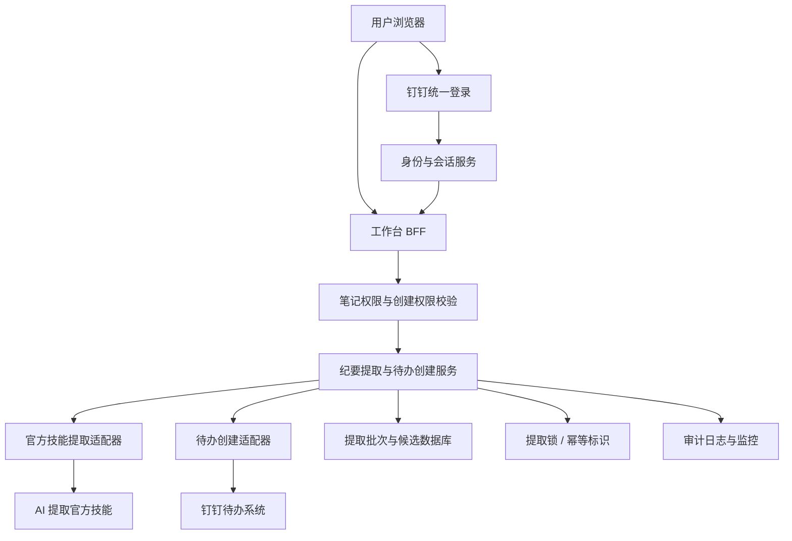
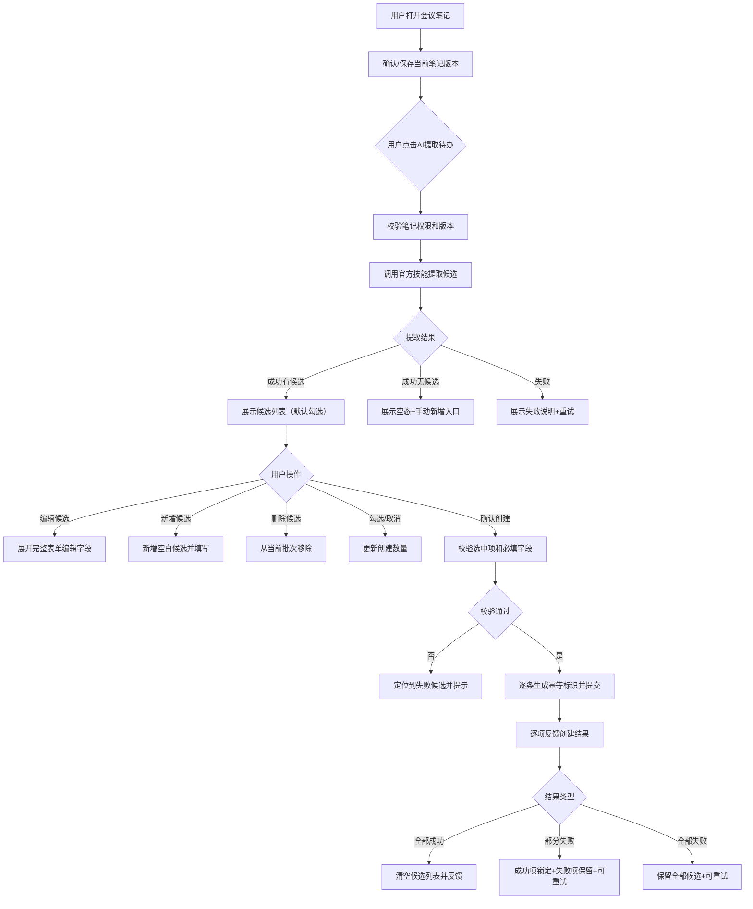

# 20260726-【PRD】AI工作台-会议纪要生成待办（MVP）-天马智擎项目

_**天马智擎项目**_

**产品需求说明书**

版本信息

| 版本号 | 时间（必填） | 状态 | 简要描述（必填） | 部门 | 责任产品（必填） | 批准人 |
| --- | --- | --- | --- | --- | --- | --- |
| V1.0 | 2026-07-26 | N | 从日程看板 PRD 拆分会议纪要生成待办，定义 AI 提取、候选审核编辑和批量创建钉钉待办 | AI项目小组 | @公输 |  |

注：状态为 N-新建、A-增加、M-更改、D-删除。

# 关于本文档

## 术语

| **词汇名称** | **全局说明** | **归属层** |
| --- | --- | --- |
| 会议纪要 | 用户在会议笔记中输入或粘贴的文本内容，作为 AI 提取的输入来源 | 业务层 |
| 待办候选 | AI 从会议纪要中提取的结构化行动项，含标题、执行人、截止时间等字段，尚未创建为正式待办 | 数据层 |
| 提取批次 | 单次 AI 提取请求对应的候选集合，关联本次提取所基于的笔记版本 | 数据层 |
| 执行人 | 待办候选的负责人，AI 优先从纪要中识别，无明确责任人时预填当前用户 | 业务层 |
| 批量创建 | 用户选择多条候选后一次性提交创建请求，每条候选使用独立幂等标识 | 行动层 |
| 部分成功 | 批量创建中部分候选成功、部分失败的状态，成功项锁定不可重提，失败项保留可重试 | 结果层 |
| 幂等标识 | 每次确认生成的服务端唯一标识，同一标识只允许成功一次，防止重复创建 | 安全层 |
| 官方提取技能 | 钉钉或项目已有的 AI 能力，接收会议笔记文本，返回结构化待办候选列表 | 外部能力层 |

## 参考文档

| **编号** | **文档** | **说明及地址** |
| --- | --- | --- |
| 1 | 《20260716-【PRD】AI工作台-工作台（MVP）-天马智擎项目》 | PRD 格式基线 |
| 2 | 《20260726-【PRD】AI工作台-日程看板（MVP）-天马智擎项目》 | 所属主 PRD，会议笔记和日程上下文 |
| 3 | AI 工作台前端原型 | 候选列表、编辑表单和批量创建交互参考 |
| 4 | 钉钉待办开放能力 | 待办创建接口的字段、权限和错误码依据 |

## 沟通要求

| **序号** | **部门/角色** | **沟通内容** | **沟通结果** |
| --- | --- | --- | --- |
| 1 | 官方技能负责人 | 确认纪要提取待办的输入输出格式、字段完整性、限流和失败状态 | 待能力联调确认 |
| 2 | 钉钉应用研发 | 确认待办创建接口的字段、权限、幂等和错误码 | 待接口评审确认 |
| 3 | AI 平台 | 确认提取提示词版本、输入上限（笔记长度≤50000字符）和降级策略 | 待模型评审确认 |
| 4 | 信息安全与 IT | 评审笔记内容传递至官方技能的权限边界、候选人信息和操作审计 | 待安全评审确认 |
| 5 | 产品、研发、测试 | 以真实待办创建接口验证批量创建和部分失败重试，不以模拟创建作为完成依据 | 待联调确认 |

# 产品概述

## 产品概述

会议纪要生成待办面向管理层用户，将用户在会议笔记中记录的会议纪要文本，通过 AI 提取为结构化待办候选。用户可以逐条审核、编辑 AI 提取结果，选择确认的候选后一次性批量创建钉钉待办。

本功能只生成候选和创建待办，不替代钉钉待办系统。AI 提取结果必须经用户确认后才能写入待办系统。

## 产品目标

| **目标** | **说明** | **衡量方式** |
| --- | --- | --- |
| 减少手工整理 | 一份会议纪要可同时提取多条待办候选，减少手动逐条创建 | 单次提取覆盖不少于 80% 的明确行动项 |
| 用户完全控制 | 所有候选必须经用户逐条审核、编辑和选择确认后才创建 | 未经确认不得创建任何待办 |
| 可靠批量创建 | 多条候选一次性提交，逐项反馈成功/失败，失败项可安全重试 | 每条候选使用独立幂等标识 |
| 保证数据安全 | 笔记内容仅用于当前提取请求，不泄漏至非授权方 | 操作审计记录每次提取和创建 |

## 用户角色

### 用户角色描述

| **用户角色** | **职责描述** | **MVP范围** |
| --- | --- | --- |
| 管理层用户 | 查看会议纪要的 AI 提取结果，审核、编辑候选并确认创建待办 | ✅ 核心使用角色 |
| 系统管理员 | 配置提取技能版本、权限和审计规则 | 后台配置页面不在本 PRD 范围内 |

### 用户故事地图

| **用户活动** | **用户任务** | **用户故事** |
| --- | --- | --- |
| 提取待办 | 触发 AI 提取 | 作为管理层用户，我希望一键从会议纪要中提取待办候选，以减少手工整理 |
| 审核候选 | 查看候选列表 | 作为管理层用户，我希望看到一行一条的待办候选，快速判断是否采纳 |
| 审核候选 | 编辑候选字段 | 作为管理层用户，我希望修改 AI 提取的标题、执行人和截止时间，以纠正误差 |
| 审核候选 | 新增/删除候选 | 作为管理层用户，我希望手动添加 AI 遗漏的待办，或删除不合适的候选 |
| 审核候选 | 选择/取消候选 | 作为管理层用户，我希望勾选需要创建的待办，取消不必要的项 |
| 确认创建 | 批量创建 | 作为管理层用户，我希望一键创建所有选中的待办，并清楚知道哪些成功、哪些失败 |
| 确认创建 | 重试失败项 | 作为管理层用户，我希望修复失败项后重新提交，而不影响已成功的待办 |

## 同类产品/竞品调研（选写）

| **产品/能力** | **现有优势** | **本产品定位** |
| --- | --- | --- |
| 钉钉待办 | 完整的待办创建、分配、提醒和完成闭环 | 源系统；工作台负责提取候选和批量创建，不替代待办管理 |
| 通用 AI 提取 | 快速识别文本中的行动项 | 增加用户审核确认环节和批量创建能力，减少误创建 |

# 功能需求

## 全局通用规则

### 系统范围

| **规则项** | **说明** |
| --- | --- |
| 输入来源 | 仅从当前用户有权访问的会议笔记中提取；笔记版本以用户确认保存的版本为准 |
| 输出目标 | 创建的待办归属到钉钉待办系统；工作台不建设第二套待办主库 |
| AI 边界 | 提取结果仅形成候选，不得直接创建待办；用户审核编辑后才能创建 |
| 批量粒度 | 一次性提交的候选共享同一个提取批次，但每条使用独立幂等标识 |
| 提取控制 | 同一笔记版本同时只允许一个提取请求；提取期间禁止重复触发 |

### 身份认证与授权

| **规则项** | **说明** |
| --- | --- |
| 门户认证 | 用户通过钉钉统一登录；服务端取得稳定身份 |
| 笔记权限 | 提取前校验当前用户对目标笔记的查看权限 |
| 创建权限 | 创建待办前再次校验当前用户在目标任务空间的创建权限 |
| 执行人校验 | 后端校验执行人是否合法、是否在当前用户权限范围 |
| 权限变更 | 提取进行中发生权限变更时，创建阶段阻止并提示 |

### 数据保存边界

| **数据类型** | **保存位置** | **保存与安全约束** |
| --- | --- | --- |
| 会议笔记原始内容 | 工作台业务数据库 | 按用户和日程隔离，日志不记录完整笔记正文 |
| 待办候选、提取批次、创建结果 | 工作台业务数据库 | 关联笔记编号和提取时笔记版本 |
| 已创建的钉钉待办 | 钉钉待办系统 | 源系统为权威数据，工作台不建设第二套主库 |
| 提取请求锁、幂等标识 | 受控缓存服务 | 设置有效期，按用户和批次隔离 |
| 表单临时状态、编辑未保存内容 | 浏览器会话缓存 | 退出登录后清除 |

### 加载态/空态/错误态

| **场景** | **状态** | **处理方式** |
| --- | --- | --- |
| AI 提取中 | 加载中 | 展示提取进度指示；禁用重复触发 |
| 提取结果无候选 | 空 | 展示"未识别到明确行动项，可手动新增待办"并展示新增入口 |
| 提取失败 | 错误 | 保留原笔记和候选状态，展示失败说明和重试入口 |
| 批量创建提交中 | 加载中 | 展示逐条提交状态，禁用确认按钮 |
| 批量创建全部成功 | 成功 | 展示创建成功数量和结果，清空候选列表 |
| 批量创建部分失败 | 部分成功 | 成功项锁定不可重复提交；失败项保留内容和幂等标识，支持只重试失败项 |
| 批量创建全部失败 | 错误 | 保留所有候选和编辑内容，展示失败原因和重试入口 |
| 创建超时/响应未知 | 不确定 | 保留幂等标识，不显示成功，提示用户确认状态后重试 |

### 并发与防重复规则

| **规则项** | **说明** |
| --- | --- |
| 提取 | 同一笔记版本同时只运行一个提取请求；晚返回的结果不覆盖新版本 |
| 编辑 | 多条候选的编辑状态独立保存，不影响其他候选 |
| 批量创建 | 每个候选使用独立幂等标识；同一标识只允许成功一次 |
| 重试 | 失败项重试时复用原幂等标识；成功项不可二次提交 |
| 关闭保护 | 有未完成保存请求时等待结果或明确提示 |

## 流程图

### 技术架构图



### 业务流程图



## 功能模块清单

| **功能模块** | **功能描述** | **优先级** |
| --- | --- | --- |
| M1-待办提取引擎 | 调用官方技能从会议笔记中提取待办候选、提取状态管理、无候选空态、提取失败重试 | P0 |
| M2-候选管理与编辑 | 候选列表展示（一行一条）、展开/折叠完整表单、编辑字段、新增候选、删除候选、选择/取消勾选 | P0 |
| M3-批量创建与结果反馈 | 选中项校验、独立幂等提交、逐项结果反馈、部分失败重试、全部成功/全部失败处理 | P0 |

## 功能详情

### M1-待办提取引擎

#### 功能需求描述

| **EARS 模式** | **需求描述** |
| --- | --- |
| 普遍型 | 系统应支持用户从当前确认的会议笔记版本触发 AI 提取，调用官方技能返回结构化待办候选。 |
| 状态驱动型 | 当提取成功有候选时展示候选列表；成功无候选时展示空态和手动新增入口；提取失败时展示失败说明和重试。 |
| 事件驱动型 | 当用户点击"AI 提取待办"时，系统应锁定当前笔记版本、调用官方技能并返回结果。 |
| 不良行为型 | 系统不应在用户未保存笔记时使用草稿版本提取，不应在提取中允许重复触发。 |

#### 数据说明（业务实体）

**提取批次**

| **字段名** | **数据类型** | **长度** | **默认值** | **必需** | **约束说明** |
| --- | --- | --- | --- | --- | --- |
| 提取批次编号 | 字符 | 64 | 系统生成 | 是 | 单次提取请求的唯一标识 |
| 笔记编号 | 字符 | 64 | — | 是 | 关联输入笔记 |
| 笔记版本号 | 整数 | — | — | 是 | 提取时使用的笔记版本 |
| 提取状态 | 枚举 | — | 待提取 | 是 | 待提取、提取中、成功、无候选、失败 |
| 提取时间 | 时间戳 | — | 当前时间 | 是 | 用于审计和版本追溯 |
| 结果信息 | 字符 | ≤500 | 空 | 否 | 失败时说明原因，不包含底层堆栈 |

#### 业务规则和约束条件

| **规则项** | **说明** |
| --- | --- |
| 提取输入 | 使用用户当前确认的笔记版本；同一版本同时只运行一个提取请求 |
| 提取锁定 | 提取期间禁止重复触发；晚返回的结果不得覆盖新版本 |
| 无候选 | 提取成功但无候选时展示空态和手动新增入口，不自动创建空任务 |
| 提取失败 | 保留原笔记和已有候选，展示失败说明和重试入口 |

#### 接口说明

| **接口** | **调用方式** | **请求/响应重点** | **状态** |
| --- | --- | --- | --- |
| 官方纪要提取接口 | 提取候选 | 请求笔记编号和版本；返回提取批次及待办候选 | 由官方技能提供，路径待评审 |

#### 界面原型

| **动作** | **显示** | **类型** | **描述** |
| --- | --- | --- | --- |
| 【AI 提取待办】点击 | 进入提取中状态 | 官方技能动作 | · 使用当前确认的笔记版本<br>· 提取期间禁止重复触发<br>· 失败可重试 |
| 【提取结果】无候选 | 提示"未识别到明确行动项，可手动新增待办" | 空态 | · 展示了手动新增入口<br>· 不自动创建空任务 |

### M2-候选管理与编辑

#### 功能需求描述

| **EARS 模式** | **需求描述** |
| --- | --- |
| 普遍型 | 系统应以一行一条紧凑候选展示 AI 提取结果，支持选择/取消、展开编辑、新增和删除候选。 |
| 状态驱动型 | 当候选行展开时展示完整表单（标题、描述、执行人、参与人、截止时间、优先级、提醒）；勾选状态实时更新"创建 N 条待办"数量。 |
| 事件驱动型 | 当用户点击候选行、编辑字段、新增、删除或勾选时，系统应展开表单、更新内容、添加/移除候选或更新选择状态。 |
| 不良行为型 | 系统不应在未保存编辑时丢失用户修改内容；取消选择不应删除候选内容。 |

#### 数据说明（业务实体）

**待办候选**

| **字段名** | **数据类型** | **长度** | **默认值** | **必需** | **约束说明** |
| --- | --- | --- | --- | --- | --- |
| 候选编号 | 字符 | 64 | 系统生成 | 是 | 批次内唯一 |
| 提取批次编号 | 字符 | 64 | — | 是 | 关联提取批次 |
| 是否选择 | 布尔 | — | 是 | 是 | 只有选中项进入创建请求 |
| 标题 | 字符 | ≤200 | 官方技能生成 | 是 | 必填，可编辑 |
| 描述 | 文本 | ≤5000 | 官方技能生成 | 否 | 可编辑 |
| 执行人 | 人员引用数组 | — | 官方技能生成 | 是 | 无明确执行人时预填当前用户 |
| 参与人 | 人员引用数组 | — | 空 | 否 | 用户可增删 |
| 截止时间 | 日期时间 | — | 当日或次日18:00 | 是 | 纪要明确时间优先 |
| 优先级 | 枚举 | — | 普通 | 是 | 紧急、较高、普通、较低 |
| 提醒方式 | 提醒设置数组 | — | 空 | 否 | 多个提醒值去重 |
| 创建结果 | 枚举 | — | 未创建 | 否 | 未创建、提交中、成功、失败 |
| 结果信息 | 字符 | ≤500 | 空 | 否 | 失败时说明可理解原因 |

#### 业务规则和约束条件

| **规则项** | **说明** |
| --- | --- |
| 执行人默认值 | 纪要明确责任人时预填对应人员；无明确责任人时预填当前用户 |
| 截止时间默认值 | 纪要明确时间时优先；无明确时间且当前时间早于 18:00 时为当天 18:00，达到或晚于 18:00 时为次日 18:00 |
| 选择状态 | 默认勾选字段有效的候选；取消选择不删除候选内容 |
| 新增候选 | 生成本地候选编号，用户填写必填字段 |
| 删除候选 | 从当前批次移除，不影响源笔记；仅剩一条时仍允许删除 |
| 多候选独立 | 每条候选的编辑状态独立保存，互不影响 |

#### 接口说明

无独立接口，M2 为纯前端交互模块，数据保存后由 M3 提交。

#### 界面原型

```text
┌会议笔记─────编辑区───────────┐ 待办候选 ──────────┐
│会议纪要文本编辑区            │ □ 完成Q2财报分析 · 王磊 · 7/31  │
│                              │ ☑ 确认供应商合同 · 李明 · 8/5   │
│                              │ □ [展开编辑...]                │
│  [AI提取待办]                │                                │
│                              │ [新增]               [创建2条] │
└──────────────────────────────┴────────────────────────────────┘
```

| **动作** | **显示** | **类型** | **描述** |
| --- | --- | --- | --- |
| 【待办候选】默认 | 一行一条紧凑候选 | 候选列表 | · 展示选择框、标题、截止时间和负责人<br>· 默认勾选字段有效的候选<br>· 多条候选可连续浏览 |
| 【候选行】点击 | 展开当前候选完整表单 | 折叠表单 | · 字段为标题*、描述、执行人*、参与人、截止时间*、优先级*、提醒<br>· 用户可继续修改官方提取结果 |
| 【候选选择框】勾选/取消 | 更新"创建 N 条待办"数量 | 选择控件 | · 未选中项不提交<br>· 取消选择不删除内容 |
| 【新增】点击 | 新增并展开空候选 | 按钮 | · 生成本地候选编号<br>· 用户填写必填字段 |
| 【删除候选】点击 | 从当前批次移除候选 | 图标按钮 | · 不影响源笔记<br>· 仅剩一条时仍允许删除 |

### M3-批量创建与结果反馈

#### 功能需求描述

| **EARS 模式** | **需求描述** |
| --- | --- |
| 普遍型 | 系统应校验选中候选的必填字段后，逐条生成独立幂等标识并发起批量创建。创建结果逐项反馈。 |
| 状态驱动型 | 当批量创建全部成功时清空候选列表并反馈数量；部分成功时成功项锁定、失败项保留；全部失败时保留全部候选。 |
| 事件驱动型 | 当用户点击"创建 N 条待办"时，系统应执行校验、提交和结果反馈。 |
| 不良行为型 | 系统不应在字段校验失败时提交；不应允许成功项重复提交；响应未知时不得显示成功。 |

#### 业务规则和约束条件

| **规则项** | **说明** |
| --- | --- |
| 候选确认 | 只有选中且字段校验通过的候选可以创建 |
| 独立幂等 | 每个候选在确认时生成独立幂等标识；同一标识只允许成功一次 |
| 批量结果 | 逐项返回结果；成功项锁定不可重复提交 |
| 部分失败重试 | 失败项保留内容和幂等标识；用户修复后可重新提交失败项 |
| 重试复用幂等 | 失败项重试时复用原幂等标识，确保不会重复创建 |
| 提交中状态 | 提交过程中禁用确认按钮，防止重复操作 |
| 校验失败定位 | 具体到哪个候选的哪个字段校验失败，提供明确提示 |

#### 接口说明

| **接口** | **调用方式** | **请求/响应重点** | **状态** |
| --- | --- | --- | --- |
| POST /api/dws/actions | 创建待办 | 请求动作类型、完整表单和幂等标识 | 现有路径，字段和错误码待评审 |

写操作必须使用幂等标识；响应未知不得显示成功。

#### 界面原型

| **动作** | **显示** | **类型** | **描述** |
| --- | --- | --- | --- |
| 【创建 N 条待办】点击 | 校验并批量提交选中候选 | 写操作 | · N 实时反映可提交项<br>· 校验失败定位具体候选<br>· 每个候选使用独立幂等标识 |
| 【批量创建】提交中 | 逐条显示提交状态 | 加载态 | · 每个候选独立显示提交中/成功/失败<br>· 禁用确认按钮 |
| 【批量创建】全部成功 | 成功项标记已创建并反馈数量 | 成功态 | · 成功项显示绿色对勾<br>· 提供"返回"或"继续提取"入口 |
| 【批量创建】部分失败 | 成功项锁定，失败项保留 | 部分成功态 | · 展示逐项结果<br>· 尝试次数和错误原因可查看<br>· 支持只重试失败项 |
| 【批量创建】全部失败 | 保留全部候选和编辑内容 | 失败态 | · 展示整体失败原因<br>· 提供"全部重试"入口 |

#### 补充说明

1. 待办候选提取使用官方技能，本 PRD 不定义提取的内部提示词和模型实现。
2. 已创建的钉钉待办以钉钉待办系统为准，工作台不建设第二套待办主库。
3. 本 PRD 定义的功能依赖会议笔记的存在，但笔记编辑功能和日程上下文不在本 PRD 范围内。
4. 批量创建时调用 POST /api/dws/actions 接口，请求动作类型为"创建待办"、完整表单和幂等标识。

# 非功能需求

## 性能要求

| **指标** | **目标值** | **说明** |
| --- | --- | --- |
| AI 提取响应 | ≤3 秒（P95） | 不含笔记保存耗时；超过 3 秒可展示进度 |
| 候选列表渲染 | 50 条以内无明显卡顿 | 超过 50 条时分批渲染 |
| 批量创建 | 10 条以内 ≤2 秒（P95） | 每条使用独立幂等，逐项反馈不阻塞整体 |
| 候选展开/折叠 | ≤200ms | 单条候选表单展开速度 |

## 安全要求

| **维度** | **要求** |
| --- | --- |
| 笔记权限 | 提取前校验当前用户对目标笔记的查看权限 |
| 创建权限 | 创建待办前再次校验当前用户在目标任务空间的创建权限 |
| 数据最小化 | 官方技能只接收完成提取所需的笔记文本和基本信息 |
| 笔记保护 | 日志不记录完整笔记正文和候选人信息 |
| 幂等保护 | 同一幂等标识只允许成功一次，防止重复创建 |
| 操作审计 | 记录每次提取请求、创建请求的发起人、时间、候选数量和结果 |

## 兼容性要求

| **维度** | **要求** |
| --- | --- |
| 浏览器 | Chrome、Edge 最近两个稳定版本 |
| 分辨率 | 最小 1280×720；推荐 1920×1080 |
| 响应式 | 候选列表区域在窄屏下保持可用 |

# 迭代计划与 Non-goals

## MVP（本期）迭代计划

| **序号** | **模块** | **开发内容** | **依赖/并行** | **备注** |
| --- | --- | --- | --- | --- |
| 1 | M1-待办提取引擎 | 官方技能调用、提取状态管理、无候选空态、提取失败重试 | 官方技能就绪 | P0 |
| 2 | M2-候选管理与编辑 | 候选列表、展开/折叠、编辑字段、新增/删除、勾选/取消 | 依赖 M1 | P0 |
| 3 | M3-批量创建与结果反馈 | 校验、独立幂等提交、逐项反馈、部分失败重试 | 依赖 M2、钉钉待办创建接口 | P0 |

验证前置：官方提取接口和待办创建接口需形成版本化契约，幂等和错误分支通过联调。

## Non-goals（本期明确不做）

| **序号** | **项目** | **说明** | **计划迭代** |
| --- | --- | --- | --- |
| 1 | 自动创建待办 | AI 只生成候选，必须由用户选择并确认 | 不规划自动执行 |
| 2 | 待办闭环管理 | 不跟踪待办完成状态，待办归属钉钉待办系统 | 后续评估 |
| 3 | 多轮提取对比 | 同一笔记多次提取只保留最新批次 | 后续评估 |
| 4 | 提取结果结构化反馈 | 不建设 AI 纠错后台和数据飞轮 | 后续迭代 |
| 5 | 完整移动端 | MVP 以桌面端为主 | 后续迭代 |

# 附录

## A. 纪要提取官方技能边界

| **官方技能** | **工作台输入边界** | **工作台展示/操作边界** | **是否定义提示词** |
| --- | --- | --- | --- |
| 会议纪要提取待办 | 当前用户确认的会议笔记版本 | 只生成候选；用户选择、编辑并确认后创建 | 否 |

## B. 提示文案

| **场景** | **文案** |
| --- | --- |
| 提取中 | 正在从纪要中识别待办事项… |
| 提取无候选 | 未识别到明确行动项，可手动新增待办 |
| 提取失败 | 提取失败，请重试 |
| 创建全部成功 | 已成功创建 N 条待办 |
| 创建部分失败 | 部分待办创建失败，失败项已保留，请修复后重试 |
| 创建全部失败 | 创建失败，已保留全部待办候选，请重试 |
| 字段校验失败 | 请完善标 * 的必填字段 |
| 响应超时/未知 | 操作结果未知，请确认待办列表后重试 |
