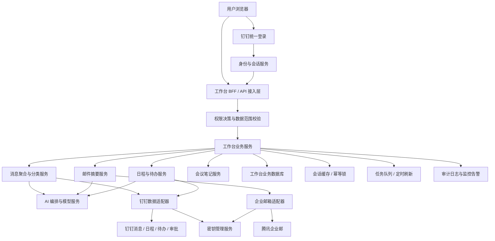
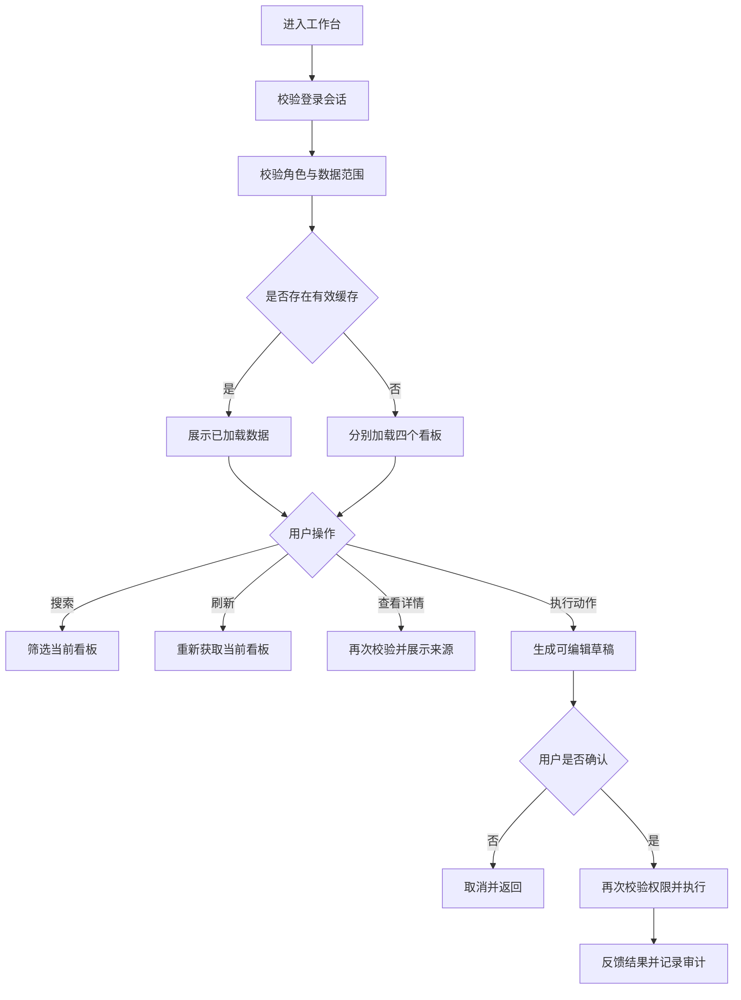
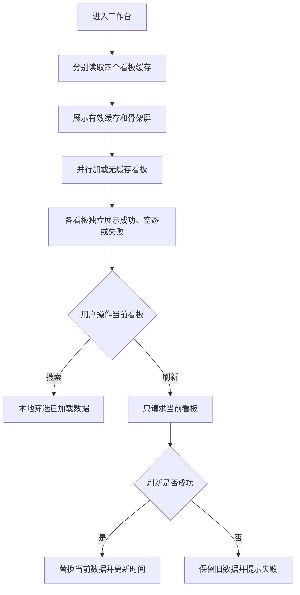
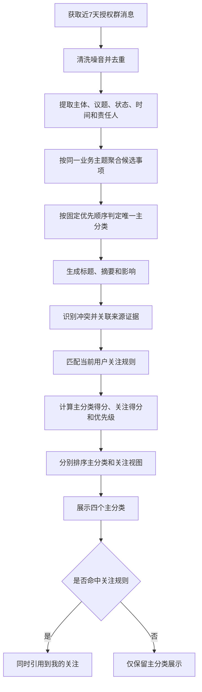
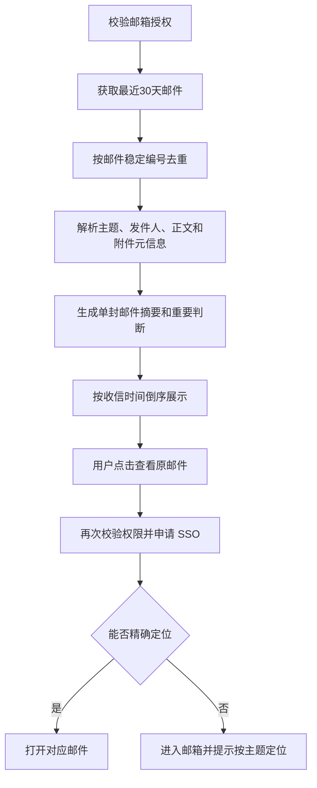
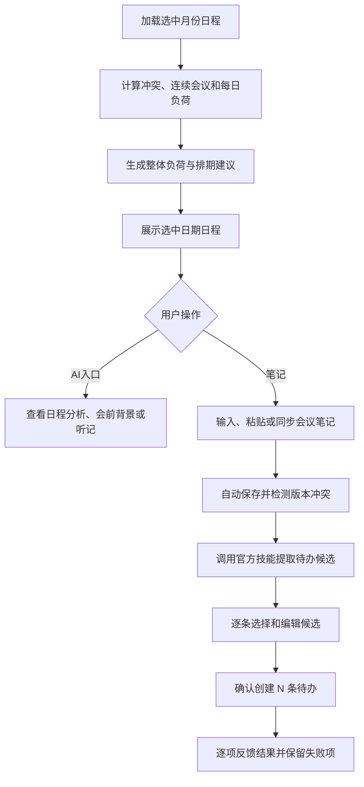
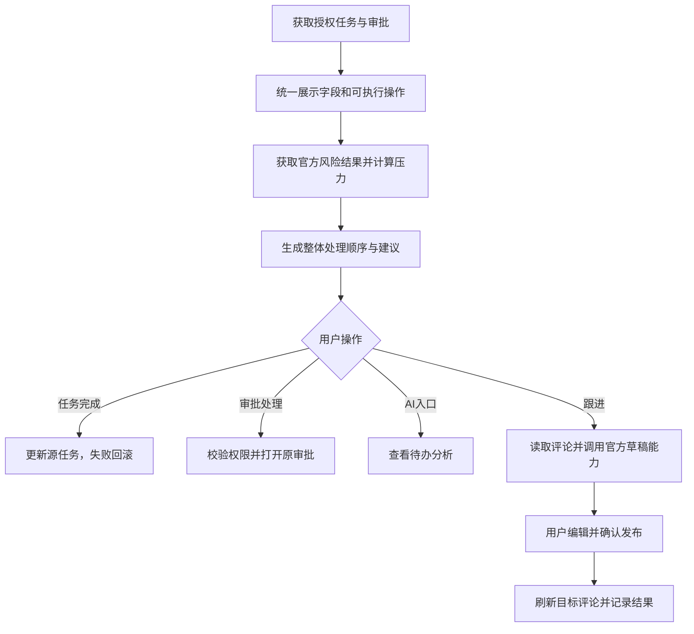

# 20260726-【PRD】AI工作台-工作台（MVP）-天马智擎项目

_**天马智擎项目**_

**产品需求说明书**

版本信息

| 版本号 | 时间（必填） | 状态 | 简要描述（必填） | 部门 | 责任产品（必填） | 批准人 |
| --- | --- | --- | --- | --- | --- | --- |
| V1.0 | 2026-07-26 | N | 定义工作台整体布局、消息摘要、邮件摘要、日程看板、待办中心 | AI项目小组 | @公输 |  |
| V1.1 | 2026-07-26 | M | 统一流程图、补齐消息聚合分类与评分、补充权限存储架构和AI提示词、精简表格 | AI项目小组 | @公输 |  |
| V1.2 | 2026-07-26 | M | 按标准模板恢复术语、参考文档、沟通、角色、用户故事、全局规则、EARS、界面交互和规则表格；逐项补全五个界面的交互说明 | AI项目小组 | @公输 |  |

注：状态为 N-新建、A-增加、M-更改、D-删除。

# 关于本文档

## 术语

| **词汇名称** | **全局说明** | **归属层** |
| --- | --- | --- |
| 业务事项 | 面向当前用户，由一条或多条授权消息围绕同一业务主题聚合形成的工作对象，包含标题、摘要、影响、优先级和来源证据。同一主题对不同用户可以形成不同事项判断 | 消息摘要 |
| 主分类 | 业务事项唯一所属的重点跟进、待我决策、风险预警或经营动态 | 消息摘要 |
| 我的关注 | 按群、人员或关键词规则筛选业务事项的订阅视图，不参与主分类竞争 | 消息摘要 |
| 来源证据 | 支撑 AI 判断的原始消息记录，包含发送人、会话、原文和时间 | AI 与数据层 |
| 行动草稿 | 系统复用消息聚合结果、原文时间和官方忙闲结果预填，用户编辑并确认后才执行的消息、日程或待办内容；不单独调用新的提示词 | 行动层 |
| 会议笔记 | 与单场日程绑定的可编辑笔记，支持保存、复制、粘贴和提取待办候选 | 日程看板 |
| 待办候选 | 从会议笔记中提取、尚未创建的结构化行动项 | 日程看板 |

## 参考文档

| **编号** | **文档** | **说明及地址** |
| --- | --- | --- |
| 1 | 《20260716-【PRD】AI工作台-工作台（MVP）-天马智擎项目》 | 本文档格式基线 |
| 2 | 《信息摘要看板 · 产品需求文档 v3.9》 | 消息分类和评分口径基线 |
| 3 | AI 工作台前端原型 | 界面布局和交互实现参考 |

## 沟通要求

| **序号** | **部门/角色** | **沟通内容** | **沟通结果** |
| --- | --- | --- | --- |
| 1 | 钉钉应用研发 | 确认消息、日程、忙闲、待办、审批和评论接口的字段、权限、限流和错误码 | 待接口评审确认 |
| 2 | 信息安全与 IT | 评审企业邮箱授权、凭证托管、缓存、访问审计和敏感信息脱敏方案 | 待安全评审确认 |
| 3 | 企业应用研发 | 使用真实企业邮箱验证邮件正文同步、SSO 与原邮件精确定位能力 | 待技术预研确认 |
| 4 | 产品、研发、测试 | 未完成接口和安全评审的能力只验收前端交互，不声明端到端功能完成 | 已明确为验收边界 |

# 产品概述

## 产品概述

AI 工作台面向管理层，将分散在即时消息、企业邮箱、日程和待办中的工作信息，组织为消息摘要、邮件摘要、日程看板和待办中心。工作台负责聚合、解释、查证和形成行动草稿，不替代源系统。

## 产品目标

1. 帮助用户快速识别需要跟进、决策和预警的事项。
2. 降低在消息、邮件、日程和待办之间反复查找的成本。
3. 让 AI 结论能够回到来源证据查证，主动暴露数据冲突。
4. 基于当前上下文生成可编辑草稿，用户确认后再执行。
5. 已加载数据稳定保留；搜索不重新取数，刷新只作用于当前看板。

## 用户角色

### 用户角色描述

| **用户角色** | **职责描述** | **MVP范围** |
| --- | --- | --- |
| 管理层用户 | 查看本人有权访问的关键消息、邮件、会议和任务，完成判断、查证与跟进 | ✅ 核心使用角色 |
| 系统管理员 | 配置数据源、组织权限和规则 | 后台配置页面不在本文档范围内 |

### 用户故事地图

| **用户活动** | **用户任务** | **用户故事** |
| --- | --- | --- |
| 进入工作台 | 查看四个看板 | 作为管理层用户，我希望在一个页面查看消息、邮件、日程和待办，以便快速掌握工作全貌 |
| 管理看板数据 | 搜索与刷新 | 作为管理层用户，我希望搜索已加载数据并只刷新当前看板，以便稳定查看信息且避免无关重载 |
| 查看消息摘要 | 判断与查证 | 作为管理层用户，我希望识别重点、待决、风险、经营变化和关注事项，并查看来源证据 |
| 处理消息事项 | 形成行动 | 作为管理层用户，我希望基于事项发消息、建日程或建待办，并在确认后执行 |
| 查看邮件摘要 | 定位原邮件 | 作为管理层用户，我希望一封邮件对应一条摘要，并能进入原邮件继续处理 |
| 管理会议 | 查看分析与背景 | 作为管理层用户，我希望查看会议负荷、冲突、会前背景和会后信息，以便安排时间 |
| 记录会议 | 笔记生成待办 | 作为管理层用户，我希望记录或粘贴会议纪要，审核后一次创建多条待办 |
| 管理待办 | 处理与跟进 | 作为管理层用户，我希望查看任务、审批和我创建事项的完成情况，并通过评论快速跟进 |

## 同类产品/竞品调研（选写）

钉钉提供消息、日程、待办与审批；腾讯企业邮提供邮件服务；OneNote 提供笔记能力。工作台不重复建设源系统，而是提供跨来源的判断入口和行动衔接。

# 功能需求

## 全局通用规则

### 看板范围

| **规则项** | **说明** |
| --- | --- |
| 本期范围 | 只覆盖整体布局、消息摘要、邮件摘要、日程看板和待办中心 |
| 独立性 | 四个业务看板独立加载、滚动、搜索、刷新和报错 |
| 工具位置 | 搜索框与刷新按钮统一位于看板标题右侧，刷新按钮固定在最右 |
| 搜索方式 | 只筛选当前看板已经加载的数据，输入停止 300ms 后生效，不请求源系统 |
| 刷新方式 | 只有用户点击刷新按钮才重新获取当前看板数据，其他看板保持不变 |
| 刷新失败 | 保留上次成功数据，并提示“刷新失败，当前为上次数据” |

### 身份认证与授权

| **规则项** | **说明** |
| --- | --- |
| 门户认证 | 用户通过钉钉统一登录；授权码由服务端换取用户身份，前端不得自行声明用户编号 |
| 登录会话 | 服务端创建登录会话，浏览器只保存安全会话 Cookie；访问令牌不得写入本地持久化存储 |
| 接口鉴权 | 每个接口先校验登录会话，再校验角色权限和数据对象权限 |
| 数据范围 | 消息按可访问会话取数；邮件按绑定邮箱取数；日程、待办和审批按源系统权限取数 |
| 二次校验 | 查看来源、跳转原系统以及执行发消息、建日程、建待办、完成任务和发布评论时再次校验权限 |
| 权限变更 | 权限变化后立即清除对应缓存；前端传入的用户编号、角色和可执行操作不作为最终授权依据 |

### 数据保存边界

| **数据类型** | **保存位置** | **保存与安全约束** |
| --- | --- | --- |
| 钉钉消息、日程、待办、审批、邮件正文 | 对应源系统 | 源系统为权威数据，工作台不建设第二套业务主库 |
| 业务事项、摘要、评分、来源映射、关注规则、关闭状态、会议笔记、待办候选、操作审计 | 工作台业务数据库 | 按用户和对象权限隔离，保存期限按公司数据治理要求执行 |
| 登录会话、短期看板缓存、刷新锁、幂等标识 | 受控缓存服务 | 必须设置有效期并按用户、权限版本和数据窗口隔离 |
| 必要展示数据和界面状态 | 浏览器会话缓存 | 退出登录后清除；不保存邮箱密码、访问令牌和长期下载地址 |
| 邮箱客户端专用密码、第三方密钥、服务凭证 | 密钥管理服务 | 不进入代码、普通数据库和日志 |
| 附件 | 默认保留源系统；必要时使用受控对象存储 | 使用短时下载地址并执行独立权限校验 |

### 公共状态与防重复

| **场景** | **状态/约束** | **处理方式** |
| --- | --- | --- |
| 首次加载 | 加载中 | 展示与对应列表结构一致的骨架屏 |
| 手动刷新 | 刷新中 | 保留已有列表，刷新按钮显示进行中并禁止重复点击 |
| 无数据 | 空态 | 展示该看板专属空态，不与搜索无结果混用 |
| 搜索无结果 | 空态 | 展示无结果说明和“清空搜索”入口 |
| 无权限 | 阻止态 | 不展示对象内容，提示联系管理员或返回 |
| 加载/刷新失败 | 错误态 | 有缓存时保留旧数据；无缓存时展示重新加载入口 |
| 单项写操作 | 提交中 | 禁用确认按钮，同一幂等标识只允许成功一次 |
| 批量写操作 | 部分成功 | 逐项返回结果；成功项不可重复提交，失败项保留内容供重试 |

## 流程图

### 技术架构图

所有架构与业务流程图统一采用自上而下方向。



### 业务流程图



## 功能模块清单

| 功能模块 | 功能描述 | 优先级 |
| --- | --- | --- |
| 整体布局 | 四看板布局、搜索、刷新、缓存和公共状态 | P0-1 |
| 消息摘要 | 消息聚合、分类、关注、详情与卡片动作 | P0-2 |
| 邮件摘要 | 单封邮件摘要、搜索、刷新和原邮件入口 | P0-3 |
| 日程看板 | 日程列表、负荷分析、会议笔记和生成待办 | P0-4 |
| 待办中心 | 任务与审批聚合、排序、处理和评论跟进 | P0-5 |

## 功能详情

### 整体布局

#### 功能需求描述

| **EARS 模式** | **需求描述** |
| --- | --- |
| 普遍型 | 系统应采用桌面端双列布局，左列依次展示消息摘要、邮件摘要，右列依次展示日程看板、待办中心；四个看板应使用统一标题工具区。 |
| 状态驱动型 | 当页面宽度不足以维持双列阅读时，系统应按消息摘要、邮件摘要、日程看板、待办中心的顺序切换为单列，且不得丢失功能入口。 |
| 事件驱动型 | 当用户在某个看板搜索或刷新时，系统应只改变当前看板的数据和状态，不影响其他看板。 |
| 不良行为型 | 系统不应因单个看板加载失败阻断整页，不应在搜索时请求源系统，也不应在刷新失败时清空已有成功数据。 |

#### 业务主流程图及说明



流程说明：缓存展示不得绕过权限校验；单个看板失败不阻塞其他看板；搜索不会触发外部接口。

#### 界面原型

```text
┌──────────────────────────────────────────────────────────────┐
│ 左列                         │ 右列                          │
│ ┌消息摘要────────搜索─刷新┐ │ ┌日程看板────────搜索─刷新┐ │
│ │ 内容独立滚动             │ │ │ 内容独立滚动             │ │
│ └──────────────────────────┘ │ └──────────────────────────┘ │
│ ┌邮件摘要────────搜索─刷新┐ │ ┌待办中心────────搜索─刷新┐ │
│ │ 内容独立滚动             │ │ │ 内容独立滚动             │ │
│ └──────────────────────────┘ │ └──────────────────────────┘ │
└──────────────────────────────────────────────────────────────┘
```

| **动作** | **显示** | **类型** | **描述** | **截图示例** |
| --- | --- | --- | --- | --- |
| 【工作台】首次进入 | 四个看板分别展示缓存、骨架屏或内容 | 页面 | · 完成登录与权限校验后再展示缓存<br>· 四个看板独立加载<br>· 单个失败不阻断其他看板 | 见本节线框图 |
| 【看板标题区】默认 | 标题、搜索框、刷新按钮 | 标题工具区 | · 四个看板结构和控件尺寸统一<br>· 搜索框位于标题右侧<br>· 刷新按钮固定最右 | 见本节线框图 |
| 【搜索框】输入 | 300ms 后过滤当前看板 | 输入框 | · 仅搜索已经加载的数据<br>· 不调用源系统接口<br>· 保持原列表相对顺序 | — |
| 【搜索框】清空 | 恢复当前看板全部已加载数据 | 输入框 | · 点击清除图标或删除全部文字均触发<br>· 不改变当前看板缓存 | — |
| 【刷新按钮】点击 | 图标旋转，当前列表保持可读 | 图标按钮 | · 只刷新当前看板<br>· 刷新中禁用重复点击<br>· 提供“正在刷新”可访问名称 | — |
| 【当前看板】刷新成功 | 替换列表并更新最后刷新时间 | 看板 | · 保留当前搜索词并重新过滤新数据<br>· 不改变其他看板 | — |
| 【当前看板】刷新失败且有缓存 | 保留旧列表并展示失败提示 | Toast/看板状态 | · 文案“刷新失败，当前为上次数据”<br>· 提供再次刷新入口 | — |
| 【当前看板】首次加载失败且无缓存 | 展示错误说明和“重新加载” | 错误态 | · 不展示空白卡片<br>· 重试只请求当前看板 | — |
| 【看板内容区】滚动 | 标题工具区保持可见，内容独立滚动 | 滚动容器 | · 不推动相邻看板高度<br>· 浮层离开锚点可视区域时按所属模块规则关闭 | — |
| 【搜索无结果】出现 | 无结果说明和“清空搜索” | 空态 | · 与业务无数据空态区分<br>· 点击后清除关键词并恢复列表 | — |
| 【当前用户无权限】出现 | 权限说明 | 阻止态 | · 不渲染受限对象内容<br>· 不以加载失败文案替代 | — |
| 【页面】进入窄屏 | 四个看板切换为单列 | 响应式布局 | · 顺序固定为消息、邮件、日程、待办<br>· 搜索和刷新入口完整保留 | — |
| 【图标按钮】键盘聚焦/激活 | 可见焦点与对应提示 | 可访问交互 | · 支持 Tab 聚焦、Enter/Space 激活<br>· 仅图标按钮必须提供可访问名称 | — |

#### 数据说明（业务实体）

**看板状态**

| 字段名 | 数据类型 | 长度 | 默认值 | 必需 | 约束说明 |
| --- | --- | --- | --- | --- | --- |
| 用户编号 | 字符 | 64 | — | 是 | 当前登录用户稳定编号；不得由前端自行指定 |
| 看板标识 | 枚举 | — | — | 是 | 消息摘要、邮件摘要、日程看板、待办中心四选一 |
| 数据窗口 | 字符 | ≤100 | 当前窗口 | 是 | 标识时间或分页范围；与用户编号、看板标识组成缓存键 |
| 搜索关键词 | 字符 | ≤100 | 空 | 否 | 只影响当前展示结果 |
| 加载状态 | 枚举 | — | 未加载 | 是 | 未加载、加载中、刷新中、成功、失败 |
| 已加载数据 | 对象数组 | — | 空数组 | 是 | 元素遵循对应看板实体；只保存必要展示字段 |
| 缓存时间 | 时间戳 | — | 空 | 否 | 最近写入会话缓存的时间 |
| 刷新时间 | 时间戳 | — | 空 | 否 | 最近成功获取源数据的时间 |
| 错误信息 | 字符 | ≤500 | 空 | 否 | 使用用户可理解文案，不暴露凭证和堆栈 |

**公共引用结构**

| 结构名称 | 中文子字段 | 约束说明 |
| --- | --- | --- |
| 人员引用 | 用户编号、姓名、头像地址 | 用户编号为关联键；姓名只用于展示；头像可为空 |
| 群引用 | 会话编号、会话名称 | 只返回当前用户有权访问的会话 |
| 文件引用 | 文件编号、名称、大小、类型、下载地址 | 下载地址必须为短时授权地址 |
| 提醒设置 | 提前分钟数 | 非负整数；多个值去重后升序保存 |
| 周期规则 | 周期类型、间隔数、结束日期、结束次数 | 结束日期和结束次数最多填写一项 |
| 写操作控制 | 幂等标识、提交时间、提交状态 | 同一幂等标识只允许成功一次 |

#### 业务规则和约束条件

公共规则统一见“功能需求—全局通用规则”。本模块只增加以下布局约束：

| **规则项** | **说明** |
| --- | --- |
| 桌面布局 | 左右列宽度保持稳定，看板内部滚动不得推动整列高度异常变化 |
| 窄屏顺序 | 按消息摘要、邮件摘要、日程看板、待办中心顺序排列 |
| 缓存展示 | 缓存必须在登录和权限校验后才能展示，权限版本变化后立即作废 |

#### 接口说明

无。整体布局不单独提供业务接口，各看板接口见对应小节。

#### 补充说明

界面实现基线为 `frontend-mvp/src/views/SystemPortalsView.vue`。公共状态在本节定义，后续看板只说明差异，不重复描述。

### 消息摘要

#### 功能需求描述

| **EARS 模式** | **需求描述** |
| --- | --- |
| 普遍型 | 系统应将当前用户近 7 天有权访问的群聊消息聚合为业务事项，并展示标题、摘要、影响、优先级、冲突状态和来源数量。 |
| 状态驱动型 | 当业务事项命中关注规则时，系统应在其唯一主分类之外同时将其展示在“我的关注”，并显示关注类型标签。 |
| 事件驱动型 | 当用户切换 Tab、搜索、刷新、查看来源或发起卡片动作时，系统应按当前事项、权限和交互状态展示或执行对应结果。 |
| 不良行为型 | 系统不应把同一事项分入多个主分类，不应把无权限消息作为来源，不应由卡片正文打开详情，也不应在用户确认前执行外部动作。 |

**五个 Tab 的关系**

| **Tab** | **视图性质** | **进入条件** | **与其他 Tab 的关系** |
| --- | --- | --- | --- |
| 重点跟进 | 主分类 | 已经布置、反复讨论或持续推进，但尚未明确结束 | 每个事项只能有一个主分类 |
| 待我决策 | 主分类 | 存在对当前用户的明确拍板、确认、审批或选择请求 | 每个事项只能有一个主分类 |
| 风险预警 | 主分类 | 存在损失、违规、客诉、故障、中断、错价等风险信号 | 每个事项只能有一个主分类 |
| 经营动态 | 主分类 | 包含经营指标、播报、趋势或显著变化 | 每个事项只能有一个主分类 |
| 我的关注 | 订阅视图 | 任一有效来源命中当前用户的群、人员或关键词规则 | 不参与主分类竞争；事项可同时出现在主分类和本视图，两处引用同一事项编号 |

#### 业务主流程图及说明



分类与打分必须针对聚合后的业务事项，而不是先给单条消息生成卡片再合并。

#### 界面原型

```text
┌消息摘要──────────────────────────────[搜索][刷新]┐
│ 重点跟进  待我决策  风险预警  经营动态  我的关注 │
│┃标题 [高] [冲突] [群/人员/关键词*]       10:30 │
│┃摘要：……                    [消息][日程][待办][5]│
│┃影响：……                                      │
└────────────────────────────────────────────────┘
* 类型标签仅在“我的关注”展示
```

| **动作** | **显示** | **类型** | **描述** | **截图示例** |
| --- | --- | --- | --- | --- |
| 【消息摘要】首次加载 | 默认 Tab 和首批 5 条事项 | 看板 | · 默认进入“重点跟进”<br>· 加载状态遵循“公共状态与防重复”<br>· 卡片按当前 Tab 排序规则展示 | 见本节线框图 |
| 【Tab】点击 | 切换重点跟进/待我决策/风险预警/经营动态/我的关注 | 页签 | · 不重新请求数据<br>· 保留每个 Tab 的搜索结果和滚动位置<br>· 每个 Tab 首批展示 5 条 | — |
| 【列表底部】滚动到阈值 | 追加 5 条事项 | 滚动加载 | · 已加载完成时不再请求<br>· 加载失败保留现有卡片并提供重试 | — |
| 【搜索框】输入/清空 | 过滤或恢复当前 Tab 事项 | 输入框 | · 搜索标题、摘要、影响和来源展示名称<br>· 300ms 防抖，本地过滤<br>· 不跨 Tab 搜索 | — |
| 【刷新按钮】点击 | 当前列表保持，按钮进入刷新态 | 图标按钮 | · 重新读取消息并完成清洗、聚合、分类、摘要、评分和排序<br>· 保留稳定事项编号、关闭状态和当前搜索词 | — |
| 【业务事项卡片】默认 | 三行紧凑卡片 | 卡片 | · 第一行：标题、优先级、冲突图标、关注类型标签、右侧时间<br>· 第二行：摘要<br>· 第三行：影响和右侧动作区<br>· 正文和空白区域不可打开详情 | 见本节线框图 |
| 【普通分类卡片】展示 | 优先级标签和可选冲突图标 | 标签 | · 不展示业务领域标签<br>· 优先级只显示高/中/低 | — |
| 【我的关注卡片】展示 | 最多两个定宽类型标签和可选“+N” | 标签 | · 标签类型为群、人员或关键词<br>· 标签约 3 个汉字宽，超出单行省略<br>· Hover/聚焦显示完整名称<br>· “+N”提示全部其余命中规则 | — |
| 【冲突图标】Hover/聚焦 | 提示“数据冲突” | Tooltip | · 卡片不展示长冲突文案<br>· 完整冲突内容见详情浮层 | — |
| 【发消息按钮】点击 | 打开发消息弹窗 | 动作弹窗 | · 字段：收件人*、发送内容*<br>· 默认最新来源群，可切换至事项涉及的其他群或人员<br>· 不展示消息标题、摘要、评分等详情字段 | — |
| 【常用快捷内容】点击 | 将所选模板写入发送内容 | 快捷按钮 | · 用户仍可继续编辑<br>· 切换模板时替换当前发送内容，提交前不得自动发送 | — |
| 【发消息弹窗】确认 | 提交发消息请求并反馈结果 | 写操作 | · 校验必填项和对象权限<br>· 提交中禁用确认<br>· 成功关闭并提示；失败保留表单内容 | — |
| 【建日程按钮】点击 | 打开日程弹窗 | 动作弹窗 | · 常用字段：标题*、开始时间*、结束时间*、时区*、必选参会人*、可选参会人、地点、会议室、描述、提醒<br>· 其他受支持字段置于“更多设置”<br>· 不展示视频会议和日程颜色 | — |
| 【日程弹窗】打开 | 立即展示预填时间，异步更新忙闲结果 | 表单状态 | · 原文时间优先<br>· 无原文时间时按共同空闲→本人空闲→09:00—18:00 最近整点一小时<br>· 当天无完整时段则从次日 09:00 继续查找<br>· 标明是否已检查忙闲 | — |
| 【日程弹窗】确认 | 创建日程并反馈结果 | 写操作 | · 所有预填内容可编辑<br>· 再次校验时间、参会人和权限<br>· 失败保留表单内容 | — |
| 【建待办按钮】点击 | 打开待办弹窗 | 动作弹窗 | · 字段：标题*、详细描述、执行人*、参与人、截止时间*、优先级*、提醒<br>· 原文责任人优先；无明确执行人时预填当前用户<br>· 原文无截止时间时，18:00 前默认当天 18:00，否则次日 18:00<br>· 高/中/低映射为紧急/较高/普通 | — |
| 【待办弹窗】确认 | 创建待办并反馈结果 | 写操作 | · 校验必填项和执行权限<br>· 提交中禁止重复操作<br>· 失败保留表单内容 | — |
| 【消息气泡】Hover/聚焦 | 展示锚定气泡的详情预览 | 详情浮层 | · 数字直接显示在气泡内并代表来源数量<br>· 浮层左侧三角指向原卡片<br>· 鼠标进入浮层时保持打开 | — |
| 【消息气泡】点击 | 固定同一个详情浮层 | 详情浮层 | · 再次点击、点击空白处或关闭按钮解除固定<br>· 不切换为右侧抽屉<br>· 卡片滚出可视区域时关闭 | — |
| 【详情浮层】默认 | AI 分析、冲突说明和来源聊天缩略卡 | 详情浮层 | · 不展示评分公式、规则版本和消息编号等实现字段<br>· 不展示发消息、建日程、建待办<br>· 来源首批 10 条 | — |
| 【详情来源】继续加载 | 追加来源聊天缩略卡 | 分页 | · 每条展示头像、发送人、会话、原文和最右侧时间<br>· 无更多来源时隐藏加载入口 | — |
| 【关注该群/关注该人】点击 | 按钮变为“已关注”并提示可撤销 | 快捷动作 | · 一键新增规则，不二次确认<br>· 达到 20 条上限时阻止新增并提示先删除旧规则<br>· 撤销只撤销本次新增 | — |
| 【卡片】Hover/聚焦 | 右上角显示关闭按钮 | 卡片操作 | · 默认不占固定动作区<br>· 点击关闭后从当前用户所有视图移除<br>· 5 秒内可通过 Toast 撤销 | — |
| 【风险预警】无数据 | “近期平稳” | 空态 | · 不显示通用无数据文案 | — |
| 【我的关注】无规则 | 关注说明和“去添加关注” | 空态 | · 点击进入关注规则维护入口<br>· 有规则但无命中时显示“暂无匹配事项” | — |
| 【新增关注】点击 | 打开关注规则弹窗 | 按钮/弹窗 | · 支持群聊、人员、关键词三种类型<br>· 展示当前规则数量和 20 条上限 | — |
| 【关注类型】切换 | 切换群聊/人员选择器或关键词输入框 | 分段控件 | · 切换时清空尚未添加的输入值<br>· 已加入列表的规则不受影响 | — |
| 【关注规则】添加 | 规则进入待保存列表 | 表单动作 | · 群和人员从授权候选中选择<br>· 关键词支持 Enter 或“添加”按钮<br>· 空值、同类型重复值和超过 20 条时阻止添加 | — |
| 【关注规则】删除 | 从待保存列表移除规则 | 图标按钮 | · 保存前只影响弹窗草稿<br>· 删除后允许继续添加 | — |
| 【保存关注】点击 | 保存整组规则并返回“我的关注” | 写操作 | · 成功后重新计算关注命中、标签和排序<br>· 失败保留弹窗草稿<br>· “取消”或点击遮罩不保存修改 | — |

#### 数据说明（业务实体）

**业务事项**

| 字段名 | 数据类型 | 长度 | 默认值 | 必需 | 约束说明 |
| --- | --- | --- | --- | --- | --- |
| 事项编号 | 字符 | 64 | 系统生成 | 是 | 全局唯一；跨主分类和关注视图复用 |
| 用户编号 | 字符 | 64 | — | 是 | 关联当前登录用户；同一主题对不同用户分别保存判断 |
| 聚合键 | 字符 | 64 | 系统计算 | 是 | 用户编号与候选事项最小来源稳定标识的 SHA-256；模型文本不参与主键计算 |
| 主分类 | 枚举 | — | — | 是 | 重点跟进、待我决策、风险预警、经营动态四选一 |
| 标题 | 字符 | ≤40 | — | 是 | “主体＋核心状态/动作”；单行省略 |
| 摘要 | 字符 | ≤120 | — | 是 | 描述已发生事实，不与影响重复 |
| 影响 | 字符 | ≤120 | — | 是 | 说明对当前用户的影响；不得编造损失 |
| 优先级 | 枚举 | — | 中 | 是 | 高、中、低 |
| 综合得分 | 小数 | 0—100 | — | 是 | 用于类内排序和详情解释，卡片正面不展示 |
| 冲突标记 | 布尔 | — | 否 | 是 | 关键数值、状态、时间或结论不一致时为是 |
| 冲突说明 | 字符 | ≤500 | 空 | 条件必填 | 冲突时分点写明来源及不同值 |
| 来源数量 | 整数 | — | 1 | 是 | 不小于 1，显示在消息气泡内 |
| 最新时间 | 时间戳 | — | — | 是 | 取有效来源的最新时间 |

**事项来源**

| 字段名 | 数据类型 | 长度 | 默认值 | 必需 | 约束说明 |
| --- | --- | --- | --- | --- | --- |
| 来源编号 | 字符 | 64 | — | 是 | 原消息稳定标识 |
| 事项编号 | 字符 | 64 | — | 是 | 关联业务事项 |
| 会话编号 | 字符 | 64 | — | 是 | 关联授权群 |
| 会话名称 | 字符 | ≤100 | — | 是 | 仅展示有权名称 |
| 发送人 | 人员引用 | — | — | 是 | 见公共引用结构 |
| 原文内容 | 文本 | ≤5000 | — | 是 | 与 AI 分析明确区隔，不改写原文 |
| 发送时间 | 时间戳 | — | — | 是 | 原消息发送时间 |

**关注规则**

| 字段名 | 数据类型 | 长度 | 默认值 | 必需 | 约束说明 |
| --- | --- | --- | --- | --- | --- |
| 关注规则编号 | 字符 | 64 | 系统生成 | 是 | 规则主键，全局唯一 |
| 用户编号 | 字符 | 64 | — | 是 | 关联当前用户 |
| 关注类型 | 枚举 | — | — | 是 | 群、人员、关键词三选一 |
| 关注对象编号 | 字符 | 64 | 空 | 条件必填 | 群或人员类型必填；关键词类型为空 |
| 关注名称 | 字符 | ≤100 | — | 是 | 用于标签展示和规范化去重 |
| 规则状态 | 枚举 | — | 生效 | 是 | 生效、已删除 |
| 创建时间 | 时间戳 | — | 当前时间 | 是 | 用于审计和撤销判断 |

**关注命中关系**

| 字段名 | 数据类型 | 长度 | 默认值 | 必需 | 约束说明 |
| --- | --- | --- | --- | --- | --- |
| 关注规则编号 | 字符 | 64 | — | 是 | 关联关注规则 |
| 事项编号 | 字符 | 64 | — | 是 | 与关注规则编号组成唯一键 |
| 关注视图得分 | 小数 | 0—100 | — | 是 | 当前规则与事项这一命中关系的得分；不覆盖主分类得分。同一事项命中多条规则时，事项在“我的关注”中的排序分取所有有效命中关系得分的最大值 |

**用户事项状态**

| 字段名 | 数据类型 | 长度 | 默认值 | 必需 | 约束说明 |
| --- | --- | --- | --- | --- | --- |
| 用户编号 | 字符 | 64 | — | 是 | 与事项编号组成唯一键 |
| 事项编号 | 字符 | 64 | — | 是 | 关联业务事项 |
| 是否关闭 | 布尔 | — | 否 | 是 | 关闭后从该用户所有视图移除 |
| 关闭时间 | 时间戳 | — | 空 | 否 | 撤销成功后清空 |
| 幂等标识 | 字符 | 64 | 操作时生成 | 是 | 同一次关闭或撤销只成功一次 |

**行动草稿**

| 字段名 | 数据类型 | 长度 | 默认值 | 必需 | 约束说明 |
| --- | --- | --- | --- | --- | --- |
| 草稿编号 | 字符 | 64 | 系统生成 | 是 | 全局唯一，关联事项编号 |
| 事项编号 | 字符 | 64 | — | 是 | 关联业务事项 |
| 动作类型 | 枚举 | — | — | 是 | 发消息、建日程、建待办三选一 |
| 收件人 | 人员或群引用数组 | — | 系统预填 | 发消息时必填 | 默认最新来源群；只能选择事项来源内对象 |
| 发送内容 | 文本 | ≤2000 | 聚合提示词输出 | 发消息时必填 | 复用消息聚合分类与摘要结果，可编辑 |
| 日程标题 | 字符 | ≤2048 | 聚合提示词输出 | 建日程时必填 | 复用事项标题或行动建议，不为空 |
| 开始时间 | 日期时间 | — | 系统推荐 | 建日程时必填 | 原文时间优先，否则根据官方忙闲结果推荐工作时段整点 |
| 结束时间 | 日期时间 | — | 开始后1小时 | 建日程时必填 | 必须晚于开始时间 |
| 时区 | 字符 | ≤64 | Asia/Shanghai | 建日程时必填 | 使用国际标准时区标识 |
| 必选参会人 | 人员引用数组 | — | 系统预填 | 建日程时必填 | 从责任人和来源人员映射，用户可增删 |
| 可选参会人 | 人员引用数组 | — | 空 | 否 | 用户可增删 |
| 会议室 | 字符 | ≤200 | 空 | 否 | 从可用会议室选择 |
| 日程描述 | 文本 | ≤5000 | 聚合提示词输出 | 否 | 复用事项摘要、影响和行动建议，可编辑 |
| 日程提醒 | 提醒设置数组 | — | 提前15分钟 | 否 | 见公共引用结构 |
| 日程忙闲状态 | 枚举 | — | 忙 | 否 | 忙、闲二选一；放入更多设置 |
| 日程周期 | 周期规则 | — | 不重复 | 否 | 放入更多设置 |
| 归属企业 | 字符 | ≤100 | 当前企业 | 否 | 仅展示用户可选择企业 |
| 日程附件 | 文件引用数组 | — | 空 | 否 | 只接受接口支持的格式和大小 |
| 待办标题 | 字符 | ≤200 | 聚合提示词输出 | 建待办时必填 | 复用事项行动建议，不为空 |
| 待办描述 | 文本 | ≤5000 | 聚合提示词输出 | 否 | 复用事项摘要、影响和来源，可编辑 |
| 执行人 | 人员引用数组 | — | 系统预填 | 建待办时必填 | 从原文责任关系映射；无责任人时预填当前用户 |
| 参与人 | 人员引用数组 | — | 空 | 否 | 被提及但无责任关系的人可预填 |
| 截止时间 | 日期时间 | — | 当日/次日18:00 | 建待办时必填 | 原文明示时间优先 |
| 待办优先级 | 枚举 | — | 普通 | 建待办时必填 | 紧急、较高、普通、较低 |
| 待办提醒 | 提醒设置数组 | — | 空 | 否 | 见公共引用结构 |
| 待办标签 | 字符数组 | — | 空 | 否 | 重复标签合并 |
| 待办附件 | 文件引用数组 | — | 空 | 否 | 只接受接口支持的格式和大小 |
| 待办重复规则 | 周期规则 | — | 不重复 | 否 | 放入更多设置 |
| 幂等标识 | 字符 | 64 | 确认时生成 | 提交时必填 | 编辑阶段为空；同一标识只成功一次 |
| 执行状态 | 枚举 | — | 待确认 | 是 | 待确认、提交中、成功、失败 |
| 结果信息 | 字符 | ≤500 | 空 | 否 | 失败时说明原因，不包含底层堆栈 |

#### 业务规则和约束条件

**消息处理规则**

| **规则项** | **说明** |
| --- | --- |
| 数据范围 | 读取当前用户近 7 天有权访问的群消息；排除单聊、机器人噪音、纯表情、系统提示和无正文消息 |
| 去重 | 优先使用源消息稳定编号；无稳定编号时，正文执行 Unicode NFKC 规范化、去除零宽字符、合并连续空白、去除首尾空格并将英文字母转为小写，再以“会话编号＋发送人编号＋精确到秒的发送时间＋规范化正文”计算 SHA-256 指纹 |
| 语义提取 | 提取业务主体、业务对象、动作、状态、数值、时间和责任人，作为本次聚类输入 |
| 聚合窗口 | 同一业务主体、同一核心议题且相邻有效消息间隔不超过 72 小时的消息聚合为候选事项 |
| 聚合例外 | 只有关键词相同但业务对象不同的消息不得合并；超过 72 小时默认拆分，除非包含相同订单、项目、合同等稳定业务编号且事项未结束 |
| 新消息归并 | 与已有事项主体或核心议题冲突时拆分；同一事项的进展、补充数据和多方回复继续聚合 |
| 摘要生成 | 对聚合后的全部有效消息生成标题、摘要和影响；摘要描述事实，影响说明对当前用户的含义 |
| 冲突识别 | 对多来源的关键数值、状态、时间或结论进行比较；存在不一致时记录冲突并保留全部来源证据 |
| 关注匹配 | 分类完成后匹配当前用户的群、人员和关键词规则，保存命中规则编号和类型 |
| 持久事项编号 | 刷新时优先复用任一来源已映射的事项编号；若映射多个事项则保留创建时间最早者并迁移合并其他事项 |
| 新事项聚合键 | 全部来源均无映射时，使用“用户编号＋候选事项内按字典序最小的稳定来源编号或去重指纹”生成；模型输出的业务主体和核心议题不参与持久主键计算 |
| 来源映射 | 在事项保留期间不得删除；关闭状态始终关联稳定事项编号 |

**唯一主分类判断**

| **判断顺序** | **主分类** | **判断条件** |
| --- | --- | --- |
| 1 | 风险预警 | 命中风险硬规则，或存在明确损失、违规、业务中断 |
| 2 | 待我决策 | 未命中风险预警，且存在对当前用户的明确拍板、确认或选择请求 |
| 3 | 重点跟进 | 未命中前两类，事项尚未结束，且满足已经布置、反复讨论、持续推进中的任意一项 |
| 4 | 经营动态 | 未命中前三类，且包含经营指标、播报或显著变化 |
| 不生成 | — | 四类均不满足；同时满足多类时严格按以上顺序选择一个主分类 |

**综合得分**

| 分类 | 指标与权重 | 特殊处理 |
| --- | --- | --- |
| 重点跟进 | 讨论热度 30%＋在意度 50%＋紧迫度 20% | 类内排序 |
| 待我决策 | 明确度 30%＋直接度 40%＋紧迫度 30% | 类内排序 |
| 风险预警 | 严重度 50%＋紧急度 30%＋影响面 20% | 命中风险硬规则直接 100 分置顶 |
| 经营动态 | 经营相关度 20%＋数据密度 40%＋变化显著性 40% | 可信来源加 5 分，总分不超过 100 |
| 我的关注 | 匹配度 50%＋信息价值 30%＋来源可信度 20% | 独立排序，不覆盖主分类得分 |

| **规则项** | **说明** |
| --- | --- |
| 指标计算 | 所有基础指标先归一化为 0—100 分；大模型只输出指标分和证据，服务端按冻结权重计算最终得分 |
| 主分类排序 | 依次比较优先级、综合得分、最新时间和事项编号 |
| 优先级 | 与综合得分分开判断：高为 24 小时内必须行动、命中风险硬规则或正在产生明显损失；中为存在明确行动但无需立即处理；低为信息性或长期关注；证据不足时默认为中 |
| 关注规则上限 | 每名用户最多 20 条；同类型规范化名称不得重复；关键词长度 1—30 个字符，不支持正则 |
| 关注匹配 | 群规则匹配来源会话编号；人员规则匹配来源发送人编号；关键词规则匹配规范化消息原文，中文连续包含、英文不区分大小写；标题、摘要和影响不得反向触发关注 |
| 多规则命中 | 每条命中关系独立计算关注得分；同一事项卡片只展示一次，排序分取所有有效关系最大值，不求和 |
| 关注同分排序 | 依次比较主分类优先级、主分类综合得分、最新时间和事项编号 |
| 关注规则变更 | 删除或停用规则后重新计算事项关注排序分和标签，不影响事项主分类得分 |
| 详情展示边界 | 不显示评分公式和技术版本，只展示评分结果、简要依据、冲突说明和来源证据 |
| 本期反馈边界 | 不建设结构化 AI 纠错反馈和数据飞轮 |

#### 接口说明

| 接口 | 已确认范围 | 待评审内容 |
| --- | --- | --- |
| GET /api/dws/workbench | 路径及现有调用；获取当前用户消息摘要、日程、待办和审批 | 分页、字段版本、权限错误码 |
| POST /api/dws/actions | 路径及现有调用；用户确认后发消息、建日程或建待办 | 完整字段、幂等响应、错误码 |

关闭事项、关注规则和来源分页接口路径待评审，本版不硬编码。

#### 补充说明

- “我的关注”原型至少准备群、人员、关键词三类数据，并覆盖多规则命中 `+N`。
- 消息聚合分类、摘要、优先级和评分使用附录中的版本化提示词；修改提示词必须记录版本和评测结果。

### 邮件摘要

#### 功能需求描述

| **EARS 模式** | **需求描述** |
| --- | --- |
| 普遍型 | 系统应以“一封邮件对应一条摘要”展示企业邮箱内容，并展示邮件主题、发件人、收信时间、摘要、重要标记和附件数量。 |
| 状态驱动型 | 当邮件为重要或未读时，系统应展示对应强调状态；当邮箱未接入或原邮件无法精确定位时，应展示明确的能力状态和降级说明。 |
| 事件驱动型 | 当用户搜索、刷新或点击“查看原邮件”时，系统应分别筛选已加载邮件、增量同步当前邮箱或完成权限校验后发起原邮件定位。 |
| 不良行为型 | 系统不应跨邮件聚类，不应把引用历史正文拆成独立卡片，不应搜索完整正文或附件内容，也不应在精确定位失败时显示跳转成功。 |

邮件线程中的每封新来信分别生成摘要，转发或引用的历史正文只作为当前邮件上下文，不单独拆卡；本期不建设完整邮件客户端。

#### 业务主流程图及说明



刷新只更新邮件看板；跳转原邮件不改变工作台列表状态。

#### 界面原型

```text
┌邮件摘要──────────────────────[搜索邮件][刷新]┐
│┃邮件主题 [重要]                         10:20│
│┃发件人 · 邮箱                                │
│┃摘要内容                         附件2 [原文]│
└──────────────────────────────────────────────┘
```

| **动作** | **显示** | **类型** | **描述** | **截图示例** |
| --- | --- | --- | --- | --- |
| 【邮件摘要】首次加载 | 最近 30 天邮件摘要列表 | 看板 | · 最多加载 200 封<br>· 默认按收信时间倒序<br>· 同一时间下未读、重要邮件优先 | 见本节线框图 |
| 【搜索框】输入/清空 | 过滤或恢复邮件列表 | 输入框 | · 搜索邮件主题、发件人姓名、发件人邮箱和摘要<br>· 不搜索完整正文和附件内容<br>· 300ms 防抖，本地过滤 | — |
| 【刷新按钮】点击 | 保留现有邮件并显示刷新态 | 图标按钮 | · 只对当前绑定邮箱执行增量同步<br>· 按邮件稳定编号去重<br>· 不刷新其他看板 | — |
| 【刷新】成功 | 更新新增、状态变化和被删除的邮件 | 看板状态 | · 新邮件插入正确排序位置<br>· 已读、重要标记或正文变化时更新摘要<br>· 源邮件删除后移除对应卡片 | — |
| 【刷新】失败 | 保留旧邮件并提示使用上次数据 | Toast/看板状态 | · 不清空列表<br>· 邮箱授权失效时展示重新连接说明 | — |
| 【邮件卡片】默认 | 三行紧凑邮件摘要 | 卡片 | · 第一行：主题、重要/未读标签、右侧收信时间<br>· 第二行：发件人姓名和邮箱<br>· 第三行：摘要、附件数量和“查看原邮件”<br>· 重要邮件显示强调竖条 | 见本节线框图 |
| 【邮件主题/摘要】文本溢出 | 单行或限定行数省略 | 文本 | · Hover/聚焦可查看完整主题<br>· 完整邮件正文仍在原邮箱查看 | — |
| 【附件数量】展示 | “附件 N” | 元信息 | · 数量为 0 时不展示<br>· 点击不在工作台下载附件 | — |
| 【邮件卡片正文】点击/键盘激活 | 与“查看原邮件”执行相同的定位流程 | 卡片 | · 卡片提供可见键盘焦点<br>· 内部“查看原邮件”按钮阻止事件重复触发<br>· 同一次操作只打开一个页面 | — |
| 【查看原邮件】点击 | 按钮进入跳转中状态 | 按钮 | · 服务端再次校验邮箱绑定和邮件权限<br>· 防止连续点击重复打开<br>· 工作台列表状态保持不变 | — |
| 【原邮件】精确定位成功 | 新页面打开对应邮件 | SSO 跳转 | · 使用短时 SSO/定位结果<br>· 不在前端拼接长期凭证 | — |
| 【原邮件】只能进入邮箱 | 打开邮箱并提示按主题定位 | 降级跳转 | · 明确提示未能精确定位<br>· 不显示“已打开原邮件”成功文案 | — |
| 【原邮件】权限失效/邮件不存在 | 阻止跳转并提示原因 | 错误态 | · 提供刷新或重新连接入口<br>· 不泄露底层错误和凭证 | — |
| 【邮箱未接入】出现 | “企业邮箱待接入”和连接说明 | 空态 | · 不展示演示邮件冒充真实数据<br>· 保留刷新入口用于重新检测 | — |
| 【无邮件】出现 | “当前时间范围内暂无邮件” | 空态 | · 与搜索无结果、接入失败区分 | — |
| 【搜索无结果】出现 | 无匹配说明和“清空搜索” | 空态 | · 点击后恢复当前已加载邮件 | — |

#### 数据说明（业务实体）

| 字段名 | 数据类型 | 长度 | 默认值 | 必需 | 约束说明 |
| --- | --- | --- | --- | --- | --- |
| 邮件编号 | 字符 | ≤255 | — | 是 | 邮箱稳定标识；同一邮件只生成一条摘要 |
| 邮件主题 | 字符 | ≤300 | 无主题 | 是 | 单行省略，可搜索 |
| 发件人姓名 | 字符 | ≤100 | — | 是 | 取邮件头显示名 |
| 发件人邮箱 | 字符 | ≤320 | — | 是 | 按权限展示，可搜索 |
| 收信时间 | 时间戳 | — | — | 是 | 用于排序和右侧时间 |
| 邮件摘要 | 字符 | ≤500 | — | 是 | 只总结当前邮件，不编造正文外事实 |
| 重要标记 | 布尔 | — | 否 | 是 | 重要时展示标签和竖条 |
| 阅读状态 | 枚举 | — | 未读 | 是 | 未读、已读 |
| 附件数量 | 整数 | — | 0 | 是 | 不小于 0，不缓存附件正文 |
| 邮件定位标识 | 字符 | ≤255 | — | 是 | 服务端定位使用，不是登录凭证 |

#### 业务规则和约束条件

| **规则项** | **说明** |
| --- | --- |
| 加载范围 | 只加载收件箱最近 30 天、最多 200 封邮件；更早邮件继续在源邮箱查询 |
| 默认排序 | 按收信时间倒序；收信时间相同时未读、重要邮件优先 |
| 增量去重 | 依据邮件稳定编号去重，同一邮件只保留一条摘要 |
| 状态更新 | 已读、重要标记或正文变化时更新摘要；源邮件删除后在下次刷新移除 |
| 凭证保护 | 邮箱凭证只保存在服务端密钥管理服务，不下发浏览器、不写日志 |
| 功能边界 | 不支持回复、转发、删除、归档和附件正文检索 |

#### 接口说明

| 接口 | 已确认范围 | 待评审内容 |
| --- | --- | --- |
| GET /api/email/sso/open?mailId={邮件编号} | 前端调用路径及邮件编号定位语义 | SSO 响应、精确定位能力和错误码 |

邮件列表同步与增量刷新接口待企业邮箱接入方案评审后补充。

#### 补充说明

邮件摘要使用附录“邮件总结提示词”。真实列表、刷新和 SSO 接口未完成前，只能验收前端交互。

### 日程看板

#### 功能需求描述

| **EARS 模式** | **需求描述** |
| --- | --- |
| 普遍型 | 系统应展示当前用户的日程列表、会议负荷、日程分析，以及与单场会议绑定的会议笔记入口。 |
| 状态驱动型 | 当会议处于未开始、已结束、存在冲突、存在官方分析结果或存在笔记草稿等不同状态时，系统应只展示当前状态可用的标签和动作。 |
| 事件驱动型 | 当用户切换日期、搜索、刷新、查看 AI 信息、编辑笔记或确认待办候选时，系统应更新当前日程视图或执行对应操作。 |
| 不良行为型 | 系统不应自动关联同名 OneNote 页面，不应静默覆盖笔记，不应在用户确认前创建待办，也不应由工作台重新判断官方技能给出的会议重要性和可释放结果。 |

工作台内置日程分析只根据服务端已计算的场次、时长、冲突和连续会议结果，生成整体负荷说明与排期建议。会议重要性/可释放判断、会前背景、AI 听记和会议纪要提取待办直接调用官方技能，不在本文档定义其内部提示词。

#### 业务主流程图及说明



AI 结果只辅助判断；会议笔记提取出的内容必须经过用户确认后才创建待办。

#### 界面原型

```text
┌日程看板────────────[月历][搜索日程][刷新]┐
│偏满  5场 · 6小时 · 连续3场               │
│09:00-10:00 会议标题 [重要] [AI] [笔记] 未开始│
└──────────────────────────────────────────┘
```

| **动作** | **显示** | **类型** | **描述** | **截图示例** |
| --- | --- | --- | --- | --- |
| 【日程看板】首次加载 | 今天的负荷摘要和日程列表 | 看板 | · 默认选中今天并收起月历<br>· 日程按开始时间升序<br>· 列表展示时间、标题、地点、人数、标签、状态和可用动作 | 见本节线框图 |
| 【月历按钮】点击 | 展开/收起月历 | 图标按钮 | · 展开后高亮选中日期和今天<br>· 收起不改变选中日期 | — |
| 【月份切换】点击 | 展示目标月份并保留选中逻辑 | 月历 | · 未缓存月份才请求数据<br>· 会话最多缓存最近访问的 3 个月<br>· 加载失败保留当前月份 | — |
| 【日期】点击 | 更新负荷摘要和当日日程 | 月历 | · 不重新请求已缓存月份<br>· 清除仅针对前一日期的临时浮层 | — |
| 【搜索框】输入/清空 | 过滤或恢复当前选中日期日程 | 输入框 | · 搜索标题、地点、组织者和参会人<br>· 300ms 防抖，本地过滤<br>· 不改变负荷统计 | — |
| 【刷新按钮】点击 | 刷新选中日期所在月份 | 图标按钮 | · 保留当前列表和选中日期<br>· 成功后重算该月冲突、连续会议、每日负荷和日程分析<br>· 不刷新其他看板 | — |
| 【负荷摘要】默认 | 轻松/适中/偏满及场次、时长、连续会议 | 摘要区 | · 不展示“实时/快照”等实现标签<br>· AI 日程分析只解释整体负荷和排期 | — |
| 【日程行】默认 | 时间、标题、元信息、标签、动作和状态 | 列表项 | · 时间位于左侧<br>· “笔记”位于状态左侧<br>· 仅展示当前状态和权限允许的动作 | 见本节线框图 |
| 【AI入口】Hover/聚焦 | 展示当前可用 AI 信息预览 | 详情浮层 | · 未开始会议可展示会前背景<br>· 已结束且存在源听记时可展示听记<br>· 单场重要性和可释放结果直接使用官方技能结果 | — |
| 【AI入口】点击 | 固定同一 AI 浮层 | 详情浮层 | · 点击空白处或关闭按钮退出<br>· 无结果时展示明确空态，不生成内容 | — |
| 【生成日程草稿】点击 | 在 AI 浮层内展开日程草稿 | 动作表单 | · 仅在当前 AI 结果支持形成日程时展示<br>· 预填标题、开始时间和结束时间，用户可编辑<br>· 不自动创建 | — |
| 【日程草稿】取消/确认 | 收起草稿或创建日程 | 写操作 | · 取消不保存草稿<br>· 确认前校验时间和权限<br>· 提交中防重复，失败保留草稿 | — |
| 【查看日程详情/查看完整听记】点击 | 打开钉钉对应来源 | 跳转 | · 根据当前 AI 内容显示对应文案<br>· 打开前再次校验来源权限<br>· 无有效来源时不展示入口 | — |
| 【笔记】点击 | 打开当前会议笔记工作区 | 弹窗/工作区 | · 按用户和日程恢复最近草稿<br>· 左侧为笔记编辑，右侧为待办候选审核<br>· 不影响日程列表滚动位置 | — |
| 【笔记编辑区】输入 | 显示未保存/保存中/已保存状态 | 文本编辑区 | · 停止输入 800ms 后自动保存<br>· 保存失败保留本地内容并提供重试 | — |
| 【保存】点击 | 立即保存当前笔记版本 | 按钮 | · 不等待 800ms 自动保存<br>· 保存中禁用重复提交<br>· 成功更新版本号和保存时间 | — |
| 【粘贴】点击 | 将剪贴板文本插入光标位置 | 按钮 | · 浏览器拒绝权限时提示使用系统快捷键<br>· 不覆盖已有内容 | — |
| 【复制全部】点击 | 复制完整笔记并反馈结果 | 按钮 | · 空内容时禁用<br>· 复制失败提供系统快捷键提示 | — |
| 【检测到笔记版本冲突】 | 同时展示本地与远端版本说明 | 冲突态 | · 用户可选择“使用远端”或“以本地覆盖”<br>· 未选择前不得静默保存 | — |
| 【从 OneNote 同步】点击 | 进入连接或页面选择步骤 | 备选入口 | · 未连接时先完成 Microsoft 账号授权<br>· 已连接时展示用户有权访问的页面<br>· 不自动匹配同名会议 | — |
| 【OneNote 页面】选择并确认 | 将所选页面内容追加到当前笔记 | 选择器 | · 明确展示页面标题和更新时间<br>· 只追加、不覆盖<br>· 同步失败保留现有笔记 | — |
| 【AI提取待办】点击 | 进入提取中状态 | 官方技能动作 | · 使用当前已保存/确认的笔记版本<br>· 提取期间禁止重复触发<br>· 失败可重试 | — |
| 【提取结果】无候选 | 提示未识别到行动项并提供“新增待办” | 空态 | · 不自动创建空任务 | — |
| 【待办候选】默认 | 一行一条紧凑候选 | 候选列表 | · 展示选择框、事项标题、截止时间和负责人<br>· 默认勾选有效候选<br>· 多条候选可连续浏览 | — |
| 【待办候选行】点击 | 展开当前候选完整编辑表单 | 折叠表单 | · 字段：标题*、描述、执行人*、参与人、截止时间*、优先级*、提醒<br>· 同时只需展开用户正在编辑的候选 | — |
| 【候选选择框】勾选/取消 | 更新底部“创建 N 条待办”数量 | 选择控件 | · 未选中项不提交<br>· 取消选择不删除内容 | — |
| 【新增待办】点击 | 新增并展开空候选 | 按钮 | · 生成本地候选编号<br>· 由用户填写必填字段 | — |
| 【删除候选】点击 | 从当前批次移除候选 | 图标按钮 | · 删除未创建候选无需影响源笔记<br>· 若仅剩一条也允许删除 | — |
| 【创建 N 条待办】点击 | 校验并批量提交选中候选 | 写操作 | · N 实时反映可提交选中项<br>· 必填校验失败时定位具体候选<br>· 每个候选使用独立幂等标识 | — |
| 【批量创建】部分失败 | 成功项标记完成，失败项保留 | 结果态 | · 不重复提交成功项<br>· 失败项展示原因和“重试失败项” | — |
| 【会议笔记】关闭 | 返回原日程看板 | 弹窗 | · 支持右上角关闭和点击遮罩<br>· 有未完成保存请求时等待结果或明确提示后再关闭<br>· 已保存笔记和未创建候选按各自保存规则保留 | — |

#### 数据说明（业务实体）

**日程与分析**

| 字段名 | 数据类型 | 长度 | 默认值 | 必需 | 约束说明 |
| --- | --- | --- | --- | --- | --- |
| 日程编号 | 字符 | 64 | — | 是 | 日程唯一标识，关联笔记和听记 |
| 日程日期 | 日期 | — | — | 是 | 使用用户时区 |
| 开始时间 | 日期时间 | — | — | 是 | 必须早于结束时间 |
| 结束时间 | 日期时间 | — | — | 是 | 用于冲突和负荷计算 |
| 日程标题 | 字符 | ≤2048 | — | 是 | 单行省略，可搜索 |
| 地点 | 字符 | ≤200 | 空 | 否 | 会议室或线上会议说明 |
| 组织者 | 人员引用 | — | — | 是 | 按权限展示 |
| 参会人 | 人员引用数组 | — | 空 | 否 | 用于人数和忙闲分析 |
| 日程状态 | 枚举 | — | — | 是 | 未开始、即将开始、进行中、已结束、已取消 |
| 日程分析标签 | 枚举数组 | — | 空 | 否 | 轻松、适中、偏满、时间冲突、连续会议 |
| 日程分析说明 | 文本 | ≤1000 | 空 | 否 | 对整体负荷和排期的说明，不判断单场重要性 |
| 官方重要性结果 | 对象 | — | 空 | 否 | 官方技能返回重要性、可释放建议及理由 |
| 会前背景 | 对象 | — | 空 | 否 | 官方技能返回；只在有结果时展示 |
| AI听记 | 对象 | — | 空 | 否 | 官方技能返回；无源听记时为空 |

**会议笔记**

| 字段名 | 数据类型 | 长度 | 默认值 | 必需 | 约束说明 |
| --- | --- | --- | --- | --- | --- |
| 笔记编号 | 字符 | 64 | 系统生成 | 是 | 按用户和日程唯一 |
| 用户编号 | 字符 | 64 | — | 是 | 与日程编号组成唯一键 |
| 日程编号 | 字符 | 64 | — | 是 | 关联具体会议 |
| 笔记内容 | 文本 | ≤50000 | 空 | 否 | 支持输入和粘贴，不静默覆盖 |
| 笔记版本号 | 整数 | — | 1 | 是 | 每次成功保存递增，用于冲突检测 |
| 保存状态 | 枚举 | — | 未保存 | 是 | 未保存、保存中、已保存、保存失败、版本冲突 |
| 保存时间 | 时间戳 | — | 空 | 否 | 最近成功保存时间 |

**待办候选**

| 字段名 | 数据类型 | 长度 | 默认值 | 必需 | 约束说明 |
| --- | --- | --- | --- | --- | --- |
| 提取批次编号 | 字符 | 64 | 系统生成 | 是 | 关联笔记编号和提取时笔记版本 |
| 候选编号 | 字符 | 64 | 系统生成 | 是 | 批次内唯一 |
| 是否选择 | 布尔 | — | 是 | 是 | 只有选中项进入创建请求 |
| 标题 | 字符 | ≤200 | 官方技能生成 | 是 | 必填，可编辑 |
| 描述 | 文本 | ≤5000 | 官方技能生成 | 否 | 可编辑 |
| 执行人 | 人员引用数组 | — | 官方技能生成 | 是 | 无明确执行人时预填当前用户 |
| 参与人 | 人员引用数组 | — | 空 | 否 | 用户可增删 |
| 截止时间 | 日期时间 | — | 当日/次日18:00 | 是 | 纪要明确时间优先 |
| 优先级 | 枚举 | — | 普通 | 是 | 紧急、较高、普通、较低 |
| 提醒方式 | 提醒设置数组 | — | 空 | 否 | 用户可编辑 |
| 幂等标识 | 字符 | 64 | 确认时生成 | 提交时必填 | 每个候选独立生成 |
| 创建结果 | 枚举 | — | 未创建 | 是 | 未创建、提交中、成功、失败 |

#### 业务规则和约束条件

| **规则项** | **说明** |
| --- | --- |
| 时间冲突 | 两个未取消日程的时间区间存在重叠即判定为时间冲突 |
| 连续会议 | 相邻会议间隔不超过 15 分钟且连续两场以上即判定为连续会议 |
| 偏满 | 当日不少于 5 场或总时长不少于 6 小时 |
| 适中 | 未达到偏满，且为 3—4 场，或总时长不少于 3 小时且小于 6 小时 |
| 轻松 | 未命中偏满和适中；场次与时长命中不同等级时取较高等级 |
| 月份加载 | 首次加载今天所在自然月；切换到未缓存月份时加载目标自然月；浏览器会话最多缓存最近访问的 3 个月 |
| 刷新范围 | 只更新当前选中日期所在月份，并重算该月负荷和分析结果 |
| 官方重要性结果 | 直接展示官方技能结果，工作台不得二次改写等级和可释放建议 |
| 会前背景 | 只在会议未开始且官方技能有结果时展示 |
| AI 听记 | 只在会议已结束、存在源听记且当前用户有权限时展示 |
| OneNote | 仅作为用户主动同步入口，不自动匹配同名会议 |

#### 接口说明

| 接口 | 已确认范围 | 待评审内容 |
| --- | --- | --- |
| GET /api/dws/workbench | 现有路径；获取当前用户日程和已接入分析信息 | 月份参数、分页、字段版本、错误码 |
| POST /api/dws/actions | 现有路径；确认后创建待办或日程 | 批量幂等响应、忙闲推荐、错误码 |

会议笔记保存、官方待办提取和 OneNote 同步接口路径待评审，本版不硬编码。

#### 补充说明

整体负荷说明和排期建议使用附录“日程分析提示词”。会议重要性/可释放、会前背景、AI 听记和会议纪要提取待办使用官方技能，只约束输入权限、输出展示和失败处理。

### 待办中心

#### 功能需求描述

| **EARS 模式** | **需求描述** |
| --- | --- |
| 普遍型 | 系统应汇总当前用户有权访问的任务和审批，并提供类型筛选、状态页签、搜索、压力摘要、原事项处理、任务完成和评论跟进。 |
| 状态驱动型 | 当事项类型、处理状态、创建关系、风险结果或可执行权限不同时，系统应展示对应的标签、状态和操作入口。 |
| 事件驱动型 | 当用户筛选、搜索、刷新、完成任务、打开审批、查看 AI 分析或发布跟进评论时，系统应更新当前列表或执行对应源系统操作。 |
| 不良行为型 | 系统不应把审批当任务完成，不应在非“我创建的”任务上展示跟进，不应覆盖源优先级或官方风险结论，也不应未经用户确认发布评论。 |

逾期、临期、阻塞、久未更新等风险结果和跟进评论草稿由官方技能提供。工作台内置待办分析只结合源优先级、官方风险结果和时间信息，生成整体处理顺序与建议，不修改源状态和官方风险结论。

#### 业务主流程图及说明



任务和审批共用列表结构，但完成、AI 分析和评论能力按事项类型与权限分别展示。

#### 界面原型

```text
┌待办中心────────[全部/审批/任务][搜索][刷新]┐
│全部  待我处理  我创建的  已处理              │
│今日到期8  逾期2  阻塞1  我创建临期3          │
│□ [任务] 标题 [较高] 负责人·来源 [AI][跟进] 状态│
│↗ [审批] 标题 [高]   申请人·来源          待审批│
└─────────────────────────────────────────────┘
```

| **动作** | **显示** | **类型** | **描述** | **截图示例** |
| --- | --- | --- | --- | --- |
| 【待办中心】首次加载 | 压力摘要、类型筛选、状态页签和事项列表 | 看板 | · 默认类型“全部”、状态“全部”<br>· 列表展示当前用户有权事项<br>· 任务和审批共用列表骨架但动作不同 | 见本节线框图 |
| 【类型筛选】选择全部/审批/任务 | 更新压力摘要和列表 | 分段控件 | · 只过滤已加载数据，不重新请求<br>· 改变顶部统计范围<br>· 保留状态页签和搜索词 | — |
| 【状态页签】点击 | 切换全部/待我处理/我创建的/已处理 | 页签 | · 可与类型筛选、搜索组合<br>· 不改变压力统计口径<br>· 保留各页签滚动位置 | — |
| 【搜索框】输入/清空 | 过滤或恢复当前组合范围 | 输入框 | · 搜索标题、人员、来源和状态<br>· 300ms 防抖，本地过滤<br>· 无结果提供清空入口 | — |
| 【刷新按钮】点击 | 保留现有列表并刷新任务、审批和评论数量 | 图标按钮 | · 只刷新待办中心<br>· 成功后重算压力摘要、官方风险结果和处理顺序<br>· 失败保留上次数据 | — |
| 【压力摘要】默认 | 今日到期、逾期、阻塞、我创建临期数量 | 摘要区 | · 数量按当前类型范围统计<br>· 状态页签和搜索不改变统计<br>· 未知风险结果不计入对应数量 | — |
| 【任务行】默认 | 完成框、类型标签、标题、源优先级、人员/来源、AI、可选跟进、时间和状态 | 列表项 | · 分类标签贴近标题<br>· 右侧时间在上，状态/跟进在下<br>· 只展示接口返回的可执行操作 | 见本节线框图 |
| 【审批行】默认 | 原审批入口、类型标签、标题、源优先级、申请人/来源、时间和状态 | 列表项 | · 不显示任务完成框<br>· 不显示任务 AI 入口和待办评论入口<br>· 保留原审批处理入口 | 见本节线框图 |
| 【任务完成框】点击 | 行进入提交中并临时更新状态 | 写操作 | · 服务端再次校验完成权限<br>· 重复点击被阻止<br>· 成功后更新源状态和列表归属 | — |
| 【任务完成/恢复】失败 | 回滚原完成状态并提示原因 | 错误态 | · 不保留错误的乐观状态<br>· 可重新操作 | — |
| 【原任务/原审批入口】点击 | 打开源事项处理页面 | 跳转 | · 点击前校验对象权限和源状态<br>· 无权限或已失效时阻止跳转并刷新目标项 | — |
| 【任务 AI 入口】Hover/聚焦 | 展示风险、排序理由和处理建议预览 | 详情浮层 | · 使用官方风险结果与内置待办分析结果<br>· 不改变源优先级、状态和风险标签 | — |
| 【任务 AI 入口】点击 | 固定同一分析浮层 | 详情浮层 | · 展示事项来源、证据编号、风险依据和整体排序理由<br>· 点击空白处或关闭按钮退出 | — |
| 【生成待办草稿】点击 | 在分析浮层内展开待办草稿 | 动作表单 | · 仅在当前事项支持创建衍生待办时展示<br>· 预填待办标题和可用上下文，用户可编辑<br>· 不自动创建 | — |
| 【待办草稿】取消/确认 | 收起草稿或创建待办 | 写操作 | · 取消不创建<br>· 确认前校验必填项和权限<br>· 提交中防重复，失败保留草稿 | — |
| 【打开来源】点击 | 打开原任务或业务来源 | 跳转 | · 按来源类型显示对应文案<br>· 打开前再次校验权限和有效性<br>· 无有效来源时不展示入口 | — |
| 【跟进】显示 | 仅“我创建的”且接口允许评论的任务展示 | 按钮 | · 文案为图标＋“跟进”<br>· 评论数量未知时不显示 0 | — |
| 【跟进】点击 | 打开评论浮层并读取评论 | 评论浮层 | · 展示评论人、评论内容和评论时间<br>· 读取中保留入口状态<br>· 读取失败提供重试 | — |
| 【生成跟进草稿】点击 | 官方技能生成可编辑文本 | 草稿动作 | · 基于标题、状态、执行人、截止时间和已有评论<br>· 不自动发布<br>· 不承诺文本中的 @ 产生系统提醒 | — |
| 【跟进草稿】编辑 | 更新待发布评论内容 | 文本输入区 | · 允许用户修改或清空<br>· 空内容时禁用发布 | — |
| 【发布评论】点击 | 按钮进入发布中状态 | 写操作 | · 再次校验评论权限<br>· 使用幂等标识防重复<br>· 提交最终编辑文本 | — |
| 【发布评论】成功 | 评论列表新增评论并更新数量 | 成功态 | · 清空草稿<br>· 立即刷新目标任务评论<br>· 不重新加载整个待办中心 | — |
| 【发布评论】失败 | 保留草稿并提示重试 | 错误态 | · 不显示成功评论<br>· 用户可继续编辑后重试 | — |
| 【筛选/搜索】无结果 | 无匹配说明和清空入口 | 空态 | · 清空搜索仅删除关键词<br>· 重置筛选恢复默认组合 | — |

#### 数据说明（业务实体）

**任务与审批**

| 字段名 | 数据类型 | 长度 | 默认值 | 必需 | 约束说明 |
| --- | --- | --- | --- | --- | --- |
| 事项编号 | 字符 | 64 | — | 是 | 工作台唯一标识 |
| 外部事项编号 | 字符 | ≤255 | 空 | 否 | 用于打开原事项和评论 |
| 事项类型 | 枚举 | — | — | 是 | 任务、审批二选一 |
| 标题 | 字符 | ≤500 | — | 是 | 单行省略，可搜索 |
| 来源类型 | 枚举 | — | — | 是 | 钉钉、消息摘要、会议笔记、AI会话、业务系统 |
| 来源说明 | 字符 | ≤500 | — | 是 | 来源名称或上下文 |
| 创建人 | 人员引用 | — | 空 | 否 | 审批场景可对应申请人 |
| 执行人 | 人员引用数组 | — | 空 | 否 | 任务负责人或参与人 |
| 审批处理人 | 人员引用数组 | — | 空 | 条件必填 | 待审批时必填，任务类型为空 |
| 截止时间 | 日期时间 | — | 空 | 否 | 用于今日、临期和逾期判断 |
| 优先级 | 枚举 | — | 普通 | 是 | 任务：紧急、较高、普通、较低；审批：高、中、普通 |
| 处理状态 | 枚举 | — | — | 是 | 任务：未完成、已完成；审批：待审批、通过、拒绝、撤销 |
| 最后更新时间 | 时间戳 | — | 空 | 否 | 用于久未更新判断 |
| 风险标记 | 枚举数组 | — | 空 | 否 | 逾期、临期、阻塞、久未更新 |
| 官方风险结果 | 对象 | — | 空 | 否 | 官方技能返回逾期、临期、阻塞和久未更新结果及依据 |
| 待办分析 | 对象 | — | 空 | 否 | 包含整体处理顺序、排序理由和处理建议，不修改官方风险结果 |
| 可执行操作 | 枚举数组 | — | 空 | 是 | 完成、评论、打开原事项；只展示接口返回且服务端复核通过的操作 |
| 评论数量 | 整数 | — | 空 | 否 | 未知时为空，不显示为 0 |

**评论**

| 字段名 | 数据类型 | 长度 | 默认值 | 必需 | 约束说明 |
| --- | --- | --- | --- | --- | --- |
| 评论编号 | 字符 | ≤255 | — | 条件必填 | 原评论唯一标识 |
| 事项编号 | 字符 | 64 | — | 是 | 关联任务，审批不使用该流程 |
| 评论人 | 人员引用 | — | 空 | 条件必填 | 已发布评论必填 |
| 评论内容 | 文本 | ≤5000 | 空 | 条件必填 | 纯文本，文本中的 @ 不代表真实提醒 |
| 评论时间 | 时间戳 | — | 空 | 条件必填 | 已发布评论必填 |

**跟进草稿**

| 字段名 | 数据类型 | 长度 | 默认值 | 必需 | 约束说明 |
| --- | --- | --- | --- | --- | --- |
| 草稿编号 | 字符 | 64 | 系统生成 | 是 | 当前跟进草稿唯一标识 |
| 事项编号 | 字符 | 64 | — | 是 | 关联可评论任务 |
| 跟进草稿 | 文本 | ≤5000 | 官方技能生成 | 否 | 可编辑，确认后才发布 |
| 幂等标识 | 字符 | 64 | 发布时生成 | 发布时必填 | 编辑阶段为空 |
| 发布状态 | 枚举 | — | 待确认 | 是 | 待确认、发布中、成功、失败 |

**压力摘要**

| 字段名 | 数据类型 | 长度 | 默认值 | 必需 | 约束说明 |
| --- | --- | --- | --- | --- | --- |
| 统计类型范围 | 枚举 | — | 全部 | 是 | 全部、审批、任务三选一 |
| 今日到期数量 | 整数 | — | 0 | 是 | 未完成且截止日期为今天 |
| 逾期数量 | 整数 | — | 0 | 是 | 未完成且截止时间已过 |
| 阻塞数量 | 整数 | — | 0 | 是 | 只统计官方技能已标记阻塞的任务 |
| 我创建临期数量 | 整数 | — | 0 | 是 | 当前用户创建且官方技能标记临期 |
| 压力建议 | 文本 | ≤500 | 空 | 否 | 总结处理顺序，不替代源状态 |

#### 业务规则和约束条件

| **规则项** | **说明** |
| --- | --- |
| 全部 | 展示当前类型筛选下的所有有权事项 |
| 待我处理 | 任务执行人包含当前用户且未完成，或审批处理人包含当前用户且状态为待审批 |
| 我创建的 | 创建人为当前用户；不因执行人变化移出 |
| 已处理 | 已完成任务，或状态为通过、拒绝、撤销的审批 |
| 页签交叉 | 同一事项可以同时符合“待我处理”和“我创建的”，在不同页签引用同一事项编号 |
| 官方风险结果 | 逾期、临期、阻塞和久未更新直接采用官方技能结果；工作台只负责展示、统计和排序 |
| 默认排序 | 依次为未处理、逾期、临期、阻塞、AI 建议、普通；同层按截止时间升序 |
| 源优先级 | 列表直接展示源接口值；AI 不覆盖源优先级、源状态或官方风险标签 |
| 统计范围 | 类型筛选改变顶部统计范围；状态页签和搜索词只过滤列表，不改变压力统计 |
| 评论能力 | 评论按纯文本处理，不承诺文本中的 `@姓名` 产生系统提醒；审批评论不进入待办评论流程 |

#### 接口说明

| 接口 | 已确认范围 | 待评审内容 |
| --- | --- | --- |
| GET /api/dws/workbench | 现有路径；获取当前用户任务、审批和压力计算数据 | 字段版本、分页和错误码 |
| GET /api/dws/todos/comments?taskId={外部事项编号} | 现有路径；读取指定钉钉待办评论 | 分页和错误码 |
| POST /api/dws/todos/comments | 现有路径；用户确认后发布评论 | 幂等响应和错误码 |

任务完成、审批跳转和原任务跳转接口路径待评审，本版不硬编码。

#### 补充说明

整体处理顺序和建议使用附录“待办分析提示词”；待办风险与评论草稿使用官方技能。审批评论不属于待办评论流程。

# 非功能需求

## 性能要求

| **指标** | **目标值** | **说明** |
| --- | --- | --- |
| 工作台首屏 | ≤2.5 秒（P95） | 任一看板失败不阻断其他看板 |
| 本地搜索 | ≤100ms | 从 300ms 防抖结束后计算 |
| 单看板基础数据刷新 | ≤3 秒（P95） | AI 结果允许异步补充，不阻塞基础列表 |
| 长列表滚动 | 无明显卡顿 | 使用分批渲染或虚拟列表 |
| 写操作反馈 | 立即展示提交中 | 超时或响应未知不得显示成功 |

## 安全要求

| **维度** | **要求** |
| --- | --- |
| 身份认证 | 使用钉钉统一登录和服务端会话；接口均校验当前用户 |
| 对象权限 | 列表、详情、来源跳转和写操作分别执行对象级权限校验 |
| 敏感信息 | 不向前端下发无权限原文、邮箱密码、长期访问令牌和底层堆栈 |
| 缓存隔离 | 按用户、权限版本、看板和数据窗口隔离；退出登录后清理 |
| 操作审计 | 记录写操作的操作人、目标、最终内容、时间、幂等标识和结果 |
| AI 数据边界 | 摘要、索引、缓存和日志不得扩大原始数据权限 |

## 兼容性要求

| **维度** | **要求** |
| --- | --- |
| 浏览器 | Chrome、Edge 最近两个稳定版本 |
| 分辨率 | 最小 1280×720；推荐 1920×1080 |
| 响应式 | 桌面端双列、窄屏单列；无 Hover 设备使用点击打开详情 |
| 可访问性 | 图标按钮提供可访问名称、键盘焦点和可见聚焦态 |

# 迭代计划与 Non-goals

## MVP（本期）迭代计划

| **序号** | **模块** | **开发内容** | **依赖/并行** | **备注** |
| --- | --- | --- | --- | --- |
| 1 | 身份与权限 | 统一登录、服务端会话、对象权限、接口和安全评审 | — | 所有真实数据能力的前置条件 |
| 2 | 整体布局 | 四看板公共布局、搜索、刷新、缓存和状态 | 依赖 1 | 四看板可并行接入 |
| 3 | 消息摘要 | 消息接入、聚合分类、摘要、评分、关注、详情和三类动作 | 依赖 1、2 | 动作接口需独立联调 |
| 4 | 邮件摘要 | 企业邮箱接入、单封摘要和原邮件定位验证 | 依赖 1、2、邮箱预研 | 精确定位需真实账号验证 |
| 5 | 日程看板 | 日程接入、负荷分析、会议笔记和待办候选确认 | 依赖 1、2、官方技能 | OneNote 为备选接入 |
| 6 | 待办中心 | 任务审批列表、压力分析、任务完成和评论跟进 | 依赖 1、2、官方技能 | 审批与任务动作分开验收 |

验收前置：对应接口必须形成版本化契约，服务端权限、幂等和错误分支通过联调；未满足时只能记录为“前端原型完成”。

## Non-goals（本期明确不做）

| **序号** | **项目** | **说明** | **计划迭代** |
| --- | --- | --- | --- |
| 1 | AI 纠错与反馈闭环 | 不提供结构化 AI 纠错、反馈后台和数据飞轮 | 后续迭代 |
| 2 | 完整邮件客户端 | 不支持回复、转发、删除、归档和附件正文检索 | 后续评估 |
| 3 | 自动执行外部动作 | 不自动发消息、建日程、建待办、发评论或处理审批；均须用户确认 | 不规划自动执行 |
| 4 | OneNote 自动绑定 | 不自动绑定同名 OneNote 页面 | 后续评估 |
| 5 | 越权创建 | 不承诺为无授权对象创建待办 | 不规划 |
| 6 | 完整移动端 | MVP 以桌面端为主，不建设完整移动端能力 | 后续迭代 |

# 附录

## A. 消息评分指标与词表

### A.1 指标取值

| 分类 | 指标 | 0—100 分取值规则 |
| --- | --- | --- |
| 重点跟进 | 讨论热度 | `事项有效消息数÷同期所有重点跟进候选有效消息数×40＋min(事项持续自然日÷7,1)×30＋min(去重参与人数÷10,1)×30` |
| 重点跟进 | 在意度 | 当前用户消息占比×80；当前用户明确布置再加 20 分 |
| 重点跟进 | 紧迫度 | 阻塞 100；截止不足 24 小时 80；其余 30 |
| 待我决策 | 明确度 | 有事由且有方案、金额或人员 100；有事由无细节 60；模糊请求 30 |
| 待我决策 | 直接度 | 明确@或直呼姓名 100；明确称谓 80；相关群无指向 50；无关 0 |
| 待我决策 | 紧迫度 | 截止不足 24 小时 100；超过 24 小时 80；含“急、尽快、今天”70；无时间 30 |
| 风险预警 | 严重度 | 风险硬规则 100；运营中断 70；提醒关注 30；无风险 0 |
| 风险预警 | 紧急度 | 正在发生或已损失 100；即将发生 70；潜在风险 30 |
| 风险预警 | 影响面 | 全公司或外部客户 100；单店或单系统 60；单活动或订单 30 |
| 经营动态 | 经营相关度 | 经营词且含数字 100；仅经营词 60；未命中 0 |
| 经营动态 | 数据密度 | 数字且有同比/环比/对比 100；仅数字 60；仅方向词 30；无数字 0 |
| 经营动态 | 变化显著性 | 破线词 100；显著变化词 70；轻微变化词 30；无变化词 0 |
| 我的关注 | 匹配度 | 群或人员规则精确命中为 100；关键词规则为“命中该关键词的有效来源数÷事项有效来源总数×100”；没有任何来源连续包含关键词时不进入关注视图 |
| 我的关注 | 信息价值 | 决策、风险或经营数据 100；讨论或进度 60；闲聊或表情 0 |
| 我的关注 | 来源可信度 | 当前用户或业务负责人 100；经营群或数据群 80；普通同事 50 |

### A.2 冻结词表

- **风险硬规则**：罚款、违规词、处罚、客诉、投诉升级、故障、宕机、崩溃、错价、下单异常、封号、虚假宣传、工商、法务、诉讼、泄露、资损。
- **运营中断**：生成失败、失败、延迟、超时、异常、缺货、错价、退货激增。
- **经营词**：销售额、营收、收入、客单价、复购、订单、成交、流量、访客、曝光、点击、转化、库存、缺货、周转、成本、毛利、利润、亏损、投放、直播、活动、发货、物流、退款、价格、折扣、底价。
- **破线词**：未达标、超标、破线、跌破、异常、预警、错报。
- **显著变化词**：大涨、大跌、暴涨、暴跌、翻倍、腰斩。
- **可信来源**：数据机器人、经过组织目录或后台配置明确标记的业务负责人、当前用户本人。不得仅根据群名、昵称或消息措辞推断可信来源。

## B. AI 内置提示词

### B.1 通用要求

- 提示词由服务端管理，禁止前端拼接权限范围和系统约束。
- 每次调用记录提示词版本、模型版本、输入来源编号和输出状态，不记录无必要的完整敏感原文。
- 模型只能使用输入内容，不得补充常识性猜测；信息不足时输出 `null`、空数组或“信息不足”。
- 所有判断必须返回对应输入对象的稳定编号：消息使用来源编号，邮件使用邮件编号，日程使用日程编号，待办使用事项编号。无对应输入对象的判断不得进入最终结果。
- 输出必须符合约定 JSON，解析失败最多重试一次，仍失败则不展示 AI 结果并记录监控。
- 提示词变更必须通过固定样本回归测试，不得静默修改线上版本。

### B.2 优先级分类提示词

版本：`priority-v1.0`

```text
你是管理层工作台的业务优先级判断器。

输入：当前用户编号与组织角色，以及面向该用户生成的业务事项标题、摘要、影响、主分类、截止时间、风险信号、决策请求和来源证据。

任务：判断该事项的行动优先级，只能输出 high、medium、low。

判断标准：
1. high：24小时内必须行动；存在风险硬规则；正在产生明显损失；或今天需要当前用户决策。
2. medium：存在明确行动、跟进或决策需要，但不要求24小时内处理。
3. low：以信息了解或长期观察为主，没有明确近期行动。
4. 证据不足时输出 medium，不得自行推断损失、截止时间或责任人。

输出JSON：
{
  "priority": "high|medium|low",
  "reason": "不超过80字的判断依据",
  "evidence_source_ids": ["来源编号"]
}
```

### B.3 消息聚合分类与摘要提示词

版本：`message-cluster-summary-v1.0`

```text
你是管理层工作台的消息聚合、主分类和摘要生成器。

输入：当前用户编号、姓名和组织角色；近7天已完成权限过滤、基础清洗和去重的群消息；当前用户关注规则。每条消息包含来源编号、会话编号、发送人编号与组织角色、精确到秒的时间、规范化前后正文和稳定去重标识。

任务：
1. 提取业务主体、业务对象、核心议题、动作、状态、时间、数值和责任人。
2. 只有业务主体和核心议题一致，且相邻有效消息间隔不超过72小时的消息才能聚为同一事项；仅关键词相同不得合并。超过72小时仅在存在相同稳定业务编号且事项未结束时允许合并。
3. 为每个事项选择唯一主分类，判断顺序和条件固定为：
   - 风险预警：命中风险硬规则，或存在明确损失、违规、客诉升级、故障和业务中断。
   - 待我决策：存在对当前用户的明确拍板、确认、审批或选择请求。
   - 重点跟进：事项尚未结束，且已经布置、反复讨论、持续推进三者任一成立。
   - 经营动态：包含经营指标、经营播报、趋势或显著变化。
   同时命中时按风险预警 > 待我决策 > 重点跟进 > 经营动态选择唯一结果。
4. 四类均不满足的内容放入 ignored_source_ids，不生成事项。
5. 标题采用“主体＋核心状态/动作”，摘要只写已发生事实，影响只写对当前用户的明确影响。
6. 发现关键数值、状态、时间或结论不一致时标记冲突并列出各来源。
7. 根据事项内容输出可用的发消息、建日程、建待办行动建议及草稿字段；没有充分依据的动作不得推荐。日程具体时间由服务端在原文时间和官方忙闲结果基础上确定，不由本提示词猜测。
8. 不得编造金额、损失、责任人、截止时间和业务结论。

输出JSON：
{
  "items": [{
    "business_entity": "规范化业务主体",
    "core_topic": "规范化核心议题",
    "main_category": "risk|decision|followup|business",
    "title": "不超过20字",
    "summary": "不超过120字",
    "impact": "不超过120字",
    "source_ids": ["来源编号"],
    "is_conflict": false,
    "conflict_detail": null,
    "action_suggestions": [{
      "type": "send_message|create_calendar|create_todo",
      "title_or_text": "可编辑草稿",
      "responsible_source_ids": ["来源编号"]
    }]
  }],
  "ignored_source_ids": ["来源编号"]
}
```

### B.4 综合打分提示词

版本：`score-dimensions-v1.0`

```text
你是管理层工作台的评分指标判断器，不负责计算最终加权总分。

输入：评分目标 score_target（main 或 watch）、已完成聚合和唯一主分类判定的业务事项、全部有效来源及来源组织角色；当 score_target=watch 时同时输入命中的关注规则编号、关注类型和命中来源编号。

任务：
1. score_target=main 时根据唯一主分类输出该分类所需指标；score_target=watch 时只输出匹配度、信息价值、来源可信度，范围均为0—100。
2. 每个指标必须给出简短理由和证据来源编号。
3. 严格使用附录A的分档标准；不能确定时使用最低有证据分档，不得取主观中间值。
4. 风险硬规则必须单独返回 hard_risk=true。
5. 不计算 weighted_score；最终得分由服务端按冻结权重计算。

输出JSON：
{
  "score_target": "main|watch",
  "category": "risk|decision|followup|business|null",
  "dimensions": [{
    "name": "指标中文名",
    "score": 0,
    "reason": "评分依据",
    "evidence_source_ids": ["来源编号"]
  }],
  "hard_risk": false
}
```

### B.5 邮件总结提示词

版本：`email-summary-v1.0`

```text
你是管理层工作台的单封邮件总结器。

输入：邮件编号，以及单封邮件的主题、发件人、收信时间、去除签名和重复引用后的正文、附件名称与数量。

任务：
1. 只总结当前邮件，不与其他邮件合并。
2. 提炼核心事项、对收件人的明确要求、截止时间和关键数字。
3. 判断是否重要：明确决策请求、24小时内截止、重大客户/合同/风险或管理层直接来信可判为重要。
4. 附件未解析时只能提示附件存在，不得推断附件内容。
5. 正文信息不足时明确写“邮件正文信息不足”。

输出JSON：
{
  "summary": "不超过200字",
  "important": false,
  "important_reason": null,
  "requested_actions": ["明确要求"],
  "deadline": null,
  "key_numbers": ["关键数字"],
  "attachment_hint": "附件提示",
  "evidence_mail_id": "邮件编号"
}
```

### B.6 日程分析提示词

版本：`schedule-analysis-v1.0`

```text
你是管理层工作台的日程整体分析器。

输入：选中日期的日程数量、总时长、空闲时段，以及服务端已经确定的冲突、连续会议和负荷等级；每条日程均包含稳定的日程编号。单场会议重要性与可释放结果仅作为已确定的参考输入，并与对应日程编号绑定。

任务：
1. 总结当天整体会议负荷和最拥挤的时间段。
2. 根据已经确定的冲突、连续会议、空闲时段和官方可释放结果，给出排期优化建议。
3. 不重新判断单场会议重要性或可释放结果，不修改服务端负荷等级。
4. 不得自行生成会前背景、会议纪要或不存在的听记。
5. 没有可执行建议时返回空建议，不制造冲突。

输出JSON：
{
  "load_summary": "不超过120字",
  "busy_periods": ["时间段"],
  "schedule_suggestions": ["排期建议"],
  "evidence_schedule_ids": ["日程编号"]
}
```

### B.7 待办分析提示词

版本：`todo-analysis-v1.0`

```text
你是管理层工作台的待办整体分析器。

输入：任务或审批的事项编号、标题、类型、源优先级、处理状态、截止时间，以及官方技能已经给出的风险标签和风险依据；每条风险结果与对应事项编号绑定。

任务：
1. 基于源优先级、处理状态、截止时间和官方风险结果，生成整体处理顺序。
2. 给出处理建议，但不修改源优先级、处理状态和官方风险标签。
3. 不重新判断逾期、临期、阻塞或久未更新。
4. 不得把审批当任务建议“完成”，不得生成或发布评论草稿。
5. 信息不足时降低建议确定性，并列出缺失字段。

输出JSON：
{
  "ordered_item_ids": ["事项编号"],
  "ordering_reasons": [{"item_id": "事项编号", "reason": "排序依据"}],
  "overall_suggestion": "不超过120字",
  "evidence_item_ids": ["事项编号"],
  "missing_fields": ["缺失字段"]
}
```

## C. 官方技能边界

以下能力直接调用官方技能，PRD 只约束授权输入、输出展示、人工确认和失败处理，不维护其内部提示词：

- 日程重要性与可释放建议。
- 会前背景生成。
- AI 听记及摘要。
- 会议纪要提取待办候选。
- 待办风险识别。
- 待办跟进评论草稿。

## D. 提示文案

成功提示包括：已更新为最新数据、已关闭可撤销、已关注可撤销、消息已发送、日程已创建、已创建 N 条待办、评论已发布、草稿已保存。

错误提示包括：刷新失败当前为上次数据、数据加载失败、无查看权限、操作失败内容已保留、评论读取失败、笔记保存失败、企业邮箱待接入、原邮件暂时无法精确定位。
