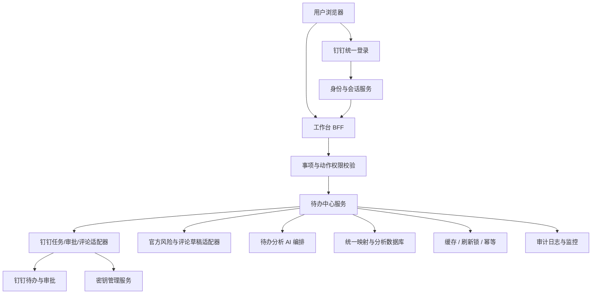
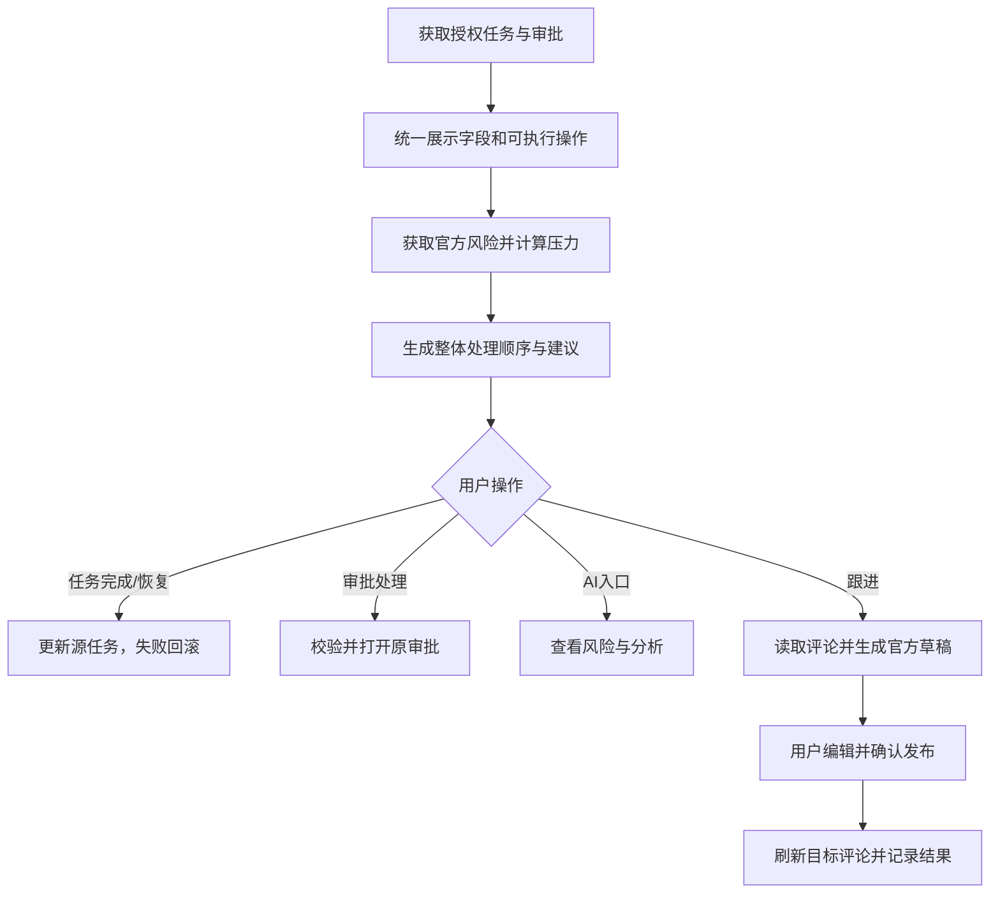
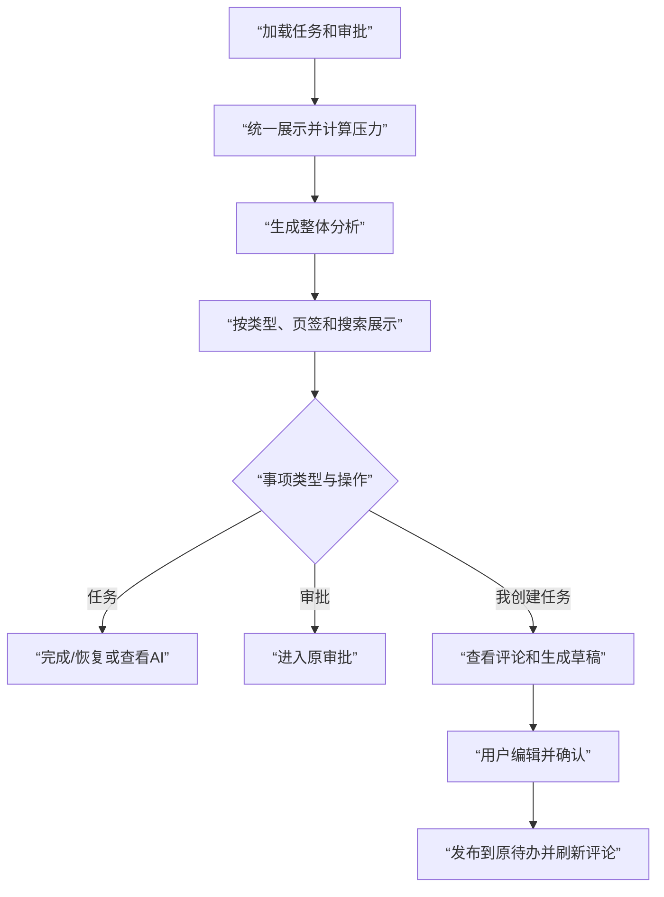

# 20260726-【PRD】AI工作台-待办中心（MVP）-天马智擎项目

_**天马智擎项目**_

**产品需求说明书**

版本信息

本表用于记录本文档的维护过程，请认真填写。

| 版本号 | 时间(必填) | 状态 | 简要描述(必填) | 部门 | 责任产品(必填) | 批准人 |
| --- | --- | --- | --- | --- | --- | --- |
| V1.0 | 2026-07-26 | N | 从工作台总 PRD 拆分待办中心，定义任务审批聚合、压力分析、处理、AI 分析和评论跟进 | AI项目小组 | $\color{#0089FF}{@公输}$ |  |

注：状态可以为N-新建、A-增加、M-更改、D-删除。

# 关于本文档

## 术语

| **词汇名称** | **全局说明** | **归属层** |
| --- | --- | --- |
| 待办事项 | 待办中心统一展示的任务或审批对象 | 业务层 |
| 任务 | 具有执行人、完成状态和可选截止时间的钉钉待办 | 源系统 |
| 审批 | 具有申请人、处理人和审批状态的钉钉审批对象 | 源系统 |
| 待我处理 | 当前用户是未完成任务执行人，或是待审批事项处理人的事项视图 | 视图层 |
| 我创建的 | 创建人为当前用户的事项视图，用于查看完成情况和跟进任务 | 视图层 |
| 压力摘要 | 今日到期、逾期、阻塞和我创建临期等数量及处理建议 | 分析层 |
| 官方风险结果 | 官方技能返回的逾期、临期、阻塞和久未更新结果及依据 | 官方能力层 |
| 跟进评论 | 发布在原钉钉待办下的纯文本评论 | 源系统 |
| 跟进草稿 | 官方技能生成、用户可编辑且确认后才发布的评论文本 | 行动层 |
| 待办分析 | 工作台根据源优先级、状态、时间和官方风险结果生成的整体处理顺序与建议 | AI 编排层 |

## 参考文档

| **编号** | **文档** | **说明及地址** |
| --- | --- | --- |
| 1 | 《20260716-【PRD】AI工作台-工作台（MVP）-天马智擎项目》 | PRD 格式基线 |
| 2 | 《20260726-【PRD】AI工作台-工作台（MVP）-天马智擎项目》 | 拆分前需求来源 |
| 3 | 钉钉待办、审批和待办评论开放能力 | 任务、审批、评论读取与发布接口依据 |
| 4 | AI 工作台前端原型 | 列表、筛选、AI 浮层和跟进评论交互参考 |

## 沟通要求

| **序号** | **部门/角色** | **沟通内容** | **沟通结果** |
| --- | --- | --- | --- |
| 1 | 钉钉应用研发 | 确认任务、审批、完成/恢复、来源跳转、评论读取和评论发布接口 | 待接口评审确认 |
| 2 | 官方技能负责人 | 确认风险结果和评论草稿的输入输出、时效和失败状态 | 待能力联调确认 |
| 3 | AI 平台 | 确认整体待办分析的输入、证据编号、版本和降级 | 待模型评审确认 |
| 4 | 信息安全与 IT | 评审任务人员、审批信息、评论正文、缓存和写操作审计 | 待安全评审确认 |
| 5 | 产品、研发、测试 | 任务与审批动作分别验收，不以文本 @ 代替真实提醒 | 已明确为验收边界 |

# 产品概述

## 产品概述

待办中心汇总当前用户有权访问的任务和审批，通过类型筛选、状态页签、压力摘要和 AI 分析帮助用户安排处理顺序。任务可以完成或恢复，审批进入源系统处理；“我创建的”且允许评论的任务可以查看原评论、生成可编辑跟进草稿并确认发布。

## 产品目标

1.  **统一查看事项**：在一个列表查看任务和审批（衡量方式：类型与状态可组合筛选）
    
2.  **识别处理压力**：展示今日到期、逾期、阻塞和我创建临期（衡量方式：数量规则和证据明确）
    
3.  **明确处理顺序**：基于源字段和官方风险生成整体建议（衡量方式：不覆盖源优先级和官方风险）
    
4.  **快速处理**：任务完成/恢复，审批进入原系统（衡量方式：动作按类型和权限展示）
    
5.  **快速跟进**：在”我创建的”任务查看并发布评论（衡量方式：草稿可编辑，确认后写回源待办）

## 用户角色

### 用户角色描述

| **用户角色** | **职责描述** | **MVP范围** |
| --- | --- | --- |
| 管理层用户 | 查看本人待处理、已处理和创建事项，处理任务审批并跟进执行情况 | ✅ 核心使用角色 |
| 系统管理员 | 配置数据源、权限、官方技能和审计 | 后台配置页面不在本 PRD 范围内 |

### 用户故事地图

| **用户活动** | **用户任务** | **用户故事** |
| --- | --- | --- |
| 查看事项 | 筛选任务和审批 | 我希望按类型和状态快速缩小范围 |
| 判断压力 | 查看统计 | 我希望看到到期、逾期、阻塞和临期数量 |
| 安排处理 | 查看 AI 分析 | 我希望理解风险依据和建议顺序 |
| 处理任务 | 完成或恢复 | 我希望在工作台更新有权限的任务状态 |
| 处理审批 | 打开原审批 | 我希望进入钉钉继续审批操作 |
| 查看我创建的 | 了解完成情况 | 我希望看到执行人、状态、截止和更新时间 |
| 跟进任务 | 查看与发布评论 | 我希望基于可编辑草稿在原待办下评论 |

## 同类产品/竞品调研(选写)

| **产品/能力** | **现有优势** | **本产品定位** |
| --- | --- | --- |
| 钉钉待办 | 任务创建、完成、评论和通知 | 源系统；工作台聚合展示并提供跟进入口 |
| 钉钉审批 | 完整审批表单和流转 | 工作台只展示摘要并跳转处理 |
| AI 任务助手 | 风险识别和催办文案 | 复用官方风险/草稿，增加用户确认和审计 |

# 功能需求

## 全局通用规则

### 系统范围

| **规则项** | **说明** |
| --- | --- |
| 事项类型 | 任务和审批共用列表骨架，但状态、字段和动作分别处理 |
| 类型筛选 | 全部、审批、任务 |
| 状态页签 | 全部、待我处理、我创建的、已处理 |
| 搜索 | 只过滤已加载事项，300ms防抖，不请求源系统 |
| 刷新 | 用户点击后才更新待办中心并重算统计和分析 |
| 评论 | 只用于我创建且接口允许评论的任务；审批评论不进入本流程 |

### 身份认证与授权

| **规则项** | **说明** |
| --- | --- |
| 门户认证 | 用户通过钉钉统一登录；服务端取得稳定身份 |
| 列表权限 | 只返回当前用户有权访问的任务和审批及允许字段 |
| 可执行操作 | 完成、恢复、评论和打开来源以服务端返回并复核的权限为准 |
| 评论权限 | 读取和发布前再次校验任务、创建关系和评论权限 |
| 审批权限 | 打开原审批前校验当前处理人、状态和对象有效性 |
| 权限变更 | 清理受影响缓存、AI 结果、评论和可执行操作 |

### 数据保存边界

| **数据类型** | **保存位置** | **保存与安全约束** |
| --- | --- | --- |
| 任务、审批、状态、源优先级、原评论 | 钉钉源系统 | 源系统为权威数据 |
| 统一展示映射、官方风险引用、待办分析、压力快照、草稿状态和审计 | 工作台业务数据库 | 按用户和事项隔离，不建设第二套任务主库 |
| 列表缓存、评论短期缓存、刷新锁、幂等标识 | 受控缓存服务 | 按用户、权限版本和数据窗口隔离 |
| 搜索词、类型、页签、滚动位置、未提交草稿 | 浏览器会话缓存 | 退出登录后清理，不保存访问令牌 |
| 服务凭证 | 密钥管理服务 | 不进入代码、普通数据库和日志 |

### 加载态/空态/错误态

| **场景** | **状态** | **处理方式** |
| --- | --- | --- |
| 首次加载 | 加载中 | 展示统计与列表骨架屏 |
| 手动刷新 | 刷新中 | 保留列表，刷新按钮旋转并防重复 |
| 当前组合无事项 | 空 | 展示“当前筛选暂无待办” |
| 搜索无结果 | 空 | 展示“未找到匹配待办”和清空搜索 |
| 刷新失败有缓存 | 错误 | 保留旧数据并提示使用上次数据 |
| 评论读取失败 | 错误 | 保留浮层并提供重试 |
| 评论发布失败 | 错误 | 保留最终草稿并提供重试 |
| 源事项无权限/失效 | 阻止 | 阻止操作并刷新目标项 |

### 并发与防重复规则

| **规则项** | **说明** |
| --- | --- |
| 刷新 | 同一用户同时只运行一个待办刷新任务 |
| 完成/恢复 | 同一事项提交中禁用再次操作；失败回滚 |
| 评论发布 | 每次确认生成幂等标识；响应未知不得显示成功 |
| AI分析 | 同一数据版本复用有效结果，旧结果不得覆盖新状态 |
| 部分更新 | 评论成功只刷新目标任务评论，不重新加载整页 |

## 流程图

### 技术架构图



### 业务流程图



## 功能模块清单

| **功能模块** | **功能描述** | **优先级** |
| --- | --- | --- |
| M1-事项聚合与数据接入 | 任务与审批多源读取、服务端会话与对象权限校验、官方技能适配（风险识别/评论草稿）、按用户和权限版本隔离的缓存服务 | P0 |
| M2-列表筛选与渲染 | 类型筛选（全部/审批/任务）与状态页签（全部/待我处理/我创建的/已处理）交叉过滤、本地搜索（标题/人员/来源/状态/300ms防抖）、手动刷新（重读任务+审批+重算统计）、任务行（完成框/优先级/AI/跟进）与审批行（跳转/状态）渲染 | P0 |
| M3-压力摘要与AI分析 | 今日到期/逾期/阻塞/我创建临期数量统计（按当前类型筛选范围）、排序引擎（未处理置前→逾期→临期→阻塞→AI建议→普通）、AI待办分析浮层（来源/证据/风险依据/排序理由） | P0 |
| M4-任务完成与恢复 | 任务完成框操作、服务端再次校验权限、提交中防重复、失败回滚原状态 | P0 |
| M5-审批跳转处理 | 仅限当前用户为审批处理人且待审批时展示入口、校验权限和源有效性后跳转钉钉、不在工作台内模拟通过或拒绝 | P0 |
| M6-评论跟进 | 仅"我创建的"且允许评论的任务展示跟入口、评论读取、官方技能生成可编辑草稿、用户编辑并确认后发布（幂等防重）、发布成功后局部刷新 | P0 |

## 功能详情

### M1-事项聚合与数据接入

#### 功能需求描述

| **EARS 模式** | **需求描述** |
| --- | --- |
| 普遍型 | 系统应汇总当前用户有权访问的任务和审批，通过多源适配器接入并统一字段映射。 |
| 状态驱动型 | 当事项类型（任务/审批）不同时，系统应返回对应字段和可执行操作范围。 |
| 事件驱动型 | 当用户刷新时，系统应重新读取任务和审批并更新缓存。 |
| 不良行为型 | 系统不应返回无权限事项，不应缓存超出授权范围的数据。 |

#### 数据说明（业务实体）

**任务与审批**

| **字段名** | **数据类型** | **长度** | **默认值** | **必需** | **约束说明** |
| --- | --- | --- | --- | --- | --- |
| 事项编号 | 字符 | 64 | 系统生成 | 是 | 工作台稳定标识 |
| 外部事项编号 | 字符 | ≤255 | — | 是 | 用于源系统操作和评论 |
| 事项类型 | 枚举 | — | — | 是 | 任务、审批 |
| 标题 | 字符 | ≤500 | — | 是 | 单行省略，可搜索 |
| 来源类型 | 枚举 | — | — | 是 | 钉钉、消息摘要、会议笔记、AI会话、业务系统 |
| 来源说明 | 字符 | ≤500 | — | 是 | 来源名称或上下文 |
| 创建人 | 人员引用 | — | 空 | 否 | 审批场景可对应申请人 |
| 执行人 | 人员引用数组 | — | 空 | 否 | 任务负责人或参与人 |
| 审批处理人 | 人员引用数组 | — | 空 | 条件必填 | 待审批时必填 |
| 截止时间 | 日期时间 | — | 空 | 否 | 用于今日、临期和逾期 |
| 优先级 | 枚举 | — | 普通 | 是 | 任务：紧急/较高/普通/较低；审批：高/中/普通 |
| 处理状态 | 枚举 | — | — | 是 | 任务未完成/已完成；审批待审批/通过/拒绝/撤销 |
| 最后更新时间 | 时间戳 | — | 空 | 否 | 用于久未更新结果 |
| 官方风险结果 | 对象 | — | 空 | 否 | 风险标签、依据、结果版本 |
| 待办分析 | 对象 | — | 空 | 否 | 处理顺序、理由、建议和证据编号 |
| 可执行操作 | 枚举数组 | — | 空 | 是 | 完成、恢复、评论、打开来源等 |
| 评论数量 | 整数 | — | 空 | 否 | 未知时为空，不显示为0 |

#### 业务规则和约束条件

| **规则项** | **说明** |
| --- | --- |
| 事项类型 | 任务和审批共用列表骨架，但状态、字段和动作分别处理 |
| 类型筛选 | 全部、审批、任务 |
| 状态页签 | 全部、待我处理、我创建的、已处理 |
| 搜索 | 只过滤已加载事项，300ms防抖，不请求源系统 |
| 刷新 | 用户点击后才更新待办中心并重算统计和分析 |
| 评论 | 只用于我创建且接口允许评论的任务；审批评论不进入本流程 |

#### 接口说明

| **接口** | **调用方式** | **请求/响应重点** | **状态** |
| --- | --- | --- | --- |
| GET /api/dws/workbench | 获取任务审批 | 返回统一事项、官方风险、可执行操作和统计输入 | 现有路径，分页、字段版本和错误码待评审 |

所有接口必须先校验服务端会话和对象权限。

### M2-列表筛选与渲染

#### 功能需求描述

| **EARS 模式** | **需求描述** |
| --- | --- |
| 普遍型 | 系统应提供类型筛选（全部/审批/任务）、状态页签（全部/待我处理/我创建的/已处理）、搜索和手动刷新功能，并以列表项展示任务和审批。 |
| 状态驱动型 | 当类型和页签组合不同时，系统应展示对应视图；当事项为审批时，不应展示完成框、任务AI和待办评论。 |
| 事件驱动型 | 当用户筛选、切换页签、搜索或点击刷新时，系统应更新列表或执行数据刷新。 |
| 不良行为型 | 系统不应在类型筛选或页签切换时重新请求数据，不应在刷新时清空已加载列表，不应在审批行展示任务专用操作。 |

#### 业务主流程图及说明



任务和审批共用列表结构，但完成、AI分析和评论能力按类型与权限分别展示。

#### 界面原型

```text
┌待办中心────────[全部/审批/任务][搜索][刷新]┐
│全部  待我处理  我创建的  已处理              │
│今日到期8  逾期2  阻塞1  我创建临期3          │
│□ [任务] 标题 [较高] 负责人·来源 [AI][跟进] 状态│
│↗ [审批] 标题 [高]   申请人·来源          待审批│
└─────────────────────────────────────────────┘
```

| **动作** | **显示** | **类型** | **描述** |
| --- | --- | --- | --- |
| 【待办中心】首次加载 | 压力摘要、筛选、页签和列表 | 看板 | · 默认类型全部、状态全部<br>· 任务和审批共用骨架 |
| 【类型筛选】选择 | 更新压力摘要和列表 | 分段控件 | · 全部/审批/任务<br>· 本地过滤，不重新请求<br>· 保留页签和搜索词 |
| 【状态页签】点击 | 切换四个状态视图 | 页签 | · 可与类型和搜索组合<br>· 不改变压力统计口径<br>· 保留各页签滚动位置 |
| 【搜索框】输入/清空 | 过滤或恢复当前组合 | 输入框 | · 搜索标题、人员、来源和状态<br>· 300ms防抖<br>· 无结果提供清空 |
| 【刷新按钮】点击 | 保留列表并刷新 | 图标按钮 | · 只刷新待办中心<br>· 重算压力、官方风险和处理顺序<br>· 失败保留旧数据 |
| 【筛选/搜索无结果】 | 无匹配说明和清空入口 | 空态 | · 清空搜索或重置筛选恢复列表 |
| 【任务行】默认 | 完成框、类型、标题、源优先级、人员/来源、AI、可选跟进、时间和状态 | 列表项 | · 标签贴标题<br>· 右侧时间在上，状态/跟进在下<br>· 只展示允许动作 |
| 【审批行】默认 | 原审批入口、类型、标题、源优先级、申请人/来源、时间和状态 | 列表项 | · 不显示完成框、任务AI和待办评论<br>· 保留钉钉处理入口 |

#### 业务规则和约束条件

**视图规则**

| **规则项** | **说明** |
| --- | --- |
| 全部 | 当前类型筛选下的所有有权事项 |
| 待我处理 | 任务执行人包含当前用户且未完成，或审批处理人包含当前用户且待审批 |
| 我创建的 | 创建人为当前用户，不因执行人变化移出 |
| 已处理 | 已完成任务，或通过、拒绝、撤销的审批 |
| 页签交叉 | 同一事项可同时符合待我处理和我创建的，在不同视图引用同一编号 |

### M3-压力摘要与AI分析

#### 功能需求描述

| **EARS 模式** | **需求描述** |
| --- | --- |
| 普遍型 | 系统应展示今日到期、逾期、阻塞和我创建临期数量，并根据源优先级、官方风险生成整体处理顺序与建议。 |
| 状态驱动型 | 当类型筛选范围变化时，压力摘要统计口径随之变化。排序按未处理置前、逾期→临期→阻塞→AI建议→普通依次排列。 |
| 事件驱动型 | 当用户Hover或点击AI入口时，系统应展示风险预览或固定分析浮层。 |
| 不良行为型 | 系统不应覆盖源优先级和官方风险标签，不应重新判断逾期、临期、阻塞或久未更新。 |

#### 数据说明（业务实体）

**压力摘要**

| **字段名** | **数据类型** | **长度** | **默认值** | **必需** | **约束说明** |
| --- | --- | --- | --- | --- | --- |
| 类型范围 | 枚举 | — | 全部 | 是 | 全部、审批、任务 |
| 今日到期数量 | 整数 | — | 0 | 是 | 未完成且截止日期为今天 |
| 逾期数量 | 整数 | — | 0 | 是 | 采用官方风险结果 |
| 阻塞数量 | 整数 | — | 0 | 是 | 采用官方风险结果 |
| 我创建临期数量 | 整数 | — | 0 | 是 | 当前用户创建且官方标记临期 |
| 压力建议 | 字符 | ≤500 | 空 | 否 | 整体处理建议，不替代源状态 |
| 证据事项编号 | 字符数组 | — | 空 | 否 | 只引用输入稳定事项编号 |

#### 业务规则和约束条件

**统计与分析规则**

| **规则项** | **说明** |
| --- | --- |
| 类型统计 | 类型筛选改变压力摘要范围；状态页签和搜索只过滤列表，不改变统计 |
| 官方风险 | 逾期、临期、阻塞和久未更新直接采用官方结果，工作台不重新判断 |
| 默认排序 | 未处理事项置前；未处理事项内部依次为逾期、临期、阻塞、AI建议、普通；已处理事项置后；同层按截止时间、更新时间和事项编号 |
| 源优先级 | 列表直接展示源接口值；AI不覆盖优先级、状态和官方风险 |
| 待办分析 | 只根据源优先级、处理状态、截止时间和官方风险生成整体顺序与建议 |

#### 界面原型

| **动作** | **显示** | **类型** | **描述** |
| --- | --- | --- | --- |
| 【压力摘要】默认 | 今日到期、逾期、阻塞、我创建临期 | 摘要区 | · 按当前类型统计<br>· 页签和搜索不改变统计<br>· 未知风险不计入 |
| 【任务AI入口】Hover/聚焦 | 风险、排序理由和建议预览 | 详情浮层 | · 使用官方风险和内置分析<br>· 不修改源字段 |
| 【任务AI入口】点击 | 固定分析浮层 | 详情浮层 | · 展示来源、证据、风险依据和排序理由<br>· 点击空白或关闭退出 |

### M4-任务完成与恢复

#### 功能需求描述

| **EARS 模式** | **需求描述** |
| --- | --- |
| 普遍型 | 系统应在任务行提供完成复选框，允许用户完成或恢复任务。 |
| 事件驱动型 | 当用户点击完成框时，系统应再次校验权限并提交。失败时回滚并提示。 |
| 不良行为型 | 系统不应把审批当任务完成，不应在提交中允许重复操作。 |

#### 界面原型

| **动作** | **显示** | **类型** | **描述** |
| --- | --- | --- | --- |
| 【任务完成框】点击 | 提交中并临时更新 | 写操作 | · 再次校验权限<br>· 防重复<br>· 成功更新源状态和页签归属 |
| 【完成/恢复】失败 | 回滚原状态并提示 | 错误态 | · 不保留错误乐观状态<br>· 可重新操作 |

#### 业务规则和约束条件

| **规则项** | **说明** |
| --- | --- |
| 任务完成 | 只有接口允许时展示；失败回滚，成功后更新对应视图 |

#### 接口说明

| **接口** | **调用方式** | **请求/响应重点** | **状态** |
| --- | --- | --- | --- |
| 任务完成/恢复接口 | 更新任务状态 | 请求外部事项编号、目标状态和幂等标识 | 路径待评审，本版不硬编码 |

写操作必须使用幂等标识；响应未知不得显示成功。

### M5-审批跳转处理

#### 功能需求描述

| **EARS 模式** | **需求描述** |
| --- | --- |
| 普遍型 | 系统应在审批行提供跳转入口，用户点击后进入钉钉原审批处理。 |
| 状态驱动型 | 当前用户为审批处理人且待审批时展示跳转入口。 |
| 事件驱动型 | 当用户点击审批行或原审批入口时，系统应校验权限和源有效性后跳转。 |
| 不良行为型 | 系统不应在工作台内模拟审批通过或拒绝。 |

#### 界面原型

| **动作** | **显示** | **类型** | **描述** |
| --- | --- | --- | --- |
| 【原任务/原审批】点击 | 打开源事项 | 跳转 | · 校验权限和源状态<br>· 失效时阻止并刷新目标项 |
| 【打开来源】点击 | 打开原任务或业务来源 | 跳转 | · 按来源类型显示文案<br>· 校验权限和有效性 |

#### 业务规则和约束条件

| **规则项** | **说明** |
| --- | --- |
| 审批处理 | 只跳转源审批，不在工作台模拟通过或拒绝 |

#### 接口说明

| **接口** | **调用方式** | **请求/响应重点** | **状态** |
| --- | --- | --- | --- |
| 审批访问接口 | 打开原审批 | 返回允许、阻止或短时来源地址 | 路径待评审，本版不硬编码 |

### M6-评论跟进

#### 功能需求描述

| **EARS 模式** | **需求描述** |
| --- | --- |
| 普遍型 | 系统应在”我创建的”且允许评论的任务上提供跟进入口，支持读取已有评论、生成AI草稿、编辑并确认发布评论。 |
| 状态驱动型 | 当评论读取失败、发布失败或发布成功时，系统应分别展示可重试、保留草稿或清空草稿并局部刷新。 |
| 事件驱动型 | 当用户点击跟进、生成草稿、编辑草稿或点击发布时，系统应打开浮层、生成文本、更新内容或执行写操作。 |
| 不良行为型 | 系统不应在非我创建的任务展示跟进入口，不应未经确认发布评论，不应将文本@描述为真实提醒。 |

#### 数据说明（业务实体）

**评论与跟进草稿**

| **字段名** | **数据类型** | **长度** | **默认值** | **必需** | **约束说明** |
| --- | --- | --- | --- | --- | --- |
| 评论编号 | 字符 | ≤255 | — | 已发布时必填 | 原评论唯一标识 |
| 事项编号 | 字符 | 64 | — | 是 | 仅关联任务 |
| 评论人 | 人员引用 | — | 空 | 已发布时必填 | 按权限展示 |
| 评论内容 | 文本 | ≤5000 | 空 | 是 | 纯文本；@姓名不代表真实提醒 |
| 评论时间 | 时间戳 | — | 空 | 已发布时必填 | 源系统时间 |
| 草稿编号 | 字符 | 64 | 系统生成 | 草稿时必填 | 当前草稿标识 |
| 草稿内容 | 文本 | ≤5000 | 官方技能生成 | 否 | 用户可编辑，确认后发布 |
| 幂等标识 | 字符 | 64 | 发布时生成 | 发布时必填 | 同一标识只允许成功一次 |
| 发布状态 | 枚举 | — | 待确认 | 是 | 待确认、发布中、成功、失败 |

#### 业务规则和约束条件

| **规则项** | **说明** |
| --- | --- |
| 评论范围 | 只用于我创建且允许评论的任务；审批评论不进入本流程 |
| 评论文本 | 纯文本；不承诺@姓名产生系统通知 |
| 评论确认 | 官方草稿可编辑，用户确认最终文本后才发布 |
| 评论刷新 | 发布成功后只刷新目标任务评论和数量 |

#### 接口说明

| **接口** | **调用方式** | **请求/响应重点** | **状态** |
| --- | --- | --- | --- |
| GET /api/dws/todos/comments?taskId={外部事项编号} | 读取评论 | 返回评论人、内容、时间和评论编号 | 现有路径，分页和错误码待评审 |
| POST /api/dws/todos/comments | 发布评论 | 请求外部事项编号、最终文本和幂等标识 | 现有路径，幂等响应和错误码待评审 |

写操作必须使用幂等标识；响应未知不得显示成功。

#### 界面原型

| **动作** | **显示** | **类型** | **描述** |
| --- | --- | --- | --- |
| 【跟进】显示 | 图标＋跟进 | 按钮 | · 仅我创建且允许评论的任务<br>· 评论数量未知时不显示0 |
| 【跟进】点击 | 打开评论浮层并读取评论 | 评论浮层 | · 展示评论人、内容和时间<br>· 读取失败可重试 |
| 【生成跟进草稿】点击 | 官方技能生成可编辑文本 | 草稿动作 | · 基于标题、状态、执行人、截止和已有评论<br>· 不自动发布<br>· 不承诺文本@产生提醒 |
| 【跟进草稿】编辑 | 更新待发布文本 | 文本输入区 | · 空内容禁用发布 |
| 【发布评论】点击 | 发布中状态 | 写操作 | · 再次校验评论权限<br>· 幂等防重复<br>· 提交最终文本 |
| 【发布评论】成功 | 新增评论并更新数量 | 成功态 | · 清空草稿<br>· 只刷新目标评论 |
| 【发布评论】失败 | 保留草稿并提示 | 错误态 | · 不显示成功评论<br>· 可编辑后重试 |

#### 补充说明

1. 整体处理顺序和建议使用附录”待办分析提示词”。
2. 逾期、临期、阻塞、久未更新和跟进评论草稿使用官方技能，本 PRD 不定义其提示词。
3. 评论接口只支持文本时，不将文本@描述为真实提醒。
4. 本 PRD 不定义审批表单和待办后台配置。

# 非功能需求

## 性能要求

| **指标** | **目标值** | **说明** |
| --- | --- | --- |
| 待办首屏 | ≤2秒（P95） | 基础列表和统计优先，AI可异步补充 |
| 本地筛选搜索 | ≤100ms | 300ms防抖结束后 |
| 评论加载 | ≤1.5秒（P95） | 首批评论 |
| 评论发布 | ≤2秒（P95） | 响应未知不显示成功 |
| 列表滚动 | 200项内无明显卡顿 | 分批渲染 |

## 安全要求

| **维度** | **要求** |
| --- | --- |
| 对象权限 | 列表、来源、完成、审批、评论分别校验权限 |
| 数据最小化 | AI只接收排序或草稿所需的最小字段 |
| 评论保护 | 无权限评论不下发；日志不记录完整评论正文 |
| 缓存隔离 | 按用户、权限版本和数据窗口隔离 |
| 操作审计 | 记录完成/恢复、来源访问和评论的最终结果 |
| 幂等 | 所有写操作使用服务端幂等标识 |

## 兼容性要求

| **维度** | **要求** |
| --- | --- |
| 浏览器 | Chrome、Edge最近两个稳定版本 |
| 分辨率 | 最小1280×720，推荐1920×1080 |
| 无Hover设备 | 点击AI入口固定浮层 |
| 可访问性 | 筛选、页签、完成框、浮层和评论弹窗支持键盘及可见焦点 |

# 迭代计划与 Non-goals

## MVP（本期）迭代计划

| **序号** | **模块** | **开发内容** | **依赖/并行** | **备注** |
| --- | --- | --- | --- | --- |
| 1 | M1-事项聚合与数据接入 | 任务/审批多源读取、权限校验引擎、官方技能适配、缓存服务 | — | 前置条件 |
| 2 | M2-列表筛选与渲染 | 类型筛选、状态页签、搜索/刷新、任务行/审批行渲染 | 依赖1 | P0 |
| 3 | M3-压力摘要与AI分析 | 压力统计、排序引擎、AI待办分析、AI浮层 | 依赖1、官方技能、AI平台 | P0 |
| 4 | M4-任务完成与恢复 | 完成/恢复的权限校验、提交、失败回滚 | 依赖1 | P0 |
| 5 | M5-审批跳转处理 | 权限校验、源审批跳转、失败处理 | 依赖1 | P0 |
| 6 | M6-评论跟进 | 评论读取、官方草稿、编辑、发布和局部刷新 | 依赖1、官方技能 | P0 |

## Non-goals（本期明确不做）

| **序号** | **项目** | **说明** | **计划迭代** |
| --- | --- | --- | --- |
| 1 | 工作台内审批 | 不在工作台通过、拒绝或填写审批表单 | 不规划 |
| 2 | 审批评论 | 不混入待办评论流程 | 后续评估 |
| 3 | 自动催办 | 草稿必须用户确认，不自动发布 | 不规划自动执行 |
| 4 | 真实@提醒 | 纯文本评论不承诺@通知 | 取决于接口能力 |
| 5 | 重建任务系统 | 源待办仍由钉钉管理 | 不规划 |
| 6 | 完整移动端 | MVP以桌面端为主 | 后续迭代 |

# 附录

## A. 待办分析提示词

版本：`todo-analysis-v1.0`

```text
你是管理层工作台的待办整体分析器。

输入：任务或审批的事项编号、标题、类型、源优先级、处理状态、截止时间，以及官方技能已经给出的风险标签和风险依据；每条风险结果与对应事项编号绑定。

任务：
1. 基于源优先级、处理状态、截止时间和官方风险结果，生成整体处理顺序。
2. 给出处理建议，但不修改源优先级、处理状态和官方风险标签。
3. 不重新判断逾期、临期、阻塞或久未更新。
4. 不得把审批当任务建议“完成”，不得生成或发布评论草稿。
5. 信息不足时降低建议确定性，并列出缺失字段。

输出JSON：
{
  "ordered_item_ids":["事项编号"],
  "ordering_reasons":[{"item_id":"事项编号","reason":"排序依据"}],
  "overall_suggestion":"不超过120字",
  "evidence_item_ids":["事项编号"],
  "missing_fields":["缺失字段"]
}
```

## B. 官方技能边界

| **官方技能** | **工作台输入边界** | **工作台展示/操作边界** | **是否定义提示词** |
| --- | --- | --- | --- |
| 待办风险识别 | 当前用户有权事项及官方要求字段 | 直接展示风险标签和依据，工作台不重新判断 | 否 |
| 待办跟进评论草稿 | 我创建且允许评论的任务、必要状态和已有评论 | 只形成可编辑草稿，用户确认后发布 | 否 |

## C. 提示文案

| **场景** | **文案** |
| --- | --- |
| 刷新失败 | 刷新失败，当前为上次数据 |
| 当前无事项 | 当前筛选暂无待办 |
| 搜索无结果 | 未找到匹配待办 |
| 完成失败 | 操作失败，任务状态已恢复 |
| 评论读取失败 | 评论加载失败，请重试 |
| 评论发布失败 | 发布失败，草稿已保留 |
| 评论发布成功 | 评论已发布 |
| 来源无权限 | 暂无该事项的查看权限 |
