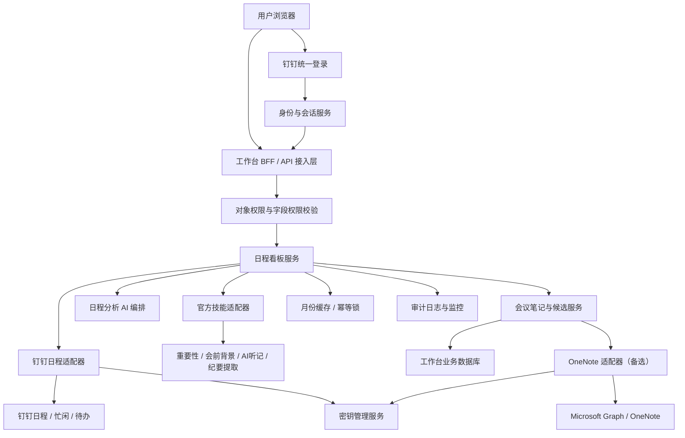
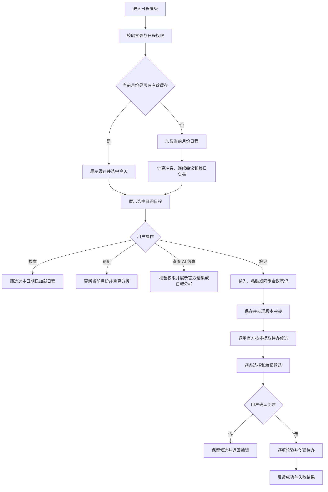
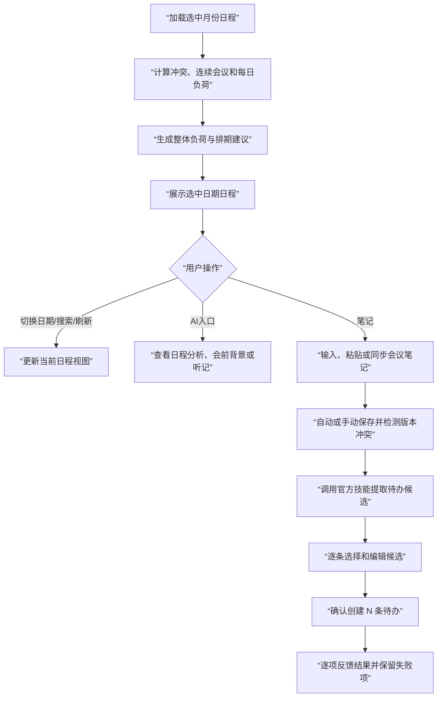

# 20260726-【PRD】AI工作台-日程看板（MVP）-天马智擎项目

_**天马智擎项目**_

**产品需求说明书**

版本信息

本表用于记录本文档的维护过程，请认真填写。

| 版本号 | 时间(必填) | 状态 | 简要描述(必填) | 部门 | 责任产品(必填) | 批准人 |
| --- | --- | --- | --- | --- | --- | --- |
| V1.0 | 2026-07-26 | N | 从工作台总 PRD 拆分日程看板，定义日程浏览、负荷分析、官方 AI 能力、会议笔记和会议纪要生成待办 | AI项目小组 | $\color{#0089FF}{@公输}$ |  |

注：状态可以为N-新建、A-增加、M-更改、D-删除。

# 关于本文档

## 术语

| **词汇名称** | **全局说明** | **归属层** |
| --- | --- | --- |
| 日程看板 | 聚合展示当前用户有权访问的日程、负荷、分析结果和会议笔记入口的工作台卡片 | 展示层 |
| 日程负荷 | 根据选中日期的会议场次、总时长和连续会议情况确定的轻松、适中或偏满状态 | 规则层 |
| 时间冲突 | 两个未取消日程的时间区间存在重叠 | 规则层 |
| 连续会议 | 相邻会议间隔不超过 15 分钟，且连续发生两场以上 | 规则层 |
| 日程分析 | 工作台根据确定性负荷数据生成的整体负荷说明和排期建议，不判断单场会议重要性 | AI 编排层 |
| 官方技能 | 钉钉或项目既有能力，包括会议重要性与可释放建议、会前背景、AI 听记和会议纪要提取待办 | 外部能力层 |
| 会议笔记 | 与当前用户和单场日程绑定的可编辑笔记，支持保存、复制、粘贴和提取待办候选 | 业务层 |
| 待办候选 | 从会议笔记中提取、尚未创建的结构化行动项；必须经用户选择和确认 | 业务层 |
| 笔记版本冲突 | 用户保存笔记时，服务端版本已高于本地编辑所基于的版本 | 数据一致性 |
| OneNote 同步 | 用户主动授权、选择 OneNote 页面并将内容追加到会议笔记的备选能力 | 外部能力层 |

## 参考文档

| **编号** | **文档** | **说明及地址** |
| --- | --- | --- |
| 1 | 《20260716-【PRD】AI工作台-工作台（MVP）-天马智擎项目》 | PRD 格式基线 |
| 2 | 《20260726-【PRD】AI工作台-工作台（MVP）-天马智擎项目》 | 日程看板拆分前的需求来源 |
| 3 | AI 工作台前端原型 | 日程列表、AI 浮层、会议笔记和待办候选交互参考 |
| 4 | 钉钉开放能力及项目官方技能说明 | 日程、会前背景、AI 听记和待办创建能力边界 |

## 沟通要求

| **序号** | **部门/角色** | **沟通内容** | **沟通结果** |
| --- | --- | --- | --- |
| 1 | 钉钉应用研发 | 确认日程按月读取、详情跳转、忙闲、创建日程和创建待办的字段、权限、限流与错误码 | 待接口评审确认 |
| 2 | 官方技能负责人 | 确认会议重要性与可释放建议、会前背景、AI 听记、会议纪要提取待办的输入输出和失败状态 | 待能力联调确认 |
| 3 | 信息安全与 IT | 评审日程缓存、会议笔记、参会人信息、OneNote 授权和操作审计 | 待安全评审确认 |
| 4 | Microsoft 365 管理员 | 确认 OneNote 个人/组织账号授权范围及管理员同意要求 | 备选能力，MVP 不作为上线前置 |
| 5 | 产品、研发、测试 | 未完成真实接口联调的能力仅验收前端交互，不声明端到端完成 | 已明确为验收边界 |

# 产品概述

## 产品概述

日程看板面向管理层用户，将本人有权访问的日程按日期集中展示，提供会议负荷、时间冲突、连续会议和整体排期分析，并在单场会议上衔接会前背景、AI 听记和会议笔记。用户可以手动记录或粘贴会议纪要，审核 AI 提取的多条待办候选后一次创建。

日程看板负责组织、解释和衔接，不替代钉钉日历、AI 听记、OneNote 或待办系统。

## 产品目标

1.  **快速掌握日程**：一个看板查看选中日期的会议、负荷、冲突和连续会议（衡量方式：用户无需进入日历即可完成当日概览）
    
2.  **提前准备会议**：未开始会议可查看官方会前背景和重要性结果（衡量方式：支持从日程行进入对应结果）
    
3.  **沉淀会议内容**：会议笔记支持输入、粘贴、复制、保存和恢复（衡量方式：笔记与用户、日程稳定绑定）
    
4.  **形成行动闭环**：一份纪要可提取多条待办，逐条编辑后批量确认（衡量方式：未经确认不创建，逐项反馈结果）
    
5.  **保持数据稳定**：搜索不重新取数，手动刷新只更新日程看板（衡量方式：刷新失败保留上次成功数据）

## 用户角色

### 用户角色描述

| **用户角色** | **职责描述** | **MVP范围** |
| --- | --- | --- |
| 管理层用户 | 查看本人有权访问的日程，理解会议负荷与会议信息，记录笔记并确认生成待办 | ✅ 核心使用角色 |
| 系统管理员 | 配置日程数据源、官方技能、权限和外部应用授权 | 后台配置页面不在本 PRD 范围内 |

### 用户故事地图

| **用户活动** | **用户任务** | **用户故事** |
| --- | --- | --- |
| 查看日程 | 选择日期 | 作为管理层用户，我希望通过月历选择日期，以便查看目标日期的日程 |
| 查看日程 | 搜索日程 | 作为管理层用户，我希望搜索已加载的日程，以便快速找到会议 |
| 理解负荷 | 查看场次与时长 | 作为管理层用户，我希望看到轻松、适中或偏满及其依据，以便安排精力 |
| 理解负荷 | 识别冲突与连续会议 | 作为管理层用户，我希望快速发现冲突和连续会议，以便调整排期 |
| 准备会议 | 查看会前背景 | 作为管理层用户，我希望在会前查看官方背景信息，以便减少准备时间 |
| 回顾会议 | 查看 AI 听记 | 作为管理层用户，我希望在会后进入完整听记，以便核对会议内容 |
| 记录会议 | 编辑会议笔记 | 作为管理层用户，我希望输入、粘贴、复制并保存会议纪要，以便持续沉淀 |
| 记录会议 | 同步 OneNote | 作为管理层用户，我希望主动选择 OneNote 页面并追加到笔记，以便复用已有纪要 |
| 形成待办 | 提取候选 | 作为管理层用户，我希望从纪要中提取多条待办候选，以便减少手工整理 |
| 形成待办 | 审核并创建 | 作为管理层用户，我希望逐条选择和修改候选，再一次确认创建，以避免错误任务 |

## 同类产品/竞品调研（选写）

| **产品/能力** | **现有优势** | **本产品定位** |
| --- | --- | --- |
| 钉钉日历 | 日程创建、参会、忙闲和源数据管理 | 不替代日历，只提供管理层聚合视图和行动衔接 |
| 钉钉 AI 听记及官方技能 | 会前背景、会议记录、重要性或行动项识别 | 直接复用官方结果，不重复定义内部提示词 |
| Microsoft OneNote | 自由笔记与跨设备同步 | 作为用户主动选择的备选输入，不作为 MVP 前置 |

# 功能需求

## 全局通用规则

### 系统范围

| **规则项** | **说明** |
| --- | --- |
| 本期范围 | 日程浏览、月份与日期切换、搜索、刷新、负荷分析、AI 信息入口、会议笔记、OneNote 备选同步、待办候选审核与批量创建 |
| 权威数据 | 日程、AI 听记和已创建待办以源系统为准；工作台不建设第二套日历或待办主库 |
| 搜索 | 只筛选当前已加载月份中选中日期的日程，输入停止 300ms 后生效，不请求源系统 |
| 刷新 | 只有点击日程看板刷新按钮才更新当前选中日期所在月份 |
| 官方能力 | 会议重要性、可释放建议、会前背景、AI 听记和会议纪要提取待办直接使用官方技能结果 |
| 用户确认 | 日程草稿和待办候选均须用户确认后才能写入源系统 |

### 身份认证与授权

| **规则项** | **说明** |
| --- | --- |
| 门户认证 | 用户通过钉钉统一登录；授权码由服务端换取身份，前端不得自行声明用户编号 |
| 登录会话 | 服务端创建登录会话，浏览器只保存安全会话 Cookie |
| 列表权限 | 日程列表只返回当前用户有权访问的日程及允许展示的字段 |
| 详情权限 | 查看会前背景、AI 听记、参会人、原日程和 OneNote 页面时分别执行对象级权限校验 |
| 写操作权限 | 保存笔记、创建日程和创建待办时再次校验当前用户及目标对象权限 |
| 权限变更 | 权限版本变化后立即清理对应月份缓存、AI 结果和来源入口 |
| 前端边界 | 前端传入的用户编号、参会人、可执行操作和对象状态不作为最终授权依据 |

### 数据保存边界

| **数据类型** | **保存位置** | **保存与安全约束** |
| --- | --- | --- |
| 日程、参会关系、AI 听记、已创建待办 | 钉钉及对应源系统 | 源系统为权威数据，工作台只在授权范围内读取或发起操作 |
| 会议笔记、笔记版本、待办候选、创建结果、操作审计 | 工作台业务数据库 | 按用户编号和日程编号隔离；待办候选保留所属笔记版本 |
| 月份日程缓存、官方技能短期结果、刷新锁、幂等标识 | 受控缓存服务 | 设置有效期，按用户、权限版本和月份隔离 |
| 选中日期、月历展开状态、搜索词、弹窗状态 | 浏览器会话缓存 | 退出登录后清除，不保存访问令牌和 OneNote 凭证 |
| OneNote 授权令牌、第三方密钥 | 密钥管理服务 | 加密保存，不进入代码、普通数据库和日志 |

### 加载态/空态/错误态

| **场景** | **状态** | **处理方式** |
| --- | --- | --- |
| 首次加载月份 | 加载中 | 展示日程列表骨架屏 |
| 手动刷新 | 刷新中 | 保留已有日程，刷新按钮旋转并禁止重复点击 |
| 选中日期无日程 | 空 | 展示“今天暂无日程”或“该日期暂无日程” |
| 搜索无结果 | 空 | 展示“未找到匹配日程”和“清空搜索” |
| 月份加载失败且有缓存 | 错误 | 保留旧数据并提示“刷新失败，当前为上次数据” |
| 月份加载失败且无缓存 | 错误 | 展示错误说明和“重新加载” |
| 官方技能无结果 | 空 | 不生成内容，展示对应能力暂无结果 |
| 笔记保存失败 | 错误 | 保留本地内容和版本，提供重新保存 |
| 批量创建部分失败 | 部分成功 | 成功项不可重复提交，失败项保留并支持重试 |

### 并发与防重复规则

| **规则项** | **说明** |
| --- | --- |
| 搜索输入 | 300ms 防抖，连续输入以最后一次搜索词为准 |
| 月份请求 | 同一用户同一月份同时只允许一个有效加载请求 |
| 手动刷新 | 刷新期间禁止再次刷新；晚返回的旧请求不得覆盖新结果 |
| 笔记保存 | 停止输入 800ms 自动保存；手动保存可立即触发；按版本号执行乐观锁 |
| AI 提取 | 同一笔记版本同时只允许一个提取请求 |
| 待办创建 | 每个候选使用独立幂等标识，同一标识只允许成功一次 |

## 流程图

### 技术架构图

所有架构与业务流程图统一采用自上而下方向。



### 业务流程图



## 功能模块清单

| **功能模块** | **功能描述** | **优先级** |
| --- | --- | --- |
| M1-日程数据接入与权限 | 月份日程读取与缓存（会话最多缓存最近3个月）、对象级权限校验（日程/参会人/AI结果/笔记）、官方技能适配（重要性与可释放/会前背景/AI听记/纪要提取） | P0 |
| M2-负荷分析与日程分析 | 确定性规则计算（场次/总时长/重叠冲突/连续会议）、负荷等级判定（轻松/适中/偏满）、AI负荷说明与排期建议 | P0 |
| M3-日程列表、月历与搜索 | 月历组件（展开/收起/月份切换/日程日期小圆点标记）、选中日期日程行展示（时间/标题/状态/AI浮层/笔记入口）、本地搜索（标题/地点/组织者/参会人/300ms防抖）、手动刷新（重读月份+重算负荷）、空态与加载态 | P0 |
| M4-会议笔记 | 与单场日程绑定的笔记编辑器、自动保存（800ms停歇）/手动保存、版本冲突检测（乐观锁）、粘贴/复制、OneNote同步（P1备选） | P0 |
| M5-待办候选提取与创建 | 调用官方技能从会议笔记提取待办候选、逐条审核编辑与选择、批量创建（独立幂等/逐项反馈/部分失败重试）。功能详情参见《会议纪要生成待办》PRD | P0 |

## 功能详情

### M1-日程数据接入与权限

#### 功能需求描述

| **EARS 模式** | **需求描述** |
| --- | --- |
| 普遍型 | 系统应读取当前用户有权访问的月份日程，通过适配器接入钉钉日历数据并进行缓存管理。 |
| 状态驱动型 | 当月份已缓存时从缓存读取；未缓存时加载目标自然月；权限版本变更时清理对应缓存。 |
| 事件驱动型 | 当刷新月份时，系统应清除缓存并重新读取。 |
| 不良行为型 | 系统不应返回无权限的日程和参会人，不应缓存超出授权窗口的数据。 |

#### 数据说明（业务实体）

**日程**

| **字段名** | **数据类型** | **长度** | **默认值** | **必需** | **约束说明** |
| --- | --- | --- | --- | --- | --- |
| 日程编号 | 字符 | 64 | — | 是 | 源系统稳定标识；关联分析、笔记和听记 |
| 日程日期 | 日期 | — | — | 是 | 按当前用户时区计算 |
| 开始时间 | 日期时间 | — | — | 是 | 必须早于结束时间 |
| 结束时间 | 日期时间 | — | — | 是 | 用于冲突和负荷计算 |
| 日程标题 | 字符 | ≤2048 | — | 是 | 单行省略，可搜索 |
| 地点 | 字符 | ≤200 | 空 | 否 | 会议室或线上会议说明 |
| 组织者 | 人员引用 | — | — | 是 | 只展示当前用户有权查看的字段 |
| 参会人 | 人员引用数组 | — | 空 | 否 | 用于人数、搜索和官方技能；不得扩大权限 |
| 日程状态 | 枚举 | — | — | 是 | 未开始、即将开始、进行中、已结束、已取消 |
| 源日程地址 | 字符 | ≤2048 | 空 | 否 | 服务端生成短时或受控跳转地址 |
| 数据版本 | 字符 | ≤64 | — | 是 | 用于刷新时识别更新 |

**官方技能结果**

| **字段名** | **数据类型** | **长度** | **默认值** | **必需** | **约束说明** |
| --- | --- | --- | --- | --- | --- |
| 结果编号 | 字符 | 64 | 系统生成 | 是 | 单次官方技能结果标识 |
| 日程编号 | 字符 | 64 | — | 是 | 与输入日程绑定 |
| 技能类型 | 枚举 | — | — | 是 | 重要性与可释放、会前背景、AI 听记、纪要提取待办 |
| 结果状态 | 枚举 | — | 处理中 | 是 | 处理中、成功、无结果、失败、无权限 |
| 结果内容 | 对象 | — | 空 | 条件必填 | 成功时必填；遵循官方接口结构 |
| 来源地址 | 字符 | ≤2048 | 空 | 否 | 查看日程详情或完整听记使用 |
| 生成时间 | 时间戳 | — | 当前时间 | 是 | 用于判断结果时效 |

#### 业务规则和约束条件

| **规则项** | **说明** |
| --- | --- |
| 首次月份 | 加载今天所在自然月并默认选中今天 |
| 月份缓存 | 切换到未缓存月份时加载目标自然月；会话最多缓存最近访问的 3 个月 |
| 旧数据保护 | 刷新失败时保留上次成功数据；旧请求结果不得覆盖更新后的月份数据 |

#### 接口说明

| **接口** | **调用方式** | **请求/响应重点** | **状态** |
| --- | --- | --- | --- |
| GET /api/dws/workbench | 读取日程 | 请求月份和权限上下文；返回当前用户日程及已接入官方结果 | 现有路径，月份参数、分页、字段版本和错误码待评审 |

所有接口先校验服务端会话，再校验对象权限。

### M2-负荷分析与日程分析

#### 功能需求描述

| **EARS 模式** | **需求描述** |
| --- | --- |
| 普遍型 | 系统应根据确定性规则计算选中日期的会议场次、总时长、时间冲突、连续会议和负荷等级，并生成整体负荷说明与排期建议。 |
| 状态驱动型 | 当负荷等级不同时（轻松/适中/偏满），系统应展示对应摘要。 |
| 不良行为型 | 系统不应由 AI 二次改写负荷等级、官方技能结果和已确定的分析规则。 |

#### 数据说明（业务实体）

**每日负荷与日程分析**

| **字段名** | **数据类型** | **长度** | **默认值** | **必需** | **约束说明** |
| --- | --- | --- | --- | --- | --- |
| 用户编号 | 字符 | 64 | 当前用户 | 是 | 不得由前端自行指定 |
| 统计日期 | 日期 | — | 选中日期 | 是 | 与用户编号组成唯一统计范围 |
| 日程数量 | 整数 | — | 0 | 是 | 只统计未取消日程 |
| 日程总时长 | 整数 | — | 0 | 是 | 单位为分钟；重叠时段仍按各日程时长累计 |
| 空闲时段 | 时间区间数组 | — | 空 | 是 | 在用户工作时段内扣除未取消日程后得到；作为排期建议输入 |
| 时间冲突组 | 日程编号数组的数组 | — | 空 | 是 | 每组至少包含两个日程编号 |
| 连续会议组 | 日程编号数组的数组 | — | 空 | 是 | 按开始时间排序 |
| 负荷等级 | 枚举 | — | 轻松 | 是 | 轻松、适中、偏满 |
| 负荷说明 | 字符 | ≤500 | 空 | 否 | 说明场次、时长、冲突和连续会议 |
| 排期建议 | 字符数组 | — | 空 | 否 | 由内置日程分析生成；无建议时为空 |
| 证据日程编号 | 字符数组 | — | 空 | 否 | 仅引用输入中的稳定日程编号 |
| 分析版本 | 字符 | ≤50 | schedule-analysis-v1.0 | 是 | 用于结果追踪 |

#### 业务规则和约束条件

**日程与负荷规则**

| **规则项** | **说明** |
| --- | --- |
| 时间冲突 | 两个未取消日程的时间区间存在重叠即判定冲突 |
| 连续会议 | 相邻会议间隔不超过 15 分钟且连续两场以上 |
| 偏满 | 当日不少于 5 场，或日程总时长不少于 6 小时 |
| 适中 | 未达到偏满，且为 3—4 场，或总时长不少于 3 小时且小于 6 小时 |
| 轻松 | 未命中偏满和适中；场次和时长命中不同等级时取较高等级 |
| 跨日日程 | 分别计入所覆盖日期；当日时长只计算落在当天的时间段 |
| 已取消日程 | 不计入场次、总时长、冲突和连续会议 |

**AI 与官方技能规则**

| **规则项** | **说明** |
| --- | --- |
| 日程分析 | 只根据已确定的场次、时长、空闲时段、冲突、连续会议和负荷等级生成整体说明及排期建议 |
| 重要性与可释放 | 直接展示官方技能结果，工作台不得二次改写等级 |
| 无结果 | 官方技能无结果或失败时不得由工作台自行编造替代内容 |

#### 界面原型

| **动作** | **显示** | **类型** | **描述** |
| --- | --- | --- | --- |
| 【负荷摘要】默认 | 轻松/适中/偏满及场次、时长、连续会议 | 摘要区 | · 不展示实时、快照等实现标签<br>· 日程分析只解释整体负荷和排期 |

### M3-日程列表、月历与搜索

#### 功能需求描述

| **EARS 模式** | **需求描述** |
| --- | --- |
| 普遍型 | 系统应提供月历组件支持月份切换和日期选择，并按时间顺序展示选中日期的日程行，包含时间、标题、地点、人数、状态和可用动作。 |
| 状态驱动型 | 当日期有日程时展示小圆点标记；当日程未开始时展示 AI 入口（会前背景）；已结束时展示 AI 入口（听记）；无可用 AI 信息时不展示入口。 |
| 事件驱动型 | 当用户搜索、刷新、切换日期或点击月历时，系统应更新当前日程列表或月历状态。 |
| 不良行为型 | 系统不应在切换月份时清空未保存的笔记草稿，不应在日程行展示该会议不可用的操作。 |

#### 业务主流程图及说明



流程说明：

1. 日程基础数据和确定性负荷计算优先展示，AI 结果允许异步补充。
2. 会前背景、AI 听记、重要性与可释放建议直接使用官方技能结果。
3. 搜索只过滤已加载数据；刷新只更新选中日期所在月份。

#### 界面原型

| **动作** | **显示** | **类型** | **描述** |
| --- | --- | --- | --- |
| 【日程看板】首次加载 | 今天的负荷摘要和日程列表 | 看板 | · 默认选中今天并收起月历<br>· 日程按开始时间升序<br>· 展示时间、标题、地点、人数、标签、状态和可用动作 |
| 【日程行】默认 | 时间、标题、元信息、标签、动作和状态 | 列表项 | · 时间位于左侧<br>· “笔记”位于状态左侧<br>· 只展示当前状态和权限允许的动作 |
| 【标题或元信息】溢出 | 省略显示并提供完整提示 | 文本 | · 不改变行高<br>· Hover/聚焦查看完整内容 |
| 【搜索框】输入/清空 | 过滤或恢复选中日期的日程 | 输入框 | · 搜索标题、地点、组织者和参会人<br>· 300ms 防抖，本地过滤<br>· 不改变负荷统计 |
| 【刷新按钮】点击 | 列表保持可读，刷新按钮旋转 | 图标按钮 | · 只刷新选中日期所在月份<br>· 成功后重算冲突、连续会议、每日负荷和日程分析<br>· 刷新中禁止重复点击 |
| 【刷新】失败 | 保留旧数据并展示失败提示 | Toast/看板状态 | · 文案”刷新失败，当前为上次数据”<br>· 可再次刷新 |
| 【AI入口】Hover/聚焦 | 展示当前可用 AI 信息预览 | 详情浮层 | · 未开始会议可展示会前背景<br>· 已结束且存在源听记时可展示听记<br>· 单场重要性和可释放结果直接使用官方结果 |
| 【AI入口】点击 | 固定同一个 AI 浮层 | 详情浮层 | · 点击空白处或关闭按钮退出<br>· 无结果时展示对应空态，不生成内容 |
| 【查看日程详情/查看完整听记】点击 | 打开钉钉对应来源 | 跳转 | · 根据内容类型显示对应文案<br>· 打开前再次校验权限<br>· 无有效来源时不展示入口 |
| 【选中日期无日程】出现 | “今天暂无日程”或”该日期暂无日程” | 空态 | · 不与搜索无结果混用 |
| 【搜索无结果】出现 | “未找到匹配日程”和”清空搜索” | 空态 | · 点击后清除搜索词并恢复列表 |

#### 业务规则和约束条件

**加载与刷新规则**

| **规则项** | **说明** |
| --- | --- |
| 搜索范围 | 只搜索选中日期已加载日程的标题、地点、组织者和参会人 |
| 刷新范围 | 只更新选中日期所在月份，并重算该月负荷和日程分析 |
| 默认排序 | 选中日期内按开始时间升序；开始时间相同时按结束时间、日程编号排序 |

**AI 与官方技能规则**

| **规则项** | **说明** |
| --- | --- |
| 会前背景 | 只在会议未开始且官方技能有结果时展示 |
| AI 听记 | 只在会议已结束、存在源听记且用户有权限时展示 |
| 来源跳转 | 查看日程详情或完整听记前必须再次校验权限和来源有效性 |

### M4-会议笔记

#### 功能需求描述

| **EARS 模式** | **需求描述** |
| --- | --- |
| 普遍型 | 系统应提供与单场日程绑定的会议笔记编辑器，支持输入、粘贴、复制、自动/手动保存和版本冲突处理。 |
| 状态驱动型 | 当笔记保存状态变化时（未保存/保存中/已保存/版本冲突），系统应展示对应状态指示。 |
| 事件驱动型 | 当用户输入、保存、粘贴、复制或关闭笔记时，系统应执行自动保存、立即保存或保护未完成请求。 |
| 不良行为型 | 系统不应静默覆盖笔记，不应在用户选择前自动解决版本冲突。 |

#### 数据说明（业务实体）

**会议笔记**

| **字段名** | **数据类型** | **长度** | **默认值** | **必需** | **约束说明** |
| --- | --- | --- | --- | --- | --- |
| 笔记编号 | 字符 | 64 | 系统生成 | 是 | 按用户和日程唯一 |
| 用户编号 | 字符 | 64 | 当前用户 | 是 | 与日程编号组成唯一键 |
| 日程编号 | 字符 | 64 | — | 是 | 用户必须对目标日程有查看权限 |
| 笔记内容 | 文本 | ≤50000 | 空 | 否 | 支持输入和粘贴，不得静默覆盖 |
| 笔记版本号 | 整数 | — | 1 | 是 | 每次成功保存递增 |
| 保存状态 | 枚举 | — | 未保存 | 是 | 未保存、保存中、已保存、保存失败、版本冲突 |
| 保存时间 | 时间戳 | — | 空 | 否 | 最近成功保存时间 |
| 来源类型 | 枚举 | — | 手动 | 是 | 手动、剪贴板、OneNote 追加；多来源时记录最近一次 |

#### 业务规则和约束条件

| **规则项** | **说明** |
| --- | --- |
| 笔记唯一性 | 同一用户同一日程只维护一份当前笔记，通过版本号保留并发一致性 |
| 自动保存 | 停止输入 800ms 后触发；手动保存可立即触发 |
| 版本冲突 | 不静默覆盖；必须由用户选择使用远端或以本地覆盖 |

#### 接口说明

| **接口** | **调用方式** | **请求/响应重点** | **状态** |
| --- | --- | --- | --- |
| 会议笔记读取接口 | 读取笔记 | 请求日程编号；返回当前用户笔记、版本和保存时间 | 路径待评审，本版不硬编码 |
| 会议笔记保存接口 | 保存笔记 | 请求日程编号、笔记内容和基准版本；返回新版本或版本冲突 | 路径待评审，本版不硬编码 |

#### 界面原型

```text
┌会议笔记──────────────────────────────────┐
│会议纪要编辑区          │ 待办候选（一行一条） │
│[OneNote][粘贴][复制][保存]│ □事项·DDL·负责人    │
│[AI提取待办]            │ [创建 N 条待办]       │
└──────────────────────────────────────────┘
```

| **动作** | **显示** | **类型** | **描述** |
| --- | --- | --- | --- |
| 【笔记】点击 | 打开当前会议笔记工作区 | 弹窗/工作区 | · 按用户和日程恢复最近笔记<br>· 左侧编辑笔记，右侧审核待办候选<br>· 保留日程列表滚动位置 |
| 【笔记编辑区】输入 | 显示未保存、保存中或已保存 | 文本编辑区 | · 停止输入 800ms 后自动保存<br>· 保存失败保留本地内容并提供重试 |
| 【保存】点击 | 立即保存当前笔记版本 | 按钮 | · 不等待自动保存<br>· 保存中禁止重复提交<br>· 成功更新版本号和保存时间 |
| 【粘贴】点击 | 将剪贴板文本插入光标位置 | 按钮 | · 浏览器拒绝权限时提示使用系统快捷键<br>· 不覆盖已有内容 |
| 【复制全部】点击 | 复制完整笔记并反馈结果 | 按钮 | · 空内容时禁用<br>· 复制失败提示使用系统快捷键 |
| 【检测到版本冲突】 | 同时展示本地和远端版本说明 | 冲突态 | · 用户选择”使用远端”或”以本地覆盖”<br>· 未选择前不得静默保存 |
| 【从 OneNote 同步】点击 | 进入连接或页面选择步骤 | 备选入口 | · 未连接时先完成 Microsoft 账号授权<br>· 已连接时展示有权访问的页面<br>· 不自动匹配同名会议 |
| 【连接 OneNote】点击 | 发起 Microsoft 授权 | 授权动作 | · 授权失败返回笔记工作区并保留内容<br>· MVP 可仅提供高保真流程，不能伪装真实连接 |
| 【OneNote 页面】选择 | 高亮单个页面 | 选择列表 | · 展示页面标题、笔记本和更新时间<br>· 同时只选择一个页面 |
| 【同步到纪要】点击 | 将所选页面内容追加到当前笔记 | 写入动作 | · 只追加、不覆盖<br>· 同步失败保留原笔记<br>· 未选择页面时按钮禁用 |
| 【会议笔记】关闭 | 返回日程看板 | 弹窗 | · 支持右上角关闭和点击遮罩<br>· 有未完成保存请求时等待结果或明确提示<br>· 已保存笔记按版本保留 |

### M5-待办候选提取与创建

待办候选提取与创建功能详见《20260726-【PRD】AI工作台-会议纪要生成待办（MVP）-天马智擎项目》PRD。本模块仅保留日程看板与会议笔记的集成上下文。

**功能描述**：AI 提取待办候选、多候选编辑与选择、批量创建（逐项幂等/部分失败重试）。
**依赖关系**：M1、M4（会议笔记）、官方技能、待办创建接口。

#### 补充说明

1. 日程整体负荷说明和排期建议使用附录”日程分析提示词”。
2. 会议重要性与可释放建议、会前背景、AI 听记和会议纪要提取待办使用官方技能，本 PRD 只约束权限、展示、交互和失败处理。
3. OneNote 同步为备选能力，不作为 MVP 上线前提；手动输入、粘贴和复制会议笔记是本期主流程。
4. 本文档不定义日历后台配置、官方技能内部算法和 Microsoft 管理员授权流程。

**月历交互说明**

| **动作** | **显示** | **类型** | **描述** |
| --- | --- | --- | --- |
| 【月历按钮】点击 | 展开或收起月历 | 图标按钮 | · 展开后高亮选中日期和今天<br>· 收起不改变选中日期 |
| 【上个月/下个月】点击 | 展示目标月份 | 月历按钮 | · 未缓存月份才请求数据<br>· 会话最多缓存最近访问的 3 个月<br>· 加载失败保留当前月份 |
| 【日期】点击 | 更新负荷摘要和当日日程 | 月历 | · 不请求已缓存月份<br>· 清除仅针对前一日期的临时浮层 |

# 非功能需求

## 性能要求

| **指标** | **目标值** | **说明** |
| --- | --- | --- |
| 日程看板首屏 | ≤2 秒（P95） | 包含当前日期基础日程和负荷计算；AI 结果可异步补充 |
| 月份日程接口 | ≤1.5 秒（P95） | 不包含第三方官方技能生成耗时 |
| 本地搜索 | ≤100ms | 从 300ms 防抖结束后计算 |
| 月份切换 | 已缓存月份 ≤300ms | 未缓存月份展示骨架屏 |
| 笔记保存 | ≤1 秒（P95） | 不包含网络断连重试时间 |
| 候选列表 | 50 条以内无明显卡顿 | 超过 50 条时分批渲染 |

## 安全要求

| **维度** | **要求** |
| --- | --- |
| 身份认证 | 使用钉钉统一登录和服务端会话 |
| 对象权限 | 日程列表、参会人、AI 结果、来源跳转、笔记和写操作分别校验权限 |
| 数据最小化 | 官方技能只接收完成当前能力所需的最小日程、笔记和人员字段 |
| 凭证保护 | 不向浏览器下发钉钉访问令牌、OneNote 长期令牌和第三方密钥 |
| 缓存隔离 | 按用户、权限版本和月份隔离；退出登录或权限变更后清理 |
| 笔记保护 | 会议笔记按用户和日程隔离，日志不记录完整笔记正文 |
| 操作审计 | 记录笔记覆盖、日程创建、待办创建和外部授权操作的用户、对象、时间、幂等标识和结果 |

## 兼容性要求

| **维度** | **要求** |
| --- | --- |
| 浏览器 | Chrome、Edge 最近两个稳定版本 |
| 分辨率 | 最小 1280×720；推荐 1920×1080 |
| 响应式 | 窄屏下日程看板保持单列，会议笔记左右区改为上下排列 |
| 无 Hover 设备 | 使用点击打开或固定 AI 浮层 |
| 可访问性 | 图标按钮提供可访问名称；页签、日期、浮层和弹窗支持键盘操作及可见焦点 |
| 剪贴板 | 浏览器拒绝权限时提示使用系统快捷键，不阻断手动编辑 |

# 迭代计划与 Non-goals

## MVP（本期）迭代计划

| **序号** | **模块** | **开发内容** | **依赖/并行** | **备注** |
| --- | --- | --- | --- | --- |
| 1 | M1-日程数据接入与权限 | 登录会话、月份日程读取、对象权限、官方技能适配 | — | 所有能力前置 |
| 2 | M2-负荷分析与日程分析 | 冲突/连续会议/负荷等级(确定性规则)+AI负荷说明/排期建议 | 依赖 1 | 基础规则与 AI 分开验收 |
| 3 | M3-日程列表、月历与搜索 | 月历组件、日期选择、日程行/AI浮层/搜索/刷新/空态 | 依赖 1、官方技能 | P0 |
| 4 | M4-会议笔记 | 编辑、粘贴、复制、自动/手动保存、版本冲突 | 依赖 1、业务数据库 | P0 |
| 5 | M5-待办候选提取与创建 | 详见《会议纪要生成待办》PRD | 依赖 1、4、《会议纪要生成待办》PRD | P0 |
| 6 | OneNote 同步（P1） | Microsoft 授权、页面选择和追加同步 | 依赖 4、Microsoft Graph | 备选，不阻塞 MVP |

验收前置：对应接口需形成版本化契约，权限、版本冲突、幂等和错误分支通过联调；未满足时只能记录为“前端原型完成”。

## Non-goals（本期明确不做）

| **序号** | **项目** | **说明** | **计划迭代** |
| --- | --- | --- | --- |
| 1 | 完整日历客户端 | 不提供日历共享、订阅管理、复杂重复规则管理和会议室后台管理 | 后续评估 |
| 2 | 自动调整日程 | 日程分析只提供建议，不自动取消、移动或释放会议 | 不规划自动执行 |
| 3 | 自动创建待办 | AI 只生成候选，必须由用户选择并确认 | 不规划自动执行 |
| 4 | OneNote 自动匹配 | 不按会议标题、日期或参会人自动绑定页面 | 后续评估 |
| 5 | OneNote 强依赖 | OneNote 未接入不影响手动笔记和待办提取主流程 | — |
| 6 | 官方技能内部算法 | 不在本 PRD 定义重要性、会前背景、AI 听记和纪要提取的内部提示词或模型实现 | 由官方技能维护 |
| 7 | 完整移动端 | MVP 以桌面端为主 | 后续迭代 |

# 附录

## A. 日程分析提示词

### A.1 通用约束

1. 模型只处理服务端已经完成权限过滤的数据。
2. 输入中的每条日程必须包含稳定日程编号。
3. 输出只能引用输入日程编号，不得补充不存在的会议、人员、冲突或来源。
4. 模型不计算确定性负荷等级，不重新判断官方技能结果。
5. 输出必须是合法 JSON；解析失败时本次 AI 结果为空，不影响基础日程。

### A.2 日程分析提示词

版本：`schedule-analysis-v1.0`

```text
你是管理层工作台的日程整体分析器。

输入：选中日期的日程数量、总时长、空闲时段，以及服务端已经确定的冲突、连续会议和负荷等级；每条日程均包含稳定的日程编号。单场会议重要性与可释放结果仅作为已确定的参考输入，并与对应日程编号绑定。

任务：
1. 总结当天整体会议负荷和最拥挤的时间段。
2. 根据已经确定的冲突、连续会议、空闲时段和官方可释放结果，给出排期优化建议。
3. 不重新判断单场会议重要性或可释放结果，不修改服务端负荷等级。
4. 不得自行生成会前背景、会议纪要或不存在的听记。
5. 没有可执行建议时返回空建议，不制造冲突。

输出JSON：
{
  "load_summary": "不超过120字",
  "busy_periods": ["时间段"],
  "schedule_suggestions": ["排期建议"],
  "evidence_schedule_ids": ["日程编号"]
}
```

## B. 官方技能边界

| **官方技能** | **工作台输入边界** | **工作台展示/操作边界** | **是否定义提示词** |
| --- | --- | --- | --- |
| 会议重要性与可释放建议 | 当前用户有权日程及官方要求字段 | 直接展示等级、理由和建议，不二次改写 | 否 |
| 会前背景 | 未开始且当前用户有权的会议 | 只展示官方返回结果；无结果不生成替代内容 | 否 |
| AI 听记 | 已结束、存在源听记且当前用户有权限的会议 | 展示摘要入口并可跳转完整听记 | 否 |
| 会议纪要提取待办 | 当前用户确认的会议笔记版本 | 只生成候选；用户选择、编辑并确认后创建 | 否 |

## C. 提示文案

| **场景** | **文案** |
| --- | --- |
| 月份加载失败且有缓存 | ⚠️ 刷新失败，当前为上次数据 |
| 月份加载失败且无缓存 | ⚠️ 日程加载失败，请重新加载 |
| 今天无日程 | 今天暂无日程 |
| 其他日期无日程 | 该日期暂无日程 |
| 搜索无结果 | 未找到匹配日程 |
| 官方技能无结果 | 暂无可用的 AI 信息 |
| 笔记已保存 | 已保存 |
| 笔记保存失败 | 保存失败，内容已保留，请重试 |
| 笔记版本冲突 | 笔记已在其他位置更新，请选择要保留的版本 |
| 剪贴板无权限 | 无法读取剪贴板，请使用系统粘贴快捷键 |
| OneNote 未连接 | 连接 Microsoft 账号后选择笔记页面 |
| OneNote 同步失败 | 同步失败，当前笔记未受影响 |
| 未提取到待办 | 未识别到明确行动项，可手动新增待办 |
| 待办创建部分失败 | 部分待办创建失败，失败项已保留 |
| 来源无权限 | 暂无该日程或听记的查看权限 |
