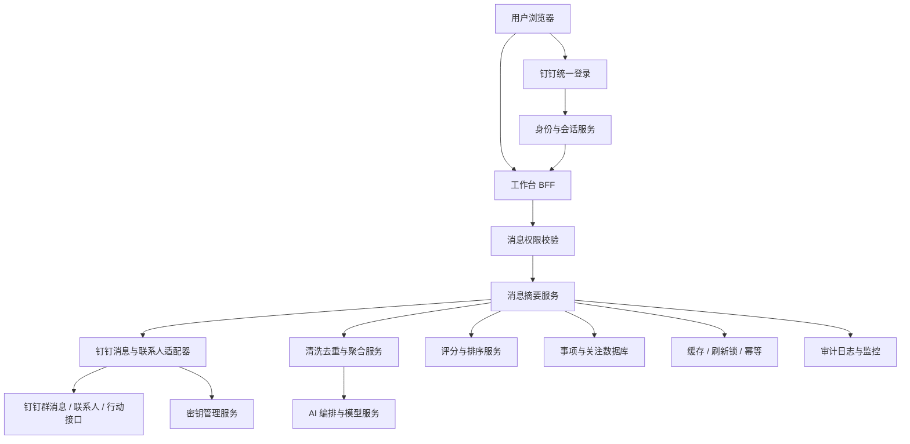
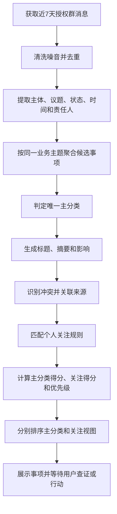
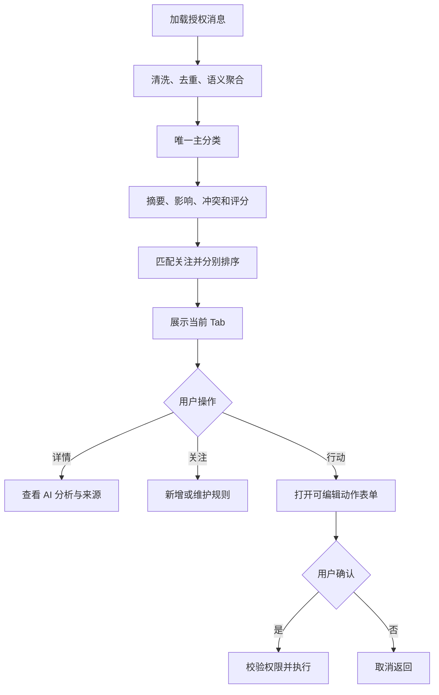

# 20260726-【PRD】AI工作台-消息摘要（MVP）-天马智擎项目

_**天马智擎项目**_

**产品需求说明书**

版本信息

| 版本号 | 时间（必填） | 状态 | 简要描述（必填） | 部门 | 责任产品（必填） | 批准人 |
| --- | --- | --- | --- | --- | --- | --- |
| V1.0 | 2026-07-26 | N | 从工作台总 PRD 拆分消息摘要，定义消息清洗、聚合、分类、评分、关注、详情和行动闭环 | AI项目小组 | @公输 |  |

注：状态为 N-新建、A-增加、M-更改、D-删除。

# 关于本文档

## 术语

| **词汇名称** | **全局说明** | **归属层** |
| --- | --- | --- |
| 业务事项 | 面向当前用户，由一条或多条授权消息围绕同一业务主题聚合形成的工作对象 | 业务层 |
| 主分类 | 业务事项唯一所属的重点跟进、待我决策、风险预警或经营动态 | 分类层 |
| 我的关注 | 按群、人员或关键词规则筛选业务事项的订阅视图，不参与主分类竞争 | 订阅层 |
| 来源证据 | 支撑 AI 判断的授权原始消息，包含发送人、会话、原文和时间 | 证据层 |
| 冲突 | 同一事项不同来源的关键数值、状态、时间或结论不一致 | 分析层 |
| 聚合键 | 用于刷新后稳定复用事项编号的确定性键，不使用模型自由文本生成 | 数据层 |
| 行动草稿 | 基于事项和来源预填、经用户编辑确认后才能执行的消息、日程或待办内容 | 行动层 |

## 参考文档

| **编号** | **文档** | **说明及地址** |
| --- | --- | --- |
| 1 | 《20260716-【PRD】AI工作台-工作台（MVP）-天马智擎项目》 | PRD 格式基线 |
| 2 | 《20260726-【PRD】AI工作台-工作台（MVP）-天马智擎项目》 | 拆分前需求来源 |
| 3 | 《信息摘要看板 · 产品需求文档 v3.9》 | 分类与评分口径基线 |
| 4 | AI 工作台前端原型 | 卡片、详情浮层、关注和动作表单参考 |

## 沟通要求

| **序号** | **部门/角色** | **沟通内容** | **沟通结果** |
| --- | --- | --- | --- |
| 1 | 钉钉应用研发 | 确认授权群消息、联系人、发消息、日程、忙闲和待办接口 | 待接口评审确认 |
| 2 | AI 算法/平台 | 确认聚合、分类、摘要、评分的版本、输入上限、证据和降级方式 | 待模型评审确认 |
| 3 | 信息安全与 IT | 评审消息原文、摘要、向量/索引、缓存、来源详情和操作审计 | 待安全评审确认 |
| 4 | 产品、研发、测试 | 确认五个 Tab、评分规则、关注上限、表单字段和验收样本 | 待需求评审确认 |

# 产品概述

## 产品概述

消息摘要将当前用户近 7 天有权访问的群消息整理成可判断、可查证、可行动的业务事项。事项只有一个主分类，也可以因命中个人关注规则同时出现在“我的关注”。卡片提供来源详情，并允许用户确认后发消息、建日程或建待办。

## 产品目标

| **目标** | **说明** | **衡量方式** |
| --- | --- | --- |
| 降低消息阅读成本 | 多条同主题消息合并为一个业务事项 | 同一事项不重复生成多张卡片 |
| 明确行动优先级 | 区分重点、决策、风险和经营动态 | 唯一主分类、优先级和类内排序可解释 |
| 保留证据 | 摘要、冲突和评分可回到授权原文查证 | 详情展示完整来源链路 |
| 支持个人关注 | 按群、人员和关键词形成订阅视图 | 不影响事项主分类 |
| 形成行动闭环 | 事项可生成消息、日程和待办草稿 | 所有动作用户确认后执行 |

## 用户角色

### 用户角色描述

| **用户角色** | **职责描述** | **MVP范围** |
| --- | --- | --- |
| 管理层用户 | 查看本人授权消息形成的关键事项，查证来源并发起行动 | ✅ 核心使用角色 |
| 系统管理员 | 配置数据源、权限、模型版本、词表和关注上限 | 后台配置页面不在本 PRD 范围内 |

### 用户故事地图

| **用户活动** | **用户任务** | **用户故事** |
| --- | --- | --- |
| 浏览事项 | 切换分类 | 我希望按重点、决策、风险、经营和关注查看事项 |
| 查找事项 | 搜索与刷新 | 我希望搜索已加载事项，并只在需要时重新获取消息 |
| 判断事项 | 查看摘要与影响 | 我希望快速理解事实及其对我的影响 |
| 查证事项 | 查看来源和冲突 | 我希望回看原始消息，确认 AI 是否理解正确 |
| 管理关注 | 新增群/人员/关键词 | 我希望自定义订阅并知道事项为何进入关注视图 |
| 形成行动 | 发消息、建日程、建待办 | 我希望编辑系统预填内容，确认后再执行 |
| 清理事项 | 关闭与撤销 | 我希望移除不再需要的事项，并能短时撤销 |

## 同类产品/竞品调研（选写）

| **产品/能力** | **现有优势** | **本产品定位** |
| --- | --- | --- |
| 钉钉群聊 | 原始沟通、联系人和群上下文 | 不替代聊天，只做授权消息聚合和行动衔接 |
| 通用 AI 摘要 | 快速压缩长文本 | 增加稳定事项、唯一分类、冻结评分和来源证据 |
| 订阅/关键词提醒 | 基于规则召回信息 | 与主分类分离，形成个人“我的关注”视图 |

# 功能需求

## 全局通用规则

### 系统范围

| **规则项** | **说明** |
| --- | --- |
| 数据范围 | 当前用户近 7 天有权访问的群消息；MVP 排除单聊 |
| 五个视图 | 重点跟进、待我决策、风险预警、经营动态为主分类；我的关注为订阅视图 |
| 搜索 | 只筛选当前 Tab 已加载事项，300ms 防抖，不请求源系统 |
| 刷新 | 用户点击后才重新读取消息并完成清洗、聚合、分类、摘要和评分 |
| 详情 | 只有来源数量气泡触发；卡片正文和空白区域不打开详情 |
| 外部动作 | 发消息、建日程、建待办均先生成可编辑草稿，确认后执行 |

### 身份认证与授权

| **规则项** | **说明** |
| --- | --- |
| 门户认证 | 用户通过钉钉统一登录；服务端换取稳定用户身份 |
| 消息权限 | 只读取当前用户可访问会话中的消息，不接受前端自行声明会话范围 |
| 来源权限 | 打开详情、加载更多来源和关注来源对象时再次校验会话或人员权限 |
| 动作权限 | 发消息、查询忙闲、建日程和建待办分别执行对象级权限校验 |
| 权限变更 | 权限版本变化后清除受影响的来源、事项缓存和可执行操作 |
| AI 边界 | 模型只能接收已完成权限过滤的数据，输出不得扩大数据范围 |

### 数据保存边界

| **数据类型** | **保存位置** | **保存与安全约束** |
| --- | --- | --- |
| 原始群消息、联系人、日程和待办 | 钉钉源系统 | 源系统为权威数据；工作台只在授权范围内读取或发起动作 |
| 业务事项、摘要、评分、来源映射、冲突、关注规则、关闭状态、行动结果 | 工作台业务数据库 | 按用户和事项隔离；保留模型版本与证据编号 |
| 消息窗口缓存、事项列表、刷新锁、幂等标识 | 受控缓存服务 | 按用户、权限版本和数据窗口隔离并设置有效期 |
| 搜索词、Tab、滚动位置、临时表单状态 | 浏览器会话缓存 | 退出登录后清除；不保存访问令牌和无权限原文 |
| 服务凭证和第三方密钥 | 密钥管理服务 | 不进入代码、普通数据库和日志 |

### 加载态/空态/错误态

| **场景** | **状态** | **处理方式** |
| --- | --- | --- |
| 首次加载 | 加载中 | 展示事项卡片骨架屏 |
| 手动刷新 | 刷新中 | 保留列表，刷新按钮旋转并禁用重复点击 |
| 风险无数据 | 空 | 展示“近期平稳” |
| 关注无规则 | 空 | 展示说明和“新增关注” |
| 有规则无命中 | 空 | 展示“暂无匹配事项” |
| 搜索无结果 | 空 | 展示无结果说明和“清空搜索” |
| 刷新失败有缓存 | 错误 | 保留旧数据，提示“刷新失败，当前为上次数据” |
| 数据源无权限 | 阻止 | 不展示原文，提示重新授权或联系管理员 |

### 并发与防重复规则

| **规则项** | **说明** |
| --- | --- |
| 刷新 | 同一用户同时只允许一个消息刷新任务；旧任务不得覆盖新结果 |
| 事项稳定性 | 通过来源映射复用事项编号，关闭状态不得因刷新丢失 |
| 关注 | 同类型规范化值不得重复，每人最多 20 条 |
| 写操作 | 每次确认生成幂等标识；提交中禁用确认按钮 |
| 撤销 | 关闭事项和新增关注的撤销只作用于对应操作，不重复执行 |

## 流程图

### 技术架构图



### 业务流程图



## 功能模块清单

| **功能模块** | **功能描述** | **优先级** |
| --- | --- | --- |
| 消息摘要 | 消息清洗、聚合、分类、摘要、评分、关注、来源详情、关闭和三类行动 | P0 |

## 功能详情

### 消息摘要

#### 功能需求描述

| **EARS 模式** | **需求描述** |
| --- | --- |
| 普遍型 | 系统应将当前用户近 7 天有权访问的群消息聚合为业务事项，并展示标题、摘要、影响、优先级、冲突状态和来源数量。 |
| 状态驱动型 | 当业务事项命中关注规则时，系统应在其唯一主分类之外同时展示在“我的关注”，并显示关注类型标签。 |
| 事件驱动型 | 当用户切换 Tab、搜索、刷新、查看来源、管理关注或发起卡片动作时，系统应按当前事项、权限和交互状态展示或执行结果。 |
| 不良行为型 | 系统不应把同一事项分入多个主分类，不应使用无权限消息，不应由卡片正文打开详情，也不应在用户确认前执行外部动作。 |

**五个 Tab**

| **Tab** | **视图性质** | **进入条件** | **与其他 Tab 的关系** |
| --- | --- | --- | --- |
| 重点跟进 | 主分类 | 已经布置、反复讨论或持续推进，但尚未明确结束 | 每个事项只能有一个主分类 |
| 待我决策 | 主分类 | 存在对当前用户的明确拍板、确认、审批或选择请求 | 每个事项只能有一个主分类 |
| 风险预警 | 主分类 | 存在损失、违规、客诉、故障、中断或错价等风险信号 | 每个事项只能有一个主分类 |
| 经营动态 | 主分类 | 包含经营指标、播报、趋势或显著变化 | 每个事项只能有一个主分类 |
| 我的关注 | 订阅视图 | 任一有效来源命中当前用户的群、人员或关键词规则 | 不参与主分类竞争；与主分类引用同一事项编号 |

#### 业务主流程图及说明



分类和打分针对聚合后的业务事项，不先生成单消息卡片再合并。

#### 界面原型

```text
┌消息摘要──────────────────────────────[搜索][刷新]┐
│重点跟进  待我决策  风险预警  经营动态  我的关注 │
│┃标题 [高] [冲突] [群/人员/关键词*]       10:30 │
│┃摘要：……                    [消息][日程][待办][5]│
│┃影响：……                                      │
└────────────────────────────────────────────────┘
* 类型标签仅在“我的关注”展示
```

| **动作** | **显示** | **类型** | **描述** | **截图示例** |
| --- | --- | --- | --- | --- |
| 【消息摘要】首次加载 | 默认 Tab 和首批 5 条事项 | 看板 | · 默认进入重点跟进<br>· 按优先级、得分、时间和编号排序 | 见本节线框图 |
| 【Tab】点击 | 切换五个视图 | 页签 | · 不重新请求数据<br>· 保留各 Tab 滚动位置<br>· 每个 Tab 首批 5 条 | — |
| 【列表底部】到达阈值 | 追加 5 条事项 | 滚动加载 | · 无更多时停止<br>· 失败保留已有卡片并提供重试 | — |
| 【搜索框】输入/清空 | 过滤或恢复当前 Tab | 输入框 | · 搜索标题、摘要、影响和来源展示名称<br>· 300ms 防抖，本地过滤 | — |
| 【刷新按钮】点击 | 保留列表并进入刷新态 | 图标按钮 | · 重新完成全链路处理<br>· 保留稳定事项编号、关闭状态、Tab 和搜索词 | — |
| 【事项卡片】默认 | 三行紧凑卡片 | 卡片 | · 第一行标题、优先级、冲突、关注标签、右侧时间<br>· 第二行摘要<br>· 第三行影响和动作区<br>· 正文不可打开详情 | 见本节线框图 |
| 【普通主分类卡片】展示 | 高/中/低和可选冲突图标 | 标签 | · 不展示业务领域标签 | — |
| 【我的关注卡片】展示 | 最多两个定宽类型标签和 +N | 标签 | · 类型为群、人员、关键词<br>· 约 3 个汉字宽，超出省略<br>· Hover 查看完整名称 | — |
| 【冲突图标】Hover/聚焦 | “数据冲突” | Tooltip | · 完整冲突内容在详情展示 | — |
| 【发消息】点击 | 发消息弹窗 | 动作弹窗 | · 收件人*、发送内容*<br>· 默认最新来源群，可切换事项涉及的其他群或人员<br>· 不展示详情字段 | — |
| 【常用快捷内容】点击 | 模板写入发送内容 | 快捷按钮 | · 用户可继续编辑<br>· 不自动发送 | — |
| 【发送】确认 | 发布消息并反馈 | 写操作 | · 校验必填项和权限<br>· 提交中防重复<br>· 失败保留内容 | — |
| 【建日程】点击 | 日程弹窗 | 动作弹窗 | · 标题*、开始*、结束*、时区*、必选参会人*、可选参会人、地点、会议室、描述、提醒<br>· 不展示视频会议和日程颜色 | — |
| 【日程弹窗】打开 | 立即预填并异步更新忙闲 | 表单状态 | · 原文时间优先<br>· 否则共同空闲→本人空闲→每天09:00—18:00最近一小时<br>· 当天无时段从次日09:00继续 | — |
| 【新建日程】确认 | 创建并反馈 | 写操作 | · 所有预填可编辑<br>· 校验时间、参会人和权限<br>· 失败保留表单 | — |
| 【建待办】点击 | 待办弹窗 | 动作弹窗 | · 标题*、描述、执行人*、参与人、截止时间*、优先级*、提醒<br>· 明确责任人优先，无则当前用户<br>· 无截止时间时18:00前为当天18:00，否则次日18:00 | — |
| 【新建待办】确认 | 创建并反馈 | 写操作 | · 高/中/低映射紧急/较高/普通<br>· 校验必填和权限<br>· 失败保留表单 | — |
| 【消息气泡】Hover/聚焦 | 锚定气泡的详情预览 | 详情浮层 | · 数字内嵌并代表来源数量<br>· 浮层指向原卡片<br>· 鼠标进入浮层时保持 | — |
| 【消息气泡】点击 | 固定同一个详情浮层 | 详情浮层 | · 点击空白、关闭或再次点击解除<br>· 不使用右侧抽屉<br>· 卡片滚出可视区时关闭 | — |
| 【详情浮层】默认 | AI 分析、冲突说明和聊天缩略卡 | 详情浮层 | · 不展示公式、规则版本、消息编号<br>· 不展示三类业务动作<br>· 来源首批 10 条 | — |
| 【来源】继续加载 | 追加来源缩略卡 | 分页 | · 展示头像、发送人、会话、原文和时间 | — |
| 【关注该群/关注该人】点击 | 立即显示已关注和撤销 Toast | 快捷动作 | · 一键新增<br>· 达到 20 条时阻止<br>· 撤销只撤销本次新增 | — |
| 【卡片】Hover/聚焦 | 右上角显示关闭按钮 | 卡片操作 | · 不占固定动作区<br>· 关闭后从所有个人视图移除<br>· 5秒内可撤销 | — |
| 【新增关注】点击 | 关注规则弹窗 | 按钮/弹窗 | · 支持群、人员、关键词<br>· 展示规则数量和上限 | — |
| 【关注类型】切换 | 切换选择器或关键词输入 | 分段控件 | · 切换清空未添加输入，不影响已加入规则 | — |
| 【关注规则】添加 | 进入待保存列表 | 表单动作 | · 群/人员从授权候选选择<br>· 关键词支持 Enter<br>· 重复、空值或超限时阻止 | — |
| 【关注规则】删除 | 从待保存列表移除 | 图标按钮 | · 保存前只影响弹窗草稿 | — |
| 【保存关注】点击 | 保存并返回我的关注 | 写操作 | · 重算命中、标签和排序<br>· 失败保留草稿<br>· 取消不保存 | — |
| 【风险无数据】出现 | 近期平稳 | 空态 | · 不使用通用无数据文案 | — |
| 【关注无规则/无命中】出现 | 新增关注或暂无匹配事项 | 空态 | · 两种状态文案和动作不同 | — |

#### 数据说明（业务实体）

**业务事项**

| **字段名** | **数据类型** | **长度** | **默认值** | **必需** | **约束说明** |
| --- | --- | --- | --- | --- | --- |
| 事项编号 | 字符 | 64 | 系统生成 | 是 | 全局唯一；跨主分类和关注视图复用 |
| 用户编号 | 字符 | 64 | 当前用户 | 是 | 同一消息对不同用户可形成不同判断 |
| 聚合键 | 字符 | 64 | 系统生成 | 是 | 优先复用来源映射；新事项基于用户和最小稳定来源编号生成 |
| 主分类 | 枚举 | — | — | 是 | 重点跟进、待我决策、风险预警、经营动态四选一 |
| 标题 | 字符 | ≤100 | — | 是 | 准确描述单一业务主题 |
| 摘要 | 字符 | ≤500 | — | 是 | 描述事实，不添加行动建议 |
| 影响 | 字符 | ≤300 | — | 是 | 说明对当前用户或业务的影响 |
| 优先级 | 枚举 | — | 中 | 是 | 高、中、低 |
| 主分类得分 | 小数 | 0—100 | — | 是 | 只用于主分类排序 |
| 是否冲突 | 布尔 | — | 否 | 是 | 关键事实不一致时为是 |
| 冲突说明 | 字符 | ≤1000 | 空 | 否 | 说明冲突字段及来源 |
| 来源数量 | 整数 | — | 1 | 是 | 有效来源总数 |
| 最新时间 | 时间戳 | — | — | 是 | 只用于排序和卡片右侧时间 |
| 关闭状态 | 布尔 | — | 否 | 是 | 关闭后从当前用户所有视图移除 |

**来源消息**

| **字段名** | **数据类型** | **长度** | **默认值** | **必需** | **约束说明** |
| --- | --- | --- | --- | --- | --- |
| 来源编号 | 字符 | 128 | — | 是 | 优先使用源消息编号；无编号时使用去重指纹 |
| 事项编号 | 字符 | 64 | — | 是 | 同一来源在当前用户范围只关联一个有效事项 |
| 会话编号 | 字符 | 128 | — | 是 | 当前用户必须有权访问 |
| 会话名称 | 字符 | ≤200 | — | 是 | 仅用于展示 |
| 发送人编号 | 字符 | 64 | — | 是 | 关联授权人员信息 |
| 发送人姓名 | 字符 | ≤100 | — | 是 | 仅用于展示 |
| 消息原文 | 文本 | ≤10000 | — | 是 | 详情按权限展示，不写入日志 |
| 规范化正文 | 文本 | ≤10000 | — | 是 | 只用于去重、匹配和聚合 |
| 发送时间 | 时间戳 | — | — | 是 | 精确到秒 |
| 去重指纹 | 字符 | 64 | 空 | 条件必填 | 无稳定源编号时必填 |

**关注规则与命中**

| **字段名** | **数据类型** | **长度** | **默认值** | **必需** | **约束说明** |
| --- | --- | --- | --- | --- | --- |
| 关注规则编号 | 字符 | 64 | 系统生成 | 是 | 规则主键 |
| 用户编号 | 字符 | 64 | 当前用户 | 是 | 每人最多 20 条 |
| 关注类型 | 枚举 | — | — | 是 | 群、人员、关键词 |
| 关注对象编号 | 字符 | 128 | 空 | 条件必填 | 群或人员必填，关键词为空 |
| 关注名称 | 字符 | ≤100 | — | 是 | 规范化后同类型不得重复 |
| 事项编号 | 字符 | 64 | 空 | 命中时必填 | 与规则编号组成命中关系唯一键 |
| 关系得分 | 小数 | 0—100 | 空 | 命中时必填 | 当前规则与事项的关注得分 |

**行动草稿**

| **字段名** | **数据类型** | **长度** | **默认值** | **必需** | **约束说明** |
| --- | --- | --- | --- | --- | --- |
| 草稿编号 | 字符 | 64 | 系统生成 | 是 | 单次动作草稿标识 |
| 事项编号 | 字符 | 64 | — | 是 | 关联业务事项 |
| 动作类型 | 枚举 | — | — | 是 | 发消息、建日程、建待办 |
| 最终表单 | 对象 | — | 系统预填 | 是 | 保存用户确认时的最终字段 |
| 幂等标识 | 字符 | 64 | 确认时生成 | 提交时必填 | 同一标识只允许成功一次 |
| 执行状态 | 枚举 | — | 待确认 | 是 | 待确认、提交中、成功、失败 |
| 结果信息 | 字符 | ≤500 | 空 | 否 | 不包含底层堆栈和凭证 |

#### 业务规则和约束条件

**消息处理规则**

| **规则项** | **说明** |
| --- | --- |
| 清洗 | 排除单聊、机器人噪音、纯表情、系统提示和无正文消息 |
| 去重 | 优先使用稳定源编号；否则规范化正文后，以会话、发送人、秒级时间和正文计算 SHA-256 指纹 |
| 聚合窗口 | 同一业务主体和核心议题、相邻有效消息不超过 72 小时 |
| 聚合例外 | 仅关键词相同但业务对象不同不得合并；超过窗口仅在有相同稳定业务编号且未结束时继续聚合 |
| 新消息归并 | 主体或议题冲突时拆分；进展、补充数据和多方回复继续聚合 |
| 摘要 | 基于全部有效来源生成标题、摘要和影响；不得把行动建议写入事实摘要 |
| 冲突 | 比较关键数值、状态、时间和结论；冲突时保留全部来源 |
| 稳定编号 | 优先复用来源映射；多个既有事项合并时保留创建时间最早的事项编号 |
| 新聚合键 | 使用用户编号和候选中最小稳定来源编号/指纹生成；模型业务主体和议题文本不参与 |

**唯一主分类与评分**

| **顺序/分类** | **判断或权重** | **特殊处理** |
| --- | --- | --- |
| 1 风险预警 | 严重度50%＋紧急度30%＋影响面20% | 风险硬规则直接100分置顶 |
| 2 待我决策 | 明确度30%＋直接度40%＋紧迫度30% | 必须存在对当前用户的决策请求 |
| 3 重点跟进 | 讨论热度30%＋在意度50%＋紧迫度20% | 事项未结束且已布置/反复讨论/持续推进 |
| 4 经营动态 | 经营相关度20%＋数据密度40%＋变化显著性40% | 可信来源加5分，总分不超过100 |
| 不生成 | 四类均不满足 | 不生成信息卡片 |
| 我的关注 | 匹配度50%＋信息价值30%＋来源可信度20% | 独立排序，不覆盖主分类得分 |

| **规则项** | **说明** |
| --- | --- |
| 指标计算 | 模型输出0—100指标分、理由和证据；服务端执行冻结权重算术 |
| 主分类排序 | 优先级、综合得分、最新时间、事项编号 |
| 优先级 | 高：24小时内必须行动、硬风险或明显损失；中：有明确行动但无需立即处理；低：信息性或长期关注；证据不足为中 |
| 关注匹配 | 群匹配会话编号，人员匹配发送人编号，关键词匹配规范化原文；标题摘要不得反向触发 |
| 多规则命中 | 每条关系独立计分；事项只展示一次并取关系得分最大值，不求和 |
| 关注同分 | 主分类优先级、主分类得分、最新时间、事项编号 |
| 详情边界 | 展示评分结果和简要依据，不展示公式、模型版本和底层技术字段 |
| 反馈边界 | 本期不建设结构化AI纠错后台和数据飞轮 |

#### 接口说明

| **接口** | **调用方式** | **请求/响应重点** | **状态** |
| --- | --- | --- | --- |
| GET /api/dws/workbench | 获取消息摘要 | 请求数据窗口；返回事项、来源数量、可执行操作和错误 | 现有路径，分页、字段版本和权限错误码待评审 |
| POST /api/dws/actions | 发消息/建日程/建待办 | 请求动作类型、最终表单和幂等标识 | 现有路径，完整字段和错误码待评审 |
| 来源分页接口 | 加载来源 | 请求事项编号和游标；返回授权来源缩略卡 | 路径待评审，本版不硬编码 |
| 关注规则接口 | 查询/保存规则 | 返回最多20条规则和保存结果 | 路径待评审，本版不硬编码 |
| 事项关闭接口 | 关闭/撤销 | 请求事项编号和幂等标识 | 路径待评审，本版不硬编码 |

所有接口必须校验服务端会话和对象权限；写接口支持幂等，响应未知不得显示成功。

#### 补充说明

1. 内置提示词仅包含优先级分类、消息聚合分类与摘要、综合打分，见附录。
2. 日程忙闲结果来自官方接口，行动表单不得自行伪造已校验忙闲状态。
3. 本 PRD 不定义钉钉聊天、日历和待办后台能力。

# 非功能需求

## 性能要求

| **指标** | **目标值** | **说明** |
| --- | --- | --- |
| 首屏事项 | ≤2.5秒（P95） | 基础事项优先，AI结果可异步补充 |
| Tab切换 | ≤100ms | 已加载数据本地切换 |
| 搜索过滤 | ≤100ms | 300ms防抖结束后 |
| 详情打开 | ≤300ms | 不含新来源分页请求 |
| 单次刷新 | 基础数据≤3秒（P95） | AI处理可显示进度并异步完成 |

## 安全要求

| **维度** | **要求** |
| --- | --- |
| 消息权限 | 列表、详情、分页和动作分别校验会话及对象权限 |
| 数据最小化 | AI只接收完成当前聚合和判断所需的授权字段 |
| 原文保护 | 无权限原文不下发；日志不记录完整消息正文 |
| 缓存隔离 | 按用户、权限版本和窗口隔离，退出或权限变更后清理 |
| 行动审计 | 记录操作人、事项、最终表单、时间、幂等标识和结果 |

## 兼容性要求

| **维度** | **要求** |
| --- | --- |
| 浏览器 | Chrome、Edge最近两个稳定版本 |
| 分辨率 | 最小1280×720，推荐1920×1080 |
| 无Hover设备 | 点击气泡或图标打开详情，避免依赖纯Hover |
| 可访问性 | Tab、图标、浮层和弹窗支持键盘及可见焦点 |

# 迭代计划与 Non-goals

## MVP（本期）迭代计划

| **序号** | **模块** | **开发内容** | **依赖/并行** | **备注** |
| --- | --- | --- | --- | --- |
| 1 | 权限与消息接入 | 登录、会话范围、消息读取和来源权限 | — | 前置条件 |
| 2 | 聚合分类 | 清洗、去重、聚合、唯一分类和稳定事项 | 依赖1 | P0 |
| 3 | 摘要评分 | 标题摘要影响、冲突、指标与冻结权重 | 依赖2、AI平台 | P0 |
| 4 | 卡片与详情 | 五Tab、搜索刷新、分页、详情和关闭撤销 | 依赖2、3 | P0 |
| 5 | 我的关注 | 规则管理、匹配、标签和独立排序 | 依赖2、3 | P0 |
| 6 | 三类行动 | 发消息、建日程、建待办及幂等反馈 | 依赖1、官方接口 | P0 |

## Non-goals（本期明确不做）

| **序号** | **项目** | **说明** | **计划迭代** |
| --- | --- | --- | --- |
| 1 | 单聊聚合 | MVP只处理群消息 | 后续评估 |
| 2 | 结构化AI反馈 | 不建设纠错后台和数据飞轮 | 后续迭代 |
| 3 | 自动行动 | 不自动发送、创建日程或待办 | 不规划自动执行 |
| 4 | 正则关注 | 关键词只支持连续包含匹配 | 后续评估 |
| 5 | 完整移动端 | MVP以桌面端为主 | 后续迭代 |

# 附录

## A. 评分指标与词表

| **分类** | **指标** | **0—100分取值规则** |
| --- | --- | --- |
| 重点跟进 | 讨论热度 | `事项有效消息数÷同期全部重点跟进候选有效消息数×40＋min(事项持续自然日÷7,1)×30＋min(去重参与人数÷10,1)×30` |
| 重点跟进 | 在意度 | `当前用户在事项中的有效消息数÷事项有效消息总数×80`；当前用户明确布置再加20分，总分不超过100 |
| 重点跟进 | 紧迫度 | 阻塞100；截止不足24小时80；其余30 |
| 待我决策 | 明确度 | 事由及方案/金额/人员完整100；有事由无细节60；模糊30 |
| 待我决策 | 直接度 | 明确@或姓名100；称谓80；相关群无指向50；无关0 |
| 待我决策 | 紧迫度 | 截止不足24小时100；超过24小时80；急/尽快/今天70；无时间30 |
| 风险预警 | 严重度 | 硬规则100；运营中断70；提醒关注30；无风险0 |
| 风险预警 | 紧急度 | 正在发生/已损失100；即将发生70；潜在30 |
| 风险预警 | 影响面 | 全公司/外部客户100；单店/单系统60；单活动/订单30 |
| 经营动态 | 经营相关度 | 经营词且有数字100；仅经营词60；未命中0 |
| 经营动态 | 数据密度 | 数字且有对比100；仅数字60；仅方向词30；无数字0 |
| 经营动态 | 变化显著性 | 破线100；显著变化70；轻微30；无变化0 |
| 我的关注 | 匹配度 | 群/人员精确命中100；关键词为命中有效来源数÷总有效来源数×100 |
| 我的关注 | 信息价值 | 决策/风险/经营数据100；讨论/进度60；闲聊0 |
| 我的关注 | 来源可信度 | 当前用户/负责人100；经营群/数据群80；普通同事50 |

风险硬规则：罚款、违规词、处罚、客诉、投诉升级、故障、宕机、崩溃、错价、下单异常、封号、虚假宣传、工商、法务、诉讼、泄露、资损。

经营动态“可信来源加5分”仅适用于当前用户、事项明确负责人、经配置的经营群或数据群；普通群聊和无法确认身份的来源不加分。

## B. AI 内置提示词

### B.1 通用要求

1. 输入必须包含当前用户编号、姓名、组织角色和已授权数据。
2. 输出判断必须引用输入中的稳定来源编号。
3. 不得补充输入外的事实、人员、时间、数字和责任关系。
4. 输出合法JSON；解析失败时不生成或更新事项。

### B.2 优先级分类提示词

版本：`priority-classification-v1.0`

```text
你是管理层工作台的事项优先级判断器。
输入：当前用户信息、已聚合事项、唯一主分类、全部有效来源和硬风险结果。
任务：只判断高/中/低；高限于24小时内必须行动、硬风险或明显损失；中为有明确行动但无需立即处理；低为信息性或长期关注；证据不足返回中。
输出JSON：
{"priority":"high|medium|low","reason":"不超过80字","evidence_source_ids":["来源编号"]}
```

### B.3 消息聚合分类与摘要提示词

版本：`message-cluster-summary-v1.0`

```text
你是管理层工作台的消息聚合、分类与摘要器。
输入：当前用户信息、近7天已清洗去重的授权群消息、当前用户关注规则；每条消息包含稳定来源编号、会话、发送人、时间和正文。
任务：
1. 提取业务主体、对象、动作、状态、数字、时间和责任人。
2. 按同一主体、同一核心议题和72小时窗口形成候选聚合；不同业务对象不得因关键词相同合并。
3. 按风险预警→待我决策→重点跟进→经营动态选择唯一主分类；均不满足则不生成。
4. 基于全部有效来源生成标题、事实摘要和对当前用户的影响。
5. 识别关键数字、状态、时间或结论冲突。
6. 只输出群、人员、关键词关注命中关系，不用生成文本反向匹配。
输出JSON：
{"clusters":[{"source_ids":["来源编号"],"category":"risk|decision|followup|business|null","title":"不超过40字","summary":"不超过200字","impact":"不超过120字","conflict":false,"conflict_detail":"","watch_rule_ids":["规则编号"]}]}
```

### B.4 综合打分提示词

版本：`score-dimensions-v1.0`

```text
你是管理层工作台的评分指标判断器，不负责计算最终加权总分。
输入：评分目标main或watch、唯一主分类事项、全部有效来源及组织角色；watch时同时输入命中规则和命中来源。
任务：main时输出该分类指标；watch时输出匹配度、信息价值、来源可信度。每个指标范围0—100，给出理由和证据来源编号；严格使用附录A分档；不计算最终加权分。
输出JSON：
{"score_target":"main|watch","category":"risk|decision|followup|business|null","dimensions":[{"name":"指标中文名","score":0,"reason":"依据","evidence_source_ids":["来源编号"]}],"hard_risk":false}
```

## C. 提示文案

| **场景** | **文案** |
| --- | --- |
| 刷新失败 | ⚠️ 刷新失败，当前为上次数据 |
| 风险无数据 | 近期平稳 |
| 关注无规则 | 添加关注的群、人员或关键词，相关事项会出现在这里 |
| 关注无命中 | 暂无匹配事项 |
| 搜索无结果 | 未找到匹配的信息摘要 |
| 关注达到上限 | 最多可添加20条关注，请先删除旧规则 |
| 来源无权限 | 暂无该消息来源的查看权限 |
| 动作失败 | 操作失败，已保留填写内容，请重试 |
