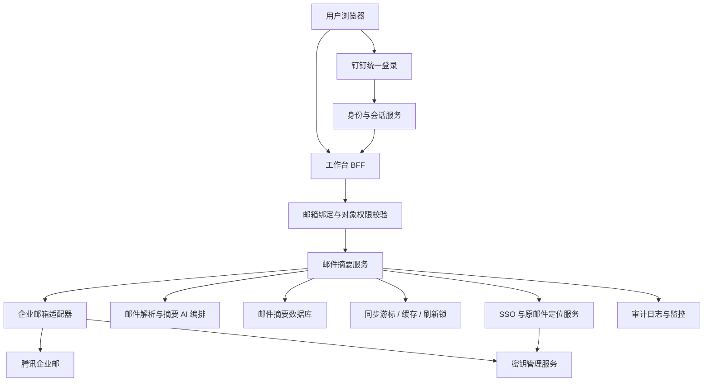
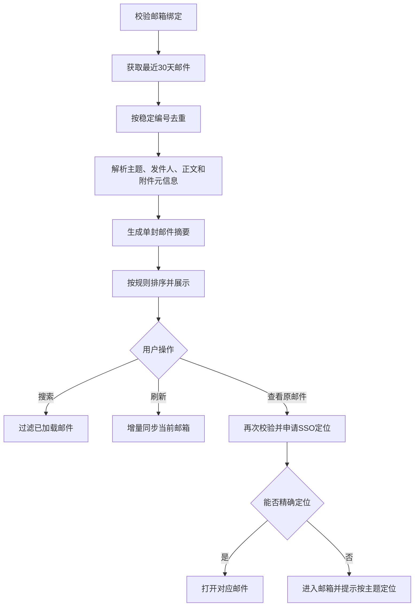

# 20260726-【PRD】AI工作台-邮件摘要（MVP）-天马智擎项目

_**天马智擎项目**_

**产品需求说明书**

版本信息

本表用于记录本文档的维护过程，请认真填写。

| 版本号 | 时间(必填) | 状态 | 简要描述(必填) | 部门 | 责任产品(必填) | 批准人 |
| --- | --- | --- | --- | --- | --- | --- |
| V1.0 | 2026-07-26 | N | 从工作台总 PRD 拆分邮件摘要，定义企业邮箱接入、单封邮件摘要、搜索刷新和原邮件定位 | AI项目小组 | $\color{#0089FF}{@公输}$ |  |

注：状态可以为N-新建、A-增加、M-更改、D-删除。

# 关于本文档

## 术语

| **词汇名称** | **全局说明** | **归属层** |
| --- | --- | --- |
| 邮件摘要卡片 | 一封邮件对应的一条工作台摘要，包含主题、发件人、时间、摘要、状态和原邮件入口 | 展示层 |
| 邮件稳定编号 | 企业邮箱为单封邮件提供或工作台通过合法方式取得的稳定标识，用于去重和定位 | 数据层 |
| 邮箱绑定 | 当前登录用户与其企业邮箱账号之间经服务端确认的授权关系 | 身份层 |
| 增量同步 | 仅获取上次成功同步后新增、修改或删除的邮件状态 | 同步层 |
| 原邮件精确定位 | 用户从摘要卡片进入企业邮箱后直接打开对应邮件 | 跳转层 |
| 降级定位 | 无法精确打开对应邮件时，进入企业邮箱并提示用户按邮件主题定位 | 跳转层 |
| 邮件正文 | 当前邮件可用于摘要的正文内容；引用历史只作上下文，不单独生成卡片 | 数据层 |

## 参考文档

| **编号** | **文档** | **说明及地址** |
| --- | --- | --- |
| 1 | 《20260716-【PRD】AI工作台-工作台（MVP）-天马智擎项目》 | PRD 格式基线 |
| 2 | 《20260726-【PRD】AI工作台-工作台（MVP）-天马智擎项目》 | 拆分前需求来源 |
| 3 | 腾讯企业邮开放能力、IMAP 与 SSO 文档 | 邮件同步、凭证和原邮件跳转技术评审依据 |
| 4 | AI 工作台前端原型 | 邮件卡片、搜索、刷新和跳转交互参考 |

## 沟通要求

| **序号** | **部门/角色** | **沟通内容** | **沟通结果** |
| --- | --- | --- | --- |
| 1 | 企业应用研发 | 使用真实企业邮箱验证列表、正文、稳定编号、状态和删除同步 | 待技术预研确认 |
| 2 | 信息安全与 IT | 评审客户端专用密码、OAuth/SSO、密钥托管、正文缓存和审计 | 待安全评审确认 |
| 3 | 腾讯企业邮管理员 | 确认账号 IMAP、回调、应用邮箱和 SSO 的可用范围 | 待企业配置确认 |
| 4 | AI 平台 | 确认邮件正文长度、附件元信息、摘要结构和失败降级 | 待模型评审确认 |
| 5 | 产品、研发、测试 | 真实账号验证精确定位和降级定位，不以模拟跳转作为完成依据 | 待联调确认 |

# 产品概述

## 产品概述

邮件摘要面向使用腾讯企业邮箱的管理层用户，以“一封邮件对应一张卡片”的方式展示邮件主题、发件人、收信时间、AI 摘要、重要/未读状态和附件数量，帮助用户快速判断是否需要进入企业邮箱处理。

本功能不跨邮件聚类，也不建设完整邮件客户端。邮件正文和状态以企业邮箱为准。

## 产品目标

1.  **快速浏览邮件**：无需打开每封邮件即可了解主要内容（衡量方式：一封邮件稳定对应一张摘要卡片）
    
2.  **识别重要邮件**：重要和未读状态在列表中清晰可见（衡量方式：标签、竖条和排序规则一致）
    
3.  **保持数据真实**：搜索基于已同步数据，刷新执行增量同步（衡量方式：不以演示邮件冒充已接入数据）
    
4.  **返回源邮件**：点击卡片或按钮进入原邮件处理（衡量方式：优先精确定位，失败明确降级）
    
5.  **保护邮箱凭证**：所有凭证和 SSO 过程在服务端受控（衡量方式：浏览器、日志和普通数据库无明文凭证）

## 用户角色

### 用户角色描述

| **用户角色** | **职责描述** | **MVP范围** |
| --- | --- | --- |
| 管理层用户 | 查看本人企业邮箱摘要并进入原邮件处理 | ✅ 核心使用角色 |
| 系统管理员 | 配置企业邮箱接入、密钥、同步范围和监控 | 后台配置页面不在本 PRD 范围内 |

### 用户故事地图

| **用户活动** | **用户任务** | **用户故事** |
| --- | --- | --- |
| 连接邮箱 | 完成授权 | 我希望安全连接本人企业邮箱，以便工作台读取有权邮件 |
| 浏览邮件 | 查看摘要 | 我希望快速查看主题、发件人、时间和摘要 |
| 浏览邮件 | 识别状态 | 我希望一眼识别重要、未读和包含附件的邮件 |
| 查找邮件 | 搜索 | 我希望搜索已加载邮件，而不等待每次重新请求邮箱 |
| 更新邮件 | 手动刷新 | 我希望需要时同步新增、修改和删除状态 |
| 处理邮件 | 查看原邮件 | 我希望点击卡片后准确进入对应邮件继续处理 |

## 同类产品/竞品调研(选写)

| **产品/能力** | **现有优势** | **本产品定位** |
| --- | --- | --- |
| 腾讯企业邮 | 完整收发、文件、搜索和邮件状态管理 | 源系统；工作台不复制完整客户端 |
| 邮件客户端通知 | 新邮件提醒及时 | 工作台增加正文摘要和管理层聚合视图 |
| 通用邮件摘要 | 压缩单封邮件内容 | 本产品增加企业授权、稳定编号和源邮件定位 |

# 功能需求

## 全局通用规则

### 系统范围

| **规则项** | **说明** |
| --- | --- |
| 邮箱范围 | MVP 只接入当前用户绑定的腾讯企业邮箱收件箱 |
| 卡片粒度 | 一封新邮件对应一张卡片，不跨邮件聚类 |
| 时间范围 | 最近 30 天，最多 200 封；更早邮件在源邮箱查询 |
| 搜索 | 只过滤已加载邮件，300ms 防抖，不搜索完整正文和附件内容 |
| 刷新 | 用户点击后才增量同步当前邮箱，不影响其他看板 |
| 源邮件入口 | 优先精确定位；不可用时明确降级，不伪装成功 |

### 身份认证与授权

| **规则项** | **说明** |
| --- | --- |
| 门户认证 | 用户通过钉钉统一登录，服务端取得稳定用户身份 |
| 邮箱绑定 | 服务端确认当前用户与企业邮箱的绑定；前端不得自行指定任意邮箱 |
| 邮件范围 | 只读取绑定邮箱中当前授权允许的邮件和字段 |
| 跳转校验 | 每次查看原邮件前重新校验会话、邮箱绑定和邮件有效性 |
| 授权失效 | 停止刷新和跳转，保留允许展示的旧摘要并引导重新连接 |
| 管理员边界 | 管理员不能通过普通工作台查看用户邮件正文 |

### 数据保存边界

| **数据类型** | **保存位置** | **保存与安全约束** |
| --- | --- | --- |
| 邮件原文、附件、已读/重要状态 | 腾讯企业邮 | 企业邮箱为权威数据 |
| 邮件稳定编号、展示字段、AI 摘要、同步状态、定位标识、审计 | 工作台业务数据库 | 按用户和邮箱绑定隔离；正文是否落库由安全评审决定，默认不长期保存 |
| 邮件列表缓存、同步游标、刷新锁、短时 SSO 结果 | 受控缓存服务 | 设置有效期，按用户和邮箱隔离 |
| 搜索词、滚动位置、临时状态 | 浏览器会话缓存 | 退出登录后清理，不保存正文、密码和长期令牌 |
| 客户端专用密码、OAuth 令牌、应用密钥 | 密钥管理服务 | 加密保存，不进入代码、普通数据库和日志 |
| 附件 | 企业邮箱 | 工作台只展示数量，不缓存或检索附件正文 |

### 加载态/空态/错误态

| **场景** | **状态** | **处理方式** |
| --- | --- | --- |
| 邮箱未接入 | 未连接 | 展示“企业邮箱待接入”和连接/检测说明，不展示模拟邮件 |
| 首次同步 | 加载中 | 展示邮件卡片骨架屏和同步状态 |
| 手动刷新 | 刷新中 | 保留旧列表，刷新按钮旋转并防重复 |
| 时间范围无邮件 | 空 | 展示“当前时间范围内暂无邮件” |
| 搜索无结果 | 空 | 展示无匹配说明和“清空搜索” |
| 刷新失败有缓存 | 错误 | 保留旧邮件并提示使用上次数据 |
| 授权失效 | 阻止 | 提示重新连接，不继续调用邮箱 |
| 邮件不存在/无权限 | 阻止 | 不跳转，提示刷新或检查权限 |

### 并发与防重复规则

| **规则项** | **说明** |
| --- | --- |
| 同步 | 同一邮箱同时只运行一个同步任务；旧任务不得覆盖新游标 |
| 邮件去重 | 以邮箱绑定编号和邮件稳定编号组成唯一键 |
| 跳转 | 同一用户1秒内对同一邮件只处理一次，只打开一个页面 |
| 摘要生成 | 同一邮件版本只生成一次；正文或关键状态变化后更新 |
| 删除同步 | 源邮件删除后，下次成功刷新移除卡片，不保留虚假可访问入口 |

## 流程图

### 技术架构图



### 业务流程图



## 功能模块清单

| **功能模块** | **功能描述** | **优先级** |
| --- | --- | --- |
| M1-邮箱绑定与凭证管理 | 腾讯企业邮箱绑定、服务端凭证托管（不入浏览器/日志）、连接状态管理（未接入/连接中/已连接/已失效/失败）、授权失效后引导重新连接 | P0 |
| M2-邮件同步引擎 | 最近30天收件箱同步、最多200封、按绑定编号+邮件稳定编号去重、同一版本AI摘要仅生成一次、正文或关键状态变化后增量更新、源邮件删除后刷新移除卡片 | P0 |
| M3-邮件列表与搜索刷新 | 三行紧凑卡片（主题/重要/未读/发件人/摘要/附件数量/原文入口）、收信时间倒序排序、本地搜索（主题/发件人/摘要，300ms防抖，不搜正文和附件）、增量刷新（保留旧列表/失败降级）、200封分批渲染 | P0 |
| M4-原邮件定位 | SSO精确定位打开对应邮件、降级时进入邮箱并提示按主题查找、无权限/邮件不存在时阻止跳转、每次访问前重新校验会话和绑定 | P0 |

## 功能详情

### M1-邮箱绑定与凭证管理

#### 功能需求描述

| **EARS 模式** | **需求描述** |
| --- | --- |
| 普遍型 | 系统应支持当前用户绑定腾讯企业邮箱，在服务端托管凭证并管理连接状态。 |
| 状态驱动型 | 当连接状态变化时（未接入/连接中/已连接/已失效/失败），系统应展示对应状态和引导入口。 |
| 事件驱动型 | 当用户发起连接或授权失效时，系统应执行绑定流程或失效处理。 |
| 不良行为型 | 系统不应将凭证下发浏览器或写入日志，不应使用模拟邮件冒充真实绑定数据。 |

#### 数据说明（业务实体）

**邮箱绑定**

| **字段名** | **数据类型** | **长度** | **默认值** | **必需** | **约束说明** |
| --- | --- | --- | --- | --- | --- |
| 绑定编号 | 字符 | 64 | 系统生成 | 是 | 当前用户与邮箱绑定的唯一标识 |
| 用户编号 | 字符 | 64 | 当前用户 | 是 | 不得由前端指定其他用户 |
| 邮箱地址 | 字符 | ≤320 | — | 是 | 完整企业邮箱地址 |
| 邮箱类型 | 枚举 | — | 腾讯企业邮 | 是 | MVP固定为腾讯企业邮 |
| 连接状态 | 枚举 | — | 未连接 | 是 | 未连接、连接中、已连接、已失效、失败 |
| 授权方式 | 枚举 | — | 待评审 | 是 | IMAP专用密码、OAuth、应用连接或其他已批准方式 |
| 最近成功同步时间 | 时间戳 | — | 空 | 否 | 用于展示和增量同步 |
| 同步游标 | 字符 | ≤500 | 空 | 否 | 只保存在服务端受控存储 |

#### 业务规则和约束条件

| **规则项** | **说明** |
| --- | --- |
| 凭证 | 只保存在密钥管理服务，不下发浏览器、不写日志 |

#### 接口说明

| **接口** | **调用方式** | **请求/响应重点** | **状态** |
| --- | --- | --- | --- |
| 邮箱连接状态接口 | 查询/发起连接 | 返回绑定邮箱、状态、最近同步时间和错误 | 路径待接入方案评审后确定 |

接口通用约束：服务端校验登录、邮箱绑定和邮件对象；不在URL、日志或响应中暴露邮箱密码、长期令牌和内部会话标识。

### M2-邮件同步引擎

#### 功能需求描述

| **EARS 模式** | **需求描述** |
| --- | --- |
| 普遍型 | 系统应同步当前用户绑定邮箱最近30天的邮件（最多200封），基于稳定编号去重并生成单封摘要。 |
| 状态驱动型 | 当邮件状态变化（已读/重要/删除）时，系统应在下次刷新时更新对应卡片。 |
| 事件驱动型 | 当用户首次访问或手动刷新时，系统应执行首次同步或增量同步。 |
| 不良行为型 | 系统不应同步超出授权范围的邮件，不应重复生成同一版本的摘要。 |

#### 数据说明（业务实体）

**邮件与摘要**

| **字段名** | **数据类型** | **长度** | **默认值** | **必需** | **约束说明** |
| --- | --- | --- | --- | --- | --- |
| 邮件编号 | 字符 | ≤255 | — | 是 | 邮箱稳定标识；与绑定编号组成唯一键 |
| 邮件主题 | 字符 | ≤300 | 无主题 | 是 | 单行省略，可搜索 |
| 发件人姓名 | 字符 | ≤100 | — | 是 | 取邮件头显示名 |
| 发件人邮箱 | 字符 | ≤320 | — | 是 | 按权限展示，可搜索 |
| 收信时间 | 时间戳 | — | — | 是 | 用于排序和右侧时间 |
| 邮件版本 | 字符 | ≤128 | — | 是 | 正文或关键状态变化时更新 |
| 邮件摘要 | 字符 | ≤500 | — | 是 | 只总结当前邮件，不编造事实 |
| 关键事项 | 字符数组 | — | 空 | 否 | 仅提取正文中明确内容 |
| 重要标记 | 布尔 | — | 否 | 是 | 重要时展示标签和竖条 |
| 阅读状态 | 枚举 | — | 未读 | 是 | 未读、已读 |
| 附件数量 | 整数 | — | 0 | 是 | 不小于0；不缓存附件正文 |
| 邮件定位标识 | 字符 | ≤255 | — | 是 | 服务端定位使用，不是登录凭证 |
| 摘要版本 | 字符 | ≤50 | email-summary-v1.0 | 是 | 用于结果追踪 |

#### 业务规则和约束条件

| **规则项** | **说明** |
| --- | --- |
| 卡片粒度 | 一封新来信一张卡片；邮件线程中的每封新来信分别生成摘要 |
| 引用历史 | 转发或引用的历史正文只作为当前邮件上下文，不单独拆卡 |
| 加载范围 | 最近30天、最多200封；更早邮件在企业邮箱查询 |
| 增量去重 | 按绑定编号和邮件稳定编号去重 |
| 更新 | 已读、重要标记、主题、发件人或正文变化时更新对应字段和摘要 |
| 删除 | 源邮件删除后在下次成功刷新移除，不保留无效入口 |
| 摘要 | 只总结当前邮件正文；引用内容需明确作为上下文，不把推测写成事实 |

#### 接口说明

| **接口** | **调用方式** | **请求/响应重点** | **状态** |
| --- | --- | --- | --- |
| 邮件列表接口 | 首次/增量读取 | 请求时间窗口或游标；返回邮件摘要、状态和新游标 | 路径待评审，本版不硬编码 |
| 邮件刷新接口 | 手动刷新 | 使用服务端绑定和游标，不接受前端任意邮箱密码 | 路径待评审，本版不硬编码 |

### M3-邮件列表与搜索刷新

#### 功能需求描述

| **EARS 模式** | **需求描述** |
| --- | --- |
| 普遍型 | 系统应以三行紧凑卡片展示邮件摘要，包含主题、重要/未读标签、时间、发件人、摘要、附件数量和原文入口，并支持对已加载邮件进行本地搜索及增量刷新。 |
| 状态驱动型 | 当邮件重要时展示强调竖条；附件数量为0时隐藏；当刷新失败时保留旧数据并提示。 |
| 事件驱动型 | 当用户搜索或点击刷新时，系统应执行本地过滤或增量同步。 |
| 不良行为型 | 系统不应在卡片中展示完整邮件正文和附件内容，不应搜索完整正文和附件，不应在刷新时清空已加载列表。 |

#### 界面原型

```text
┌邮件摘要──────────────────────[搜索邮件][刷新]┐
│┃邮件主题 [重要] [未读]                  10:20│
│┃发件人 · 邮箱                                │
│┃摘要内容                         附件2 [原文]│
└──────────────────────────────────────────────┘
```

| **动作** | **显示** | **类型** | **描述** |
| --- | --- | --- | --- |
| 【邮件摘要】首次加载 | 最近30天邮件摘要 | 看板 | · 最多200封<br>· 默认按收信时间倒序<br>· 同时同刻未读和重要优先 |
| 【邮件卡片】默认 | 三行紧凑摘要 | 卡片 | · 第一行主题、重要/未读、右侧时间<br>· 第二行发件人<br>· 第三行摘要、附件数量和原文入口<br>· 重要邮件显示强调竖条 |
| 【主题/摘要】溢出 | 省略显示 | 文本 | · Hover/聚焦查看完整主题<br>· 完整正文在源邮箱查看 |
| 【附件数量】展示 | 附件N | 元信息 | · 0时隐藏<br>· 点击不在工作台下载附件 |
| 【搜索框】输入/清空 | 过滤或恢复列表 | 输入框 | · 搜索主题、发件人姓名、邮箱和摘要<br>· 不搜索完整正文和附件<br>· 300ms防抖 |
| 【刷新按钮】点击 | 保留列表并显示刷新态 | 图标按钮 | · 只同步绑定邮箱<br>· 按稳定编号增量去重<br>· 不影响其他模块 |
| 【刷新】成功 | 更新新增、状态变化和删除 | 看板状态 | · 新邮件插入正确位置<br>· 正文或状态变化更新摘要<br>· 删除邮件移除卡片 |
| 【刷新】失败 | 保留旧邮件并提示 | Toast/看板状态 | · 不清空列表<br>· 授权失效时展示重新连接 |
| 【搜索无结果】 | 无匹配说明和清空搜索 | 空态 | · 点击恢复已加载邮件 |
| 【邮箱未接入】 | 企业邮箱待接入 | 空态 | · 不展示模拟邮件<br>· 提供连接或重新检测入口 |
| 【无邮件】 | 当前时间范围内暂无邮件 | 空态 | · 与搜索无结果、接入失败区分 |
| 【200封列表】滚动 | 分批渲染 | 列表 | · 不一次性渲染全部邮件 |

#### 业务规则和约束条件

| **规则项** | **说明** |
| --- | --- |
| 默认排序 | 收信时间倒序；时间相同时未读、重要邮件优先，再按邮件编号 |
| 搜索 | 仅主题、发件人姓名/邮箱和摘要；不搜索完整正文和附件 |
| 功能边界 | 不支持回复、转发、删除、归档、状态修改和附件正文检索 |

### M4-原邮件定位

#### 功能需求描述

| **EARS 模式** | **需求描述** |
| --- | --- |
| 普遍型 | 系统应支持用户从邮件卡片进入原邮件处理。优先精确定位，失败时明确降级。 |
| 状态驱动型 | 当定位结果为精确、降级或阻止时，系统应分别执行跳转、提示降级或阻止并说明原因。 |
| 事件驱动型 | 当用户点击邮件卡片或原文按钮时，系统应校验权限并发起定位。 |
| 不良行为型 | 系统不应把降级报告为精确成功，不应展示无权限邮件的原文。 |

#### 数据说明（业务实体）

**原邮件访问结果**

| **字段名** | **数据类型** | **长度** | **默认值** | **必需** | **约束说明** |
| --- | --- | --- | --- | --- | --- |
| 访问编号 | 字符 | 64 | 系统生成 | 是 | 单次访问请求标识 |
| 用户编号 | 字符 | 64 | 当前用户 | 是 | 记录实际操作人 |
| 邮件编号 | 字符 | ≤255 | — | 是 | 目标邮件 |
| 访问类型 | 枚举 | — | — | 是 | 精确定位、邮箱首页降级、阻止 |
| 目标地址 | 字符 | ≤2048 | 空 | 条件必填 | 可跳转时必填，必须为短时受控地址 |
| 提示文案 | 字符 | ≤500 | 空 | 否 | 降级或阻止时说明 |
| 结果状态 | 枚举 | — | 待处理 | 是 | 待处理、成功、失败、阻止 |
| 创建时间 | 时间戳 | — | 当前时间 | 是 | 用于审计和防重复 |

#### 界面原型

| **动作** | **显示** | **类型** | **描述** |
| --- | --- | --- | --- |
| 【邮件卡片正文】点击/键盘激活 | 发起原邮件定位 | 卡片 | · 与原文按钮使用同一流程<br>· 内部按钮阻止重复事件 |
| 【查看原邮件】点击 | 跳转中状态 | 按钮 | · 再次校验绑定和邮件权限<br>· 防止重复打开<br>· 列表状态不变 |
| 【精确定位成功】 | 新页面打开对应邮件 | SSO跳转 | · 使用短时结果<br>· 前端不拼接长期凭证 |
| 【只能进入邮箱】 | 打开邮箱并提示按主题定位 | 降级跳转 | · 明确说明未精确定位<br>· 不显示精确打开成功 |
| 【无权限/邮件不存在】 | 阻止跳转并提示 | 错误态 | · 提供刷新或重新连接<br>· 不泄露底层错误 |

#### 业务规则和约束条件

| **规则项** | **说明** |
| --- | --- |
| 定位降级 | 精确定位失败时可进入邮箱并提示按主题定位；不得把降级报告为精确成功 |

#### 接口说明

| **接口** | **调用方式** | **请求/响应重点** | **状态** |
| --- | --- | --- | --- |
| GET /api/email/sso/open?mailId={邮件编号} | 原邮件定位 | 返回精确、降级或阻止及短时地址/提示 | 前端路径已定义；响应和错误码待验证 |


# 非功能需求

## 性能要求

| **指标** | **目标值** | **说明** |
| --- | --- | --- |
| 邮件首屏 | ≤2.5秒（P95） | 有缓存时优先展示；摘要可异步补充 |
| 本地搜索 | ≤100ms | 300ms防抖结束后 |
| 增量刷新 | ≤5秒（P95） | 不含大量新邮件的AI摘要耗时 |
| 原邮件定位 | ≤2秒（P95） | 不含企业邮箱页面自身加载 |
| 200封列表滚动 | 无明显卡顿 | 分批渲染 |

## 安全要求

| **维度** | **要求** |
| --- | --- |
| 邮箱认证 | 绑定和同步均在服务端执行，凭证进入密钥管理服务 |
| 数据最小化 | AI仅接收生成单封摘要所需正文和元信息 |
| 正文保护 | 默认不长期保存正文，日志不记录正文和附件内容 |
| 跳转安全 | 目标域名来自受控企业邮箱配置，禁止任意redirectUrl |
| 缓存隔离 | 按用户和绑定邮箱隔离，退出或授权失效后清理 |
| 审计 | 记录连接、同步、摘要版本和原邮件访问结果，不记录密码和令牌 |

## 兼容性要求

| **维度** | **要求** |
| --- | --- |
| 浏览器 | Chrome、Edge最近两个稳定版本 |
| 分辨率 | 最小1280×720，推荐1920×1080 |
| 新窗口 | 浏览器拦截时提示允许后重试 |
| 可访问性 | 邮件卡片和原文按钮支持键盘及可见焦点 |

# 迭代计划与 Non-goals

## MVP（本期）迭代计划

| **序号** | **模块** | **开发内容** | **依赖/并行** | **备注** |
| --- | --- | --- | --- | --- |
| 1 | M1-邮箱绑定与凭证管理 | 服务端凭证托管、状态管理、授权失效和审计 | 企业邮箱管理员、信息安全 | 前置条件 |
| 2 | M2-邮件同步引擎 | 最近30天、最多200封、增量更新、去重和AI摘要 | 依赖1、AI平台 | P0 |
| 3 | M3-邮件列表与搜索刷新 | 邮件卡片、搜索、增量刷新、分批渲染 | 依赖2 | P0 |
| 4 | M4-原邮件定位 | SSO精确定位、明确降级、阻止跳转 | 依赖1 | P0 |

## Non-goals（本期明确不做）

| **序号** | **项目** | **说明** | **计划迭代** |
| --- | --- | --- | --- |
| 1 | 多邮箱统一收件箱 | MVP只接入当前用户一个腾讯企业邮箱 | 后续评估 |
| 2 | 完整邮件客户端 | 不支持回复、转发、删除、归档和状态修改 | 不规划 |
| 3 | 跨邮件主题聚合 | 每封邮件独立摘要 | 后续评估 |
| 4 | 附件正文检索 | 只展示附件数量 | 后续评估 |
| 5 | 浏览器助手强依赖 | 插件只可作为安全评审后的候选兜底 | — |
| 6 | 完整移动端 | MVP以桌面端为主 | 后续迭代 |

# 附录

## A. 邮件总结提示词

版本：`email-summary-v1.0`

```text
你是管理层工作台的单封邮件总结器。

输入：当前用户有权访问的一封邮件，包含稳定邮件编号、主题、发件人、收信时间、当前邮件正文、引用历史标记和附件元信息。

任务：
1. 只总结当前邮件正文；引用历史只能作为上下文，不单独生成事项。
2. 输出邮件核心事实、明确要求、时间、金额、责任人和附件提示。
3. 不把推测写成事实；信息缺失时明确为空。
4. 不生成回复内容，不判断用户是否必须执行。
5. 摘要不超过200字，关键事项最多5条。

输出JSON：
{
  "evidence_mail_id":"邮件编号",
  "summary":"不超过200字",
  "key_points":["关键事项"],
  "explicit_deadlines":["原文明确时间"],
  "mentioned_people":["原文明确人员"],
  "attachment_note":"附件提示或空",
  "uncertainty":"不确定说明或空"
}
```

## B. 技术候选方案

| **候选方案** | **用途** | **需要验证** | **产品约束** |
| --- | --- | --- | --- |
| IMAP SSL | 读取个人企业邮箱列表和正文 | 专用密码、状态/删除同步、限流 | 凭证仅服务端托管 |
| 腾讯 HiFlow | 新邮件触发并推送正文 | 字段完整性、稳定编号、可靠性 | 不锁定为唯一方案 |
| 官方新邮件回调 | 获取提醒和邮件编号 | 与正文通路的对应关系 | 不能单独满足正文摘要 |
| 企业邮 SSO | 登录企业邮箱 | 能否定位指定邮件 | 每次生成短时地址 |
| 内部浏览器助手 | SSO后辅助精确定位 | 企业环境部署与安全 | 仅兜底，不是产品前提 |

## C. 提示文案

| **场景** | **文案** |
| --- | --- |
| 邮箱未接入 | 企业邮箱待接入 |
| 首次同步失败 | 邮件加载失败，请重试 |
| 刷新失败 | 刷新失败，当前为上次数据 |
| 无邮件 | 当前时间范围内暂无邮件 |
| 搜索无结果 | 未找到匹配邮件 |
| 定位降级 | 未能精确定位原邮件，已进入企业邮箱，请按主题查找 |
| 邮件不存在 | 该邮件可能已被删除，请刷新后重试 |
| 授权失效 | 企业邮箱连接已失效，请重新连接 |
| 新窗口拦截 | 新窗口被浏览器拦截，请允许后重试 |
