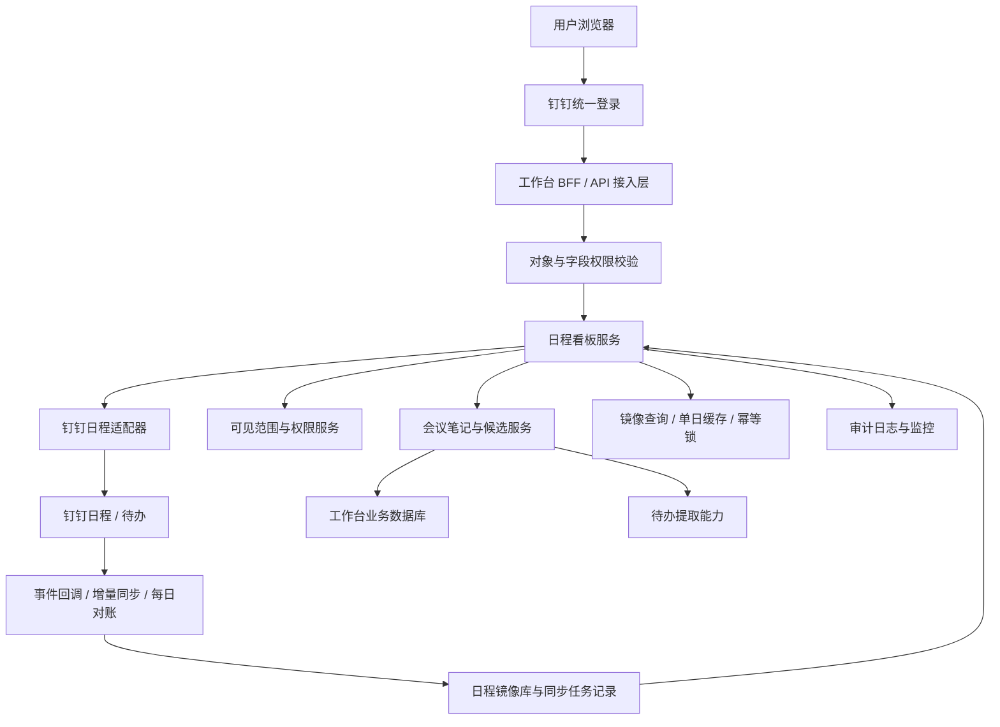
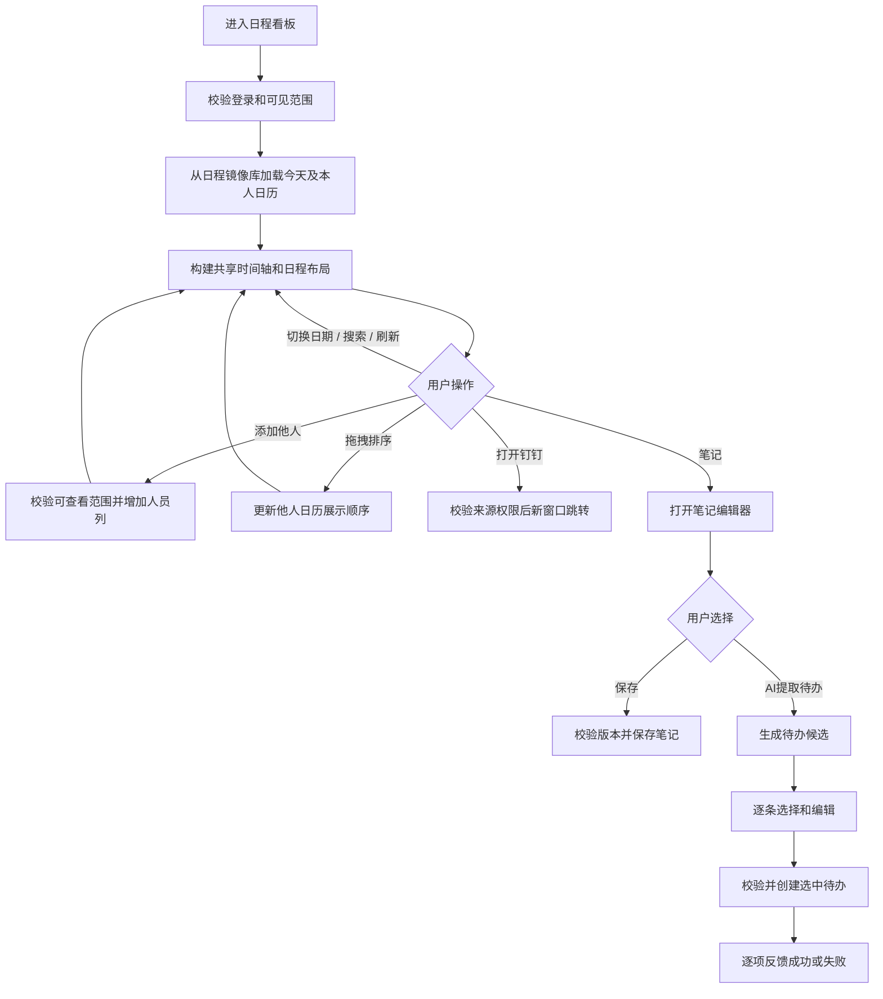
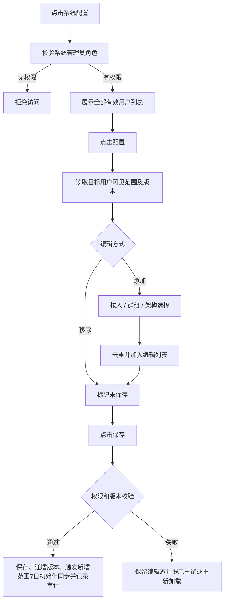
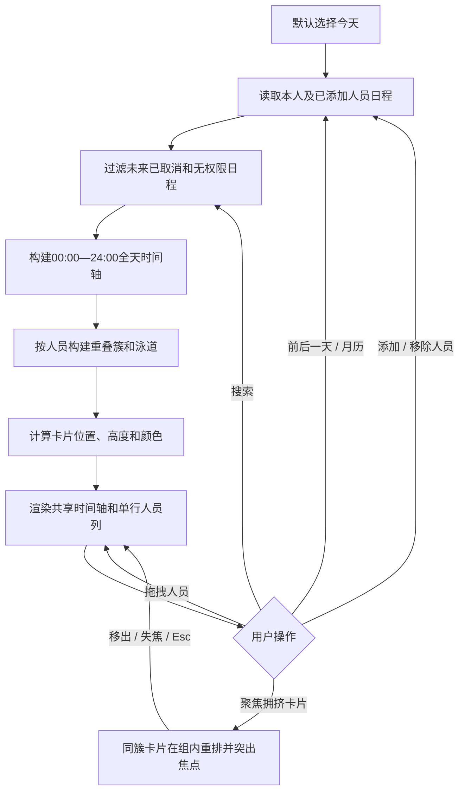
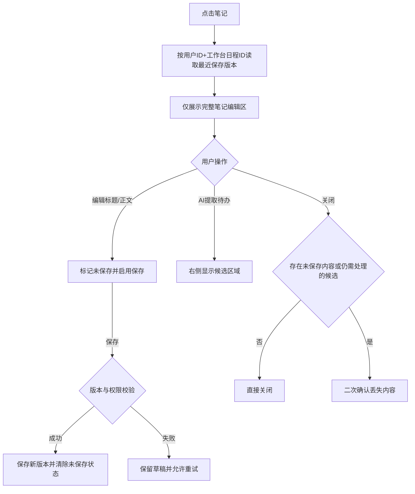
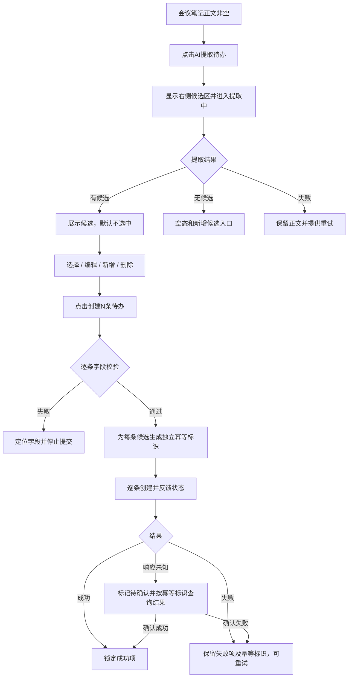

# 20260805-【PRD】AI工作台-日程看板（MVP）-天马智擎项目

_**天马智擎项目**_

**产品需求说明书**

版本信息

本表用于记录本文档的维护过程，请认真填写。

| **版本号** | **时间(必填)** | **状态** | **简要描述(必填)** | **部门** | **责任产品(必填)** | **批准人** |
| --- | --- | --- | --- | --- | --- | --- |
| V1.0 | 2026-07-26 | N | 从工作台总 PRD 拆分日程看板，定义日程浏览、会议笔记和会议纪要生成待办 | AI项目小组 | @公输 |  |
| V1.1 | 2026-08-05 | M | 合并《文本生成待办》PRD，补充待办候选字段、幂等标识、人员解析及提示词 | AI项目小组 | @公输 |  |
| V1.2 | 2026-08-08 | M | 按交互原型重构：新增多人共享时间轴、重叠日程布局、日程状态颜色、可见范围权限管理和手动保存笔记；移除日程负荷、单场 AI 详情及自由文本提取入口 | AI项目小组 | @公输 |  |
| V1.3 | 2026-08-08 | M | 权限模型收敛为系统管理员配置普通用户可查看范围；删除权限角色切换；补充以选中日为中心的7日冷启动窗口、15分钟缓存和手动刷新逻辑 | AI项目小组 | @公输 |  |
| V1.4 | 2026-08-08 | M | 明确日程镜像与会议笔记均落库；新增实时事件、5分钟增量同步、每日对账和失败重试任务；会议笔记通过工作台稳定日程ID建立外键绑定 | AI项目小组 | @公输 |  |
| V1.5 | 2026-08-08 | M | 按标准PRD模板修订：同步与对账范围收敛为近7日，补充跨人员冲突、全天时间轴、同事搜索及完整交互、字段、规则和提示词 | AI项目小组 | @公输 |  |

注：状态可以为N-新建、A-增加、M-更改、D-删除。

# 关于本文档

## 术语

| **词汇名称** | **全局说明** | **归属层** |
| --- | --- | --- |
| 日程看板 | 按日期和人员并列展示当前用户有权访问日程的工作台页面 | 展示层 |
| 本人日历 | 当前登录用户的日程列，固定为看板第一列，不参与删除和拖拽 | 展示层 |
| 他人日历 | 当前用户在授权范围内主动添加到看板的其他人员日程列 | 业务层 |
| 可见范围 | 某普通用户被系统管理员授权查看的人员、群组或组织架构范围 | 权限层 |
| 可查看 | 允许查看授权范围内的日程及允许展示的字段，不允许维护授权关系 | 权限层 |
| 时间冲突 | 当前看板内两条不同的有效日程时间区间严格重叠；既包含同一人员的日程互相冲突，也包含不同人员之间的日程冲突；首尾相接不算冲突 | 规则层 |
| 日程簇 | 通过直接或间接时间重叠关联的一组日程，用于统一分配横向泳道 | 规则层 |
| 日程镜像 | 钉钉日程同步至工作台业务数据库的持久化副本；钉钉仍为权威源，工作台通过镜像提供查询、取消识别和笔记关联 | 数据层 |
| 会议笔记 | 通过工作台稳定日程ID与当前用户和单场日程绑定、仅在用户点击保存后更新版本的笔记 | 业务层 |
| 待办候选 | 从会议笔记提取的结构化行动项，必须经用户审核、选择和确认后才能创建 | 业务层 |
| 幂等标识 | 每个候选确认创建时生成的唯一标识，同一标识只允许成功一次 | 安全层 |

## 参考文档

为了更好理解本文档，请阅读如下文档。

| **编号** | **文档** | **说明及地址** |
| --- | --- | --- |
| 1 | 前端交互原型 | https://fri555.github.io/PORTL/ |
| 2 | Figma UI设计 | https://www.figma.com/design/rRqUi2RORbhHhCnFgH2dTe/%E5%A4%A9%E9%A9%AC%E6%99%BA%E6%93%8E?node-id=0-1&p=f&t=3WOAMYQ62H2eLeQo-0 |
| 3 | 钉钉开放平台—查询日程列表 | https://open.dingtalk.com/document/development/query-an-event-list |
| 4 | 《20260728-【PRD】AI工作台-日程看板（MVP）》 | 本文档格式及待办提取规则参考 |

## 沟通要求

本表记录需要跨部门沟通的事项，以保证该文档内容质量。如果有其它跨部门沟通项，请填写该表中，并记录沟通结果。

| **序号** | **部门/角色** | **沟通内容** | **沟通结果** |
| --- | --- | --- | --- |
| 1 | 钉钉接口负责人 | 取消日程是否可通过变更记录或增量接口识别 | 待接口评审 |
| 2 | 权限平台负责人 | 系统管理员身份校验、可见范围版本及权限变更通知机制 | 待接口评审 |

# 产品概述

## 产品概述

日程看板面向普通用户，以共享时间轴并列展示本人及有权查看人员的单日日程，帮助用户识别时间安排和冲突，并衔接会议笔记及待办创建。系统管理员通过可见范围配置决定普通用户可以查看哪些人员、群组和组织架构的日程。

日程看板不替代钉钉日历。日程创建、修改、取消及详情以钉钉为准；工作台将授权范围内日程同步为持久化镜像，用于稳定查询、刷新对账、取消识别和笔记外键关联，不提供日程主数据编辑能力。本期不展示日程负荷、整体排期分析、会议重要性、可释放建议或其他单场 AI 详情。

## 产品目标

1. **快速掌握单日安排**：通过统一时间轴查看本人及他人的日程分布、时长和冲突。
2. **支持多人横向比较**：在不换行的前提下添加多个人员日历，并通过横向滚动持续查看。
3. **明确授权边界**：由系统管理员通过人员、群组和组织架构配置普通用户的可查看范围，普通用户不能维护授权关系。
4. **沉淀会议内容**：用户主动保存会议笔记，未保存草稿不会覆盖已保存版本。
5. **形成行动闭环**：从会议笔记提取待办候选，经逐条审核后创建钉钉待办。
6. **保持来源一致**：日程镜像和已创建待办以钉钉为权威来源，通过事件、增量同步和每日对账保持一致。

## 用户角色

### 用户角色描述

| **用户角色** | **职责描述** | **MVP范围** |
| --- | --- | --- |
| 普通用户 | 查看本人及授权范围内他人日程、调整展示顺序、记录笔记并确认创建待办 | ✅ 核心使用角色 |
| 系统管理员 | 查看用户列表，配置普通用户的日程可查看范围 | ✅ 权限配置角色 |
|  |

### 用户故事地图

| **用户活动** | **用户任务** | **用户故事** | **对应功能点** |
| --- | --- | --- | --- |
| 配置权限 | 配置用户范围 | 作为管理员，我希望按人、群组和组织配置日程可见范围 | M1 可见范围配置 |
| 查看日程 | 选择日期 | 作为用户，我希望通过月历或前后一天按钮查看目标日期 | M2 日期导航 |
| 查看日程 | 添加他人 | 作为用户，我希望添加有权查看的同事日历进行对照 | M2 多人日历 |
| 查看日程 | 调整顺序 | 作为用户，我希望拖动他人日历改变横向展示顺序 | M2 拖拽排序 |
| 理解时间 | 查看时长与冲突 | 作为用户，我希望日程按真实起止时间落在共享时间轴上 | M2 时间轴与冲突布局 |
| 查看来源 | 打开原日程 | 作为用户，我希望从卡片跳转钉钉查看完整日程 | M2 来源跳转 |
| 记录会议 | 编辑并保存笔记 | 作为用户，我希望主动保存笔记，避免草稿误覆盖历史版本 | M3 会议笔记 |
| 形成待办 | 提取并审核候选 | 作为用户，我希望从会议笔记提取并编辑多条待办候选 | M4 待办提取 |
| 形成待办 | 批量创建 | 作为用户，我希望只创建选中且校验通过的候选 | M4 批量创建 |

## 同类产品/竞品调研（选写）

| **产品/能力** | **现有优势** | **本产品定位** |
| --- | --- | --- |
| 钉钉日历 | 日程创建、修改、参会、忙闲和完整详情 | 权威源系统；工作台持久化只读日程镜像并聚合多人单日视图，不复制完整日历编辑能力 |
| 钉钉待办 | 完整的任务创建、分配、提醒和完成闭环 | 权威源系统；工作台负责从笔记提取、审核并发起创建 |

# 功能需求

## 全局通用规则

### 系统范围

| **规则项** | **说明** |
| --- | --- |
| 本期范围 | 日程权限、月历与日期切换、共享时间轴、多人日历、冲突布局、搜索、刷新、来源跳转、会议笔记、笔记提取待办、候选审核与批量创建 |
| 权威数据 | 日程及已创建待办以钉钉接口为准；工作台建设只读日程镜像库和笔记库，不建设可独立编辑的第二套日历或待办主库 |
| 不在范围 | 日程负荷、整体日程分析、会议重要性、可释放建议、AI 听记详情、AI 会议简介 |
| 搜索 | 只筛选选中日期已经加载的有权日程，停止输入300ms后生效，不请求源系统 |
| 冷启动 | 默认选中今天D；加载`D-3日00:00（含）—D+4日00:00（不含）`连续7个自然日及当前已展示人员（至少本人）。例如D为4号时加载1—7号；不加载全部授权人员 |
| 日期查询 | 用户点击不同日期时均发起一次单日查询，只查询日程镜像库中该日`00:00（含）—次日00:00（不含）`及当前已展示人员；重复点击当前已选中日期不重复请求 |
| 缓存 | 冷启动7日数据库查询结果按查看人、日程所属人、单个自然日和权限版本拆分缓存；单日查询先读同口径缓存，成功数据有效15分钟 |
| 缓存命中 | 单日查询命中有效缓存时直接返回；未命中时查询日程镜像库。缓存或镜像超过同步时效时先返回库存数据并异步触发同步，不让页面直接依赖钉钉响应 |
| 新增人员 | 只查询新增人员在当前选中日期的单日日程，不补取该人员完整7日窗口 |
| 自动更新 | 单日缓存过期但存在旧数据时先展示旧数据并后台刷新当日；无缓存时展示加载态；页面重新可见时检查当前选中日 |
| 手动刷新 | 跳过15分钟缓存，向钉钉同步当前选中日和当前已展示人员；同步结果先事务性更新日程镜像库，再清理对应缓存并返回最新库存数据；失败时保留上次成功库存数据 |
| 用户确认 | 笔记只有点击保存才更新版本；待办候选只有点击创建才写入钉钉 |
|  |

### 身份认证与授权

| **规则项** | **说明** |
| --- | --- |
| 门户认证 | 用户通过钉钉统一登录，服务端换取身份并建立安全会话 |
| 日程列表 | 只返回当前用户有权访问的日程及允许展示字段 |
| 系统配置入口 | 仅系统管理员可见；普通用户不展示入口，也不得调用权限配置接口 |
| 可查看 | 可以查看授权对象的日程，不得新增、修改、取消其日程或配置授权关系 |
| 权限叠加 | 同一自然人由人员、群组或组织多个来源覆盖时只形成一份可查看结果 |
|  |
|  |


### 数据保存边界

| **数据类型** | **保存位置** | **保存与安全约束** |
| --- | --- | --- |
| 日程镜像、参会关系、同步状态 | 工作台业务数据库 | 钉钉为权威源；按来源租户、来源系统和来源日程编号幂等写入，修改采用upsert，取消或删除采用状态标记，不物理删除被笔记引用的日程记录 |
| 已创建待办 | 钉钉及对应源系统 | 源系统为权威数据；工作台保存创建结果和来源关联，不维护待办主状态 |
| 可见范围、权限版本 | 工作台业务数据库 | 按授权主体、对象类型和对象编号保存，权限固定为可查看，所有变更记录审计 |
| 会议笔记及版本 | 工作台业务数据库 | 必须以工作台稳定日程ID作为外键，并按用户编号+日程ID隔离；点击保存后才产生新版本，禁止保存不存在的日程ID或孤立笔记 |
| 待办候选、创建结果、幂等标识 | 工作台业务数据库/受控缓存 | 与笔记版本绑定；成功项不可重复提交 |
| 日程单日缓存 | 受控缓存服务 | 日程镜像库查询成功后按查看人、日程所属人、权限版本和单个自然日拆分保存，有效15分钟；重叠窗口复用同日数据，缓存不作为持久化数据源 |
| 选中日期、月历状态、搜索词、已添加人员顺序、未保存笔记草稿 | 浏览器会话 | 刷新、关闭页面或退出登录可清除；不得覆盖服务端已保存版本 |

### 日程时间与状态计算规则

| **规则项** | **说明** |
| --- | --- |
| 当前时间 | 所有状态计算统一使用服务端校准后的当前时间和用户时区；本期为北京时间UTC+8 |
| 未开始 | 当前时间早于开始时间超过15分钟 |
| 即将开始 | 当前时间早于开始时间，且距离开始时间大于0分钟、不超过15分钟 |
| 进行中 | 当前时间大于等于开始时间且严格早于结束时间 |
| 已结束 | 当前时间大于等于结束时间 |
| 冲突 | 当前看板内两条不同有效日程满足`A.start＜B.end且B.start＜A.end`即冲突，包含同一人员内部及不同人员之间；同一来源日程ID在多人列中的副本视为同一场会议，不互相判冲突；首尾相接不冲突 |
| 状态优先级 | 历史已取消＞有效冲突＞已结束＞即将开始＞进行中＞未开始；已取消日程不参与冲突计算 |
| 未来已取消 | 日程开始时间晚于当前时间时不展示 |
| 历史已取消 | 日程开始时间小于等于当前时间时保留，浅灰并对标题增加删除线；仍可查看已保存笔记 |
| 取消识别 | 事件或源接口返回取消状态时更新镜像为已取消；仅在完整对账任务成功覆盖相同人员和时间范围后，才允许将源端缺失记录标为源端删除。无法确认是取消、删除还是权限回收时保持原状态并记录待核验，不得直接判为取消 |
| 跨日日程 | 原区间按`[start,end)`半开区间处理；在每个被覆盖日期生成`片段开始＜片段结束`的当日片段，开始取原开始与00:00较晚者，结束取原结束与次日00:00较早者；结束恰逢00:00时不在次日生成零时长片段 |
| 全天日程 | 按00:00—24:00展示，时间轴扩展为完整自然日；若源系统无法提供可靠起止时间则不进入时间轴并提示前往钉钉查看 |
| 非法时间 | 结束时间不晚于开始时间、时间缺失或无法解析时不绘制卡片，记录数据异常并保留来源跳转入口 |
| 计算精度 | 使用毫秒时间戳直接比较，不按分钟四舍五入；恰好15分钟属于即将开始，恰好开始属于进行中，恰好结束属于已结束 |
| 自动重算 | 看板前台可见时每60秒及整分钟边界重算；页面从后台恢复、系统时区变化、切换日期或刷新成功后立即校准并重算 |

### 加载态/空态/错误态

| **场景** | **状态** | **处理方式** |
| --- | --- | --- |
| 首次加载7日窗口 | 加载中 | 看板区域展示骨架或读取提示，日期组件可操作 |
| 缓存过期且有旧数据 | 更新中 | 先展示旧数据并在后台刷新；成功后无跳变更新，失败提示当前为上次数据 |
| 手动刷新 | 刷新中 | 保留已有日程，刷新按钮旋转并禁止重复点击 |
| 选中日期无日程 | 空 | 今天显示“今天暂无日程”，其他日期显示“该日期暂无日程” |
| 搜索无结果 | 空 | 显示“未找到匹配日程”和“清空搜索” |
| 加载失败且有缓存 | 错误 | 保留旧数据并提示“刷新失败，当前为上次数据” |
| 加载失败且无缓存 | 错误 | 显示错误说明和重新加载入口 |
| 权限保存失败 | 错误 | 保留当前编辑结果并标记未保存，允许重试 |
| 笔记保存失败 | 错误 | 保留弹窗内草稿，不更新已保存版本，允许重试 |
| 待办提取无候选 | 空 | 展示空态和手动新增候选入口 |
| 待办创建部分失败 | 部分成功 | 成功项锁定，失败项保留并支持重试 |

### 并发与防重复规则

| **规则项** | **说明** |
| --- | --- |
| 日程请求 | 冷启动7日请求及单日查询均按查看人、日程所属人、权限版本和日期范围去重；返回结果按单日版本写入，旧请求不得覆盖新结果 |
| 权限保存 | 仅系统管理员可提交目标用户完整可见范围，并携带目标用户全局版本；普通用户的请求必须拒绝 |
| 搜索输入 | 300ms防抖，连续输入只执行最后一个搜索词 |
| 手动刷新 | 刷新中禁止再次刷新 |
| 笔记保存 | 点击保存触发；保存中禁止重复提交；输入变化产生新的未保存状态 |
| 待办提取 | 同一笔记内容同时只运行一个提取请求；晚返回结果不得覆盖新结果 |
| 待办创建 | 每个候选使用独立幂等标识；成功项不可二次提交 |
| 关闭保护 | 存在未保存笔记，或存在未创建、失败、待确认候选时必须二次确认；候选全部成功或候选为空时不因提取行为单独拦截关闭 |

## 流程图

### 技术架构图



### 业务流程图



## 功能模块清单

| **需求编号** | **主功能** | **子功能** | **功能描述** | **优先级** |
| --- | --- | --- | --- | --- |
| M1 | 日程数据接入与权限管理 | 日程镜像与缓存 | 将授权日程持久化落库，按7日窗口读取镜像并按单日管理15分钟查询缓存 | P0 |
|  |  | 自动同步任务 | 实时事件、5分钟增量同步、每日全量对账、失败重试和人工补偿 | P0 |
|  |  | 用户权限列表 | 查询用户并进入单用户配置 | P0 |
|  |  | 可见范围 | 系统管理员按人、群组、组织配置普通用户可查看范围 | P0 |
|  |  | 权限保存 | 显式保存、版本校验和权限变更审计 | P0 |
| M2 | 日程看板 | 日期与月历 | 默认今天、前后一天、月份切换和月历收起 | P0 |
|  |  | 多人日历 | 添加、移除、拖拽排序和横向滚动 | P0 |
|  |  | 共享时间轴 | 固定小时刻度、当前时间线和跨小时卡片 | P0 |
|  |  | 冲突布局 | 重叠泳道、组内聚焦重排和恢复 | P0 |
|  |  | 卡片状态 | 三行布局、状态颜色、取消日程和钉钉跳转 | P0 |
|  |  | 搜索与刷新 | 本地搜索、日期切换单日查询、当日强制刷新及空错状态 | P0 |
| M3 | 会议笔记 | 笔记编辑器 | 标题、正文、基础格式工具和手动保存 | P0 |
|  |  | 关闭保护 | 未保存草稿或仍需处理的候选二次确认 | P0 |
| M4 | 待办提取与创建 | 提取候选 | 从会议笔记提取结构化候选 | P0 |
|  |  | 候选编辑 | 选择、新增、删除和字段编辑 | P0 |
|  |  | 批量创建 | 校验、幂等提交、逐项反馈和失败重试 | P0 |

## 功能详情

### M1-日程数据接入与权限管理

#### 功能需求描述

| **EARS 模式** | **需求描述** |
| --- | --- |
| 普遍型 | 系统应将授权范围内钉钉日程持久化为日程镜像，并按以选中日为中心的7日窗口读取镜像；只有系统管理员可以配置可见范围。 |
| 状态驱动型 | 当日程事件、增量任务、每日对账或手动刷新取得源数据时，系统应先幂等更新日程镜像，再使查询缓存失效；当多个授权来源覆盖同一自然人时应去重。 |
| 事件驱动型 | 当收到钉钉变更事件、定时任务到期、用户手动刷新或系统管理员保存权限时，系统应执行对应同步、落库、缓存清理或权限持久化操作。 |
| 不良行为型 | 系统不应向普通用户展示系统配置入口，不应接受普通用户发起的权限读取或保存请求。 |

#### 业务主流程图及说明



流程说明：

1. 只有系统管理员可以配置全部授权对象；普通用户不能进入该流程。
2. 添加和修改只更新弹窗编辑态，点击保存后才写入服务端。
3. 同一自然人可以由人员、群组、组织多条路径覆盖；结果去重为可查看，删除一条路径不影响其他仍有效路径。

#### 界面原型

| **动作** | **显示** | **类型** | **描述** |
| --- | --- | --- | --- |
| 【系统配置】展示 | 日程权限管理入口 | 按钮 | · 仅系统管理员可见<br>· 普通用户不展示且接口拒绝访问 |
| 【系统配置】点击 | 用户列表弹窗 | 弹窗 | · 展示工号、姓名、花名、部门、岗位、手机号、状态<br>· 每行仅保留“配置”按钮 |
| 【查询条件】输入 | 筛选用户列表 | 输入框 | · 姓名/花名/手机号支持一个综合搜索框<br>· 工号和部门独立筛选<br>· 点击重置清空全部条件 |
| 【配置】点击 | 目标用户当前可见范围 | 二级页面 | · 展示对象类型、名称、范围说明和删除操作<br>· 所有范围固定为可查看，不展示角色下拉框 |
| 【添加可见范围】点击 | 多来源选择器 | 三级页面 | · 按人和群组为列表复选框<br>· 按架构为树形复选框 |
| 【范围搜索】输入 | 过滤当前页签对象 | 输入框 | · 不清空其他页签已选择项<br>· 已选数量跨页签累计 |
| 【组织展开】点击 | 展开/收起子组织 | 树节点 | · 不改变节点勾选状态 |
| 【确认添加】点击 | 返回范围列表 | 按钮 | · 无选择时禁用<br>· 最多100项<br>· 跳过完全重复对象并保留其他新增项 |
| 【删除范围】点击 | 从编辑列表移除 | 图标按钮 | · 仅标记待删除<br>· 保存成功后生效 |
| 【保存】点击 | 保存反馈 | 按钮 | · 无修改时禁用<br>· 保存中禁止重复点击<br>· 成功后显示已保存<br>· 失败保留未保存状态 |

#### 数据说明（业务实体）

**权限配置用户查询结果**

| **字段名** | **数据类型** | **长度** | **默认值** | **必需** | **约束说明** |
| --- | --- | --- | --- | --- | --- |
| 用户编号 | 字符 | 64 | — | 是 | 用户稳定标识，点击配置时作为目标用户编号 |
| 工号 | 字符 | 64 | 空 | 否 | 支持精确或前缀查询，列表展示 |
| 用户姓名 | 字符 | 100 | — | 是 | 支持综合关键词查询，列表展示 |
| 花名 | 字符 | 100 | 空 | 否 | 支持综合关键词查询，列表展示 |
| 部门 | 字符 | 200 | 空 | 否 | 支持筛选，展示当前主部门 |
| 岗位 | 字符 | 100 | 空 | 否 | 仅用于列表展示 |
| 手机号 | 字符 | 32 | 空 | 否 | 按数据权限脱敏展示，支持综合关键词查询 |
| 用户状态 | 枚举 | — | 启用 | 是 | 启用、禁用；禁用用户不可新增权限配置 |

**可见范围授权**

| **字段名** | **数据类型** | **长度** | **默认值** | **必需** | **约束说明** |
| --- | --- | --- | --- | --- | --- |
| 授权编号 | 字符 | 64 | 系统生成 | 是 | 单条授权稳定标识 |
| 被授权用户编号 | 字符 | 64 | — | 是 | 接收可见范围的用户 |
| 对象类型 | 枚举 | — | — | 是 | 人员、群组、组织架构 |
| 对象编号 | 字符 | 64 | — | 是 | 对应类型下稳定编号 |
| 对象显示名称 | 字符 | 200 | — | 是 | 用于当前范围列表回显；正式鉴权仍以对象编号为准 |
| 范围说明 | 字符 | 500 | 空 | 否 | 群组人数、组织层级等辅助说明，不参与权限判断 |
| 权限版本 | 整数 | — | 1 | 是 | 每次成功保存递增 |
| 创建/修改人 | 字符 | 64 | 当前用户 | 是 | 用于审计，不接收前端伪造值 |
| 修改时间 | 时间戳 | — | 当前时间 | 是 | 服务端生成 |

**日程同步任务**

| **字段名** | **数据类型** | **长度** | **默认值** | **必需** | **约束说明** |
| --- | --- | --- | --- | --- | --- |
| 任务编号 | 字符 | 64 | 系统生成 | 是 | 单次事件、增量、对账或手动同步的稳定标识 |
| 任务类型 | 枚举 | — | — | 是 | EVENT、PERMISSION_INIT、INCREMENTAL、RECONCILIATION、MANUAL |
| 同步人员范围 | JSON | — | — | 是 | 本次同步的日程所属人员编号集合 |
| 开始/结束日期 | 日期 | — | — | 是 | 前闭后开的同步范围 |
| 任务状态 | 枚举 | — | PENDING | 是 | PENDING、RUNNING、SUCCESS、PARTIAL_FAILED、FAILED |
| 尝试次数 | 整数 | — | 0 | 是 | 首次执行计1，最多4次（首次+3次重试） |
| 游标/源版本 | 字符 | 256 | 空 | 否 | 增量同步断点或来源版本 |
| 成功/失败数量 | 整数 | — | 0 | 是 | 用于监控和补偿 |
| 错误摘要 | 字符 | 1000 | 空 | 否 | 不记录访问令牌和完整日程正文 |
| 创建/完成时间 | 时间戳 | — | 当前时间/空 | 是/否 | 服务端生成 |

#### 业务规则和约束条件

| **规则项** | **说明** |
| --- | --- |
| 选择上限 | 单次确认最多100个对象；达到上限后未选项不可继续勾选 |
| 精确去重 | 同一对象类型和对象编号只保留一条配置 |
| 跨来源叠加 | 同一自然人同时被人员、群组、组织覆盖时只形成一份可查看结果 |
| 组织范围 | 选择组织节点代表该节点当前成员及下级组织成员；成员变化后按查询时组织关系动态生效 |
| 父子节点 | 父子组织可同时配置；重复覆盖不产生多份日程 |
| 管理边界 | 只有系统管理员可维护授权关系；可见范围不允许任何用户修改、取消或代创建他人日程 |
| 保存边界 | 添加、删除在保存前均为编辑态；关闭弹窗不提交这些修改 |
| 版本粒度 | 系统管理员保存时使用目标用户全局版本；版本不一致时拒绝覆盖并要求重新加载 |
| 权限变化 | 保存成功后递增对应版本并清理受影响查看人、日程所属人和自然日缓存；新增可见对象时创建PERMISSION_INIT任务，同步新增人员以当天为中心的7日数据后落库；删除范围不删除日程镜像，只影响查询鉴权 |
| 日程落库 | 钉钉仍为权威源；任何事件、定时或手动同步结果必须先写入日程镜像库，事务提交成功后才清理缓存或向页面返回新版本 |
| 实时事件 | 钉钉支持的新增、修改、取消事件到达后立即校验签名和租户，按来源日程编号幂等upsert；重复或乱序事件不得覆盖更高源版本 |
| 增量同步 | 每5分钟执行一次，默认覆盖当天前3日至当天后3日及有效可见范围涉及的日程所属人员；使用源游标或更新时间增量拉取，并按单人失败隔离 |
| 每日对账 | 每日02:00执行，按执行日D核验D-3至D+3共7个自然日及有效可见范围涉及的日程所属人员；只有某人员和完整7日范围全部分页查询成功后，才可将源端缺失记录标记为源端删除；部分成功不得据此删除记录 |
| 手动刷新 | 用户刷新当前日时创建MANUAL任务，只同步当前已展示人员和选中日；同一操作者、人员集合和日期存在RUNNING任务时复用该任务，不重复请求钉钉 |
| 失败重试 | EVENT、PERMISSION_INIT、INCREMENTAL、RECONCILIATION、MANUAL失败后分别于1、5、15分钟重试，累计4次仍失败则进入FAILED并告警；已成功人员不重复同步 |
| 数据保留 | 已取消、源端删除或权限回收的日程镜像不立即物理删除；存在会议笔记外键时必须永久保留关联所需最小字段，无笔记记录的保留周期按数据治理要求执行 |
| 监控告警 | 监控任务延迟、连续失败、部分失败、同步条数异常、源版本倒退和库存数据超时；连续两轮增量失败或每日对账失败必须告警并支持人工重跑 |

#### 接口说明

| **接口** | **调用方式** | **请求/响应重点** | **结果** |
| --- | --- | --- | --- |
| 钉钉查询日程列表接口 | 查询 | 按钉钉官方文档传入日历所属人与时间范围并处理分页；同步任务须保存完整查询结果后再更新镜像。接入时确认应用权限、调用频控、分页、取消/删除状态及字段可见性 | 返回指定范围内当前有权获取的日程列表；官方文档：https://open.dingtalk.com/document/development/query-an-event-list |

#### 补充说明

前端原型中的保存、刷新和同步状态只演示交互变化；正式功能必须由服务端完成鉴权、日程镜像落库、任务调度、版本控制、缓存失效、失败补偿和审计。

### M2-日程看板

#### 功能需求描述

| **EARS 模式** | **需求描述** |
| --- | --- |
| 普遍型 | 系统应在共享小时轴上按人员并列展示选中日期的日程，支持日期切换、添加他人、排序、搜索、刷新和来源跳转。 |
| 状态驱动型 | 当日程处于冲突、已结束、即将开始、进行中、未开始或历史已取消状态时，应按规则展示对应颜色和文本效果。 |
| 事件驱动型 | 当用户切换日期、折叠月历、添加/移除/拖拽人员、聚焦重叠日程或横向滚动时，应保持时间和列对齐。 |
| 不良行为型 | 系统不应把多人日历换行，不应通过卡片覆盖使其他冲突日程不可点击，不应展示未来已取消日程。 |

#### 业务主流程图及说明



流程说明：

1. 默认时间轴固定展示00:00—24:00。选中今天时，首次进入或回到今天后自动将当前时间线定位到视口焦点附近；用户仍可上下滚动查看全天。
2. 卡片纵向位置按片段实际开始时间计算，高度按持续时间等比例计算；短日程使用足以容纳标题、时间范围、会议室和操作入口的最小高度，具体视觉尺寸由UI设计确定。
3. 横向泳道在每个人员列内部计算，用于解决同列卡片重叠；业务冲突则在当前全部已展示人员的日程之间计算，既包含同一人员内部，也包含不同人员之间。

#### 界面原型

| **动作** | **显示** | **类型** | **描述** |
| --- | --- | --- | --- |
| 【首次进入】 | 今天的本人日程 | 看板 | · 默认选中今天<br>· 左侧月历默认展开<br>· 不展示日程负荷和AI详情 |
| 【上一天/下一天】点击 | 相邻日期日程 | 图标按钮 | · 按自然日切换<br>· 跨月时同步更新月历月份 |
| 【今天】点击 | 回到今天 | 按钮 | · 同步选中日期和可见月份 |
| 【上月/下月】点击 | 目标月份月历 | 月历按钮 | · 不自动改变选中日期，直至用户点击具体日期 |
| 【日期】点击 | 查询并更新所有人员列 | 月历 | · 点击不同日期时发起一次当日查询，仅查询当前已展示人员<br>· 命中15分钟缓存时直接返回<br>· 重复点击当前日期不重复请求<br>· 选中日期高亮<br>· 清除只属于前一日期的临时聚焦状态 |
| 【月历收起/展开】点击 | 调整左右布局 | 图标按钮 | · 不改变日期、搜索词、人员和纵向滚动位置 |
| 【增加他人日程】点击 | 人员选择列表 | 按钮 | · 位于月历分割线下、我的日程上方<br>· 只展示当前用户有权查看的人员<br>· 已添加人员置为不可重复选择状态<br>· 默认展示搜索框和候选列表 |
| 【同事搜索】输入 | 过滤可查看人员 | 输入框 | · 支持按姓名或部门关键词过滤<br>· 只在当前授权候选中搜索<br>· 不改变已添加人员<br>· 清空后恢复完整候选列表<br>· 无结果显示“未找到可查看的同事” |
| 【选择人员】点击 | 增加人员列 | 列表项 | · 添加到他人列表末尾<br>· 只查询该人员当前选中日的日程<br>· 选择成功后清空搜索词并关闭列表<br>· 不限制总人数 |
| 【移除人员】点击 | 删除该人员列 | 图标按钮 | · 本人不可移除<br>· 不影响权限配置和其他人员顺序 |
| 【拖拽人员】操作 | 改变他人列顺序 | 拖拽 | · 左侧人员列表和标题列均可发起<br>· 本人固定第一位<br>· 非法落点恢复原顺序 |
| 【横向滚动】操作 | 查看第五人及以后 | 滚动 | · 时间轴和本人列保持固定<br>· 标题与内容同步移动 |
| 【日程卡片】默认 | 三行卡片 | 卡片 | · 第一行标题<br>· 第二行时间范围、外部打开和笔记<br>· 第三行地点，无地点仍保留高度 |
| 【某人员无日程】 | 保留该人员标题列和空白时间网格 | 人员列空态 | · 不隐藏人员列<br>· 其他人员仍正常展示<br>· 只有所有人员均无日程时才展示看板级空态 |
| 【重叠卡片】Hover/聚焦 | 组内重排布局 | 卡片组 | · 当前卡片展示更多宽度<br>· 其他卡片不被遮挡且仍可点击<br>· 点击笔记或外部打开时保持目标操作可达<br>· 移出、失焦或按Esc后恢复等分 |
| 【笔记】点击 | 打开会议笔记 | 文字按钮 | · 当前用户对该日程具备笔记权限时展示<br>· 笔记始终属于当前用户，不读取日程所属人的私人笔记<br>· 不占用标题行 |
| 【外部打开】Hover | “在钉钉中查看” | 图标提示 | · 图标位于第二行，视觉权重低于笔记按钮 |
| 【外部打开】点击 | 新窗口打开钉钉 | 跳转 | · 打开前校验对象权限和地址有效性<br>· 原看板状态不变 |
| 【搜索】输入 | 过滤当前日期日程 | 输入框 | · 搜索标题和地点<br>· 不改变已添加人员和时间轴规则 |
| 【清空搜索】点击 | 恢复全部日程 | 图标按钮 | · 清空搜索词并重新布局 |
| 【刷新】点击 | 更新当前选中日 | 图标按钮 | · 跳过15分钟缓存<br>· 仅刷新当前选中日和已展示人员<br>· 保留旧内容直至成功<br>· 成功后重算状态、冲突和取消记录 |

#### 数据说明（业务实体）

**日程镜像**

| **字段名** | **数据类型** | **长度** | **默认值** | **必需** | **约束说明** |
| --- | --- | --- | --- | --- | --- |
| 工作台日程ID | 字符 | 64 | 系统生成 | 是 | 工作台稳定主键，供片段、笔记、待办来源和跳转关系引用；生成后不可变化或复用 |
| 来源系统 | 枚举 | — | DINGTALK | 是 | 日程权威来源标识 |
| 来源租户编号 | 字符 | 64 | — | 是 | 与来源系统、来源日程编号共同构成幂等唯一键 |
| 来源日程编号 | 字符 | 256 | — | 是 | 钉钉稳定日程编号；不得直接作为工作台表主键 |
| 所属人员编号 | 字符 | 64 | — | 是 | 决定所属人员列 |
| 原始开始时间 | 日期时间 | — | — | 是 | 源日程完整开始时间，必须早于原始结束时间 |
| 原始结束时间 | 日期时间 | — | — | 是 | 用于时间状态和取消规则 |
| 片段编号 | 字符 | ≤96 | 工作台日程ID+日期 | 是 | 同一日程每个自然日片段稳定唯一 |
| 片段日期 | 日期 | — | — | 是 | 当前看板选中日期 |
| 片段开始时间 | 日期时间 | — | — | 是 | `max(原始开始, 片段日期00:00)` |
| 片段结束时间 | 日期时间 | — | — | 是 | `min(原始结束, 片段次日00:00)`，必须晚于片段开始 |
| 标题 | 字符 | ≤2048 | — | 是 | 第一行展示，溢出省略 |
| 地点 | 字符 | ≤200 | 空 | 否 | 第三行展示，无值时保留行高 |
| 源日程地址 | 字符 | ≤2048 | 空 | 否 | 服务端生成的受控跳转地址 |
| 源状态 | 枚举 | — | 有效 | 是 | 有效、已取消、源端删除、待核验 |
| 源版本 | 字符 | 128 | — | 是 | 防止乱序事件或旧同步结果覆盖新数据 |
| 最近源更新时间 | 时间戳 | — | — | 否 | 钉钉返回的修改时间 |
| 最近同步时间 | 时间戳 | — | 当前时间 | 是 | 工作台成功写入本条镜像的时间 |
| 最近同步任务编号 | 字符 | 64 | — | 是 | 关联日程同步任务，便于追溯 |
| 删除标识 | 布尔 | — | 否 | 是 | 逻辑删除标识；存在笔记外键时禁止物理删除 |

**人员日历展示状态**

| **字段名** | **数据类型** | **默认值** | **必需** | **约束说明** |
| --- | --- | --- | --- | --- |
| 人员编号列表 | 字符数组 | 仅本人 | 是 | 本人固定第一位；他人按用户排序保存于会话 |
| 月历展开状态 | 布尔 | 展开 | 是 | 收起不改变日期和人员 |
| 选中日期 | 日期 | 今天 | 是 | 前后一天和月历共用 |
| 搜索词 | 字符 | 空 | 否 | 只过滤当前日期已加载数据 |

#### 业务规则和约束条件

**时间轴与布局规则**

| **规则项** | **说明** |
| --- | --- |
| 小时刻度 | 固定每1小时一个主刻度，时间标签为00:00至24:00；半点仅使用辅助线，不生成独立时间标签；不同开始分钟通过卡片在小时区间内的相对位置表达 |
| 时间范围 | 始终展示选中自然日00:00—24:00，不因当日日程早晚或数量改变范围 |
| 当前时间线 | 仅选中今天时展示；首次进入、点击今天或返回前台时将当前时间附近滚动到视口焦点；时间线按分钟定位并每60秒更新，切换其他日期时隐藏 |
| 布局字段口径 | 卡片布局、泳道和选中日期内冲突均使用片段开始/结束；状态和取消使用原始开始/结束，笔记与来源跳转统一使用工作台日程ID，由服务端解析来源日程编号 |
| 卡片顶部 | 按`(片段开始分钟－当日00:00分钟)÷全天分钟数`计算在全天时间轴中的相对位置，不按整点或半点吸附 |
| 卡片高度 | 按片段持续时间相对全天时长等比例计算；跨小时片段自然覆盖多个小时区间；不足以承载三行内容时采用统一最小高度 |
| 视觉占用时间 | 泳道布局使用`max(实际结束位置, 开始位置+最小卡片高度对应位置)`，避免短日程卡片相互覆盖；该视觉占用只影响布局，不改变真实冲突判断 |
| 泳道分配 | 按开始时间升序、结束时间升序、工作台日程ID升序排序；依次放入视觉占用结束时间不晚于当前开始时间的最左可用泳道 |
| 冲突簇 | 新日程开始时间早于当前簇最晚视觉占用结束时间则加入同簇；通过间接重叠连接的日程属于同簇 |
| 视觉拥挤与业务冲突 | 因最小高度进入不同泳道但实际时间未重叠的卡片只调整宽度，不显示浅红色；冲突颜色始终按真实起止时间判断 |
| 默认宽度 | 同一视觉簇最大并发泳道数为N时，每条泳道宽度为1/N；只有不属于视觉簇或视觉簇仅一条泳道的卡片才占满人员列 |
| 聚焦宽度 | 以冲突簇为单位进行组内重排：焦点卡片获得更多可用宽度，其余卡片相应收窄但不得被覆盖，所有卡片及其笔记、外部打开操作仍可点击；具体比例由UI设计确定 |
| 恢复 | 鼠标移出或失焦120ms后恢复等分；在延迟内进入同簇其他卡片时直接切换焦点；按Esc立即恢复 |
| 人员列最小宽度 | 设置能稳定展示卡片三行信息和操作入口的可读最小宽度；存在更多重叠泳道时可适当增加，具体尺寸由UI设计确定 |
| 超过四人 | 所有人员始终同一行，不换行；总宽度超过视口时出现横向滚动条 |
| 大量人员 | 不设置业务选择上限；同时添加超过20人时启用横向列虚拟化，只渲染视口及前后缓冲列，固定时间轴和本人列始终保留 |
| 固定区域 | 时间轴固定最左侧；本人日历的标题和内容整体固定在时间轴右侧；他人列在其后滚动 |

**卡片状态规则**

| **状态** | **判断条件** | **显示** |
| --- | --- | --- |
| 历史已取消 | 源状态已取消且开始时间≤当前时间 | 浅灰色，标题删除线，允许查看已保存笔记 |
| 冲突 | 当前看板内两条不同有效日程的真实时间严格重叠；包含同一人员及不同人员；同一来源日程ID在多人列中的副本不互判冲突 | 浅红色；涉及冲突的卡片均展示，优先于普通时间状态 |
| 已结束 | 有效且当前时间≥结束时间 | 浅灰色 |
| 即将开始 | 有效且0＜开始时间－当前时间≤15分钟 | 浅黄色 |
| 进行中 | 有效且开始时间≤当前时间＜结束时间 | 浅绿色 |
| 未开始 | 有效且开始时间－当前时间＞15分钟 | 白色 |
| 未来已取消 | 源状态已取消且开始时间＞当前时间 | 不展示 |

复合状态只采用最高优先级视觉样式，不叠加多个颜色或状态标签。例如已经结束但发生过冲突的有效日程仍显示浅红色；历史已取消日程不参与冲突，只显示浅灰和删除线。按已确认交互，卡片不增加可见状态标签；完整状态通过卡片可访问名称和悬停标题提供。

#### 接口说明

本模块使用M1同步并落库的日程镜像，不新增已明确的外部接口。页面内部查询、刷新和来源跳转能力由技术方案定义，本PRD只约束其业务输入、权限和交互结果。

#### 补充说明

1. 若源接口无法区分取消与权限回收，前端不得仅依据“本次缺失”展示历史取消；服务端只有在完整对账成功并结合事件、镜像版本和权限版本后才可更新状态。
2. 颜色不是唯一状态信息。卡片需通过可访问名称提供标题、起止时间、地点和状态；所有图标按钮必须具有可访问名称和可见焦点。

### M3-会议笔记

#### 功能需求描述

| **EARS 模式** | **需求描述** |
| --- | --- |
| 普遍型 | 系统应提供通过工作台稳定日程ID与当前用户和单场日程镜像绑定的会议笔记，包含标题、正文、基础格式工具和显式保存。 |
| 状态驱动型 | 当标题或正文与已保存版本不一致时，应展示未保存状态并启用保存按钮。 |
| 事件驱动型 | 当用户保存、关闭或触发待办提取时，应执行版本保存、关闭校验或显示候选区域。 |
| 不良行为型 | 系统不应自动保存或静默覆盖版本，不应在用户尚未触发提取时提前展示待办候选。 |

#### 业务主流程图及说明



流程说明：

1. 只有点击保存才更新服务端版本；输入过程不触发自动保存。
2. AI提取可以使用当前编辑器正文，但不等同于保存笔记；若正文未保存，关闭时仍按未保存处理。
3. 无未保存修改，且候选为空或全部成功时直接关闭；存在未保存、失败、待确认或尚未创建的候选时二次确认。

#### 界面原型

```text
┌日程笔记─────────────────────────────────────────┐
│ 标题                                                │
│ [B][I][H2][无序列表][有序列表]                       │
│ 完整正文编辑区                                       │
│ 保存状态                         [保存][AI提取待办]  │
│              点击提取后才出现右侧待办候选            │
└───────────────────────────────────────────────────┘
```

| **动作** | **显示** | **类型** | **描述** |
| --- | --- | --- | --- |
| 【笔记】点击 | 完整笔记编辑弹窗 | 弹窗 | · 默认单栏展示<br>· 按当前用户和工作台日程ID读取最近保存版本<br>· 首次无笔记时使用默认标题和空正文<br>· 未触发提取前不展示待办候选 |
| 【笔记加载中】 | 编辑区加载态 | 状态 | · 暂不允许编辑和保存<br>· 加载失败时展示重试入口<br>· 不用空内容覆盖既有版本 |
| 【标题】输入 | 标题编辑状态 | 输入框 | · 支持编辑<br>· 去除首尾空格后为空时提示必填<br>· 标题或正文任一变化即标记为未保存 |
| 【正文】输入 | “有未保存修改” | 富文本编辑区 | · 支持连续输入和粘贴<br>· 输入过程不自动保存<br>· 正文为空时AI提取按钮禁用 |
| 【格式按钮】点击 | 修改选区或当前行 | 工具栏 | · 支持加粗、斜体、二级标题、无序列表和有序列表<br>· 对当前选区或光标所在行生效<br>· 操作后继续保持编辑焦点 |
| 【保存】默认 | 保存按钮状态 | 按钮 | · 无修改时禁用<br>· 有合法修改时可用<br>· 保存中禁用并防止重复提交 |
| 【保存】点击 | 保存反馈 | 按钮 | · 携带当前基准版本保存<br>· 成功显示“笔记已保存”并更新版本<br>· 失败保留当前草稿和未保存状态<br>· 版本冲突时不静默覆盖并提示重新加载 |
| 【AI提取待办】点击 | 右侧待办候选区域 | 按钮 | · 使用点击时的当前正文快照<br>· 不强制先保存笔记<br>· 弹窗切换为左右布局<br>· 提取状态和候选操作见M4 |
| 【关闭】点击/遮罩 | 直接关闭或确认弹窗 | 弹窗 | · 无未保存修改且候选为空或全部成功时直接关闭<br>· 存在未保存笔记或未创建、失败、待确认候选时逐项说明将丢失内容并二次确认<br>· 取消关闭返回原编辑状态 |

#### 数据说明（业务实体）

**会议笔记**

| **字段名** | **数据类型** | **长度** | **默认值** | **必需** | **约束说明** |
| --- | --- | --- | --- | --- | --- |
| 笔记编号 | 字符 | 64 | 系统生成 | 是 | 笔记稳定主键 |
| 用户编号 | 字符 | 64 | 当前用户 | 是 | 服务端会话确定 |
| 工作台日程ID | 字符 | 64 | — | 是 | 外键关联日程镜像工作台日程ID；保存时再次校验日程存在和查看权限，禁止使用来源日程编号替代 |
| 笔记标题 | 字符 | ≤80 | 日程标题+“笔记” | 是 | 去除首尾空格后为空则恢复默认标题 |
| 笔记正文 | 文本 | ≤50000 | 空 | 否 | 支持基础格式标记 |
| 正文格式版本 | 字符 | 32 | 当前编辑器版本 | 是 | 用于后续编辑器格式兼容，不改变正文业务含义 |
| 笔记版本号 | 整数 | — | 0 | 是 | 首次保存为1，后续成功保存递增 |
| 创建时间 | 时间戳 | — | 首次保存时间 | 是 | 服务端生成，后续保存不修改 |
| 保存时间 | 时间戳 | — | 空 | 否 | 服务端最近成功保存时间 |

#### 业务规则和约束条件

| **规则项** | **说明** |
| --- | --- |
| 唯一性 | `用户编号+工作台日程ID`建立唯一约束；同一用户同一日程维护一份当前笔记及历史版本 |
| 外键约束 | 笔记必须关联已落库的日程镜像；日程镜像不存在时拒绝保存。被笔记引用的日程即使取消、源端删除或权限回收也不得物理删除 |
| 来源编号变化 | 来源日程编号、重复日程实例或同步版本发生变化时，只更新日程镜像，不改变工作台日程ID和已有笔记关联 |
| 未保存判断 | 标题或正文任一项与最近保存版本不一致即为未保存 |
| 保存按钮 | 无修改时禁用；有修改时可用；保存中禁用；成功后再次禁用 |
| 保存版本 | 每次成功保存覆盖当前展示版本并递增版本号；失败不改变服务端版本 |
| 基础格式 | 支持加粗、斜体、二级标题、无序列表和有序列表；对当前选区或光标所在行生效 |
| 草稿边界 | 未保存内容只存在于当前页面会话；刷新、关闭页面或确认关闭后清空 |
| 关闭校验 | 无未保存修改，且候选为空或全部成功时直接关闭；否则弹出二次确认 |
| 关闭结果 | 点击取消返回编辑；点击确认丢弃未保存修改及未创建、失败、待确认候选，已保存版本和成功待办不受影响 |
| 历史取消 | 历史已取消日程在仍有查看权限时只允许读取当前用户已保存笔记，不允许新建、修改或提取待办 |

笔记权限与日程权限映射如下：

| **日程条件** | **读取当前用户笔记** | **新建/修改当前用户笔记** | **提取待办** | **读取他人笔记** |
| --- | --- | --- | --- | --- |
| 有效日程且当前用户具有可查看权限 | 允许 | 允许 | 允许 | 不允许 |
| 历史已取消且仍具有日程查看权限 | 允许读取已保存版本 | 不允许新建或修改 | 不允许 | 不允许 |
| 日程权限已回收 | 不允许 | 不允许 | 不允许 | 不允许 |

会议笔记始终按“当前用户编号+工作台日程ID”隔离，任何用户均不能通过日程可见范围读取其他人的私人笔记。权限回收后禁止继续读取笔记，但数据库中的笔记及日程外键关系必须保留，权限恢复后仍关联原日程。

#### 接口说明

本模块使用工作台内部笔记读写能力，不固化接口路径。读取必须以“服务端当前用户+工作台日程ID”为条件；保存必须提交标题、正文和基准版本，并返回保存后的版本或版本冲突结果。

#### 补充说明

本模块只提供会议笔记入口，不提供独立自由文本输入或提取入口。

### M4-待办提取与创建

本模块只从会议笔记正文提取待办。提取结果为候选，未经用户选择和确认不得创建钉钉待办。

#### 功能需求描述

| **EARS 模式** | **需求描述** |
| --- | --- |
| 普遍型 | 系统应从当前会议笔记正文提取结构化待办候选，并允许用户逐条审核、编辑和批量创建。 |
| 状态驱动型 | 提取无候选、失败、创建中、全部成功、部分失败或全部失败时，应展示对应状态并保留可恢复内容。 |
| 事件驱动型 | 当用户点击提取、选择、新增、删除、编辑、创建或重试时，系统应更新候选状态或提交对应操作。 |
| 不良行为型 | 系统不应重复运行提取，不应自动创建候选，不应提交未选中或校验失败的候选，不应重复提交成功项。 |

#### 业务主流程图及说明



#### 界面原型

| **动作** | **显示** | **类型** | **描述** |
| --- | --- | --- | --- |
| 【AI提取待办】点击 | 右侧候选区和提取进度 | 按钮 | · 正文为空时禁用<br>· 提取中禁止重复点击 |
| 【提取成功】 | 候选列表 | 列表 | · 每条展示标题、描述摘要、DDL、负责人和优先级<br>· 默认不勾选 |
| 【全选/清空】点击 | 更新可选候选 | 按钮 | · 全选只选取状态为“未创建”的候选<br>· 清空不删除内容 |
| 【候选】点击 | 展开/收起表单 | 折叠面板 | · 同时只展开一条<br>· 再次点击收起 |
| 【候选勾选框】点击 | 更新创建数量 | 复选框 | · 仅未创建候选可勾选<br>· 勾选不代表立即创建<br>· “创建N条待办”中的N实时统计已选且未创建候选 |
| 【标题/描述】编辑 | 更新候选内容 | 输入框 | · 标题必填并实时校验长度<br>· 描述选填<br>· 编辑仅影响当前候选，不反写会议笔记 |
| 【执行人/参与人】选择 | 人员选择结果 | 人员选择器 | · 展示原文识别名称及通讯录匹配结果<br>· 未解析或同名多候选时必须由用户确认<br>· 执行人至少一人，参与人可为空 |
| 【截止时间】选择 | 日期和时间 | 日期时间选择器 | · 必须晚于当前时间<br>· 修改截止时间后若提醒时间晚于新截止时间，应提示用户重新设置 |
| 【提醒时间】选择 | 日期和时间 | 日期时间选择器 | · 可为空<br>· 有值时不得晚于截止时间 |
| 【优先级】选择 | 较低/普通/较高/紧急 | 下拉框 | · 默认普通<br>· 修改后立即更新候选但不自动创建 |
| 【新增】点击 | 空白候选 | 按钮 | · 默认选中并展开<br>· 执行人预填当前用户<br>· 参与人包含当前用户 |
| 【删除】点击 | 移除候选 | 图标按钮 | · 仅未创建或失败候选可删除<br>· 删除不影响笔记正文 |
| 【创建N条待办】点击 | 逐条校验和创建状态 | 按钮 | · N只统计当前选中且状态为未创建的候选<br>· 失败和待确认项不进入批量按钮<br>· N=0或创建中时禁用 |
| 【失败】点击重试 | 重新提交单条失败候选 | 按钮 | · 复用原幂等标识<br>· 成功项无重试入口 |
| 【待确认】出现 | 正在确认创建结果 | 状态 | · 禁用编辑、删除和重复创建<br>· 后台按幂等标识查询<br>· 查询超时提供“重新查询”而非“重新创建” |

#### 数据说明（业务实体）

**待办候选**

| **字段名** | **数据类型** | **长度** | **默认值** | **必需** | **约束说明** |
| --- | --- | --- | --- | --- | --- |
| 候选编号 | 字符 | 64 | 系统生成 | 是 | 提取批次内唯一 |
| 提取批次编号 | 字符 | 64 | 系统生成 | 是 | 同一次AI提取生成的候选共享批次编号 |
| 笔记编号/版本 | 字符+整数 | — | 当前内容 | 是 | 记录候选来源 |
| 正文摘要 | 字符 | 64 | 系统计算 | 是 | 标识点击提取时使用的正文快照，避免旧结果覆盖新正文 |
| 是否选择 | 布尔 | — | 否 | 是 | 只有选中项参与创建 |
| 标题 | 字符 | ≤20 | AI提取 | 是 | 去除首尾空格后非空 |
| 描述 | 文本 | ≤4096 | AI提取 | 否 | 可编辑 |
| 执行人 | unionId数组 | — | 当前用户 | 是 | 至少一人，无法解析时用户手动选择 |
| 参与人 | unionId数组 | — | 按来源确定 | 否 | AI提取默认为空；手动新增默认包含当前用户；均可增删 |
| 原始人员名称 | JSON数组 | — | AI提取 | 否 | 保存模型从原文识别的执行人、参与人称呼，供前端回显和消歧 |
| 未解析人员 | JSON数组 | — | 空数组 | 是 | 无法唯一匹配通讯录的原始称呼；非空时候选不得创建 |
| 截止时间 | 日期时间 | — | 最近下一个18:00 | 是 | 必须晚于当前时间 |
| 提醒时间 | 日期时间 | — | 截止前1小时 | 否 | 不得晚于截止时间 |
| 优先级 | 枚举 | — | 普通 | 是 | 10较低、20普通、30较高、40紧急 |
| 创建状态 | 枚举 | — | 未创建 | 是 | 未创建、创建中、成功、失败、待确认 |
| 幂等标识 | 字符 | 64 | 确认时生成 | 条件必填 | 首次提交前生成，重试复用 |
| 钉钉待办编号 | 字符 | 128 | 空 | 否 | 创建成功后回填，用于来源关联和跳转 |
| 创建错误码/说明 | 字符 | 1000 | 空 | 否 | 创建失败或待确认时记录，不包含令牌和敏感正文 |
| 创建/更新时间 | 时间戳 | — | 当前时间 | 是 | 服务端生成，用于状态追踪和审计 |

候选状态与操作资格矩阵：

| **状态** | **可勾选** | **可编辑** | **可删除** | **进入批量创建** | **可单条重试** | **可查询结果** |
| --- | --- | --- | --- | --- | --- | --- |
| 未创建 | 是 | 是 | 是 | 是，需已选中且校验通过 | 否 | 否 |
| 创建中 | 否 | 否 | 否 | 否 | 否 | 否 |
| 成功 | 否 | 否 | 否 | 否 | 否 | 可打开钉钉查看，不重复查询创建 |
| 失败 | 否 | 是 | 是 | 否 | 是，复用原幂等标识 | 否 |
| 待确认 | 否 | 否 | 否 | 否 | 否 | 是；只允许重新查询，不允许重新创建 |

#### 业务规则和约束条件

| **规则项** | **说明** |
| --- | --- |
| 提取输入 | 使用点击提取时的当前笔记正文快照；不要求先保存，但必须记录对应正文摘要 |
| 提取数量 | 单次最多20条，超过时保留按原文顺序最先出现的20条明确行动项 |
| 提取锁 | 同一弹窗同时只运行一个提取请求；重复点击无效 |
| 再次提取 | 用户再次点击提取前应确认覆盖现有未创建候选；确认后新批次替换旧批次 |
| 默认选择 | AI提取候选默认不选中；手动新增候选默认选中 |
| 标题校验 | 必填且不超过20字 |
| 执行人校验 | 至少一名已解析unionId的执行人 |
| 截止时间 | 原文明确时间优先；无明确时间时，当前北京时间早于18:00取今日18:00，否则取次日18:00 |
| 提醒时间 | 原文明确时间优先；否则为截止前1小时；若结果早于当前时间则不设置提醒并提示用户确认 |
| 创建前校验 | 对全部选中候选一次性校验；任一项失败则本次不提交，并定位到第一处错误 |
| 批量创建资格 | 仅“已选中+未创建+字段校验通过”的候选进入批量创建；失败项使用单条重试，待确认项先查询结果 |
| 独立幂等 | 每条候选独立生成幂等标识，同一标识只允许成功一次 |
| 部分失败 | 成功项锁定；失败项保留内容和幂等标识、退出勾选状态，并展示单条重试入口 |
| 重试 | 只提交失败项，复用原幂等标识；失败项不再进入批量创建 |
| 响应未知 | 超时或连接中断且无法判断源系统结果时标记待确认，禁用编辑和重试，使用幂等标识查询创建结果；确认失败后转失败，确认成功后转成功 |
| 关闭保护 | 存在未创建、失败或待确认候选时关闭笔记必须二次确认；候选为空或全部成功时可直接关闭 |

#### 接口说明

| **接口** | **调用方式** | **请求/响应重点** | **结果** |
| --- | --- | --- | --- |
| 钉钉待办写入接口 | 写入 | 将用户确认的候选逐条写入钉钉；传入标题、描述、执行人、参与人、截止时间、提醒时间、优先级及独立幂等标识。创建前重新校验人员与权限，逐项记录结果，失败重试复用原幂等标识 | 返回每条待办的创建结果和来源标识；官方文档参考：https://open.dingtalk.com/document/development/add-dingtalk-to-do-task |

#### 补充说明

已创建待办的查看、修改、完成和删除均在钉钉待办中进行，本看板不跟踪后续状态。

# 非功能需求

## 性能要求

| **指标** | **目标值** | **说明** |
| --- | --- | --- |
| 日程看板首屏 | ≤2秒（P95） | 包含今天本人日程和基础布局 |
| 日期查询 | 缓存命中时应即时反馈；未命中时展示明确加载状态 | 每次切换不同日期均发起单日查询 |
| 多人操作 | 横向滚动、拖拽、搜索和重叠聚焦无明显卡顿 | 人员增多后不换行 |
| AI与创建 | 超过常规响应时间时持续展示处理中状态 | 禁止重复提取或重复创建 |
| 同步任务 | 按计划触发且全程可追溯 | 失败时按规则重试、告警和人工补偿 |

## 安全要求

| **维度** | **要求** |
| --- | --- |
| 身份与权限 | 使用钉钉统一登录；服务端分别校验管理员角色、日程对象权限、笔记归属和待办创建权限 |
| 数据保护 | 钉钉访问令牌和密钥不下发前端；笔记按用户隔离；日志不记录完整笔记正文 |
| 幂等与缓存 | 缓存按查看人、人员、日期和权限版本隔离；同一待办幂等标识只允许成功一次 |
| 操作审计 | 记录权限保存、日程同步、笔记保存和待办创建的主体、对象、时间与结果 |

## 兼容性要求

| **维度** | **要求** |
| --- | --- |
| 浏览器 | 支持项目约定的主流桌面浏览器版本 |
| 布局 | 多人列保持可读最小宽度并横向滚动，不出现3+1换行 |
| 操作方式 | Hover、点击和键盘聚焦均能操作重叠卡片；Esc可退出临时聚焦 |
| 可访问性 | 颜色不作为唯一信息；图标按钮提供可访问名称和可见焦点 |

# 迭代计划与 Non-goals

## MVP（本期）迭代计划

| **序号** | **模块** | **开发内容** | **依赖/并行** | **备注** |
| --- | --- | --- | --- | --- |
| 1 | M1-日程数据接入与权限管理 | 登录会话、日程镜像落库、实时事件、5分钟增量同步、每日对账、7日窗口、15分钟单日缓存、可见范围、版本和审计 | — | 所有能力前置 |
| 2 | M2-日程看板 | 月历、多人列、共享时间轴、冲突布局、状态、搜索和跳转 | 依赖1 | P0 |
| 3 | M3-会议笔记 | 标题、编辑器、基础格式、手动保存和关闭保护 | 依赖1 | P0 |
| 4 | M4-待办提取与创建 | 笔记提取、候选编辑、校验、幂等创建和重试 | 依赖1、3 | P0 |

验收前置：日程镜像表、同步任务表、笔记与日程外键、权限、取消识别、任务重试、笔记版本、幂等和错误分支需要形成版本化接口契约；未满足时只能记录为“前端交互原型完成”。

## Non-goals（本期明确不做）

| **序号** | **项目** | **说明** | **计划迭代** |
| --- | --- | --- | --- |
| 1 | 日程负荷与整体分析 | 不展示场次负荷、连续会议分析、排期建议 | 后续评估 |
| 2 | 单场AI详情 | 不展示会议重要性、可释放建议、AI听记详情和AI日程草稿 | 后续评估 |
| 3 | 自由文本提取待办 | 只从会议笔记正文触发提取 | 后续评估 |
| 4 | 完整日历客户端 | 不提供日程创建、修改、取消、共享订阅、重复规则和会议室管理 | 后续评估 |
| 5 | 自动调整日程 | 不自动取消、移动或释放会议 | 不规划自动执行 |
| 6 | 自动创建待办 | AI只生成候选，必须由用户确认 | 不规划自动执行 |
| 7 | 候选持久化 | 关闭笔记后未创建候选不保留 | 后续评估 |
| 8 | 完整移动端 | MVP以桌面端为主 | 后续迭代 |
| 9 | 待办闭环管理 | 不跟踪待办完成状态 | 后续评估 |
| 10 | AI模型底层实现 | 不定义模型选择、微调和部署 | 后续评估 |

# 附录

## A. 提示文案

### A.1 日程看板提示文案

| **场景** | **文案** |
| --- | --- |
| 7日窗口加载失败且有缓存 | 刷新失败，当前为上次数据 |
| 7日窗口加载失败且无缓存 | 日程加载失败，请重新加载 |
| 今天无日程 | 今天暂无日程 |
| 其他日期无日程 | 该日期暂无日程 |
| 搜索无结果 | 未找到匹配日程 |
| 外部打开提示 | 在钉钉中查看 |
| 来源无权限 | 暂无该日程的查看权限 |

### A.2 权限管理提示文案

| **场景** | **文案** |
| --- | --- |
| 权限范围说明 | 所有配置均为可查看权限，普通用户不能进入或修改可见范围。 |
| 权限保存成功 | 可见范围配置已保存 |
| 权限保存失败 | 保存失败，当前修改已保留，请重试 |
| 权限版本冲突 | 可见范围已被其他用户修改，请重新加载后再保存 |
| 选择达到上限 | 最多选择100项可见范围 |

### A.3 会议笔记提示文案

| **场景** | **文案** |
| --- | --- |
| 尚未保存 | 尚未保存 |
| 有修改 | 有未保存修改 |
| 保存成功 | 笔记已保存 |
| 保存失败 | 保存失败，内容已保留，请重试 |
| 关闭未保存笔记 | 未保存的标题和正文将丢失。 |
| 关闭待办候选 | 尚未创建的待办候选不会保留。 |

### A.4 待办提取与创建提示文案

| **场景** | **文案** |
| --- | --- |
| 提取中 | AI正在识别行动项与人员 |
| 提取无候选 | 未识别到明确行动项，可手动新增待办 |
| 提取失败 | AI提取待办遇到一些困难，请稍后重试 |
| 字段校验失败 | 请完善标*的必填字段 |
| 创建全部成功 | 已成功创建N条待办 |
| 创建部分失败 | 部分待办创建失败，失败项已保留，请重试 |
| 创建全部失败 | 创建失败，已保留全部待办候选，请重试 |

## B. AI 待办提取系统提示词

````markdown
# Role: 待办事项提取专家（To-do Extractor）

## Profile
- author: 天马智擎 AI 项目小组
- version: 1.2
- language: 中文
- description: 从会议笔记正文中识别可执行行动项，经工具解析人员为 unionId、时间换算为北京时间毫秒，输出「可直接调用钉钉创建待办任务接口」的标准 JSON 数组。

## Goals
1. 准确识别输入文本中的可执行行动项（待办），不遗漏、不臆造。
2. 将每条行动项结构化为待办候选，字段与类型严格对齐钉钉「创建钉钉待办任务」接口。
3. **人员字段必须为 unionId**：通过「模糊花名搜索 → userid → unionId」工具链路解析，不得直接输出姓名/花名。
4. **时间按北京时间（UTC+8）**：所有时间表述换算为该时区对应的 Unix 毫秒时间戳。
5. 仅输出标准 JSON 数组，可被 `JSON.parse` 直接解析后逐条提交接口，不输出任何解释性文字。

## Constraints
1. **只提取待办**：仅提取「明确需要某人/某角色去执行的事」。忽略纯信息、寒暄、已完成的陈述、疑问与决策讨论。
2. **数量上限**：最多提取 20 条候选；超过时保留最关键的前 20 条。
3. **空结果**：未识别到任何行动项时，返回空数组 `[]`。
4. **标题必填**：每条候选必须含 `subject`（标题），≤20 字，提炼为「动作+对象」的简洁短语。
5. **人员字段必须为 unionId**：`executorIds` / `participantIds` 必须是 **unionId** 字符串数组，禁止直接写入姓名或花名。人员解析见下方「人员解析流程」。无法解析的人员不得伪装成 unionId，须记入 `unresolvedPersons`。
6. **时间 = 北京时间（UTC+8）**：输入文本中的时间表述（如「明天18点」「周五前」「下班前」）一律按 **北京时间（UTC+8）** 解读。输出的 `dueTime` / `reminderTimeStamp` 为该北京时间对应的 **Unix 毫秒时间戳**（绝对时刻，= 北京时间 − 8h）。若需在 `description` 中标注可读时间，须注明「北京时间」。
   - **截止时间默认**：文本无显式截止时间时，默认取**距离当前最近的下一个 18:00（北京时间）**——若当前北京时间 < 18:00 则为今日 18:00，否则为次日 18:00。
   - **提醒时间默认**：文本无显式提醒时间时，默认取**截止时间前 1 小时**（`dueTime` − 3600000 ms）。
   - 模型应基于上下文中提供的「当前北京时间」计算上述默认值并输出实际时间戳；若确无当前时间可用，则 `dueTime` / `reminderTimeStamp` 置 `null`，由调用方套用同样的默认规则。
7. **优先级**：`priority` 仅取 `10`(较低) / `20`(普通) / `30`(较高) / `40`(紧急)，默认 `20`。
8. **幂等键**：每条候选必须含 `sourceId`（业务侧唯一标识，建议 UUID v4），用于接口幂等防重复。
9. **纯 JSON 输出**：禁止输出代码块围栏（```）、注释、前言或后语；输出必须是合法 JSON。

## Skills
1. **行动项识别**：区分「待办 / 信息 / 已完成」，依据动作动词（完成、跟进、确认、提交、召开、对齐…）+ 对象 + 责任主体 + 时间。
2. **中文时间解析（北京时间）**：相对时间（明天、下周一、3 天后）、绝对时间（7 月 30 日 18 点）、口语时间（下班前、周五前、本周内）统一映射到北京时间，再换算为 Unix 毫秒。
3. **人员抽取**：从「@某人」「X 负责」「请 X 跟进」「和 Y 一起」等句式抽取执行人与参与人的花名/姓名。
4. **人员解析（unionId）**：使用下面「人员解析流程」中的两个工具，将花名/姓名解析为 unionId。
5. **优先级推断**：从「紧急/尽快/ASAP」「重要」「不急/有空再看」等程度词映射 10–40。
6. **结构化输出**：严格按 Output Format 的字段与类型生成 JSON。

## 人员解析流程（强制）
`executorIds` / `participantIds` 必须是 unionId，解析链路如下（工具名以运行环境实际注册为准，下为钉钉通讯录典型能力）：

1. **抽取花名/姓名**：从文本中识别每条待办的责任人、参与人（原始称呼，可能含别名、工号、@提及）。
2. **模糊搜索 → userId**：调用「按关键词搜索成员」工具（如 `search_user_by_key_word`），入参为花名/姓名，返回候选用户列表（含 `userid`、姓名、部门等，用于消歧）。
3. **消歧选人**：返回唯一候选时直接采用；返回多个候选时，结合上下文（部门、项目、共现人物、文本中的角色描述）选择最可能者。
4. **userid → unionId**：调用「userid 转 unionId」工具（如 `get_user_info_by_user_ids`），入参 `userid`，取回 `unionId`。
5. **写入字段**：将 `unionId` 填入 `executorIds` / `participantIds`。
6. **不可解析处理**：若搜索无结果或消歧后仍无法确认，将该原始称呼记入 `unresolvedPersons`，对应 `executorIds` / `participantIds` 置为空数组 `[]`，交由用户在前端手动选择，禁止用姓名顶替 unionId。
7. **默认责任人**：文本无明确责任人时，`executorIds` 置空数组（调用方预填当前用户 unionId）。
8. **留痕**：原始抽取到的花名/姓名保留在 `executorNames` / `participantNames`（非接口字段，仅供前端回显与编辑）。

## Workflow
1. 通读全文，标记所有行动项（动作 + 对象 + 责任主体 + 时间）。
2. 逐条抽取：标题、描述、责任人、参与人、时间、优先级。
3. **人员解析**：按「人员解析流程」将每条待办的责任人/参与人解析为 unionId。
4. **时间换算**：将北京时间表述换算为 Unix 毫秒；无显式截止时间则取最近一个 18:00（北京时间），无显式提醒时间则取 `dueTime` − 1 小时。
5. 优先级映射为 10/20/30/40；为每条候选生成唯一 `sourceId`（UUID v4）。
6. 组装为标准 JSON 数组，校验字段类型与必填项，输出纯 JSON。

## Output Format
严格输出如下结构的 JSON 数组（字段名与钉钉创建待办任务请求体一一对应）：

```json
[
  {
    "sourceId": "string | 幂等键，UUID v4，必填",
    "subject": "string | 标题，必填，≤20 字",
    "description": "string | null | 描述，选填，≤4096 字",
    "executorIds": ["string(unionId)", "..."],
    "participantIds": ["string(unionId)", "..."],
    "dueTime": 1785403200000,
    "reminderTimeStamp": 1785399600000,
    "priority": 20,
    "executorNames": ["string(原始花名/姓名，非接口字段)", "..."],
    "participantNames": ["string(原始花名/姓名，非接口字段)", "..."],
    "unresolvedPersons": ["string(无法解析的原始称呼)", "..."]
  }
]
```

字段与接口对齐说明：

| 输出字段 | 接口字段 | 类型 | 说明 |
|---------|---------|------|------|
| sourceId | `sourceId` | string | 业务幂等键，保证同一待办只创建一次 |
| subject | `subject` | string(必填,≤1024) | 待办标题 |
| description | `description` | string(≤4096) | 待办备注 |
| executorIds | `executorIds` | string[] | **必须为 unionId**；无明确责任人则空数组 |
| participantIds | `participantIds` | string[] | **必须为 unionId**；默认空数组 |
| dueTime | `dueTime` | long(ms) | 截止时间（北京时间换算的 Unix 毫秒）；无显式时间则取最近一个 18:00（北京时间） |
| reminderTimeStamp | `reminderTimeStamp` | long(ms) | 提醒时间（北京时间换算的 Unix 毫秒）；无显式时间则取 `dueTime` − 1 小时 |
| priority | `priority` | int | 10/20/30/40，默认 20 |
| executorNames / participantNames | — | string[] | *非接口字段*，原始称呼，供前端回显/编辑 |
| unresolvedPersons | — | string[] | *非接口字段*，未解析人员，提示用户手动选择 |

示例（输入：「下周一让公输把 PRD 评审结论发我，这事比较急；另外记得周五前提测试环境」。已知：模糊搜索「公输」→ userId=`zhangsan`，转 unionId=`unionId_abc123`）：

```json
[
  {
    "sourceId": "a1b2c3d4-0001-4a1b-8c2d-111122223333",
    "subject": "发送PRD评审结论",
    "description": "公输将 PRD 评审结论发送给发起人（北京时间下周一 18:00 前）",
    "executorIds": ["unionId_abc123"],
    "participantIds": [],
    "dueTime": 1785859200000,
    "reminderTimeStamp": 1785855600000,
    "priority": 40,
    "executorNames": ["公输"],
    "participantNames": [],
    "unresolvedPersons": []
  },
  {
    "sourceId": "a1b2c3d4-0002-4a1b-8c2d-111122224444",
    "subject": "提交测试环境",
    "description": "周五前提测（北京时间）",
    "executorIds": [],
    "participantIds": [],
    "dueTime": 1786128000000,
    "reminderTimeStamp": 1786124400000,
    "priority": 20,
    "executorNames": [],
    "participantNames": [],
    "unresolvedPersons": []
  }
]
```

> 说明：`dueTime`/`reminderTimeStamp` 为对应北京时间时刻的 Unix 毫秒（如 1785859200000 = 北京时间某日 18:00:00 的 UTC 绝对时刻）。无显式截止时间时默认取最近一个 18:00（北京时间），无显式提醒时间时默认取 `dueTime` − 1 小时。`executorIds`/`participantIds` 已解析为 unionId；未解析人员进入 `unresolvedPersons`，不会以姓名冒充 unionId。

## Initialization
作为待办事项提取专家，你必须遵守全部 Constraints，使用中文思考，按 Workflow 处理用户输入；人员字段须通过「模糊花名搜索 → userid → unionId」工具链路解析为 unionId，时间按北京时间（UTC+8）换算为 Unix 毫秒，并仅输出符合 Output Format 的标准 JSON 数组，确保调用方可直接逐条提交钉钉「创建待办任务」接口。
````
