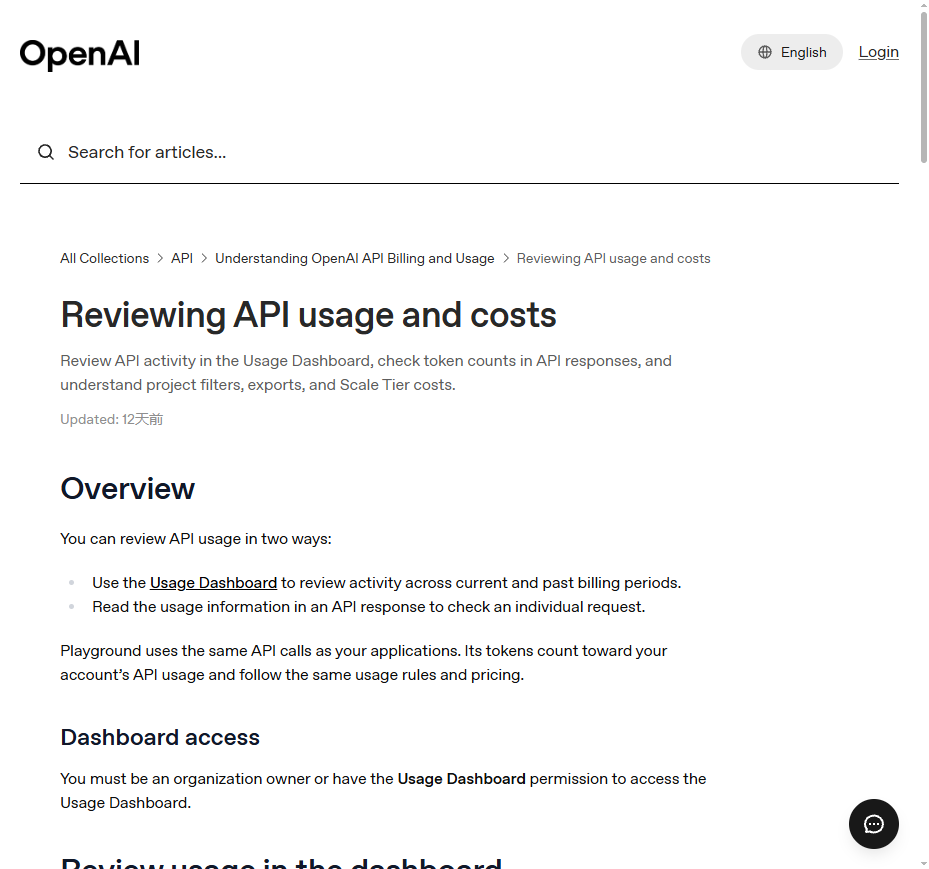
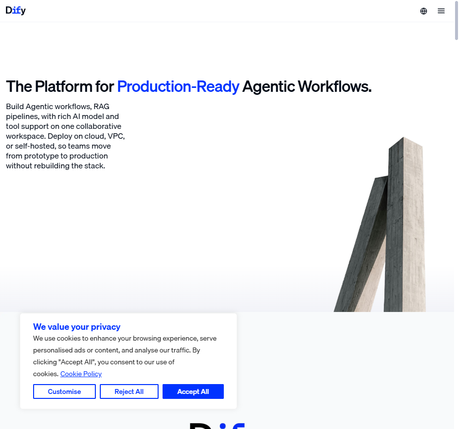
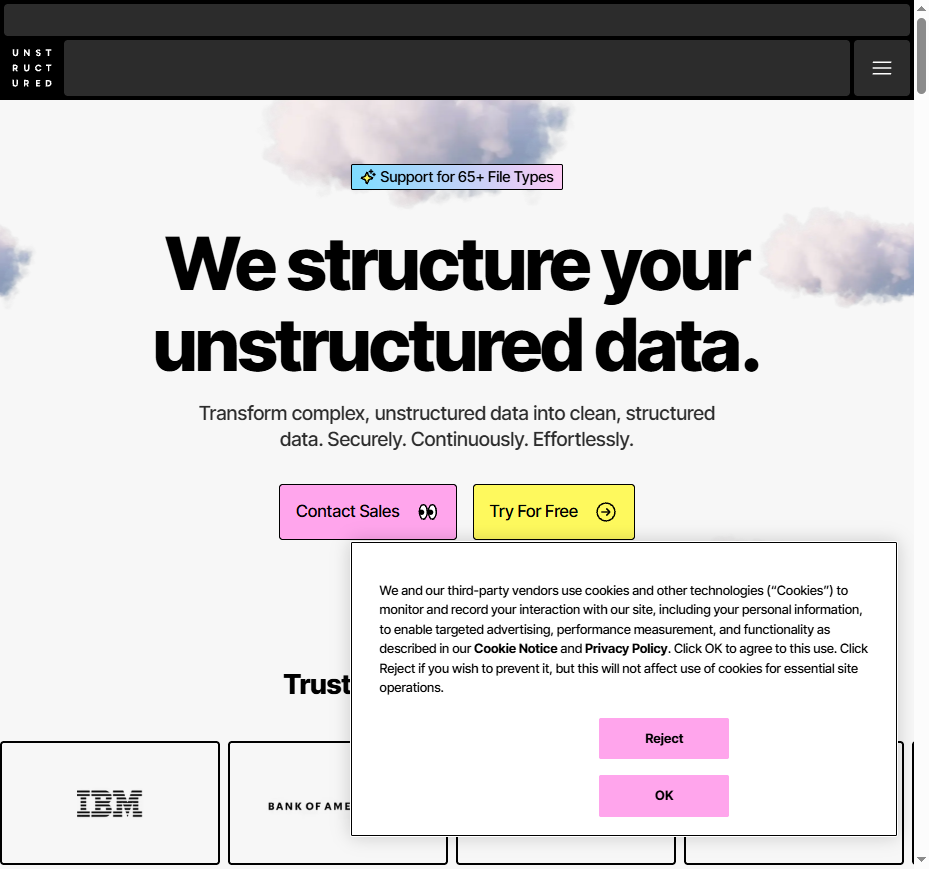
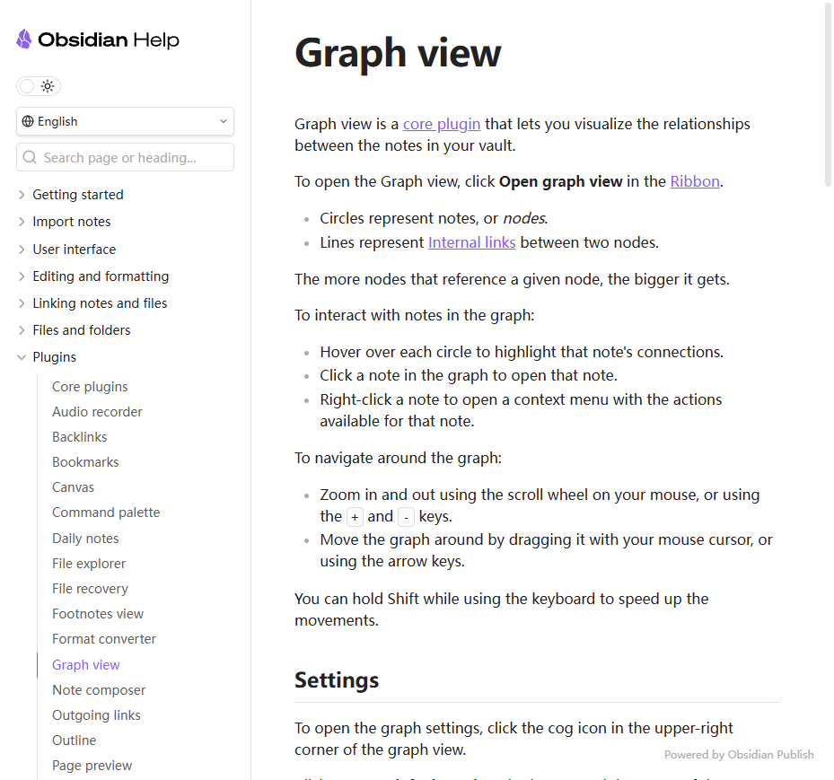

# 天马智擎 V1.1.0 · 需求澄清文档

> 目标：用统一、大白话的格式，把 8 个新功能「要做什么」讲清楚。方便后续直接转成 PRD。
> 方法：按 `superpowers-cn` 的「先澄清需求」阶段重做，每个功能都用同一套模板写。
> 版本线：MVP → 1.0.0 → 1.0.1 → **1.1.0（本文档范围）**
> 范围：前 5 个（①–⑤）进 1.1.0；后 3 个（⑥–⑧）先调研，不排进主开发。

---

## 全局说明

- 这份文档只写**需求**（用户能看到什么、能做什么），不写代码、不写数据库表、不写观远怎么连。
- 每个功能统一 6 个小节：**是什么 / 为什么要做 / 具体要做什么 / 分类维度 / 参考竞品 / 待确认问题**。
- 专业词尽量用括号解释，目标是让非技术同事也能看懂。

---

## 1. 用量与计费明细

### 这是什么
给**管理员**看的用量与费用账单：所有用户用了多少 token、花了多少金币，按不同维度拆开看，甚至能下钻到某一次对话花了多少。
**普通用户在用户端看不到这个明细，连自己的剩余额度也不展示。**

### 为什么要做
现在大家对钱花在哪没感知，月底一算账很懵。需要让管理员清楚：哪个部门、哪个智能体、哪种用法最烧钱，好做成本管控。

### 具体要做什么
- 管理员能看每个用户的消耗流水：什么时候、用了哪个模型、金币变动多少、余额多少。
- 管理员能看汇总：按部门、按模式（日常问答 / 智能体对话）、按智能体、按模型分别统计。
- 能一层层下钻：部门 → 个人 → 某次会话 → 单次调用。
- 单次调用里要区分**缓存命中**（前面问过类似内容，模型复用记忆，更便宜）和**缓存未命中**（新内容，更贵）。
- 额度用完后，管理员可以重新设置或补充额度。

### 分类维度

| 维度 | 说明 |
|---|---|
| 部门组织 | 按部门聚类，看各部门消耗 |
| 时间 | 实时、昨日、近一周、上周、本月、上月、自定义时间段 |
| 模式 | 日常办公问答、智能体对话 等 |
| 智能体 | 智能体对话里再拆到每个具体智能体 |
| 模型 | 用了 DeepSeek / 百炼 / 其他哪个模型 |

### 参考竞品
- [OpenAI 用量说明](https://help.openai.com/en/articles/10478918)：提供 Usage Dashboard，可按项目/用户/时间段看 token 和费用。
- [Coze 账单与用量](https://docs.coze.cn/coze_pro/bills_and_usage)：按成员/项目/模型拆分，单次调用可展开计费项。

### 待确认问题
- 额度重置/补充的权限只给管理员，对吗？
- 管理员是否需要区分「超级管理员看全公司」和「部门管理员只看本部门」？

---

## 2. 运营指标看板

### 这是什么
用观远 BI 平台搭一个数据看板，看大家用天马智擎用得怎么样。我们只要把「看什么指标」和「数据从哪来」定义清楚，看板本身由观远做。

### 为什么要做
产品和运营需要判断：大家用得积极吗？哪些功能没人用？哪些地方烧钱？靠拍脑袋不行，得看数。

### 具体要做什么
- 明确 5 个核心指标的计算口径。
- 原始会话记录也要能查到，方便在观远里做下钻/聚类分析。
- 具体看板样式、图表形式由观远侧做，我们不重复搭。

### 本期指标定义

| 指标 | 大白话 | 计算方式 |
|---|---|---|
| 活跃用户数 | 今天至少聊过 1 轮的人 | 当日有 ≥1 轮会话的用户 |
| 渗透率 | 开了账号的人里，有多少今天真用了 | 活跃用户数 ÷ 开通账号总人数 |
| 高活跃用户 | 今天聊得很深的人 | 当日会话轮次 > 5 的用户 |
| 高活跃用户渗透率 | 高活跃用户占总开通人数比例 | 高活跃用户 ÷ 总开通人数 |
| 平均对话轮次 | 活跃用户平均聊多少轮 | 总对话轮次 ÷ 活跃用户数 |

### 更多指标（本期做不了）

用户提到像「问题反馈率」这类指标也很好，但现在系统里没有地方让用户点「反馈/报错」，统计不到，本期先不做。等后面加上反馈入口后，再补进看板。

候选扩充指标：问题反馈率、满意度/NPS、AI 采纳率、任务完成率、首次响应时长。

### 分类维度
按模式 / 智能体 / 部门拆分，方便看出：哪个部门用得多、哪种智能体最热门。

### 参考竞品
- [Dify](https://dify.ai/)：提供消息数、活跃用户、平均交互、Token 消耗等分析指标。
- [Coze 数据分析](https://docs.coze.cn/guides/data)：按渠道/模型看活跃与用量。

### 待确认问题
- 看板是否需要实时刷新？还是次日更新也能接受？
- 除了这 5 个指标，还有哪些是你近期就想要的？

---

## 3. 上下文主动建议（推荐气泡）

### 这是什么
AI 回答完问题后，自动在输入区/回复下方冒出几个「你可能还想问」的气泡。用户点一下，就相当于自动发送这条问题。

### 为什么要做
降低用户下一步不知道该问什么的门槛，让对话自然延续。

### 具体要做什么
- 每次回复后，根据本轮内容和历史对话，生成 3-5 个推荐问题。
- 以气泡/小卡片形式展示，点一下就发出去。
- 要有关闭开关，用户不想看可以关掉。

### 分类维度
- 按智能体：不同智能体推荐不同风格的问题。
- 按上下文：基于当前话题生成，不是固定死的推荐。

### 参考竞品
- ChatGPT、Claude 在回答末尾会给 follow-up 建议。
- 飞书智能伙伴会结合上下文推荐「你可能想问」。

### 待确认问题
- 推荐气泡放在回复下面，还是输入框上面？
- 是每个智能体独立配置推荐风格，还是全局统一？

---

## 4. 会话搜索优化

### 这是什么
让用户能快速找到历史会话。支持搜标题、搜对话内容（用户问的和 AI 答的都能搜到），搜到后点进去继续聊。

### 为什么要做
历史对话越来越多，找不到以前问过的问题。只搜标题不够，要搜到正文里的关键词。

### 具体要做什么
- 全局搜索框：输入关键词，搜历史会话。
- 搜索范围：会话标题 + 用户消息 + AI 回复。
- 命中内容要高亮，前后加省略号，显示上下文。
- 结果按时间分组（今天 / 近 7 天 / 近 30 天 / 更早）。
- 每条结果展示：时间、智能体、命中片段，点进去可以继续聊。
- 要能搜到全部历史，不能只做最近几条。

### 匹配展示规则
- 如果一个问题和答案里都命中了关键词，只展示一条会话记录（不要重复）。
- 命中的关键词要居中/显眼，前后各保留若干字，超长的用省略号。
- 具体前后各保留多少字、省略号怎么显示，需要 UI 再定。

### 参考竞品
- [ChatGPT 历史搜索](https://help.openai.com/zh-hans-cn/articles/10056348)：搜标题+内容，点击继续聊。
- [Notion 企业搜索](https://www.notion.com/help/enterprise-search)：跨内容语义搜索，结果带引用。

### 待确认问题
- 搜索是只按关键词，还是也要支持语义搜索（意思相近也能搜到）？
- 每个时间分组最多展示几条？点击「查看更多」再展开，还是一次性全展示？
- 命中词前后各显示多少字比较合适？

---

## 5. 月报文档解析入库

### 这是什么
把公司每个月的月报（Excel 文件，里面既有表格也有大量文字）自动解析、拆成知识点，存进知识中心，方便后续检索和问答引用。

### 为什么要做
月报里沉淀了很多业务数据和分析结论，但现在散落在 Excel 里，AI 搜不到、答不准。

### 具体要做什么
- 上传月报 Excel 后，系统把它转成适合 AI 理解的格式。
- 按章节/表格/段落拆成小块，每块保留出处（哪个月报、哪个 sheet、哪段）。
- 转成 AI 能搜的格式（向量化）后存进知识中心，问答时能引用月报里的原文/原表。
- 下个月新出月报时，能增量更新，旧版月报失效或保留历史版本。

### 关键难点
- Excel 里文字多、表格多，解析时要保留原文结构。
- 向量化后的「引用高亮」和 Excel 原始位置要对得上，否则用户点引用会找不到。
- 具体用「转文本」还是「转 PDF」来解析，需要技术预研。

### 参考竞品
- [Unstructured](https://unstructured.io/)：擅长把复杂文档拆成结构化内容。
- [阿里通义 Qwen-OCR](https://help.aliyun.com/en/model-studio/qwen-vl-ocr)：能把表格、公式识别成结构化格式。

### 待确认问题
- 月报解析是手动上传触发，还是每月自动从某个目录同步？
- 旧版月报是保留历史版本，还是直接覆盖？
- Excel 预览和向量化后的引用位置对不上时，你最希望怎么展示？

---

## 6. 企业微信 CLI 集成

### 这是什么
通过企业微信的官方命令行工具，把天马智擎的能力接到企业微信里，比如推送消息、执行指令。

### 为什么要做
很多人在企业微信里办公，能让 AI 能力从 Web 端延伸到企微聊天里。

### 具体要做什么
- 调研企业微信 CLI 能做什么、需要什么权限。
- 能向指定用户/群推送消息。
- 用户在企微里发指令，能触发天马智擎的对应动作。

### 状态
本期只做调研，不排进 1.1.0 主开发。

### 参考竞品
- [企业微信官方 CLI 文档](https://open.work.weixin.qq.com/help2/pc/21676)：覆盖消息、待办、日程、会议等能力。
- 企业微信群机器人 Webhook：适合单向推送通知。

### 待确认问题
- 接企微主要是为了「推送通知」还是「在企微里聊天交互」？
- 先做内部小范围试点，还是全量？

---

## 7. 企业知识图谱

### 这是什么
把知识中心里的文档、文件夹、知识库、空间自动连成一张「关系网」。比如 A 文档提到 B 产品，就画一条线，方便看到知识点之间的关联。

### 为什么要做
知识多了之后，只看列表找不到联系。图谱能帮用户发现：哪些文档/概念互相关联。

### 具体要做什么
- 在知识中心里，给文件/文件夹/知识库/空间生成关系图。
- 自动抽取「实体」（如人、产品、部门、术语）和「关系」（如 A 属于 B、A 引用 B）。
- 靠谱的关系直接入库；不太靠谱的，先放人工审核。
- 只有技术管理员能看到配置界面，普通用户只看图谱。

### 分类维度
- 按层级：文件 / 文件夹 / 知识库 / 空间 都可以有自己的图谱，默认从知识库开始。
- 按置信度（AI 觉得这个关系靠不靠谱）：
  - 很靠谱（>0.8）：直接入库
  - 一般靠谱（0.5 ~ 0.8）：入库但标记待复核
  - 不太靠谱（<0.5）：进人工审核队列

### 参考竞品
- [Obsidian Graph view](https://help.obsidian.md/Plugins/Graph+view)：笔记库的关系图谱，可放大、着色、过滤。

### 待确认问题
- 默认按「知识库」维度生成图谱，可以下钻到文件夹/文件，OK 吗？
- 抽取频率：知识库每晚自动抽一次，文件保存后实时/准实时抽，可以吗？
- 置信度分三档：很靠谱直接入库 / 一般靠谱标待复核 / 不靠谱人工审，这个边界能接受吗？

---

## 8. 钉钉知识库接入

### 这是什么
把钉钉里的知识库作为外部数据源，接到天马智擎的知识中心。用户在天马智擎里也能查到钉钉知识库的内容。

### 为什么要做
公司已经有很多资料存在钉钉知识库里，不想再搬一次。直接接进来，知识中心内容更丰富。

### 具体要做什么
- 在天马智擎里配置「钉钉知识库」这个数据源。
- 自动同步钉钉知识库的目录树和文档内容。
- 文档更新时，能增量同步到知识中心。
- 权限跟着钉钉走，没有权限的文档在天马智擎里也看不到。

### 状态
本期只做调研，不排进 1.1.0 主开发。

### 参考竞品
- [钉钉知识库开放接口](https://open.dingtalk.com/document/development/knowledge-base-overview)：可获取知识库列表、目录树、文档内容。

### 待确认问题
- 是接入整个钉钉知识库，还是只接入指定几个知识库？
- 同步频率：实时、每小时、每天？

---

## 附录：版本范围与当前状态

| 序号 | 功能 | 是否进 1.1.0 | 当前状态 |
|---|---|---|---|
| 1 | 用量与计费明细 | ✅ 进 | 需求已清（**仅管理员可见**），待确认 1 个问题 |
| 2 | 运营指标看板 | ✅ 进 | 需求已清 |
| 3 | 上下文主动建议 | ✅ 进 | 需求待补充（展示位置/开关） |
| 4 | 会话搜索优化 | ✅ 进 | 需求待补充（搜索规则/展示规则） |
| 5 | 月报文档解析入库 | ✅ 进 | 需求待补充（解析方式/同步方式） |
| 6 | 企微 CLI 集成 | ❌ 先调研 | 调研中 |
| 7 | 企业知识图谱 | ❌ 先调研 | 后端已好，前端结合待设计 |
| 8 | 钉钉知识库接入 | ❌ 先调研 | 调研中 |
