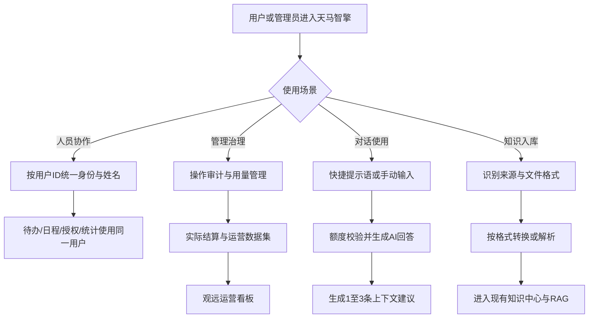
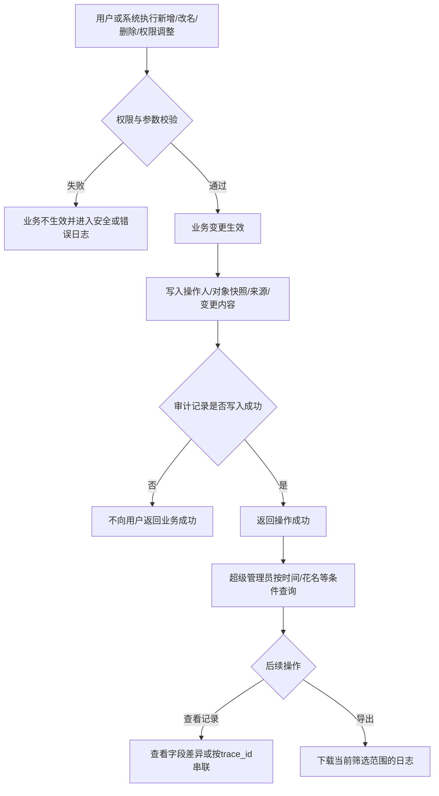
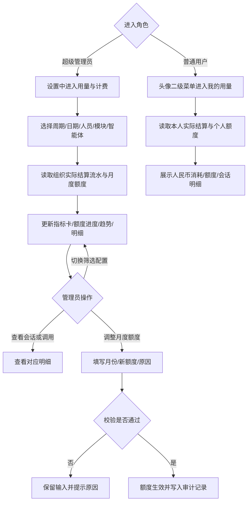
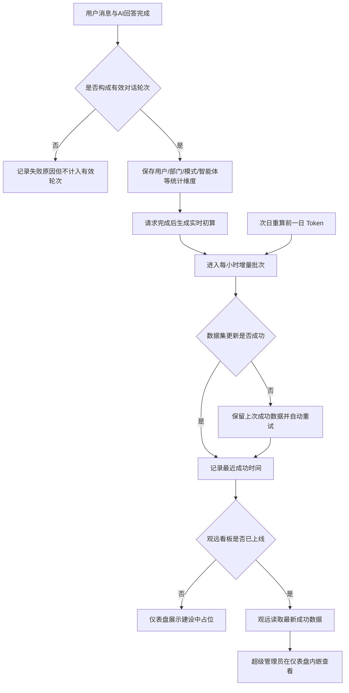
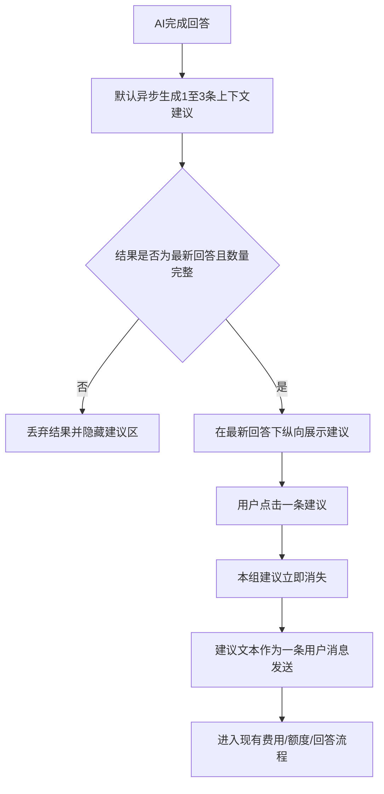
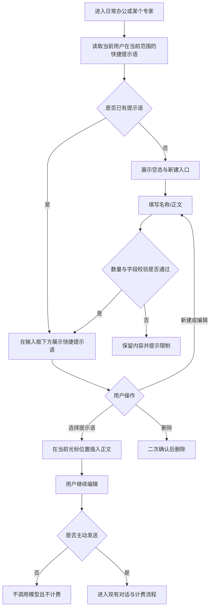
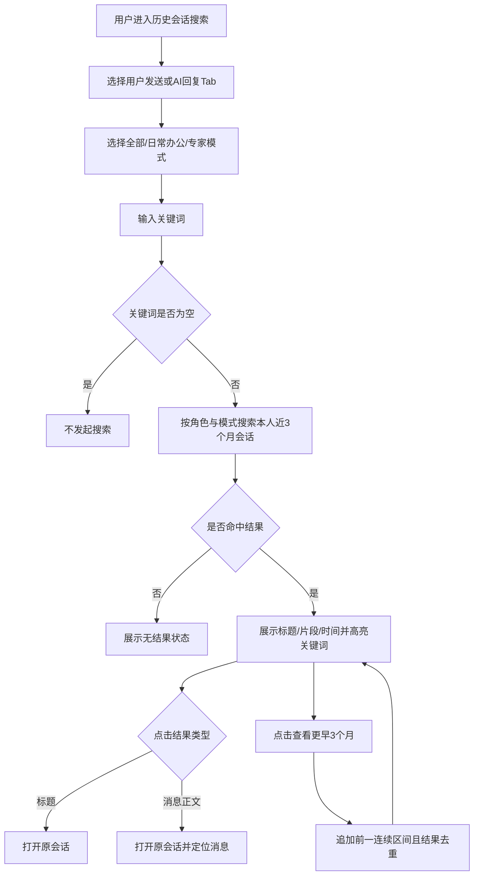
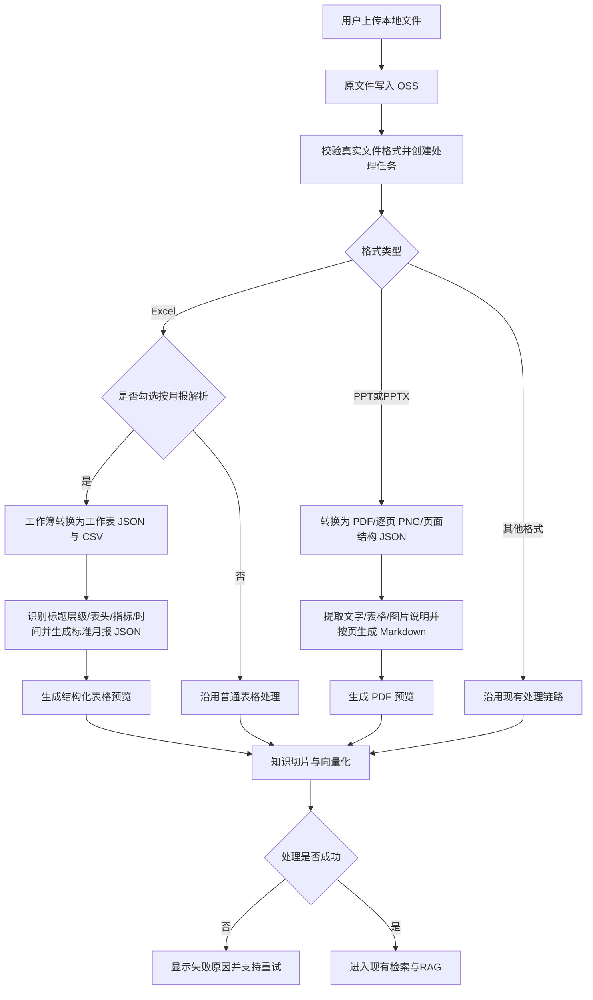

# 产品需求说明书

## 天马智擎 V1.1.0

## 版本信息

本表用于记录本文档的维护过程，请认真填写。

| 版本号 | 时间（必填） | 状态 | 简要描述（必填） | 部门 | 责任产品（必填） | 批准人 |
| --- | --- | --- | --- | --- | --- | --- |
| V1.1.0 | 2026-09-14 | N | 八项本期需求；三项后续方向仅保留调研结论 |  |  |  |

注：状态可以为 N-新建、A-增加、M-更改、D-删除。

# 关于本文档

## 文档目的

本文用于统一 V1.1.0 的业务范围、交互流程和数据口径，供产品、设计、研发、测试、数据、运维及观远 BI 对接使用。本文描述产品需求，不规定具体代码实现。

## 术语表

| 术语 | 说明 |
|---|---|
| 用户 ID | 天马内部识别人员的唯一、稳定标识 |
| 本名 / 当前花名 | 人员的两类名称属性，均不作为业务关联主键；平台不维护历史花名 |
| SSO | 单点登录，用于取得登录身份；名称字段可能是本名或花名 |
| DWS | 钉钉能力工具集，本期人员查询涉及钉钉通讯录 |
| MCP / Tool / Skill | 模型接入外部能力的协议、原子工具及可编排能力包 |
| Agent | 由模型、提示词、工具、Skill 和知识组成的智能体 |
| RAG | 使用知识库内容辅助模型回答的现有检索增强能力 |
| 有效对话轮次 | 用户消息成功保存且 AI 返回非空完整回答的一轮对话 |
| `trace_id` | 将同一次批量或跨服务操作关联起来的链路标识 |

## 参考文档

| 编号 | 文档 | 用途 |
|---:|---|---|
| 1 | [PRD 模板](https://alidocs.dingtalk.com/i/nodes/KGZLxjv9VG325pNBSZnkaZGxV6EDybno?utm_scene=person_space) | 本文结构与颗粒度标准 |
| 2 | [八项需求调研与前端参考](../research/2026-09-14-v1.1.0-eight-feature-research-index.md) | M3～M8 六项功能的产品对标与前端参考 |

## 沟通要求

本表记录需要跨部门沟通的事项。如果有跨部门沟通项，请填写并记录沟通结果。

| 序号 | 部门/角色 | 沟通内容 | 沟通结果 |
| ---: | --- | --- | --- |
| 1 |  |  |  |
| 2 |  |  |  |

# 产品概述

## 产品概述

公司将逐步取消花名制度：新员工使用本名，现有员工可在本名和当前花名中选择固定称谓，部分岗位继续保留花名。现有系统在身份获取、钉钉通讯录、待办、日程、知识中心等场景中混用本名和花名，需要统一识别与展示。

同时，平台缺少统一操作审计、用量下钻和运营指标；用户侧缺少回答后的追问引导、个人常用提示语和完整会话搜索；Excel 月报和 PPT 等特殊格式也需要独立解析链路。本版本围绕人员身份、平台治理、使用分析、对话体验和知识入库完成改进。

## 产品目标

1. 本名和当前花名可找到同一用户，所有业务最终关联用户 ID。
2. MCP、Tool、Skill、模型、Agent 和知识相关变更可查询、可追溯。
3. 超级管理员可查看实际用量、消费去向并设置月度额度。
4. 建立统一运营数据集，并从天马进入观远 AI 运营看板。
5. AI 回答后提供三条可直接发送的上下文建议。
6. 用户可创建和复用自己的快捷提示语，减少重复输入。
7. 用户可搜索本人历史会话，并定位到具体消息。
8. 系统按来源类型和文件格式自动选择解析链路，将 Excel 月报、PPT 等特殊文档接入现有 RAG。

## 用户角色

| 用户角色 | 职责描述 | 本期权限 |
| --- | --- | --- |
| 普通用户 | 使用对话、快捷提示语、搜索、人员和知识能力 | 按权限使用现有功能；不能查看管理数据 |
| 超级管理员 | 负责平台治理和受限数据查看 | 查看审计、用量和运营看板；设置额度 |

本期不新增部门管理员。权限同时作用于入口、页面和数据接口；角色变更后立即生效。

## 用户故事地图

| 用户活动 | 用户任务 | 用户故事 | 功能 |
|---|---|---|---|
| 人员协作 | 找人、选人、展示人员 | 作为用户，我希望通过本名或花名准确找到同一个人 | M1 本名花名规范化 |
| 平台治理 | 追溯配置变更 | 作为超级管理员，我希望知道谁对哪个对象做了什么修改 | M2 操作审计日志 |
| 成本治理 | 查看消费与额度 | 作为用户，我希望查看本人人民币消耗、额度和会话明细；作为超级管理员，我希望管理全组织额度 | M3 用量管理 |
| 使用运营 | 查看产品使用情况 | 作为超级管理员，我希望通过观远看板分析活跃和渗透情况 | M4 观远运营看板 |
| 连续对话 | 获得下一步建议 | 作为用户，我希望回答后直接选择合适的追问 | M5 上下文主动建议 |
| 快捷输入 | 保存和复用常用提示语 | 作为用户，我希望快速调出自己保存的提示语并按需修改 | M6 快捷提示语 |
| 历史回溯 | 搜索会话内容 | 作为用户，我希望按关键词找到自己的历史消息并定位原文 | M7 会话搜索优化 |
| 知识入库 | 上传月报或 PPT | 作为用户，我希望可明确选择 Excel 月报解析方式，并自动解析 PPT | M8 特殊文档解析 |

# 功能需求

## 流程图

### 技术架构图

暂无。

### 业务流程图



**全局通用规则**

| 规则 | 统一口径 |
|---|---|
| 人员身份 | 业务关联和统计只使用用户 ID；本名、花名仅用于搜索与展示 |
| 人员展示 | 两者都有且不同显示“本名（花名）”；只有一个显示已有名称；相同只显示一次 |
| 人员搜索 | 同时支持本名和当前花名；多人命中必须由用户确认 |
| 有效对话 | 用户消息已保存、AI 返回非空完整回答，且未取消、未拦截、未报错 |
| 用量与费用 | 请求完成后立即按本次请求结果生成实时初算；次日对前一自然日 Token 统一重算并回写人民币金额，重算结果作为最终统计口径 |
| 时间 | 今日、月份和近 3 个月等范围统一按北京时间计算 |
| 后台状态 | 等待处理、处理中、自动重试中、已完成、处理失败可手动重试 |
| 管理权限 | 运营和审计数据仅超级管理员可见；用量数据中普通用户仅查看本人数据 |
| 个人配置 | 快捷提示语按用户 ID 及日常办公/专家范围隔离，仅创建者可见和管理 |

## 功能模块清单

| 编号 | 功能名称 | 功能描述 | 所属模块 | 本期优先级 |
|---|---|---|---|---|
| M1 | 本名花名规范化 | 统一本名、花名、用户 ID 的搜索、展示和关联规则 | 全局 | P0-1 |
| M2 | 操作审计日志 | 记录并查询平台关键管理对象的变更 | 设置 | P0-2 |
| M3 | 用量管理 | 用户查询本人人民币消耗与额度，超级管理员查询组织消费并设置月度额度 | 头像二级菜单、设置 | P0-3 |
| M4 | 观远运营看板 | 在仪表盘中内嵌观远看板，上线前展示占位状态 | 仪表盘 | P0-4 |
| M5 | 上下文主动建议 | 回答后展示三条可直接发送的追问 | 对话 | P0-5 |
| M6 | 快捷提示语 | 在日常办公及每个专家中创建、管理和复用隔离的个人提示语 | 对话 | P0-6 |
| M7 | 会话搜索优化 | 按用户发送/AI 回复 Tab 和模式筛选搜索本人会话 | 对话 | P0-7 |
| M8 | 特殊文档解析 | 支持用户勾选月报解析及自动解析 PPT/PPTX | 知识中心 | P0-8 |

## 功能详情

### M1-本名花名规范化

#### 功能需求描述

天马以用户 ID 识别人，通过人员映射表补齐本名和当前花名。页面统一显示“本名（花名）”，人员搜索、接口和工具调用同时接受本名或当前花名。

平台不维护历史花名；花名变更后，旧花名不再作为搜索条件。本名重名沿用公司人员主数据中的数字后缀，如“张三”“张三2”。

#### 用户角色与用户故事

作为普通用户或超级管理员，我希望无论输入同事的本名还是当前花名，都能准确找到同一账号，并在所有功能中看到一致名称。

#### 业务主流程图及说明

本模块不单独设计业务流程图，重点约束所有涉及人员身份、搜索、展示和关联的统一规则。

#### 分支流程（异常流程）

- **姓名歧义：**多人同名或同花名时，系统返回全部候选且不默认选择第一人，界面展示“本名（花名）＋部门”，由用户确认唯一人员。
- **人员数据异常：**启用账号缺少本名或存在映射冲突时，系统标记数据异常，不静默使用错误名称；修复人员主数据后可重试。
- **停用账号：**历史业务关联的账号已停用时，系统保留历史展示并标记“已停用”，但禁止用于新业务；如需重新使用，须先恢复账号状态。
- **旧数据迁移：**历史记录只保存花名时，唯一命中则关联用户 ID；多人或无匹配时保留原文并提示人工确认，补齐映射后可重试。

#### 界面原型

本模块不新增独立界面原型，现有相关页面按“数据说明（业务实体）”中的场景清单完成改造。

#### 数据说明（业务实体）

本模块不预设新增数据表或字段，由开发基于现有用户、通讯录及业务数据结构判断实现方式。业务改造范围以以下场景为准：

| 序号 | 场景 | 当前方式或问题 | 改造要求 |
|---:|---|---|---|
| 1 | 用户身份获取 | SSO 名称可能是本名或花名 | 先取稳定用户标识，再通过人员映射补齐名称 |
| 2 | 发消息 | 钉钉 DWS 通讯录查人 | 调整为本名、花名均可；提供统一工具提供相关信息给 AI |
| 3 | 建待办 | 接口或 Tool 调用钉钉通讯录 | 调整为本名、花名均可；提供统一工具提供相关信息给 AI |
| 4 | 查日程 | 接口或 Tool 调用钉钉通讯录 | 调整为本名、花名均可；提供统一工具提供相关信息给 AI |
| 5 | 建日程 | 接口或 Tool 调用钉钉通讯录 | 调整为本名、花名均可；提供统一工具提供相关信息给 AI |
| 6 | 分享会话并选择钉钉发送 | 表查询，已显示“本名（花名）” | 保持现状 |
| 7 | 自动化选择执行人 | 花名优先，无花名用本名 | 调整为“本名（花名）”展示，关联用户 ID |
| 8 | 我的待办、待办统计 | 执行人、创建人花名优先 | 调整为“本名（花名）”展示，关联用户 ID |
| 9 | 知识中心列表所有者 | 只显示花名 | 调整为“本名（花名）”展示，关联用户 ID |
| 10 | 知识中心、智能体权限设置添加成员 | 已显示“本名（花名）” | 保持现状 |
| 11 | AgentScope | 只保存花名，无花名显示 `null` | 调整为“本名（花名）”展示，关联用户 ID |
| 12 | 页面水印 | 花名＋工号，偏小且模糊 | 改为“本名（花名）＋工号”，字号放大约 20%并提升清晰度 |

#### 业务规则和约束条件

| 规则类型 | 规则与约束 |
|---|---|
| 身份主键 | 所有业务关联均使用稳定用户 ID；本名和花名仅用于查询与展示，不作为关联主键 |
| 统一展示 | 同时存在本名和花名时显示“本名（花名）”；无花名时只显示本名，不显示空括号或 `null` |
| 人员搜索 | 同时支持本名和当前花名；同一用户只返回一条结果 |
| 同名消歧 | 多人同名或同花名时不得默认选第一人，须结合部门等信息由用户确认 |
| 花名范围 | 仅使用当前花名，不维护历史花名，也不以历史花名作为搜索条件 |
| 停用人员 | 历史记录保留展示并标记停用，新业务不可选择停用账号 |
| 名称快照 | 审计和历史展示可保留操作时名称快照，但统计和权限判断仍以用户 ID 为准 |

#### 接口说明

- SSO 只负责取得稳定身份，不使用其名称字段直接判断人员。
- 钉钉通讯录查询需同时支持本名、当前花名，调用前解析为唯一钉钉用户 ID。
- 本功能不涉及模型推理。

#### AI 链路说明

本模块不涉及新增 AI 推理链路。

### M2-操作审计日志

#### 功能需求描述

所有纳入范围的管理对象在新增、修改、删除或授权成功后追加一条操作记录。超级管理员可在“设置 > 日志管理”的单一列表页查询操作人、对象、来源和变更前后内容；不设系统操作、用户操作和登录日志 Tab。日志不可通过产品编辑或删除。

#### 用户角色与用户故事

作为超级管理员，我希望知道谁在什么时间、从哪里、对哪个对象做了什么，以便排查配置变化并追责。普通用户和其他后台角色无权查看。

#### 业务主流程图及说明



1. 管理端、用户端或系统任务对纳入审计范围的对象执行新增、改名、删除或权限调整。
2. 权限和参数校验通过，业务变更生效。
3. 系统写入对象快照、操作人、来源、IP、时间和变更内容。
4. 批量或跨服务操作以同一 `trace_id` 关联。
5. 超级管理员可按时间范围、操作人花名等条件组合筛选，查看字段差异，或下载当前筛选结果。

业务变更和审计记录必须保持一致；审计保存失败时，不向用户显示业务操作成功。

#### 分支流程（异常流程）

- **无日志：**当前筛选条件没有记录时，返回空结果并显示空状态；用户可调整时间范围、花名或其他筛选条件。
- **查询失败：**列表或详情读取失败时，保留筛选条件和已有页面状态，显示失败原因及重新加载入口。
- **权限失效：**用户查看期间失去超级管理员权限时，立即终止读取并清除受限缓存，退出页面并提示权限变化；恢复权限后可重新进入。
- **导出失败：**文件生成或下载失败时，不改变当前筛选条件和列表，显示失败原因及重新导出入口。

#### 界面原型

| 动作 | 显示 | 类型 | 描述 |
| --- | --- | --- | --- |
| 【日志管理入口】进入“设置 > 日志管理” | 操作时间、人员（本名（花名））、描述、模块、操作类型、操作对象名称、修改前、修改后 | 单一日志列表 | · 描述紧跟在人员列之后<br>· 不设日志类型 Tab<br>· 列表不单独展示对象 ID<br>· 默认按时间倒序并支持分页 |
| 【时间范围】选择开始与结束时间 | 所选时间范围内的记录 | 日期时间范围选择器 | · 开始时间不得晚于结束时间<br>· 与其他条件组合生效<br>· 清空后恢复未限定时间的查询状态 |
| 【操作人员】输入本名或花名 | 可过滤搜索的人员候选与匹配记录 | 可过滤下拉框 | · 显示“本名（花名）”<br>· 最终按操作人用户 ID 限定结果 |
| 【筛选区】设置条件并点击“查询” | 符合全部条件的记录 | 组合筛选区 | · 仅包含开始时间、结束时间、操作人员、模块、操作类型<br>· 不提供来源、对象类型或关键词搜索<br>· “清空”恢复默认条件 |
| 【日志记录】点击一条日志 | 全部基础信息、对象 ID、变更前后内容 | 居中详情弹窗 | · 详情统一用弹窗，不使用右侧抽屉<br>· 只突出变化字段<br>· 敏感值保持脱敏 |
| 【导出按钮】下载审计日志 | 当前筛选范围的审计日志文件 | 下载按钮 | · 导出范围与列表筛选条件一致<br>· 导出字段与页面使用相同脱敏规则<br>· 生成完成后下载到本地 |
| 【系统任务记录】查看系统任务日志 | “系统任务” | 操作人展示 | · 操作人 ID 为系统任务时显示“系统任务”<br>· 不显示 `null` |

列表默认按时间倒序。对象已删除仍显示名称快照并标记“对象已删除”；系统任务显示“系统任务”，不显示 `null`。

#### 数据说明（业务实体）

记录统一写入追加式表 `system_operation_log`。

| 字段名 | 数据类型 | 长度 | 默认值 | 必需 | 约束说明 |
|---|---|---:|---|---:|---|
| `id` | 整数 | 20 | 自增 | 是 | 日志主键 |
| `biz_type` | 字符串 | 32 | — | 是 | 业务对象类型枚举 |
| `biz_id` | 字符串 | 64 | — | 是 | 各业务表主键统一转字符串 |
| `biz_name` | 字符串 | 255 | 空字符串 | 是 | 操作时对象名称快照 |
| `operation_type` | 枚举 | 32 | — | 是 | `CREATE`、`UPDATE`、`DELETE` |
| `operation_desc` | 字符串 | 500 | 空字符串 | 是 | 人可读操作摘要 |
| `before_content` | JSON | — | 空 | 否 | 变更前关键字段；新增操作为空 |
| `after_content` | JSON | — | 空 | 否 | 变更后关键字段；删除操作为空 |
| `source` | 枚举 | 4 | 管理端 | 是 | 管理端、用户端、系统任务 |
| `ip` | 字符串 | 64 | 空 | 否 | 操作来源 IP |
| `trace_id` | 字符串 | 64 | 空 | 否 | 同一批操作的链路标识 |
| `create_user_id` | 整数 | 11 | 0 | 是 | 操作人 ID；`0` 为系统任务 |
| `create_user` | 字符串 | 50 | 空 | 否 | 操作人当前花名快照，用于筛选与历史展示 |
| `create_real_name` | 字符串 | 100 | 空 | 否 | 操作人本名快照 |
| `create_time` | 日期时间 | — | 当前时间 | 是 | 操作时间，用于时间范围筛选 |

表使用 utf8mb4，按业务对象及时间、操作人及时间、操作时间、`trace_id` 支持查询。

#### 业务规则和约束条件

| 规则类型 | 规则与约束 |
|---|---|
| 记录时点 | 只记录已经生效的操作；权限拦截、校验失败等未生效尝试进入现有安全或错误日志 |
| 敏感信息 | API Key、Token、密码、Secret、私钥、证书和连接凭据不得明文记录，只显示“已修改”或不可逆脱敏值 |
| 文档内容 | 文档类日志只保存管理操作、对象信息和权限变更，不保存完整正文 |
| 历史快照 | 对象或操作人改名、删除、停用后，已生成的历史快照不变 |
| 人员筛选 | 花名筛选匹配日志中的人员快照，并以操作人用户 ID 限定结果，避免同名混淆 |
| 导出权限 | 下载导出仅限超级管理员；导出范围与当前筛选条件一致，且使用与页面相同的脱敏规则 |

**审计范围**

| 对象 | 编码 | 记录范围 |
|---|---|---|
| MCP 服务 | `MCP_SERVER` | 新增、配置、启停、删除 |
| 工具 | `TOOL` | 新增、配置、启停、删除 |
| Skill | `SKILL` | 新增、内容或配置、启停、删除 |
| 模型 | `LLM_MODEL` | 新增、参数或状态、删除 |
| 模型供应商 | `LLM_PROVIDER` | 新增、配置或状态、删除 |
| 智能体 | `AGENT` | 新增；基础信息、提示词、模型、工具、知识、状态修改；删除 |
| 知识库 | `KNOWLEDGE_BASE` | 新增、改名、删除、权限调整 |
| 知识文件夹 | `KNOWLEDGE_FOLDER` | 新增、改名、删除、权限调整 |
| 知识文档 | `DOCUMENT` | 新增、改名、删除、权限调整 |

启停、发布、绑定、解绑和权限调整统一记为 `UPDATE`。知识库、知识文件夹和知识文档不记录移动操作。查询、查看、模型调用和 RAG 检索不属于本期操作审计。

#### 接口说明

列表、详情和导出能力均执行超级管理员鉴权并使用相同筛选及脱敏规则。本功能不涉及模型推理。

#### AI 链路说明

本模块不涉及新增 AI 推理链路。

### M3-用量管理

#### 功能需求描述

普通用户可从头像下方二级菜单进入“我的用量”，查看本人人民币消耗、可用额度和会话维度消费明细。超级管理员可在“设置 > 用量管理”查看全组织人民币消耗与 Token。用量明细和额度管理合并在同一树形表格中：部门展开到人员，人员下一级直接展示请求，不再额外展开模块、子功能和智能体层级。管理员可对个人设置日、周或月额度，部门行不提供额度操作。

Token 与人民币金额采用两阶段更新：请求完成后立即生成实时初算，保证用户能够及时看到本次消耗；次日对前一自然日 Token 统一重算并回写人民币金额。页面展示“初算/已校准”状态及最近更新时间，累计用量、剩余额度和导出结果始终使用当前最新结果。

#### 用户角色与用户故事

作为普通用户，我希望了解自己已经消耗多少人民币额度、还剩多少额度，并定位到具体会话。作为超级管理员，我希望掌握全组织费用去向、剩余额度和异常调用，并追溯到单次调用。

#### 业务主流程图及说明



| 区域 | 内容 |
|---|---|
| 普通用户概览 | 本人实际人民币消耗、已用额度、剩余额度和额度使用率 |
| 管理员核心指标卡 | 人民币消耗、系统额度、剩余额度、额度使用率和总 Token；不展示调用次数 |
| 额度进度 | 所选月份总额度、已使用、剩余和使用比例 |
| 筛选配置 | 周期（今日、本周、本月）、开始日期、结束日期、人员、模块、智能体；人员为可过滤下拉框 |
| 消费明细 | 树结构为部门 → 人员 → 请求；请求标题为“会话名称 · 请求时间” |

筛选区仅保留周期、开始/结束日期、人员、模块、智能体、“查询”和“清空”；不提供对话模式、额度状态或关键词搜索。点击“查询”后，指标卡和树形明细必须使用同一组已应用条件同步更新。因指标卡受筛选影响，页面顺序固定为“筛选区 → 指标卡 → 树形明细”。

请求详情展示会话名称、完成时间、用户、智能体、模型、输入 Token、输出 Token、缓存命中 Token、实际人民币金额、数据状态和数据更新时间；不展示调用次数或结算状态。

#### 分支流程（异常流程）

- **结算信息缺失：**供应商未返回实际结算信息时，调用标记为“结算异常”且不计入正式消费金额；数据补齐后重新计算。
- **无数据：**所选范围不存在已结算调用时，显示“所选范围暂无已结算调用”；用户可调整筛选条件。
- **加载失败：**汇总或明细读取失败时，保留筛选条件和已有数据，显示失败原因及重试入口。
- **权限失效：**查看期间失去超级管理员权限时，立即终止请求并清除受限缓存，退出页面并提示权限变化；恢复权限后可重新进入。
- **用户无会话消费：**普通用户所选范围没有已结算会话时，展示人民币消耗为 0 和完整额度信息，会话明细显示空状态。

#### 界面原型

| 动作 | 显示 | 类型 | 描述 |
| --- | --- | --- | --- |
| 【头像二级菜单】点击“我的用量” | 本人人民币消耗、额度和会话消费明细 | 用户页面 | · 对所有登录用户开放<br>· 默认展示本月口径<br>· 不展示其他用户或组织数据 |
| 【管理员入口】进入“设置 > 用量管理” | 筛选区、组织指标卡和树形明细 | 管理页面 | · 用量明细和额度管理不设 Tab，合并为一页<br>· 仅超级管理员可见<br>· 所有区域使用同一筛选范围 |
| 【核心指标卡】点击查询后查看 | 人民币消耗、系统额度、剩余额度、使用率、总 Token | 大指标卡片 | · 位于筛选区下方<br>· 与已应用筛选条件同步变化<br>· 不展示调用次数 |
| 【数据更新时间】查看更新时间 | 数据状态和最近更新时间 | 状态说明 | · 请求完成后显示“实时初算”及初算时间<br>· 次日重算完成后更新为“已校准”及重算完成时间<br>· 重算失败时保留初算结果并标记“待校准” |
| 【树形明细】展开部门和人员 | 部门 → 人员 → 请求 | 可展开表格 | · 人员显示“本名（花名）”<br>· 人员下一级直接显示全部请求<br>· 请求标题为“会话名称 · 时间” |
| 【请求详情】点击“详情” | 人民币消耗、输入 Token、输出 Token、缓存命中 Token | 居中弹窗 | · 详情统一使用弹窗，不使用右侧抽屉<br>· 返回后保留筛选条件 |
| 【人员额度】在人员行点击“设置额度” | 人员、周期、额度、原因 | 居中弹窗 | · 周期支持每日、每周、每月<br>· 部门行不展示该操作<br>· 保存成功后立即刷新额度与使用率 |
| 【额度预警】人员周期剩余额度首次低于 10% | 主文案“额度即将用尽”；副文案“{本名（花名）}的本周期额度仅剩 {X%}，请及时调整额度，避免任务中断。” | 右下角提醒 | · 同一用户、同一额度周期、同一阈值跨越只提醒一次<br>· 额度上调至 10% 以上后再次跌破可重新提醒 |

#### 数据说明（业务实体）

| 字段名 | 数据类型 | 长度 | 默认值 | 必需 | 约束说明 |
|---|---|---:|---|---:|---|
| 调用 ID | 字符串 | 64 | — | 是 | 单次模型调用唯一标识 |
| 会话 ID | 字符串 | 64 | — | 是 | 用于从会话下钻至单次调用 |
| 用户 ID | 字符串 | 64 | — | 是 | 用户统计主键，不按名称聚合 |
| 部门 | 字符串 | 100 | — | 是 | 保存调用完成时的部门快照 |
| 模式 | 枚举 | 32 | 默认模式 | 是 | 对话模式统计维度 |
| 智能体 ID | 字符串 | 64 | 空 | 否 | 非智能体调用可为空 |
| 模型 ID | 字符串 | 64 | — | 是 | 实际完成调用的模型 |
| 完成时间 | 日期时间 | — | — | 是 | 仅统计已完成调用，用于时间筛选 |
| 输入 Token | 整数 | 20 | 0 | 是 | 供应商实际结算值 |
| 输出 Token | 整数 | 20 | 0 | 是 | 供应商实际结算值 |
| 缓存 Token | 整数 | 20 | 0 | 是 | 无缓存计量时为 0 |
| 实际人民币金额 | 小数 | 18,6 | 0 | 是 | 按实际结算口径折算，页面保留两位小数展示 |
| 数据状态 | 枚举 | 16 | 实时初算 | 是 | 实时初算、待校准、已校准；次日重算成功后更新为已校准 |
| 数据更新时间 | 日期时间 | — | 当前时间 | 是 | 初算或重算最近一次成功写入时间 |
| 调用后余额 | 小数 | 18,6 | — | 是 | 单次调用结算后的月度余额 |

#### 业务规则和约束条件

| 规则类型 | 规则与约束 |
|---|---|
| 用户可见范围 | 普通用户仅查看本人人民币消耗、个人额度和本人会话明细，不得查看其他用户或组织数据 |
| 管理员可见范围 | 仅超级管理员可查看全组织数据、结算异常和调整公司额度 |
| 统计口径 | 筛选支持今日、本周、本月、自定义日期、人员、模块和智能体；指标卡与明细使用同一口径 |
| 金额展示 | 页面、明细、导出和额度配置统一使用人民币金额 |
| 实时初算 | 每次请求完成后立即计算本次 Token 与人民币金额，并更新个人明细、管理员汇总和剩余额度；此时数据状态为“实时初算” |
| 次日重算 | 次日对前一自然日 Token 统一重算并回写明细及汇总；重算完成后状态改为“已校准”，累计用量、剩余额度和导出结果同步刷新 |
| 重算异常 | 次日重算失败时保留实时初算值，状态改为“待校准”，记录失败原因并支持补跑；补跑成功后覆盖为已校准结果 |
| 额度周期 | 人员额度支持按日、周、月设置；额度对象必须是稳定用户 ID，部门行不得直接设置额度 |
| 预警阈值 | 本周期剩余额度低于 10% 时在右下角提醒；同一阈值跨越事件只提醒一次 |
| 额度修改 | 修改必须填写原因，并记录修改人、时间、前值、后值和原因；当前月修改立即生效但不改变历史流水 |
| 额度不足 | 新额度低于本月已用额度时，剩余显示为 0，并沿用现有额度不足逻辑阻止新任务 |
| 默认额度 | 未单独设置的月份沿用现有默认额度规则 |

#### 接口说明

产品阶段仅约束查询维度、权限、实际结算口径和额度修改结果；具体接口路径与协议由技术设计定义。

#### AI 链路说明

本模块不涉及新增 AI 推理链路。

### M4-观远运营看板

#### 功能需求描述

天马在现有“仪表盘”左侧增加“观远运营看板”菜单，并在内容区内嵌 AI 运营看板。菜单和页面访问均受权限控制，默认仅超级管理员可见；超级管理员可通过“权限设置”配置菜单可见角色或人员。观远 BI 看板上线前展示建设中占位，上线后通过安全嵌入展示。

#### 用户角色与用户故事

作为超级管理员，我希望按部门、模式和智能体判断产品是否被使用，并在必要时下钻到原始会话。天马只提供数据和安全入口，不重复开发 BI 图表。

#### 业务主流程图及说明



1. 有效对话产生并保存统计维度。
2. 每小时增量汇总新增或变化的数据，更新两套数据集；实时初算数据在下一次成功批次后进入观远。
3. 次日 Token 重算完成后，将前一自然日发生变化的 Token 与人民币金额纳入下一次小时增量；观远中的前一日数据随该批次校准。
4. 记录最近一次成功时间和数据状态，观远读取最新成功版本，并在看板展示“数据更新时间”。
5. 观远看板上线前，仪表盘固定区域展示建设中占位；上线后在同一区域内嵌看板。
6. 只有超级管理员可看到入口和内嵌内容。

嵌入使用短时单点登录凭证，不在地址中暴露长期 Token。

#### 分支流程（异常流程）

- **数据更新失败：**本小时汇总任务失败时，保留上次成功数据并记录最近成功时间；系统自动重试，仍失败时支持按原时间区间人工补跑。
- **Token 重算未完成：**次日重算完成前，观远继续展示实时初算结果并标记“待校准”；重算结果写入后随下一次成功小时批次更新。
- **数据关联失败：**会话、消息或用户记录无法按稳定 ID 关联时，不将异常记录计入正式指标，写入失败原因；修复源数据后随补跑重新计算。
- **账号分母为 0：**当统计范围内没有可计入的启用账号时，渗透率输出为空，并标记“暂无可计算账号”，不输出 0%。

#### 界面原型

| 动作 | 显示 | 类型 | 描述 |
|---|---|---|---|
| 【仪表盘左侧菜单】超级管理员进入 | “观远运营看板”菜单及内嵌区域 | 权限菜单 | · 菜单和页面权限同步校验<br>· 默认仅超级管理员可见<br>· 超级管理员可进入权限设置 |
| 【观远看板区域】观远尚未上线 | “AI 运营看板建设中”及说明 | 占位状态 | · 不展示空白 iframe<br>· 不暴露观远地址或调试信息 |
| 【观远看板区域】观远已上线 | 观远 AI 运营看板 | 安全嵌入 | · 使用短时凭证加载<br>· 在仪表盘内容区内展示<br>· 加载失败时保留重试入口 |
| 【数据更新时间】查看看板状态 | 最近成功更新时间和数据状态 | 状态说明 | · 每小时成功发布后更新时间<br>· 前一日 Token 重算完成并同步后显示“已校准”<br>· 刷新失败时继续展示上次成功时间，不显示虚假当前时间 |

#### 数据说明（业务实体）

M4 由天马按小时生成两套数据集供观远 BI 取数，并在现有仪表盘内提供嵌入容器。两套数据集分别授权，观远连接数据源不等于自动获得完整问答权限。

| 字段名 | 数据类型 | 长度 | 默认值 | 必需 | 约束说明 |
|---|---|---:|---|---:|---|
| 统计日期 | 日期 | — | — | 是 | 运营指标数据集的统计粒度 |
| 用户 ID | 字符串 | 64 | — | 是 | 受限会话明细的人员关联主键 |
| 部门 | 字符串 | 100 | — | 是 | 按消息完成时的人员部门快照取值 |
| 模式 | 枚举 | 32 | 默认模式 | 是 | 对话模式统计维度 |
| 智能体 ID | 字符串 | 64 | 空 | 否 | 非智能体对话可为空 |
| 会话 ID | 字符串 | 64 | — | 是 | 关联会话与消息记录 |
| 问题 | 长文本 | — | 空 | 否 | 仅进入受限会话明细数据集 |
| 回答 | 长文本 | — | 空 | 否 | 仅进入受限会话明细数据集 |
| 有效状态 | 布尔值 | — | 否 | 是 | 一问一答均成功才记为有效轮次 |
| 失败原因 | 字符串 | 255 | 空 | 否 | 无效轮次的排查依据 |
| 账号状态 | 枚举 | 16 | 启用 | 是 | 计算账号分母时排除停用、未开通、测试、服务和系统账号 |
| 更新时间 | 日期时间 | — | 当前时间 | 是 | 标识数据集最近一次成功更新时间 |
| 数据状态 | 枚举 | 16 | 实时初算 | 是 | 实时初算、待校准、已校准；前一日重算同步完成后为已校准 |

取数方式：

1. 从已完成会话消息读取会话 ID、消息状态、问题、回答、模式、智能体和完成时间；一问一答均成功时记为一个有效轮次。
2. 以用户 ID 关联人员主数据，取得部门和账号状态快照；名称只用于展示，不作为关联或汇总条件。
3. 每小时增量抽取新增或发生变化的记录，按统计日期、部门、模式和智能体生成运营指标数据集，同时生成受限会话明细数据集；因此正常情况下观远最多滞后一个小时批次。
4. 活跃用户、高活跃用户、有效轮次和平均轮次均从有效对话轮次计算；账号分母读取当日已开通且启用账号快照。
5. 批次成功后整体发布并更新“最近成功时间”；批次失败保留上一成功版本，修复后支持按原时间区间补跑，避免重复或漏算。
6. 次日前一日 Token 重算完成后，将变更记录纳入下一次小时增量批次；该批次发布成功后，观远中的前一日 Token、人民币金额及其衍生指标更新为已校准结果。

#### 业务规则和约束条件

| 规则类型 | 规则与约束 |
|---|---|
| 查看权限 | 只有超级管理员可查看；普通用户不展示入口、占位状态或内嵌内容 |
| 上线依赖 | 观远看板未上线时只展示建设中占位，上线后再启用内嵌，不提前嵌入测试地址 |
| 活跃用户数 | 当日至少完成 1 轮有效对话的去重用户数 |
| 渗透率 | 活跃用户数 ÷ 当日已开通且启用的账号数 |
| 高活跃用户数 | 当日至少完成 6 轮有效对话的去重用户数 |
| 高活跃用户渗透率 | 高活跃用户数 ÷ 当日已开通且启用的账号数 |
| 平均对话轮次 | 当日有效对话轮次 ÷ 当日活跃用户数 |
| 分母范围 | 排除停用、未开通、测试、服务和系统账号；分母为 0 时显示“暂无可计算账号” |
| 拆分一致性 | 指标可按模式、智能体和部门拆分，分子和分母必须处于同一范围 |
| 更新时效 | 实时请求数据在下一次小时批次后可见；次日重算结果在重算完成后的下一次小时批次后可见；看板必须展示最近成功更新时间和数据状态 |

#### 接口说明

天马负责提供分权数据集与安全入口，观远 BI 负责图表搭建；具体数据连接协议由双方技术方案定义。

#### AI 链路说明

本模块不涉及新增 AI 推理链路。

### M5-上下文主动建议

#### 功能需求描述

每次 AI 成功回答后异步生成 1–3 条上下文建议，展示在最新回答下方。建议纵向逐行排列，每行一条；具体数量由 AI 根据当前回答的可追问性判断，上限为 3。用户点击后直接作为消息发送。

#### 用户角色与用户故事

作为对话用户，我希望 AI 给出清晰的下一步方向，并能点击即问，减少思考和输入成本。

#### 业务主流程图及说明



1. AI 完成回答后默认异步生成 1–3 条建议，不提供用户开关。
2. 建议生成不阻塞主回答。
3. 返回时再次确认该回答仍是会话最新回答。
4. 用户点击任一建议后，本组建议立即从界面消失，该文字直接发送。
5. 新消息进入正常对话链路，不保留已点击建议气泡。

#### 分支流程（异常流程）

- **建议生成异常：**生成失败、超时或为空时，丢弃结果并静默隐藏建议区；成功返回 1–3 条均可正常展示。
- **旧结果迟到：**返回时对应回答已不是最新回答，系统直接丢弃旧结果，不展示旧建议，无需用户处理。
- **建议发送失败：**用户点击后建议气泡已经消失；消息发送失败时不得产生重复消息，沿用现有发送失败提示和重试机制。

#### 界面原型

| 动作 | 显示 | 类型 | 描述 |
| --- | --- | --- | --- |
| 【建议气泡组】查看 AI 回答后的建议 | 1–3 条上下文建议 | 纵向气泡组 | · 位于最新 AI 回答下方<br>· 一行一条，上限 3 条，具体数量由 AI 判断<br>· 默认开启，不提供开关 |
| 【建议气泡】点击一条建议 | 该文本作为用户消息发送 | 即时反馈 | · 点击后本组全部气泡立即消失<br>· 仅发送被点击的一条建议<br>· 消息进入正常费用与额度链路 |
| 【建议区域】发生生成异常 | 不显示建议区 | 降级状态 | · 生成失败、超时或为空时不展示<br>· 不影响主回答及后续手动聊天 |

#### 数据说明（业务实体）

| 字段名 | 数据类型 | 长度 | 默认值 | 必需 | 约束说明 |
|---|---|---:|---|---:|---|
| 会话 ID | 字符串 | 64 | — | 是 | 限定建议所属会话 |
| 回答消息 ID | 字符串 | 64 | — | 是 | 判断建议是否仍对应最新回答 |
| 建议序号 | 整数 | 2 | — | 是 | 固定为 1、2、3，单组不得重复 |
| 建议文本 | 字符串 | 500 | — | 是 | 点击后作为一条用户消息发送 |
| 生成状态 | 枚举 | 16 | 生成中 | 是 | 生成中、成功、失败、已失效 |
| 生成时间 | 日期时间 | — | 当前时间 | 是 | 用于判断迟到结果和问题追踪 |

#### 业务规则和约束条件

| 规则类型 | 规则与约束 |
|---|---|
| 开启方式 | 默认开启，不提供账号级或会话级开关 |
| 展示数量 | 每次成功回答生成 1–3 条，AI 仅输出有明确价值的建议，不得为凑满 3 条生成低质量内容 |
| 消息关联 | 只展示最新成功回答对应的一组建议；迟到的旧结果直接丢弃 |
| 会话隔离 | 切换会话后不得展示原会话建议，本期不恢复全部历史建议 |
| 点击行为 | 点击只产生一条用户消息；点击后整组建议立即消失，避免重复触发 |
| 权限边界 | 生成建议不得使用用户无权访问的会话或知识内容 |

#### 接口说明

不在产品需求阶段定义具体接口；实现需保证建议生成异步执行，并在返回时校验会话 ID 与回答消息 ID。

#### AI 链路说明

AI 回答完成后，系统异步读取当前会话上下文并调用“追问建议生成”提示词。结果返回时校验会话 ID、回答消息 ID 与建议数量。校验通过后展示建议气泡，生成失败、结果迟到或数量不足时静默丢弃，不影响主回答。用户点击建议后，建议文本作为用户消息进入现有费用预估、额度校验和回答链路。

**系统提示词初稿**

```text
你是天马智擎的“下一步问题建议器”。请根据用户当前问题、最近会话上下文和最新一条 AI 回答，生成 1–3 条用户最可能继续追问的问题。

要求：
1. 每条建议必须能直接作为用户消息发送，不要使用“你可以问”等引导语。
2. 建议优先覆盖继续深化、形成行动、补充核验等方向，但数量不强制凑满 3 条，且必须避免语义重复。
3. 每条不超过 30 个汉字，表达具体、自然、可执行。
4. 不新增上下文中不存在的人员、数据、权限或事实。
5. 不引用用户无权访问的知识，不要求绕过权限，不输出敏感信息。
6. 只输出有明确价值的建议，数量可为 1、2 或 3；没有高质量建议时返回空数组。
7. 如果用户要求生成或导出文件，建议中应至少包含一条格式转换方向：可编辑文档建议转为 DOCX，定稿、分发或保真预览建议转为 PDF。
8. 只输出 JSON，不要输出 Markdown 或解释。

输出格式：
{"suggestions":["建议1","建议2","建议3"]}
```

### M6-快捷提示语

#### 功能需求描述

在输入框下方、系统常用卡片上方新增“快捷提示语”区域。日常办公模式和每个专家均支持用户创建、编辑、删除各自的快捷提示语；提示语按用户与模式/专家隔离。选择后将正文填入当前输入框，用户可继续修改并主动发送。

该能力用于复用用户预先保存的固定表达，与 M5“上下文主动建议”相互独立：快捷提示语由用户维护、发送前使用；上下文建议由系统根据最新回答生成，点击后直接发送。

#### 用户角色与用户故事

作为对话用户，我希望保存经常使用的提示语，并能在任意会话的输入框中快速调用，避免反复输入相同内容。

#### 业务主流程图及说明



1. 用户进入日常办公模式或选择某个专家后，系统读取当前用户在当前模式/专家范围内保存的提示语。
2. 快捷提示语展示在输入框下方、系统常用卡片上方，并提供管理入口。
3. 用户选择一条提示语，系统关闭选择面板并将正文填入输入框。
4. 用户可修改、补充或清空内容；只有用户主动点击发送后，才进入现有费用预估、额度校验和对话流程。
5. 用户也可新建提示语，填写名称、非必填分类和提示语正文，保存成功后立即出现在对应分类中。

#### 分支流程（异常流程）

- **无个人提示语：**用户尚未保存内容时，展示空态和“新建快捷提示语”入口，引导创建第一条提示语。
- **输入框已有内容：**用户选择提示语时，在当前光标位置插入正文，不覆盖原内容且不自动发送；用户可继续编辑或清空。
- **必填项为空：**名称或正文为空时拒绝保存，在对应字段提示原因；补齐后可重试。
- **数量达到上限：**已有 100 条提示语时禁止继续新建，保留编辑和删除能力；删除已有内容后可再次新建。
- **字段超长：**名称超过 20 字或正文超过 10000 字时，拒绝保存并保留输入，显示当前数量与上限；修改后可重试。
- **写入失败：**新建、编辑或删除失败时，保留页面和已输入内容，显示可读错误及重试入口。
- **删除提示语：**用户请求删除时先二次确认；确认后删除个人记录，取消则保留原记录。
- **列表加载失败：**读取失败时不阻塞输入框和发送能力，显示失败原因及重试入口；用户也可继续手动输入。

#### 界面原型

| 动作 | 显示 | 类型 | 描述 |
|---|---|---|---|
| 【快捷提示语区域】进入日常办公或某个专家 | 当前范围的个人快捷提示语 | 卡片区域 | · 位于输入框下方、系统常用卡片上方<br>· 日常办公和各专家分别读取数据<br>· 提供管理入口 |
| 【提示语项】选择提示语 | 提示语正文进入输入框 | 即时反馈 | · 在当前光标位置插入<br>· 不自动发送<br>· 用户可继续编辑 |
| 【新建按钮】点击“新建快捷提示语” | 名称、分类、提示语正文 | 弹窗 | · 名称和正文必填，分类非必填<br>· 保存后返回选择面板并展示新内容 |
| 【编辑按钮】点击提示语的“编辑” | 原名称和正文 | 弹窗 | · 默认回填现有内容<br>· 保存后更新个人列表<br>· 不修改历史消息 |
| 【删除按钮】点击提示语的“删除” | 删除确认信息 | 确认弹窗 | · 二次确认后删除<br>· 取消时保留原记录 |
| 【空状态】查看空列表 | 空态说明和新建按钮 | 空状态 | · 引导用户创建第一条快捷提示语<br>· 保留关闭浮层入口 |
| 【错误状态】加载或保存失败 | 可读错误和重试入口 | 错误状态 | · 不影响输入框已有内容<br>· 不影响手动对话 |

#### 数据说明（业务实体）

| 字段名 | 数据类型 | 长度 | 默认值 | 必需 | 约束说明 |
|---|---|---:|---|---:|---|
| 快捷提示语 ID | 字符串 | 64 | — | 是 | 唯一标识一条个人提示语 |
| 用户 ID | 字符串 | 64 | — | 是 | 确定提示语归属和可见范围 |
| 适用范围 | 枚举 | 16 | 日常办公 | 是 | 日常办公、专家 |
| 专家 ID | 字符串 | 64 | 空 | 否 | 适用范围为专家时必填，用于区分不同专家的数据 |
| 名称 | 字符串 | 20 | — | 是 | 在快捷选择面板中识别提示语 |
| 分类 | 字符串 | 20 | 未分组 | 否 | 为空时界面统一归入“未分组” |
| 提示语正文 | 长文本 | 10000 | — | 是 | 插入输入框的完整内容 |
| 创建时间 | 日期时间 | — | 当前时间 | 是 | 问题追踪依据 |
| 更新时间 | 日期时间 | — | 当前时间 | 是 | 列表默认按该字段倒序 |

#### 业务规则和约束条件

| 规则类型 | 规则与约束 |
|---|---|
| 用户隔离 | 快捷提示语仅创建者本人可见、可用和管理，不提供组织共享 |
| 范围隔离 | 日常办公与每个专家分别保存和读取提示语；专家 A 的提示语不得出现在专家 B 或日常办公中 |
| 展示位置 | 快捷提示语区域位于输入框下方、系统常用卡片上方 |
| 输入行为 | 选择提示语只写入当前输入框，不自动发送，也不触发模型调用或计费 |
| 权限继承 | 提示语不改变当前会话、模型、专家、知识权限或费用规则 |
| 正文处理 | 按普通文本插入，本期不解析变量、表单字段或自动填充参数 |
| 排序规则 | 默认按最近更新时间倒序，编辑后的提示语回到当前范围列表前部 |
| 数量限制 | 每个用户在日常办公及每个专家范围内分别最多创建 100 条 |
| 长度限制 | 名称长度为 1～20 个字符；正文长度为 1～10000 个字符，前后端校验一致 |
| 分类规则 | 分类非必填；未填写分类时统一归入“未分组” |

#### 接口说明

不在产品需求阶段定义具体接口；接口必须按用户 ID 鉴权，并在服务端执行数量和长度校验。

#### AI 链路说明

本模块不涉及新增 AI 推理链路。

### M7-会话搜索优化

#### 功能需求描述

用户通过关键词搜索自己的会话标题和消息正文。每次搜索首先限定最近 3 个月，该范围内每页 20 条并随列表滚动懒加载；只有最近 3 个月全部结果加载完且确实存在更早命中时，才显示“查看 3 个月前的消息”按钮。搜索框内不展示“消息”标签。搜索弹窗增加“用户发送”“AI 回复”两个筛选 Tab 及模式下拉框；点击正文命中结果后打开原会话并定位到对应消息。

#### 用户角色与用户故事

作为用户，我希望快速找到自己过去问过或 AI 回答过的内容，而不是逐个翻阅历史会话。

#### 业务主流程图及说明



1. 用户从历史会话区域进入搜索并输入关键词。
2. 用户通过 Tab 选择“用户发送”或“AI 回复”，并可通过下拉框筛选全部模式、日常办公或专家模式。
3. 系统按当前角色 Tab 与模式筛选查询最近 3 个月的本人会话标题和消息正文。
4. 结果展示会话标题、命中片段、命中时间，并高亮关键词。
5. 点击标题命中打开会话；点击正文命中打开会话并定位到具体消息。
6. 最近 3 个月的结果每页 20 条，用户滚动到底部时懒加载下一页。
7. 最近 3 个月已全部加载且服务端返回“存在更早结果”时，底部才显示“查看 3 个月前的消息”。

#### 分支流程（异常流程）

- **输入为空：**用户未输入有效关键词时不发起搜索，保持默认搜索状态，输入关键词后再查询。
- **无结果：**当前时间范围没有匹配内容时显示无结果状态；用户可修改关键词或加载更早范围。
- **首次加载失败：**搜索请求失败时不返回不完整结果，显示失败原因及重试入口。
- **加载更早失败：**向前扩展 3 个月失败时保留已有结果，不重复追加，显示局部失败及该区间重试入口。

#### 界面原型

| 动作 | 显示 | 类型 | 描述 |
| --- | --- | --- | --- |
| 【会话搜索入口】从历史会话区域进入搜索 | 顶部搜索框、筛选区和结果列表 | 搜索弹窗 | · 搜索框内不显示“消息”标签<br>· 桌面端弹窗居中并保留遮罩<br>· 输入为空时不发起搜索 |
| 【消息角色 Tab】点击“用户发送”或“AI 回复” | 对应消息角色的正文结果 | 页签 | · 两个 Tab 单选<br>· 切换后保留关键词与模式选择<br>· Tab 只过滤消息正文，标题命中不受影响 |
| 【模式选择】选择全部模式、日常办公或专家模式 | 对应模式的搜索结果 | 下拉框 | · 默认全部模式<br>· 与消息角色 Tab 和关键词组合生效 |
| 【搜索输入框】输入关键词 | 标题和正文命中结果 | 结果列表 | · 显示会话标题、消息发送方、命中片段和命中时间<br>· 命中词使用蓝色文字和浅蓝底色高亮<br>· 摘要截断时在被省略的一侧显示一个“…”<br>· 按最新命中时间倒序 |
| 【标题命中项】点击结果 | 原会话 | 跳转 | · 打开对应会话<br>· 保持会话正常阅读位置 |
| 【正文命中项】点击结果 | 原会话的具体消息 | 定位 | · 打开会话<br>· 定位消息 ID 对应位置<br>· 对目标消息做短暂高亮提示 |
| 【当前范围懒加载】滚动到结果底部 | 最近 3 个月的下一页结果 | 滚动懒加载 | · 每页固定 20 条<br>· 保留已有结果并去重<br>· 加载失败时可原地重试 |
| 【更早消息按钮】最近 3 个月加载完且存在更早命中 | “查看 3 个月前的消息” | 操作按钮 | · 不在当前 3 个月未加载完时提前展示<br>· 服务端确认无更早结果时不展示 |

#### 数据说明（业务实体）

| 字段名 | 数据类型 | 长度 | 默认值 | 必需 | 约束说明 |
|---|---|---:|---|---:|---|
| 用户 ID | 字符串 | 64 | — | 是 | 后端强制限定为当前用户，不接受前端扩大范围 |
| 会话 ID | 字符串 | 64 | — | 是 | 打开原会话的稳定标识 |
| 会话标题 | 字符串 | 255 | 空 | 是 | 参与搜索并用于结果展示 |
| 消息 ID | 字符串 | 64 | 空 | 否 | 标题命中时可为空；正文命中时用于定位 |
| 消息角色 | 枚举 | 16 | 空 | 否 | 用户或 AI；标题命中时为空 |
| 对话模式 | 枚举 | 16 | 日常办公 | 是 | 日常办公、专家模式，用于模式下拉筛选 |
| 命中片段 | 字符串 | 500 | — | 是 | 截取关键词附近正文并高亮 |
| 消息时间 | 日期时间 | — | — | 是 | 结果排序和分段查询依据 |

#### 业务规则和约束条件

| 规则类型 | 规则与约束 |
|---|---|
| 搜索方式 | 本期仅做关键词搜索，不做语义搜索 |
| 消息角色 | 使用“用户发送”“AI 回复”两个互斥 Tab 过滤消息正文；会话标题命中不受角色 Tab 影响 |
| 模式筛选 | 使用下拉框选择全部模式、日常办公或专家模式，并与角色 Tab、关键词组合生效 |
| 匹配排序 | 关键词匹配不区分大小写，结果按最新命中时间倒序 |
| 命中摘要 | 正文命中默认以首个命中词为中心，最多保留命中词前后各 18 个字符；命中词前仍有未展示内容时在摘要开头显示“…”；命中词后仍有未展示内容时在摘要结尾显示“…”；对应方向没有截断时不显示省略号 |
| 命中高亮 | 摘要内与搜索词完全匹配的文字使用蓝色文字和浅蓝底色；同一摘要内出现多次时全部高亮；省略号、发送方名称和时间不高亮 |
| 摘要完整性 | 不得从命中词中间截断；空白和换行折叠为单个空格后再截取；摘要单行展示，超出结果区宽度时由界面尾部视觉截断，但服务端返回的摘要仍按前后 18 个字符生成 |
| 多条命中 | 同一会话多条正文命中可分别展示，但须明确所属会话 |
| 权限范围 | 删除、无权或不属于当前用户的会话不得返回 |
| 结果去重 | 加载更早范围时不得重复追加同一消息 |
| 分页与时间范围 | 一次搜索先限定最近 3 个月，范围内 20 条/页懒加载；该范围全部加载完后才可进入更早范围 |
| AI 名称 | AI 回复结果显示该条消息实际所属的智能体名称，日常办公显示“小智”，专家模式显示具体专家名，不显示竞品名称 |

#### 接口说明

不在产品需求阶段定义具体接口；后端必须按当前用户 ID 限定会话范围，并支持按连续 3 个月区间渐进查询。

#### AI 链路说明

本模块不涉及新增 AI 推理链路。

### M8-特殊文档解析

#### 功能需求描述

本期特殊文档解析只覆盖 Excel 月报和 PPT/PPTX。原文件均先上传至 OSS 并保留原始版本，再由异步任务生成解析中间产物。用户上传 Excel 时可勾选“按月报解析”；未勾选时沿用现有普通表格处理。PPT/PPTX 按文件格式自动进入 PPT 解析链路，无需额外勾选。

#### 用户角色与用户故事

作为具有知识上传权限的用户，我希望上传文件后由系统自动选择正确解析方式，并在知识库中保留可检索、可追溯的正文和结构信息。

#### 业务主流程图及说明



1. 用户按现有权限上传本地文件，原始二进制文件先写入 OSS；文件记录只保存 OSS 对象标识、校验值和业务元数据，不暴露永久公网地址。
2. 上传 Excel 时，界面提供“按月报解析”勾选框；默认不勾选。勾选后把各工作表转换为工作表结构 JSON，并为规则表格生成 CSV，再识别月报标题层级、表头、指标、时间和值，形成标准月报 JSON 与 Markdown 知识正文。
3. 月报预览读取工作表结构 JSON，在前端以表格网格展示工作表、合并表头和单元格显示值；本期不提供 Excel 原文件的 Office 保真预览。
4. 上传 PPT/PPTX 时自动进入 PPT 解析链路，生成 PDF、逐页 PNG 和页面结构 JSON；文字层优先读取页面结构，图片、图表和无文字层页面使用逐页 PNG 做视觉解析，最终按页生成 Markdown 知识正文。
5. PPT 预览优先使用转换后的 PDF，保证页序和版式；PDF 无法加载时降级为逐页 PNG。预览与知识片段均显示原 PPT 文件名和页码，不向用户展示内部中间文件。
6. 解析结果进入现有知识切片、向量化、检索和 RAG，并保留原始来源、工作表/区域或幻灯片页码。

#### 分支流程（异常流程）

- **Excel 未勾选月报解析：**系统按普通表格处理，不自动推断是否属于月报；用户需要特殊解析时重新上传并勾选。
- **非 Excel 勾选：**“按月报解析”仅在 Excel 文件场景显示，其他格式不得携带该选项。
- **格式不一致：**文件后缀与真实格式不一致时，以真实格式判断是否显示月报选项或进入 PPT 链路。
- **格式无法识别：**文件不受支持或已损坏时终止处理，提示“不支持或文件已损坏”；用户更换文件后重试。
- **解析失败：**显示失败阶段和可读原因，并提供手动重试；重试复用同一文件记录和已选解析方式。
- **OSS 上传失败：**不创建解析任务，上传项保留失败状态并支持重新上传；不得出现“已上传”但 OSS 无原文件的记录。
- **中间格式转换失败：**保留 OSS 原文件和同一内容 ID，明确标记“转换失败”；用户重试时只重跑转换及后续阶段，不重复创建文件记录。
- **预览产物失败：**解析正文成功但预览产物失败时，知识入库状态与预览状态分别记录；允许先完成入库，并在预览区域提示“预览生成失败”及重试入口。

#### 界面原型

| 动作 | 显示 | 类型 | 描述 |
| --- | --- | --- | --- |
| 【Excel 文件】进入上传列表 | “按月报解析”勾选框 | 复选框 | · 仅 Excel 文件显示<br>· 默认不勾选<br>· 勾选后按月报结构解析 |
| 【PPT 文件】进入上传列表 | PPT 解析方式说明 | 自动识别 | · PPT/PPTX 自动进入 PPT 解析链路<br>· 不展示月报勾选框 |
| 【处理状态】查看处理中的文件 | 格式识别中或解析中 | 状态标签 | · 月报与 PPT 使用各自解析链路<br>· 状态随当前阶段更新 |
| 【完成状态】查看处理完成的文件 | 已完成及原始来源 | 状态标签 | · 展示原始文件名和来源<br>· 内部转换文件不作为第二份文件展示 |
| 【月报预览】点击预览 | 工作表 Tab 和结构化表格网格 | 解析结果预览 | · 数据来自工作表结构 JSON<br>· 展示合并表头、单元格显示值和工作表切换<br>· 不承诺还原 Excel 宏、图表动画或原始 Office 样式 |
| 【PPT 预览】点击预览 | 转换后的 PDF | 保真预览 | · 默认按原页序展示 PDF<br>· PDF 加载失败时降级展示逐页 PNG<br>· 显示原文件名和当前页码 |
| 【失败状态】查看处理失败的文件 | 失败阶段、原因和手动重试 | 错误状态 | · 明确区分格式识别、转换和解析失败<br>· 自动重试耗尽后提供手动重试 |

#### 数据说明（业务实体）

| 字段名 | 数据类型 | 长度 | 默认值 | 必需 | 约束说明 |
|---|---|---:|---|---:|---|
| 内容 ID | 字符串 | 64 | — | 是 | 文件在天马中的稳定标识 |
| 文件格式 | 枚举 | 16 | 空 | 否 | 本地文件的真实格式，不能只取文件名后缀 |
| 月报解析标记 | 布尔值 | — | 否 | 是 | 仅 Excel 有效，由用户勾选决定，不自动推断 |
| 处理链路 | 枚举 | 32 | 现有链路 | 是 | 现有链路、月报解析、PPT 解析 |
| 解析状态 | 枚举 | 16 | 待处理 | 是 | 待处理、处理中、成功、失败 |
| 尝试次数 | 整数 | 2 | 0 | 是 | 自动重试和人工排障依据，自动执行最多三次 |
| 失败原因 | 字符串 | 500 | 空 | 否 | 保存失败阶段和可读原因 |
| 原文位置 | 字符串 | 255 | 空 | 否 | 工作表、页码或区域，用于结果追溯 |
| 原始文件名 | 字符串 | 255 | — | 是 | 面向用户展示的原始来源名称 |
| OSS 对象标识 | 字符串 | 255 | — | 是 | 原文件在 OSS 中的对象标识，不向前端返回永久公网地址 |
| 中间产物清单 | JSON | — | 空数组 | 是 | 记录工作表 JSON、CSV、标准月报 JSON、PDF、逐页 PNG、页面结构 JSON 和 Markdown 的对象标识及版本 |
| 预览类型 | 枚举 | 16 | 无 | 是 | 表格网格、PDF、逐页图片或无预览 |
| 预览状态 | 枚举 | 16 | 待生成 | 是 | 待生成、生成中、可预览、生成失败；与解析状态分开记录 |

#### 业务规则和约束条件

| 规则类型 | 规则与约束 |
|---|---|
| 本期范围 | 特殊文档解析只覆盖 Excel 月报与 PPT/PPTX |
| 月报选择 | Excel 是否按月报解析由用户勾选决定，系统不根据标题、文件名或内容自动判断 |
| 默认行为 | Excel 的“按月报解析”默认不勾选；未勾选时沿用普通表格处理 |
| PPT 行为 | PPT/PPTX 按真实文件格式自动进入 PPT 解析链路，不需要额外勾选 |
| 其他格式 | PDF、在线文档及其他格式不属于本期特殊文档解析，继续沿用现有能力 |
| 文件更新 | 新月份或修改后的文件仍按现有方式删除旧文件后重新上传 |
| 检索复用 | 所有解析结果复用现有知识中心和 RAG，不建立第二套检索系统 |
| 原文件存储 | 月报和 PPT 原文件先写入 OSS，解析、预览和重试均复用同一 OSS 原文件与内容 ID；替换文件时生成新版本对象，不覆盖历史对象 |
| 中间产物权限 | PDF、PNG、JSON、CSV 和 Markdown 均为内部产物，继承原文件权限，不在知识中心列表中显示为独立文件，不提供永久公开链接 |
| 解析与预览解耦 | 解析状态与预览状态独立；预览失败不回滚已成功的知识正文，解析失败也不得把仅有预览产物标记为入库成功 |

**文件格式路由**

| 文件类型 | 用户选择 | 处理方式 |
|---|---|---|
| `.xls`、`.xlsx` | 勾选“按月报解析” | 进入月报结构解析 |
| `.xls`、`.xlsx` | 未勾选 | 沿用现有普通表格处理 |
| `.ppt`、`.pptx` | 无需选择 | 自动进入 PPT 解析链路 |
| 其他格式 | 无特殊选项 | 沿用现有处理链路 |

**解析要求**

| 类型 | 解析要求 |
|---|---|
| Excel 月报 | · 原文件上传 OSS 后，各工作表转换为工作表结构 JSON；规则表格同时生成 CSV，解析后生成标准月报 JSON 与 Markdown 知识正文<br>· 保留文件名、工作表名称、标题层级、文字顺序、表头、行列关系和单元格显示值<br>· 保留合并单元格代表的多级表头，知识片段可追溯到工作表及区域<br>· 分析文字与相关表格保持先后关系<br>· 预览使用工作表结构 JSON 渲染表格网格，不提供 Excel 原文件保真预览<br>· 只对用户勾选“按月报解析”的 Excel 生效 |
| PPT/PPTX | · 原文件上传 OSS 后转换为 PDF、逐页 PNG 和页面结构 JSON，解析后按页生成 Markdown 知识正文<br>· 页面存在可读文字层时优先解析页面结构 JSON；图片、图表或无文字层页面使用逐页 PNG 做视觉解析<br>· PDF 用于默认预览，逐页 PNG 作为预览降级与视觉解析输入<br>· 转换产物仅用于内部解析，不在知识中心生成第二份可见文件<br>· 保留原 PPT 文件名、幻灯片页码及其与知识片段的对应关系<br>· 动画过程、切换效果、嵌入音视频和演讲者备注不属于本期保证解析范围 |

#### 接口说明

不在产品需求阶段定义具体接口；格式识别、转换、解析和重试复用现有知识任务体系并保持同一内容 ID。

#### AI 链路说明

解析结果沿用现有知识切片、向量化、检索与 RAG 链路。本期仅增加 Excel 月报勾选路由和 PPT/PPTX 解析过程，不新建第二套 AI 检索链路。

# 非功能需求

## 性能要求

| 编号 | 要求 |
|---|---|
| N1 | 上下文建议异步生成，不阻塞主回答 |
| N2 | 运营数据默认每小时更新；次日前一日 Token 重算结果在完成后的下一次小时批次同步，失败时保留上次成功结果与更新时间 |
| N3 | 人员搜索、会话搜索和管理列表均需支持分页或渐进加载，不能一次加载全部数据 |
| N4 | 看板、数据列表和后台任务均展示最近成功时间或当前状态 |

## 安全要求

| 编号 | 要求 |
|---|---|
| S1 | 所有接口鉴权；受限入口、页面和数据三层权限一致 |
| S2 | 人员、统计和权限关系使用用户 ID，不以名称作为授权依据 |
| S3 | 审计日志和运营看板仅超级管理员可见；普通用户的用量页面必须按当前用户 ID 限定到本人数据 |
| S4 | 审计快照和接口响应不得泄露密钥、Token、密码或证书原文 |
| S5 | 观远嵌入使用短时凭证，不在 URL 中放置长期 Token |
| S6 | 知识和对话搜索不得返回当前用户无权访问的内容 |
| S7 | 快捷提示语按用户 ID 鉴权，不得通过页面或接口读取、修改他人内容 |

## 兼容性要求

| 编号 | 要求 |
|---|---|
| C1 | 姓名规则覆盖 SSO、数据库查询和钉钉 DWS 通讯录三类来源 |
| C2 | 已完成“本名（花名）”改造的页面保持兼容，不回退原展示方式 |
| C3 | 特殊文档解析仅在现有知识中心和 RAG 链路上扩展 |
| C4 | 观远看板未配置或加载失败时，天马页面可正常使用其他功能 |

# 迭代计划与 Non-goals

## V1.1.0 迭代计划

| 阶段 | 内容 | 前置关系 |
|---:|---|---|
| 1 | M1 本名花名规范化 | 先统一人员主数据与用户 ID |
| 2 | M2 操作审计日志 | 先统一对象、操作、来源和脱敏口径 |
| 3 | M3 用量管理 | 依赖实时初算与次日前一日 Token 重算数据 |
| 4 | M5 上下文主动建议、M6 快捷提示语、M7 会话搜索优化 | 依赖会话和消息身份稳定，可并行 |
| 5 | M8 特殊文档解析 | 复用现有知识上传和 RAG，增加月报勾选与 PPT 解析链路 |
| 6 | M4 观远运营看板 | 指标验证后交付观远搭建，并在观远上线后启用仪表盘内嵌 |

## 范围排除项（Non-goals）

1. 不新增部门管理员角色。
2. 不向普通用户展示其他用户或组织的用量、Token、结算异常、运营明细或审计日志；普通用户仅查看本人人民币消耗、额度和会话维度明细。
3. 不在天马中重新开发运营图表。
4. 会话搜索不做语义搜索。
5. 不维护历史花名。
6. 不建设知识文件版本管理，不新增 RAG、Excel 原文预览和引用高亮。
7. 不分析 Excel 是否属于月报；不保证解析 PPT 动画、嵌入音视频和演讲者备注。
8. 不在 V1.1.0 正式上线企业微信 CLI、企业知识图谱或钉钉知识库打通。

# 附录

## 关键提示文案

| 场景 | 文案 |
|---|---|
| 人员匹配多人 | 找到多位匹配人员，请选择具体人员 |
| 人员无法匹配 | 未找到对应人员，请检查本名或花名 |
| 观远看板尚未上线 | AI 运营看板建设中，观远看板上线后将在此展示 |
| 运营指标分母为 0 | 暂无可计算账号 |
| 特殊文档解析最终失败 | 文档处理失败，请查看失败阶段和原因后手动重试 |
| 快捷提示语为空 | 暂无快捷提示语，创建后可在这里快速使用 |
| 快捷提示语加载失败 | 快捷提示语加载失败，不影响手动输入，请重试 |
| 审计查询无结果 | 当前条件下暂无操作记录 |
| 审计对象已删除 | 对象已删除，以下为操作时记录 |

## 调研范围说明

M1 本名花名规范化和 M2 操作审计日志依据公司内部规则与现有系统能力形成，不单独开展竞品调研。M3～M8 的产品对标页面统一收录在[调研与前端参考索引](../research/2026-09-14-v1.1.0-eight-feature-research-index.md)。
