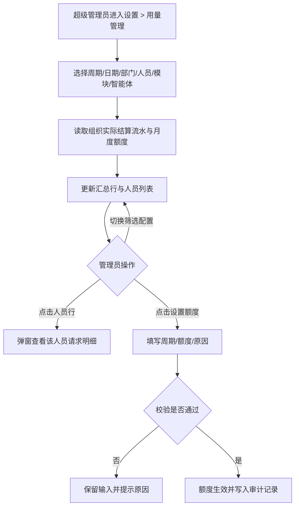

# 产品需求说明书

## 天马智擎 V1.1.0 — M3 用量管理（管理员视图改造）

## 版本信息

| 版本号 | 时间（必填） | 状态 | 简要描述（必填） | 部门 | 责任产品（必填） | 批准人 |
| --- | --- | --- | --- | --- | --- | --- |
| V1.1.0-M3 | 2026-09-18 | M | 管理员用量统计改为平铺列表 + 部门多选下拉框 + 汇总行，去除树形结构和指标卡 |  |  |  |

注：状态可以为 N-新建、A-增加、M-更改、D-删除。

## 文档目的

本文档单独定义 M3 用量管理中**管理员视图**的改造需求，作为主 PRD 中 M3 章节的修订补充。普通用户"我的用量"页面、数据实体、业务规则、额度设置弹窗、预警机制等以主 PRD 为准，本文不重复定义。

## 功能模块清单

| 编号 | 功能名称 | 功能描述 | 所属模块 | 本期优先级 |
|---|---|---|---|---|
| M3 | 用量管理（管理员视图改造） | 平铺人员列表 + 部门多选下拉框 + 列表顶部汇总行，替代原树形结构 + 指标卡 | 设置 | P0-3 |

---

## M3-用量管理（管理员视图改造）

### 功能需求描述

超级管理员在"设置 > 用量管理"查看全组织人民币消耗与 Token。页面由筛选区、列表顶部汇总行和人员平铺列表组成。部门筛选使用多级级联下拉框，支持多选和半选中状态。不再使用树形结构展开部门→人员→请求，不再展示独立指标卡。点击人员行打开居中弹窗查看该人员的请求明细。

Token 与人民币金额采用两阶段更新：请求完成后立即生成实时初算，保证用户能够及时看到本次消耗；次日对前一自然日 Token 统一重算并回写人民币金额。页面展示"初算/已校准"状态及最近更新时间，累计用量、剩余额度和导出结果始终使用当前最新结果。

### 用户角色与用户故事

作为超级管理员，我希望通过部门筛选快速定位目标人员，在列表中一目了然地看到每个人的消耗和额度情况，点击即可查看明细，而不需要在树形结构中逐层展开。

### 业务主流程图及说明

| 区域 | 内容 |
|---|---|
| 筛选区 | 周期（今日、本周、本月）、开始日期、结束日期、部门（多级级联多选下拉框）、人员（可过滤下拉框）、模块、智能体、"查询"和"清空" |
| 汇总行 | 人民币消耗、系统额度、剩余额度、额度使用率、总 Token；位于列表最上方，随筛选条件同步更新 |
| 人员列表 | 平铺表格，每行一人，显示人员、部门、人民币消耗、Token、额度、剩余额度、使用率、操作 |

筛选区不提供对话模式、额度状态或关键词搜索。点击"查询"后，汇总行和人员列表必须使用同一组已应用条件同步更新。页面顺序固定为"筛选区 → 列表（含顶部汇总行）"。

请求详情展示会话名称、完成时间、用户、智能体、模型、输入 Token、输出 Token、缓存命中 Token、实际人民币金额、数据状态和数据更新时间；不展示调用次数或结算状态。

### 分支流程（异常流程）

- **结算信息缺失：**供应商未返回实际结算信息时，调用标记为"结算异常"且不计入正式消费金额；数据补齐后重新计算。
- **无数据：**所选范围不存在已结算调用时，列表显示空状态；用户可调整筛选条件。
- **加载失败：**汇总或列表读取失败时，保留筛选条件和已有数据，显示失败原因及重试入口。
- **权限失效：**查看期间失去超级管理员权限时，立即终止请求并清除受限缓存，退出页面并提示权限变化；恢复权限后可重新进入。

### 界面原型

| 动作 | 显示 | 类型 | 描述 |
| --- | --- | --- | --- |
| 【管理员入口】进入"设置 > 用量管理" | 筛选区、列表顶部汇总行和人员平铺列表 | 管理页面 | · 用量明细和额度管理不设 Tab，合并为一页 · 仅超级管理员可见 · 所有区域使用同一筛选范围 |
| 【部门筛选】点击部门下拉框 | 多级级联部门树，带复选框 | 级联多选下拉框 | · 支持多层级部门展开 · 支持多选 · 父节点选中时子节点全选，子节点部分选中时父节点半选中 · 全部选中时显示"全部部门" · 选中后下拉框内显示已选部门名称，过多时省略 |
| 【人员筛选】输入本名或花名 | 可过滤搜索的人员候选 | 可过滤下拉框 | · 显示"本名（花名）" · 最终按用户 ID 限定结果 |
| 【汇总行】查看列表顶部汇总 | 人民币消耗、系统额度、剩余额度、使用率、总 Token | 列表首行 | · 位于人员列表最上方，样式区别于普通行 · 与已应用筛选条件同步变化 · 替代原独立指标卡 |
| 【人员列表】查看人员用量 | 人员、部门、人民币消耗、Token、额度、剩余额度、使用率、操作 | 平铺表格 | · 人员显示"本名（花名）" · 每行一人，不展开子级 · 按人民币消耗倒序排列 |
| 【人员行】点击某一行 | 该人员的请求明细弹窗 | 居中弹窗 | · 弹窗内展示该人员在当前筛选范围内的全部请求 · 请求标题为"会话名称 · 时间" · 返回后保留筛选条件 |
| 【请求详情】点击请求的"详情" | 人民币消耗、输入 Token、输出 Token、缓存命中 Token | 居中弹窗 | · 详情统一使用弹窗，不使用右侧抽屉 · 返回后保留筛选条件 |
| 【设置额度】在人员行点击"设置额度" | 人员、周期、额度、原因 | 居中弹窗 | · 周期支持每日、每周、每月 · 保存成功后立即刷新该行额度与使用率 |
| 【数据更新时间】查看更新时间 | 数据状态和最近更新时间 | 状态说明 | · 请求完成后显示"实时初算"及初算时间 · 次日重算完成后更新为"已校准"及重算完成时间 · 重算失败时保留初算结果并标记"待校准" |
| 【额度预警】人员周期剩余额度首次低于 10% | 主文案"额度即将用尽"；副文案"{本名（花名）}的本周期额度仅剩 {X%}，请及时调整额度，避免任务中断。" | 右下角提醒 | · 同一用户、同一额度周期、同一阈值跨越只提醒一次 · 额度上调至 10% 以上后再次跌破可重新提醒 |

### 数据说明（业务实体）

数据实体与主 PRD 一致，本文不重复定义。

### 业务规则和约束条件

以下规则与主 PRD 一致，本文不重复定义：用户可见范围、管理员可见范围、统计口径、金额展示、实时初算、次日重算、重算异常、额度周期、预警阈值、额度修改、额度不足、默认额度。

**本期新增/变更规则**

| 规则类型 | 规则与约束 |
|---|---|
| 部门筛选 | 使用多级级联多选下拉框，支持多层部门展开、多选和半选中状态；父节点全选则子节点全选，子节点部分选中则父节点半选中 |
| 列表形态 | 平铺人员列表，不使用树形结构；部门→人员→请求的层级关系通过部门筛选和点击人员行弹窗查看请求来替代 |
| 汇总行 | 列表最上方固定一行汇总数据，展示人民币消耗、系统额度、剩余额度、使用率和总 Token；替代原独立指标卡 |
| 明细查看 | 点击人员行打开居中弹窗查看该人员的请求明细，不在列表内展开子级 |
| 排序规则 | 人员列表默认按人民币消耗倒序排列 |

### 接口说明

不在产品需求阶段定义具体接口；后端需支持部门多选筛选和按人员聚合的列表查询。

### AI 链路说明

本模块不涉及新增 AI 推理链路。
