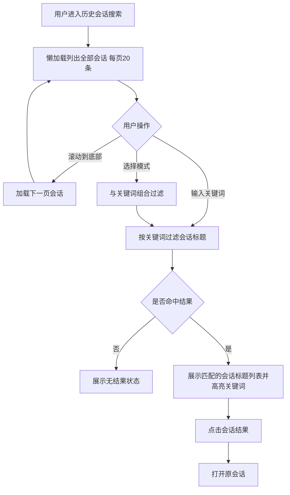

# 产品需求说明书

## 天马智擎 V1.1.0 — M7 会话搜索优化

## 版本信息

| 版本号 | 时间（必填） | 状态 | 简要描述（必填） | 部门 | 责任产品（必填） | 批准人 |
| --- | --- | --- | --- | --- | --- | --- |
| V1.1.0-M7 | 2026-09-18 | M | 会话搜索仅搜标题，懒加载显示全部会话（替代原按规则筛选限量返回） |  |  |  |

注：状态可以为 N-新建、A-增加、M-更改、D-删除。

## 文档目的

本文档单独定义 M7 会话搜索优化的产品需求，作为主 PRD 中 M7 章节的修订补充。其余模块（M1～M6、M8）以主 PRD 为准，本文不重复定义。

## 功能模块清单

| 编号 | 功能名称 | 功能描述 | 所属模块 | 本期优先级 |
|---|---|---|---|---|
| M7 | 会话搜索优化 | 仅搜索会话标题，懒加载显示全部会话（替代原按规则筛选限量返回） | 对话 | P0-7 |

---

## M7-会话搜索优化

### 功能需求描述

用户通过关键词搜索自己的会话标题。搜索弹窗打开后，懒加载列出当前用户的全部会话（按最近活跃时间倒序），每页 20 条并随列表滚动逐页加载；输入关键词后按会话标题过滤匹配结果。搜索弹窗增加模式下拉框；点击会话结果后打开原会话。本期将原按规则筛选限量返回改为懒加载显示全部会话。

### 用户角色与用户故事

作为用户，我希望快速找到自己过去的会话，而不是逐个翻阅历史列表。

### 业务主流程图及说明

1. 用户从历史会话区域进入搜索弹窗，系统立即懒加载列出当前用户的全部会话。
2. 每页 20 条，用户滚动到底部时自动加载下一页，直到全部会话加载完毕。
3. 用户输入关键词后，系统按关键词匹配会话标题，实时过滤并高亮展示匹配的会话标题。
4. 用户可通过下拉框筛选模式，与关键词组合生效。
5. 点击会话结果打开原会话。

### 分支流程（异常流程）

- **输入为空：** 关键词为空时展示全部会话列表，不做过滤。
- **无结果：** 当前筛选条件没有匹配的会话时显示无结果状态；用户可修改关键词或调整筛选。
- **首次加载失败：** 会话列表请求失败时显示失败原因及重试入口。
- **加载下一页失败：** 保留已有结果，不重复追加，显示局部失败及重试入口。

### 界面原型

| 动作 | 显示 | 类型 | 描述 |
| --- | --- | --- | --- |
| 【会话搜索入口】从历史会话区域进入搜索 | 顶部搜索框、筛选区和会话列表 | 搜索弹窗 | · 搜索框内不显示"消息"标签 · 桌面端弹窗居中并保留遮罩 · 打开后立即列出全部会话 |
| 【模式选择】选择全部模式、日常办公或专家模式 | 对应模式的会话结果 | 下拉框 | · 默认全部模式 · 与关键词组合生效 |
| 【搜索输入框】输入关键词 | 标题匹配的会话列表 | 结果列表 | · 只展示会话标题和最后活跃时间 · 不展示消息正文片段或摘要 · 标题中匹配词使用蓝色文字和浅蓝底色高亮 · 按最近活跃时间倒序 |
| 【会话结果项】点击结果 | 原会话 | 跳转 | · 打开对应会话 · 保持会话正常阅读位置 |
| 【懒加载】滚动到列表底部 | 下一页会话 | 滚动懒加载 | · 每页固定 20 条 · 保留已有结果并去重 · 全部加载完毕后不再触发加载 |

### 数据说明（业务实体）

| 字段名 | 数据类型 | 长度 | 默认值 | 必需 | 约束说明 |
|---|---|---:|---|---:|---|
| 用户 ID | 字符串 | 64 | — | 是 | 后端强制限定为当前用户，不接受前端扩大范围 |
| 会话 ID | 字符串 | 64 | — | 是 | 打开原会话的稳定标识 |
| 会话标题 | 字符串 | 255 | 空 | 是 | 参与搜索并用于结果展示，结果列表只展示此字段 |
| 对话模式 | 枚举 | 16 | 日常办公 | 是 | 日常办公、专家模式，用于模式下拉筛选 |
| 最后活跃时间 | 日期时间 | — | — | 是 | 结果排序和懒加载分页依据 |

### 业务规则和约束条件

| 规则类型 | 规则与约束 |
|---|---|
| 搜索范围 | 仅搜索会话标题，不搜索消息正文 |
| 结果展示 | 结果列表只展示会话标题和最后活跃时间，不展示消息正文片段或摘要 |
| 模式筛选 | 使用下拉框选择全部模式、日常办公或专家模式，并与关键词组合生效 |
| 匹配排序 | 关键词匹配不区分大小写，结果按最近活跃时间倒序 |
| 命中高亮 | 标题中与搜索词完全匹配的文字使用蓝色文字和浅蓝底色；同一标题出现多次时全部高亮 |
| 权限范围 | 删除、无权或不属于当前用户的会话不得返回 |
| 懒加载策略 | 打开搜索弹窗后立即列出全部会话，每页 20 条，滚动到底部自动加载下一页；全部加载完毕后不再触发 |
| 结果去重 | 懒加载过程中不得重复展示同一会话 |

### 接口说明

不在产品需求阶段定义具体接口；后端必须按当前用户 ID 限定会话范围，并支持按页渐进查询全部会话。

### AI 链路说明

本模块不涉及新增 AI 推理链路。
