# 天马智擎 MVP 产品需求文档（PRD）

---

## 一、产品概述

### 1.1 产品定位

**天马智擎**是集团统一的数智员工平台，定位为「公司内部业务的工作台」而非通用型 AI 对话工具。
平台集成集团业务系统门户、仪表盘、统一知识库、钉钉生态工具，实现「一次登录、全系统通行、AI 赋能全业务场景」。

**命名体系**：

| 名称 | 含义 | 使用场景 |
|------|------|----------|
| **天马智擎** | 平台正式名称 | Logo、品牌展示、对外宣传 |
| **小马** | 内置通用专家的拟人化形象 | 对话引导语、欢迎语、提示文案 |
| **工作区** | 统一 AI 对话工作区（首页） | 默认 Tab 页，搜索与对话主界面 |
| **工作台** | 业务应用聚合页 | 第二个 Tab 标签 |
| **仪表盘** | 数据看板页 | 第三个 Tab 标签 |
| **知识库** | 统一知识库管理（公共空间/个人空间） | 第四个 Tab 标签 |
| **建议箱** | 反馈后台（纯后端采集，不设前端页面） | 后端自动归集赞/踩反馈与软反馈，不暴露前端入口 |

MVP 阶段聚焦方案中心业务场景，验证方案匹配核心价值，同时沉淀通用底座（统一知识库平台、多轮对话记忆、工具调用接口、权限角色隔离），支撑后续多专家扩展。

### 1.2 目标用户

| 用户分层 | 核心人群 | 核心诉求 |
|----------|----------|----------|
| 核心用户 | 方案中心专员、销售支持人员 | 快速匹配组合方案、提升方案输出效率 |
| 通用用户 | 617名 员工 | 通用问答、钉钉工具快捷操作、统一访问内部系统 |
| 后台用户 | 方案专家、产品运营 | 查看用户反馈、优化方案池、迭代匹配效果 |

### 1.3 MVP 核心目标

1. **统一入口**：支持钉钉扫码/账号密码双方式登录，一个入口访问所有内部系统与数据看板，实现单点登录
2. **业务闭环**：方案中心专家完成「需求澄清 → 方案池匹配 → 组合输出 → 文件导出 → 用户反馈」全流程
3. **通用能力**：多格式文件解析理解、钉钉生态工具操作、通用知识问答
4. **迭代闭环**：用户反馈自动归集，支撑方案内容与匹配效果持续优化，跑通数据飞轮
5. **Agent基准**：①大语言模型（LLM接入+模型切换）+提示词配置（系统Prompt管理）②工具调用（Skill + MCP 工具链）③知识库、多轮记忆、角色权限隔离

### 1.4 成功指标

| 维度 | 目标 | 衡量方式 |
|------|------|----------|
| 种子用户覆盖 | 10-30 名方案中心核心用户 | 活跃用户数 |
| 用户覆盖率 | 方案中心目标用户 100% 开通 | 开通率 + 登录率 |
| 方案产出 | 100+ 次有效方案会话 | 会话总量 |
| 任务成功率 | ≥ 60% 用户能完成一轮完整对话（需求澄清 → 方案初稿 → 优化） | 会话完成率 |
---

## 二、整体架构与核心流程

### 2.1 四层技术架构总览

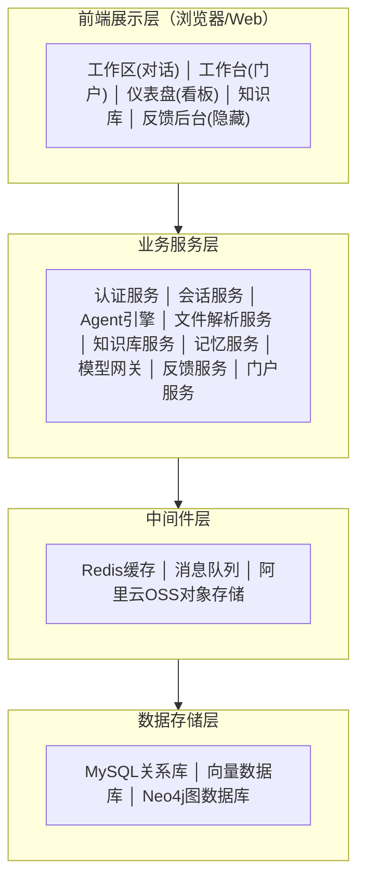
```mermaid
graph
    subgraph L1["前端展示层（浏览器/Web）"]
        A["工作区(对话) │ 工作台(门户) │ 仪表盘(看板) │ 知识库 │ 反馈后台(隐藏)"]
    end

    subgraph L2["业务服务层"]
        B["认证服务 │ 会话服务 │ Agent引擎 │ 文件解析服务 │ 知识库服务 │ 记忆服务 │ 模型网关 │ 反馈服务 │ 门户服务"]
    end

    subgraph L3["中间件层"]
        C["Redis缓存 │ 消息队列 │ 阿里云OSS对象存储"]
    end

    subgraph L4["数据存储层"]
        D["MySQL关系库 │ 向量数据库 │ Neo4j图数据库"]
    end

    L1 --> L2 --> L3 --> L4
```

### 2.2 核心业务主流程

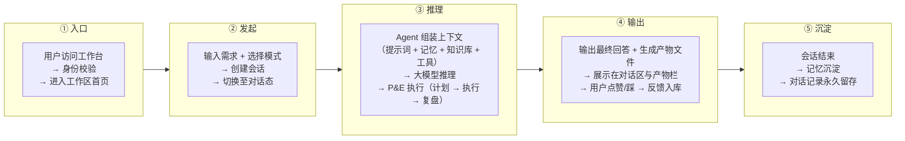
```mermaid
flowchart LR
    subgraph S1["① 入口"]
        A["用户访问工作台<br/>→ 身份校验<br/>→ 进入工作区首页"]
    end

    subgraph S2["② 发起"]
        B["输入需求 + 选择模式<br/>→ 创建会话<br/>→ 切换至对话态"]
    end

    subgraph S3["③ 推理"]
        C["Agent 组装上下文<br/>（提示词 + 记忆 + 知识库 + 工具）<br/>→ 大模型推理<br/>→ P&E 执行（计划 → 执行 → 复盘）"]
    end

    subgraph S4["④ 输出"]
        D["输出最终回答 + 生成产物文件<br/>→ 展示在对话区与产物栏<br/>→ 用户点赞/踩 → 反馈入库"]
    end

    subgraph S5["⑤ 沉淀"]
        E["会话结束<br/>→ 记忆沉淀<br/>→ 对话记录永久留存"]
    end

    S1 --> S2 --> S3 --> S4 --> S5
```

### 2.3 核心业务闭环流程（Mermaid 时序）

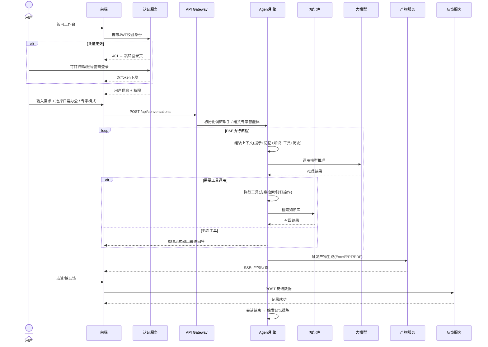
```mermaid
sequenceDiagram
    actor User as 用户
    participant FE as 前端
    participant Auth as 认证服务
    participant API as API Gateway
    participant Agent as Agent引擎
    participant KB as 知识库
    participant LLM as 大模型
    participant Art as 产物服务
    participant Feedback as 反馈服务

    User->>FE: 访问工作台
    FE->>Auth: 携带JWT校验身份
    alt 凭证无效
        Auth-->>FE: 401 → 跳转登录页
        User->>Auth: 钉钉扫码/账号密码登录
        Auth-->>FE: 双Token下发
    end
    Auth-->>FE: 用户信息 + 权限

    User->>FE: 输入需求 + 选择日常办公 / 专家模式
    FE->>API: POST /api/conversations
    API->>Agent: 初始化调研帮手 / 组货专家智能体

    loop P&E执行流程
        Agent->>Agent: 组装上下文(提示+记忆+知识+工具+历史)
        Agent->>LLM: 调用模型推理
        LLM-->>Agent: 推理结果
        alt 需要工具调用
            Agent->>Agent: 执行工具(方案检索/钉钉操作)
            Agent->>KB: 检索知识库
            KB-->>Agent: 召回结果
        else 无需工具
            Agent-->>FE: SSE流式输出最终回答
        end
    end

    Agent->>Art: 触发产物生成(Excel/PPT/PDF)
    Art-->>FE: SSE: 产物状态

    User->>FE: 点赞/踩反馈
    FE->>Feedback: POST 反馈数据
    Feedback-->>FE: 记录成功

    Agent->>Agent: 会话结束 → 触发记忆提炼
```

---

## 三、页面与交互详细需求

### 3.1 全局导航框架

#### 3.1.1 顶部固定导航栏

Header 固定顶部，通栏展示，z-index 最高。**所有 Tab 页共享同一个 Header**。


- **左侧**：固定控制位（侧边栏展开/折叠按钮）+ 产品 Logo「天马智擎」+ 简洁几何 icon。**点击 Logo 回到工作区首页**（默认页 `/`）
- **中部**（桌面端）：一级 Tab 导航，共 3 个，切换无刷新
  1. **工作台** — 聚合所有业务应用入口（原"系统门户"）
  2. **仪表盘** — 数据看板嵌入（原"数据看板"）
  3. **知识库** — 统一知识库管理（公共空间/个人空间）
- **建议箱**：不设前端页面，不在 Header 和移动端底部导航展示；反馈数据通过后端 `message_feedback` 与 `soft_feedback` 表自动归集，管理员通过后台 API 直接查询
- **右侧**：固定控制位（资产栏展开/折叠按钮）+ 用户头像 + 用户姓名（钉钉同步），点击头像展开下拉菜单
  - 查看历史对话（展开左侧栏）
  - 记忆开关（是否启用长期语义记忆，默认开启）
  - 退出登录

**移动端底部导航栏**（`md` 断点以下显示，桌面端隐藏）：
- 移动端底部固定 4 个 Tab：**工作区**、**工作台**、**仪表盘**、**知识库**（建议箱不设前端页面，不在导航中展示）

**关键交互**：
- 点击 Logo → **回到工作区首页**（搜索页），这是用户最主要的回首页方式
- Header 左右控制位用于承载当前页面的侧边栏展开/折叠按钮；页面有左侧栏时左控制位显示边框 icon-only 按钮，页面有右侧栏/资产栏时右控制位显示边框 icon-only 按钮
- 当前页面没有对应侧边栏时，控制位保持为空，不显示图标；按钮不得再放在页面边缘悬浮位置或局部标题栏中
- 页面布局采用流式弹性自适应：核心宽度、边距、侧栏宽度、头像与标题字号使用 `clamp()` / `calc()` 随窗口连续缩放，避免只在固定断点跳变
- 建议箱不设前端页面，`admin` 和 `solution_ops` 的反馈数据通过后台 API 查询；赞踩数据正常落盘不受影响

#### 3.1.2 全局交互规则

- 页面刷新不丢失当前 Tab 与会话状态（Tab 状态存入 URL hash）
- 所有接口请求自动携带身份凭证，凭证过期自动无感刷新
- 网络异常、服务异常统一 Toast 提示，支持重试

#### 3.1.3 页面加载时序

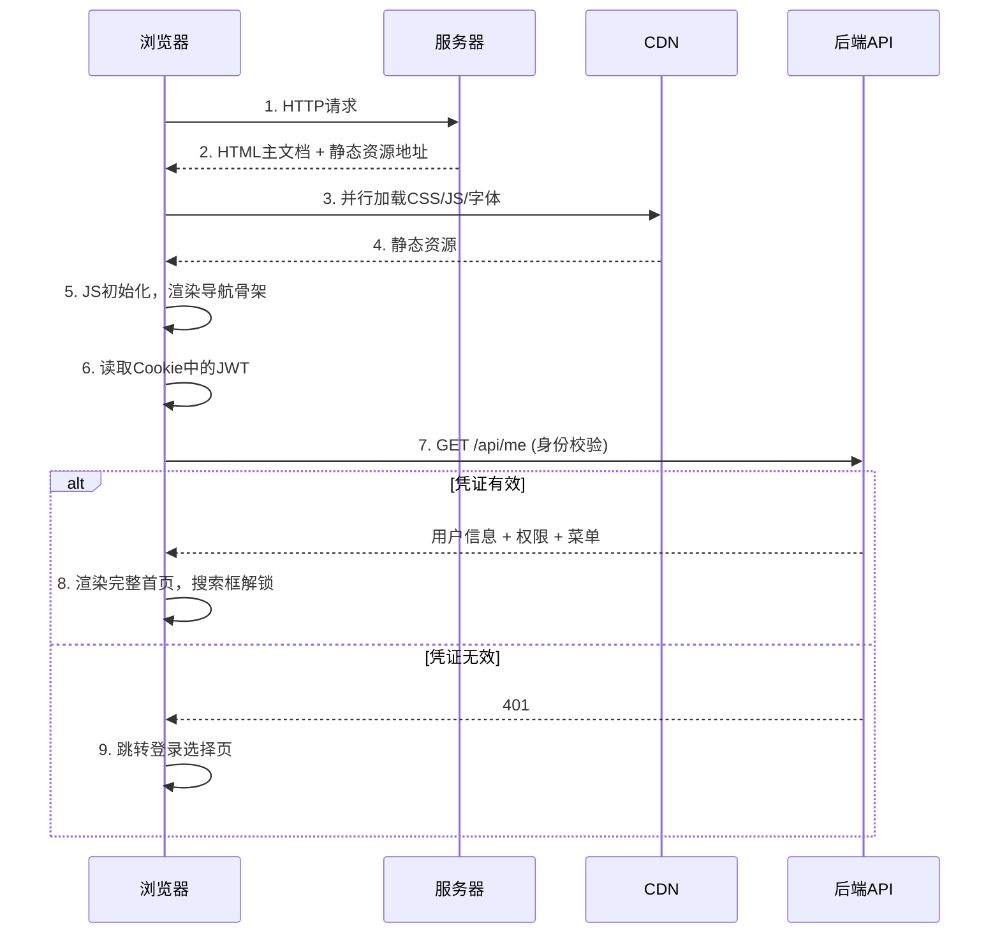
```mermaid
sequenceDiagram
    participant Browser as 浏览器
    participant Server as 服务器
    participant CDN as CDN
    participant API as 后端API

    Browser->>Server: 1. HTTP请求
    Server-->>Browser: 2. HTML主文档 + 静态资源地址
    Browser->>CDN: 3. 并行加载CSS/JS/字体
    CDN-->>Browser: 4. 静态资源
    Browser->>Browser: 5. JS初始化，渲染导航骨架
    Browser->>Browser: 6. 读取Cookie中的JWT
    Browser->>API: 7. GET /api/me (身份校验)
    alt 凭证有效
        API-->>Browser: 用户信息 + 权限 + 菜单
        Browser->>Browser: 8. 渲染完整首页，搜索框解锁
    else 凭证无效
        API-->>Browser: 401
        Browser->>Browser: 9. 跳转登录选择页
    end
```

**异常处理**：

| 场景 | 前端表现 | 后端处理 |
|------|----------|----------|
| 静态资源加载失败 | 页面白屏，显示"加载失败，点击重试" | CDN 多节点容灾 |
| /api/me 接口超时 | 导航显示默认状态，3 秒后自动重试 | 返回 503，记录日志 |
| Cookie 中无 JWT | 直接跳转登录页 | 无需处理 |

---

### 3.2 工作区（统一对话工作区）

**核心设计理念：首页和全屏对话页是同一个页面，不再区分。** 用户在同一个界面上完成"搜索 → 对话 → 查看结果"全流程，无需页面跳转。

#### 3.2.1 页面整体布局

工作区采用**三栏布局**，将首页搜索和全屏对话统一在同一个页面内，用户在同一界面上完成「搜索 → 对话 → 查看结果」全流程，无需页面跳转。

**初始态（搜索页）**：


**历史对话栏展开**：


**对话态（消息流 + 右侧产物栏）**：

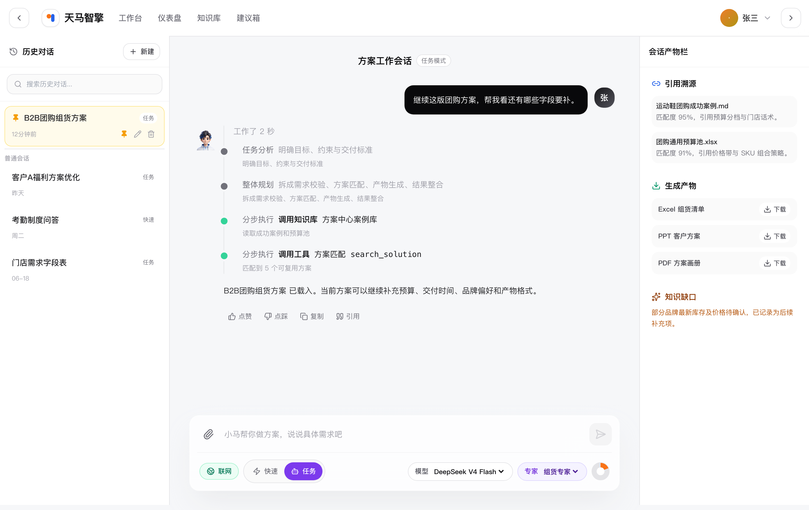

**三栏行为规则**：

| 栏 | 默认状态 | 触发条件 | 宽度 |
|----|---------|----------|------|
| 左侧栏 | **隐藏**（仅露出 4px 展开把手） | 点击左侧把手 / 点击头像菜单"查看历史对话" | 260px（展开时覆盖模式，不挤压主区） |
| 中间主区域 | 始终显示 | — | flex-1 |
| 右侧栏 | **隐藏** | AI 回答中包含引用文件 / 产物生成 / 知识缺口时**自动滑入** | 320px |

**初始态 vs 对话态**：
- **初始态**（无活跃会话）：中间区域显示搜索框+案例卡片（原"首页"），左侧栏可展开查看历史
- **对话态**（有活跃会话）：中间区域显示消息流+输入栏（原"全屏对话页"），左右栏行为不变
- 从初始态到对话态：用户发送消息 → 创建会话 → 搜索区收起 → 消息流展开（无页面跳转，同一 DOM 内过渡）
- 从对话态回初始态：点击 Logo 或新建任务 → 当前会话保留在历史列表中 → 中间区恢复搜索态

#### 3.2.2 双模式：日常办公 / 专家模式

当前 MVP 将双模式调整为：**日常办公** 和 **专家模式**，默认选中「日常办公模式」。

两种模式共享同一套底层能力框架（统一知识库、长期记忆、工具调用、权限角色隔离），但上层场景与执行方式不同。

| 对比维度 | 日常办公 | 专家模式 |
|----------|-----------|----------|
| **定位** | 面向日常工作问答与信息整理 | 面向方案生成、需求澄清与业务闭环 |
| **默认配置** | **调研帮手** | **组货专家智能体** |
| **能力边界** | 轻量问答、知识检索、内容整理、简单操作 | 方案匹配、字段澄清、工具调用、产物生成 |
| **Web Search** | ✅ 默认开启 | ✅ 默认开启 |
| **知识库** | ✅ 可检索统一知识库（按角色权限） | ✅ 可检索统一知识库（按角色权限） |
| **执行方式** | **RAG**：检索增强生成，适合快速问答 | **P&E**：计划-执行机制，适合复杂任务闭环 |
| **记忆机制** | 当前会话上下文 + 可选长期记忆 | 当前会话 + 长期语义记忆 + 跨会话状态保持 |
| **响应速度** | < 1s 首字 | < 3s 首字 |
| **适用场景** | 查资料、整理内容、生成文案、常用办公辅助 | 方案生成、需求澄清、生成清单、钉钉执行动作 |

**设计原则**：
- 日常办公 = “快问快答”，强调低门槛、低认知成本，像使用一位高效的办公助手。
- 专家模式 = “深度协作”，由智能体自主计划、执行、复盘，完成更复杂任务。
- **两种模式都具备 Web Search 和知识库能力**，这是 AI 工作台的底座能力，不是某一模式独享。
- 模式切换与智能体切换均实时生效，用户可在同一会话中动态切换。

**Web Search 图标**：在输入框旁常驻显示 🌐 图标，绿色高亮 = 已开启（默认），点击可切换关闭。关闭后回答仅基于知识库和模型训练数据，不检索互联网。状态在两种模式下独立记忆。

#### 3.2.2.1 左侧历史对话栏与右侧产物栏

**左侧历史对话栏**：
- 默认收起，仅露出展开把手；点击后展开显示会话列表。
- 会话项支持：置顶、重命名、删除、继续对话、查看详情。
- 点击会话项时，进入该会话的上下文；若用户未保存当前会话，可选择新建对话后继续。
- 新建对话入口位于左侧栏顶部，创建后自动切换到新会话。

**右侧产物栏**：
- 默认收起；当回答包含引用文件、产物生成、知识缺口或执行结果时自动展开。
- 展示内容包括：产物下载卡片、引用文件、知识缺口记录、工具执行摘要。
- 方案导出、文件预览、结果查看均通过右侧产物栏承载，作为当前会话的交付结果面板。
- 若当前会话没有相关产物或引用，则右侧栏保持空状态，不强制展开。

**对话交互补充**：
- 用户在回答生成过程中，系统仅支持“打断生成”与“继续生成”；在生成中不允许并行提交新问题或新任务。
- 生成中发送按钮置灰并展示提示文案“正在生成，请稍后再试”。
- 用户可在任意时刻切换模式与智能体，切换后新一轮消息按当前配置执行。
- 新建对话入口位于左侧栏顶部；点击后立即创建新会话并切换到空白输入态，当前会话保留在历史列表中。
- 历史会话支持置顶、重命名、删除、继续对话和查看详情；点击查看详情时可展示会话摘要与关联文件。

#### 3.2.2.2 小马引导语体系

围绕内置专家"小马"的品牌人格化形象，设计一套统一的引导语体系。所有引导语遵循友好、亲切、高效的调性，呼应公司 Logo（马）形象，增强亲和力与识别度。

| 场景 | 引导语 | 出现位置 |
|------|--------|----------|
| 新会话欢迎 | **"小马在线，有事随时说"** | 工作区新会话空白态居中展示，配合小马 emoji 🐴 |
| 日常办公模式 placeholder | "小马随时为你解答，试试提问或上传文件吧" | 输入框 placeholder |
| 专家模式 placeholder | "小马帮你做方案，说说具体需求吧" | 输入框 placeholder |
| 工作中 | "小马正在工作中..." | P&E 过程时间线旁 loading 文案 |
| 联网搜索中 | "小马正在帮你搜索相关信息..." | Web Search 工具调用时的状态提示 |
| 知识库检索中 | "小马正在查阅知识库..." | 知识库检索工具调用时的状态提示 |
| 用户停止生成 | "小马已停止生成，你可以继续追问" | 消息末尾 interrupted 标记 |
| 生成出错 | "小马遇到了一点问题，请稍后重试" | 错误提示 Toast |
| 方案生成完成 | "小马已为你整理好方案，可以导出或继续优化" | 方案输出底部引导语 |
| 知识缺口发现 | "小马暂时无法回答这个问题，已记录下来后续补充" | 右侧栏知识缺口记录旁 |
| 全部完成 | "还有其他需要小马帮你的吗？" | 对话完成后底部建议 |

**用户常用指令示例**（引导语可在首页案例区展示）：

| 指令 | 说明 |
|------|------|
| "小马帮我查知识库里的考勤规定" | 知识库检索 |
| "小马生成一份分析报告" | 内容生成 |
| "小马转PPT" | 格式转换/导出 |
| "小马帮我给张明发个钉钉消息" | 钉钉集成 |
| "小马搜一下最新的行业动态" | Web Search |

#### 3.2.3 搜索输入框与附件上传

工作区输入区参考 Ant Design X 的对话产品范式组织：底部固定 Sender 输入器承载文本输入，工具栏作为 Sender 的 prefix/action 区承载上传、联网、模式/智能体切换；附件以 Attachments 文件列表展示；推荐案例以 Prompts 浮层展示；会话列表对应 Conversations，过程时间线对应 ThoughtChain，回答操作对应 Actions。

**文本输入**：
- 支持多行输入，Enter 发送，Shift+Enter 换行。
- 输入框最高高度限制为 **168px**（约 8 行），超出后显示垂直滚动条。
- 输入为空时发送按钮置灰。

**附件上传**：
- 上传入口位于 Sender 工具栏，显示「上传」按钮 + 回形针图标，点击唤起系统文件选择器。
- 支持拖拽文件到搜索区域自动识别并添加。
- 选中文件后在搜索框下方显示 `file-chip` 标签列表（类型图标 + 文件名截断 + 删除按钮 ✕）。
- 已添加的文件在发送时一并提交到会话。
- 上传按钮悬停/聚焦时显示应用内轻提示卡，不使用浏览器原生 `title` 样式；提示文案为「上传业务资料 / 支持 PDF、Word、Excel、PPT、TXT、PNG、JPG，单个文件 20MB 内」。

**Ctrl+V 粘贴上传**：
- 支持从系统剪贴板直接粘贴 PNG/JPG 图片到搜索框。
- 用户在其他应用中 `Ctrl+C` 复制截图，回到搜索框 `Ctrl+V` 即可触发上传。

**统一上传规则**：
- 工作区与知识库上传统一采用：单文件最大 **20MB**，单次最多 **10 个文件**。
- 支持格式：PDF、Word（DOC/DOCX）、Excel（XLS/XLSX）、PPT（PPT/PPTX）、TXT、PNG、JPG/JPEG。
- 上传前先做格式与大小校验；校验失败时立即阻断上传并给出提示。
- 知识库页上传与工作区上传共享同一套限制规则，上传成功后会显示“处理中 / 已索引 / 失败”状态，失败时可在文件列表内重试或删除。

**案例区**：

搜索框聚焦后在输入框下方弹出毛玻璃 Prompts 浮层，默认不占用首页空间。浮层根据当前模式和已选智能体动态切换案例：

| 场景 | 展示内容 | 引用上下文 |
|------|----------|------------|
| 日常办公 + 调研帮手 | 查知识库、搜行业动态、生成分析报告 | 记录“日常办公 / 调研帮手 / 对应知识库” |
| 日常办公 + 钉钉助理 | 定日程、创建 AI 表格、创建待办 | 记录“日常办公 / 钉钉助理 / 钉钉办公助手” |
| 专家模式 + 组货专家 | B2B 线下团购方案、门店需求采集、成功案例复用 | 记录“专家模式 / 组货专家 / 方案中心案例库或字段模板” |
| 专家模式 + 敬请期待 | 只展示占位项，不允许选择执行 | 无 |

点击任意案例卡片：将示例文本填入搜索框，同时预填对应**模式**、**助理/专家**、**知识库来源**，**不自动发送**，用户可编辑后再发送。发送后，来源信息同步进入回答下方的「来源引用」区和右侧会话产物栏。

已选文件、知识库引用、文件夹引用均以 Attachments 卡片形式展示：图标 + 标题 + 状态/来源说明 + 删除或打开动作。MVP 不在输入区常驻额外工具按钮，避免工具条过重；引用来源主要由推荐案例、上传文件和 Agent 执行过程自动产生。

**时序**：

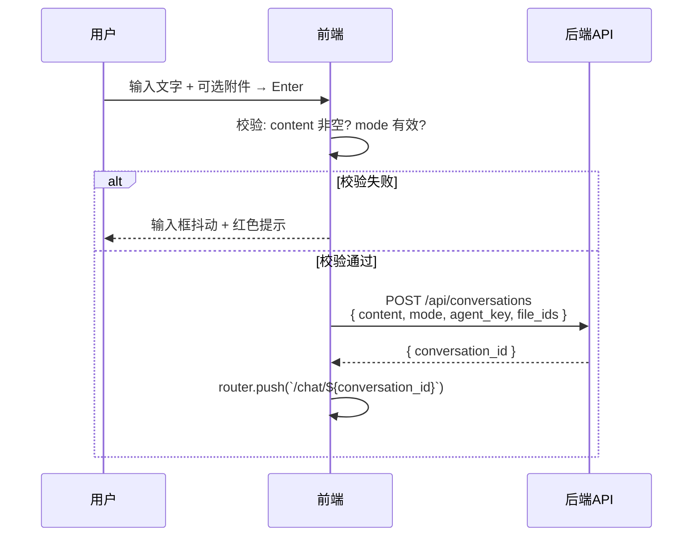
```mermaid
sequenceDiagram
    participant User as 用户
    participant FE as 前端
    participant API as 后端API

    User->>FE: 输入文字 + 可选附件 → Enter
    FE->>FE: 校验: content 非空? mode 有效?
    alt 校验失败
        FE-->>User: 输入框抖动 + 红色提示
    else 校验通过
        FE->>API: POST /api/conversations<br/>{ content, mode, agent_key, file_ids }
        API-->>FE: { conversation_id }
        FE->>FE: router.push(`/chat/${conversation_id}`)
    end
```

**异常处理**：

| 场景 | 用户提示 | 系统行为 |
|------|----------|----------|
| 输入为空时发送 | 发送按钮置灰，不可点击 | 前端拦截 |
| 粘贴内容非图片/文件 | 无提示，正常插入文本 | 按纯文本处理 |
| 粘贴图片/文件超过大小限制 | Toast: "文件大小超出限制（单文件20MB）" | 拒绝该文件，其他文件继续 |
| 粘贴不支持的图片格式 | Toast: "当前仅支持粘贴 PNG/JPG 图片" | 拒绝该图片 |
| 创建会话接口超时 (>10s) | Toast: "服务繁忙，请稍后重试" + 保留输入内容 | 自动重试 2 次，仍失败则提示 |
| 文件上传未完成时发送 | 阻断发送，提示"有文件正在上传中" | 等待上传完成后自动解除阻断 |
| 未登录状态发送 | 跳转登录页 | 前端拦截，不发起请求 |

#### 3.2.4 对话态——中间对话区布局

对话态下，中间主区域从上到下分为三层：局部标题栏、消息流、底部悬浮输入栏。侧边栏开关统一放在全局 Header 控制位，局部标题栏不再承载侧栏按钮。

> 左侧栏和右侧栏的布局、行为、折叠规则详见 **3.2.1 页面整体布局**中的三栏行为规则，两者在初始态和对话态下完全一致，不再重复描述。

**布局自适应规则**：
- 采用流式弹性自适应，主对话区宽度、搜索框宽度、底部输入栏宽度、侧栏宽度、头像尺寸和标题字号使用 `clamp()` / `calc()` 随窗口连续缩放
- 1920×1080 及以上分辨率下减少左右空白；窗口缩小时优先压缩中间内容宽度，再折叠辅助栏
- 左侧历史栏、知识库栏、工作区栏按钮统一 Teleport 到全局 Header 左控制位；右侧资产栏/产物栏按钮统一 Teleport 到全局 Header 右控制位
- 当前页面没有对应侧栏时，对应 Header 控制位为空，不显示图标

**会话标题自动生成**：首条消息发送后，后端异步调用轻量模型（DeepSeek V3）将首条消息总结为 6-8 字标题，自动更新 `conversation.title`，前端顶部栏实时显示。失败时回退显示"新会话"。

#### 3.2.5 消息类型与渲染规则

| 消息类型 | 渲染样式 | 数据来源 |
|----------|----------|----------|
| 用户文本消息 | 右侧气泡，支持 Markdown，附带用户头像与文件卡片 | 用户输入 |
| AI 工作过程 | 左侧 Codex/Claude Code 风格灰色时间线，显示「工作了 X 秒」和多行过程事件；默认折叠详情 | Agent P&E 规划、执行与复盘状态 |
| 工具/知识库/联网事件 | 灰色行展示动作 + 对象 + 结果摘要，如「调用知识库 方案中心案例库」「调用工具 search_solution」「搜索网络资料 行业案例」 | 后端工具执行、知识召回、Web Search 状态 |
| AI 最终回答 | 不使用气泡框，直接以 Markdown 正文渲染，支持标题、列表、表格、方案卡片 | 大模型最终输出 |
| 来源引用 | 回答正文下方展示来源卡片，右侧栏同步展示完整来源列表 | 知识库召回、联网搜索、文件解析、首页案例引用 |
| 方案推荐卡片 | 内嵌在 AI 回答中，独立组件，展示方案名称、所属池子、核心适配点、优势 | 结构化匹配结果 |
| 系统提示消息 | 左侧黄色/红色提示条，无气泡 | 后端异常/权限提示 |

**P&E 过程展示规则**：
- 展示内容是产品化过程摘要，不展示模型原始 chain-of-thought
- 过程顶部显示「工作了 X 秒」；下方每个阶段/工具/知识库/联网搜索都是独立灰色时间线行
- 每行默认只展示阶段名、动作对象和一句结果摘要；鼠标悬停时显示「展开」按钮，点击后展开详情，再次点击变为收起
- 运行中的过程行使用灰色光影流动文字效果，表达“正在思考/查阅/搜索/调用工具”，完成后转为稳定灰字与状态卡片
- 五段式 P&E 固定展示：任务分析、整体规划、分步执行、计划复盘、最终整合；日常办公模式可压缩为任务分析、整体规划、最终整合三行
- 分步执行内部可包含多条轻量工具事件：调用知识库、调用工具、搜索网络资料、生成产物、第三方系统操作等

**来源引用展示规则**：
- 来源引用采用 Sources 风格：来源卡片包含来源类型图标、来源名称、摘要、匹配度/状态、引用智能体。
- 回答正文中只保留业务结论与必要角标，不把工具日志或原始检索结果混入最终答案。
- 右侧会话产物栏统一收纳：来源引用、知识库文件夹、上传文件、生成产物、图表工具、知识缺口。
- 点击首页案例带入的来源必须携带当前已选助理/专家，例如「专家模式 · 组货专家 · 方案中心案例库」。
- 日常办公模式对「你好」等纯寒暄不触发 Sources 展示，不调用知识库或联网搜索。

**反馈按钮**：每条 AI 回答右下角固定展示 👍 有用 / 👎 不合适
- 点击「不合适」弹出二级选项：匹配不准 / 内容有误 / 答非所问 / 其他，支持输入文字备注
- 提交后显示「感谢反馈」，按钮置灰，不可重复提交
- 反馈落盘方式：前端提交后实时写入 `message_feedback` 表，记录 `message_id`、`conversation_id`、`user_id`、`feedback_type`（like/dislike）、`reason_code`、`reason_text`、`created_at`；如为踩反馈且原因为“内容有误”或“答非所问”，系统自动关联知识缺口或人工复核队列。

#### 3.2.6 文件上传交互

**触发方式**：
1. 点击上传图标：唤起系统文件选择器。
2. 快捷键粘贴：输入框内 Ctrl+V，自动识别剪贴板中的图片/文件，触发上传。
3. 知识库页通过顶部上传按钮或空状态入口上传文件。

**统一规则**：
- 支持格式：PDF、Word（DOC/DOCX）、Excel（XLS/XLSX）、PPT（PPT/PPTX）、TXT、PNG、JPG/JPEG。
- 单文件最大 **20MB**，单次最多上传 **10 个文件**。
- 上传中显示进度和状态；上传成功后在消息/知识库中显示解析状态（uploading → parsing → ready）。
- 上传按钮使用应用内轻提示卡展示格式说明，不使用与原型风格割裂的浏览器原生 title。

**工作区上传**：
- 上传附件后，文件卡片展示在输入框下方；发送消息时一并提交。
- 文件解析结果可在消息里显示引用文件卡片。

**知识库上传**：
- 知识库页支持通过右上角按钮、空状态入口或拖拽上传文件。
- 上传后自动进入解析队列并显示“处理中/已索引/失败”状态。
- 新建知识库时需填写名称与所属空间；创建成功后进入该知识库的文件列表。

**上传全链路**：

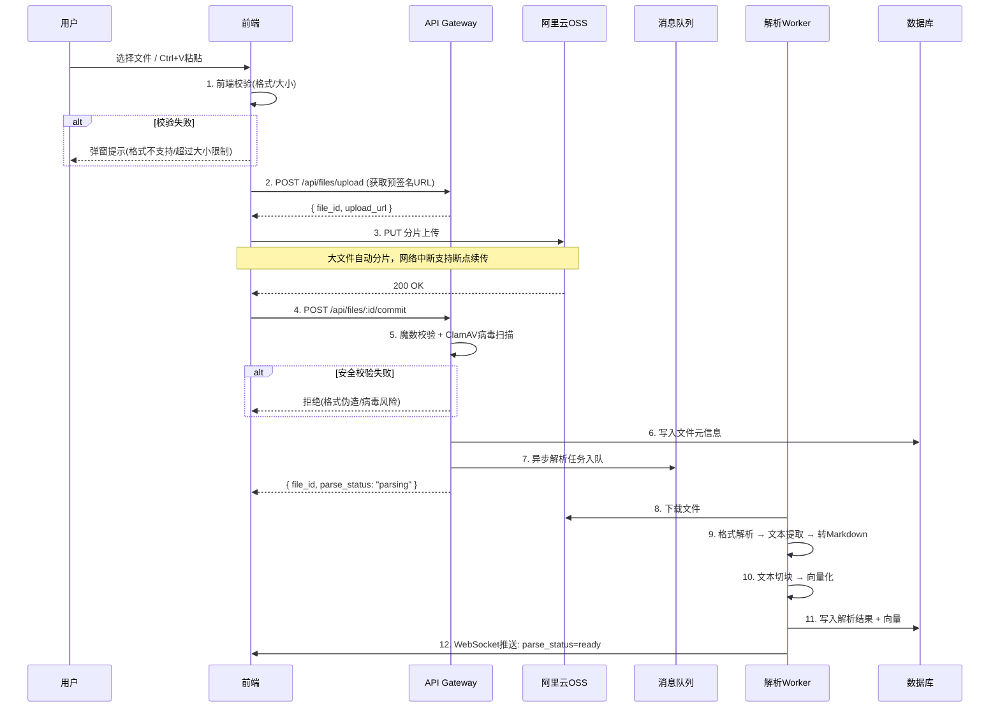
```mermaid
sequenceDiagram
    participant User as 用户
    participant FE as 前端
    participant API as API Gateway
    participant OSS as 阿里云OSS
    participant Queue as 消息队列
    participant Worker as 解析Worker
    participant DB as 数据库

    User->>FE: 选择文件 / Ctrl+V粘贴
    FE->>FE: 1. 前端校验(格式/大小)
    alt 校验失败
        FE-->>User: 弹窗提示(格式不支持/超过大小限制)
    end

    FE->>API: 2. POST /api/files/upload (获取预签名URL)
    API-->>FE: { file_id, upload_url }

    FE->>OSS: 3. PUT 分片上传
    Note over FE,OSS: 大文件自动分片，网络中断支持断点续传
    OSS-->>FE: 200 OK

    FE->>API: 4. POST /api/files/:id/commit
    API->>API: 5. 魔数校验 + ClamAV病毒扫描
    alt 安全校验失败
        API-->>FE: 拒绝(格式伪造/病毒风险)
    end

    API->>DB: 6. 写入文件元信息
    API->>Queue: 7. 异步解析任务入队
    API-->>FE: { file_id, parse_status: "parsing" }

    Worker->>OSS: 8. 下载文件
    Worker->>Worker: 9. 格式解析 → 文本提取 → 转Markdown
    Worker->>Worker: 10. 文本切块 → 向量化
    Worker->>DB: 11. 写入解析结果 + 向量
    Worker->>FE: 12. WebSocket推送: parse_status=ready
```

**异常处理**：

| 场景 | 前端表现 | 后端处理 |
|------|----------|----------|
| 文件格式不支持 | 选中后立即弹窗提示 | 上传前拦截，不接收文件 |
| 文件超过 20MB | 选中后立即弹窗提示 | 上传前拦截 |
| 上传网络中断 | 提示「网络中断，点击续传」 | 保留已上传分片，支持断点续传 |
| 文件解析失败 | 提示「文件解析失败，请检查文件完整性」 | 记录错误日志，自动重试2次，不阻塞对话 |
| 病毒检测阳性 | 提示「文件安全检测未通过」 | 直接删除文件，记录安全日志 |
| 改后缀上传（如.exe改.pdf） | 提示「文件格式异常，请检查」 | 魔数校验拦截 |

#### 3.2.7 方案导出交互

导出是方案生成闭环的最后一环，让用户将 AI 生成的方案转化为可直接交付的文档。

**完整交互流**：

1. 专家模式生成方案时，如任务包含交付物诉求，系统自动在右侧产物栏创建生成任务。
2. 右侧产物栏自动滑入，Header 右控制位显示展开/折叠按钮；用户可随时收起或重新展开。
3. 产物栏按资产类型分区展示：
   - **来源引用**：知识库文件、联网网页、首页案例来源，采用 Sources 卡片样式。
   - **知识库文件夹**：如“团购方案资料夹”“方案中心案例库”，用于表示本轮任务引用的知识资产集合。
   - **生成产物**：Excel 组货清单、PPT 客户方案、PDF 方案画册等文件卡片。
   - **图表工具**：预算分档占比、SKU 占比等轻量图表卡片，作为后续导出材料。
   - **知识缺口**：本轮任务发现但暂未补齐的数据或知识。
4. 后端开始异步生成文件，前端通过 SSE 接收 `artifact` 事件：
   - `status: "queued"` → 右侧产物栏显示「排队中」
   - `status: "generating"` → 右侧产物栏显示进度条（如 67%）
   - `status: "ready"` → 右侧产物栏显示「已完成」+ 预览/下载按钮
   - `status: "error"` → 显示失败原因 + 重试按钮
5. 文件在 OSS 上的下载链接有效期 24 小时，过期后用户可点击「刷新链接」重新获取。
6. 用户可重复导出同一方案的不同格式，每次生成独立文件。

**导出入口说明**：
- MVP 版本默认将导出入口放在**右侧产物栏**，作为当前会话交付结果面板。
- 回答正文只呈现业务结论、引用角标和必要说明，不在回答底部放导出下拉。

**导出技术实现原理**：

| 格式 | 技术方案 | 说明 |
|------|----------|------|
| Excel | openpyxl + 预设模板 | 保留模板样式、公式、合并单元格，按占位符填充数据 |
| PPT | python-pptx + 母版模板 | 固定版式与企业风格，按页填充内容 |
| PDF | WeasyPrint 后端渲染 | HTML+CSS 渲染后转 PDF，格式稳定，适合正式文档 |

**核心原则：内容与格式解耦**
1. AI 完成方案生成后，输出标准化 JSON 结构化数据
2. 调用「文件生成」工具，传入结构化数据、目标格式、模板编号
3. 后端加载对应企业模板，通过模板引擎将数据填充到占位符
4. 生成最终文件，上传至阿里云 OSS，返回下载链接
5. 文件自动加入会话产物栏

**异常处理**：

| 场景 | 用户提示 | 系统行为 |
|------|----------|----------|
| 生成超时 (>180s) | "生成超时，点击重试" | 检查任务是否存活，存活则继续等待 |
| 模板缺失 | "模板未找到，已使用默认格式" | 降级为基础模板 |
| OSS 上传失败 | "文件保存失败，点击重试" | 本地暂存，自动重试上传 |
| 产物内容为空 | "生成内容为空，请检查输入" | 通知用户补充信息 |

#### 3.2.8 双模式执行差异实现

**日常办公模式执行逻辑**：

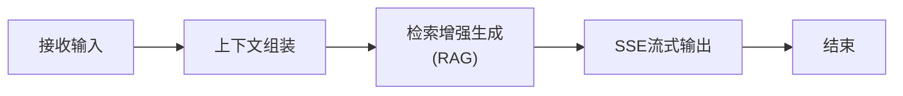
```mermaid
flowchart LR
    A["接收输入"] --> B["上下文组装"]
    B --> C["检索增强生成<br/>(RAG)"]
    C --> D["SSE流式输出"]
    D --> E["结束"]
```
- 默认使用“调研帮手”配置，优先调用知识库和联网检索。
- 不加载复杂的方案工具链，重点做快速信息整理与内容生成。
- 首字响应目标 < 1s。

**专家模式执行逻辑**：

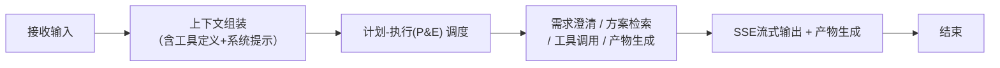
```mermaid
flowchart LR
    A["接收输入"] --> B["上下文组装<br/>（含工具定义+系统提示）"]
    B --> C["计划-执行(P&E) 调度"]
    C --> D["需求澄清 / 方案检索<br/>/ 工具调用 / 产物生成"]
    D --> E["SSE流式输出 + 产物生成"]
    E --> F["结束"]
```
- 默认使用“组货专家智能体”配置。
- 采用 P&E（Plan-and-Execute）机制，先形成执行计划，再逐步执行检索、工具调用和输出整理。
- P&E 内部由步骤执行器按需调用知识库、联网搜索、业务工具和 MCP，不对用户暴露底层模型循环。
- 自动执行字段澄清 → 方案匹配 → 结果输出 → 导出产物全流程。
- 首字响应目标 < 3s。

#### 3.2.9 消息渲染时序

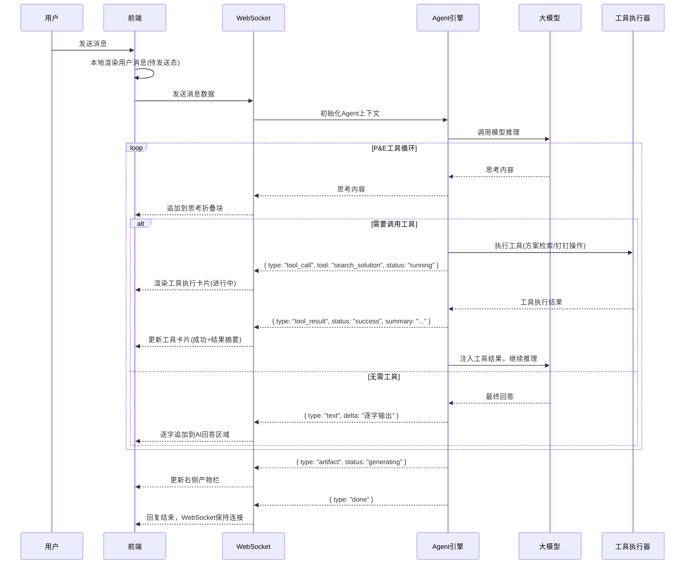
```mermaid
sequenceDiagram
    participant User as 用户
    participant FE as 前端
    participant WS as WebSocket
    participant Agent as Agent引擎
    participant LLM as 大模型
    participant Tool as 工具执行器

    User->>FE: 发送消息
    FE->>FE: 本地渲染用户消息(待发送态)
    FE->>WS: 发送消息数据

    WS->>Agent: 初始化Agent上下文
    Agent->>LLM: 调用模型推理

    loop P&E工具循环
        LLM-->>Agent: 思考内容
        Agent-->>WS: 思考内容
        WS-->>FE: 追加到思考折叠块

        alt 需要调用工具
            Agent->>Tool: 执行工具(方案检索/钉钉操作)
            Agent-->>WS: { type: "tool_call", tool: "search_solution", status: "running" }
            WS-->>FE: 渲染工具执行卡片(进行中)
            Tool-->>Agent: 工具执行结果
            Agent-->>WS: { type: "tool_result", status: "success", summary: "..." }
            WS-->>FE: 更新工具卡片(成功+结果摘要)
            Agent->>LLM: 注入工具结果，继续推理
        else 无需工具
            LLM-->>Agent: 最终回答
            Agent-->>WS: { type: "text", delta: "逐字输出" }
            WS-->>FE: 逐字追加到AI回答区域
        end
    end

    Agent-->>WS: { type: "artifact", status: "generating" }
    WS-->>FE: 更新右侧产物栏
    Agent-->>WS: { type: "done" }
    WS-->>FE: 回复结束，WebSocket保持连接
```

**异常处理**：

| 场景 | 前端表现 | 后端处理 |
|------|----------|----------|
| 大模型接口超时 | 提示「服务繁忙，请稍后重试」 | 自动重试 1 次，失败返回报错 |
| 工具执行失败 | 工具卡片显示失败状态 + 错误摘要 | 记录错误日志，不影响对话继续 |
| WebSocket 断开 | 顶部轻提示「连接断开，正在重连」 | 前端自动重连 3 次（指数退避），失败提示手动刷新 |
| 用户无工具权限 | 提示「暂无该操作权限，请联系管理员」 | 接口拦截，返回 403 |
| 工具循环超限（>5轮） | AI 提示「任务较复杂，已生成已有分析结果」 | 强制结束循环，输出当前结果 |
| 上下文超长（>模型窗口） | 用户无感知 | 自动裁剪最早的历史消息 |
| **用户点击停止按钮** | 消息末尾显示「⏹ 已停止生成」标记；已生成内容保留；发送按钮恢复可用 | 前端 abort SSE 连接 → 后端检测连接断开 → 终止模型调用 → 已生成文本保留 → message 标记为 interrupted 状态；用户可以继续编辑后重新发送，或点击「继续生成」从断点恢复 |

---

### 3.3 工作台（业务应用聚合）

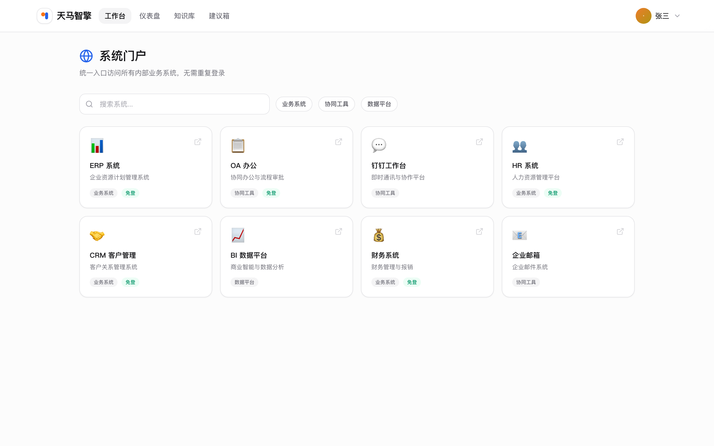

#### 3.3.1 功能说明

集中展示企业所有内部业务系统入口，点击自动免登跳转，无需重复登录。

**设计目标**：解决集团内部系统入口分散、多次登录的痛点，用户登录 AI 工作台后即可一键访问所有授权系统。

#### 3.3.2 页面布局

- 卡片式网格布局，每个系统对应一张卡片
- 卡片内容：系统 Logo、系统名称、系统简介
- 支持按系统分类筛选（如：业务系统 / 协同工具 / 数据平台）

#### 3.3.3 交互逻辑与实现原理

**免登跳转流程**：

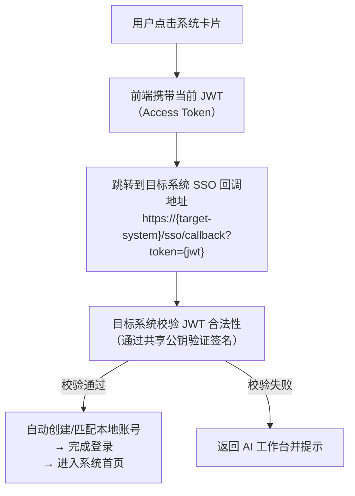
```mermaid
flowchart TD
    A["用户点击系统卡片"] --> B["前端携带当前 JWT<br/>（Access Token）"]
    B --> C["跳转到目标系统 SSO 回调地址<br/>https://{target-system}/sso/callback?token={jwt}"]
    C --> D["目标系统校验 JWT 合法性<br/>（通过共享公钥验证签名）"]
    D -->|校验通过| E["自动创建/匹配本地账号<br/>→ 完成登录<br/>→ 进入系统首页"]
    D -->|校验失败| F["返回 AI 工作台并提示"]
```

**不支持免登的系统**：点击直接打开新标签页访问系统地址（不带 Token），用户自行登录。

#### 3.3.4 后台配置

管理员可在后台配置系统列表：

| 配置项 | 说明 |
|--------|------|
| 系统名称 | 卡片展示名称 |
| 系统 Logo | 卡片图标 |
| 跳转地址 | 系统 URL |
| 是否启用免登 | 启用后携带 JWT 跳转 |
| SSO 回调地址 | 免登跳转的目标地址 |
| 分类 | 业务系统 / 协同工具 / 数据平台 |
| 排序 | 数字越小越靠前 |

配置实时生效，无需发版。

**回溯能力**：部分已构建的老系统，暂时不支持 SSO 免登接入的，管理员在后台配置"免登=否"，系统在门户中以新标签页方式打开，后续逐步改造接入。

#### 3.3.5 异常处理

| 场景 | 用户提示 | 系统行为 |
|------|----------|----------|
| 目标系统不可用 | Toast: "[系统名] 暂不可用，请稍后重试" | 不跳转，停留在门户页 |
| SSO 校验失败 | 目标系统返回错误页："登录失败，请返回工作台重试" | 目标系统拒绝登录 |
| JWT 过期 | 自动无感刷新后重试跳转 | 前端拦截 |
| 后台未配置任何系统 | 门户页显示"暂无已接入的系统" | 空状态提示 |

---

### 3.4 仪表盘（数据看板）


#### 3.4.1 功能说明

嵌入已有的业务数据看板，用户在工作台内即可查看核心业务数据，无需跳转到其他系统。

#### 3.4.2 实现方式

- 顶部二级 Tab 切换不同看板主题
- 主体区域用 iframe 嵌入现有看板页面地址
- 自动透传用户身份 Token（通过 URL 参数或 postMessage），看板系统校验后免登展示数据

**实现原理**：

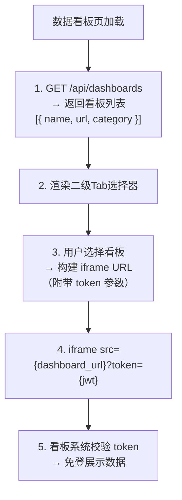
```mermaid
flowchart TD
    A["数据看板页加载"] --> B["1. GET /api/dashboards<br/>→ 返回看板列表<br/>[{ name, url, category }]"]
    B --> C["2. 渲染二级Tab选择器"]
    C --> D["3. 用户选择看板<br/>→ 构建 iframe URL<br/>（附带 token 参数）"]
    D --> E["4. iframe src={dashboard_url}?token={jwt}"]
    E --> F["5. 看板系统校验 token<br/>→ 免登展示数据"]
```

**安全考量**：
- iframe 使用 sandbox 属性限制权限：`sandbox="allow-scripts allow-same-origin allow-forms"`
- Token 通过 URL 参数传递时使用一次性短期 Token（有效期 5 分钟），不同于主 Access Token

#### 3.4.3 异常处理

| 场景 | 用户提示 | 系统行为 |
|------|----------|----------|
| 看板页面加载超时 (>30s) | iframe 内显示"加载超时，点击刷新" | 不阻塞工作台其他功能 |
| 看板系统不可用 | iframe 内显示"看板暂不可用" | 不影响 AI 对话和系统门户功能 |
| 无看板数据权限 | iframe 内显示"您无权查看此看板" | 目标看板的权限由看板系统自身控制 |

---

### 3.5 建议箱（纯后端采集，不设前端页面）

MVP 阶段**不单独建设议箱前端页面**。用户主动提交的赞/踩反馈（见 3.2.5 反馈按钮）和系统自动采集的软反馈（见 4.9）均通过后端 `message_feedback` 与 `soft_feedback` 表正常落盘。管理员与方案专家可通过后台 API 直接查询反馈数据，无需专门的前端界面。

**反馈后台数据链路**（纯 API，无前端页面）：

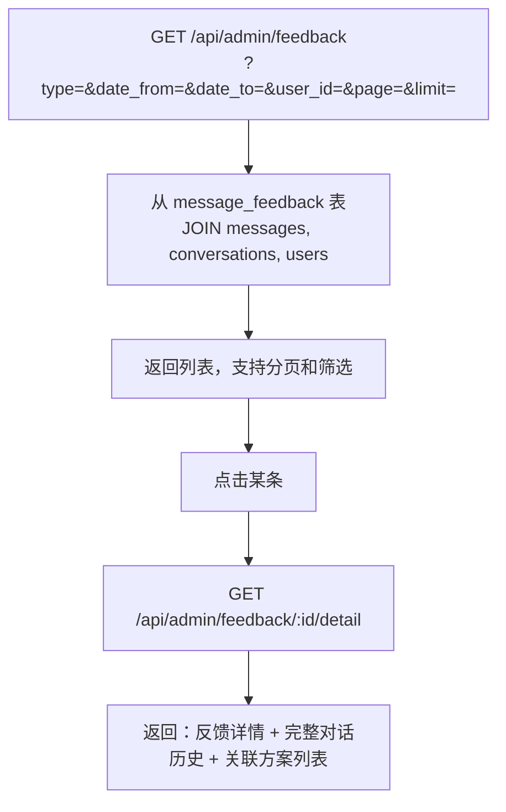
```mermaid
flowchart TD
    A[GET /api/admin/feedback<br/>?type=&date_from=&date_to=&user_id=&page=&limit=] --> B[从 message_feedback 表<br/>JOIN messages, conversations, users]
    B --> C[返回列表，支持分页和筛选]
    C --> D[点击某条]
    D --> E[GET /api/admin/feedback/:id/detail]
    E --> F[返回：反馈详情 + 完整对话历史 + 关联方案列表]
```

### 3.6 知识库（独立 Tab 页）

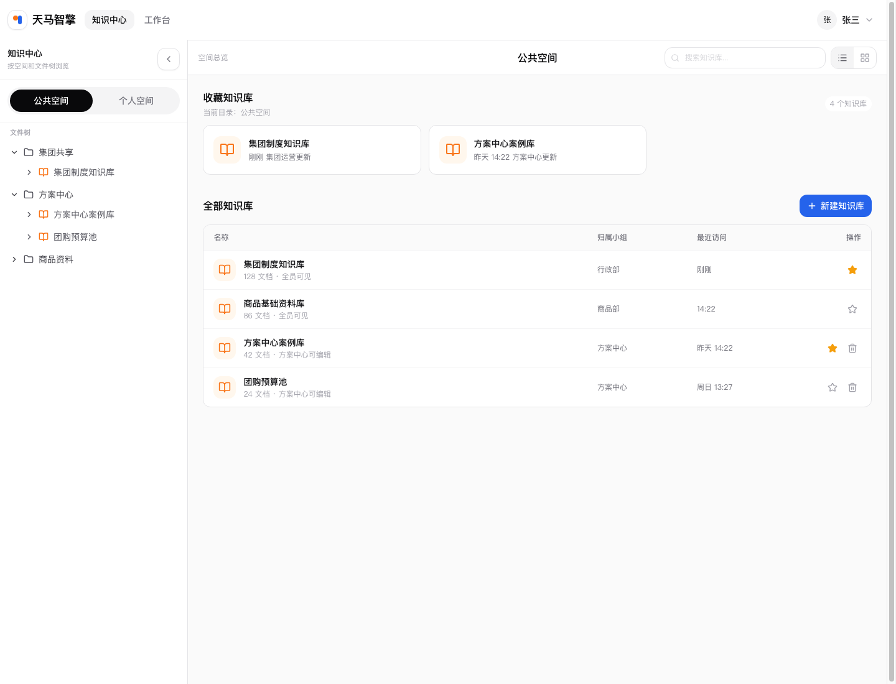

知识库是天马智擎的第四个 Tab 页，作为**统一知识库平台**的前端管理界面。不同于左侧栏中轻量化的知识库入口，此页面提供完整的知识库管理功能。

#### 3.6.1 页面布局

两栏布局：左侧知识库导航（空间切换 + 知识库列表）+ 右侧知识库/文件浏览区。左侧栏尺寸、背景、列表项高度和交互反馈与对话页左侧历史栏保持一致。整体布局参考截图：


#### 3.6.2 MVP 空间

| 空间 | 可见范围 | 典型用途 | 权限控制 |
|------|---------|---------|---------|
| **个人空间** | 仅创建者本人 | 个人方案草稿、笔记、临时资料 | 仅本人可读写 |
| **公共空间** | 全员可见 | 公司考勤规定、HR制度、全员公告 | 全员可读，仅管理员可写 |

> 后续可扩展共享空间/团队空间；MVP 前端先展示公共空间和个人空间两类。

#### 3.6.3 知识库与权限

- 每个空间下支持多个**知识库**，知识库在主视图区以类似文件夹/卡片形式展示
- 切换空间时默认不选中具体知识库，主视图展示该空间下的全部知识库
- 点击知识库后进入文件列表/宫格视图
- 左侧栏知识库名称下方的锁表示「当前用户无编辑权限」，不是可见性锁：
  - 个人空间知识库默认本人可编辑，不显示锁
  - 公共空间知识库若当前角色无写权限，显示锁和「只读」
  - 公共空间知识库若用户具备管理员/知识库管理员/业务授权角色，显示「可编辑」
- 新建知识库弹窗包含知识库名称、所属空间下拉框；所属空间默认当前选择空间
- 所属空间下拉展示公共空间、个人空间，但实际可创建范围必须由角色权限控制：普通用户默认仅可创建个人空间，管理员/知识库管理员可创建公共空间
- 支持在知识库列表页新建知识库；创建成功后立即进入该知识库，并显示空状态引导
- 支持在知识库内新建文件/文档、创建文件夹；创建成功后进入编辑/上传态
- 支持上传文件（PDF、Word、Excel、PPT、TXT、PNG、JPG），同搜索框上传规则
- 上传后自动触发解析管道（见 4.4）

#### 3.6.4 交互逻辑

- 点击左侧空间 Tab → 清空当前知识库选择，右侧主视图区刷新为该空间下的知识库卡片
- 点击左侧知识库列表项或右侧知识库卡片 → 进入该知识库，显示文件表格/宫格
- 副 Header 居中显示当前空间名称；选中知识库后居中显示知识库名称
- 副 Header 右侧合并放置搜索、上传文件、列表/宫格切换，不再单独展示搜索/上传卡片
- 上传文件点击后弹出上传弹窗，选择文件后确认上传
- 文件表格：名称、格式标签、大小、解析状态（处理中/已索引/失败）、上传者、日期、操作（预览/编辑/删除）
- 上传按钮在右侧顶部和空状态均有入口
- 空状态引导："此知识库暂无文档，上传第一个文档"

#### 3.6.5 与左侧栏知识库入口的区别

| 维度 | Tab 页知识库 | 左侧栏知识库入口 |
|------|-------------|----------------|
| 定位 | 全功能管理 | 快速访问 |
| 功能 | 空间管理、知识库选择、文件管理、批量上传 | 仅查看最近文档、单文件快捷上传 |
| 使用场景 | 知识库管理员日常维护 | 对话中临时查阅资料 |
| 入口 | 顶部 Tab | 左侧栏快捷启动器 |

---

## 四、核心功能模块详解

### 4.1 统一身份认证模块

#### 4.1.1 双登录方式

支持两种登录方式，最终映射到同一企业员工账号，生成统一 JWT 凭证，互不冲突。

**方式一：钉钉扫码登录**
- 底层协议：OAuth 2.0 授权码模式
- 适用场景：PC 端扫码、钉钉内置浏览器无感授权
- 流程：

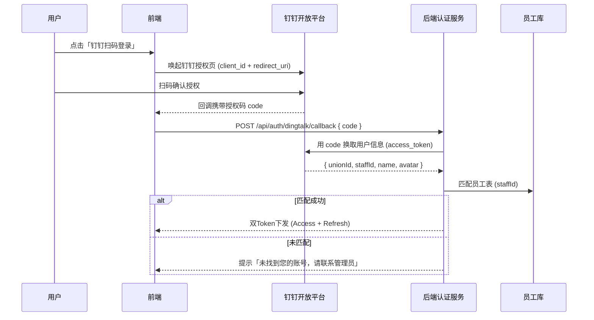
```mermaid
sequenceDiagram
    participant User as 用户
    participant FE as 前端
    participant DingTalk as 钉钉开放平台
    participant API as 后端认证服务
    participant DB as 员工库

    User->>FE: 点击「钉钉扫码登录」
    FE->>DingTalk: 唤起钉钉授权页 (client_id + redirect_uri)
    User->>DingTalk: 扫码确认授权
    DingTalk-->>FE: 回调携带授权码 code
    FE->>API: POST /api/auth/dingtalk/callback { code }
    API->>DingTalk: 用 code 换取用户信息 (access_token)
    DingTalk-->>API: { unionId, staffId, name, avatar }
    API->>DB: 匹配员工表 (staffId)
    alt 匹配成功
        API-->>FE: 双Token下发 (Access + Refresh)
    else 未匹配
        API-->>FE: 提示「未找到您的账号，请联系管理员」
    end
```

**方式二：账号密码 + 验证码登录**
- 底层逻辑：企业员工账号库校验 + 短信验证码二次校验
- 适用场景：无法使用钉钉的兜底场景
- 账号映射：通过员工工号与钉钉账号绑定，同一员工两种方式登录为同一账号

**登录页设计**：
- 默认展示钉钉扫码登录（二维码区域）
- 底部提供「账号密码登录」切换入口
- 「账号密码登录」表单：工号 + 密码 + 短信验证码 + 登录按钮
- 登录失败提示具体原因（账号不存在/密码错误/验证码错误）

#### 4.1.2 双 Token 与无感刷新机制

采用**双 Token 机制**，兼顾安全性与用户体验：

| Token 类型 | 作用 | 存储位置 | 有效期 |
|------------|------|----------|--------|
| Access Token | 接口调用身份凭证 | HttpOnly Cookie | 2 小时 |
| Refresh Token | 换取新的 Access Token | HttpOnly 加密 Cookie | 7 天 |

**无感刷新流程**：

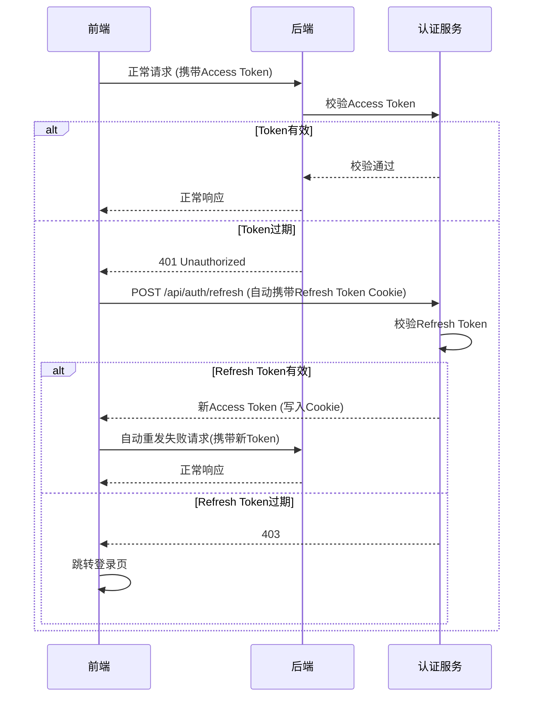
```mermaid
sequenceDiagram
    participant FE as 前端
    participant API as 后端
    participant Auth as 认证服务

    FE->>API: 正常请求 (携带Access Token)
    API->>Auth: 校验Access Token
    alt Token有效
        Auth-->>API: 校验通过
        API-->>FE: 正常响应
    else Token过期
        API-->>FE: 401 Unauthorized
        FE->>Auth: POST /api/auth/refresh (自动携带Refresh Token Cookie)
        Auth->>Auth: 校验Refresh Token
        alt Refresh Token有效
            Auth-->>FE: 新Access Token (写入Cookie)
            FE->>API: 自动重发失败请求(携带新Token)
            API-->>FE: 正常响应
        else Refresh Token过期
            Auth-->>FE: 403
            FE->>FE: 跳转登录页
        end
    end
```

**触发重新登录的场景**：
- Refresh Token 过期（1 天未访问）
- 用户主动退出登录
- 账号被禁用、密码被修改
- 管理员强制下线

**异常处理**：

| 场景 | 前端表现 | 后端处理 |
|------|----------|----------|
| Access Token 过期 | 用户无感知，自动刷新 | 返回 401，前端自动调用刷新接口 |
| Refresh Token 过期 | 自动跳转登录页，提示「登录已过期，请重新登录」 | 返回 403 |
| 钉钉授权回调超时 | 提示「授权超时，请重新扫码」 | code 有效期 5 分钟，过期返回错误 |
| 账号被禁用 | 提示「账号已被禁用，请联系管理员」 | 校验时返回 403 |

#### 4.1.3 权限体系

基于 RBAC 角色权限模型，三层映射：`用户 → 角色 → 权限点`

**预设角色**：

| 角色 | 权限范围 |
|------|----------|
| 普通员工 | 登录、通用问答（日常办公模式）、系统门户访问、数据看板查看 |
| 方案专员 | 普通员工权限 + 专家模式（方案中心专家）、方案中心知识库、文件上传 |
| 管理员 | 全部权限 + 反馈后台、用户管理、系统配置 |

**数据隔离**：所有对话、文件、方案数据携带部门 ID 标签，查询时自动过滤。

**接口权限**：高危接口（方案管理、后台配置）仅管理员可调用，中间件层校验。

---

### 4.2 组货专家智能体模块

#### 4.2.1 角色与能力边界

- **角色设定**：集团内部组货方案专家智能体，熟悉方案池和常见业务场景，擅长根据客户需求匹配、组合、产出方案建议。
- **核心能力**：需求澄清、方案池检索、方案组合建议、文档解读、钉钉工具执行。
- **能力边界**：仅基于已有方案池和知识库进行推荐与生成，不负责报价、合同或非方案范围的商务决策。

#### 4.2.2 执行机制：P&E

MVP 阶段的组货专家采用 **P&E（Plan-and-Execute）** 机制作为主执行框架：
1. 先形成执行计划；
2. 再按计划执行字段澄清、检索、工具调用、产物生成；
3. 最后汇总结果输出。

每个步骤由后端步骤执行器调度知识库、联网搜索、业务工具和 MCP 工具链，主流程始终以“计划 → 执行 → 复盘 → 输出”为核心。这样能更稳定地完成复杂方案任务，并保持用户可见的过程反馈。

#### 4.2.3 重点字段与输出模板（当前草稿）

**重点字段**（当前版本按业务共识初步确定，后续可能根据评审结果调整）：

| 字段 | 说明 | 是否必填 |
|------|------|----------|
| 客户所属行业 | 如互联网、制造业、零售、教育 | 是 |
| 客户规模 | 大型/中型/小型 | 是 |
| 核心业务场景 | 如团建、福利、运动会、客户礼赠 | 是 |
| 预算区间 | 影响方案匹配精度 | 是 |
| 方案类型偏好 | 通用方案/专项方案/成功案例 | 是 |
| 交付物形式 | Excel / PPT / PDF / 文本方案 | 否 |

**输出模板（当前草稿）**：

```markdown
## 一、需求确认
| 字段 | 状态 | 确认内容 |
|------|------|----------|
| 客户行业 | ✅ | 互联网 |
| 客户规模 | ✅ | 中型 |
| 业务场景 | ✅ | 员工团建 |
| 预算区间 | ✅ | 30-50万 |
| 方案类型 | ✅ | 成功案例优先 |

## 二、方案推荐
### 方案一：互联网企业标准团建方案
- 所属池子：成功案例池
- 核心适配点：行业/规模/预算匹配
- 方案概要：基础款运动鞋 + 配件组合

## 三、组合建议
| 档位 | 预算占比 | 适用人群 |
|------|----------|----------|
| 经济型 | 50% | 全员覆盖 |
| 品质型 | 35% | 核心员工 |
| 尊享型 | 15% | 高管专属 |

## 四、推荐 SPU 清单
| SPU | 品牌 | 建议数量 | 预估单价 |
|-----|------|----------|----------|
| ... | ... | ... | ... |

## 五、注意事项
- 库存波动请二次确认
- 定制 LOGO 需额外排期
```

> 说明：上述字段与输出模板为 MVP 初稿，后续将根据业务评审、原型反馈与专家实际使用情况持续优化。

#### 4.2.4 需求澄清（槽位填充）

**5 个必填字段**（按优先级排序）：

| 优先级 | 字段 | 说明 | 缺失时行为 |
|--------|------|------|------------|
| 1 | 客户所属行业 | 如：互联网、制造业、零售、教育 | 追问，不继续匹配 |
| 2 | 客户规模 | 大型/中型/小型 | 追问，不继续匹配 |
| 3 | 核心业务场景 | 如：团建、福利、运动会、客户礼赠 | 追问，不继续匹配 |
| 4 | 预算区间 | 影响方案匹配精度 | 追问，不继续匹配 |
| 5 | 方案类型偏好 | 通用方案/专项方案/成功案例 | 追问，可先给出通用建议 |

**填充策略**：
- 用户首次输入后，AI 自动提取已有字段。
- 对比必填项，按优先级逐个追问（最多 3 轮）。
- 连续 3 轮追问仍未补全 → 系统给出“先假设”的通用方案，标注假设内容。
- 用户可随时修改字段，AI 实时更新匹配结果。

**异常处理**：

| 场景 | 用户提示 | 系统行为 |
|------|----------|----------|
| 连续 3 轮追问未补全 | "为确保方案质量，以下关键信息使用假设值：[列出]" | 使用默认假设值，标注不确定性 |
| 用户输入与之前矛盾 | "您的输入与先前确认的 [字段] 不一致，以哪个为准？" | 列出矛盾点，等待用户选择 |
| 附件解析结果与用户描述冲突 | "附件显示 [X]，但您输入为 [Y]，以哪个为准？" | 明确标出冲突来源 |

#### 4.2.5 方案池三层混合召回

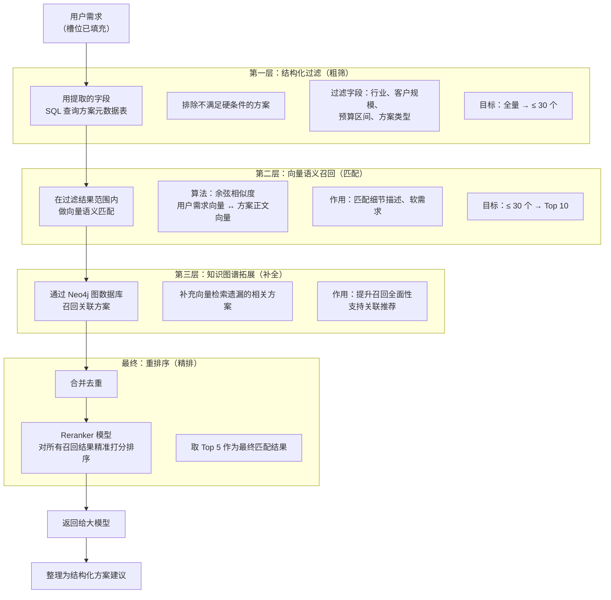
```mermaid
flowchart TD
    A["用户需求<br/>（槽位已填充）"] --> B

    subgraph L1["第一层：结构化过滤（粗筛）"]
        B["用提取的字段<br/>SQL 查询方案元数据表"]
        B1["排除不满足硬条件的方案"]
        B2["过滤字段：行业、客户规模、<br/>预算区间、方案类型"]
        B3["目标：全量 → ≤ 30 个"]
    end

    B --> C

    subgraph L2["第二层：向量语义召回（匹配）"]
        C["在过滤结果范围内<br/>做向量语义匹配"]
        C1["算法：余弦相似度<br/>用户需求向量 ↔ 方案正文向量"]
        C2["作用：匹配细节描述、软需求"]
        C3["目标：≤ 30 个 → Top 10"]
    end

    C --> D

    subgraph L3["第三层：知识图谱拓展（补全）"]
        D["通过 Neo4j 图数据库<br/>召回关联方案"]
        D1["补充向量检索遗漏的相关方案"]
        D2["作用：提升召回全面性<br/>支持关联推荐"]
    end

    D --> E["合并去重"]

    subgraph Final["最终：重排序（精排）"]
        E --> F["Reranker 模型<br/>对所有召回结果精准打分排序"]
        F1["取 Top 5 作为最终匹配结果"]
    end

    F --> G["返回给大模型"]
    G --> H["整理为结构化方案建议"]
```

**各层技术实现**：

| 层级 | 技术 | 存储 | 作用 |
|------|------|------|------|
| 结构化过滤 | SQL 查询 | MySQL（方案元数据表） | 硬条件过滤，排除不匹配 |
| 向量语义召回 | Embedding + 余弦相似度 | 向量数据库 | 语义匹配，捕捉软需求 |
| 知识图谱拓展 | 图遍历查询 | Neo4j 图数据库 | 关联推荐，提升全面性 |
| 重排序 | Reranker 模型 | - | 精准打分，取 Top 5 |

**方案匹配无结果时的处理**：
- AI 主动提示「未找到完全匹配的方案，是否放宽条件？」
- 用户可以手工调整字段，或让 AI 用更宽泛条件重新检索
- 如果仍无结果，AI 基于通用规则给出建议，同时自动记录为知识缺口

#### 4.2.6 钉钉工具集（MCP 协议接入）

**什么是钉钉 MCP**

钉钉官方推出了基于 Model Context Protocol (MCP) 协议的标准中间件 `dingtalk-mcp`，将钉钉开放平台的 **十大类企业 API** 封装为 LLM 可直接调用的标准化工具。Agent 引擎通过 MCP 协议自动发现工具列表、读取参数 Schema、执行调用并获取结果，无需为每个钉钉 API 单独编写适配代码。

**接入方式**：

钉钉 MCP 以 npm 包形式发布，在 AI 工作台后端以 MCP Client 模式集成：

```json
// MCP 客户端配置示例
{
  "mcpServers": {
    "dingtalk": {
      "command": "npx",
      "args": ["-y", "dingtalk-mcp@latest"],
      "env": {
        "DINGTALK_Client_ID": "<企业应用 AppKey>",
        "DINGTALK_Client_Secret": "<企业应用 AppSecret>",
        "ACTIVE_PROFILES": "ALL"
      }
    }
  }
}
```

**前置条件**：
1. 在 [钉钉开放平台](https://open.dingtalk.com) 创建「企业内部应用」
2. 根据所需功能勾选对应 API 权限（通讯录、日历、待办、消息通知、AI 表格、日志等）
3. 获取 AppKey 和 AppSecret 作为 MCP Server 的认证凭证
4. 应用发布上线后，企业内用户即可通过 MCP 调用其权限范围内的钉钉能力

**权限逻辑**：MCP 工具调用使用**应用级凭证 + 用户级授权**双重校验。后端以企业应用身份调用钉钉 API，但操作权限范围与当前登录用户本人的钉钉权限完全一致（如用户无权在某部门创建日程，AI 代为操作也会被钉钉 API 拒绝）。

**授权流程**：首次使用任何钉钉工具时，前端弹出钉钉 OAuth 授权弹窗 → 用户确认 → 获取用户授权 code → 后端用 code 换取用户 access_token → 加密存储至 `auth_credentials` 表 → 后续 MCP 调用自动携带用户 token → token 过期自动续期。

---

**钉钉 MCP 十大能力类别与 MVP 纳入范围**：

| 类别 | MCP 工具示例 | 核心能力 | MVP 状态 | 备注 |
|------|-------------|----------|----------|------|
| 📇 **通讯录** | `user_search`, `dept_query`, `org_tree` | 搜索员工、查询部门信息、组织架构浏览 | `link_only` | 基础查询可用，二期做 AI 智能找人 |
| 📅 **日历/日程** | `calendar_create`, `calendar_query`, `calendar_update` | 创建日程/会议、查询忙闲、更新/取消日程 | `enabled` | 支持设置参会人、时间、地点、提醒 |
| ✅ **待办任务** | `todo_create`, `todo_query`, `todo_update` | 创建待办、按状态过滤查询、更新完成状态 | `enabled` | 支持截止时间、优先级、备注 |
| 💬 **消息通知** | `robot_msg_send`, `work_notice`, `ding_remind` | 群机器人消息、工作通知、DING 提醒 | `link_only` | 一期仅做文本消息，二期扩展卡片消息 |
| 📋 **工作日志** | `report_create`, `report_query`, `report_template` | 创建日志、查询历史、获取日志模板 | `placeholder` | 二期 |
| 📊 **AI 表格/多维表** | `sheet_create`, `sheet_query`, `sheet_record_crud` | 创建多维表、查询记录、增删改行数据 | `enabled` | 方案结构化数据直接写入 |
| 📁 **项目管理** | `project_create`, `task_assign`, `progress_query` | 创建项目、分配任务、查询进度 | `placeholder` | 二期 |
| 🏆 **企业荣誉** | `honor_award`, `honor_query` | 颁发荣誉、查询荣誉记录 | `placeholder` | 二期 |
| ⚙️ **应用管理** | `app_query`, `microapp_manage` | 查询应用信息、管理微应用 | `placeholder` | 三期 |
| 📢 **服务窗** | `service_msg_send` | 向服务窗订阅用户推送消息 | `placeholder` | 三期 |

> **参考文档**：[钉钉服务端 API MCP 概述](https://open.dingtalk.com/document/ai-dev/dingtalk-server-api-mcp-overview) · [钉钉 MCP 功能清单](https://open.dingtalk.com/document/ai-dev/dingtalk-mcp-feature-list) · [安装并使用钉钉 MCP](https://open.dingtalk.com/document/aipass/install-and-use-the-dingtalk-calendar-mcp) （来源：钉钉开放平台官方文档）

---

**MVP 首发 5 大能力详解**：

MVP 阶段聚焦与「方案生成 → 执行落地」直接相关的 5 个能力，其余能力通过 `link_only`（用户点击跳转到钉钉对应页面手动操作）或 `placeholder`（灰色标记"功能开发中"）形式预留。

| # | 能力 | 典型使用场景 | 技术链路 |
|---|------|-------------|----------|
| 1 | 📅 创建日程/会议 | "帮我在明天下3点安排方案评审会，1小时，参会人张明李娟" | Agent 识别意图 → 提取时间/地点/参会人 → 调用 `calendar_create` → 钉钉日程创建 → 返回确认 |
| 2 | ✅ 创建待办 | "把方案执行步骤生成待办清单" | Agent 提取 action items → 调用 `todo_create` 逐条创建 → 返回待办链接 |
| 3 | 📊 写入 AI 表格 | "把 SPU 清单导入 AI 表格" | Agent 提取结构化数据 → 调用 `sheet_create` 创建表格 → `sheet_record_crud` 批量写入 → 返回表格链接 |
| 4 | 📇 查询通讯录 | "查一下张明在哪个部门" | Agent 调用 `user_search` → 返回员工姓名/部门/职位 |
| 5 | 💬 工作通知 | "方案完成后通知王总" | Agent 调用 `work_notice` → 发送工作通知卡片 → 返回发送状态 |

**典型 AI 交互示例**：

```
用户: "帮我在明天下午3点安排一场方案评审会，时长1小时，参会人：张明、李娟"
  → Agent 调用 calendar_create（
      summary="方案评审会",
      start_time="2026-06-29T15:00:00",
      duration_minutes=60,
      attendees=["张明-userId-xxx", "李娟-userId-yyy"],
      location="待定",
      reminder="15分钟前"
    ）
  → 钉钉 API 返回成功
  → AI 回复: "✅ 已创建明天下午3:00的【方案评审会】，时长1小时，参会人：张明、李娟。钉钉日程已同步，会议开始前15分钟会收到提醒。"

用户: "把方案中的SPU清单整理成AI表格"
  → Agent 调用 sheet_create（
      name="组货方案SPU清单",
      columns=[
        {name:"SPU名称", type:"text"},
        {name:"品牌", type:"text"},
        {name:"建议数量", type:"number"},
        {name:"预估单价", type:"number"}
      ]
    ）
  → 获取 table_id
  → Agent 调用 sheet_record_crud（action="batch_create", records=[...]）
  → AI 回复: "📊 已创建钉钉AI表格《组货方案SPU清单》，共 15 条记录。[点击查看](https://alidocs.dingtalk.com/...)"
```

**工具三态模型**：

| 状态 | 含义 | UI 展示 | 用户行为 |
|------|------|---------|----------|
| `enabled` | MCP 已接入可用 | ● 绿色指示灯 | Agent 在 P&E 工具循环中自动调用；左侧栏技能面板可见可管理 |
| `link_only` | MCP 已接入但暂时不开放 AI 自动调用 | ◐ 黄色指示灯 | Agent 不调用此工具；用户点击跳转到钉钉对应页面手动操作 |
| `placeholder` | 预留规划中 | ○ 灰色指示灯 | 点击提示"功能规划中，敬请期待"；不影响其他功能使用 |

**工具调用异常处理**：

| 场景 | 用户提示 | 系统行为 |
|------|----------|----------|
| MCP Server 连接断开 | "钉钉工具暂不可用，正在重连..." | 前端显示降级提示，后台自动重连 MCP Server（最多 3 次） |
| 单个工具调用超时 (>30s) | "工具 [名称] 响应较慢，先展示已有结果" | 工具调用结果异步追补；已生成的文本部分正常展示 |
| 用户未授权钉钉工具 | 弹出钉钉 OAuth 授权弹窗 | 引导用户完成首次授权 |
| 用户钉钉权限不足（如无权在特定部门创建日程） | "您的钉钉账号暂无此操作权限，请联系管理员" | 钉钉 API 返回权限错误，Agent 感知并告知用户 |
| 用户 Token 过期 | 自动刷新，用户无感知 | 加密存储的 refresh_token 自动续期；连续失败则重新弹出授权 |
| MCP 工具返回异常数据 | "工具返回数据异常，已记录日志" | 记录错误详情到 tool_invocations 表；Agent 跳过本次工具结果继续推理 |

---

### 4.3 记忆与上下文模块

#### 4.3.1 记忆开关：跨会话长期记忆的启用与停用

记忆开关控制的是**跨会话长期记忆**的启用与停用，而不是单次对话内的上下文理解能力。

**开启记忆**：
- 对话结束后，系统自动提炼用户偏好、业务约定和长期事实，写入长期记忆库；新对话开始时自动召回相关记忆。
- 默认开启，适合员工日常办公场景，提升后续会话的贴合度。
- 例子：用户多次说明“我是做汽车零部件行业的方案岗，预算偏好 50 万以内”，系统会记住并在后续对话中自动复用。

**关闭记忆**：
- 仅当前会话有效，当前对话结束后不会留下长期记忆痕迹。
- 新对话时不再召回历史记忆，完全基于当前上下文生成回复。
- 关闭记忆不会影响同一会话内的上下文承接；同一场对话中的前后文仍然连续。

**企业级控制**：
- 管理员可在后台对敏感部门强制关闭长期记忆能力。
- 所有记忆数据支持一键清空，并满足审计与合规要求。

#### 4.3.2 三层记忆架构

记忆系统分为三个层级，各自承担不同角色，确保 AI 在单次对话内、跨会话之间都能保持连贯理解：

| 记忆层级 | 别称 | 作用 | 存储位置 | 生命周期 | 数据形态 |
|----------|------|------|----------|----------|----------|
| **瞬时工作记忆** | 工作记忆 / Working Memory | 当前会话窗口内的全部上下文：系统提示、本轮用户输入、AI 回答、工具调用结果、知识库召回片段 | Redis 缓存（热数据） | 会话活跃期间保留，会话结束后清理缓存，转为短期记忆 | 完整原始消息文本 |
| **短期会话记忆** | 会话记忆 / Session Memory | 全量对话历史记录：用户所有会话的全部消息、文件、工具调用、产物，永久留存 | MySQL（消息表+文件表+产物表） | 永久留存 | 原始消息 + 结构化元数据（时间、角色、关联文件） |
| **长期语义记忆** | 语义记忆 / Semantic Memory | 从历史对话中提炼的核心事实、用户偏好、业务约定、术语定义，跨会话复用 | MySQL（记忆表）+ 向量数据库（Embedding 向量） | 永久留存，支持自然衰减（长期未使用的记忆权重降低） | 精炼摘要文本 + Embedding 向量 |

**三层记忆对比——通俗理解**：
- **瞬时记忆** = 人的"当前意识"：你正在想的事情，容量有限（模型窗口大小），用完就忘（会话结束清缓存）
- **短期记忆** = 人的"日记本"：完整记录每一天发生了什么，随时可以翻看（全量消息留存 MySQL）
- **长期记忆** = 人的"经验与知识"：从经历中提炼出的规律、偏好、教训，以后遇到类似情况直接用（语义提炼 + 向量检索）

#### 4.3.2 上下文工程（最大窗口与自动压缩）

模型能处理的上下文长度是有限的（即"最大模型窗口"）。当对话越来越长，Token 总数超过模型窗口限制时，必须进行上下文管理，否则请求将失败。

**最大模型窗口策略**：

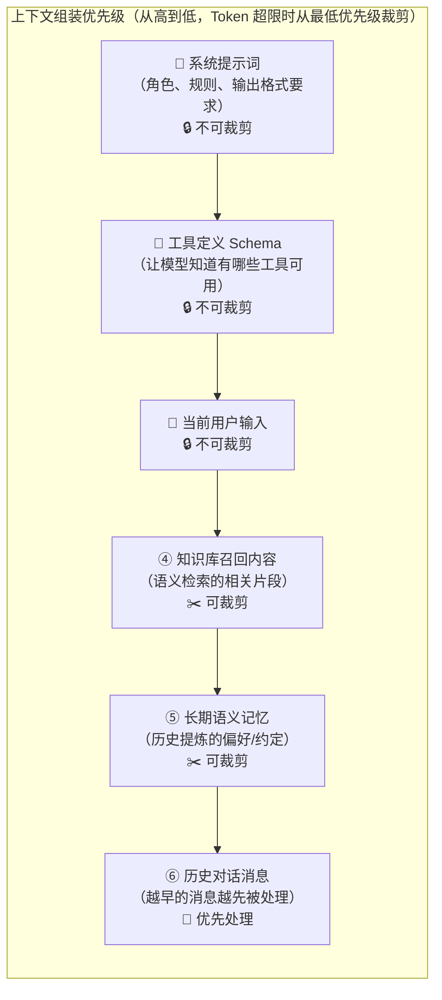
```mermaid
flowchart LR
    subgraph Priority["上下文组装优先级（从高到低，Token 超限时从最低优先级裁剪）"]
        direction TB
        P1["🥇 系统提示词<br/>（角色、规则、输出格式要求）<br/>🔒 不可裁剪"]
        P2["🥈 工具定义 Schema<br/>（让模型知道有哪些工具可用）<br/>🔒 不可裁剪"]
        P3["🥉 当前用户输入<br/>🔒 不可裁剪"]
        P4["④ 知识库召回内容<br/>（语义检索的相关片段）<br/>✂️ 可裁剪"]
        P5["⑤ 长期语义记忆<br/>（历史提炼的偏好/约定）<br/>✂️ 可裁剪"]
        P6["⑥ 历史对话消息<br/>（越早的消息越先被处理）<br/>📌 优先处理"]
        
        P1 --> P2 --> P3 --> P4 --> P5 --> P6
    end
```

**超窗口自动压缩机制**：

当上下文 Token 数接近模型窗口上限时（如 DeepSeek R1 的 128K 窗口），系统不直接丢弃历史消息，而是执行**自动总结压缩**：

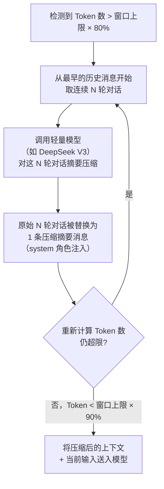
```mermaid
flowchart TD
    A["检测到 Token 数 > 窗口上限 × 80%"] --> B["从最早的历史消息开始<br/>取连续 N 轮对话"]
    B --> C["调用轻量模型<br/>（如 DeepSeek V3）<br/>对这 N 轮对话摘要压缩"]
    C --> D["原始 N 轮对话被替换为<br/>1 条压缩摘要消息<br/>（system 角色注入）"]
    D --> E{"重新计算 Token 数<br/>仍超限?"}
    E -->|是| B
    E -->|否，Token < 窗口上限 × 90%| F["将压缩后的上下文<br/>+ 当前输入送入模型"]
```

**压缩消息格式示例**：
```
[system] 历史对话摘要：
- 第1-3轮：用户提出团建组货需求，AI完成字段澄清，确认了行业=互联网、规模=中型、预算=30-50万、场景=员工团建、偏好=成功案例。
- 第4-5轮：AI匹配了3个候选方案，用户选择了"互联网企业标准团建方案"并要求调整预算分配。
```

**压缩前后对比**：
| 对比维度 | 压缩前 | 压缩后 |
|----------|--------|--------|
| Token 占用 | 6 轮原始对话 ≈ 2,000-4,000 tokens | 1 条摘要 ≈ 200-500 tokens |
| 信息完整度 | 100%（每字每句） | ~90%（核心事实和结论保留，细节压缩） |
| 模型理解 | 完整上下文 | 足够理解对话脉络，但可能丢失细节 |

**压缩触发时机**：
- 每次新消息发送前，先计算预估 Token 数
- 预估超限时自动触发压缩，用户无感知
- 压缩仅影响注入模型的上下文，不影响前端显示的完整历史消息

**Token 控制策略**：
- 系统提示词 + 工具定义：固定约 2,000-4,000 tokens
- 知识库召回：控制 Top K ≤ 5，每片段 ≤ 512 tokens
- 长期语义记忆：控制 Top N ≤ 5
- 历史消息 + 压缩摘要：控制在模型窗口剩余空间的 90% 以内
- 预留 10% 给模型输出（max_tokens）

#### 4.3.3 记忆流转流程

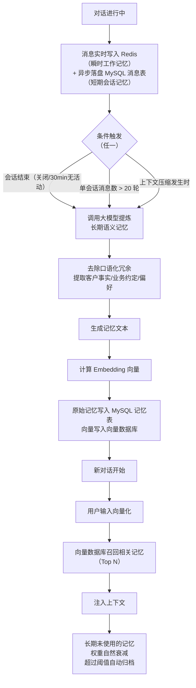
```mermaid
flowchart TD
    A["对话进行中"] --> B["消息实时写入 Redis<br/>（瞬时工作记忆）<br/>+ 异步落盘 MySQL 消息表<br/>（短期会话记忆）"]
    B --> C{"条件触发<br/>（任一）"}
    C -->|"会话结束（关闭/30min无活动）"| D["调用大模型提炼<br/>长期语义记忆"]
    C -->|"单会话消息数 > 20 轮"| D
    C -->|"上下文压缩发生时"| D
    D --> E["去除口语化冗余<br/>提取客户事实/业务约定/偏好"]
    E --> F["生成记忆文本"]
    F --> G["计算 Embedding 向量"]
    G --> H["原始记忆写入 MySQL 记忆表<br/>向量写入向量数据库"]
    H --> I["新对话开始"]
    I --> J["用户输入向量化"]
    J --> K["向量数据库召回相关记忆<br/>（Top N）"]
    K --> L["注入上下文"]
    L --> M["长期未使用的记忆<br/>权重自然衰减<br/>超过阈值自动归档"]
```

#### 4.3.4 存储空间与生命周期管理

**记忆存储流转**：

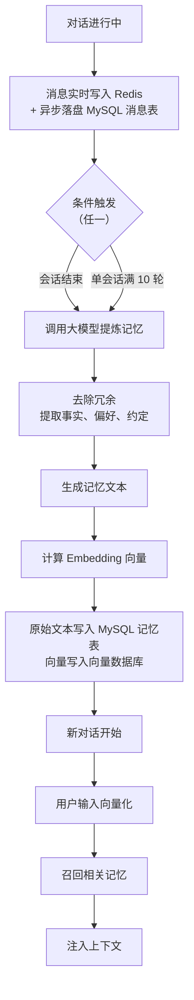
```mermaid
flowchart TD
    A["对话进行中"] --> B["消息实时写入 Redis<br/>+ 异步落盘 MySQL 消息表"]
    B --> C{"条件触发<br/>（任一）"}
    C -->|"会话结束"| D["调用大模型提炼记忆"]
    C -->|"单会话满 10 轮"| D
    D --> E["去除冗余<br/>提取事实、偏好、约定"]
    E --> F["生成记忆文本"]
    F --> G["计算 Embedding 向量"]
    G --> H["原始文本写入 MySQL 记忆表<br/>向量写入向量数据库"]
    H --> I["新对话开始"]
    I --> J["用户输入向量化"]
    J --> K["召回相关记忆"]
    K --> L["注入上下文"]
```

**全量存储测算**（含用户消息 + AI 回复 + 工具结果）：
- 单条消息平均大小：1KB
- 单轮对话平均 3 条消息 ≈ 3KB
- 2000 用户，每人每天 10 轮 = 60MB/天
- 年全量对话 ≈ 22GB
- 长期记忆年增量 ≈ 2.5GB

**冷热分离策略**：
- 热数据（30 天内）：MySQL + Redis 缓存，高性能访问
- 温数据（30 天 - 1 年）：移除缓存，保留 MySQL 普通表
- 冷数据（1 年以上）：归档至 OSS 冷存储，数据库仅存索引

---

### 4.4 文件解析与知识库模块

#### 4.4.1 多格式解析技术选型

| 文件格式 | 解析工具 | 处理逻辑 |
|----------|----------|----------|
| DOCX | python-docx | 提取标题、正文、表格，按层级转 Markdown |
| XLSX | openpyxl + pandas | 逐 Sheet 读取单元格，转 Markdown 表格 |
| PPTX | python-pptx | 提取每页标题、正文、备注，按分页转 Markdown |
| 文字版 PDF | PyMuPDF | 逐页提取文本、表格，还原排版转 Markdown |
| PNG/JPG 图片 | DeepSeek VLM OCR | 大视觉模型识别文字、表格、版面结构，输出结构化 Markdown |
| TXT | 原生读取 | 编码自动识别（UTF-8 → GBK → GB2312），直接使用 |

#### 4.4.2 安全校验机制

**文件头魔数校验**：
- 读取文件开头二进制魔数，识别真实格式，防止改后缀上传恶意文件
- 说明：修改文件后缀仅改变文件名，文件二进制内容不变，魔数不会改变，可精准识别真实格式

**ClamAV 病毒扫描**：
- 文件合并完成后调用开源杀毒引擎扫描
- 检测到病毒直接删除文件，返回风险提示

**异常处理**：

| 场景 | 前端表现 | 后端处理 |
|------|----------|----------|
| 魔数校验不通过（改后缀） | 提示「文件格式异常，请检查文件」 | 拒绝入库，删除临时文件 |
| 病毒检测阳性 | 提示「文件安全检测未通过」 | 删除文件，记录安全日志 |
| 加密 PDF | 提示「不支持加密文件，请解密后上传」 | 拒绝解析，保留原文件可下载 |
| 损坏文件 | 提示「文件可能已损坏，无法解析」 | 解析失败，保留原文件 |
| 编码检测失败 | 提示「文件编码无法识别」 | 尝试 UTF-8 → GBK → GB2312，均失败则报错 |

#### 4.4.3 并发处理：异步消息队列

- 文件解析通过消息队列异步执行，不阻塞对话流程
- 固定数量 Worker 池处理解析任务，并发高峰时排队执行
- 支持横向扩展 Worker 节点，提升解析能力
- 解析失败自动重试 2 次，均失败则返回解析失败提示

#### 4.4.4 统一知识库平台架构

**核心原则：不做独立知识库，做统一知识库平台**

不同业务场景的知识库（方案匹配库、直播话术库、考勤规定库等）本质完全相同：文档上传 → 向量化存储 → 语义检索。不应为每个业务建立独立实体，而是在统一平台上通过标签、权限、分类实现差异化访问。

**类比**：银行卡的家庭共享账户。全家用一张主卡，每个成员开虚拟子账户。不是每人发一张独立的实体卡。

**统一架构**：

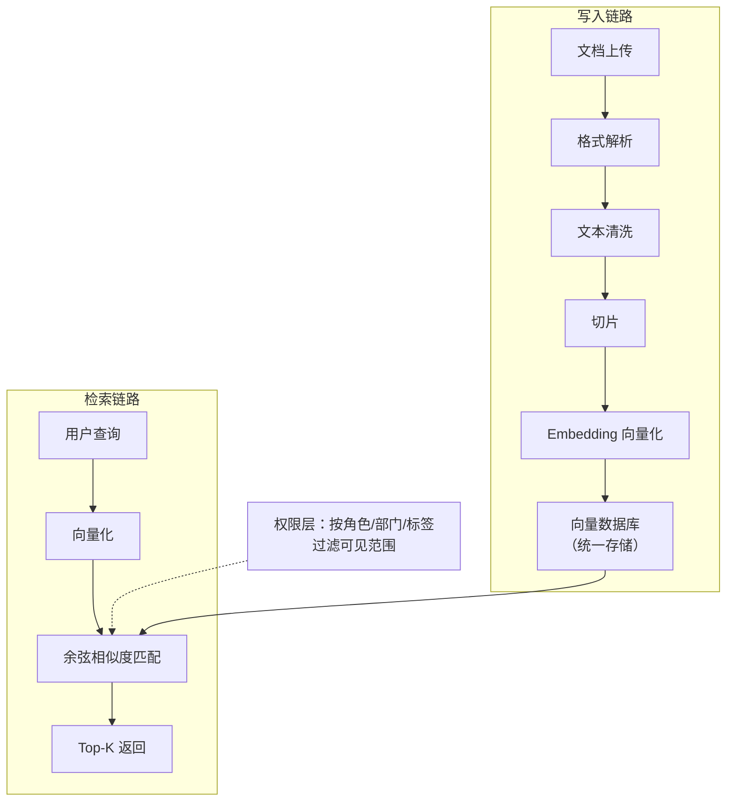
```mermaid
flowchart TB
    subgraph Ingest["写入链路"]
        A["文档上传"] --> B["格式解析"]
        B --> C["文本清洗"]
        C --> D["切片"]
        D --> E["Embedding 向量化"]
        E --> F["向量数据库<br/>（统一存储）"]
    end

    subgraph Query["检索链路"]
        G["用户查询"] --> H["向量化"]
        H --> I["余弦相似度匹配"]
        I --> J["Top-K 返回"]
    end

    F --> I
    K["权限层：按角色/部门/标签<br/>过滤可见范围"] -.-> I
```

**区分方式（不是独立建库，而是打标签 + 设权限）**：

| 区分维度 | 实现方式 | 示例 |
|----------|----------|------|
| 公开 vs 私有 | `visibility` 字段：public / department / private | 考勤规定=公开；某客户定制方案=方案中心部门可见；个人笔记=私有 |
| 业务分类 | `tags` 标签数组：["方案匹配", "团建", "互联网"] | 上传时打标签，检索时按标签过滤 |
| 角色授权 | `capability_permissions` 表关联 | seed_user 可检索方案池；全员可检索通用知识 |
| 部门归属 | `department_id` 字段 | 营销中心的知识仅营销部门默认可见 |

**技术原理简要说明**：
- 文本经分词后转化为向量（如 1024 维、2048 维 Embedding）
- 匹配过程基于余弦相似度计算：向量夹角越小，语义相关性越高
- 机器无法直接理解文字，需将语义转化为数学表达（向量）再处理

**知识图谱三元组**（可选，二期增强）：
- 结构化字段自动生成基础三元组，准确率 100%
- 非结构化文档通过大模型抽取深层关系，人工审核后入库
- 实体类型：方案、行业、场景、功能模块；关系类型：属于、适配、包含、应用于

---

### 4.5 多模型网关模块

#### 4.5.1 模型接入与用户切换

- 统一 OpenAI 协议接入所有商用模型：DeepSeek 系列、豆包系列、通义千问等
- 配置化管理模型密钥、价格、参数，新增模型无需改代码
- **用户可手动切换模型**：输入框旁提供模型选择器（下拉菜单），列出可用模型及简要说明
  - 切换后当前会话后续消息使用新模型，已生成内容不受影响
  - 不同模式有默认推荐（日常办公 默认 DeepSeek V3，专家 默认 DeepSeek R1），用户可覆盖
  - 模型选择状态在日常办公模式和专家模式下独立记忆

**模型选择器 UI**：
```
[🤖 DeepSeek V3 ▼]  [🌐 已开启]  [输入框................] [发送]
```
- 模型选择器：显示当前模型名称 + 下拉箭头，点击展开模型列表
- 🌐 Web Search 图标：绿色=已开启（默认），灰色=已关闭，点击切换
- 两个控件始终可见，日常办公模式和专家模式下均显示

#### 4.5.2 场景化自动路由（用户无感知）

后端根据任务类型自动选择最优模型，平衡效果与成本：

| 场景 | 推荐模型 | 选型理由 |
|------|----------|----------|
| 日常办公模式通用问答 | DeepSeek V3 | 性价比高，响应快 |
| 日常办公模式 Web Search | DeepSeek V3 + 搜索引擎 API | 联网检索后整理答案，附带来源链接 |
| 专家模式方案推理 | DeepSeek R1 | 深度思考能力强，复杂推理准确率高 |
| 信息抽取、摘要总结 | 轻量通用模型 | 简单任务降本 |
| 上下文压缩/记忆提炼 | DeepSeek V3 | 性价比高，摘要任务效果好 |
| 向量化 Embedding | 商用 Embedding API | 中文效果好，成本极低 |
| OCR 识别 | DeepSeek VLM | 大模型 OCR 准确率高，版面还原好 |

**路由决策流程**：

```mermaid
flowchart TD
    A["用户发送消息"] --> B["Agent引擎判断 mode"]
    B -->|"DailyOffice"| C["路由到 DeepSeek V3<br/>（日常办公）"]
    B -->|"Expert"| D["路由到 DeepSeek R1<br/>（专家模式，含 Web Search + 方案检索 + 钉钉工具）"]
    C --> E{"触发 Web Search?"}
    E -->|是| F["调用搜索引擎"]
    F --> G["结果注入 Prompt"]
    G --> H["模型整理答案"]
    E -->|否| I["直接模型回答"]
    H --> J["流式输出"]
    I --> J
    D --> J
    J --> K{"模型可用?"}
    K -->|"DeepSeek R1 不可用"| L["切换 DeepSeek V3<br/>（能力降级但不断链）"]
    K -->|"DeepSeek V3 不可用"| M["切换通义千问<br/>（兜底）"]
    K -->|"全部不可用"| N["返回错误提示"]
```

#### 4.5.3 成本管控

- 多维度统计：按部门、用户、场景、模型统计 Token 消耗与费用
- 额度控制：支持按部门设置月度额度，超额度限流
- 异常告警：单日消耗超阈值自动告警

**模型调用异常处理**：

| 场景 | 内部代码 | 用户提示 | 系统行为 |
|------|----------|----------|----------|
| API Key 无效 | `LLM_AUTH_ERROR` | "AI 服务暂时不可用，已通知管理员" | 记录 critical 日志，通知管理员 |
| 模型超时 (60s) | `LLM_TIMEOUT` | "服务繁忙，请稍后重试" | 自动重试 1 次，失败返回报错 |
| 模型限流 (429) | `LLM_RATE_LIMITED` | "使用人数较多，请稍候..." | 排队等待，10s 后自动重试 |
| 内容安全拦截 | `LLM_CONTENT_FILTER` | "内容生成受限，请调整输入后重试" | 不保存违规内容，记录安全日志 |
| 模型返回截断 | `LLM_TRUNCATED` | "回答较长，已截断。可追问展开" | 标注 truncated，提供"展开"按钮 |
| 主模型不可用 | 自动切换备选 | 用户无感知（可能响应质量略降） | 自动切换到备选模型 |

---

### 4.6 反馈与迭代模块

#### 4.6.1 双维度反馈采集

**显式反馈（实时）** — 完整交互流：

1. 每条 AI 回答右下角固定展示 👍 有用 / 👎 不合适 两个按钮，hover 可见
2. 用户点击 👍：按钮变为实心高亮（已赞态），记录 `type: like`
3. 用户点击 👎：弹出原因选择器（半屏 Modal），选项：
   - 匹配不准（推荐方案不符合需求）
   - 内容有误（方案中的信息或数据错误）
   - 答非所问（回答偏离了用户的问题）
   - 格式问题（排版混乱、结构不清）
   - 其他（展开文字输入框，用户可输入备注，限 500 字）
4. 用户选择原因后点击"提交" → Modal 关闭 → 👎 按钮变为实心高亮（已踩态） → 显示「感谢反馈」
5. 提交后按钮置灰，**不可重复提交**（一个用户对一条消息只能反馈一次）
6. 切换赞/踩：用户可先赞后踩或先踩后赞，新提交覆盖旧反馈
7. 实时写入 `message_feedback` 表，关联 `message_id`、`conversation_id`、`user_id`
8. 如果是踩 + 匹配不准 → 自动关联知识缺口优先级 +1
9. 如果是踩 + 内容有误 → 自动标记关联方案需人工复核

**隐式反馈（离线聚合）**：
- 正向信号：下载导出、复制内容、连续追问（同一会话 > 5 轮）、长时间停留在回答上
- 负向信号：修改需求内容后重新发送、重复提问相似问题、收到回答后快速关闭页面（< 5s）
- 每日凌晨 2 点离线聚合（定时任务），补充主动反馈遗漏

#### 4.6.2 数据飞轮闭环

```mermaid
flowchart LR
    A["数据采集"] --> B["清洗标注"]
    B --> C["优化执行"]
    C --> D["上线生效"]
    D --> E["效果验证"]
    E --> A
```

**各环节详解**：

| 环节 | 自动化程度 | 说明 |
|------|-----------|------|
| 采集层 | 全自动 | 显式+隐式反馈全量采集 |
| 标注层 | 自动去噪+分类，人工抽检 | 关联方案，生成正负样本 |
| 优化层-内容 | 人工为主 | 方案专家修改方案内容与标签 |
| 优化层-策略 | 半自动 | 优化召回规则，积累样本后微调重排序模型 |
| 生效层 | 全自动 | 方案更新自动重新解析向量化；策略更新灰度发布 |
| 验证层 | 全自动 | 跟踪点赞率、点踩率、采纳率等核心指标 |

#### 4.6.3 知识缺口自动沉淀

**触发条件**（任一）：
1. 方案中心专家回答中明确标注"不确定"或"无法确认"
2. 方案匹配所有结果低于置信度阈值
3. 用户点踩且选择"内容有误"或"答非所问"

**处理流程**：
```mermaid
flowchart LR
    A["触发缺口"] --> B["自动记录<br/>(问题+原因+优先级)"]
    B --> C["去重<br/>(相似度>80%合并)"]
    C --> D["通知方案专家"]
    D --> E["上传补充知识"]
    E --> F["重新解析向量化"]
    F --> G["标记 resolved"]
    G --> H["下次相同问题<br/>命中新知识"]
```

#### 4.6.4 优化边界

- **可自动化**：数据采集、清洗、统计、模型训练、效果监控
- **必须人工**：方案内容修改、业务规则调整、优化方向决策、模型上线审批
- **核心原则**：业务正确性优先，AI 辅助提效，人工兜底把控

---

### 4.7 定时任务与触发器模块

#### 4.7.1 核心调度器

- 基于 Cron 表达式实现定时调度，支持精确到分钟
- 支持事件触发、条件触发两类非定时触发器
- 任务执行结果记录至 `trigger_executions` 表，支持查看历史执行记录

#### 4.7.2 MVP 内置定时任务

| 任务名称 | 触发方式 | Cron | 执行内容 |
|----------|----------|------|----------|
| 每日反馈归集 | 定时 | 每天凌晨 2:00 | 聚合前一天隐式反馈，生成反馈统计报表 |
| 每日用量统计 | 定时 | 每天凌晨 1:00 | 统计各部门、各模型 Token 消耗，生成账单 |
| 方案库增量更新 | 定时 | 每天凌晨 3:00 | 同步更新的方案，重新解析向量化 |
| 过期会话归档 | 定时 | 每天凌晨 4:00 | 将 30 天未活跃会话从缓存归档至冷存储 |
| 知识缺口通知 | 定时 | 每天上午 9:00 | 汇总前一日新增缺口，通知方案专家 |

#### 4.7.3 事件触发器（预留）

MVP 阶段预留事件触发机制的数据模型和接口，用于后续扩展：

| 触发器 | 触发条件 | 目标动作 | MVP 状态 |
|--------|----------|----------|----------|
| 方案匹配失败告警 | 单日匹配失败率 > 阈值 | 通知方案专家检查方案池 | 预留 |
| 用户负反馈激增 | 1 小时内负反馈 > 10 条 | 通知管理员排查 | 预留 |
| 模型调用异常告警 | 模型错误率 > 5% | 自动切换备用模型 + 通知 | 预留 |

#### 4.7.4 实现原理

```mermaid
graph
    subgraph L1["Cron Scheduler (APScheduler / Celery Beat)"]
        A["反馈归集 │ 用量统计 │ 方案库增量更新 │ 过期会话归档 │ 知识缺口通知"]
    end

    L1 --> B

    B["Message Queue (Redis)"]

    B --> L3

    subgraph L3["Worker Pool (执行任务)"]
        C["Worker 1 │ Worker 2 │ Worker N"]
    end
```

**异常处理**：

| 场景 | 系统行为 |
|------|----------|
| 定时任务执行失败 | 自动重试 2 次，仍失败记录 error 日志并通知管理员 |
| 定时任务执行超时 | 设置 30 分钟超时，超时自动终止并记录 |
| 多个任务同时触发 | 消息队列排队，按优先级顺序执行 |
| Scheduler 进程宕机 | 利用 Redis 锁保证不重复执行，重启后自动恢复 |

### 4.8 数据埋点与统计分析

#### 4.8.1 埋点体系概述

数据埋点是衡量产品健康度和迭代效果的基础设施。所有埋点数据通过后端中间件统一采集，写入 `analytics_events` 表，支持实时查询和离线分析。

**埋点原则**：
- 全自动采集，零前端侵入（页面路由、API 调用、按钮点击由统一 SDK 自动上报）
- 关键业务事件由业务代码显式调用
- 所有事件携带 `user_id`、`department_id`、`timestamp`、`session_id`

#### 4.8.2 埋点事件定义

**自动采集事件**（前端路由 + API 中间件自动上报）：

| 事件名 | 触发时机 | 携带字段 |
|--------|----------|----------|
| `page_view` | 每次页面路由切换 | `page_name`, `previous_page`, `tab` |
| `api_call` | 每次 API 请求完成 | `api_path`, `method`, `status_code`, `duration_ms` |
| `session_start` | 用户登录后首次访问 | `login_method`（钉钉/密码） |
| `session_end` | 用户关闭页面/超时退出 | `session_duration_s`, `page_views_count` |

**业务事件**（业务代码显式上报）：

| 事件名 | 触发时机 | 携带字段 |
|--------|----------|----------|
| `search_submit` | 用户发送搜索/对话消息 | `mode`（daily_office/expert）, `agent_key`, `has_files`, `content_length` |
| `message_received` | AI 回答完成 | `conversation_id`, `message_id`, `duration_ms`, `token_count`, `model` |
| `tool_called` | P&E 工具循环中工具被调用 | `tool_name`, `status`（success/error）, `duration_ms` |
| `artifact_download` | 用户下载产物 | `artifact_type`（excel/ppt/pdf）, `file_size` |
| `feedback_submit` | 用户提交赞/踩 | `feedback_type`, `reasons`, `has_comment` |
| `file_upload` | 文件上传完成 | `file_type`, `file_size`, `parse_status` |
| `knowledge_gap_create` | 新知识缺口被记录 | `gap_id`, `priority`, `reason` |
| `portal_click` | 用户点击系统门户卡片 | `portal_name`, `sso_enabled` |
| `dashboard_view` | 用户切换数据看板 | `dashboard_name`, `duration_s` |

#### 4.8.3 统计维度与看板指标

**管理后台可查看以下统计**：

| 统计维度 | 指标 | 下钻能力 |
|----------|------|----------|
| 登录概况 | 日活/周活/月活用户数、新用户数、人均登录次数 | 按部门、按角色下钻 |
| 使用时长 | 人均会话时长、人均日使用时长 | 按部门、按用户下钻 |
| 对话分析 | 总会话数、日常办公模式 vs 专家模式占比、平均轮次、完成率 | 按模式、按专家下钻 |
| 功能使用 | 各功能点使用次数排名（方案匹配、文件上传、产物下载、钉钉工具等） | 点击每个功能下钻到具体用户列表 |
| 模型消耗 | 各模型 Token 用量、费用、平均响应时间 | 按模型、按部门下钻 |
| 反馈分析 | 赞踩比、负反馈原因分布、反馈趋势 | 按专家、按方案下钻 |
| 知识库 | 资产总数、入库趋势、检索命中率、缺口趋势 | 按知识库下钻 |
| 门户看板 | 门户卡片点击排行、看板访问次数和时长 | 按系统、按看板下钻 |

**实现方式**：
- 后台 `/admin/analytics` 页面展示上述统计看板
- 使用图表库（ECharts / Chart.js）渲染折线图、柱状图、饼图
- 支持日期范围选择（今日/本周/本月/自定义）
- 每个指标卡片点击后展开下钻明细表

#### 4.8.4 数据表

```sql
CREATE TABLE analytics_events (
    id              VARCHAR(36) PRIMARY KEY,
    user_id         VARCHAR(64) NOT NULL,
    department_id   VARCHAR(64),
    session_id      VARCHAR(36),
    event_name      VARCHAR(50) NOT NULL,       -- page_view | api_call | search_submit | ...
    event_category  VARCHAR(20) DEFAULT 'auto',  -- auto | business
    page_name       VARCHAR(100),
    properties      JSON,                        -- 事件自定义字段
    created_at      DATETIME DEFAULT NOW(),
    INDEX idx_user_id (user_id),
    INDEX idx_event_name (event_name),
    INDEX idx_created_at (created_at)
);

CREATE TABLE daily_stats (
    id              VARCHAR(36) PRIMARY KEY,
    stat_date       DATE NOT NULL,
    stat_key        VARCHAR(100) NOT NULL,       -- dau | total_sessions | total_tokens | ...
    stat_value      DECIMAL(20,2),
    dimension       VARCHAR(50),                 -- 维度: department | role | model | agent
    dimension_value VARCHAR(100),
    UNIQUE KEY uk_stat (stat_date, stat_key, dimension, dimension_value)
);
```

---

### 4.9 软反馈与用户洞察

#### 4.9.1 什么是软反馈

区别于用户主动点击的赞/踩按钮（"硬反馈"），**软反馈**是指系统通过定期回顾用户聊天内容，自动识别其中隐含的优化建议、吐槽、功能需求、使用困惑等非结构化反馈信息。

**举例**：
- 用户说"这个方案不太对，能不能按照行业分类来匹配" → 识别为「匹配策略优化建议」
- 用户说"能不能直接导出PPT，不要每次都选格式" → 识别为「功能改进需求」
- 用户说"算了，我还是自己手动做吧" → 识别为「用户流失风险」

#### 4.9.2 软反馈生成流程

```mermaid
flowchart TD
    A["定时任务触发<br/>（每周日凌晨 3:00）"] --> B["扫描过去 7 天内<br/>所有会话的消息记录"]
    B --> C["筛选候选消息<br/>（用户 role + 疑问词/否定词/建议词）"]
    C --> D["调用轻量模型<br/>（DeepSeek V3）逐条分析"]
    D --> E["模型输出结构化软反馈"]
    E --> F["去重合并<br/>（相似度 > 80% 则合并 + 增加提及次数）"]
    F --> G["写入 soft_feedback 表"]
    G --> H["通知管理员：<br/>本周新增 N 条软反馈"]
```

**候选消息筛选规则**：
- 包含关键词：建议、能不能、可不可以、最好、应该、希望、如果、算了、不行、不对、不方便
- 消息长度 > 10 字符（过滤掉简单的"好的""谢谢"）
- 点在消息中间或结尾（非开场寒暄）

#### 4.9.3 软反馈在后台的展示

反馈后台页（3.5）增加「软反馈」子 Tab：

| 列表字段 | 说明 |
|----------|------|
| 反馈类型 | 优化建议 / 功能需求 / 吐槽抱怨 / 使用困惑 |
| 问题摘要 | AI 提取的一句话概要 |
| 严重程度 | 高/中/低（根据用户语气和提及次数判断） |
| 关联功能 | 方案匹配 / 对话体验 / 文件处理 / 产物导出 / 钉钉集成 / 其他 |
| 提及次数 | 多少用户在不同会话中提过类似问题 |
| 最近提及时间 | 最近一次出现的时间 |
| 原始对话 | 点击展开原文上下文 |

管理员可对每条软反馈标记状态：待评估 / 已采纳（进入迭代计划）/ 已回复 / 忽略。

#### 4.9.4 软反馈数据表

```sql
CREATE TABLE soft_feedback (
    id                  VARCHAR(36) PRIMARY KEY,
    type                VARCHAR(30) NOT NULL,       -- suggestion | feature_request | complaint | confusion
    summary             TEXT NOT NULL,              -- AI提取的问题摘要
    severity            VARCHAR(10) DEFAULT 'medium', -- high | medium | low
    related_module      VARCHAR(50),                -- solution_matching | conversation | file | export | dingtalk | other
    mention_count       INTEGER DEFAULT 1,          -- 提及次数（去重合并后累加）
    original_messages   JSON,                       -- [{conversation_id, message_id, content, user_id}]
    status              VARCHAR(20) DEFAULT 'pending', -- pending | evaluated | adopted | replied | ignored
    owner_id            VARCHAR(64),                -- 负责人
    created_at          DATETIME DEFAULT NOW(),
    updated_at          DATETIME DEFAULT NOW(),
    INDEX idx_type (type),
    INDEX idx_status (status),
    INDEX idx_severity (severity)
);
```

---

#### 5.4.1 核心表结构

**用户与认证**：

```sql
-- 用户表 (映射钉钉账号)
CREATE TABLE users (
    id              VARCHAR(64) PRIMARY KEY,    -- 钉钉 staffId
    name            VARCHAR(100) NOT NULL,
    avatar          VARCHAR(500),
    email           VARCHAR(200),
    department      VARCHAR(200),
    department_id   VARCHAR(64),
    role            VARCHAR(50) DEFAULT 'employee',  -- employee | solution_specialist | admin
    dingtalk_union_id VARCHAR(100),
    status          VARCHAR(20) DEFAULT 'active',
    created_at      DATETIME DEFAULT NOW(),
    updated_at      DATETIME DEFAULT NOW()
);

-- 登录凭证表
CREATE TABLE auth_credentials (
    id              VARCHAR(36) PRIMARY KEY,
    user_id         VARCHAR(64) NOT NULL,
    password_hash   VARCHAR(255),               -- 账号密码登录用（bcrypt）
    dingtalk_token  TEXT,                        -- 钉钉授权 Token（加密存储）
    last_login_at   DATETIME,
    FOREIGN KEY (user_id) REFERENCES users(id)
);

-- Refresh Token 表
CREATE TABLE refresh_tokens (
    id              VARCHAR(36) PRIMARY KEY,
    user_id         VARCHAR(64) NOT NULL,
    token_hash      VARCHAR(255) NOT NULL,
    expires_at      DATETIME NOT NULL,
    revoked         BOOLEAN DEFAULT FALSE,
    created_at      DATETIME DEFAULT NOW(),
    INDEX idx_user_id (user_id),
    INDEX idx_token_hash (token_hash)
);
```

**会话与消息**：

```sql
CREATE TABLE conversations (
    id              VARCHAR(36) PRIMARY KEY,
    user_id         VARCHAR(64) NOT NULL,
    title           VARCHAR(255) DEFAULT '新会话',
    mode            VARCHAR(20) DEFAULT 'task',    -- quick | task
    status          VARCHAR(20) DEFAULT 'active',  -- active | archived | deleted
    message_count   INTEGER DEFAULT 0,
    created_at      DATETIME DEFAULT NOW(),
    updated_at      DATETIME DEFAULT NOW(),
    INDEX idx_user_id (user_id),
    INDEX idx_status (status)
);

CREATE TABLE messages (
    id                  VARCHAR(36) PRIMARY KEY,
    conversation_id     VARCHAR(36) NOT NULL,
    role                VARCHAR(20) NOT NULL,      -- user | assistant | system | tool
    content             TEXT NOT NULL,
    thinking_content    TEXT,                       -- 模型思考过程
    tool_calls          TEXT,                       -- JSON: 工具调用记录
    tool_results        TEXT,                       -- JSON: 工具执行结果
    citations           TEXT,                       -- JSON: 引用来源
    status              VARCHAR(20) DEFAULT 'completed',
    created_at          DATETIME DEFAULT NOW(),
    FOREIGN KEY (conversation_id) REFERENCES conversations(id),
    INDEX idx_conv_id (conversation_id)
);

-- 会话产物
CREATE TABLE message_artifacts (
    id              VARCHAR(36) PRIMARY KEY,
    message_id      VARCHAR(36) NOT NULL,
    conversation_id VARCHAR(36) NOT NULL,
    type            VARCHAR(20) NOT NULL,          -- excel | ppt | pdf | csv
    title           VARCHAR(500) NOT NULL,
    source          VARCHAR(20) DEFAULT 'generated', -- uploaded | generated
    status          VARCHAR(20) DEFAULT 'queued',  -- queued | generating | ready | error
    file_size       INTEGER,
    url             VARCHAR(1000),
    error_msg       TEXT,
    created_at      DATETIME DEFAULT NOW(),
    FOREIGN KEY (message_id) REFERENCES messages(id),
    FOREIGN KEY (conversation_id) REFERENCES conversations(id)
);
```

**文件与知识库**：

```sql
CREATE TABLE conversation_files (
    id              VARCHAR(36) PRIMARY KEY,
    conversation_id VARCHAR(36),
    file_name       VARCHAR(500) NOT NULL,
    file_type       VARCHAR(20) NOT NULL,
    file_size       INTEGER,
    storage_url     VARCHAR(1000),
    parse_status    VARCHAR(20) DEFAULT 'uploading', -- uploading | parsing | ready | error
    parsed_text     MEDIUMTEXT,
    chunk_count     INTEGER DEFAULT 0,
    created_at      DATETIME DEFAULT NOW(),
    FOREIGN KEY (conversation_id) REFERENCES conversations(id)
);

CREATE TABLE knowledge_assets (
    id              VARCHAR(36) PRIMARY KEY,
    kb_id           VARCHAR(100) DEFAULT 'plan_pool',
    asset_type      VARCHAR(50) NOT NULL,         -- solution | case | template | guide
    title           VARCHAR(500) NOT NULL,
    content         MEDIUMTEXT,
    structured_meta TEXT,                          -- JSON: 行业、规模、预算等结构化字段
    version         INTEGER DEFAULT 1,
    status          VARCHAR(20) DEFAULT 'pending', -- pending | ingesting | ready | error | archived
    embedding_model VARCHAR(100),
    created_by      VARCHAR(64),
    created_at      DATETIME DEFAULT NOW(),
    updated_at      DATETIME DEFAULT NOW(),
    INDEX idx_kb_id (kb_id),
    INDEX idx_status (status)
);

CREATE TABLE knowledge_ingestion_jobs (
    id              VARCHAR(36) PRIMARY KEY,
    asset_id        VARCHAR(36) NOT NULL,
    status          VARCHAR(20) DEFAULT 'queued', -- queued | parsing | chunking | embedding | done | error
    chunk_count     INTEGER DEFAULT 0,
    error_message   TEXT,
    started_at      DATETIME,
    finished_at     DATETIME,
    FOREIGN KEY (asset_id) REFERENCES knowledge_assets(id)
);
```

**反馈**：

```sql
CREATE TABLE message_feedback (
    id              VARCHAR(36) PRIMARY KEY,
    message_id      VARCHAR(36) NOT NULL,
    user_id         VARCHAR(64) NOT NULL,
    type            VARCHAR(10) NOT NULL,         -- like | dislike
    reasons         TEXT,                          -- JSON: ["匹配不准", "内容有误"]
    comment         TEXT,
    created_at      DATETIME DEFAULT NOW(),
    FOREIGN KEY (message_id) REFERENCES messages(id),
    UNIQUE KEY uk_msg_user (message_id, user_id)
);
```

**知识缺口**：

```sql
CREATE TABLE knowledge_gaps (
    id                  VARCHAR(36) PRIMARY KEY,
    conversation_id     VARCHAR(36),
    message_id          VARCHAR(36),
    question            TEXT NOT NULL,
    reason              TEXT,                      -- 为什么无法回答
    priority            VARCHAR(20) DEFAULT 'medium', -- low | medium | high | critical
    status              VARCHAR(20) DEFAULT 'open', -- open | in_progress | resolved | closed
    owner_id            VARCHAR(64),
    resolved_asset_id   VARCHAR(36),
    created_at          DATETIME DEFAULT NOW(),
    resolved_at         DATETIME
);
```

**定时任务**：

```sql
CREATE TABLE triggers (
    id                  VARCHAR(36) PRIMARY KEY,
    name                VARCHAR(200) NOT NULL,
    type                VARCHAR(20) NOT NULL,     -- cron | event | condition
    cron_expr           VARCHAR(100),              -- Cron表达式
    target_action       VARCHAR(200) NOT NULL,    -- 目标执行函数
    params              TEXT,                      -- JSON: 执行参数
    status              VARCHAR(20) DEFAULT 'enabled',
    last_executed_at    DATETIME,
    next_execution_at   DATETIME,
    created_at          DATETIME DEFAULT NOW()
);

CREATE TABLE trigger_executions (
    id              VARCHAR(36) PRIMARY KEY,
    trigger_id      VARCHAR(36) NOT NULL,
    status          VARCHAR(20) DEFAULT 'running', -- running | success | error
    result_summary  TEXT,
    error_message   TEXT,
    started_at      DATETIME,
    finished_at     DATETIME,
    FOREIGN KEY (trigger_id) REFERENCES triggers(id)
);
```

**审计日志**：

```sql
CREATE TABLE audit_logs (
    id              VARCHAR(36) PRIMARY KEY,
    user_id         VARCHAR(64) NOT NULL,
    action          VARCHAR(100) NOT NULL,
    resource_type   VARCHAR(50),
    resource_key    VARCHAR(100),
    result          VARCHAR(20),                  -- success | denied | error
    detail          TEXT,                          -- JSON
    ip_address      VARCHAR(50),
    created_at      DATETIME DEFAULT NOW(),
    INDEX idx_user_id (user_id),
    INDEX idx_action (action),
    INDEX idx_created_at (created_at)
);
```

#### 5.4.2 ER 关系图

```mermaid
erDiagram
    USERS ||--o{ AUTH_CREDENTIALS : has
    USERS ||--o{ CONVERSATIONS : creates
    USERS ||--o{ MESSAGE_FEEDBACK : submits
    USERS ||--o{ AUDIT_LOGS : generates
    CONVERSATIONS ||--o{ MESSAGES : contains
    CONVERSATIONS ||--o{ CONVERSATION_FILES : has
    MESSAGES ||--o{ MESSAGE_ARTIFACTS : produces
    MESSAGES ||--o{ MESSAGE_FEEDBACK : receives
    MESSAGES ||--o{ KNOWLEDGE_GAPS : triggers
    KNOWLEDGE_ASSETS ||--o{ KNOWLEDGE_INGESTION_JOBS : tracks
    TRIGGERS ||--o{ TRIGGER_EXECUTIONS : records
```

---

### 5.5 API 接口规范

#### 5.5.1 接口总览

| 分类 | 方法 | 路径 | 说明 | 认证 |
|------|------|------|------|------|
| 认证 | POST | `/api/auth/login/password` | 账号密码登录 | 否 |
| 认证 | GET | `/api/auth/login/dingtalk` | 获取钉钉授权 URL | 否 |
| 认证 | POST | `/api/auth/dingtalk/callback` | 钉钉授权回调 | 否 |
| 认证 | POST | `/api/auth/refresh` | 刷新 Access Token | Refresh Token |
| 认证 | POST | `/api/auth/logout` | 退出登录 | Access Token |
| 用户 | GET | `/api/me` | 获取当前用户信息与权限 | Access Token |
| 会话 | POST | `/api/conversations` | 创建会话 | Access Token |
| 会话 | GET | `/api/conversations` | 列出用户会话 | Access Token |
| 会话 | GET | `/api/conversations/:id` | 获取会话详情+历史消息 | Access Token |
| 会话 | PUT | `/api/conversations/:id` | 更新会话（标题/归档） | Access Token |
| 消息 | POST | `/api/conversations/:id/messages` | 发送消息 | Access Token |
| 消息 | GET | `/api/conversations/:id/stream` | WebSocket 连接（流式响应） | Access Token |
| 消息 | POST | `/api/messages/:id/feedback` | 提交反馈 | Access Token |
| 文件 | POST | `/api/files/upload` | 获取文件上传凭证 | Access Token |
| 文件 | POST | `/api/files/:id/commit` | 确认上传完成 | Access Token |
| 文件 | GET | `/api/files/:id/status` | 查询解析状态 | Access Token |
| 文件 | GET | `/api/files/:id/download` | 下载文件 | Access Token |
| 产物 | POST | `/api/artifacts/:id/refresh-url` | 刷新下载链接 | Access Token |
| 产物 | GET | `/api/artifacts/:id/download` | 下载产物 | Access Token |
| 门户 | GET | `/api/portals` | 获取系统门户列表 | Access Token |
| 看板 | GET | `/api/dashboards` | 获取看板列表 + Token | Access Token |
| 反馈 | GET | `/api/admin/feedback` | 反馈列表（后台） | Admin |
| 反馈 | GET | `/api/admin/feedback/:id` | 反馈详情 | Admin |
| 审计 | GET | `/api/admin/audit-logs` | 审计日志 | Admin |

#### 5.5.2 核心接口详情

**POST /api/conversations — 创建会话**

```
Request:
{
  "content": "帮我们做一个团建组货方案...",
  "mode": "task",                      // quick | task
  "file_ids": ["file_xxx"]             // 可选
}

Response (201):
{
  "id": "conv_abc123",
  "title": "帮我们做一个团建组货方案...",
  "mode": "task",
  "message_id": "msg_def456",
  "created_at": "2026-06-28T10:30:00Z"
}
```

**WebSocket — 流式消息协议**

```
连接: ws://host/api/conversations/:id/stream?token={jwt}

服务端 → 客户端消息类型：

1. thinking — 思考内容
{
  "type": "thinking",
  "data": {
    "content": "正在分析用户需求中的关键字段..."
  }
}

2. tool_call — 工具调用通知
{
  "type": "tool_call",
  "data": {
    "tool_name": "search_solution",
    "tool_label": "方案检索",
    "status": "running",             // running | success | error
    "params_summary": "行业=互联网, 规模=中型, 场景=团建"
  }
}

3. tool_result — 工具执行结果
{
  "type": "tool_result",
  "data": {
    "tool_name": "search_solution",
    "status": "success",
    "summary": "匹配到 5 个候选方案",
    "detail": { ... }                // 完整结果（可折叠）
  }
}

4. text — 回答文本（逐字）
{
  "type": "text",
  "data": {
    "delta": "## 一、需求确认\n\n"
  }
}

5. artifact — 产物状态
{
  "type": "artifact",
  "data": {
    "artifact_id": "art_001",
    "type": "excel",
    "title": "组货清单",
    "status": "generating",          // queued | generating | ready | error
    "progress": 45
  }
}

6. citation — 引用来源
{
  "type": "citation",
  "data": {
    "asset_id": "asset_001",
    "title": "成功案例-互联网团建方案-v2.docx",
    "quote": "团建场景建议优先选择基础款运动鞋，搭配少量高端款...",
    "score": 0.92
  }
}

7. gap — 知识缺口
{
  "type": "gap",
  "data": {
    "gap_id": "gap_001",
    "question": "部分品牌最新库存价格待补充",
    "reason": "价格池未更新"
  }
}

8. done — 结束标记
{
  "type": "done",
  "data": {
    "message_id": "msg_jkl012",
    "total_tokens": 4520
  }
}

9. error — 错误
{
  "type": "error",
  "data": {
    "code": "LLM_TIMEOUT",
    "message": "回答生成超时",
    "retryable": true
  }
}
```

#### 5.5.3 统一错误响应格式

```json
{
  "error": {
    "code": "PERMISSION_DENIED",
    "message": "当前角色无权访问该功能",
    "detail": "需要方案专员或以上角色",
    "request_id": "req_xxx"
  }
}
```

| HTTP Status | 含义 | 前端行为 |
|-------------|------|----------|
| 400 | 请求参数错误 | Toast 提示具体错误信息 |
| 401 | Access Token 过期 | 自动无感刷新 |
| 403 | 权限不足 / Refresh Token 过期 | Toast 提示 / 跳转登录 |
| 404 | 资源不存在 | 提示"资源不存在" |
| 413 | 文件过大 | Toast 提示大小限制 |
| 429 | 请求频率限制 | 等待 5s 后自动重试 |
| 500 | 服务器内部错误 | Toast "服务异常，已通知管理员" |
| 503 | 服务不可用 | Toast "服务暂时不可用，请稍后重试" |

---

## 五、技术架构

### 5.1 系统边界

```mermaid
graph
    subgraph L1["用户端"]
        A["浏览器 (Web) │ 钉钉客户端 │ 移动浏览器"]
    end

    L1 --> B

    B["Nginx (反向代理 + SSL)"]

    B --> L2

    subgraph L2["业务服务层"]
        C["认证服务 │ 会话服务 │ Agent引擎 │ 文件解析 │ 知识库 │ 记忆服务 │ 模型网关"]
    end

    L2 --> L3
    L2 --> L4

    subgraph L3["AI 模型层"]
        D["DeepSeek V3(快速对话) │ DeepSeek R1(深度推理) │ Embedding API"]
    end

    subgraph L4["外部集成"]
        E["钉钉 SSO(OAuth) │ MCP Server(待办/文档/表格) │ 阿里云OSS(存储) │ 内部系统(SSO免登)"]
    end
```

### 5.2 技术栈

**后端**（Spring Boot 3.5 + Java 21 微服务体系）：

| 层次 | 技术 | 说明 |
|------|------|------|
| 后端框架 | Spring Boot 3.5 + Java 21 | 微服务核心框架 |
| Agent 引擎 | **AgentScope** | 自主智能体：P&E 工作流、多智能体 A2A 通信、多租户隔离、MCP 协议接入、轻量工具循环 |
| 工作流编排 | **spring-ai-alibaba-graph** | 等价于 LangGraph，支持多步骤条件分支与并行执行 |
| 模型路由 | **Spring AI Alibaba** | 统一接入 DeepSeek/通义千问/豆包/GLM，Prompt 工程和向量化 |
| ORM | MyBatis Plus | 数据库访问层 |
| 认证鉴权 | **Sa-Token** | 菜单级/功能级权限，支持钉钉 OAuth 2.0 + JWT 双登录 |
| 缓存 | Caffeine（本地）+ Redis（分布式） | 双层缓存，热点数据本地纳秒级 |
| 搜索引擎 | **Elasticsearch** | 文档全文检索 + 日志聚合 |
| 监控 | Spring Boot Actuator | 健康检查 + 性能指标 |

**前端**（Vue 3 + TypeScript）：

| 层次 | 技术 | 说明 |
|------|------|------|
| 前端框架 | Vue 3 + TypeScript | SPA 应用 |
| 路由 | Vue Router 4 | 页面路由 + Tab 切换 |
| 状态管理 | Pinia | Vue 3 官方状态管理 |
| UI 组件 | Element Plus + TailwindCSS | 企业级组件库 + 原子化样式 |
| 对话界面 | 自研 Chat 组件 | SSE 流式渲染、思考链、工具卡片、方案推荐卡片 |

**数据与基础设施**：

| 层次 | 技术 | 说明 |
|------|------|------|
| 数据库 | MySQL 8.0 | 用户/会话/消息/权限/配置 |
| 向量数据库 | Milvus | 语义检索，1024 维 Embedding |
| 图数据库 | Neo4j | 知识图谱三元组关系推理 |
| 搜索引擎 | Elasticsearch | 文档全文检索 + 日志分析 |
| 缓存 | Caffeine + Redis | 本地 + 分布式双层 |
| 消息队列 | RabbitMQ | 文件解析、事件驱动 |
| 对象存储 | 阿里云 OSS | 文件/产物/冷归档 |
| 任务调度 | XXL-Job | 定时任务：反馈归集、用量统计、过期归档 |
| 部署 | Docker Compose + Nginx | 容器化，横向扩展 |

**AI 模型层**（混合部署：私有化 + 官方 API）：

| 用途 | 模型 | 方式 | 单价参考 |
|------|------|------|---------|
| 日常办公模式 | DeepSeek V4 Flash | 官方 API | ¥0.2/百万token 输出 |
| 专家模式 | DeepSeek V4 Pro | 官方 API | 永久 2.5 折，深度推理 |
| 常规问答兜底 | 智普 GLM 5.1 | **私有部署** | ¥41,990/月固定 |
| Embedding | bge-large-zh-v1.5 | 私有部署 | 1024 维中文向量 |
| OCR | DeepSeek VLM | 官方 API（按需） | 扫描版 PDF/图片 |

**费用测算**（基于 2026.6 技术调研实测）：

| 用户类型 | 人数 | 人均月费 | 月度小计 |
|----------|------|---------|---------|
| 重度用户（方案专员） | 30 | ¥288-360 | ¥8,640-10,800 |
| 中度用户（销售支持） | 70 | ¥100-150 | ¥7,000-10,500 |
| 轻度用户（通用问答·走私有部署） | 500 | ¥20-40 | ¥10,000-20,000 |
| 私有部署智普 5.1 | — | ¥41,990/月 | ¥41,990 |
| **合计** | **600** | — | **¥67,630-83,290/月** |

**团队**：
- 后端：Spring Boot 微服务 + AgentScope 引擎开发
- 前端：Vue 3 对话界面 / 管理后台 / 工作流编辑器 / 知识库管理
- QA：功能测试 + 自动化回归

### 5.3 降级策略

| 依赖 | 降级方案 | 影响 |
|------|----------|------|
| DeepSeek 官方 API 不可用 | 自动切换私有部署智普 5.1 | 推理质量可能下降，但不断链 |
| 私有部署智普 5.1 不可用 | 切换 DeepSeek V4 Flash 官方 API | 数据经公网传输，敏感场景需人工判断 |
| Embedding 服务不可用 | 跳过语义召回层，仅用 Elasticsearch 关键词检索 | 召回精度下降 |
| 向量数据库(Milvus)不可用 | 降级为 ES BM25 关键词检索 | 语义匹配能力丧失 |
| Neo4j 不可用 | 跳过知识图谱拓展层 | 召回全面性下降 |
| 钉钉 SSO 不可用 | 使用账号密码登录 | 扫码登录不可用 |
| OSS 不可用 | 文件暂存本地，异步重试上传 | 文件暂时不可下载 |
| MCP 工具不可用 | 输出文本/链接替代 | 功能降级但不断链 |
| Redis 不可用 | 降级为 Caffeine 纯本地缓存 + MySQL 直读 | 性能下降，分布式缓存失效 |
| Elasticsearch 不可用 | MySQL LIKE 查询 | 全文检索精度下降 |
| RabbitMQ 不可用 | 文件解析改为同步执行 | 上传后等待时间增加 |

---

### 5.6 非功能需求

#### 5.6.1 性能指标

- 首页首屏加载 ≤ 2 秒
- 日常办公模式首字响应 ≤ 1 秒
- 专家模式首字响应 ≤ 3 秒
- 10MB 以内文件解析完成 ≤ 30 秒
- 页面切换无白屏，响应 ≤ 200ms
- SSE 流式输出不间断

#### 5.6.2 并发能力

- 支持 2000 注册用户，同时在线 500 人无卡顿
- 支持 50 人同时上传文件，解析任务排队执行，服务不崩溃
- 单节点支持 100 并发对话请求

#### 5.6.3 安全要求

- 所有数据企业内存储，文件上传后 ClamAV 病毒扫描
- 全量操作日志留痕，支持审计追溯
- 敏感信息自动脱敏（手机号、身份证号、银行账号）
- 接口权限校验全覆盖，防止越权访问
- JWT 双 Token 机制，Access Token 2 小时，Refresh Token 7 天
- 文件魔数校验防止恶意文件

#### 5.6.4 兼容性

- 支持 Chrome、Edge 主流浏览器最新两个版本
- 支持钉钉 PC 端、手机端内置浏览器打开
- 适配 1920×1080 及以上分辨率桌面端
- 支持移动端基础浏览（非移动端独立 APP）

### 5.7 上下游影响与集成边界

天马智擎不是孤立系统，需明确与集团现有系统的衔接关系。

**上游依赖（天马智擎依赖的外部系统）**：

| 系统 | 依赖内容 | 影响程度 | 故障时影响 |
|------|---------|---------|-----------|
| **钉钉开放平台** | SSO 登录、通讯录同步、日程/待办/文档等 MCP 工具 | 高 | 无法登录、钉钉工具不可用，降级为账号密码登录 + 纯对话模式 |
| **LLM API（DeepSeek/通义千问等）** | 对话生成、Embedding 向量化 | 高 | 核心对话功能不可用，需多模型网关自动切换备用模型 |
| **搜索引擎 API** | Web Search 联网搜索 | 中 | 联网搜索不可用，回答仅基于知识库和模型训练数据 |
| **阿里云 OSS** | 文件存储、产物存储、冷数据归档 | 中 | 文件上传/下载不可用，本地暂存后异步重试 |
| **向量数据库** | 知识库语义检索 | 中 | 降级为 MySQL LIKE 关键词检索，召回精度下降 |
| **Neo4j 图数据库** | 知识图谱关联推荐 | 低 | 仅跳过知识图谱拓展层，不影响核心方案匹配 |
| **ClamAV** | 文件病毒扫描 | 低 | 跳过扫描，标记"未扫描"状态 |
| **短信网关** | 账号密码登录的验证码 | 低 | 仅影响非钉钉用户的备用登录方式 |

**下游影响（天马智擎对其他系统的影响）**：

| 影响方 | 影响内容 | 需协调事项 |
|--------|---------|-----------|
| **方案中心** | AI 生成的方案直接进入方案中心业务流程，替代部分人工方案工作 | 方案中心审核 AI 方案质量、建立人工复核机制 |
| **钉钉工作通知** | Agent 调用钉钉工作通知推送消息 | 需申请钉钉工作通知 API 权限，控制推送频率避免骚扰 |
| **集团 IT 基础设施** | LLM API 调用产生额外 Token 费用，文件存储占用 OSS 空间 | 需与 IT 确认月度 Token 预算和存储配额 |
| **企业知识库体系** | 统一知识库平台与现有各业务知识库（方案库、考勤库、培训库等）的关系需明确 | 现有知识库逐步迁移到统一平台，按标签和权限区分 |
| **数据安全与合规** | AI 对话中可能涉及客户信息、财务数据等敏感内容 | 需与安全部门确认数据脱敏规则和审计要求 |

**集成边界原则**：
1. 天马智擎**不存储**上游系统的业务数据副本，仅通过 API/MCP 协议实时调用
2. 所有外部依赖均有降级方案，"功能降级但不断链"
3. 新增上游依赖需经过安全评审和性能评估

---

## 六、迭代规划

### 6.1 第一阶段：MVP（第 1-3 周，当前版本）

**核心目标**：跑通方案中心专家核心业务闭环，验证方案匹配价值，搭建可扩展的 AI 工作台底座。

**功能清单**：

| 分类 | 功能 | 优先级 | 交付里程碑 |
|------|------|--------|------------|
| 基础设施 | 双方式登录（钉钉扫码 + 账号密码）+ 双 Token 无感刷新 | P0 | 第 1 周 |
| 基础设施 | RBAC 权限体系（普通员工/方案专员/管理员） | P0 | 第 1 周 |
| 基础设施 | 全局导航框架（工作区 / 工作台 / 仪表盘 / 知识库；建议箱不设前端页面） | P0 | 第 1 周 |
| 首页 | 极简搜索页 + 日常办公/专家模式双模式切换 | P0 | 第 1 周 |
| 首页 | 智能体选择 + 推荐案例展示 | P1 | 第 2 周 |
| 对话页 | 全屏三栏对话工作台（左历史+中对话+右上下文） | P0 | 第 2 周 |
| 对话页 | 流式消息（SSE/WebSocket）+ P&E 过程时间线 + 工具过程行 + 方案推荐卡片 | P0 | 第 2 周 |
| 对话页 | 消息类型渲染（过程行折叠/工具状态/文件卡片/Markdown 正文） | P0 | 第 2 周 |
| 对话页 | Sources 来源引用、Prompts 推荐案例、Attachments 附件卡片、知识库文件夹与图表工具卡片 | P0 | 第 2 周 |
| 文件 | 多格式文件上传（PDF/Word/Excel/PPT/TXT/PNG/JPG）+ 图片粘贴上传 | P0 | 第 2 周 |
| 文件 | 分片上传 + 断点续传 + 魔数校验 + ClamAV 病毒扫描 | P0 | 第 2 周 |
| 文件 | 异步解析管道（消息队列 + Worker 池） | P0 | 第 2 周 |
| 专家 | 方案中心专家 P&E 状态机 | P0 | 第 2 周 |
| 专家 | 需求澄清（5 个必填字段槽位填充，最多 3 轮追问） | P0 | 第 2 周 |
| 专家 | 方案池三层混合召回（结构化过滤 → 向量语义 → 知识图谱拓展 → 重排序） | P0 | 第 3 周 |
| 专家 | 方案 Markdown 结构化输出 + 方案推荐卡片 | P0 | 第 3 周 |
| 专家 | Web Search 联网搜索（日常办公模式 + 专家模式均支持） | P0 | 第 2 周 |
| 导出 | Excel/PPT/PDF 三格式方案导出（模板引擎填充） | P1 | 第 3 周 |
| 门户 | 系统门户页（卡片网格 + SSO 免登跳转 + 后台配置） | P1 | 第 3 周 |
| 看板 | 数据看板页（iframe 嵌入 + Token 透传） | P1 | 第 3 周 |
| 钉钉 | MCP 工具集（创建/查询待办、钉钉文档、AI 表格操作） | P1 | 第 3 周 |
| 记忆 | 三层记忆系统（瞬时工作记忆 + 短期会话记忆 + 长期语义记忆） | P0 | 第 3 周 |
| 记忆 | 上下文工程（超窗口自动总结压缩） | P0 | 第 3 周 |
| 知识库 | 方案知识库 + 知识图谱（MySQL + 向量数据库 + Neo4j） | P0 | 第 3 周 |
| 反馈 | 赞/踩反馈 + 负反馈原因采集 + 轻量反馈后台 | P1 | 第 3 周 |
| 反馈 | 知识缺口自动沉淀 + 数据飞轮闭环 | P1 | 第 3 周 |
| 定时任务 | 每日反馈归集 + 每日用量统计 + 方案库增量更新 + 过期会话归档 + 知识缺口通知 | P1 | 第 3 周 |
| 审计 | 全量操作日志留痕（audit_logs 表） | P0 | 第 3 周 |

**验收标准**：
- 方案中心 10-30 名种子用户可完成端到端方案生成
- 日常办公模式首字响应 < 1s，专家模式首字响应 < 3s
- 文件上传解析成功率 > 95%
- 方案中心专家完成一轮完整对话（需求澄清→方案匹配→输出）成功率 > 60%

---

### 6.2 第二阶段：能力增强（第 4-8 周）

**核心目标**：扩展多专家体系，优化匹配效果，增强内容生成和协同能力。

| 分类 | 功能 | 说明 |
|------|------|------|
| 多专家 | 新增营销文案专家、数据分析专家等垂直场景专家 | 每个专家配备专属 System Prompt + 工具 + 知识库 |
| 方案增强 | 方案在线预览与定位 | 引用文件支持内嵌预览，点击引用直接定位到原文段落 |
| 方案增强 | SKU 实时检索接入 | 对接 10W+ SKU 数据库，组货清单包含实时库存和价格 |
| 内容生成 | 真实 PPT/PDF 自动生成 | 图表自动生成、图片填充、品牌色应用、完整排版 |
| 内容生成 | 钉钉能力联调上线 | 钉钉待办/文档/AI 表格从 link_only 升级为 enabled |
| 权限 | 完善权限体系与组织架构同步 | 对接钉钉组织架构，部门级数据隔离，动态权限更新 |
| 算法 | 优化匹配算法，上线半自动模型迭代 | 基于反馈数据微调 Reranker 模型，提升匹配精度 |
| 运营 | 反馈后台增强 | 反馈列表导出、统计报表、趋势分析 |
| 文件 | 新增更多文件格式支持 | 扫描版 PDF OCR 增强、视频/音频文件（二期） |

**验收标准**：
- 方案匹配 Top 5 命中率 > 85%
- PPT/PDF 自动生成可用率 > 80%
- 至少上线 2 个新垂直场景专家

---

### 6.3 第三阶段：平台化（第 9-16 周）

**核心目标**：从"功能型工具"演进为"平台型基础设施"，开放自定义能力，支撑全集团所有业务场景。

| 分类 | 功能 | 说明 |
|------|------|------|
| 专家平台 | 专家创建与管理后台 | 业务人员可自行创建专家：配置 System Prompt、绑定知识库、选择工具、设置权限 |
| 工具生态 | 插件市场 + 自定义工具 | 开放 MCP 工具注册，第三方系统可接入；支持自定义 Skill（规则函数）注册 |
| 工作流 | 可视化工作流编排 | 拖拽式编排多专家协作流程：条件分支、并行执行、人工审核节点 |
| 数据 | 全链路 A/B 测试平台 | 对比不同 Prompt/模型/策略效果，量化优化收益 |
| 数据 | 效果量化体系 + 数据看板 | 专家使用量、满意度、任务成功率、ROI 可视化 |
| 协同 | AIBP 业务需求协同 | 需求提报 → 价值判断 → AI 方案生成 → 人工审核 → 交付闭环 |
| 协同 | 需求池 + 状态流转 | 业务方提交需求 → 方案中心承接 → AI 辅助 → 完成交付 |
| 终端 | 移动端适配 | 钉钉内置浏览器优化体验，核心对话功能移动端可用 |
| 运营 | 知识库运营平台 | 知识资产版本管理、灰度发布、质量评分、过期提醒 |

**验收标准**：
- 非技术人员可 10 分钟内创建并上线一个专家
- A/B 测试覆盖 100% 的方案匹配场景
- 移动端核心对话体验可用

---

### 6.4 迭代里程碑时间线

```mermaid
gantt
    title 迭代里程碑时间线
    dateFormat  YYYY-MM-DD
    axisFormat  Week %W
    section 基础建设
        上线准备           :crit, w0, 2026-07-01, 7d
        登录+权限+导航+首页   :w1, after w0, 7d
    section 核心功能
        全屏工作台+流式消息+文件     :w2, after w1, 7d
        闭环交付+MVP发布     :milestone, w3, after w2, 0d
        方案匹配+导出+门户+反馈    :w3, after w2, 7d
    section 能力增强
        多专家+匹配优化+PPT/PDF    :w4-8, after w3, 35d
    section 平台化I
        专家创建后台+插件市场+工作流 :w9-12, after w4-8, 28d
    section 平台化II
        A/B测试+效果量化+协同+移动端 :w13-16, after w9-12, 28d
```

---
