# 天马智擎 MVP 产品需求文档（PRD）

---

**文档版本**：v0.4（视图覆盖矩阵补充版）
**创建日期**：2026-06-30
**最近更新**：2026-07-03
**状态**：草稿

---

## 一、产品概述

### 1.0 本文档的选用说明与范围

本仓库 `docs/需求文档/` 下存在多份与「天马智擎」相关的 PRD，本次优化选定 `AI工作门户-MVP-PRD.md` 作为当前活跃文档，判断依据见 §3.0。同步保留的族内文档：`AI工作门户.md`（早期通用版）、`AI工作门户-v1.5.md`（v1.5 规划稿）、`AI工作门户-MVP规划.md`（里程碑规划）、`AI工作门户-迭代计划.md`、`AI工作门户-推广节奏.md`。本 PRD 以 MVP 原型直接路由的 8 个页面 + 资料型后台为中心；尚未接入原型的视图见 §3.9。

本 PRD 覆盖路由实际绑定的页面（Login / Home / WorkspaceChat / Portals / Knowledge / Feedback）。「已建但未接入原型路由」的视图在 §3.9 中登记状态，便于后续扩展时定点补齐。本次因沙箱限制无法启动 Vite 开发服务，截图沿用 §3.0 记录批次，未新增采集；详见 §3.0 运行环境说明。

### 1.1 产品定位

**天马智擎**是集团统一的数智员工平台，定位为「公司内部业务的工作台」而非通用型 AI 对话工具。平台集成知识中心、集团业务系统门户、钉钉生态工具，实现「一次登录、全系统通行、AI 赋能全业务场景」。

**命名体系**：

| 名称 | 含义 | 使用场景 |
|------|------|----------|
| **天马智擎** | 平台正式名称 | Logo、品牌展示、对外宣传 |
| **小马** | 内置通用专家的拟人化形象 | 对话引导语、欢迎语、提示文案 |
| **工作区** | 统一 AI 对话工作区（首页） | 默认 Tab，搜索与对话主界面 |
| **知识中心** | 统一知识库、文件夹与知识问答 | 第一个业务 Tab |
| **工作台** | 系统门户入口 | 第二个业务 Tab |
| **建议箱** | 反馈后台 | 管理员查看赞/踩反馈与软反馈 |

### 1.2 目标用户

| 用户分层 | 核心人群 | 核心诉求 |
|----------|----------|----------|
| 核心用户 | 方案中心专员、销售支持人员 | 快速匹配组合方案、提升方案输出效率 |
| 通用用户 | 617 名员工 | 通用问答、钉钉工具快捷操作、统一访问内部系统 |
| 后台用户 | 方案专家、产品运营 | 查看用户反馈、优化方案池、迭代匹配效果 |

### 1.3 MVP 核心目标

1. **统一入口**：钉钉扫码 / 账号密码双方式登录，单点访问所有内部系统
2. **业务闭环**：方案中心专家完成「需求澄清 → 方案匹配 → 组合输出 → 文件导出 → 反馈」全流程
3. **通用能力**：多格式文件解析、钉钉工具操作、通用知识问答
4. **迭代闭环**：用户反馈自动归集，跑通数据飞轮
5. **Agent 基准**：LLM 自动路由 + 智能体选择 / 工具调用（MCP） / 知识库 + 记忆 + 权限

### 1.4 成功指标

| 维度 | 目标 | 衡量方式 |
|------|------|----------|
| 种子用户覆盖 | 10-30 名方案中心核心用户 | 活跃用户数 |
| 用户覆盖率 | 方案中心目标用户 100% 开通 | 开通率 + 登录率 |
| 方案产出 | 100+ 次有效方案会话 | 会话总量 |
| 任务成功率 | ≥ 60% 用户完成一轮完整对话 | 会话完成率 |

---

## 二、整体架构与核心流程

### 2.1 四层技术架构

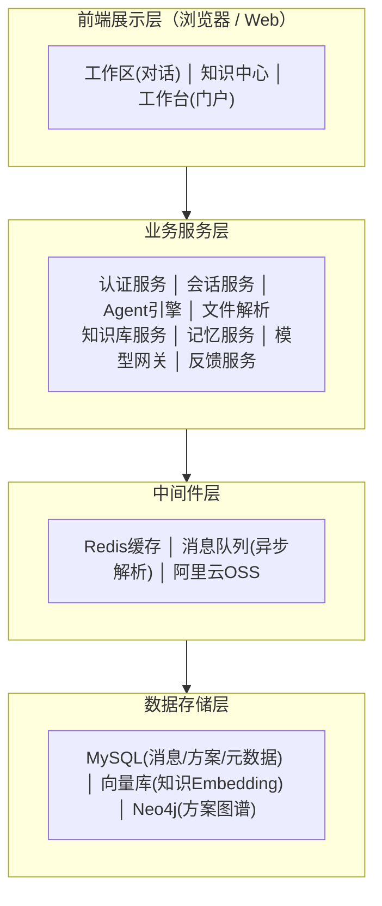
```mermaid
graph
    subgraph L1["前端展示层（浏览器 / Web）"]
        A["工作区(对话) │ 知识中心 │ 工作台(门户)"]
    end
    subgraph L2["业务服务层"]
        B["认证服务 │ 会话服务 │ Agent引擎 │ 文件解析<br/>知识库服务 │ 记忆服务 │ 模型网关 │ 反馈服务"]
    end
    subgraph L3["中间件层"]
        C["Redis缓存 │ 消息队列(异步解析) │ 阿里云OSS"]
    end
    subgraph L4["数据存储层"]
        D["MySQL(消息/方案/元数据) │ 向量库(知识Embedding) │ Neo4j(方案图谱)"]
    end
    L1 --> L2 --> L3 --> L4
```

**分层职责**：

| 层 | 职责 | 关键技术 |
|----|------|----------|
| 前端展示层 | 用户交互、消息渲染、状态管理、布局编排 | Vue 3 + TypeScript + Pinia + Tailwind |
| 业务服务层 | 业务逻辑编排、Agent 调度、LLM 推理、文件处理 | Python FastAPI / Node.js |
| 中间件层 | 缓存加速、异步解耦、文件持久化 | Redis / 消息队列 / OSS |
| 数据存储层 | 结构化数据、语义向量、知识图谱 | MySQL / 向量数据库 / Neo4j |

### 2.2 核心业务主流程

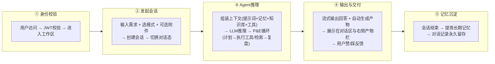
```mermaid
flowchart LR
    subgraph S1["① 身份校验"]
        A["用户访问 → JWT校验 → 进入工作区"]
    end
    subgraph S2["② 发起会话"]
        B["输入需求 + 选模式 + 可选附件<br/>→ 创建会话 → 切换对话态"]
    end
    subgraph S3["③ Agent推理"]
        C["组装上下文(提示词+记忆+知识库+工具)<br/>→ LLM推理 → P&E循环<br/>(计划→执行工具/检索→复盘)"]
    end
    subgraph S4["④ 输出与交付"]
        D["流式输出回答 + 自动生成产物<br/>→ 展示在对话区与右侧产物栏<br/>→ 用户赞/踩反馈"]
    end
    subgraph S5["⑤ 记忆沉淀"]
        E["会话结束 → 提炼长期记忆<br/>→ 对话记录永久留存"]
    end
    S1 --> S2 --> S3 --> S4 --> S5
```

### 2.3 核心业务闭环（完整时序）

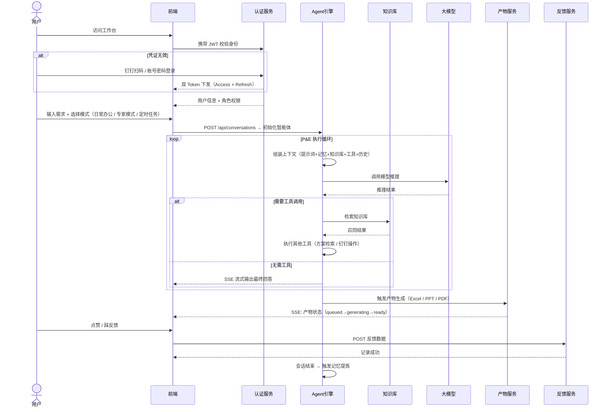
```mermaid
sequenceDiagram
    actor User as 用户
    participant FE as 前端
    participant Auth as 认证服务
    participant Agent as Agent引擎
    participant KB as 知识库
    participant LLM as 大模型
    participant Art as 产物服务
    participant FB as 反馈服务

    User->>FE: 访问工作台
    FE->>Auth: 携带 JWT 校验身份
    alt 凭证无效
        User->>Auth: 钉钉扫码 / 账号密码登录
        Auth-->>FE: 双 Token 下发（Access + Refresh）
    end
    Auth-->>FE: 用户信息 + 角色权限

    User->>FE: 输入需求 + 选择模式（日常办公 / 专家模式 / 定时任务）
    FE->>Agent: POST /api/conversations → 初始化智能体

    loop P&E 执行循环
        Agent->>Agent: 组装上下文（提示词+记忆+知识库+工具+历史）
        Agent->>LLM: 调用模型推理
        LLM-->>Agent: 推理结果
        alt 需要工具调用
            Agent->>KB: 检索知识库
            KB-->>Agent: 召回结果
            Agent->>Agent: 执行其他工具（方案检索 / 钉钉操作）
        else 无需工具
            Agent-->>FE: SSE 流式输出最终回答
        end
    end

    Agent->>Art: 触发产物生成（Excel / PPT / PDF）
    Art-->>FE: SSE: 产物状态（queued→generating→ready）

    User->>FE: 点赞 / 踩反馈
    FE->>FB: POST 反馈数据
    FB-->>FE: 记录成功

    Agent->>Agent: 会话结束 → 触发记忆提炼
```

**设计原因**：将整个业务闭环映射为「身份 → 会话 → 推理 → 输出 → 沉淀」五段式流程，每个阶段职责清晰、可独立迭代；P&E 循环让用户能看到 AI 的思考过程，不产生「黑箱感」。

---

## 三、页面与交互详细需求

### 3.1 首页（工作区 / 统一对话入口）

首页是用户进入天马智擎的第一个界面，也是最主要的工作界面。**首页和全屏对话页是同一个页面**，用户在同一界面完成「搜索 → 对话 → 查看结果」全流程，无需页面跳转。

#### 3.1.1 顶部固定导航栏（AppHeader）

Header 固定在页面顶部，z-index 最高，所有 Tab 页共享同一 Header。


**布局与元素**：

| 区域 | 元素 | 交互行为 | 设计原因 |
|------|------|----------|----------|
| 左侧 | Logo「天马智擎」+ 几何 icon | 点击回到工作区首页（`/`） | Logo 是用户最直觉的回首页方式 |
| 中部 | Tab 导航：**知识中心** / **工作台** | 点击切换 Tab，页面无刷新；仪表盘入口在 MVP 原型中隐藏 | 高频知识管理前置，减少入口噪音 |
| 右侧 | 全局任务完成通知 | 点击跳转到对应会话详情的具体位置；支持关闭 | 异步任务跨页面可感知，符合状态可见性原则 |
| 右侧 | 用户头像 + 姓名（钉钉同步） | 点击展开下拉菜单 | 个人操作集中在一处，不散落 |

**侧边栏控制位**：

- Header 不承载左右侧边栏的展开/折叠、新建按钮，不在两端预留空白占位。
- 首页、知识中心等页面在 Header 下方提供自己的副操作区：侧边栏收起时显示浮动 dock；侧边栏展开时折叠按钮与新建按钮跟随侧栏顶部。
- 右侧产物栏同理：收起时在 Header 下方右侧显示展开按钮，展开后折叠按钮放在产物栏顶部。

**用户头像下拉菜单**：

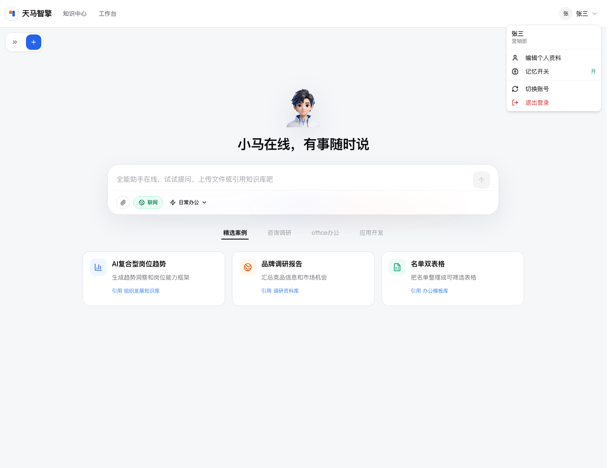

| 菜单项 | 行为 |
|--------|------|
| 编辑个人资料 | 打开个人资料弹窗，可上传头像、修改姓名并保存 |
| 记忆开关 | 切换跨会话长期记忆（默认开启），菜单右侧显示「开 / 关」 |
| 切换账号 | 返回登录页，保留当前页面 Demo 状态 |
| 退出登录 | 清除凭证，跳转登录页 |

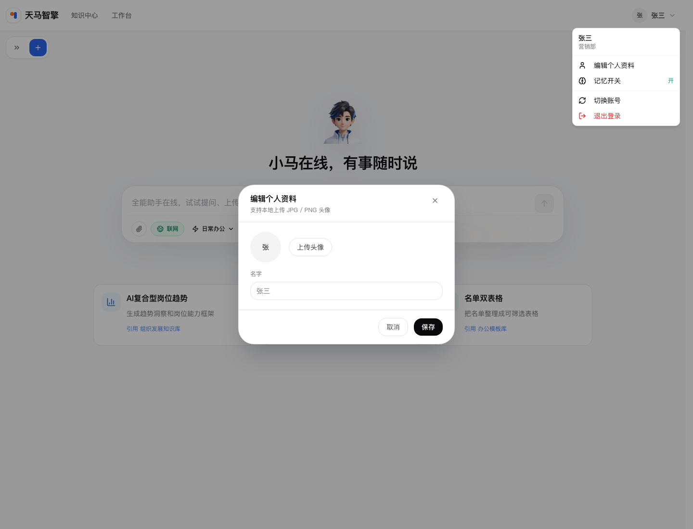

**编辑个人资料弹窗规则**：

| 元素 | 状态 / 行为 | 异常 / 校验 |
|------|-------------|-------------|
| 头像预览 | 默认展示当前头像或姓名首字，上传成功后即时预览 | 仅支持 JPG / PNG |
| 上传头像按钮 | 唤起本地文件选择器 | 非 JPG / PNG 时在弹窗内提示「仅支持 JPG/PNG 格式」 |
| 名字输入框 | 默认填入钉钉同步姓名，允许用户编辑 | 保存时去除首尾空格；空值回退为原姓名 |
| 取消按钮 / 关闭按钮 | 关闭弹窗，不保存本次修改 | 无二次确认 |
| 保存按钮 | 更新前端用户信息并写入本地登录态 | 保存后头像和 Header 姓名立即刷新 |

**移动端导航**（`md` 断点以下，桌面端隐藏）：

- 底部固定 3 个 Tab：**工作区** / **知识中心** / **工作台**
- **设计原因**：移动端单手操作时，底部导航比顶部更易触及，符合移动端设计规范

**全局交互规则**：

- 页面刷新不丢失当前 Tab 与会话状态（Tab 状态存入 URL hash）
- 所有接口请求自动携带身份凭证，Access Token 过期自动无感刷新（Refresh Token 机制）
- 网络异常、服务异常统一 Toast 提示，支持重试
- 页面布局采用流式弹性自适应：核心宽度、边距、侧栏宽度使用 `clamp()` / `calc()` 随窗口连续缩放，避免只在固定断点跳变

#### 3.1.2 页面加载时序

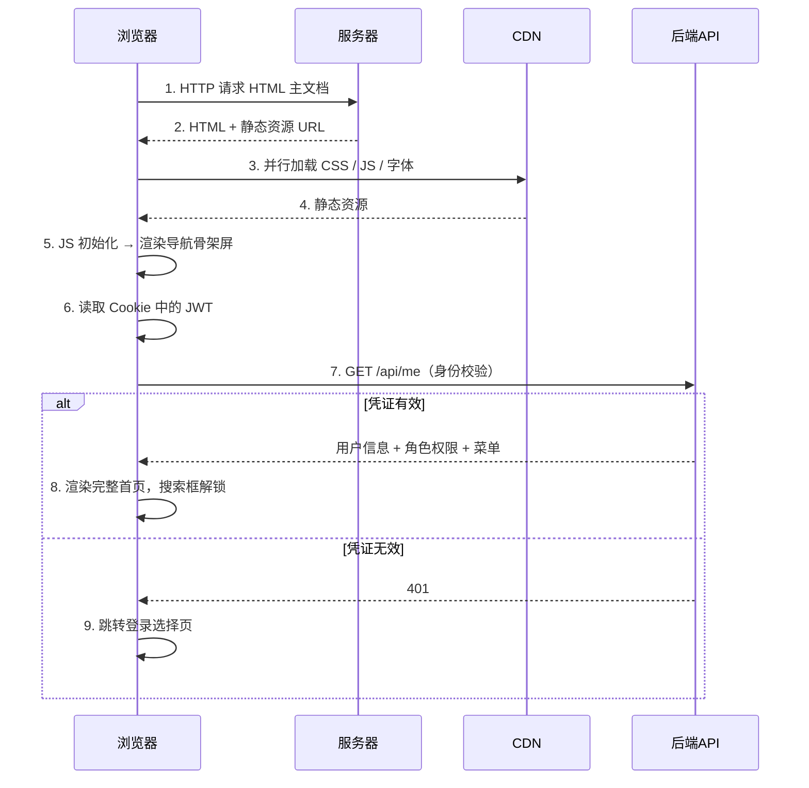
```mermaid
sequenceDiagram
    participant Browser as 浏览器
    participant Server as 服务器
    participant CDN as CDN
    participant API as 后端API

    Browser->>Server: 1. HTTP 请求 HTML 主文档
    Server-->>Browser: 2. HTML + 静态资源 URL
    Browser->>CDN: 3. 并行加载 CSS / JS / 字体
    CDN-->>Browser: 4. 静态资源
    Browser->>Browser: 5. JS 初始化 → 渲染导航骨架屏
    Browser->>Browser: 6. 读取 Cookie 中的 JWT
    Browser->>API: 7. GET /api/me（身份校验）
    alt 凭证有效
        API-->>Browser: 用户信息 + 角色权限 + 菜单
        Browser->>Browser: 8. 渲染完整首页，搜索框解锁
    else 凭证无效
        API-->>Browser: 401
        Browser->>Browser: 9. 跳转登录选择页
    end
```

**时序设计说明**：先渲染骨架屏再发身份请求，用户看到页面框架后等待时间感知更短；CDN 并行加载静态资源，减少首屏阻塞。

**异常处理**：

| 场景 | 前端表现 | 后端处理 |
|------|----------|----------|
| 静态资源加载失败 | 页面白屏，显示「加载失败，点击重试」 | CDN 多节点容灾 |
| `/api/me` 接口超时（>10s） | 导航显示骨架态，3s 后自动重试（最多 3 次） | 返回 503，记录日志 |
| Cookie 中无 JWT | 直接跳转登录页 | 无需处理 |
| 网络离线 | Toast「网络已断开」，重连后自动恢复 | — |

---

### 3.2 对话界面（统一对话工作区）

这是平台最核心的界面，用户在这里完成与 AI 的全部交互。

#### 3.2.1 整体三栏布局


**三栏行为规则**：

| 栏 | 默认状态 | 触发条件 | 宽度 | 设计原因 |
|----|---------|----------|------|----------|
| 左侧历史栏 | **隐藏**（仅露出 4px 展开把手） | 点击左侧把手 / 头像菜单「查看历史对话」 | 260px 覆盖模式（不挤压主区） | 历史列表不需常驻，需要时侧滑展开，最大化对话主区空间 |
| 中间主区域 | 始终显示 | — | 自适应（`flex-1`，最大 1320px） | 对话是核心操作区，占据最大面积 |
| 右侧产物栏 | **隐藏** | AI 回答有引用文件/产物/缺口时**自动滑入** | 320px | 仅在有交付物时出现，避免空栏干扰 |

**左侧历史栏当前原型元素**：

| 元素 | 可见状态 | 交互 / 输出 |
|------|----------|-------------|
| 标题「任务导航」 | 历史栏展开时固定显示 | 右侧折叠按钮收起历史栏，回到浮动 dock |
| 新对话 | 常驻在顶部功能区 | 清空当前输入与消息，恢复工作区初始态 |
| 历史会话 | 常驻在顶部功能区 | 打开历史会话浏览视图，可按模式过滤 |
| 专家模式分组 | 展示数量、运行/完成状态点和会话标题 | 点击会话项进入对话态；运行中显示蓝色状态点 |
| 日常办公分组 | 展示普通问答会话 | 支持失败状态红点与完成状态绿点 |
| 定时任务分组 | 展示周期任务和下次执行时间 | 点击后可进入任务上下文 |
| 更多提示 | 会话过多时展示「更多 X 类会话...」 | 点击进入历史会话浏览页 |

**状态切换**：

| 切换 | 触发条件 | 效果 |
|------|----------|------|
| 初始态 → 对话态 | 用户发送消息（`sendMessage()`） | 搜索区收起 → 消息流展开，同一 DOM 内过渡 |
| 对话态 → 初始态 | 点击 Logo / 新建会话（`newTask()`） | 当前会话保留在历史列表，中间区恢复搜索态 |
| 左侧栏展开/收起 | 点击左控制位 / 遮罩层 | 覆盖展开 260px，再次点击收起 |
| 右侧栏自动滑入 | 方案类任务完成（`hasGeneratedAssets=true`） | 320px 宽度滑入，Header 右控制位可手动折叠 |

**设计原因**：三栏布局覆盖了用户的所有场景——搜索时全屏展示、对话时左侧查历史、有产物时右侧看交付物。不需要页面跳转。侧栏采用覆盖模式而非挤压模式，避免主内容区频繁重排。

#### 3.2.2 初始态：搜索首页

当用户没有活跃会话时，中间主区域显示**搜索框 + 推荐案例**。

**搜索框**：

- 居中展示，默认文案为「小马在线，有事随时说」
- 输入框底部工具栏包含：上传文件、联网开关、模式切换、上下文状态与发送按钮
- 模式支持 **日常办公 / 专家模式 / 定时任务**，内部代号分别沿用 `quick / task / schedule`
- 日常办公模式不再暴露助理下拉，对用户统一表现为「全能助手」
- 专家模式默认不选择专家，未选择专家时发送按钮置灰，提示「请在下方选择合适的专家，小马会把任务托付给他/她高效完成」
- 定时任务模式在输入框内部右侧显示周期配置下拉框，支持每天、工作日、每周、每月；时间选择框根据周期自动显示「星期 / 日期 / 时间」

**初始态当前可见元素**：

| 元素 | 默认状态 | 交互结果 |
|------|----------|----------|
| 小马头像 + 欢迎语 | 居中显示「小马在线，有事随时说」 | 纯展示，不可点击 |
| 主输入框 | Placeholder 为「全能助手在线，试试提问、上传文件或引用知识库吧」 | 聚焦后展示案例区；输入非空后发送按钮转为可用 |
| 发送按钮 | 输入为空时灰色禁用 | 输入有效且模式约束满足后变黑；点击进入对话态 |
| 附件按钮 | 位于输入器左下角 | 打开附件弹窗，支持本地文件与知识库文件 |
| 联网开关 | 默认绿色开启 | 点击后置灰关闭；状态影响下一轮回答来源 |
| 模式按钮 | 默认「日常办公」 | 点击打开模式菜单，可切换日常办公、专家模式、定时任务 |
| 案例分类 Tab | 默认「精选案例」高亮 | 点击切换咨询调研、office 办公、应用开发等案例 |
| 案例卡 | 展示标题、描述、引用知识库 | 点击只填充输入，不自动发送 |

**案例区**（搜索框聚焦后触发）：

搜索框聚焦后在输入框下方展示案例/专家卡片，内容根据当前模式动态切换：

| 模式 | 展示内容 | 交互规则 |
|------|----------|----------|
| 日常办公 | 全能助手案例：AI岗位趋势、品牌调研、名单表格、知识库查询等 | 点击案例填充提示词，不自动发送 |
| 专家模式（未选专家） | 专家卡片，最多 4 个/行：组货专家、分析专家、营销大师、高级设计师、运营策略师、敬请期待 | 选择专家后才允许发送 |
| 专家模式（已选专家） | 已选专家卡片前置，右侧展示该专家提示词示例；输入框内出现专家 bridge | 关闭 bridge 或关闭专家卡片后回到未选专家态 |
| 定时任务 | 定时任务案例：每日方案池监控、每周经营简报、工作日待办巡检 | 点击案例填充任务描述，可继续调整周期 |

**点击案例卡片的行为**（`fillPrompt()`）：

1. 如果当前模式与案例不匹配 → 自动切换模式（`selectMode()`）
2. 案例提示词填入搜索框（`query.value = item.prompt`）
3. **不自动发送**，用户编辑确认后再按 Enter 发送
4. 发送后，引用来源信息（模式 + 智能体/专家 + 知识库）同步进入右侧栏和来源引用区

**设计原因**：案例让新用户快速上手，理解 AI 的能力边界；不自动发送让用户在查看案例后可以调整需求再发起，避免「猜错了用户的意图」。

#### 3.2.3 对话态：输入区域

对话态下，底部固定输入区域（Sender 输入器），包含以下元素：

**文本输入框**：

| 属性 | 规则 | 设计原因 |
|------|------|----------|
| 多行输入 | 支持多行，Enter 发送 | 符合即时通讯习惯 |
| Shift+Enter | 换行（不发送） | 与主流的 Enter 发送不冲突 |
| 最大高度 | **168px**（约 8 行），超出后显示垂直滚动条 | 防止输入过长内容遮挡消息流 |
| 输入为空 | 发送按钮置灰，不可点击 | 防止空提交 |

**工具栏**（Sender 的 prefix/action 区域）：

| 控件 | 图标/样式 | 交互 |
|------|----------|------|
| 上传文件 | 回形针图标 📎 | 点击唤起系统文件选择器（`triggerFilePicker()`） |
| 模式切换 | 日常办公 / 专家模式 / 定时任务 | 下拉切换执行方式，选中态仅用文字颜色高亮，不使用重胶囊样式 |
| 专家选择 | 仅专家模式露出 | 未选专家时在下方展示专家卡片；选中后输入框内出现 bridge，可关闭 |
| 周期配置 | 仅定时任务露出 | 周期下拉 + 时间下拉；每周显示星期选择，每月显示日期选择 |
| Web Search | 🌐 绿色高亮 = 开启 | 点击切换关闭（灰色），状态独立记忆 |

**设计原因**：工具栏放在输入框同一行，比分开放在页面其他位置更符合操作流。模型选择由后端自动路由完成，前端不暴露模型下拉，减少普通用户理解成本。

**附件上传**：

| 上传方式 | 操作 | 数据流 |
|----------|------|--------|
| 点击工具按钮 | 唤起系统文件选择器 | 前端校验格式/大小 → 显示 file-chip 标签 |
| 拖拽 | 拖拽文件到搜索区域自动识别 | 同点击上传 |
| Ctrl+V 粘贴 | 本期按文本粘贴处理 | 暂不将剪贴板图片作为上传入口 |

**统一上传规则**：

| 规则 | 值 |
|------|----|
| 单文件最大 | 20MB |
| 单次最多 | 10 个文件 |
| 支持格式 | PDF、DOC、DOCX、MD、TXT |
| 校验时机 | 选中后立即校验（格式 + 大小），不符合阻断并提示 |

**上传前校验与异常**（`isSupportedUpload()` + `handleFiles()`）：

| 场景 | 表现 |
|------|------|
| 格式不支持（如 exe/rar） | 文件不被添加到 selectedFiles，无提示（静默过滤） |
| 超过 20MB | 文件不被添加 |
| 粘贴内容非图片 | 正常插入文本，不上传 |
| 粘贴多张图片 | 每张添加一个 file-chip |
| 已添加文件误选 | 点击 file-chip 的 ✕ 按钮删除 |
| 文件上传未完成时发送 | 等待上传完成后自动解除阻断（异步上传时） |

**已选附件展示**：

- 选中文件后在输入框**下方**显示 file-chip 标签列表（文件类型图标 + 文件名截断 + ✕ 删除按钮）
- 知识库文档选择通过弹窗（AttachmentModal）操作，支持按空间/文件夹浏览和搜索

**附件选择弹窗**：

- 支持本地文件上传和知识库附件两种来源
- 知识库来源按空间（公共/个人）组织文件夹树，支持搜索
- 点击文件夹进入子文件夹，点击文件添加为附件
- 已选文件在列表中有选中标识，可取消

#### 3.2.4 对话态：消息流区域

消息流是对话的核心输出区域，渲染不同类型的消息。

**消息类型与渲染规则**：

| 消息类型 | 渲染样式 | 数据来源 | 设计原因 |
|----------|----------|----------|----------|
| 用户文本消息 | 右侧气泡，Markdown 渲染，附带头像与文件卡片 | `messages[{ role: 'user', content }]` | 符合聊天界面惯例，用户消息与 AI 消息左右区分，视觉清晰 |
| P&E 工作过程 | 左侧灰色时间线，显示"工作了 X 秒"，可折叠展开详情 | `processEvents[]`（analysis/plan/step/reflection/final） | 让用户看到 AI 的思考过程，减少「黑箱感」，又不占用最终回答视觉区域 |
| 工具/知识库事件 | 灰色行：动作图标 + 对象 + 结果摘要 | P&E 执行中的 tool_call / kb_retrieval 状态 | 轻量化展示工具使用情况，用户可感知 AI 在做什么 |
| AI 最终回答 | **无气泡框**，以 Markdown 正文直接渲染 | `messages[{ role: 'assistant', content }]` | 最终回答是用户要阅读交付的内容，不需要气泡框包裹 |
| 来源引用 | 回答正文下方展示来源卡片，右侧栏同步展示 | 知识库召回 / 联网搜索 / 文件解析的来源元数据 | 保证信息可溯源性 |
| 方案推荐卡片 | 内嵌组件：方案名称 + 所属池子 + 核心适配点 + 优势 | 方案匹配结构化结果 | 方案信息密集，需要卡片式布局一目了然 |
| 系统提示消息 | 左侧黄色/红色提示条，无气泡 | 后端异常 / 权限提示 | 与正常对话消息视觉区分，强调系统状态 |

**对话态当前原型可见元素**：

| 区域 | 元素 / 状态 | 行为 |
|------|-------------|------|
| 顶部消息区 | 会话标题「B2B团购组货方案」+ 模式标签「专家模式」+ 用户原始输入 | 标题由输入内容自动生成；模式标签用于回看执行路径 |
| 左侧导航 | 当前会话高亮，新增会话立即进入「运行中」状态 | 点击其他会话可切换上下文 |
| P&E 过程 | 展示「小马工作了 16 秒」与阶段行 | 阶段行可展开详情；运行中阶段用橙色状态点和加载文案 |
| 产物卡 | Excel / PPT / PDF 三张卡片 | 提供「预览」「下载」入口；后端真实接入后根据 artifact 状态更新 |
| 来源引用 | 展示引用知识库、预算分档与门店话术 | 点击来源卡后进入对应文件/来源详情（MVP Mock） |
| 底部输入器 | 已选专家 bridge「组货专家」+ Placeholder + 停止按钮 | 生成中点击黑色停止按钮中断输出；输入区继续保留专家模式 |
| 模式与专家入口 | 底部显示「专家模式」和当前「组货专家」 | 可切换模式或更换专家，下一轮消息按新配置执行 |
| 联网开关 | 绿色开启 | 影响下一轮是否允许联网检索 |

**P&E 过程交互**（对应 `ThinkingChain` 组件）：

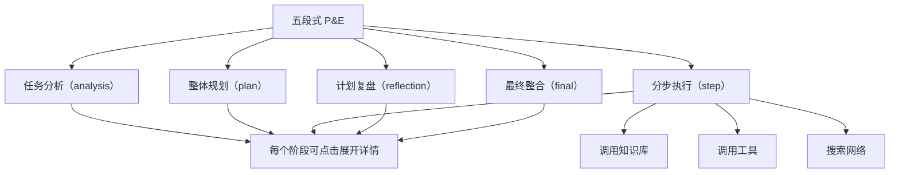
```mermaid
flowchart TD
    A["五段式 P&E"] --> B["任务分析（analysis）"]
    A --> C["整体规划（plan）"]
    A --> D["分步执行（step）"]
    A --> E["计划复盘（reflection）"]
    A --> F["最终整合（final）"]

    D --> G["调用知识库"]
    D --> H["调用工具"]
    D --> I["搜索网络"]

    B & C & D & E & F --> J["每个阶段可点击展开详情"]
```

| 交互 | 行为 | 状态 |
|------|------|------|
| 运行中 | 灰字光影流动动画 + status=active | 展示「小马正在工作中…」动态文案 |
| 完成 | 稳定灰字 + status=done | 展示阶段名 + 摘要 |
| 调整 | 橙色标记 + status=adjusted | 展示「计划已调整」标识 |
| 展开详情 | 点击阶段行 | 展开折叠的 detail 文本 |
| 日常办公模式 | 压缩为三段（任务分析 → 规划 → 最终整合） | 信息密度降低 |

**设计原因**：P&E 展示是产品化的思考过程摘要，不是模型原始 CoT（思维链）。每个阶段控制在 1-2 行摘要 + 可选详情，兼顾透明度和可读性。

**消息操作**（每条 AI 回答下方）：

| 操作 | 图标 | 行为 | 设计原因 |
|------|------|------|----------|
| 点赞 👍 | 实心高亮 = 已赞 | `setFeedback(messageId, 'up')` | 一键正向反馈，降低操作成本 |
| 踩 👎 | 点击弹出原因选择器 | `openDislikeModal(messageId)` | 踩需要知道原因才有优化价值 |
| 复制 📋 | 点击复制完整回答 | `navigator.clipboard.writeText()` | 用户可能需要在外部粘贴使用 |
| 引用 💬 | 点击预填引用前缀到输入框 | `query.value = "引用上一条：..."` | 快速针对上一条内容追问 |

**踩反馈弹窗**：

```
┌─────────────────────────────┐
│  请告诉我们哪里不合适        │
├─────────────────────────────┤
│  ☐ 匹配不准（推荐不符需求）  │
│  ☐ 内容有误（信息或数据错误）│
│  ☐ 答非所问（偏离了问题）    │
│  ☐ 格式问题（排版混乱）      │
│  ☐ 其他（可输入备注 500字）  │
├─────────────────────────────┤
│         [提交反馈]           │
└─────────────────────────────┘
```

| 规则 | 行为 |
|------|------|
| 提交后 | 👎 按钮高亮，显示「感谢反馈」，按钮置灰不可重复提交 |
| 切换 | 用户可先赞后踩或先踩后赞，新提交覆盖旧反馈 |
| 原因关联 | 踩+匹配不准 → 知识缺口优先级 +1；踩+内容有误 → 标记人工复核 |

**滚动管理**：

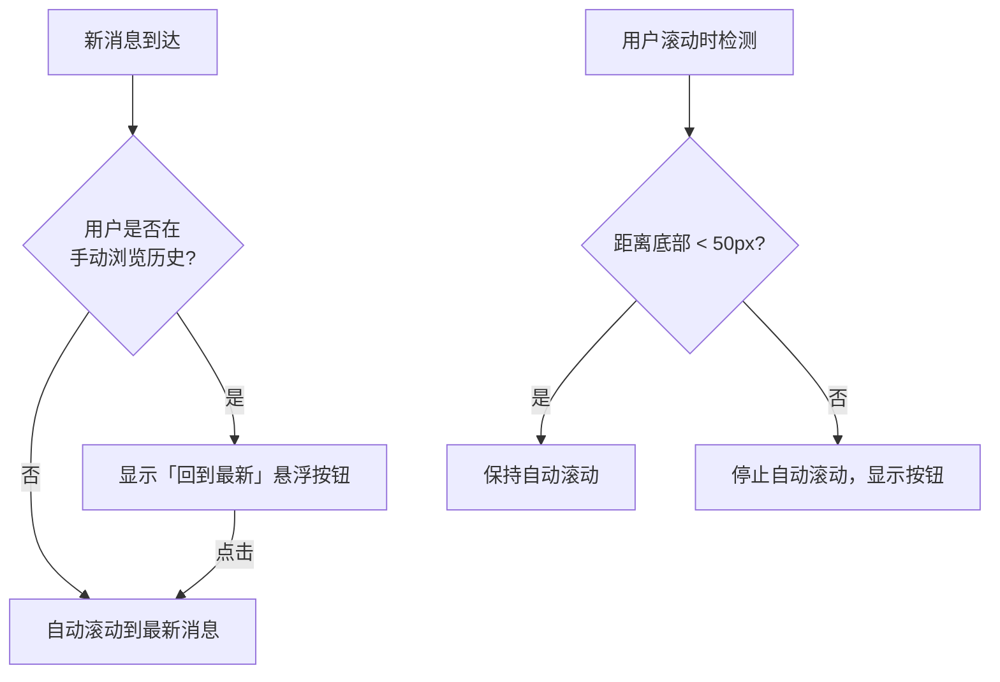
```mermaid
flowchart TD
    A["新消息到达"] --> B{"用户是否在<br/>手动浏览历史?"}
    B -->|否| C["自动滚动到最新消息"]
    B -->|是| D["显示「回到最新」悬浮按钮"]
    D -->|点击| C

    E["用户滚动时检测"] --> F{"距离底部 < 50px?"}
    F -->|是| G["保持自动滚动"]
    F -->|否| H["停止自动滚动，显示按钮"]
```

| 场景 | 行为 |
|------|------|
| 生成过程中 | 自动跟随最新消息 |
| 用户向上翻看历史 | 自动滚动暂停，显示🔽「回到最新」按钮 |
| 用户在选中文本 | 强制停止自动滚动（防止打断选中状态） |
| 点击「回到最新」 | 平滑滚动到底部，恢复自动跟随 |

**设计原因**：在 AI 流式输出较长回答时，自动滚动到最新是必要体验；但当用户在阅读之前的内容时，自动滚动会打断阅读节奏，所以需要智能检测用户意图。

#### 3.2.5 意图分类与执行路由

用户在输入框发送消息后，前端先进行意图分类，决定走哪种执行路径：

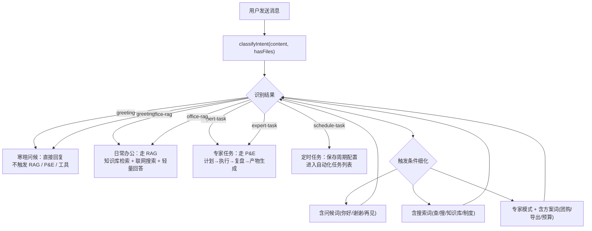
```mermaid
flowchart TD
    A["用户发送消息"] --> B["classifyIntent(content, hasFiles)"]
    B --> C{"识别结果"}
    C -->|"greeting"| D["寒暄问候：直接回复<br/>不触发 RAG / P&E / 工具"]
    C -->|"office-rag"| E["日常办公：走 RAG<br/>知识库检索 + 联网搜索 + 轻量回答"]
    C -->|"expert-task"| F["专家任务：走 P&E<br/>计划→执行→复盘→产物生成"]
    C -->|"schedule-task"| S["定时任务：保存周期配置<br/>进入自动化任务列表"]

    C --> G{"触发条件细化"}
    G1["含问候词(你好/谢谢/再见)"]
    G2["含搜索词(查/搜/知识库/制度)"]
    G3["专家模式 + 含方案词(团购/导出/预算)"]

    G --> G1 & G2 & G3
    G1 --> C -->|greeting| D
    G2 --> C -->|office-rag| E
    G3 --> C -->|expert-task| F
```

**意图分类算法说明**（`classifyIntent()`）：

1. **问候检测**：输入去标点后与问候词表（你好/您好/嗨/hi/hello/谢谢/再见等）精确匹配，且无附件 → greeting
2. **专家关键词检测**：如果当前模式为 task 且内容包含关键词（方案/团购/组货/导出/预算/客户/钉钉等）→ expert-task
3. **RAG 关键词检测**：如果内容包含搜索词（查/搜/知识库/制度/新闻/报告等）→ office-rag
4. **定时任务检测**：如果当前模式为 schedule → schedule-task，读取周期/时间配置并创建自动化任务
5. **兜底**：专家模式且有附件 → expert-task；否则 → greeting

**设计原因**：意图分类让不同类型的请求走不同的处理路径，避免寒暄也触发昂贵的工具调用，也避免专家任务被当作简单问答处理。分类逻辑在前端即时完成，不等待后端，所以响应快。

#### 3.2.6 三模式执行机制

**日常办公模式（Quick/RAG）**：


```mermaid
flowchart LR
    A["接收输入"] --> B["意图分类"]
    B --> C["上下文组装<br/>(提示词 + 知识库 + 网络)"]
    C --> D["RAG 检索增强生成"]
    D --> E["SSE 流式输出"]
    E --> F["完成"]
```

- 对用户展示：全能助手（不提供助理下拉选择）
- 内部执行：可按意图路由到调研帮手、知识顾问、钉钉助理等子能力，但前端不暴露
- 执行方式：RAG（检索增强生成），快速问答
- 首字响应目标：< 1s
- 适合：查资料、写文案、制度问答等轻量场景
- P&E 过程压缩为三段展示（分析 → 执行 → 最终）

**日常办公案例**：

| 案例类型 | 能力 |
|----------|------|
| 咨询调研 | 联网搜索、资料汇总、报告生成 |
| Office 办公 | 表格整理、文档摘要、待办拆解 |
| 知识问答 | 知识库检索、引用来源、制度解释 |

**专家模式（Task/P&E）**：

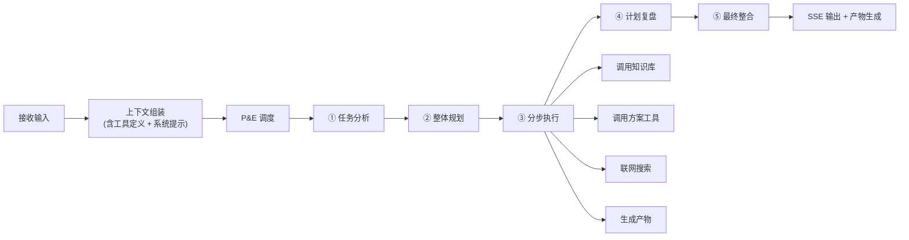
```mermaid
flowchart LR
    A["接收输入"] --> B["上下文组装<br/>(含工具定义 + 系统提示)"]
    B --> C["P&E 调度"]
    C --> D["① 任务分析"]
    D --> E["② 整体规划"]
    E --> F["③ 分步执行"]
    F --> G["④ 计划复盘"]
    G --> H["⑤ 最终整合"]
    H --> I["SSE 输出 + 产物生成"]

    F --> J["调用知识库"]
    F --> K["调用方案工具"]
    F --> L["联网搜索"]
    F --> M["生成产物"]
```

- 默认状态：不选择专家，发送按钮置灰
- 选择专家后：输入框内出现专家 bridge，下方专家卡片前置并展示提示词示例
- 执行方式：P&E（Plan-and-Execute），复杂任务闭环
- 首字响应目标：< 3s
- 适合：方案匹配、需求澄清、产物导出、钉钉工具执行
- 五段式 P&E 完整展示

**专家模式智能体选项**：

| 智能体 | key | 能力 |
|--------|-----|------|
| 组货专家 | `solution` | 方案匹配、组货清单和客户交付物生成 |
| 分析专家 | `analysis` | 经营指标拆解、客户分层、诊断建议 |
| 营销大师 | `marketing` | 活动策划、传播文案、邀约话术 |
| 高级设计师 | `design` | 方案页/PPT视觉方向与结构建议 |
| 运营策略师 | `ops` | 交付排期、流程拆解、风险预案 |
| 敬请期待 | `soon` | 占位，不允许选择 |

**定时任务模式（Schedule/Automation）**：


```mermaid
flowchart LR
    A["输入周期性任务"] --> B["选择周期与时间"]
    B --> C["创建自动化任务"]
    C --> D["写入自动化列表"]
    D --> E["到点触发 Agent 执行"]
    E --> F["结果沉淀到会话/产物栏"]
```

- 周期选项：每天、工作日、每周、每月
- 时间控件：每周显示星期选择；每月显示日期选择；所有周期均显示时间选择
- 管理入口：对话侧边栏「自动化」，支持查看、暂停、启动、立即启动
- 适合：日报周报、知识库巡检、方案池监控、待办提醒

**三模式共享底座**：

- ✅ 知识库检索（按角色权限）
- ✅ Web Search 联网搜索
- ✅ 工具调用（MCP 协议）
- ✅ 多轮对话记忆
- ✅ 权限角色隔离

**模式切换行为**：

- 用户可在输入框工具栏中实时切换模式
- 切换到日常办公：自动回到全能助手，无需选择助理
- 切换到专家模式：清空专家选择，必须重新选择专家
- 切换到定时任务：显示周期/时间配置控件
- 切换后下一轮消息按新配置执行，已生成的内容不受影响
- Web Search 状态在会话内保持

**设计原因**：大部分用户需要「快问快答」的轻量体验，方案中心等复杂任务需要 P&E 机制，周期性事项需要自动化入口。三种模式共享底层能力框架，但执行方式和展示密度不同，让用户按需选择。

#### 3.2.7 文件上传全链路交互

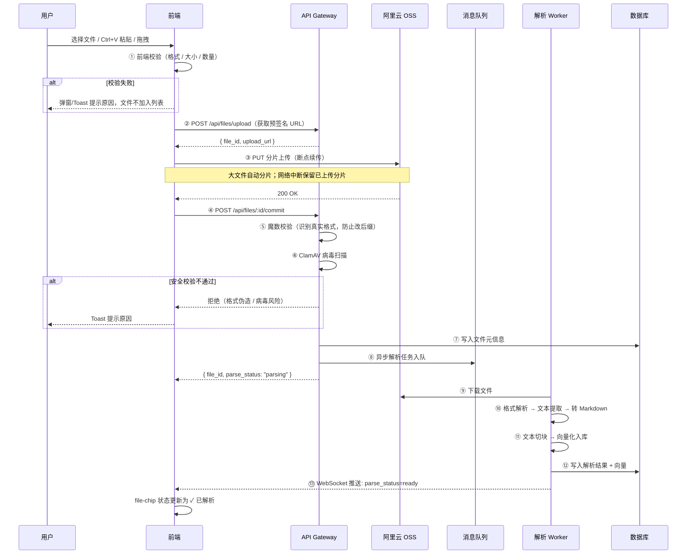
```mermaid
sequenceDiagram
    participant User as 用户
    participant FE as 前端
    participant API as API Gateway
    participant OSS as 阿里云 OSS
    participant Queue as 消息队列
    participant Worker as 解析 Worker
    participant DB as 数据库

    User->>FE: 选择文件 / Ctrl+V 粘贴 / 拖拽
    FE->>FE: ① 前端校验（格式 / 大小 / 数量）
    alt 校验失败
        FE-->>User: 弹窗/Toast 提示原因，文件不加入列表
    end

    FE->>API: ② POST /api/files/upload（获取预签名 URL）
    API-->>FE: { file_id, upload_url }

    FE->>OSS: ③ PUT 分片上传（断点续传）
    Note over FE,OSS: 大文件自动分片；网络中断保留已上传分片
    OSS-->>FE: 200 OK

    FE->>API: ④ POST /api/files/:id/commit
    API->>API: ⑤ 魔数校验（识别真实格式，防止改后缀）
    API->>API: ⑥ ClamAV 病毒扫描
    alt 安全校验不通过
        API-->>FE: 拒绝（格式伪造 / 病毒风险）
        FE-->>User: Toast 提示原因
    end

    API->>DB: ⑦ 写入文件元信息
    API->>Queue: ⑧ 异步解析任务入队
    API-->>FE: { file_id, parse_status: "parsing" }

    Worker->>OSS: ⑨ 下载文件
    Worker->>Worker: ⑩ 格式解析 → 文本提取 → 转 Markdown
    Worker->>Worker: ⑪ 文本切块 → 向量化入库
    Worker->>DB: ⑫ 写入解析结果 + 向量
    Worker-->>FE: ⑬ WebSocket 推送: parse_status=ready
    FE->>FE: file-chip 状态更新为 ✓ 已解析
```

**知识中心上传补充规则**：

- 上传过程在知识中心内以任务卡展示，包含文件名、进度、上传成功/失败、解析/审核状态和「查看预览」入口。
- 公共空间上传完成后进入审核态，不直接全员可见；AI 可辅助输出风险判断、重复文件判断和推荐分类，但最终发布由人工审核决定。
- MVP 前期公共空间由技术部统一审核，后续按业务域交给业务知识管理员审核。
- 删除文件、知识库均采用逻辑删除：后端标记 `enabled=false` 或 `status=deleted`，前端不展示，便于审计和恢复。

**各格式解析技术选型**：

| 格式 | 解析工具 | 处理逻辑 |
|------|----------|----------|
| DOCX | python-docx | 提取标题正文表格，按层级转 Markdown |
| XLSX | openpyxl + pandas | 逐 Sheet 读取单元格，转 Markdown 表格 |
| PPTX | python-pptx | 提取每页标题正文，按分页转 Markdown |
| 文字版 PDF | PyMuPDF | 逐页提取文本表格，还原排版 |
| PNG/JPG | DeepSeek VLM OCR | 大视觉模型识别文字、表格、版面 |
| TXT | 原生读取 | 编码自动识别（UTF-8 → GBK → GB2312） |

**安全校验机制**：

```
文件上传 → 魔数校验(读取文件头二进制) → ClamAV扫描 → 入库
                   ↓                       ↓
              改后缀检测(如.exe改.pdf)   病毒检测阳性
                   ↓                       ↓
              拒绝入库，记录安全日志     删除文件，记录安全日志
```

**异常处理全表**：

| 阶段 | 场景 | 用户提示 | 系统行为 |
|------|------|----------|----------|
| 前端校验 | 文件格式不支持 | 选中后弹窗「暂不支持该格式」 | 拒绝添加，不发起上传 |
| 前端校验 | 单文件超过 20MB | 弹窗「文件大小超出限制」 | 拒绝该文件 |
| 前端校验 | 单次超过 10 个文件 | 弹窗「单次最多上传 10 个文件」 | 仅取前 10 个 |
| 前端校验 | 粘贴内容不是支持文件 | 无提示，按文本粘贴 | 不上传 |
| OSS 上传 | 网络中断 | 「网络中断，点击续传」 | 保留已上传分片 |
| OSS 上传 | 上传超时（>120s） | 「上传超时，请重试」 | 取消上传，清理分片 |
| 安全校验 | 魔数校验不通过（改后缀） | 「文件格式异常，请检查」 | 拒绝入库，记录安全日志 |
| 安全校验 | ClamAV 病毒阳性 | 「文件安全检测未通过」 | 删除文件，记录安全日志 |
| 异步解析 | 文件损坏 / 加密 PDF | 「无法解析该文件」 | 自动重试 2 次，仍失败则标记失败 |
| 异步解析 | 编码不可识别 | 「文件编码无法识别」 | 尝试 UTF-8 → GBK → GB2312 |
| 异步解析 | 解析队列堆积 | 无提示（异步执行不阻塞对话） | 消息队列排队，横向扩展 Worker |

#### 3.2.8 方案导出交互

方案导出是专家模式的最后交付环节，让用户将 AI 生成的方案转化为可直接使用的文件。

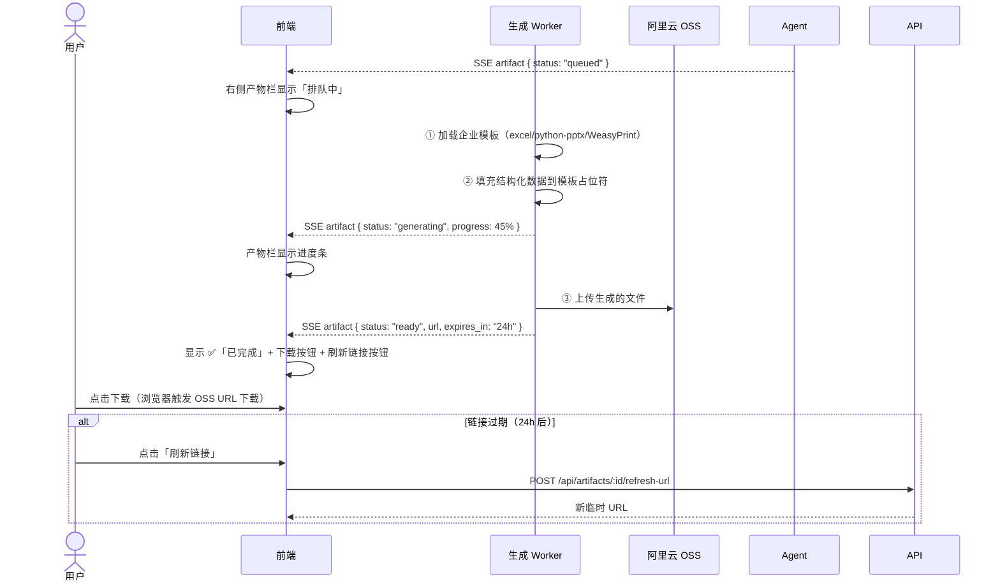
```mermaid
sequenceDiagram
    actor User as 用户
    participant FE as 前端
    participant Art as 生成 Worker
    participant OSS as 阿里云 OSS

    Agent-->>FE: SSE artifact { status: "queued" }
    FE->>FE: 右侧产物栏显示「排队中」

    Art->>Art: ① 加载企业模板（excel/python-pptx/WeasyPrint）
    Art->>Art: ② 填充结构化数据到模板占位符
    Art-->>FE: SSE artifact { status: "generating", progress: 45% }
    FE->>FE: 产物栏显示进度条

    Art->>OSS: ③ 上传生成的文件
    Art-->>FE: SSE artifact { status: "ready", url, expires_in: "24h" }
    FE->>FE: 显示 ✅「已完成」+ 下载按钮 + 刷新链接按钮

    User->>FE: 点击下载（浏览器触发 OSS URL 下载）
    alt 链接过期（24h 后）
        User->>FE: 点击「刷新链接」
        FE->>API: POST /api/artifacts/:id/refresh-url
        API-->>FE: 新临时 URL
    end
```

**支持格式与实现**：

| 格式 | 技术方案 | 说明 |
|------|----------|------|
| Excel | openpyxl + 预设模板 | 保留模板样式、公式、合并单元格 |
| PPT | python-pptx + 母版模板 | 固定版式与企业风格 |
| PDF | WeasyPrint（HTML+CSS 渲染） | 格式稳定，适合正式文档 |

**内容与格式解耦原则**：
1. AI 完成方案生成后，输出标准化 JSON 结构化数据
2. 调用文件生成工具，传入结构化数据 + 目标格式 + 模板编号
3. 后端加载企业模板，通过模板引擎填充占位符
4. 生成文件 → OSS 上传 → 返回下载链接
5. 文件自动加入右侧产物栏

**右侧产物栏分区**：

| 区域 | 内容 | 来源 |
|------|------|------|
| 来源引用 | 知识库文件、联网网页、首页案例 | Sources 卡片样式 |
| 知识库文件夹 | 如「团购方案资料夹」「方案中心案例库」 | 本轮引用的知识资产集合 |
| 生成产物 | Excel 组货清单、PPT 方案、PDF 画册 | 异步文件生成 |
| 图表工具 | 预算分档占比、SKU 占比等图表 | 轻量图表卡片 |
| 知识缺口 | 本轮发现但暂未补齐的数据/知识 | 自动记录 |

**产物生成全链路异常**：

| 阶段 | 场景 | 用户提示 | 系统行为 |
|------|------|----------|----------|
| 生成 | 排队太久（>30s 未开始） | 显示「正在排队，请稍候」 | 检查 Worker 负载 |
| 生成 | 生成超时（>180s） | 「生成超时，点击重试」 | 检查任务存活，存活则继续等待 |
| 生成 | 模板缺失 | 「模板未找到，已使用默认格式」 | 降级为基础模板 |
| 上传 | OSS 上传失败 | 「文件保存失败，点击重试」 | 本地暂存，自动重试 3 次 |
| 下载 | 链接过期（24h 后） | 显示「链接已过期，点击刷新」 | POST 刷新获取新链接 |
| 内容 | 生成内容为空 | 「生成内容为空，请检查输入」 | 通知用户补充信息 |

---

### 3.3 会话管理

#### 3.3.1 左侧历史对话栏

**交互规则**：

- 对话页左侧栏默认展开，用户可通过 Header 控制位折叠/展开
- 侧边栏顶部为搜索框，支持按标题搜索历史会话
- 搜索框下方提供模式筛选：全部 / 日常 / 专家
- 功能入口包括：新对话、自动化、知识库、更多
- 点击「新对话」后保持全屏对话布局，不回到首页；消息区为空，底部输入框仍固定显示
- 点击「自动化」进入定时任务列表，可查看运行状态、暂停、启动、立即启动
- 会话列表弱化显示在功能入口下方，置顶在前、普通在后
- 每个会话项显示：标题 + 时间 + 模式标签 + 状态指示灯
- 点击会话项 → 加载该会话的消息历史 → 进入对话态

**会话状态与视觉**：

| 状态 | 指示灯 | 含义 |
|------|--------|------|
| `running` | 蓝色脉冲动画 | AI 正在生成中 |
| `completed` | 绿色实心 | 已完成 |
| `failed` | 红色实心 | 中断 / 失败 |

**会话操作**：

| 操作 | 触发 | 行为 |
|------|------|------|
| 置顶 📌 | 点击置顶图标 | 该会话在列表中置顶，再次点击取消 |
| 重命名 ✏️ | 点击编辑按钮 → 输入新标题 → Enter | 更新 `conversation.title` |
| 删除 🗑 | 点击删除 → 确认弹窗「确定删除？」 | 软删除（`status: deleted`） |
| 继续对话 | 点击会话项 | 加载历史消息流 |
| 查看详情 | 点击查看详情 | 展示会话摘要 + 关联文件 |

**标题自动生成**（`summarizeDraftTitle()`）：

| 输入内容 | 生成的标题 |
|----------|-----------|
| 含「团购」 | B2B 团购组货方案 |
| 含「考勤」 | 考勤制度问答 |
| 含「待办」 | 钉钉待办创建 |
| 问候/寒暄 | 轻量问候 |
| 其他 | 截取前 12 个字符 / 「新会话」 |

**设计原因**：会话标题自动生成让用户不需要手动命名就能在列表中快速定位会话；关键词匹配比 LLM 摘要更轻量、更即时。

#### 3.3.2 会话生命周期

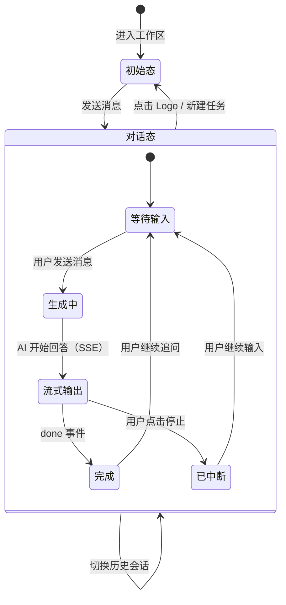
```mermaid
stateDiagram-v2
    [*] --> 初始态: 进入工作区

    初始态 --> 对话态: 发送消息

    state 对话态 {
        [*] --> 等待输入
        等待输入 --> 生成中: 用户发送消息
        生成中 --> 流式输出: AI 开始回答（SSE）
        流式输出 --> 完成: done 事件
        流式输出 --> 已中断: 用户点击停止
        已中断 --> 等待输入: 用户继续输入
        完成 --> 等待输入: 用户继续追问
    }

    对话态 --> 初始态: 点击 Logo / 新建任务
    对话态 --> 对话态: 切换历史会话
```

---

### 3.4 对话交互闭环

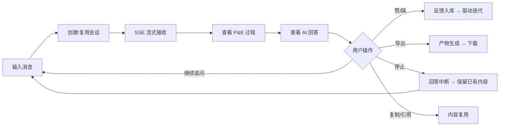
```mermaid
flowchart LR
    A["输入消息"] --> B["创建/复用会话"]
    B --> C["SSE 流式接收"]
    C --> D["查看 P&E 过程"]
    D --> E["查看 AI 回答"]
    E --> F{用户操作}
    F -->|继续追问| A
    F -->|赞/踩| G["反馈入库 → 驱动迭代"]
    F -->|导出| H["产物生成 → 下载"]
    F -->|停止| I["回答中断 → 保留已有内容"]
    F -->|复制/引用| J["内容复用"]
    I --> A
```

---

### 3.5 工作台（业务应用聚合）


**功能说明**：集中展示企业所有内部业务系统入口，点击自动免登跳转。

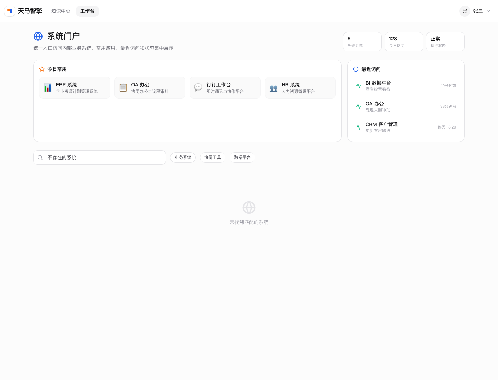

**布局**：顶部展示页面标题、说明和 3 个统计卡；中间展示「今日常用」与「最近访问」；下方为搜索、分类筛选和系统卡片网格。每个系统对应一张卡片（Logo + 名称 + 简介 + 分类 + 免登标签），支持按分类筛选和关键字搜索。

**当前原型可见元素与状态**：

| 区域 | 元素 | 交互 / 状态 |
|------|------|-------------|
| 页面头部 | 标题「系统门户」+ 说明 | 说明工作台是内部系统统一入口 |
| 统计卡 | 免登系统、今日访问、运行状态 | 只读展示；用于快速感知接入情况 |
| 今日常用 | ERP、OA、钉钉、HR 等快捷卡 | 点击触发 `handlePortalClick()`；免登系统拼接 SSO token |
| 最近访问 | 系统名、最近动作、时间 | 只读信息流，帮助用户恢复上下文 |
| 搜索框 | Placeholder「搜索系统...」 | 输入后实时过滤名称与描述 |
| 分类筛选 | 业务系统 / 协同工具 / 数据平台 | 点击选中，再次点击取消 |
| 系统卡片 | Logo、名称、简介、分类、免登标签、外链图标 | 点击打开新窗口；免登系统进入 `/sso/callback?token=`，非免登系统直接打开原 URL |
| 空态 | 「未找到匹配的系统」 | 搜索无结果时出现，不展示卡片网格 |

**免登跳转流程**：

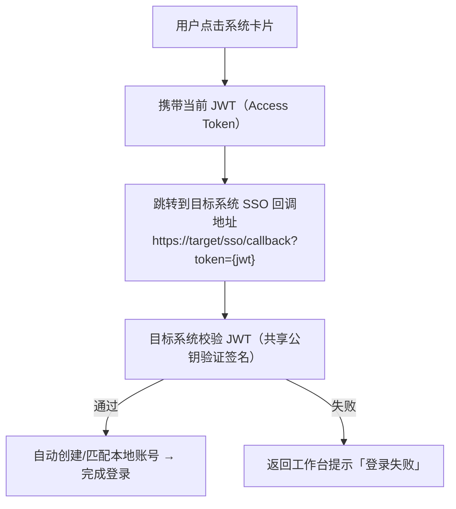
```mermaid
flowchart TD
    A["用户点击系统卡片"] --> B["携带当前 JWT（Access Token）"]
    B --> C["跳转到目标系统 SSO 回调地址<br/>https://target/sso/callback?token={jwt}"]
    C --> D["目标系统校验 JWT（共享公钥验证签名）"]
    D -->|通过| E["自动创建/匹配本地账号 → 完成登录"]
    D -->|失败| F["返回工作台提示「登录失败」"]
```

**后台配置**：系统名称 / Logo / 跳转地址 / 免登开关 / SSO 回调 / 分类 / 排序，配置实时生效。

**异常处理**：

| 场景 | 表现 |
|------|------|
| 目标系统不可用 | Toast「[系统名] 暂不可用，请稍后重试」 |
| SSO 校验失败 | 目标系统返回错误页「登录失败」 |
| JWT 过期 | 自动无感刷新后重试跳转 |
| 后台未配置任何系统 | 空状态「暂无已接入的系统」 |

---

### 3.6 仪表盘入口状态（MVP 隐藏）

当前 `frontend-mvp` 原型不再提供独立仪表盘页面：路由 `/dashboards` 已重定向到 `/knowledge`，顶部导航也未展示「仪表盘」Tab。因此 MVP 阶段不要求交付独立数据看板前端。

**当前处理规则**：

| 项 | 当前原型状态 | PRD 要求 |
|----|--------------|----------|
| 顶部导航入口 | 不展示 | 不作为 MVP 验收项 |
| `/dashboards` 路由 | 重定向到 `/knowledge` | 防止旧链接进入空白页 |
| 数据看板能力 | 可作为后续工作台系统卡或二期页面接入 | 二期再定义 iframe、权限与异常态 |
| 历史截图 `03-dashboard.png` | 仅保留为旧版本资源 | 本版 PRD 不引用为当前页面 |

---

### 3.7 知识中心


知识中心是平台的核心业务 Tab，作为**统一知识库管理平台**的前端界面，提供空间文件夹管理、知识库管理、文件管理、文件预览、上传任务和基于知识库的问答能力。

#### 3.7.1 页面整体布局

多栏联动布局，用户在左侧文件树中浏览切换，中间主区展示知识库列表、文件夹内容或文件预览；点击文件后预览直接占据主视图区域，右侧可打开小智问答侧栏。


| 区域 | 定位 | 宽度 | 可见性 |
|------|------|------|--------|
| **左侧文件树** | 空间切换 + 文件夹树 + 知识库 + 文件 | `clamp(286px, 21vw, 400px)` | 默认展开，可折叠为浮动 dock |
| **中间主区** | 知识库卡片 / 文件列表 / 文件预览 | 自适应剩余宽度 | 始终显示；点击文件时切换为预览视图 |
| **小智问答侧栏** | 知识库问答助手 | `clamp(360px, 28vw, 460px)` | 点击「知识库问答」时滑入 |

**布局联动规则**：

| 状态 | 主内容区宽度调整 | 侧栏关系 |
|------|-----------------|---------|
| 无侧栏打开 | 占满剩余宽度 | — |
| 仅问答打开 | 预留问答宽度 | 问答在最右侧 |
| 预览打开 | 主区切换为文件预览 | 文件树在左，预览在主区 |
| 问答+预览同时打开 | 主区展示预览并预留问答宽度 | 文件树 + 文件预览 + 小智 |
| 预览关闭 | 关闭所有文件标签，清除 `previewDoc` | 主区回到文件管理 |
| 小智关闭 | 隐藏问答面板 | 不影响预览和当前位置 |

#### 3.7.2 左侧文件树侧栏

##### 3.7.2.1 侧栏标题区

| 元素 | 默认状态 | 交互 / 结果 |
|------|----------|-------------|
| 标题「知识中心」 | 始终显示 | 副标题「按空间和文件树浏览」|
| 折叠按钮 » | 点击后侧栏关闭为浮动 dock | 侧栏 `translate-x` 渐出；浮动 dock 出现在左上方（`fixed left-3 top-[4.75rem]`）|
| 浮动 dock（侧栏折叠后） | 3 个图标按钮：展开 » / 新建知识库 📘 / 新建文件夹 📁+「新建」 | 展开恢复侧栏；新建知识库/文件夹调用对应弹窗 |

**浮动 dock 状态表**：

| 按钮 | 操作 | 结果 |
|------|------|------|
| » 展开 | 点击展开侧栏 | 侧栏 `translate-x-0` 恢复显示 |
| 📘 新建知识库 | 触发 `openCreateModal()` | 弹出新建知识库弹窗 |
| 📁 新建文件夹 | 触发 `openCreateFolderModal()` | 弹出新建文件夹弹窗；若未选择知识库先自动选中第一个 |

##### 3.7.2.2 空间切换与文件夹树

**空间切换**：

| 元素 | 交互 | 结果 |
|------|------|------|
| 公共空间 | 点击切换 | 加载公共空间文件夹树和知识库；空间间切换时清除 `selectedKbId` 和 `activeTreeId` |
| 个人空间 | 点击切换 | 同上，按个人空间数据加载 |

**设计原因**：公共空间与个人空间的数据完全隔离，切换时清空选择态，防止显示错误的文件列表。

**空间文件夹（SpaceFolder）结构**：

```
公共空间（12 个部门文件夹）
├── 集团整体 ─── 集团制度知识库、AI项目知识库
├── 商品部 ─── 商品基础资料库
├── B2C线上 ─── 线上运营素材库
├── B2C线下 ─── 方案中心案例库
├── B2B ─── 团购预算池
├── 视觉部 ─── 视觉规范与模板库
├── 技术部 ─── 技术项目资料库
├── 财务部 ─── 财务制度资料库
├── 仓储部 ─── 仓储作业SOP库
├── 品牌部 ─── 品牌活动资料库
├── 人力中心 ─── 人力培训知识库
└── ...（按需扩展）

个人空间（3 个默认文件夹）
├── 日常工作 ─── 临时方案草稿、AI学习笔记
├── 基础知识 ─── AI学习笔记
└── 个人资料 ─── 我的客户资料、客户素材归档
```

**空间文件夹交互规则**：

| 交互 | 触发方式 | 结果 |
|------|----------|------|
| 展开/折叠 | 点击文件夹行左侧展开箭头（▸ / ▾） | `toggleSpaceFolderExpand()`：切换 `expandedTreeIds` 中该文件夹 ID 的存在状态 |
| 打开文件夹 | 点击文件夹行文字区域 | `openSpaceFolder()`：设置 `activeSpace`、清空 `selectedKbId`、清空 `previewDoc`、设置 `activeTreeId` 为该文件夹 ID、如未展开则自动展开 |
| 拖拽排序 | 鼠标悬停时显示拖动把手（⠿）；按住拖动到目标位置 | `reorderSpaceFolder()`：在 `defaultSpaceFolders[]` 数组中交换位置；`draggingSpaceFolderId` / `dragOverSpaceFolderId` 控制拖拽态样式 |
| 拖拽完成 | 鼠标释放 | `finishSpaceFolderDrag()`：清空拖拽态变量 |
| 右键菜单 | 在文件夹行空白处右键 | `openTreeBlankContextMenu()`：显示「新建知识库」选项 |

##### 3.7.2.3 文件夹树知识库节点

空间文件夹展开后，显示其包含的知识库（`kbIds` 关联），知识库是第二级文件夹节点。

**知识库节点渲染**：

| 元素 | 说明 |
|------|------|
| 知识库图标 | 📘 `BookOpen` 图标，区别于文件夹图标 📁 `Folder` |
| 知识库名称 | 如「集团制度知识库」「方案中心案例库」 |
| 展开箭头 | 如果知识库内部有文件和子文件夹，显示 ▸/▾ |
| 选中态 | `activeTreeId === node.id` 时高亮背景 |

**知识库节点交互**：

| 交互 | 触发 | 结果 |
|------|------|------|
| 展开/折叠子节点 | 点击展开箭头或双击行 | `toggleKbTreeExpand()`：切换 `expandedTreeIds`；阻止点击传播到父文件夹 |
| 打开知识库 | 点击行文字 | `selectKb(kbId)`：设置 `selectedKbId`、`activeTreeId`、展开父文件夹、清空 `previewDoc` |
| 右键菜单 | 鼠标右键 | `openKbContextMenu()`：在鼠标位置弹出上下文菜单 |

**知识库上下文菜单**（`type: 'kb'`）：

| 菜单项 | 可见条件 | 结果 |
|--------|----------|------|
| 知识库问答 | 始终可见 | `openKnowledgeQaFromKb()`：选中知识库 + 打开小智问答侧栏 |
| 收藏/取消收藏 | 始终可见 | `toggleKbPinned()`：切换 `kb.pinned` |
| 设置 | `kb.canEdit === true` | 打开知识库设置弹窗，管理文档、成员和权限 |
| 删除 | `kb.canEdit === true` | `deleteKb()`：从 `knowledgeBases[]` 移除、从 `allDocs{}` 删除、从文件树移除、若当前选中则清空 `selectedKbId`；弹出 Toast「已删除知识库：{name}」 |
| 移动到 | 始终可见 | `moveKb()`（MVP 占位） |

**命名规则**：本期不支持知识库和文件重命名，避免 Mock 原型中出现名称与文件树、主视图不同步的问题；仅支持知识库内部文件夹重命名。

##### 3.7.2.4 文件夹树文件节点

知识库展开后显示其下的文件和子文件夹。

**文件节点渲染**：

| 元素 | 说明 |
|------|------|
| 文件图标 | 按扩展名着色：PDF=红色、DOC/DOCX=蓝色、MD=紫色、TXT=灰色 |
| 文件名称 | 含扩展名，如「考勤管理制度_v3.pdf」|

**文件节点交互**：

| 交互 | 触发 | 结果 |
|------|------|------|
| 打开文件 | 点击文件行 | `openTreeRow(row)`：设置 `selectedKbId`、调用 `openPreview(doc)`、打开预览侧栏和小智 |
| 右键菜单 | 鼠标右键 | `openTreeContextMenu()`：在鼠标位置弹出上下文菜单 |

**文件右键上下文菜单**（`type: 'tree'` 且节点为 file）：

| 菜单项 | 结果 |
|--------|------|
| 预览/打开 | 打开主视图文件预览，并自动打开小智问答 |
| 删除 | `deleteTreeDoc()`：从 `allDocs[]` 移除、关闭预览（如当前查看的就是该文件）；弹出 Toast「已删除 {name}」|

**文件夹节点（知识库内部）右键上下文菜单**（`type: 'tree'` 且节点为 folder）：

| 菜单项 | 可见条件 | 结果 |
|--------|----------|------|
| 新建文件夹 | `canContextCreateFolder === true` | `openCreateFolderModalAt(node.id)`：打开新建文件夹弹窗，父级默认为当前文件夹 |
| 重命名 | 知识库内部文件夹 | `beginRenameFolder(node)`：`renamingFolderId = node.id` + 行内输入框 |
| 删除 | `canDeleteFolder(node) === true`；知识库节点需 `kb.canEdit` | `deleteTreeFolder(node)`：递归收集文件夹下所有文档并从 `allDocs[]` 删除、从文件树移除；若为知识库节点则调用 `deleteKb()`；弹出 Toast「已删除文件夹：{name}」 |

**空间文件夹空白处右键上下文菜单**（无选中节点或 `id='__root__'`）：

| 菜单项 | 结果 |
|--------|------|
| 新建知识库 | `openCreateModalAt()`：打开新建知识库弹窗，所属文件夹设为当前 |

##### 3.7.2.5 侧栏拖拽排序

**空间文件夹拖拽**：

| 阶段 | 变量 | 效果 |
|------|------|------|
| 拖拽开始 | `draggingSpaceFolderId = folder.id` | 拖动把手图标变为激活态 |
| 拖拽经过 | `dragOverSpaceFolderId = target.id` | 目标行显示拖入指示线 |
| 拖拽结束 | `reorderSpaceFolder(target)` | 在数组中 splice 交换位置，完成后清空 `drag*` 变量 |

**收藏知识库拖拽**：

| 阶段 | 变量 | 效果 |
|------|------|------|
| 拖拽开始 | `draggingFavoriteKbId = kb.id` | 收藏卡片顶部出现拖动把手 ⠿ |
| 拖拽结束 | `reorderFavoriteKb(target)` | 在 `knowledgeBases[]` 中 splice 交换位置 |

**知识库内部文件树拖拽**：

| 阶段 | 变量 / 方法 | 效果 |
|------|-------------|------|
| 拖拽开始 | `draggingTreeNodeId = row.node.id` | 文件或文件夹进入拖动态 |
| 拖拽经过 | `dragOverTreeNodeId = target.id` | 仅文件夹节点显示可投放高亮 |
| 同知识库投放 | `moveTreeNodeToFolder(target)` | 文件或文件夹移动到目标文件夹下，展开目标文件夹并保持主区联动 |
| 跨知识库投放 | `sourceKbId !== targetKbId` | 阻止移动，Toast「文件树拖拽仅支持同一知识库内移动」 |

#### 3.7.3 中间主区

左侧文件树中选择不同层级时，中间主区展示对应内容：

| 选中对象 | 中间主区展示内容 |
|----------|----------------|
| 空间文件夹（如「集团整体」） | 该文件夹下所有知识库卡片（列表/宫格） |
| 知识库（如「方案中心案例库」） | 该知识库根目录下的文件夹 + 文件列表（列表/宫格） |
| 知识库内部文件夹 | 该文件夹下的子文件夹 + 文件列表 |
| 文件 | 同上 + 右侧预览侧栏 |

##### 3.7.3.1 知识库视图（选中空间文件夹时）

**元素构成**：

| 区域 | 元素 | 状态 / 行为 |
|------|------|-------------|
| 顶部功能区 | 空间名称标题 + 搜索框（搜索知识库名称/负责人/部门） + 视图切换（列表/宫格） + 新建知识库按钮 | 搜索 `kbSearch` 实时过滤 `displayedKnowledgeBases`；视图切换在 `kbView`（list/grid）间切换 |
| 收藏知识库区 | 标题「收藏知识库」+ 横向滚动知识库卡片 | 仅当有 `pinned === true` 的知识库时显示；卡片支持拖拽排序（鼠标悬停显示 ⠿ 把手）|
| 收藏卡片 | 名称、所属部门、文档数、最近访问 | 右侧「···」菜单按钮（`openFavoriteMenu()`），点击打开二级菜单 |
| 收藏卡片二级菜单 | 取消收藏 / 知识库问答 | 点击「取消收藏」→ `toggleKbPinned()`：`kb.pinned = false`；点击「知识库问答」→ `openKnowledgeQaFromKb(kb)` |
| 全部知识库区 | 列表/宫格展示所有知识库 | 知识库项渲染：名称 + 文档数 + 负责人 + 部门 + 可见性 + 编辑权限锁 + 最近更新时间 |
| 空态 | 「当前空间暂无知识库」 | 显示空状态提示 + 新建知识库按钮 |

**知识库列表项交互**：

| 交互 | 结果 |
|------|------|
| 点击知识库名称 | `selectKb(kb.id)`：进入该知识库文件列表 |
| 右键知识库 | `openKbContextMenu()`：弹出上下文菜单（同文件树知识库菜单） |

**知识库搜索**：

```
用户输入 → 实时过滤 knowledgeBases → 匹配 name/owner/department
输入为空 → 显示当前空间/文件夹下全部知识库
无匹配 → 列表为空，不展示收藏区也不展示全部区
```

##### 3.7.3.2 文件视图（选中知识库或内部文件夹时）

**元素构成**：

| 区域 | 元素 | 状态 / 行为 |
|------|------|-------------|
| 顶部功能区 | 知识库名称 + 面包屑（当前路径） + 搜索框 + 视图切换（列表/宫格） + 上传文件按钮 | 面包屑展示当前文件夹路径；搜索 `fileSearch` 过滤文件名和文件夹名 |
| 文件夹区 | 子文件夹卡片网格（仅知识库有子文件夹时显示） | 点击进入子文件夹；右键弹出文件夹菜单 |
| 文件列表 | 表格/宫格展示文件 | 列：名称 + 格式图标（按扩展名着色） + 文件大小（Mock） + 解析状态 + 上传者 + 日期 + 操作（预览/删除） |
| 文件多选 | 勾选复选框 + 全选/取消全选 | `selectedFileIds[]` 管理已选文件；批量删除操作按钮在选中时出现 |
| 空态 | 「此知识库暂无文档」+ 上传第一个文档 | 空状态引导用户上传文件 |

**文件列表项交互**：

| 交互 | 触发 | 结果 |
|------|------|------|
| 预览文件 | 点击文件名或「预览」按钮 | `openPreview(doc)`：打开预览侧栏、添加文件标签、自动打开小智问答 |
| 勾选 | 点击复选框 | `toggleFileSelect(doc.name)`：添加/移出 `selectedFileIds[]` |
| 全选 | 点击表头复选框 | `selectAllFiles()`：全部选中 / 全部取消（toggle） |
| 右键 | 鼠标右键 | `openDocContextMenu()`：弹出文件上下文菜单 |
| 删除 | 点击删除菜单/操作 | `deleteDoc()`：从 `allDocs[]` 移除、关闭预览（如正在预览）、更新 `selectedFileIds[]`；弹出 Toast「已删除：{name}」|
| 批量删除 | 选中后点击删除按钮 | `deleteSelectedDocs()`：遍历 `selectedFileIds[]` 删除所有选中文件；弹出 Toast「已删除 N 个文件」|

**文件上下文菜单**（`type: 'doc'`）：

| 菜单项 | 结果 |
|--------|------|
| 预览 | `openPreview(doc)` |
| 删除 | `deleteDoc(doc)` |
| 导出 | `exportDoc(doc)` → `chooseExportFormat(format)`（MVP 占位） |
| 移动到 | `moveDoc(doc)` → 打开目标知识库选择弹窗（MVP 占位） |

**视图切换（列表 / 宫格）**：

| 视图 | `fileView` 值 | 展示方式 |
|------|---------------|----------|
| 列表 | `'list'` | 表格行：名称、格式图标、大小、状态标签、上传者、日期、操作按钮 |
| 宫格 | `'grid'` | 文件卡片：格式大图标 + 文件名 + 格式标签 + 状态点 |

##### 3.7.3.3 文件解析状态

| 状态 | 前端标签 | 行为 |
|------|----------|------|
| 已索引 | 绿色标签 ✓ | 可预览、可检索 |
| 解析中 | 蓝色标签 ⟳（脉冲动画）| 等待异步解析完成；不可预览全文（可预览文件名等元信息）|
| 待审核 | 黄色标签（公共空间）| 等待人工审核通过；只有审核通过后才会在对话中可检索 |
| 失败 | 红色标签 ✗ | 解析异常；可点击重试 |

**解析状态流转**：

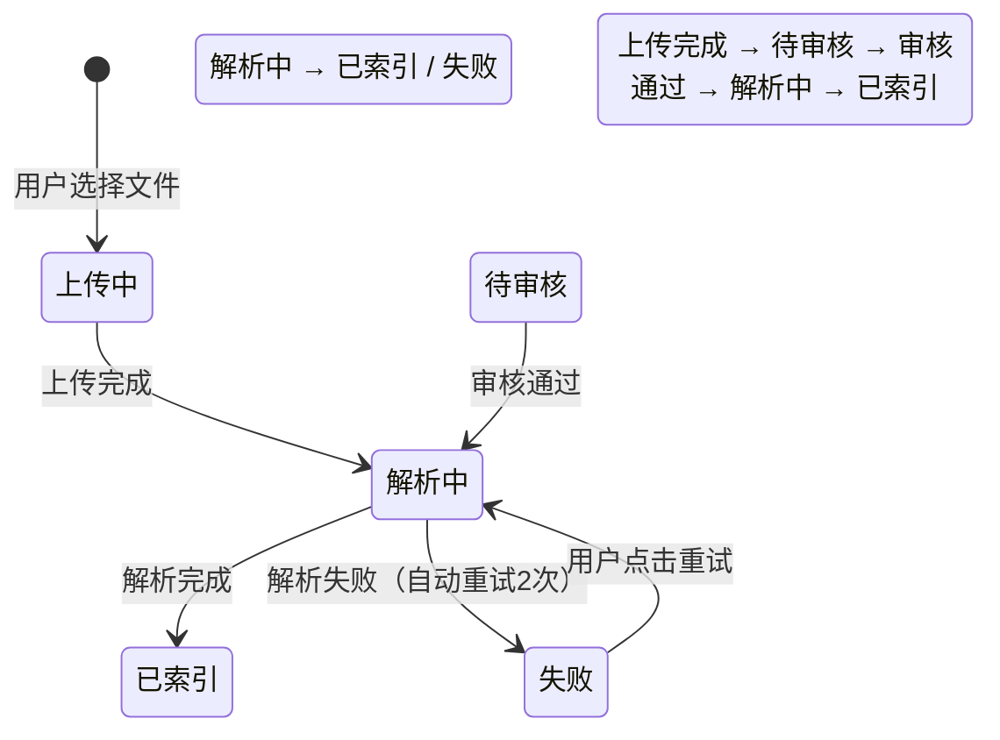
```mermaid
stateDiagram-v2
    [*] --> 上传中: 用户选择文件
    上传中 --> 解析中: 上传完成
    解析中 --> 已索引: 解析完成
    解析中 --> 失败: 解析失败（自动重试2次）
    失败 --> 解析中: 用户点击重试

    个人空间: 解析中 → 已索引 / 失败
    公共空间: 上传完成 → 待审核 → 审核通过 → 解析中 → 已索引
    待审核 --> 解析中: 审核通过
```

#### 3.7.4 新建知识库弹窗


| 元素 | 默认状态 | 交互 / 结果 |
|------|----------|-------------|
| 弹窗标题 | 「新建知识库」 | 固定显示 |
| 知识库名称输入框 | 空，Placeholder「输入知识库名称」 | 必填；保存时去除首尾空格；空值使用「未命名知识库」|
| 所属空间 | 默认当前选中空间（公共/个人） | 下拉切换，影响可见范围 |
| 所属文件夹 | 默认当前选中文件夹 | 下拉选择：展示 `createKbContainerOptions`（当前空间的默认文件夹列表）|
| 取消按钮 | 关闭弹窗 | 不创建，不清空已填写内容 |
| 创建按钮 | 蓝色主按钮 | `createKnowledgeBase()`：新建 `KnowledgeBaseItem`、同步 `allDocs[]`、加入文件树、自动展开父文件夹、自动选中新建知识库；弹出 Toast 无（静默执行） |
| 遮罩层 / 关闭按钮 | 点击关闭 | 同取消 |

**创建后自动行为**：新建的知识库自动出现在左侧文件树和中间知识库列表中，被 `pinned: false`，需用户手动收藏。

**创建校验**：

| 场景 | 行为 |
|------|------|
| 已在知识库内点击「新建知识库」 | 不打开弹窗，Toast「知识库内只能新建文件夹，不能新建知识库」|
| 名称输入只有空格 | 保存时回退为「未命名知识库」|

#### 3.7.5 新建文件夹弹窗

| 元素 | 默认状态 | 交互 / 结果 |
|------|----------|-------------|
| 弹窗标题 | 「新建文件夹」 | 固定显示 |
| 文件夹名称输入框 | 空，Placeholder「输入文件夹名称」 | 必填；空值使用「投标资料」作为默认 |
| 所属位置 | 目标知识库 + 内部文件夹路径选择器 | 展开式选择：默认当前活动文件夹或知识库根目录；支持切换知识库和展开内部文件夹层级后选择 |
| 取消按钮 | 关闭弹窗 | 不创建 |
| 创建按钮 | 蓝色主按钮 | `createFolder()`：创建 `TreeNode`、加入文件树父节点下、展开父节点、Toast「已新建文件夹：{name}，支持重命名文件夹」|

**创建校验**：

| 场景 | 行为 |
|------|------|
| 未选择知识库 | Toast「请先创建知识库后再新建文件夹」；自动选择第一个可用知识库 |
| 名称输入只有空格 | 保存时回退为「投标资料」|

#### 3.7.6 文件上传弹窗与任务卡

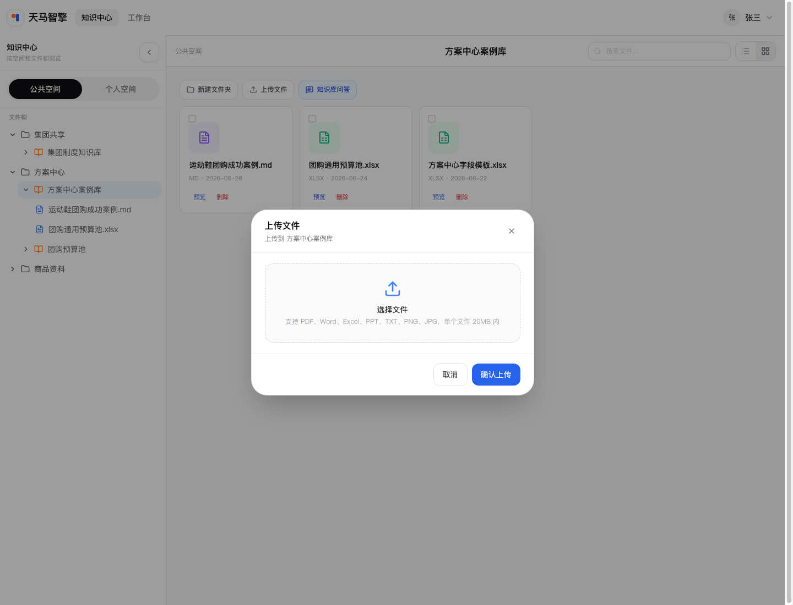

##### 3.7.6.1 上传弹窗

| 元素 | 默认状态 | 交互 / 结果 |
|------|----------|-------------|
| 弹窗标题 | 「上传文件」+ 上传目标知识库名称 | 根据当前选中的知识库动态显示 |
| 选择文件区域 | 虚线边框、上传图标、格式说明 | 点击唤起系统文件选择器；本期仅支持 PDF、DOC、DOCX、MD、TXT |
| 格式说明 | 「PDF、DOC、DOCX、MD、TXT，单个文件 20MB 内」| 作为前端校验提示 |
| 已选文件列表 | 初始为空 | 选择文件后显示文件名列表 |
| 取消按钮 | 关闭弹窗 | 不创建上传任务 |
| 确认上传按钮 | 蓝色主按钮 | `confirmUpload()`：无文件时使用默认文件「方案补充资料.pdf」「客户需求表.xlsx」创建任务；有文件时按所选文件创建 |
| 遮罩层 / 关闭按钮 | 点击弹窗外或右上角关闭 | 关闭弹窗，不影响已提交任务 |

**上传校验**：

| 场景 | 行为 |
|------|------|
| 未进入具体知识库 | Toast「请先进入具体知识库后再上传文件」；不打开弹窗 |
| 文件格式不支持 | 静默过滤，仅将支持格式加入 `uploadFileNames[]` |
| 无文件点击确认 | 使用 Mock 默认文件创建上传任务 |

##### 3.7.6.2 上传任务卡

上传确认后，在页面右下角显示小型上传任务卡浮层，最多保留 4 个：

| 元素 | 状态 | 行为 |
|------|------|------|
| 任务卡 | 上传中 / 上传成功 / 待审核 / 上传失败 | 文件名 + 进度（`uploading` 进度条）+ 状态文字 + 关闭按钮 |
| 任务状态 - `uploading` | 显示进度百分比 | — |
| 任务状态 - `success` | 绿色 ✅ | 个人空间：文件出现在知识库中，同步加入文件树 |
| 任务状态 - `reviewing` | 黄色 ⏳「待审核」| 公共空间：等待审核通过 |
| 任务状态 - `failed` | 红色 ❌ | 可重试（MVP Mock 不实现重试）|
| 关闭按钮 | 点击 | `dismissUploadTask(id)`：从 `uploadTasks[]` 移除；**不取消实际已提交的任务** |

**上传后文件树同步**：上传成功后，文件自动出现在当前知识库或当前文件夹中，加入 `fileTrees` 和 `allDocs[]`，并展开目标节点。

**公共空间审核流程**：

```
个人空间: 上传成功 → 解析中 → 已索引（自动）
公共空间: 上传成功 → 待审核 → AI辅助判断(风险/重复/分类) → 人工审核 → 解析中 → 已索引
```

- AI 辅助判断包括：风险检测（是否含敏感信息）、重复文件检测（与已有文件相似度 > 90%）、推荐分类（建议放入哪个文件夹）
- 最终发布由人工审核决定
- MVP 前期由技术部统一审核，后续按业务域交给业务知识管理员审核

#### 3.7.7 文件预览主视图

| 元素 | 默认状态 | 交互 / 结果 |
|------|----------|-------------|
| 预览标题 | 文档名称 | 文件名 |
| 文件标签栏 | 当前文件标签（高亮）+ 其他已打开文件标签 | 最多 5 个标签，点击切换文件、✕ 关闭单个标签 |
| 文件预览内容 | 文档正文预览 | 按文件格式展示 PDF（文本）、DOC/DOCX、TXT、MD 的 Mock 内容区块 |
| 文件大纲 | 章节导航 | 根据当前文件格式展示「文档摘要 / 文档概述 / 文本预览 / Markdown 结构」等章节 |
| 链接引用高亮 | 小智回答中引用文件时，`highlightedSection` 高亮对应大纲项 | 3s 后自动消除 |
| 关闭整个预览 | 预览区右上角 ✕ | `closePreviewPanel()`：清空所有 `previewTabs[]`、清除 `previewDoc` 和 `activeRightTab` |

**文件标签行为**：

| 操作 | 触发 | 结果 |
|------|------|------|
| 打开文件 | 点击文件（树节点/列表/引用） | `openPreview(doc)`：添加/前置到 `previewTabs[]`（最多 5 个），设置 `activeRightTab = doc.name`，同时打开小智侧栏 |
| 切换标签 | 点击标签 | `activeRightTab = doc.name`，`previewDoc = doc` |
| 关闭标签 | 标签 ✕ 按钮 | `closeRightTab(doc.name)`：从 `previewTabs[]` 移除；如果关闭的是当前活跃标签，切换到 `previewTabs[0]` |
| 关闭全部 | 关闭整个预览栏 | 清空所有标签 |

**预览关闭规则**：

| 场景 | 行为 |
|------|------|
| 删除正在预览的文件 | `previewDoc = null`，从 `previewTabs[]` 移除 |
| 切换空间/文件夹 | 不清除预览（仅清空选中态）|
| 批量删除含预览文件 | 同上 |

#### 3.7.8 小智问答侧栏

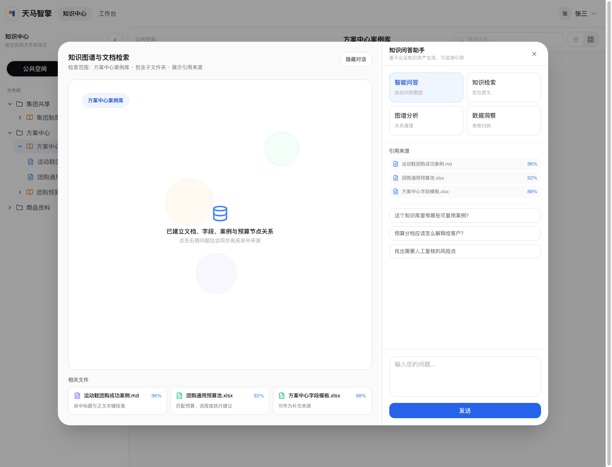

小智是知识中心内置的拟人化问答助手，用于根据当前知识库和已打开文件回答问题。文件预览占据主视图区域时，小智可在最右侧作为问答侧栏同时存在。

##### 3.7.8.1 侧栏标题区

| 元素 | 状态 | 交互 |
|------|------|------|
| 标题「小智」| 固定 | 副标题「知识库问答助手」|
| 关闭按钮 ✕ | 固定 | 关闭小智侧栏；不影响文件预览和知识中心当前位置 |

##### 3.7.8.2 模式卡

| 模式 | `qaMode` 值 | 说明 |
|------|-------------|------|
| 智能问答 | `answer` | 默认模式，基于知识库自然语言问答 |
| 知识检索 | `search` | 关键词检索知识库文件 |
| 图谱分析 | `graph` | 知识图谱关联分析（MVP 占位） |
| 数据洞察 | `insight` | 数据分析洞察（MVP 占位） |

点击切换模式高亮，影响回答组织方式。

##### 3.7.8.3 消息区

| 区域 | 状态 | 交互 |
|------|------|------|
| 引导区 | 初始时展示小智欢迎语 + 快捷问题卡片 | 发送第一条消息后自动隐藏 |
| 对话气泡 | 用户消息（右侧深色气泡）+ 小智消息（左侧浅色气泡）| 引用来源 `[[ref:N]]` 可点击跳转到文件预览 |
| 用户消息操作 | hover 显示操作按钮 | 编辑 / 复制 |
| 小智消息操作 | hover 显示操作按钮 | 复制 / 引用 / 重试 / 编辑 |

**消息操作详情**：

| 操作 | 触发 | 结果 |
|------|------|------|
| 复制 | `copyQaMessage(msg)` | 复制消息内容到剪贴板，`qaCopiedId` 高亮 2s |
| 引用 | `citeQaMessage(msg)` | 填充输入框「引用上一条回答继续：{前60字符}...」|
| 重试 | `retryQaMessage(msg)` | 截断消息到该条之前（不保留该条之后的对话），填充输入框为该条内容，自动重新发送 |
| 编辑 | `beginEditQaMessage(msg)` | 消息内显示 textarea 可编辑，点击保存或 Enter 确认后截断消息 + 自动重发 |

**来源引用解析**：小智回答中的 `[[ref:1]]` 格式文本会被 `parseQaContent()` 解析为 `{type:'ref', index: N}` 片段，渲染为可点击引用链接。点击后 `openCitationRef(N, citations[])`：

1. 高亮大纲中对应章节 3s
2. 打开该文件预览标签

**当前 `qaSources` 来源规则**：

```
来源 = 当前文件列表(filteredDocs)的前 3 个
score = 96%, 92%, 88% (硬编码递减)
reason = 根据位置分配的固定字符串
```

##### 3.7.8.4 输入区

| 元素 | 状态 | 交互 |
|------|------|------|
| 输入框 | Placeholder「问小智任何问题...」| 支持多行，`rows` 自适应（最高 8 行/192px) |
| 发送按钮 | 输入为空时置灰 | 输入非空时可点击发送 |
| Enter 发送 | 支持 | Shift+Enter 换行 |

**发送流程**（`askKnowledgeBase()`）：

1. 用户消息加入 `qaMessages[]`
2. 构造 mock 回答（含 `[[ref:N]]` 引用）和 `citations[]` 来源列表
3. 小智回答加入 `qaMessages[]`
4. 清空输入框，重置高度

**编辑后重发流程**：

```
用户编辑消息 → commitEditQaMessage()
→ msg.content = 编辑后文本
→ qaMessages.slice(0, idx+1) // 截断该条之后的所有消息
→ qaQuestion = 编辑后文本
→ askKnowledgeBase() // 重新发送
```

#### 3.7.9 操作反馈 Toast

| 属性 | 值 |
|------|-----|
| 位置 | 页面顶部居中（`fixed left-1/2 top-20`）|
| 样式 | 蓝色圆角卡片，带 ✕ 关闭按钮 |
| 持续时间 | 3s 后自动消失 |
| 最大宽度 | `min(560px, calc(100vw - 2rem))` |
| 动画 | 进入 `translate-y-0 opacity-100`，离开 `-translate-y-2 opacity-0` |

**Toast 消息清单**：

| 操作 | Toast 文案 |
|------|-----------|
| 删除文件 | 「已删除：{文件名}」|
| 批量删除 | 「已删除 N 个文件」|
| 删除知识库 | 「已删除知识库：{知识库名}」|
| 删除文件夹 | 「已删除文件夹：{文件夹名}」|
| 新建文件夹 | 「已新建文件夹：{文件名}，支持重命名文件夹」|
| 移动文件 | 「已移动 N 个文件」|
| 无法上传 | 「请先进入具体知识库后再上传文件」|
| 无法新建知识库 | 「知识库内只能新建文件夹，不能新建知识库」|
| 无法新建文件夹 | 「请先创建知识库后再新建文件夹」|

#### 3.7.10 异常与边界场景

**文件/文件夹操作**：

| 场景 | 表现 |
|------|------|
| 删除无编辑权限的知识库 | 右键菜单中「删除」不可见；调用 `deleteKb()` 检查 `canEdit`，不可编辑时直接返回 |
| 删除知识库节点时自动选中其他知识库 | 删除后 `selectedKbId` 和 `activeTreeId` 自动清空，主区回退到空间文件夹视图 |
| 文件夹跨知识库移动 | 不允许；拖拽释放时阻止并 Toast「文件树拖拽仅支持同一知识库内移动」 |
| 文件夹跨空间移动 | 不允许 |
| 文件夹移动到其他空间文件夹 | 不支持（文件夹只能在知识库内部移动） |

**上传场景**：

| 场景 | 表现 |
|------|------|
| 上传文件到空间文件夹（非知识库） | 系统提示「请先进入具体知识库后再上传文件」，不打开上传弹窗 |
| 上传格式不支持 | 文件静默过滤，不加入 `uploadFileNames[]` |
| 上传同名文件 | 不做覆盖，新旧文件共存 |
| 上传时关闭弹窗（已选文件） | 弹窗关闭，不影响已提交的正在上传的任务 |

**预览场景**：

| 场景 | 表现 |
|------|------|
| 预览标签超过 5 个 | 最旧的标签自动移除，保留最新 5 个 |
| 删除正在预览的文件 | 预览自动关闭，`previewDoc = null` |
| 切换空间后预览 | 预览不自动关闭（`previewDoc` 保留），但空间切换后主区文件列表变更 |
| 引用来源找不到对应文件 | `openSourceCitation()` 先精确匹配，再尝试部分匹配，均未找到则无操作 |

**小智问答场景**：

| 场景 | 表现 |
|------|------|
| 无知识库时打开问答 | 小智侧栏打开，但回答基于空数据 |
| 编辑消息后重试 | 截断至编辑位置，用编辑内容重新发送一次 |
| 快速连续发送 | 不会丢失消息（每次 `push` 到 `qaMessages[]`）|
| 引用跳转到已关闭预览的文件 | 先调用 `openPreview(doc)` 重新打开预览 |
| `[[ref:N]]` 索引超出 citations 范围 | `openCitationRef(N, citations)` 中 `citations[N-1]` 为 undefined 时不做跳转 |

**搜索场景**：

| 场景 | 表现 |
|------|------|
| 知识库搜索无匹配 | 中间区显示空列表，无收藏区也无全部区 |
| 文件搜索无匹配 | 隐藏文件夹区，文件区显示空态文案 |
| 搜索框清空 | 自动恢复完整列表 |

**布局场景**：

| 场景 | 表现 |
|------|------|
| 侧栏折叠后窗口宽度变化 | 浮动 dock 保持在固定位置 |
| 同时打开预览和小智的窄屏 | 文件预览 + 小智宽度固定，主内容区自适应压缩；若主内容区 < 最小宽度，合并到同一行或自动折叠 |
| 打开文件时自动打开小智（如已关闭） | 小智自动打开；再次手动关闭后，下次打开文件会再次自动打开 |

#### 3.7.11 与对话工作区附件功能的区别

| 维度 | Tab 知识中心 | 对话工作区附件弹窗 |
|------|-------------|-------------------|
| 定位 | 全功能知识管理 | 快速选择对话附件 |
| 功能 | 空间管理 / 知识库管理 / 文件夹管理 / 文件批量上传 / 文件预览 / 知识问答 | 浏览并选择知识库文档作为对话上下文 |
| 使用场景 | 知识库管理员日常维护、用户文件管理 | 对话中临时查阅资料并引用 |
| 入口 | 顶部 Tab 导航 | 输入框附件按钮 |
| 文件操作 | 上传 / 移动 / 删除 / 预览 / 导出 / 批量处理 | 仅选择 / 取消选择 |

### 3.8 建议箱（反馈后台）

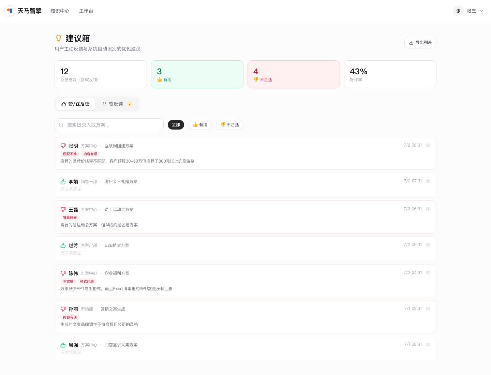

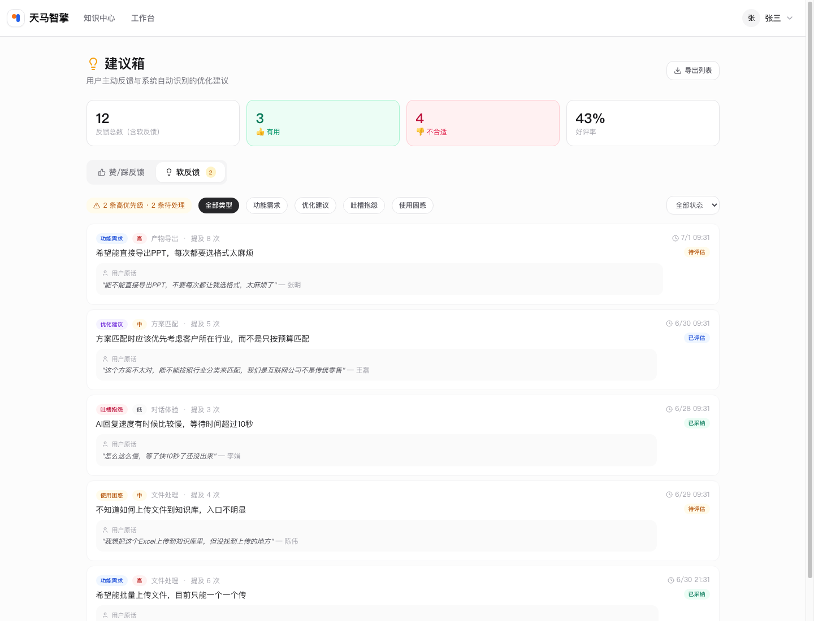

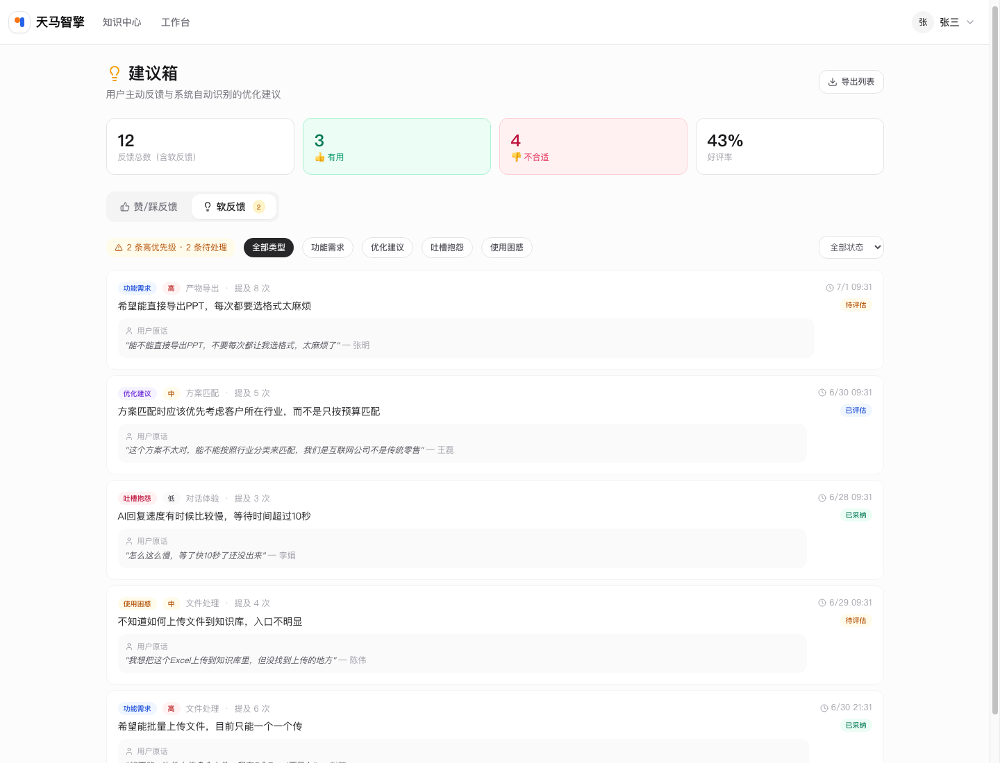

当前 MVP 原型已提供 `/admin/feedback` 反馈后台页面，用于管理员和方案专家查看硬反馈（赞/踩）与软反馈（AI 自动识别的优化建议）。用户侧仍不单独建设「建议箱」入口，反馈从对话页赞/踩、用户追问与软反馈识别链路自动归集。

**页面结构**：

| 区域 | 可见元素 | 行为 |
|------|----------|------|
| 页面头部 | 标题「建议箱」+ 说明 + 导出列表按钮 | 点击导出按钮生成当前筛选结果 CSV |
| 统计卡 | 反馈总数、有用、不合适、好评率 | 按当前 Mock 数据展示；真实接入后由 API 聚合 |
| Tab 切换 | 赞/踩反馈、软反馈 + 待处理数量 | 点击切换列表类型 |
| 赞/踩筛选 | 搜索框、全部、有用、不合适 | 搜索提交人/方案/备注；筛选类型实时更新列表 |
| 硬反馈列表 | 用户、部门、方案、原因标签、备注、时间、查看图标 | 点击整条记录打开详情弹窗 |
| 软反馈筛选 | 类型筛选、状态下拉、高优先级提示 | 支持按功能需求/优化建议/吐槽抱怨/使用困惑及处理状态过滤 |
| 软反馈列表 | 类型、优先级、模块、提及次数、摘要、用户原话、状态 | 用于产品评估与需求池沉淀 |
| 空态 | 「暂无反馈记录」/「暂无软反馈」 | 当前筛选无结果时展示 |

**反馈详情弹窗规则**：

| 元素 | 内容 | 交互 / 状态 |
|------|------|-------------|
| 弹窗标题 | 「反馈详情」+ 用户、部门、时间 | 右上角关闭按钮或底部关闭按钮关闭 |
| 关联方案 | 反馈对应方案名称 | 只读展示 |
| 反馈类型 | 有用 / 不合适 + 原因标签 | 不合适反馈展示多原因标签 |
| 文字备注 | 用户补充说明 | 无备注时不展示该区块 |
| 对话上下文 | 用户输入与 AI 回复预览 | 用于人工复核反馈有效性 |

**反馈后台查询 API**：

```
GET /api/admin/feedback
  ?type=like|dislike|soft
  &date_from=&date_to=
  &user_id=&page=&limit=
→ 返回列表，支持分页和筛选

GET /api/admin/feedback/:id/detail
→ 返回反馈详情 + 完整对话历史 + 关联方案
```

### 3.9 已建视图与原型覆盖矩阵

`frontend-mvp/src/views/` 下共 25 个视图文件。PRD §3.1–§3.8 与 §3.0 截图仅覆盖「原型路由已绑定」的页面，下表登记全部视图的实际接入状态与资料覆盖情况，便于后续迭代定点补齐。

| 视图文件 | 对应路由 / 接入方式 | PRD 覆盖 | 截图 | 当前状态说明 |
|----------|---------------------|----------|------|--------------|
| `LoginView.vue` | `/auth/login` | §3.1.1 / §3.0 | `00-login.png` | 正常 |
| `HomeView.vue` | `/` | §3.1 | `01-home-initial.png` / `01b-home-sidebar-open.png` | 正常 |
| `WorkspaceChatView.vue` | `/workspace/chat` | §3.1 / §3.2 | `06-conversation-view.png` | 正常 |
| `WorkspaceView.vue` | 未接入路由（独立老版工作区） | — | — | 保留但入口已通过 MVP 工作会话取代 |
| `SystemPortalsView.vue` | `/portals` | §3.5 | `02-workbench.png` / `02b-workbench-empty.png` | 正常 |
| `KnowledgeBaseView.vue` | `/knowledge`；`/dashboards` 重定向至此 | §3.4 / §3.7 | `04-knowledge.png` / `04b` / `04c` | 正常 |
| `FeedbackAdminView.vue` | `/admin/feedback` | §3.8 | `05-feedback.png` / `05b` / `05c` | 正常 |
| `ProfileView.vue` | 无独立路由（由用户菜单模态调用） | §3.1.1 用户菜单 | `07b-profile-modal.png` | 仅模态形式接入 |
| `DashboardView.vue` | 已移除（`/dashboards` → `/knowledge`） | §3.6 | `03-dashboard.png`（历史） | MVP 入口隐藏 |
| `DataDashboardsView.vue` | 未接入路由 | — | — | 41 行占位组件 |
| `AgentMarketView.vue` | 未接入路由 | — | — | 已建（916 行） |
| `SkillMarketView.vue` | 未接入路由 | — | — | 已建（405 行） |
| `CompetitorIntelView.vue` | 未接入路由 | — | — | 已建（91 行） |
| `CourseListView.vue` | 未接入路由 | — | — | 已建（485 行） |
| `CourseDetailView.vue` | 未接入路由 | — | — | 已建（70 行） |
| `NewsListView.vue` | 未接入路由 | — | — | 已建（254 行） |
| `ArticleDetailView.vue` | 未接入路由 | — | — | 已建（190 行） |
| `RankingView.vue` | 未接入路由 | — | — | 已建（198 行） |
| `DemandListView.vue` | 未接入路由 | — | — | 已建（548 行） |
| `DemandDetailView.vue` | 未接入路由 | — | — | 已建（254 行） |
| `DemandCreateView.vue` | 未接入路由 | — | — | 已建（329 行） |
| `ChatBICreateView.vue` | 未接入路由 | — | — | 已建（384 行） |
| `ModelUsageView.vue` | 未接入路由 | — | — | 已建（373 行） |
| `MyTasksView.vue` | 未接入路由 | — | — | 已建（657 行） |
| `AdminConsoleView.vue` | 未接入路由 | — | — | 已建（699 行） |

**后续动作建议**：按业务优先级把 `Demand*`、`Course*`、`MyTasksView`、`AgentMarketView`、`SkillMarketView`、`AdminConsoleView` 等视图接入原型路由并补齐 §3.x 小节与截图；其余视图如确认废弃可直接移除，避免与 PRD 脱节。

---

## 四、核心功能模块详解

### 4.1 统一身份认证模块

#### 4.1.1 双登录方式

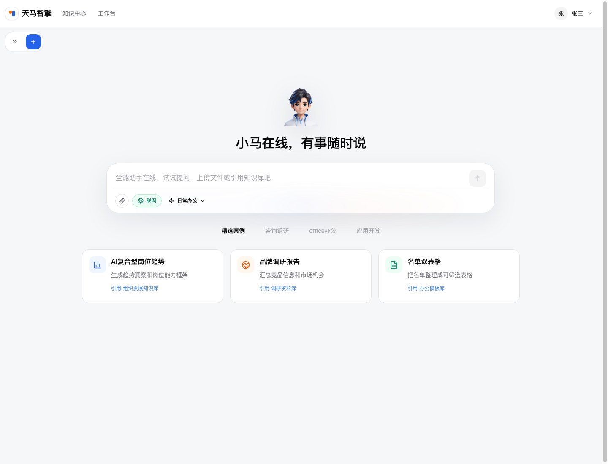

**登录页当前原型元素**：

| 区域 | 元素 | 交互 / 状态 |
|------|------|-------------|
| 左侧品牌面板 | Logo「天马AI」、标题「AI 驱动全员进化」、集团说明、三条价值点、版权 | 桌面端显示；移动端隐藏为顶部小 Logo |
| 右侧登录面板 | 标题「钉钉扫码登录」+ 说明「使用钉钉 App 扫描下方二维码」 | 默认展示二维码登录方式 |
| 钉钉二维码组件 | 二维码 / Demo 模拟登录入口 | Demo 中点击二维码或「模拟扫码登录」后写入 Mock 用户并跳转原目标页 |
| 服务条款 / 隐私政策 | 文本链接 | 当前为原型占位，无实际跳转 |
| Demo 提示 | 「点击二维码或模拟扫码登录即可进入」 | 仅 Demo 展示，生产环境移除 |

**方式一：钉钉扫码登录（OAuth 2.0 授权码模式）**

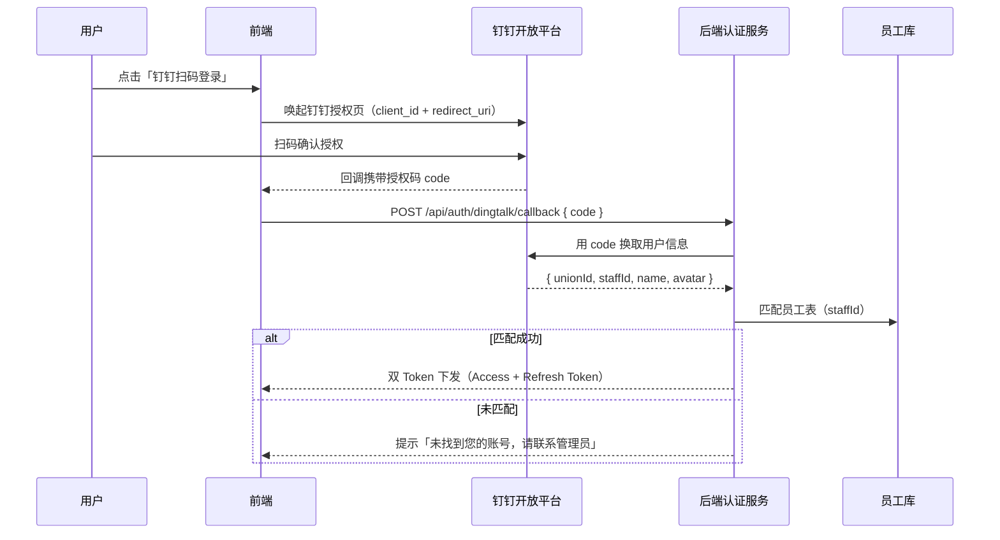
```mermaid
sequenceDiagram
    participant User as 用户
    participant FE as 前端
    participant DT as 钉钉开放平台
    participant API as 后端认证服务
    participant DB as 员工库

    User->>FE: 点击「钉钉扫码登录」
    FE->>DT: 唤起钉钉授权页（client_id + redirect_uri）
    User->>DT: 扫码确认授权
    DT-->>FE: 回调携带授权码 code
    FE->>API: POST /api/auth/dingtalk/callback { code }
    API->>DT: 用 code 换取用户信息
    DT-->>API: { unionId, staffId, name, avatar }
    API->>DB: 匹配员工表（staffId）
    alt 匹配成功
        API-->>FE: 双 Token 下发（Access + Refresh Token）
    else 未匹配
        API-->>FE: 提示「未找到您的账号，请联系管理员」
    end
```

**方式二：账号密码 + 验证码登录**：工号 + 密码 + 短信验证码，作为无法使用钉钉的兜底场景。

**设计原因**：钉钉是企业内部通讯工具，员工已习惯钉钉扫码，零额外认知成本；账号密码作为兜底，应对非钉钉场景。

#### 4.1.2 双 Token 与无感刷新

| Token | 存储位置 | 有效期 | 作用 |
|-------|----------|--------|------|
| Access Token | HttpOnly Cookie | 2 小时 | 接口调用身份凭证 |
| Refresh Token | HttpOnly 加密 Cookie | 7 天 | 换取新 Access Token |

**无感刷新机制**：

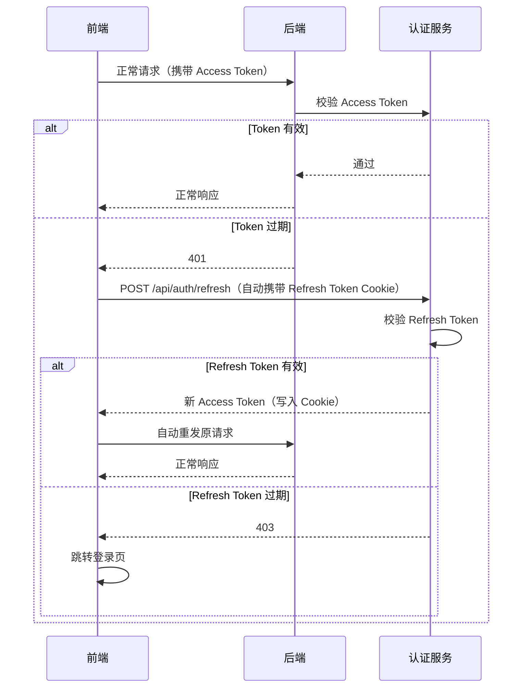
```mermaid
sequenceDiagram
    participant FE as 前端
    participant API as 后端
    participant Auth as 认证服务

    FE->>API: 正常请求（携带 Access Token）
    API->>Auth: 校验 Access Token
    alt Token 有效
        Auth-->>API: 通过
        API-->>FE: 正常响应
    else Token 过期
        API-->>FE: 401
        FE->>Auth: POST /api/auth/refresh（自动携带 Refresh Token Cookie）
        Auth->>Auth: 校验 Refresh Token
        alt Refresh Token 有效
            Auth-->>FE: 新 Access Token（写入 Cookie）
            FE->>API: 自动重发原请求
            API-->>FE: 正常响应
        else Refresh Token 过期
            Auth-->>FE: 403
            FE->>FE: 跳转登录页
        end
    end
```

**设计原因**：HttpOnly Cookie 防止 XSS 窃取 Token；双 Token 机制避免每次请求都校验密码，短有效期 Access Token + 长有效期 Refresh Token 平衡安全与体验。

**触发重新登录的场景**：

| 场景 | 前端表现 |
|------|----------|
| Refresh Token 过期（1 天未访问） | 跳转登录页「登录已过期，请重新登录」 |
| 用户主动退出登录 | 清除 Token，跳转登录页 |
| 账号被禁用/密码修改 | 提示「账号已被禁用，请联系管理员」 |
| 管理员强制下线 | 提示「您的账号已被管理员下线」 |

#### 4.1.3 权限体系

基于 RBAC 角色权限模型，三层映射：`用户 → 角色 → 权限点`

**预设角色**：

| 角色 | 权限范围 |
|------|----------|
| 普通员工 | 登录、通用问答（日常办公模式）、系统门户访问、数据看板查看 |
| 方案专员 | 普通员工 + 专家模式 + 方案中心知识库 + 文件上传 |
| 管理员 | 全部权限 + 反馈后台 + 用户管理 + 系统配置 + 公共知识库管理 |

**数据隔离**：所有对话、文件、方案数据携带部门 ID 标签，查询时自动过滤。

**接口权限**：高危接口（方案管理、后台配置）仅管理员可调用，中间件层校验。

---

### 4.2 记忆与上下文模块

#### 4.2.1 三层记忆架构

| 层级 | 别称 | 作用 | 存储 | 生命周期 | 形态 |
|------|------|------|------|----------|------|
| **瞬时工作记忆** | Working Memory | 当前会话窗口的全部上下文 | Redis（热数据） | 会话活跃期间，结束后清理 | 完整原始消息文本 |
| **短期会话记忆** | Session Memory | 全量对话历史记录，永久留存 | MySQL | 永久留存 | 原始消息 + 结构化元数据 |
| **长期语义记忆** | Semantic Memory | 提炼的核心事实、用户偏好、业务约定，跨会话复用 | MySQL + 向量库 | 永久，支持自然衰减 | 精炼摘要 + Embedding 向量 |

**三层记忆对比（通俗理解）**：

- **瞬时记忆** = 人的「当前意识」：容量有限（模型窗口大小），用完就忘
- **短期记忆** = 人的「日记本」：完整记录每一天发生了什么，随时翻看
- **长期记忆** = 人的「经验与知识」：从经历中提炼规律、偏好，以后直接用

**设计原因**：三层分离让「对话体验」「历史回溯」「个性化」三个需求互不干扰。瞬时记忆保证对话流畅，短期记忆支持历史回看，长期记忆实现越用越懂用户。

#### 4.2.2 上下文压缩（超窗口自动管理）

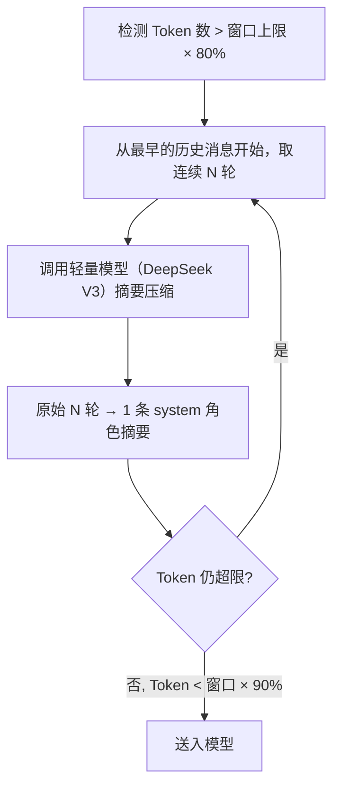
```mermaid
flowchart TD
    A["检测 Token 数 > 窗口上限 × 80%"] --> B["从最早的历史消息开始，取连续 N 轮"]
    B --> C["调用轻量模型（DeepSeek V3）摘要压缩"]
    C --> D["原始 N 轮 → 1 条 system 角色摘要"]
    D --> E{"Token 仍超限?"}
    E -->|是| B
    E -->|否, Token < 窗口 × 90%| F["送入模型"]
```

**上下文组装优先级**（从高到低裁剪）：

```
🥇 系统提示词（角色、规则、输出格式） → 不可裁剪
🥈 工具定义 Schema → 不可裁剪
🥉 当前用户输入 → 不可裁剪
④ 知识库召回内容 → 可裁剪（Top K ≤ 5，每片段 ≤ 512 tokens）
⑤ 长期语义记忆 → 可裁剪（Top N ≤ 5）
⑥ 历史对话消息 → 优先压缩
```

**Token 预算分配**：

| 项目 | 预算 |
|------|------|
| 系统提示词 + 工具定义 | ~2,000-4,000 tokens（固定） |
| 知识库召回 | Top K ≤ 5，每段 ≤ 512 tokens |
| 长期语义记忆 | Top N ≤ 5 |
| 历史消息 + 压缩摘要 | 模型窗口剩余 90% |
| 模型输出预留 | 剩余 10%（max_tokens） |

**压缩前后对比**：

| 维度 | 压缩前 | 压缩后 |
|------|--------|--------|
| Token 占用 | 6 轮原始对话 ≈ 2,000-4,000 tokens | 1 条摘要 ≈ 200-500 tokens |
| 信息完整度 | 100% | ~90%（核心事实保留） |

**设计原因**：模型窗口有限（DeepSeek R1 128K），长对话必须压缩。采用渐进式压缩方案——先压缩最早的历史消息、逐轮推进，用户无感知。压缩后的摘要保留关键事实，丢失的细节用户可以通过追问让 AI 重新查。

#### 4.2.3 记忆开关

- 记忆开关控制的是**跨会话长期记忆**，不是单次对话的上下文理解
- **开启**（默认）：对话结束后提炼记忆，新对话自动召回相关记忆
- **关闭**：当前对话不留长期记忆痕迹，新对话完全不召回历史
- 管理员可在后台对敏感部门强制关闭长期记忆
- 支持一键清空所有记忆数据，满足审计与合规要求

#### 4.2.4 存储测算

| 指标 | 数值 |
|------|------|
| 单条消息 | ~1KB |
| 单轮对话（~3 条消息） | ~3KB |
| 2000 用户 × 10 轮/天 | ~60MB/天 |
| 年全量对话 | ~22GB |
| 长期记忆年增量 | ~2.5GB |

**冷热分离策略**：

| 数据等级 | 时间范围 | 存储 |
|----------|----------|------|
| 热数据 | 30天内 | MySQL + Redis 缓存 |
| 温数据 | 30天 - 1年 | MySQL（移除缓存） |
| 冷数据 | 1年以上 | OSS 冷存储，数据库仅存索引 |

---

### 4.3 文件解析与知识库模块

#### 4.3.1 多格式解析技术选型

| 格式 | 解析工具 | 处理逻辑 |
|------|----------|----------|
| DOCX | python-docx | 提取标题、正文、表格，按层级转 Markdown |
| XLSX | openpyxl + pandas | 逐 Sheet 读取单元格，转 Markdown 表格 |
| PPTX | python-pptx | 提取每页标题、正文、备注，按分页转 Markdown |
| 文字版 PDF | PyMuPDF | 逐页提取文本、表格，还原排版转 Markdown |
| PNG/JPG | DeepSeek VLM OCR | 大视觉模型识别文字、表格、版面结构 |
| TXT | 原生读取 | 编码自动识别（UTF-8 → GBK → GB2312） |

**设计原则**：优先用成熟的开源库提取结构化文本，VLM OCR 做图片类文件的识别兜底。所有解析结果统一转为 Markdown 格式，上下层无需关心原始格式差异。

#### 4.3.2 安全校验机制

**文件头魔数校验**：读取文件开头二进制魔数，识别真实格式。修改文件后缀只改变文件名，魔数不变，可精准检测改后缀上传的恶意文件。

**ClamAV 病毒扫描**：文件合并完成后调用开源杀毒引擎扫描，阳性直接删除并记录安全日志。

#### 4.3.3 异步消息队列处理

```
上传 → 异步入队 → Worker 池（可横向扩展）→ 解析 → 向量化 → 入库
         ↑
    固定数量 Worker，并发高峰排队
    解析失败自动重试 2 次
```

**设计原因**：文件解析是 CPU 密集型操作，同步阻塞会拖慢对话响应。消息队列解耦上传和解析，Worker 池控制并发，高峰排队而非崩溃。

#### 4.3.4 统一知识库平台原理

**核心原则：不做独立知识库，做统一知识库平台**

不同业务场景的知识库（方案匹配库、直播话术库、考勤规定库等）本质完全相同：文档上传 → 向量化存储 → 语义检索。不应为每个业务建立独立实体，而是在统一平台上通过标签、权限、分类实现差异化访问。

**统一架构**：

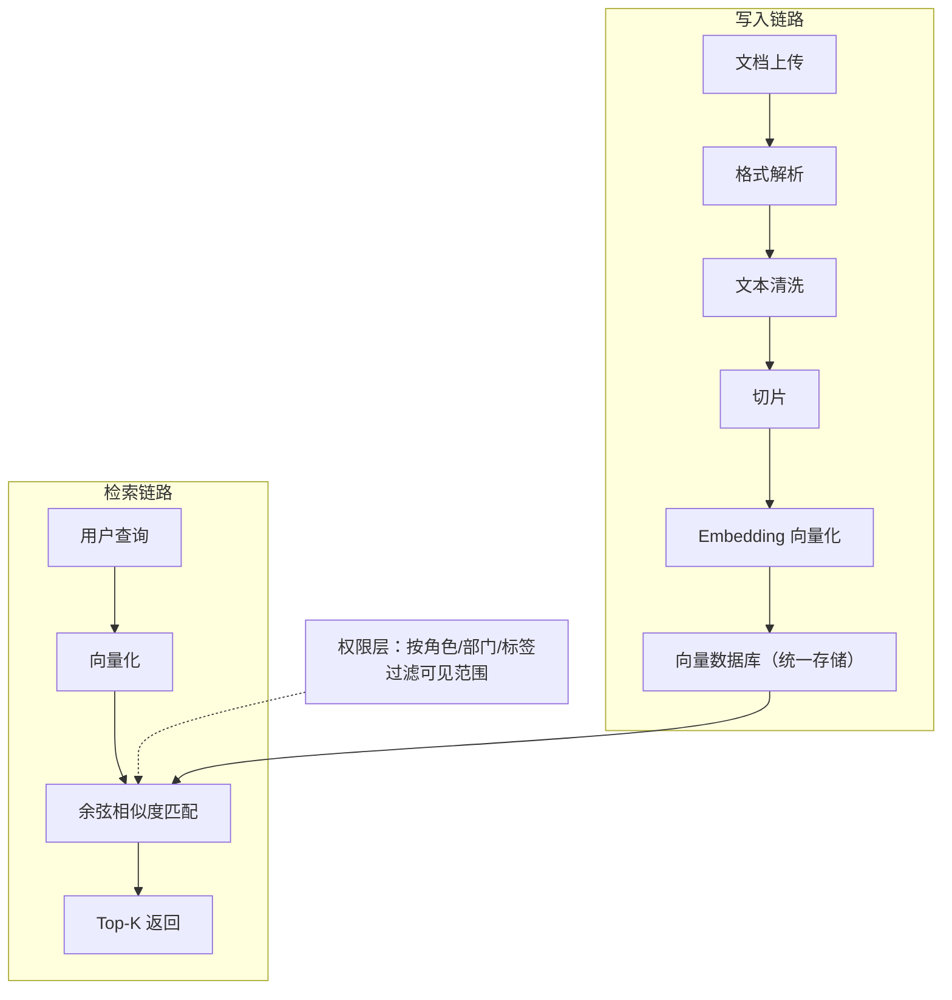
```mermaid
flowchart TB
    subgraph Ingest["写入链路"]
        A["文档上传"] --> B["格式解析"]
        B --> C["文本清洗"]
        C --> D["切片"]
        D --> E["Embedding 向量化"]
        E --> F["向量数据库（统一存储）"]
    end

    subgraph Query["检索链路"]
        G["用户查询"] --> H["向量化"]
        H --> I["余弦相似度匹配"]
        I --> J["Top-K 返回"]
    end

    F --> I
    K["权限层：按角色/部门/标签<br/>过滤可见范围"] -.-> I
```

**区分方式**（不是独立建库，而是打标签 + 设权限）：

| 区分维度 | 实现方式 | 示例 |
|----------|----------|------|
| 公开 vs 私有 | `visibility` 字段 | 考勤规定=public；定制方案=department 可见 |
| 业务分类 | `tags` 标签数组 | 上传时打标签，检索时过滤 |
| 角色授权 | `capability_permissions` 表 | seed_user 可检索方案池；全员可检索通用知识 |
| 部门归属 | `department_id` 字段 | 营销中心的知识仅营销部门默认可见 |

**技术原理简要说明**：
- 文本经分词后转化为向量（如 1024 维 Embedding）
- 匹配过程：向量夹角越小（余弦相似度越高），语义相关性越高
- 机器无法直接理解文字，需将语义转化为数学表达（向量）再处理

**知识图谱三元组**（二期增强，MVP 预留）：
- 结构化字段自动生成基础三元组，准确率 100%
- 非结构化文档通过大模型抽取深层关系，人工审核后入库
- 实体类型：方案、行业、场景、功能模块；关系类型：属于、适配、包含

---

### 4.4 多模型网关模块

#### 4.4.1 统一接入层

- 统一 OpenAI 协议接入所有商用模型：DeepSeek 系列、豆包系列、通义千问等
- 配置化管理模型密钥、价格、参数，新增模型无需改代码
- 前端不暴露模型选择器，用户只选择模式与智能体；模型由后端自动路由

**前端展示规则**：

- 输入框工具栏仅展示：上传文件、联网开关、模式切换、专家/周期配置、发送按钮
- 日常办公由系统优先选择低延迟模型与 RAG 链路
- 专家模式由系统优先选择适合 P&E 推理和工具调用的模型
- 定时任务由任务类型决定执行链路与模型，不要求用户理解模型差异

#### 4.4.2 场景化自动路由

后端根据任务类型自动选择最优模型，平衡效果与成本：

```mermaid
flowchart TD
    A["用户发送消息"] --> B["Agent引擎判断 mode"]
    B -->|"DailyOffice"| C["路由到 DeepSeek V3（日常办公）"]
    B -->|"Expert"| D["路由到 DeepSeek R1（专家模式）"]
    C --> E{"触发 Web Search?"}
    E -->|是| F["调用搜索引擎 → 结果注入 Prompt"]
    E -->|否| G["直接模型回答"]
    F --> H["流式输出"]
    G --> H
    D --> H
    H --> I{"模型可用?"}
    I -->|"DeepSeek R1 不可用"| J["切换 DeepSeek V3（能力降级但不断链）"]
    I -->|"DeepSeek V3 不可用"| K["切换通义千问（兜底）"]
    I -->|"全部不可用"| L["返回错误提示"]
```

**场景-模型映射表**：

| 场景 | 默认模型 | 选型理由 |
|------|----------|----------|
| 日常办公通用问答 | DeepSeek V3 | 性价比高，响应快 |
| 日常办公 Web Search | DeepSeek V3 + 搜索引擎 API | 联网检索后整理答案 |
| 专家模式方案推理 | DeepSeek R1 | 深度思考能力强，复杂推理准确率高 |
| 信息抽取 / 摘要总结 | 轻量通用模型 | 简单任务降本 |
| 上下文压缩 / 记忆提炼 | DeepSeek V3 | 性价比高，摘要效果好 |
| 向量化 Embedding | 商用 Embedding API | 中文效果好，成本极低 |
| OCR 图片识别 | DeepSeek VLM | 大模型 OCR 准确率高 |

**设计原因**：不同任务对模型能力要求不同——简单问答不需要 R1 的深度推理；而方案匹配需要强大的复杂推理能力。场景化路由在效果和成本之间取得平衡，且具备自动降级能力，不会因为单一模型不可用就完全不可用。

#### 4.4.3 模型异常处理

| 场景 | 内部代码 | 用户提示 | 自动恢复行为 |
|------|----------|----------|-------------|
| API Key 无效 | `LLM_AUTH_ERROR` | 「AI 服务暂时不可用，已通知管理员」 | 记录 critical 日志 |
| 模型超时（60s） | `LLM_TIMEOUT` | 「服务繁忙，请稍后重试」 | 自动重试 1 次 |
| 模型限流（429） | `LLM_RATE_LIMITED` | 「使用人数较多，请稍候...」 | 排队等待，10s 后重试 |
| 内容安全拦截 | `LLM_CONTENT_FILTER` | 「内容生成受限，请调整输入」 | 不保存违规内容 |
| 模型返回截断 | `LLM_TRUNCATED` | 「回答较长，已截断」 | 标注 truncated |
| 主模型不可用 | — | 用户无感知 | 自动切换备选模型 |

#### 4.4.4 成本管控

- 多维度统计：按部门、用户、场景、模型统计 Token 消耗与费用
- 额度控制：支持按部门设置月度额度，超额度限流
- 异常告警：单日消耗超阈值自动告警

---

### 4.5 钉钉 MCP 集成模块

#### 4.5.1 架构原理

通过钉钉官方 `dingtalk-mcp` 中间件（基于 Model Context Protocol），将钉钉开放平台企业 API 封装为 LLM 可直接调用的标准化工具。

**接入方式**：

```json
{
  "mcpServers": {
    "dingtalk": {
      "command": "npx",
      "args": ["-y", "dingtalk-mcp@latest"],
      "env": {
        "DINGTALK_Client_ID": "<AppKey>",
        "DINGTALK_Client_Secret": "<AppSecret>",
        "ACTIVE_PROFILES": "ALL"
      }
    }
  }
}
```

Agent 引擎通过 MCP 协议自动发现工具列表、读取参数 Schema、执行调用并获取结果，无需为每个钉钉 API 单独编写适配代码。

#### 4.5.2 权限逻辑

**应用级凭证 + 用户级授权**双重校验：

1. 后端以企业应用身份获取全局凭证
2. 首次使用任何钉钉工具时，前端弹出钉钉 OAuth 授权弹窗 → 用户确认 → 获取授权 code
3. 后端用 code 换取用户 access_token → 加密存储至 `auth_credentials` 表
4. 后续 MCP 调用自动携带用户 token，操作权限与用户本人的钉钉权限一致
5. Token 过期自动续期，连续失败后重新弹出授权

**设计原因**：双重校验确保安全——应用凭证保证「谁在调用」，用户授权保证「有没有权调用」。不存用户密码，只存 OAuth token，符合最小权限原则。

#### 4.5.3 MVP 内置 5 大能力

| 能力 | 典型场景 | 技术链路 |
|------|----------|----------|
| 📅 创建日程/会议 | 「安排方案评审会」 | 识别意图 → 提取时间/地点/参会人 → `calendar_create` |
| ✅ 创建待办 | 「把执行步骤生成待办清单」 | 提取 action items → `todo_create` 逐条创建 |
| 📊 写入 AI 表格 | 「SPU 清单导入 AI 表格」 | 提取结构化数据 → `sheet_create` → `sheet_record_crud` |
| 📇 查询通讯录 | 「查一下张明在哪个部门」 | `user_search` → 返回员工信息 |
| 💬 工作通知 | 「方案完成后通知王总」 | `work_notice` → 发送工作通知 |

**工具三态模型**：

| 状态 | UI 展示 | Agent 行为 | 用户操作 |
|------|---------|-----------|----------|
| `enabled` | 绿色指示灯 | 在 P&E 循环中自动调用 | 左侧栏技能面板可见可管理 |
| `link_only` | 黄色指示灯 | 不调用此工具 | 点击跳转钉钉手动操作 |
| `placeholder` | 灰色指示灯 | 不调用 | 提示「功能规划中」 |

#### 4.5.4 异常处理

| 场景 | 用户提示 | 系统行为 |
|------|----------|----------|
| MCP Server 连接断开 | 「钉钉工具暂不可用，正在重连...」 | 后台自动重连（最多 3 次） |
| 单工具调用超时（>30s） | 「工具 [名称] 响应较慢，先展示已有结果」 | 工具结果异步追补；已生成文本正常展示 |
| 用户未授权 | 弹出钉钉 OAuth 授权弹窗 | 引导用户完成首次授权 |
| 用户钉钉权限不足 | 「您的钉钉账号暂无此操作权限，请联系管理员」 | 钉钉 API 返回权限错误 |
| 用户 Token 过期 | 自动刷新，用户无感知 | refresh_token 自动续期 |
| 工具返回异常数据 | 「工具返回数据异常，已记录日志」 | 记录错误详情，Agent 跳过本次结果继续推理 |

---

### 4.6 反馈与迭代模块

#### 4.6.1 双维度反馈采集

**显式反馈（实时主动）**：

| 交互 | 详情 |
|------|------|
| 👍 有用 | 点击后按钮高亮，记录 `type: like` |
| 👎 不合适 | 弹出原因选择器 → 选择原因（匹配不准/内容有误/答非所问/格式问题/其他）→ 提交 |
| 切换 | 用户可先赞后踩或先踩后赞，新提交覆盖旧 |
| 限制 | 一个用户对一条消息只能提交一次，按钮置灰 |
| 关联 | 踩+匹配不准 → 知识缺口优先级+1；踩+内容有误 → 标记人工复核 |

**隐式反馈（离线聚合，每日凌晨 2:00）**：

| 信号类型 | 正向 | 负向 |
|----------|------|------|
| 行为 | 下载导出 / 复制内容 / 连续追问 > 5 轮 / 长时间停留 | 修改后重发 / 重复提问 / 快速关闭页面（< 5s） |

**设计原因**：显式反馈用户主动告知「好不好」，但参与率低；隐式反馈通过行为信号推断满意度，补充采集面。

#### 4.6.2 数据飞轮闭环

```mermaid
flowchart LR
    A["数据采集（显式+隐式）"] --> B["清洗标注（自动去噪+分类）"]
    B --> C["优化执行（人工改方案 / 半自动改策略）"]
    C --> D["上线生效（全自动：方案重解析 / 灰度发布）"]
    D --> E["效果验证（跟踪赞踩率 / 采纳率）"]
    E --> A
```

**各环节分工**：

| 环节 | 自动化程度 | 说明 |
|------|-----------|------|
| 采集 | 全自动 | 显式+隐式全量采集 |
| 标注 | 全自动去重+分类，人工抽检 | 关联方案，生成正负样本 |
| 优化-内容 | 人工 | 方案专家修改方案内容与标签 |
| 优化-策略 | 半自动 | 优化召回规则，积累样本后微调 Reranker |
| 生效 | 全自动 | 方案更新自动重新向量化；策略灰度发布 |
| 验证 | 全自动 | 跟踪核心指标 |

#### 4.6.3 知识缺口自动沉淀

**触发条件**（任一）：
1. AI 回答中标注「不确定」或「无法确认」
2. 方案匹配所有结果低于置信度阈值（如 < 0.6）
3. 用户点踩且选择「内容有误」或「答非所问」

**处理流程**：

```mermaid
flowchart LR
    A["触发缺口"] --> B["自动记录（问题+原因+优先级）"]
    B --> C["去重合并（相似度 > 80%）"]
    C --> D["每日上午 9:00 通知方案专家"]
    D --> E["专家上传补充知识"]
    E --> F["重新解析向量化"]
    F --> G["标记 resolved → 下次命中新知识"]
```

#### 4.6.4 优化边界

- **可自动化**：数据采集 / 清洗 / 统计 / 模型训练 / 效果监控
- **必须人工**：方案内容修改 / 业务规则调整 / 优化方向决策 / 模型上线审批
- **核心原则**：业务正确性优先，AI 辅助提效，人工兜底把控

---

### 4.7 定时任务与触发器模块

**核心调度器**：基于 Cron 表达式，支持精确到分钟的定时调度，支持事件触发、条件触发两类非定时触发器。

**MVP 内置定时任务**：

| 任务名称 | Cron | 执行内容 |
|----------|------|----------|
| 每日反馈归集 | 每天 02:00 | 聚合隐式反馈，生成反馈统计报表 |
| 每日用量统计 | 每天 01:00 | 统计各部门/模型 Token 消耗 |
| 方案库增量更新 | 每天 03:00 | 同步更新的方案，重新解析向量化 |
| 过期会话归档 | 每天 04:00 | 30 天未活跃会话从缓存归档至冷存储 |
| 知识缺口通知 | 每天 09:00 | 汇总前一日新增缺口，通知方案专家 |

**事件触发器**（预留）：

| 触发器 | 触发条件 | 目标动作 |
|--------|----------|----------|
| 方案匹配失败告警 | 单日匹配失败率 > 阈值 | 通知方案专家检查方案池 |
| 用户负反馈激增 | 1 小时内负反馈 > 10 条 | 通知管理员排查 |
| 模型调用异常告警 | 错误率 > 5% | 自动切换备用模型 + 通知 |

---

### 4.8 数据埋点与统计分析

#### 4.8.1 自动采集事件

| 事件名 | 触发时机 | 携带字段 |
|--------|----------|----------|
| `page_view` | 每次路由切换 | `page_name`, `previous_page`, `tab` |
| `api_call` | 每次 API 请求完成 | `api_path`, `method`, `status_code`, `duration_ms` |
| `session_start` | 登录后首次访问 | `login_method` |
| `session_end` | 关闭页面 / 超时退出 | `session_duration_s`, `page_views_count` |

#### 4.8.2 业务事件

| 事件名 | 触发时机 |
|--------|----------|
| `search_submit` | 用户发送对话消息 |
| `message_received` | AI 回答完成 |
| `tool_called` | P&E 工具循环中工具被调用 |
| `artifact_download` | 用户下载产物 |
| `feedback_submit` | 用户提交赞/踩 |
| `file_upload` | 文件上传完成 |
| `knowledge_gap_create` | 新知识缺口被记录 |

#### 4.8.3 统计看板

| 维度 | 指标 | 下钻能力 |
|------|------|----------|
| 登录概况 | DAU/WAU/MAU、新用户数 | 按部门/角色 |
| 使用时长 | 人均会话时长、日使用时长 | 按部门/用户 |
| 对话分析 | 会话数、模式占比、轮次、完成率 | 按模式/智能体 |
| 功能使用 | 各功能使用次数排名 | 下钻到具体用户 |
| 模型消耗 | Token 用量、费用、响应时间 | 按模型/部门 |
| 反馈分析 | 赞踩比、原因分布、趋势 | 按智能体/方案 |
| 知识库 | 资产数、入库趋势、检索命中率 | 按知识库 |

---

### 4.9 软反馈与用户洞察

**定义**：区别于用户主动点击赞/踩的「硬反馈」，软反馈是指系统通过定期回顾用户聊天内容，自动识别隐含的优化建议、吐槽、功能需求等非结构化信息。

**示例**：
- 「这个方案不太对，能不能按照行业分类来匹配」→ 匹配策略优化建议
- 「能不能直接导出PPT，不要每次都选格式」→ 功能改进需求
- 「算了，我还是自己手动做吧」→ 用户流失风险

**生成流程**：

```mermaid
flowchart TD
    A["定时任务触发（每周日凌晨 3:00）"] --> B["扫描过去 7 天所有会话消息"]
    B --> C["筛选候选消息（含疑问/否定/建议词 + 长度 > 10 字符）"]
    C --> D["DeepSeek V3 逐条分析"]
    D --> E["输出结构化软反馈（类型+摘要+严重程度+关联功能）"]
    E --> F["去重合并（相似度 > 80% 合并 + 增加提及次数）"]
    F --> G["写入 soft_feedback 表"]
    G --> H["通知管理员本周新增 N 条软反馈"]
```

**后台展示字段**：

| 字段 | 说明 |
|------|------|
| 反馈类型 | 优化建议 / 功能需求 / 吐槽抱怨 / 使用困惑 |
| 问题摘要 | AI 提取的一句话概要 |
| 严重程度 | 高 / 中 / 低 |
| 关联功能 | 方案匹配 / 对话体验 / 文件处理 / 产物导出 / 钉钉集成 / 其他 |
| 提及次数 | 多少用户在不同会话中提过类似问题 |
| 原始对话 | 点击展开原文上下文 |

**管理操作**：待评估 → 已采纳 → 已回复 → 忽略

---

## 五、附录

### 5.1 术语表

| 术语 | 说明 |
|------|------|
| P&E | Plan-and-Execute，计划-执行机制 |
| RAG | Retrieval-Augmented Generation，检索增强生成 |
| MCP | Model Context Protocol，模型上下文协议 |
| JWT | JSON Web Token，身份凭证 |
| RBAC | Role-Based Access Control，基于角色的访问控制 |
| SSE | Server-Sent Events，服务端推送事件 |
| OSS | 阿里云对象存储服务 |
| Reranker | 重排序模型，对召回结果精准打分 |
| Embedding | 文本向量化，将语义转化为数学向量 |
| file-chip | 已选附件的标签式展示组件 |

### 5.2 参考文档

- 钉钉服务端 API MCP 概述：[open.dingtalk.com](https://open.dingtalk.com/document/ai-dev/dingtalk-server-api-mcp-overview)
- 钉钉 MCP 功能清单：[open.dingtalk.com](https://open.dingtalk.com/document/ai-dev/dingtalk-mcp-feature-list)
