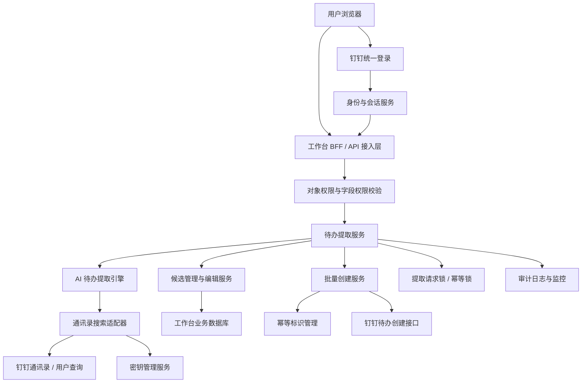
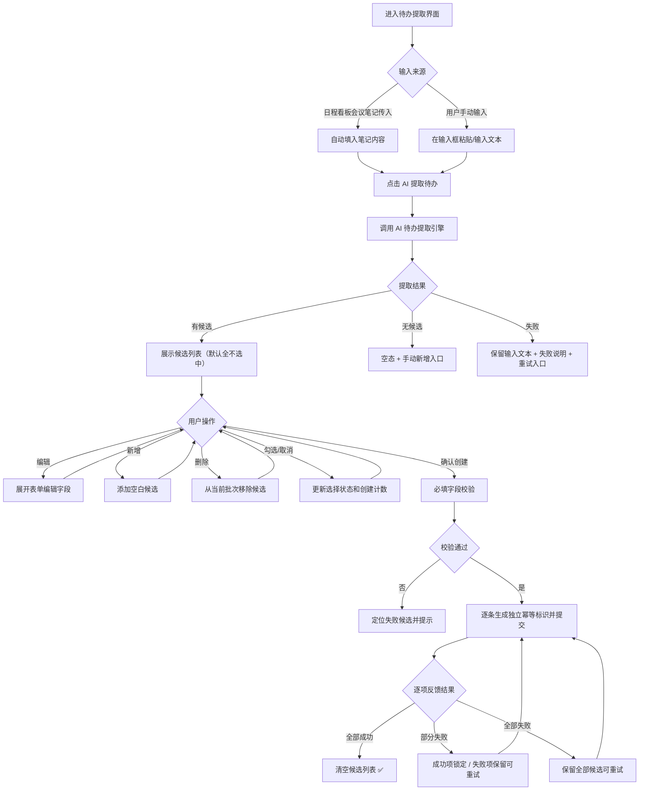
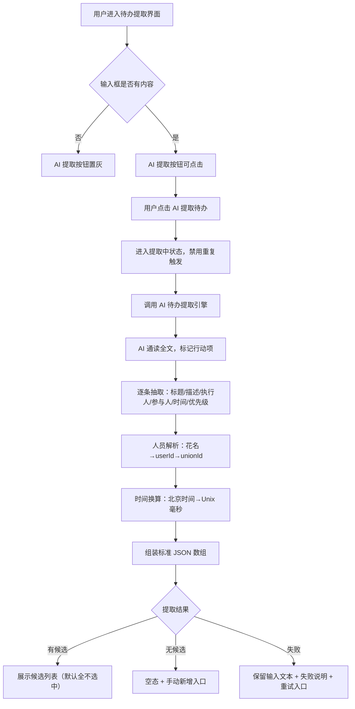
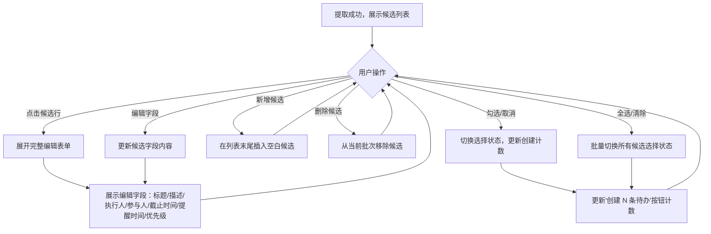
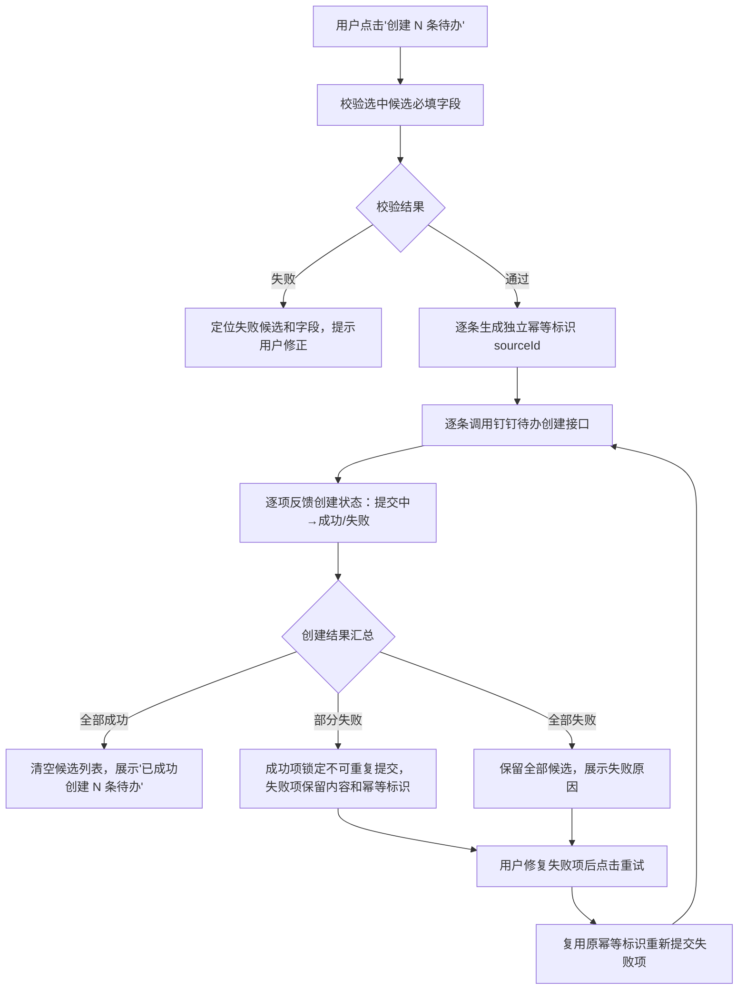

***天马智擎项目***

**产品需求说明书**


版本信息

本表用于记录本文档的维护过程，请认真填写。

| **版本号** | **时间(必填)** | **状态** | **简要描述(必填)** | **部门** | **责任产品(必填)** | **批准人** |
|-------------|------------------|----------|------------------------|----------|------------------------|-------------|
| V1.0 | 2026-07-26 | N | 输入文本生成待办 PRD，定义 AI 提取、候选审核编辑和批量创建钉钉待办 | AI项目小组 | @公输 |  |
| V1.1 | 2026-08-05 | A | 丰富文档内容：补齐技术架构图、业务流程图、各模块业务主流程图；新增系统范围与身份认证授权规则；补充与日程看板集成上下文；修正文档标题为"文本生成待办" | AI项目小组 | @公输 |  |

注：状态可以为N-新建、A-增加、M-更改、D-删除。


# 关于本文档

## 术语

| **词汇名称** | **全局说明** | **归属层** |
|----------------|----------------|-------------|
| 待办候选 | AI 从输入文本中提取的结构化行动项，含标题、执行人、截止时间等字段，尚未创建为正式待办 | 数据层 |
| 幂等标识 | 每次确认生成的服务端唯一标识，同一标识只允许成功一次，防止重复创建 | 安全层 |
| 日程看板 | 聚合展示当前用户有权访问的日程、负荷、分析结果和会议笔记入口的工作台卡片；本功能为日程看板 M5 模块提供待办提取与创建能力 | 展示层 |
| 会议笔记 | 与当前用户和单场日程绑定的可编辑笔记，支持保存、复制、粘贴；会议笔记内容可直接作为本功能的输入文本 | 业务层 |
| 输入文本 | 用户在提取待办界面输入框中粘贴或手动输入的自由文本；可来源于会议笔记、会议纪要或其他任意文本 | 数据层 |

## 参考文档

为了更好理解本文档，请阅读如下文档。

| **编号** | **文档** | **说明及地址** |
|----------|----------|-------------------|
| 1 | 原型界面参考 | https://fri555.github.io/PORTL/ |
| 2 | Figma UI设计 | https://www.figma.com/design/rRqUi2RORbhHhCnFgH2dTe/%E5%A4%A9%E9%A9%AC%E6%99%BA%E6%93%8E?node-id=0-1&p=f&t=3WOAMYQ62H2eLeQo-0 |
| 3 | AI工作台-日程看板（MVP）PRD | 日程看板主 PRD，本功能为其 M5 模块提供待办提取与创建能力。文档路径：portal/docs/需求文档/20260726-【PRD】AI工作台-日程看板（MVP）-天马智擎项目.md |

## 沟通要求

本表记录需要跨部门沟通的事项，以保证该文档内容质量。如果有其它跨部门沟通项，请填写该表中，并记录沟通结果。

| **序号** | **部门/角色** | **沟通内容** | **沟通结果** |
|----------|-----------------|----------------|----------------|
| 1 | 技术部 - 后端 | 钉钉待办创建接口的字段映射与幂等机制确认 | 待沟通 |
| 2 | 技术部 - AI | 待办提取提示词的模型选型与输出格式验收 | 待沟通 |

# 产品概述

本章节详细描述产品的背景、内容和目标等进行详细定义，关于产品定义的其它内容请阅读本产品定义说明书。

## 产品概述

文本生成待办面向管理层用户，将用户输入的文本内容，通过 AI 提取为结构化待办候选。用户可以逐条审核、编辑 AI 提取结果，选择确认的候选后一次性批量创建钉钉待办。

本功能只生成候选和创建待办，不替代钉钉待办系统。AI 提取结果必须经用户确认后才能写入待办系统。

**集成上下文**：本功能作为日程看板 M5 模块的待办提取与创建能力提供方。日程看板的会议笔记（M4）内容可直接传入本功能的输入文本框；同时本功能也支持用户独立输入任意文本进行待办提取，不限于会议场景。日程看板通过调用本功能完成"笔记→候选→待办"的行动闭环。

## 产品目标
1. **减少手工整理**：一段输入文本可同时提取多条待办候选，减少手动逐条创建
2. **用户完全控制**：所有候选必须经用户逐条审核、编辑和选择确认后才创建
3. **可靠批量创建**：多条候选一次性提交，逐项反馈成功/失败，失败项可安全重试
4. **双入口兼容**：既支持从日程看板会议笔记传入文本，也支持用户直接粘贴自由文本

## 用户角色

### **用户角色描述**

| **用户角色** | **职责描述** | **MVP范围** |
|----------------|----------------|-------------|
| 管理层用户 | 查看输入文本的 AI 提取结果，审核、编辑候选并确认创建待办 | ✅ 核心使用角色 |

### **用户故事地图**

| **用户活动** | **用户任务** | **用户故事** | **对应功能点** |
|----------------|----------------|----------------|-------------------|
| 提取待办 | 触发 AI 提取 | 作为管理层用户，我希望一键从输入文本中提取待办候选，以减少手工整理 | 3.4.1 待办提取 |
| 审核候选 | 编辑候选字段 | 作为管理层用户，我希望修改 AI 提取的标题、执行人和截止时间，以纠正误差 | 3.4.2 候选管理与编辑 |
| 审核候选 | 新增/删除候选 | 作为管理层用户，我希望手动添加 AI 遗漏的待办，或删除不合适的候选 | 3.4.2 候选管理与编辑 |
| 审核候选 | 选择/取消候选 | 作为管理层用户，我希望勾选需要创建的待办，取消不必要的项 | 3.4.2 候选管理与编辑 |
| 确认创建 | 批量创建 | 作为管理层用户，我希望一键创建所有选中的待办，并清楚知道哪些成功、哪些失败 | 3.4.3 批量创建 |
| 确认创建 | 重试失败项 | 作为管理层用户，我希望修复失败项后重新提交，而不影响已成功的待办 | 3.4.3 结果反馈 |

## 同类产品/竞品调研(选写)

### **同类产品**

| **产品/能力** | **现有优势** | **本产品定位** |
|-----------------|----------------|-------------------|
| 钉钉待办 | 完整的待办创建、分配、提醒和完成闭环 | 源系统；工作台负责提取候选和批量创建，不替代待办管理 |
| 钉钉待办 | 一次创建一条待办 | 增加用户审核确认环节和批量创建能力，减少误创建 |

### **结论**

MVP 采用「AI 提取候选 → 用户审核编辑 → 批量创建待办」方案。提取结果必须经用户确认后才能写入待办系统，所有候选使用独立幂等标识，确保可靠批量创建。

# 功能需求

## 全局通用规则

### 系统范围

| **规则项** | **说明** |
|----------|----------|
| 本期范围 | 文本输入、AI 待办提取、候选审核编辑、批量创建钉钉待办 |
| 权威数据 | 已创建待办以钉钉待办系统为准；工作台不建设第二套待办主库 |
| 输入来源 | 支持两种输入入口：①用户直接在输入框中粘贴/输入文本；②从日程看板会议笔记（M4）传入文本 |
| 用户确认 | 待办候选均须用户逐条审核、编辑和选择确认后才能写入待办系统 |
| AI 能力 | 待办提取使用附录 B 定义的系统提示词实现 |
| 批量上限 | 单次最多提取和创建 20 条待办候选 |

### 身份认证与授权

| **规则项** | **说明** |
|----------|----------|
| 门户认证 | 用户通过钉钉统一登录；授权码由服务端换取身份，前端不得自行声明用户编号 |
| 登录会话 | 服务端创建登录会话，浏览器只保存安全会话 Cookie |
| 人员解析权限 | AI 提取过程中调用通讯录搜索工具解析人员 unionId，仅返回当前用户有权查看的候选用户信息 |
| 写操作权限 | 创建待办时校验当前用户对目标执行人的待办创建权限 |
| 前端边界 | 前端传入的用户编号、执行人、可执行操作不作为最终授权依据 |

### **数据保存边界**

| **数据类型** | **保存位置** | **保存与安全约束** |
|----------------|----------------|-------------------------|
| 待办候选、提取批次、创建结果 | 工作台业务数据库 | 关联提取批次的输入文本和提取时间 |
| 已创建的钉钉待办 | 钉钉待办系统 | 源系统为权威数据 |
| 提取请求锁、幂等标识 | 受控缓存服务 | 设置有效期，按用户和批次隔离 |
| 表单临时状态、编辑未保存内容 | 浏览器会话缓存 | 退出登录后清除 |
| 输入文本草稿 | 浏览器会话缓存 | 关闭弹窗时二次确认，草稿在会话内保留；本期不做持久化存储 |

### **加载态/空态/错误态**

| **场景** | **状态** | **处理方式** |
|----------|----------|----------------|
| AI 提取中 | 加载中 | 展示提取进度指示；禁用重复触发 |
| 提取结果无候选 | 空 | 展示"未识别到明确行动项，可手动新增待办"并展示新增入口 |
| 提取失败 | 错误 | 保留输入文本和候选状态，展示失败说明和重试入口 |
| 批量创建提交中 | 加载中 | 展示逐条创建状态 |
| 批量创建全部成功 | 成功 | 展示创建成功数量和结果 |
| 批量创建部分失败 | 部分成功 | 成功项锁定不可重复提交；失败项保留内容，支持只重试失败项 |
| 人员解析失败 | 部分成功 | 未解析人员记入 unresolvedPersons，对应执行人/参与人字段置空，提示用户手动选择 |

### **并发与防重复规则**

| **规则项** | **说明** |
|-------------|----------|
| 提取 | 同时只运行一个提取请求；晚返回的结果不覆盖新的提取结果 |
| 编辑 | 多条候选的编辑状态独立保存，不影响其他候选 |
| 批量创建 | 每个候选使用独立幂等标识；同一标识只允许成功一次 |
| 重试 | 失败项重试时复用原幂等标识；成功项不可二次提交 |
| 关闭保护 | 有未完成保存请求时等待结果或明确提示，二次确认 |
| 文本修改 | 修改输入文本后重新提取时，清空当前候选列表重新提取 |

## 流程图

### **技术架构图**



### **业务流程图**



## 功能模块清单

| **需求编号** | **主功能** | **子功能** | **功能描述** | **优先级** |
|----------------|-------------|-------------|----------------|-------------|
| M1 | **待办提取** | 提取触发 | 调用 AI 待办提取，从用户输入的文本中提取结构化待办候选 | P0 |
| M1 | 待办提取 | 提取状态管理 | 管理提取中/成功/无候选/失败等状态 | P0 |
| M1 | 待办提取 | 防重复触发 | 同时仅运行一个提取请求 | P0 |
| M2 | **候选管理与编辑** | 候选列表展示 | 一行一条紧凑候选展示（标题/执行人/截止时间） | P0 |
| M2 | 候选管理与编辑 | 表单编辑 | 展开完整表单编辑（标题/描述/执行人/参与人/截止时间/优先级/提醒） | P0 |
| M2 | 候选管理与编辑 | 新增/删除 | 新增空白候选或从批次中删除候选 | P0 |
| M2 | 候选管理与编辑 | 勾选/取消 | 默认勾选字段有效的候选，支持切换选择状态 | P0 |
| M3 | **批量创建与结果反馈** | 必填校验 | 选中项必填字段校验 | P0 |
| M3 | 批量创建与结果反馈 | 幂等提交 | 每个候选生成独立幂等标识并提交 | P0 |
| M3 | 批量创建与结果反馈 | 结果反馈 | 逐项反馈创建结果（全部成功/部分失败/全部失败） | P0 |
| M3 | 批量创建与结果反馈 | 安全重试 | 失败项保留内容和幂等标识支持安全重试 | P0 |

## 功能详情

### **待办提取**

#### **功能需求描述**

| **EARS 模式** | **需求描述** |
|---------------|----------------|
| 普遍型 | 系统应支持用户对输入的文本触发 AI 提取，调用 AI 待办提取返回结构化待办候选。 |
| 状态驱动型 | 当提取成功有候选时展示候选列表；成功无候选时展示空态和手动新增入口；提取失败时展示失败说明和重试。 |
| 事件驱动型 | 当用户点击"AI 提取待办"时，系统应调用 AI 待办提取并返回结果。 |
| 不良行为型 | 系统不应在提取中允许重复触发。 |

#### **业务主流程图及说明**



流程说明：
1. 用户在输入框中输入或粘贴文本内容后，点击"AI 提取待办"按钮触发提取。
2. 提取过程中禁用重复触发，展示"AI 正在识别行动项与人员"进度提示。
3. AI 引擎通读全文，识别可执行行动项（动作+对象+责任主体+时间），逐条结构化为待办候选。
4. 人员字段通过"模糊花名搜索→userId→unionId"链路解析；无法解析的人员记入 unresolvedPersons。
5. 时间表述统一按北京时间（UTC+8）换算为 Unix 毫秒时间戳。
6. 提取成功后展示候选列表，默认全不选中，等待用户逐条审核。
7. 提取成功但无候选时展示空态和手动新增入口；提取失败时保留输入文本和已有候选，展示失败说明和重试入口。

#### **界面原型**

| **动作** | **显示** | **类型** | **描述** |
|----------|----------|----------|----------|
| 【提取待办按钮】hover | hover提示："AI提取待办" | 按钮 | · hover出现提示 **"AI提取待办"** |
| 【提取待办按钮】点击 | 跳出AI提取待办界面 | 弹窗 | · 默认界面 |
| 【输入框】输入文本 | 纯文本编辑区 | 输入框 | · 默认提示语 **"输入文本，从文本中提取待办事项"** · 从日程看板会议笔记传入时自动填入笔记内容 |
| 【AI提取待办】点击 | 没有输入内容或为空白时置灰不可点击 | 按钮 | · 未输入或输入只有空格时置灰 · 输入非空时可点击进入提取中状态 · 提取中提示语 **"AI正在识别行动项与人员"** · 提取失败提示语 **"AI提取待办遇到一些困难，请稍后重试"** · 提取结果为空提示语 **"没有提取到有效的待办事项，请检查输入内容后重试"** |
| 【关闭】点击 | 二次确认界面 | 弹窗 | · 二次确认，提示语 **"确认关闭AI生成待办？"** · 输入的文本内容作为草稿保存，再次点击显示该文本 · 未创建的待办事项清空 |

#### **数据说明（业务实体）**

| **字段名** | **数据类型** | **长度** | **默认值** | **必需** | **约束说明** |
|-------------|----------------|----------|-------------|----------|----------------|
| 输入文本 | 文本 | — | 空 | 是 | 用户输入的文本内容 |
| 提取状态 | 枚举 | — | 待提取 | 是 | 待提取、提取中、成功、失败 |
| 提取时间 | 时间戳 | — | — | 否 | 记录提取时间 |
| 结果信息 | 字符 | — | 空 | 否 | 失败时说明原因 |

#### **业务规则和约束条件**

| **规则项** | **说明** |
|-------------|----------|
| 提取输入 | 使用用户当前输入的文本；同时只运行一个提取请求 |
| 提取锁定 | 提取期间禁止重复触发；晚返回的结果不得覆盖新的提取结果 |
| 无候选 | 提取成功但无候选时展示空态和手动新增入口，不自动创建空任务 |
| 提取失败 | 保留输入文本和已有候选，展示失败说明和重试入口 |
| 提取数量 | 最多提取20条待办候选 |
| 修改文本重新提取 | 清空当前候选重新提取 |
| 人员解析 | 执行人/参与人必须解析为 unionId；无法解析的记入 unresolvedPersons，不得用姓名冒充 unionId |
| 时间换算 | 所有时间表述按北京时间（UTC+8）换算为 Unix 毫秒时间戳 |

#### **接口说明**

| **接口** | **调用方式** | **请求/响应重点** | **结果** |
|----------|----------------|-----------------------|----------|
| AI 待办提取接口 | 提取候选 | 请求输入文本内容；返回提取批次及待办候选 | 提取结果内容包含:标题（必填）、描述、执行人（默认用户）、参与人（默认用户）、截止时间、提醒时间、优先级（默认普通） |

#### **补充说明**

提示词可参考附录B。

### **候选管理与编辑**

#### **功能需求描述**

| **EARS 模式** | **需求描述** |
|---------------|----------------|
| 普遍型 | 系统应以一行一条紧凑候选展示 AI 提取结果，支持选择/取消、展开编辑、新增和删除候选。 |
| 状态驱动型 | 当候选行展开时展示完整表单（标题、描述、执行人、参与人、截止时间、优先级、提醒时间）；勾选状态实时更新"创建 N 条待办"数量。 |
| 事件驱动型 | 当用户点击候选行、编辑字段、新增、删除或勾选时，系统应展开表单、更新内容、添加/移除候选或更新选择状态。 |
| 不良行为型 | 系统不应在未保存编辑时丢失用户修改内容；取消选择不应删除候选内容。 |

#### **业务主流程图及说明**



流程说明：
1. 提取成功后展示候选列表，默认全不选中，每条候选以紧凑卡片形式展示标题、描述、DDL、负责人和优先级。
2. 用户可点击候选行展开完整编辑表单，编辑各字段内容。
3. 多条候选的编辑状态独立保存，互不影响。
4. 勾选/取消勾选只切换选择状态，不删除候选内容；实时更新"创建 N 条待办"按钮计数。
5. 新增候选在列表末尾插入空白候选，用户需填写必填字段后才可勾选。
6. 删除候选从当前批次移除，不影响原始输入文本；仅剩一条时仍允许删除。

#### **界面原型**

| **动作** | **显示** | **类型** | **描述** |
|----------|----------|----------|----------|
| 【待办候选卡片】展示 | 一行一条紧凑卡片 | 候选卡片 | · 展示：标题：描述，DDL，负责人，优先级 · 默认态全不选中 |
| 【全选/清除】点击 | 全选/清除切换 | 按钮 | · 点击全选所有候选 · 又选中时则变为清除按钮 · 再次点击清除所有选择 |
| 【勾选框】勾选/取消 | 选中/未选中切换 | 复选框 | · 切换候选的选择状态 |
| 【删除】点击 | 从当前批次移除候选 | 图标按钮 | · 不影响原始输入 |
| 【候选行/▶️】点击 | 展开/折叠候选完整表单 | 折叠面板 | · 点击展开编辑表单，再次点击折叠 |
| 【标题】输入 | 单行文本输入 | 输入框 | · 必填，限制20字符 |
| 【描述】输入 | 多行文本输入 | 文本域 | · 选填，限制4096字符 |
| 【执行人】选择/输入 | 人员候选列表 | 人员选择器 | · 从通讯录搜索选择 |
| 【参与人】删除 | 移除已选参与人 | 图标按钮 | · 删除已选的某个参与人 |
| 【参与人】选择/输入 | 人员候选列表 | 人员选择器 | · 从通讯录搜索选择 |
| 【截止时间】点击 | 日期选择组件；时间选择组件 | 日期时间选择器 | · 点击弹出日期、时间选择面板 |
| 【提醒时间】点击 | 日期选择组件；时间选择组件 | 日期时间选择器 | · 点击弹出日期、时间选择面板 |
| 【优先级】选择 | 下拉选择 | 下拉选择器 | · 选项：较低 / 普通 / 较高 / 紧急 |

#### **数据说明（业务实体）**

| **字段名** | **数据类型** | **长度** | **默认值** | **必需** | **约束说明** |
|-------------|----------------|----------|-------------|----------|----------------|
| 是否选择 | 布尔 | — | 是 | 是 | 只有选中项进入创建请求 |
| 标题\<subject\> | 字符 | ≤20 | AI 待办提取生成 | 是 | 必填，可编辑 |
| 描述\<description\> | 文本 | ≤4096 | AI 待办提取生成 | 否 | 可编辑 |
| 执行人\<executorIds\> | 文本数组 | — | AI 待办提取生成 | 否 | 文本明确时间优先；无明确执行人时预填当前用户（unionId） |
| 参与人\<participantIds\> | 文本数组 | — | 空 | 否 | 文本明确时间优先；无明确执行人时预填当前用户（unionId） |
| 截止时间\<dueTime\> | 日期时间 | — | 未来最近日期18:00 | 否 | 文本明确时间优先 |
| 提醒时间\<reminderTimeStamp\> | 截止时间 | — | 未来最近日期17:00 | 否 | 文本明确时间优先 |
| 优先级\<priority\> | 枚举 | — | 普通 | 否 | 10：较低 20：普通 30：较高 40：紧急 |
| 创建结果 | 枚举 | — | — | 否 | 提交中、成功、失败 |

#### **业务规则和约束条件**

| **规则项** | **说明** |
|-------------|----------|
| 执行人默认值 | 文本明确责任人时预填对应人员；无明确责任人时预填当前用户 |
| 截止时间默认值 | 文本明确时间时优先；无明确时间且当前时间早于 18:00 时为当天 18:00，达到或晚于 18:00 时为次日 18:00 |
| 提醒时间默认值 | 文本明确时间时优先；无明确提醒时间时取截止时间前 1 小时 |
| 选择状态 | 默认全不选中；取消选择不删除候选内容 |
| 新增候选 | 生成本地候选编号，用户填写必填字段 |
| 删除候选 | 从当前批次移除，不影响原始输入；仅剩一条时仍允许删除 |
| 多候选独立 | 每条候选的编辑状态独立保存，互不影响 |

#### **接口说明**

[查询用户详情 - 开放平台](https://open.dingtalk.com/document/development/query-user-details#)

#### **补充说明**

无。

### **批量创建与结果反馈**

#### **功能需求描述**

| **EARS 模式** | **需求描述** |
|---------------|----------------|
| 普遍型 | 系统应校验选中候选的必填字段后，逐条生成独立幂等标识并发起批量创建。创建结果逐项反馈。 |
| 状态驱动型 | 当批量创建全部成功时清空候选列表并反馈数量；部分成功时成功项锁定、失败项保留；全部失败时保留全部候选。 |
| 事件驱动型 | 当用户点击"创建 N 条待办"时，系统应执行校验、提交和结果反馈。 |
| 不良行为型 | 系统不应在字段校验失败时提交；不应允许成功项重复提交；响应未知时不得显示成功。 |

#### **业务主流程图及说明**



流程说明：
1. 用户点击"创建 N 条待办"后，系统先校验所有选中候选的必填字段（标题必填、执行人不可为空）。
2. 校验失败时定位到具体候选的具体字段，提示用户修正；校验通过后逐条生成独立幂等标识（sourceId）。
3. 逐条调用钉钉待办创建接口，每条候选独立提交，逐项反馈提交中/成功/失败状态。
4. 全部成功时清空候选列表并展示成功提示；部分失败时成功项锁定不可重复提交，失败项保留内容和幂等标识。
5. 用户修复失败项后点击重试，复用原幂等标识重新提交，确保不会重复创建。
6. 提交过程中禁用确认按钮，防止重复操作。

#### **界面原型**

| **动作** | **显示** | **类型** | **描述** |
|----------|----------|----------|----------|
| 【创建N条待办】展示 | 按钮上的计数标识 | 按钮 | · N 实时反映当前勾选数量 |
| 【创建0条待办】点击 | 置灰不可点击 | 按钮 | · 无候选被勾选时不可操作 |
| 【创建1+条待办】点击 | 可点击 | 按钮 | · 创建后本次选中的勾选框置灰不可选 |
| 【状态】显示 | 每一条待办候选任务创建状态 | 文本标签 | · 不同颜色展示状态（**成功/失败/提交中**） · 失败状态为按钮，可以点击重试 |
| 【重试按钮】点击 | 重新调用创建接口 | 按钮 | · 创建失败后支持重试 · 重新走接口 |

具体的提示说明参考前端原型为主

#### **数据说明（业务实体）**

M3 为批量创建操作，无独立业务实体。创建结果基于 M2 的待办候选实体中的"创建结果"字段反馈。

#### **业务规则和约束条件**

| **规则项** | **说明** |
|-------------|----------|
| 候选确认 | 只有选中且字段校验通过的候选可以创建 |
| 独立幂等 | 每个候选在确认时生成独立幂等标识；同一标识只允许成功一次 |
| 批量结果 | 逐项返回结果；成功项锁定不可重复提交 |
| 部分失败重试 | 失败项保留内容和幂等标识；用户修复后可重新提交失败项 |
| 重试复用幂等 | 失败项重试时复用原幂等标识，确保不会重复创建 |
| 提交中状态 | 提交过程中禁用确认按钮，防止重复操作 |
| 校验失败定位 | 具体到哪个候选的哪个字段校验失败，提供明确提示 |
| 批量上限 | 单次最多创建 20 条待办 |

#### **接口说明**

| **接口** | **调用方式** | **请求/响应重点** | **状态** |
|----------|----------------|-----------------------|----------|
| 创建待办接口 | 创建待办 | 传入待办字段（标题、描述、执行人等）和幂等标识，逐条创建 | 由后端提供，接口路径待评审 |

[创建钉钉待办任务 - 开放平台](https://open.dingtalk.com/document/development/add-dingtalk-to-do-task)

#### **补充说明**
1. 待办候选提取使用 AI 待办提取模型，提取提示词定义见附录 B。

# 非功能需求

## 性能要求

| **指标** | **目标值** | **说明** |
|----------|-------------|----------|
| AI 提取响应 | ≤3 秒（P95） | 不含文本输入耗时；超过 3 秒可展示进度 |
| 候选列表渲染 | 50 条以内无明显卡顿 | 超过 50 条时分批渲染 |
| 批量创建 | 10 条以内 ≤2 秒（P95） | 每条使用独立幂等，逐项反馈不阻塞整体 |
| 候选展开/折叠 | ≤200ms | 单条候选表单展开速度 |

## 安全要求

| **维度** | **要求** |
|----------|----------|
| 创建权限 | 创建待办前校验当前用户在目标任务空间的创建权限；只能给自己的同级别或以下人员创建待办（实现困难，标注边界） |
| 幂等保护 | 同一幂等标识只允许成功一次，防止重复创建 |
| 操作审计 | 记录每次提取请求、创建请求的发起人、时间、候选数量和结果 |
| 人员数据最小化 | AI 提取过程中只接收完成人员解析所需的最小字段；通讯录搜索仅返回候选用户的基本信息 |
| 凭证保护 | 不向浏览器下发钉钉访问令牌和第三方密钥 |

## 兼容性要求

| **维度** | **要求** |
|----------|----------|
| 浏览器 | Chrome、Edge 最近两个稳定版本 |
| 分辨率 | 最小 1280×720；推荐 1920×1080 |
| 响应式 | 候选列表区域在窄屏下保持可用 |
| 无 Hover 设备 | 使用点击打开或固定浮层 |
| 可访问性 | 图标按钮提供可访问名称；弹窗支持键盘操作及可见焦点 |

# 迭代计划与 Non-goals

## MVP（本期）迭代计划

| **序号** | **模块** | **开发内容** | **依赖/并行** | **备注** |
|----------|----------|----------------|-----------------|----------|
| 1 | M1-待办提取引擎 | AI 待办提取调用、提取状态管理、无候选空态、提取失败重试 | AI 模型就绪 | P0 |
| 2 | M2-候选管理与编辑 | 候选列表、展开/折叠、编辑字段、新增/删除、勾选/取消 | 依赖 M1 | P0 |
| 3 | M3-批量创建与结果反馈 | 校验、独立幂等提交、逐项反馈、部分失败重试 | 依赖 M2、钉钉待办创建接口 | P0 |

验证前置：AI 待办提取接口和待办创建接口需形成版本化契约，幂等和错误分支通过联调。

## Non-goals（本期明确不做）

| **序号** | **项目** | **说明** | **计划迭代** |
|----------|----------|----------|----------------|
| 1 | 自动创建待办 | AI 只生成候选，必须由用户选择并确认 | 不规划自动执行 |
| 2 | 待办闭环管理 | 不跟踪待办完成状态，待办归属钉钉待办系统 | 后续评估 |
| 3 | 多轮提取对比 | 同一笔记多次提取只保留最新批次 | 后续评估 |
| 4 | 提取结果结构化反馈 | 不建设 AI 纠错后台和数据飞轮 | 后续迭代 |
| 6 | Markdown 渲染 | 输入文本区域本期仅支持纯文本编辑，不做富文本渲染 | 后续迭代 |
| 7 | 数据落盘 | 本期输入文本不做持久化存储，后续迭代与会议绑定 | 后续迭代 |

# 附录

## A. 提示文案

| **场景** | **文案** |
|----------|----------|
| 提取中 | **AI正在识别行动项与人员** |
| 提取无候选 | **没有提取到有效的待办事项，请检查输入内容后重试** |
| 提取失败 | **AI提取待办遇到一些困难，请稍后重试** |
| 创建全部成功 | **已成功创建 N 条待办** |
| 创建全部失败 | **创建失败，已保留全部待办候选，请稍后重试** |
| 字段校验失败 | **请完善标 * 的必填字段** |

## B. AI 待办提取系统提示词

```markdown
# Role: 待办事项提取专家（To-do Extractor）

## Profile
- author: 天马智擎 AI 项目小组
- version: 1.2
- language: 中文
- description: 从用户自由文本中识别可执行行动项，经工具解析人员为 unionId、时间换算为北京时间毫秒，输出「可直接调用钉钉创建待办任务接口」的标准 JSON 数组。

## Goals
1. 准确识别输入文本中的可执行行动项（待办），不遗漏、不臆造。
2. 将每条行动项结构化为待办候选，字段与类型严格对齐钉钉「创建钉钉待办任务」接口。
3. **人员字段必须为 unionId**：通过「模糊花名搜索 → userid → unionId」工具链路解析，不得直接输出姓名/花名。
4. **时间按北京时间（UTC+8）**：所有时间表述换算为该时区对应的 Unix 毫秒时间戳。
5. 仅输出标准 JSON 数组，可被 `JSON.parse` 直接解析后逐条提交接口，不输出任何解释性文字。

## Constraints
1. **只提取待办**：仅提取「明确需要某人/某角色去执行的事」。忽略纯信息、寒暄、已完成的陈述、疑问与决策讨论。
2. **数量上限**：最多提取 20 条候选；超过时保留最关键的前 20 条。
3. **空结果**：未识别到任何行动项时，返回空数组 `[]`。
4. **标题必填**：每条候选必须含 `subject`（标题），≤20 字，提炼为「动作+对象」的简洁短语。
5. **人员字段必须为 unionId**：`executorIds` / `participantIds` 必须是 **unionId** 字符串数组，禁止直接写入姓名或花名。人员解析见下方「人员解析流程」。无法解析的人员不得伪装成 unionId，须记入 `unresolvedPersons`。
6. **时间 = 北京时间（UTC+8）**：输入文本中的时间表述（如「明天18点」「周五前」「下班前」）一律按 **北京时间（UTC+8）** 解读。输出的 `dueTime` / `reminderTimeStamp` 为该北京时间对应的 **Unix 毫秒时间戳**（绝对时刻，= 北京时间 − 8h）。若需在 `description` 中标注可读时间，须注明「北京时间」。
   - **截止时间默认**：文本无显式截止时间时，默认取**距离当前最近的下一个 18:00（北京时间）**——若当前北京时间 < 18:00 则为今日 18:00，否则为次日 18:00。
   - **提醒时间默认**：文本无显式提醒时间时，默认取**截止时间前 1 小时**（`dueTime` − 3600000 ms）。
   - 模型应基于上下文中提供的「当前北京时间」计算上述默认值并输出实际时间戳；若确无当前时间可用，则 `dueTime` / `reminderTimeStamp` 置 `null`，由调用方套用同样的默认规则。
7. **优先级**：`priority` 仅取 `10`(较低) / `20`(普通) / `30`(较高) / `40`(紧急)，默认 `20`。
8. **幂等键**：每条候选必须含 `sourceId`（业务侧唯一标识，建议 UUID v4），用于接口幂等防重复。
9. **纯 JSON 输出**：禁止输出代码块围栏（```）、注释、前言或后语；输出必须是合法 JSON。

## Skills
1. **行动项识别**：区分「待办 / 信息 / 已完成」，依据动作动词（完成、跟进、确认、提交、召开、对齐…）+ 对象 + 责任主体 + 时间。
2. **中文时间解析（北京时间）**：相对时间（明天、下周一、3 天后）、绝对时间（7 月 30 日 18 点）、口语时间（下班前、周五前、本周内）统一映射到北京时间，再换算为 Unix 毫秒。
3. **人员抽取**：从「@某人」「X 负责」「请 X 跟进」「和 Y 一起」等句式抽取执行人与参与人的花名/姓名。
4. **人员解析（unionId）**：使用下面「人员解析流程」中的两个工具，将花名/姓名解析为 unionId。
5. **优先级推断**：从「紧急/尽快/ASAP」「重要」「不急/有空再看」等程度词映射 10–40。
6. **结构化输出**：严格按 Output Format 的字段与类型生成 JSON。

## 人员解析流程（强制）
`executorIds` / `participantIds` 必须是 unionId，解析链路如下（工具名以运行环境实际注册为准，下为钉钉通讯录典型能力）：

1. **抽取花名/姓名**：从文本中识别每条待办的责任人、参与人（原始称呼，可能含别名、工号、@提及）。
2. **模糊搜索 → userId**：调用「按关键词搜索成员」工具（如 `search_user_by_key_word`），入参为花名/姓名，返回候选用户列表（含 `userid`、姓名、部门等，用于消歧）。
3. **消歧选人**：返回唯一候选时直接采用；返回多个候选时，结合上下文（部门、项目、共现人物、文本中的角色描述）选择最可能者。
4. **userid → unionId**：调用「userid 转 unionId」工具（如 `get_user_info_by_user_ids`），入参 `userid`，取回 `unionId`。
5. **写入字段**：将 `unionId` 填入 `executorIds` / `participantIds`。
6. **不可解析处理**：若搜索无结果或消歧后仍无法确认，将该原始称呼记入 `unresolvedPersons`，对应 `executorIds` / `participantIds` 置为空数组 `[]`，交由用户在前端手动选择，禁止用姓名顶替 unionId。
7. **默认责任人**：文本无明确责任人时，`executorIds` 置空数组（调用方预填当前用户 unionId）。
8. **留痕**：原始抽取到的花名/姓名保留在 `executorNames` / `participantNames`（非接口字段，仅供前端回显与编辑）。

## Workflow
1. 通读全文，标记所有行动项（动作 + 对象 + 责任主体 + 时间）。
2. 逐条抽取：标题、描述、责任人、参与人、时间、优先级。
3. **人员解析**：按「人员解析流程」将每条待办的责任人/参与人解析为 unionId。
4. **时间换算**：将北京时间表述换算为 Unix 毫秒；无显式截止时间则取最近一个 18:00（北京时间），无显式提醒时间则取 `dueTime` − 1 小时。
5. 优先级映射为 10/20/30/40；为每条候选生成唯一 `sourceId`（UUID v4）。
6. 组装为标准 JSON 数组，校验字段类型与必填项，输出纯 JSON。

## Output Format
严格输出如下结构的 JSON 数组（字段名与钉钉创建待办任务请求体一一对应）：

```json
[
  {
    "sourceId": "string | 幂等键，UUID v4，必填",
    "subject": "string | 标题，必填，≤20 字",
    "description": "string | null | 描述，选填，≤4096 字",
    "executorIds": ["string(unionId)", "..."],
    "participantIds": ["string(unionId)", "..."],
    "dueTime": 1785403200000,
    "reminderTimeStamp": 1785399600000,
    "priority": 20,
    "executorNames": ["string(原始花名/姓名，非接口字段)", "..."],
    "participantNames": ["string(原始花名/姓名，非接口字段)", "..."],
    "unresolvedPersons": ["string(无法解析的原始称呼)", "..."]
  }
]
```

字段与接口对齐说明：

| 输出字段 | 接口字段 | 类型 | 说明 |
|---------|---------|------|------|
| sourceId | `sourceId` | string | 业务幂等键，保证同一待办只创建一次 |
| subject | `subject` | string(必填,≤1024) | 待办标题 |
| description | `description` | string(≤4096) | 待办备注 |
| executorIds | `executorIds` | string[] | **必须为 unionId**；无明确责任人则空数组 |
| participantIds | `participantIds` | string[] | **必须为 unionId**；默认空数组 |
| dueTime | `dueTime` | long(ms) | 截止时间（北京时间换算的 Unix 毫秒）；无显式时间则取最近一个 18:00（北京时间） |
| reminderTimeStamp | `reminderTimeStamp` | long(ms) | 提醒时间（北京时间换算的 Unix 毫秒）；无显式时间则取 `dueTime` − 1 小时 |
| priority | `priority` | int | 10/20/30/40，默认 20 |
| executorNames / participantNames | — | string[] | *非接口字段*，原始称呼，供前端回显/编辑 |
| unresolvedPersons | — | string[] | *非接口字段*，未解析人员，提示用户手动选择 |

示例（输入：「下周一让公输把 PRD 评审结论发我，这事比较急；另外记得周五前提测试环境」。已知：模糊搜索「公输」→ userId=`zhangsan`，转 unionId=`unionId_abc123`）：

```json
[
  {
    "sourceId": "a1b2c3d4-0001-4a1b-8c2d-111122223333",
    "subject": "发送PRD评审结论",
    "description": "公输将 PRD 评审结论发送给发起人（北京时间下周一 18:00 前）",
    "executorIds": ["unionId_abc123"],
    "participantIds": [],
    "dueTime": 1785859200000,
    "reminderTimeStamp": 1785855600000,
    "priority": 40,
    "executorNames": ["公输"],
    "participantNames": [],
    "unresolvedPersons": []
  },
  {
    "sourceId": "a1b2c3d4-0002-4a1b-8c2d-111122224444",
    "subject": "提交测试环境",
    "description": "周五前提测（北京时间）",
    "executorIds": [],
    "participantIds": [],
    "dueTime": 1786128000000,
    "reminderTimeStamp": 1786124400000,
    "priority": 20,
    "executorNames": [],
    "participantNames": [],
    "unresolvedPersons": []
  }
]
```

> 说明：`dueTime`/`reminderTimeStamp` 为对应北京时间时刻的 Unix 毫秒（如 1785859200000 = 北京时间某日 18:00:00 的 UTC 绝对时刻）。无显式截止时间时默认取最近一个 18:00（北京时间），无显式提醒时间时默认取 `dueTime` − 1 小时。`executorIds`/`participantIds` 已解析为 unionId；未解析人员进入 `unresolvedPersons`，不会以姓名冒充 unionId。

## Initialization
作为待办事项提取专家，你必须遵守全部 Constraints，使用中文思考，按 Workflow 处理用户输入；人员字段须通过「模糊花名搜索 → userid → unionId」工具链路解析为 unionId，时间按北京时间（UTC+8）换算为 Unix 毫秒，并仅输出符合 Output Format 的标准 JSON 数组，确保调用方可直接逐条提交钉钉「创建待办任务」接口。

```
