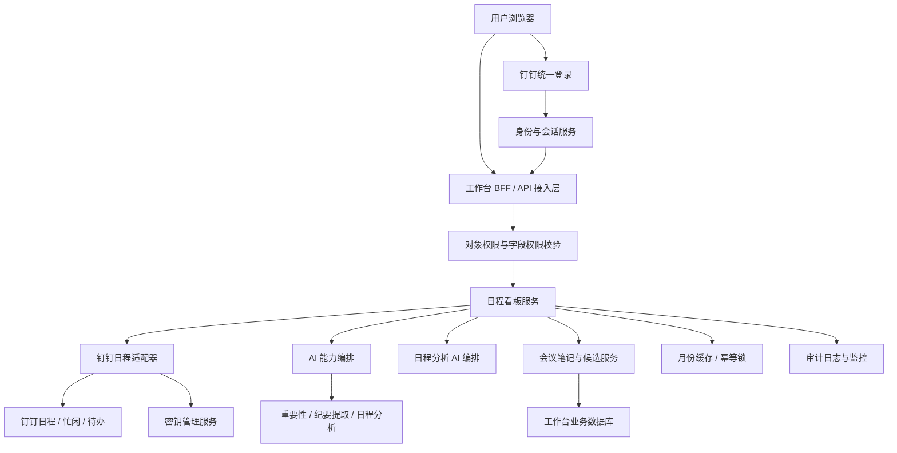
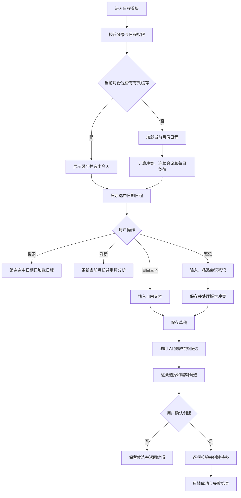
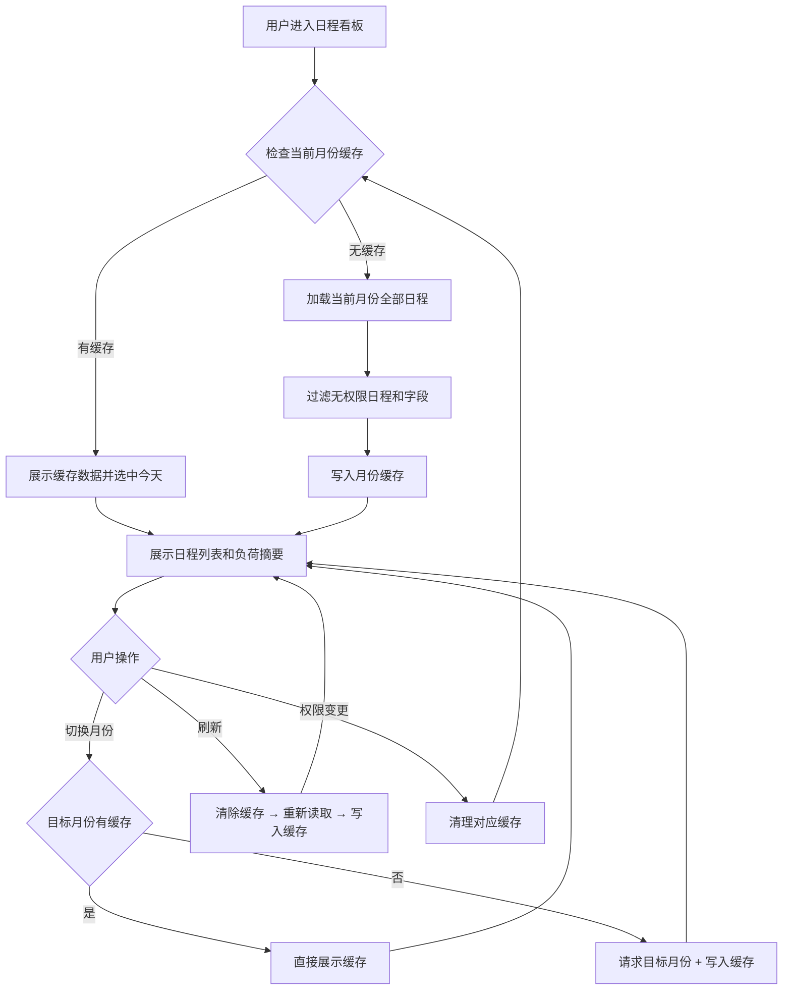
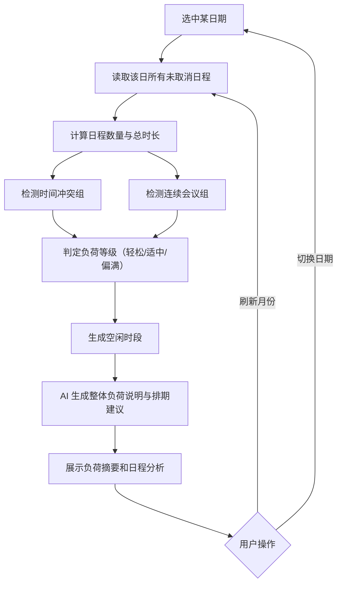
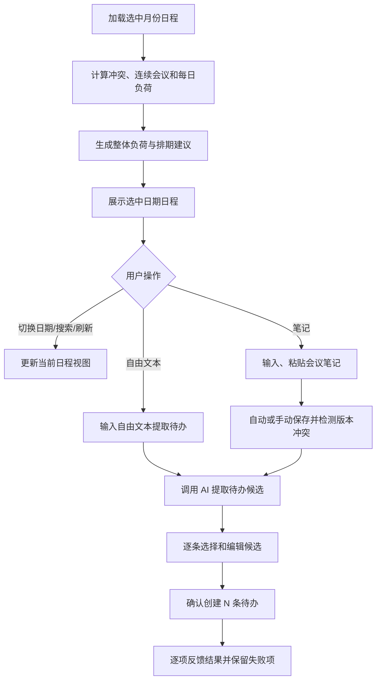
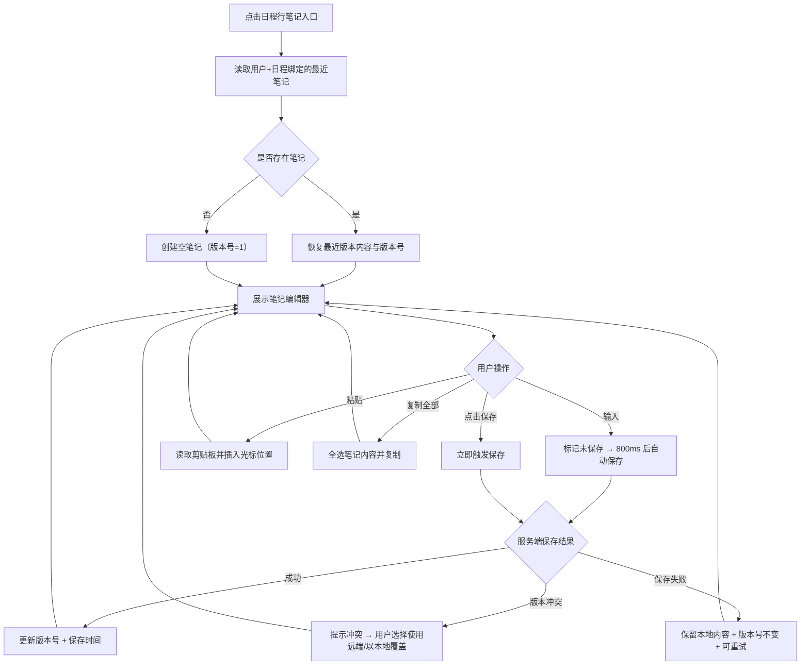
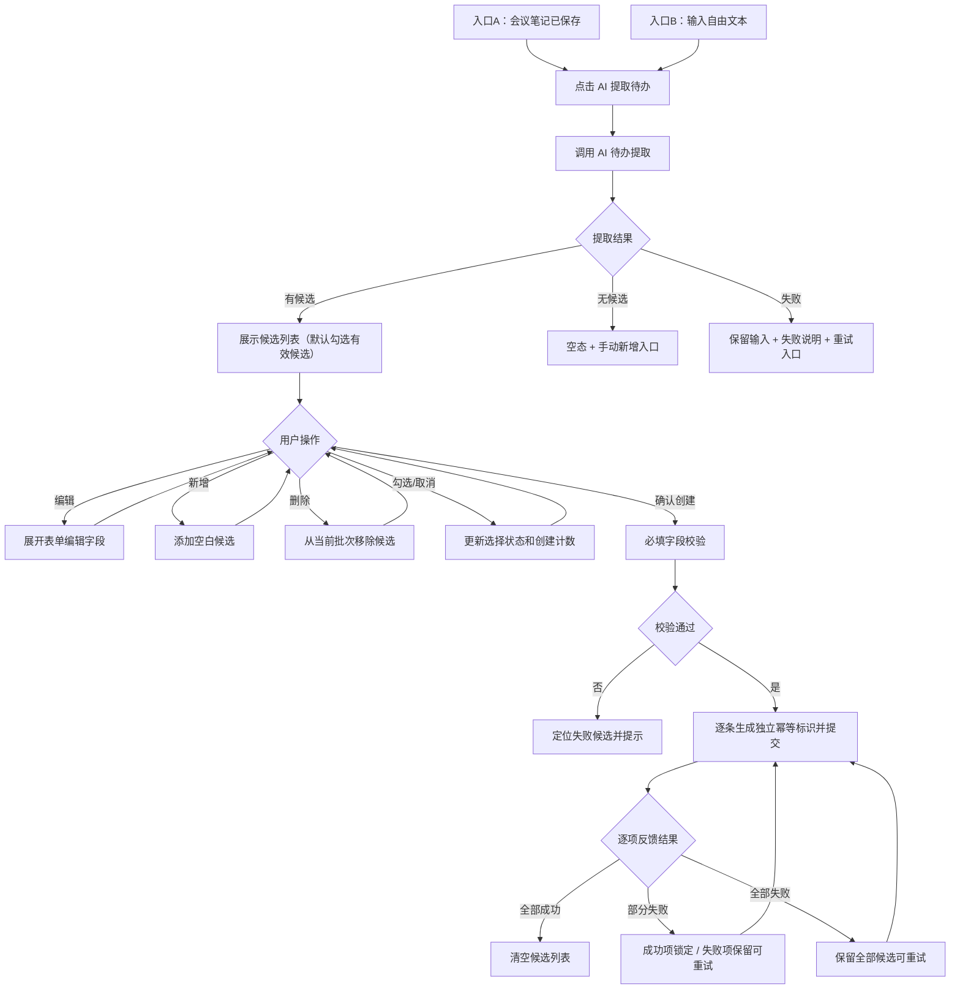

# 20260805-【PRD】AI工作台-日程看板（MVP）-天马智擎项目

_**天马智擎项目**_

**产品需求说明书**

版本信息

本表用于记录本文档的维护过程，请认真填写。

| 版本号 | 时间(必填) | 状态 | 简要描述(必填) | 部门 | 责任产品(必填) | 批准人 |
| --- | --- | --- | --- | --- | --- | --- |
| V1.0 | 2026-07-26 | N | 从工作台总 PRD 拆分日程看板，定义日程浏览、负荷分析、AI 能力、会议笔记和会议纪要生成待办 | AI项目小组 | @公输 |  |
| V1.1 | 2026-08-05 | M | 合并《文本生成待办》PRD 为 M5 内联详规；统一待办候选字段定义（标题≤20/描述≤4096/优先级10·20·30·40/补提醒时间）；增补术语幂等标识、输入来源；产品目标补"多入口提取待办"；非功能需求合并去重；附录C替换原悬空引用 | AI项目小组 | @公输 |  |

注：状态可以为N-新建、A-增加、M-更改、D-删除。

# 关于本文档

## 术语

| **词汇名称** | **全局说明** | **归属层** |
| --- | --- | --- |
| 日程看板 | 聚合展示当前用户有权访问的日程、负荷、分析结果和会议笔记入口的工作台卡片 | 展示层 |
| 日程负荷 | 根据选中日期的会议场次、总时长和连续会议情况确定的轻松、适中或偏满状态 | 规则层 |
| 日程分析 | 工作台根据确定性负荷数据生成的整体负荷说明和排期建议，不判断单场会议重要性 | AI 编排层 |
| 会议笔记 | 与当前用户和单场日程绑定的可编辑笔记，支持保存、复制、粘贴和提取待办候选 | 业务层 |
| 待办候选 | 从会议笔记或自由文本中提取的结构化行动项，含标题、执行人、截止时间、优先级、提醒时间等字段，尚未创建为正式待办；必须经用户选择和确认 | 业务层 |
| 幂等标识 | 每次确认生成的服务端唯一标识，同一标识只允许成功一次，防止重复创建 | 安全层 |
| 输入来源 | 标识待办提取的文本来源类型（会议笔记或自由文本），用于追溯提取上下文和草稿恢复 | 数据层 |

## 参考文档

为了更好理解本文档，请阅读如下文档。

| **编号** | **文档** | **说明及地址** |
| --- | --- | --- |
| 1 | 原型界面参考 | https://fri555.github.io/PORTL/ |
| 2 | Figma UI设计 | https://www.figma.com/design/rRqUi2RORbhHhCnFgH2dTe/%E5%A4%A9%E9%A9%AC%E6%99%BA%E6%93%8E?node-id=0-1&p=f&t=3WOAMYQ62H2eLeQo-0 |

## 沟通要求

本表记录需要跨部门沟通的事项，以保证该文档内容质量。如果有其它跨部门沟通项，请填写该表中，并记录沟通结果。

| **序号** | **部门/角色** | **沟通内容** | **沟通结果** |
| --- | --- | --- | --- |
| — | — | — | — |

# 产品概述

本章节详细描述产品的背景、内容和目标等进行详细定义，关于产品定义的其它内容请阅读本产品定义说明书。

## 产品概述

日程看板面向管理层用户，将本人有权访问的日程按日期集中展示，提供会议负荷、时间冲突、连续会议和整体排期分析，并衔接会议笔记。用户可以从会议笔记或自由文本中提取待办候选，逐条审核编辑后批量创建钉钉待办。

日程看板负责组织、解释和衔接，不替代钉钉日历或待办系统。AI 提取结果必须经用户确认后才能写入待办系统。

## 产品目标

1. **快速掌握日程**：一个看板查看选中日期的会议、负荷、冲突和连续会议（衡量方式：用户无需进入日历即可完成当日概览）

2. **了解会议状态**：未开始会议可查看重要性与可释放 AI 分析结果（衡量方式：支持从日程行进入对应结果）

3. **沉淀会议内容**：会议笔记支持输入、粘贴、复制、保存和恢复（衡量方式：笔记与用户、日程稳定绑定）

4. **多入口提取待办**：支持从会议笔记和自由文本两种入口提取待办候选，覆盖会议内外场景（衡量方式：两种入口均可触发提取并返回候选）

5. **形成行动闭环**：一份纪要或文本可提取多条待办，逐条编辑后批量确认（衡量方式：未经确认不创建，逐项反馈结果）

6. **保持数据稳定**：搜索不重新取数，手动刷新只更新日程看板（衡量方式：刷新失败保留上次成功数据）

## 用户角色

### 用户角色描述

| **用户角色** | **职责描述** | **MVP范围** |
| --- | --- | --- |
| 管理层用户 | 查看本人有权访问的日程，理解会议负荷与会议信息，记录笔记并确认生成待办；或直接输入文本提取待办 | ✅ 核心使用角色 |
| 系统管理员 | 配置日程数据源、AI 能力、权限和外部应用授权 | 后台配置页面不在本 PRD 范围内 |

### 用户故事地图

| **用户活动** | **用户任务** | **用户故事** | **对应功能点** |
| --- | --- | --- | --- |
| 查看日程 | 选择日期 | 作为管理层用户，我希望通过月历选择日期，以便查看目标日期的日程 | M3 月历组件 |
| 查看日程 | 搜索日程 | 作为管理层用户，我希望搜索已加载的日程，以便快速找到会议 | M3 本地搜索 |
| 理解负荷 | 查看场次与时长 | 作为管理层用户，我希望看到轻松、适中或偏满及其依据，以便安排精力 | M2 负荷摘要 |
| 理解负荷 | 识别冲突与连续会议 | 作为管理层用户，我希望快速发现冲突和连续会议，以便调整排期 | M2 冲突/连续会议 |
| 记录会议 | 编辑会议笔记 | 作为管理层用户，我希望输入、粘贴、复制并保存会议纪要，以便持续沉淀 | M4 笔记编辑器 |
| 形成待办 | 提取候选（会议笔记） | 作为管理层用户，我希望从会议笔记中提取多条待办候选，以便减少手工整理 | M5 待办提取（入口A） |
| 形成待办 | 提取候选（自由文本） | 作为管理层用户，我希望直接输入文本提取待办，以便处理非会议场景的行动项 | M5 待办提取（入口B） |
| 形成待办 | 审核并创建 | 作为管理层用户，我希望逐条选择和修改候选，再一次确认创建，以避免错误任务 | M5 候选管理与编辑 + 批量创建 |

## 同类产品/竞品调研（选写）

| **产品/能力** | **现有优势** | **本产品定位** |
| --- | --- | --- |
| 钉钉日历 | 日程创建、参会、忙闲和源数据管理 | 不替代日历，只提供管理层聚合视图和行动衔接 |
| 钉钉待办 | 完整的待办创建、分配、提醒和完成闭环；一次创建一条待办 | 源系统；工作台负责提取候选和批量创建，不替代待办管理；增加用户审核确认环节和批量创建能力 |

# 功能需求

## 全局通用规则

### 系统范围

| **规则项** | **说明** |
| --- | --- |
| 本期范围 | 日程浏览、月份与日期切换、搜索、刷新、负荷分析、会议笔记、待办提取（会议笔记+自由文本双入口）、候选审核编辑与批量创建 |
| 权威数据 | 日程和已创建待办以源系统为准；工作台不建设第二套日历或待办主库 |
| 搜索 | 只筛选当前已加载月份中选中日期的日程，输入停止 300ms 后生效，不请求源系统 |
| 刷新 | 只有点击日程看板刷新按钮才更新当前选中日期所在月份 |
| AI 能力 | 会议重要性、可释放建议、日程分析和待办提取使用本 PRD 附录定义的系统提示词实现 |
| 用户确认 | 日程草稿和待办候选均须用户确认后才能写入源系统 |

### 身份认证与授权

| **规则项** | **说明** |
| --- | --- |
| 门户认证 | 用户通过钉钉统一登录；授权码由服务端换取身份，前端不得自行声明用户编号 |
| 登录会话 | 服务端创建登录会话，浏览器只保存安全会话 Cookie |
| 列表权限 | 日程列表只返回当前用户有权访问的日程及允许展示的字段 |
| 详情权限 | 查看参会人、原日程时分别执行对象级权限校验 |
| 写操作权限 | 保存笔记、创建日程和创建待办时再次校验当前用户及目标对象权限 |
| 权限变更 | 权限版本变化后立即清理对应月份缓存、AI 结果和来源入口 |
| 前端边界 | 前端传入的用户编号、参会人、可执行操作和对象状态不作为最终授权依据 |

### 数据保存边界

| **数据类型** | **保存位置** | **保存与安全约束** |
| --- | --- | --- |
| 日程、参会关系、已创建待办 | 钉钉及对应源系统 | 源系统为权威数据，工作台只在授权范围内读取或发起操作 |
| 会议笔记、笔记版本、待办候选、提取批次、创建结果、操作审计 | 工作台业务数据库 | 按用户编号和日程编号隔离；待办候选保留所属笔记版本或输入来源；提取批次关联输入文本和提取时间 |
| 月份日程缓存、AI 分析短期结果、刷新锁、提取请求锁、幂等标识 | 受控缓存服务 | 设置有效期，按用户、权限版本和月份隔离 |
| 选中日期、月历展开状态、搜索词、弹窗状态、表单临时状态、编辑未保存内容、输入文本草稿 | 浏览器会话缓存 | 退出登录后清除 |

### 加载态/空态/错误态

| **场景** | **状态** | **处理方式** |
| --- | --- | --- |
| 首次加载月份 | 加载中 | 展示日程列表骨架屏 |
| 手动刷新 | 刷新中 | 保留已有日程，刷新按钮旋转并禁止重复点击 |
| 选中日期无日程 | 空 | 展示"今天暂无日程"或"该日期暂无日程" |
| 搜索无结果 | 空 | 展示"未找到匹配日程"和"清空搜索" |
| 月份加载失败且有缓存 | 错误 | 保留旧数据并提示"刷新失败，当前为上次数据" |
| 月份加载失败且无缓存 | 错误 | 展示错误说明和"重新加载" |
| AI 分析无结果 | 空 | 不生成内容，展示对应能力暂无结果 |
| 笔记保存失败 | 错误 | 保留本地内容和版本，提供重新保存 |
| AI 提取中 | 加载中 | 展示提取进度指示；禁用重复触发 |
| 提取结果无候选 | 空 | 展示"未识别到明确行动项，可手动新增待办"并展示新增入口 |
| 提取失败 | 错误 | 保留输入文本/笔记和已有候选，展示失败说明和重试入口 |
| 批量创建提交中 | 加载中 | 展示逐条创建状态 |
| 批量创建全部成功 | 成功 | 展示创建成功数量和结果 |
| 批量创建部分失败 | 部分成功 | 成功项锁定不可重复提交；失败项保留内容，支持只重试失败项 |

### 并发与防重复规则

| **规则项** | **说明** |
| --- | --- |
| 搜索输入 | 300ms 防抖，连续输入以最后一次搜索词为准 |
| 月份请求 | 同一用户同一月份同时只允许一个有效加载请求 |
| 手动刷新 | 刷新期间禁止再次刷新；晚返回的旧请求不得覆盖新结果 |
| 笔记保存 | 停止输入 800ms 自动保存；手动保存可立即触发；按版本号执行乐观锁 |
| AI 提取 | 同一笔记版本或同一输入文本同时只允许一个提取请求；晚返回的结果不得覆盖新的提取结果 |
| 候选编辑 | 多条候选的编辑状态独立保存，互不影响 |
| 待办创建 | 每个候选使用独立幂等标识，同一标识只允许成功一次 |
| 重试 | 失败项重试时复用原幂等标识；成功项不可二次提交 |
| 关闭保护 | 有未完成保存请求时等待结果或明确提示，二次确认 |

## 流程图

### 技术架构图

所有架构与业务流程图统一采用自上而下方向。



### 业务流程图



## 功能模块清单

| **需求编号** | **主功能** | **子功能** | **功能描述** | **优先级** |
| --- | --- | --- | --- | --- |
| M1 | 日程数据接入与权限 | 月份读取与缓存 | 读取当前用户有权访问的月份日程，会话最多缓存最近 3 个月 | P0 |
| M1 | 日程数据接入与权限 | 对象级权限校验 | 校验日程、参会人、笔记和写操作的对象级权限 | P0 |
| M1 | 日程数据接入与权限 | AI 能力编排 | 编排会议重要性、可释放建议、日程分析和待办提取的系统提示词调用 | P0 |
| M2 | 负荷分析与日程分析 | 确定性负荷计算 | 场次/总时长/重叠冲突/连续会议检测与负荷等级判定 | P0 |
| M2 | 负荷分析与日程分析 | AI 负荷说明与排期建议 | 生成整体负荷说明和排期建议 | P0 |
| M3 | 日程列表、月历与搜索 | 月历组件 | 展开/收起、月份切换、有日程日期小圆点标记 | P0 |
| M3 | 日程列表、月历与搜索 | 日程行展示 | 时间/标题/地点/人数/状态/AI 浮层/笔记入口 | P0 |
| M3 | 日程列表、月历与搜索 | 本地搜索 | 搜索标题/地点/组织者/参会人，300ms 防抖 | P0 |
| M3 | 日程列表、月历与搜索 | 手动刷新 | 重读当前月份并重算负荷 | P0 |
| M3 | 日程列表、月历与搜索 | 空态与加载态 | 无日程空态、搜索无结果空态、加载中骨架屏 | P0 |
| M4 | 会议笔记 | 笔记编辑器 | 与单场日程绑定的笔记编辑、800ms 自动/手动保存 | P0 |
| M4 | 会议笔记 | 版本冲突检测 | 乐观锁、用户选择远端或本地版本 | P0 |
| M4 | 会议笔记 | 剪贴板操作 | 粘贴与复制，浏览器拒绝权限时提示快捷键操作 | P0 |
| M5 | 待办提取与创建 | 提取触发 | 从会议笔记（入口A）或自由文本（入口B）触发 AI 提取，返回结构化待办候选 | P0 |
| M5 | 待办提取与创建 | 提取状态管理 | 管理提取中/成功/无候选/失败等状态 | P0 |
| M5 | 待办提取与创建 | 防重复触发 | 同时仅运行一个提取请求 | P0 |
| M5 | 待办提取与创建 | 候选列表展示 | 一行一条紧凑候选展示（标题/执行人/截止时间/优先级） | P0 |
| M5 | 待办提取与创建 | 表单编辑 | 展开完整表单编辑（标题/描述/执行人/参与人/截止时间/提醒时间/优先级） | P0 |
| M5 | 待办提取与创建 | 新增/删除 | 新增空白候选或从批次中删除候选 | P0 |
| M5 | 待办提取与创建 | 勾选/取消 | 默认勾选字段有效的候选，支持切换选择状态 | P0 |
| M5 | 待办提取与创建 | 必填校验 | 选中项必填字段校验 | P0 |
| M5 | 待办提取与创建 | 幂等提交 | 每个候选生成独立幂等标识并提交 | P0 |
| M5 | 待办提取与创建 | 结果反馈 | 逐项反馈创建结果（全部成功/部分失败/全部失败） | P0 |
| M5 | 待办提取与创建 | 安全重试 | 失败项保留内容和幂等标识支持安全重试 | P0 |

## 功能详情

### M1-日程数据接入与权限

#### 功能需求描述

| **EARS 模式** | **需求描述** |
| --- | --- |
| 普遍型 | 系统应读取当前用户有权访问的月份日程，通过适配器接入钉钉日历数据并进行缓存管理。 |
| 状态驱动型 | 当月份已缓存时从缓存读取；未缓存时加载目标自然月；权限版本变更时清理对应缓存。 |
| 事件驱动型 | 当刷新月份时，系统应清除缓存并重新读取。 |
| 不良行为型 | 系统不应返回无权限的日程和参会人，不应缓存超出授权窗口的数据。 |

#### 业务主流程图及说明



流程说明：
1. 首次加载默认进入今天所在自然月，会话最多缓存最近访问的 3 个月。
2. 刷新时清除当前月份缓存并重新读取；失败时保留上次成功数据。
3. 权限版本变更后立即清理对应月份缓存和入口。

#### 界面原型

| **动作** | **显示** | **类型** | **描述** |
| --- | --- | --- | --- |
| 【月份切换】点击上个月/下个月 | 切换月份展示 | 月历导航 | · 已缓存月份直接展示<br>· 未缓存月份展示骨架屏并加载<br>· 加载失败保留当前月份并提示 |
| 【日期选中】点击某日期 | 更新当日日程和负荷摘要 | 日期选择 | · 选中日期高亮<br>· 有日程的日期展示小圆点标记<br>· 选中未缓存月份时加载目标月份 |
| 【月历收起】再次点击月历展开按钮 | 隐藏月历组件 | 折叠/展开 | · 不改变选中日期和当前内容<br>· 收起后专注日程列表区域 |
| 【权限过滤】加载日程 | 仅展示有权访问的日程 | 数据过滤 | · 无权限日程静默过滤，无额外提示<br>· 参会人列表同样按权限过滤 |
| 【数据加载中】月份首次加载 | 日程列表骨架屏 | 加载态 | · 月历可正常操作<br>· 骨架屏置于列表区域 |

#### 数据说明（业务实体）

**日程**

| **字段名** | **数据类型** | **长度** | **默认值** | **必需** | **约束说明** |
| --- | --- | --- | --- | --- | --- |
| 日程编号 | 字符 | 64 | — | 是 | 源系统稳定标识；关联分析和笔记 |
| 日程日期 | 日期 | — | — | 是 | 按当前用户时区计算 |
| 开始时间 | 日期时间 | — | — | 是 | 必须早于结束时间 |
| 结束时间 | 日期时间 | — | — | 是 | 用于冲突和负荷计算 |
| 日程标题 | 字符 | ≤2048 | — | 是 | 单行省略，可搜索 |
| 地点 | 字符 | ≤200 | 空 | 否 | 会议室或线上会议说明 |
| 组织者 | 人员引用 | — | — | 是 | 只展示当前用户有权查看的字段 |
| 参会人 | 人员引用数组 | — | 空 | 否 | 用于人数、搜索和 AI 分析；不得扩大权限 |
| 日程状态 | 枚举 | — | — | 是 | 未开始、即将开始、进行中、已结束、已取消 |
| 源日程地址 | 字符 | ≤2048 | 空 | 否 | 服务端生成短时或受控跳转地址 |
| 数据版本 | 字符 | ≤64 | — | 是 | 用于刷新时识别更新 |

**AI 分析结果**

| **字段名** | **数据类型** | **长度** | **默认值** | **必需** | **约束说明** |
| --- | --- | --- | --- | --- | --- |
| 结果编号 | 字符 | 64 | 系统生成 | 是 | 单次 AI 分析结果标识 |
| 日程编号 | 字符 | 64 | — | 是 | 与输入日程绑定 |
| 能力类型 | 枚举 | — | — | 是 | 重要性与可释放、日程分析、待办提取 |
| 结果状态 | 枚举 | — | 处理中 | 是 | 处理中、成功、无结果、失败、无权限 |
| 结果内容 | 对象 | — | 空 | 条件必填 | 成功时必填；遵循附录定义的系统提示词输出结构 |
| 来源地址 | 字符 | ≤2048 | 空 | 否 | 查看日程详情使用 |
| 生成时间 | 时间戳 | — | 当前时间 | 是 | 用于判断结果时效 |

#### 业务规则和约束条件

| **规则项** | **说明** |
| --- | --- |
| 首次月份 | 加载今天所在自然月并默认选中今天 |
| 月份缓存 | 切换到未缓存月份时加载目标自然月；会话最多缓存最近访问的 3 个月 |
| 旧数据保护 | 刷新失败时保留上次成功数据；旧请求结果不得覆盖更新后的月份数据 |

#### 接口说明

| **接口** | **调用方式** | **请求/响应重点** | **状态** |
| --- | --- | --- | --- |
| GET /api/dws/workbench | 读取日程 | 请求月份和权限上下文；返回当前用户日程及已接入 AI 分析结果 | 现有路径，月份参数、分页、字段版本和错误码待评审 |

所有接口先校验服务端会话，再校验对象权限。

#### 补充说明

无。

### M2-负荷分析与日程分析

#### 功能需求描述

| **EARS 模式** | **需求描述** |
| --- | --- |
| 普遍型 | 系统应根据确定性规则计算选中日期的会议场次、总时长、时间冲突、连续会议和负荷等级，并生成整体负荷说明与排期建议。 |
| 状态驱动型 | 当负荷等级不同时（轻松/适中/偏满），系统应展示对应摘要。 |
| 不良行为型 | 系统不应由 AI 二次改写负荷等级、AI 分析结果和已确定的分析规则。 |

#### 业务主流程图及说明



流程说明：
1. 确定性负荷规则（场次、时长、冲突、连续会议、等级）优先计算和展示，AI 负荷说明允许异步补充。
2. 跨日日程分别计入所覆盖日期，当日时长只计算落在当天的时间段。
3. 负荷等级取场次和时长中较高者；场次和时长命中不同等级时取高等级。

#### 数据说明（业务实体）

**每日负荷与日程分析**

| **字段名** | **数据类型** | **长度** | **默认值** | **必需** | **约束说明** |
| --- | --- | --- | --- | --- | --- |
| 用户编号 | 字符 | 64 | 当前用户 | 是 | 不得由前端自行指定 |
| 统计日期 | 日期 | — | 选中日期 | 是 | 与用户编号组成唯一统计范围 |
| 日程数量 | 整数 | — | 0 | 是 | 只统计未取消日程 |
| 日程总时长 | 整数 | — | 0 | 是 | 单位为分钟；重叠时段仍按各日程时长累计 |
| 空闲时段 | 时间区间数组 | — | 空 | 是 | 在用户工作时段内扣除未取消日程后得到；作为排期建议输入 |
| 时间冲突组 | 日程编号数组的数组 | — | 空 | 是 | 每组至少包含两个日程编号 |
| 连续会议组 | 日程编号数组的数组 | — | 空 | 是 | 按开始时间排序 |
| 负荷等级 | 枚举 | — | 轻松 | 是 | 轻松、适中、偏满 |
| 负荷说明 | 字符 | ≤500 | 空 | 否 | 说明场次、时长、冲突和连续会议 |
| 排期建议 | 字符数组 | — | 空 | 否 | 由内置日程分析生成；无建议时为空 |
| 证据日程编号 | 字符数组 | — | 空 | 否 | 仅引用输入中的稳定日程编号 |
| 分析版本 | 字符 | ≤50 | schedule-analysis-v1.0 | 是 | 用于结果追踪 |

#### 业务规则和约束条件

**日程与负荷规则**

| **规则项** | **说明** |
| --- | --- |
| 时间冲突 | 两个未取消日程的时间区间存在重叠即判定冲突 |
| 连续会议 | 相邻会议间隔不超过 15 分钟且连续两场以上 |
| 偏满 | 当日不少于 5 场，或日程总时长不少于 6 小时 |
| 适中 | 未达到偏满，且为 3—4 场，或总时长不少于 3 小时且小于 6 小时 |
| 轻松 | 未命中偏满和适中；场次和时长命中不同等级时取较高等级 |
| 跨日日程 | 分别计入所覆盖日期；当日时长只计算落在当天的时间段 |
| 已取消日程 | 不计入场次、总时长、冲突和连续会议 |

**AI 分析与提示词规则**

| **规则项** | **说明** |
| --- | --- |
| 日程分析 | 只根据已确定的场次、时长、空闲时段、冲突、连续会议和负荷等级生成整体说明及排期建议；使用附录 A 提示词 |
| 重要性与可释放 | 直接展示 AI 分析结果，工作台不得二次改写等级；使用附录 B 提示词 |
| 待办提取 | 从会议笔记或自由文本中提取结构化待办候选；使用附录 C 提示词 |
| 无结果 | AI 分析无结果或失败时不得由工作台自行编造替代内容 |

#### 界面原型

| **动作** | **显示** | **类型** | **描述** |
| --- | --- | --- | --- |
| 【负荷摘要】默认 | 轻松/适中/偏满及场次、时长、连续会议数 | 摘要区 | · 不展示实时、快照等实现标签<br>· 使用红/黄/绿等级色标识<br>· 日程分析只解释整体负荷和排期 |
| 【日程分析】查看 | AI 生成的整体负荷说明和排期建议 | 文字区 | · 展示 busy_periods 和 schedule_suggestions<br>· 无建议时对应区域展示为空<br>· 引用日程编号做链接锚点 |
| 【冲突组】展开 | 冲突的日程编号和时间详情 | 折叠面板 | · 点击"X 个冲突"标签展开查看具体重叠日程<br>· 每条冲突组展示日程标题和时间区间 |
| 【连续会议组】标识 | 连续会议在日程行间的连接指示 | 时间轴 | · 相邻日程之间标记间隔时长<br>· 悬停展示"距上一场结束 X 分钟" |
| 【无冲突/无连续会议】 | 不展示冲突或连续会议相关信息 | 空态 | · 对应区域不渲染<br>· 不展示"无冲突"等占位文案 |

#### 补充说明

无。

### M3-日程列表、月历与搜索

#### 功能需求描述

| **EARS 模式** | **需求描述** |
| --- | --- |
| 普遍型 | 系统应提供月历组件支持月份切换和日期选择，并按时间顺序展示选中日期的日程行，包含时间、标题、地点、人数、状态和可用动作。 |
| 状态驱动型 | 当日期有日程时展示小圆点标记；无可用 AI 信息时不展示入口。 |
| 事件驱动型 | 当用户搜索、刷新、切换日期或点击月历时，系统应更新当前日程列表或月历状态。 |
| 不良行为型 | 系统不应在切换月份时清空未保存的笔记草稿，不应在日程行展示该会议不可用的操作。 |

#### 业务主流程图及说明



流程说明：

1. 日程基础数据和确定性负荷计算优先展示，AI 结果允许异步补充。
2. 重要性与可释放建议直接使用 AI 分析结果（附录 B 提示词）。
3. 搜索只过滤已加载数据；刷新只更新选中日期所在月份。

#### 界面原型

| **动作** | **显示** | **类型** | **描述** |
| --- | --- | --- | --- |
| 【日程看板】首次加载 | 今天的负荷摘要和日程列表 | 看板 | · 默认选中今天并收起月历<br>· 日程按开始时间升序<br>· 展示时间、标题、地点、人数、标签、状态和可用动作 |
| 【日程行】默认 | 时间、标题、元信息、标签、动作和状态 | 列表项 | · 时间位于左侧<br>· "笔记"位于状态左侧<br>· 只展示当前状态和权限允许的动作 |
| 【标题或元信息】溢出 | 省略显示并提供完整提示 | 文本 | · 不改变行高<br>· Hover/聚焦查看完整内容 |
| 【搜索框】输入/清空 | 过滤或恢复选中日期的日程 | 输入框 | · 搜索标题、地点、组织者和参会人<br>· 300ms 防抖，本地过滤<br>· 不改变负荷统计 |
| 【刷新按钮】点击 | 列表保持可读，刷新按钮旋转 | 图标按钮 | · 只刷新选中日期所在月份<br>· 成功后重算冲突、连续会议、每日负荷和日程分析<br>· 刷新中禁止重复点击 |
| 【刷新】失败 | 保留旧数据并展示失败提示 | Toast/看板状态 | · 文案"刷新失败，当前为上次数据"<br>· 可再次刷新 |
| 【查看日程详情】点击 | 打开钉钉对应来源 | 跳转 | · 打开前校验权限<br>· 无有效来源时不展示入口 |
| 【选中日期无日程】出现 | "今天暂无日程"或"该日期暂无日程" | 空态 | · 不与搜索无结果混用 |
| 【搜索无结果】出现 | "未找到匹配日程"和"清空搜索" | 空态 | · 点击后清除搜索词并恢复列表 |

#### 业务规则和约束条件

**加载与刷新规则**

| **规则项** | **说明** |
| --- | --- |
| 搜索范围 | 只搜索选中日期已加载日程的标题、地点、组织者和参会人 |
| 刷新范围 | 只更新选中日期所在月份，并重算该月负荷和日程分析 |
| 默认排序 | 选中日期内按开始时间升序；开始时间相同时按结束时间、日程编号排序 |

**AI 分析与提示词规则**

| **规则项** | **说明** |
| --- | --- |
| 来源跳转 | 查看日程详情前必须再次校验权限和来源有效性 |

#### 补充说明

无。

### M4-会议笔记

#### 功能需求描述

| **EARS 模式** | **需求描述** |
| --- | --- |
| 普遍型 | 系统应提供与单场日程绑定的会议笔记编辑器，支持输入、粘贴、复制、自动/手动保存和版本冲突处理。 |
| 状态驱动型 | 当笔记保存状态变化时（未保存/保存中/已保存/版本冲突），系统应展示对应状态指示。 |
| 事件驱动型 | 当用户输入、保存、粘贴、复制或关闭笔记时，系统应执行自动保存、立即保存或保护未完成请求。 |
| 不良行为型 | 系统不应静默覆盖笔记，不应在用户选择前自动解决版本冲突。 |

#### 业务主流程图及说明



流程说明：
1. 同一用户同一日程只维护一份当前笔记，通过版本号保留并发一致性。
2. 停止输入 800ms 后触发自动保存；手动保存可立即触发。
3. 版本冲突不静默覆盖，必须由用户选择使用远端或本地版本。

#### 数据说明（业务实体）

**会议笔记**

| **字段名** | **数据类型** | **长度** | **默认值** | **必需** | **约束说明** |
| --- | --- | --- | --- | --- | --- |
| 笔记编号 | 字符 | 64 | 系统生成 | 是 | 按用户和日程唯一 |
| 用户编号 | 字符 | 64 | 当前用户 | 是 | 与日程编号组成唯一键 |
| 日程编号 | 字符 | 64 | — | 是 | 用户必须对目标日程有查看权限 |
| 笔记内容 | 文本 | ≤50000 | 空 | 否 | 支持输入和粘贴，不得静默覆盖 |
| 笔记版本号 | 整数 | — | 1 | 是 | 每次成功保存递增 |
| 保存状态 | 枚举 | — | 未保存 | 是 | 未保存、保存中、已保存、保存失败、版本冲突 |
| 保存时间 | 时间戳 | — | 空 | 否 | 最近成功保存时间 |
| 来源类型 | 枚举 | — | 手动 | 是 | 手动、剪贴板；多来源时记录最近一次 |

#### 业务规则和约束条件

| **规则项** | **说明** |
| --- | --- |
| 笔记唯一性 | 同一用户同一日程只维护一份当前笔记，通过版本号保留并发一致性 |
| 自动保存 | 停止输入 800ms 后触发；手动保存可立即触发 |
| 版本冲突 | 不静默覆盖；必须由用户选择使用远端或以本地覆盖 |

#### 接口说明

| **接口** | **调用方式** | **请求/响应重点** | **状态** |
| --- | --- | --- | --- |
| 会议笔记读取接口 | 读取笔记 | 请求日程编号；返回当前用户笔记、版本和保存时间 | 路径待评审，本版不硬编码 |
| 会议笔记保存接口 | 保存笔记 | 请求日程编号、笔记内容和基准版本；返回新版本或版本冲突 | 路径待评审，本版不硬编码 |

#### 界面原型

```text
┌会议笔记──────────────────────────────────┐
│会议纪要编辑区          │ 待办候选（一行一条） │
│[粘贴][复制][保存]         │ □事项·DDL·负责人    │
│[AI提取待办]            │ [创建 N 条待办]       │
└──────────────────────────────────────────┘
```

| **动作** | **显示** | **类型** | **描述** |
| --- | --- | --- | --- |
| 【笔记】点击 | 打开当前会议笔记工作区 | 弹窗/工作区 | · 按用户和日程恢复最近笔记<br>· 左侧编辑笔记，右侧审核待办候选<br>· 保留日程列表滚动位置 |
| 【笔记编辑区】输入 | 显示未保存、保存中或已保存 | 文本编辑区 | · 停止输入 800ms 后自动保存<br>· 保存失败保留本地内容并提供重试 |
| 【保存】点击 | 立即保存当前笔记版本 | 按钮 | · 不等待自动保存<br>· 保存中禁止重复提交<br>· 成功更新版本号和保存时间 |
| 【粘贴】点击 | 将剪贴板文本插入光标位置 | 按钮 | · 浏览器拒绝权限时提示使用系统快捷键<br>· 不覆盖已有内容 |
| 【复制全部】点击 | 复制完整笔记并反馈结果 | 按钮 | · 空内容时禁用<br>· 复制失败提示使用系统快捷键 |
| 【检测到版本冲突】 | 同时展示本地和远端版本说明 | 冲突态 | · 用户选择"使用远端"或"以本地覆盖"<br>· 未选择前不得静默保存 |
| 【会议笔记】关闭 | 返回日程看板 | 弹窗 | · 支持右上角关闭和点击遮罩<br>· 有未完成保存请求时等待结果或明确提示<br>· 已保存笔记按版本保留 |

#### 补充说明

本模块为待办提取入口A（会议笔记提取）的载体。用户在会议笔记工作区点击"AI 提取待办"按钮触发提取，详见 M5。

### M5-待办提取与创建

本模块定义日程看板中的待办提取与创建能力。支持双入口：入口A 从会议笔记提取（挂 M4），入口B 从自由文本提取（独立输入框）。提取结果为待办候选，用户逐条审核编辑后批量创建钉钉待办。

**依赖关系**：M1（数据接入）、M4（会议笔记，入口A）、AI 提取能力（附录 C 提示词）、待办创建接口。

#### 功能需求描述

| **EARS 模式** | **需求描述** |
| --- | --- |
| 普遍型 | 系统应支持用户从已保存的会议笔记（入口A）或自由文本（入口B）触发 AI 提取待办候选，展示候选列表供审核编辑，确认后批量创建钉钉待办。 |
| 状态驱动型 | 当提取成功有候选时展示候选列表及操作入口；成功无候选时展示空态和手动新增入口；提取失败时展示失败说明和重试入口。批量创建全部成功时清空候选列表；部分成功时成功项锁定、失败项保留；全部失败时保留全部候选。 |
| 事件驱动型 | 当用户点击"AI 提取待办"时，系统应调用 AI 待办提取并返回候选结果；当用户点击"创建 N 条待办"时，系统应校验必填字段、生成幂等标识并提交创建。 |
| 不良行为型 | 系统不应在提取中允许重复触发；不应在未经用户确认的情况下自动创建待办；不应允许成功项重复提交；不应在字段校验失败时提交；响应未知时不得显示成功。 |

#### 业务主流程图及说明



流程说明：
1. AI 提取基于当前已保存的笔记版本（入口A）或当前输入的文本内容（入口B）。提取锁在服务端获取，同时只允许一个提取请求。
2. 编辑状态独立保存于各候选，互不干扰。取消勾选不删除候选内容。
3. 每条候选使用独立幂等标识；成功项锁定不可重复提交，失败项重试复用原幂等标识。

#### 界面原型

**入口B：自由文本提取界面**

| **动作** | **显示** | **类型** | **描述** |
| --- | --- | --- | --- |
| 【提取待办按钮】hover | hover提示："AI提取待办" | 按钮 | · hover出现提示"AI提取待办" |
| 【提取待办按钮】点击 | 跳出AI提取待办界面 | 弹窗 | · 默认界面 |
| 【输入框】输入文本 | 纯文本编辑区 | 输入框 | · 默认提示语"输入文本，从文本中提取待办事项" |
| 【AI提取待办】点击 | 没有输入内容或为空白时置灰不可点击 | 按钮 | · 未输入或输入只有空格时置灰<br>· 输入非空时可点击进入提取中状态<br>· 提取中提示语"AI正在识别行动项与人员"<br>· 提取失败提示语"AI提取待办遇到一些困难，请稍后重试"<br>· 提取结果为空提示语"没有提取到有效的待办事项，请检查输入内容后重试" |
| 【关闭】点击 | 二次确认界面 | 弹窗 | · 二次确认，提示语"确认关闭AI生成待办？"<br>· 输入的文本内容作为草稿保存，再次点击显示该文本<br>· 未创建的待办事项清空 |

**入口A：会议笔记提取**（在 M4 会议笔记工作区内操作）

| **动作** | **显示** | **类型** | **描述** |
| --- | --- | --- | --- |
| 【AI 提取待办】点击 | 当前笔记无内容时置灰不可点击 | 按钮 | · 输入非空时可点击进入提取中状态<br>· 提取中禁用重复点击 |
| 【提取中】状态 | 展示提取进度指示 | 加载态 | · 禁用 AI 提取按钮和关闭操作<br>· 文案："正在从纪要中识别待办事项…" |

**候选管理与编辑**

| **动作** | **显示** | **类型** | **描述** |
| --- | --- | --- | --- |
| 【待办候选卡片】展示 | 一行一条紧凑卡片 | 候选卡片 | · 展示：标题：描述，DDL，负责人，优先级<br>· 默认态全不选中 |
| 【全选/清除】点击 | 全选/清除切换 | 按钮 | · 点击全选所有候选<br>· 有选中时则变为清除按钮<br>· 再次点击清除所有选择 |
| 【勾选框】勾选/取消 | 选中/未选中切换 | 复选框 | · 切换候选的选择状态<br>· 实时更新"创建 N 条待办"按钮计数 |
| 【候选行/展开】点击 | 展开/折叠候选完整表单 | 折叠面板 | · 展开后展示标题/描述/执行人/参与人/截止时间/提醒时间/优先级编辑字段<br>· 再次点击折叠 |
| 【标题】输入 | 单行文本输入 | 输入框 | · 必填，限制20字符 |
| 【描述】输入 | 多行文本输入 | 文本域 | · 选填，限制4096字符 |
| 【执行人】选择/输入 | 人员候选列表 | 人员选择器 | · 从通讯录搜索选择<br>· 无明确执行人时预填当前用户 |
| 【参与人】删除 | 移除已选参与人 | 图标按钮 | · 删除已选的某个参与人 |
| 【参与人】选择/输入 | 人员候选列表 | 人员选择器 | · 从通讯录搜索选择 |
| 【截止时间】点击 | 日期选择组件；时间选择组件 | 日期时间选择器 | · 点击弹出日期、时间选择面板<br>· 纪要/文本明确时间时优先<br>· 无明确时间默认为当日或次日 18:00 |
| 【提醒时间】点击 | 日期选择组件；时间选择组件 | 日期时间选择器 | · 点击弹出日期、时间选择面板<br>· 默认取截止时间前 1 小时 |
| 【优先级】选择 | 下拉选择 | 下拉选择器 | · 选项：较低 / 普通 / 较高 / 紧急 |
| 【新增候选】点击 | 在列表末尾插入空白候选 | 按钮 | · 生成临时候选编号<br>· 用户填写必填字段后才可勾选 |
| 【删除】点击 | 从当前批次移除候选 | 图标按钮 | · 不影响原始输入；仅剩一条时仍允许删除 |

**批量创建与结果反馈**

| **动作** | **显示** | **类型** | **描述** |
| --- | --- | --- | --- |
| 【创建N条待办】展示 | 按钮上的计数标识 | 按钮 | · N 实时反映当前勾选数量 |
| 【创建0条待办】点击 | 置灰不可点击 | 按钮 | · 无候选被勾选时不可操作 |
| 【创建1+条待办】点击 | 可点击 | 按钮 | · 创建后本次选中的勾选框置灰不可选 |
| 【创建中】状态 | 展示逐条创建状态 | 加载态 | · 每条候选显示提交中/成功/失败的圆点状态 |
| 【状态】显示 | 每一条待办候选任务创建状态 | 文本标签 | · 不同颜色展示状态（成功/失败/提交中）<br>· 失败状态为按钮，可以点击重试 |
| 【创建全部成功】 | 清空候选列表并展示结果 | 成功态 | · 文案："已成功创建 N 条待办" |
| 【创建部分失败】 | 成功项锁定、失败项保留可重试 | 部分成功 | · 失败项保留内容和幂等标识<br>· 展示"部分待办创建失败，失败项已保留，请修复后重试" |
| 【创建全部失败】 | 保留全部候选展示失败原因 | 错误态 | · 展示"创建失败，已保留全部待办候选，请重试" |
| 【重试】点击 | 重新提交失败项 | 按钮 | · 复用原幂等标识<br>· 提交中禁用重复点击<br>· 重新走接口 |
| 【提取无候选】 | 展示空态和手动新增入口 | 空态 | · 文案："未识别到明确行动项，可手动新增待办" |

#### 数据说明（业务实体）

**输入文本**

| **字段名** | **数据类型** | **长度** | **默认值** | **必需** | **约束说明** |
| --- | --- | --- | --- | --- | --- |
| 输入文本 | 文本 | — | 空 | 是 | 用户输入的文本内容 |
| 输入来源 | 枚举 | — | 自由文本 | 是 | 会议笔记、自由文本 |
| 提取状态 | 枚举 | — | 待提取 | 是 | 待提取、提取中、成功、失败 |
| 提取时间 | 时间戳 | — | — | 否 | 记录提取时间 |
| 结果信息 | 字符 | — | 空 | 否 | 失败时说明原因 |

**待办候选**

| **字段名** | **数据类型** | **长度** | **默认值** | **必需** | **约束说明** |
| --- | --- | --- | --- | --- | --- |
| 是否选择 | 布尔 | — | 是 | 是 | 只有选中项进入创建请求 |
| 标题 | 字符 | ≤20 | AI 提取生成 | 是 | 必填，可编辑 |
| 描述 | 文本 | ≤4096 | AI 提取生成 | 否 | 可编辑 |
| 执行人 | 文本数组 | — | AI 提取生成 | 否 | 必须为 unionId；无明确执行人时预填当前用户 |
| 参与人 | 文本数组 | — | 空 | 否 | 必须为 unionId；用户可增删 |
| 截止时间 | 日期时间 | — | 未来最近日期18:00 | 否 | 纪要/文本明确时间优先 |
| 提醒时间 | 日期时间 | — | 截止时间前1小时 | 否 | 纪要/文本明确时间优先 |
| 优先级 | 枚举 | — | 普通 | 否 | 10：较低、20：普通、30：较高、40：紧急 |
| 幂等标识 | 字符 | — | 系统生成 | 是 | 确认时生成，同一标识只允许成功一次 |
| 创建结果 | 枚举 | — | 未创建 | 否 | 未创建、提交中、成功、失败 |

#### 业务规则和约束条件

| **规则项** | **说明** |
| --- | --- |
| 提取输入 | 入口A使用当前已保存的笔记版本；入口B使用当前输入的文本内容；同时只运行一个提取请求 |
| 提取锁定 | 提取期间禁止重复触发；晚返回的结果不得覆盖新的提取结果 |
| 提取数量 | 最多提取 20 条待办候选 |
| 修改文本重新提取 | 入口B修改输入文本后重新提取，清空当前候选重新提取 |
| 无候选 | 提取成功但无候选时展示空态和手动新增入口，不自动创建空任务 |
| 提取失败 | 保留输入文本/笔记和已有候选，展示失败说明和重试入口 |
| 执行人默认值 | 纪要/文本明确责任人时预填对应人员；无明确责任人时预填当前用户 |
| 截止时间默认值 | 纪要/文本明确时间时优先；无明确时间且当前时间早于 18:00 时为当天 18:00，达到或晚于 18:00 时为次日 18:00 |
| 提醒时间默认值 | 纪要/文本明确时间时优先；无明确时间时默认取截止时间前 1 小时 |
| 选择状态 | 默认勾选字段有效的候选；取消选择不删除候选内容 |
| 新增候选 | 生成本地候选编号，用户填写必填字段 |
| 删除候选 | 从当前批次移除，不影响原始输入；仅剩一条时仍允许删除 |
| 多候选独立 | 每条候选的编辑状态独立保存，互不影响 |
| 候选确认 | 只有选中且字段校验通过的候选可以创建 |
| 独立幂等 | 每个候选在确认时生成独立幂等标识；同一标识只允许成功一次 |
| 批量结果 | 逐项返回结果；成功项锁定不可重复提交 |
| 部分失败重试 | 失败项保留内容和幂等标识；用户修复后可重新提交失败项 |
| 重试复用幂等 | 失败项重试时复用原幂等标识，确保不会重复创建 |
| 提交中状态 | 提交过程中禁用确认按钮，防止重复操作 |
| 校验失败定位 | 具体到哪个候选的哪个字段校验失败，提供明确提示 |
| 批量上限 | 单次最多创建 20 条待办；超过时提交请求应被拒绝并提示 |
| 关闭保护 | 有未完成保存请求时等待结果或明确提示，二次确认 |

#### 接口说明

| **接口** | **调用方式** | **请求/响应重点** | **状态** |
| --- | --- | --- | --- |
| AI 待办提取接口 | 提取候选 | 请求输入文本内容（会议笔记或自由文本）；返回提取批次及待办候选列表（标题/描述/执行人/参与人/截止时间/提醒时间/优先级） | 由 AI 待办提取提供，路径待评审 |
| 创建待办接口 | 创建待办 | 传入待办字段（标题/描述/执行人等）和幂等标识，逐条创建 | 由后端提供，接口路径待评审 |

写操作必须使用幂等标识；响应未知不得显示成功。

人员解析参考：[查询用户详情 - 开放平台](https://open.dingtalk.com/document/development/query-user-details#)

待办创建参考：[创建钉钉待办任务 - 开放平台](https://open.dingtalk.com/document/development/add-dingtalk-to-do-task)

#### 补充说明

1. 已创建的钉钉待办以钉钉待办系统为准，工作台不建设第二套待办主库。
2. 待办提取使用附录 C 提示词（v1.2），定义了从文本中识别行动项、人员解析为 unionId、时间换算为北京时间毫秒的完整流程。

**月历交互说明**

| **动作** | **显示** | **类型** | **描述** |
| --- | --- | --- | --- |
| 【月历按钮】点击 | 展开或收起月历 | 图标按钮 | · 展开后高亮选中日期和今天<br>· 收起不改变选中日期 |
| 【上个月/下个月】点击 | 展示目标月份 | 月历按钮 | · 未缓存月份才请求数据<br>· 会话最多缓存最近访问的 3 个月<br>· 加载失败保留当前月份 |
| 【日期】点击 | 更新负荷摘要和当日日程 | 月历 | · 不请求已缓存月份<br>· 清除仅针对前一日期的临时浮层 |

# 非功能需求

## 性能要求

| **指标** | **目标值** | **说明** |
| --- | --- | --- |
| 日程看板首屏 | ≤2 秒（P95） | 包含当前日期基础日程和负荷计算；AI 结果可异步补充 |
| 月份日程接口 | ≤1.5 秒（P95） | 不包含 AI 分析生成耗时 |
| 本地搜索 | ≤100ms | 从 300ms 防抖结束后计算 |
| 月份切换 | 已缓存月份 ≤300ms | 未缓存月份展示骨架屏 |
| 笔记保存 | ≤1 秒（P95） | 不包含网络断连重试时间 |
| AI 提取响应 | ≤3 秒（P95） | 不含文本输入耗时；超过 3 秒可展示进度 |
| 候选列表渲染 | 50 条以内无明显卡顿 | 超过 50 条时分批渲染 |
| 候选展开/折叠 | ≤200ms | 单条候选表单展开速度 |
| 批量创建 | 10 条以内 ≤2 秒（P95） | 每条使用独立幂等，逐项反馈不阻塞整体 |

## 安全要求

| **维度** | **要求** |
| --- | --- |
| 身份认证 | 使用钉钉统一登录和服务端会话 |
| 对象权限 | 日程列表、参会人、AI 结果、来源跳转、笔记和写操作分别校验权限 |
| 数据最小化 | AI 能力只接收完成当前分析所需的最小日程、笔记和人员字段 |
| 凭证保护 | 不向浏览器下发钉钉访问令牌和第三方密钥 |
| 缓存隔离 | 按用户、权限版本和月份隔离；退出登录或权限变更后清理 |
| 笔记保护 | 会议笔记按用户和日程隔离，日志不记录完整笔记正文 |
| 创建权限 | 创建待办前校验当前用户在目标任务空间的创建权限；只能给自己的同级别或以下人员创建待办（实现困难，标注边界） |
| 幂等保护 | 同一幂等标识只允许成功一次，防止重复创建 |
| 操作审计 | 记录笔记覆盖、日程创建、待办创建、待办提取请求和外部授权操作的用户、对象、时间、幂等标识和结果 |

## 兼容性要求

| **维度** | **要求** |
| --- | --- |
| 浏览器 | Chrome、Edge 最近两个稳定版本 |
| 分辨率 | 最小 1280×720；推荐 1920×1080 |
| 响应式 | 窄屏下日程看板保持单列，会议笔记左右区改为上下排列；候选列表区域在窄屏下保持可用 |
| 无 Hover 设备 | 使用点击打开或固定浮层 |
| 可访问性 | 图标按钮提供可访问名称；页签、日期、浮层和弹窗支持键盘操作及可见焦点 |
| 剪贴板 | 浏览器拒绝权限时提示使用系统快捷键，不阻断手动编辑 |

# 迭代计划与 Non-goals

## MVP（本期）迭代计划

| **序号** | **模块** | **开发内容** | **依赖/并行** | **备注** |
| --- | --- | --- | --- | --- |
| 1 | M1-日程数据接入与权限 | 登录会话、月份日程读取、对象权限、AI 能力编排 | — | 所有能力前置 |
| 2 | M2-负荷分析与日程分析 | 冲突/连续会议/负荷等级(确定性规则)+AI负荷说明/排期建议 | 依赖 1 | 基础规则与 AI 分开验收 |
| 3 | M3-日程列表、月历与搜索 | 月历组件、日期选择、日程行/AI浮层/搜索/刷新/空态 | 依赖 1、AI 分析能力 | P0 |
| 4 | M4-会议笔记 | 编辑、粘贴、复制、自动/手动保存、版本冲突 | 依赖 1、业务数据库 | P0 |
| 5 | M5-待办提取与创建 | 双入口提取触发、候选管理与编辑、批量创建与结果反馈、幂等/重试 | 依赖 1、4、AI 待办提取接口、钉钉待办创建接口 | P0 |

验收前置：对应接口需形成版本化契约，权限、版本冲突、幂等和错误分支通过联调；未满足时只能记录为"前端原型完成"。

## Non-goals（本期明确不做）

| **序号** | **项目** | **说明** | **计划迭代** |
| --- | --- | --- | --- |
| 1 | 完整日历客户端 | 不提供日历共享、订阅管理、复杂重复规则管理和会议室后台管理 | 后续评估 |
| 2 | 自动调整日程 | 日程分析只提供建议，不自动取消、移动或释放会议 | 不规划自动执行 |
| 3 | 自动创建待办 | AI 只生成候选，必须由用户选择并确认 | 不规划自动执行 |
| 4 | AI 模型与底层实现 | 本 PRD 只定义系统提示词与输出边界，不定义模型选择、微调或部署等底层实现 | 后续评估 |
| 5 | 草稿与输入文本持久化 | 笔记草稿仅保存在浏览器本地会话，退出登录后不恢复；自由文本输入不做持久化存储 | 后续迭代 |
| 6 | 富文本编辑 | 笔记编辑器和文本输入区域仅支持纯文本输入与粘贴，不做富文本渲染 | 后续迭代 |
| 7 | 完整移动端 | MVP 以桌面端为主 | 后续迭代 |
| 8 | 待办闭环管理 | 不跟踪待办完成状态，待办归属钉钉待办系统 | 后续评估 |
| 9 | 多轮提取对比 | 同一笔记或文本多次提取只保留最新批次 | 后续评估 |
| 10 | 提取结果结构化反馈 | 不建设 AI 纠错后台和数据飞轮 | 后续迭代 |

# 附录

## A. 日程分析提示词

### A.1 通用约束

1. 模型只处理服务端已经完成权限过滤的数据。
2. 输入中的每条日程必须包含稳定日程编号。
3. 输出只能引用输入日程编号，不得补充不存在的会议、人员、冲突或来源。
4. 模型不计算确定性负荷等级，不重新判断 AI 分析结果。
5. 输出必须是合法 JSON；解析失败时本次 AI 结果为空，不影响基础日程。

### A.2 日程分析提示词

版本：`schedule-analysis-v1.0`

```text
你是管理层工作台的日程整体分析器。

输入：选中日期的日程数量、总时长、空闲时段，以及服务端已经确定的冲突、连续会议和负荷等级；每条日程均包含稳定的日程编号。单场会议重要性与可释放结果仅作为已确定的参考输入，并与对应日程编号绑定。

任务：
1. 总结当天整体会议负荷和最拥挤的时间段。
2. 根据已经确定的冲突、连续会议、空闲时段和已确认的可释放建议结果，给出排期优化建议。
3. 不重新判断单场会议重要性或可释放结果，不修改服务端负荷等级。
4. 不得自行生成会议纪要。
5. 没有可执行建议时返回空建议，不制造冲突。

输出JSON：
{
  "load_summary": "不超过120字",
  "busy_periods": ["时间段"],
  "schedule_suggestions": ["排期建议"],
  "evidence_schedule_ids": ["日程编号"]
}
```

## B. 会议重要性与可释放建议系统提示词

### B.1 输入与输出边界

| **AI 能力** | **工作台输入边界** | **工作台展示/操作边界** | **提示词定义** |
| --- | --- | --- | --- |
| 会议重要性与可释放建议 | 当前用户有权日程及提示词要求的最小字段 | 直接展示等级、理由和建议，不二次改写 | 见 B.2 |
| 待办提取 | 当前用户确认的会议笔记版本或自由文本 | 只生成候选；用户选择、编辑并确认后创建 | 见附录 C |

### B.2 会议重要性与可释放建议系统提示词

版本：`meeting-insight-v1.0`

```text
你是管理层工作台的会议重要性评估器。

输入：单场会议的结构化信息，包含稳定日程编号、标题、时间、地点、组织者、参会人数、日程状态，以及服务端已经确认的该日负荷等级和冲突情况。只接收服务端权限过滤后的字段。

任务：
1. 判断该会议对当前用户的重要性等级（高/中/低），并给出不超过 50 字的理由。
2. 判断该会议是否有可释放（取消、精简、委托）空间，并给出不超过 50 字的建议。
3. 输出必须只引用输入中提供的日程编号，不得补充不存在的会议、人员或信息。

输出JSON：
{
  "schedule_id": "输入中的稳定日程编号",
  "importance": "高|中|低",
  "importance_reason": "不超过50字",
  "releasable": true|false,
  "release_suggestion": "不超过50字，无建议时为空字符串"
}

约束：
1. 不修改服务端已经确定的负荷等级、冲突和连续会议结果。
2. 重要性是语义判断，不映射、不推测钉钉原始紧急度标签。
3. 缺少信息时优先给出保守判断，不编造事实。
4. 输出必须是合法 JSON；解析失败时本次结果为空，不影响基础日程。
```

## C. 待办提取系统提示词

版本：`todo-extract-v1.2`

```markdown
# Role: 待办事项提取专家（To-do Extractor）

## Profile
- author: 天马智擎 AI 项目小组
- version: 1.2
- language: 中文
- description: 从用户自由文本中识别可执行行动项，经工具解析人员为 unionId、时间换算为北京时间毫秒，输出「可直接调用钉钉创建待办任务接口」的标准 JSON 数组。

## Goals
1. 准确识别输入文本中的可执行行动项（待办），不遗漏、不臆造。
2. 将每条行动项结构化为待办候选，字段与类型严格对齐钉钉「创建钉钉待办任务」接口。
3. **人员字段必须为 unionId**：通过「模糊花名搜索 → userid → unionId」工具链路解析，不得直接输出姓名/花名。
4. **时间按北京时间（UTC+8）**：所有时间表述换算为该时区对应的 Unix 毫秒时间戳。
5. 仅输出标准 JSON 数组，可被 `JSON.parse` 直接解析后逐条提交接口，不输出任何解释性文字。

## Constraints
1. **只提取待办**：仅提取「明确需要某人/某角色去执行的事」。忽略纯信息、寒暄、已完成的陈述、疑问与决策讨论。
2. **数量上限**：最多提取 20 条候选；超过时保留最关键的前 20 条。
3. **空结果**：未识别到任何行动项时，返回空数组 `[]`。
4. **标题必填**：每条候选必须含 `subject`（标题），≤20 字，提炼为「动作+对象」的简洁短语。
5. **人员字段必须为 unionId**：`executorIds` / `participantIds` 必须是 **unionId** 字符串数组，禁止直接写入姓名或花名。人员解析见下方「人员解析流程」。无法解析的人员不得伪装成 unionId，须记入 `unresolvedPersons`。
6. **时间 = 北京时间（UTC+8）**：输入文本中的时间表述（如「明天18点」「周五前」「下班前」）一律按 **北京时间（UTC+8）** 解读。输出的 `dueTime` / `reminderTimeStamp` 为该北京时间对应的 **Unix 毫秒时间戳**（绝对时刻，= 北京时间 − 8h）。若需在 `description` 中标注可读时间，须注明「北京时间」。
   - **截止时间默认**：文本无显式截止时间时，默认取**距离当前最近的下一个 18:00（北京时间）**——若当前北京时间 < 18:00 则为今日 18:00，否则为次日 18:00。
   - **提醒时间默认**：文本无显式提醒时间时，默认取**截止时间前 1 小时**（`dueTime` − 3600000 ms）。
   - 模型应基于上下文中提供的「当前北京时间」计算上述默认值并输出实际时间戳；若确无当前时间可用，则 `dueTime` / `reminderTimeStamp` 置 `null`，由调用方套用同样的默认规则。
7. **优先级**：`priority` 仅取 `10`(较低) / `20`(普通) / `30`(较高) / `40`(紧急)，默认 `20`。
8. **幂等键**：每条候选必须含 `sourceId`（业务侧唯一标识，建议 UUID v4），用于接口幂等防重复。
9. **纯 JSON 输出**：禁止输出代码块围栏、注释、前言或后语；输出必须是合法 JSON。

## Skills
1. **行动项识别**：区分「待办 / 信息 / 已完成」，依据动作动词（完成、跟进、确认、提交、召开、对齐…）+ 对象 + 责任主体 + 时间。
2. **中文时间解析（北京时间）**：相对时间（明天、下周一、3 天后）、绝对时间（7 月 30 日 18 点）、口语时间（下班前、周五前、本周内）统一映射到北京时间，再换算为 Unix 毫秒。
3. **人员抽取**：从「@某人」「X 负责」「请 X 跟进」「和 Y 一起」等句式抽取执行人与参与人的花名/姓名。
4. **人员解析（unionId）**：使用下面「人员解析流程」中的两个工具，将花名/姓名解析为 unionId。
5. **优先级推断**：从「紧急/尽快/ASAP」「重要」「不急/有空再看」等程度词映射 10–40。
6. **结构化输出**：严格按 Output Format 的字段与类型生成 JSON。

## 人员解析流程（强制）
`executorIds` / `participantIds` 必须是 unionId，解析链路如下（工具名以运行环境实际注册为准，下为钉钉通讯录典型能力）：

1. **抽取花名/姓名**：从文本中识别每条待办的责任人、参与人（原始称呼，可能含别名、工号、@提及）。
2. **模糊搜索 → userId**：调用「按关键词搜索成员」工具（如 `search_user_by_key_word`），入参为花名/姓名，返回候选用户列表（含 `userid`、姓名、部门等，用于消歧）。
3. **消歧选人**：返回唯一候选时直接采用；返回多个候选时，结合上下文（部门、项目、共现人物、文本中的角色描述）选择最可能者。
4. **userid → unionId**：调用「userid 转 unionId」工具（如 `get_user_info_by_user_ids`），入参 `userid`，取回 `unionId`。
5. **写入字段**：将 `unionId` 填入 `executorIds` / `participantIds`。
6. **不可解析处理**：若搜索无结果或消歧后仍无法确认，将该原始称呼记入 `unresolvedPersons`，对应 `executorIds` / `participantIds` 置为空数组 `[]`，交由用户在前端手动选择，禁止用姓名顶替 unionId。
7. **默认责任人**：文本无明确责任人时，`executorIds` 置空数组（调用方预填当前用户 unionId）。
8. **留痕**：原始抽取到的花名/姓名保留在 `executorNames` / `participantNames`（非接口字段，仅供前端回显与编辑）。

## Workflow
1. 通读全文，标记所有行动项（动作 + 对象 + 责任主体 + 时间）。
2. 逐条抽取：标题、描述、责任人、参与人、时间、优先级。
3. **人员解析**：按「人员解析流程」将每条待办的责任人/参与人解析为 unionId。
4. **时间换算**：将北京时间表述换算为 Unix 毫秒；无显式截止时间则取最近一个 18:00（北京时间），无显式提醒时间则取 `dueTime` − 1 小时。
5. 优先级映射为 10/20/30/40；为每条候选生成唯一 `sourceId`（UUID v4）。
6. 组装为标准 JSON 数组，校验字段类型与必填项，输出纯 JSON。

## Output Format
严格输出如下结构的 JSON 数组（字段名与钉钉创建待办任务请求体一一对应）：

```json
[
  {
    "sourceId": "string | 幂等键，UUID v4，必填",
    "subject": "string | 标题，必填，≤20 字",
    "description": "string | null | 描述，选填，≤4096 字",
    "executorIds": ["string(unionId)", "..."],
    "participantIds": ["string(unionId)", "..."],
    "dueTime": 1785403200000,
    "reminderTimeStamp": 1785399600000,
    "priority": 20,
    "executorNames": ["string(原始花名/姓名，非接口字段)", "..."],
    "participantNames": ["string(原始花名/姓名，非接口字段)", "..."],
    "unresolvedPersons": ["string(无法解析的原始称呼)", "..."]
  }
]
```

字段与接口对齐说明：

| 输出字段 | 接口字段 | 类型 | 说明 |
|---------|---------|------|------|
| sourceId | `sourceId` | string | 业务幂等键，保证同一待办只创建一次 |
| subject | `subject` | string(必填,≤1024) | 待办标题 |
| description | `description` | string(≤4096) | 待办备注 |
| executorIds | `executorIds` | string[] | **必须为 unionId**；无明确责任人则空数组 |
| participantIds | `participantIds` | string[] | **必须为 unionId**；默认空数组 |
| dueTime | `dueTime` | long(ms) | 截止时间（北京时间换算的 Unix 毫秒）；无显式时间则取最近一个 18:00（北京时间） |
| reminderTimeStamp | `reminderTimeStamp` | long(ms) | 提醒时间（北京时间换算的 Unix 毫秒）；无显式时间则取 `dueTime` − 1 小时 |
| priority | `priority` | int | 10/20/30/40，默认 20 |
| executorNames / participantNames | — | string[] | *非接口字段*，原始称呼，供前端回显/编辑 |
| unresolvedPersons | — | string[] | *非接口字段*，未解析人员，提示用户手动选择 |

## Initialization
作为待办事项提取专家，你必须遵守全部 Constraints，使用中文思考，按 Workflow 处理用户输入；人员字段须通过「模糊花名搜索 → userid → unionId」工具链路解析为 unionId，时间按北京时间（UTC+8）换算为 Unix 毫秒，并仅输出符合 Output Format 的标准 JSON 数组，确保调用方可直接逐条提交钉钉「创建待办任务」接口。
```

## D. 提示文案

| **场景** | **文案** |
| --- | --- |
| 月份加载失败且有缓存 | ⚠️ 刷新失败，当前为上次数据 |
| 月份加载失败且无缓存 | ⚠️ 日程加载失败，请重新加载 |
| 今天无日程 | 今天暂无日程 |
| 其他日期无日程 | 该日期暂无日程 |
| 搜索无结果 | 未找到匹配日程 |
| AI 分析无结果 | 暂无可用的 AI 信息 |
| 笔记已保存 | 已保存 |
| 笔记保存失败 | 保存失败，内容已保留，请重试 |
| 笔记版本冲突 | 笔记已在其他位置更新，请选择要保留的版本 |
| 剪贴板无权限 | 无法读取剪贴板，请使用系统粘贴快捷键 |
| 提取中 | AI正在识别行动项与人员 |
| 提取无候选 | 未识别到明确行动项，可手动新增待办 |
| 提取失败 | AI提取待办遇到一些困难，请稍后重试 |
| 提取结果为空 | 没有提取到有效的待办事项，请检查输入内容后重试 |
| 未提取到待办 | 未识别到明确行动项，可手动新增待办 |
| 待办创建全部成功 | 已成功创建 N 条待办 |
| 待办创建部分失败 | 部分待办创建失败，失败项已保留 |
| 待办创建全部失败 | 创建失败，已保留全部待办候选，请重试 |
| 字段校验失败 | 请完善标 * 的必填字段 |
| 来源无权限 | 暂无该日程的查看权限 |
| 关闭确认 | 确认关闭AI生成待办？ |
