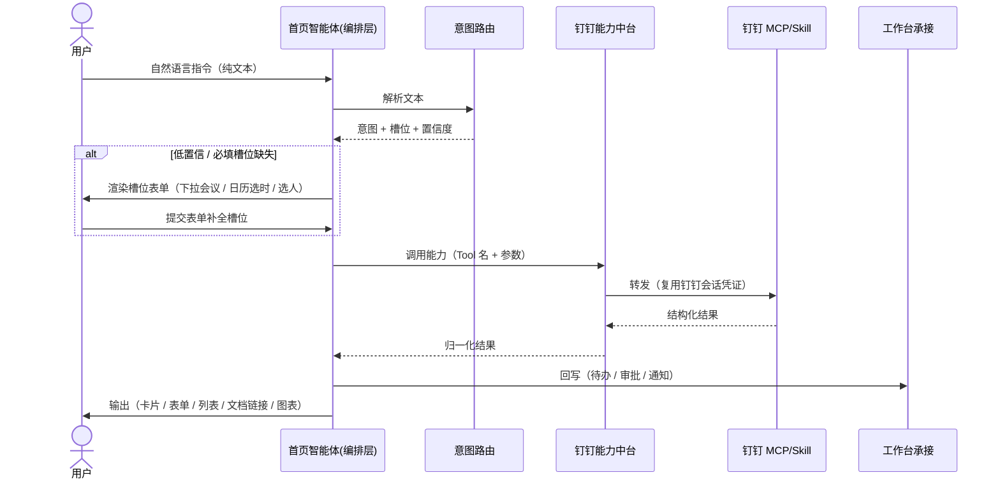
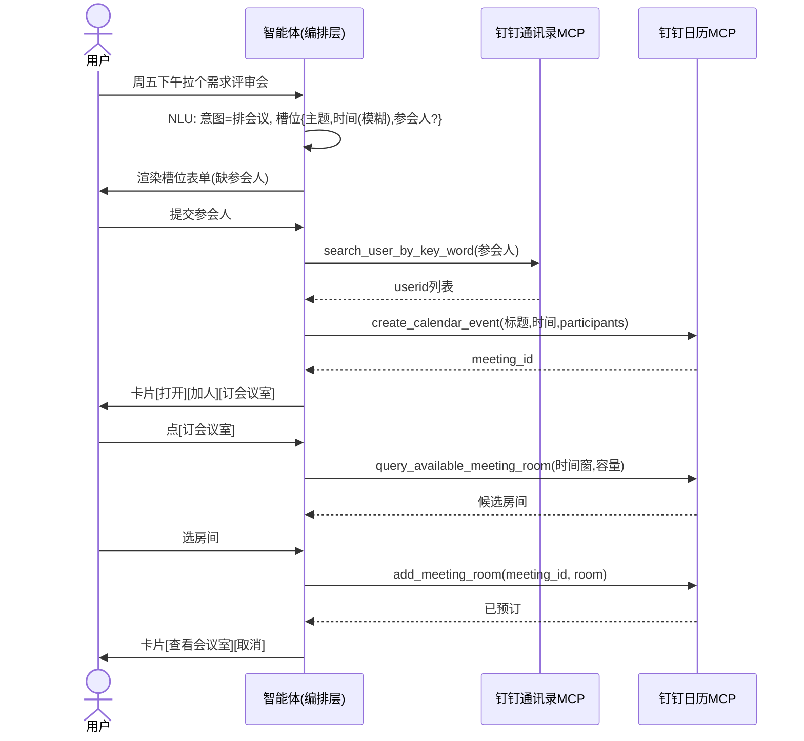
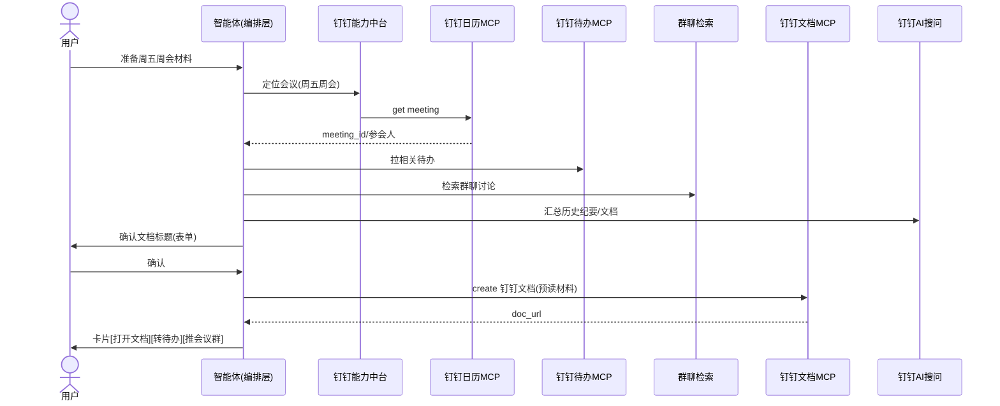
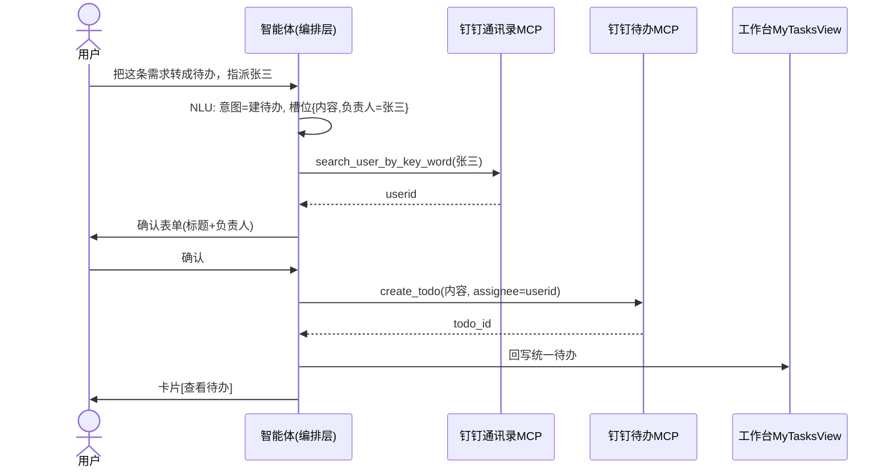
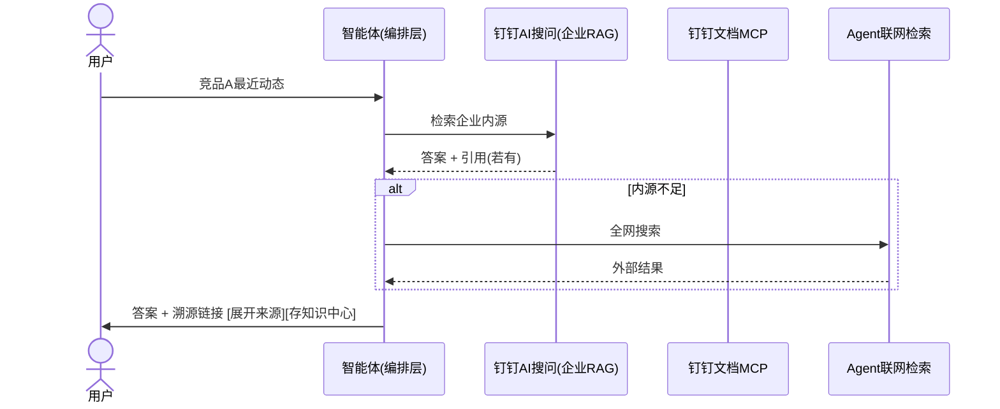
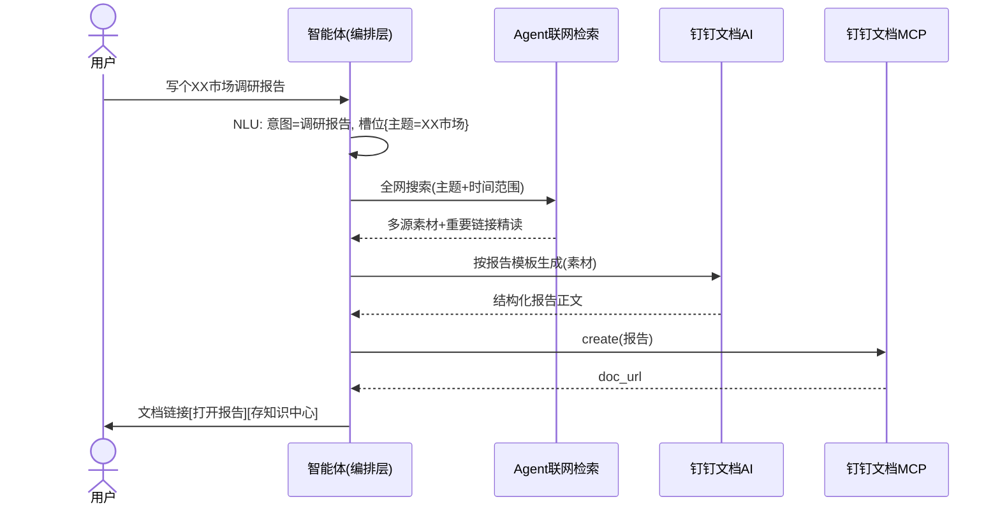
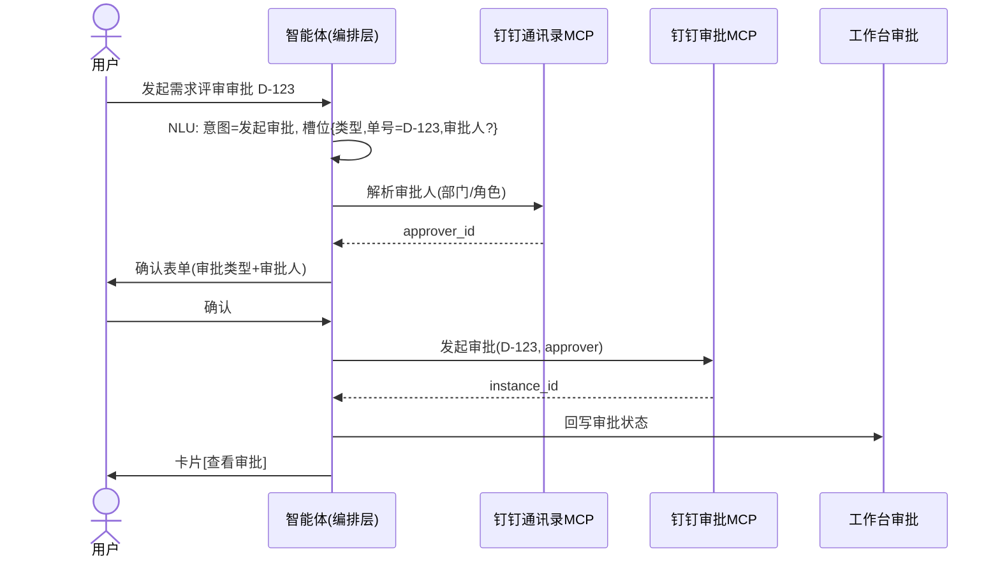

# 工作台 · 首页智能体 钉钉能力 用户故事地图（PRD）

## 1. 对话交互架构与实现方式（★主轴，最重要）

> 目标：把"用户一句话 → 系统做了什么 → 怎么选工具 → 输出什么"这条主链路说清楚。下面先给**架构**，再给**端到端时序**，再拆每个阶段。

### 1.1 整体架构

```
┌───────────────┐
│ 用户（钉钉身份）│  首页常驻对话入口（纯文本）
└──────┬────────┘
       │ 自然语言指令
       ▼
┌──────────────────────────────────────────────────────────┐
│ 对话交互编排层（首页智能体后端 Agent 服务）                  │
│   ① 输入理解 NLU（文本→语义）                                │
│   ② 意图路由（意图分类 + 易混淆消歧）                        │
│   ③ 槽位/表单澄清（缺参→渲染结构化表单）                     │
│   ④ 工具调度（意图+槽位 → 选具体 Tool，function calling）     │
│   ⑤ 输出渲染（卡片/表单/列表/文档链接/图表，多形态）          │
└──────┬───────────────────────────────────────────────────┘
       │ 调用（工具名 + JSON 参数）
       ▼
┌──────────────────────────────────────────────────────────┐
│ 钉钉能力中台（统一封装层）                                    │
│   职责：鉴权（复用钉钉会话凭证）/ 限流 / 错误归一 / 审计 / 重试 │
│   为每个钉钉能力注册为一个 Tool（带 JSON Schema 入参）         │
└──────┬───────────────────────────────────────────────────┘
       │
       ├─► 已连 MCP：钉钉 AI 表格(9555) / 钉钉文档(9629) / 日历(1050) / 待办(2034) / 通讯录(2400)；建议新增：钉钉表格(9704) / 钉钉知识库(9730) / 钉钉审批(2005) / Ding 消息(1023) / 视频会议(2701)
       ├─► 已认证 dws CLI：日历 / 通讯录 / 待办 / 审批 / 机器人 / AI表格 / AI搜问 / AI听记 / 知识库 …
       └─► （aihub Skill 经 dws CLI 安装被本组织拦截；但经 aihub 网页可安装/查看，已确认 链接速读/企业尽调/未读消息/群聊摘要 真实 ID，见 附录）
       │
       ▼
   钉钉开放平台 / 钉钉服务
       ▲
       │ 结果回写（待办/审批/通知）
┌──────┴───────────────────────────────────────────────────┐
│ 工作台承接（下游消费方，不单列章）                            │
│   MyTasksView 统一待办 / 审批状态回写 / 通知中心推送           │
└──────────────────────────────────────────────────────────┘
│ 工作台承接（下游消费方，不单列章） │
│ MyTasksView 统一待办 / 审批状态回写 / 通知中心推送 │
└──────────────────────────────────────────────────────────┘
```

**实现方式要点**

- **编排层 = LLM Agent + Function Calling**：每个钉钉能力封装成一个 Tool，含 JSON Schema 入参（如 `create_calendar_event({title,start,end,participant_userids})`）。NLU 输出意图+槽位后，由"工具调度"按路由表选定 Tool 并填参调用。
- **钉钉能力中台 = 统一封装**：所有 MCP/Skill 经中台调用，鉴权复用钉钉会话凭证（登录已打通），对上层屏蔽各 MCP 的鉴权/协议差异；做限流、错误归一、调用审计、失败重试。
- **前端（portal 首页智能体）**：负责渲染 ⑤ 输出形态，并把 ③ 表单澄清、⑤ 卡片按钮的提交事件回传编排层，形成多轮闭环。
 - **与工作台关系**：编排层在产出结果后，按场景把待办/审批/通知回写工作台承接方（MyTasksView/审批/通知中心）。
 - **统一接入层 = 已认证的 `dws` CLI + 已连 MCP**：实测 WorkBuddy 仅连 `钉钉表格`/`钉钉文档` 两 MCP；日历/通讯录/待办/审批/机器人/AI表格/知识库/AI搜问/AI听记/日志等全部通过**已认证的 `dws` CLI**（组织=江苏天马，用户=朝暮）调用。钉钉能力中台应统一封装"MCP + dws 服务"两类入口，对上层屏蔽差异（MCP 清单见 附录）。

### 1.1.1 一条指令的完整旅程（示例："周五下午拉个需求评审会"）

把上面 5 个阶段（① 输入理解 → ② 意图路由 → ③ 槽位表单澄清 → ④ 工具调度 → ⑤ 输出渲染）落到一条真实指令上，看清"识别路由、选工具、不清晰的命令做澄清、输出形态"如何串联：

1. **① 输入理解**：文本进入 → NLU 切出 `意图=排会议`；初始槽位：`主题=需求评审`、`时间=周五下午`(模糊)、`参会人=缺失`。
2. **② 意图路由**：命中"排/约/定 + 会议" → 路由到 **会议全程 M1**；意图置信度高，不进入澄清。
3. **③ 槽位表单澄清**：必填槽位"参会人"缺失 → 渲染结构化表单（非纯文本追问）：
 - `[主题: 需求评审]`（已填，可改）
 - `[时间: 周五 14:00]`（模糊时间已推算，可改）
 - `[参会人: 通讯录多选 ▾]`（必填，缺）
 
 用户从通讯录多选补全并提交 → 槽位回流，重新进入 ②。
4. **④ 工具调度**：意图+槽位 → 查映射表命中 `钉钉日历 MCP.create_calendar_event`；并用 `钉钉通讯录 MCP.search_user_by_key_word` 把参会人姓名解析为 `userid` 后填参。
5. **⑤ 输出渲染**：调用成功 → 输出**卡片**（非纯文本）：会议标题/时间/参会人/入会链接 + 按钮 `[打开日历][加参会人][订会议室(M2)]`。
6. **回写承接**：会议事件写入钉钉日历；若用户点 `[订会议室(M2)]` → 进入 M2 复用同一时间窗订房。

> 要点：**路由决定走哪条能力线，工具调度决定调哪个 MCP 的具体 Tool，澄清只在缺参/歧义时出现且一律用表单，输出按结果形态选卡片/列表/文档链接/图表**。这套机制对所有 38 个场景通用。

### 1.2 端到端流程（时序图）



各阶段职责：

1. **输入理解**：NLU 抽取意图与初始槽位（会议/时间/人/文档/事项…）。
2. **意图路由**：分类到 §2 的六大活动；低置信或易混淆（见 1.3）进入澄清。
3. **槽位/表单澄清**：必填槽位缺失或歧义 → 渲染结构化表单（非纯文本反问），用户填写后回流，重新进入 ②。
4. **工具调度**：按"意图+槽位 → 具体 Tool"映射（见 1.4、§3）选定并调用钉钉能力中台。
5. **输出渲染**：按结果形态选卡片/表单/列表/文档链接/图表（见 1.5）。

### 1.3 意图识别与路由

- 输入 → NLU → 路由到 §2 六大活动之一；**低置信度反问澄清，不擅自动作**。
- 易混淆路由（消歧靠槽位/上下文）：
 - "排/约/定 会议、订会议室、谁有空" → 会议全程（M1–M3）
 - "准备/整理/会前/brief/预读" → 会前材料（M4）
 - "写/整理 会议纪要、录音、开会" → 会后纪要（M6–M8）
 - "查看/创建/完成 待办、提醒我" → 任务与待办（T1–T5）
 - "搜一下/调研/最新动态/竞品/尽调" → 问答检索与文档（K1–K5 / D2–D4）
 - "速读/读这个链接" → 链接速读（K2）
 - "找复盘文档/查XX公司" → 文档查找/尽调（K3/K5）
 - "写调研报告/竞对分析/周报" → 文档创作（D2–D4）
 - "建跟踪表/填表格" → 文档与表格（D5/D6）
 - "发起审批/我的审批" → 审批（A1–A3）
 - "@人/指派给谁/数据组都有谁" → 沟通协同（C1–C5）
- **澄清触发条件**：必填槽位缺失（如建会议无时间）、槽位歧义（多会议/多群/多文档）、意图置信度 < 阈值。

### 1.4 需求澄清与槽位表单（表单为主，自然语言可补充）

当 1.3 触发澄清，渲染**澄清面板**——它是「结构化表单 + 自然语言输入框」的组合，不是纯文本反问：

- **表单区（AI 预填 + 可点击调整）**：必填槽位留空待填；**选填槽位由 AI 按启发式先填好候选值并标「AI 预填」**，用户可**逐字段点击直接改**（改时间弹日历、改人弹通讯录、改会议室弹空闲列表），改完依赖字段即时刷新（如换时间→会议室重算空闲）。详见 §1.8。
- **自然语言区（"补充说明"输入框）**：用户也可不选表单，直接打字，如"改成明早9点、再加个公输、提醒提前30分"。输入后**重新跑 NLU**，把新信息合并进槽位、刷新表单。两条路径殊途同归——最终都收敛为"槽位集合"。
- **提交即确认**：点「确认并创建」回填槽位→重入 1.2 ②；高利害可逆写（建文档/待办/发消息/审批）提交前不落库。
- 低利害场景（如"还有哪些待办"）免表单直接列清单。

示例（M1 缺主题）：面板 = `[主题:____][时间:____][参会人:多选__][会议室:AI预填 8F-3号][提醒:AI预填 15分]` + 底部"补充说明"框 → 用户点确认或打字补充 → 继续建会。

### 1.5 工具选择（意图+槽位 → 具体 Tool）

- 每个意图组合映射到**一个主 Tool + 可选兜底 Tool**（完整清单见 §3）：
 - 定会议 → `钉钉日历MCP.create_calendar_event`
 - 会前材料 → `会前材料Skill`（内部编排 日历/待办/群聊/文档）
 - 企业问答 → `钉钉AI搜问.query`（内源不足 → `Agent联网检索` 兜底）
 - 写调研报告 → `Agent联网检索` + `钉钉文档AI.generate`
 - 建多维表 → `钉钉AI表格MCP.create_sheet`
 - 发消息/@人 → `Ding 消息 MCP.send` / `ding`
 - 指派/找人 → `钉钉通讯录MCP.search_user_by_key_word`
- 调度层按映射表选 Tool，填槽位参数，经能力中台调用。

### 1.6 输出形态（多形态，不限于卡片）

- **卡片（带按钮）**：可操作结果，如会议已建、材料已生成 → `[入会][转待办][加人]`。
- **表单**：创建前确认标题、澄清槽位、审批发起填参。
- **列表（可筛选/可滚）**：待办并集、搜索结果、通讯录成员。
- **文档链接 / 富文本**：长文报告（调研/竞对/周报）附钉钉文档深链。
- **图表**：AI 表格仪表盘（情报监控、项目跟踪）。
- 原则：长文不入对话正文附链接；按钮分为「跳转钉钉」(用工具真实返回的 URL/深链) 与「对话内动作」(继续在操作内处理) 两类——**凡"跳转钉钉"按钮必须能真跳，跑不通的降级为动作按钮**（见 §1.9 按钮可行性矩阵）。

### 1.7 权限与兜底

- 仅读当前用户可见/被授权日历、待办、群聊、文档；无权限明确提示，不越权、不读私聊。
- MCP 不可用提示"钉钉 XX 能力暂未连接"并降级（如返 Markdown 全文）；单能力 3s、整体 10s 兜底返"部分结果"。
 - 数据缺失标注"未获取到"**严禁编造**；可逆写（建文档/待办）前先确认（表单/确认按钮）。

### 1.8 需求澄清表单规范（结构 · 控件 · 校验 · 场景映射）

澄清阶段渲染的"澄清面板"是**结构化表单 + 自然语言输入框的组合**，不是纯文本反问，也不只是必填表单。编排层在意图路由后若槽位缺失/歧义，返回 `clarify` 指令，前端据 `fields[]` 渲染控件 + 底部"补充说明"输入框（见 1.4）。**控件取值来源、回填参数、校验规则全部对齐实跑的钉钉 MCP 工具 schema**（见 附录）；**选填项由 AI 先预填候选值并标记 `ai_filled`，用户可点击逐字段改，也可用自然语言补充**。

**通用结构（编排层→前端）**

```json
{
 "clarify": {
 "intent": "create_meeting",
 "title": "补充会议信息",
 "fields": [
 { "key": "title", "label": "会议主题", "type": "text", "required": true, "value": "" },
 { "key": "start_time", "label": "开始时间", "type": "datetime", "required": true, "value": "" },
 { "key": "end_time", "label": "结束时间", "type": "datetime", "required": true, "value": "" },
 { "key": "participants", "label": "参会人", "type": "contact_multi", "required": true, "value": [], "source": "dingtalk_contacts" },
 { "key": "room", "label": "会议室", "type": "meeting_room", "required": false, "ai_filled": true, "value": "8F-3号【可视频】", "depends_on": ["start_time","end_time"], "source": "dingtalk_calendar_rooms" },
 { "key": "reminder", "label": "提前提醒", "type": "number", "required": false, "ai_filled": true, "unit": "分钟", "value": 15 }
 ],
 "natural_input": {
 "placeholder": "也可直接说，如：改成明早9点、再加个公输、提醒提前30分",
 "action": "reparse_slots"
 },
 "confirm_action": "确认并创建",
 "cancel_action": "取消"
 }
}
```

> 字段语义：`required:true`=必填留空待用户填；`required:false`+`ai_filled:true`=选填项由 AI 按启发式预填候选（见下"选填项与 AI 预填"），用户可点击字段直接改；`natural_input`=自然语言澄清入口，提交后重新跑 NLU 合并槽位。

**控件类型 → 渲染 / 数据源（实测 MCP 工具）/ 回填参数 / 校验规则**

| type | 渲染 | 数据源（实测 MCP 工具） | 回填参数 | 校验规则 |
| ---------------- | ------- | ------------------------------------------------------------------------------------- | ------------------------------------ | -------------------------------------------------- |
| `text` | 文本输入 | 本地 | 原值字符串 | 必填非空；不超过标题/描述字符上限（如 summary≤2048、description≤5000） |
| `textarea` | 多行文本 | 本地 | 原值 | K2/D2 正文；钉钉文档 markdown 换行须用真实 `\n` 非字面量 `\\n` |
| `datetime` | 时间控件 | 本地 | 日历→ISO-8601 `+08:00`；待办→unix ms | 必填；`end>start`；转参按工具要求格式化 |
| `date_range` | 起止时段 | 本地 | `startTime`/`endTime`（unix ms） | 用于闲忙/空闲会议室查询 |
| `contact_multi` | 通讯录多选 | 钉钉通讯录 MCP `search_user_by_key_word(keyWord)` | `userId[]`→`attendees`/`executorIds` | **必须经通讯录解析，禁止手填 userId**；命中多选需用户确认 |
| `contact_single` | 通讯录单选 | 同上 | `userId` | 用于指派单人 |
| `meeting_room` | 空闲会议室单选 | 钉钉日历 MCP `query_available_meeting_room(startTime,endTime)` 或 `search_rooms(roomName)` | `roomId` | 依赖 `date_range`；仅列"时段内空闲且可预定"；冲突提示换时段 |
| `doc_single` | 文档单选 | 钉钉文档 MCP `search_documents(keyword)` | `nodeId`(dentryUuid) | 用于"写进哪篇/从哪篇总结" |
| `doc_folder` | 文件夹/知识库 | 钉钉文档 MCP `list_nodes` | `folderId`/`workspaceId` | 创建文档落点 |
| `priority` | 枚举下拉 | 本地 | 10低/20普通/30较高/40紧急 | T2 待办 |
| `enum` | 枚举 | 本地 | 取值受限（如 `responseStatus`） | 选项来自工具定义 |
| `number` | 数字 | 本地 | 整数（分钟/次数） | 提醒提前量、循环次数 |

**选填项与 AI 预填（澄清表单的两大增强）**

1. **选填项也进表单**：`required:false` 的字段（会议室、提醒、优先级、截止、文档位置、时间范围…）不再"隐藏"，而是**显式列出并预填候选值**，让用户看到 AI 替他想到了什么、可一键改。
2. **AI 先填（ai_filled）**：编排层渲染前用启发式生成候选——会议室=`query_available_meeting_room` 返回的首个空闲会议室；提醒=默认 15 分钟；优先级=默认 20（普通）；截止=默认 +1 天；文档位置=默认个人空间；参会人=从指令已识别的名字解析。
3. **可点击调整**：每个字段可单独点击编辑（时间弹日历、人弹通讯录、会议室弹空闲列表），改完即时刷新依赖字段（如换时间→会议室重算空闲）。
4. **自然语言也可澄清**：面板底部"补充说明"输入框接受自由文本，提交后重新跑 NLU 把新信息合并进槽位、重渲染表单。两种入口殊途同归，最终都收敛为"槽位集合"再执行。

**触发与提交**

- 触发：必填槽位缺失、槽位歧义（多会议/多群/多文档列选）、意图置信度<阈值。
- 提交：`confirm_action` 回填槽位→重入 1.2 ②；`cancel_action` 放弃。
- 高利害可逆写（建文档/待办/发消息/发起审批）表单须带确认，动作确认前不落库。
- 低利害（查待办/查文档/找人）跳过表单直接列表。

**场景 → 必填槽位 → 表单字段映射**（驱动澄清；"—"=无需澄清直接执行；槽位取自工具 `required`）

| 场景 | 必填槽位（来源工具） | 表单字段（控件:数据源） |
| ----------------- | ------------------------------------------------ | -------------------------------------------------------------------------------------- |
| M1 定会议 | summary,startDateTime,endDateTime；(attendees 推荐) | 主题(text)·开始(datetime)·结束(datetime)·参会人(contact_multi)·会议室(meeting_room,选)·提醒(number,选) |
| M2 订会议室 | eventId(来自M1),roomId | 会议室(meeting_room:`query_available_meeting_room`,依赖M1时段) 或 会议室名(text→`search_rooms`) |
| M3 协调时间 | userIds,时间范围 | 参会人(contact_multi)·时间范围(date_range)·时长(number,选) |
| M4 会前材料 | 会议标识(eventId/主题+时间) | 选择会议(event_single:`list_calendar_events`) |
| M5 提醒 | 待办/会议标识,提前量 | 选择对象(todo_single/event_single)·提前量(number 分钟) |
| M6/M7 录音/纪要 | 会议/录音标识 | 选择会议(event_single) 或 上传 |
| M8 行动项→待办 | subject,executorIds | 行动项(text)·执行人(contact_multi)·截止(datetime,选) |
| T1 查待办 | —(免表单) | 可选筛选:状态(enum)·优先级(priority)·时间范围(date_range) |
| T2 建待办 | subject,executorIds；(dueTime,priority 选) | 标题(text)·执行人(contact_multi)·截止(datetime,选)·优先级(priority) |
| T3 完成待办 | taskId | 选择待办(todo_single:`get_user_todos` 列表) |
| T4 提醒待办 | taskId,提前量 | 选择待办·提前量(number) |
| T5 指派 | taskId,executorIds | 选择待办·执行人(contact_multi) |
| K1 企业问答 | query | 免表单直接答；多源冲突列选(enum) |
| K2 链接速读 | url | 链接(text,url 校验) |
| K3 文档查找 | —(keyword 选) | 免表单；关键词(text,选) |
| K4 全网搜索 | query | 关键词(text) |
| K5 调研报告 | 主题 | 主题(text)·时间范围(date_range,选)·输出位置(doc_folder,选) |
| D1 建文档 | name | 文档名(text)·位置(doc_folder,选)·初始内容(textarea,选) |
| D2/D3/D4 报告/分析/周报 | 主题(+数据源) | 同 K5/D1；数据来源(待办/文档聚合说明) |
| D5 建多维表 | nodeId(基于表),name | 表名(text)·基于表格(doc_single:钉钉表格) |
| D6 情报监控 | 主题/关键词+频率 | 监控主题(text)·频率(enum)·推送群(contact_single/群) |
| D7 读写表格 | nodeId+range | 表名(doc_single:钉钉表格)·范围(range:如 A2:D)·值(text/二维) |
| C1 群聊检索 | 群/关键词 | 群(contact_or_group)·关键词(text) |
| C2/C3 @人/发消息 | 接收人,内容 | 接收人(contact_multi)·内容(textarea)·[确认发送] |
| C4 找人 | keyWord | 关键词(text,免表单直接列表) |
| C5 指派建议 | 部门/角色 | 部门(dept_single)·角色(enum) |
| A1 发起审批 | 审批类型+表单字段 | 审批类型(enum)·按类型动态字段·[确认提交] |
| A2 查审批 | — | 状态(enum,选) |
| A3 催办 | taskId | 选择审批(instance_single) |

### 1.9 输出卡片规范（结构 · 字段 · 规则约束）

卡片用于"可操作结果"。长文/列表不进卡片（见规则 6/9）。

**通用结构（编排层→前端）**

```json
{
 "card": {
 "title": "会议已创建：需求评审",
 "subtitle": "周五 14:00–15:00 · 3 人",
 "fields": [
 { "label": "时间", "value": "2026-07-24 14:00–15:00 周五", "type": "datetime" },
 { "label": "参会人", "value": "张三、李四、王五", "type": "contacts" },
 { "label": "会议室", "value": "永澄亭", "type": "text" },
 { "label": "提醒", "value": "开始前 15 分钟", "type": "text" }
 ],
 "actions": [
 { "label": "入会", "action": "open_meeting", "url": "dingtalk://dingtalkclient/page/videoConfFromCalendar?confId=045089ab-459f-449b-9502-b96277afa05b&calendarId=24761268475" },
 { "label": "加参会人", "action": "add_participant" },
 { "label": "订会议室", "action": "book_room" }
 ],
 "source": [
 { "title": "需求评审-会前材料", "url": "https://alidocs.dingtalk.com/i/nodes/QG53mjyd80R16EQBfwBbo2nXV6zbX04v" }
 ],
 "footer": "由钉钉能力中台生成 · 数据来自你的日历"
 }
}
```

**字段规则与约束**

1. 时间显示本地化（"2026-07-24 14:00–15:00 周五"），不直接暴露 ISO 串或 unix ms；回填参数时再转 ISO `+08:00` / ms。
2. 人名显示"姓名"，不显示 userId；userId 仅内部传参。
3. 来源链接用钉钉 applink 或 https 深链，可点击；`source[]` 直接驱动"展开来源/打开"按钮。
4. **禁止编造**：未获取到字段显示灰度"未获取到"，不填充占位/假值。
5. 可逆写操作（建文档/待办/发消息/发起审批）卡片必须带确认按钮；确认前不落库。
6. 长文（报告/纪要）不整篇进卡片，卡片仅给摘要 + 「查看全文」文档链接。
7. 异常不暴露原始 API 错误码/JSON；显示友好文案（"该时段会议室已被占用，换一个？"）。
8. 主字段 ≤ 6，超出折叠进"更多"。
9. 列表型结果（待办/搜索/通讯录）用**列表形态**非卡片；列表项可点展开详情。
10. 所有时间/人名来自工具真实返回；卡片不二次加工语义。

**按钮可行性矩阵（实跑验证，2026-07-24）**

卡片按钮分两类，**"跳转钉钉"按钮能否真跳，取决于钉钉工具返回里是否携带可点 URL/深链**（本次已实跑抓取真实返回）。按用户约定：**跑不通的跳转按钮不设置，降级为对话内动作按钮**。

| 跳转目标 | 链接来源（实跑返回字段） | 真实格式 | 能否跳钉钉 | 处理 |
| ----------- | ---------------------------------------------------------- | ----------------------------------------------------------------------------------------------------- | ---------------------------------------- | --------------------------------------------------- |
| 文档 / 知识源 | 钉钉文档 MCP `get_recent_list.docUrl`、AI搜问 `result.url`(doc 类) | `https://alidocs.dingtalk.com/...`、`https://docs.dingtalk.com/i/nodes/...` | ✅ 可跳 | 直接渲染「打开文档」按钮 |
| 会话 / 消息溯源 | AI搜问 `result.url` | `https://applink.dingtalk.com/page/conversation?cid=...&msgId=...` | ✅ 可跳 | 直接渲染「打开会话」按钮 |
| 会议入会（线上会议） | 钉钉日历 MCP `onlineMeetingInfo.url` | `dingtalk://dingtalkclient/page/videoConfFromCalendar?confId=...&calendarId=...` | ✅ 可跳 | **仅当** `onlineMeetingInfo` 存在时显示「入会」按钮 |
| 会议详情页 | 钉钉日历 MCP 返回 `calendarId`（实跑如 `24761268475`） | 自构造 `dingtalk://dingtalkclient/page/calendar?calendarId={calendarId}` | ✅ 可跳 | 渲染「打开会议」按钮（仅线上会议有 `onlineMeetingInfo.url` 时用「入会」优先） |
| 待办详情 | 钉钉待办 MCP `get_user_todos` 返回 `taskId`（实跑如 `55418241139`） | 自构造 `dingtalk://dingtalkclient/page/todo?todoId={taskId}` | ✅ 可构造（⚠️ 联调确认参数名 `todoId` 与 `taskId` 等价） | 渲染「打开待办」按钮 |
| 通讯录 profile | 钉钉通讯录 MCP / dws contact 返回 `name`（实跑如 `朝暮`） | 自构造 `dingtalk://dingtalkclient/page/contact?keyword={姓名}`（搜索定位到人，再进详情） | ✅ 可跳（keyword 搜索定位，非直达详情） | 列表项「打开」按钮跳通讯录并定位 |
| 审批详情 | dws oa（审批流）返回 `processInstanceId` | 自构造 `dingtalk://dingtalkclient/page/approval?processInstanceId={processInstanceId}`（待 dws oa 实测确认字段名） | ✅ 可构造（⚠️ 联调确认） | 渲染「查看」按钮 |

> 规则总结：✅ 跳转按钮**优先**用工具返回的 `url`/`docUrl`/`onlineMeetingInfo.url`；若工具未返回 URL 但返回了可构造深链的主键（`calendarId` / `taskId` / `姓名` / `processInstanceId`），用钉钉[统一跳转协议](https://open.dingtalk.com/document/development/unified-jump-protocol)自构造 `dingtalk://dingtalkclient/page/...` 深链，仍标 ✅。仅当既无 URL 又无可构造主键、且未确认 AppLink 时，才降级为 🔧 对话内动作按钮。前端渲染规则：有 `url`（含自构造深链）才渲染跳转按钮，否则只渲染动作按钮。

**场景 → 输出形态与主字段**

| 场景 | 输出形态 | 卡片/列表 主字段 | 按钮（✅=已验证可跳钉钉 / 🔧=对话内动作 / ❓=待验证暂不设） |
| ----------- | ------- | ---------------------- | ----------------------------------------------------------- |
| M1 定会议 | 卡片 | 标题·时间·参会人·会议室·提醒 | 🔧[加人]🔧[订会议室]；✅[入会]（仅线上会议有 `onlineMeetingInfo.url`） |
| M2 订会议室 | 卡片/提示 | 会议室名·时段·状态(已订/冲突) | 🔧[换时段] |
| M3 协调时间 | 列表 | 推荐时段(时间·空闲人) | 🔧[采用] |
| M4 会前材料 | 卡片+文档链接 | 材料文档链接·包含(纪要草案/议程/参会人) | ✅[打开文档](docUrl)🔧[转待办] |
| M5 提醒 | 提示卡片 | 提醒对象·提前量·状态 | — |
| M6/M7 录音/纪要 | 卡片+文档链接 | 纪要文档链接·摘要·待办数 | ✅[查看](docUrl)🔧[转待办] |
| M8 行动项→待办 | 卡片 | 已建待办·执行人·截止 | ✅[打开待办](dingtalk://page/todo?todoId=taskId)🔧\[完成\]\[改] |
| T1 查待办 | 列表 | 待办(标题·截止·优先级·状态) 可筛选 | ✅\[打开]🔧\[完成\]\[改] |
| T2 建待办 | 卡片 | 标题·执行人·截止·优先级 | ✅[打开待办](dingtalk://page/todo?todoId=taskId)🔧\[完成\]\[改] |
| T3/T4/T5 | 提示/卡片 | 操作结果状态 | — |
| K1 企业问答 | 卡片+来源 | 答案摘要·来源列表(标题·链接) | ✅\[展开来源\](applink 会话/文档 url) |
| K2 链接速读 | 卡片 | 速读摘要·要点·原文链接 | ✅[打开原文](原链接) |
| K3 文档查找 | 列表 | 文档(标题·类型·更新时间·链接) | ✅[打开](docUrl) |
| K4 全网搜索 | 列表/卡片 | 结果(标题·摘要·链接) | ✅[打开](外链) |
| K5 调研报告 | 卡片+文档链接 | 报告链接·关键结论 | ✅[打开报告](docUrl) |
| D1–D4 文档创作 | 卡片+文档链接 | 文档链接·字数/结构 | ✅[打开](docUrl)🔧[分享] |
| D5/D6 表格/监控 | 卡片+图表 | 表/仪表盘链接·关键指标 | ✅[打开](docUrl/表链) |
| D7 读写表格 | 列表/卡片 | 表名·变更行数·摘要 | 🔧[查看表格] |
| C1 群聊检索 | 列表/卡片 | 群聊结论摘要·来源消息链接 | ✅[打开会话](applink) |
| C2/C3 发消息 | 提示卡片 | 发送结果·接收人 | 🔧[查看]（⚠️ 不可跳对方会话，仅展示结果） |
| C4 找人 | 列表 | 成员(姓名·部门·职位) | ✅[打开](dingtalk://page/contact?keyword=姓名) |
| C5 指派建议 | 列表 | 推荐人选(姓名·匹配理由) | 🔧[指派] |
| A1 发起审批 | 卡片 | 审批单号·类型·状态 | ✅[查看](dingtalk://page/approval?processInstanceId=xxx)🔧[催办] |
| A2 查审批 | 列表 | 审批(类型·发起时间·状态) | 🔧[查看] |
| A3 催办 | 提示卡片 | 催办结果 | — |

---

## 2. 用户故事地图

### 2.1 场景总览（全量 · 逻辑顺序：会议→任务→检索→文档→沟通→审批）

> 按真实工作流排序。编号（英文）供 §2.2–2.7 引用。每行：场景 / 触发语 / 钉钉开放能力 / 价值 / 落点。

**【一、会议全程】**

| # | 场景 | 触发语示例 | 钉钉开放能力 | 价值 | 落点 |
| -- | -------- | -------------------- | -------------------------------------------------------------------------------------------------------------------------------------------------------------------------------------------------- | ------ | ----------- |
| M1 | 定会议/约会议 | "排一下需求评审""周五下午拉个会" | [钉钉日历 MCP](https://aihub.dingtalk.com/#/detail?mcpId=1050\&detailType=marketMcpDetail) | 确定会议 | 钉钉日历 |
| M2 | 订会议室 | "订个 3 楼大会议室" | [钉钉日历 MCP](https://aihub.dingtalk.com/#/detail?mcpId=1050\&detailType=marketMcpDetail) | 锁定场地 | 日历 |
| M3 | 协调参会人时间 | "数据组谁周五有空""张总下周几空" | [钉钉日历 MCP](https://aihub.dingtalk.com/#/detail?mcpId=1050\&detailType=marketMcpDetail) + [钉钉通讯录 MCP](https://aihub.dingtalk.com/#/detail?mcpId=2400\&detailType=marketMcpDetail) | 排期 | 对话 |
| M4 | 会前材料准备 | "准备周五周会材料""整理明天例会预读" | [钉钉会前材料 Skill](https://aihub.dingtalk.com/#/detail/skill?skillId=WLni3fJPr3WB) | 自动汇总 | 钉钉文档+知识中心 |
| M5 | 会议提醒 | "会前 10 分钟提醒我" | [钉钉待办 MCP](https://aihub.dingtalk.com/#/detail?mcpId=2034\&detailType=marketMcpDetail) / \[Ding 消息 MCP\](<https://aihub.dingtalk.com/#/detail?mcpId=1023\&detailType=marketMcpDetail) | 不遗漏 | 钉钉 |
| M6 | 会议录音转写 | "开会""会议录音""自动录音" | [钉钉 AI 听记](https://www.dingtalk.com/) | 音视频转文字 | 纪要 |
| M7 | 会后结构化纪要 | "生成会议纪要""帮我记录会议" | [钉钉 AI 听记](https://www.dingtalk.com/) | 要点+决议 | 钉钉文档 |
| M8 | 会议行动项转待办 | "把行动项转待办""会议待办" | [钉钉待办 MCP](https://aihub.dingtalk.com/#/detail?mcpId=2034\&detailType=marketMcpDetail) | 决议跟进 | MyTasksView |

**【二、任务与待办】**

| # | 场景 | 触发语示例 | 钉钉开放能力 | 价值 | 落点 |
| -- | ----- | ----------------- | -------------------------------------------------------------------------------------------------------------------------------------------------------------------------------------------------- | ---- | ----------- |
| T1 | 查我的待办 | "我有哪些待办""还有哪些事" | [钉钉待办 MCP](https://aihub.dingtalk.com/#/detail?mcpId=2034\&detailType=marketMcpDetail) | 待办并集 | MyTasksView |
| T2 | 建待办 | "把这条需求转成待办""建个跟进" | [钉钉待办 MCP](https://aihub.dingtalk.com/#/detail?mcpId=2034\&detailType=marketMcpDetail) + [钉钉通讯录 MCP](https://aihub.dingtalk.com/#/detail?mcpId=2400\&detailType=marketMcpDetail) | 责任到人 | 钉钉+工作台 |
| T3 | 完成待办 | "标记完成""这条做完了" | [钉钉待办 MCP](https://aihub.dingtalk.com/#/detail?mcpId=2034\&detailType=marketMcpDetail) | 双端同步 | 双端 |
| T4 | 指派任务 | "指派给张三""派给售后组" | [钉钉通讯录 MCP](https://aihub.dingtalk.com/#/detail?mcpId=2400\&detailType=marketMcpDetail) | 精准指派 | 待办 |
| T5 | 定时提醒 | "提醒我下午 3 点跟进" | [钉钉待办 MCP](https://aihub.dingtalk.com/#/detail?mcpId=2034\&detailType=marketMcpDetail) / \[Ding 消息 MCP\](<https://aihub.dingtalk.com/#/detail?mcpId=1023\&detailType=marketMcpDetail) | 到点推送 | 钉钉 |

**【三、知识问答与检索】**

| # | 场景 | 触发语示例 | 钉钉开放能力 | 价值 | 落点 |
| -- | ------ | --------------------- | ------------------------------------------------------------------------------------------------------------------------------ | --------- | ------ |
| K1 | 企业知识问答 | "竞品 A 最近动态""季度推广目标多少" | [钉钉 AI 搜问](https://www.dingtalk.com/) + [钉钉知识库 MCP](https://aihub.dingtalk.com/#/detail?mcpId=9730\&detailType=marketMcpDetail) + [钉钉文档 MCP](https://aihub.dingtalk.com/#/detail?mcpId=9629\&detailType=marketMcpDetail) | 精准作答(带溯源) | 对话 |
| K2 | 链接速读 | "速读这个链接""总结这篇文章" | \[链接速读 Skill\](<https://aihub.dingtalk.com/#/detail/skill?skillId=>CUEVpnSo0LTh) | 摘要/观点 | 对话 |
| K3 | 文档查找 | "找一下需求评审复盘文档" | [钉钉文档 MCP](https://aihub.dingtalk.com/#/detail?mcpId=9629\&detailType=marketMcpDetail) | 定位文档 | 对话(链接) |
| K4 | 全网搜索 | "搜一下最新政策""行业最新动态" | \[Agent联网检索\](<https://aihub.dingtalk.com/#/detail/skill?) | 实时资讯 | 对话 |
| K5 | 企业信用尽调 | "查一下 XX 公司""背调" | \[企业信用智能尽调 Skill\](<https://aihub.dingtalk.com/#/detail/skill?skillId=>cI1OvpK6R0h6) | 尽调报告 | 对话/文档 |

**【四、文档与表格创作（具体场景）】**

| # | 场景 | 触发语示例 | 钉钉开放能力 | 价值 | 落点 |
| -- | -------- | ------------------ | ---------------------------------------------------------------------------------------------------------------------------------------------------------------------------------------------------------------------------------------------------------------------------------------------- | ----- | -------- |
| D1 | 会议纪要落盘 | （同 M7）纪要写入文档 | [钉钉文档 MCP](https://aihub.dingtalk.com/#/detail?mcpId=9629\&detailType=marketMcpDetail) / [钉钉文档 AI](https://www.dingtalk.com/) | 沉淀可检索 | 钉钉文档 |
| D2 | 写调研报告 | "写个 XX 市场调研报告" | \[Agent联网检索\](<https://aihub.dingtalk.com/#/detail/skill?) + [钉钉文档 AI](https://www.dingtalk.com/) | 结构化报告 | 钉钉文档 |
| D3 | 竞对分析 | "做个竞品分析""对比 A 和 B" | [钉钉 AI 搜问](https://www.dingtalk.com/) + \[Agent联网检索\](<https://aihub.dingtalk.com/#/detail/skill?) + [钉钉文档 AI](https://www.dingtalk.com/) | 竞品报告 | 钉钉文档 |
| D4 | 周报/项目复盘 | "生成本周周报""项目复盘总结" | [钉钉 AI 搜问](https://www.dingtalk.com/) + [钉钉文档 AI](https://www.dingtalk.com/) | 报告 | 钉钉文档 |
| D5 | 建项目跟踪多维表 | "建个需求跟踪表""把数据填进表格" | [钉钉 AI 表格 MCP](https://aihub.dingtalk.com/#/detail?mcpId=9555\&detailType=marketMcpDetail) | 表格/BI | 钉钉 AI 表格 |
| D6 | 竞品情报监控推送 | "监控竞对动态自动推我" | \[Agent联网检索\](<https://aihub.dingtalk.com/#/detail/skill?) + [钉钉 AI 表格 MCP](https://aihub.dingtalk.com/#/detail?mcpId=9555\&detailType=marketMcpDetail) + \[Ding 消息 MCP\](<https://aihub.dingtalk.com/#/detail?mcpId=1023\&detailType=marketMcpDetail) | 自动推送 | 钉钉 |
| D7 | 读写/更新业务表格 | "读一下业务场景需求表""把这条需求状态更新到表格""在表末尾加一行" | [钉钉表格 MCP](https://aihub.dingtalk.com/#/detail?mcpId=9704\&detailType=marketMcpDetail)（`get_range`/`set_range`/`append_rows`） | 数据维护 | 钉钉表格 |

**【五、沟通协同】**

| # | 场景 | 触发语示例 | 钉钉开放能力 | 价值 | 落点 |
| -- | ------- | ----------------------- | --------------------------------------------------------------------------------------------------------------------------------------------------------------------------------------------------- | ----- | -- |
| C1 | 群聊检索/消息处理 | "XX 群讨论的竞品结论""总结未读消息""群里上线时间约定" | [钉钉 AI 搜问](https://www.dingtalk.com/) / [未读消息总结 Skill](https://aihub.dingtalk.com/#/detail/skill?skillId=MDhp9Pf6iCpI) / [群聊内容摘要 Skill](https://aihub.dingtalk.com/#/detail/skill?skillId=hPBr83ckN0oi) | 项目上下文+消息处理 | 对话 |
| C2 | @人提醒 | "@一下售后负责人""提醒张三看下" | [钉钉通讯录 MCP](https://aihub.dingtalk.com/#/detail?mcpId=2400\&detailType=marketMcpDetail) + \[Ding 消息 MCP\](<https://aihub.dingtalk.com/#/detail?mcpId=1023\&detailType=marketMcpDetail) | 触达 | 钉钉 |
| C3 | 发群/单聊消息 | "在 XX 群发个通知""给张三发消息" | \[Ding 消息 MCP\](<https://aihub.dingtalk.com/#/detail?mcpId=1023\&detailType=marketMcpDetail) | 推送 | 钉钉 |
| C4 | 找人/查部门 | "数据组都有谁""找负责售后的" | [钉钉通讯录 MCP](https://aihub.dingtalk.com/#/detail?mcpId=2400\&detailType=marketMcpDetail) | 组织查询 | 对话 |
| C5 | 指派建议 | "这需求派给谁合适" | [钉钉通讯录 MCP](https://aihub.dingtalk.com/#/detail?mcpId=2400\&detailType=marketMcpDetail) | 人选建议 | 对话 |

**【六、审批流转】**

| # | 场景 | 触发语示例 | 钉钉开放能力 | 价值 | 落点 |
| -- | ---- | ------------------------ | ---------------------------------------------------------------------------------------------------------------- | ---- | -- |
| A1 | 发起审批 | "发起需求评审审批 D-123""提交权限申请" | [钉钉审批 MCP](https://aihub.dingtalk.com/#/detail?mcpId=2005\&detailType=marketMcpDetail) + [钉钉通讯录 MCP](https://aihub.dingtalk.com/#/detail?mcpId=2400\&detailType=marketMcpDetail) | 移动审批 | 钉钉 |
| A2 | 查审批 | "我的审批到哪了""D-123 批了没" | [钉钉审批 MCP](https://aihub.dingtalk.com/#/detail?mcpId=2005\&detailType=marketMcpDetail) + [钉钉通讯录 MCP](https://aihub.dingtalk.com/#/detail?mcpId=2400\&detailType=marketMcpDetail) | 状态透明 | 对话 |
| A3 | 催审批 | "催一下张总审批" | [钉钉审批 MCP](https://aihub.dingtalk.com/#/detail?mcpId=2005\&detailType=marketMcpDetail)（催办 tool） | 加速 | 钉钉 |

> 共 **38 个场景**（M1–M8 / T1–T5 / K1–K5 / D1–D7 / C1–C5 / A1–A3）。下文 §2.2–2.7 逐个展开交互逻辑；并在每个活动组挑代表性场景补 Mermaid 时序图示范：M1+M2 会议调度、M4 会前材料、T2 建待办、K1 企业问答、D2 调研报告、A1 审批（共 6 张），其余场景按同模式展开。

### 2.2 会议全程（生命周期顺序）【M1–M8】

**M1 定会议/约会议**

- **触发语**：「排一下需求评审」「周五下午拉个会」「约个周会」
- **意图识别**：含 排/约/定 + 会议/会；抽取实体——主题、时间、参会人
- **调用能力**：[钉钉日历 MCP](https://aihub.dingtalk.com/#/detail?mcpId=1050\&detailType=marketMcpDetail) → `create_calendar_event`
- **交互逻辑**：
 1. 抽取主题/时间/参会人；缺主题/时间 → 渲染槽位表单反问（见 1.4）
 2. 时间模糊（「周五」）→ 推算本周五具体日期并展示确认
 3. 有参会人 → [钉钉通讯录 MCP](https://aihub.dingtalk.com/#/detail?mcpId=2400\&detailType=marketMcpDetail) `search_user_by_key_word` 解析 userid；匹配多个列选；未知降级姓名文本
 4. `create_calendar_event` 建日程并拉入参会人
 5. 返回会议卡片（标题/时间/参会人/入会链接）
- **输出**：卡片 `[打开会议] [加参会人] [订会议室(M2)]`
- **澄清表单字段（详见 §1.8 M1 行）**：主题(text)·开始(datetime·ISO-8601 +08:00)·结束(datetime)·参会人(contact_multi→通讯录解析 userId)·会议室(meeting_room·依赖时段)·提醒(number 分钟)。`create_calendar_event` 的必填正是 summary/startDateTime/endDateTime，表单一一对应。
- **输出卡片字段（详见 §1.9 M1 行）**：标题·时间(本地化)·参会人(姓名)·会议室·提醒 + 按钮[打开会议](dingtalk://page/calendar?calendarId=会议id)\[加参会人\]\[订会议室]。
- **兜底**：日历不可用提示「日历未连接」降级为建议时间文本；参会人解析失败不阻断、留空待补。

> 其余场景（M2–M8 / T1–T5 / K1–K5 / D1–D7 / C1–C5 / A1–A3）的"澄清表单字段 / 输出卡片字段"均按此范式，直接查 §1.8 / §1.9 映射表，不再逐条复述。

**M2 订会议室**

- **触发语**：「订个 3 楼大会议室」「约个能坐 10 人的房间」
- **意图识别**：订/约 + 会议室/房间；抽取实体——容量、楼层、时间段
- **调用能力**：[钉钉日历 MCP](https://aihub.dingtalk.com/#/detail?mcpId=1050\&detailType=marketMcpDetail) → `query_available_meeting_room` + `add_meeting_room`
- **交互逻辑**：
 1. 若已绑定 M1 会议，复用其时间窗；否则反问时间
 2. 按容量/楼层过滤 `query_available_meeting_room`
 3. 多个候选列选；无符合提示「无空房」并放宽条件重试
 4. `add_meeting_room` 预订，回写会议日程
- **输出**：卡片 `[查看会议室] [取消预订]`
- **兜底**：无空闲 → 提示换时段/换楼层；权限不足提示申请



**M3 协调参会人时间**

- **触发语**：「数据组谁周五有空」「张总下周几空」「拉个大家都有空的会」
- **意图识别**：谁有空/闲忙/排期；抽取实体——人员或部门、时间范围
- **调用能力**：[钉钉日历 MCP](https://aihub.dingtalk.com/#/detail?mcpId=1050\&detailType=marketMcpDetail) `query_busy_status` + [钉钉通讯录 MCP](https://aihub.dingtalk.com/#/detail?mcpId=2400\&detailType=marketMcpDetail) `get_dept_user_list`
- **交互逻辑**：
 1. 解析人员列表（个人→通讯录；部门→`get_dept_user_list` 展开成员）
 2. 取时间窗 `query_busy_status` 查闲忙
 3. 求交集推荐时间段，列选确认
 4. 确认后跳转 M1 建会
- **输出**：列表 `[采用该时段] [换时段]`
- **兜底**：有人无日历权限标注「未知」；超时扩大窗口前后 2h 重试

**M4 会前材料准备**（旗舰场景 · 补时序图）

- **触发语**：「准备周五周会材料」「整理明天例会的预读」
- **意图识别**：准备/整理/会前/brief/预读
- **调用能力**：[钉钉会前材料 Skill](https://aihub.dingtalk.com/#/detail/skill?skillId=WLni3fJPr3WB)（日历→听记→待办→群聊→文档→建文档）
- **交互逻辑（7 步）**：
 1. 定位会议（M1 的 `meeting_id`，或反问选会议）
 2. 拉取该会议相关待办（[钉钉待办 MCP](https://aihub.dingtalk.com/#/detail?mcpId=2034\&detailType=marketMcpDetail)）
 3. 检索相关群聊讨论（dws chat / 群聊 MCP）
 4. 汇总历史纪要/文档（[钉钉文档 MCP](https://aihub.dingtalk.com/#/detail?mcpId=9629\&detailType=marketMcpDetail) + [钉钉 AI 搜问](https://www.dingtalk.com/)）
 5. 生成结构化预读材料
 6. **建文档前确认标题**（表单/确认按钮，防误写）
 7. 创建钉钉文档，附链接
- **输出**：卡片 `[打开文档] [转待办(M8)] [推会议群(C3)]`
- **兜底**：无关联会议反问；素材缺失标注「未获取」禁编造；文档无权限提示申请



**M5 会议提醒**

- **触发语**：「会前 10 分钟提醒我」「开会前叫我」
- **意图识别**：提醒/叫 + 会议
- **调用能力**：[钉钉待办 MCP](https://aihub.dingtalk.com/#/detail?mcpId=2034\&detailType=marketMcpDetail)（提醒型待办）或 \[Ding 消息 MCP\](<https://aihub.dingtalk.com/#/detail?mcpId=1023\&detailType=marketMcpDetail)（DING 强提醒）
- **交互逻辑**：
 1. 关联会议时间（M1 `meeting_id`）
 2. 计算提醒时刻（提前 N 分钟，默认 10）
 3. 建提醒型待办 / 发 DING 强提醒
- **输出**：卡片 `[已完成提醒设置]`
- **兜底**：会议时间缺失反问；机器人不可用降级待办

**M6 会议录音转写**

- **触发语**：「开会」「开始录音」「会议录音」
- **意图识别**：开会/录音/转写
- **调用能力**：[钉钉 AI 听记](https://www.dingtalk.com/)
- **交互逻辑**：
 1. 识别进行中会议（M1 或当前会议）
 2. 启动 AI 听记转写（实时音视频→文字）
 3. 过程可标记重点（一键笔记）
- **输出**：卡片 `[查看实时转写] [标记重点]`
- **兜底**：无录音权限提示；硬件未接入提示手动上传录音

**M7 会后结构化纪要**

- **触发语**：「生成会议纪要」「帮我记录会议」
- **意图识别**：纪要/记录/总结
- **调用能力**：[钉钉 AI 听记](https://www.dingtalk.com/)
- **交互逻辑**：
 1. 取 M6 转写稿
 2. 提炼：要点 / 决议 / 行动项 / 负责人 / 时间
 3. 结构化输出，写钉钉文档（D1）
 4. 返回纪要卡片
- **输出**：卡片 `[打开纪要] [转行动项(M8)]`
- **兜底**：无转写稿提示先开 M6；隐私片段按权限过滤

**M8 会议行动项转待办**

- **触发语**：「把行动项转待办」「会议待办」
- **意图识别**：行动项/待办 + 会议
- **调用能力**：[钉钉待办 MCP](https://aihub.dingtalk.com/#/detail?mcpId=2034\&detailType=marketMcpDetail)（创建待办）
- **交互逻辑**：
 1. 从 M7 纪要抽取行动项（事项/负责人/截止）
 2. 负责人经 [钉钉通讯录 MCP](https://aihub.dingtalk.com/#/detail?mcpId=2400\&detailType=marketMcpDetail) 解析 userid
 3. 逐条创建待办并推送负责人
 4. 回写工作台 MyTasksView
- **输出**：列表 `[查看待办列表]`
- **兜底**：无行动项标「无」；负责人未知降级姓名待人工指派

### 2.3 任务与待办【T1–T5】

**T1 查我的待办**

- **触发语**：「我有哪些待办」「还有哪些事没做」
- **意图识别**：查/看 + 待办/事
- **调用能力**：[钉钉待办 MCP](https://aihub.dingtalk.com/#/detail?mcpId=2034\&detailType=marketMcpDetail)（查询）+ 工作台 MyTasksView 并集
- **交互逻辑**：1. 拉钉钉待办 + 工作台业务待办 2. 按截止时间/来源分组 3. 返回待办列表
- **输出**：列表 `[打开待办] [标记完成(T3)]`
- **兜底**：钉钉不可用仍显业务待办

**T2 建待办**

- **触发语**：「把这条需求转成待办」「建个跟进」
- **意图识别**：建/转 + 待办/跟进；抽取实体——内容、负责人、截止
- **调用能力**：[钉钉待办 MCP](https://aihub.dingtalk.com/#/detail?mcpId=2034\&detailType=marketMcpDetail) + [钉钉通讯录 MCP](https://aihub.dingtalk.com/#/detail?mcpId=2400\&detailType=marketMcpDetail)
- **交互逻辑**：1. 抽取内容；负责人经通讯录解析 userid 2. **确认标题（表单，防误写）** → 创建待办 3. 推送负责人
- **输出**：卡片 `[查看待办]`
- **兜底**：负责人未知降级姓名



**T3 完成待办**

- **触发语**：「标记完成」「这条做完了」
- **意图识别**：完成/做完 + 待办
- **调用能力**：[钉钉待办 MCP](https://aihub.dingtalk.com/#/detail?mcpId=2034\&detailType=marketMcpDetail)（更新状态，双向同步）
- **交互逻辑**：1. 定位 `todo_id`（上下文或反问选）2. 更新状态→完成，双端同步幂等
- **输出**：卡片 `[已同步]`
- **兜底**：双端冲突提示最新状态

**T4 指派任务**

- **触发语**：「指派给张三」「派给售后组」
- **意图识别**：指派/派给 + 人/组
- **调用能力**：[钉钉通讯录 MCP](https://aihub.dingtalk.com/#/detail?mcpId=2400\&detailType=marketMcpDetail)（解析 userid / 部门成员）
- **交互逻辑**：1. 解析目标（个人→userid；组→部门成员展开）2. 绑定到待办/任务并推送
- **输出**：卡片 `[已指派]`
- **兜底**：无对应人列部门手选

**T5 定时提醒**

- **触发语**：「提醒我下午 3 点跟进」「下周一提醒我」
- **意图识别**：提醒 + 时间 + 事项
- **调用能力**：[钉钉待办 MCP](https://aihub.dingtalk.com/#/detail?mcpId=2034\&detailType=marketMcpDetail)（提醒型）/ \[Ding 消息 MCP\](<https://aihub.dingtalk.com/#/detail?mcpId=1023\&detailType=marketMcpDetail)（DING）
- **交互逻辑**：1. 抽取事项+时间 2. 建提醒型待办/发 DING
- **输出**：卡片 `[提醒已设]`
- **兜底**：时间歧义反问

### 2.4 知识问答与检索【K1–K5】

**K1 企业知识问答**（旗舰场景 · 补时序图）

- **触发语**：「竞品 A 最近动态」「季度推广目标多少」
- **意图识别**：问 + 企业内知识
- **调用能力**：[钉钉 AI 搜问](https://www.dingtalk.com/)（企业 RAG）+ [钉钉文档 MCP](https://aihub.dingtalk.com/#/detail?mcpId=9629\&detailType=marketMcpDetail)
- **交互逻辑**：
 1. 路由：先 AI 搜问/RAG（企业内源）
 2. 缺则补 \[Agent联网检索\](<https://aihub.dingtalk.com/#/detail/skill?)（web）
 3. 答案带引用溯源（文档深链）
 4. 权限过滤（仅可见源）
- **输出**：卡片 `[展开来源] [存入知识中心]`
- **兜底**：无可靠来源标「未找到依据」禁编造



**K2 链接速读**

- **触发语**：「速读这个链接」「总结这篇文章」
- **意图识别**：速读/读 + 链接
- **调用能力**：\[链接速读 Skill\](<https://aihub.dingtalk.com/#/detail/skill?skillId=>CUEVpnSo0LTh)（秘塔+小宿双引擎）
- **交互逻辑**：1. 取 URL 2. 双引擎速读 → 摘要/观点/要点 3. 返回结构化速读卡片
- **输出**：卡片 `[查看全文] [存入知识中心]`
- **兜底**：链接失效提示；长文分节

**K3 文档查找**

- **触发语**：「找一下需求评审复盘文档」
- **意图识别**：找/查 + 文档
- **调用能力**：[钉钉文档 MCP](https://aihub.dingtalk.com/#/detail?mcpId=9629\&detailType=marketMcpDetail)（搜索）
- **交互逻辑**：1. 关键词检索文档 2. 多候选列选 3. 返回链接卡片
- **输出**：卡片 `[打开文档]`
- **兜底**：无结果建议扩大关键词

**K4 联网搜索**

- **触发语**：「搜一下最新政策」「行业最新动态」
- **意图识别**：搜/最新动态 + 外部
- **调用能力**：Agent 通用联网检索（无特定钉钉 Skill）
- **交互逻辑**：1. 抽取查询词+时间范围 2. 联网检索 + 结果聚合 3. 结构化输出
- **输出**：卡片 `[展开来源] [转调研报告(D2)]`
- **兜底**：无结果提示换词

**K5 企业信用尽调**

- **触发语**：「查一下 XX 公司」「背调」
- **意图识别**：查企业/尽调/背调/风险
- **调用能力**：\[企业信用智能尽调 Skill\](<https://aihub.dingtalk.com/#/detail/skill?skillId=>cI1OvpK6R0h6)（芝麻+百望+企享云）
- **交互逻辑**：1. 抽取企业名 2. 多源交叉验证（工商/股权/知产/风险）3. 生成尽调报告（可写文档）
- **输出**：卡片 `[查看报告] [存入知识中心]`
- **兜底**：企业不存在提示

### 2.5 文档与表格创作（具体场景）【D1–D6】

**D1 会议纪要落盘**

- **触发语**：（同 M7）纪要写入文档
- **意图识别**：落盘/沉淀
- **调用能力**：[钉钉文档 MCP](https://aihub.dingtalk.com/#/detail?mcpId=9629\&detailType=marketMcpDetail) / [钉钉文档 AI](https://www.dingtalk.com/)
- **交互逻辑**：M7 纪要 → 创建钉钉文档 → 返回链接
- **输出**：卡片 `[打开文档]`
- **兜底**：无权限提示申请

**D2 写调研报告**

- **触发语**：「写个 XX 市场调研报告」
- **意图识别**：写/调研报告
- **调用能力**：\[Agent联网检索\](<https://aihub.dingtalk.com/#/detail/skill?) + [钉钉文档 AI](https://www.dingtalk.com/)
- **交互逻辑**：1. K4 全网搜索采集 2. 文档 AI 按报告模板生成 3. 创建钉钉文档
- **输出**：文档链接 `[打开报告]`
- **兜底**：素材不足标注



**D3 竞对分析**

- **触发语**：「做个竞品分析」「对比 A 和 B」
- **意图识别**：竞对/竞品分析
- **调用能力**：[钉钉 AI 搜问](https://www.dingtalk.com/) + \[Agent联网检索\](<https://aihub.dingtalk.com/#/detail/skill?) + [钉钉文档 AI](https://www.dingtalk.com/)
- **交互逻辑**：1. 内部 AI 搜问取竞品已知信息 2. 全网搜索补外部动态 3. 文档 AI 生成对比报告
- **输出**：文档链接 `[打开报告] [配图(可选)]`
- **兜底**：缺一方标注

**D4 周报/项目复盘**

- **触发语**：「生成本周周报」「项目复盘总结」
- **意图识别**：周报/复盘
- **调用能力**：[钉钉 AI 搜问](https://www.dingtalk.com/)（基于聊天/文档）+ [钉钉文档 AI](https://www.dingtalk.com/)
- **交互逻辑**：1. 取周期内聊天/文档/待办 2. 文档 AI 生成周报/复盘 3. 创建文档
- **输出**：文档链接 `[打开]`
- **兜底**：周期无数据提示

**D5 建项目跟踪多维表**

- **触发语**：「建个需求跟踪表」「把数据填进表格」
- **意图识别**：建表/填表格
- **调用能力**：[钉钉 AI 表格 MCP](https://aihub.dingtalk.com/#/detail?mcpId=9555\&detailType=marketMcpDetail)（多维表/自动填表/仪表盘）
- **交互逻辑**：1. 解析表结构（字段/场景）2. 创建多维表，自动建字段 3. 可选自动填表/仪表盘
- **输出**：图表/表格 `[打开表格]`
- **兜底**：字段映射失败回退手动

**D6 竞品情报监控推送**

- **触发语**：「监控竞对动态自动推我」
- **意图识别**：监控/情报/推送
- **调用能力**：[钉钉 AI 表格 MCP](https://aihub.dingtalk.com/#/detail?mcpId=9555\&detailType=marketMcpDetail) + \[Ding 消息 MCP\](<https://aihub.dingtalk.com/#/detail?mcpId=1023\&detailType=marketMcpDetail)
- **交互逻辑**：1. 设监控主题（竞对/政策/专利）2. 定时检索 → 写入 AI 表格多维表 3. Ding 消息 MCP 自动推送变更
- **输出**：图表 `[查看情报表]`
- **兜底**：推送失败转站内信

**D7 读写/更新业务表格**

- **触发语**：「读一下业务场景需求表」「把这条需求状态更新到表格」「在表末尾加一行」「把会议纪要回填到跟踪表」
- **意图识别**：读表/写表/更新行/追加行
- **调用能力**：[钉钉表格 MCP](https://aihub.dingtalk.com/#/detail?mcpId=9555\&detailType=marketMcpDetail)（已连；`get_range` / `set_range` / `append_rows` / `get_all_sheets`）
- **交互逻辑**：
 1. 解析目标表（用户给表名/链接 → `get_all_sheets` 定位 nodeId；多表列选）
 2. 读：`get_range` 取指定区域 → 返回表格内容（列表/卡片，超长折叠）
 3. 写/更新：`set_range` 按行号+列更新单元格；缺行号 → 澄清表单（范围 `range` text/datetime）
 4. 追加：`append_rows` 在表尾加一行/多行
 5. **确认即落库**（高利害可逆写，提交前不写）；大批量变更先预览 diff
- **输出**：卡片 `[表名·变更行数·摘要]` `🔧[查看表格]`（表格深链待联调；无则返回表名+区域）
- **兜底**：表不存在提示先建表（D5）；无写权限提示申请；区域越界提示

### 2.6 沟通协同【C1–C5】

**C1 群聊检索/摘要**

- **触发语**：「XX 群讨论的竞品结论」「群里上线时间约定」
- **意图识别**：群/讨论 + 检索/摘要
- **调用能力**：[钉钉 AI 搜问](https://www.dingtalk.com/)（跨会议记录）/ dws chat
- **交互逻辑**：1. 定位群（`openConversationId`，多群列选）2. 检索/摘要 3. 返回要点+来源消息
- **输出**：卡片 `[展开消息]`
- **兜底**：无权限提示

**C2 @人提醒**

- **触发语**：「@一下售后负责人」「提醒张三看下」
- **意图识别**：@/提醒 + 人
- **调用能力**：[钉钉通讯录 MCP](https://aihub.dingtalk.com/#/detail?mcpId=2400\&detailType=marketMcpDetail) + \[Ding 消息 MCP\](<https://aihub.dingtalk.com/#/detail?mcpId=1023\&detailType=marketMcpDetail)（DING）
- **交互逻辑**：1. 解析目标 userid 2. 发 DING/群@ 强提醒
- **输出**：卡片 `[已提醒]`
- **兜底**：目标未知列部门

**C3 发群/单聊消息**

- **触发语**：「在 XX 群发个通知」「给张三发消息」
- **意图识别**：发 + 消息/通知
- **调用能力**：\[Ding 消息 MCP\](<https://aihub.dingtalk.com/#/detail?mcpId=1023\&detailType=marketMcpDetail)（发送）
- **交互逻辑**：1. 定位会话（群/单聊）2. **确认内容（表单/确认按钮，防误发）** → 发送
- **输出**：卡片 `[已发送] [撤回]`
- **兜底**：无权限提示

**C4 找人/查部门**

- **触发语**：「数据组都有谁」「找负责售后的」
- **意图识别**：找/查 + 人/部门
- **调用能力**：[钉钉通讯录 MCP](https://aihub.dingtalk.com/#/detail?mcpId=2400\&detailType=marketMcpDetail)（搜索/部门）
- **交互逻辑**：1. 解析关键词 2. 返回人员/部门结构
- **输出**：列表 `[查看成员]`
- **兜底**：无结果提示

**C5 指派建议**

- **触发语**：「这需求派给谁合适」
- **意图识别**：派给谁/建议
- **调用能力**：[钉钉通讯录 MCP](https://aihub.dingtalk.com/#/detail?mcpId=2400\&detailType=marketMcpDetail)（角色/部门）
- **交互逻辑**：1. 解析需求属性 2. 按角色/负载推荐人选 3. 列选
- **输出**：列表 `[采纳指派(T4)]`
- **兜底**：无匹配列部门

### 2.7 审批流转【A1–A3】

**A1 发起审批**

- **触发语**：「发起需求评审审批 D-123」「提交权限申请」
- **意图识别**：发起/提交 + 审批
- **调用能力**：[钉钉审批 MCP](https://aihub.dingtalk.com/#/detail?mcpId=2005\&detailType=marketMcpDetail) + [钉钉通讯录 MCP](https://aihub.dingtalk.com/#/detail?mcpId=2400\&detailType=marketMcpDetail)
- **交互逻辑**：1. 解析审批类型+业务单号 2. 解析审批人 userid 3. 发起审批 4. 回写工作台审批状态
- **输出**：卡片 `[查看审批]`
- **兜底**：审批 MCP 未接用 OpenAPI 兜底



**A2 查审批**

- **触发语**：「我的审批到哪了」「D-123 批了没」
- **意图识别**：查 + 审批/状态
- **调用能力**：[钉钉审批 MCP](https://aihub.dingtalk.com/#/detail?mcpId=2005\&detailType=marketMcpDetail) + [钉钉通讯录 MCP](https://aihub.dingtalk.com/#/detail?mcpId=2400\&detailType=marketMcpDetail)
- **交互逻辑**：1. 定位审批单 2. 返回当前节点/审批人
- **输出**：卡片 `[催办(A3)]`
- **兜底**：超时标「审批中(待确认)」

**A3 催审批**
- **触发语**：「催一下张总审批」
- **意图识别**：催 + 审批
- **调用能力**：[钉钉审批 MCP](https://aihub.dingtalk.com/#/detail?mcpId=2005\&detailType=marketMcpDetail)（催办 tool，直接触发审批系统催办通知）
- **交互逻辑**：1. 定位审批单+当前审批人 2. 调用审批 MCP 催办 tool 3. 返回催办结果
- **输出**：卡片 `[查看审批进度]`
- **兜底**：催办失败提示手动联系

---

## 附录：需要接入的钉钉能力

### MCP（10 个）

| MCP | mcpId | 核心工具 | 承载场景 |
|-----|-------|---------|---------|
| [钉钉 AI 表格](https://aihub.dingtalk.com/#/detail?mcpId=9555&detailType=marketMcpDetail) | 9555 | get_range（读区域）/ set_cell_range（写单元格）/ append_rows（追加行）/ get_all_sheets（工作表列表）、多维表/透视表/仪表盘/自动填表 | D5/D6 |
| [钉钉表格](https://aihub.dingtalk.com/#/detail?mcpId=9704&detailType=marketMcpDetail) | 9704 | get_range（读）/ set_cell_range（写）/ append_rows（追加）/ get_all_sheets（工作表）/ create_sheet（建表）/ delete_sheet（删表）/ sort_range（排序）/ find_cells（查找）/ replace_all（替换）/ merge_cells（合并）/ clear_range（清空）/ copy_range（复制）/ table_get（结构化读）/ table_put（结构化写）/ set_range_from_csv（CSV导入）/ get_range_as_csv（CSV导出） | D7 |
| [钉钉文档](https://aihub.dingtalk.com/#/detail?mcpId=9629&detailType=marketMcpDetail) | 9629 | create_document（创建文档）/ search_documents（搜索）/ get_document_content（读取内容）/ insert_document_block（插入块）/ update_document_block（更新块）/ list_nodes（知识库目录）/ 权限管理 | M4/M7/D1-D4/K1/K3 |
| [钉钉知识库](https://aihub.dingtalk.com/#/detail?mcpId=9730&detailType=marketMcpDetail) | 9730 | create_wikiSpace（创建知识库）/ get_wikiSpace（获取信息）/ delete_wikiSpace（删除）/ search_wikiSpaces（搜索）/ list_wikiSpaces（列表）/ add_member（添加成员）/ remove_member（移除成员）/ update_member（修改角色）/ list_member（成员列表） | K1 |
| [钉钉日历](https://aihub.dingtalk.com/#/detail?mcpId=1050&detailType=marketMcpDetail) | 1050 | create_calendar_event（创建日程）/ list_calendar_events（查日程）/ query_busy_status（查闲忙）/ query_available_meeting_room（查会议室）/ add_calendar_participant（加参会人）/ add_meeting_room（订会议室） | M1/M2/M3 |
| [钉钉待办](https://aihub.dingtalk.com/#/detail?mcpId=2034&detailType=marketMcpDetail) | 2034 | create_personal_todo（创建待办）/ get_user_todos（查待办）/ update_todo_done_status（标完成）/ add_task_executors（加执行人）/ remove_task_executors（移除）/ add_todo_reminder（设提醒） | M5/M8/T1-T3 |
| [钉钉通讯录](https://aihub.dingtalk.com/#/detail?mcpId=2400&detailType=marketMcpDetail) | 2400 | search_user_by_key_word（搜人）/ get_user_info_by_user_ids（用户详情）/ get_dept_members_by_deptId（部门成员）/ get_sub_depts_by_dept_id（子部门）/ search_dept_by_keyword（搜部门） | M3/T2/T4/C2/C4/C5/A1/A2 |
| [钉钉审批](https://aihub.dingtalk.com/#/detail?mcpId=2005&detailType=marketMcpDetail) | 2005 | list_pending_approvals（待处理审批）/ get_processInstance_detail（审批详情）/ approve_processInstance（同意）/ reject_processInstance（拒绝）/ **oa_ding_user（催办）** / revoke_processInstance（撤销）/ redirect_task（转交）/ revert_task（退回） | A1-A3 |
| [Ding 消息](https://aihub.dingtalk.com/#/detail?mcpId=1023&detailType=marketMcpDetail) | 1023 | send_ding_message（发DING：应用内/短信/电话）/ recall_ding_message（撤回DING） | M5/C2/C3/D6 |
| [钉钉视频会议](https://aihub.dingtalk.com/#/detail?mcpId=2701&detailType=marketMcpDetail) | 2701 | create_meeting_reservation（预约会议）/ invite_meeting_participants（邀请入会） | M1/M3 |

### aihub Skill（5 个，经 aihub 网页安装）

| Skill | skillId | 能力 | 承载场景 |
|-------|---------|------|---------|
| [会前材料准备](https://aihub.dingtalk.com/#/detail/skill?skillId=WLni3fJPr3WB) | WLni3fJPr3WB | 7 步 dws CLI 编排：日历-听记-待办-群聊搜索-群消息-文档搜索-文档创建，输出含待办/讨论/风险的结构化会前材料 | M4 |
| [链接速读](https://aihub.dingtalk.com/#/detail/skill?skillId=CUEVpnSo0LTh) | CUEVpnSo0LTh | 双引擎速读：秘塔(9400)全文抓取 + 小宿(9394)智能总结，支持标准/快速/深度/批量四种模式，输出摘要+关键词+观点 | K2 |
| [企业信用智能尽调](https://aihub.dingtalk.com/#/detail/skill?skillId=cI1OvpK6R0h6) | cI1OvpK6R0h6 | 多源交叉验证：工商(企享云9371)+股权/知产/风险(芝麻2692/2694/2695)+交易伙伴(百望2525)，生成四步尽调报告 | K5 |
| [未读消息总结](https://aihub.dingtalk.com/#/detail/skill?skillId=MDhp9Pf6iCpI) | MDhp9Pf6iCpI | 获取未读会话列表(MCP 9932+dws CLI)，逐会话 AI 汇总，按高/中/低优先级输出处理建议 | C1 |
| [群聊内容摘要](https://aihub.dingtalk.com/#/detail/skill?skillId=hPBr83ckN0oi) | hPBr83ckN0oi | 拉取群聊消息-提取议题/决策/行动项/风险-生成结构化钉钉文档(dws CLI chat+doc) | C1 |
