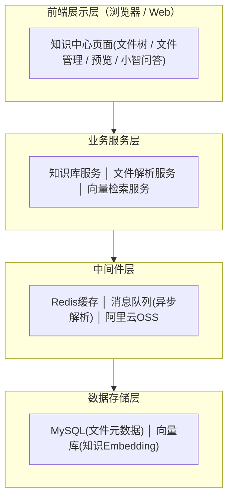
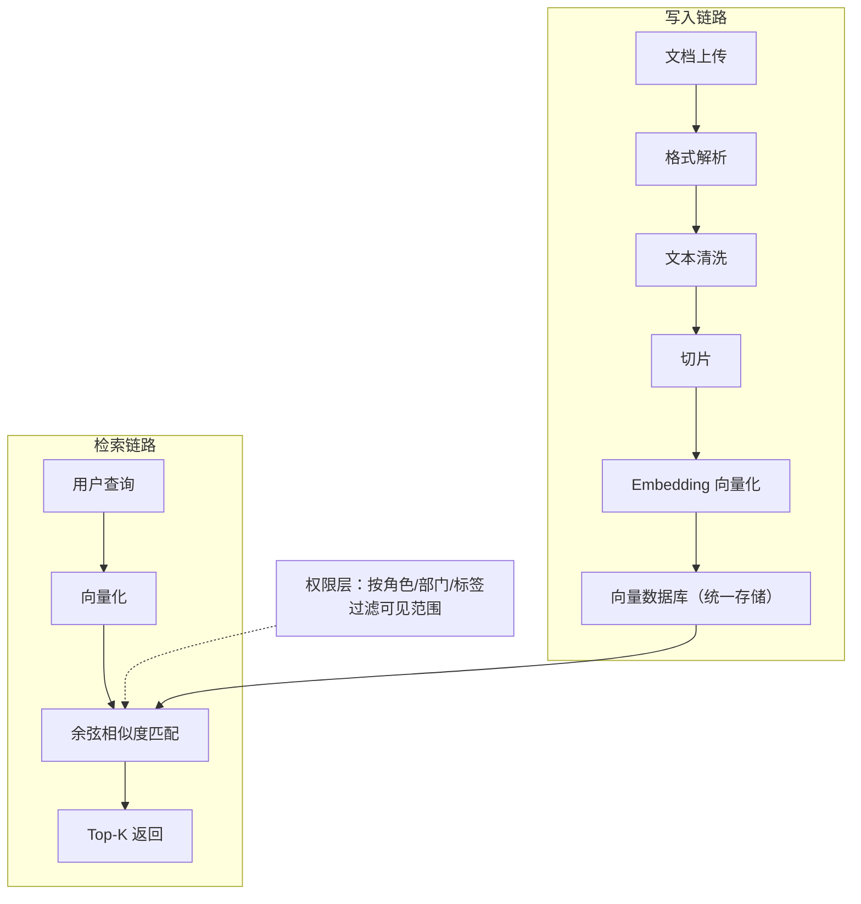
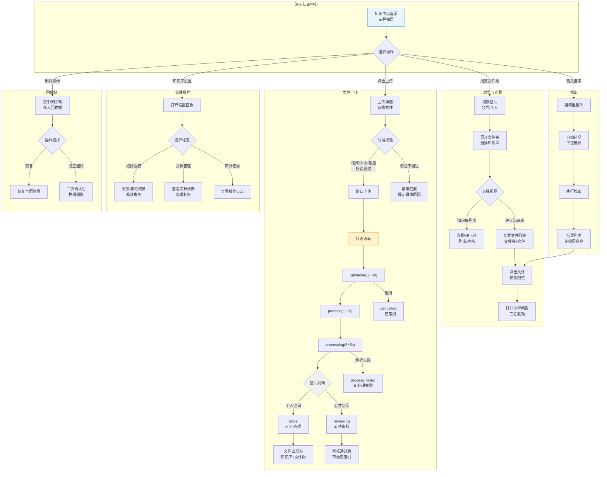
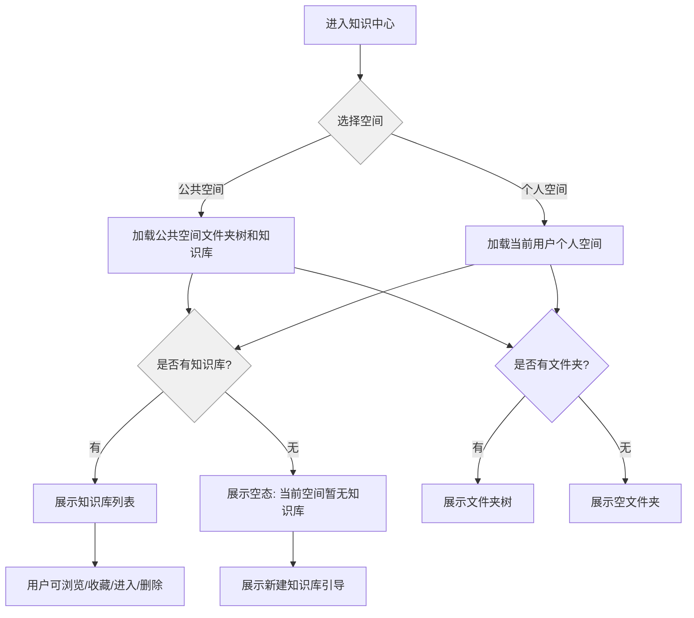
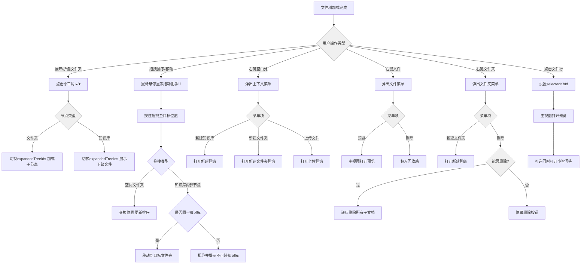
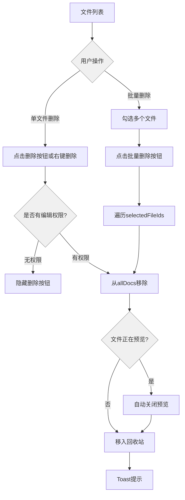
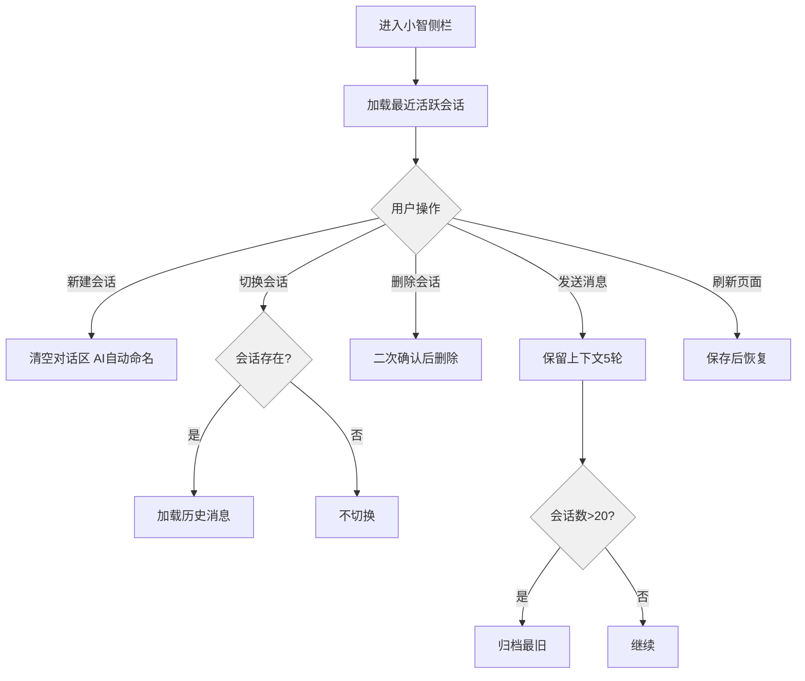
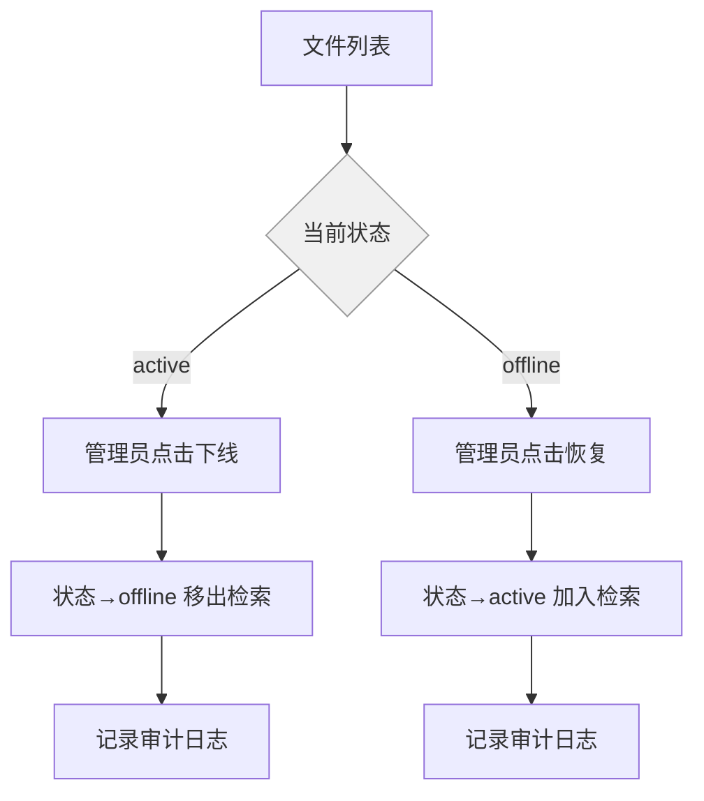

# 20260702-【PRD】AI工作门户（MVP）-知识中心

> **适用版本**：MVP-1 v1.7.x
> **设计原则**：纯状态标识无进度条、轻量化交互、低成本落地、权限安全优先

---

## 目录

1. [一、产品概述](#一产品概述)
2. [二、技术架构](#二技术架构)
3. [三、页面与交互详细需求](#三页面与交互详细需求)
   - [3.0 推荐讲述顺序（按角色身份）](#30-推荐讲述顺序按角色身份)
   - [3.1 整体布局](#31-整体布局)
   - [3.2 文件管理](#32-文件管理)
   - [3.3 知识库问答](#33-知识库问答)
   - [3.4 权限管理](#34-权限管理)
   - [3.5 操作反馈与安全合规](#35-操作反馈与安全合规)
   - [3.6 落地优先级与迭代路线](#36-落地优先级与迭代路线)
4. [四、多格式文件解析](#四多格式文件解析)
5. [五、附录](#五附录)

---

## 一、产品概述

### 1.1 产品定位

**知识中心**是天马智擎平台的核心 Tab 页，定位为**统一知识库管理平台**的前端界面。提供空间文件夹管理、知识库管理、文件管理、文件预览、上传任务和基于知识库的智能问答能力。

### 1.2 命名体系

| 名称 | 含义 | 使用场景 |
| --- | --- | --- |
| **知识中心** | 统一知识管理入口 | Tab 名称、页面标题 |
| **小智** | 知识中心内置问答助手 | 问答侧栏的品牌名、引导文案 |
| **公共空间** | 全员可见的知识空间 | 公司制度、全员公告、共享方案 |
| **个人空间** | 仅创建者可见的知识空间 | 个人草稿、笔记、临时资料 |

### 1.3 目标用户

| 用户分层 | 核心人群 | 核心诉求 |
| --- | --- | --- |
| 知识库管理员 | 各业务部门知识管理负责人 | 上传文件、审核公共空间上传、维护知识库结构 |
| 普通员工 | 全体内部员工 | 查阅公开文档、利用小智问答查询信息 |

---

## 二、技术架构

### 2.1 四层技术架构



### 2.2 统一知识库平台原理

**核心原则：不做独立知识库，做统一知识库平台**

不同业务场景的知识库（方案匹配库、直播话术库、考勤规定库等）本质完全相同：文档上传 → 向量化存储 → 语义检索。不应为每个业务建立独立实体，而是在统一平台上通过标签、权限、分类实现差异化访问。

**统一架构**：



**区分方式**（不是独立建库，而是打标签 + 设权限）：

| 区分维度 | 实现方式 | 示例 |
| --- | --- | --- |
| 公开 vs 私有 | `visibility` 字段 | 考勤规定=public；定制方案=department 可见 |
| 业务分类 | `tags` 标签数组 | 上传时打标签，检索时过滤 |
| 角色授权 | `capability_permissions` 表 | 方案专员可检索方案池；全员可检索通用知识 |
| 部门归属 | `department_id` 字段 | 营销中心的知识仅营销部门默认可见 |

### 2.3 用户整体流程图



**流程图说明**：

| 流程 | 说明 |
|------|------|
| **浏览流程** | 进入知识中心 → 切换空间 → 浏览文件树 → 选择知识库 → 查看文件列表 → 预览文件 → 小智问答联动 |
| **上传流程** | 点击上传 → 前端校验（格式/大小/数量） → 确认上传 → uploading→pending→processing→done（个人）或 reviewing（公共） |
| **搜索流程** | 搜索框输入 → 自动补全建议 → 执行搜索 → 结果高亮 → 点击预览 |
| **管理流程** | 知识库设置 → 成员授权 / 文档管理 / 审计记录 |
| **回收站流程** | 删除操作 → 回收站 → 恢复或彻底删除 |

---

## 三、页面与交互详细需求

### 3.0 推荐讲述顺序（按角色身份）

为方便演示和培训，知识中心建议按“先空间坐标、再权限规则、再用户动作”的顺序讲解。这样听众先知道功能摆放位置，再理解为什么同样的操作在不同人眼里会不一样。

#### 0. 整体布局（3分钟）

先搭舞台，说明功能分布在什么位置。

- 讲清三栏结构：左侧文件树 / 中间主区 / 右侧预览 + 小智
- 展示 6 种联动状态：仅文件树、仅主区、主区+预览、主区+小智、预览+小智、全开联动
- 目的：给后面的权限和使用讲解提供空间坐标

#### 1. 权限管理（8分钟）管理员视角

先讲管理员做了什么配置，后面的用户使用才能理解“为什么有些东西看不到”。

- 双空间隔离：公共空间 vs 个人空间
- 成员与角色：`OWNER → MANAGER → EDITOR → DOWNLOADER → READER`
- 部门级权限预设：本部门读写 / 全公司阅读 / 指定部门 / 公开
- 密级管控：公开 / 内部 / 秘密 / 机密，检索前过滤
- 审计与启用：操作留痕、文件上线/下线控制
- 关键规则：只有知识库和文件支持权限设置，文件夹不支持权限配置

#### 2. 用户使用（20分钟）用户视角

用户进来之后，按使用频率从高到低讲。

- 浏览与查看：切空间、展开文件树、进入知识库、查看文件预览
- 上传文件：上传弹窗、前端校验、状态流转、个人空间自动完成 / 公共空间待审核
- 搜索与标签：自动补全、结果高亮、标签筛选、标签可二次编辑
- 知识库问答：小智侧栏、问答模式、会话管理、引用溯源
- 删除与恢复：回收站、恢复、彻底删除、30 天期限

#### 3. 原型补充点

- 根空间默认只展示空间文件夹，不直接展开具体知识库；进入空间文件夹后再展示知识库
- 文件树点击规则：小三角负责展开/收起，点击节点文本只切换右侧主视图
- 文件预览与小智问答可同时存在，预览页不强制关闭小智
- 文档标签支持列表/卡片内直接修改，修改后立即影响上传候选标签池
- 文档预览支持多标签、大纲导航和引用跳转高亮

### 3.1 整体布局

#### 3.1.1 功能需求描述

知识中心采用三栏联动布局，左侧是文件树与空间导航，中间是主视图区，右侧是文件预览与小智问答联动区。默认状态下左侧可折叠，中间主区始终可见，右侧在文件预览或问答打开时按需出现。

三栏的职责要分得很清楚：
- 左侧负责“找内容”，包含空间、文件夹、知识库和回收站入口
- 中间负责“看内容”，显示列表、详情、预览或空态
- 右侧负责“问内容”，预览和小智可以同时存在，不再互相挤掉

当前原型需要重点保证六种联动状态：
- 仅左侧文件树
- 仅中间主区
- 主区 + 文件预览
- 主区 + 小智问答
- 文件预览 + 小智问答
- 三栏全开联动

##### 需求描述（EARS模式）

**普遍型**：
- 系统应在用户进入知识中心时默认展示当前空间的文件树和主视图。
- 系统应始终保留左侧树的折叠/展开入口。
- 系统应允许文件预览和小智问答同时打开。

**状态驱动型**：
- 当用户关闭左侧文件树时，系统应将中间内容区扩展为全宽。
- 当用户打开文件预览时，系统应在中间主区切换到预览态，文件列表隐藏。
- 当用户打开小智问答时，系统应在右侧展示问答侧栏，不影响文件预览。

**事件驱动型**：
- 当用户点击文件时，系统应打开文件预览区，并保持主视图上下文不丢失。
- 当用户点击折叠按钮时，系统应以 `translate-x` 动画收起左侧栏。

**不良行为型**：
- 如果当前文件无预览能力，系统应展示不可预览原因，并保留下载或重新处理入口。
- 如果右侧空间不足，系统应优先保留当前预览态，不自动挤掉已打开的问答。


#### 3.1.2 业务主流程图及说明

参见 2.3 用户整体流程图。

#### 3.1.3 界面原型

| 操作 | 交互 | 截图/示例 |
|------|------|-----------|
| 默认进入知识中心 | 展示左侧文件树 + 中间主区；右侧按需出现 | 参见 Figma 原型 v1.0 |
| 关闭左侧文件树 | 点击折叠按钮，左栏收起为窄条 dock | — |
| 展开左侧文件树 | 点击 dock 的展开按钮恢复左栏 | — |
| 点击文件行 | 中间主区切换为文件预览视图；右侧可同时打开小智 | — |
| 关闭文件预览 | 点击预览区关闭按钮，主区回到文件管理或概览 | — |
| 关闭小智问答侧栏 | 点击小智关闭按钮，问答侧栏关闭，不影响文件预览 | — |
| 预览 + 小智同时打开 | 主区显示预览，右侧显示小智，不再拆成四列 | — |
| 预览标签过多 | 暂不允许无限叠加，超过上限时提示用户关闭多余标签 | — |

#### 3.1.4 数据说明

| 字段 | 类型 | 说明 |
|------|------|------|
| sidebarVisible | boolean | 左侧文件树展开状态 |
| previewTabs | DocItem[] | 当前打开的预览文件标签列表 |
| qaOpen | boolean | 小智问答侧栏展开状态 |

#### 3.1.5 业务规则和约束条件

- 文件预览与小智问答可以同时开启
- 关闭任一侧栏不应影响另一侧栏已打开内容
- 预览态优先保留在中间主区，不拆成四列

#### 3.1.6 接口说明

无独立接口，为前端本地状态管理。

#### 3.1.7 补充说明

默认进入知识中心时只展示文件树+文件管理两栏，小智和预览面板由用户主动触发。

---

### 3.2 文件管理

#### 3.2.1 空间切换

##### 3.2.1.1 功能需求描述

知识中心提供公共空间和个人空间两种视图，数据完全隔离。空间切换先看文件夹层级，不在根空间直接铺开具体知识库；只有进入某个空间文件夹后，右侧主视图才展示该文件夹下的知识库和内容。切换空间时清空所有选中态。


##### 需求描述（EARS模式）

**普遍型**：
- 系统应在知识中心侧栏顶部展示公共空间和个人空间两个切换入口。
- 系统应在切换空间时清空所有选中态（selectedKbId、activeTreeId）。
- 系统应在根空间优先展示空间文件夹，不直接展示知识库列表。

**状态驱动型**：
- 当切换至公共空间时，系统应加载公共空间文件夹树和知识库列表。
- 当切换至个人空间时，系统应按当前用户加载其私有数据。
- 当用户进入某个空间文件夹时，系统应在主视图展示该文件夹下的知识库。

**事件驱动型**：
- 当用户点击空间切换按钮时，系统应切换activeSpace并重新加载对应数据。

**不良行为型**：
- 如果用户A尝试访问用户B的个人空间数据，系统应返回403并不暴露任何个人空间内容。


##### 3.2.1.2 业务主流程图及说明



##### 3.2.1.3 界面原型

| 操作 | 交互 | 截图/示例 |
|------|------|-----------|
| 点击「公共空间」标签 | 加载公共空间文件夹树；根空间先显示部门文件夹，进入文件夹后再展示知识库 | Figma 原型 v1.0 |
| 点击「个人空间」标签 | 按当前用户加载个人空间数据；根空间先显示个人文件夹 | — |
| 用户A查看个人空间 | 仅看到用户A自己的知识库和文件 | — |
| 用户B尝试访问用户A的个人空间 | 返回403，不暴露任何用户A的个人空间内容 | — |

##### 3.2.1.4 数据说明

| 字段 | 类型 | 说明 |
|------|------|------|
| activeSpace | 'public' \| 'personal' | 当前所选空间 |
| selectedKbId | string \| null | 选中知识库ID，切换空间时清空 |

##### 3.2.1.5 业务规则和约束条件

- 公共空间与个人空间的数据完全隔离
- 不同用户之间的个人空间严格隔离——用户A的个人空间对用户B完全不可见
- 切换空间时清空 selectedKbId 和 activeTreeId
- 根空间默认只展示空间文件夹，不在首页面直接露出具体知识库

##### 3.2.1.6 接口说明

```
GET /api/knowledge/spaces 获取空间列表及文件夹结构
```

##### 3.2.1.7 补充说明

公共空间上传需审核，个人空间上传自动完成。公共空间的空间文件夹由特定管理员管理，个人空间的空间文件夹由用户自己创建和删除。

---

#### 3.2.2 文件树

##### 3.2.2.1 功能需求描述

文件树是知识中心的核心导航组件，以树形结构展示空间文件夹、知识库、文件夹和文件。支持多级嵌套到文件颗粒度，且同一文件只允许挂在一个位置，不能在树中重复出现。

点击逻辑要分开：
- 小三角只负责展开/折叠
- 节点文本左键只负责切换右侧主视图
- 节点右键负责菜单操作

权限逻辑要同步显示：
- 知识库和文件可以设置权限
- 文件夹不支持权限设置
- 有权限的知识库/文件节点右侧可显示设置入口


##### 需求描述（EARS模式）

**普遍型**：
- 系统应在文件树中按扩展名为文件图标着色：PDF=红色、DOC/DOCX=蓝色、MD=紫色、TXT=灰色。
- 系统应在知识库节点左侧显示可折叠的小三角。

**状态驱动型**：
- 当展开文件夹时，系统应加载其子节点并切换展开箭头状态。
- 当展开知识库时，系统应展示其下的文件和子文件夹。

**事件驱动型**：
- 当用户拖拽空间文件夹到目标位置时，系统应重新排序并更新defaultSpaceFolders。
- 当用户拖拽知识库内部文件或文件夹到同一知识库的目标文件夹时，系统应移动该节点并保持主视图联动。
- 当用户右键文件夹空白处时，系统应弹出上下文菜单。
- 当用户点击文件行时，系统应只切换右侧主视图，不强制改变左侧树展开态。
- 当用户点击文件夹小三角时，系统应仅展开或折叠该节点。
- 当用户右键知识库或文件时，系统应提供设置入口。

**不良行为型**：
- 如果用户尝试跨知识库移动文件夹，系统应拒绝操作。
- 如果用户尝试跨空间移动文件夹，系统应拒绝操作。
- 如果用户尝试把同一文件映射到两个树位置，系统应拒绝并回退。


##### 3.2.2.2 业务主流程图及说明



##### 3.2.2.3 界面原型

| 操作 | 交互 | 截图/示例 |
|------|------|-----------|
| 点击文件夹小三角 ▸/▾ | 切换该文件夹 `expandedTreeIds` 状态，展开/收起子节点；其他区域不触发展开 | Figma v1.0 |
| 点击知识库小三角 ▸/▾ | 切换该知识库 `expandedTreeIds` 状态，展开/收起文件列表；阻止事件传播到父文件夹 | — |
| 点击节点文本 | 仅切换右侧主视图，不改变左侧树展开态 | — |
| 鼠标悬停文件夹/知识库行 | 在行左侧显示拖动把手 ⠿ | — |
| 按住空间文件夹拖动把手拖拽到目标位置 | 交换位置，更新 `defaultSpaceFolders[]` 排序 | — |
| 拖拽知识库内部文件/文件夹到目标文件夹 | 同一知识库内允许移动；跨知识库拒绝并 Toast 提示 | — |
| 拖拽释放 | 执行 `finishSpaceFolderDrag()`，清空拖拽态变量 | — |
| 右键空间文件夹空白处 | 弹出上下文菜单：新建知识库 / 新建文件夹（按权限） | — |
| 右键知识库节点空白处 | 弹出上下文菜单：设置 / 新建文件夹 / 上传文件 / 删除 | — |
| 右键文件节点 | 弹出上下文菜单：预览/打开 / 设置 / 删除 | — |
| 右键知识库内部文件夹 | 弹出上下文菜单：新建文件夹 / 删除 | — |
| 点击文件行 | 执行 `openTreeRow()`：切换右侧主视图到对应内容，不强制展开或折叠左侧树 | — |
| 右键→设置 | 打开知识库或文件的权限设置页；文件夹不提供该入口 | — |
| 右键→删除文件 | 执行 `deleteTreeDoc()`，从树与主视图中移除，关闭预览（如正在预览），Toast「已删除 {name}」 | — |
| 右键→删除文件夹 | 执行 `deleteTreeFolder()`，递归删除文件夹下所有文档；若为知识库节点则调用 `deleteKb()` | — |

##### 3.2.2.4 数据说明

| 字段 | 类型 | 说明 |
|------|------|------|
| TreeNode.id | string | 节点唯一标识 |
| TreeNode.label | string | 节点显示名称 |
| TreeNode.type | 'folder' \| 'file' | 节点类型 |
| TreeNode.children | TreeNode[] | 子节点列表 |
| expandedTreeIds | string[] | 展开节点ID集合 |

##### 3.2.2.5 业务规则和约束条件

- 文件图标按扩展名着色：PDF=红、DOC/DOCX=蓝、MD=紫、TXT=灰、其他=灰
- 跨知识库/跨空间移动文件夹 不允许
- 删除后 selectedKbId 自动清空
- 知识库和文件支持权限设置，文件夹不支持权限设置

##### 3.2.2.6 接口说明

```
GET /api/knowledge/tree?space={public|personal} 获取文件树结构
POST /api/knowledge/tree/reorder 拖拽排序
```

##### 3.2.2.7 补充说明

空间文件夹展示公共空间12个部门文件夹，个人空间3个默认文件夹，可扩展。

---

#### 3.2.3 新建知识库

##### 3.2.3.1 功能需求描述

在空间文件夹下创建新的知识库。支持设置名称、所属空间和所属文件夹。MVPI一期公共空间不允许新建知识库。


##### 需求描述（EARS模式）

**普遍型**：
- 系统应在创建知识库时校验名称长度不超过64字符，不含特殊字符。

**状态驱动型**：
- 当用户在知识库内点击新建知识库时，系统应Toast提示"知识库内只能新建文件夹，不能新建知识库"。

**事件驱动型**：
- 当用户点击创建按钮时，系统应创建KnowledgeBaseItem、加入文件树并自动选中。
- 当用户取消创建时，系统应关闭弹窗不执行创建。

**不良行为型**：
- 如果名称输入只有空格，系统应回退为「未命名知识库」。
- 如果名称超长（≥64字符），系统应截断或返回400。
- 如果名称含特殊字符`/\:*?"<>|`，系统应返回400，错误码INVALID_NAME。
- 如果创建时所属空间为公共空间（MVP一期），系统应拒绝创建。


##### 3.2.3.2 业务主流程图及说明

```mermaid
flowchart TD
    A[点击新建知识库] --> B{当前是否在知识库内?}
    B -->|是| C[Toast提示: 知识库内只能新建文件夹]
    C --> D[终止创建]
    B -->|否| E{所属空间为公共空间? MVP一期}
    E -->|是| F[Toast提示: 公共空间暂不支持新建]
    F --> G[终止创建]
    E -->|否 个人空间| H[弹出创建弹窗]

    H --> I[输入知识库名称]
    I --> J[选择所属文件夹]
    J --> K{名称校验}

    K -->|名称为空或只有空格| L[回退为「未命名知识库」]
    L --> M[继续创建]
    K -->|名称超长 ≥64字符| N[截断或返回400]
    N -->|截断| O[使用截断后名称]
    N -->|拒绝| P[Toast提示名称超限]
    K -->|含特殊字符 /\:*?"<>| Q[返回400 INVALID_NAME]
    Q --> R[Toast提示名称格式错误]
    K -->|名称合法| S{同空间内名称唯一性}
    S -->|已存在同名| T[返回409 KB_NAME_EXISTS]
    T --> U[Toast提示: 名称已存在请更换]
    S -->|唯一| V[创建知识库 KnowledgeBaseItem]

    V --> W[写入知识库列表]
    W --> X[加入文件树 展开父节点]
    X --> Y[自动选中新知识库]
    Y --> Z[关闭弹窗]

    style B fill:#f0f0f0,stroke:#999
    style E fill:#f0f0f0,stroke:#999
    style K fill:#f0f0f0,stroke:#999
    style S fill:#f0f0f0,stroke:#999


##### 3.2.3.3 界面原型

| 操作 | 交互 | 截图/示例 |
|------|------|-----------|
| 点击侧栏「新建知识库」按钮 | 居中弹出新建知识库弹窗 | Figma v1.0 |
| 在知识库内点击新建知识库 | Toast 提示「知识库内只能新建文件夹，不能新建知识库」，不弹窗 | — |
| 在公共空间（MVP一期）点击新建知识库 | Toast 提示「公共空间暂不支持新建」 | — |
| 在名称输入框输入名称 | 实时字符计数，超过64字符截断 | — |
| 名称输入只有空格 | 确认创建时回退为「未命名知识库」 | — |
| 名称含特殊字符 `/\:*?"<>|` | 确认时返回400，错误码 `INVALID_NAME`，Toast 提示名称格式错误 | — |
| 名称与同空间已有知识库重复 | 返回409，错误码 `KB_NAME_EXISTS`，Toast 提示「名称已存在，请更换」 | — |
| 下拉选择所属空间 | 默认当前所在空间，可切换 | — |
| 下拉选择所属文件夹 | 默认当前所在文件夹（允许在根空间新建） | — |
| 点击「取消」按钮 / 点击遮罩层 | 关闭弹窗，不创建 | — |
| 名称合法 + 点击「创建」按钮 | 执行 `createKnowledgeBase()`：新建 `KnowledgeBaseItem` → 加入文件树 → 展开父节点 → 自动选中新知识库 → 关闭弹窗 | — |

##### 3.2.3.4 数据说明

| 字段 | 类型 | 说明 |
|------|------|------|
| KnowledgeBaseItem.id | string | 知识库ID |
| KnowledgeBaseItem.name | string | 知识库名称 |
| KnowledgeBaseItem.space | SpaceKey | 所属空间 |

##### 3.2.3.5 业务规则和约束条件

- 名称超长（≥64字符）截断或拒绝，返回400
- 名称含特殊字符 `/\:*?"<>|` 拒绝，错误码 INVALID_NAME
- 名称输入只有空格则回退为「未命名知识库」
- 同名空间内名称唯一
- 知识库内不允许新建知识库（Toast提示）

##### 3.2.3.6 接口说明

```
POST /api/knowledge/create
```

##### 3.2.3.7 补充说明

创建后自动展开父文件夹并选中新知识库。

---

#### 3.2.4 新建文件夹

##### 3.2.4.1 功能需求描述

在知识库或文件夹内部创建子文件夹，用于组织文件结构。


##### 需求描述（EARS模式）

**普遍型**：
- 系统应在文件夹名称空值时使用「投标资料」作为默认名称。

**事件驱动型**：
- 当用户点击创建按钮时，系统应创建TreeNode、展开父节点并Toast提示。
- 当用户取消创建时，系统应关闭弹窗。

**不良行为型**：
- 如果用户尝试在公共空间新建文件夹（MVP一期），系统应拒绝创建。


##### 3.2.4.2 业务主流程图及说明

```mermaid
flowchart TD
    A[点击新建文件夹] --> B{所属空间是公共空间? MVP一期}
    B -->|是| C[Toast提示: 公共空间暂不支持新建文件夹]
    C --> D[终止]
    B -->|否| E[弹出创建弹窗]

    E --> F[输入文件夹名称]
    F --> G[选择所属位置]
    G --> H{名称校验}
    H -->|空值| I[使用默认名称「投标资料」]
    I --> J{所属位置是否存在?}
    H -->|合法| J
    J -->|位置有效| K[创建TreeNode]
    K --> L[展开父节点]
    L --> M[Toast: 已新建文件夹 {name}]
    J -->|位置不存在| N[Toast提示异常位置]
    N --> O[关闭弹窗 不创建]

    style B fill:#f0f0f0,stroke:#999
    style H fill:#f0f0f0,stroke:#999
    style J fill:#f0f0f0,stroke:#999


##### 3.2.4.3 界面原型

| 操作 | 交互 | 截图/示例 |
|------|------|-----------|
| 点击侧栏「新建文件夹」按钮 | 居中弹出新建文件夹弹窗 | Figma v1.0 |
| 在公共空间（MVP一期）点击新建文件夹 | Toast 拒绝，不弹窗 | — |
| 名称输入为空 | 确认创建时使用默认名称「投标资料」 | — |
| 展开选择所属位置 | 选择目标知识库 + 内部文件夹路径（展开式树形选择器） | — |
| 所属位置不存在/已删除 | Toast 提示「所属位置异常」，关闭弹窗不创建 | — |
| 点击「取消」按钮 | 关闭弹窗，不创建 | — |
| 名称合法 + 点击「创建」按钮 | 执行 `createFolder()`：创建 `TreeNode` → 展开父节点 → Toast「已新建文件夹：{name}」 | — |

##### 3.2.4.4 数据说明

| 字段 | 类型 | 说明 |
|------|------|------|
| TreeNode.id | string | 文件夹ID |
| TreeNode.label | string | 文件夹名称 |

##### 3.2.4.5 业务规则和约束条件

- 允许在根空间、知识库、文件夹中新建文件夹
- MVP一期公共空间不允许新建文件夹
- 文件夹名称不允许为空

##### 3.2.4.6 接口说明

```
POST /api/knowledge/folder/create
```

---

#### 3.2.5 文件搜索

##### 3.2.5.1 功能需求描述

支持对知识库和文件进行搜索，提供自动补全、拼写纠错、结果高亮、热门搜索和相关推荐能力。


##### 需求描述（EARS模式）

**普遍型**：
- 系统应在用户输入搜索关键词时执行实时过滤。

**状态驱动型**：
- 当搜索输入为空时，系统应展示当前空间/文件夹下全部内容。
- 当无匹配结果时，系统应展示空态提示。

**事件驱动型**：
- 当用户输入时，系统应以300ms防抖触发自动补全建议。
- 当用户点击搜索建议时，系统应执行搜索。
- 当用户确认拼写纠错建议时，系统应使用纠错后的query执行检索。

**不良行为型**：
- 如果输入全部为停用词，系统应返回空列表不报错。
- 如果关键词含正则元字符，系统应自动转义后查询。
- 如果搜索含敏感词，系统应不展示该热门搜索项。


##### 3.2.5.2 业务主流程图及说明

```mermaid
flowchart TD
    A[搜索框聚焦] --> B[用户输入关键词]
    B --> C[300ms防抖]
    C --> D[触发自动补全]
    D --> E{匹配结果}
    E -->|有| F[下拉展示≤10条建议 前缀优先]
    E -->|无| G[下拉为空 提示无匹配]
    F --> H[用户选择建议或继续输入]
    H --> I[执行搜索]

    I --> J{拼写纠错}
    J -->|检测到拼写错误| K[展示: 您是否要找?]
    K --> L{用户确认}
    L -->|确认| M[使用纠错后query检索]
    L -->|忽略| N[使用原query检索]
    J -->|无错误| N

    N --> O{检索结果}
    O -->|有结果| P[展示结果列表]
    P --> Q[匹配关键词 `<mark>` 高亮]
    Q --> R[用户点击结果]
    R --> S[打开文件预览]
    O -->|无结果| T[展示空态]

    style E fill:#f0f0f0,stroke:#999
    style J fill:#f0f0f0,stroke:#999
    style O fill:#f0f0f0,stroke:#999


##### 3.2.5.3 界面原型

| 操作 | 交互 | 截图/示例 |
|------|------|-----------|
| 在搜索框输入关键词 | 300ms 防抖后触发自动补全请求 | Figma v1.0 |
| 自动补全下拉展示 | 展示 ≤10 条匹配建议，前缀匹配优先排列，中缀匹配靠后，每条标注来源（文档标题/历史搜索/内容匹配） | — |
| 无匹配结果 | 下拉为空，提示「无匹配建议」 | — |
| 点击自动补全建议 | 使用该建议执行搜索 | — |
| 搜索执行 | 匹配文件名和文件夹名，实时过滤展示结果 | — |
| 检测到拼写错误 | 在搜索结果上方展示「您是否要找：{纠错建议}」 | — |
| 用户确认纠错建议 | 使用纠错后的 query 重新检索 | — |
| 用户忽略纠错建议 | 使用原 query 检索 | — |
| 搜索有结果 | 结果列表中匹配关键词用 `<mark>` 标签包裹，黄色底色高亮；中文按词组高亮，英文按单词；大文档仅前200字符高亮 | — |
| 搜索无结果 | 展示空态提示 | — |
| 知识库首页搜索框 | 下方展示热门搜索 TOP10（按过去24h/7天统计，敏感词过滤） | — |
| 搜索完成后 | 底部展示「其他人还搜了」推荐（协同过滤或语义相似度，排除当前 query） | — |

##### 3.2.5.4 业务规则和约束条件

- 专业术语词表内不纠错
- 高亮不执行 XSS
- 大文档仅前200字符高亮

##### 3.2.5.5 接口说明

```
GET /api/knowledge/search?keyword={keyword}&space={space}
GET /api/knowledge/search/suggest?prefix={prefix}
```

---

#### 3.2.6 文件删除

##### 3.2.6.1 功能需求描述

支持单个文件删除和批量文件删除，删除后文件移入回收站，30天内可恢复。


##### 需求描述（EARS模式）

**事件驱动型**：
- 当用户点击文件删除按钮时，系统应从allDocs移除、关闭预览并移入回收站。
- 当用户勾选多个文件后点击批量删除时，系统应Toast「已删除N个文件」。
- 当用户点击表头复选框时，系统应全部选中或取消全部。

**不良行为型**：
- 如果用户无编辑权限，系统应隐藏删除按钮。
- 如果删除时文件正在预览，系统应自动关闭预览。


##### 3.2.6.2 业务主流程图及说明



##### 3.2.6.3 界面原型

| 操作 | 交互 | 截图/示例 |
|------|------|-----------|
| 点击文件行「删除」按钮 | 执行 `deleteDoc()`，从 `allDocs[]` 移除，关闭预览（如正在预览），移入回收站，Toast「已删除：{name}」 | Figma v1.0 |
| 右键文件 → 删除 | 同点击删除按钮 | — |
| 点击文件行复选框（☐） | 切换 `selectedFileIds[]` 中该文件 ID 的存在状态；选中时行背景高亮 | — |
| 勾选第一行复选框时同步点击表头复选框 | 全部选中当前列表文件 | — |
| 表头复选框已全选状态下再次点击 | 全部取消 | — |
| 选中 ≥1 个文件 | 顶部出现蓝色操作栏「已选 N 项」+「删除」按钮 | — |
| 点击批量「删除」按钮 | 执行 `deleteSelectedDocs()`，遍历 `selectedFileIds` 逐个移除，Toast「已删除 N 个文件」 | — |
| 文件无编辑权限 | 删除按钮/菜单项隐藏 | — |
| 删除正在预览的文件 | 自动关闭预览侧栏 | — |

##### 3.2.6.4 业务规则和约束条件

- 删除操作不可逆（30天内可回收站恢复）
- 知识库管理员有删除权限
- 删除正在预览的文件时自动关闭预览

##### 3.2.6.5 接口说明

```
DELETE /api/knowledge/file/{fileId}
DELETE /api/knowledge/files/batch
```

---

#### 3.2.7 回收站

##### 3.2.7.1 功能需求描述

管理已删除的知识库、文件夹和文件，支持恢复和彻底删除。回收站按空间隔离展示。


##### 需求描述（EARS模式）

**普遍型**：
- 系统应在侧栏底部展示回收站入口，附带当前空间删除项计数。
- 系统应在回收站列表中展示名称、类型、删除时间。

**事件驱动型**：
- 当用户点击恢复按钮时，系统应将删除项还原至原位置。
- 当用户点击彻底删除按钮时，系统应二次确认后物理删除。
- 当用户点击←返回按钮时，系统应退出回收站回到资产视图。

**不良行为型**：
- 如果删除超过30天，系统应自动触发物理删除（不可恢复）。
- 如果用户尝试彻底删除合规留存文档，系统应拒绝操作并提示。


##### 3.2.7.2 业务主流程图及说明

```mermaid
flowchart TD
    A[进入回收站] --> B[加载回收站列表]
    B --> C{列表是否为空?}
    C -->|空| D[展示空态: 当前空间回收站为空]
    C -->|有删除项| E[展示项目列表 名称/类型/删除时间]

    E --> F{用户操作}
    F -->|恢复| G{删除是否超过30天?}
    G -->|否| H[还原至原位置]
    H --> I[从回收站移除]
    I --> J[Toast: 已恢复]
    G -->|是| K[Toast: 已超过恢复期限]

    F -->|彻底删除| L{是否合规留存文档?}
    L -->|是| M[拒绝删除 提示合规留存]
    L -->|否| N[弹出二次确认]
    N --> O{用户确认?}
    O -->|确认| P[物理删除 不可恢复]
    P --> Q[从回收站移除]
    Q --> R[记录审计日志]
    O -->|取消| S[保留在回收站]

    F -->|退回资产视图| T[点击←返回按钮]
    T --> U[activeKnowledgeTab=assets]

    style C fill:#f0f0f0,stroke:#999
    style F fill:#f0f0f0,stroke:#999
    style G fill:#f0f0f0,stroke:#999
    style L fill:#f0f0f0,stroke:#999
    style O fill:#f0f0f0,stroke:#999


##### 3.2.7.3 界面原型

| 操作 | 交互 | 截图/示例 |
|------|------|-----------|
| 侧栏底部「回收站」标签 | 显示当前空间删除项计数徽标 | Figma v1.0 |
| 进入回收站 | 展示回收站列表（名称/类型/删除时间/操作按钮） | — |
| 回收站为空 | 展示空态：Trash2 图标 + 「当前空间回收站为空」 | — |
| 点击「恢复」按钮 | 执行 `restoreRecycleItem()`，还原至原位置，从回收站移除，Toast「已恢复」 | — |
| 点击「彻底删除」按钮 | 弹出二次确认弹窗：确认后执行 `purgeRecycleItem()`，物理删除不可恢复；取消则保留 | — |
| 删除项为合规留存文档 | 拒绝彻底删除，Toast 提示「合规留存文档不可删除」 | — |
| 删除超过30天 | 恢复按钮置灰或隐藏，Toast 提示「已超过恢复期限」 | — |
| 点击 ← 返回按钮 | 执行 `activeKnowledgeTab = 'assets'`，退出回收站回到知识资产视图 | — |

##### 3.2.7.4 业务规则和约束条件

- 删除30天内的文件可恢复
- 物理删除后不可恢复
- 合规留存文档不可物理删除
- 回收站按公共空间/个人空间隔离展示

##### 3.2.7.5 接口说明

```
POST /api/knowledge/recycle/restore
DELETE /api/knowledge/recycle/purge
GET /api/knowledge/recycle?space={space}
```

---

#### 3.2.8 文件预览

##### 3.2.8.1 功能需求描述

在右侧预览侧栏中查看文件内容，支持多标签切换、大纲导航和引用高亮联动。


##### 需求描述（EARS模式）

**普遍型**：
- 系统应在预览侧栏展示文件大纲（章节导航）。

**事件驱动型**：
- 当用户点击文件名时，系统应滑入预览侧栏并展示文件内容。
- 当用户点击大纲项时，系统应跳转到对应章节。
- 当用户点击引用链接时，系统应打开文件预览标签并高亮大纲对应章节3s。
- 当用户点击✕关闭标签时，系统应从previewTabs中移除。

**不良行为型**：
- 如果引用来源找不到文件，系统应按精确匹配→部分匹配→无操作降级处理。
- 如果删除正在预览的文件，系统应自动关闭预览。


##### 3.2.8.2 业务主流程图及说明

```mermaid
flowchart TD
    A[点击文件名] --> B{预览标签数<5?}
    B -->|否| C[Toast提示: 最多支持5个文件]
    B -->|是| D[添加到previewTabs]
    D --> E[右侧预览侧栏滑入]
    E --> F[展示文件正文+大纲]

    F --> G{用户操作}
    G -->|切换标签| H[activeRightTab切换]
    H --> I[展示对应文件内容]
    G -->|点击大纲项| J[跳转到对应章节]
    G -->|点击引用链接| K[高亮大纲对应章节3s]
    K --> L[高亮3s后自动消除]
    G -->|点击✕关闭标签| M[从previewTabs移除]
    M --> N{只剩一个标签?}
    N -->|是| O[隐藏标签栏]
    N -->|否| P[标签栏继续展示]
    G -->|点击✕关闭整个预览| Q[清空所有预览标签]
    Q --> R[回到文件管理界面]

    G -->|小智回答引用| S[检测到[[ref:N]]]
    S --> T{源文件是否存在?}
    T -->|是| U[打开文件预览标签]
    U --> V[高亮对应大纲]
    T -->|否| W[显示「来源已失效」]

    style B fill:#f0f0f0,stroke:#999
    style G fill:#f0f0f0,stroke:#999
    style N fill:#f0f0f0,stroke:#999
    style T fill:#f0f0f0,stroke:#999


##### 3.2.8.3 界面原型

| 操作 | 交互 | 截图/示例 |
|------|------|-----------|
| 点击文件行/文件名 | 执行 `openPreview(doc)`：右侧预览侧栏滑入，展示文件正文+大纲，添加到 `previewTabs[]`，自动打开小智 | Figma v1.0 |
| 预览多文件 | 依次添加到 `previewTabs[]`，标签栏展示所有已打开文件标签 | — |
| 点击标签切换 | 切换 `activeRightTab = doc.name`，展示对应文件内容 | — |
| 点击标签 ✕ 关闭 | 执行 `closeRightTab(doc.name)`，从 `previewTabs[]` 移除 | — |
| 只预览一个文件/关闭到剩一个 | 标签栏隐藏，仅展示文件内容 | — |
| 预览标签达到5个时再点击新文件 | Toast 提示「最多支持5个文件，请关闭不需要的文件后尝试」，不添加 | — |
| 点击文件大纲章节 | 页面跳转到对应章节位置 | — |
| 小智回答引用 `[[ref:N]]` | 对应大纲章节高亮3s，`highlightedSection` 在3s后自动消除 | — |
| 点击 ✕ 关闭整个预览栏 | 执行 `closePreviewPanel()`：清空 `previewTabs[]` 和 `previewDoc`，回到文件管理界面 | — |
| 删除正在预览的文件 | 预览自动关闭 | — |

##### 3.2.8.4 业务规则和约束条件

- 预览标签最多5个，超出toast提示
- 删除正在预览的文件自动关闭预览
- 引用来源找不到文件时按 精确匹配→部分匹配→无操作 降级

##### 3.2.8.5 接口说明

```
GET /api/knowledge/file/{fileId}/preview
```

---

### 3.3 文件上传

#### 3.3.1 文件上传

##### 3.3.1.1 功能需求描述

支持单文件和多文件上传，前端对格式、大小、数量进行三重校验，通过后异步上传至服务端。上传过程采用纯状态标识，无进度条。


##### 需求描述（EARS模式）

**普遍型**：
- 系统应在用户选择文件时对格式、大小、数量进行前端校验。

**状态驱动型**：
- 当上传到个人空间时，系统应自动完成处理，无需审核。
- 当上传到公共空间时，系统应标记为待审核状态。

**事件驱动型**：
- 当用户点击确认上传时，系统应校验后提交上传任务并关闭弹窗。
- 当用户点击取消时，系统应关闭弹窗不创建任务。

**不良行为型**：
- 如果文件格式不支持，系统应前端拦截并提示。
- 如果文件超过100MB，系统应返回413并提示"超过100MB上限"。
- 如果文件为0字节，系统应返回400，错误码FILE_EMPTY。
- 如果文件格式伪装（.exe改名为.pdf），系统应通过文件头魔数校验识别并拒绝。
- 如果加密文件，系统应检测加密状态置为process_failed。
- 如果单次超过50个文件，系统应拦截第51个起并提示分批上传。


##### 3.3.1.2 业务主流程图及说明

```mermaid
flowchart TD
    A[点击上传按钮] --> B[弹出上传弹窗]
    B --> C[选择文件/拖拽文件]
    C --> D[前端逐项校验]
    D --> E{校验结果}

    E -->|格式不支持| F[拦截该文件 提示格式异常]
    E -->|超过100MB| G[拦截该文件 提示超限]
    E -->|0字节空文件| H[拦截该文件 提示空文件]
    E -->|单次超过50个| I[拦截第51个起 提示分批上传]
    E -->|批次总大小超过1GB| J[拦截提示分批]
    E -->|全部通过| K[文件进入已选列表]

    K --> L[点击确认上传]
    L --> M[上传至OSS]
    M --> N[服务端魔数校验]
    N --> O{校验结果}
    O -->|魔数不匹配 伪装格式| P[标记upload_failed]
    O -->|加密文件| Q[标记process_failed]
    O -->|SHA256命中已有文件| R[秒传 状态直跳done]
    O -->|校验通过| S[进入正常状态流转]

    F --> T[其他文件继续校验]
    G --> T
    H --> T
    T -->|仍有通过文件| K
    T -->|无通过文件| U[提示: 没有可上传文件]

    I --> V[前50个进入列表]
    V --> K
    J --> W[提示分批]
    W --> C

    style E fill:#f0f0f0,stroke:#999
    style O fill:#f0f0f0,stroke:#999


##### 3.3.1.3 界面原型

| 操作 | 交互 | 截图/示例 |
|------|------|-----------|
| 点击「上传文件」按钮 | 弹出上传弹窗，标题动态显示「上传文件 - {知识库名称}」 | Figma v1.0 |
| 未选中知识库时点击上传 | 系统提示，不打开弹窗 | — |
| 点击选择文件区域（虚线框） | 唤起系统文件选择器，支持多选 | — |
| 选择文件后列表展示 | 每行显示：格式图标 + 文件名 + 文件大小 + 格式标签 | — |
| 点击已选文件 ✕ 移除 | 将该文件移出上传候选列表 | — |
| 格式不支持 | 前端拦截，Toast 提示「xxx格式暂不支持」，文件不进列表，其他文件正常处理 | — |
| 文件超过100MB | 前端拦截，Toast 提示「xxx超过100MB上限」，不进列表 | — |
| 空文件（0字节） | 前端拦截，Toast 提示「文件内容为空」，不进列表 | — |
| 单次超过50个文件 | 第51个起拦截，Toast 提示「单次最多上传50个文件」，前50个进入列表 | — |
| 批次总大小超过1GB | 前端拦截，Toast 提示「单次上传总大小不超过1GB，建议分批上传」 | — |
| 无文件时点击「确认上传」 | 等效于关闭弹窗 | — |
| 点击「取消」/ 遮罩层关闭 | 关闭弹窗，不影响已提交的上传任务 | — |
| 有候选文件时点击「确认上传」 | 执行 `confirmUpload()`，校验后提交上传任务，关闭弹窗 | — |
| 文件格式伪装（.exe改名.pdf） | 服务端魔数校验识别真实格式，状态置 `upload_failed` | — |
| 加密文件 | 检测加密后状态置 `process_failed`，Toast 提示「文件已加密」 | — |

##### 3.3.1.4 数据说明

| 字段 | 类型 | 说明 |
|------|------|------|
| UploadCandidate | {name, format, size, status, reason, tags} | 上传候选文件 |
| DocItem | {name, format, status, updatedAt, uploadedBy, size, tags} | 上传完成后的文档对象 |

##### 3.3.1.5 业务规则和约束条件

- 上传前前端校验，不进传输流程
- 上传中服务端魔数校验，识别伪装格式
- 加密文件标记 process_failed
- 同名文件共存不做覆盖，通过SHA256检测去重

##### 3.3.1.6 接口说明

```
POST /api/knowledge/upload
GET /api/knowledge/upload/status?taskId={id}
```

---

#### 3.3.2 状态流转

##### 3.3.2.1 功能需求描述

文件上传后的处理流程采用纯状态标识设计，不展示进度条。分为正常流转、异常终态、质量预警三类。


##### 需求描述（EARS模式）

**普遍型**：
- 系统应采用纯状态标识设计，不展示进度条。

**状态驱动型**：
- 当文件上传完成时，系统应将状态从uploading流转为pending。
- 当解析完成时，系统应将状态从processing流转为done（个人空间）或reviewing（公共空间）。
- 当处理失败时，系统应自动重试2次后标记process_failed。
- 当uploading超30分钟未完成时，系统应自动标记为upload_failed。
- 当processing超30分钟未结束时，系统应自动标记为process_failed。

**事件驱动型**：
- 当用户点击重新上传时，系统应重新触发上传流程。
- 当用户点击手动重试时，系统应重新进入处理流程。
- 当用户点击取消时，系统应将状态流转为cancelled。

**不良行为型**：
- 如果单小时处理失败率超过10%，系统应自动触发运维告警。
- 如果OCR置信度<0.8，系统应标记quality=low但文档正常入库。


##### 3.3.2.2 业务主流程图及说明

```mermaid
flowchart TD
    A[上传完成] --> B[uploading 2~3s]
    B --> C{超30分钟?}
    C -->|是| D[upload_failed ❌]
    C -->|否| E{用户取消?}
    E -->|是| F[cancelled ➖]
    E -->|否| G[pending 1~2s]

    G --> H{用户取消?}
    H -->|是| F
    H -->|否| I[processing 3~5s]

    I --> J{取消?}
    J -->|是| F
    J -->|否| K{超30分钟?}
    K -->|是| L[process_failed ❌]
    K -->|否| M{处理结果}

    M -->|解析成功| N{所属空间}
    N -->|个人空间| O[done ✅ 已索引]
    N -->|公共空间| P[reviewing ⏳ 待审核]
    P --> Q[人工审核通过]
    Q --> R[done ✅ 已索引]

    M -->|解析失败| S{自动重试<2次?}
    S -->|是| I
    S -->|否| T[process_failed_permanent]
    S -->|手动重试| I

    M -->|OCR/编码服务异常| U[interrupted ⚡]
    U --> V[服务重启自动恢复]
    V --> W{恢复成功?}
    W -->|是| I
    W -->|否| T

    O --> X{QC质量}
    X -->|OCR<0.8 / 手写体| Y[done 黄色⚠️质量预警]
    X -->|正常| Z[正常检索使用]

    style C fill:#f0f0f0,stroke:#999
    style E fill:#f0f0f0,stroke:#999
    style H fill:#f0f0f0,stroke:#999
    style J fill:#f0f0f0,stroke:#999
    style K fill:#f0f0f0,stroke:#999
    style M fill:#f0f0f0,stroke:#999
    style N fill:#f0f0f0,stroke:#999
    style S fill:#f0f0f0,stroke:#999
    style W fill:#f0f0f0,stroke:#999
    style X fill:#f0f0f0,stroke:#999


##### 3.3.2.3 界面原型

| 操作 | 交互 | 截图/示例 |
|------|------|-----------|
| 文件状态为 `uploading` | 蓝色标签 + 脉冲动画点，文案「上传中」，显示「取消」按钮 | Figma v1.0 |
| 文件状态为 `pending` | 蓝色标签（无动画），文案「排队中」，显示「取消」按钮 | — |
| 文件状态为 `processing` | 蓝色/黄色标签 + 脉冲动画，文案「处理中」 | — |
| 文件状态为 `done` | 绿色标签 ✅，文案「已完成」，显示「关闭」按钮 | — |
| 文件状态为 `offline` | 灰色标签，文案「已下线」 | — |
| 文件状态为 `reviewing` | 黄色标签 ⏳，文案「待审核」 | — |
| 文件状态为 `upload_failed` | 红色标签 ❌，显示「重新上传」按钮 | — |
| 文件状态为 `process_failed` | 红色标签 ❌，显示「手动重试」和「删除」按钮 | — |
| 文件状态为 `cancelled` | 灰色标签 ➖，显示「重新处理」按钮 | — |
| 文件状态为 `done` 且质量预警 | 绿色标签旁附加黄色 ⚠️ 图标，hover 展示具体原因 | — |
| 上传任务卡浮层 | 页面右下角浮层，标题显示「📤 文件上传 成功N/总数T」，最多同时展示4个任务 | — |
| 任务卡中每行 | 文件图标 + 文件名 + 状态徽标 + 操作按钮 | — |
| 点击任务卡中「取消」 | 状态流转为 `cancelled` | — |
| 点击「重新上传」 | 重新触发上传流程 | — |
| 点击「手动重试」 | 重新进入处理流程 | — |
| 点击「重新处理」 | 状态从 `cancelled` 恢复为 `uploading`，重新走流转 | — |
| 点击任务卡 ✕ 关闭 | 执行 `dismissUploadTask(id)`，不影响实际已提交的任务 | — |
| uploading 超30分钟 | 自动标记为 `upload_failed` | — |
| processing 超30分钟 | 自动标记为 `process_failed` | — |

##### 3.3.2.4 业务规则和约束条件

- 终态规则：done、process_failed、cancelled 不会自动变更
- 超时兜底：uploading超30分钟→upload_failed，processing超30分钟→process_failed
- 幂等保障：重试不重复生成分块
- 告警机制：单小时处理失败率超10%触发运维告警

---

#### 3.3.3 批量上传

##### 3.3.3.1 功能需求描述

支持一次性选择最多50个文件批量上传，每个文件独立处理互不阻塞。文件去重检测基于SHA256实现秒传。


##### 需求描述（EARS模式）

**普遍型**：
- 系统应支持单次选择最多50个文件批量上传。
- 系统应在任务卡标题中展示成功数/总数进度。

**事件驱动型**：
- 当用户选择多个文件确认上传时，系统应独立处理每个文件互不阻塞。
- 当命中SHA256去重时，系统应从uploading直接跳到done并标注「极速上传」。

**不良行为型**：
- 如果批量中单文件失败，系统应仅标记该文件失败，其余正常处理。
- 如果文件已被加密/损坏，系统应不纳入去重库。


##### 3.3.3.2 业务主流程图及说明

```mermaid
flowchart TD
    A[选择多个文件 N≤50] --> B[逐个文件校验]
    B --> C{校验通过?}
    C -->|不通过| D[跳过该文件 记录原因]
    C -->|通过| E[加入上传候选列表]

    D --> F{仍有通过文件?}
    E --> F
    F -->|有| G[确认上传]
    F -->|无| H[提示: 没有可上传文件]

    G --> I[逐个文件独立启动流转]
    I --> J[每个文件独立状态机]
    J --> K{SHA256去重命中?}
    K -->|是| L[直跳done 标注极速上传]
    K -->|否| M[正常 uploading→pending→...]

    M --> N{文件状态}
    L --> O[汇总更新]
    N -->|done| O
    N -->|failed| O
    N -->|cancelled| O
    O --> P[任务卡标题: 成功N/总数T]

    style C fill:#f0f0f0,stroke:#999
    style F fill:#f0f0f0,stroke:#999
    style K fill:#f0f0f0,stroke:#999
    style N fill:#f0f0f0,stroke:#999


##### 3.3.3.3 界面原型

| 操作 | 交互 | 截图/示例 |
|------|------|-----------|
| 批量上传中单文件失败 | 仅该文件标记对应失败状态（`upload_failed`/`process_failed`），其余文件正常处理互不阻塞 | Figma v1.0 |
| 上传文件命中SHA256去重 | 从 `uploading` 直接跳到 `done`，跳过排队和处理阶段 | — |
| 命中去重的文件展示 | 文件名旁标注灰色「极速上传」标识 | — |
| 悬浮「极速上传」标识 | 提示「检测到知识库内已有相同文件，已极速完成处理」 | — |
| 批量上传含去重文件 | 批次结束后汇总说明去重情况，不逐个弹窗 | — |
| 对秒传文件需要更新处理 | 文件更多菜单保留「强制重新处理」入口 | — |
| 任务卡标题 | 展示「文件上传 成功N/总数T」，实时更新 | — |

##### 3.3.3.4 业务规则和约束条件

- 单次最多50个文件
- 校验拦截不影响其他文件
- 秒传文件可「强制重新处理」

---

#### 3.3.4 标签

##### 3.3.4.1 功能需求描述

标签作为元数据核心筛选维度，支持上传时批量打标、详情页编辑、分组筛选和列表展示。MVP阶段管理员预置标签，普通用户仅可选择使用。


##### 需求描述（EARS模式）

**普遍型**：
- 系统应在文件列表页最多展示3个标签，超出显示「+N」。
- 系统应在详情页全量展示所有标签。

**事件驱动型**：
- 当用户在上传时选择标签，系统应批量统一应用到所有上传文件。
- 当用户点击标签筛选时，系统应实时刷新筛选结果。

**不良行为型**：
- 如果标签名称超长，系统应截断悬浮展示。
- 如果标签key为空或超长（≥256字符），系统应拒绝。
- 如果普通用户尝试创建标签（MVP规则），系统应拒绝。


##### 3.3.4.2 界面原型

| 操作 | 交互 | 截图/示例 |
|------|------|-----------|
| 点击上传面板「高级设置」折叠区 | 展开标签选择面板，默认收起不干扰主流程 | Figma v1.0 |
| 在标签选择面板点击预设标签 | 切换选中状态（蓝色高亮/灰色未选），支持多选 | — |
| 输入自定义标签并「添加」 | 将自定义标签加入已选列表，去重后最多20个 | — |
| 批量上传时设置标签 | 一次设置，所有文件统一生效，秒传文件同样继承 | — |
| 详情页标签区悬浮 | 显示「编辑」按钮，仅文档管理员/上传者可编辑 | — |
| 点击标签编辑按钮 | 进入编辑态，可增删标签，保存立即生效，取消还原 | — |
| 知识库列表左侧标签筛选栏 | 按维度分组展示（密级/部门/年份/业务线），每组默认前8个，超出折叠 | — |
| 同组内多选标签 | 「或」逻辑：匹配任一即展示 | — |
| 跨组选择标签 | 「且」逻辑：同时匹配所有组 | — |
| 选中标签 | 高亮显示，顶部展示已选条件区，支持单个删除或一键清空 | — |
| 标签筛选结果 | 实时刷新，无需点击确认 | — |
| 普通用户浏览标签 | 不可见无权限的标签（如机密），避免信息泄露 | — |
| 列表/卡片页展示 | 单文档最多展示3个标签，超出显示「+N」，悬浮气泡展示全量 | — |
| 详情页展示 | 全量展示所有标签，点击标签可跳转对应筛选结果页 | — |

##### 3.3.4.3 业务规则和约束条件

- 单文档最多20个标签
- 标签名称≤32字符，禁止HTML标签
- 仅管理员可创建/管理标签
- 密级标签普通用户不可见

##### 3.3.4.4 接口说明

```
POST /api/knowledge/tag/batch
GET /api/knowledge/tag/list
```

---

#### 3.3.5 版本

##### 3.3.5.1 功能需求描述

同名文件重新上传时创建新版本，支持版本列表查看、对比和回滚。MVP-2引入。


##### 需求描述（EARS模式）

**事件驱动型**：
- 当用户上传同名文件时，系统应识别为新版本并归档旧版本。
- 当用户点击「恢复为此版本」时，系统应二次确认后执行回滚。
- 当用户选择两个版本点击「对比」时，系统应并排展示diff差异高亮。

**不良行为型**：
- 如果超出版本上限（默认50个），系统应自动归档最旧版本。


##### 3.3.5.2 界面原型

| 操作 | 交互 | 截图/示例 |
|------|------|-----------|
| 文件更多菜单 →「查看版本」 | 打开版本管理侧栏，展示时间线版本列表 | Figma v1.0 |
| 版本列表展示 | 每行：版本号（v1/v2/v3）+ 上传者 + 时间 + 文件大小 + 备注 | — |
| 当前版本 | 列表中高亮标记「当前版本」，检索默认命中 | — |
| 勾选两个版本后点击「对比」 | 并排展示两个版本的文本内容 diff，差异行高亮 | — |
| 点击历史版本「恢复为此版本」 | 二次确认后执行回滚，新版本自动编号 v(N+1)，旧版本归档 | — |
| 上传同名文件 | 可选输入版本备注（如「修改了第三章预算数据」） | — |
| 仅更新元数据（标签/密级） | 直接覆盖当前版本，不产生新版本 | — |
| 超出版本上限（默认50个） | 自动归档最旧版本 | — |

##### 3.3.5.3 业务规则和约束条件

- 默认保留最近50个版本
- 增量更新不产生新版本

---

#### 3.3.6 密级

##### 3.3.6.1 功能需求描述

文档密级分为公开/内部/秘密/机密四档，密级参与权限过滤并在列表中以彩色标签展示。


##### 需求描述（EARS模式）

**普遍型**：
- 系统应在文档列表中展示密级彩色标签（内部=蓝、秘密=黄、机密=红、公开=灰）。
- 系统应在密级缺失时默认"内部"。

**事件驱动型**：
- 当用户修改文档密级时，系统应记录审计日志。

**不良行为型**：
- 如果普通用户尝试查看机密文档，系统应在检索结果中直接过滤不展示。


##### 3.3.6.2 界面原型

| 操作 | 交互 | 截图/示例 |
|------|------|-----------|
| 文件密级为「公开」 | 列表中以灰色标签展示「公开」，全员可见 | Figma v1.0 |
| 文件密级为「内部」 | 列表中以蓝色标签展示「内部」，组织内成员可见（默认密级） | — |
| 文件密级为「秘密」 | 列表中以黄色标签展示「秘密」，仅特定部门/角色可见 | — |
| 文件密级为「机密」 | 列表中以红色标签展示「机密」，仅高管/特定角色可见 | — |
| 密级参与检索过滤 | 检索前基于用户角色过滤密级，普通用户检索不到机密文档 | — |
| 用户修改文档密级 | 记录审计日志，密级标签颜色即时变更 | — |
| 文档密级缺失 | 默认展示蓝色「内部」标签 | — |

##### 3.3.6.3 业务规则和约束条件

- 密级缺失时默认"内部"
- 密级变更记录审计日志
- 密级标签在列表中优先展示

---

### 3.4 知识库问答

#### 3.4.1 RAG搜索回复

##### 3.4.1.1 功能需求描述

小智是知识中心内置的拟人化问答助手，基于RAG技术实现知识库智能问答。支持四种问答模式，对话式交互体验。


##### 需求描述（EARS模式）

**普遍型**：
- 系统应在小智侧栏展示4种问答模式（智能问答、知识检索、图谱分析、数据洞察）。
- 系统应在初始状态展示欢迎语和快捷问题。

**状态驱动型**：
- 当用户发送第一条消息后，系统应自动隐藏引导区。

**事件驱动型**：
- 当用户输入问题并发送时，系统应执行RAG检索并生成回答。
- 当用户复制消息时，系统应复制内容到剪贴板并高亮2s。
- 当用户重试时，系统应截断到该条之前并自动重新发送。
- 当用户编辑消息时，系统应行内编辑+Enter确认+截断+自动重发。
- 当用户引用上一条回答时，系统应填充输入框「引用上一条回答继续：{前60字符}」。

**不良行为型**：
- 如果检索无结果，系统应返回"知识库中未找到相关信息"不调用LLM。
- 如果快速连续发送消息，系统应保证不丢失消息。
- 如果LLM调用超时（>30s），系统应返回超时提示并建议重试。


##### 3.4.1.2 业务主流程图及说明

```mermaid
flowchart TD
    A[打开小智侧栏] --> B[展示引导区: 欢迎语+快捷问题]
    B --> C[用户选择问答模式]
    C --> D{模式选择}
    D -->|智能问答 answer| E[默认RAG模式]
    D -->|知识检索 search| F[纯关键词检索]
    D -->|图谱分析 graph| G[MVP占位]
    D -->|数据洞察 insight| H[MVP占位]

    E --> I[用户在输入区输入问题]
    I --> J{输入为空?}
    J -->|是| K[发送按钮置灰]
    J -->|否| L[Enter发送]

    L --> M{安全检测}
    M -->|命中敏感词| N[拒绝回答 审计日志]
    M -->|Prompt注入| O[拦截 返回安全提示]
    M -->|通过| P[RAG检索知识库]

    P --> Q{检索结果}
    Q -->|无结果| R[拒答: 知识库中未找到相关信息]
    Q -->|最高分<拒答阈值| S[拒答 不调用LLM]
    Q -->|有结果| T[构造Prompt 调用LLM]

    T --> U{LLM调用}
    U -->|超时>30s| V[超时提示 建议重试]
    U -->|成功| W[展示答案+溯源引用]
    U -->|内容过滤| X[拦截不安全输出]
    X --> Y[返回安全兜底文案]

    W --> Z[隐藏引导区]
    Z --> AA[用户可复制/引用/重试/编辑]

    style D fill:#f0f0f0,stroke:#999
    style J fill:#f0f0f0,stroke:#999
    style M fill:#f0f0f0,stroke:#999
    style Q fill:#f0f0f0,stroke:#999
    style U fill:#f0f0f0,stroke:#999


##### 3.4.1.3 界面原型

| 操作 | 交互 | 截图/示例 |
|------|------|-----------|
| 点击「知识库问答」按钮 | 右侧滑入小智侧栏，宽度 360~460px，标题「小智」副标题「知识库问答助手」 | Figma v1.0 |
| 点击关闭按钮 ✕ | 关闭小智侧栏，不影响文件预览 | — |
| 初始状态 | 展示欢迎语 + 快捷问题卡片（3~4个），发送第一条消息后自动隐藏 | — |
| 选择问答模式 | 点击模式卡：智能问答(answer)/知识检索(search)/图谱分析(graph)占位/数据洞察(insight)占位 | — |
| 在输入框输入问题 | 多行自适应（最高8行/192px），空输入时发送按钮置灰 | — |
| Enter 发送 | 执行发送，Shift+Enter 换行 | — |
| 用户消息展示 | 右侧深色气泡，hover 显示「编辑」「复制」按钮 | — |
| 小智回答展示 | 左侧浅色气泡，hover 显示「复制」「引用」「重试」「编辑」按钮 | — |
| 点击「复制」 | 复制消息内容到剪贴板，`qaCopiedId` 高亮2s后消除 | — |
| 点击「引用」 | 填充输入框「引用上一条回答继续：{前60字符}」 | — |
| 点击「重试」 | 截断对话到该条回答之前，自动重新发送问题 | — |
| 点击「编辑」 | 该条消息进入行内编辑状态，Enter 确认后截断并自动重发，Esc 取消 | — |
| 快速连续发送消息 | 系统保证不会丢失消息 | — |
| LLM 调用超时（>30s） | 返回超时提示，建议用户重试 | — |
| 检索无结果 | 返回「知识库中未找到相关信息」，不调用 LLM | — |
| 命中敏感词/Prompt注入 | 返回安全提示，记录审计日志 | — |

##### 3.4.1.4 接口说明

```
POST /api/knowledge/qa/ask
GET /api/knowledge/qa/stream  SSE流式输出
```

---

#### 3.4.2 溯源引用

##### 3.4.2.1 功能需求描述

每条回答附带可点击的溯源引用链接，点击后跳转到对应文件预览并高亮相关章节。


##### 需求描述（EARS模式）

**普遍型**：
- 系统应在答案中以`[[ref:N]]`格式标注溯源引用。

**事件驱动型**：
- 当用户点击引用链接时，系统应打开文件预览标签并高亮大纲对应章节3s。

**不良行为型**：
- 如果`[[ref:N]]`索引超出范围，系统应不执行跳转。
- 如果源文档已删除，系统应显示「来源已失效」并保留chunk_id用于审计。


##### 3.4.2.2 业务主流程图及说明

```mermaid
flowchart TD
    A[LLM生成回答] --> B[解析[[ref:N]]标记]
    B --> C[替换为可点击上标链接]
    C --> D[展示答案和来源列表]
    D --> E[用户点击引用链接]
    E --> F{索引存在?}
    F -->|否| G[不做跳转]
    F -->|是| H{源文档存在?}
    H -->|否| I[显示「来源已失效」]
    H -->|是| J{文档已下线?}
    J -->|是| K[显示「文档已下线」]
    J -->|否| L[打开预览+高亮3s]
    style F fill:#f0f0f0,stroke:#999
    style H fill:#f0f0f0,stroke:#999
    style J fill:#f0f0f0,stroke:#999
```

##### 3.4.2.3 界面原型

| 操作 | 交互 | 截图/示例 |
|------|------|-----------|
| 小智回答中出现 `[[ref:1]]` 标记 | 自动解析为带编号的可点击上标链接 [¹] | Figma v1.0 |
| 点击引用链接 [¹] | `source_chunks[1]` 存在且源文档正常 → 打开该文件预览标签，大纲中对应章节高亮3s | — |
| 引用链接点击后源文档已删除 | 显示「来源已失效」，保留 chunk_id 用于审计 | — |
| 引用链接点击后源文档已下线 | 显示「文档已下线」，不影响历史记录查看 | — |
| `[[ref:N]]` 索引超出可用范围 | 不执行跳转 | — |
| 引用高亮持续 | 高亮3s后自动消除 | — |

##### 3.4.2.4 业务规则和约束条件

- `[[ref:N]]` 索引超出范围时不跳转
- 源文档已删除时显示「来源已失效」

---

#### 3.4.3 会话记忆

##### 3.4.3.1 功能需求描述

支持多会话管理，同一会话内保留对话上下文实现跨轮指代，不同会话之间完全隔离。


##### 需求描述（EARS模式）

**普遍型**：
- 系统应在同一会话内保留最近5轮对话作为上下文。

**事件驱动型**：
- 当用户点击「+新建会话」时，系统应创建新会话并清空对话区。
- 当用户切换会话时，系统应加载该会话历史消息。
- 当用户删除会话时，系统应二次确认后删除。

**不良行为型**：
- 如果会话数超出上限（默认20个），系统应自动归档最旧会话。
- 如果刷新页面或关闭侧栏，系统应恢复上次活跃会话。


##### 3.4.3.2 业务主流程图及说明



##### 3.4.3.3 界面原型

| 操作 | 交互 | 截图/示例 |
|------|------|-----------|
| 侧栏顶部展示当前会话名称 | 显示当前会话标题（如「方案预算讨论」），点击展开下拉列表 | Figma v1.0 |
| 展开会话下拉列表 | 展示历史会话列表，按更新时间倒序排列，每条显示标题和最后消息摘要 | — |
| 点击「+ 新建会话」 | 创建新会话，自动切换到新会话，清空对话区，首条消息后AI自动命名 | — |
| 点击列表中某条会话 | 加载该会话历史消息到对话区，当前上下文切换为该会话 | — |
| hover 会话列表项 | 显示删除按钮（✕） | — |
| 点击删除按钮 | 二次确认弹窗，确认后删除该会话，历史不可恢复 | — |
| 用户可手动修改会话标题 | 点击会话标题进入编辑态，修改后保存 | — |
| 同一会话内连续对话 | 保留最近5轮对话作为上下文，超出窗口的旧轮次自动截断 | — |
| 第2轮起使用代词（「它的增长率呢？」） | 系统自动消解指代，「它」继承前轮主语 | — |
| 切换会话 | 不同会话上下文不共享，相当于切换独立对话环境 | — |
| 刷新页面或关闭侧栏 | 会话消息持久化保存至 `kb_chat_history`，重新打开恢复上次活跃会话 | — |
| 会话数超出20个 | 自动归档最旧会话，不丢失但不在默认列表展示 | — |

##### 3.4.3.4 业务规则和约束条件

- 上下文窗口：保留最近5轮对话
- 跨轮指代：支持代词消解
- 会话隔离：不同会话上下文不共享
- 持久化：消息保存至 kb_chat_history，刷新可恢复
- 会话上限：默认保留最近20个，超出自动归档

##### 3.4.3.5 接口说明

```
GET /api/knowledge/qa/sessions
POST /api/knowledge/qa/session/create
DELETE /api/knowledge/qa/session/{id}
```

---

### 3.5 权限管理

#### 3.5.1 权限管理

##### 3.5.1.1 功能需求描述

知识库所有者/管理员可在知识库设置中管理成员权限，支持5级角色体系。非成员用户看不到知识库的存在。


##### 需求描述（EARS模式）

**普遍型**：
- 系统应支持5级权限角色：OWNER、MANAGER、EDITOR、DOWNLOADER、READER。
- 非成员用户不应看到知识库的存在（不展示在列表中）。

**事件驱动型**：
- 当管理员添加成员时，系统应弹窗选择用户+角色并确认添加。
- 当管理员修改角色时，系统应下拉选择新角色并立即生效。
- 当管理员移除成员时，系统应二次确认后移除。

**不良行为型**：
- 如果非成员尝试访问知识库，系统应不展示该知识库。
- 如果普通用户尝试管理成员，系统应隐藏管理入口。


##### 3.5.1.2 业务主流程图及说明

```mermaid
flowchart TD
    A[打开知识库设置] --> B[选择「成员授权」Tab]
    B --> C[加载当前成员列表]
    C --> D{操作类型}

    D -->|添加成员| E[弹窗搜索用户]
    E --> F[输入关键词搜索]
    F --> G{用户是否存在?}
    G -->|是| H[展示搜索结果]
    G -->|否| I[提示无匹配]
    H --> J[选择用户和角色]
    J --> K{用户是否已存在成员列表?}
    K -->|是| L[提示已添加]
    K -->|否| M[确认添加]
    M --> N[成员+1 立即生效]

    D -->|批量添加| O[选择部门+角色预设]
    O --> P{角色预设}
    P -->|本部门读写| Q[本部门EDITOR 其他不可见]
    P -->|全公司阅读| R[全员READER 本部门EDITOR]
    P -->|指定部门| S[仅指定部门可见]
    P -->|公开| T[全员可查看/下载]
    Q --> U[一键添加所有成员]

    D -->|修改角色| V[点击当前角色下拉]
    V --> W{操作者是否有管理权限?}
    W -->|是| X[选择新角色]
    X --> Y[立即生效 审计日志]
    W -->|否| Z[隐藏管理入口]

    D -->|移除成员| AA[点击移除按钮]
    AA --> AB[二次确认]
    AB --> AC{确认?}
    AC -->|是| AD[移除该成员权限]
    AD --> AE[该成员不再可见该知识库]
    AC -->|否| AF[取消操作]

    style D fill:#f0f0f0,stroke:#999
    style G fill:#f0f0f0,stroke:#999
    style K fill:#f0f0f0,stroke:#999
    style P fill:#f0f0f0,stroke:#999
    style W fill:#f0f0f0,stroke:#999
    style AC fill:#f0f0f0,stroke:#999


##### 3.5.1.3 界面原型

| 操作 | 交互 | 截图/示例 |
|------|------|-----------|
| 知识库设置 →「成员授权」Tab | 展示当前知识库成员列表（头像/姓名/部门/角色/加入时间/操作） | Figma v1.0 |
| 点击「添加成员」按钮 | 弹窗搜索用户，输入关键词实时过滤候选列表 | — |
| 在添加弹窗中选择用户 | 支持多选，已添加用户标记不可重复添加 | — |
| 选择角色下拉 | 5级角色可选：OWNER/MANAGER/EDITOR/DOWNLOADER/READER | — |
| 确认添加成员 | 成员加入列表，立即生效 | — |
| 点击「批量添加」 | 选择部门 + 角色预设，一键添加全部门成员 | — |
| 选择角色预设「本部门读写」 | 本部门成员设为 EDITOR，其他部门不可见 | — |
| 选择角色预设「全公司阅读」 | 全员设为 READER，本部门 EDITOR | — |
| 选择角色预设「指定部门」 | 仅指定部门成员可见 | — |
| 选择角色预设「公开」 | 全员可查看/下载，无需授权 | — |
| 修改成员角色 | 点击角色下拉选择新角色，立即生效，Toast 提示「已更新 {name} 的权限」 | — |
| 点击「移除」成员 | 二次确认后移除该成员，Toast 提示「已移除授权：{name}」 | — |
| 非成员用户浏览知识库列表 | 该知识库不展示在列表中，看不到其存在 | — |
| 无管理权限的用户访问设置 | 隐藏成员管理入口 | — |

##### 3.5.1.4 接口说明

```
GET /api/knowledge/{kbId}/permissions
POST /api/knowledge/{kbId}/permission/add
PUT /api/knowledge/{kbId}/permission/update
DELETE /api/knowledge/{kbId}/permission/remove
```

---

#### 3.5.2 审计日志

##### 3.5.2.1 功能需求描述

在知识库设置中查看操作历史记录，支持全链路追踪和筛选。


##### 需求描述（EARS模式）

**普遍型**：
- 系统应全链路记录上传、删除、检索、问答等操作。
- 系统应在每条日志中记录user_id、action、target、timestamp、ip、user_agent、result。
- 系统应将日志写入WORM存储（不可篡改），保留≥180天。
- 系统应在敏感问答上标记is_sensitive=true。

**事件驱动型**：
- 当用户筛选审计日志时，系统应支持按时间/用户/操作类型查询。

**不良行为型**：
- 如果日志泄露PII，系统应在日志中脱敏后记录。


##### 3.5.2.2 界面原型

| 操作 | 交互 | 截图/示例 |
|------|------|-----------|
| 知识库设置 →「审计记录」Tab | 展示审计日志列表（操作类型/用户/时间/IP/结果） | Figma v1.0 |
| 按时间范围筛选 | 选择起始/截止时间，列表实时过滤 | — |
| 按用户筛选 | 输入用户名关键词，列表实时过滤 | — |
| 按操作类型筛选 | 下拉选择上传/删除/检索/问答等类型 | — |
| 导出审计报告 | 点击「导出」按钮，生成审计报告文件 | — |
| 敏感问答在审计日志中 | 标记 `is_sensitive=true`，高亮显示 | — |
| 审计日志保留 | 自动保留 ≥180 天，不可篡改（WORM存储） | — |

##### 3.5.2.3 业务规则和约束条件

- 日志保留≥180天
- WORM存储不可篡改
- 敏感问答标记 is_sensitive=true
- 答案可完整追溯至源文档+chunk

##### 3.5.2.4 接口说明

```
GET /api/knowledge/{kbId}/audit?page=&size=
```

---

#### 3.5.3 文件启用

##### 3.5.3.1 功能需求描述

控制文档的上线/下线状态，下线的文档从检索中移除但物理保留，可恢复上线。知识库管理员可执行下线操作。


##### 需求描述（EARS模式）

**普遍型**：
- 系统应在文件状态为offline时从检索结果中移除。

**事件驱动型**：
- 当管理员执行下线操作时，系统应将文档从检索中移除但物理保留。
- 当管理员执行恢复上线时，系统应将文档重新加入检索。

**不良行为型**：
- 如果下线文档仍被旧问答历史引用，系统应展示「文档已下线」不影响历史记录查看。


##### 3.5.3.2 业务主流程图及说明



##### 3.5.3.3 界面原型

| 操作 | 交互 | 截图/示例 |
|------|------|-----------|
| 文件状态为 active | 文件行操作区展示「下线」按钮 | Figma v1.0 |
| 管理员点击「下线」 | 文档状态变为 `offline`，从检索结果中移除，物理保留，记录审计日志 | — |
| 文件状态为 offline | 文件行操作区展示「恢复上线」按钮 | — |
| 管理员点击「恢复上线」 | 文档状态变为 `active`，重新加入检索，记录审计日志 | — |
| 无编辑权限的用户 | 下线/恢复按钮隐藏 | — |
| 下线文档被旧问答历史引用 | 展示「文档已下线」，不影响历史记录查看 | — |

##### 3.5.3.4 业务规则和约束条件

- 下线后检索不可见
- 不影响已存在的历史引用（显示「文档已下线」）
- 恢复上线后重新加入检索
- 下线操作记录审计日志

##### 3.5.3.5 接口说明

```
POST /api/knowledge/file/{fileId}/offline
POST /api/knowledge/file/{fileId}/restore
```


## 四、多格式文件解析

### 4.1 支持格式范围（三级分级）

根据业务价值与工程成本分为三级，MVP 阶段当前仅覆盖高价值文本格式：

| 优先级 | 格式 | 后缀 | 覆盖场景 | 工程成本 | 业务价值 |
|--------|------|------|---------|---------|---------|
| **P0 必选** | PDF（文本型） | .pdf | 制度文件、合同、产品手册 | 中 | ⭐⭐⭐⭐⭐ 企业知识主载体 |
| **P0 必选** | Word | .doc/.docx | 制度规范、通知文件 | 低 | ⭐⭐⭐⭐⭐ 办公文档主载体 |
| **P0 必选** | TXT | .txt | 纯文本、日志、导出的数据 | 极低 | ⭐⭐⭐⭐ 兼容兜底 |
| **P0 必选** | Markdown | .md | 技术文档、产品文档 | 极低 | ⭐⭐⭐⭐ 研发主载体 |
| **二期候选** | Excel | .xlsx | 财务报表、运营数据 | 中 | ⭐⭐⭐⭐ 数据主载体 |
| **二期候选** | 扫描PDF（OCR） | .pdf（扫描件） | 纸质档案、历史文档 | 高 | ⭐⭐⭐⭐ 存量数字化 |
| **二期候选** | PNG/JPG | .png/.jpg | 截图、票据、图表 | 中 | ⭐⭐⭐ 多模态基线 |
| **二期候选** | PPT | .pptx | 培训材料、汇报文件 | 中 | ⭐⭐⭐ 培训资料 |
| **二期候选** | CSV | .csv | 数据导出、系统对接 | 极低 | ⭐⭐ 数据交换 |

**暂不支持**（延后至多模态阶段）：.xls（旧版Excel）、.rtf、音视频（MP3/MP4）、.zip压缩包、.html、邮件.eml、流程图专用格式（.drawio/.vsdx）

### 4.2 解析技术选型

| 格式 | 解析工具 | 处理逻辑 |
|------|---------|---------|
| PDF（文本型） | PyMuPDF / pdfplumber | 逐页提取文本表格，还原排版；支持含目录/书签PDF的结构解析，书签映射为标题层级用于分块 |
| Word | python-docx | 提取标题正文表格，按层级转Markdown；内嵌图片提取为独立资源；SmartArt转为图片提取，形状内文字单独提取 |
| TXT | 原生读取 + chardet | 编码自动识别（UTF-8 with BOM自动剥离 → GBK → GB2312 → ISO-8859-1）；低于0.7置信度标记quality=low |
| MD | markdown库 + 自定义解析 | 标题层级映射到分块边界；代码块作为整体保留不切分；Base64图片提取为独立图片资源 |

Excel、PPT、图片、扫描 PDF、CSV 的解析能力作为二期候选，不进入本期 MVP 原型验收。

**特殊场景处理**：

| 场景 | 处理规则 |
|------|---------|
| 加密PDF（有打开密码） | 状态置为 process_failed，error_msg="文件已加密，请提供密码或解密后上传"，保留原始文件供下载 |
| 损坏PDF/Office文件 | 解析阶段失败，status=process_failed，error_msg含具体解析异常堆栈 |
| 纯色/全黑/全白图片 | 正常提取特征向量，不报错，标记 image_type=solid_color |
| 模糊图片（信噪比低） | 特征向量可提取但区分度低，标记 quality=low |
| 纯特殊字符文件 | 清洗后文本为空，状态 done 但 chunk_count=0，warning="清洗后内容为空" |
| 低分辨率扫描PDF（≤150dpi） | OCR仍执行，元数据 ocr_confidence < 0.8，quality=low，推荐人工审核 |
| 纯手写体PDF | OCR识别率<60%，quality=very_low，标记"需人工审核"，不进入检索库 |
| 动图GIF | 仅取首帧处理，元数据标记 animated=true |

### 4.3 安全校验机制

**文件头魔数校验**：读取文件开头二进制魔数（4-8字节），识别真实格式，防止改后缀上传恶意文件。

| 格式 | 魔数（十六进制） | 说明 |
|------|-----------------|------|
| PDF | `25 50 44 46` | %PDF |
| DOC/DOCX | `D0 CF 11 E0` / `50 4B 03 04` | 旧版 OLE 或 ZIP 容器，结合扩展名二次判断 |

**ClamAV 病毒扫描**：文件合并完成后调用开源杀毒引擎扫描，阳性直接删除并记录安全日志。**扩展名伪装检测**：文件头与实际扩展名不一致时拒绝入库，记录安全审计事件。

### 4.4 异步消息队列处理

```plaintext
上传 → 异步入队 → Worker 池（可横向扩展）→ 解析 → 向量化 → 入库
```

*   固定数量 Worker，并发高峰排队
*   解析失败自动重试 2 次（指数退避：5s/15s/30s）
*   不阻塞对话流程

### 4.5 文本清洗与分块

**清洗规则**：
- 移除控制字符（U+0000-U+001F 除外 	

）、零宽字符（U+200B/200C/200D/FEFF）、BOM头
- 保留 Emoji、中文标点、全角字符
- 清洗前后字符数差异记录到 cleaning_log

**分块策略**：

| 策略 | 说明 | 配置参数 |
|------|------|---------|
| 语义分块（默认） | 以标题为边界切分，同一章节内容保留在同一chunk内；无标题时降级为段落切分 | max_chunk_size=512 tokens, overlap=50 |
| 固定大小切分 | 按固定 token 数切分，相邻 chunk 有重叠 | chunk_size=512 tokens, overlap=50 |

**分块规则**：
- 代码块作为整体保留不切分
- URL/邮箱作为整体 token 不切断
- 表格作为独立 chunk 或 chunk_type=table 存储
- 每个 chunk 元数据携带 heading_path（如 ["第一章", "1.1 概述"]）
- chunk_id 格式：{doc_id}_chunk_{序号}（如 abc123_chunk_001）

---

## 五、附录

### 5.1 术语表

| 术语 | 说明 |
| --- | --- |
| Embedding | 文本向量化，将语义转化为数学向量 |
| Cosine Similarity | 余弦相似度，衡量向量之间的语义距离 |
| Top-K | 检索结果中取相似度最高的 K 条 |
| MCP | Model Context Protocol，模型上下文协议 |
| OSS | 阿里云对象存储服务 |
| file-chip | 已选附件的标签式展示组件 |
