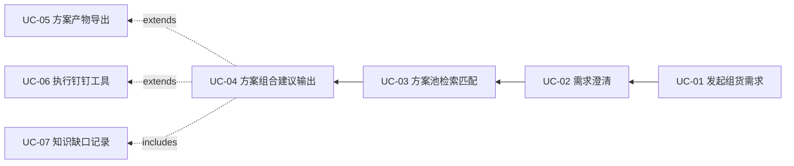
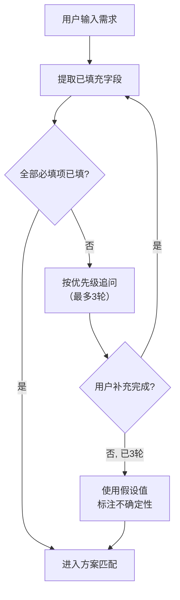
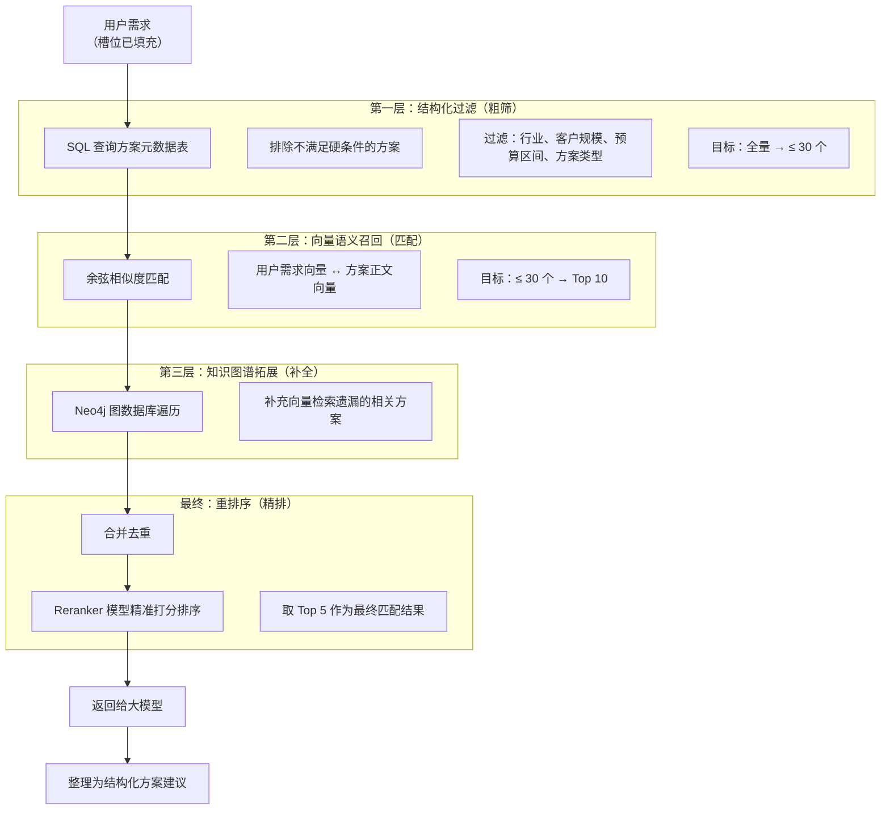
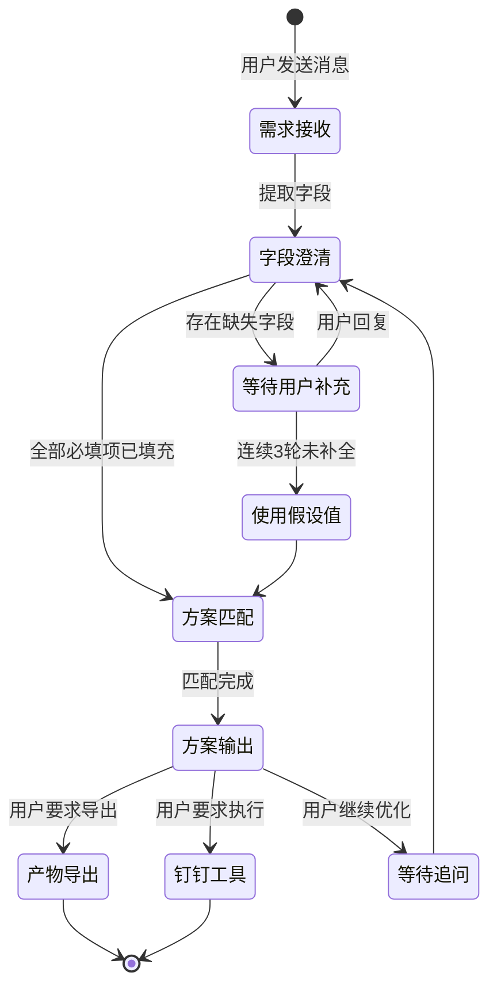

# 组货专家智能体 MVP 产品需求文档（PRD）

---

**文档版本**：v0.1（初稿）
**创建日期**：2026-06-30
**状态**：草稿

---

## 一、产品概述

### 1.1 产品背景

组货专家智能体是天马智擎平台内置的**方案中心业务专家**，面向方案中心专员与销售支持人员，解决「需求采集 → 方案匹配 → 组合输出」全流程的效率问题。

当前方案中心的痛点：
- 需求澄清依赖人工反复沟通，耗时 2-3 轮
- 方案池检索靠手工，难以覆盖全量
- 组合输出需跨系统操作，缺乏统一工具链

### 1.2 产品定位

集团内部的**组货方案专家智能体**，熟悉方案池和常见业务场景，根据客户需求自动完成「需求澄清 → 方案匹配 → 组合建议 → 产物导出」全流程。

**命名**：组货专家（即「专家模式」下默认选中的智能体）

### 1.3 目标用户

| 用户角色 | 核心诉求 |
|----------|----------|
| 方案中心专员 | 快速匹配组合方案，减少重复性沟通与手工检索 |
| 销售支持人员 | 提升方案输出效率，一键导出交付物 |
| 方案专家（后台） | 维护方案池、优化匹配效果、审核知识缺口 |

### 1.4 能力边界

**核心能力**：
- 客户需求澄清（槽位填充）
- 方案池多层检索匹配
- 组合方案建议生成
- 文档解读（上传文件自动解析）
- 钉钉工具执行（日程、待办、AI 表格等）

**边界声明**：仅基于已有方案池和知识库进行推荐与生成，不负责报价、合同或非方案范围的商务决策。

### 1.5 成功指标

| 维度 | 目标 | 衡量方式 |
|------|------|----------|
| 任务成功率 | ≥ 60% 用户完成一轮完整对话（需求澄清 → 方案初稿 → 优化） | 会话完成率 |
| 方案产出 | 100+ 次有效方案会话 | 会话总量 |
| 用户覆盖率 | 方案中心目标用户 100% 开通 | 开通率 + 登录率 |

---

## 二、用例模型

### 2.1 参与者定义

| 参与者 | 角色 | 说明 |
|--------|------|------|
| 方案中心专员 | 主要用户 | 发起组货需求，使用组货专家完成方案生成 |
| 组货专家智能体 | 系统 | 自动化执行需求澄清、方案匹配、产物生成 |
| 方案专家（后台） | 运营者 | 维护方案池、审核知识缺口、优化匹配效果 |

### 2.2 用例列表

| 编号 | 用例名称 | 主要参与者 | 优先级 |
|------|----------|-----------|--------|
| UC-01 | 发起组货需求 | 方案中心专员 | 高 |
| UC-02 | 需求澄清（槽位填充） | 方案中心专员 + 组货专家 | 高 |
| UC-03 | 方案池检索匹配 | 组货专家 | 高 |
| UC-04 | 方案组合建议输出 | 组货专家 | 高 |
| UC-05 | 方案产物导出 | 方案中心专员 | 中 |
| UC-06 | 执行钉钉工具 | 方案中心专员 + 组货专家 | 中 |
| UC-07 | 知识缺口记录 | 组货专家 | 中 |

### 2.3 用例关系



---

## 三、详细用例规格说明

### UC-01 发起组货需求

| 项目 | 内容 |
|------|------|
| **用例编号** | UC-01 |
| **用例名称** | 发起组货需求 |
| **参与者** | 方案中心专员 |
| **前置条件** | 用户已登录天马智擎，切换到「专家模式」并选中「组货专家」 |
| **后置条件** | 会话创建成功，上下文初始化完成 |
| **基本事件流** | 1. 用户在输入框中输入组货需求文字<br>2. 可选上传附件（需求文档/客户资料）<br>3. 用户按 Enter 发送<br>4. 系统校验输入非空，创建新会话<br>5. 系统初始化组货专家上下文（提示词 + 工具定义） |
| **备选事件流** | 1a. 输入为空：发送按钮置灰，前端拦截<br>2a. 附件上传失败：提示上传失败原因，允许重试<br>4a. 会话创建接口超时：自动重试 2 次，仍失败则提示 |
| **业务规则** | 附件格式仅支持 PDF/Word/Excel/PPT/TXT，单文件 ≤ 20MB |

### UC-02 需求澄清（槽位填充）

| 项目 | 内容 |
|------|------|
| **用例编号** | UC-02 |
| **用例名称** | 需求澄清（槽位填充） |
| **参与者** | 方案中心专员 + 组货专家智能体 |
| **前置条件** | UC-01 已完成，会话已创建 |
| **后置条件** | 关键字段已填充（或已使用假设值），可进入方案匹配阶段 |
| **基本事件流** | 1. 组货专家解析用户输入，提取已填充字段<br>2. 对比 5 个必填字段，找出缺失项<br>3. 按优先级逐个追问缺失字段（最多 3 轮）<br>4. 用户逐轮补充信息<br>5. 全部必填项确认后，进入方案匹配阶段 |
| **备选事件流** | 2a. 全部必填项已填充：跳过追问，直接进入方案匹配<br>3a. 连续 3 轮追问仍未补全：系统使用默认假设值，标注假设内容<br>4a. 用户输入与之前矛盾：列出矛盾点，等待用户选择以哪个为准<br>4b. 附件解析与用户描述冲突：明确标出冲突来源，让用户确认 |
| **业务规则** | 5 个必填字段详见 5.1 字段定义表；附件解析结果优先于用户口述 |

#### 追问策略

- 首轮追问最多 2 个字段，避免一次性过多问题
- 每轮追问在上一轮用户回答后立即执行
- 连续 3 轮追问仍未补全 → 给出假设方案，标注「以下字段使用假设值」
- 用户可随时主动修改已填字段，AI 实时更新匹配结果

### UC-03 方案池检索匹配

| 项目 | 内容 |
|------|------|
| **用例编号** | UC-03 |
| **用例名称** | 方案池检索匹配 |
| **参与者** | 组货专家智能体 |
| **前置条件** | UC-02 完成，必填字段已填充 |
| **后置条件** | 返回 Top 5 匹配方案，附带匹配度与适配说明 |
| **基本事件流** | 1. 组货专家将填充字段组装为检索参数<br>2. 执行三层混合召回<br>3. 合并去重 + Reranker 精排<br>4. 返回 Top 5 方案<br>5. 方案结果注入大模型上下文 |
| **备选事件流** | 2a. 无匹配结果：提示「未找到完全匹配，是否放宽条件」，用户确认后用更宽泛条件重新检索<br>2b. 仍无结果：基于通用规则给出建议，自动记录知识缺口 |
| **业务规则** | 召回机制详见 5.2；匹配结果受用户角色权限过滤 |

### UC-04 方案组合建议输出

| 项目 | 内容 |
|------|------|
| **用例编号** | UC-04 |
| **用例名称** | 方案组合建议输出 |
| **参与者** | 组货专家智能体 |
| **前置条件** | UC-03 完成，Top 5 方案已返回 |
| **后置条件** | 结构化方案建议展示给用户，右侧产物栏可选导出 |
| **基本事件流** | 1. 组货专家对 Top 5 方案进行分析与组合<br>2. 输出标准化方案建议（需求确认 → 方案推荐 → 组合建议 → SPU 清单 → 注意事项）<br>3. 方案内容以 Markdown 渲染展示在对话区<br>4. 同步推送来源引用到右侧产物栏 |
| **备选事件流** | 2a. 方案生成超时（> 60s）：已生成的方案内容正常展示，超时部分提示用户继续追问 |
| **业务规则** | 输出模板详见 6.1 |

### UC-05 方案产物导出

| 项目 | 内容 |
|------|------|
| **用例编号** | UC-05 |
| **用例名称** | 方案产物导出 |
| **参与者** | 方案中心专员 |
| **前置条件** | UC-04 完成，方案建议已生成 |
| **后置条件** | 文件生成完成，用户可下载 |
| **基本事件流** | 1. 组货专家生成方案时，自动在右侧产物栏创建导出任务<br>2. 后端异步生成文件（SSE 推送进度）<br>3. 生成完成后显示下载按钮<br>4. 用户点击下载 |
| **备选事件流** | 2a. 生成超时（> 180s）：显示重试按钮<br>2b. 模板缺失：降级为基础模板<br>3a. 下载链接过期（24h）：用户点击刷新链接 |
| **业务规则** | 支持 Excel / PPT / PDF 三种格式；导出模板预置企业风格 |

### UC-06 执行钉钉工具

| 项目 | 内容 |
|------|------|
| **用例编号** | UC-06 |
| **用例名称** | 执行钉钉工具 |
| **参与者** | 方案中心专员 + 组货专家 |
| **前置条件** | UC-04 完成 |
| **后置条件** | 钉钉操作执行成功并返回结果 |
| **基本事件流** | 1. 用户提出钉钉操作需求（如「创建日程评审方案」「把SPU清单导入AI表格」）<br>2. 组货专家识别意图，提取参数<br>3. 执行 MCP 工具调用<br>4. 返回操作结果 |
| **备选事件流** | 2a. 参数不完整：追问用户补充缺失参数<br>3a. 用户未授权钉钉工具：弹出 OAuth 授权弹窗<br>3b. 用户权限不足：提示「您的钉钉账号暂无此操作权限」<br>3c. MCP Server 不可用：降级提示「钉钉工具暂不可用」 |
| **业务规则** | 支持日程、待办、AI表格、通讯录查询、工作通知 5 类工具 |

### UC-07 知识缺口记录

| 项目 | 内容 |
|------|------|
| **用例编号** | UC-07 |
| **用例名称** | 知识缺口记录 |
| **参与者** | 组货专家智能体 |
| **前置条件** | UC-03 或 UC-04 执行过程中发现信息不足 |
| **后置条件** | 缺口记录入库，纳入方案专家待办 |
| **基本事件流** | 1. 以下任意条件触发缺口记录：<br>&emsp;- 方案匹配置信度低于阈值<br>&emsp;- AI 明确标注"不确定"<br>&emsp;- 用户点踩且选择"内容有误"<br>2. 自动记录问题 + 原因 + 优先级<br>3. 去重合并（相似度 > 80%）<br>4. 通知方案专家 |
| **业务规则** | 知识缺口每日上午 9:00 统一汇总通知 |

---

## 四、详细交互设计

### 4.1 核心执行流程：P&E（Plan-and-Execute）

组货专家采用 **P&E** 机制作为主执行框架：

1. **任务分析**：解析用户输入，识别意图和关键信息
2. **整体规划**：制定执行计划（需求澄清 → 方案检索 → 组合输出）
3. **分步执行**：按计划执行字段澄清、检索、工具调用、产物生成
4. **计划复盘**：检查执行结果完整性，识别知识缺口
5. **最终整合**：汇总结果，生成结构化方案建议


### 4.2 需求澄清流程



### 4.3 三层混合召回流程



---

## 五、数据字典

### 5.1 重点字段定义

| 字段名 | 中文名 | 数据类型 | 取值范围 | 是否必填 | 说明 |
|--------|--------|----------|----------|----------|------|
| industry | 客户所属行业 | STRING | 互联网/制造业/零售/教育/金融/医疗/其他 | 是 | 影响方案行业匹配 |
| scale | 客户规模 | ENUM | 大型/中型/小型 | 是 | 决定方案量级 |
| scenario | 核心业务场景 | STRING | 团建/福利/运动会/客户礼赠/员工表彰/其他 | 是 | 最核心的匹配维度 |
| budget_range | 预算区间 | STRING | 1-10万/10-30万/30-50万/50-100万/100万+ | 是 | 影响方案档位推荐 |
| solution_type | 方案类型偏好 | ENUM | 通用方案/专项方案/成功案例 | 是 | 缺失时给出通用建议 |
| deliverable | 交付物形式 | ENUM | Excel/PPT/PDF/文本方案 | 否 | 影响导出格式 |

### 5.2 方案池召回配置

| 层级 | 技术 | 存储 | 作用 |
|------|------|------|------|
| 结构化过滤 | SQL 查询 | MySQL（方案元数据表） | 硬条件过滤，排除不匹配 |
| 向量语义召回 | Embedding + 余弦相似度 | 向量数据库 | 语义匹配，软需求匹配 |
| 知识图谱拓展 | 图遍历查询 | Neo4j | 关联推荐，提升全面性 |
| 重排序 | Reranker 模型 | — | 精准打分，取 Top 5 |

### 5.3 输出模板

```markdown
## 一、需求确认
| 字段 | 状态 | 确认内容 |
|------|------|----------|
| 客户行业 | ✅ | 互联网 |
| 客户规模 | ✅ | 中型 |
| 业务场景 | ✅ | 员工团建 |
| 预算区间 | ✅ | 30-50万 |
| 方案类型 | ✅ | 成功案例优先 |

## 二、方案推荐
### 方案一：[方案名称]
- 所属池子：方案池名称
- 核心适配点：行业/规模/预算匹配
- 方案概要：[简述]

## 三、组合建议
| 档位 | 预算占比 | 适用人群 |
|------|----------|----------|
| 经济型 | 50% | 全员覆盖 |
| 品质型 | 35% | 核心员工 |
| 尊享型 | 15% | 高管专属 |

## 四、推荐 SPU 清单
| SPU | 品牌 | 建议数量 | 预估单价 |
|-----|------|----------|----------|

## 五、注意事项
- 库存波动请二次确认
- 定制 LOGO 需额外排期
```

> 上述字段与输出模板为初稿，后续根据业务评审与实际使用情况持续优化。

---

## 六、交互设计规范

### 6.1 对话交互

组货专家在天马智擎「专家模式」下运行，共享平台的对话 UI 框架：
- 消息流 → 支持 Markdown 渲染、方案卡片、来源引用
- P&E 过程展示 → 灰色时间线 + 工具事件行
- 右侧产物栏 → 方案导出、引用来源、知识缺口

### 6.2 异常处理

| 场景 | 用户提示 | 系统行为 |
|------|----------|----------|
| 字段澄清连续 3 轮未补全 | "为确保方案质量，以下使用假设值：[列出]" | 使用默认假设值，标注不确定性 |
| 用户输入与之前矛盾 | "您的输入与先前确认的 [字段] 不一致，以哪个为准？" | 列出矛盾点，等待用户选择 |
| 方案匹配无结果 | "未找到完全匹配的方案，是否放宽条件？" | 用户确认后用宽泛条件重新检索 |
| 方案匹配仍无结果 | 基于通用规则给出建议 | 自动记录知识缺口 |
| 钉钉工具调用超时 | "工具响应较慢，先展示已有结果" | 结果异步追补 |
| 用户未授权钉钉 | 弹出 OAuth 授权弹窗 | 引导用户完成首次授权 |

### 6.3 状态机



---

## 七、非功能需求

### 7.1 性能需求

| 指标 | 目标 |
|------|------|
| 首字响应时间 | < 3s（专家模式） |
| 方案匹配耗时 | < 5s（三层召回+精排） |
| 文件导出耗时 | < 60s（Excel/PPT/PDF） |
| P&E 工具循环超时 | > 5 轮后强制输出已有结果 |

### 7.2 数据隔离

- 方案数据携带部门 ID 标签，查询时自动过滤
- 方案池访问受 RBAC 角色权限控制
- 对话历史遵守天马智擎统一的数据冷热分离策略

### 7.3 可靠性与治理

- 方案匹配失败率超过阈值时自动告警
- 用户负反馈激增时通知管理员排查
- 所有工具调用记录写入 `tool_invocations` 表，可追溯

---

## 八、附录

### 8.1 依赖的平台能力

| 平台能力 | 说明 | 依赖关系 |
|----------|------|----------|
| 统一知识库 | 方案池文档的向量化存储与检索 | 强依赖 |
| 长期记忆 | 跨会话记住用户偏好与业务约定 | 依赖 |
| 模型网关 | 推理引擎（DeepSeek R1/V3） | 强依赖 |
| MCP 工具链 | 钉钉 API 标准化调用 | 依赖 |
| 权限体系 | RBAC 控制方案池可见范围 | 强依赖 |
| 文件解析服务 | 用户上传的附件解析 | 依赖 |
| 产物生成服务 | Excel/PPT/PDF 文件生成 | 依赖 |

### 8.2 术语表

| 术语 | 说明 |
|------|------|
| P&E | Plan-and-Execute，计划-执行机制 |
| 槽位填充 | 需求澄清过程中的关键字段提取与补全 |
| MCP | Model Context Protocol，模型上下文协议 |
| 知识缺口 | 方案匹配中发现但暂未补齐的数据或知识 |
| Reranker | 方案重排序模型，精准打分排序 |
| RBAC | 基于角色的访问控制 |
