# 天马智擎平台系统使用说明

> 适用版本：第一版 MVP（依据 2026-08-08 正式环境实测）  
> 适用对象：天马集团内部员工  
> 平台地址：https://aiwork.tianmagroup.com/chat  
> 使用原则：选对模式、给足材料、说清任务、人工复核、及时反馈

## 1. 平台定位

### 1.1 天马智擎是什么

天马智擎是公司自研的内部 AI 工作入口。本次第一版 MVP（最小可用版本）已经可以完成“登录—选择能力—提供材料—执行任务—查看结果—反馈问题”的基本操作，重点提供三个模块：

1. **天马智擎首页**：日常办公、专家智能体、文件分析、知识引用和联网查询。
2. **知识中心**：组织、处理、检索和复用经过授权的内部材料。
3. **工作台**：集中展示当前账号可访问的内部系统入口。

自研平台的主要价值是降低内部材料流向未经批准外部平台的风险，逐步连接企业知识、内部系统和钉钉协同，并把优秀业务方法沉淀为可复用能力。

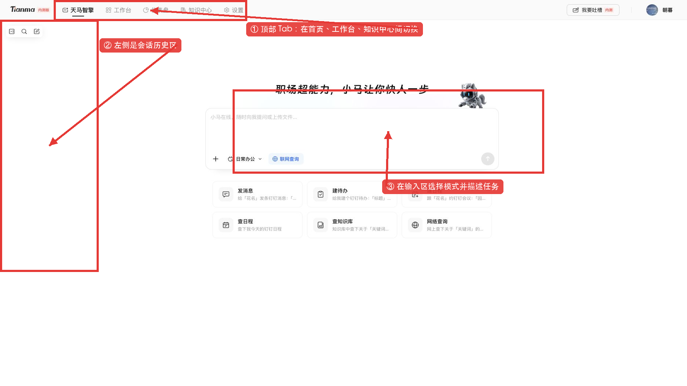

### 1.2 第一版 MVP 的正确预期

第一版 MVP 已经能够从头到尾完成主要操作，但仍可能出现以下情况：

- AI 理解偏差、遗漏条件或生成错误内容。
- 智能体执行失败、页面无响应或响应时间较长。
- 文件格式复杂导致部分内容读取不完整。
- 登录状态失效或权限数据未及时同步。
- 页面、功能名称或操作方式随版本迭代发生变化。

> **遇到错误时统一按以下顺序处理：先刷新页面重试；仍不正常，再保留时间和截图，在项目群内反馈或填写问题反馈表格。登录或权限问题第一时间联系朝暮。**

### 1.3 数据与安全要求

自研不等于可以忽略数据规范。使用平台时必须遵守以下要求：

- 不上传本人无权访问的材料。
- 不上传与当前工作任务无关的敏感数据。
- 个人信息、商业秘密等内容按公司要求脱敏后再使用。
- AI 输出不是事实保证，关键数字和结论必须回查来源。
- 涉及消息、待办、日程、审批、下单和对外承诺时，最终动作必须由责任人确认。
- 系统不会自动获得没有提供、没有授权或尚未接入的数据。

### 1.4 人员权限差异

知识库、智能体和工作台入口可能按人员、部门、岗位或业务范围授权。因此：

- 同事能看到的知识库，你不一定能看到。
- 本说明中的某个智能体，你的账号可能暂时没有。
- 不同人员看到的知识库数量、智能体卡片和系统入口可能不同。
- 看不到某项能力不一定是系统故障，首先判断是否属于正常权限差异。
- 如果某项能力适合自己的真实业务场景，可填写表格说明需求，供项目团队评估开通或后续建设。
- 如果确认自己应该有权限但仍无法使用，第一时间联系朝暮核查账号和授权。

### 1.5 登录平台

#### 1.5.1 打开平台地址

1. 建议使用公司日常办公环境中的最新版浏览器。
2. 在地址栏输入 `https://aiwork.tianmagroup.com/chat`。
3. 确认域名为 `aiwork.tianmagroup.com`，不要通过来源不明的相似链接登录。
4. 等待页面完成加载，不要连续打开多个重复页面。

#### 1.5.2 完成统一身份认证

1. 如果已有有效登录状态，系统会直接进入天马智擎首页。
2. 如果出现统一登录页面，按照页面显示的钉钉或浏览器统一认证流程完成验证。
3. 不要将验证码、登录链接或账号凭证转发给他人。
4. 登录完成后，系统会根据当前账号加载对应权限。

> 登录界面可能随统一认证服务调整，因此请以当时页面提示为准，本文不虚构具体按钮名称。

#### 1.5.3 确认登录成功

登录成功后应看到左侧会话历史区、中央任务输入区，以及顶部的“天马智擎”“工作台”“知识中心”等页面切换入口。

> **登录异常：** 先刷新页面并确认网络正常；如提示登录状态失效，按页面提示重新认证。仍无法登录时，记录发生时间、错误提示和脱敏截图，第一时间联系朝暮。

## 2. 天马智擎首页

### 2.1 首页布局与关键入口

首页是日常使用的主要入口，可以分为三部分：

1. **左侧会话历史区**：新建会话、搜索会话、打开历史会话和收起侧栏。
2. **中央任务区**：输入任务、添加附件、选择模式和发送。
3. **顶部页面切换栏**：点击“天马智擎”“工作台”“知识中心”切换页面；日常办公与专家模式、具体智能体则在首页输入区选择。

### 2.2 新建、搜索和管理会话

#### 2.2.1 新建会话

1. 开始新任务时点击左侧“新对话”。
2. 确认中央输入区进入空白会话。

> **使用提示：** 不同业务主题分别新建会话，避免旧材料和统计规则影响新任务；补充同一个任务时，继续原会话即可。

#### 2.2.2 搜索历史会话

1. 点击左侧会话搜索入口。
2. 输入业务对象、文件名或任务名称等有辨识度的关键词。
3. 在结果中确认会话标题和所属模式。
4. 点击目标会话继续工作。
5. 继续前检查旧会话的材料和统计规则是否仍然有效。

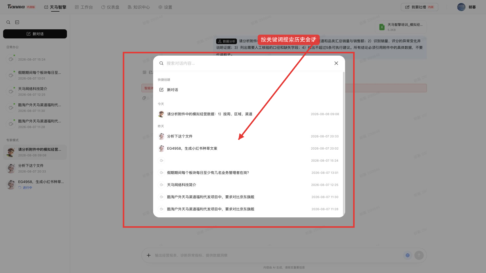

#### 2.2.3 管理会话

- 对长期保留的会话使用清晰、可搜索的名称。
- 删除会话前先保存重要答案、来源和文件产物。
- 折叠左侧边栏只改变显示，不会删除会话。
- 重新编辑旧问题可能改变后续回答，重要结论应先另行保存。

### 2.3 日常办公与专家模式

#### 2.3.1 两种模式的定位

日常办公和专家模式不是普通版与高级版，而是两条任务路径：

- **日常办公**：横向、通用、轻量，适合写作、整理、查知识、网络查询以及钉钉相关的消息、待办和日程协同。
- **专家模式**：纵向、专业、复杂，适合依赖专业方法、专属知识或固定流程的专项任务。

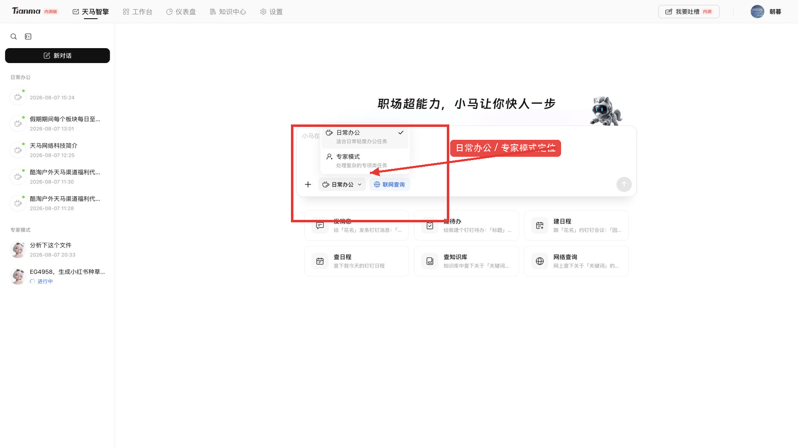

#### 2.3.2 选择模式

1. 点击输入区附近的模式入口。
2. 通用写作、整理或协同任务选择日常办公。
3. 组货、评价分析、数据分析等专项任务选择专家模式。
4. 选择后确认当前模式已经切换。

#### 2.3.3 混合任务的推荐做法

1. 先使用专家模式完成专业分析。
2. 人工核验分析结论和数据。
3. 再使用日常办公整理汇报、消息、待办或会议材料。
4. 对真实发送和执行动作进行最终确认。

> **注意：** 日常办公不能自动访问所有内部系统；专家模式也不代表结果一定正确或一定成功。两种模式的结果都要人工复核，页面中可见的模式和快捷能力也可能因账号权限不同而有所差异。

### 2.4 选择专家智能体

#### 2.4.1 查看专家列表

1. 将模式切换为专家模式。
2. 查看当前账号能够使用的专家卡片。
3. 阅读每张卡片的能力说明，不要只凭名称选择。

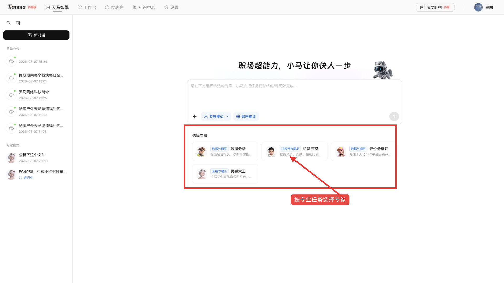

#### 2.4.2 判断是否匹配

选择前确认：

1. 智能体解决的问题是否与任务目标一致。
2. 是否具备它要求的输入材料和业务条件。
3. 输出是否能够通过原始文件、业务规则或人工抽查验证。

当前正式环境实测可见数据分析、组货专家、评价分析师和灵感大王等卡片，具体列表会随人员权限和版本变化。

#### 2.4.3 进入并确认智能体

1. 点击目标智能体卡片。
2. 检查输入区或会话顶部显示的智能体名称。
3. 阅读页面中的能力说明、示例和快捷任务。
4. 再添加材料并输入任务。

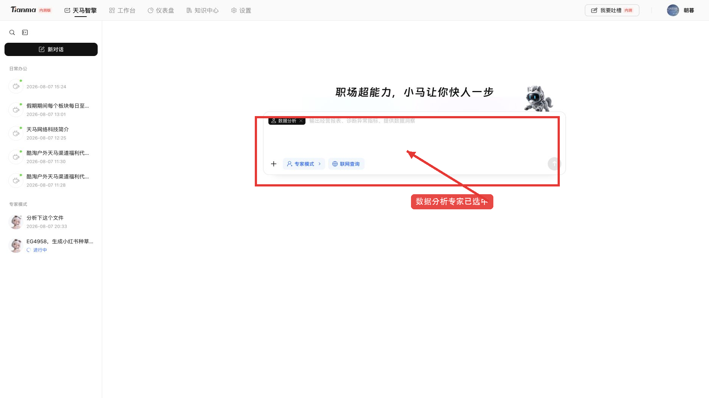

> **权限提示：** 文档中的智能体没有出现在你的页面，通常表示当前账号尚未获得权限，这是正常情况。如有适合实际工作的场景，可在反馈表格中说明业务问题、使用人员、可提供材料和期望结果；确认自己本应有权限但仍未显示时，第一时间联系朝暮。

### 2.5 上传本地文件

#### 2.5.1 首页附件限制

首页附件适合临时、少量、一次性材料。当前正式环境页面规则如下：

- 支持 PDF、DOC、DOCX、XLS、XLSX、TXT、MD。
- 单文件不超过 10MB。
- 一次最多 3 个附件。
- 首页不直接支持 CSV；CSV 优先走知识中心，或转换为 XLSX 后上传。

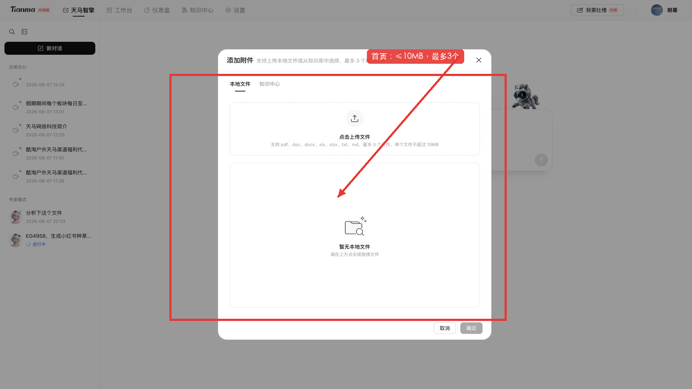

#### 2.5.2 上传文件

1. 点击输入框旁的“添加附件”。
2. 选择本地文件上传方式。
3. 在文件窗口中选择目标文件。
4. 返回输入区确认附件名称已经显示。

#### 2.5.3 发送前检查

1. 文件名和版本是否正确。
2. 是否超过 10MB 或超过 3 个附件。
3. 是否包含无关、无权限或未脱敏内容。
4. 智能体和文件是否匹配。
5. 挂错文件时先移除，再选择正确文件。

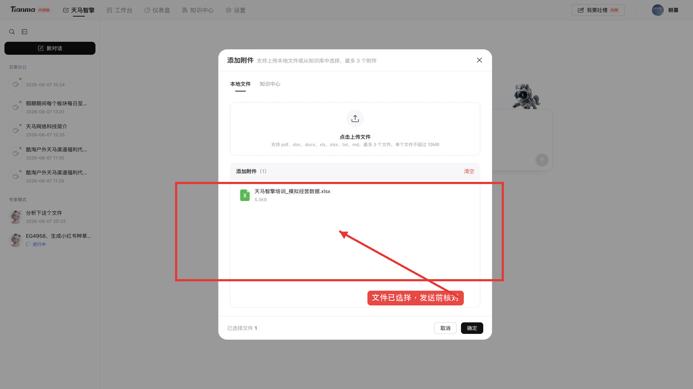

> **上传注意：** 复杂表格、合并单元格、公式和缺失字段可能影响系统读取。上传成功也不表示文件内容已经被完整、准确地读懂。失败时先检查格式、大小和数量，再刷新重试；较大、CSV 或需要长期使用的文件改从知识中心上传。仍失败时在群内或表格反馈文件格式、大小、时间和错误现象。

### 2.6 从知识中心引用文件

#### 2.6.1 打开知识文件选择器

1. 点击输入框旁的“添加附件”。
2. 将来源切换为知识中心。
3. 等待空间、知识库和文件列表加载。

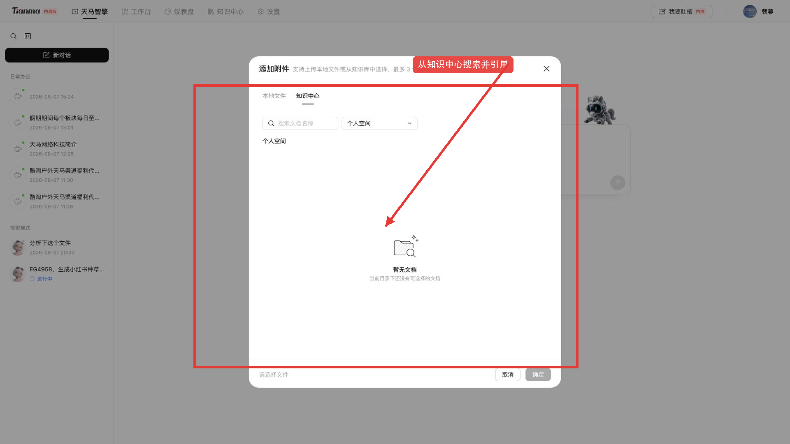

#### 2.6.2 查找并选择文件

1. 选择公共空间或个人空间。
2. 进入正确知识库和文件夹。
3. 也可以输入文档名称关键词搜索。
4. 选择已经处理成功且本人有权使用的文件。

#### 2.6.3 确认挂载

1. 返回首页输入区。
2. 确认附件名称已经显示。
3. 选择日常办公或匹配的专家智能体。
4. 写清问题后再发送。

#### 2.6.4 找不到文件的排查顺序

依次检查文件是否上传、是否处理成功、空间是否正确、知识库和文件夹是否正确、搜索关键词是否正确，以及当前账号是否有权限。

> 不同人员可见知识库不一致是正常权限控制。确有业务需要时填写需求表格；确认应有权限但无法访问时联系朝暮。

### 2.7 输入、发送和修改任务

#### 2.7.1 使用六要素写任务

建议包含：

1. **对象**：要处理什么。
2. **内容范围**：时间、组织、渠道、品类或文件范围。
3. **统计规则**：指标怎样计算、使用什么单位、遵循什么业务规则。
4. **任务**：汇总、比较、诊断、生成还是改写。
5. **输出**：表格、清单、报告、步骤或文件格式。
6. **约束**：引用材料、不得补造数字、资料不足要明示。

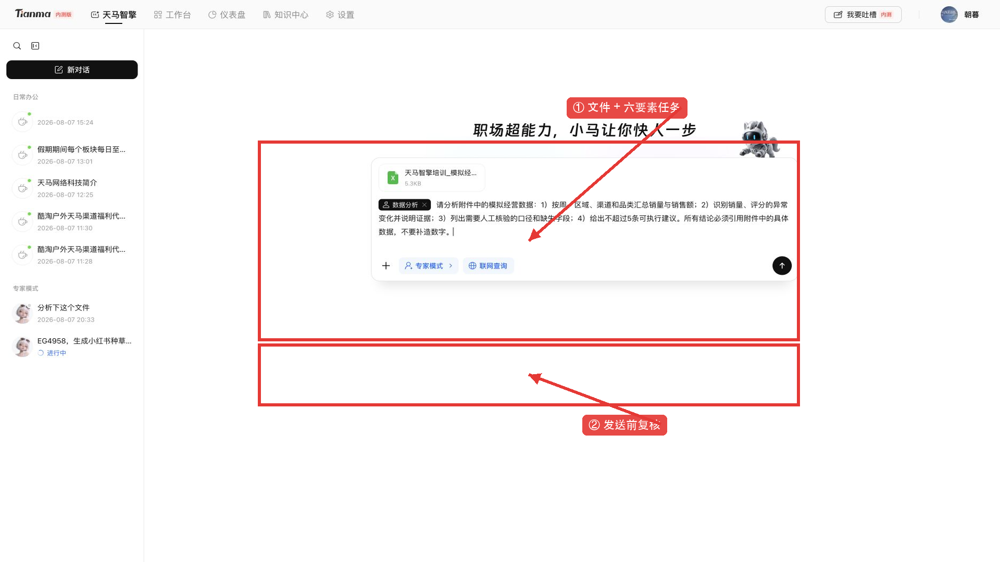

#### 2.7.2 发送前确认

1. 模式或专家是否正确。
2. 附件是否正确且可用。
3. 要处理的内容和统计规则是否清楚。
4. 输出要求是否可验证。
5. 是否包含不应上传的敏感信息。

#### 2.7.3 发送与执行

1. 点击发送。
2. 查看系统是否进入处理状态。
3. 方向明显错误时及时停止生成。
4. 系统仍在执行时不要连续重复发送相同任务。

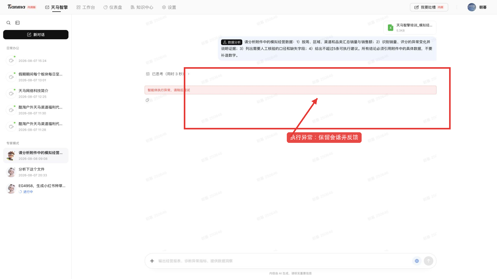

#### 2.7.4 会话详情中的通用操作

1. 点击发送后，确认自己的问题已经显示在会话中。
2. 检查问题文字、所选模式、智能体和附件是否正确。
3. 查看系统是否显示“思考中”“规划中”或“执行中”。
4. 等待当前处理结束，不要连续发送同一任务。
5. 将鼠标移到问题或回答附近，查看当前可用的复制、重新编辑、重新生成等操作。

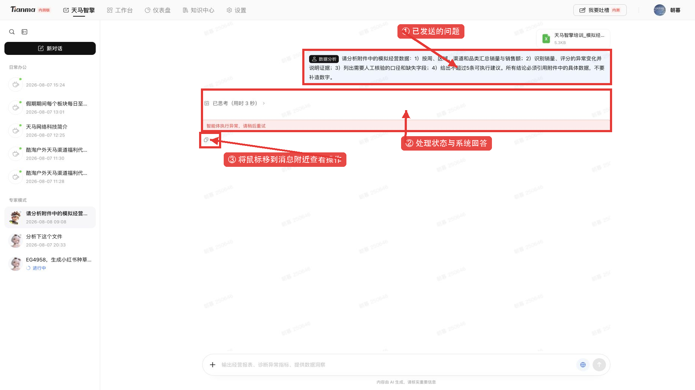

> **注意：** 页面显示哪些操作，以当前消息类型和账号权限为准。发现问题或附件选错时，应停止当前生成，再修改后发送。

#### 2.7.5 日常办公：消息上屏后的操作

1. 在发送前确认输入区显示“日常办公”。
2. 输入问题，需要时添加附件、打开联网查询，再点击发送。

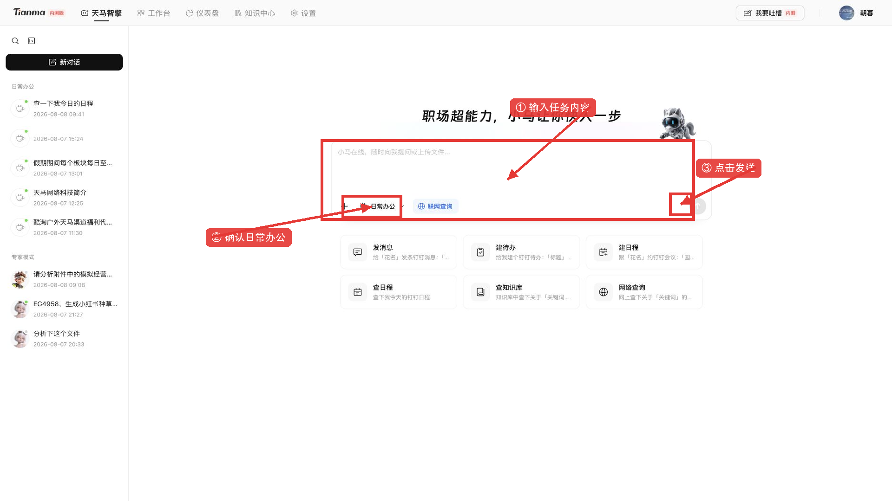

3. 问题上屏后，等待系统直接生成回答。
4. 回答完成后，先阅读全文；有来源或文件卡片时，点击查看原文或预览文件。
5. 需要补充、改写或调整格式时，在同一会话继续追问。
6. 原问题写错时，将鼠标移到原问题附近，点击“重新编辑”；修改后再次发送。
7. 原问题没有变化、但回答失败或不完整时，将鼠标移到回答附近，点击“重新生成”或“重试”。

> **提醒：** 重新编辑可能从原问题处重新执行，后续回答可能被替换。需要保留的文字或文件，请先复制或下载。

#### 2.7.6 专家模式：消息上屏后的操作

1. 确认问题中显示的是目标专家，并检查附件和任务要求。
2. 发送后等待系统生成执行计划；部分任务可能直接开始执行，以页面实际显示为准。
3. 查看计划是否包含材料读取、规则确认、分析处理、结果核验和交付物等必要步骤。
4. 系统执行时，逐项查看“等待中”“执行中”“已完成”或“失败”等状态。
5. 全部步骤完成后，再查看最终回答或文件，核对数字、依据和遗漏项。

6. 如果计划方向错误，停止执行并重新编辑原问题；如果页面提供计划调整入口，可按页面提示调整。
7. 如果出现“规划失败”或“智能体执行异常”，先刷新页面后重试一次；仍然失败时，保留截图并在群内或通过“我要吐槽”反馈。

> **注意：** 日常办公通常直接生成回答；专家模式处理复杂任务时可能先生成执行计划。专家模式不能只看最后结论，还要检查计划和每一步是否完成。

#### 2.7.7 复制、重新编辑和重新生成

1. 将鼠标移到已经发送的问题附近。
2. 需要复用原问题时点击“复制”。
3. 需要修改问题、范围、规则或输出格式时点击“重新编辑”，修改后重新发送。
4. 将鼠标移到系统回答附近。
5. 原问题不变、只需重新回答时点击“重新生成”或“重试”。
6. 复制回答后，粘贴到正式材料前进行人工修改和核验。

> **页面差异说明：** 不同模式和回答类型下，可见按钮可能不同；没有出现某个入口时，可直接在输入框继续追问，或重新编辑原问题。

### 2.8 数据分析完整流程

#### 2.8.1 准备数据

1. 明确要支持的业务决策。
2. 确认时间、组织、渠道、品类和指标范围。
3. 表格保持一行一条记录、表头明确、单位一致。
4. 清理空行、重复值、合并单元格和无关说明。
5. 对敏感字段脱敏，并确认本人拥有使用权限。

#### 2.8.2 选择数据分析专家

1. 首页切换为专家模式。
2. 点击数据分析智能体。
3. 确认页面能力说明与任务匹配。

#### 2.8.3 挂载数据文件

1. 临时、小于 10MB 且不超过 3 个的 XLSX 可以直接上传。
2. CSV、较大或需要复用的文件先进入知识中心。
3. 检查附件名称、版本和智能体。

#### 2.8.4 输入分析要求

> 请分析附件中的模拟经营数据。业务目标是识别销量与评分的异常变化；数据范围为附件全部记录；按周、区域、渠道和品类汇总销量与销售额；列出异常点及对应的数据证据；说明需要人工核验的统计规则和缺失字段；最后给出不超过 5 条可执行建议。所有结论必须引用附件中的具体数据，不要补造数字。

#### 2.8.5 查看和核验结果

重点检查总量能否复算、同比环比分母是否正确、异常是否有具体数值证据、是否把相关性写成因果，以及建议是否超出数据范围。

#### 2.8.6 正式环境实测结果

本次正式环境实测中，模拟 XLSX 能够上传和发送，但数据分析智能体返回“智能体执行异常，请稍后重试”。这说明当前版本已经具备完整操作流程，但执行过程中仍可能失败。

> **遇到执行异常：** 先刷新页面重试，再检查网络、文件、任务内容和智能体；仍失败时在群内反馈或填写表格。

> **首页使用注意：** 联网查询只查公开互联网信息，不等于访问内部系统；没有提供、授权或接入的数据不会自动出现。AI 可能出现错误或遗漏。发送消息、创建待办和日程等会真正影响他人的操作，执行前必须由本人确认。

## 3. 知识中心

### 3.1 模块定位

知识中心用于建设、管理和复用经过授权的企业知识。相对于首页临时附件，它更适合较大文件、CSV、团队共享材料和需要长期反复引用的内容。

1. 点击顶部“知识中心”页签。
2. 等待知识库列表显示。
3. 在左侧选择公共空间或个人空间，再进入目标知识库。

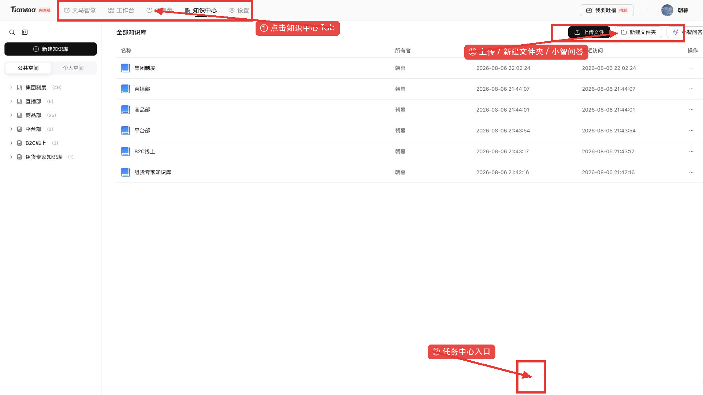

### 3.2 空间、知识库和文件夹

#### 3.2.1 选择空间

- 公共空间用于经过授权、需要团队共享的知识。
- 个人空间用于本人有权管理和使用的材料。

#### 3.2.2 组织内容

1. 知识库按稳定业务主题建立。
2. 文件夹用于进一步分类。
3. 不建议为每个临时文件单独新建知识库。
4. 上传前确认位置，避免放错空间或造成不当共享。

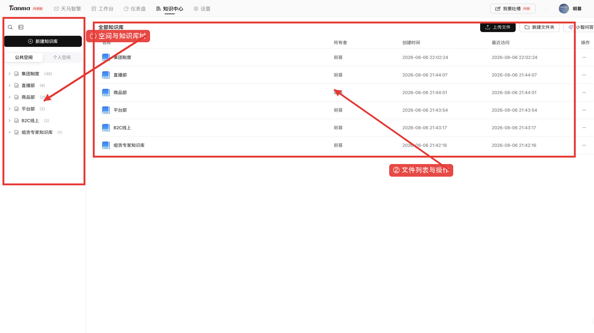

> **权限提示：** 每个人只能看到自己已获授权的知识库和文件，因此你和同事看到的内容可能不同。确有业务需要时填写反馈表格；确认本应有权限但无法访问时，第一时间联系朝暮。

### 3.3 上传知识文件

#### 3.3.1 打开上传入口

1. 进入目标空间、知识库和文件夹。
2. 点击“上传文件”。
3. 选择目标文件并确认。

#### 3.3.2 文件限制

当前正式环境页面规则如下：

- 支持 PDF、DOC、DOCX、XLS、XLSX、CSV、TXT、MD。
- 单文件不超过 50MB。
- 单次最多 100 个。
- 具体限制以发版当日页面提示为准。

#### 3.3.3 等待处理成功

1. 上传后返回文件列表。
2. 查看文件处理状态。
3. 只有显示处理成功或当前版本对应的可用状态后，再进行问答或首页引用。
4. 上传完成不等于文件内容已经读取完成，处理中的文件不要急于使用。

> **上传注意：** 文件上传完成不等于已经可以使用，必须等待文件显示“处理成功”或当前版本中代表可用的状态。上传失败时先检查格式、大小和文件本身是否损坏，再刷新重试；长时间没有完成时，记录文件名、大小、上传时间和状态截图后反馈。

### 3.4 搜索和预览知识文件

1. 使用搜索定位知识库、文件夹或文件。
2. 点击文件预览内容和基本信息。
3. 检查文件名称、版本和处理状态是否正确。
4. 使用文件中的结论前，回到原文核对制度、数字和关键表述。

### 3.5 使用小智问答

小智问答适合直接围绕知识中心里的材料提问，例如查找制度条款、归纳文件要点或比较多个已打开文件。

#### 3.5.1 打开小智问答

1. 进入知识中心，并确认当前所在空间和知识库。
2. 如需围绕某个文件提问，先找到并打开该文件。
3. 点击页面右上方“小智问答”。
4. 确认右侧出现“小智问答”窗口。

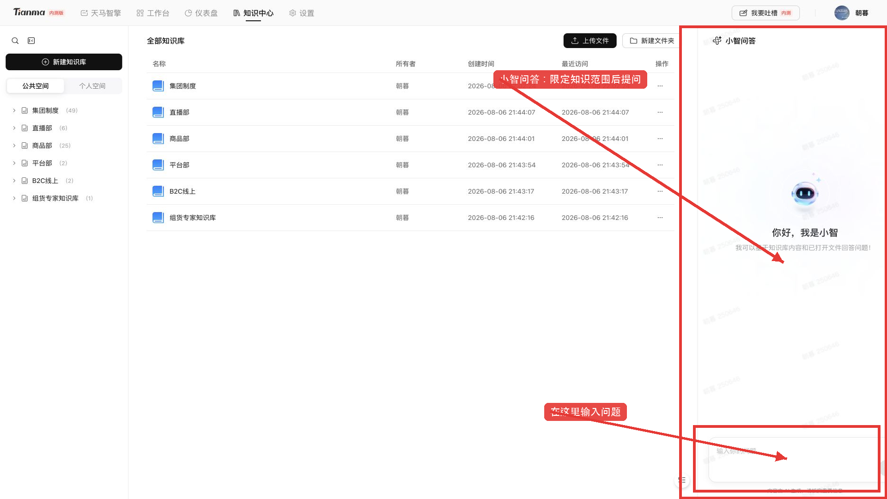

#### 3.5.2 输入问题并核对答案

1. 在右侧输入框中写问题。
2. 说明要查询的知识库或文件、时间范围，以及希望得到的结果形式。
3. 示例：“请根据已打开的制度文件，列出报销申请所需材料，并标注对应章节；找不到的内容请明确说明。”
4. 发送后查看回答，并回到原文件核对重要条款、数字和结论。

> **小智使用注意：** 小智只能根据你有权限查看的知识库内容和已打开文件回答。回答由 AI 生成，请核实重要信息；材料中没有依据时，不要要求系统猜测或补写。

### 3.6 查看任务中心

任务中心用于查看知识文件的上传任务和处理情况。

#### 3.6.1 打开任务中心

1. 在知识中心页面找到右下角的任务中心按钮。
2. 点击按钮，右侧会打开“任务中心”面板。

#### 3.6.2 查看或继续上传

1. 有上传任务时，在面板中查看正在进行或已经结束的任务。
2. 没有任务时，页面会显示“暂无上传任务”。
3. 如需继续上传，可点击面板中的“上传文件”。
4. 清除已结束任务前，先确认不再需要查看相关记录。

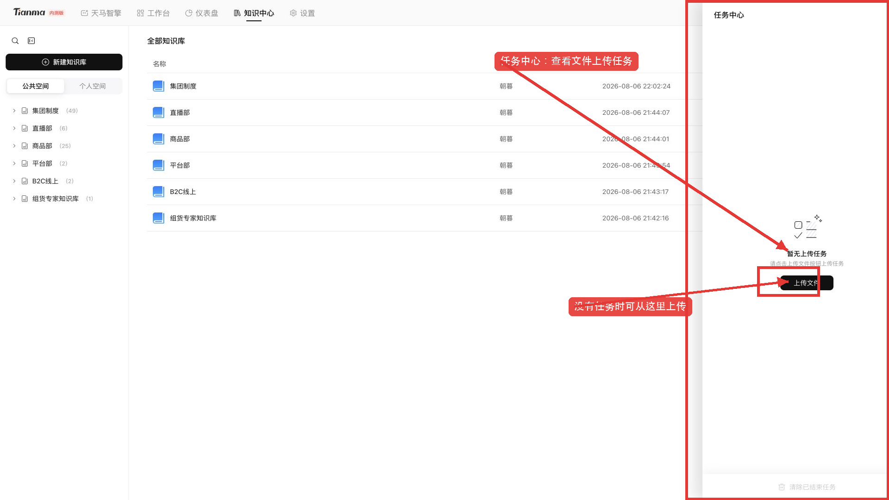

> **任务中心注意：** 显示上传任务已经结束，不一定代表文件内容已经处理成功；仍要回到文件列表确认文件是否处于可用状态。

### 3.7 知识中心与首页的完整使用流程

1. 在知识中心选择正确位置。
2. 上传文件。
3. 等待文件处理成功。
4. 返回首页点击添加附件。
5. 切换到知识中心并选择文件。
6. 选择日常办公或匹配专家。
7. 写清任务、发送并人工复核。

> **知识中心使用注意：** 文件处理成功也不保证复杂表格、公式和数字都能被完整读取。删除或批量操作前必须确认对象和影响范围。页面无响应时先刷新重试；找不到文件时依次检查空间、知识库、文件夹、文件名、处理状态和账号权限。

## 4. 工作台

### 4.1 模块定位

工作台是内部系统统一入口，不是面向普通员工开放的智能体创建、派发和跟踪平台。

> “看见系统入口”“能够打开系统”“拥有业务操作权限”“首页 AI 能够调用该系统”是四个不同层级，不能混为一谈。

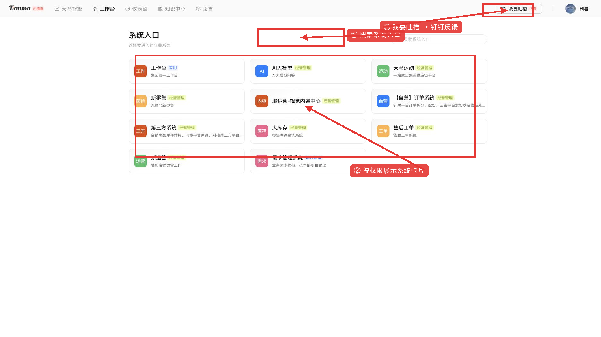

### 4.2 进入和搜索系统

#### 4.2.1 进入工作台

1. 点击平台导航中的工作台。
2. 等待当前账号可见的系统卡片加载。
3. 本次测试账号正式环境实测可见 11 个入口，其他人员可能不同。

#### 4.2.2 搜索并打开系统

1. 在搜索框输入系统名称关键词。
2. 核对系统名称和用途说明。
3. 点击目标系统入口。
4. 已接入统一认证的系统可能免登；未接入或状态失效时可能需要再次登录。

> **工作台使用注意：** 系统入口随账号权限和管理员设置而变化，同事能看到的入口你不一定能看到。看见入口不等于拥有目标系统的业务权限，也不代表首页智能体已经能够直接操作该系统。卡片未显示或入口打不开时先刷新重试；确认本应有权限时联系朝暮，其他问题可在项目群或反馈表格中说明。

## 5. 问题反馈

### 5.1 反馈前先做什么

平台当前是第一版 MVP。出现错误时不要立即重复提交很多次，也不要直接删除会话。请按以下顺序处理：

1. 保留当前会话和页面。
2. 记录发生时间和正在执行的任务。
3. **先刷新页面重试。**
4. 检查网络、模式、智能体、附件、文件状态和任务复杂度。
5. 缩小范围或简化任务后再试一次。
6. 仍然失败时，在项目群内反馈或填写问题反馈表格。

### 5.2 在项目群内反馈

建议提供：

1. 姓名或账号、部门。
2. 发生时间。
3. 当时使用的页面、模式或智能体。
4. 可复现的操作步骤。
5. 期望结果和实际结果。
6. 会话地址。
7. 脱敏后的错误截图。
8. 文件格式、大小和处理状态，不要直接发送敏感原文件。

### 5.3 填写问题反馈表格

1. 点击平台“我要吐槽”。
2. 系统通常会调用钉钉并打开反馈链接或表格。
3. 在表格中填写业务场景、操作步骤、期望结果和实际结果。
4. 附上发生时间、影响范围和脱敏截图。
5. 新需求应说明适用人员、使用频率、可提供材料、期望结果和业务价值。

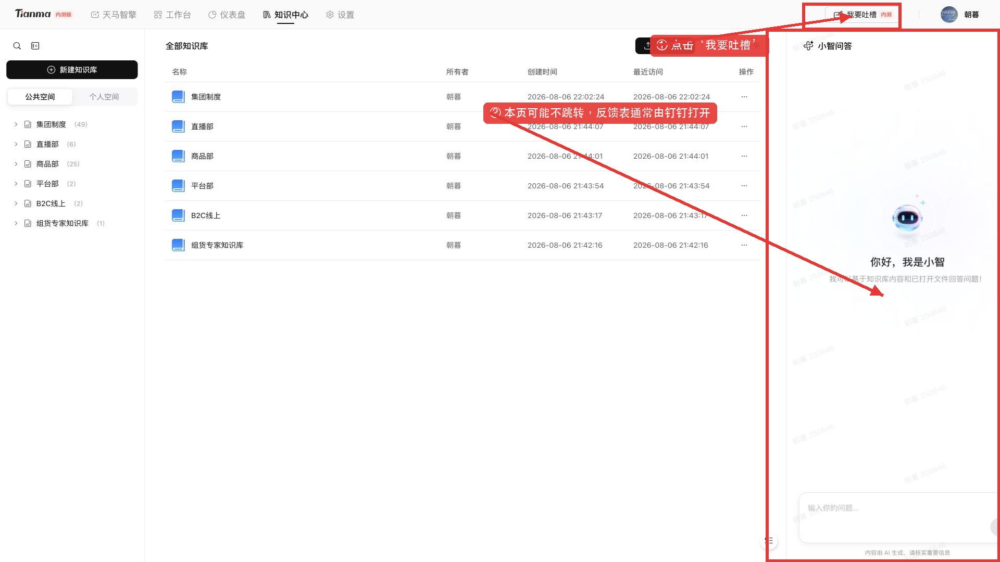

> **反馈跳转提示：** 正式环境实测时，点击“我要吐槽”后浏览器本页保持不变，反馈表通常由钉钉客户端打开。如果没有唤起钉钉，不要连续反复点击；请先确认钉钉已打开，也可直接在项目群反馈或打开指定反馈表格。

### 5.4 登录和权限问题联系朝暮

以下问题第一时间联系朝暮：

- 无法登录平台。
- 登录后反复跳回认证页面。
- 登录账号或人员身份明显错误。
- 确认应该拥有某个知识库、智能体或系统入口权限，但页面没有显示。
- 已收到开通通知，但刷新和重新登录后仍无法使用。

### 5.5 新业务需求反馈

如果想到适合实际工作的业务场景，即使系统当前没有对应功能，也可以填写表格，建议说明：

- 当前业务问题和现有处理方式。
- 适用部门和使用人员。
- 预计使用频率。
- 能够提供的输入数据或知识。
- 期望系统输出什么。
- 预计节省的时间或产生的业务价值。

### 5.6 正向反馈

正向反馈同样重要。请告诉项目团队：

- 哪个真实场景使用成功。
- 原来需要多长时间，现在节省了多少时间。
- 哪种提示词、材料或流程效果最好。
- 哪项能力值得扩展到更多人员或部门。

## 6. 常见问题

### 6.1 登录与权限

#### Q1：无法登录怎么办？

先刷新页面并重新打开正式地址；按提示重新认证后仍失败，保留时间和截图，第一时间联系朝暮。

#### Q2：为什么我看不到文档中的智能体？

不同人员的智能体权限可能不同，这通常是正常现象。确有业务需求时填写表格；确认应有权限但未显示时联系朝暮。

#### Q3：为什么我看不到同事使用的知识库？

知识库按人员、部门或业务范围授权。检查空间和位置后，如属于新增需求则填写表格；确认应有权限时联系朝暮。

#### Q4：为什么我和同事看到的工作台入口不同？

工作台系统入口随账号权限和管理员配置变化。看见入口也不代表拥有目标系统的全部业务权限。

### 6.2 首页和文件

#### Q5：什么时候用日常办公，什么时候用专家模式？

通用写作、查询和钉钉协同用日常办公；依赖专业方法、专属知识或固定流程的任务用专家模式。

#### Q6：首页为什么上传不了 CSV 或大文件？

首页当前支持 PDF、DOC、DOCX、XLS、XLSX、TXT、MD，单文件不超过 10MB、最多 3 个。CSV、较大或需要复用的文件走知识中心。

#### Q7：为什么知识文件选不到？

依次检查文件是否处理成功、空间、知识库、文件夹、文件名和账号权限。

#### Q8：重新编辑和重新生成有什么区别？

重新编辑用于修改原问题；重新生成或重试是在输入不变时再次执行。重新编辑后，后续回答可能发生变化。

#### Q9：为什么日常办公没有执行计划，专家模式有？

两种模式的处理方式不同。日常办公通常直接生成回答并展示来源；专家模式处理复杂任务时，可能先生成执行计划，再逐步执行并展示步骤状态。部分专家任务会直接进入执行，具体以当前页面和智能体能力为准。

### 6.3 结果和异常

#### Q10：页面卡住或智能体执行失败怎么办？

先刷新重试，再检查网络、文件、权限和任务范围。仍失败时在群内反馈或填写表格。

#### Q11：AI 结果可以直接发给客户或领导吗？

不可以默认直接使用。必须核验数字、事实、对象、时间和措辞，并由业务责任人确认。

#### Q12：数据分析结果怎样核验？

回到原表复算总量、平均值、同比、环比和占比，检查异常是否有具体证据，确认系统没有把相关性写成因果关系。

#### Q13：有适合实际工作的需求怎么办？

通过“我要吐槽”进入钉钉表格，说明业务问题、使用人员、当前做法、输入、期望输出、频率和价值。

#### Q14：小智问答为什么没有找到我想要的内容？

先确认自己有权查看对应知识库，并确认文件已经处理成功；如果围绕某个文件提问，先打开正确文件。提问时写清文件名称、时间范围和希望得到的结果，并回到原文核对答案。

#### Q15：任务中心显示任务结束，为什么文件还不能使用？

任务结束可能只表示上传步骤已经结束，还需要回到文件列表确认文件是否已经处理成功。长时间不可用时，刷新重试并保留文件名、上传时间和状态截图后反馈。

### 6.4 一页式检查清单

#### 使用前

- 使用正式平台地址。
- 确认网络和统一认证正常。
- 登录或权限问题联系朝暮。

#### 发送前

- 选对模式和智能体。
- 挂载正确、有权限的文件。
- 写清对象、内容范围、统计规则、任务、输出和约束。
- 不上传无权限或未脱敏数据。

#### 结果出来后

- 核验来源和数字。
- 检查是否遗漏条件。
- 对外动作由责任人确认。
- 保存需要复用的结果和文件。

#### 发生异常后

- 先刷新重试。
- 再检查网络、文件、权限和任务范围。
- 仍不正常就在群内反馈或填写表格。
- 登录和权限问题第一时间联系朝暮。
